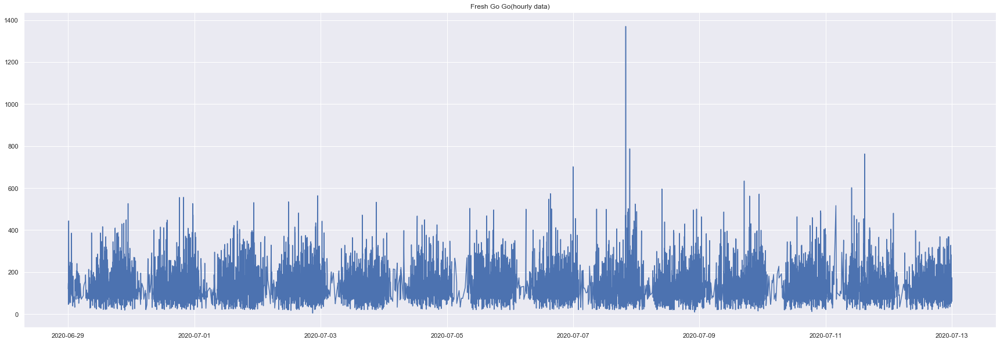
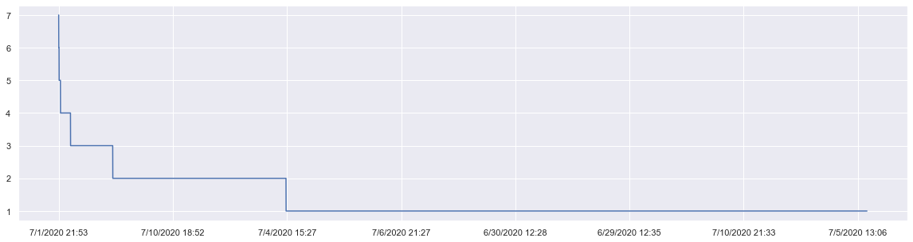
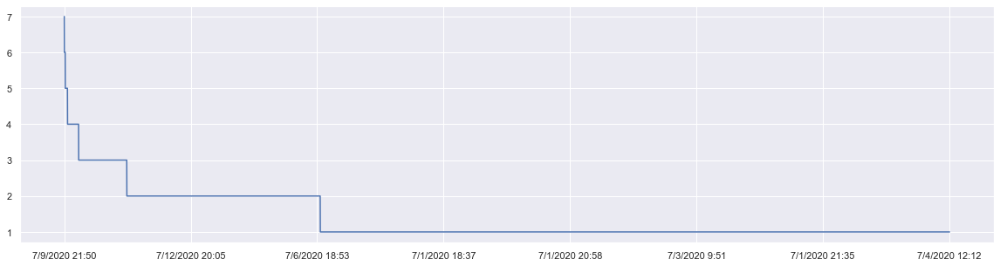

# FreshGoGo Two Months Sales DataSet Analytic 

案例背景：現有超市購物中心客戶的一些基本數據，如客戶ID,消費金額,訂購金額,訂購時間.
需要解决问题：利用现有资料，划分不同客户类型，以便可以了解哪些客户为超市优质客户，并向营销团队提供意见。
1.Python模型跟數據導入
2.兩種資料格式合併與資料處理
3.最佳商品分析分析
4.銷售時間點分析
5.客單量分析

# 1.1 Python模型跟數據導入

使用的庫主要有：pandas、numpy、matplotlib、seaborn
使用的數據集：
Order+data+20200629-20200712.csv
Order+data+20200713-20200726.csv
xiaoshouliushui20200629-0712.xlsx
xiaoshouliushui20200713-0726.xlsx


```python
import numpy as np                               # 向量和矩阵运算
import pandas as pd                              # 表格与数据处理
import matplotlib.pyplot as plt                  # 绘图
import seaborn as sns                            # 更多绘图功能
sns.set()

from dateutil.relativedelta import relativedelta # 日期数据处理
from scipy.optimize import minimize              # 优化函数

import statsmodels.formula.api as smf            # 数理统计
import statsmodels.tsa.api as smt
import statsmodels.api as sm
import scipy.stats as scs

from itertools import product                    # 一些有用的函数
from tqdm import tqdm_notebook
```

# 1.2 數據導入並讀取訂單資料
#Data import and read order information

數據導入並讀取 csv 訂單資料


```python
#Sales 20200629-0712 as file 1
#Sales 20200713-0726 as file 2
file1=open(r"/Users/annettechiu/Desktop/FreshGoGo/Order+data+20200629-20200712.csv",encoding='utf-8')
file2=open(r"/Users/annettechiu/Desktop/FreshGoGo/Order+data+20200713-20200726.csv",encoding='utf-8')
freshgogo1 = pd.read_csv(file1)
freshgogo2 = pd.read_csv(file2)
```

數據導入並讀取訂單資料（讀取六月跟七月的訂單的產品內容）


```python
#Sales with product information 20200629-0712 as file 3
#Sales with product information 20200713-0726 as file 4
files3 = pd.read_excel('/Users/annettechiu/Desktop/FreshGoGo/xiaoshouliushui20200629-0712.xlsx')
files4 = pd.read_excel('/Users/annettechiu/Desktop/FreshGoGo/xiaoshouliushui20200713-0726.xlsx')
#freshgogo1 = pd.read_excel(file3)
#freshgogo2 = pd.read_excel(file4)
files3.head(2)
```


<div>
<style scoped>
    .dataframe tbody tr th:only-of-type {
        vertical-align: middle;
    }

    .dataframe tbody tr th {
        vertical-align: top;
    }

    .dataframe thead th {
        text-align: right;
    }
</style>
<table border="1" class="dataframe">
  <thead>
    <tr style="text-align: right;">
      <th></th>
      <th>下单日期</th>
      <th>订单号</th>
      <th>送货日期</th>
      <th>用户ID</th>
      <th>供应商</th>
      <th>SKU ID</th>
      <th>商品名称（中文）</th>
      <th>商品名称（英文）</th>
      <th>税类</th>
      <th>订购数量</th>
      <th>商品单价</th>
      <th>税金</th>
      <th>总价</th>
    </tr>
  </thead>
  <tbody>
    <tr>
      <th>0</th>
      <td>2020-06-29</td>
      <td>1594699128</td>
      <td>2020-07-16</td>
      <td>55586018823</td>
      <td>自营冻品分拣</td>
      <td>12095</td>
      <td>加拿大龙岗走地鸡(冷冻)(拼团)(*)</td>
      <td>NaN</td>
      <td>Other Categories</td>
      <td>5</td>
      <td>23.99</td>
      <td>0.0</td>
      <td>119.95</td>
    </tr>
    <tr>
      <th>1</th>
      <td>2020-06-29</td>
      <td>1598776640</td>
      <td>2020-07-02</td>
      <td>58991718899</td>
      <td>自营批发蔬菜</td>
      <td>11001</td>
      <td>芫茜(香菜)</td>
      <td>NaN</td>
      <td>Grocery</td>
      <td>1</td>
      <td>1.29</td>
      <td>0.0</td>
      <td>1.29</td>
    </tr>
  </tbody>
</table>
</div>


```python
freshgogo1.head(2)
```


<div>
<style scoped>
    .dataframe tbody tr th:only-of-type {
        vertical-align: middle;
    }

    .dataframe tbody tr th {
        vertical-align: top;
    }

    .dataframe thead th {
        text-align: right;
    }
</style>
<table border="1" class="dataframe">
  <thead>
    <tr style="text-align: right;">
      <th></th>
      <th>Order Number</th>
      <th>Order Time</th>
      <th>Cust ID</th>
      <th>Delivery Date</th>
      <th>订单投诉</th>
      <th>Status</th>
      <th>Total Price</th>
      <th>Payment</th>
      <th>Voucher Discount</th>
      <th>Voucher</th>
      <th>...</th>
      <th>Customer Service</th>
      <th>OS of App</th>
      <th>Unnamed: 17</th>
      <th>冷链包装费</th>
      <th>支付宝手续费</th>
      <th>会员券</th>
      <th>配送费</th>
      <th>到家/自提</th>
      <th>班次</th>
      <th>服务费</th>
    </tr>
  </thead>
  <tbody>
    <tr>
      <th>0</th>
      <td>1594699128</td>
      <td>6/29/2020 0:00</td>
      <td>55586018823</td>
      <td>7/16/2020</td>
      <td>NaN</td>
      <td>已送达</td>
      <td>119.95</td>
      <td>信用卡支付</td>
      <td>NaN</td>
      <td>NaN</td>
      <td>...</td>
      <td>NaN</td>
      <td>ios</td>
      <td>2.3.0</td>
      <td>1.5</td>
      <td>NaN</td>
      <td>0</td>
      <td>0.00</td>
      <td>自提</td>
      <td>NY</td>
      <td>0</td>
    </tr>
    <tr>
      <th>1</th>
      <td>1598776640</td>
      <td>6/29/2020 0:03</td>
      <td>58991718899</td>
      <td>7/2/2020</td>
      <td>NaN</td>
      <td>已送达</td>
      <td>147.34</td>
      <td>信用卡支付</td>
      <td>NaN</td>
      <td>NaN</td>
      <td>...</td>
      <td>NaN</td>
      <td>ios</td>
      <td>2.3.0</td>
      <td>1.5</td>
      <td>NaN</td>
      <td>0</td>
      <td>6.99</td>
      <td>到家</td>
      <td>NY</td>
      <td>0</td>
    </tr>
  </tbody>
</table>
<p>2 rows × 25 columns</p>
</div>


```python
freshgogo2.head(2)
```


<div>
<style scoped>
    .dataframe tbody tr th:only-of-type {
        vertical-align: middle;
    }

    .dataframe tbody tr th {
        vertical-align: top;
    }

    .dataframe thead th {
        text-align: right;
    }
</style>
<table border="1" class="dataframe">
  <thead>
    <tr style="text-align: right;">
      <th></th>
      <th>Order Number</th>
      <th>Order Time</th>
      <th>用户ID</th>
      <th>Delivery Date</th>
      <th>订单投诉</th>
      <th>Status</th>
      <th>Total Price</th>
      <th>Payment</th>
      <th>Voucher Discount</th>
      <th>Voucher</th>
      <th>...</th>
      <th>Customer Service</th>
      <th>OS of App</th>
      <th>Unnamed: 17</th>
      <th>冷链包装费</th>
      <th>支付宝手续费</th>
      <th>会员券</th>
      <th>配送费</th>
      <th>到家/自提</th>
      <th>班次</th>
      <th>服务费</th>
    </tr>
  </thead>
  <tbody>
    <tr>
      <th>0</th>
      <td>1601116468</td>
      <td>7/13/2020 0:00</td>
      <td>58351892017</td>
      <td>7/22/2020</td>
      <td>NaN</td>
      <td>已送达</td>
      <td>118.18</td>
      <td>信用卡支付</td>
      <td>NaN</td>
      <td>NaN</td>
      <td>...</td>
      <td>R-商品变质</td>
      <td>ios</td>
      <td>2.3.1</td>
      <td>1.5</td>
      <td>NaN</td>
      <td>5</td>
      <td>0.0</td>
      <td>自提</td>
      <td>DC</td>
      <td>0</td>
    </tr>
    <tr>
      <th>1</th>
      <td>1602472924</td>
      <td>7/13/2020 0:01</td>
      <td>55085937222</td>
      <td>7/18/2020</td>
      <td>NaN</td>
      <td>已送达</td>
      <td>298.84</td>
      <td>余额支付</td>
      <td>NaN</td>
      <td>NaN</td>
      <td>...</td>
      <td>NaN</td>
      <td>ios</td>
      <td>2.3.1</td>
      <td>1.5</td>
      <td>NaN</td>
      <td>5</td>
      <td>0.0</td>
      <td>自提</td>
      <td>OT</td>
      <td>0</td>
    </tr>
  </tbody>
</table>
<p>2 rows × 25 columns</p>
</div>


# 2.1 將兩個月的銷售數據還有訂單內容合併

使用Concat函式將兩個月的訂單資訊合併


```python
frames = [freshgogo1, freshgogo2]
Result = pd.concat(frames)
```


```python
Result.head(2)
```


<div>
<style scoped>
    .dataframe tbody tr th:only-of-type {
        vertical-align: middle;
    }

    .dataframe tbody tr th {
        vertical-align: top;
    }

    .dataframe thead th {
        text-align: right;
    }
</style>
<table border="1" class="dataframe">
  <thead>
    <tr style="text-align: right;">
      <th></th>
      <th>Order Number</th>
      <th>Order Time</th>
      <th>Cust ID</th>
      <th>Delivery Date</th>
      <th>订单投诉</th>
      <th>Status</th>
      <th>Total Price</th>
      <th>Payment</th>
      <th>Voucher Discount</th>
      <th>Voucher</th>
      <th>...</th>
      <th>OS of App</th>
      <th>Unnamed: 17</th>
      <th>冷链包装费</th>
      <th>支付宝手续费</th>
      <th>会员券</th>
      <th>配送费</th>
      <th>到家/自提</th>
      <th>班次</th>
      <th>服务费</th>
      <th>用户ID</th>
    </tr>
  </thead>
  <tbody>
    <tr>
      <th>0</th>
      <td>1594699128</td>
      <td>6/29/2020 0:00</td>
      <td>5.558602e+10</td>
      <td>7/16/2020</td>
      <td>NaN</td>
      <td>已送达</td>
      <td>119.95</td>
      <td>信用卡支付</td>
      <td>NaN</td>
      <td>NaN</td>
      <td>...</td>
      <td>ios</td>
      <td>2.3.0</td>
      <td>1.5</td>
      <td>NaN</td>
      <td>0</td>
      <td>0.00</td>
      <td>自提</td>
      <td>NY</td>
      <td>0</td>
      <td>NaN</td>
    </tr>
    <tr>
      <th>1</th>
      <td>1598776640</td>
      <td>6/29/2020 0:03</td>
      <td>5.899172e+10</td>
      <td>7/2/2020</td>
      <td>NaN</td>
      <td>已送达</td>
      <td>147.34</td>
      <td>信用卡支付</td>
      <td>NaN</td>
      <td>NaN</td>
      <td>...</td>
      <td>ios</td>
      <td>2.3.0</td>
      <td>1.5</td>
      <td>NaN</td>
      <td>0</td>
      <td>6.99</td>
      <td>到家</td>
      <td>NY</td>
      <td>0</td>
      <td>NaN</td>
    </tr>
  </tbody>
</table>
<p>2 rows × 26 columns</p>
</div>


```python
Result.to_pickle('/Users/annettechiu/Desktop/FreshGoGo/Order+data+20200629-20200726.csv')
```


```python
Result.info()
```

    <class 'pandas.core.frame.DataFrame'>
    Int64Index: 24050 entries, 0 to 11955
    Data columns (total 26 columns):
     #   Column            Non-Null Count  Dtype  
    ---  ------            --------------  -----  
     0   Order Number      24050 non-null  int64  
     1   Order Time        24050 non-null  object 
     2   Cust ID           12094 non-null  float64
     3   Delivery Date     24050 non-null  object 
     4   订单投诉              1035 non-null   object 
     5   Status            24050 non-null  object 
     6   Total Price       24050 non-null  float64
     7   Payment           24050 non-null  object 
     8   Voucher Discount  705 non-null    float64
     9   Voucher           705 non-null    object 
     10  Coupon Discount   54 non-null     float64
     11  Coupon            54 non-null     object 
     12  Tax Price         24050 non-null  float64
     13  Final Price       24050 non-null  float64
     14  Refund            12761 non-null  float64
     15  Customer Service  1514 non-null   object 
     16  OS of App         24050 non-null  object 
     17  Unnamed: 17       17992 non-null  object 
     18  冷链包装费             21136 non-null  float64
     19  支付宝手续费            1539 non-null   float64
     20  会员券               24050 non-null  int64  
     21  配送费               24050 non-null  float64
     22  到家/自提             24050 non-null  object 
     23  班次                24050 non-null  object 
     24  服务费               24050 non-null  int64  
     25  用户ID              11956 non-null  float64
    dtypes: float64(11), int64(3), object(12)
    memory usage: 5.0+ MB


```python
Result.isnull().sum(axis=0)
```


    Order Number            0
    Order Time              0
    Cust ID             11956
    Delivery Date           0
    订单投诉                23015
    Status                  0
    Total Price             0
    Payment                 0
    Voucher Discount    23345
    Voucher             23345
    Coupon Discount     23996
    Coupon              23996
    Tax Price               0
    Final Price             0
    Refund              11289
    Customer Service    22536
    OS of App               0
    Unnamed: 17          6058
    冷链包装费                2914
    支付宝手续费              22511
    会员券                     0
    配送费                     0
    到家/自提                   0
    班次                      0
    服务费                     0
    用户ID                12094
    dtype: int64


# 將資料重新命名


```python
Result.rename(columns={"订单投诉":"complaint","会员券":"membership","配送费":"delivery_fee","到家/自提":"Delivery/Pick_up"},inplace=True)
```

# 2.2 將兩個月的產品銷售數據訂單合併


```python
frames2 = [files3, files4]
Product = pd.concat(frames2)
Product.head(2)
```


<div>
<style scoped>
    .dataframe tbody tr th:only-of-type {
        vertical-align: middle;
    }

    .dataframe tbody tr th {
        vertical-align: top;
    }

    .dataframe thead th {
        text-align: right;
    }
</style>
<table border="1" class="dataframe">
  <thead>
    <tr style="text-align: right;">
      <th></th>
      <th>下单日期</th>
      <th>订单号</th>
      <th>送货日期</th>
      <th>用户ID</th>
      <th>供应商</th>
      <th>SKU ID</th>
      <th>商品名称（中文）</th>
      <th>商品名称（英文）</th>
      <th>税类</th>
      <th>订购数量</th>
      <th>商品单价</th>
      <th>税金</th>
      <th>总价</th>
    </tr>
  </thead>
  <tbody>
    <tr>
      <th>0</th>
      <td>2020-06-29</td>
      <td>1594699128</td>
      <td>2020-07-16</td>
      <td>55586018823</td>
      <td>自营冻品分拣</td>
      <td>12095</td>
      <td>加拿大龙岗走地鸡(冷冻)(拼团)(*)</td>
      <td>NaN</td>
      <td>Other Categories</td>
      <td>5</td>
      <td>23.99</td>
      <td>0.0</td>
      <td>119.95</td>
    </tr>
    <tr>
      <th>1</th>
      <td>2020-06-29</td>
      <td>1598776640</td>
      <td>2020-07-02</td>
      <td>58991718899</td>
      <td>自营批发蔬菜</td>
      <td>11001</td>
      <td>芫茜(香菜)</td>
      <td>NaN</td>
      <td>Grocery</td>
      <td>1</td>
      <td>1.29</td>
      <td>0.0</td>
      <td>1.29</td>
    </tr>
  </tbody>
</table>
</div>


# 2.3 將訂單資訊跟產品銷售數據訂單合併                                      Group By Two Dataframe Table via Order ID 

The First Dataframe is " Result " dataframe and "Product" is about product infomation.


```python
#如果 Join 依據左表格 Number ID, 找兩者交集只有436661筆資料, 因此選擇how="left" 產生448852筆資料
df = pd.merge(Result,Product,how="left") 
df.head(3)
df.info()
```

    <class 'pandas.core.frame.DataFrame'>
    Int64Index: 448852 entries, 0 to 448851
    Data columns (total 38 columns):
     #   Column            Non-Null Count   Dtype         
    ---  ------            --------------   -----         
     0   Order Number      448852 non-null  int64         
     1   Order Time        448852 non-null  object        
     2   Cust ID           12094 non-null   float64       
     3   Delivery Date     448852 non-null  object        
     4   complaint         17125 non-null   object        
     5   Status            448852 non-null  object        
     6   Total Price       448852 non-null  float64       
     7   Payment           448852 non-null  object        
     8   Voucher Discount  9420 non-null    float64       
     9   Voucher           9420 non-null    object        
     10  Coupon Discount   843 non-null     float64       
     11  Coupon            843 non-null     object        
     12  Tax Price         448852 non-null  float64       
     13  Final Price       448852 non-null  float64       
     14  Refund            260944 non-null  float64       
     15  Customer Service  23999 non-null   object        
     16  OS of App         448852 non-null  object        
     17  Unnamed: 17       336730 non-null  object        
     18  冷链包装费             406423 non-null  float64       
     19  支付宝手续费            28050 non-null   float64       
     20  membership        448852 non-null  int64         
     21  delivery_fee      448852 non-null  float64       
     22  Delivery/Pick_up  448852 non-null  object        
     23  班次                448852 non-null  object        
     24  服务费               448852 non-null  int64         
     25  用户ID              436758 non-null  float64       
     26  下单日期              436661 non-null  datetime64[ns]
     27  订单号               436661 non-null  float64       
     28  送货日期              436661 non-null  datetime64[ns]
     29  供应商               436661 non-null  object        
     30  SKU ID            436661 non-null  float64       
     31  商品名称（中文）          436661 non-null  object        
     32  商品名称（英文）          0 non-null       float64       
     33  税类                435239 non-null  object        
     34  订购数量              436661 non-null  float64       
     35  商品单价              436661 non-null  float64       
     36  税金                436661 non-null  float64       
     37  总价                436661 non-null  float64       
    dtypes: datetime64[ns](2), float64(18), int64(3), object(15)
    memory usage: 133.6+ MB


＃數據清理參考需要跟團隊討論後修正


```python
#如果想要用 mean / median 等數字填充,可以使用 fillna() ，後面加上特定的公式帶入。
# Calculate the mean of the delivery_fee column: delivery_fee
delivery_fee_mean = df.delivery_fee.mean()
# Replace all the missing values in the Ozone column with the mean
df['delivery_fee'] = df.delivery_fee.fillna(delivery_fee_mean)
# Print the info of airquality
print(df.info())
```

    <class 'pandas.core.frame.DataFrame'>
    Int64Index: 448852 entries, 0 to 448851
    Data columns (total 38 columns):
     #   Column            Non-Null Count   Dtype         
    ---  ------            --------------   -----         
     0   Order Number      448852 non-null  int64         
     1   Order Time        448852 non-null  object        
     2   Cust ID           12094 non-null   float64       
     3   Delivery Date     448852 non-null  object        
     4   complaint         17125 non-null   object        
     5   Status            448852 non-null  object        
     6   Total Price       448852 non-null  float64       
     7   Payment           448852 non-null  object        
     8   Voucher Discount  9420 non-null    float64       
     9   Voucher           9420 non-null    object        
     10  Coupon Discount   843 non-null     float64       
     11  Coupon            843 non-null     object        
     12  Tax Price         448852 non-null  float64       
     13  Final Price       448852 non-null  float64       
     14  Refund            260944 non-null  float64       
     15  Customer Service  23999 non-null   object        
     16  OS of App         448852 non-null  object        
     17  Unnamed: 17       336730 non-null  object        
     18  冷链包装费             406423 non-null  float64       
     19  支付宝手续费            28050 non-null   float64       
     20  membership        448852 non-null  int64         
     21  delivery_fee      448852 non-null  float64       
     22  Delivery/Pick_up  448852 non-null  object        
     23  班次                448852 non-null  object        
     24  服务费               448852 non-null  int64         
     25  用户ID              436758 non-null  float64       
     26  下单日期              436661 non-null  datetime64[ns]
     27  订单号               436661 non-null  float64       
     28  送货日期              436661 non-null  datetime64[ns]
     29  供应商               436661 non-null  object        
     30  SKU ID            436661 non-null  float64       
     31  商品名称（中文）          436661 non-null  object        
     32  商品名称（英文）          0 non-null       float64       
     33  税类                435239 non-null  object        
     34  订购数量              436661 non-null  float64       
     35  商品单价              436661 non-null  float64       
     36  税金                436661 non-null  float64       
     37  总价                436661 non-null  float64       
    dtypes: datetime64[ns](2), float64(18), int64(3), object(15)
    memory usage: 133.6+ MB
    None


# 3.1 暢銷商品分析


```python
df["Sales"] = df["总价"]
df["Product"] = df["商品名称（中文）"]
df["Supplier"] = df["供应商"]
```

找到最熱門的產品還有供應商


```python
Product_Sales = df.groupby(['Product','Supplier']).agg({'Sales':'sum'})
Product_Sales["percent"] = Product_Sales["Sales"] /df["Sales"].sum()
Product_Sales.style.background_gradient()
```


<style  type="text/css" >
    #T_4bc88c5a_dc73_11ea_912a_faffc243ef95row0_col0 {
            background-color:  #fff7fb;
            color:  #000000;
        }    #T_4bc88c5a_dc73_11ea_912a_faffc243ef95row0_col1 {
            background-color:  #fff7fb;
            color:  #000000;
        }    #T_4bc88c5a_dc73_11ea_912a_faffc243ef95row1_col0 {
            background-color:  #e6e2ef;
            color:  #000000;
        }    #T_4bc88c5a_dc73_11ea_912a_faffc243ef95row1_col1 {
            background-color:  #e6e2ef;
            color:  #000000;
        }    #T_4bc88c5a_dc73_11ea_912a_faffc243ef95row2_col0 {
            background-color:  #b8c6e0;
            color:  #000000;
        }    #T_4bc88c5a_dc73_11ea_912a_faffc243ef95row2_col1 {
            background-color:  #b8c6e0;
            color:  #000000;
        }    #T_4bc88c5a_dc73_11ea_912a_faffc243ef95row3_col0 {
            background-color:  #0771b1;
            color:  #f1f1f1;
        }    #T_4bc88c5a_dc73_11ea_912a_faffc243ef95row3_col1 {
            background-color:  #0771b1;
            color:  #f1f1f1;
        }    #T_4bc88c5a_dc73_11ea_912a_faffc243ef95row4_col0 {
            background-color:  #dcdaeb;
            color:  #000000;
        }    #T_4bc88c5a_dc73_11ea_912a_faffc243ef95row4_col1 {
            background-color:  #dcdaeb;
            color:  #000000;
        }    #T_4bc88c5a_dc73_11ea_912a_faffc243ef95row5_col0 {
            background-color:  #dad9ea;
            color:  #000000;
        }    #T_4bc88c5a_dc73_11ea_912a_faffc243ef95row5_col1 {
            background-color:  #dad9ea;
            color:  #000000;
        }    #T_4bc88c5a_dc73_11ea_912a_faffc243ef95row6_col0 {
            background-color:  #faf3f9;
            color:  #000000;
        }    #T_4bc88c5a_dc73_11ea_912a_faffc243ef95row6_col1 {
            background-color:  #faf3f9;
            color:  #000000;
        }    #T_4bc88c5a_dc73_11ea_912a_faffc243ef95row7_col0 {
            background-color:  #b4c4df;
            color:  #000000;
        }    #T_4bc88c5a_dc73_11ea_912a_faffc243ef95row7_col1 {
            background-color:  #b4c4df;
            color:  #000000;
        }    #T_4bc88c5a_dc73_11ea_912a_faffc243ef95row8_col0 {
            background-color:  #9fbad9;
            color:  #000000;
        }    #T_4bc88c5a_dc73_11ea_912a_faffc243ef95row8_col1 {
            background-color:  #9fbad9;
            color:  #000000;
        }    #T_4bc88c5a_dc73_11ea_912a_faffc243ef95row9_col0 {
            background-color:  #fdf5fa;
            color:  #000000;
        }    #T_4bc88c5a_dc73_11ea_912a_faffc243ef95row9_col1 {
            background-color:  #fdf5fa;
            color:  #000000;
        }    #T_4bc88c5a_dc73_11ea_912a_faffc243ef95row10_col0 {
            background-color:  #e4e1ef;
            color:  #000000;
        }    #T_4bc88c5a_dc73_11ea_912a_faffc243ef95row10_col1 {
            background-color:  #e4e1ef;
            color:  #000000;
        }    #T_4bc88c5a_dc73_11ea_912a_faffc243ef95row11_col0 {
            background-color:  #f9f2f8;
            color:  #000000;
        }    #T_4bc88c5a_dc73_11ea_912a_faffc243ef95row11_col1 {
            background-color:  #f9f2f8;
            color:  #000000;
        }    #T_4bc88c5a_dc73_11ea_912a_faffc243ef95row12_col0 {
            background-color:  #fdf5fa;
            color:  #000000;
        }    #T_4bc88c5a_dc73_11ea_912a_faffc243ef95row12_col1 {
            background-color:  #fdf5fa;
            color:  #000000;
        }    #T_4bc88c5a_dc73_11ea_912a_faffc243ef95row13_col0 {
            background-color:  #fdf5fa;
            color:  #000000;
        }    #T_4bc88c5a_dc73_11ea_912a_faffc243ef95row13_col1 {
            background-color:  #fdf5fa;
            color:  #000000;
        }    #T_4bc88c5a_dc73_11ea_912a_faffc243ef95row14_col0 {
            background-color:  #f8f1f8;
            color:  #000000;
        }    #T_4bc88c5a_dc73_11ea_912a_faffc243ef95row14_col1 {
            background-color:  #f8f1f8;
            color:  #000000;
        }    #T_4bc88c5a_dc73_11ea_912a_faffc243ef95row15_col0 {
            background-color:  #f4eef6;
            color:  #000000;
        }    #T_4bc88c5a_dc73_11ea_912a_faffc243ef95row15_col1 {
            background-color:  #f4eef6;
            color:  #000000;
        }    #T_4bc88c5a_dc73_11ea_912a_faffc243ef95row16_col0 {
            background-color:  #fef6fb;
            color:  #000000;
        }    #T_4bc88c5a_dc73_11ea_912a_faffc243ef95row16_col1 {
            background-color:  #fef6fb;
            color:  #000000;
        }    #T_4bc88c5a_dc73_11ea_912a_faffc243ef95row17_col0 {
            background-color:  #eee8f3;
            color:  #000000;
        }    #T_4bc88c5a_dc73_11ea_912a_faffc243ef95row17_col1 {
            background-color:  #eee8f3;
            color:  #000000;
        }    #T_4bc88c5a_dc73_11ea_912a_faffc243ef95row18_col0 {
            background-color:  #fbf3f9;
            color:  #000000;
        }    #T_4bc88c5a_dc73_11ea_912a_faffc243ef95row18_col1 {
            background-color:  #fbf3f9;
            color:  #000000;
        }    #T_4bc88c5a_dc73_11ea_912a_faffc243ef95row19_col0 {
            background-color:  #fef6fb;
            color:  #000000;
        }    #T_4bc88c5a_dc73_11ea_912a_faffc243ef95row19_col1 {
            background-color:  #fef6fb;
            color:  #000000;
        }    #T_4bc88c5a_dc73_11ea_912a_faffc243ef95row20_col0 {
            background-color:  #f7f0f7;
            color:  #000000;
        }    #T_4bc88c5a_dc73_11ea_912a_faffc243ef95row20_col1 {
            background-color:  #f7f0f7;
            color:  #000000;
        }    #T_4bc88c5a_dc73_11ea_912a_faffc243ef95row21_col0 {
            background-color:  #fff7fb;
            color:  #000000;
        }    #T_4bc88c5a_dc73_11ea_912a_faffc243ef95row21_col1 {
            background-color:  #fff7fb;
            color:  #000000;
        }    #T_4bc88c5a_dc73_11ea_912a_faffc243ef95row22_col0 {
            background-color:  #fef6fa;
            color:  #000000;
        }    #T_4bc88c5a_dc73_11ea_912a_faffc243ef95row22_col1 {
            background-color:  #fef6fa;
            color:  #000000;
        }    #T_4bc88c5a_dc73_11ea_912a_faffc243ef95row23_col0 {
            background-color:  #fef6fa;
            color:  #000000;
        }    #T_4bc88c5a_dc73_11ea_912a_faffc243ef95row23_col1 {
            background-color:  #fef6fa;
            color:  #000000;
        }    #T_4bc88c5a_dc73_11ea_912a_faffc243ef95row24_col0 {
            background-color:  #fbf4f9;
            color:  #000000;
        }    #T_4bc88c5a_dc73_11ea_912a_faffc243ef95row24_col1 {
            background-color:  #fbf4f9;
            color:  #000000;
        }    #T_4bc88c5a_dc73_11ea_912a_faffc243ef95row25_col0 {
            background-color:  #d7d6e9;
            color:  #000000;
        }    #T_4bc88c5a_dc73_11ea_912a_faffc243ef95row25_col1 {
            background-color:  #d7d6e9;
            color:  #000000;
        }    #T_4bc88c5a_dc73_11ea_912a_faffc243ef95row26_col0 {
            background-color:  #dfddec;
            color:  #000000;
        }    #T_4bc88c5a_dc73_11ea_912a_faffc243ef95row26_col1 {
            background-color:  #dfddec;
            color:  #000000;
        }    #T_4bc88c5a_dc73_11ea_912a_faffc243ef95row27_col0 {
            background-color:  #e8e4f0;
            color:  #000000;
        }    #T_4bc88c5a_dc73_11ea_912a_faffc243ef95row27_col1 {
            background-color:  #e8e4f0;
            color:  #000000;
        }    #T_4bc88c5a_dc73_11ea_912a_faffc243ef95row28_col0 {
            background-color:  #e0dded;
            color:  #000000;
        }    #T_4bc88c5a_dc73_11ea_912a_faffc243ef95row28_col1 {
            background-color:  #e0dded;
            color:  #000000;
        }    #T_4bc88c5a_dc73_11ea_912a_faffc243ef95row29_col0 {
            background-color:  #f8f1f8;
            color:  #000000;
        }    #T_4bc88c5a_dc73_11ea_912a_faffc243ef95row29_col1 {
            background-color:  #f8f1f8;
            color:  #000000;
        }    #T_4bc88c5a_dc73_11ea_912a_faffc243ef95row30_col0 {
            background-color:  #e2dfee;
            color:  #000000;
        }    #T_4bc88c5a_dc73_11ea_912a_faffc243ef95row30_col1 {
            background-color:  #e2dfee;
            color:  #000000;
        }    #T_4bc88c5a_dc73_11ea_912a_faffc243ef95row31_col0 {
            background-color:  #c1cae2;
            color:  #000000;
        }    #T_4bc88c5a_dc73_11ea_912a_faffc243ef95row31_col1 {
            background-color:  #c1cae2;
            color:  #000000;
        }    #T_4bc88c5a_dc73_11ea_912a_faffc243ef95row32_col0 {
            background-color:  #f8f1f8;
            color:  #000000;
        }    #T_4bc88c5a_dc73_11ea_912a_faffc243ef95row32_col1 {
            background-color:  #f8f1f8;
            color:  #000000;
        }    #T_4bc88c5a_dc73_11ea_912a_faffc243ef95row33_col0 {
            background-color:  #f9f2f8;
            color:  #000000;
        }    #T_4bc88c5a_dc73_11ea_912a_faffc243ef95row33_col1 {
            background-color:  #f9f2f8;
            color:  #000000;
        }    #T_4bc88c5a_dc73_11ea_912a_faffc243ef95row34_col0 {
            background-color:  #fef6fb;
            color:  #000000;
        }    #T_4bc88c5a_dc73_11ea_912a_faffc243ef95row34_col1 {
            background-color:  #fef6fb;
            color:  #000000;
        }    #T_4bc88c5a_dc73_11ea_912a_faffc243ef95row35_col0 {
            background-color:  #fff7fb;
            color:  #000000;
        }    #T_4bc88c5a_dc73_11ea_912a_faffc243ef95row35_col1 {
            background-color:  #fff7fb;
            color:  #000000;
        }    #T_4bc88c5a_dc73_11ea_912a_faffc243ef95row36_col0 {
            background-color:  #faf3f9;
            color:  #000000;
        }    #T_4bc88c5a_dc73_11ea_912a_faffc243ef95row36_col1 {
            background-color:  #faf3f9;
            color:  #000000;
        }    #T_4bc88c5a_dc73_11ea_912a_faffc243ef95row37_col0 {
            background-color:  #fef6fb;
            color:  #000000;
        }    #T_4bc88c5a_dc73_11ea_912a_faffc243ef95row37_col1 {
            background-color:  #fef6fb;
            color:  #000000;
        }    #T_4bc88c5a_dc73_11ea_912a_faffc243ef95row38_col0 {
            background-color:  #fef6fb;
            color:  #000000;
        }    #T_4bc88c5a_dc73_11ea_912a_faffc243ef95row38_col1 {
            background-color:  #fef6fb;
            color:  #000000;
        }    #T_4bc88c5a_dc73_11ea_912a_faffc243ef95row39_col0 {
            background-color:  #f8f1f8;
            color:  #000000;
        }    #T_4bc88c5a_dc73_11ea_912a_faffc243ef95row39_col1 {
            background-color:  #f8f1f8;
            color:  #000000;
        }    #T_4bc88c5a_dc73_11ea_912a_faffc243ef95row40_col0 {
            background-color:  #fff7fb;
            color:  #000000;
        }    #T_4bc88c5a_dc73_11ea_912a_faffc243ef95row40_col1 {
            background-color:  #fff7fb;
            color:  #000000;
        }    #T_4bc88c5a_dc73_11ea_912a_faffc243ef95row41_col0 {
            background-color:  #fff7fb;
            color:  #000000;
        }    #T_4bc88c5a_dc73_11ea_912a_faffc243ef95row41_col1 {
            background-color:  #fff7fb;
            color:  #000000;
        }    #T_4bc88c5a_dc73_11ea_912a_faffc243ef95row42_col0 {
            background-color:  #fff7fb;
            color:  #000000;
        }    #T_4bc88c5a_dc73_11ea_912a_faffc243ef95row42_col1 {
            background-color:  #fff7fb;
            color:  #000000;
        }    #T_4bc88c5a_dc73_11ea_912a_faffc243ef95row43_col0 {
            background-color:  #fff7fb;
            color:  #000000;
        }    #T_4bc88c5a_dc73_11ea_912a_faffc243ef95row43_col1 {
            background-color:  #fff7fb;
            color:  #000000;
        }    #T_4bc88c5a_dc73_11ea_912a_faffc243ef95row44_col0 {
            background-color:  #fdf5fa;
            color:  #000000;
        }    #T_4bc88c5a_dc73_11ea_912a_faffc243ef95row44_col1 {
            background-color:  #fdf5fa;
            color:  #000000;
        }    #T_4bc88c5a_dc73_11ea_912a_faffc243ef95row45_col0 {
            background-color:  #fdf5fa;
            color:  #000000;
        }    #T_4bc88c5a_dc73_11ea_912a_faffc243ef95row45_col1 {
            background-color:  #fdf5fa;
            color:  #000000;
        }    #T_4bc88c5a_dc73_11ea_912a_faffc243ef95row46_col0 {
            background-color:  #fbf3f9;
            color:  #000000;
        }    #T_4bc88c5a_dc73_11ea_912a_faffc243ef95row46_col1 {
            background-color:  #fbf3f9;
            color:  #000000;
        }    #T_4bc88c5a_dc73_11ea_912a_faffc243ef95row47_col0 {
            background-color:  #fff7fb;
            color:  #000000;
        }    #T_4bc88c5a_dc73_11ea_912a_faffc243ef95row47_col1 {
            background-color:  #fff7fb;
            color:  #000000;
        }    #T_4bc88c5a_dc73_11ea_912a_faffc243ef95row48_col0 {
            background-color:  #fff7fb;
            color:  #000000;
        }    #T_4bc88c5a_dc73_11ea_912a_faffc243ef95row48_col1 {
            background-color:  #fff7fb;
            color:  #000000;
        }    #T_4bc88c5a_dc73_11ea_912a_faffc243ef95row49_col0 {
            background-color:  #fff7fb;
            color:  #000000;
        }    #T_4bc88c5a_dc73_11ea_912a_faffc243ef95row49_col1 {
            background-color:  #fff7fb;
            color:  #000000;
        }    #T_4bc88c5a_dc73_11ea_912a_faffc243ef95row50_col0 {
            background-color:  #fbf4f9;
            color:  #000000;
        }    #T_4bc88c5a_dc73_11ea_912a_faffc243ef95row50_col1 {
            background-color:  #fbf4f9;
            color:  #000000;
        }    #T_4bc88c5a_dc73_11ea_912a_faffc243ef95row51_col0 {
            background-color:  #fef6fa;
            color:  #000000;
        }    #T_4bc88c5a_dc73_11ea_912a_faffc243ef95row51_col1 {
            background-color:  #fef6fa;
            color:  #000000;
        }    #T_4bc88c5a_dc73_11ea_912a_faffc243ef95row52_col0 {
            background-color:  #fff7fb;
            color:  #000000;
        }    #T_4bc88c5a_dc73_11ea_912a_faffc243ef95row52_col1 {
            background-color:  #fff7fb;
            color:  #000000;
        }    #T_4bc88c5a_dc73_11ea_912a_faffc243ef95row53_col0 {
            background-color:  #fff7fb;
            color:  #000000;
        }    #T_4bc88c5a_dc73_11ea_912a_faffc243ef95row53_col1 {
            background-color:  #fff7fb;
            color:  #000000;
        }    #T_4bc88c5a_dc73_11ea_912a_faffc243ef95row54_col0 {
            background-color:  #efe9f3;
            color:  #000000;
        }    #T_4bc88c5a_dc73_11ea_912a_faffc243ef95row54_col1 {
            background-color:  #efe9f3;
            color:  #000000;
        }    #T_4bc88c5a_dc73_11ea_912a_faffc243ef95row55_col0 {
            background-color:  #fdf5fa;
            color:  #000000;
        }    #T_4bc88c5a_dc73_11ea_912a_faffc243ef95row55_col1 {
            background-color:  #fdf5fa;
            color:  #000000;
        }    #T_4bc88c5a_dc73_11ea_912a_faffc243ef95row56_col0 {
            background-color:  #fbf3f9;
            color:  #000000;
        }    #T_4bc88c5a_dc73_11ea_912a_faffc243ef95row56_col1 {
            background-color:  #fbf3f9;
            color:  #000000;
        }    #T_4bc88c5a_dc73_11ea_912a_faffc243ef95row57_col0 {
            background-color:  #ede7f2;
            color:  #000000;
        }    #T_4bc88c5a_dc73_11ea_912a_faffc243ef95row57_col1 {
            background-color:  #ede7f2;
            color:  #000000;
        }    #T_4bc88c5a_dc73_11ea_912a_faffc243ef95row58_col0 {
            background-color:  #fbf4f9;
            color:  #000000;
        }    #T_4bc88c5a_dc73_11ea_912a_faffc243ef95row58_col1 {
            background-color:  #fbf4f9;
            color:  #000000;
        }    #T_4bc88c5a_dc73_11ea_912a_faffc243ef95row59_col0 {
            background-color:  #b8c6e0;
            color:  #000000;
        }    #T_4bc88c5a_dc73_11ea_912a_faffc243ef95row59_col1 {
            background-color:  #b8c6e0;
            color:  #000000;
        }    #T_4bc88c5a_dc73_11ea_912a_faffc243ef95row60_col0 {
            background-color:  #f7f0f7;
            color:  #000000;
        }    #T_4bc88c5a_dc73_11ea_912a_faffc243ef95row60_col1 {
            background-color:  #f7f0f7;
            color:  #000000;
        }    #T_4bc88c5a_dc73_11ea_912a_faffc243ef95row61_col0 {
            background-color:  #f9f2f8;
            color:  #000000;
        }    #T_4bc88c5a_dc73_11ea_912a_faffc243ef95row61_col1 {
            background-color:  #f9f2f8;
            color:  #000000;
        }    #T_4bc88c5a_dc73_11ea_912a_faffc243ef95row62_col0 {
            background-color:  #fbf4f9;
            color:  #000000;
        }    #T_4bc88c5a_dc73_11ea_912a_faffc243ef95row62_col1 {
            background-color:  #fbf4f9;
            color:  #000000;
        }    #T_4bc88c5a_dc73_11ea_912a_faffc243ef95row63_col0 {
            background-color:  #f5eef6;
            color:  #000000;
        }    #T_4bc88c5a_dc73_11ea_912a_faffc243ef95row63_col1 {
            background-color:  #f5eef6;
            color:  #000000;
        }    #T_4bc88c5a_dc73_11ea_912a_faffc243ef95row64_col0 {
            background-color:  #fff7fb;
            color:  #000000;
        }    #T_4bc88c5a_dc73_11ea_912a_faffc243ef95row64_col1 {
            background-color:  #fff7fb;
            color:  #000000;
        }    #T_4bc88c5a_dc73_11ea_912a_faffc243ef95row65_col0 {
            background-color:  #fcf4fa;
            color:  #000000;
        }    #T_4bc88c5a_dc73_11ea_912a_faffc243ef95row65_col1 {
            background-color:  #fcf4fa;
            color:  #000000;
        }    #T_4bc88c5a_dc73_11ea_912a_faffc243ef95row66_col0 {
            background-color:  #efe9f3;
            color:  #000000;
        }    #T_4bc88c5a_dc73_11ea_912a_faffc243ef95row66_col1 {
            background-color:  #efe9f3;
            color:  #000000;
        }    #T_4bc88c5a_dc73_11ea_912a_faffc243ef95row67_col0 {
            background-color:  #e9e5f1;
            color:  #000000;
        }    #T_4bc88c5a_dc73_11ea_912a_faffc243ef95row67_col1 {
            background-color:  #e9e5f1;
            color:  #000000;
        }    #T_4bc88c5a_dc73_11ea_912a_faffc243ef95row68_col0 {
            background-color:  #fbf4f9;
            color:  #000000;
        }    #T_4bc88c5a_dc73_11ea_912a_faffc243ef95row68_col1 {
            background-color:  #fbf4f9;
            color:  #000000;
        }    #T_4bc88c5a_dc73_11ea_912a_faffc243ef95row69_col0 {
            background-color:  #fef6fa;
            color:  #000000;
        }    #T_4bc88c5a_dc73_11ea_912a_faffc243ef95row69_col1 {
            background-color:  #fef6fa;
            color:  #000000;
        }    #T_4bc88c5a_dc73_11ea_912a_faffc243ef95row70_col0 {
            background-color:  #e8e4f0;
            color:  #000000;
        }    #T_4bc88c5a_dc73_11ea_912a_faffc243ef95row70_col1 {
            background-color:  #e8e4f0;
            color:  #000000;
        }    #T_4bc88c5a_dc73_11ea_912a_faffc243ef95row71_col0 {
            background-color:  #f2ecf5;
            color:  #000000;
        }    #T_4bc88c5a_dc73_11ea_912a_faffc243ef95row71_col1 {
            background-color:  #f2ecf5;
            color:  #000000;
        }    #T_4bc88c5a_dc73_11ea_912a_faffc243ef95row72_col0 {
            background-color:  #f4edf6;
            color:  #000000;
        }    #T_4bc88c5a_dc73_11ea_912a_faffc243ef95row72_col1 {
            background-color:  #f4edf6;
            color:  #000000;
        }    #T_4bc88c5a_dc73_11ea_912a_faffc243ef95row73_col0 {
            background-color:  #fbf3f9;
            color:  #000000;
        }    #T_4bc88c5a_dc73_11ea_912a_faffc243ef95row73_col1 {
            background-color:  #fbf3f9;
            color:  #000000;
        }    #T_4bc88c5a_dc73_11ea_912a_faffc243ef95row74_col0 {
            background-color:  #f3edf5;
            color:  #000000;
        }    #T_4bc88c5a_dc73_11ea_912a_faffc243ef95row74_col1 {
            background-color:  #f3edf5;
            color:  #000000;
        }    #T_4bc88c5a_dc73_11ea_912a_faffc243ef95row75_col0 {
            background-color:  #f7f0f7;
            color:  #000000;
        }    #T_4bc88c5a_dc73_11ea_912a_faffc243ef95row75_col1 {
            background-color:  #f7f0f7;
            color:  #000000;
        }    #T_4bc88c5a_dc73_11ea_912a_faffc243ef95row76_col0 {
            background-color:  #faf2f8;
            color:  #000000;
        }    #T_4bc88c5a_dc73_11ea_912a_faffc243ef95row76_col1 {
            background-color:  #faf2f8;
            color:  #000000;
        }    #T_4bc88c5a_dc73_11ea_912a_faffc243ef95row77_col0 {
            background-color:  #f7f0f7;
            color:  #000000;
        }    #T_4bc88c5a_dc73_11ea_912a_faffc243ef95row77_col1 {
            background-color:  #f7f0f7;
            color:  #000000;
        }    #T_4bc88c5a_dc73_11ea_912a_faffc243ef95row78_col0 {
            background-color:  #f7f0f7;
            color:  #000000;
        }    #T_4bc88c5a_dc73_11ea_912a_faffc243ef95row78_col1 {
            background-color:  #f7f0f7;
            color:  #000000;
        }    #T_4bc88c5a_dc73_11ea_912a_faffc243ef95row79_col0 {
            background-color:  #fef6fa;
            color:  #000000;
        }    #T_4bc88c5a_dc73_11ea_912a_faffc243ef95row79_col1 {
            background-color:  #fef6fa;
            color:  #000000;
        }    #T_4bc88c5a_dc73_11ea_912a_faffc243ef95row80_col0 {
            background-color:  #fef6fb;
            color:  #000000;
        }    #T_4bc88c5a_dc73_11ea_912a_faffc243ef95row80_col1 {
            background-color:  #fef6fb;
            color:  #000000;
        }    #T_4bc88c5a_dc73_11ea_912a_faffc243ef95row81_col0 {
            background-color:  #f1ebf5;
            color:  #000000;
        }    #T_4bc88c5a_dc73_11ea_912a_faffc243ef95row81_col1 {
            background-color:  #f1ebf5;
            color:  #000000;
        }    #T_4bc88c5a_dc73_11ea_912a_faffc243ef95row82_col0 {
            background-color:  #faf2f8;
            color:  #000000;
        }    #T_4bc88c5a_dc73_11ea_912a_faffc243ef95row82_col1 {
            background-color:  #faf2f8;
            color:  #000000;
        }    #T_4bc88c5a_dc73_11ea_912a_faffc243ef95row83_col0 {
            background-color:  #e8e4f0;
            color:  #000000;
        }    #T_4bc88c5a_dc73_11ea_912a_faffc243ef95row83_col1 {
            background-color:  #e8e4f0;
            color:  #000000;
        }    #T_4bc88c5a_dc73_11ea_912a_faffc243ef95row84_col0 {
            background-color:  #d0d1e6;
            color:  #000000;
        }    #T_4bc88c5a_dc73_11ea_912a_faffc243ef95row84_col1 {
            background-color:  #d0d1e6;
            color:  #000000;
        }    #T_4bc88c5a_dc73_11ea_912a_faffc243ef95row85_col0 {
            background-color:  #8eb3d5;
            color:  #000000;
        }    #T_4bc88c5a_dc73_11ea_912a_faffc243ef95row85_col1 {
            background-color:  #8eb3d5;
            color:  #000000;
        }    #T_4bc88c5a_dc73_11ea_912a_faffc243ef95row86_col0 {
            background-color:  #fdf5fa;
            color:  #000000;
        }    #T_4bc88c5a_dc73_11ea_912a_faffc243ef95row86_col1 {
            background-color:  #fdf5fa;
            color:  #000000;
        }    #T_4bc88c5a_dc73_11ea_912a_faffc243ef95row87_col0 {
            background-color:  #fcf4fa;
            color:  #000000;
        }    #T_4bc88c5a_dc73_11ea_912a_faffc243ef95row87_col1 {
            background-color:  #fcf4fa;
            color:  #000000;
        }    #T_4bc88c5a_dc73_11ea_912a_faffc243ef95row88_col0 {
            background-color:  #fbf3f9;
            color:  #000000;
        }    #T_4bc88c5a_dc73_11ea_912a_faffc243ef95row88_col1 {
            background-color:  #fbf3f9;
            color:  #000000;
        }    #T_4bc88c5a_dc73_11ea_912a_faffc243ef95row89_col0 {
            background-color:  #fcf4fa;
            color:  #000000;
        }    #T_4bc88c5a_dc73_11ea_912a_faffc243ef95row89_col1 {
            background-color:  #fcf4fa;
            color:  #000000;
        }    #T_4bc88c5a_dc73_11ea_912a_faffc243ef95row90_col0 {
            background-color:  #f8f1f8;
            color:  #000000;
        }    #T_4bc88c5a_dc73_11ea_912a_faffc243ef95row90_col1 {
            background-color:  #f8f1f8;
            color:  #000000;
        }    #T_4bc88c5a_dc73_11ea_912a_faffc243ef95row91_col0 {
            background-color:  #fbf4f9;
            color:  #000000;
        }    #T_4bc88c5a_dc73_11ea_912a_faffc243ef95row91_col1 {
            background-color:  #fbf4f9;
            color:  #000000;
        }    #T_4bc88c5a_dc73_11ea_912a_faffc243ef95row92_col0 {
            background-color:  #fcf4fa;
            color:  #000000;
        }    #T_4bc88c5a_dc73_11ea_912a_faffc243ef95row92_col1 {
            background-color:  #fcf4fa;
            color:  #000000;
        }    #T_4bc88c5a_dc73_11ea_912a_faffc243ef95row93_col0 {
            background-color:  #fef6fb;
            color:  #000000;
        }    #T_4bc88c5a_dc73_11ea_912a_faffc243ef95row93_col1 {
            background-color:  #fef6fb;
            color:  #000000;
        }    #T_4bc88c5a_dc73_11ea_912a_faffc243ef95row94_col0 {
            background-color:  #fef6fa;
            color:  #000000;
        }    #T_4bc88c5a_dc73_11ea_912a_faffc243ef95row94_col1 {
            background-color:  #fef6fa;
            color:  #000000;
        }    #T_4bc88c5a_dc73_11ea_912a_faffc243ef95row95_col0 {
            background-color:  #f8f1f8;
            color:  #000000;
        }    #T_4bc88c5a_dc73_11ea_912a_faffc243ef95row95_col1 {
            background-color:  #f8f1f8;
            color:  #000000;
        }    #T_4bc88c5a_dc73_11ea_912a_faffc243ef95row96_col0 {
            background-color:  #f7f0f7;
            color:  #000000;
        }    #T_4bc88c5a_dc73_11ea_912a_faffc243ef95row96_col1 {
            background-color:  #f7f0f7;
            color:  #000000;
        }    #T_4bc88c5a_dc73_11ea_912a_faffc243ef95row97_col0 {
            background-color:  #fbf3f9;
            color:  #000000;
        }    #T_4bc88c5a_dc73_11ea_912a_faffc243ef95row97_col1 {
            background-color:  #fbf3f9;
            color:  #000000;
        }    #T_4bc88c5a_dc73_11ea_912a_faffc243ef95row98_col0 {
            background-color:  #fdf5fa;
            color:  #000000;
        }    #T_4bc88c5a_dc73_11ea_912a_faffc243ef95row98_col1 {
            background-color:  #fdf5fa;
            color:  #000000;
        }    #T_4bc88c5a_dc73_11ea_912a_faffc243ef95row99_col0 {
            background-color:  #f8f1f8;
            color:  #000000;
        }    #T_4bc88c5a_dc73_11ea_912a_faffc243ef95row99_col1 {
            background-color:  #f8f1f8;
            color:  #000000;
        }    #T_4bc88c5a_dc73_11ea_912a_faffc243ef95row100_col0 {
            background-color:  #fbf4f9;
            color:  #000000;
        }    #T_4bc88c5a_dc73_11ea_912a_faffc243ef95row100_col1 {
            background-color:  #fbf4f9;
            color:  #000000;
        }    #T_4bc88c5a_dc73_11ea_912a_faffc243ef95row101_col0 {
            background-color:  #fff7fb;
            color:  #000000;
        }    #T_4bc88c5a_dc73_11ea_912a_faffc243ef95row101_col1 {
            background-color:  #fff7fb;
            color:  #000000;
        }    #T_4bc88c5a_dc73_11ea_912a_faffc243ef95row102_col0 {
            background-color:  #f2ecf5;
            color:  #000000;
        }    #T_4bc88c5a_dc73_11ea_912a_faffc243ef95row102_col1 {
            background-color:  #f2ecf5;
            color:  #000000;
        }    #T_4bc88c5a_dc73_11ea_912a_faffc243ef95row103_col0 {
            background-color:  #fcf4fa;
            color:  #000000;
        }    #T_4bc88c5a_dc73_11ea_912a_faffc243ef95row103_col1 {
            background-color:  #fcf4fa;
            color:  #000000;
        }    #T_4bc88c5a_dc73_11ea_912a_faffc243ef95row104_col0 {
            background-color:  #faf2f8;
            color:  #000000;
        }    #T_4bc88c5a_dc73_11ea_912a_faffc243ef95row104_col1 {
            background-color:  #faf2f8;
            color:  #000000;
        }    #T_4bc88c5a_dc73_11ea_912a_faffc243ef95row105_col0 {
            background-color:  #fff7fb;
            color:  #000000;
        }    #T_4bc88c5a_dc73_11ea_912a_faffc243ef95row105_col1 {
            background-color:  #fff7fb;
            color:  #000000;
        }    #T_4bc88c5a_dc73_11ea_912a_faffc243ef95row106_col0 {
            background-color:  #fff7fb;
            color:  #000000;
        }    #T_4bc88c5a_dc73_11ea_912a_faffc243ef95row106_col1 {
            background-color:  #fff7fb;
            color:  #000000;
        }    #T_4bc88c5a_dc73_11ea_912a_faffc243ef95row107_col0 {
            background-color:  #fef6fb;
            color:  #000000;
        }    #T_4bc88c5a_dc73_11ea_912a_faffc243ef95row107_col1 {
            background-color:  #fef6fb;
            color:  #000000;
        }    #T_4bc88c5a_dc73_11ea_912a_faffc243ef95row108_col0 {
            background-color:  #fdf5fa;
            color:  #000000;
        }    #T_4bc88c5a_dc73_11ea_912a_faffc243ef95row108_col1 {
            background-color:  #fdf5fa;
            color:  #000000;
        }    #T_4bc88c5a_dc73_11ea_912a_faffc243ef95row109_col0 {
            background-color:  #faf3f9;
            color:  #000000;
        }    #T_4bc88c5a_dc73_11ea_912a_faffc243ef95row109_col1 {
            background-color:  #faf3f9;
            color:  #000000;
        }    #T_4bc88c5a_dc73_11ea_912a_faffc243ef95row110_col0 {
            background-color:  #fef6fa;
            color:  #000000;
        }    #T_4bc88c5a_dc73_11ea_912a_faffc243ef95row110_col1 {
            background-color:  #fef6fa;
            color:  #000000;
        }    #T_4bc88c5a_dc73_11ea_912a_faffc243ef95row111_col0 {
            background-color:  #fdf5fa;
            color:  #000000;
        }    #T_4bc88c5a_dc73_11ea_912a_faffc243ef95row111_col1 {
            background-color:  #fdf5fa;
            color:  #000000;
        }    #T_4bc88c5a_dc73_11ea_912a_faffc243ef95row112_col0 {
            background-color:  #faf2f8;
            color:  #000000;
        }    #T_4bc88c5a_dc73_11ea_912a_faffc243ef95row112_col1 {
            background-color:  #faf2f8;
            color:  #000000;
        }    #T_4bc88c5a_dc73_11ea_912a_faffc243ef95row113_col0 {
            background-color:  #fdf5fa;
            color:  #000000;
        }    #T_4bc88c5a_dc73_11ea_912a_faffc243ef95row113_col1 {
            background-color:  #fdf5fa;
            color:  #000000;
        }    #T_4bc88c5a_dc73_11ea_912a_faffc243ef95row114_col0 {
            background-color:  #fdf5fa;
            color:  #000000;
        }    #T_4bc88c5a_dc73_11ea_912a_faffc243ef95row114_col1 {
            background-color:  #fdf5fa;
            color:  #000000;
        }    #T_4bc88c5a_dc73_11ea_912a_faffc243ef95row115_col0 {
            background-color:  #faf3f9;
            color:  #000000;
        }    #T_4bc88c5a_dc73_11ea_912a_faffc243ef95row115_col1 {
            background-color:  #faf3f9;
            color:  #000000;
        }    #T_4bc88c5a_dc73_11ea_912a_faffc243ef95row116_col0 {
            background-color:  #fef6fb;
            color:  #000000;
        }    #T_4bc88c5a_dc73_11ea_912a_faffc243ef95row116_col1 {
            background-color:  #fef6fb;
            color:  #000000;
        }    #T_4bc88c5a_dc73_11ea_912a_faffc243ef95row117_col0 {
            background-color:  #fdf5fa;
            color:  #000000;
        }    #T_4bc88c5a_dc73_11ea_912a_faffc243ef95row117_col1 {
            background-color:  #fdf5fa;
            color:  #000000;
        }    #T_4bc88c5a_dc73_11ea_912a_faffc243ef95row118_col0 {
            background-color:  #fff7fb;
            color:  #000000;
        }    #T_4bc88c5a_dc73_11ea_912a_faffc243ef95row118_col1 {
            background-color:  #fff7fb;
            color:  #000000;
        }    #T_4bc88c5a_dc73_11ea_912a_faffc243ef95row119_col0 {
            background-color:  #fcf4fa;
            color:  #000000;
        }    #T_4bc88c5a_dc73_11ea_912a_faffc243ef95row119_col1 {
            background-color:  #fcf4fa;
            color:  #000000;
        }    #T_4bc88c5a_dc73_11ea_912a_faffc243ef95row120_col0 {
            background-color:  #fcf4fa;
            color:  #000000;
        }    #T_4bc88c5a_dc73_11ea_912a_faffc243ef95row120_col1 {
            background-color:  #fcf4fa;
            color:  #000000;
        }    #T_4bc88c5a_dc73_11ea_912a_faffc243ef95row121_col0 {
            background-color:  #fef6fb;
            color:  #000000;
        }    #T_4bc88c5a_dc73_11ea_912a_faffc243ef95row121_col1 {
            background-color:  #fef6fb;
            color:  #000000;
        }    #T_4bc88c5a_dc73_11ea_912a_faffc243ef95row122_col0 {
            background-color:  #fef6fa;
            color:  #000000;
        }    #T_4bc88c5a_dc73_11ea_912a_faffc243ef95row122_col1 {
            background-color:  #fef6fa;
            color:  #000000;
        }    #T_4bc88c5a_dc73_11ea_912a_faffc243ef95row123_col0 {
            background-color:  #fdf5fa;
            color:  #000000;
        }    #T_4bc88c5a_dc73_11ea_912a_faffc243ef95row123_col1 {
            background-color:  #fdf5fa;
            color:  #000000;
        }    #T_4bc88c5a_dc73_11ea_912a_faffc243ef95row124_col0 {
            background-color:  #fff7fb;
            color:  #000000;
        }    #T_4bc88c5a_dc73_11ea_912a_faffc243ef95row124_col1 {
            background-color:  #fff7fb;
            color:  #000000;
        }    #T_4bc88c5a_dc73_11ea_912a_faffc243ef95row125_col0 {
            background-color:  #fdf5fa;
            color:  #000000;
        }    #T_4bc88c5a_dc73_11ea_912a_faffc243ef95row125_col1 {
            background-color:  #fdf5fa;
            color:  #000000;
        }    #T_4bc88c5a_dc73_11ea_912a_faffc243ef95row126_col0 {
            background-color:  #fef6fa;
            color:  #000000;
        }    #T_4bc88c5a_dc73_11ea_912a_faffc243ef95row126_col1 {
            background-color:  #fef6fa;
            color:  #000000;
        }    #T_4bc88c5a_dc73_11ea_912a_faffc243ef95row127_col0 {
            background-color:  #fef6fb;
            color:  #000000;
        }    #T_4bc88c5a_dc73_11ea_912a_faffc243ef95row127_col1 {
            background-color:  #fef6fb;
            color:  #000000;
        }    #T_4bc88c5a_dc73_11ea_912a_faffc243ef95row128_col0 {
            background-color:  #eee8f3;
            color:  #000000;
        }    #T_4bc88c5a_dc73_11ea_912a_faffc243ef95row128_col1 {
            background-color:  #eee8f3;
            color:  #000000;
        }    #T_4bc88c5a_dc73_11ea_912a_faffc243ef95row129_col0 {
            background-color:  #fef6fa;
            color:  #000000;
        }    #T_4bc88c5a_dc73_11ea_912a_faffc243ef95row129_col1 {
            background-color:  #fef6fa;
            color:  #000000;
        }    #T_4bc88c5a_dc73_11ea_912a_faffc243ef95row130_col0 {
            background-color:  #fff7fb;
            color:  #000000;
        }    #T_4bc88c5a_dc73_11ea_912a_faffc243ef95row130_col1 {
            background-color:  #fff7fb;
            color:  #000000;
        }    #T_4bc88c5a_dc73_11ea_912a_faffc243ef95row131_col0 {
            background-color:  #fff7fb;
            color:  #000000;
        }    #T_4bc88c5a_dc73_11ea_912a_faffc243ef95row131_col1 {
            background-color:  #fff7fb;
            color:  #000000;
        }    #T_4bc88c5a_dc73_11ea_912a_faffc243ef95row132_col0 {
            background-color:  #fff7fb;
            color:  #000000;
        }    #T_4bc88c5a_dc73_11ea_912a_faffc243ef95row132_col1 {
            background-color:  #fff7fb;
            color:  #000000;
        }    #T_4bc88c5a_dc73_11ea_912a_faffc243ef95row133_col0 {
            background-color:  #fff7fb;
            color:  #000000;
        }    #T_4bc88c5a_dc73_11ea_912a_faffc243ef95row133_col1 {
            background-color:  #fff7fb;
            color:  #000000;
        }    #T_4bc88c5a_dc73_11ea_912a_faffc243ef95row134_col0 {
            background-color:  #fef6fb;
            color:  #000000;
        }    #T_4bc88c5a_dc73_11ea_912a_faffc243ef95row134_col1 {
            background-color:  #fef6fb;
            color:  #000000;
        }    #T_4bc88c5a_dc73_11ea_912a_faffc243ef95row135_col0 {
            background-color:  #fdf5fa;
            color:  #000000;
        }    #T_4bc88c5a_dc73_11ea_912a_faffc243ef95row135_col1 {
            background-color:  #fdf5fa;
            color:  #000000;
        }    #T_4bc88c5a_dc73_11ea_912a_faffc243ef95row136_col0 {
            background-color:  #fef6fb;
            color:  #000000;
        }    #T_4bc88c5a_dc73_11ea_912a_faffc243ef95row136_col1 {
            background-color:  #fef6fb;
            color:  #000000;
        }    #T_4bc88c5a_dc73_11ea_912a_faffc243ef95row137_col0 {
            background-color:  #faf3f9;
            color:  #000000;
        }    #T_4bc88c5a_dc73_11ea_912a_faffc243ef95row137_col1 {
            background-color:  #faf3f9;
            color:  #000000;
        }    #T_4bc88c5a_dc73_11ea_912a_faffc243ef95row138_col0 {
            background-color:  #fbf3f9;
            color:  #000000;
        }    #T_4bc88c5a_dc73_11ea_912a_faffc243ef95row138_col1 {
            background-color:  #fbf3f9;
            color:  #000000;
        }    #T_4bc88c5a_dc73_11ea_912a_faffc243ef95row139_col0 {
            background-color:  #fef6fb;
            color:  #000000;
        }    #T_4bc88c5a_dc73_11ea_912a_faffc243ef95row139_col1 {
            background-color:  #fef6fb;
            color:  #000000;
        }    #T_4bc88c5a_dc73_11ea_912a_faffc243ef95row140_col0 {
            background-color:  #f9f2f8;
            color:  #000000;
        }    #T_4bc88c5a_dc73_11ea_912a_faffc243ef95row140_col1 {
            background-color:  #f9f2f8;
            color:  #000000;
        }    #T_4bc88c5a_dc73_11ea_912a_faffc243ef95row141_col0 {
            background-color:  #fbf4f9;
            color:  #000000;
        }    #T_4bc88c5a_dc73_11ea_912a_faffc243ef95row141_col1 {
            background-color:  #fbf4f9;
            color:  #000000;
        }    #T_4bc88c5a_dc73_11ea_912a_faffc243ef95row142_col0 {
            background-color:  #fef6fb;
            color:  #000000;
        }    #T_4bc88c5a_dc73_11ea_912a_faffc243ef95row142_col1 {
            background-color:  #fef6fb;
            color:  #000000;
        }    #T_4bc88c5a_dc73_11ea_912a_faffc243ef95row143_col0 {
            background-color:  #fef6fb;
            color:  #000000;
        }    #T_4bc88c5a_dc73_11ea_912a_faffc243ef95row143_col1 {
            background-color:  #fef6fb;
            color:  #000000;
        }    #T_4bc88c5a_dc73_11ea_912a_faffc243ef95row144_col0 {
            background-color:  #fff7fb;
            color:  #000000;
        }    #T_4bc88c5a_dc73_11ea_912a_faffc243ef95row144_col1 {
            background-color:  #fff7fb;
            color:  #000000;
        }    #T_4bc88c5a_dc73_11ea_912a_faffc243ef95row145_col0 {
            background-color:  #faf3f9;
            color:  #000000;
        }    #T_4bc88c5a_dc73_11ea_912a_faffc243ef95row145_col1 {
            background-color:  #faf3f9;
            color:  #000000;
        }    #T_4bc88c5a_dc73_11ea_912a_faffc243ef95row146_col0 {
            background-color:  #fdf5fa;
            color:  #000000;
        }    #T_4bc88c5a_dc73_11ea_912a_faffc243ef95row146_col1 {
            background-color:  #fdf5fa;
            color:  #000000;
        }    #T_4bc88c5a_dc73_11ea_912a_faffc243ef95row147_col0 {
            background-color:  #fbf3f9;
            color:  #000000;
        }    #T_4bc88c5a_dc73_11ea_912a_faffc243ef95row147_col1 {
            background-color:  #fbf3f9;
            color:  #000000;
        }    #T_4bc88c5a_dc73_11ea_912a_faffc243ef95row148_col0 {
            background-color:  #f0eaf4;
            color:  #000000;
        }    #T_4bc88c5a_dc73_11ea_912a_faffc243ef95row148_col1 {
            background-color:  #f0eaf4;
            color:  #000000;
        }    #T_4bc88c5a_dc73_11ea_912a_faffc243ef95row149_col0 {
            background-color:  #fff7fb;
            color:  #000000;
        }    #T_4bc88c5a_dc73_11ea_912a_faffc243ef95row149_col1 {
            background-color:  #fff7fb;
            color:  #000000;
        }    #T_4bc88c5a_dc73_11ea_912a_faffc243ef95row150_col0 {
            background-color:  #faf3f9;
            color:  #000000;
        }    #T_4bc88c5a_dc73_11ea_912a_faffc243ef95row150_col1 {
            background-color:  #faf3f9;
            color:  #000000;
        }    #T_4bc88c5a_dc73_11ea_912a_faffc243ef95row151_col0 {
            background-color:  #faf3f9;
            color:  #000000;
        }    #T_4bc88c5a_dc73_11ea_912a_faffc243ef95row151_col1 {
            background-color:  #faf3f9;
            color:  #000000;
        }    #T_4bc88c5a_dc73_11ea_912a_faffc243ef95row152_col0 {
            background-color:  #fbf3f9;
            color:  #000000;
        }    #T_4bc88c5a_dc73_11ea_912a_faffc243ef95row152_col1 {
            background-color:  #fbf3f9;
            color:  #000000;
        }    #T_4bc88c5a_dc73_11ea_912a_faffc243ef95row153_col0 {
            background-color:  #f5eff6;
            color:  #000000;
        }    #T_4bc88c5a_dc73_11ea_912a_faffc243ef95row153_col1 {
            background-color:  #f5eff6;
            color:  #000000;
        }    #T_4bc88c5a_dc73_11ea_912a_faffc243ef95row154_col0 {
            background-color:  #f4eef6;
            color:  #000000;
        }    #T_4bc88c5a_dc73_11ea_912a_faffc243ef95row154_col1 {
            background-color:  #f4eef6;
            color:  #000000;
        }    #T_4bc88c5a_dc73_11ea_912a_faffc243ef95row155_col0 {
            background-color:  #faf3f9;
            color:  #000000;
        }    #T_4bc88c5a_dc73_11ea_912a_faffc243ef95row155_col1 {
            background-color:  #faf3f9;
            color:  #000000;
        }    #T_4bc88c5a_dc73_11ea_912a_faffc243ef95row156_col0 {
            background-color:  #f4edf6;
            color:  #000000;
        }    #T_4bc88c5a_dc73_11ea_912a_faffc243ef95row156_col1 {
            background-color:  #f4edf6;
            color:  #000000;
        }    #T_4bc88c5a_dc73_11ea_912a_faffc243ef95row157_col0 {
            background-color:  #fdf5fa;
            color:  #000000;
        }    #T_4bc88c5a_dc73_11ea_912a_faffc243ef95row157_col1 {
            background-color:  #fdf5fa;
            color:  #000000;
        }    #T_4bc88c5a_dc73_11ea_912a_faffc243ef95row158_col0 {
            background-color:  #fbf4f9;
            color:  #000000;
        }    #T_4bc88c5a_dc73_11ea_912a_faffc243ef95row158_col1 {
            background-color:  #fbf4f9;
            color:  #000000;
        }    #T_4bc88c5a_dc73_11ea_912a_faffc243ef95row159_col0 {
            background-color:  #f1ebf5;
            color:  #000000;
        }    #T_4bc88c5a_dc73_11ea_912a_faffc243ef95row159_col1 {
            background-color:  #f1ebf5;
            color:  #000000;
        }    #T_4bc88c5a_dc73_11ea_912a_faffc243ef95row160_col0 {
            background-color:  #fdf5fa;
            color:  #000000;
        }    #T_4bc88c5a_dc73_11ea_912a_faffc243ef95row160_col1 {
            background-color:  #fdf5fa;
            color:  #000000;
        }    #T_4bc88c5a_dc73_11ea_912a_faffc243ef95row161_col0 {
            background-color:  #fff7fb;
            color:  #000000;
        }    #T_4bc88c5a_dc73_11ea_912a_faffc243ef95row161_col1 {
            background-color:  #fff7fb;
            color:  #000000;
        }    #T_4bc88c5a_dc73_11ea_912a_faffc243ef95row162_col0 {
            background-color:  #e8e4f0;
            color:  #000000;
        }    #T_4bc88c5a_dc73_11ea_912a_faffc243ef95row162_col1 {
            background-color:  #e8e4f0;
            color:  #000000;
        }    #T_4bc88c5a_dc73_11ea_912a_faffc243ef95row163_col0 {
            background-color:  #f9f2f8;
            color:  #000000;
        }    #T_4bc88c5a_dc73_11ea_912a_faffc243ef95row163_col1 {
            background-color:  #f9f2f8;
            color:  #000000;
        }    #T_4bc88c5a_dc73_11ea_912a_faffc243ef95row164_col0 {
            background-color:  #faf3f9;
            color:  #000000;
        }    #T_4bc88c5a_dc73_11ea_912a_faffc243ef95row164_col1 {
            background-color:  #faf3f9;
            color:  #000000;
        }    #T_4bc88c5a_dc73_11ea_912a_faffc243ef95row165_col0 {
            background-color:  #fff7fb;
            color:  #000000;
        }    #T_4bc88c5a_dc73_11ea_912a_faffc243ef95row165_col1 {
            background-color:  #fff7fb;
            color:  #000000;
        }    #T_4bc88c5a_dc73_11ea_912a_faffc243ef95row166_col0 {
            background-color:  #e9e5f1;
            color:  #000000;
        }    #T_4bc88c5a_dc73_11ea_912a_faffc243ef95row166_col1 {
            background-color:  #e9e5f1;
            color:  #000000;
        }    #T_4bc88c5a_dc73_11ea_912a_faffc243ef95row167_col0 {
            background-color:  #fbf4f9;
            color:  #000000;
        }    #T_4bc88c5a_dc73_11ea_912a_faffc243ef95row167_col1 {
            background-color:  #fbf4f9;
            color:  #000000;
        }    #T_4bc88c5a_dc73_11ea_912a_faffc243ef95row168_col0 {
            background-color:  #f2ecf5;
            color:  #000000;
        }    #T_4bc88c5a_dc73_11ea_912a_faffc243ef95row168_col1 {
            background-color:  #f2ecf5;
            color:  #000000;
        }    #T_4bc88c5a_dc73_11ea_912a_faffc243ef95row169_col0 {
            background-color:  #fef6fb;
            color:  #000000;
        }    #T_4bc88c5a_dc73_11ea_912a_faffc243ef95row169_col1 {
            background-color:  #fef6fb;
            color:  #000000;
        }    #T_4bc88c5a_dc73_11ea_912a_faffc243ef95row170_col0 {
            background-color:  #f4edf6;
            color:  #000000;
        }    #T_4bc88c5a_dc73_11ea_912a_faffc243ef95row170_col1 {
            background-color:  #f4edf6;
            color:  #000000;
        }    #T_4bc88c5a_dc73_11ea_912a_faffc243ef95row171_col0 {
            background-color:  #f2ecf5;
            color:  #000000;
        }    #T_4bc88c5a_dc73_11ea_912a_faffc243ef95row171_col1 {
            background-color:  #f2ecf5;
            color:  #000000;
        }    #T_4bc88c5a_dc73_11ea_912a_faffc243ef95row172_col0 {
            background-color:  #fef6fb;
            color:  #000000;
        }    #T_4bc88c5a_dc73_11ea_912a_faffc243ef95row172_col1 {
            background-color:  #fef6fb;
            color:  #000000;
        }    #T_4bc88c5a_dc73_11ea_912a_faffc243ef95row173_col0 {
            background-color:  #f4edf6;
            color:  #000000;
        }    #T_4bc88c5a_dc73_11ea_912a_faffc243ef95row173_col1 {
            background-color:  #f4edf6;
            color:  #000000;
        }    #T_4bc88c5a_dc73_11ea_912a_faffc243ef95row174_col0 {
            background-color:  #f9f2f8;
            color:  #000000;
        }    #T_4bc88c5a_dc73_11ea_912a_faffc243ef95row174_col1 {
            background-color:  #f9f2f8;
            color:  #000000;
        }    #T_4bc88c5a_dc73_11ea_912a_faffc243ef95row175_col0 {
            background-color:  #fdf5fa;
            color:  #000000;
        }    #T_4bc88c5a_dc73_11ea_912a_faffc243ef95row175_col1 {
            background-color:  #fdf5fa;
            color:  #000000;
        }    #T_4bc88c5a_dc73_11ea_912a_faffc243ef95row176_col0 {
            background-color:  #fef6fa;
            color:  #000000;
        }    #T_4bc88c5a_dc73_11ea_912a_faffc243ef95row176_col1 {
            background-color:  #fef6fa;
            color:  #000000;
        }    #T_4bc88c5a_dc73_11ea_912a_faffc243ef95row177_col0 {
            background-color:  #fcf4fa;
            color:  #000000;
        }    #T_4bc88c5a_dc73_11ea_912a_faffc243ef95row177_col1 {
            background-color:  #fcf4fa;
            color:  #000000;
        }    #T_4bc88c5a_dc73_11ea_912a_faffc243ef95row178_col0 {
            background-color:  #f2ecf5;
            color:  #000000;
        }    #T_4bc88c5a_dc73_11ea_912a_faffc243ef95row178_col1 {
            background-color:  #f2ecf5;
            color:  #000000;
        }    #T_4bc88c5a_dc73_11ea_912a_faffc243ef95row179_col0 {
            background-color:  #fef6fb;
            color:  #000000;
        }    #T_4bc88c5a_dc73_11ea_912a_faffc243ef95row179_col1 {
            background-color:  #fef6fb;
            color:  #000000;
        }    #T_4bc88c5a_dc73_11ea_912a_faffc243ef95row180_col0 {
            background-color:  #b7c5df;
            color:  #000000;
        }    #T_4bc88c5a_dc73_11ea_912a_faffc243ef95row180_col1 {
            background-color:  #b7c5df;
            color:  #000000;
        }    #T_4bc88c5a_dc73_11ea_912a_faffc243ef95row181_col0 {
            background-color:  #fef6fb;
            color:  #000000;
        }    #T_4bc88c5a_dc73_11ea_912a_faffc243ef95row181_col1 {
            background-color:  #fef6fb;
            color:  #000000;
        }    #T_4bc88c5a_dc73_11ea_912a_faffc243ef95row182_col0 {
            background-color:  #97b7d7;
            color:  #000000;
        }    #T_4bc88c5a_dc73_11ea_912a_faffc243ef95row182_col1 {
            background-color:  #97b7d7;
            color:  #000000;
        }    #T_4bc88c5a_dc73_11ea_912a_faffc243ef95row183_col0 {
            background-color:  #f1ebf4;
            color:  #000000;
        }    #T_4bc88c5a_dc73_11ea_912a_faffc243ef95row183_col1 {
            background-color:  #f1ebf4;
            color:  #000000;
        }    #T_4bc88c5a_dc73_11ea_912a_faffc243ef95row184_col0 {
            background-color:  #adc1dd;
            color:  #000000;
        }    #T_4bc88c5a_dc73_11ea_912a_faffc243ef95row184_col1 {
            background-color:  #adc1dd;
            color:  #000000;
        }    #T_4bc88c5a_dc73_11ea_912a_faffc243ef95row185_col0 {
            background-color:  #fcf4fa;
            color:  #000000;
        }    #T_4bc88c5a_dc73_11ea_912a_faffc243ef95row185_col1 {
            background-color:  #fcf4fa;
            color:  #000000;
        }    #T_4bc88c5a_dc73_11ea_912a_faffc243ef95row186_col0 {
            background-color:  #f2ecf5;
            color:  #000000;
        }    #T_4bc88c5a_dc73_11ea_912a_faffc243ef95row186_col1 {
            background-color:  #f2ecf5;
            color:  #000000;
        }    #T_4bc88c5a_dc73_11ea_912a_faffc243ef95row187_col0 {
            background-color:  #f8f1f8;
            color:  #000000;
        }    #T_4bc88c5a_dc73_11ea_912a_faffc243ef95row187_col1 {
            background-color:  #f8f1f8;
            color:  #000000;
        }    #T_4bc88c5a_dc73_11ea_912a_faffc243ef95row188_col0 {
            background-color:  #fbf3f9;
            color:  #000000;
        }    #T_4bc88c5a_dc73_11ea_912a_faffc243ef95row188_col1 {
            background-color:  #fbf3f9;
            color:  #000000;
        }    #T_4bc88c5a_dc73_11ea_912a_faffc243ef95row189_col0 {
            background-color:  #f7f0f7;
            color:  #000000;
        }    #T_4bc88c5a_dc73_11ea_912a_faffc243ef95row189_col1 {
            background-color:  #f7f0f7;
            color:  #000000;
        }    #T_4bc88c5a_dc73_11ea_912a_faffc243ef95row190_col0 {
            background-color:  #fff7fb;
            color:  #000000;
        }    #T_4bc88c5a_dc73_11ea_912a_faffc243ef95row190_col1 {
            background-color:  #fff7fb;
            color:  #000000;
        }    #T_4bc88c5a_dc73_11ea_912a_faffc243ef95row191_col0 {
            background-color:  #fef6fa;
            color:  #000000;
        }    #T_4bc88c5a_dc73_11ea_912a_faffc243ef95row191_col1 {
            background-color:  #fef6fa;
            color:  #000000;
        }    #T_4bc88c5a_dc73_11ea_912a_faffc243ef95row192_col0 {
            background-color:  #fff7fb;
            color:  #000000;
        }    #T_4bc88c5a_dc73_11ea_912a_faffc243ef95row192_col1 {
            background-color:  #fff7fb;
            color:  #000000;
        }    #T_4bc88c5a_dc73_11ea_912a_faffc243ef95row193_col0 {
            background-color:  #eee8f3;
            color:  #000000;
        }    #T_4bc88c5a_dc73_11ea_912a_faffc243ef95row193_col1 {
            background-color:  #eee8f3;
            color:  #000000;
        }    #T_4bc88c5a_dc73_11ea_912a_faffc243ef95row194_col0 {
            background-color:  #fbf3f9;
            color:  #000000;
        }    #T_4bc88c5a_dc73_11ea_912a_faffc243ef95row194_col1 {
            background-color:  #fbf3f9;
            color:  #000000;
        }    #T_4bc88c5a_dc73_11ea_912a_faffc243ef95row195_col0 {
            background-color:  #fef6fa;
            color:  #000000;
        }    #T_4bc88c5a_dc73_11ea_912a_faffc243ef95row195_col1 {
            background-color:  #fef6fa;
            color:  #000000;
        }    #T_4bc88c5a_dc73_11ea_912a_faffc243ef95row196_col0 {
            background-color:  #e0dded;
            color:  #000000;
        }    #T_4bc88c5a_dc73_11ea_912a_faffc243ef95row196_col1 {
            background-color:  #e0dded;
            color:  #000000;
        }    #T_4bc88c5a_dc73_11ea_912a_faffc243ef95row197_col0 {
            background-color:  #cccfe5;
            color:  #000000;
        }    #T_4bc88c5a_dc73_11ea_912a_faffc243ef95row197_col1 {
            background-color:  #cccfe5;
            color:  #000000;
        }    #T_4bc88c5a_dc73_11ea_912a_faffc243ef95row198_col0 {
            background-color:  #faf3f9;
            color:  #000000;
        }    #T_4bc88c5a_dc73_11ea_912a_faffc243ef95row198_col1 {
            background-color:  #faf3f9;
            color:  #000000;
        }    #T_4bc88c5a_dc73_11ea_912a_faffc243ef95row199_col0 {
            background-color:  #fdf5fa;
            color:  #000000;
        }    #T_4bc88c5a_dc73_11ea_912a_faffc243ef95row199_col1 {
            background-color:  #fdf5fa;
            color:  #000000;
        }    #T_4bc88c5a_dc73_11ea_912a_faffc243ef95row200_col0 {
            background-color:  #c1cae2;
            color:  #000000;
        }    #T_4bc88c5a_dc73_11ea_912a_faffc243ef95row200_col1 {
            background-color:  #c1cae2;
            color:  #000000;
        }    #T_4bc88c5a_dc73_11ea_912a_faffc243ef95row201_col0 {
            background-color:  #fbf4f9;
            color:  #000000;
        }    #T_4bc88c5a_dc73_11ea_912a_faffc243ef95row201_col1 {
            background-color:  #fbf4f9;
            color:  #000000;
        }    #T_4bc88c5a_dc73_11ea_912a_faffc243ef95row202_col0 {
            background-color:  #fdf5fa;
            color:  #000000;
        }    #T_4bc88c5a_dc73_11ea_912a_faffc243ef95row202_col1 {
            background-color:  #fdf5fa;
            color:  #000000;
        }    #T_4bc88c5a_dc73_11ea_912a_faffc243ef95row203_col0 {
            background-color:  #fcf4fa;
            color:  #000000;
        }    #T_4bc88c5a_dc73_11ea_912a_faffc243ef95row203_col1 {
            background-color:  #fcf4fa;
            color:  #000000;
        }    #T_4bc88c5a_dc73_11ea_912a_faffc243ef95row204_col0 {
            background-color:  #e4e1ef;
            color:  #000000;
        }    #T_4bc88c5a_dc73_11ea_912a_faffc243ef95row204_col1 {
            background-color:  #e4e1ef;
            color:  #000000;
        }    #T_4bc88c5a_dc73_11ea_912a_faffc243ef95row205_col0 {
            background-color:  #e9e5f1;
            color:  #000000;
        }    #T_4bc88c5a_dc73_11ea_912a_faffc243ef95row205_col1 {
            background-color:  #e9e5f1;
            color:  #000000;
        }    #T_4bc88c5a_dc73_11ea_912a_faffc243ef95row206_col0 {
            background-color:  #fef6fb;
            color:  #000000;
        }    #T_4bc88c5a_dc73_11ea_912a_faffc243ef95row206_col1 {
            background-color:  #fef6fb;
            color:  #000000;
        }    #T_4bc88c5a_dc73_11ea_912a_faffc243ef95row207_col0 {
            background-color:  #d2d2e7;
            color:  #000000;
        }    #T_4bc88c5a_dc73_11ea_912a_faffc243ef95row207_col1 {
            background-color:  #d2d2e7;
            color:  #000000;
        }    #T_4bc88c5a_dc73_11ea_912a_faffc243ef95row208_col0 {
            background-color:  #bbc7e0;
            color:  #000000;
        }    #T_4bc88c5a_dc73_11ea_912a_faffc243ef95row208_col1 {
            background-color:  #bbc7e0;
            color:  #000000;
        }    #T_4bc88c5a_dc73_11ea_912a_faffc243ef95row209_col0 {
            background-color:  #eee9f3;
            color:  #000000;
        }    #T_4bc88c5a_dc73_11ea_912a_faffc243ef95row209_col1 {
            background-color:  #eee9f3;
            color:  #000000;
        }    #T_4bc88c5a_dc73_11ea_912a_faffc243ef95row210_col0 {
            background-color:  #faf3f9;
            color:  #000000;
        }    #T_4bc88c5a_dc73_11ea_912a_faffc243ef95row210_col1 {
            background-color:  #faf3f9;
            color:  #000000;
        }    #T_4bc88c5a_dc73_11ea_912a_faffc243ef95row211_col0 {
            background-color:  #faf3f9;
            color:  #000000;
        }    #T_4bc88c5a_dc73_11ea_912a_faffc243ef95row211_col1 {
            background-color:  #faf3f9;
            color:  #000000;
        }    #T_4bc88c5a_dc73_11ea_912a_faffc243ef95row212_col0 {
            background-color:  #fdf5fa;
            color:  #000000;
        }    #T_4bc88c5a_dc73_11ea_912a_faffc243ef95row212_col1 {
            background-color:  #fdf5fa;
            color:  #000000;
        }    #T_4bc88c5a_dc73_11ea_912a_faffc243ef95row213_col0 {
            background-color:  #fff7fb;
            color:  #000000;
        }    #T_4bc88c5a_dc73_11ea_912a_faffc243ef95row213_col1 {
            background-color:  #fff7fb;
            color:  #000000;
        }    #T_4bc88c5a_dc73_11ea_912a_faffc243ef95row214_col0 {
            background-color:  #e6e2ef;
            color:  #000000;
        }    #T_4bc88c5a_dc73_11ea_912a_faffc243ef95row214_col1 {
            background-color:  #e6e2ef;
            color:  #000000;
        }    #T_4bc88c5a_dc73_11ea_912a_faffc243ef95row215_col0 {
            background-color:  #f7f0f7;
            color:  #000000;
        }    #T_4bc88c5a_dc73_11ea_912a_faffc243ef95row215_col1 {
            background-color:  #f7f0f7;
            color:  #000000;
        }    #T_4bc88c5a_dc73_11ea_912a_faffc243ef95row216_col0 {
            background-color:  #fdf5fa;
            color:  #000000;
        }    #T_4bc88c5a_dc73_11ea_912a_faffc243ef95row216_col1 {
            background-color:  #fdf5fa;
            color:  #000000;
        }    #T_4bc88c5a_dc73_11ea_912a_faffc243ef95row217_col0 {
            background-color:  #fdf5fa;
            color:  #000000;
        }    #T_4bc88c5a_dc73_11ea_912a_faffc243ef95row217_col1 {
            background-color:  #fdf5fa;
            color:  #000000;
        }    #T_4bc88c5a_dc73_11ea_912a_faffc243ef95row218_col0 {
            background-color:  #f9f2f8;
            color:  #000000;
        }    #T_4bc88c5a_dc73_11ea_912a_faffc243ef95row218_col1 {
            background-color:  #f9f2f8;
            color:  #000000;
        }    #T_4bc88c5a_dc73_11ea_912a_faffc243ef95row219_col0 {
            background-color:  #fef6fb;
            color:  #000000;
        }    #T_4bc88c5a_dc73_11ea_912a_faffc243ef95row219_col1 {
            background-color:  #fef6fb;
            color:  #000000;
        }    #T_4bc88c5a_dc73_11ea_912a_faffc243ef95row220_col0 {
            background-color:  #f5eff6;
            color:  #000000;
        }    #T_4bc88c5a_dc73_11ea_912a_faffc243ef95row220_col1 {
            background-color:  #f5eff6;
            color:  #000000;
        }    #T_4bc88c5a_dc73_11ea_912a_faffc243ef95row221_col0 {
            background-color:  #e0dded;
            color:  #000000;
        }    #T_4bc88c5a_dc73_11ea_912a_faffc243ef95row221_col1 {
            background-color:  #e0dded;
            color:  #000000;
        }    #T_4bc88c5a_dc73_11ea_912a_faffc243ef95row222_col0 {
            background-color:  #d9d8ea;
            color:  #000000;
        }    #T_4bc88c5a_dc73_11ea_912a_faffc243ef95row222_col1 {
            background-color:  #d9d8ea;
            color:  #000000;
        }    #T_4bc88c5a_dc73_11ea_912a_faffc243ef95row223_col0 {
            background-color:  #fef6fb;
            color:  #000000;
        }    #T_4bc88c5a_dc73_11ea_912a_faffc243ef95row223_col1 {
            background-color:  #fef6fb;
            color:  #000000;
        }    #T_4bc88c5a_dc73_11ea_912a_faffc243ef95row224_col0 {
            background-color:  #f7f0f7;
            color:  #000000;
        }    #T_4bc88c5a_dc73_11ea_912a_faffc243ef95row224_col1 {
            background-color:  #f7f0f7;
            color:  #000000;
        }    #T_4bc88c5a_dc73_11ea_912a_faffc243ef95row225_col0 {
            background-color:  #fef6fb;
            color:  #000000;
        }    #T_4bc88c5a_dc73_11ea_912a_faffc243ef95row225_col1 {
            background-color:  #fef6fb;
            color:  #000000;
        }    #T_4bc88c5a_dc73_11ea_912a_faffc243ef95row226_col0 {
            background-color:  #faf3f9;
            color:  #000000;
        }    #T_4bc88c5a_dc73_11ea_912a_faffc243ef95row226_col1 {
            background-color:  #faf3f9;
            color:  #000000;
        }    #T_4bc88c5a_dc73_11ea_912a_faffc243ef95row227_col0 {
            background-color:  #fbf4f9;
            color:  #000000;
        }    #T_4bc88c5a_dc73_11ea_912a_faffc243ef95row227_col1 {
            background-color:  #fbf4f9;
            color:  #000000;
        }    #T_4bc88c5a_dc73_11ea_912a_faffc243ef95row228_col0 {
            background-color:  #d3d4e7;
            color:  #000000;
        }    #T_4bc88c5a_dc73_11ea_912a_faffc243ef95row228_col1 {
            background-color:  #d3d4e7;
            color:  #000000;
        }    #T_4bc88c5a_dc73_11ea_912a_faffc243ef95row229_col0 {
            background-color:  #f7f0f7;
            color:  #000000;
        }    #T_4bc88c5a_dc73_11ea_912a_faffc243ef95row229_col1 {
            background-color:  #f7f0f7;
            color:  #000000;
        }    #T_4bc88c5a_dc73_11ea_912a_faffc243ef95row230_col0 {
            background-color:  #f8f1f8;
            color:  #000000;
        }    #T_4bc88c5a_dc73_11ea_912a_faffc243ef95row230_col1 {
            background-color:  #f8f1f8;
            color:  #000000;
        }    #T_4bc88c5a_dc73_11ea_912a_faffc243ef95row231_col0 {
            background-color:  #f5eef6;
            color:  #000000;
        }    #T_4bc88c5a_dc73_11ea_912a_faffc243ef95row231_col1 {
            background-color:  #f5eef6;
            color:  #000000;
        }    #T_4bc88c5a_dc73_11ea_912a_faffc243ef95row232_col0 {
            background-color:  #f8f1f8;
            color:  #000000;
        }    #T_4bc88c5a_dc73_11ea_912a_faffc243ef95row232_col1 {
            background-color:  #f8f1f8;
            color:  #000000;
        }    #T_4bc88c5a_dc73_11ea_912a_faffc243ef95row233_col0 {
            background-color:  #fdf5fa;
            color:  #000000;
        }    #T_4bc88c5a_dc73_11ea_912a_faffc243ef95row233_col1 {
            background-color:  #fdf5fa;
            color:  #000000;
        }    #T_4bc88c5a_dc73_11ea_912a_faffc243ef95row234_col0 {
            background-color:  #ece7f2;
            color:  #000000;
        }    #T_4bc88c5a_dc73_11ea_912a_faffc243ef95row234_col1 {
            background-color:  #ece7f2;
            color:  #000000;
        }    #T_4bc88c5a_dc73_11ea_912a_faffc243ef95row235_col0 {
            background-color:  #faf3f9;
            color:  #000000;
        }    #T_4bc88c5a_dc73_11ea_912a_faffc243ef95row235_col1 {
            background-color:  #faf3f9;
            color:  #000000;
        }    #T_4bc88c5a_dc73_11ea_912a_faffc243ef95row236_col0 {
            background-color:  #fef6fa;
            color:  #000000;
        }    #T_4bc88c5a_dc73_11ea_912a_faffc243ef95row236_col1 {
            background-color:  #fef6fa;
            color:  #000000;
        }    #T_4bc88c5a_dc73_11ea_912a_faffc243ef95row237_col0 {
            background-color:  #fef6fa;
            color:  #000000;
        }    #T_4bc88c5a_dc73_11ea_912a_faffc243ef95row237_col1 {
            background-color:  #fef6fa;
            color:  #000000;
        }    #T_4bc88c5a_dc73_11ea_912a_faffc243ef95row238_col0 {
            background-color:  #fdf5fa;
            color:  #000000;
        }    #T_4bc88c5a_dc73_11ea_912a_faffc243ef95row238_col1 {
            background-color:  #fdf5fa;
            color:  #000000;
        }    #T_4bc88c5a_dc73_11ea_912a_faffc243ef95row239_col0 {
            background-color:  #fdf5fa;
            color:  #000000;
        }    #T_4bc88c5a_dc73_11ea_912a_faffc243ef95row239_col1 {
            background-color:  #fdf5fa;
            color:  #000000;
        }    #T_4bc88c5a_dc73_11ea_912a_faffc243ef95row240_col0 {
            background-color:  #fef6fb;
            color:  #000000;
        }    #T_4bc88c5a_dc73_11ea_912a_faffc243ef95row240_col1 {
            background-color:  #fef6fb;
            color:  #000000;
        }    #T_4bc88c5a_dc73_11ea_912a_faffc243ef95row241_col0 {
            background-color:  #fef6fa;
            color:  #000000;
        }    #T_4bc88c5a_dc73_11ea_912a_faffc243ef95row241_col1 {
            background-color:  #fef6fa;
            color:  #000000;
        }    #T_4bc88c5a_dc73_11ea_912a_faffc243ef95row242_col0 {
            background-color:  #fef6fb;
            color:  #000000;
        }    #T_4bc88c5a_dc73_11ea_912a_faffc243ef95row242_col1 {
            background-color:  #fef6fb;
            color:  #000000;
        }    #T_4bc88c5a_dc73_11ea_912a_faffc243ef95row243_col0 {
            background-color:  #fcf4fa;
            color:  #000000;
        }    #T_4bc88c5a_dc73_11ea_912a_faffc243ef95row243_col1 {
            background-color:  #fcf4fa;
            color:  #000000;
        }    #T_4bc88c5a_dc73_11ea_912a_faffc243ef95row244_col0 {
            background-color:  #fdf5fa;
            color:  #000000;
        }    #T_4bc88c5a_dc73_11ea_912a_faffc243ef95row244_col1 {
            background-color:  #fdf5fa;
            color:  #000000;
        }    #T_4bc88c5a_dc73_11ea_912a_faffc243ef95row245_col0 {
            background-color:  #e0dded;
            color:  #000000;
        }    #T_4bc88c5a_dc73_11ea_912a_faffc243ef95row245_col1 {
            background-color:  #e0dded;
            color:  #000000;
        }    #T_4bc88c5a_dc73_11ea_912a_faffc243ef95row246_col0 {
            background-color:  #f9f2f8;
            color:  #000000;
        }    #T_4bc88c5a_dc73_11ea_912a_faffc243ef95row246_col1 {
            background-color:  #f9f2f8;
            color:  #000000;
        }    #T_4bc88c5a_dc73_11ea_912a_faffc243ef95row247_col0 {
            background-color:  #fcf4fa;
            color:  #000000;
        }    #T_4bc88c5a_dc73_11ea_912a_faffc243ef95row247_col1 {
            background-color:  #fcf4fa;
            color:  #000000;
        }    #T_4bc88c5a_dc73_11ea_912a_faffc243ef95row248_col0 {
            background-color:  #fef6fb;
            color:  #000000;
        }    #T_4bc88c5a_dc73_11ea_912a_faffc243ef95row248_col1 {
            background-color:  #fef6fb;
            color:  #000000;
        }    #T_4bc88c5a_dc73_11ea_912a_faffc243ef95row249_col0 {
            background-color:  #fbf4f9;
            color:  #000000;
        }    #T_4bc88c5a_dc73_11ea_912a_faffc243ef95row249_col1 {
            background-color:  #fbf4f9;
            color:  #000000;
        }    #T_4bc88c5a_dc73_11ea_912a_faffc243ef95row250_col0 {
            background-color:  #f2ecf5;
            color:  #000000;
        }    #T_4bc88c5a_dc73_11ea_912a_faffc243ef95row250_col1 {
            background-color:  #f2ecf5;
            color:  #000000;
        }    #T_4bc88c5a_dc73_11ea_912a_faffc243ef95row251_col0 {
            background-color:  #fef6fa;
            color:  #000000;
        }    #T_4bc88c5a_dc73_11ea_912a_faffc243ef95row251_col1 {
            background-color:  #fef6fa;
            color:  #000000;
        }    #T_4bc88c5a_dc73_11ea_912a_faffc243ef95row252_col0 {
            background-color:  #fef6fa;
            color:  #000000;
        }    #T_4bc88c5a_dc73_11ea_912a_faffc243ef95row252_col1 {
            background-color:  #fef6fa;
            color:  #000000;
        }    #T_4bc88c5a_dc73_11ea_912a_faffc243ef95row253_col0 {
            background-color:  #ede8f3;
            color:  #000000;
        }    #T_4bc88c5a_dc73_11ea_912a_faffc243ef95row253_col1 {
            background-color:  #ede8f3;
            color:  #000000;
        }    #T_4bc88c5a_dc73_11ea_912a_faffc243ef95row254_col0 {
            background-color:  #fdf5fa;
            color:  #000000;
        }    #T_4bc88c5a_dc73_11ea_912a_faffc243ef95row254_col1 {
            background-color:  #fdf5fa;
            color:  #000000;
        }    #T_4bc88c5a_dc73_11ea_912a_faffc243ef95row255_col0 {
            background-color:  #fbf3f9;
            color:  #000000;
        }    #T_4bc88c5a_dc73_11ea_912a_faffc243ef95row255_col1 {
            background-color:  #fbf3f9;
            color:  #000000;
        }    #T_4bc88c5a_dc73_11ea_912a_faffc243ef95row256_col0 {
            background-color:  #fef6fb;
            color:  #000000;
        }    #T_4bc88c5a_dc73_11ea_912a_faffc243ef95row256_col1 {
            background-color:  #fef6fb;
            color:  #000000;
        }    #T_4bc88c5a_dc73_11ea_912a_faffc243ef95row257_col0 {
            background-color:  #fcf4fa;
            color:  #000000;
        }    #T_4bc88c5a_dc73_11ea_912a_faffc243ef95row257_col1 {
            background-color:  #fcf4fa;
            color:  #000000;
        }    #T_4bc88c5a_dc73_11ea_912a_faffc243ef95row258_col0 {
            background-color:  #fef6fa;
            color:  #000000;
        }    #T_4bc88c5a_dc73_11ea_912a_faffc243ef95row258_col1 {
            background-color:  #fef6fa;
            color:  #000000;
        }    #T_4bc88c5a_dc73_11ea_912a_faffc243ef95row259_col0 {
            background-color:  #fcf4fa;
            color:  #000000;
        }    #T_4bc88c5a_dc73_11ea_912a_faffc243ef95row259_col1 {
            background-color:  #fcf4fa;
            color:  #000000;
        }    #T_4bc88c5a_dc73_11ea_912a_faffc243ef95row260_col0 {
            background-color:  #fef6fb;
            color:  #000000;
        }    #T_4bc88c5a_dc73_11ea_912a_faffc243ef95row260_col1 {
            background-color:  #fef6fb;
            color:  #000000;
        }    #T_4bc88c5a_dc73_11ea_912a_faffc243ef95row261_col0 {
            background-color:  #f1ebf5;
            color:  #000000;
        }    #T_4bc88c5a_dc73_11ea_912a_faffc243ef95row261_col1 {
            background-color:  #f1ebf5;
            color:  #000000;
        }    #T_4bc88c5a_dc73_11ea_912a_faffc243ef95row262_col0 {
            background-color:  #f7f0f7;
            color:  #000000;
        }    #T_4bc88c5a_dc73_11ea_912a_faffc243ef95row262_col1 {
            background-color:  #f7f0f7;
            color:  #000000;
        }    #T_4bc88c5a_dc73_11ea_912a_faffc243ef95row263_col0 {
            background-color:  #fbf4f9;
            color:  #000000;
        }    #T_4bc88c5a_dc73_11ea_912a_faffc243ef95row263_col1 {
            background-color:  #fbf4f9;
            color:  #000000;
        }    #T_4bc88c5a_dc73_11ea_912a_faffc243ef95row264_col0 {
            background-color:  #fff7fb;
            color:  #000000;
        }    #T_4bc88c5a_dc73_11ea_912a_faffc243ef95row264_col1 {
            background-color:  #fff7fb;
            color:  #000000;
        }    #T_4bc88c5a_dc73_11ea_912a_faffc243ef95row265_col0 {
            background-color:  #fff7fb;
            color:  #000000;
        }    #T_4bc88c5a_dc73_11ea_912a_faffc243ef95row265_col1 {
            background-color:  #fff7fb;
            color:  #000000;
        }    #T_4bc88c5a_dc73_11ea_912a_faffc243ef95row266_col0 {
            background-color:  #f5eef6;
            color:  #000000;
        }    #T_4bc88c5a_dc73_11ea_912a_faffc243ef95row266_col1 {
            background-color:  #f5eef6;
            color:  #000000;
        }    #T_4bc88c5a_dc73_11ea_912a_faffc243ef95row267_col0 {
            background-color:  #f7f0f7;
            color:  #000000;
        }    #T_4bc88c5a_dc73_11ea_912a_faffc243ef95row267_col1 {
            background-color:  #f7f0f7;
            color:  #000000;
        }    #T_4bc88c5a_dc73_11ea_912a_faffc243ef95row268_col0 {
            background-color:  #f8f1f8;
            color:  #000000;
        }    #T_4bc88c5a_dc73_11ea_912a_faffc243ef95row268_col1 {
            background-color:  #f8f1f8;
            color:  #000000;
        }    #T_4bc88c5a_dc73_11ea_912a_faffc243ef95row269_col0 {
            background-color:  #fff7fb;
            color:  #000000;
        }    #T_4bc88c5a_dc73_11ea_912a_faffc243ef95row269_col1 {
            background-color:  #fff7fb;
            color:  #000000;
        }    #T_4bc88c5a_dc73_11ea_912a_faffc243ef95row270_col0 {
            background-color:  #fdf5fa;
            color:  #000000;
        }    #T_4bc88c5a_dc73_11ea_912a_faffc243ef95row270_col1 {
            background-color:  #fdf5fa;
            color:  #000000;
        }    #T_4bc88c5a_dc73_11ea_912a_faffc243ef95row271_col0 {
            background-color:  #fef6fa;
            color:  #000000;
        }    #T_4bc88c5a_dc73_11ea_912a_faffc243ef95row271_col1 {
            background-color:  #fef6fa;
            color:  #000000;
        }    #T_4bc88c5a_dc73_11ea_912a_faffc243ef95row272_col0 {
            background-color:  #fdf5fa;
            color:  #000000;
        }    #T_4bc88c5a_dc73_11ea_912a_faffc243ef95row272_col1 {
            background-color:  #fdf5fa;
            color:  #000000;
        }    #T_4bc88c5a_dc73_11ea_912a_faffc243ef95row273_col0 {
            background-color:  #97b7d7;
            color:  #000000;
        }    #T_4bc88c5a_dc73_11ea_912a_faffc243ef95row273_col1 {
            background-color:  #97b7d7;
            color:  #000000;
        }    #T_4bc88c5a_dc73_11ea_912a_faffc243ef95row274_col0 {
            background-color:  #b5c4df;
            color:  #000000;
        }    #T_4bc88c5a_dc73_11ea_912a_faffc243ef95row274_col1 {
            background-color:  #b5c4df;
            color:  #000000;
        }    #T_4bc88c5a_dc73_11ea_912a_faffc243ef95row275_col0 {
            background-color:  #f2ecf5;
            color:  #000000;
        }    #T_4bc88c5a_dc73_11ea_912a_faffc243ef95row275_col1 {
            background-color:  #f2ecf5;
            color:  #000000;
        }    #T_4bc88c5a_dc73_11ea_912a_faffc243ef95row276_col0 {
            background-color:  #fdf5fa;
            color:  #000000;
        }    #T_4bc88c5a_dc73_11ea_912a_faffc243ef95row276_col1 {
            background-color:  #fdf5fa;
            color:  #000000;
        }    #T_4bc88c5a_dc73_11ea_912a_faffc243ef95row277_col0 {
            background-color:  #f7f0f7;
            color:  #000000;
        }    #T_4bc88c5a_dc73_11ea_912a_faffc243ef95row277_col1 {
            background-color:  #f7f0f7;
            color:  #000000;
        }    #T_4bc88c5a_dc73_11ea_912a_faffc243ef95row278_col0 {
            background-color:  #f3edf5;
            color:  #000000;
        }    #T_4bc88c5a_dc73_11ea_912a_faffc243ef95row278_col1 {
            background-color:  #f3edf5;
            color:  #000000;
        }    #T_4bc88c5a_dc73_11ea_912a_faffc243ef95row279_col0 {
            background-color:  #f4edf6;
            color:  #000000;
        }    #T_4bc88c5a_dc73_11ea_912a_faffc243ef95row279_col1 {
            background-color:  #f4edf6;
            color:  #000000;
        }    #T_4bc88c5a_dc73_11ea_912a_faffc243ef95row280_col0 {
            background-color:  #f5eff6;
            color:  #000000;
        }    #T_4bc88c5a_dc73_11ea_912a_faffc243ef95row280_col1 {
            background-color:  #f5eff6;
            color:  #000000;
        }    #T_4bc88c5a_dc73_11ea_912a_faffc243ef95row281_col0 {
            background-color:  #f6eff7;
            color:  #000000;
        }    #T_4bc88c5a_dc73_11ea_912a_faffc243ef95row281_col1 {
            background-color:  #f6eff7;
            color:  #000000;
        }    #T_4bc88c5a_dc73_11ea_912a_faffc243ef95row282_col0 {
            background-color:  #f3edf5;
            color:  #000000;
        }    #T_4bc88c5a_dc73_11ea_912a_faffc243ef95row282_col1 {
            background-color:  #f3edf5;
            color:  #000000;
        }    #T_4bc88c5a_dc73_11ea_912a_faffc243ef95row283_col0 {
            background-color:  #e4e1ef;
            color:  #000000;
        }    #T_4bc88c5a_dc73_11ea_912a_faffc243ef95row283_col1 {
            background-color:  #e4e1ef;
            color:  #000000;
        }    #T_4bc88c5a_dc73_11ea_912a_faffc243ef95row284_col0 {
            background-color:  #f7f0f7;
            color:  #000000;
        }    #T_4bc88c5a_dc73_11ea_912a_faffc243ef95row284_col1 {
            background-color:  #f7f0f7;
            color:  #000000;
        }    #T_4bc88c5a_dc73_11ea_912a_faffc243ef95row285_col0 {
            background-color:  #fdf5fa;
            color:  #000000;
        }    #T_4bc88c5a_dc73_11ea_912a_faffc243ef95row285_col1 {
            background-color:  #fdf5fa;
            color:  #000000;
        }    #T_4bc88c5a_dc73_11ea_912a_faffc243ef95row286_col0 {
            background-color:  #d7d6e9;
            color:  #000000;
        }    #T_4bc88c5a_dc73_11ea_912a_faffc243ef95row286_col1 {
            background-color:  #d7d6e9;
            color:  #000000;
        }    #T_4bc88c5a_dc73_11ea_912a_faffc243ef95row287_col0 {
            background-color:  #fdf5fa;
            color:  #000000;
        }    #T_4bc88c5a_dc73_11ea_912a_faffc243ef95row287_col1 {
            background-color:  #fdf5fa;
            color:  #000000;
        }    #T_4bc88c5a_dc73_11ea_912a_faffc243ef95row288_col0 {
            background-color:  #faf2f8;
            color:  #000000;
        }    #T_4bc88c5a_dc73_11ea_912a_faffc243ef95row288_col1 {
            background-color:  #faf2f8;
            color:  #000000;
        }    #T_4bc88c5a_dc73_11ea_912a_faffc243ef95row289_col0 {
            background-color:  #fff7fb;
            color:  #000000;
        }    #T_4bc88c5a_dc73_11ea_912a_faffc243ef95row289_col1 {
            background-color:  #fff7fb;
            color:  #000000;
        }    #T_4bc88c5a_dc73_11ea_912a_faffc243ef95row290_col0 {
            background-color:  #fef6fb;
            color:  #000000;
        }    #T_4bc88c5a_dc73_11ea_912a_faffc243ef95row290_col1 {
            background-color:  #fef6fb;
            color:  #000000;
        }    #T_4bc88c5a_dc73_11ea_912a_faffc243ef95row291_col0 {
            background-color:  #fef6fb;
            color:  #000000;
        }    #T_4bc88c5a_dc73_11ea_912a_faffc243ef95row291_col1 {
            background-color:  #fef6fb;
            color:  #000000;
        }    #T_4bc88c5a_dc73_11ea_912a_faffc243ef95row292_col0 {
            background-color:  #fbf4f9;
            color:  #000000;
        }    #T_4bc88c5a_dc73_11ea_912a_faffc243ef95row292_col1 {
            background-color:  #fbf4f9;
            color:  #000000;
        }    #T_4bc88c5a_dc73_11ea_912a_faffc243ef95row293_col0 {
            background-color:  #fff7fb;
            color:  #000000;
        }    #T_4bc88c5a_dc73_11ea_912a_faffc243ef95row293_col1 {
            background-color:  #fff7fb;
            color:  #000000;
        }    #T_4bc88c5a_dc73_11ea_912a_faffc243ef95row294_col0 {
            background-color:  #fef6fa;
            color:  #000000;
        }    #T_4bc88c5a_dc73_11ea_912a_faffc243ef95row294_col1 {
            background-color:  #fef6fa;
            color:  #000000;
        }    #T_4bc88c5a_dc73_11ea_912a_faffc243ef95row295_col0 {
            background-color:  #fdf5fa;
            color:  #000000;
        }    #T_4bc88c5a_dc73_11ea_912a_faffc243ef95row295_col1 {
            background-color:  #fdf5fa;
            color:  #000000;
        }    #T_4bc88c5a_dc73_11ea_912a_faffc243ef95row296_col0 {
            background-color:  #dbdaeb;
            color:  #000000;
        }    #T_4bc88c5a_dc73_11ea_912a_faffc243ef95row296_col1 {
            background-color:  #dbdaeb;
            color:  #000000;
        }    #T_4bc88c5a_dc73_11ea_912a_faffc243ef95row297_col0 {
            background-color:  #faf2f8;
            color:  #000000;
        }    #T_4bc88c5a_dc73_11ea_912a_faffc243ef95row297_col1 {
            background-color:  #faf2f8;
            color:  #000000;
        }    #T_4bc88c5a_dc73_11ea_912a_faffc243ef95row298_col0 {
            background-color:  #fcf4fa;
            color:  #000000;
        }    #T_4bc88c5a_dc73_11ea_912a_faffc243ef95row298_col1 {
            background-color:  #fcf4fa;
            color:  #000000;
        }    #T_4bc88c5a_dc73_11ea_912a_faffc243ef95row299_col0 {
            background-color:  #fff7fb;
            color:  #000000;
        }    #T_4bc88c5a_dc73_11ea_912a_faffc243ef95row299_col1 {
            background-color:  #fff7fb;
            color:  #000000;
        }    #T_4bc88c5a_dc73_11ea_912a_faffc243ef95row300_col0 {
            background-color:  #f9f2f8;
            color:  #000000;
        }    #T_4bc88c5a_dc73_11ea_912a_faffc243ef95row300_col1 {
            background-color:  #f9f2f8;
            color:  #000000;
        }    #T_4bc88c5a_dc73_11ea_912a_faffc243ef95row301_col0 {
            background-color:  #fdf5fa;
            color:  #000000;
        }    #T_4bc88c5a_dc73_11ea_912a_faffc243ef95row301_col1 {
            background-color:  #fdf5fa;
            color:  #000000;
        }    #T_4bc88c5a_dc73_11ea_912a_faffc243ef95row302_col0 {
            background-color:  #f7f0f7;
            color:  #000000;
        }    #T_4bc88c5a_dc73_11ea_912a_faffc243ef95row302_col1 {
            background-color:  #f7f0f7;
            color:  #000000;
        }    #T_4bc88c5a_dc73_11ea_912a_faffc243ef95row303_col0 {
            background-color:  #faf3f9;
            color:  #000000;
        }    #T_4bc88c5a_dc73_11ea_912a_faffc243ef95row303_col1 {
            background-color:  #faf3f9;
            color:  #000000;
        }    #T_4bc88c5a_dc73_11ea_912a_faffc243ef95row304_col0 {
            background-color:  #fef6fa;
            color:  #000000;
        }    #T_4bc88c5a_dc73_11ea_912a_faffc243ef95row304_col1 {
            background-color:  #fef6fa;
            color:  #000000;
        }    #T_4bc88c5a_dc73_11ea_912a_faffc243ef95row305_col0 {
            background-color:  #f8f1f8;
            color:  #000000;
        }    #T_4bc88c5a_dc73_11ea_912a_faffc243ef95row305_col1 {
            background-color:  #f8f1f8;
            color:  #000000;
        }    #T_4bc88c5a_dc73_11ea_912a_faffc243ef95row306_col0 {
            background-color:  #fdf5fa;
            color:  #000000;
        }    #T_4bc88c5a_dc73_11ea_912a_faffc243ef95row306_col1 {
            background-color:  #fdf5fa;
            color:  #000000;
        }    #T_4bc88c5a_dc73_11ea_912a_faffc243ef95row307_col0 {
            background-color:  #f6eff7;
            color:  #000000;
        }    #T_4bc88c5a_dc73_11ea_912a_faffc243ef95row307_col1 {
            background-color:  #f6eff7;
            color:  #000000;
        }    #T_4bc88c5a_dc73_11ea_912a_faffc243ef95row308_col0 {
            background-color:  #fdf5fa;
            color:  #000000;
        }    #T_4bc88c5a_dc73_11ea_912a_faffc243ef95row308_col1 {
            background-color:  #fdf5fa;
            color:  #000000;
        }    #T_4bc88c5a_dc73_11ea_912a_faffc243ef95row309_col0 {
            background-color:  #fff7fb;
            color:  #000000;
        }    #T_4bc88c5a_dc73_11ea_912a_faffc243ef95row309_col1 {
            background-color:  #fff7fb;
            color:  #000000;
        }    #T_4bc88c5a_dc73_11ea_912a_faffc243ef95row310_col0 {
            background-color:  #faf3f9;
            color:  #000000;
        }    #T_4bc88c5a_dc73_11ea_912a_faffc243ef95row310_col1 {
            background-color:  #faf3f9;
            color:  #000000;
        }    #T_4bc88c5a_dc73_11ea_912a_faffc243ef95row311_col0 {
            background-color:  #fef6fb;
            color:  #000000;
        }    #T_4bc88c5a_dc73_11ea_912a_faffc243ef95row311_col1 {
            background-color:  #fef6fb;
            color:  #000000;
        }    #T_4bc88c5a_dc73_11ea_912a_faffc243ef95row312_col0 {
            background-color:  #fef6fb;
            color:  #000000;
        }    #T_4bc88c5a_dc73_11ea_912a_faffc243ef95row312_col1 {
            background-color:  #fef6fb;
            color:  #000000;
        }    #T_4bc88c5a_dc73_11ea_912a_faffc243ef95row313_col0 {
            background-color:  #fef6fb;
            color:  #000000;
        }    #T_4bc88c5a_dc73_11ea_912a_faffc243ef95row313_col1 {
            background-color:  #fef6fb;
            color:  #000000;
        }    #T_4bc88c5a_dc73_11ea_912a_faffc243ef95row314_col0 {
            background-color:  #fbf3f9;
            color:  #000000;
        }    #T_4bc88c5a_dc73_11ea_912a_faffc243ef95row314_col1 {
            background-color:  #fbf3f9;
            color:  #000000;
        }    #T_4bc88c5a_dc73_11ea_912a_faffc243ef95row315_col0 {
            background-color:  #fef6fb;
            color:  #000000;
        }    #T_4bc88c5a_dc73_11ea_912a_faffc243ef95row315_col1 {
            background-color:  #fef6fb;
            color:  #000000;
        }    #T_4bc88c5a_dc73_11ea_912a_faffc243ef95row316_col0 {
            background-color:  #fef6fb;
            color:  #000000;
        }    #T_4bc88c5a_dc73_11ea_912a_faffc243ef95row316_col1 {
            background-color:  #fef6fb;
            color:  #000000;
        }    #T_4bc88c5a_dc73_11ea_912a_faffc243ef95row317_col0 {
            background-color:  #fbf3f9;
            color:  #000000;
        }    #T_4bc88c5a_dc73_11ea_912a_faffc243ef95row317_col1 {
            background-color:  #fbf3f9;
            color:  #000000;
        }    #T_4bc88c5a_dc73_11ea_912a_faffc243ef95row318_col0 {
            background-color:  #fff7fb;
            color:  #000000;
        }    #T_4bc88c5a_dc73_11ea_912a_faffc243ef95row318_col1 {
            background-color:  #fff7fb;
            color:  #000000;
        }    #T_4bc88c5a_dc73_11ea_912a_faffc243ef95row319_col0 {
            background-color:  #a1bbda;
            color:  #000000;
        }    #T_4bc88c5a_dc73_11ea_912a_faffc243ef95row319_col1 {
            background-color:  #a1bbda;
            color:  #000000;
        }    #T_4bc88c5a_dc73_11ea_912a_faffc243ef95row320_col0 {
            background-color:  #c8cde4;
            color:  #000000;
        }    #T_4bc88c5a_dc73_11ea_912a_faffc243ef95row320_col1 {
            background-color:  #c8cde4;
            color:  #000000;
        }    #T_4bc88c5a_dc73_11ea_912a_faffc243ef95row321_col0 {
            background-color:  #fbf3f9;
            color:  #000000;
        }    #T_4bc88c5a_dc73_11ea_912a_faffc243ef95row321_col1 {
            background-color:  #fbf3f9;
            color:  #000000;
        }    #T_4bc88c5a_dc73_11ea_912a_faffc243ef95row322_col0 {
            background-color:  #fef6fb;
            color:  #000000;
        }    #T_4bc88c5a_dc73_11ea_912a_faffc243ef95row322_col1 {
            background-color:  #fef6fb;
            color:  #000000;
        }    #T_4bc88c5a_dc73_11ea_912a_faffc243ef95row323_col0 {
            background-color:  #f9f2f8;
            color:  #000000;
        }    #T_4bc88c5a_dc73_11ea_912a_faffc243ef95row323_col1 {
            background-color:  #f9f2f8;
            color:  #000000;
        }    #T_4bc88c5a_dc73_11ea_912a_faffc243ef95row324_col0 {
            background-color:  #fdf5fa;
            color:  #000000;
        }    #T_4bc88c5a_dc73_11ea_912a_faffc243ef95row324_col1 {
            background-color:  #fdf5fa;
            color:  #000000;
        }    #T_4bc88c5a_dc73_11ea_912a_faffc243ef95row325_col0 {
            background-color:  #e0deed;
            color:  #000000;
        }    #T_4bc88c5a_dc73_11ea_912a_faffc243ef95row325_col1 {
            background-color:  #e0deed;
            color:  #000000;
        }    #T_4bc88c5a_dc73_11ea_912a_faffc243ef95row326_col0 {
            background-color:  #d4d4e8;
            color:  #000000;
        }    #T_4bc88c5a_dc73_11ea_912a_faffc243ef95row326_col1 {
            background-color:  #d4d4e8;
            color:  #000000;
        }    #T_4bc88c5a_dc73_11ea_912a_faffc243ef95row327_col0 {
            background-color:  #f4eef6;
            color:  #000000;
        }    #T_4bc88c5a_dc73_11ea_912a_faffc243ef95row327_col1 {
            background-color:  #f4eef6;
            color:  #000000;
        }    #T_4bc88c5a_dc73_11ea_912a_faffc243ef95row328_col0 {
            background-color:  #fdf5fa;
            color:  #000000;
        }    #T_4bc88c5a_dc73_11ea_912a_faffc243ef95row328_col1 {
            background-color:  #fdf5fa;
            color:  #000000;
        }    #T_4bc88c5a_dc73_11ea_912a_faffc243ef95row329_col0 {
            background-color:  #fef6fb;
            color:  #000000;
        }    #T_4bc88c5a_dc73_11ea_912a_faffc243ef95row329_col1 {
            background-color:  #fef6fb;
            color:  #000000;
        }    #T_4bc88c5a_dc73_11ea_912a_faffc243ef95row330_col0 {
            background-color:  #fef6fa;
            color:  #000000;
        }    #T_4bc88c5a_dc73_11ea_912a_faffc243ef95row330_col1 {
            background-color:  #fef6fa;
            color:  #000000;
        }    #T_4bc88c5a_dc73_11ea_912a_faffc243ef95row331_col0 {
            background-color:  #fcf4fa;
            color:  #000000;
        }    #T_4bc88c5a_dc73_11ea_912a_faffc243ef95row331_col1 {
            background-color:  #fcf4fa;
            color:  #000000;
        }    #T_4bc88c5a_dc73_11ea_912a_faffc243ef95row332_col0 {
            background-color:  #d9d8ea;
            color:  #000000;
        }    #T_4bc88c5a_dc73_11ea_912a_faffc243ef95row332_col1 {
            background-color:  #d9d8ea;
            color:  #000000;
        }    #T_4bc88c5a_dc73_11ea_912a_faffc243ef95row333_col0 {
            background-color:  #faf3f9;
            color:  #000000;
        }    #T_4bc88c5a_dc73_11ea_912a_faffc243ef95row333_col1 {
            background-color:  #faf3f9;
            color:  #000000;
        }    #T_4bc88c5a_dc73_11ea_912a_faffc243ef95row334_col0 {
            background-color:  #fdf5fa;
            color:  #000000;
        }    #T_4bc88c5a_dc73_11ea_912a_faffc243ef95row334_col1 {
            background-color:  #fdf5fa;
            color:  #000000;
        }    #T_4bc88c5a_dc73_11ea_912a_faffc243ef95row335_col0 {
            background-color:  #fcf4fa;
            color:  #000000;
        }    #T_4bc88c5a_dc73_11ea_912a_faffc243ef95row335_col1 {
            background-color:  #fcf4fa;
            color:  #000000;
        }    #T_4bc88c5a_dc73_11ea_912a_faffc243ef95row336_col0 {
            background-color:  #fcf4fa;
            color:  #000000;
        }    #T_4bc88c5a_dc73_11ea_912a_faffc243ef95row336_col1 {
            background-color:  #fcf4fa;
            color:  #000000;
        }    #T_4bc88c5a_dc73_11ea_912a_faffc243ef95row337_col0 {
            background-color:  #f5eef6;
            color:  #000000;
        }    #T_4bc88c5a_dc73_11ea_912a_faffc243ef95row337_col1 {
            background-color:  #f5eef6;
            color:  #000000;
        }    #T_4bc88c5a_dc73_11ea_912a_faffc243ef95row338_col0 {
            background-color:  #fdf5fa;
            color:  #000000;
        }    #T_4bc88c5a_dc73_11ea_912a_faffc243ef95row338_col1 {
            background-color:  #fdf5fa;
            color:  #000000;
        }    #T_4bc88c5a_dc73_11ea_912a_faffc243ef95row339_col0 {
            background-color:  #bfc9e1;
            color:  #000000;
        }    #T_4bc88c5a_dc73_11ea_912a_faffc243ef95row339_col1 {
            background-color:  #bfc9e1;
            color:  #000000;
        }    #T_4bc88c5a_dc73_11ea_912a_faffc243ef95row340_col0 {
            background-color:  #cacee5;
            color:  #000000;
        }    #T_4bc88c5a_dc73_11ea_912a_faffc243ef95row340_col1 {
            background-color:  #cacee5;
            color:  #000000;
        }    #T_4bc88c5a_dc73_11ea_912a_faffc243ef95row341_col0 {
            background-color:  #cacee5;
            color:  #000000;
        }    #T_4bc88c5a_dc73_11ea_912a_faffc243ef95row341_col1 {
            background-color:  #cacee5;
            color:  #000000;
        }    #T_4bc88c5a_dc73_11ea_912a_faffc243ef95row342_col0 {
            background-color:  #f4eef6;
            color:  #000000;
        }    #T_4bc88c5a_dc73_11ea_912a_faffc243ef95row342_col1 {
            background-color:  #f4eef6;
            color:  #000000;
        }    #T_4bc88c5a_dc73_11ea_912a_faffc243ef95row343_col0 {
            background-color:  #f7f0f7;
            color:  #000000;
        }    #T_4bc88c5a_dc73_11ea_912a_faffc243ef95row343_col1 {
            background-color:  #f7f0f7;
            color:  #000000;
        }    #T_4bc88c5a_dc73_11ea_912a_faffc243ef95row344_col0 {
            background-color:  #faf2f8;
            color:  #000000;
        }    #T_4bc88c5a_dc73_11ea_912a_faffc243ef95row344_col1 {
            background-color:  #faf2f8;
            color:  #000000;
        }    #T_4bc88c5a_dc73_11ea_912a_faffc243ef95row345_col0 {
            background-color:  #faf2f8;
            color:  #000000;
        }    #T_4bc88c5a_dc73_11ea_912a_faffc243ef95row345_col1 {
            background-color:  #faf2f8;
            color:  #000000;
        }    #T_4bc88c5a_dc73_11ea_912a_faffc243ef95row346_col0 {
            background-color:  #fdf5fa;
            color:  #000000;
        }    #T_4bc88c5a_dc73_11ea_912a_faffc243ef95row346_col1 {
            background-color:  #fdf5fa;
            color:  #000000;
        }    #T_4bc88c5a_dc73_11ea_912a_faffc243ef95row347_col0 {
            background-color:  #fdf5fa;
            color:  #000000;
        }    #T_4bc88c5a_dc73_11ea_912a_faffc243ef95row347_col1 {
            background-color:  #fdf5fa;
            color:  #000000;
        }    #T_4bc88c5a_dc73_11ea_912a_faffc243ef95row348_col0 {
            background-color:  #f3edf5;
            color:  #000000;
        }    #T_4bc88c5a_dc73_11ea_912a_faffc243ef95row348_col1 {
            background-color:  #f3edf5;
            color:  #000000;
        }    #T_4bc88c5a_dc73_11ea_912a_faffc243ef95row349_col0 {
            background-color:  #fef6fb;
            color:  #000000;
        }    #T_4bc88c5a_dc73_11ea_912a_faffc243ef95row349_col1 {
            background-color:  #fef6fb;
            color:  #000000;
        }    #T_4bc88c5a_dc73_11ea_912a_faffc243ef95row350_col0 {
            background-color:  #fbf3f9;
            color:  #000000;
        }    #T_4bc88c5a_dc73_11ea_912a_faffc243ef95row350_col1 {
            background-color:  #fbf3f9;
            color:  #000000;
        }    #T_4bc88c5a_dc73_11ea_912a_faffc243ef95row351_col0 {
            background-color:  #fef6fb;
            color:  #000000;
        }    #T_4bc88c5a_dc73_11ea_912a_faffc243ef95row351_col1 {
            background-color:  #fef6fb;
            color:  #000000;
        }    #T_4bc88c5a_dc73_11ea_912a_faffc243ef95row352_col0 {
            background-color:  #e0deed;
            color:  #000000;
        }    #T_4bc88c5a_dc73_11ea_912a_faffc243ef95row352_col1 {
            background-color:  #e0deed;
            color:  #000000;
        }    #T_4bc88c5a_dc73_11ea_912a_faffc243ef95row353_col0 {
            background-color:  #f9f2f8;
            color:  #000000;
        }    #T_4bc88c5a_dc73_11ea_912a_faffc243ef95row353_col1 {
            background-color:  #f9f2f8;
            color:  #000000;
        }    #T_4bc88c5a_dc73_11ea_912a_faffc243ef95row354_col0 {
            background-color:  #fbf4f9;
            color:  #000000;
        }    #T_4bc88c5a_dc73_11ea_912a_faffc243ef95row354_col1 {
            background-color:  #fbf4f9;
            color:  #000000;
        }    #T_4bc88c5a_dc73_11ea_912a_faffc243ef95row355_col0 {
            background-color:  #fcf4fa;
            color:  #000000;
        }    #T_4bc88c5a_dc73_11ea_912a_faffc243ef95row355_col1 {
            background-color:  #fcf4fa;
            color:  #000000;
        }    #T_4bc88c5a_dc73_11ea_912a_faffc243ef95row356_col0 {
            background-color:  #faf2f8;
            color:  #000000;
        }    #T_4bc88c5a_dc73_11ea_912a_faffc243ef95row356_col1 {
            background-color:  #faf2f8;
            color:  #000000;
        }    #T_4bc88c5a_dc73_11ea_912a_faffc243ef95row357_col0 {
            background-color:  #eee9f3;
            color:  #000000;
        }    #T_4bc88c5a_dc73_11ea_912a_faffc243ef95row357_col1 {
            background-color:  #eee9f3;
            color:  #000000;
        }    #T_4bc88c5a_dc73_11ea_912a_faffc243ef95row358_col0 {
            background-color:  #f4eef6;
            color:  #000000;
        }    #T_4bc88c5a_dc73_11ea_912a_faffc243ef95row358_col1 {
            background-color:  #f4eef6;
            color:  #000000;
        }    #T_4bc88c5a_dc73_11ea_912a_faffc243ef95row359_col0 {
            background-color:  #f9f2f8;
            color:  #000000;
        }    #T_4bc88c5a_dc73_11ea_912a_faffc243ef95row359_col1 {
            background-color:  #f9f2f8;
            color:  #000000;
        }    #T_4bc88c5a_dc73_11ea_912a_faffc243ef95row360_col0 {
            background-color:  #f8f1f8;
            color:  #000000;
        }    #T_4bc88c5a_dc73_11ea_912a_faffc243ef95row360_col1 {
            background-color:  #f8f1f8;
            color:  #000000;
        }    #T_4bc88c5a_dc73_11ea_912a_faffc243ef95row361_col0 {
            background-color:  #f2ecf5;
            color:  #000000;
        }    #T_4bc88c5a_dc73_11ea_912a_faffc243ef95row361_col1 {
            background-color:  #f2ecf5;
            color:  #000000;
        }    #T_4bc88c5a_dc73_11ea_912a_faffc243ef95row362_col0 {
            background-color:  #faf2f8;
            color:  #000000;
        }    #T_4bc88c5a_dc73_11ea_912a_faffc243ef95row362_col1 {
            background-color:  #faf2f8;
            color:  #000000;
        }    #T_4bc88c5a_dc73_11ea_912a_faffc243ef95row363_col0 {
            background-color:  #f5eff6;
            color:  #000000;
        }    #T_4bc88c5a_dc73_11ea_912a_faffc243ef95row363_col1 {
            background-color:  #f5eff6;
            color:  #000000;
        }    #T_4bc88c5a_dc73_11ea_912a_faffc243ef95row364_col0 {
            background-color:  #fdf5fa;
            color:  #000000;
        }    #T_4bc88c5a_dc73_11ea_912a_faffc243ef95row364_col1 {
            background-color:  #fdf5fa;
            color:  #000000;
        }    #T_4bc88c5a_dc73_11ea_912a_faffc243ef95row365_col0 {
            background-color:  #fdf5fa;
            color:  #000000;
        }    #T_4bc88c5a_dc73_11ea_912a_faffc243ef95row365_col1 {
            background-color:  #fdf5fa;
            color:  #000000;
        }    #T_4bc88c5a_dc73_11ea_912a_faffc243ef95row366_col0 {
            background-color:  #fdf5fa;
            color:  #000000;
        }    #T_4bc88c5a_dc73_11ea_912a_faffc243ef95row366_col1 {
            background-color:  #fdf5fa;
            color:  #000000;
        }    #T_4bc88c5a_dc73_11ea_912a_faffc243ef95row367_col0 {
            background-color:  #fcf4fa;
            color:  #000000;
        }    #T_4bc88c5a_dc73_11ea_912a_faffc243ef95row367_col1 {
            background-color:  #fcf4fa;
            color:  #000000;
        }    #T_4bc88c5a_dc73_11ea_912a_faffc243ef95row368_col0 {
            background-color:  #f7f0f7;
            color:  #000000;
        }    #T_4bc88c5a_dc73_11ea_912a_faffc243ef95row368_col1 {
            background-color:  #f7f0f7;
            color:  #000000;
        }    #T_4bc88c5a_dc73_11ea_912a_faffc243ef95row369_col0 {
            background-color:  #f7f0f7;
            color:  #000000;
        }    #T_4bc88c5a_dc73_11ea_912a_faffc243ef95row369_col1 {
            background-color:  #f7f0f7;
            color:  #000000;
        }    #T_4bc88c5a_dc73_11ea_912a_faffc243ef95row370_col0 {
            background-color:  #fcf4fa;
            color:  #000000;
        }    #T_4bc88c5a_dc73_11ea_912a_faffc243ef95row370_col1 {
            background-color:  #fcf4fa;
            color:  #000000;
        }    #T_4bc88c5a_dc73_11ea_912a_faffc243ef95row371_col0 {
            background-color:  #fef6fb;
            color:  #000000;
        }    #T_4bc88c5a_dc73_11ea_912a_faffc243ef95row371_col1 {
            background-color:  #fef6fb;
            color:  #000000;
        }    #T_4bc88c5a_dc73_11ea_912a_faffc243ef95row372_col0 {
            background-color:  #fef6fb;
            color:  #000000;
        }    #T_4bc88c5a_dc73_11ea_912a_faffc243ef95row372_col1 {
            background-color:  #fef6fb;
            color:  #000000;
        }    #T_4bc88c5a_dc73_11ea_912a_faffc243ef95row373_col0 {
            background-color:  #fef6fa;
            color:  #000000;
        }    #T_4bc88c5a_dc73_11ea_912a_faffc243ef95row373_col1 {
            background-color:  #fef6fa;
            color:  #000000;
        }    #T_4bc88c5a_dc73_11ea_912a_faffc243ef95row374_col0 {
            background-color:  #f7f0f7;
            color:  #000000;
        }    #T_4bc88c5a_dc73_11ea_912a_faffc243ef95row374_col1 {
            background-color:  #f7f0f7;
            color:  #000000;
        }    #T_4bc88c5a_dc73_11ea_912a_faffc243ef95row375_col0 {
            background-color:  #fef6fa;
            color:  #000000;
        }    #T_4bc88c5a_dc73_11ea_912a_faffc243ef95row375_col1 {
            background-color:  #fef6fa;
            color:  #000000;
        }    #T_4bc88c5a_dc73_11ea_912a_faffc243ef95row376_col0 {
            background-color:  #fbf4f9;
            color:  #000000;
        }    #T_4bc88c5a_dc73_11ea_912a_faffc243ef95row376_col1 {
            background-color:  #fbf4f9;
            color:  #000000;
        }    #T_4bc88c5a_dc73_11ea_912a_faffc243ef95row377_col0 {
            background-color:  #fdf5fa;
            color:  #000000;
        }    #T_4bc88c5a_dc73_11ea_912a_faffc243ef95row377_col1 {
            background-color:  #fdf5fa;
            color:  #000000;
        }    #T_4bc88c5a_dc73_11ea_912a_faffc243ef95row378_col0 {
            background-color:  #ede7f2;
            color:  #000000;
        }    #T_4bc88c5a_dc73_11ea_912a_faffc243ef95row378_col1 {
            background-color:  #ede7f2;
            color:  #000000;
        }    #T_4bc88c5a_dc73_11ea_912a_faffc243ef95row379_col0 {
            background-color:  #dedcec;
            color:  #000000;
        }    #T_4bc88c5a_dc73_11ea_912a_faffc243ef95row379_col1 {
            background-color:  #dedcec;
            color:  #000000;
        }    #T_4bc88c5a_dc73_11ea_912a_faffc243ef95row380_col0 {
            background-color:  #fbf4f9;
            color:  #000000;
        }    #T_4bc88c5a_dc73_11ea_912a_faffc243ef95row380_col1 {
            background-color:  #fbf4f9;
            color:  #000000;
        }    #T_4bc88c5a_dc73_11ea_912a_faffc243ef95row381_col0 {
            background-color:  #fef6fa;
            color:  #000000;
        }    #T_4bc88c5a_dc73_11ea_912a_faffc243ef95row381_col1 {
            background-color:  #fef6fa;
            color:  #000000;
        }    #T_4bc88c5a_dc73_11ea_912a_faffc243ef95row382_col0 {
            background-color:  #fef6fa;
            color:  #000000;
        }    #T_4bc88c5a_dc73_11ea_912a_faffc243ef95row382_col1 {
            background-color:  #fef6fa;
            color:  #000000;
        }    #T_4bc88c5a_dc73_11ea_912a_faffc243ef95row383_col0 {
            background-color:  #fef6fa;
            color:  #000000;
        }    #T_4bc88c5a_dc73_11ea_912a_faffc243ef95row383_col1 {
            background-color:  #fef6fa;
            color:  #000000;
        }    #T_4bc88c5a_dc73_11ea_912a_faffc243ef95row384_col0 {
            background-color:  #fdf5fa;
            color:  #000000;
        }    #T_4bc88c5a_dc73_11ea_912a_faffc243ef95row384_col1 {
            background-color:  #fdf5fa;
            color:  #000000;
        }    #T_4bc88c5a_dc73_11ea_912a_faffc243ef95row385_col0 {
            background-color:  #fef6fb;
            color:  #000000;
        }    #T_4bc88c5a_dc73_11ea_912a_faffc243ef95row385_col1 {
            background-color:  #fef6fb;
            color:  #000000;
        }    #T_4bc88c5a_dc73_11ea_912a_faffc243ef95row386_col0 {
            background-color:  #f6eff7;
            color:  #000000;
        }    #T_4bc88c5a_dc73_11ea_912a_faffc243ef95row386_col1 {
            background-color:  #f6eff7;
            color:  #000000;
        }    #T_4bc88c5a_dc73_11ea_912a_faffc243ef95row387_col0 {
            background-color:  #e5e1ef;
            color:  #000000;
        }    #T_4bc88c5a_dc73_11ea_912a_faffc243ef95row387_col1 {
            background-color:  #e5e1ef;
            color:  #000000;
        }    #T_4bc88c5a_dc73_11ea_912a_faffc243ef95row388_col0 {
            background-color:  #fcf4fa;
            color:  #000000;
        }    #T_4bc88c5a_dc73_11ea_912a_faffc243ef95row388_col1 {
            background-color:  #fcf4fa;
            color:  #000000;
        }    #T_4bc88c5a_dc73_11ea_912a_faffc243ef95row389_col0 {
            background-color:  #fbf4f9;
            color:  #000000;
        }    #T_4bc88c5a_dc73_11ea_912a_faffc243ef95row389_col1 {
            background-color:  #fbf4f9;
            color:  #000000;
        }    #T_4bc88c5a_dc73_11ea_912a_faffc243ef95row390_col0 {
            background-color:  #fdf5fa;
            color:  #000000;
        }    #T_4bc88c5a_dc73_11ea_912a_faffc243ef95row390_col1 {
            background-color:  #fdf5fa;
            color:  #000000;
        }    #T_4bc88c5a_dc73_11ea_912a_faffc243ef95row391_col0 {
            background-color:  #fef6fb;
            color:  #000000;
        }    #T_4bc88c5a_dc73_11ea_912a_faffc243ef95row391_col1 {
            background-color:  #fef6fb;
            color:  #000000;
        }    #T_4bc88c5a_dc73_11ea_912a_faffc243ef95row392_col0 {
            background-color:  #f5eef6;
            color:  #000000;
        }    #T_4bc88c5a_dc73_11ea_912a_faffc243ef95row392_col1 {
            background-color:  #f5eef6;
            color:  #000000;
        }    #T_4bc88c5a_dc73_11ea_912a_faffc243ef95row393_col0 {
            background-color:  #fef6fb;
            color:  #000000;
        }    #T_4bc88c5a_dc73_11ea_912a_faffc243ef95row393_col1 {
            background-color:  #fef6fb;
            color:  #000000;
        }    #T_4bc88c5a_dc73_11ea_912a_faffc243ef95row394_col0 {
            background-color:  #fef6fa;
            color:  #000000;
        }    #T_4bc88c5a_dc73_11ea_912a_faffc243ef95row394_col1 {
            background-color:  #fef6fa;
            color:  #000000;
        }    #T_4bc88c5a_dc73_11ea_912a_faffc243ef95row395_col0 {
            background-color:  #f4eef6;
            color:  #000000;
        }    #T_4bc88c5a_dc73_11ea_912a_faffc243ef95row395_col1 {
            background-color:  #f4eef6;
            color:  #000000;
        }    #T_4bc88c5a_dc73_11ea_912a_faffc243ef95row396_col0 {
            background-color:  #fef6fb;
            color:  #000000;
        }    #T_4bc88c5a_dc73_11ea_912a_faffc243ef95row396_col1 {
            background-color:  #fef6fb;
            color:  #000000;
        }    #T_4bc88c5a_dc73_11ea_912a_faffc243ef95row397_col0 {
            background-color:  #fff7fb;
            color:  #000000;
        }    #T_4bc88c5a_dc73_11ea_912a_faffc243ef95row397_col1 {
            background-color:  #fff7fb;
            color:  #000000;
        }    #T_4bc88c5a_dc73_11ea_912a_faffc243ef95row398_col0 {
            background-color:  #fdf5fa;
            color:  #000000;
        }    #T_4bc88c5a_dc73_11ea_912a_faffc243ef95row398_col1 {
            background-color:  #fdf5fa;
            color:  #000000;
        }    #T_4bc88c5a_dc73_11ea_912a_faffc243ef95row399_col0 {
            background-color:  #fff7fb;
            color:  #000000;
        }    #T_4bc88c5a_dc73_11ea_912a_faffc243ef95row399_col1 {
            background-color:  #fff7fb;
            color:  #000000;
        }    #T_4bc88c5a_dc73_11ea_912a_faffc243ef95row400_col0 {
            background-color:  #fef6fb;
            color:  #000000;
        }    #T_4bc88c5a_dc73_11ea_912a_faffc243ef95row400_col1 {
            background-color:  #fef6fb;
            color:  #000000;
        }    #T_4bc88c5a_dc73_11ea_912a_faffc243ef95row401_col0 {
            background-color:  #fef6fa;
            color:  #000000;
        }    #T_4bc88c5a_dc73_11ea_912a_faffc243ef95row401_col1 {
            background-color:  #fef6fa;
            color:  #000000;
        }    #T_4bc88c5a_dc73_11ea_912a_faffc243ef95row402_col0 {
            background-color:  #8fb4d6;
            color:  #000000;
        }    #T_4bc88c5a_dc73_11ea_912a_faffc243ef95row402_col1 {
            background-color:  #8fb4d6;
            color:  #000000;
        }    #T_4bc88c5a_dc73_11ea_912a_faffc243ef95row403_col0 {
            background-color:  #fdf5fa;
            color:  #000000;
        }    #T_4bc88c5a_dc73_11ea_912a_faffc243ef95row403_col1 {
            background-color:  #fdf5fa;
            color:  #000000;
        }    #T_4bc88c5a_dc73_11ea_912a_faffc243ef95row404_col0 {
            background-color:  #fdf5fa;
            color:  #000000;
        }    #T_4bc88c5a_dc73_11ea_912a_faffc243ef95row404_col1 {
            background-color:  #fdf5fa;
            color:  #000000;
        }    #T_4bc88c5a_dc73_11ea_912a_faffc243ef95row405_col0 {
            background-color:  #f6eff7;
            color:  #000000;
        }    #T_4bc88c5a_dc73_11ea_912a_faffc243ef95row405_col1 {
            background-color:  #f6eff7;
            color:  #000000;
        }    #T_4bc88c5a_dc73_11ea_912a_faffc243ef95row406_col0 {
            background-color:  #fff7fb;
            color:  #000000;
        }    #T_4bc88c5a_dc73_11ea_912a_faffc243ef95row406_col1 {
            background-color:  #fff7fb;
            color:  #000000;
        }    #T_4bc88c5a_dc73_11ea_912a_faffc243ef95row407_col0 {
            background-color:  #f1ebf4;
            color:  #000000;
        }    #T_4bc88c5a_dc73_11ea_912a_faffc243ef95row407_col1 {
            background-color:  #f1ebf4;
            color:  #000000;
        }    #T_4bc88c5a_dc73_11ea_912a_faffc243ef95row408_col0 {
            background-color:  #fdf5fa;
            color:  #000000;
        }    #T_4bc88c5a_dc73_11ea_912a_faffc243ef95row408_col1 {
            background-color:  #fdf5fa;
            color:  #000000;
        }    #T_4bc88c5a_dc73_11ea_912a_faffc243ef95row409_col0 {
            background-color:  #fef6fa;
            color:  #000000;
        }    #T_4bc88c5a_dc73_11ea_912a_faffc243ef95row409_col1 {
            background-color:  #fef6fa;
            color:  #000000;
        }    #T_4bc88c5a_dc73_11ea_912a_faffc243ef95row410_col0 {
            background-color:  #fdf5fa;
            color:  #000000;
        }    #T_4bc88c5a_dc73_11ea_912a_faffc243ef95row410_col1 {
            background-color:  #fdf5fa;
            color:  #000000;
        }    #T_4bc88c5a_dc73_11ea_912a_faffc243ef95row411_col0 {
            background-color:  #fdf5fa;
            color:  #000000;
        }    #T_4bc88c5a_dc73_11ea_912a_faffc243ef95row411_col1 {
            background-color:  #fdf5fa;
            color:  #000000;
        }    #T_4bc88c5a_dc73_11ea_912a_faffc243ef95row412_col0 {
            background-color:  #e0deed;
            color:  #000000;
        }    #T_4bc88c5a_dc73_11ea_912a_faffc243ef95row412_col1 {
            background-color:  #e0deed;
            color:  #000000;
        }    #T_4bc88c5a_dc73_11ea_912a_faffc243ef95row413_col0 {
            background-color:  #fcf4fa;
            color:  #000000;
        }    #T_4bc88c5a_dc73_11ea_912a_faffc243ef95row413_col1 {
            background-color:  #fcf4fa;
            color:  #000000;
        }    #T_4bc88c5a_dc73_11ea_912a_faffc243ef95row414_col0 {
            background-color:  #a1bbda;
            color:  #000000;
        }    #T_4bc88c5a_dc73_11ea_912a_faffc243ef95row414_col1 {
            background-color:  #a1bbda;
            color:  #000000;
        }    #T_4bc88c5a_dc73_11ea_912a_faffc243ef95row415_col0 {
            background-color:  #fbf4f9;
            color:  #000000;
        }    #T_4bc88c5a_dc73_11ea_912a_faffc243ef95row415_col1 {
            background-color:  #fbf4f9;
            color:  #000000;
        }    #T_4bc88c5a_dc73_11ea_912a_faffc243ef95row416_col0 {
            background-color:  #f5eef6;
            color:  #000000;
        }    #T_4bc88c5a_dc73_11ea_912a_faffc243ef95row416_col1 {
            background-color:  #f5eef6;
            color:  #000000;
        }    #T_4bc88c5a_dc73_11ea_912a_faffc243ef95row417_col0 {
            background-color:  #fef6fa;
            color:  #000000;
        }    #T_4bc88c5a_dc73_11ea_912a_faffc243ef95row417_col1 {
            background-color:  #fef6fa;
            color:  #000000;
        }    #T_4bc88c5a_dc73_11ea_912a_faffc243ef95row418_col0 {
            background-color:  #f5eff6;
            color:  #000000;
        }    #T_4bc88c5a_dc73_11ea_912a_faffc243ef95row418_col1 {
            background-color:  #f5eff6;
            color:  #000000;
        }    #T_4bc88c5a_dc73_11ea_912a_faffc243ef95row419_col0 {
            background-color:  #faf3f9;
            color:  #000000;
        }    #T_4bc88c5a_dc73_11ea_912a_faffc243ef95row419_col1 {
            background-color:  #faf3f9;
            color:  #000000;
        }    #T_4bc88c5a_dc73_11ea_912a_faffc243ef95row420_col0 {
            background-color:  #faf2f8;
            color:  #000000;
        }    #T_4bc88c5a_dc73_11ea_912a_faffc243ef95row420_col1 {
            background-color:  #faf2f8;
            color:  #000000;
        }    #T_4bc88c5a_dc73_11ea_912a_faffc243ef95row421_col0 {
            background-color:  #fff7fb;
            color:  #000000;
        }    #T_4bc88c5a_dc73_11ea_912a_faffc243ef95row421_col1 {
            background-color:  #fff7fb;
            color:  #000000;
        }    #T_4bc88c5a_dc73_11ea_912a_faffc243ef95row422_col0 {
            background-color:  #faf2f8;
            color:  #000000;
        }    #T_4bc88c5a_dc73_11ea_912a_faffc243ef95row422_col1 {
            background-color:  #faf2f8;
            color:  #000000;
        }    #T_4bc88c5a_dc73_11ea_912a_faffc243ef95row423_col0 {
            background-color:  #fff7fb;
            color:  #000000;
        }    #T_4bc88c5a_dc73_11ea_912a_faffc243ef95row423_col1 {
            background-color:  #fff7fb;
            color:  #000000;
        }    #T_4bc88c5a_dc73_11ea_912a_faffc243ef95row424_col0 {
            background-color:  #fdf5fa;
            color:  #000000;
        }    #T_4bc88c5a_dc73_11ea_912a_faffc243ef95row424_col1 {
            background-color:  #fdf5fa;
            color:  #000000;
        }    #T_4bc88c5a_dc73_11ea_912a_faffc243ef95row425_col0 {
            background-color:  #f2ecf5;
            color:  #000000;
        }    #T_4bc88c5a_dc73_11ea_912a_faffc243ef95row425_col1 {
            background-color:  #f2ecf5;
            color:  #000000;
        }    #T_4bc88c5a_dc73_11ea_912a_faffc243ef95row426_col0 {
            background-color:  #fbf4f9;
            color:  #000000;
        }    #T_4bc88c5a_dc73_11ea_912a_faffc243ef95row426_col1 {
            background-color:  #fbf4f9;
            color:  #000000;
        }    #T_4bc88c5a_dc73_11ea_912a_faffc243ef95row427_col0 {
            background-color:  #fdf5fa;
            color:  #000000;
        }    #T_4bc88c5a_dc73_11ea_912a_faffc243ef95row427_col1 {
            background-color:  #fdf5fa;
            color:  #000000;
        }    #T_4bc88c5a_dc73_11ea_912a_faffc243ef95row428_col0 {
            background-color:  #fef6fb;
            color:  #000000;
        }    #T_4bc88c5a_dc73_11ea_912a_faffc243ef95row428_col1 {
            background-color:  #fef6fb;
            color:  #000000;
        }    #T_4bc88c5a_dc73_11ea_912a_faffc243ef95row429_col0 {
            background-color:  #fbf3f9;
            color:  #000000;
        }    #T_4bc88c5a_dc73_11ea_912a_faffc243ef95row429_col1 {
            background-color:  #fbf3f9;
            color:  #000000;
        }    #T_4bc88c5a_dc73_11ea_912a_faffc243ef95row430_col0 {
            background-color:  #fef6fb;
            color:  #000000;
        }    #T_4bc88c5a_dc73_11ea_912a_faffc243ef95row430_col1 {
            background-color:  #fef6fb;
            color:  #000000;
        }    #T_4bc88c5a_dc73_11ea_912a_faffc243ef95row431_col0 {
            background-color:  #f8f1f8;
            color:  #000000;
        }    #T_4bc88c5a_dc73_11ea_912a_faffc243ef95row431_col1 {
            background-color:  #f8f1f8;
            color:  #000000;
        }    #T_4bc88c5a_dc73_11ea_912a_faffc243ef95row432_col0 {
            background-color:  #fdf5fa;
            color:  #000000;
        }    #T_4bc88c5a_dc73_11ea_912a_faffc243ef95row432_col1 {
            background-color:  #fdf5fa;
            color:  #000000;
        }    #T_4bc88c5a_dc73_11ea_912a_faffc243ef95row433_col0 {
            background-color:  #fef6fa;
            color:  #000000;
        }    #T_4bc88c5a_dc73_11ea_912a_faffc243ef95row433_col1 {
            background-color:  #fef6fa;
            color:  #000000;
        }    #T_4bc88c5a_dc73_11ea_912a_faffc243ef95row434_col0 {
            background-color:  #fdf5fa;
            color:  #000000;
        }    #T_4bc88c5a_dc73_11ea_912a_faffc243ef95row434_col1 {
            background-color:  #fdf5fa;
            color:  #000000;
        }    #T_4bc88c5a_dc73_11ea_912a_faffc243ef95row435_col0 {
            background-color:  #fef6fb;
            color:  #000000;
        }    #T_4bc88c5a_dc73_11ea_912a_faffc243ef95row435_col1 {
            background-color:  #fef6fb;
            color:  #000000;
        }    #T_4bc88c5a_dc73_11ea_912a_faffc243ef95row436_col0 {
            background-color:  #fdf5fa;
            color:  #000000;
        }    #T_4bc88c5a_dc73_11ea_912a_faffc243ef95row436_col1 {
            background-color:  #fdf5fa;
            color:  #000000;
        }    #T_4bc88c5a_dc73_11ea_912a_faffc243ef95row437_col0 {
            background-color:  #fbf3f9;
            color:  #000000;
        }    #T_4bc88c5a_dc73_11ea_912a_faffc243ef95row437_col1 {
            background-color:  #fbf3f9;
            color:  #000000;
        }    #T_4bc88c5a_dc73_11ea_912a_faffc243ef95row438_col0 {
            background-color:  #fef6fb;
            color:  #000000;
        }    #T_4bc88c5a_dc73_11ea_912a_faffc243ef95row438_col1 {
            background-color:  #fef6fb;
            color:  #000000;
        }    #T_4bc88c5a_dc73_11ea_912a_faffc243ef95row439_col0 {
            background-color:  #fef6fb;
            color:  #000000;
        }    #T_4bc88c5a_dc73_11ea_912a_faffc243ef95row439_col1 {
            background-color:  #fef6fb;
            color:  #000000;
        }    #T_4bc88c5a_dc73_11ea_912a_faffc243ef95row440_col0 {
            background-color:  #fdf5fa;
            color:  #000000;
        }    #T_4bc88c5a_dc73_11ea_912a_faffc243ef95row440_col1 {
            background-color:  #fdf5fa;
            color:  #000000;
        }    #T_4bc88c5a_dc73_11ea_912a_faffc243ef95row441_col0 {
            background-color:  #fef6fb;
            color:  #000000;
        }    #T_4bc88c5a_dc73_11ea_912a_faffc243ef95row441_col1 {
            background-color:  #fef6fb;
            color:  #000000;
        }    #T_4bc88c5a_dc73_11ea_912a_faffc243ef95row442_col0 {
            background-color:  #f8f1f8;
            color:  #000000;
        }    #T_4bc88c5a_dc73_11ea_912a_faffc243ef95row442_col1 {
            background-color:  #f8f1f8;
            color:  #000000;
        }    #T_4bc88c5a_dc73_11ea_912a_faffc243ef95row443_col0 {
            background-color:  #fbf4f9;
            color:  #000000;
        }    #T_4bc88c5a_dc73_11ea_912a_faffc243ef95row443_col1 {
            background-color:  #fbf4f9;
            color:  #000000;
        }    #T_4bc88c5a_dc73_11ea_912a_faffc243ef95row444_col0 {
            background-color:  #fbf4f9;
            color:  #000000;
        }    #T_4bc88c5a_dc73_11ea_912a_faffc243ef95row444_col1 {
            background-color:  #fbf4f9;
            color:  #000000;
        }    #T_4bc88c5a_dc73_11ea_912a_faffc243ef95row445_col0 {
            background-color:  #ece7f2;
            color:  #000000;
        }    #T_4bc88c5a_dc73_11ea_912a_faffc243ef95row445_col1 {
            background-color:  #ece7f2;
            color:  #000000;
        }    #T_4bc88c5a_dc73_11ea_912a_faffc243ef95row446_col0 {
            background-color:  #eee8f3;
            color:  #000000;
        }    #T_4bc88c5a_dc73_11ea_912a_faffc243ef95row446_col1 {
            background-color:  #eee8f3;
            color:  #000000;
        }    #T_4bc88c5a_dc73_11ea_912a_faffc243ef95row447_col0 {
            background-color:  #fbf3f9;
            color:  #000000;
        }    #T_4bc88c5a_dc73_11ea_912a_faffc243ef95row447_col1 {
            background-color:  #fbf3f9;
            color:  #000000;
        }    #T_4bc88c5a_dc73_11ea_912a_faffc243ef95row448_col0 {
            background-color:  #ede8f3;
            color:  #000000;
        }    #T_4bc88c5a_dc73_11ea_912a_faffc243ef95row448_col1 {
            background-color:  #ede8f3;
            color:  #000000;
        }    #T_4bc88c5a_dc73_11ea_912a_faffc243ef95row449_col0 {
            background-color:  #fbf3f9;
            color:  #000000;
        }    #T_4bc88c5a_dc73_11ea_912a_faffc243ef95row449_col1 {
            background-color:  #fbf3f9;
            color:  #000000;
        }    #T_4bc88c5a_dc73_11ea_912a_faffc243ef95row450_col0 {
            background-color:  #fef6fa;
            color:  #000000;
        }    #T_4bc88c5a_dc73_11ea_912a_faffc243ef95row450_col1 {
            background-color:  #fef6fa;
            color:  #000000;
        }    #T_4bc88c5a_dc73_11ea_912a_faffc243ef95row451_col0 {
            background-color:  #f5eff6;
            color:  #000000;
        }    #T_4bc88c5a_dc73_11ea_912a_faffc243ef95row451_col1 {
            background-color:  #f5eff6;
            color:  #000000;
        }    #T_4bc88c5a_dc73_11ea_912a_faffc243ef95row452_col0 {
            background-color:  #fef6fb;
            color:  #000000;
        }    #T_4bc88c5a_dc73_11ea_912a_faffc243ef95row452_col1 {
            background-color:  #fef6fb;
            color:  #000000;
        }    #T_4bc88c5a_dc73_11ea_912a_faffc243ef95row453_col0 {
            background-color:  #faf3f9;
            color:  #000000;
        }    #T_4bc88c5a_dc73_11ea_912a_faffc243ef95row453_col1 {
            background-color:  #faf3f9;
            color:  #000000;
        }    #T_4bc88c5a_dc73_11ea_912a_faffc243ef95row454_col0 {
            background-color:  #f8f1f8;
            color:  #000000;
        }    #T_4bc88c5a_dc73_11ea_912a_faffc243ef95row454_col1 {
            background-color:  #f8f1f8;
            color:  #000000;
        }    #T_4bc88c5a_dc73_11ea_912a_faffc243ef95row455_col0 {
            background-color:  #f2ecf5;
            color:  #000000;
        }    #T_4bc88c5a_dc73_11ea_912a_faffc243ef95row455_col1 {
            background-color:  #f2ecf5;
            color:  #000000;
        }    #T_4bc88c5a_dc73_11ea_912a_faffc243ef95row456_col0 {
            background-color:  #fef6fa;
            color:  #000000;
        }    #T_4bc88c5a_dc73_11ea_912a_faffc243ef95row456_col1 {
            background-color:  #fef6fa;
            color:  #000000;
        }    #T_4bc88c5a_dc73_11ea_912a_faffc243ef95row457_col0 {
            background-color:  #fcf4fa;
            color:  #000000;
        }    #T_4bc88c5a_dc73_11ea_912a_faffc243ef95row457_col1 {
            background-color:  #fcf4fa;
            color:  #000000;
        }    #T_4bc88c5a_dc73_11ea_912a_faffc243ef95row458_col0 {
            background-color:  #fcf4fa;
            color:  #000000;
        }    #T_4bc88c5a_dc73_11ea_912a_faffc243ef95row458_col1 {
            background-color:  #fcf4fa;
            color:  #000000;
        }    #T_4bc88c5a_dc73_11ea_912a_faffc243ef95row459_col0 {
            background-color:  #fbf3f9;
            color:  #000000;
        }    #T_4bc88c5a_dc73_11ea_912a_faffc243ef95row459_col1 {
            background-color:  #fbf3f9;
            color:  #000000;
        }    #T_4bc88c5a_dc73_11ea_912a_faffc243ef95row460_col0 {
            background-color:  #f8f1f8;
            color:  #000000;
        }    #T_4bc88c5a_dc73_11ea_912a_faffc243ef95row460_col1 {
            background-color:  #f8f1f8;
            color:  #000000;
        }    #T_4bc88c5a_dc73_11ea_912a_faffc243ef95row461_col0 {
            background-color:  #faf2f8;
            color:  #000000;
        }    #T_4bc88c5a_dc73_11ea_912a_faffc243ef95row461_col1 {
            background-color:  #faf2f8;
            color:  #000000;
        }    #T_4bc88c5a_dc73_11ea_912a_faffc243ef95row462_col0 {
            background-color:  #fef6fb;
            color:  #000000;
        }    #T_4bc88c5a_dc73_11ea_912a_faffc243ef95row462_col1 {
            background-color:  #fef6fb;
            color:  #000000;
        }    #T_4bc88c5a_dc73_11ea_912a_faffc243ef95row463_col0 {
            background-color:  #fdf5fa;
            color:  #000000;
        }    #T_4bc88c5a_dc73_11ea_912a_faffc243ef95row463_col1 {
            background-color:  #fdf5fa;
            color:  #000000;
        }    #T_4bc88c5a_dc73_11ea_912a_faffc243ef95row464_col0 {
            background-color:  #efe9f3;
            color:  #000000;
        }    #T_4bc88c5a_dc73_11ea_912a_faffc243ef95row464_col1 {
            background-color:  #efe9f3;
            color:  #000000;
        }    #T_4bc88c5a_dc73_11ea_912a_faffc243ef95row465_col0 {
            background-color:  #fef6fb;
            color:  #000000;
        }    #T_4bc88c5a_dc73_11ea_912a_faffc243ef95row465_col1 {
            background-color:  #fef6fb;
            color:  #000000;
        }    #T_4bc88c5a_dc73_11ea_912a_faffc243ef95row466_col0 {
            background-color:  #f7f0f7;
            color:  #000000;
        }    #T_4bc88c5a_dc73_11ea_912a_faffc243ef95row466_col1 {
            background-color:  #f7f0f7;
            color:  #000000;
        }    #T_4bc88c5a_dc73_11ea_912a_faffc243ef95row467_col0 {
            background-color:  #e4e1ef;
            color:  #000000;
        }    #T_4bc88c5a_dc73_11ea_912a_faffc243ef95row467_col1 {
            background-color:  #e4e1ef;
            color:  #000000;
        }    #T_4bc88c5a_dc73_11ea_912a_faffc243ef95row468_col0 {
            background-color:  #ebe6f2;
            color:  #000000;
        }    #T_4bc88c5a_dc73_11ea_912a_faffc243ef95row468_col1 {
            background-color:  #ebe6f2;
            color:  #000000;
        }    #T_4bc88c5a_dc73_11ea_912a_faffc243ef95row469_col0 {
            background-color:  #ede7f2;
            color:  #000000;
        }    #T_4bc88c5a_dc73_11ea_912a_faffc243ef95row469_col1 {
            background-color:  #ede7f2;
            color:  #000000;
        }    #T_4bc88c5a_dc73_11ea_912a_faffc243ef95row470_col0 {
            background-color:  #faf3f9;
            color:  #000000;
        }    #T_4bc88c5a_dc73_11ea_912a_faffc243ef95row470_col1 {
            background-color:  #faf3f9;
            color:  #000000;
        }    #T_4bc88c5a_dc73_11ea_912a_faffc243ef95row471_col0 {
            background-color:  #fef6fa;
            color:  #000000;
        }    #T_4bc88c5a_dc73_11ea_912a_faffc243ef95row471_col1 {
            background-color:  #fef6fa;
            color:  #000000;
        }    #T_4bc88c5a_dc73_11ea_912a_faffc243ef95row472_col0 {
            background-color:  #f8f1f8;
            color:  #000000;
        }    #T_4bc88c5a_dc73_11ea_912a_faffc243ef95row472_col1 {
            background-color:  #f8f1f8;
            color:  #000000;
        }    #T_4bc88c5a_dc73_11ea_912a_faffc243ef95row473_col0 {
            background-color:  #f9f2f8;
            color:  #000000;
        }    #T_4bc88c5a_dc73_11ea_912a_faffc243ef95row473_col1 {
            background-color:  #f9f2f8;
            color:  #000000;
        }    #T_4bc88c5a_dc73_11ea_912a_faffc243ef95row474_col0 {
            background-color:  #fff7fb;
            color:  #000000;
        }    #T_4bc88c5a_dc73_11ea_912a_faffc243ef95row474_col1 {
            background-color:  #fff7fb;
            color:  #000000;
        }    #T_4bc88c5a_dc73_11ea_912a_faffc243ef95row475_col0 {
            background-color:  #faf3f9;
            color:  #000000;
        }    #T_4bc88c5a_dc73_11ea_912a_faffc243ef95row475_col1 {
            background-color:  #faf3f9;
            color:  #000000;
        }    #T_4bc88c5a_dc73_11ea_912a_faffc243ef95row476_col0 {
            background-color:  #fef6fb;
            color:  #000000;
        }    #T_4bc88c5a_dc73_11ea_912a_faffc243ef95row476_col1 {
            background-color:  #fef6fb;
            color:  #000000;
        }    #T_4bc88c5a_dc73_11ea_912a_faffc243ef95row477_col0 {
            background-color:  #fef6fb;
            color:  #000000;
        }    #T_4bc88c5a_dc73_11ea_912a_faffc243ef95row477_col1 {
            background-color:  #fef6fb;
            color:  #000000;
        }    #T_4bc88c5a_dc73_11ea_912a_faffc243ef95row478_col0 {
            background-color:  #fef6fa;
            color:  #000000;
        }    #T_4bc88c5a_dc73_11ea_912a_faffc243ef95row478_col1 {
            background-color:  #fef6fa;
            color:  #000000;
        }    #T_4bc88c5a_dc73_11ea_912a_faffc243ef95row479_col0 {
            background-color:  #fef6fb;
            color:  #000000;
        }    #T_4bc88c5a_dc73_11ea_912a_faffc243ef95row479_col1 {
            background-color:  #fef6fb;
            color:  #000000;
        }    #T_4bc88c5a_dc73_11ea_912a_faffc243ef95row480_col0 {
            background-color:  #fef6fb;
            color:  #000000;
        }    #T_4bc88c5a_dc73_11ea_912a_faffc243ef95row480_col1 {
            background-color:  #fef6fb;
            color:  #000000;
        }    #T_4bc88c5a_dc73_11ea_912a_faffc243ef95row481_col0 {
            background-color:  #fef6fb;
            color:  #000000;
        }    #T_4bc88c5a_dc73_11ea_912a_faffc243ef95row481_col1 {
            background-color:  #fef6fb;
            color:  #000000;
        }    #T_4bc88c5a_dc73_11ea_912a_faffc243ef95row482_col0 {
            background-color:  #fef6fa;
            color:  #000000;
        }    #T_4bc88c5a_dc73_11ea_912a_faffc243ef95row482_col1 {
            background-color:  #fef6fa;
            color:  #000000;
        }    #T_4bc88c5a_dc73_11ea_912a_faffc243ef95row483_col0 {
            background-color:  #fdf5fa;
            color:  #000000;
        }    #T_4bc88c5a_dc73_11ea_912a_faffc243ef95row483_col1 {
            background-color:  #fdf5fa;
            color:  #000000;
        }    #T_4bc88c5a_dc73_11ea_912a_faffc243ef95row484_col0 {
            background-color:  #fdf5fa;
            color:  #000000;
        }    #T_4bc88c5a_dc73_11ea_912a_faffc243ef95row484_col1 {
            background-color:  #fdf5fa;
            color:  #000000;
        }    #T_4bc88c5a_dc73_11ea_912a_faffc243ef95row485_col0 {
            background-color:  #fef6fb;
            color:  #000000;
        }    #T_4bc88c5a_dc73_11ea_912a_faffc243ef95row485_col1 {
            background-color:  #fef6fb;
            color:  #000000;
        }    #T_4bc88c5a_dc73_11ea_912a_faffc243ef95row486_col0 {
            background-color:  #fdf5fa;
            color:  #000000;
        }    #T_4bc88c5a_dc73_11ea_912a_faffc243ef95row486_col1 {
            background-color:  #fdf5fa;
            color:  #000000;
        }    #T_4bc88c5a_dc73_11ea_912a_faffc243ef95row487_col0 {
            background-color:  #fdf5fa;
            color:  #000000;
        }    #T_4bc88c5a_dc73_11ea_912a_faffc243ef95row487_col1 {
            background-color:  #fdf5fa;
            color:  #000000;
        }    #T_4bc88c5a_dc73_11ea_912a_faffc243ef95row488_col0 {
            background-color:  #f4eef6;
            color:  #000000;
        }    #T_4bc88c5a_dc73_11ea_912a_faffc243ef95row488_col1 {
            background-color:  #f4eef6;
            color:  #000000;
        }    #T_4bc88c5a_dc73_11ea_912a_faffc243ef95row489_col0 {
            background-color:  #fef6fa;
            color:  #000000;
        }    #T_4bc88c5a_dc73_11ea_912a_faffc243ef95row489_col1 {
            background-color:  #fef6fa;
            color:  #000000;
        }    #T_4bc88c5a_dc73_11ea_912a_faffc243ef95row490_col0 {
            background-color:  #fdf5fa;
            color:  #000000;
        }    #T_4bc88c5a_dc73_11ea_912a_faffc243ef95row490_col1 {
            background-color:  #fdf5fa;
            color:  #000000;
        }    #T_4bc88c5a_dc73_11ea_912a_faffc243ef95row491_col0 {
            background-color:  #fef6fa;
            color:  #000000;
        }    #T_4bc88c5a_dc73_11ea_912a_faffc243ef95row491_col1 {
            background-color:  #fef6fa;
            color:  #000000;
        }    #T_4bc88c5a_dc73_11ea_912a_faffc243ef95row492_col0 {
            background-color:  #fdf5fa;
            color:  #000000;
        }    #T_4bc88c5a_dc73_11ea_912a_faffc243ef95row492_col1 {
            background-color:  #fdf5fa;
            color:  #000000;
        }    #T_4bc88c5a_dc73_11ea_912a_faffc243ef95row493_col0 {
            background-color:  #fff7fb;
            color:  #000000;
        }    #T_4bc88c5a_dc73_11ea_912a_faffc243ef95row493_col1 {
            background-color:  #fff7fb;
            color:  #000000;
        }    #T_4bc88c5a_dc73_11ea_912a_faffc243ef95row494_col0 {
            background-color:  #fff7fb;
            color:  #000000;
        }    #T_4bc88c5a_dc73_11ea_912a_faffc243ef95row494_col1 {
            background-color:  #fff7fb;
            color:  #000000;
        }    #T_4bc88c5a_dc73_11ea_912a_faffc243ef95row495_col0 {
            background-color:  #fdf5fa;
            color:  #000000;
        }    #T_4bc88c5a_dc73_11ea_912a_faffc243ef95row495_col1 {
            background-color:  #fdf5fa;
            color:  #000000;
        }    #T_4bc88c5a_dc73_11ea_912a_faffc243ef95row496_col0 {
            background-color:  #fcf4fa;
            color:  #000000;
        }    #T_4bc88c5a_dc73_11ea_912a_faffc243ef95row496_col1 {
            background-color:  #fcf4fa;
            color:  #000000;
        }    #T_4bc88c5a_dc73_11ea_912a_faffc243ef95row497_col0 {
            background-color:  #fdf5fa;
            color:  #000000;
        }    #T_4bc88c5a_dc73_11ea_912a_faffc243ef95row497_col1 {
            background-color:  #fdf5fa;
            color:  #000000;
        }    #T_4bc88c5a_dc73_11ea_912a_faffc243ef95row498_col0 {
            background-color:  #fff7fb;
            color:  #000000;
        }    #T_4bc88c5a_dc73_11ea_912a_faffc243ef95row498_col1 {
            background-color:  #fff7fb;
            color:  #000000;
        }    #T_4bc88c5a_dc73_11ea_912a_faffc243ef95row499_col0 {
            background-color:  #efe9f3;
            color:  #000000;
        }    #T_4bc88c5a_dc73_11ea_912a_faffc243ef95row499_col1 {
            background-color:  #efe9f3;
            color:  #000000;
        }    #T_4bc88c5a_dc73_11ea_912a_faffc243ef95row500_col0 {
            background-color:  #cccfe5;
            color:  #000000;
        }    #T_4bc88c5a_dc73_11ea_912a_faffc243ef95row500_col1 {
            background-color:  #cccfe5;
            color:  #000000;
        }    #T_4bc88c5a_dc73_11ea_912a_faffc243ef95row501_col0 {
            background-color:  #fdf5fa;
            color:  #000000;
        }    #T_4bc88c5a_dc73_11ea_912a_faffc243ef95row501_col1 {
            background-color:  #fdf5fa;
            color:  #000000;
        }    #T_4bc88c5a_dc73_11ea_912a_faffc243ef95row502_col0 {
            background-color:  #fbf4f9;
            color:  #000000;
        }    #T_4bc88c5a_dc73_11ea_912a_faffc243ef95row502_col1 {
            background-color:  #fbf4f9;
            color:  #000000;
        }    #T_4bc88c5a_dc73_11ea_912a_faffc243ef95row503_col0 {
            background-color:  #f4eef6;
            color:  #000000;
        }    #T_4bc88c5a_dc73_11ea_912a_faffc243ef95row503_col1 {
            background-color:  #f4eef6;
            color:  #000000;
        }    #T_4bc88c5a_dc73_11ea_912a_faffc243ef95row504_col0 {
            background-color:  #fcf4fa;
            color:  #000000;
        }    #T_4bc88c5a_dc73_11ea_912a_faffc243ef95row504_col1 {
            background-color:  #fcf4fa;
            color:  #000000;
        }    #T_4bc88c5a_dc73_11ea_912a_faffc243ef95row505_col0 {
            background-color:  #fef6fa;
            color:  #000000;
        }    #T_4bc88c5a_dc73_11ea_912a_faffc243ef95row505_col1 {
            background-color:  #fef6fa;
            color:  #000000;
        }    #T_4bc88c5a_dc73_11ea_912a_faffc243ef95row506_col0 {
            background-color:  #fef6fb;
            color:  #000000;
        }    #T_4bc88c5a_dc73_11ea_912a_faffc243ef95row506_col1 {
            background-color:  #fef6fb;
            color:  #000000;
        }    #T_4bc88c5a_dc73_11ea_912a_faffc243ef95row507_col0 {
            background-color:  #f5eff6;
            color:  #000000;
        }    #T_4bc88c5a_dc73_11ea_912a_faffc243ef95row507_col1 {
            background-color:  #f5eff6;
            color:  #000000;
        }    #T_4bc88c5a_dc73_11ea_912a_faffc243ef95row508_col0 {
            background-color:  #fdf5fa;
            color:  #000000;
        }    #T_4bc88c5a_dc73_11ea_912a_faffc243ef95row508_col1 {
            background-color:  #fdf5fa;
            color:  #000000;
        }    #T_4bc88c5a_dc73_11ea_912a_faffc243ef95row509_col0 {
            background-color:  #e0dded;
            color:  #000000;
        }    #T_4bc88c5a_dc73_11ea_912a_faffc243ef95row509_col1 {
            background-color:  #e0dded;
            color:  #000000;
        }    #T_4bc88c5a_dc73_11ea_912a_faffc243ef95row510_col0 {
            background-color:  #f7f0f7;
            color:  #000000;
        }    #T_4bc88c5a_dc73_11ea_912a_faffc243ef95row510_col1 {
            background-color:  #f7f0f7;
            color:  #000000;
        }    #T_4bc88c5a_dc73_11ea_912a_faffc243ef95row511_col0 {
            background-color:  #fdf5fa;
            color:  #000000;
        }    #T_4bc88c5a_dc73_11ea_912a_faffc243ef95row511_col1 {
            background-color:  #fdf5fa;
            color:  #000000;
        }    #T_4bc88c5a_dc73_11ea_912a_faffc243ef95row512_col0 {
            background-color:  #fdf5fa;
            color:  #000000;
        }    #T_4bc88c5a_dc73_11ea_912a_faffc243ef95row512_col1 {
            background-color:  #fdf5fa;
            color:  #000000;
        }    #T_4bc88c5a_dc73_11ea_912a_faffc243ef95row513_col0 {
            background-color:  #ede7f2;
            color:  #000000;
        }    #T_4bc88c5a_dc73_11ea_912a_faffc243ef95row513_col1 {
            background-color:  #ede7f2;
            color:  #000000;
        }    #T_4bc88c5a_dc73_11ea_912a_faffc243ef95row514_col0 {
            background-color:  #f8f1f8;
            color:  #000000;
        }    #T_4bc88c5a_dc73_11ea_912a_faffc243ef95row514_col1 {
            background-color:  #f8f1f8;
            color:  #000000;
        }    #T_4bc88c5a_dc73_11ea_912a_faffc243ef95row515_col0 {
            background-color:  #f4eef6;
            color:  #000000;
        }    #T_4bc88c5a_dc73_11ea_912a_faffc243ef95row515_col1 {
            background-color:  #f4eef6;
            color:  #000000;
        }    #T_4bc88c5a_dc73_11ea_912a_faffc243ef95row516_col0 {
            background-color:  #eee8f3;
            color:  #000000;
        }    #T_4bc88c5a_dc73_11ea_912a_faffc243ef95row516_col1 {
            background-color:  #eee8f3;
            color:  #000000;
        }    #T_4bc88c5a_dc73_11ea_912a_faffc243ef95row517_col0 {
            background-color:  #f9f2f8;
            color:  #000000;
        }    #T_4bc88c5a_dc73_11ea_912a_faffc243ef95row517_col1 {
            background-color:  #f9f2f8;
            color:  #000000;
        }    #T_4bc88c5a_dc73_11ea_912a_faffc243ef95row518_col0 {
            background-color:  #e8e4f0;
            color:  #000000;
        }    #T_4bc88c5a_dc73_11ea_912a_faffc243ef95row518_col1 {
            background-color:  #e8e4f0;
            color:  #000000;
        }    #T_4bc88c5a_dc73_11ea_912a_faffc243ef95row519_col0 {
            background-color:  #fdf5fa;
            color:  #000000;
        }    #T_4bc88c5a_dc73_11ea_912a_faffc243ef95row519_col1 {
            background-color:  #fdf5fa;
            color:  #000000;
        }    #T_4bc88c5a_dc73_11ea_912a_faffc243ef95row520_col0 {
            background-color:  #f8f1f8;
            color:  #000000;
        }    #T_4bc88c5a_dc73_11ea_912a_faffc243ef95row520_col1 {
            background-color:  #f8f1f8;
            color:  #000000;
        }    #T_4bc88c5a_dc73_11ea_912a_faffc243ef95row521_col0 {
            background-color:  #fbf4f9;
            color:  #000000;
        }    #T_4bc88c5a_dc73_11ea_912a_faffc243ef95row521_col1 {
            background-color:  #fbf4f9;
            color:  #000000;
        }    #T_4bc88c5a_dc73_11ea_912a_faffc243ef95row522_col0 {
            background-color:  #f8f1f8;
            color:  #000000;
        }    #T_4bc88c5a_dc73_11ea_912a_faffc243ef95row522_col1 {
            background-color:  #f8f1f8;
            color:  #000000;
        }    #T_4bc88c5a_dc73_11ea_912a_faffc243ef95row523_col0 {
            background-color:  #dad9ea;
            color:  #000000;
        }    #T_4bc88c5a_dc73_11ea_912a_faffc243ef95row523_col1 {
            background-color:  #dad9ea;
            color:  #000000;
        }    #T_4bc88c5a_dc73_11ea_912a_faffc243ef95row524_col0 {
            background-color:  #fef6fb;
            color:  #000000;
        }    #T_4bc88c5a_dc73_11ea_912a_faffc243ef95row524_col1 {
            background-color:  #fef6fb;
            color:  #000000;
        }    #T_4bc88c5a_dc73_11ea_912a_faffc243ef95row525_col0 {
            background-color:  #fef6fb;
            color:  #000000;
        }    #T_4bc88c5a_dc73_11ea_912a_faffc243ef95row525_col1 {
            background-color:  #fef6fb;
            color:  #000000;
        }    #T_4bc88c5a_dc73_11ea_912a_faffc243ef95row526_col0 {
            background-color:  #fef6fb;
            color:  #000000;
        }    #T_4bc88c5a_dc73_11ea_912a_faffc243ef95row526_col1 {
            background-color:  #fef6fb;
            color:  #000000;
        }    #T_4bc88c5a_dc73_11ea_912a_faffc243ef95row527_col0 {
            background-color:  #fdf5fa;
            color:  #000000;
        }    #T_4bc88c5a_dc73_11ea_912a_faffc243ef95row527_col1 {
            background-color:  #fdf5fa;
            color:  #000000;
        }    #T_4bc88c5a_dc73_11ea_912a_faffc243ef95row528_col0 {
            background-color:  #fef6fb;
            color:  #000000;
        }    #T_4bc88c5a_dc73_11ea_912a_faffc243ef95row528_col1 {
            background-color:  #fef6fb;
            color:  #000000;
        }    #T_4bc88c5a_dc73_11ea_912a_faffc243ef95row529_col0 {
            background-color:  #fdf5fa;
            color:  #000000;
        }    #T_4bc88c5a_dc73_11ea_912a_faffc243ef95row529_col1 {
            background-color:  #fdf5fa;
            color:  #000000;
        }    #T_4bc88c5a_dc73_11ea_912a_faffc243ef95row530_col0 {
            background-color:  #faf3f9;
            color:  #000000;
        }    #T_4bc88c5a_dc73_11ea_912a_faffc243ef95row530_col1 {
            background-color:  #faf3f9;
            color:  #000000;
        }    #T_4bc88c5a_dc73_11ea_912a_faffc243ef95row531_col0 {
            background-color:  #fff7fb;
            color:  #000000;
        }    #T_4bc88c5a_dc73_11ea_912a_faffc243ef95row531_col1 {
            background-color:  #fff7fb;
            color:  #000000;
        }    #T_4bc88c5a_dc73_11ea_912a_faffc243ef95row532_col0 {
            background-color:  #fff7fb;
            color:  #000000;
        }    #T_4bc88c5a_dc73_11ea_912a_faffc243ef95row532_col1 {
            background-color:  #fff7fb;
            color:  #000000;
        }    #T_4bc88c5a_dc73_11ea_912a_faffc243ef95row533_col0 {
            background-color:  #ebe6f2;
            color:  #000000;
        }    #T_4bc88c5a_dc73_11ea_912a_faffc243ef95row533_col1 {
            background-color:  #ebe6f2;
            color:  #000000;
        }    #T_4bc88c5a_dc73_11ea_912a_faffc243ef95row534_col0 {
            background-color:  #f4eef6;
            color:  #000000;
        }    #T_4bc88c5a_dc73_11ea_912a_faffc243ef95row534_col1 {
            background-color:  #f4eef6;
            color:  #000000;
        }    #T_4bc88c5a_dc73_11ea_912a_faffc243ef95row535_col0 {
            background-color:  #f6eff7;
            color:  #000000;
        }    #T_4bc88c5a_dc73_11ea_912a_faffc243ef95row535_col1 {
            background-color:  #f6eff7;
            color:  #000000;
        }    #T_4bc88c5a_dc73_11ea_912a_faffc243ef95row536_col0 {
            background-color:  #fdf5fa;
            color:  #000000;
        }    #T_4bc88c5a_dc73_11ea_912a_faffc243ef95row536_col1 {
            background-color:  #fdf5fa;
            color:  #000000;
        }    #T_4bc88c5a_dc73_11ea_912a_faffc243ef95row537_col0 {
            background-color:  #fef6fb;
            color:  #000000;
        }    #T_4bc88c5a_dc73_11ea_912a_faffc243ef95row537_col1 {
            background-color:  #fef6fb;
            color:  #000000;
        }    #T_4bc88c5a_dc73_11ea_912a_faffc243ef95row538_col0 {
            background-color:  #fdf5fa;
            color:  #000000;
        }    #T_4bc88c5a_dc73_11ea_912a_faffc243ef95row538_col1 {
            background-color:  #fdf5fa;
            color:  #000000;
        }    #T_4bc88c5a_dc73_11ea_912a_faffc243ef95row539_col0 {
            background-color:  #fff7fb;
            color:  #000000;
        }    #T_4bc88c5a_dc73_11ea_912a_faffc243ef95row539_col1 {
            background-color:  #fff7fb;
            color:  #000000;
        }    #T_4bc88c5a_dc73_11ea_912a_faffc243ef95row540_col0 {
            background-color:  #fef6fb;
            color:  #000000;
        }    #T_4bc88c5a_dc73_11ea_912a_faffc243ef95row540_col1 {
            background-color:  #fef6fb;
            color:  #000000;
        }    #T_4bc88c5a_dc73_11ea_912a_faffc243ef95row541_col0 {
            background-color:  #fff7fb;
            color:  #000000;
        }    #T_4bc88c5a_dc73_11ea_912a_faffc243ef95row541_col1 {
            background-color:  #fff7fb;
            color:  #000000;
        }    #T_4bc88c5a_dc73_11ea_912a_faffc243ef95row542_col0 {
            background-color:  #fff7fb;
            color:  #000000;
        }    #T_4bc88c5a_dc73_11ea_912a_faffc243ef95row542_col1 {
            background-color:  #fff7fb;
            color:  #000000;
        }    #T_4bc88c5a_dc73_11ea_912a_faffc243ef95row543_col0 {
            background-color:  #fff7fb;
            color:  #000000;
        }    #T_4bc88c5a_dc73_11ea_912a_faffc243ef95row543_col1 {
            background-color:  #fff7fb;
            color:  #000000;
        }    #T_4bc88c5a_dc73_11ea_912a_faffc243ef95row544_col0 {
            background-color:  #fff7fb;
            color:  #000000;
        }    #T_4bc88c5a_dc73_11ea_912a_faffc243ef95row544_col1 {
            background-color:  #fff7fb;
            color:  #000000;
        }    #T_4bc88c5a_dc73_11ea_912a_faffc243ef95row545_col0 {
            background-color:  #fff7fb;
            color:  #000000;
        }    #T_4bc88c5a_dc73_11ea_912a_faffc243ef95row545_col1 {
            background-color:  #fff7fb;
            color:  #000000;
        }    #T_4bc88c5a_dc73_11ea_912a_faffc243ef95row546_col0 {
            background-color:  #f3edf5;
            color:  #000000;
        }    #T_4bc88c5a_dc73_11ea_912a_faffc243ef95row546_col1 {
            background-color:  #f3edf5;
            color:  #000000;
        }    #T_4bc88c5a_dc73_11ea_912a_faffc243ef95row547_col0 {
            background-color:  #fdf5fa;
            color:  #000000;
        }    #T_4bc88c5a_dc73_11ea_912a_faffc243ef95row547_col1 {
            background-color:  #fdf5fa;
            color:  #000000;
        }    #T_4bc88c5a_dc73_11ea_912a_faffc243ef95row548_col0 {
            background-color:  #fef6fb;
            color:  #000000;
        }    #T_4bc88c5a_dc73_11ea_912a_faffc243ef95row548_col1 {
            background-color:  #fef6fb;
            color:  #000000;
        }    #T_4bc88c5a_dc73_11ea_912a_faffc243ef95row549_col0 {
            background-color:  #fef6fa;
            color:  #000000;
        }    #T_4bc88c5a_dc73_11ea_912a_faffc243ef95row549_col1 {
            background-color:  #fef6fa;
            color:  #000000;
        }    #T_4bc88c5a_dc73_11ea_912a_faffc243ef95row550_col0 {
            background-color:  #fef6fb;
            color:  #000000;
        }    #T_4bc88c5a_dc73_11ea_912a_faffc243ef95row550_col1 {
            background-color:  #fef6fb;
            color:  #000000;
        }    #T_4bc88c5a_dc73_11ea_912a_faffc243ef95row551_col0 {
            background-color:  #fdf5fa;
            color:  #000000;
        }    #T_4bc88c5a_dc73_11ea_912a_faffc243ef95row551_col1 {
            background-color:  #fdf5fa;
            color:  #000000;
        }    #T_4bc88c5a_dc73_11ea_912a_faffc243ef95row552_col0 {
            background-color:  #fdf5fa;
            color:  #000000;
        }    #T_4bc88c5a_dc73_11ea_912a_faffc243ef95row552_col1 {
            background-color:  #fdf5fa;
            color:  #000000;
        }    #T_4bc88c5a_dc73_11ea_912a_faffc243ef95row553_col0 {
            background-color:  #fdf5fa;
            color:  #000000;
        }    #T_4bc88c5a_dc73_11ea_912a_faffc243ef95row553_col1 {
            background-color:  #fdf5fa;
            color:  #000000;
        }    #T_4bc88c5a_dc73_11ea_912a_faffc243ef95row554_col0 {
            background-color:  #fef6fb;
            color:  #000000;
        }    #T_4bc88c5a_dc73_11ea_912a_faffc243ef95row554_col1 {
            background-color:  #fef6fb;
            color:  #000000;
        }    #T_4bc88c5a_dc73_11ea_912a_faffc243ef95row555_col0 {
            background-color:  #f8f1f8;
            color:  #000000;
        }    #T_4bc88c5a_dc73_11ea_912a_faffc243ef95row555_col1 {
            background-color:  #f8f1f8;
            color:  #000000;
        }    #T_4bc88c5a_dc73_11ea_912a_faffc243ef95row556_col0 {
            background-color:  #f6eff7;
            color:  #000000;
        }    #T_4bc88c5a_dc73_11ea_912a_faffc243ef95row556_col1 {
            background-color:  #f6eff7;
            color:  #000000;
        }    #T_4bc88c5a_dc73_11ea_912a_faffc243ef95row557_col0 {
            background-color:  #ede7f2;
            color:  #000000;
        }    #T_4bc88c5a_dc73_11ea_912a_faffc243ef95row557_col1 {
            background-color:  #ede7f2;
            color:  #000000;
        }    #T_4bc88c5a_dc73_11ea_912a_faffc243ef95row558_col0 {
            background-color:  #fef6fa;
            color:  #000000;
        }    #T_4bc88c5a_dc73_11ea_912a_faffc243ef95row558_col1 {
            background-color:  #fef6fa;
            color:  #000000;
        }    #T_4bc88c5a_dc73_11ea_912a_faffc243ef95row559_col0 {
            background-color:  #fef6fa;
            color:  #000000;
        }    #T_4bc88c5a_dc73_11ea_912a_faffc243ef95row559_col1 {
            background-color:  #fef6fa;
            color:  #000000;
        }    #T_4bc88c5a_dc73_11ea_912a_faffc243ef95row560_col0 {
            background-color:  #faf3f9;
            color:  #000000;
        }    #T_4bc88c5a_dc73_11ea_912a_faffc243ef95row560_col1 {
            background-color:  #faf3f9;
            color:  #000000;
        }    #T_4bc88c5a_dc73_11ea_912a_faffc243ef95row561_col0 {
            background-color:  #f7f0f7;
            color:  #000000;
        }    #T_4bc88c5a_dc73_11ea_912a_faffc243ef95row561_col1 {
            background-color:  #f7f0f7;
            color:  #000000;
        }    #T_4bc88c5a_dc73_11ea_912a_faffc243ef95row562_col0 {
            background-color:  #fff7fb;
            color:  #000000;
        }    #T_4bc88c5a_dc73_11ea_912a_faffc243ef95row562_col1 {
            background-color:  #fff7fb;
            color:  #000000;
        }    #T_4bc88c5a_dc73_11ea_912a_faffc243ef95row563_col0 {
            background-color:  #f5eff6;
            color:  #000000;
        }    #T_4bc88c5a_dc73_11ea_912a_faffc243ef95row563_col1 {
            background-color:  #f5eff6;
            color:  #000000;
        }    #T_4bc88c5a_dc73_11ea_912a_faffc243ef95row564_col0 {
            background-color:  #ebe6f2;
            color:  #000000;
        }    #T_4bc88c5a_dc73_11ea_912a_faffc243ef95row564_col1 {
            background-color:  #ebe6f2;
            color:  #000000;
        }    #T_4bc88c5a_dc73_11ea_912a_faffc243ef95row565_col0 {
            background-color:  #f0eaf4;
            color:  #000000;
        }    #T_4bc88c5a_dc73_11ea_912a_faffc243ef95row565_col1 {
            background-color:  #f0eaf4;
            color:  #000000;
        }    #T_4bc88c5a_dc73_11ea_912a_faffc243ef95row566_col0 {
            background-color:  #f4edf6;
            color:  #000000;
        }    #T_4bc88c5a_dc73_11ea_912a_faffc243ef95row566_col1 {
            background-color:  #f4edf6;
            color:  #000000;
        }    #T_4bc88c5a_dc73_11ea_912a_faffc243ef95row567_col0 {
            background-color:  #fef6fa;
            color:  #000000;
        }    #T_4bc88c5a_dc73_11ea_912a_faffc243ef95row567_col1 {
            background-color:  #fef6fa;
            color:  #000000;
        }    #T_4bc88c5a_dc73_11ea_912a_faffc243ef95row568_col0 {
            background-color:  #fdf5fa;
            color:  #000000;
        }    #T_4bc88c5a_dc73_11ea_912a_faffc243ef95row568_col1 {
            background-color:  #fdf5fa;
            color:  #000000;
        }    #T_4bc88c5a_dc73_11ea_912a_faffc243ef95row569_col0 {
            background-color:  #d6d6e9;
            color:  #000000;
        }    #T_4bc88c5a_dc73_11ea_912a_faffc243ef95row569_col1 {
            background-color:  #d6d6e9;
            color:  #000000;
        }    #T_4bc88c5a_dc73_11ea_912a_faffc243ef95row570_col0 {
            background-color:  #eee9f3;
            color:  #000000;
        }    #T_4bc88c5a_dc73_11ea_912a_faffc243ef95row570_col1 {
            background-color:  #eee9f3;
            color:  #000000;
        }    #T_4bc88c5a_dc73_11ea_912a_faffc243ef95row571_col0 {
            background-color:  #eee9f3;
            color:  #000000;
        }    #T_4bc88c5a_dc73_11ea_912a_faffc243ef95row571_col1 {
            background-color:  #eee9f3;
            color:  #000000;
        }    #T_4bc88c5a_dc73_11ea_912a_faffc243ef95row572_col0 {
            background-color:  #f5eff6;
            color:  #000000;
        }    #T_4bc88c5a_dc73_11ea_912a_faffc243ef95row572_col1 {
            background-color:  #f5eff6;
            color:  #000000;
        }    #T_4bc88c5a_dc73_11ea_912a_faffc243ef95row573_col0 {
            background-color:  #f2ecf5;
            color:  #000000;
        }    #T_4bc88c5a_dc73_11ea_912a_faffc243ef95row573_col1 {
            background-color:  #f2ecf5;
            color:  #000000;
        }    #T_4bc88c5a_dc73_11ea_912a_faffc243ef95row574_col0 {
            background-color:  #fcf4fa;
            color:  #000000;
        }    #T_4bc88c5a_dc73_11ea_912a_faffc243ef95row574_col1 {
            background-color:  #fcf4fa;
            color:  #000000;
        }    #T_4bc88c5a_dc73_11ea_912a_faffc243ef95row575_col0 {
            background-color:  #f4edf6;
            color:  #000000;
        }    #T_4bc88c5a_dc73_11ea_912a_faffc243ef95row575_col1 {
            background-color:  #f4edf6;
            color:  #000000;
        }    #T_4bc88c5a_dc73_11ea_912a_faffc243ef95row576_col0 {
            background-color:  #f3edf5;
            color:  #000000;
        }    #T_4bc88c5a_dc73_11ea_912a_faffc243ef95row576_col1 {
            background-color:  #f3edf5;
            color:  #000000;
        }    #T_4bc88c5a_dc73_11ea_912a_faffc243ef95row577_col0 {
            background-color:  #f1ebf4;
            color:  #000000;
        }    #T_4bc88c5a_dc73_11ea_912a_faffc243ef95row577_col1 {
            background-color:  #f1ebf4;
            color:  #000000;
        }    #T_4bc88c5a_dc73_11ea_912a_faffc243ef95row578_col0 {
            background-color:  #fcf4fa;
            color:  #000000;
        }    #T_4bc88c5a_dc73_11ea_912a_faffc243ef95row578_col1 {
            background-color:  #fcf4fa;
            color:  #000000;
        }    #T_4bc88c5a_dc73_11ea_912a_faffc243ef95row579_col0 {
            background-color:  #e6e2ef;
            color:  #000000;
        }    #T_4bc88c5a_dc73_11ea_912a_faffc243ef95row579_col1 {
            background-color:  #e6e2ef;
            color:  #000000;
        }    #T_4bc88c5a_dc73_11ea_912a_faffc243ef95row580_col0 {
            background-color:  #fef6fb;
            color:  #000000;
        }    #T_4bc88c5a_dc73_11ea_912a_faffc243ef95row580_col1 {
            background-color:  #fef6fb;
            color:  #000000;
        }    #T_4bc88c5a_dc73_11ea_912a_faffc243ef95row581_col0 {
            background-color:  #f3edf5;
            color:  #000000;
        }    #T_4bc88c5a_dc73_11ea_912a_faffc243ef95row581_col1 {
            background-color:  #f3edf5;
            color:  #000000;
        }    #T_4bc88c5a_dc73_11ea_912a_faffc243ef95row582_col0 {
            background-color:  #faf3f9;
            color:  #000000;
        }    #T_4bc88c5a_dc73_11ea_912a_faffc243ef95row582_col1 {
            background-color:  #faf3f9;
            color:  #000000;
        }    #T_4bc88c5a_dc73_11ea_912a_faffc243ef95row583_col0 {
            background-color:  #f4eef6;
            color:  #000000;
        }    #T_4bc88c5a_dc73_11ea_912a_faffc243ef95row583_col1 {
            background-color:  #f4eef6;
            color:  #000000;
        }    #T_4bc88c5a_dc73_11ea_912a_faffc243ef95row584_col0 {
            background-color:  #fef6fa;
            color:  #000000;
        }    #T_4bc88c5a_dc73_11ea_912a_faffc243ef95row584_col1 {
            background-color:  #fef6fa;
            color:  #000000;
        }    #T_4bc88c5a_dc73_11ea_912a_faffc243ef95row585_col0 {
            background-color:  #fef6fb;
            color:  #000000;
        }    #T_4bc88c5a_dc73_11ea_912a_faffc243ef95row585_col1 {
            background-color:  #fef6fb;
            color:  #000000;
        }    #T_4bc88c5a_dc73_11ea_912a_faffc243ef95row586_col0 {
            background-color:  #f0eaf4;
            color:  #000000;
        }    #T_4bc88c5a_dc73_11ea_912a_faffc243ef95row586_col1 {
            background-color:  #f0eaf4;
            color:  #000000;
        }    #T_4bc88c5a_dc73_11ea_912a_faffc243ef95row587_col0 {
            background-color:  #efe9f3;
            color:  #000000;
        }    #T_4bc88c5a_dc73_11ea_912a_faffc243ef95row587_col1 {
            background-color:  #efe9f3;
            color:  #000000;
        }    #T_4bc88c5a_dc73_11ea_912a_faffc243ef95row588_col0 {
            background-color:  #fbf3f9;
            color:  #000000;
        }    #T_4bc88c5a_dc73_11ea_912a_faffc243ef95row588_col1 {
            background-color:  #fbf3f9;
            color:  #000000;
        }    #T_4bc88c5a_dc73_11ea_912a_faffc243ef95row589_col0 {
            background-color:  #f1ebf4;
            color:  #000000;
        }    #T_4bc88c5a_dc73_11ea_912a_faffc243ef95row589_col1 {
            background-color:  #f1ebf4;
            color:  #000000;
        }    #T_4bc88c5a_dc73_11ea_912a_faffc243ef95row590_col0 {
            background-color:  #4e9ac6;
            color:  #000000;
        }    #T_4bc88c5a_dc73_11ea_912a_faffc243ef95row590_col1 {
            background-color:  #4e9ac6;
            color:  #000000;
        }    #T_4bc88c5a_dc73_11ea_912a_faffc243ef95row591_col0 {
            background-color:  #fdf5fa;
            color:  #000000;
        }    #T_4bc88c5a_dc73_11ea_912a_faffc243ef95row591_col1 {
            background-color:  #fdf5fa;
            color:  #000000;
        }    #T_4bc88c5a_dc73_11ea_912a_faffc243ef95row592_col0 {
            background-color:  #fbf4f9;
            color:  #000000;
        }    #T_4bc88c5a_dc73_11ea_912a_faffc243ef95row592_col1 {
            background-color:  #fbf4f9;
            color:  #000000;
        }    #T_4bc88c5a_dc73_11ea_912a_faffc243ef95row593_col0 {
            background-color:  #fdf5fa;
            color:  #000000;
        }    #T_4bc88c5a_dc73_11ea_912a_faffc243ef95row593_col1 {
            background-color:  #fdf5fa;
            color:  #000000;
        }    #T_4bc88c5a_dc73_11ea_912a_faffc243ef95row594_col0 {
            background-color:  #fef6fa;
            color:  #000000;
        }    #T_4bc88c5a_dc73_11ea_912a_faffc243ef95row594_col1 {
            background-color:  #fef6fa;
            color:  #000000;
        }    #T_4bc88c5a_dc73_11ea_912a_faffc243ef95row595_col0 {
            background-color:  #fdf5fa;
            color:  #000000;
        }    #T_4bc88c5a_dc73_11ea_912a_faffc243ef95row595_col1 {
            background-color:  #fdf5fa;
            color:  #000000;
        }    #T_4bc88c5a_dc73_11ea_912a_faffc243ef95row596_col0 {
            background-color:  #fdf5fa;
            color:  #000000;
        }    #T_4bc88c5a_dc73_11ea_912a_faffc243ef95row596_col1 {
            background-color:  #fdf5fa;
            color:  #000000;
        }    #T_4bc88c5a_dc73_11ea_912a_faffc243ef95row597_col0 {
            background-color:  #fff7fb;
            color:  #000000;
        }    #T_4bc88c5a_dc73_11ea_912a_faffc243ef95row597_col1 {
            background-color:  #fff7fb;
            color:  #000000;
        }    #T_4bc88c5a_dc73_11ea_912a_faffc243ef95row598_col0 {
            background-color:  #fff7fb;
            color:  #000000;
        }    #T_4bc88c5a_dc73_11ea_912a_faffc243ef95row598_col1 {
            background-color:  #fff7fb;
            color:  #000000;
        }    #T_4bc88c5a_dc73_11ea_912a_faffc243ef95row599_col0 {
            background-color:  #fef6fa;
            color:  #000000;
        }    #T_4bc88c5a_dc73_11ea_912a_faffc243ef95row599_col1 {
            background-color:  #fef6fa;
            color:  #000000;
        }    #T_4bc88c5a_dc73_11ea_912a_faffc243ef95row600_col0 {
            background-color:  #fbf3f9;
            color:  #000000;
        }    #T_4bc88c5a_dc73_11ea_912a_faffc243ef95row600_col1 {
            background-color:  #fbf3f9;
            color:  #000000;
        }    #T_4bc88c5a_dc73_11ea_912a_faffc243ef95row601_col0 {
            background-color:  #fdf5fa;
            color:  #000000;
        }    #T_4bc88c5a_dc73_11ea_912a_faffc243ef95row601_col1 {
            background-color:  #fdf5fa;
            color:  #000000;
        }    #T_4bc88c5a_dc73_11ea_912a_faffc243ef95row602_col0 {
            background-color:  #fcf4fa;
            color:  #000000;
        }    #T_4bc88c5a_dc73_11ea_912a_faffc243ef95row602_col1 {
            background-color:  #fcf4fa;
            color:  #000000;
        }    #T_4bc88c5a_dc73_11ea_912a_faffc243ef95row603_col0 {
            background-color:  #fcf4fa;
            color:  #000000;
        }    #T_4bc88c5a_dc73_11ea_912a_faffc243ef95row603_col1 {
            background-color:  #fcf4fa;
            color:  #000000;
        }    #T_4bc88c5a_dc73_11ea_912a_faffc243ef95row604_col0 {
            background-color:  #e9e5f1;
            color:  #000000;
        }    #T_4bc88c5a_dc73_11ea_912a_faffc243ef95row604_col1 {
            background-color:  #e9e5f1;
            color:  #000000;
        }    #T_4bc88c5a_dc73_11ea_912a_faffc243ef95row605_col0 {
            background-color:  #fdf5fa;
            color:  #000000;
        }    #T_4bc88c5a_dc73_11ea_912a_faffc243ef95row605_col1 {
            background-color:  #fdf5fa;
            color:  #000000;
        }    #T_4bc88c5a_dc73_11ea_912a_faffc243ef95row606_col0 {
            background-color:  #fbf3f9;
            color:  #000000;
        }    #T_4bc88c5a_dc73_11ea_912a_faffc243ef95row606_col1 {
            background-color:  #fbf3f9;
            color:  #000000;
        }    #T_4bc88c5a_dc73_11ea_912a_faffc243ef95row607_col0 {
            background-color:  #fcf4fa;
            color:  #000000;
        }    #T_4bc88c5a_dc73_11ea_912a_faffc243ef95row607_col1 {
            background-color:  #fcf4fa;
            color:  #000000;
        }    #T_4bc88c5a_dc73_11ea_912a_faffc243ef95row608_col0 {
            background-color:  #fbf3f9;
            color:  #000000;
        }    #T_4bc88c5a_dc73_11ea_912a_faffc243ef95row608_col1 {
            background-color:  #fbf3f9;
            color:  #000000;
        }    #T_4bc88c5a_dc73_11ea_912a_faffc243ef95row609_col0 {
            background-color:  #fbf3f9;
            color:  #000000;
        }    #T_4bc88c5a_dc73_11ea_912a_faffc243ef95row609_col1 {
            background-color:  #fbf3f9;
            color:  #000000;
        }    #T_4bc88c5a_dc73_11ea_912a_faffc243ef95row610_col0 {
            background-color:  #fef6fa;
            color:  #000000;
        }    #T_4bc88c5a_dc73_11ea_912a_faffc243ef95row610_col1 {
            background-color:  #fef6fa;
            color:  #000000;
        }    #T_4bc88c5a_dc73_11ea_912a_faffc243ef95row611_col0 {
            background-color:  #faf2f8;
            color:  #000000;
        }    #T_4bc88c5a_dc73_11ea_912a_faffc243ef95row611_col1 {
            background-color:  #faf2f8;
            color:  #000000;
        }    #T_4bc88c5a_dc73_11ea_912a_faffc243ef95row612_col0 {
            background-color:  #faf2f8;
            color:  #000000;
        }    #T_4bc88c5a_dc73_11ea_912a_faffc243ef95row612_col1 {
            background-color:  #faf2f8;
            color:  #000000;
        }    #T_4bc88c5a_dc73_11ea_912a_faffc243ef95row613_col0 {
            background-color:  #faf3f9;
            color:  #000000;
        }    #T_4bc88c5a_dc73_11ea_912a_faffc243ef95row613_col1 {
            background-color:  #faf3f9;
            color:  #000000;
        }    #T_4bc88c5a_dc73_11ea_912a_faffc243ef95row614_col0 {
            background-color:  #ede7f2;
            color:  #000000;
        }    #T_4bc88c5a_dc73_11ea_912a_faffc243ef95row614_col1 {
            background-color:  #ede7f2;
            color:  #000000;
        }    #T_4bc88c5a_dc73_11ea_912a_faffc243ef95row615_col0 {
            background-color:  #eee8f3;
            color:  #000000;
        }    #T_4bc88c5a_dc73_11ea_912a_faffc243ef95row615_col1 {
            background-color:  #eee8f3;
            color:  #000000;
        }    #T_4bc88c5a_dc73_11ea_912a_faffc243ef95row616_col0 {
            background-color:  #fdf5fa;
            color:  #000000;
        }    #T_4bc88c5a_dc73_11ea_912a_faffc243ef95row616_col1 {
            background-color:  #fdf5fa;
            color:  #000000;
        }    #T_4bc88c5a_dc73_11ea_912a_faffc243ef95row617_col0 {
            background-color:  #fdf5fa;
            color:  #000000;
        }    #T_4bc88c5a_dc73_11ea_912a_faffc243ef95row617_col1 {
            background-color:  #fdf5fa;
            color:  #000000;
        }    #T_4bc88c5a_dc73_11ea_912a_faffc243ef95row618_col0 {
            background-color:  #fbf3f9;
            color:  #000000;
        }    #T_4bc88c5a_dc73_11ea_912a_faffc243ef95row618_col1 {
            background-color:  #fbf3f9;
            color:  #000000;
        }    #T_4bc88c5a_dc73_11ea_912a_faffc243ef95row619_col0 {
            background-color:  #f2ecf5;
            color:  #000000;
        }    #T_4bc88c5a_dc73_11ea_912a_faffc243ef95row619_col1 {
            background-color:  #f2ecf5;
            color:  #000000;
        }    #T_4bc88c5a_dc73_11ea_912a_faffc243ef95row620_col0 {
            background-color:  #f7f0f7;
            color:  #000000;
        }    #T_4bc88c5a_dc73_11ea_912a_faffc243ef95row620_col1 {
            background-color:  #f7f0f7;
            color:  #000000;
        }    #T_4bc88c5a_dc73_11ea_912a_faffc243ef95row621_col0 {
            background-color:  #fff7fb;
            color:  #000000;
        }    #T_4bc88c5a_dc73_11ea_912a_faffc243ef95row621_col1 {
            background-color:  #fff7fb;
            color:  #000000;
        }    #T_4bc88c5a_dc73_11ea_912a_faffc243ef95row622_col0 {
            background-color:  #fbf4f9;
            color:  #000000;
        }    #T_4bc88c5a_dc73_11ea_912a_faffc243ef95row622_col1 {
            background-color:  #fbf4f9;
            color:  #000000;
        }    #T_4bc88c5a_dc73_11ea_912a_faffc243ef95row623_col0 {
            background-color:  #efe9f3;
            color:  #000000;
        }    #T_4bc88c5a_dc73_11ea_912a_faffc243ef95row623_col1 {
            background-color:  #efe9f3;
            color:  #000000;
        }    #T_4bc88c5a_dc73_11ea_912a_faffc243ef95row624_col0 {
            background-color:  #f9f2f8;
            color:  #000000;
        }    #T_4bc88c5a_dc73_11ea_912a_faffc243ef95row624_col1 {
            background-color:  #f9f2f8;
            color:  #000000;
        }    #T_4bc88c5a_dc73_11ea_912a_faffc243ef95row625_col0 {
            background-color:  #fbf3f9;
            color:  #000000;
        }    #T_4bc88c5a_dc73_11ea_912a_faffc243ef95row625_col1 {
            background-color:  #fbf3f9;
            color:  #000000;
        }    #T_4bc88c5a_dc73_11ea_912a_faffc243ef95row626_col0 {
            background-color:  #f5eff6;
            color:  #000000;
        }    #T_4bc88c5a_dc73_11ea_912a_faffc243ef95row626_col1 {
            background-color:  #f5eff6;
            color:  #000000;
        }    #T_4bc88c5a_dc73_11ea_912a_faffc243ef95row627_col0 {
            background-color:  #f2ecf5;
            color:  #000000;
        }    #T_4bc88c5a_dc73_11ea_912a_faffc243ef95row627_col1 {
            background-color:  #f2ecf5;
            color:  #000000;
        }    #T_4bc88c5a_dc73_11ea_912a_faffc243ef95row628_col0 {
            background-color:  #d9d8ea;
            color:  #000000;
        }    #T_4bc88c5a_dc73_11ea_912a_faffc243ef95row628_col1 {
            background-color:  #d9d8ea;
            color:  #000000;
        }    #T_4bc88c5a_dc73_11ea_912a_faffc243ef95row629_col0 {
            background-color:  #fbf3f9;
            color:  #000000;
        }    #T_4bc88c5a_dc73_11ea_912a_faffc243ef95row629_col1 {
            background-color:  #fbf3f9;
            color:  #000000;
        }    #T_4bc88c5a_dc73_11ea_912a_faffc243ef95row630_col0 {
            background-color:  #fdf5fa;
            color:  #000000;
        }    #T_4bc88c5a_dc73_11ea_912a_faffc243ef95row630_col1 {
            background-color:  #fdf5fa;
            color:  #000000;
        }    #T_4bc88c5a_dc73_11ea_912a_faffc243ef95row631_col0 {
            background-color:  #fff7fb;
            color:  #000000;
        }    #T_4bc88c5a_dc73_11ea_912a_faffc243ef95row631_col1 {
            background-color:  #fff7fb;
            color:  #000000;
        }    #T_4bc88c5a_dc73_11ea_912a_faffc243ef95row632_col0 {
            background-color:  #fff7fb;
            color:  #000000;
        }    #T_4bc88c5a_dc73_11ea_912a_faffc243ef95row632_col1 {
            background-color:  #fff7fb;
            color:  #000000;
        }    #T_4bc88c5a_dc73_11ea_912a_faffc243ef95row633_col0 {
            background-color:  #fef6fb;
            color:  #000000;
        }    #T_4bc88c5a_dc73_11ea_912a_faffc243ef95row633_col1 {
            background-color:  #fef6fb;
            color:  #000000;
        }    #T_4bc88c5a_dc73_11ea_912a_faffc243ef95row634_col0 {
            background-color:  #fcf4fa;
            color:  #000000;
        }    #T_4bc88c5a_dc73_11ea_912a_faffc243ef95row634_col1 {
            background-color:  #fcf4fa;
            color:  #000000;
        }    #T_4bc88c5a_dc73_11ea_912a_faffc243ef95row635_col0 {
            background-color:  #f4eef6;
            color:  #000000;
        }    #T_4bc88c5a_dc73_11ea_912a_faffc243ef95row635_col1 {
            background-color:  #f4eef6;
            color:  #000000;
        }    #T_4bc88c5a_dc73_11ea_912a_faffc243ef95row636_col0 {
            background-color:  #fdf5fa;
            color:  #000000;
        }    #T_4bc88c5a_dc73_11ea_912a_faffc243ef95row636_col1 {
            background-color:  #fdf5fa;
            color:  #000000;
        }    #T_4bc88c5a_dc73_11ea_912a_faffc243ef95row637_col0 {
            background-color:  #fff7fb;
            color:  #000000;
        }    #T_4bc88c5a_dc73_11ea_912a_faffc243ef95row637_col1 {
            background-color:  #fff7fb;
            color:  #000000;
        }    #T_4bc88c5a_dc73_11ea_912a_faffc243ef95row638_col0 {
            background-color:  #fff7fb;
            color:  #000000;
        }    #T_4bc88c5a_dc73_11ea_912a_faffc243ef95row638_col1 {
            background-color:  #fff7fb;
            color:  #000000;
        }    #T_4bc88c5a_dc73_11ea_912a_faffc243ef95row639_col0 {
            background-color:  #fff7fb;
            color:  #000000;
        }    #T_4bc88c5a_dc73_11ea_912a_faffc243ef95row639_col1 {
            background-color:  #fff7fb;
            color:  #000000;
        }    #T_4bc88c5a_dc73_11ea_912a_faffc243ef95row640_col0 {
            background-color:  #fff7fb;
            color:  #000000;
        }    #T_4bc88c5a_dc73_11ea_912a_faffc243ef95row640_col1 {
            background-color:  #fff7fb;
            color:  #000000;
        }    #T_4bc88c5a_dc73_11ea_912a_faffc243ef95row641_col0 {
            background-color:  #fbf4f9;
            color:  #000000;
        }    #T_4bc88c5a_dc73_11ea_912a_faffc243ef95row641_col1 {
            background-color:  #fbf4f9;
            color:  #000000;
        }    #T_4bc88c5a_dc73_11ea_912a_faffc243ef95row642_col0 {
            background-color:  #fef6fa;
            color:  #000000;
        }    #T_4bc88c5a_dc73_11ea_912a_faffc243ef95row642_col1 {
            background-color:  #fef6fa;
            color:  #000000;
        }    #T_4bc88c5a_dc73_11ea_912a_faffc243ef95row643_col0 {
            background-color:  #fef6fb;
            color:  #000000;
        }    #T_4bc88c5a_dc73_11ea_912a_faffc243ef95row643_col1 {
            background-color:  #fef6fb;
            color:  #000000;
        }    #T_4bc88c5a_dc73_11ea_912a_faffc243ef95row644_col0 {
            background-color:  #fef6fb;
            color:  #000000;
        }    #T_4bc88c5a_dc73_11ea_912a_faffc243ef95row644_col1 {
            background-color:  #fef6fb;
            color:  #000000;
        }    #T_4bc88c5a_dc73_11ea_912a_faffc243ef95row645_col0 {
            background-color:  #c9cee4;
            color:  #000000;
        }    #T_4bc88c5a_dc73_11ea_912a_faffc243ef95row645_col1 {
            background-color:  #c9cee4;
            color:  #000000;
        }    #T_4bc88c5a_dc73_11ea_912a_faffc243ef95row646_col0 {
            background-color:  #c0c9e2;
            color:  #000000;
        }    #T_4bc88c5a_dc73_11ea_912a_faffc243ef95row646_col1 {
            background-color:  #c0c9e2;
            color:  #000000;
        }    #T_4bc88c5a_dc73_11ea_912a_faffc243ef95row647_col0 {
            background-color:  #fcf4fa;
            color:  #000000;
        }    #T_4bc88c5a_dc73_11ea_912a_faffc243ef95row647_col1 {
            background-color:  #fcf4fa;
            color:  #000000;
        }    #T_4bc88c5a_dc73_11ea_912a_faffc243ef95row648_col0 {
            background-color:  #fef6fb;
            color:  #000000;
        }    #T_4bc88c5a_dc73_11ea_912a_faffc243ef95row648_col1 {
            background-color:  #fef6fb;
            color:  #000000;
        }    #T_4bc88c5a_dc73_11ea_912a_faffc243ef95row649_col0 {
            background-color:  #fdf5fa;
            color:  #000000;
        }    #T_4bc88c5a_dc73_11ea_912a_faffc243ef95row649_col1 {
            background-color:  #fdf5fa;
            color:  #000000;
        }    #T_4bc88c5a_dc73_11ea_912a_faffc243ef95row650_col0 {
            background-color:  #fbf3f9;
            color:  #000000;
        }    #T_4bc88c5a_dc73_11ea_912a_faffc243ef95row650_col1 {
            background-color:  #fbf3f9;
            color:  #000000;
        }    #T_4bc88c5a_dc73_11ea_912a_faffc243ef95row651_col0 {
            background-color:  #e0deed;
            color:  #000000;
        }    #T_4bc88c5a_dc73_11ea_912a_faffc243ef95row651_col1 {
            background-color:  #e0deed;
            color:  #000000;
        }    #T_4bc88c5a_dc73_11ea_912a_faffc243ef95row652_col0 {
            background-color:  #f5eff6;
            color:  #000000;
        }    #T_4bc88c5a_dc73_11ea_912a_faffc243ef95row652_col1 {
            background-color:  #f5eff6;
            color:  #000000;
        }    #T_4bc88c5a_dc73_11ea_912a_faffc243ef95row653_col0 {
            background-color:  #faf3f9;
            color:  #000000;
        }    #T_4bc88c5a_dc73_11ea_912a_faffc243ef95row653_col1 {
            background-color:  #faf3f9;
            color:  #000000;
        }    #T_4bc88c5a_dc73_11ea_912a_faffc243ef95row654_col0 {
            background-color:  #fbf4f9;
            color:  #000000;
        }    #T_4bc88c5a_dc73_11ea_912a_faffc243ef95row654_col1 {
            background-color:  #fbf4f9;
            color:  #000000;
        }    #T_4bc88c5a_dc73_11ea_912a_faffc243ef95row655_col0 {
            background-color:  #fef6fb;
            color:  #000000;
        }    #T_4bc88c5a_dc73_11ea_912a_faffc243ef95row655_col1 {
            background-color:  #fef6fb;
            color:  #000000;
        }    #T_4bc88c5a_dc73_11ea_912a_faffc243ef95row656_col0 {
            background-color:  #fff7fb;
            color:  #000000;
        }    #T_4bc88c5a_dc73_11ea_912a_faffc243ef95row656_col1 {
            background-color:  #fff7fb;
            color:  #000000;
        }    #T_4bc88c5a_dc73_11ea_912a_faffc243ef95row657_col0 {
            background-color:  #fdf5fa;
            color:  #000000;
        }    #T_4bc88c5a_dc73_11ea_912a_faffc243ef95row657_col1 {
            background-color:  #fdf5fa;
            color:  #000000;
        }    #T_4bc88c5a_dc73_11ea_912a_faffc243ef95row658_col0 {
            background-color:  #fef6fb;
            color:  #000000;
        }    #T_4bc88c5a_dc73_11ea_912a_faffc243ef95row658_col1 {
            background-color:  #fef6fb;
            color:  #000000;
        }    #T_4bc88c5a_dc73_11ea_912a_faffc243ef95row659_col0 {
            background-color:  #fbf4f9;
            color:  #000000;
        }    #T_4bc88c5a_dc73_11ea_912a_faffc243ef95row659_col1 {
            background-color:  #fbf4f9;
            color:  #000000;
        }    #T_4bc88c5a_dc73_11ea_912a_faffc243ef95row660_col0 {
            background-color:  #fcf4fa;
            color:  #000000;
        }    #T_4bc88c5a_dc73_11ea_912a_faffc243ef95row660_col1 {
            background-color:  #fcf4fa;
            color:  #000000;
        }    #T_4bc88c5a_dc73_11ea_912a_faffc243ef95row661_col0 {
            background-color:  #fdf5fa;
            color:  #000000;
        }    #T_4bc88c5a_dc73_11ea_912a_faffc243ef95row661_col1 {
            background-color:  #fdf5fa;
            color:  #000000;
        }    #T_4bc88c5a_dc73_11ea_912a_faffc243ef95row662_col0 {
            background-color:  #fdf5fa;
            color:  #000000;
        }    #T_4bc88c5a_dc73_11ea_912a_faffc243ef95row662_col1 {
            background-color:  #fdf5fa;
            color:  #000000;
        }    #T_4bc88c5a_dc73_11ea_912a_faffc243ef95row663_col0 {
            background-color:  #e5e1ef;
            color:  #000000;
        }    #T_4bc88c5a_dc73_11ea_912a_faffc243ef95row663_col1 {
            background-color:  #e5e1ef;
            color:  #000000;
        }    #T_4bc88c5a_dc73_11ea_912a_faffc243ef95row664_col0 {
            background-color:  #f2ecf5;
            color:  #000000;
        }    #T_4bc88c5a_dc73_11ea_912a_faffc243ef95row664_col1 {
            background-color:  #f2ecf5;
            color:  #000000;
        }    #T_4bc88c5a_dc73_11ea_912a_faffc243ef95row665_col0 {
            background-color:  #fff7fb;
            color:  #000000;
        }    #T_4bc88c5a_dc73_11ea_912a_faffc243ef95row665_col1 {
            background-color:  #fff7fb;
            color:  #000000;
        }    #T_4bc88c5a_dc73_11ea_912a_faffc243ef95row666_col0 {
            background-color:  #f7f0f7;
            color:  #000000;
        }    #T_4bc88c5a_dc73_11ea_912a_faffc243ef95row666_col1 {
            background-color:  #f7f0f7;
            color:  #000000;
        }    #T_4bc88c5a_dc73_11ea_912a_faffc243ef95row667_col0 {
            background-color:  #f1ebf5;
            color:  #000000;
        }    #T_4bc88c5a_dc73_11ea_912a_faffc243ef95row667_col1 {
            background-color:  #f1ebf5;
            color:  #000000;
        }    #T_4bc88c5a_dc73_11ea_912a_faffc243ef95row668_col0 {
            background-color:  #f4edf6;
            color:  #000000;
        }    #T_4bc88c5a_dc73_11ea_912a_faffc243ef95row668_col1 {
            background-color:  #f4edf6;
            color:  #000000;
        }    #T_4bc88c5a_dc73_11ea_912a_faffc243ef95row669_col0 {
            background-color:  #fdf5fa;
            color:  #000000;
        }    #T_4bc88c5a_dc73_11ea_912a_faffc243ef95row669_col1 {
            background-color:  #fdf5fa;
            color:  #000000;
        }    #T_4bc88c5a_dc73_11ea_912a_faffc243ef95row670_col0 {
            background-color:  #fdf5fa;
            color:  #000000;
        }    #T_4bc88c5a_dc73_11ea_912a_faffc243ef95row670_col1 {
            background-color:  #fdf5fa;
            color:  #000000;
        }    #T_4bc88c5a_dc73_11ea_912a_faffc243ef95row671_col0 {
            background-color:  #faf3f9;
            color:  #000000;
        }    #T_4bc88c5a_dc73_11ea_912a_faffc243ef95row671_col1 {
            background-color:  #faf3f9;
            color:  #000000;
        }    #T_4bc88c5a_dc73_11ea_912a_faffc243ef95row672_col0 {
            background-color:  #fbf4f9;
            color:  #000000;
        }    #T_4bc88c5a_dc73_11ea_912a_faffc243ef95row672_col1 {
            background-color:  #fbf4f9;
            color:  #000000;
        }    #T_4bc88c5a_dc73_11ea_912a_faffc243ef95row673_col0 {
            background-color:  #f8f1f8;
            color:  #000000;
        }    #T_4bc88c5a_dc73_11ea_912a_faffc243ef95row673_col1 {
            background-color:  #f8f1f8;
            color:  #000000;
        }    #T_4bc88c5a_dc73_11ea_912a_faffc243ef95row674_col0 {
            background-color:  #f7f0f7;
            color:  #000000;
        }    #T_4bc88c5a_dc73_11ea_912a_faffc243ef95row674_col1 {
            background-color:  #f7f0f7;
            color:  #000000;
        }    #T_4bc88c5a_dc73_11ea_912a_faffc243ef95row675_col0 {
            background-color:  #fdf5fa;
            color:  #000000;
        }    #T_4bc88c5a_dc73_11ea_912a_faffc243ef95row675_col1 {
            background-color:  #fdf5fa;
            color:  #000000;
        }    #T_4bc88c5a_dc73_11ea_912a_faffc243ef95row676_col0 {
            background-color:  #f8f1f8;
            color:  #000000;
        }    #T_4bc88c5a_dc73_11ea_912a_faffc243ef95row676_col1 {
            background-color:  #f8f1f8;
            color:  #000000;
        }    #T_4bc88c5a_dc73_11ea_912a_faffc243ef95row677_col0 {
            background-color:  #fcf4fa;
            color:  #000000;
        }    #T_4bc88c5a_dc73_11ea_912a_faffc243ef95row677_col1 {
            background-color:  #fcf4fa;
            color:  #000000;
        }    #T_4bc88c5a_dc73_11ea_912a_faffc243ef95row678_col0 {
            background-color:  #ced0e6;
            color:  #000000;
        }    #T_4bc88c5a_dc73_11ea_912a_faffc243ef95row678_col1 {
            background-color:  #ced0e6;
            color:  #000000;
        }    #T_4bc88c5a_dc73_11ea_912a_faffc243ef95row679_col0 {
            background-color:  #f4eef6;
            color:  #000000;
        }    #T_4bc88c5a_dc73_11ea_912a_faffc243ef95row679_col1 {
            background-color:  #f4eef6;
            color:  #000000;
        }    #T_4bc88c5a_dc73_11ea_912a_faffc243ef95row680_col0 {
            background-color:  #f7f0f7;
            color:  #000000;
        }    #T_4bc88c5a_dc73_11ea_912a_faffc243ef95row680_col1 {
            background-color:  #f7f0f7;
            color:  #000000;
        }    #T_4bc88c5a_dc73_11ea_912a_faffc243ef95row681_col0 {
            background-color:  #d6d6e9;
            color:  #000000;
        }    #T_4bc88c5a_dc73_11ea_912a_faffc243ef95row681_col1 {
            background-color:  #d6d6e9;
            color:  #000000;
        }    #T_4bc88c5a_dc73_11ea_912a_faffc243ef95row682_col0 {
            background-color:  #faf2f8;
            color:  #000000;
        }    #T_4bc88c5a_dc73_11ea_912a_faffc243ef95row682_col1 {
            background-color:  #faf2f8;
            color:  #000000;
        }    #T_4bc88c5a_dc73_11ea_912a_faffc243ef95row683_col0 {
            background-color:  #e2dfee;
            color:  #000000;
        }    #T_4bc88c5a_dc73_11ea_912a_faffc243ef95row683_col1 {
            background-color:  #e2dfee;
            color:  #000000;
        }    #T_4bc88c5a_dc73_11ea_912a_faffc243ef95row684_col0 {
            background-color:  #f1ebf5;
            color:  #000000;
        }    #T_4bc88c5a_dc73_11ea_912a_faffc243ef95row684_col1 {
            background-color:  #f1ebf5;
            color:  #000000;
        }    #T_4bc88c5a_dc73_11ea_912a_faffc243ef95row685_col0 {
            background-color:  #f6eff7;
            color:  #000000;
        }    #T_4bc88c5a_dc73_11ea_912a_faffc243ef95row685_col1 {
            background-color:  #f6eff7;
            color:  #000000;
        }    #T_4bc88c5a_dc73_11ea_912a_faffc243ef95row686_col0 {
            background-color:  #f2ecf5;
            color:  #000000;
        }    #T_4bc88c5a_dc73_11ea_912a_faffc243ef95row686_col1 {
            background-color:  #f2ecf5;
            color:  #000000;
        }    #T_4bc88c5a_dc73_11ea_912a_faffc243ef95row687_col0 {
            background-color:  #f8f1f8;
            color:  #000000;
        }    #T_4bc88c5a_dc73_11ea_912a_faffc243ef95row687_col1 {
            background-color:  #f8f1f8;
            color:  #000000;
        }    #T_4bc88c5a_dc73_11ea_912a_faffc243ef95row688_col0 {
            background-color:  #f3edf5;
            color:  #000000;
        }    #T_4bc88c5a_dc73_11ea_912a_faffc243ef95row688_col1 {
            background-color:  #f3edf5;
            color:  #000000;
        }    #T_4bc88c5a_dc73_11ea_912a_faffc243ef95row689_col0 {
            background-color:  #fef6fa;
            color:  #000000;
        }    #T_4bc88c5a_dc73_11ea_912a_faffc243ef95row689_col1 {
            background-color:  #fef6fa;
            color:  #000000;
        }    #T_4bc88c5a_dc73_11ea_912a_faffc243ef95row690_col0 {
            background-color:  #fbf4f9;
            color:  #000000;
        }    #T_4bc88c5a_dc73_11ea_912a_faffc243ef95row690_col1 {
            background-color:  #fbf4f9;
            color:  #000000;
        }    #T_4bc88c5a_dc73_11ea_912a_faffc243ef95row691_col0 {
            background-color:  #f7f0f7;
            color:  #000000;
        }    #T_4bc88c5a_dc73_11ea_912a_faffc243ef95row691_col1 {
            background-color:  #f7f0f7;
            color:  #000000;
        }    #T_4bc88c5a_dc73_11ea_912a_faffc243ef95row692_col0 {
            background-color:  #f2ecf5;
            color:  #000000;
        }    #T_4bc88c5a_dc73_11ea_912a_faffc243ef95row692_col1 {
            background-color:  #f2ecf5;
            color:  #000000;
        }    #T_4bc88c5a_dc73_11ea_912a_faffc243ef95row693_col0 {
            background-color:  #f5eff6;
            color:  #000000;
        }    #T_4bc88c5a_dc73_11ea_912a_faffc243ef95row693_col1 {
            background-color:  #f5eff6;
            color:  #000000;
        }    #T_4bc88c5a_dc73_11ea_912a_faffc243ef95row694_col0 {
            background-color:  #f5eef6;
            color:  #000000;
        }    #T_4bc88c5a_dc73_11ea_912a_faffc243ef95row694_col1 {
            background-color:  #f5eef6;
            color:  #000000;
        }    #T_4bc88c5a_dc73_11ea_912a_faffc243ef95row695_col0 {
            background-color:  #f1ebf5;
            color:  #000000;
        }    #T_4bc88c5a_dc73_11ea_912a_faffc243ef95row695_col1 {
            background-color:  #f1ebf5;
            color:  #000000;
        }    #T_4bc88c5a_dc73_11ea_912a_faffc243ef95row696_col0 {
            background-color:  #f6eff7;
            color:  #000000;
        }    #T_4bc88c5a_dc73_11ea_912a_faffc243ef95row696_col1 {
            background-color:  #f6eff7;
            color:  #000000;
        }    #T_4bc88c5a_dc73_11ea_912a_faffc243ef95row697_col0 {
            background-color:  #fff7fb;
            color:  #000000;
        }    #T_4bc88c5a_dc73_11ea_912a_faffc243ef95row697_col1 {
            background-color:  #fff7fb;
            color:  #000000;
        }    #T_4bc88c5a_dc73_11ea_912a_faffc243ef95row698_col0 {
            background-color:  #fff7fb;
            color:  #000000;
        }    #T_4bc88c5a_dc73_11ea_912a_faffc243ef95row698_col1 {
            background-color:  #fff7fb;
            color:  #000000;
        }    #T_4bc88c5a_dc73_11ea_912a_faffc243ef95row699_col0 {
            background-color:  #fcf4fa;
            color:  #000000;
        }    #T_4bc88c5a_dc73_11ea_912a_faffc243ef95row699_col1 {
            background-color:  #fcf4fa;
            color:  #000000;
        }    #T_4bc88c5a_dc73_11ea_912a_faffc243ef95row700_col0 {
            background-color:  #fbf4f9;
            color:  #000000;
        }    #T_4bc88c5a_dc73_11ea_912a_faffc243ef95row700_col1 {
            background-color:  #fbf4f9;
            color:  #000000;
        }    #T_4bc88c5a_dc73_11ea_912a_faffc243ef95row701_col0 {
            background-color:  #fef6fb;
            color:  #000000;
        }    #T_4bc88c5a_dc73_11ea_912a_faffc243ef95row701_col1 {
            background-color:  #fef6fb;
            color:  #000000;
        }    #T_4bc88c5a_dc73_11ea_912a_faffc243ef95row702_col0 {
            background-color:  #fcf4fa;
            color:  #000000;
        }    #T_4bc88c5a_dc73_11ea_912a_faffc243ef95row702_col1 {
            background-color:  #fcf4fa;
            color:  #000000;
        }    #T_4bc88c5a_dc73_11ea_912a_faffc243ef95row703_col0 {
            background-color:  #fdf5fa;
            color:  #000000;
        }    #T_4bc88c5a_dc73_11ea_912a_faffc243ef95row703_col1 {
            background-color:  #fdf5fa;
            color:  #000000;
        }    #T_4bc88c5a_dc73_11ea_912a_faffc243ef95row704_col0 {
            background-color:  #fff7fb;
            color:  #000000;
        }    #T_4bc88c5a_dc73_11ea_912a_faffc243ef95row704_col1 {
            background-color:  #fff7fb;
            color:  #000000;
        }    #T_4bc88c5a_dc73_11ea_912a_faffc243ef95row705_col0 {
            background-color:  #fef6fa;
            color:  #000000;
        }    #T_4bc88c5a_dc73_11ea_912a_faffc243ef95row705_col1 {
            background-color:  #fef6fa;
            color:  #000000;
        }    #T_4bc88c5a_dc73_11ea_912a_faffc243ef95row706_col0 {
            background-color:  #fef6fb;
            color:  #000000;
        }    #T_4bc88c5a_dc73_11ea_912a_faffc243ef95row706_col1 {
            background-color:  #fef6fb;
            color:  #000000;
        }    #T_4bc88c5a_dc73_11ea_912a_faffc243ef95row707_col0 {
            background-color:  #fbf4f9;
            color:  #000000;
        }    #T_4bc88c5a_dc73_11ea_912a_faffc243ef95row707_col1 {
            background-color:  #fbf4f9;
            color:  #000000;
        }    #T_4bc88c5a_dc73_11ea_912a_faffc243ef95row708_col0 {
            background-color:  #fff7fb;
            color:  #000000;
        }    #T_4bc88c5a_dc73_11ea_912a_faffc243ef95row708_col1 {
            background-color:  #fff7fb;
            color:  #000000;
        }    #T_4bc88c5a_dc73_11ea_912a_faffc243ef95row709_col0 {
            background-color:  #fcf4fa;
            color:  #000000;
        }    #T_4bc88c5a_dc73_11ea_912a_faffc243ef95row709_col1 {
            background-color:  #fcf4fa;
            color:  #000000;
        }    #T_4bc88c5a_dc73_11ea_912a_faffc243ef95row710_col0 {
            background-color:  #f6eff7;
            color:  #000000;
        }    #T_4bc88c5a_dc73_11ea_912a_faffc243ef95row710_col1 {
            background-color:  #f6eff7;
            color:  #000000;
        }    #T_4bc88c5a_dc73_11ea_912a_faffc243ef95row711_col0 {
            background-color:  #faf3f9;
            color:  #000000;
        }    #T_4bc88c5a_dc73_11ea_912a_faffc243ef95row711_col1 {
            background-color:  #faf3f9;
            color:  #000000;
        }    #T_4bc88c5a_dc73_11ea_912a_faffc243ef95row712_col0 {
            background-color:  #fef6fa;
            color:  #000000;
        }    #T_4bc88c5a_dc73_11ea_912a_faffc243ef95row712_col1 {
            background-color:  #fef6fa;
            color:  #000000;
        }    #T_4bc88c5a_dc73_11ea_912a_faffc243ef95row713_col0 {
            background-color:  #fbf3f9;
            color:  #000000;
        }    #T_4bc88c5a_dc73_11ea_912a_faffc243ef95row713_col1 {
            background-color:  #fbf3f9;
            color:  #000000;
        }    #T_4bc88c5a_dc73_11ea_912a_faffc243ef95row714_col0 {
            background-color:  #fef6fb;
            color:  #000000;
        }    #T_4bc88c5a_dc73_11ea_912a_faffc243ef95row714_col1 {
            background-color:  #fef6fb;
            color:  #000000;
        }    #T_4bc88c5a_dc73_11ea_912a_faffc243ef95row715_col0 {
            background-color:  #fdf5fa;
            color:  #000000;
        }    #T_4bc88c5a_dc73_11ea_912a_faffc243ef95row715_col1 {
            background-color:  #fdf5fa;
            color:  #000000;
        }    #T_4bc88c5a_dc73_11ea_912a_faffc243ef95row716_col0 {
            background-color:  #faf2f8;
            color:  #000000;
        }    #T_4bc88c5a_dc73_11ea_912a_faffc243ef95row716_col1 {
            background-color:  #faf2f8;
            color:  #000000;
        }    #T_4bc88c5a_dc73_11ea_912a_faffc243ef95row717_col0 {
            background-color:  #fcf4fa;
            color:  #000000;
        }    #T_4bc88c5a_dc73_11ea_912a_faffc243ef95row717_col1 {
            background-color:  #fcf4fa;
            color:  #000000;
        }    #T_4bc88c5a_dc73_11ea_912a_faffc243ef95row718_col0 {
            background-color:  #f9f2f8;
            color:  #000000;
        }    #T_4bc88c5a_dc73_11ea_912a_faffc243ef95row718_col1 {
            background-color:  #f9f2f8;
            color:  #000000;
        }    #T_4bc88c5a_dc73_11ea_912a_faffc243ef95row719_col0 {
            background-color:  #e6e2ef;
            color:  #000000;
        }    #T_4bc88c5a_dc73_11ea_912a_faffc243ef95row719_col1 {
            background-color:  #e6e2ef;
            color:  #000000;
        }    #T_4bc88c5a_dc73_11ea_912a_faffc243ef95row720_col0 {
            background-color:  #fbf4f9;
            color:  #000000;
        }    #T_4bc88c5a_dc73_11ea_912a_faffc243ef95row720_col1 {
            background-color:  #fbf4f9;
            color:  #000000;
        }    #T_4bc88c5a_dc73_11ea_912a_faffc243ef95row721_col0 {
            background-color:  #fef6fb;
            color:  #000000;
        }    #T_4bc88c5a_dc73_11ea_912a_faffc243ef95row721_col1 {
            background-color:  #fef6fb;
            color:  #000000;
        }    #T_4bc88c5a_dc73_11ea_912a_faffc243ef95row722_col0 {
            background-color:  #faf3f9;
            color:  #000000;
        }    #T_4bc88c5a_dc73_11ea_912a_faffc243ef95row722_col1 {
            background-color:  #faf3f9;
            color:  #000000;
        }    #T_4bc88c5a_dc73_11ea_912a_faffc243ef95row723_col0 {
            background-color:  #faf2f8;
            color:  #000000;
        }    #T_4bc88c5a_dc73_11ea_912a_faffc243ef95row723_col1 {
            background-color:  #faf2f8;
            color:  #000000;
        }    #T_4bc88c5a_dc73_11ea_912a_faffc243ef95row724_col0 {
            background-color:  #fdf5fa;
            color:  #000000;
        }    #T_4bc88c5a_dc73_11ea_912a_faffc243ef95row724_col1 {
            background-color:  #fdf5fa;
            color:  #000000;
        }    #T_4bc88c5a_dc73_11ea_912a_faffc243ef95row725_col0 {
            background-color:  #faf2f8;
            color:  #000000;
        }    #T_4bc88c5a_dc73_11ea_912a_faffc243ef95row725_col1 {
            background-color:  #faf2f8;
            color:  #000000;
        }    #T_4bc88c5a_dc73_11ea_912a_faffc243ef95row726_col0 {
            background-color:  #fbf3f9;
            color:  #000000;
        }    #T_4bc88c5a_dc73_11ea_912a_faffc243ef95row726_col1 {
            background-color:  #fbf3f9;
            color:  #000000;
        }    #T_4bc88c5a_dc73_11ea_912a_faffc243ef95row727_col0 {
            background-color:  #f8f1f8;
            color:  #000000;
        }    #T_4bc88c5a_dc73_11ea_912a_faffc243ef95row727_col1 {
            background-color:  #f8f1f8;
            color:  #000000;
        }    #T_4bc88c5a_dc73_11ea_912a_faffc243ef95row728_col0 {
            background-color:  #8eb3d5;
            color:  #000000;
        }    #T_4bc88c5a_dc73_11ea_912a_faffc243ef95row728_col1 {
            background-color:  #8eb3d5;
            color:  #000000;
        }    #T_4bc88c5a_dc73_11ea_912a_faffc243ef95row729_col0 {
            background-color:  #fef6fb;
            color:  #000000;
        }    #T_4bc88c5a_dc73_11ea_912a_faffc243ef95row729_col1 {
            background-color:  #fef6fb;
            color:  #000000;
        }    #T_4bc88c5a_dc73_11ea_912a_faffc243ef95row730_col0 {
            background-color:  #faf2f8;
            color:  #000000;
        }    #T_4bc88c5a_dc73_11ea_912a_faffc243ef95row730_col1 {
            background-color:  #faf2f8;
            color:  #000000;
        }    #T_4bc88c5a_dc73_11ea_912a_faffc243ef95row731_col0 {
            background-color:  #f2ecf5;
            color:  #000000;
        }    #T_4bc88c5a_dc73_11ea_912a_faffc243ef95row731_col1 {
            background-color:  #f2ecf5;
            color:  #000000;
        }    #T_4bc88c5a_dc73_11ea_912a_faffc243ef95row732_col0 {
            background-color:  #fef6fa;
            color:  #000000;
        }    #T_4bc88c5a_dc73_11ea_912a_faffc243ef95row732_col1 {
            background-color:  #fef6fa;
            color:  #000000;
        }    #T_4bc88c5a_dc73_11ea_912a_faffc243ef95row733_col0 {
            background-color:  #f8f1f8;
            color:  #000000;
        }    #T_4bc88c5a_dc73_11ea_912a_faffc243ef95row733_col1 {
            background-color:  #f8f1f8;
            color:  #000000;
        }    #T_4bc88c5a_dc73_11ea_912a_faffc243ef95row734_col0 {
            background-color:  #c6cce3;
            color:  #000000;
        }    #T_4bc88c5a_dc73_11ea_912a_faffc243ef95row734_col1 {
            background-color:  #c6cce3;
            color:  #000000;
        }    #T_4bc88c5a_dc73_11ea_912a_faffc243ef95row735_col0 {
            background-color:  #d5d5e8;
            color:  #000000;
        }    #T_4bc88c5a_dc73_11ea_912a_faffc243ef95row735_col1 {
            background-color:  #d5d5e8;
            color:  #000000;
        }    #T_4bc88c5a_dc73_11ea_912a_faffc243ef95row736_col0 {
            background-color:  #f1ebf5;
            color:  #000000;
        }    #T_4bc88c5a_dc73_11ea_912a_faffc243ef95row736_col1 {
            background-color:  #f1ebf5;
            color:  #000000;
        }    #T_4bc88c5a_dc73_11ea_912a_faffc243ef95row737_col0 {
            background-color:  #fef6fb;
            color:  #000000;
        }    #T_4bc88c5a_dc73_11ea_912a_faffc243ef95row737_col1 {
            background-color:  #fef6fb;
            color:  #000000;
        }    #T_4bc88c5a_dc73_11ea_912a_faffc243ef95row738_col0 {
            background-color:  #fcf4fa;
            color:  #000000;
        }    #T_4bc88c5a_dc73_11ea_912a_faffc243ef95row738_col1 {
            background-color:  #fcf4fa;
            color:  #000000;
        }    #T_4bc88c5a_dc73_11ea_912a_faffc243ef95row739_col0 {
            background-color:  #fef6fb;
            color:  #000000;
        }    #T_4bc88c5a_dc73_11ea_912a_faffc243ef95row739_col1 {
            background-color:  #fef6fb;
            color:  #000000;
        }    #T_4bc88c5a_dc73_11ea_912a_faffc243ef95row740_col0 {
            background-color:  #fdf5fa;
            color:  #000000;
        }    #T_4bc88c5a_dc73_11ea_912a_faffc243ef95row740_col1 {
            background-color:  #fdf5fa;
            color:  #000000;
        }    #T_4bc88c5a_dc73_11ea_912a_faffc243ef95row741_col0 {
            background-color:  #fff7fb;
            color:  #000000;
        }    #T_4bc88c5a_dc73_11ea_912a_faffc243ef95row741_col1 {
            background-color:  #fff7fb;
            color:  #000000;
        }    #T_4bc88c5a_dc73_11ea_912a_faffc243ef95row742_col0 {
            background-color:  #fbf4f9;
            color:  #000000;
        }    #T_4bc88c5a_dc73_11ea_912a_faffc243ef95row742_col1 {
            background-color:  #fbf4f9;
            color:  #000000;
        }    #T_4bc88c5a_dc73_11ea_912a_faffc243ef95row743_col0 {
            background-color:  #fef6fa;
            color:  #000000;
        }    #T_4bc88c5a_dc73_11ea_912a_faffc243ef95row743_col1 {
            background-color:  #fef6fa;
            color:  #000000;
        }    #T_4bc88c5a_dc73_11ea_912a_faffc243ef95row744_col0 {
            background-color:  #fdf5fa;
            color:  #000000;
        }    #T_4bc88c5a_dc73_11ea_912a_faffc243ef95row744_col1 {
            background-color:  #fdf5fa;
            color:  #000000;
        }    #T_4bc88c5a_dc73_11ea_912a_faffc243ef95row745_col0 {
            background-color:  #fdf5fa;
            color:  #000000;
        }    #T_4bc88c5a_dc73_11ea_912a_faffc243ef95row745_col1 {
            background-color:  #fdf5fa;
            color:  #000000;
        }    #T_4bc88c5a_dc73_11ea_912a_faffc243ef95row746_col0 {
            background-color:  #faf3f9;
            color:  #000000;
        }    #T_4bc88c5a_dc73_11ea_912a_faffc243ef95row746_col1 {
            background-color:  #faf3f9;
            color:  #000000;
        }    #T_4bc88c5a_dc73_11ea_912a_faffc243ef95row747_col0 {
            background-color:  #fef6fb;
            color:  #000000;
        }    #T_4bc88c5a_dc73_11ea_912a_faffc243ef95row747_col1 {
            background-color:  #fef6fb;
            color:  #000000;
        }    #T_4bc88c5a_dc73_11ea_912a_faffc243ef95row748_col0 {
            background-color:  #f0eaf4;
            color:  #000000;
        }    #T_4bc88c5a_dc73_11ea_912a_faffc243ef95row748_col1 {
            background-color:  #f0eaf4;
            color:  #000000;
        }    #T_4bc88c5a_dc73_11ea_912a_faffc243ef95row749_col0 {
            background-color:  #fbf4f9;
            color:  #000000;
        }    #T_4bc88c5a_dc73_11ea_912a_faffc243ef95row749_col1 {
            background-color:  #fbf4f9;
            color:  #000000;
        }    #T_4bc88c5a_dc73_11ea_912a_faffc243ef95row750_col0 {
            background-color:  #fbf3f9;
            color:  #000000;
        }    #T_4bc88c5a_dc73_11ea_912a_faffc243ef95row750_col1 {
            background-color:  #fbf3f9;
            color:  #000000;
        }    #T_4bc88c5a_dc73_11ea_912a_faffc243ef95row751_col0 {
            background-color:  #fbf3f9;
            color:  #000000;
        }    #T_4bc88c5a_dc73_11ea_912a_faffc243ef95row751_col1 {
            background-color:  #fbf3f9;
            color:  #000000;
        }    #T_4bc88c5a_dc73_11ea_912a_faffc243ef95row752_col0 {
            background-color:  #fdf5fa;
            color:  #000000;
        }    #T_4bc88c5a_dc73_11ea_912a_faffc243ef95row752_col1 {
            background-color:  #fdf5fa;
            color:  #000000;
        }    #T_4bc88c5a_dc73_11ea_912a_faffc243ef95row753_col0 {
            background-color:  #fbf3f9;
            color:  #000000;
        }    #T_4bc88c5a_dc73_11ea_912a_faffc243ef95row753_col1 {
            background-color:  #fbf3f9;
            color:  #000000;
        }    #T_4bc88c5a_dc73_11ea_912a_faffc243ef95row754_col0 {
            background-color:  #f7f0f7;
            color:  #000000;
        }    #T_4bc88c5a_dc73_11ea_912a_faffc243ef95row754_col1 {
            background-color:  #f7f0f7;
            color:  #000000;
        }    #T_4bc88c5a_dc73_11ea_912a_faffc243ef95row755_col0 {
            background-color:  #fff7fb;
            color:  #000000;
        }    #T_4bc88c5a_dc73_11ea_912a_faffc243ef95row755_col1 {
            background-color:  #fff7fb;
            color:  #000000;
        }    #T_4bc88c5a_dc73_11ea_912a_faffc243ef95row756_col0 {
            background-color:  #fef6fa;
            color:  #000000;
        }    #T_4bc88c5a_dc73_11ea_912a_faffc243ef95row756_col1 {
            background-color:  #fef6fa;
            color:  #000000;
        }    #T_4bc88c5a_dc73_11ea_912a_faffc243ef95row757_col0 {
            background-color:  #fef6fb;
            color:  #000000;
        }    #T_4bc88c5a_dc73_11ea_912a_faffc243ef95row757_col1 {
            background-color:  #fef6fb;
            color:  #000000;
        }    #T_4bc88c5a_dc73_11ea_912a_faffc243ef95row758_col0 {
            background-color:  #efe9f3;
            color:  #000000;
        }    #T_4bc88c5a_dc73_11ea_912a_faffc243ef95row758_col1 {
            background-color:  #efe9f3;
            color:  #000000;
        }    #T_4bc88c5a_dc73_11ea_912a_faffc243ef95row759_col0 {
            background-color:  #f8f1f8;
            color:  #000000;
        }    #T_4bc88c5a_dc73_11ea_912a_faffc243ef95row759_col1 {
            background-color:  #f8f1f8;
            color:  #000000;
        }    #T_4bc88c5a_dc73_11ea_912a_faffc243ef95row760_col0 {
            background-color:  #fdf5fa;
            color:  #000000;
        }    #T_4bc88c5a_dc73_11ea_912a_faffc243ef95row760_col1 {
            background-color:  #fdf5fa;
            color:  #000000;
        }    #T_4bc88c5a_dc73_11ea_912a_faffc243ef95row761_col0 {
            background-color:  #fdf5fa;
            color:  #000000;
        }    #T_4bc88c5a_dc73_11ea_912a_faffc243ef95row761_col1 {
            background-color:  #fdf5fa;
            color:  #000000;
        }    #T_4bc88c5a_dc73_11ea_912a_faffc243ef95row762_col0 {
            background-color:  #c4cbe3;
            color:  #000000;
        }    #T_4bc88c5a_dc73_11ea_912a_faffc243ef95row762_col1 {
            background-color:  #c4cbe3;
            color:  #000000;
        }    #T_4bc88c5a_dc73_11ea_912a_faffc243ef95row763_col0 {
            background-color:  #fdf5fa;
            color:  #000000;
        }    #T_4bc88c5a_dc73_11ea_912a_faffc243ef95row763_col1 {
            background-color:  #fdf5fa;
            color:  #000000;
        }    #T_4bc88c5a_dc73_11ea_912a_faffc243ef95row764_col0 {
            background-color:  #fef6fb;
            color:  #000000;
        }    #T_4bc88c5a_dc73_11ea_912a_faffc243ef95row764_col1 {
            background-color:  #fef6fb;
            color:  #000000;
        }    #T_4bc88c5a_dc73_11ea_912a_faffc243ef95row765_col0 {
            background-color:  #faf2f8;
            color:  #000000;
        }    #T_4bc88c5a_dc73_11ea_912a_faffc243ef95row765_col1 {
            background-color:  #faf2f8;
            color:  #000000;
        }    #T_4bc88c5a_dc73_11ea_912a_faffc243ef95row766_col0 {
            background-color:  #faf2f8;
            color:  #000000;
        }    #T_4bc88c5a_dc73_11ea_912a_faffc243ef95row766_col1 {
            background-color:  #faf2f8;
            color:  #000000;
        }    #T_4bc88c5a_dc73_11ea_912a_faffc243ef95row767_col0 {
            background-color:  #fcf4fa;
            color:  #000000;
        }    #T_4bc88c5a_dc73_11ea_912a_faffc243ef95row767_col1 {
            background-color:  #fcf4fa;
            color:  #000000;
        }    #T_4bc88c5a_dc73_11ea_912a_faffc243ef95row768_col0 {
            background-color:  #faf2f8;
            color:  #000000;
        }    #T_4bc88c5a_dc73_11ea_912a_faffc243ef95row768_col1 {
            background-color:  #faf2f8;
            color:  #000000;
        }    #T_4bc88c5a_dc73_11ea_912a_faffc243ef95row769_col0 {
            background-color:  #fef6fa;
            color:  #000000;
        }    #T_4bc88c5a_dc73_11ea_912a_faffc243ef95row769_col1 {
            background-color:  #fef6fa;
            color:  #000000;
        }    #T_4bc88c5a_dc73_11ea_912a_faffc243ef95row770_col0 {
            background-color:  #fef6fb;
            color:  #000000;
        }    #T_4bc88c5a_dc73_11ea_912a_faffc243ef95row770_col1 {
            background-color:  #fef6fb;
            color:  #000000;
        }    #T_4bc88c5a_dc73_11ea_912a_faffc243ef95row771_col0 {
            background-color:  #fef6fa;
            color:  #000000;
        }    #T_4bc88c5a_dc73_11ea_912a_faffc243ef95row771_col1 {
            background-color:  #fef6fa;
            color:  #000000;
        }    #T_4bc88c5a_dc73_11ea_912a_faffc243ef95row772_col0 {
            background-color:  #fef6fb;
            color:  #000000;
        }    #T_4bc88c5a_dc73_11ea_912a_faffc243ef95row772_col1 {
            background-color:  #fef6fb;
            color:  #000000;
        }    #T_4bc88c5a_dc73_11ea_912a_faffc243ef95row773_col0 {
            background-color:  #fef6fa;
            color:  #000000;
        }    #T_4bc88c5a_dc73_11ea_912a_faffc243ef95row773_col1 {
            background-color:  #fef6fa;
            color:  #000000;
        }    #T_4bc88c5a_dc73_11ea_912a_faffc243ef95row774_col0 {
            background-color:  #fbf4f9;
            color:  #000000;
        }    #T_4bc88c5a_dc73_11ea_912a_faffc243ef95row774_col1 {
            background-color:  #fbf4f9;
            color:  #000000;
        }    #T_4bc88c5a_dc73_11ea_912a_faffc243ef95row775_col0 {
            background-color:  #f3edf5;
            color:  #000000;
        }    #T_4bc88c5a_dc73_11ea_912a_faffc243ef95row775_col1 {
            background-color:  #f3edf5;
            color:  #000000;
        }    #T_4bc88c5a_dc73_11ea_912a_faffc243ef95row776_col0 {
            background-color:  #fdf5fa;
            color:  #000000;
        }    #T_4bc88c5a_dc73_11ea_912a_faffc243ef95row776_col1 {
            background-color:  #fdf5fa;
            color:  #000000;
        }    #T_4bc88c5a_dc73_11ea_912a_faffc243ef95row777_col0 {
            background-color:  #79abd0;
            color:  #000000;
        }    #T_4bc88c5a_dc73_11ea_912a_faffc243ef95row777_col1 {
            background-color:  #79abd0;
            color:  #000000;
        }    #T_4bc88c5a_dc73_11ea_912a_faffc243ef95row778_col0 {
            background-color:  #fef6fb;
            color:  #000000;
        }    #T_4bc88c5a_dc73_11ea_912a_faffc243ef95row778_col1 {
            background-color:  #fef6fb;
            color:  #000000;
        }    #T_4bc88c5a_dc73_11ea_912a_faffc243ef95row779_col0 {
            background-color:  #fef6fb;
            color:  #000000;
        }    #T_4bc88c5a_dc73_11ea_912a_faffc243ef95row779_col1 {
            background-color:  #fef6fb;
            color:  #000000;
        }    #T_4bc88c5a_dc73_11ea_912a_faffc243ef95row780_col0 {
            background-color:  #fef6fa;
            color:  #000000;
        }    #T_4bc88c5a_dc73_11ea_912a_faffc243ef95row780_col1 {
            background-color:  #fef6fa;
            color:  #000000;
        }    #T_4bc88c5a_dc73_11ea_912a_faffc243ef95row781_col0 {
            background-color:  #fdf5fa;
            color:  #000000;
        }    #T_4bc88c5a_dc73_11ea_912a_faffc243ef95row781_col1 {
            background-color:  #fdf5fa;
            color:  #000000;
        }    #T_4bc88c5a_dc73_11ea_912a_faffc243ef95row782_col0 {
            background-color:  #eee8f3;
            color:  #000000;
        }    #T_4bc88c5a_dc73_11ea_912a_faffc243ef95row782_col1 {
            background-color:  #eee8f3;
            color:  #000000;
        }    #T_4bc88c5a_dc73_11ea_912a_faffc243ef95row783_col0 {
            background-color:  #faf3f9;
            color:  #000000;
        }    #T_4bc88c5a_dc73_11ea_912a_faffc243ef95row783_col1 {
            background-color:  #faf3f9;
            color:  #000000;
        }    #T_4bc88c5a_dc73_11ea_912a_faffc243ef95row784_col0 {
            background-color:  #fcf4fa;
            color:  #000000;
        }    #T_4bc88c5a_dc73_11ea_912a_faffc243ef95row784_col1 {
            background-color:  #fcf4fa;
            color:  #000000;
        }    #T_4bc88c5a_dc73_11ea_912a_faffc243ef95row785_col0 {
            background-color:  #fcf4fa;
            color:  #000000;
        }    #T_4bc88c5a_dc73_11ea_912a_faffc243ef95row785_col1 {
            background-color:  #fcf4fa;
            color:  #000000;
        }    #T_4bc88c5a_dc73_11ea_912a_faffc243ef95row786_col0 {
            background-color:  #f9f2f8;
            color:  #000000;
        }    #T_4bc88c5a_dc73_11ea_912a_faffc243ef95row786_col1 {
            background-color:  #f9f2f8;
            color:  #000000;
        }    #T_4bc88c5a_dc73_11ea_912a_faffc243ef95row787_col0 {
            background-color:  #fcf4fa;
            color:  #000000;
        }    #T_4bc88c5a_dc73_11ea_912a_faffc243ef95row787_col1 {
            background-color:  #fcf4fa;
            color:  #000000;
        }    #T_4bc88c5a_dc73_11ea_912a_faffc243ef95row788_col0 {
            background-color:  #fef6fa;
            color:  #000000;
        }    #T_4bc88c5a_dc73_11ea_912a_faffc243ef95row788_col1 {
            background-color:  #fef6fa;
            color:  #000000;
        }    #T_4bc88c5a_dc73_11ea_912a_faffc243ef95row789_col0 {
            background-color:  #fdf5fa;
            color:  #000000;
        }    #T_4bc88c5a_dc73_11ea_912a_faffc243ef95row789_col1 {
            background-color:  #fdf5fa;
            color:  #000000;
        }    #T_4bc88c5a_dc73_11ea_912a_faffc243ef95row790_col0 {
            background-color:  #fef6fa;
            color:  #000000;
        }    #T_4bc88c5a_dc73_11ea_912a_faffc243ef95row790_col1 {
            background-color:  #fef6fa;
            color:  #000000;
        }    #T_4bc88c5a_dc73_11ea_912a_faffc243ef95row791_col0 {
            background-color:  #fdf5fa;
            color:  #000000;
        }    #T_4bc88c5a_dc73_11ea_912a_faffc243ef95row791_col1 {
            background-color:  #fdf5fa;
            color:  #000000;
        }    #T_4bc88c5a_dc73_11ea_912a_faffc243ef95row792_col0 {
            background-color:  #fef6fb;
            color:  #000000;
        }    #T_4bc88c5a_dc73_11ea_912a_faffc243ef95row792_col1 {
            background-color:  #fef6fb;
            color:  #000000;
        }    #T_4bc88c5a_dc73_11ea_912a_faffc243ef95row793_col0 {
            background-color:  #fcf4fa;
            color:  #000000;
        }    #T_4bc88c5a_dc73_11ea_912a_faffc243ef95row793_col1 {
            background-color:  #fcf4fa;
            color:  #000000;
        }    #T_4bc88c5a_dc73_11ea_912a_faffc243ef95row794_col0 {
            background-color:  #faf2f8;
            color:  #000000;
        }    #T_4bc88c5a_dc73_11ea_912a_faffc243ef95row794_col1 {
            background-color:  #faf2f8;
            color:  #000000;
        }    #T_4bc88c5a_dc73_11ea_912a_faffc243ef95row795_col0 {
            background-color:  #348ebf;
            color:  #000000;
        }    #T_4bc88c5a_dc73_11ea_912a_faffc243ef95row795_col1 {
            background-color:  #348ebf;
            color:  #000000;
        }    #T_4bc88c5a_dc73_11ea_912a_faffc243ef95row796_col0 {
            background-color:  #fdf5fa;
            color:  #000000;
        }    #T_4bc88c5a_dc73_11ea_912a_faffc243ef95row796_col1 {
            background-color:  #fdf5fa;
            color:  #000000;
        }    #T_4bc88c5a_dc73_11ea_912a_faffc243ef95row797_col0 {
            background-color:  #f5eff6;
            color:  #000000;
        }    #T_4bc88c5a_dc73_11ea_912a_faffc243ef95row797_col1 {
            background-color:  #f5eff6;
            color:  #000000;
        }    #T_4bc88c5a_dc73_11ea_912a_faffc243ef95row798_col0 {
            background-color:  #faf3f9;
            color:  #000000;
        }    #T_4bc88c5a_dc73_11ea_912a_faffc243ef95row798_col1 {
            background-color:  #faf3f9;
            color:  #000000;
        }    #T_4bc88c5a_dc73_11ea_912a_faffc243ef95row799_col0 {
            background-color:  #fbf3f9;
            color:  #000000;
        }    #T_4bc88c5a_dc73_11ea_912a_faffc243ef95row799_col1 {
            background-color:  #fbf3f9;
            color:  #000000;
        }    #T_4bc88c5a_dc73_11ea_912a_faffc243ef95row800_col0 {
            background-color:  #fef6fb;
            color:  #000000;
        }    #T_4bc88c5a_dc73_11ea_912a_faffc243ef95row800_col1 {
            background-color:  #fef6fb;
            color:  #000000;
        }    #T_4bc88c5a_dc73_11ea_912a_faffc243ef95row801_col0 {
            background-color:  #fbf3f9;
            color:  #000000;
        }    #T_4bc88c5a_dc73_11ea_912a_faffc243ef95row801_col1 {
            background-color:  #fbf3f9;
            color:  #000000;
        }    #T_4bc88c5a_dc73_11ea_912a_faffc243ef95row802_col0 {
            background-color:  #fdf5fa;
            color:  #000000;
        }    #T_4bc88c5a_dc73_11ea_912a_faffc243ef95row802_col1 {
            background-color:  #fdf5fa;
            color:  #000000;
        }    #T_4bc88c5a_dc73_11ea_912a_faffc243ef95row803_col0 {
            background-color:  #045d92;
            color:  #f1f1f1;
        }    #T_4bc88c5a_dc73_11ea_912a_faffc243ef95row803_col1 {
            background-color:  #045d92;
            color:  #f1f1f1;
        }    #T_4bc88c5a_dc73_11ea_912a_faffc243ef95row804_col0 {
            background-color:  #fef6fa;
            color:  #000000;
        }    #T_4bc88c5a_dc73_11ea_912a_faffc243ef95row804_col1 {
            background-color:  #fef6fa;
            color:  #000000;
        }    #T_4bc88c5a_dc73_11ea_912a_faffc243ef95row805_col0 {
            background-color:  #f8f1f8;
            color:  #000000;
        }    #T_4bc88c5a_dc73_11ea_912a_faffc243ef95row805_col1 {
            background-color:  #f8f1f8;
            color:  #000000;
        }    #T_4bc88c5a_dc73_11ea_912a_faffc243ef95row806_col0 {
            background-color:  #fdf5fa;
            color:  #000000;
        }    #T_4bc88c5a_dc73_11ea_912a_faffc243ef95row806_col1 {
            background-color:  #fdf5fa;
            color:  #000000;
        }    #T_4bc88c5a_dc73_11ea_912a_faffc243ef95row807_col0 {
            background-color:  #fbf3f9;
            color:  #000000;
        }    #T_4bc88c5a_dc73_11ea_912a_faffc243ef95row807_col1 {
            background-color:  #fbf3f9;
            color:  #000000;
        }    #T_4bc88c5a_dc73_11ea_912a_faffc243ef95row808_col0 {
            background-color:  #ece7f2;
            color:  #000000;
        }    #T_4bc88c5a_dc73_11ea_912a_faffc243ef95row808_col1 {
            background-color:  #ece7f2;
            color:  #000000;
        }    #T_4bc88c5a_dc73_11ea_912a_faffc243ef95row809_col0 {
            background-color:  #e4e1ef;
            color:  #000000;
        }    #T_4bc88c5a_dc73_11ea_912a_faffc243ef95row809_col1 {
            background-color:  #e4e1ef;
            color:  #000000;
        }    #T_4bc88c5a_dc73_11ea_912a_faffc243ef95row810_col0 {
            background-color:  #eee9f3;
            color:  #000000;
        }    #T_4bc88c5a_dc73_11ea_912a_faffc243ef95row810_col1 {
            background-color:  #eee9f3;
            color:  #000000;
        }    #T_4bc88c5a_dc73_11ea_912a_faffc243ef95row811_col0 {
            background-color:  #f5eff6;
            color:  #000000;
        }    #T_4bc88c5a_dc73_11ea_912a_faffc243ef95row811_col1 {
            background-color:  #f5eff6;
            color:  #000000;
        }    #T_4bc88c5a_dc73_11ea_912a_faffc243ef95row812_col0 {
            background-color:  #f2ecf5;
            color:  #000000;
        }    #T_4bc88c5a_dc73_11ea_912a_faffc243ef95row812_col1 {
            background-color:  #f2ecf5;
            color:  #000000;
        }    #T_4bc88c5a_dc73_11ea_912a_faffc243ef95row813_col0 {
            background-color:  #d2d3e7;
            color:  #000000;
        }    #T_4bc88c5a_dc73_11ea_912a_faffc243ef95row813_col1 {
            background-color:  #d2d3e7;
            color:  #000000;
        }    #T_4bc88c5a_dc73_11ea_912a_faffc243ef95row814_col0 {
            background-color:  #fbf3f9;
            color:  #000000;
        }    #T_4bc88c5a_dc73_11ea_912a_faffc243ef95row814_col1 {
            background-color:  #fbf3f9;
            color:  #000000;
        }    #T_4bc88c5a_dc73_11ea_912a_faffc243ef95row815_col0 {
            background-color:  #fdf5fa;
            color:  #000000;
        }    #T_4bc88c5a_dc73_11ea_912a_faffc243ef95row815_col1 {
            background-color:  #fdf5fa;
            color:  #000000;
        }    #T_4bc88c5a_dc73_11ea_912a_faffc243ef95row816_col0 {
            background-color:  #f6eff7;
            color:  #000000;
        }    #T_4bc88c5a_dc73_11ea_912a_faffc243ef95row816_col1 {
            background-color:  #f6eff7;
            color:  #000000;
        }    #T_4bc88c5a_dc73_11ea_912a_faffc243ef95row817_col0 {
            background-color:  #efe9f3;
            color:  #000000;
        }    #T_4bc88c5a_dc73_11ea_912a_faffc243ef95row817_col1 {
            background-color:  #efe9f3;
            color:  #000000;
        }    #T_4bc88c5a_dc73_11ea_912a_faffc243ef95row818_col0 {
            background-color:  #f3edf5;
            color:  #000000;
        }    #T_4bc88c5a_dc73_11ea_912a_faffc243ef95row818_col1 {
            background-color:  #f3edf5;
            color:  #000000;
        }    #T_4bc88c5a_dc73_11ea_912a_faffc243ef95row819_col0 {
            background-color:  #f2ecf5;
            color:  #000000;
        }    #T_4bc88c5a_dc73_11ea_912a_faffc243ef95row819_col1 {
            background-color:  #f2ecf5;
            color:  #000000;
        }    #T_4bc88c5a_dc73_11ea_912a_faffc243ef95row820_col0 {
            background-color:  #f5eef6;
            color:  #000000;
        }    #T_4bc88c5a_dc73_11ea_912a_faffc243ef95row820_col1 {
            background-color:  #f5eef6;
            color:  #000000;
        }    #T_4bc88c5a_dc73_11ea_912a_faffc243ef95row821_col0 {
            background-color:  #fef6fb;
            color:  #000000;
        }    #T_4bc88c5a_dc73_11ea_912a_faffc243ef95row821_col1 {
            background-color:  #fef6fb;
            color:  #000000;
        }    #T_4bc88c5a_dc73_11ea_912a_faffc243ef95row822_col0 {
            background-color:  #fff7fb;
            color:  #000000;
        }    #T_4bc88c5a_dc73_11ea_912a_faffc243ef95row822_col1 {
            background-color:  #fff7fb;
            color:  #000000;
        }    #T_4bc88c5a_dc73_11ea_912a_faffc243ef95row823_col0 {
            background-color:  #fff7fb;
            color:  #000000;
        }    #T_4bc88c5a_dc73_11ea_912a_faffc243ef95row823_col1 {
            background-color:  #fff7fb;
            color:  #000000;
        }    #T_4bc88c5a_dc73_11ea_912a_faffc243ef95row824_col0 {
            background-color:  #529bc7;
            color:  #000000;
        }    #T_4bc88c5a_dc73_11ea_912a_faffc243ef95row824_col1 {
            background-color:  #529bc7;
            color:  #000000;
        }    #T_4bc88c5a_dc73_11ea_912a_faffc243ef95row825_col0 {
            background-color:  #fcf4fa;
            color:  #000000;
        }    #T_4bc88c5a_dc73_11ea_912a_faffc243ef95row825_col1 {
            background-color:  #fcf4fa;
            color:  #000000;
        }    #T_4bc88c5a_dc73_11ea_912a_faffc243ef95row826_col0 {
            background-color:  #f9f2f8;
            color:  #000000;
        }    #T_4bc88c5a_dc73_11ea_912a_faffc243ef95row826_col1 {
            background-color:  #f9f2f8;
            color:  #000000;
        }    #T_4bc88c5a_dc73_11ea_912a_faffc243ef95row827_col0 {
            background-color:  #fdf5fa;
            color:  #000000;
        }    #T_4bc88c5a_dc73_11ea_912a_faffc243ef95row827_col1 {
            background-color:  #fdf5fa;
            color:  #000000;
        }    #T_4bc88c5a_dc73_11ea_912a_faffc243ef95row828_col0 {
            background-color:  #f8f1f8;
            color:  #000000;
        }    #T_4bc88c5a_dc73_11ea_912a_faffc243ef95row828_col1 {
            background-color:  #f8f1f8;
            color:  #000000;
        }    #T_4bc88c5a_dc73_11ea_912a_faffc243ef95row829_col0 {
            background-color:  #fcf4fa;
            color:  #000000;
        }    #T_4bc88c5a_dc73_11ea_912a_faffc243ef95row829_col1 {
            background-color:  #fcf4fa;
            color:  #000000;
        }    #T_4bc88c5a_dc73_11ea_912a_faffc243ef95row830_col0 {
            background-color:  #fff7fb;
            color:  #000000;
        }    #T_4bc88c5a_dc73_11ea_912a_faffc243ef95row830_col1 {
            background-color:  #fff7fb;
            color:  #000000;
        }    #T_4bc88c5a_dc73_11ea_912a_faffc243ef95row831_col0 {
            background-color:  #fff7fb;
            color:  #000000;
        }    #T_4bc88c5a_dc73_11ea_912a_faffc243ef95row831_col1 {
            background-color:  #fff7fb;
            color:  #000000;
        }    #T_4bc88c5a_dc73_11ea_912a_faffc243ef95row832_col0 {
            background-color:  #faf2f8;
            color:  #000000;
        }    #T_4bc88c5a_dc73_11ea_912a_faffc243ef95row832_col1 {
            background-color:  #faf2f8;
            color:  #000000;
        }    #T_4bc88c5a_dc73_11ea_912a_faffc243ef95row833_col0 {
            background-color:  #fef6fb;
            color:  #000000;
        }    #T_4bc88c5a_dc73_11ea_912a_faffc243ef95row833_col1 {
            background-color:  #fef6fb;
            color:  #000000;
        }    #T_4bc88c5a_dc73_11ea_912a_faffc243ef95row834_col0 {
            background-color:  #faf3f9;
            color:  #000000;
        }    #T_4bc88c5a_dc73_11ea_912a_faffc243ef95row834_col1 {
            background-color:  #faf3f9;
            color:  #000000;
        }    #T_4bc88c5a_dc73_11ea_912a_faffc243ef95row835_col0 {
            background-color:  #fef6fa;
            color:  #000000;
        }    #T_4bc88c5a_dc73_11ea_912a_faffc243ef95row835_col1 {
            background-color:  #fef6fa;
            color:  #000000;
        }    #T_4bc88c5a_dc73_11ea_912a_faffc243ef95row836_col0 {
            background-color:  #e0dded;
            color:  #000000;
        }    #T_4bc88c5a_dc73_11ea_912a_faffc243ef95row836_col1 {
            background-color:  #e0dded;
            color:  #000000;
        }    #T_4bc88c5a_dc73_11ea_912a_faffc243ef95row837_col0 {
            background-color:  #d3d4e7;
            color:  #000000;
        }    #T_4bc88c5a_dc73_11ea_912a_faffc243ef95row837_col1 {
            background-color:  #d3d4e7;
            color:  #000000;
        }    #T_4bc88c5a_dc73_11ea_912a_faffc243ef95row838_col0 {
            background-color:  #fff7fb;
            color:  #000000;
        }    #T_4bc88c5a_dc73_11ea_912a_faffc243ef95row838_col1 {
            background-color:  #fff7fb;
            color:  #000000;
        }    #T_4bc88c5a_dc73_11ea_912a_faffc243ef95row839_col0 {
            background-color:  #ebe6f2;
            color:  #000000;
        }    #T_4bc88c5a_dc73_11ea_912a_faffc243ef95row839_col1 {
            background-color:  #ebe6f2;
            color:  #000000;
        }    #T_4bc88c5a_dc73_11ea_912a_faffc243ef95row840_col0 {
            background-color:  #fbf3f9;
            color:  #000000;
        }    #T_4bc88c5a_dc73_11ea_912a_faffc243ef95row840_col1 {
            background-color:  #fbf3f9;
            color:  #000000;
        }    #T_4bc88c5a_dc73_11ea_912a_faffc243ef95row841_col0 {
            background-color:  #d3d4e7;
            color:  #000000;
        }    #T_4bc88c5a_dc73_11ea_912a_faffc243ef95row841_col1 {
            background-color:  #d3d4e7;
            color:  #000000;
        }    #T_4bc88c5a_dc73_11ea_912a_faffc243ef95row842_col0 {
            background-color:  #fbf4f9;
            color:  #000000;
        }    #T_4bc88c5a_dc73_11ea_912a_faffc243ef95row842_col1 {
            background-color:  #fbf4f9;
            color:  #000000;
        }    #T_4bc88c5a_dc73_11ea_912a_faffc243ef95row843_col0 {
            background-color:  #f8f1f8;
            color:  #000000;
        }    #T_4bc88c5a_dc73_11ea_912a_faffc243ef95row843_col1 {
            background-color:  #f8f1f8;
            color:  #000000;
        }    #T_4bc88c5a_dc73_11ea_912a_faffc243ef95row844_col0 {
            background-color:  #fdf5fa;
            color:  #000000;
        }    #T_4bc88c5a_dc73_11ea_912a_faffc243ef95row844_col1 {
            background-color:  #fdf5fa;
            color:  #000000;
        }    #T_4bc88c5a_dc73_11ea_912a_faffc243ef95row845_col0 {
            background-color:  #fcf4fa;
            color:  #000000;
        }    #T_4bc88c5a_dc73_11ea_912a_faffc243ef95row845_col1 {
            background-color:  #fcf4fa;
            color:  #000000;
        }    #T_4bc88c5a_dc73_11ea_912a_faffc243ef95row846_col0 {
            background-color:  #eae6f1;
            color:  #000000;
        }    #T_4bc88c5a_dc73_11ea_912a_faffc243ef95row846_col1 {
            background-color:  #eae6f1;
            color:  #000000;
        }    #T_4bc88c5a_dc73_11ea_912a_faffc243ef95row847_col0 {
            background-color:  #fff7fb;
            color:  #000000;
        }    #T_4bc88c5a_dc73_11ea_912a_faffc243ef95row847_col1 {
            background-color:  #fff7fb;
            color:  #000000;
        }    #T_4bc88c5a_dc73_11ea_912a_faffc243ef95row848_col0 {
            background-color:  #fef6fb;
            color:  #000000;
        }    #T_4bc88c5a_dc73_11ea_912a_faffc243ef95row848_col1 {
            background-color:  #fef6fb;
            color:  #000000;
        }    #T_4bc88c5a_dc73_11ea_912a_faffc243ef95row849_col0 {
            background-color:  #fbf3f9;
            color:  #000000;
        }    #T_4bc88c5a_dc73_11ea_912a_faffc243ef95row849_col1 {
            background-color:  #fbf3f9;
            color:  #000000;
        }    #T_4bc88c5a_dc73_11ea_912a_faffc243ef95row850_col0 {
            background-color:  #f8f1f8;
            color:  #000000;
        }    #T_4bc88c5a_dc73_11ea_912a_faffc243ef95row850_col1 {
            background-color:  #f8f1f8;
            color:  #000000;
        }    #T_4bc88c5a_dc73_11ea_912a_faffc243ef95row851_col0 {
            background-color:  #f9f2f8;
            color:  #000000;
        }    #T_4bc88c5a_dc73_11ea_912a_faffc243ef95row851_col1 {
            background-color:  #f9f2f8;
            color:  #000000;
        }    #T_4bc88c5a_dc73_11ea_912a_faffc243ef95row852_col0 {
            background-color:  #fef6fb;
            color:  #000000;
        }    #T_4bc88c5a_dc73_11ea_912a_faffc243ef95row852_col1 {
            background-color:  #fef6fb;
            color:  #000000;
        }    #T_4bc88c5a_dc73_11ea_912a_faffc243ef95row853_col0 {
            background-color:  #fff7fb;
            color:  #000000;
        }    #T_4bc88c5a_dc73_11ea_912a_faffc243ef95row853_col1 {
            background-color:  #fff7fb;
            color:  #000000;
        }    #T_4bc88c5a_dc73_11ea_912a_faffc243ef95row854_col0 {
            background-color:  #fef6fb;
            color:  #000000;
        }    #T_4bc88c5a_dc73_11ea_912a_faffc243ef95row854_col1 {
            background-color:  #fef6fb;
            color:  #000000;
        }    #T_4bc88c5a_dc73_11ea_912a_faffc243ef95row855_col0 {
            background-color:  #fff7fb;
            color:  #000000;
        }    #T_4bc88c5a_dc73_11ea_912a_faffc243ef95row855_col1 {
            background-color:  #fff7fb;
            color:  #000000;
        }    #T_4bc88c5a_dc73_11ea_912a_faffc243ef95row856_col0 {
            background-color:  #fef6fa;
            color:  #000000;
        }    #T_4bc88c5a_dc73_11ea_912a_faffc243ef95row856_col1 {
            background-color:  #fef6fa;
            color:  #000000;
        }    #T_4bc88c5a_dc73_11ea_912a_faffc243ef95row857_col0 {
            background-color:  #fef6fb;
            color:  #000000;
        }    #T_4bc88c5a_dc73_11ea_912a_faffc243ef95row857_col1 {
            background-color:  #fef6fb;
            color:  #000000;
        }    #T_4bc88c5a_dc73_11ea_912a_faffc243ef95row858_col0 {
            background-color:  #e7e3f0;
            color:  #000000;
        }    #T_4bc88c5a_dc73_11ea_912a_faffc243ef95row858_col1 {
            background-color:  #e7e3f0;
            color:  #000000;
        }    #T_4bc88c5a_dc73_11ea_912a_faffc243ef95row859_col0 {
            background-color:  #f8f1f8;
            color:  #000000;
        }    #T_4bc88c5a_dc73_11ea_912a_faffc243ef95row859_col1 {
            background-color:  #f8f1f8;
            color:  #000000;
        }    #T_4bc88c5a_dc73_11ea_912a_faffc243ef95row860_col0 {
            background-color:  #fbf3f9;
            color:  #000000;
        }    #T_4bc88c5a_dc73_11ea_912a_faffc243ef95row860_col1 {
            background-color:  #fbf3f9;
            color:  #000000;
        }    #T_4bc88c5a_dc73_11ea_912a_faffc243ef95row861_col0 {
            background-color:  #d9d8ea;
            color:  #000000;
        }    #T_4bc88c5a_dc73_11ea_912a_faffc243ef95row861_col1 {
            background-color:  #d9d8ea;
            color:  #000000;
        }    #T_4bc88c5a_dc73_11ea_912a_faffc243ef95row862_col0 {
            background-color:  #fbf4f9;
            color:  #000000;
        }    #T_4bc88c5a_dc73_11ea_912a_faffc243ef95row862_col1 {
            background-color:  #fbf4f9;
            color:  #000000;
        }    #T_4bc88c5a_dc73_11ea_912a_faffc243ef95row863_col0 {
            background-color:  #f4edf6;
            color:  #000000;
        }    #T_4bc88c5a_dc73_11ea_912a_faffc243ef95row863_col1 {
            background-color:  #f4edf6;
            color:  #000000;
        }    #T_4bc88c5a_dc73_11ea_912a_faffc243ef95row864_col0 {
            background-color:  #fef6fa;
            color:  #000000;
        }    #T_4bc88c5a_dc73_11ea_912a_faffc243ef95row864_col1 {
            background-color:  #fef6fa;
            color:  #000000;
        }    #T_4bc88c5a_dc73_11ea_912a_faffc243ef95row865_col0 {
            background-color:  #fef6fa;
            color:  #000000;
        }    #T_4bc88c5a_dc73_11ea_912a_faffc243ef95row865_col1 {
            background-color:  #fef6fa;
            color:  #000000;
        }    #T_4bc88c5a_dc73_11ea_912a_faffc243ef95row866_col0 {
            background-color:  #fbf3f9;
            color:  #000000;
        }    #T_4bc88c5a_dc73_11ea_912a_faffc243ef95row866_col1 {
            background-color:  #fbf3f9;
            color:  #000000;
        }    #T_4bc88c5a_dc73_11ea_912a_faffc243ef95row867_col0 {
            background-color:  #f5eff6;
            color:  #000000;
        }    #T_4bc88c5a_dc73_11ea_912a_faffc243ef95row867_col1 {
            background-color:  #f5eff6;
            color:  #000000;
        }    #T_4bc88c5a_dc73_11ea_912a_faffc243ef95row868_col0 {
            background-color:  #fdf5fa;
            color:  #000000;
        }    #T_4bc88c5a_dc73_11ea_912a_faffc243ef95row868_col1 {
            background-color:  #fdf5fa;
            color:  #000000;
        }    #T_4bc88c5a_dc73_11ea_912a_faffc243ef95row869_col0 {
            background-color:  #faf3f9;
            color:  #000000;
        }    #T_4bc88c5a_dc73_11ea_912a_faffc243ef95row869_col1 {
            background-color:  #faf3f9;
            color:  #000000;
        }    #T_4bc88c5a_dc73_11ea_912a_faffc243ef95row870_col0 {
            background-color:  #fef6fa;
            color:  #000000;
        }    #T_4bc88c5a_dc73_11ea_912a_faffc243ef95row870_col1 {
            background-color:  #fef6fa;
            color:  #000000;
        }    #T_4bc88c5a_dc73_11ea_912a_faffc243ef95row871_col0 {
            background-color:  #f7f0f7;
            color:  #000000;
        }    #T_4bc88c5a_dc73_11ea_912a_faffc243ef95row871_col1 {
            background-color:  #f7f0f7;
            color:  #000000;
        }    #T_4bc88c5a_dc73_11ea_912a_faffc243ef95row872_col0 {
            background-color:  #faf3f9;
            color:  #000000;
        }    #T_4bc88c5a_dc73_11ea_912a_faffc243ef95row872_col1 {
            background-color:  #faf3f9;
            color:  #000000;
        }    #T_4bc88c5a_dc73_11ea_912a_faffc243ef95row873_col0 {
            background-color:  #fff7fb;
            color:  #000000;
        }    #T_4bc88c5a_dc73_11ea_912a_faffc243ef95row873_col1 {
            background-color:  #fff7fb;
            color:  #000000;
        }    #T_4bc88c5a_dc73_11ea_912a_faffc243ef95row874_col0 {
            background-color:  #fff7fb;
            color:  #000000;
        }    #T_4bc88c5a_dc73_11ea_912a_faffc243ef95row874_col1 {
            background-color:  #fff7fb;
            color:  #000000;
        }    #T_4bc88c5a_dc73_11ea_912a_faffc243ef95row875_col0 {
            background-color:  #f3edf5;
            color:  #000000;
        }    #T_4bc88c5a_dc73_11ea_912a_faffc243ef95row875_col1 {
            background-color:  #f3edf5;
            color:  #000000;
        }    #T_4bc88c5a_dc73_11ea_912a_faffc243ef95row876_col0 {
            background-color:  #f5eef6;
            color:  #000000;
        }    #T_4bc88c5a_dc73_11ea_912a_faffc243ef95row876_col1 {
            background-color:  #f5eef6;
            color:  #000000;
        }    #T_4bc88c5a_dc73_11ea_912a_faffc243ef95row877_col0 {
            background-color:  #fdf5fa;
            color:  #000000;
        }    #T_4bc88c5a_dc73_11ea_912a_faffc243ef95row877_col1 {
            background-color:  #fdf5fa;
            color:  #000000;
        }    #T_4bc88c5a_dc73_11ea_912a_faffc243ef95row878_col0 {
            background-color:  #fef6fa;
            color:  #000000;
        }    #T_4bc88c5a_dc73_11ea_912a_faffc243ef95row878_col1 {
            background-color:  #fef6fa;
            color:  #000000;
        }    #T_4bc88c5a_dc73_11ea_912a_faffc243ef95row879_col0 {
            background-color:  #fdf5fa;
            color:  #000000;
        }    #T_4bc88c5a_dc73_11ea_912a_faffc243ef95row879_col1 {
            background-color:  #fdf5fa;
            color:  #000000;
        }    #T_4bc88c5a_dc73_11ea_912a_faffc243ef95row880_col0 {
            background-color:  #fdf5fa;
            color:  #000000;
        }    #T_4bc88c5a_dc73_11ea_912a_faffc243ef95row880_col1 {
            background-color:  #fdf5fa;
            color:  #000000;
        }    #T_4bc88c5a_dc73_11ea_912a_faffc243ef95row881_col0 {
            background-color:  #fdf5fa;
            color:  #000000;
        }    #T_4bc88c5a_dc73_11ea_912a_faffc243ef95row881_col1 {
            background-color:  #fdf5fa;
            color:  #000000;
        }    #T_4bc88c5a_dc73_11ea_912a_faffc243ef95row882_col0 {
            background-color:  #fef6fb;
            color:  #000000;
        }    #T_4bc88c5a_dc73_11ea_912a_faffc243ef95row882_col1 {
            background-color:  #fef6fb;
            color:  #000000;
        }    #T_4bc88c5a_dc73_11ea_912a_faffc243ef95row883_col0 {
            background-color:  #fcf4fa;
            color:  #000000;
        }    #T_4bc88c5a_dc73_11ea_912a_faffc243ef95row883_col1 {
            background-color:  #fcf4fa;
            color:  #000000;
        }    #T_4bc88c5a_dc73_11ea_912a_faffc243ef95row884_col0 {
            background-color:  #f8f1f8;
            color:  #000000;
        }    #T_4bc88c5a_dc73_11ea_912a_faffc243ef95row884_col1 {
            background-color:  #f8f1f8;
            color:  #000000;
        }    #T_4bc88c5a_dc73_11ea_912a_faffc243ef95row885_col0 {
            background-color:  #fff7fb;
            color:  #000000;
        }    #T_4bc88c5a_dc73_11ea_912a_faffc243ef95row885_col1 {
            background-color:  #fff7fb;
            color:  #000000;
        }    #T_4bc88c5a_dc73_11ea_912a_faffc243ef95row886_col0 {
            background-color:  #f4eef6;
            color:  #000000;
        }    #T_4bc88c5a_dc73_11ea_912a_faffc243ef95row886_col1 {
            background-color:  #f4eef6;
            color:  #000000;
        }    #T_4bc88c5a_dc73_11ea_912a_faffc243ef95row887_col0 {
            background-color:  #fef6fa;
            color:  #000000;
        }    #T_4bc88c5a_dc73_11ea_912a_faffc243ef95row887_col1 {
            background-color:  #fef6fa;
            color:  #000000;
        }    #T_4bc88c5a_dc73_11ea_912a_faffc243ef95row888_col0 {
            background-color:  #fbf4f9;
            color:  #000000;
        }    #T_4bc88c5a_dc73_11ea_912a_faffc243ef95row888_col1 {
            background-color:  #fbf4f9;
            color:  #000000;
        }    #T_4bc88c5a_dc73_11ea_912a_faffc243ef95row889_col0 {
            background-color:  #fef6fa;
            color:  #000000;
        }    #T_4bc88c5a_dc73_11ea_912a_faffc243ef95row889_col1 {
            background-color:  #fef6fa;
            color:  #000000;
        }    #T_4bc88c5a_dc73_11ea_912a_faffc243ef95row890_col0 {
            background-color:  #fbf3f9;
            color:  #000000;
        }    #T_4bc88c5a_dc73_11ea_912a_faffc243ef95row890_col1 {
            background-color:  #fbf3f9;
            color:  #000000;
        }    #T_4bc88c5a_dc73_11ea_912a_faffc243ef95row891_col0 {
            background-color:  #efe9f3;
            color:  #000000;
        }    #T_4bc88c5a_dc73_11ea_912a_faffc243ef95row891_col1 {
            background-color:  #efe9f3;
            color:  #000000;
        }    #T_4bc88c5a_dc73_11ea_912a_faffc243ef95row892_col0 {
            background-color:  #fff7fb;
            color:  #000000;
        }    #T_4bc88c5a_dc73_11ea_912a_faffc243ef95row892_col1 {
            background-color:  #fff7fb;
            color:  #000000;
        }    #T_4bc88c5a_dc73_11ea_912a_faffc243ef95row893_col0 {
            background-color:  #fbf3f9;
            color:  #000000;
        }    #T_4bc88c5a_dc73_11ea_912a_faffc243ef95row893_col1 {
            background-color:  #fbf3f9;
            color:  #000000;
        }    #T_4bc88c5a_dc73_11ea_912a_faffc243ef95row894_col0 {
            background-color:  #fbf4f9;
            color:  #000000;
        }    #T_4bc88c5a_dc73_11ea_912a_faffc243ef95row894_col1 {
            background-color:  #fbf4f9;
            color:  #000000;
        }    #T_4bc88c5a_dc73_11ea_912a_faffc243ef95row895_col0 {
            background-color:  #fbf4f9;
            color:  #000000;
        }    #T_4bc88c5a_dc73_11ea_912a_faffc243ef95row895_col1 {
            background-color:  #fbf4f9;
            color:  #000000;
        }    #T_4bc88c5a_dc73_11ea_912a_faffc243ef95row896_col0 {
            background-color:  #f9f2f8;
            color:  #000000;
        }    #T_4bc88c5a_dc73_11ea_912a_faffc243ef95row896_col1 {
            background-color:  #f9f2f8;
            color:  #000000;
        }    #T_4bc88c5a_dc73_11ea_912a_faffc243ef95row897_col0 {
            background-color:  #fbf3f9;
            color:  #000000;
        }    #T_4bc88c5a_dc73_11ea_912a_faffc243ef95row897_col1 {
            background-color:  #fbf3f9;
            color:  #000000;
        }    #T_4bc88c5a_dc73_11ea_912a_faffc243ef95row898_col0 {
            background-color:  #f5eef6;
            color:  #000000;
        }    #T_4bc88c5a_dc73_11ea_912a_faffc243ef95row898_col1 {
            background-color:  #f5eef6;
            color:  #000000;
        }    #T_4bc88c5a_dc73_11ea_912a_faffc243ef95row899_col0 {
            background-color:  #fef6fb;
            color:  #000000;
        }    #T_4bc88c5a_dc73_11ea_912a_faffc243ef95row899_col1 {
            background-color:  #fef6fb;
            color:  #000000;
        }    #T_4bc88c5a_dc73_11ea_912a_faffc243ef95row900_col0 {
            background-color:  #f4eef6;
            color:  #000000;
        }    #T_4bc88c5a_dc73_11ea_912a_faffc243ef95row900_col1 {
            background-color:  #f4eef6;
            color:  #000000;
        }    #T_4bc88c5a_dc73_11ea_912a_faffc243ef95row901_col0 {
            background-color:  #f2ecf5;
            color:  #000000;
        }    #T_4bc88c5a_dc73_11ea_912a_faffc243ef95row901_col1 {
            background-color:  #f2ecf5;
            color:  #000000;
        }    #T_4bc88c5a_dc73_11ea_912a_faffc243ef95row902_col0 {
            background-color:  #fbf3f9;
            color:  #000000;
        }    #T_4bc88c5a_dc73_11ea_912a_faffc243ef95row902_col1 {
            background-color:  #fbf3f9;
            color:  #000000;
        }    #T_4bc88c5a_dc73_11ea_912a_faffc243ef95row903_col0 {
            background-color:  #faf3f9;
            color:  #000000;
        }    #T_4bc88c5a_dc73_11ea_912a_faffc243ef95row903_col1 {
            background-color:  #faf3f9;
            color:  #000000;
        }    #T_4bc88c5a_dc73_11ea_912a_faffc243ef95row904_col0 {
            background-color:  #faf3f9;
            color:  #000000;
        }    #T_4bc88c5a_dc73_11ea_912a_faffc243ef95row904_col1 {
            background-color:  #faf3f9;
            color:  #000000;
        }    #T_4bc88c5a_dc73_11ea_912a_faffc243ef95row905_col0 {
            background-color:  #fff7fb;
            color:  #000000;
        }    #T_4bc88c5a_dc73_11ea_912a_faffc243ef95row905_col1 {
            background-color:  #fff7fb;
            color:  #000000;
        }    #T_4bc88c5a_dc73_11ea_912a_faffc243ef95row906_col0 {
            background-color:  #fff7fb;
            color:  #000000;
        }    #T_4bc88c5a_dc73_11ea_912a_faffc243ef95row906_col1 {
            background-color:  #fff7fb;
            color:  #000000;
        }    #T_4bc88c5a_dc73_11ea_912a_faffc243ef95row907_col0 {
            background-color:  #f2ecf5;
            color:  #000000;
        }    #T_4bc88c5a_dc73_11ea_912a_faffc243ef95row907_col1 {
            background-color:  #f2ecf5;
            color:  #000000;
        }    #T_4bc88c5a_dc73_11ea_912a_faffc243ef95row908_col0 {
            background-color:  #fff7fb;
            color:  #000000;
        }    #T_4bc88c5a_dc73_11ea_912a_faffc243ef95row908_col1 {
            background-color:  #fff7fb;
            color:  #000000;
        }    #T_4bc88c5a_dc73_11ea_912a_faffc243ef95row909_col0 {
            background-color:  #fff7fb;
            color:  #000000;
        }    #T_4bc88c5a_dc73_11ea_912a_faffc243ef95row909_col1 {
            background-color:  #fff7fb;
            color:  #000000;
        }    #T_4bc88c5a_dc73_11ea_912a_faffc243ef95row910_col0 {
            background-color:  #f8f1f8;
            color:  #000000;
        }    #T_4bc88c5a_dc73_11ea_912a_faffc243ef95row910_col1 {
            background-color:  #f8f1f8;
            color:  #000000;
        }    #T_4bc88c5a_dc73_11ea_912a_faffc243ef95row911_col0 {
            background-color:  #f6eff7;
            color:  #000000;
        }    #T_4bc88c5a_dc73_11ea_912a_faffc243ef95row911_col1 {
            background-color:  #f6eff7;
            color:  #000000;
        }    #T_4bc88c5a_dc73_11ea_912a_faffc243ef95row912_col0 {
            background-color:  #fef6fa;
            color:  #000000;
        }    #T_4bc88c5a_dc73_11ea_912a_faffc243ef95row912_col1 {
            background-color:  #fef6fa;
            color:  #000000;
        }    #T_4bc88c5a_dc73_11ea_912a_faffc243ef95row913_col0 {
            background-color:  #f5eff6;
            color:  #000000;
        }    #T_4bc88c5a_dc73_11ea_912a_faffc243ef95row913_col1 {
            background-color:  #f5eff6;
            color:  #000000;
        }    #T_4bc88c5a_dc73_11ea_912a_faffc243ef95row914_col0 {
            background-color:  #fcf4fa;
            color:  #000000;
        }    #T_4bc88c5a_dc73_11ea_912a_faffc243ef95row914_col1 {
            background-color:  #fcf4fa;
            color:  #000000;
        }    #T_4bc88c5a_dc73_11ea_912a_faffc243ef95row915_col0 {
            background-color:  #f7f0f7;
            color:  #000000;
        }    #T_4bc88c5a_dc73_11ea_912a_faffc243ef95row915_col1 {
            background-color:  #f7f0f7;
            color:  #000000;
        }    #T_4bc88c5a_dc73_11ea_912a_faffc243ef95row916_col0 {
            background-color:  #f7f0f7;
            color:  #000000;
        }    #T_4bc88c5a_dc73_11ea_912a_faffc243ef95row916_col1 {
            background-color:  #f7f0f7;
            color:  #000000;
        }    #T_4bc88c5a_dc73_11ea_912a_faffc243ef95row917_col0 {
            background-color:  #fef6fa;
            color:  #000000;
        }    #T_4bc88c5a_dc73_11ea_912a_faffc243ef95row917_col1 {
            background-color:  #fef6fa;
            color:  #000000;
        }    #T_4bc88c5a_dc73_11ea_912a_faffc243ef95row918_col0 {
            background-color:  #fef6fb;
            color:  #000000;
        }    #T_4bc88c5a_dc73_11ea_912a_faffc243ef95row918_col1 {
            background-color:  #fef6fb;
            color:  #000000;
        }    #T_4bc88c5a_dc73_11ea_912a_faffc243ef95row919_col0 {
            background-color:  #fcf4fa;
            color:  #000000;
        }    #T_4bc88c5a_dc73_11ea_912a_faffc243ef95row919_col1 {
            background-color:  #fcf4fa;
            color:  #000000;
        }    #T_4bc88c5a_dc73_11ea_912a_faffc243ef95row920_col0 {
            background-color:  #faf2f8;
            color:  #000000;
        }    #T_4bc88c5a_dc73_11ea_912a_faffc243ef95row920_col1 {
            background-color:  #faf2f8;
            color:  #000000;
        }    #T_4bc88c5a_dc73_11ea_912a_faffc243ef95row921_col0 {
            background-color:  #fdf5fa;
            color:  #000000;
        }    #T_4bc88c5a_dc73_11ea_912a_faffc243ef95row921_col1 {
            background-color:  #fdf5fa;
            color:  #000000;
        }    #T_4bc88c5a_dc73_11ea_912a_faffc243ef95row922_col0 {
            background-color:  #f4edf6;
            color:  #000000;
        }    #T_4bc88c5a_dc73_11ea_912a_faffc243ef95row922_col1 {
            background-color:  #f4edf6;
            color:  #000000;
        }    #T_4bc88c5a_dc73_11ea_912a_faffc243ef95row923_col0 {
            background-color:  #fcf4fa;
            color:  #000000;
        }    #T_4bc88c5a_dc73_11ea_912a_faffc243ef95row923_col1 {
            background-color:  #fcf4fa;
            color:  #000000;
        }    #T_4bc88c5a_dc73_11ea_912a_faffc243ef95row924_col0 {
            background-color:  #d5d5e8;
            color:  #000000;
        }    #T_4bc88c5a_dc73_11ea_912a_faffc243ef95row924_col1 {
            background-color:  #d5d5e8;
            color:  #000000;
        }    #T_4bc88c5a_dc73_11ea_912a_faffc243ef95row925_col0 {
            background-color:  #fef6fb;
            color:  #000000;
        }    #T_4bc88c5a_dc73_11ea_912a_faffc243ef95row925_col1 {
            background-color:  #fef6fb;
            color:  #000000;
        }    #T_4bc88c5a_dc73_11ea_912a_faffc243ef95row926_col0 {
            background-color:  #fff7fb;
            color:  #000000;
        }    #T_4bc88c5a_dc73_11ea_912a_faffc243ef95row926_col1 {
            background-color:  #fff7fb;
            color:  #000000;
        }    #T_4bc88c5a_dc73_11ea_912a_faffc243ef95row927_col0 {
            background-color:  #fef6fa;
            color:  #000000;
        }    #T_4bc88c5a_dc73_11ea_912a_faffc243ef95row927_col1 {
            background-color:  #fef6fa;
            color:  #000000;
        }    #T_4bc88c5a_dc73_11ea_912a_faffc243ef95row928_col0 {
            background-color:  #fbf3f9;
            color:  #000000;
        }    #T_4bc88c5a_dc73_11ea_912a_faffc243ef95row928_col1 {
            background-color:  #fbf3f9;
            color:  #000000;
        }    #T_4bc88c5a_dc73_11ea_912a_faffc243ef95row929_col0 {
            background-color:  #f8f1f8;
            color:  #000000;
        }    #T_4bc88c5a_dc73_11ea_912a_faffc243ef95row929_col1 {
            background-color:  #f8f1f8;
            color:  #000000;
        }    #T_4bc88c5a_dc73_11ea_912a_faffc243ef95row930_col0 {
            background-color:  #f4edf6;
            color:  #000000;
        }    #T_4bc88c5a_dc73_11ea_912a_faffc243ef95row930_col1 {
            background-color:  #f4edf6;
            color:  #000000;
        }    #T_4bc88c5a_dc73_11ea_912a_faffc243ef95row931_col0 {
            background-color:  #fbf3f9;
            color:  #000000;
        }    #T_4bc88c5a_dc73_11ea_912a_faffc243ef95row931_col1 {
            background-color:  #fbf3f9;
            color:  #000000;
        }    #T_4bc88c5a_dc73_11ea_912a_faffc243ef95row932_col0 {
            background-color:  #fbf4f9;
            color:  #000000;
        }    #T_4bc88c5a_dc73_11ea_912a_faffc243ef95row932_col1 {
            background-color:  #fbf4f9;
            color:  #000000;
        }    #T_4bc88c5a_dc73_11ea_912a_faffc243ef95row933_col0 {
            background-color:  #f6eff7;
            color:  #000000;
        }    #T_4bc88c5a_dc73_11ea_912a_faffc243ef95row933_col1 {
            background-color:  #f6eff7;
            color:  #000000;
        }    #T_4bc88c5a_dc73_11ea_912a_faffc243ef95row934_col0 {
            background-color:  #f7f0f7;
            color:  #000000;
        }    #T_4bc88c5a_dc73_11ea_912a_faffc243ef95row934_col1 {
            background-color:  #f7f0f7;
            color:  #000000;
        }    #T_4bc88c5a_dc73_11ea_912a_faffc243ef95row935_col0 {
            background-color:  #f5eef6;
            color:  #000000;
        }    #T_4bc88c5a_dc73_11ea_912a_faffc243ef95row935_col1 {
            background-color:  #f5eef6;
            color:  #000000;
        }    #T_4bc88c5a_dc73_11ea_912a_faffc243ef95row936_col0 {
            background-color:  #fef6fb;
            color:  #000000;
        }    #T_4bc88c5a_dc73_11ea_912a_faffc243ef95row936_col1 {
            background-color:  #fef6fb;
            color:  #000000;
        }    #T_4bc88c5a_dc73_11ea_912a_faffc243ef95row937_col0 {
            background-color:  #e5e1ef;
            color:  #000000;
        }    #T_4bc88c5a_dc73_11ea_912a_faffc243ef95row937_col1 {
            background-color:  #e5e1ef;
            color:  #000000;
        }    #T_4bc88c5a_dc73_11ea_912a_faffc243ef95row938_col0 {
            background-color:  #f7f0f7;
            color:  #000000;
        }    #T_4bc88c5a_dc73_11ea_912a_faffc243ef95row938_col1 {
            background-color:  #f7f0f7;
            color:  #000000;
        }    #T_4bc88c5a_dc73_11ea_912a_faffc243ef95row939_col0 {
            background-color:  #f5eef6;
            color:  #000000;
        }    #T_4bc88c5a_dc73_11ea_912a_faffc243ef95row939_col1 {
            background-color:  #f5eef6;
            color:  #000000;
        }    #T_4bc88c5a_dc73_11ea_912a_faffc243ef95row940_col0 {
            background-color:  #c4cbe3;
            color:  #000000;
        }    #T_4bc88c5a_dc73_11ea_912a_faffc243ef95row940_col1 {
            background-color:  #c4cbe3;
            color:  #000000;
        }    #T_4bc88c5a_dc73_11ea_912a_faffc243ef95row941_col0 {
            background-color:  #faf2f8;
            color:  #000000;
        }    #T_4bc88c5a_dc73_11ea_912a_faffc243ef95row941_col1 {
            background-color:  #faf2f8;
            color:  #000000;
        }    #T_4bc88c5a_dc73_11ea_912a_faffc243ef95row942_col0 {
            background-color:  #f9f2f8;
            color:  #000000;
        }    #T_4bc88c5a_dc73_11ea_912a_faffc243ef95row942_col1 {
            background-color:  #f9f2f8;
            color:  #000000;
        }    #T_4bc88c5a_dc73_11ea_912a_faffc243ef95row943_col0 {
            background-color:  #fef6fa;
            color:  #000000;
        }    #T_4bc88c5a_dc73_11ea_912a_faffc243ef95row943_col1 {
            background-color:  #fef6fa;
            color:  #000000;
        }    #T_4bc88c5a_dc73_11ea_912a_faffc243ef95row944_col0 {
            background-color:  #fbf4f9;
            color:  #000000;
        }    #T_4bc88c5a_dc73_11ea_912a_faffc243ef95row944_col1 {
            background-color:  #fbf4f9;
            color:  #000000;
        }    #T_4bc88c5a_dc73_11ea_912a_faffc243ef95row945_col0 {
            background-color:  #f5eff6;
            color:  #000000;
        }    #T_4bc88c5a_dc73_11ea_912a_faffc243ef95row945_col1 {
            background-color:  #f5eff6;
            color:  #000000;
        }    #T_4bc88c5a_dc73_11ea_912a_faffc243ef95row946_col0 {
            background-color:  #fef6fb;
            color:  #000000;
        }    #T_4bc88c5a_dc73_11ea_912a_faffc243ef95row946_col1 {
            background-color:  #fef6fb;
            color:  #000000;
        }    #T_4bc88c5a_dc73_11ea_912a_faffc243ef95row947_col0 {
            background-color:  #fdf5fa;
            color:  #000000;
        }    #T_4bc88c5a_dc73_11ea_912a_faffc243ef95row947_col1 {
            background-color:  #fdf5fa;
            color:  #000000;
        }    #T_4bc88c5a_dc73_11ea_912a_faffc243ef95row948_col0 {
            background-color:  #fff7fb;
            color:  #000000;
        }    #T_4bc88c5a_dc73_11ea_912a_faffc243ef95row948_col1 {
            background-color:  #fff7fb;
            color:  #000000;
        }    #T_4bc88c5a_dc73_11ea_912a_faffc243ef95row949_col0 {
            background-color:  #fbf4f9;
            color:  #000000;
        }    #T_4bc88c5a_dc73_11ea_912a_faffc243ef95row949_col1 {
            background-color:  #fbf4f9;
            color:  #000000;
        }    #T_4bc88c5a_dc73_11ea_912a_faffc243ef95row950_col0 {
            background-color:  #f8f1f8;
            color:  #000000;
        }    #T_4bc88c5a_dc73_11ea_912a_faffc243ef95row950_col1 {
            background-color:  #f8f1f8;
            color:  #000000;
        }    #T_4bc88c5a_dc73_11ea_912a_faffc243ef95row951_col0 {
            background-color:  #fdf5fa;
            color:  #000000;
        }    #T_4bc88c5a_dc73_11ea_912a_faffc243ef95row951_col1 {
            background-color:  #fdf5fa;
            color:  #000000;
        }    #T_4bc88c5a_dc73_11ea_912a_faffc243ef95row952_col0 {
            background-color:  #fef6fa;
            color:  #000000;
        }    #T_4bc88c5a_dc73_11ea_912a_faffc243ef95row952_col1 {
            background-color:  #fef6fa;
            color:  #000000;
        }    #T_4bc88c5a_dc73_11ea_912a_faffc243ef95row953_col0 {
            background-color:  #fff7fb;
            color:  #000000;
        }    #T_4bc88c5a_dc73_11ea_912a_faffc243ef95row953_col1 {
            background-color:  #fff7fb;
            color:  #000000;
        }    #T_4bc88c5a_dc73_11ea_912a_faffc243ef95row954_col0 {
            background-color:  #f8f1f8;
            color:  #000000;
        }    #T_4bc88c5a_dc73_11ea_912a_faffc243ef95row954_col1 {
            background-color:  #f8f1f8;
            color:  #000000;
        }    #T_4bc88c5a_dc73_11ea_912a_faffc243ef95row955_col0 {
            background-color:  #efe9f3;
            color:  #000000;
        }    #T_4bc88c5a_dc73_11ea_912a_faffc243ef95row955_col1 {
            background-color:  #efe9f3;
            color:  #000000;
        }    #T_4bc88c5a_dc73_11ea_912a_faffc243ef95row956_col0 {
            background-color:  #f9f2f8;
            color:  #000000;
        }    #T_4bc88c5a_dc73_11ea_912a_faffc243ef95row956_col1 {
            background-color:  #f9f2f8;
            color:  #000000;
        }    #T_4bc88c5a_dc73_11ea_912a_faffc243ef95row957_col0 {
            background-color:  #fef6fb;
            color:  #000000;
        }    #T_4bc88c5a_dc73_11ea_912a_faffc243ef95row957_col1 {
            background-color:  #fef6fb;
            color:  #000000;
        }    #T_4bc88c5a_dc73_11ea_912a_faffc243ef95row958_col0 {
            background-color:  #fef6fa;
            color:  #000000;
        }    #T_4bc88c5a_dc73_11ea_912a_faffc243ef95row958_col1 {
            background-color:  #fef6fa;
            color:  #000000;
        }    #T_4bc88c5a_dc73_11ea_912a_faffc243ef95row959_col0 {
            background-color:  #fff7fb;
            color:  #000000;
        }    #T_4bc88c5a_dc73_11ea_912a_faffc243ef95row959_col1 {
            background-color:  #fff7fb;
            color:  #000000;
        }    #T_4bc88c5a_dc73_11ea_912a_faffc243ef95row960_col0 {
            background-color:  #f9f2f8;
            color:  #000000;
        }    #T_4bc88c5a_dc73_11ea_912a_faffc243ef95row960_col1 {
            background-color:  #f9f2f8;
            color:  #000000;
        }    #T_4bc88c5a_dc73_11ea_912a_faffc243ef95row961_col0 {
            background-color:  #fdf5fa;
            color:  #000000;
        }    #T_4bc88c5a_dc73_11ea_912a_faffc243ef95row961_col1 {
            background-color:  #fdf5fa;
            color:  #000000;
        }    #T_4bc88c5a_dc73_11ea_912a_faffc243ef95row962_col0 {
            background-color:  #d9d8ea;
            color:  #000000;
        }    #T_4bc88c5a_dc73_11ea_912a_faffc243ef95row962_col1 {
            background-color:  #d9d8ea;
            color:  #000000;
        }    #T_4bc88c5a_dc73_11ea_912a_faffc243ef95row963_col0 {
            background-color:  #f6eff7;
            color:  #000000;
        }    #T_4bc88c5a_dc73_11ea_912a_faffc243ef95row963_col1 {
            background-color:  #f6eff7;
            color:  #000000;
        }    #T_4bc88c5a_dc73_11ea_912a_faffc243ef95row964_col0 {
            background-color:  #d2d2e7;
            color:  #000000;
        }    #T_4bc88c5a_dc73_11ea_912a_faffc243ef95row964_col1 {
            background-color:  #d2d2e7;
            color:  #000000;
        }    #T_4bc88c5a_dc73_11ea_912a_faffc243ef95row965_col0 {
            background-color:  #f9f2f8;
            color:  #000000;
        }    #T_4bc88c5a_dc73_11ea_912a_faffc243ef95row965_col1 {
            background-color:  #f9f2f8;
            color:  #000000;
        }    #T_4bc88c5a_dc73_11ea_912a_faffc243ef95row966_col0 {
            background-color:  #fef6fb;
            color:  #000000;
        }    #T_4bc88c5a_dc73_11ea_912a_faffc243ef95row966_col1 {
            background-color:  #fef6fb;
            color:  #000000;
        }    #T_4bc88c5a_dc73_11ea_912a_faffc243ef95row967_col0 {
            background-color:  #f7f0f7;
            color:  #000000;
        }    #T_4bc88c5a_dc73_11ea_912a_faffc243ef95row967_col1 {
            background-color:  #f7f0f7;
            color:  #000000;
        }    #T_4bc88c5a_dc73_11ea_912a_faffc243ef95row968_col0 {
            background-color:  #fef6fa;
            color:  #000000;
        }    #T_4bc88c5a_dc73_11ea_912a_faffc243ef95row968_col1 {
            background-color:  #fef6fa;
            color:  #000000;
        }    #T_4bc88c5a_dc73_11ea_912a_faffc243ef95row969_col0 {
            background-color:  #f7f0f7;
            color:  #000000;
        }    #T_4bc88c5a_dc73_11ea_912a_faffc243ef95row969_col1 {
            background-color:  #f7f0f7;
            color:  #000000;
        }    #T_4bc88c5a_dc73_11ea_912a_faffc243ef95row970_col0 {
            background-color:  #fcf4fa;
            color:  #000000;
        }    #T_4bc88c5a_dc73_11ea_912a_faffc243ef95row970_col1 {
            background-color:  #fcf4fa;
            color:  #000000;
        }    #T_4bc88c5a_dc73_11ea_912a_faffc243ef95row971_col0 {
            background-color:  #fef6fa;
            color:  #000000;
        }    #T_4bc88c5a_dc73_11ea_912a_faffc243ef95row971_col1 {
            background-color:  #fef6fa;
            color:  #000000;
        }    #T_4bc88c5a_dc73_11ea_912a_faffc243ef95row972_col0 {
            background-color:  #fdf5fa;
            color:  #000000;
        }    #T_4bc88c5a_dc73_11ea_912a_faffc243ef95row972_col1 {
            background-color:  #fdf5fa;
            color:  #000000;
        }    #T_4bc88c5a_dc73_11ea_912a_faffc243ef95row973_col0 {
            background-color:  #fef6fa;
            color:  #000000;
        }    #T_4bc88c5a_dc73_11ea_912a_faffc243ef95row973_col1 {
            background-color:  #fef6fa;
            color:  #000000;
        }    #T_4bc88c5a_dc73_11ea_912a_faffc243ef95row974_col0 {
            background-color:  #fef6fa;
            color:  #000000;
        }    #T_4bc88c5a_dc73_11ea_912a_faffc243ef95row974_col1 {
            background-color:  #fef6fa;
            color:  #000000;
        }    #T_4bc88c5a_dc73_11ea_912a_faffc243ef95row975_col0 {
            background-color:  #f5eef6;
            color:  #000000;
        }    #T_4bc88c5a_dc73_11ea_912a_faffc243ef95row975_col1 {
            background-color:  #f5eef6;
            color:  #000000;
        }    #T_4bc88c5a_dc73_11ea_912a_faffc243ef95row976_col0 {
            background-color:  #f8f1f8;
            color:  #000000;
        }    #T_4bc88c5a_dc73_11ea_912a_faffc243ef95row976_col1 {
            background-color:  #f8f1f8;
            color:  #000000;
        }    #T_4bc88c5a_dc73_11ea_912a_faffc243ef95row977_col0 {
            background-color:  #f9f2f8;
            color:  #000000;
        }    #T_4bc88c5a_dc73_11ea_912a_faffc243ef95row977_col1 {
            background-color:  #f9f2f8;
            color:  #000000;
        }    #T_4bc88c5a_dc73_11ea_912a_faffc243ef95row978_col0 {
            background-color:  #fdf5fa;
            color:  #000000;
        }    #T_4bc88c5a_dc73_11ea_912a_faffc243ef95row978_col1 {
            background-color:  #fdf5fa;
            color:  #000000;
        }    #T_4bc88c5a_dc73_11ea_912a_faffc243ef95row979_col0 {
            background-color:  #c4cbe3;
            color:  #000000;
        }    #T_4bc88c5a_dc73_11ea_912a_faffc243ef95row979_col1 {
            background-color:  #c4cbe3;
            color:  #000000;
        }    #T_4bc88c5a_dc73_11ea_912a_faffc243ef95row980_col0 {
            background-color:  #e5e1ef;
            color:  #000000;
        }    #T_4bc88c5a_dc73_11ea_912a_faffc243ef95row980_col1 {
            background-color:  #e5e1ef;
            color:  #000000;
        }    #T_4bc88c5a_dc73_11ea_912a_faffc243ef95row981_col0 {
            background-color:  #f5eff6;
            color:  #000000;
        }    #T_4bc88c5a_dc73_11ea_912a_faffc243ef95row981_col1 {
            background-color:  #f5eff6;
            color:  #000000;
        }    #T_4bc88c5a_dc73_11ea_912a_faffc243ef95row982_col0 {
            background-color:  #fcf4fa;
            color:  #000000;
        }    #T_4bc88c5a_dc73_11ea_912a_faffc243ef95row982_col1 {
            background-color:  #fcf4fa;
            color:  #000000;
        }    #T_4bc88c5a_dc73_11ea_912a_faffc243ef95row983_col0 {
            background-color:  #fef6fa;
            color:  #000000;
        }    #T_4bc88c5a_dc73_11ea_912a_faffc243ef95row983_col1 {
            background-color:  #fef6fa;
            color:  #000000;
        }    #T_4bc88c5a_dc73_11ea_912a_faffc243ef95row984_col0 {
            background-color:  #faf2f8;
            color:  #000000;
        }    #T_4bc88c5a_dc73_11ea_912a_faffc243ef95row984_col1 {
            background-color:  #faf2f8;
            color:  #000000;
        }    #T_4bc88c5a_dc73_11ea_912a_faffc243ef95row985_col0 {
            background-color:  #faf3f9;
            color:  #000000;
        }    #T_4bc88c5a_dc73_11ea_912a_faffc243ef95row985_col1 {
            background-color:  #faf3f9;
            color:  #000000;
        }    #T_4bc88c5a_dc73_11ea_912a_faffc243ef95row986_col0 {
            background-color:  #f6eff7;
            color:  #000000;
        }    #T_4bc88c5a_dc73_11ea_912a_faffc243ef95row986_col1 {
            background-color:  #f6eff7;
            color:  #000000;
        }    #T_4bc88c5a_dc73_11ea_912a_faffc243ef95row987_col0 {
            background-color:  #fef6fb;
            color:  #000000;
        }    #T_4bc88c5a_dc73_11ea_912a_faffc243ef95row987_col1 {
            background-color:  #fef6fb;
            color:  #000000;
        }    #T_4bc88c5a_dc73_11ea_912a_faffc243ef95row988_col0 {
            background-color:  #f3edf5;
            color:  #000000;
        }    #T_4bc88c5a_dc73_11ea_912a_faffc243ef95row988_col1 {
            background-color:  #f3edf5;
            color:  #000000;
        }    #T_4bc88c5a_dc73_11ea_912a_faffc243ef95row989_col0 {
            background-color:  #e5e1ef;
            color:  #000000;
        }    #T_4bc88c5a_dc73_11ea_912a_faffc243ef95row989_col1 {
            background-color:  #e5e1ef;
            color:  #000000;
        }    #T_4bc88c5a_dc73_11ea_912a_faffc243ef95row990_col0 {
            background-color:  #f4eef6;
            color:  #000000;
        }    #T_4bc88c5a_dc73_11ea_912a_faffc243ef95row990_col1 {
            background-color:  #f4eef6;
            color:  #000000;
        }    #T_4bc88c5a_dc73_11ea_912a_faffc243ef95row991_col0 {
            background-color:  #faf2f8;
            color:  #000000;
        }    #T_4bc88c5a_dc73_11ea_912a_faffc243ef95row991_col1 {
            background-color:  #faf2f8;
            color:  #000000;
        }    #T_4bc88c5a_dc73_11ea_912a_faffc243ef95row992_col0 {
            background-color:  #f7f0f7;
            color:  #000000;
        }    #T_4bc88c5a_dc73_11ea_912a_faffc243ef95row992_col1 {
            background-color:  #f7f0f7;
            color:  #000000;
        }    #T_4bc88c5a_dc73_11ea_912a_faffc243ef95row993_col0 {
            background-color:  #f9f2f8;
            color:  #000000;
        }    #T_4bc88c5a_dc73_11ea_912a_faffc243ef95row993_col1 {
            background-color:  #f9f2f8;
            color:  #000000;
        }    #T_4bc88c5a_dc73_11ea_912a_faffc243ef95row994_col0 {
            background-color:  #fff7fb;
            color:  #000000;
        }    #T_4bc88c5a_dc73_11ea_912a_faffc243ef95row994_col1 {
            background-color:  #fff7fb;
            color:  #000000;
        }    #T_4bc88c5a_dc73_11ea_912a_faffc243ef95row995_col0 {
            background-color:  #fff7fb;
            color:  #000000;
        }    #T_4bc88c5a_dc73_11ea_912a_faffc243ef95row995_col1 {
            background-color:  #fff7fb;
            color:  #000000;
        }    #T_4bc88c5a_dc73_11ea_912a_faffc243ef95row996_col0 {
            background-color:  #f9f2f8;
            color:  #000000;
        }    #T_4bc88c5a_dc73_11ea_912a_faffc243ef95row996_col1 {
            background-color:  #f9f2f8;
            color:  #000000;
        }    #T_4bc88c5a_dc73_11ea_912a_faffc243ef95row997_col0 {
            background-color:  #f7f0f7;
            color:  #000000;
        }    #T_4bc88c5a_dc73_11ea_912a_faffc243ef95row997_col1 {
            background-color:  #f7f0f7;
            color:  #000000;
        }    #T_4bc88c5a_dc73_11ea_912a_faffc243ef95row998_col0 {
            background-color:  #fdf5fa;
            color:  #000000;
        }    #T_4bc88c5a_dc73_11ea_912a_faffc243ef95row998_col1 {
            background-color:  #fdf5fa;
            color:  #000000;
        }    #T_4bc88c5a_dc73_11ea_912a_faffc243ef95row999_col0 {
            background-color:  #fef6fb;
            color:  #000000;
        }    #T_4bc88c5a_dc73_11ea_912a_faffc243ef95row999_col1 {
            background-color:  #fef6fb;
            color:  #000000;
        }    #T_4bc88c5a_dc73_11ea_912a_faffc243ef95row1000_col0 {
            background-color:  #ece7f2;
            color:  #000000;
        }    #T_4bc88c5a_dc73_11ea_912a_faffc243ef95row1000_col1 {
            background-color:  #ece7f2;
            color:  #000000;
        }    #T_4bc88c5a_dc73_11ea_912a_faffc243ef95row1001_col0 {
            background-color:  #fef6fb;
            color:  #000000;
        }    #T_4bc88c5a_dc73_11ea_912a_faffc243ef95row1001_col1 {
            background-color:  #fef6fb;
            color:  #000000;
        }    #T_4bc88c5a_dc73_11ea_912a_faffc243ef95row1002_col0 {
            background-color:  #f4edf6;
            color:  #000000;
        }    #T_4bc88c5a_dc73_11ea_912a_faffc243ef95row1002_col1 {
            background-color:  #f4edf6;
            color:  #000000;
        }    #T_4bc88c5a_dc73_11ea_912a_faffc243ef95row1003_col0 {
            background-color:  #fff7fb;
            color:  #000000;
        }    #T_4bc88c5a_dc73_11ea_912a_faffc243ef95row1003_col1 {
            background-color:  #fff7fb;
            color:  #000000;
        }    #T_4bc88c5a_dc73_11ea_912a_faffc243ef95row1004_col0 {
            background-color:  #eee9f3;
            color:  #000000;
        }    #T_4bc88c5a_dc73_11ea_912a_faffc243ef95row1004_col1 {
            background-color:  #eee9f3;
            color:  #000000;
        }    #T_4bc88c5a_dc73_11ea_912a_faffc243ef95row1005_col0 {
            background-color:  #f7f0f7;
            color:  #000000;
        }    #T_4bc88c5a_dc73_11ea_912a_faffc243ef95row1005_col1 {
            background-color:  #f7f0f7;
            color:  #000000;
        }    #T_4bc88c5a_dc73_11ea_912a_faffc243ef95row1006_col0 {
            background-color:  #f8f1f8;
            color:  #000000;
        }    #T_4bc88c5a_dc73_11ea_912a_faffc243ef95row1006_col1 {
            background-color:  #f8f1f8;
            color:  #000000;
        }    #T_4bc88c5a_dc73_11ea_912a_faffc243ef95row1007_col0 {
            background-color:  #f7f0f7;
            color:  #000000;
        }    #T_4bc88c5a_dc73_11ea_912a_faffc243ef95row1007_col1 {
            background-color:  #f7f0f7;
            color:  #000000;
        }    #T_4bc88c5a_dc73_11ea_912a_faffc243ef95row1008_col0 {
            background-color:  #fdf5fa;
            color:  #000000;
        }    #T_4bc88c5a_dc73_11ea_912a_faffc243ef95row1008_col1 {
            background-color:  #fdf5fa;
            color:  #000000;
        }    #T_4bc88c5a_dc73_11ea_912a_faffc243ef95row1009_col0 {
            background-color:  #f0eaf4;
            color:  #000000;
        }    #T_4bc88c5a_dc73_11ea_912a_faffc243ef95row1009_col1 {
            background-color:  #f0eaf4;
            color:  #000000;
        }    #T_4bc88c5a_dc73_11ea_912a_faffc243ef95row1010_col0 {
            background-color:  #f8f1f8;
            color:  #000000;
        }    #T_4bc88c5a_dc73_11ea_912a_faffc243ef95row1010_col1 {
            background-color:  #f8f1f8;
            color:  #000000;
        }    #T_4bc88c5a_dc73_11ea_912a_faffc243ef95row1011_col0 {
            background-color:  #fbf4f9;
            color:  #000000;
        }    #T_4bc88c5a_dc73_11ea_912a_faffc243ef95row1011_col1 {
            background-color:  #fbf4f9;
            color:  #000000;
        }    #T_4bc88c5a_dc73_11ea_912a_faffc243ef95row1012_col0 {
            background-color:  #fbf4f9;
            color:  #000000;
        }    #T_4bc88c5a_dc73_11ea_912a_faffc243ef95row1012_col1 {
            background-color:  #fbf4f9;
            color:  #000000;
        }    #T_4bc88c5a_dc73_11ea_912a_faffc243ef95row1013_col0 {
            background-color:  #fbf3f9;
            color:  #000000;
        }    #T_4bc88c5a_dc73_11ea_912a_faffc243ef95row1013_col1 {
            background-color:  #fbf3f9;
            color:  #000000;
        }    #T_4bc88c5a_dc73_11ea_912a_faffc243ef95row1014_col0 {
            background-color:  #fef6fb;
            color:  #000000;
        }    #T_4bc88c5a_dc73_11ea_912a_faffc243ef95row1014_col1 {
            background-color:  #fef6fb;
            color:  #000000;
        }    #T_4bc88c5a_dc73_11ea_912a_faffc243ef95row1015_col0 {
            background-color:  #f7f0f7;
            color:  #000000;
        }    #T_4bc88c5a_dc73_11ea_912a_faffc243ef95row1015_col1 {
            background-color:  #f7f0f7;
            color:  #000000;
        }    #T_4bc88c5a_dc73_11ea_912a_faffc243ef95row1016_col0 {
            background-color:  #fdf5fa;
            color:  #000000;
        }    #T_4bc88c5a_dc73_11ea_912a_faffc243ef95row1016_col1 {
            background-color:  #fdf5fa;
            color:  #000000;
        }    #T_4bc88c5a_dc73_11ea_912a_faffc243ef95row1017_col0 {
            background-color:  #e7e3f0;
            color:  #000000;
        }    #T_4bc88c5a_dc73_11ea_912a_faffc243ef95row1017_col1 {
            background-color:  #e7e3f0;
            color:  #000000;
        }    #T_4bc88c5a_dc73_11ea_912a_faffc243ef95row1018_col0 {
            background-color:  #f7f0f7;
            color:  #000000;
        }    #T_4bc88c5a_dc73_11ea_912a_faffc243ef95row1018_col1 {
            background-color:  #f7f0f7;
            color:  #000000;
        }    #T_4bc88c5a_dc73_11ea_912a_faffc243ef95row1019_col0 {
            background-color:  #fff7fb;
            color:  #000000;
        }    #T_4bc88c5a_dc73_11ea_912a_faffc243ef95row1019_col1 {
            background-color:  #fff7fb;
            color:  #000000;
        }    #T_4bc88c5a_dc73_11ea_912a_faffc243ef95row1020_col0 {
            background-color:  #e7e3f0;
            color:  #000000;
        }    #T_4bc88c5a_dc73_11ea_912a_faffc243ef95row1020_col1 {
            background-color:  #e7e3f0;
            color:  #000000;
        }    #T_4bc88c5a_dc73_11ea_912a_faffc243ef95row1021_col0 {
            background-color:  #fff7fb;
            color:  #000000;
        }    #T_4bc88c5a_dc73_11ea_912a_faffc243ef95row1021_col1 {
            background-color:  #fff7fb;
            color:  #000000;
        }    #T_4bc88c5a_dc73_11ea_912a_faffc243ef95row1022_col0 {
            background-color:  #ede7f2;
            color:  #000000;
        }    #T_4bc88c5a_dc73_11ea_912a_faffc243ef95row1022_col1 {
            background-color:  #ede7f2;
            color:  #000000;
        }    #T_4bc88c5a_dc73_11ea_912a_faffc243ef95row1023_col0 {
            background-color:  #f4eef6;
            color:  #000000;
        }    #T_4bc88c5a_dc73_11ea_912a_faffc243ef95row1023_col1 {
            background-color:  #f4eef6;
            color:  #000000;
        }    #T_4bc88c5a_dc73_11ea_912a_faffc243ef95row1024_col0 {
            background-color:  #f5eff6;
            color:  #000000;
        }    #T_4bc88c5a_dc73_11ea_912a_faffc243ef95row1024_col1 {
            background-color:  #f5eff6;
            color:  #000000;
        }    #T_4bc88c5a_dc73_11ea_912a_faffc243ef95row1025_col0 {
            background-color:  #fff7fb;
            color:  #000000;
        }    #T_4bc88c5a_dc73_11ea_912a_faffc243ef95row1025_col1 {
            background-color:  #fff7fb;
            color:  #000000;
        }    #T_4bc88c5a_dc73_11ea_912a_faffc243ef95row1026_col0 {
            background-color:  #fdf5fa;
            color:  #000000;
        }    #T_4bc88c5a_dc73_11ea_912a_faffc243ef95row1026_col1 {
            background-color:  #fdf5fa;
            color:  #000000;
        }    #T_4bc88c5a_dc73_11ea_912a_faffc243ef95row1027_col0 {
            background-color:  #f1ebf5;
            color:  #000000;
        }    #T_4bc88c5a_dc73_11ea_912a_faffc243ef95row1027_col1 {
            background-color:  #f1ebf5;
            color:  #000000;
        }    #T_4bc88c5a_dc73_11ea_912a_faffc243ef95row1028_col0 {
            background-color:  #fff7fb;
            color:  #000000;
        }    #T_4bc88c5a_dc73_11ea_912a_faffc243ef95row1028_col1 {
            background-color:  #fff7fb;
            color:  #000000;
        }    #T_4bc88c5a_dc73_11ea_912a_faffc243ef95row1029_col0 {
            background-color:  #fef6fa;
            color:  #000000;
        }    #T_4bc88c5a_dc73_11ea_912a_faffc243ef95row1029_col1 {
            background-color:  #fef6fa;
            color:  #000000;
        }    #T_4bc88c5a_dc73_11ea_912a_faffc243ef95row1030_col0 {
            background-color:  #d9d8ea;
            color:  #000000;
        }    #T_4bc88c5a_dc73_11ea_912a_faffc243ef95row1030_col1 {
            background-color:  #d9d8ea;
            color:  #000000;
        }    #T_4bc88c5a_dc73_11ea_912a_faffc243ef95row1031_col0 {
            background-color:  #97b7d7;
            color:  #000000;
        }    #T_4bc88c5a_dc73_11ea_912a_faffc243ef95row1031_col1 {
            background-color:  #97b7d7;
            color:  #000000;
        }    #T_4bc88c5a_dc73_11ea_912a_faffc243ef95row1032_col0 {
            background-color:  #f8f1f8;
            color:  #000000;
        }    #T_4bc88c5a_dc73_11ea_912a_faffc243ef95row1032_col1 {
            background-color:  #f8f1f8;
            color:  #000000;
        }    #T_4bc88c5a_dc73_11ea_912a_faffc243ef95row1033_col0 {
            background-color:  #faf2f8;
            color:  #000000;
        }    #T_4bc88c5a_dc73_11ea_912a_faffc243ef95row1033_col1 {
            background-color:  #faf2f8;
            color:  #000000;
        }    #T_4bc88c5a_dc73_11ea_912a_faffc243ef95row1034_col0 {
            background-color:  #fef6fb;
            color:  #000000;
        }    #T_4bc88c5a_dc73_11ea_912a_faffc243ef95row1034_col1 {
            background-color:  #fef6fb;
            color:  #000000;
        }    #T_4bc88c5a_dc73_11ea_912a_faffc243ef95row1035_col0 {
            background-color:  #fff7fb;
            color:  #000000;
        }    #T_4bc88c5a_dc73_11ea_912a_faffc243ef95row1035_col1 {
            background-color:  #fff7fb;
            color:  #000000;
        }    #T_4bc88c5a_dc73_11ea_912a_faffc243ef95row1036_col0 {
            background-color:  #faf2f8;
            color:  #000000;
        }    #T_4bc88c5a_dc73_11ea_912a_faffc243ef95row1036_col1 {
            background-color:  #faf2f8;
            color:  #000000;
        }    #T_4bc88c5a_dc73_11ea_912a_faffc243ef95row1037_col0 {
            background-color:  #fff7fb;
            color:  #000000;
        }    #T_4bc88c5a_dc73_11ea_912a_faffc243ef95row1037_col1 {
            background-color:  #fff7fb;
            color:  #000000;
        }    #T_4bc88c5a_dc73_11ea_912a_faffc243ef95row1038_col0 {
            background-color:  #fdf5fa;
            color:  #000000;
        }    #T_4bc88c5a_dc73_11ea_912a_faffc243ef95row1038_col1 {
            background-color:  #fdf5fa;
            color:  #000000;
        }    #T_4bc88c5a_dc73_11ea_912a_faffc243ef95row1039_col0 {
            background-color:  #fdf5fa;
            color:  #000000;
        }    #T_4bc88c5a_dc73_11ea_912a_faffc243ef95row1039_col1 {
            background-color:  #fdf5fa;
            color:  #000000;
        }    #T_4bc88c5a_dc73_11ea_912a_faffc243ef95row1040_col0 {
            background-color:  #f8f1f8;
            color:  #000000;
        }    #T_4bc88c5a_dc73_11ea_912a_faffc243ef95row1040_col1 {
            background-color:  #f8f1f8;
            color:  #000000;
        }    #T_4bc88c5a_dc73_11ea_912a_faffc243ef95row1041_col0 {
            background-color:  #fdf5fa;
            color:  #000000;
        }    #T_4bc88c5a_dc73_11ea_912a_faffc243ef95row1041_col1 {
            background-color:  #fdf5fa;
            color:  #000000;
        }    #T_4bc88c5a_dc73_11ea_912a_faffc243ef95row1042_col0 {
            background-color:  #fdf5fa;
            color:  #000000;
        }    #T_4bc88c5a_dc73_11ea_912a_faffc243ef95row1042_col1 {
            background-color:  #fdf5fa;
            color:  #000000;
        }    #T_4bc88c5a_dc73_11ea_912a_faffc243ef95row1043_col0 {
            background-color:  #faf2f8;
            color:  #000000;
        }    #T_4bc88c5a_dc73_11ea_912a_faffc243ef95row1043_col1 {
            background-color:  #faf2f8;
            color:  #000000;
        }    #T_4bc88c5a_dc73_11ea_912a_faffc243ef95row1044_col0 {
            background-color:  #fbf3f9;
            color:  #000000;
        }    #T_4bc88c5a_dc73_11ea_912a_faffc243ef95row1044_col1 {
            background-color:  #fbf3f9;
            color:  #000000;
        }    #T_4bc88c5a_dc73_11ea_912a_faffc243ef95row1045_col0 {
            background-color:  #f3edf5;
            color:  #000000;
        }    #T_4bc88c5a_dc73_11ea_912a_faffc243ef95row1045_col1 {
            background-color:  #f3edf5;
            color:  #000000;
        }    #T_4bc88c5a_dc73_11ea_912a_faffc243ef95row1046_col0 {
            background-color:  #faf3f9;
            color:  #000000;
        }    #T_4bc88c5a_dc73_11ea_912a_faffc243ef95row1046_col1 {
            background-color:  #faf3f9;
            color:  #000000;
        }    #T_4bc88c5a_dc73_11ea_912a_faffc243ef95row1047_col0 {
            background-color:  #dad9ea;
            color:  #000000;
        }    #T_4bc88c5a_dc73_11ea_912a_faffc243ef95row1047_col1 {
            background-color:  #dad9ea;
            color:  #000000;
        }    #T_4bc88c5a_dc73_11ea_912a_faffc243ef95row1048_col0 {
            background-color:  #cccfe5;
            color:  #000000;
        }    #T_4bc88c5a_dc73_11ea_912a_faffc243ef95row1048_col1 {
            background-color:  #cccfe5;
            color:  #000000;
        }    #T_4bc88c5a_dc73_11ea_912a_faffc243ef95row1049_col0 {
            background-color:  #fff7fb;
            color:  #000000;
        }    #T_4bc88c5a_dc73_11ea_912a_faffc243ef95row1049_col1 {
            background-color:  #fff7fb;
            color:  #000000;
        }    #T_4bc88c5a_dc73_11ea_912a_faffc243ef95row1050_col0 {
            background-color:  #fcf4fa;
            color:  #000000;
        }    #T_4bc88c5a_dc73_11ea_912a_faffc243ef95row1050_col1 {
            background-color:  #fcf4fa;
            color:  #000000;
        }    #T_4bc88c5a_dc73_11ea_912a_faffc243ef95row1051_col0 {
            background-color:  #fdf5fa;
            color:  #000000;
        }    #T_4bc88c5a_dc73_11ea_912a_faffc243ef95row1051_col1 {
            background-color:  #fdf5fa;
            color:  #000000;
        }    #T_4bc88c5a_dc73_11ea_912a_faffc243ef95row1052_col0 {
            background-color:  #fef6fb;
            color:  #000000;
        }    #T_4bc88c5a_dc73_11ea_912a_faffc243ef95row1052_col1 {
            background-color:  #fef6fb;
            color:  #000000;
        }    #T_4bc88c5a_dc73_11ea_912a_faffc243ef95row1053_col0 {
            background-color:  #f8f1f8;
            color:  #000000;
        }    #T_4bc88c5a_dc73_11ea_912a_faffc243ef95row1053_col1 {
            background-color:  #f8f1f8;
            color:  #000000;
        }    #T_4bc88c5a_dc73_11ea_912a_faffc243ef95row1054_col0 {
            background-color:  #fdf5fa;
            color:  #000000;
        }    #T_4bc88c5a_dc73_11ea_912a_faffc243ef95row1054_col1 {
            background-color:  #fdf5fa;
            color:  #000000;
        }    #T_4bc88c5a_dc73_11ea_912a_faffc243ef95row1055_col0 {
            background-color:  #f1ebf5;
            color:  #000000;
        }    #T_4bc88c5a_dc73_11ea_912a_faffc243ef95row1055_col1 {
            background-color:  #f1ebf5;
            color:  #000000;
        }    #T_4bc88c5a_dc73_11ea_912a_faffc243ef95row1056_col0 {
            background-color:  #ebe6f2;
            color:  #000000;
        }    #T_4bc88c5a_dc73_11ea_912a_faffc243ef95row1056_col1 {
            background-color:  #ebe6f2;
            color:  #000000;
        }    #T_4bc88c5a_dc73_11ea_912a_faffc243ef95row1057_col0 {
            background-color:  #fef6fb;
            color:  #000000;
        }    #T_4bc88c5a_dc73_11ea_912a_faffc243ef95row1057_col1 {
            background-color:  #fef6fb;
            color:  #000000;
        }    #T_4bc88c5a_dc73_11ea_912a_faffc243ef95row1058_col0 {
            background-color:  #fef6fa;
            color:  #000000;
        }    #T_4bc88c5a_dc73_11ea_912a_faffc243ef95row1058_col1 {
            background-color:  #fef6fa;
            color:  #000000;
        }    #T_4bc88c5a_dc73_11ea_912a_faffc243ef95row1059_col0 {
            background-color:  #fdf5fa;
            color:  #000000;
        }    #T_4bc88c5a_dc73_11ea_912a_faffc243ef95row1059_col1 {
            background-color:  #fdf5fa;
            color:  #000000;
        }    #T_4bc88c5a_dc73_11ea_912a_faffc243ef95row1060_col0 {
            background-color:  #f8f1f8;
            color:  #000000;
        }    #T_4bc88c5a_dc73_11ea_912a_faffc243ef95row1060_col1 {
            background-color:  #f8f1f8;
            color:  #000000;
        }    #T_4bc88c5a_dc73_11ea_912a_faffc243ef95row1061_col0 {
            background-color:  #fbf4f9;
            color:  #000000;
        }    #T_4bc88c5a_dc73_11ea_912a_faffc243ef95row1061_col1 {
            background-color:  #fbf4f9;
            color:  #000000;
        }    #T_4bc88c5a_dc73_11ea_912a_faffc243ef95row1062_col0 {
            background-color:  #f3edf5;
            color:  #000000;
        }    #T_4bc88c5a_dc73_11ea_912a_faffc243ef95row1062_col1 {
            background-color:  #f3edf5;
            color:  #000000;
        }    #T_4bc88c5a_dc73_11ea_912a_faffc243ef95row1063_col0 {
            background-color:  #fef6fa;
            color:  #000000;
        }    #T_4bc88c5a_dc73_11ea_912a_faffc243ef95row1063_col1 {
            background-color:  #fef6fa;
            color:  #000000;
        }    #T_4bc88c5a_dc73_11ea_912a_faffc243ef95row1064_col0 {
            background-color:  #faf3f9;
            color:  #000000;
        }    #T_4bc88c5a_dc73_11ea_912a_faffc243ef95row1064_col1 {
            background-color:  #faf3f9;
            color:  #000000;
        }    #T_4bc88c5a_dc73_11ea_912a_faffc243ef95row1065_col0 {
            background-color:  #f6eff7;
            color:  #000000;
        }    #T_4bc88c5a_dc73_11ea_912a_faffc243ef95row1065_col1 {
            background-color:  #f6eff7;
            color:  #000000;
        }    #T_4bc88c5a_dc73_11ea_912a_faffc243ef95row1066_col0 {
            background-color:  #f0eaf4;
            color:  #000000;
        }    #T_4bc88c5a_dc73_11ea_912a_faffc243ef95row1066_col1 {
            background-color:  #f0eaf4;
            color:  #000000;
        }    #T_4bc88c5a_dc73_11ea_912a_faffc243ef95row1067_col0 {
            background-color:  #e0dded;
            color:  #000000;
        }    #T_4bc88c5a_dc73_11ea_912a_faffc243ef95row1067_col1 {
            background-color:  #e0dded;
            color:  #000000;
        }    #T_4bc88c5a_dc73_11ea_912a_faffc243ef95row1068_col0 {
            background-color:  #fcf4fa;
            color:  #000000;
        }    #T_4bc88c5a_dc73_11ea_912a_faffc243ef95row1068_col1 {
            background-color:  #fcf4fa;
            color:  #000000;
        }    #T_4bc88c5a_dc73_11ea_912a_faffc243ef95row1069_col0 {
            background-color:  #faf2f8;
            color:  #000000;
        }    #T_4bc88c5a_dc73_11ea_912a_faffc243ef95row1069_col1 {
            background-color:  #faf2f8;
            color:  #000000;
        }    #T_4bc88c5a_dc73_11ea_912a_faffc243ef95row1070_col0 {
            background-color:  #fef6fb;
            color:  #000000;
        }    #T_4bc88c5a_dc73_11ea_912a_faffc243ef95row1070_col1 {
            background-color:  #fef6fb;
            color:  #000000;
        }    #T_4bc88c5a_dc73_11ea_912a_faffc243ef95row1071_col0 {
            background-color:  #f6eff7;
            color:  #000000;
        }    #T_4bc88c5a_dc73_11ea_912a_faffc243ef95row1071_col1 {
            background-color:  #f6eff7;
            color:  #000000;
        }    #T_4bc88c5a_dc73_11ea_912a_faffc243ef95row1072_col0 {
            background-color:  #fcf4fa;
            color:  #000000;
        }    #T_4bc88c5a_dc73_11ea_912a_faffc243ef95row1072_col1 {
            background-color:  #fcf4fa;
            color:  #000000;
        }    #T_4bc88c5a_dc73_11ea_912a_faffc243ef95row1073_col0 {
            background-color:  #fef6fb;
            color:  #000000;
        }    #T_4bc88c5a_dc73_11ea_912a_faffc243ef95row1073_col1 {
            background-color:  #fef6fb;
            color:  #000000;
        }    #T_4bc88c5a_dc73_11ea_912a_faffc243ef95row1074_col0 {
            background-color:  #fcf4fa;
            color:  #000000;
        }    #T_4bc88c5a_dc73_11ea_912a_faffc243ef95row1074_col1 {
            background-color:  #fcf4fa;
            color:  #000000;
        }    #T_4bc88c5a_dc73_11ea_912a_faffc243ef95row1075_col0 {
            background-color:  #e5e1ef;
            color:  #000000;
        }    #T_4bc88c5a_dc73_11ea_912a_faffc243ef95row1075_col1 {
            background-color:  #e5e1ef;
            color:  #000000;
        }    #T_4bc88c5a_dc73_11ea_912a_faffc243ef95row1076_col0 {
            background-color:  #fff7fb;
            color:  #000000;
        }    #T_4bc88c5a_dc73_11ea_912a_faffc243ef95row1076_col1 {
            background-color:  #fff7fb;
            color:  #000000;
        }    #T_4bc88c5a_dc73_11ea_912a_faffc243ef95row1077_col0 {
            background-color:  #fef6fb;
            color:  #000000;
        }    #T_4bc88c5a_dc73_11ea_912a_faffc243ef95row1077_col1 {
            background-color:  #fef6fb;
            color:  #000000;
        }    #T_4bc88c5a_dc73_11ea_912a_faffc243ef95row1078_col0 {
            background-color:  #faf3f9;
            color:  #000000;
        }    #T_4bc88c5a_dc73_11ea_912a_faffc243ef95row1078_col1 {
            background-color:  #faf3f9;
            color:  #000000;
        }    #T_4bc88c5a_dc73_11ea_912a_faffc243ef95row1079_col0 {
            background-color:  #faf2f8;
            color:  #000000;
        }    #T_4bc88c5a_dc73_11ea_912a_faffc243ef95row1079_col1 {
            background-color:  #faf2f8;
            color:  #000000;
        }    #T_4bc88c5a_dc73_11ea_912a_faffc243ef95row1080_col0 {
            background-color:  #fef6fa;
            color:  #000000;
        }    #T_4bc88c5a_dc73_11ea_912a_faffc243ef95row1080_col1 {
            background-color:  #fef6fa;
            color:  #000000;
        }    #T_4bc88c5a_dc73_11ea_912a_faffc243ef95row1081_col0 {
            background-color:  #f0eaf4;
            color:  #000000;
        }    #T_4bc88c5a_dc73_11ea_912a_faffc243ef95row1081_col1 {
            background-color:  #f0eaf4;
            color:  #000000;
        }    #T_4bc88c5a_dc73_11ea_912a_faffc243ef95row1082_col0 {
            background-color:  #ede8f3;
            color:  #000000;
        }    #T_4bc88c5a_dc73_11ea_912a_faffc243ef95row1082_col1 {
            background-color:  #ede8f3;
            color:  #000000;
        }    #T_4bc88c5a_dc73_11ea_912a_faffc243ef95row1083_col0 {
            background-color:  #cacee5;
            color:  #000000;
        }    #T_4bc88c5a_dc73_11ea_912a_faffc243ef95row1083_col1 {
            background-color:  #cacee5;
            color:  #000000;
        }    #T_4bc88c5a_dc73_11ea_912a_faffc243ef95row1084_col0 {
            background-color:  #fdf5fa;
            color:  #000000;
        }    #T_4bc88c5a_dc73_11ea_912a_faffc243ef95row1084_col1 {
            background-color:  #fdf5fa;
            color:  #000000;
        }    #T_4bc88c5a_dc73_11ea_912a_faffc243ef95row1085_col0 {
            background-color:  #fff7fb;
            color:  #000000;
        }    #T_4bc88c5a_dc73_11ea_912a_faffc243ef95row1085_col1 {
            background-color:  #fff7fb;
            color:  #000000;
        }    #T_4bc88c5a_dc73_11ea_912a_faffc243ef95row1086_col0 {
            background-color:  #fff7fb;
            color:  #000000;
        }    #T_4bc88c5a_dc73_11ea_912a_faffc243ef95row1086_col1 {
            background-color:  #fff7fb;
            color:  #000000;
        }    #T_4bc88c5a_dc73_11ea_912a_faffc243ef95row1087_col0 {
            background-color:  #fdf5fa;
            color:  #000000;
        }    #T_4bc88c5a_dc73_11ea_912a_faffc243ef95row1087_col1 {
            background-color:  #fdf5fa;
            color:  #000000;
        }    #T_4bc88c5a_dc73_11ea_912a_faffc243ef95row1088_col0 {
            background-color:  #fef6fb;
            color:  #000000;
        }    #T_4bc88c5a_dc73_11ea_912a_faffc243ef95row1088_col1 {
            background-color:  #fef6fb;
            color:  #000000;
        }    #T_4bc88c5a_dc73_11ea_912a_faffc243ef95row1089_col0 {
            background-color:  #fdf5fa;
            color:  #000000;
        }    #T_4bc88c5a_dc73_11ea_912a_faffc243ef95row1089_col1 {
            background-color:  #fdf5fa;
            color:  #000000;
        }    #T_4bc88c5a_dc73_11ea_912a_faffc243ef95row1090_col0 {
            background-color:  #f1ebf5;
            color:  #000000;
        }    #T_4bc88c5a_dc73_11ea_912a_faffc243ef95row1090_col1 {
            background-color:  #f1ebf5;
            color:  #000000;
        }    #T_4bc88c5a_dc73_11ea_912a_faffc243ef95row1091_col0 {
            background-color:  #fdf5fa;
            color:  #000000;
        }    #T_4bc88c5a_dc73_11ea_912a_faffc243ef95row1091_col1 {
            background-color:  #fdf5fa;
            color:  #000000;
        }    #T_4bc88c5a_dc73_11ea_912a_faffc243ef95row1092_col0 {
            background-color:  #bdc8e1;
            color:  #000000;
        }    #T_4bc88c5a_dc73_11ea_912a_faffc243ef95row1092_col1 {
            background-color:  #bdc8e1;
            color:  #000000;
        }    #T_4bc88c5a_dc73_11ea_912a_faffc243ef95row1093_col0 {
            background-color:  #fbf4f9;
            color:  #000000;
        }    #T_4bc88c5a_dc73_11ea_912a_faffc243ef95row1093_col1 {
            background-color:  #fbf4f9;
            color:  #000000;
        }    #T_4bc88c5a_dc73_11ea_912a_faffc243ef95row1094_col0 {
            background-color:  #d9d8ea;
            color:  #000000;
        }    #T_4bc88c5a_dc73_11ea_912a_faffc243ef95row1094_col1 {
            background-color:  #d9d8ea;
            color:  #000000;
        }    #T_4bc88c5a_dc73_11ea_912a_faffc243ef95row1095_col0 {
            background-color:  #e8e4f0;
            color:  #000000;
        }    #T_4bc88c5a_dc73_11ea_912a_faffc243ef95row1095_col1 {
            background-color:  #e8e4f0;
            color:  #000000;
        }    #T_4bc88c5a_dc73_11ea_912a_faffc243ef95row1096_col0 {
            background-color:  #fdf5fa;
            color:  #000000;
        }    #T_4bc88c5a_dc73_11ea_912a_faffc243ef95row1096_col1 {
            background-color:  #fdf5fa;
            color:  #000000;
        }    #T_4bc88c5a_dc73_11ea_912a_faffc243ef95row1097_col0 {
            background-color:  #f8f1f8;
            color:  #000000;
        }    #T_4bc88c5a_dc73_11ea_912a_faffc243ef95row1097_col1 {
            background-color:  #f8f1f8;
            color:  #000000;
        }    #T_4bc88c5a_dc73_11ea_912a_faffc243ef95row1098_col0 {
            background-color:  #fef6fa;
            color:  #000000;
        }    #T_4bc88c5a_dc73_11ea_912a_faffc243ef95row1098_col1 {
            background-color:  #fef6fa;
            color:  #000000;
        }    #T_4bc88c5a_dc73_11ea_912a_faffc243ef95row1099_col0 {
            background-color:  #fdf5fa;
            color:  #000000;
        }    #T_4bc88c5a_dc73_11ea_912a_faffc243ef95row1099_col1 {
            background-color:  #fdf5fa;
            color:  #000000;
        }    #T_4bc88c5a_dc73_11ea_912a_faffc243ef95row1100_col0 {
            background-color:  #fdf5fa;
            color:  #000000;
        }    #T_4bc88c5a_dc73_11ea_912a_faffc243ef95row1100_col1 {
            background-color:  #fdf5fa;
            color:  #000000;
        }    #T_4bc88c5a_dc73_11ea_912a_faffc243ef95row1101_col0 {
            background-color:  #fdf5fa;
            color:  #000000;
        }    #T_4bc88c5a_dc73_11ea_912a_faffc243ef95row1101_col1 {
            background-color:  #fdf5fa;
            color:  #000000;
        }    #T_4bc88c5a_dc73_11ea_912a_faffc243ef95row1102_col0 {
            background-color:  #fdf5fa;
            color:  #000000;
        }    #T_4bc88c5a_dc73_11ea_912a_faffc243ef95row1102_col1 {
            background-color:  #fdf5fa;
            color:  #000000;
        }    #T_4bc88c5a_dc73_11ea_912a_faffc243ef95row1103_col0 {
            background-color:  #fdf5fa;
            color:  #000000;
        }    #T_4bc88c5a_dc73_11ea_912a_faffc243ef95row1103_col1 {
            background-color:  #fdf5fa;
            color:  #000000;
        }    #T_4bc88c5a_dc73_11ea_912a_faffc243ef95row1104_col0 {
            background-color:  #fef6fb;
            color:  #000000;
        }    #T_4bc88c5a_dc73_11ea_912a_faffc243ef95row1104_col1 {
            background-color:  #fef6fb;
            color:  #000000;
        }    #T_4bc88c5a_dc73_11ea_912a_faffc243ef95row1105_col0 {
            background-color:  #f8f1f8;
            color:  #000000;
        }    #T_4bc88c5a_dc73_11ea_912a_faffc243ef95row1105_col1 {
            background-color:  #f8f1f8;
            color:  #000000;
        }    #T_4bc88c5a_dc73_11ea_912a_faffc243ef95row1106_col0 {
            background-color:  #fef6fa;
            color:  #000000;
        }    #T_4bc88c5a_dc73_11ea_912a_faffc243ef95row1106_col1 {
            background-color:  #fef6fa;
            color:  #000000;
        }    #T_4bc88c5a_dc73_11ea_912a_faffc243ef95row1107_col0 {
            background-color:  #cccfe5;
            color:  #000000;
        }    #T_4bc88c5a_dc73_11ea_912a_faffc243ef95row1107_col1 {
            background-color:  #cccfe5;
            color:  #000000;
        }    #T_4bc88c5a_dc73_11ea_912a_faffc243ef95row1108_col0 {
            background-color:  #fdf5fa;
            color:  #000000;
        }    #T_4bc88c5a_dc73_11ea_912a_faffc243ef95row1108_col1 {
            background-color:  #fdf5fa;
            color:  #000000;
        }    #T_4bc88c5a_dc73_11ea_912a_faffc243ef95row1109_col0 {
            background-color:  #fdf5fa;
            color:  #000000;
        }    #T_4bc88c5a_dc73_11ea_912a_faffc243ef95row1109_col1 {
            background-color:  #fdf5fa;
            color:  #000000;
        }    #T_4bc88c5a_dc73_11ea_912a_faffc243ef95row1110_col0 {
            background-color:  #f8f1f8;
            color:  #000000;
        }    #T_4bc88c5a_dc73_11ea_912a_faffc243ef95row1110_col1 {
            background-color:  #f8f1f8;
            color:  #000000;
        }    #T_4bc88c5a_dc73_11ea_912a_faffc243ef95row1111_col0 {
            background-color:  #fef6fa;
            color:  #000000;
        }    #T_4bc88c5a_dc73_11ea_912a_faffc243ef95row1111_col1 {
            background-color:  #fef6fa;
            color:  #000000;
        }    #T_4bc88c5a_dc73_11ea_912a_faffc243ef95row1112_col0 {
            background-color:  #faf2f8;
            color:  #000000;
        }    #T_4bc88c5a_dc73_11ea_912a_faffc243ef95row1112_col1 {
            background-color:  #faf2f8;
            color:  #000000;
        }    #T_4bc88c5a_dc73_11ea_912a_faffc243ef95row1113_col0 {
            background-color:  #f0eaf4;
            color:  #000000;
        }    #T_4bc88c5a_dc73_11ea_912a_faffc243ef95row1113_col1 {
            background-color:  #f0eaf4;
            color:  #000000;
        }    #T_4bc88c5a_dc73_11ea_912a_faffc243ef95row1114_col0 {
            background-color:  #fef6fa;
            color:  #000000;
        }    #T_4bc88c5a_dc73_11ea_912a_faffc243ef95row1114_col1 {
            background-color:  #fef6fa;
            color:  #000000;
        }    #T_4bc88c5a_dc73_11ea_912a_faffc243ef95row1115_col0 {
            background-color:  #fbf3f9;
            color:  #000000;
        }    #T_4bc88c5a_dc73_11ea_912a_faffc243ef95row1115_col1 {
            background-color:  #fbf3f9;
            color:  #000000;
        }    #T_4bc88c5a_dc73_11ea_912a_faffc243ef95row1116_col0 {
            background-color:  #fdf5fa;
            color:  #000000;
        }    #T_4bc88c5a_dc73_11ea_912a_faffc243ef95row1116_col1 {
            background-color:  #fdf5fa;
            color:  #000000;
        }    #T_4bc88c5a_dc73_11ea_912a_faffc243ef95row1117_col0 {
            background-color:  #fbf4f9;
            color:  #000000;
        }    #T_4bc88c5a_dc73_11ea_912a_faffc243ef95row1117_col1 {
            background-color:  #fbf4f9;
            color:  #000000;
        }    #T_4bc88c5a_dc73_11ea_912a_faffc243ef95row1118_col0 {
            background-color:  #fef6fb;
            color:  #000000;
        }    #T_4bc88c5a_dc73_11ea_912a_faffc243ef95row1118_col1 {
            background-color:  #fef6fb;
            color:  #000000;
        }    #T_4bc88c5a_dc73_11ea_912a_faffc243ef95row1119_col0 {
            background-color:  #f0eaf4;
            color:  #000000;
        }    #T_4bc88c5a_dc73_11ea_912a_faffc243ef95row1119_col1 {
            background-color:  #f0eaf4;
            color:  #000000;
        }    #T_4bc88c5a_dc73_11ea_912a_faffc243ef95row1120_col0 {
            background-color:  #fdf5fa;
            color:  #000000;
        }    #T_4bc88c5a_dc73_11ea_912a_faffc243ef95row1120_col1 {
            background-color:  #fdf5fa;
            color:  #000000;
        }    #T_4bc88c5a_dc73_11ea_912a_faffc243ef95row1121_col0 {
            background-color:  #f8f1f8;
            color:  #000000;
        }    #T_4bc88c5a_dc73_11ea_912a_faffc243ef95row1121_col1 {
            background-color:  #f8f1f8;
            color:  #000000;
        }    #T_4bc88c5a_dc73_11ea_912a_faffc243ef95row1122_col0 {
            background-color:  #fef6fb;
            color:  #000000;
        }    #T_4bc88c5a_dc73_11ea_912a_faffc243ef95row1122_col1 {
            background-color:  #fef6fb;
            color:  #000000;
        }    #T_4bc88c5a_dc73_11ea_912a_faffc243ef95row1123_col0 {
            background-color:  #f8f1f8;
            color:  #000000;
        }    #T_4bc88c5a_dc73_11ea_912a_faffc243ef95row1123_col1 {
            background-color:  #f8f1f8;
            color:  #000000;
        }    #T_4bc88c5a_dc73_11ea_912a_faffc243ef95row1124_col0 {
            background-color:  #fdf5fa;
            color:  #000000;
        }    #T_4bc88c5a_dc73_11ea_912a_faffc243ef95row1124_col1 {
            background-color:  #fdf5fa;
            color:  #000000;
        }    #T_4bc88c5a_dc73_11ea_912a_faffc243ef95row1125_col0 {
            background-color:  #fff7fb;
            color:  #000000;
        }    #T_4bc88c5a_dc73_11ea_912a_faffc243ef95row1125_col1 {
            background-color:  #fff7fb;
            color:  #000000;
        }    #T_4bc88c5a_dc73_11ea_912a_faffc243ef95row1126_col0 {
            background-color:  #fdf5fa;
            color:  #000000;
        }    #T_4bc88c5a_dc73_11ea_912a_faffc243ef95row1126_col1 {
            background-color:  #fdf5fa;
            color:  #000000;
        }    #T_4bc88c5a_dc73_11ea_912a_faffc243ef95row1127_col0 {
            background-color:  #f6eff7;
            color:  #000000;
        }    #T_4bc88c5a_dc73_11ea_912a_faffc243ef95row1127_col1 {
            background-color:  #f6eff7;
            color:  #000000;
        }    #T_4bc88c5a_dc73_11ea_912a_faffc243ef95row1128_col0 {
            background-color:  #fdf5fa;
            color:  #000000;
        }    #T_4bc88c5a_dc73_11ea_912a_faffc243ef95row1128_col1 {
            background-color:  #fdf5fa;
            color:  #000000;
        }    #T_4bc88c5a_dc73_11ea_912a_faffc243ef95row1129_col0 {
            background-color:  #fef6fa;
            color:  #000000;
        }    #T_4bc88c5a_dc73_11ea_912a_faffc243ef95row1129_col1 {
            background-color:  #fef6fa;
            color:  #000000;
        }    #T_4bc88c5a_dc73_11ea_912a_faffc243ef95row1130_col0 {
            background-color:  #fef6fb;
            color:  #000000;
        }    #T_4bc88c5a_dc73_11ea_912a_faffc243ef95row1130_col1 {
            background-color:  #fef6fb;
            color:  #000000;
        }    #T_4bc88c5a_dc73_11ea_912a_faffc243ef95row1131_col0 {
            background-color:  #faf2f8;
            color:  #000000;
        }    #T_4bc88c5a_dc73_11ea_912a_faffc243ef95row1131_col1 {
            background-color:  #faf2f8;
            color:  #000000;
        }    #T_4bc88c5a_dc73_11ea_912a_faffc243ef95row1132_col0 {
            background-color:  #fcf4fa;
            color:  #000000;
        }    #T_4bc88c5a_dc73_11ea_912a_faffc243ef95row1132_col1 {
            background-color:  #fcf4fa;
            color:  #000000;
        }    #T_4bc88c5a_dc73_11ea_912a_faffc243ef95row1133_col0 {
            background-color:  #fff7fb;
            color:  #000000;
        }    #T_4bc88c5a_dc73_11ea_912a_faffc243ef95row1133_col1 {
            background-color:  #fff7fb;
            color:  #000000;
        }    #T_4bc88c5a_dc73_11ea_912a_faffc243ef95row1134_col0 {
            background-color:  #f8f1f8;
            color:  #000000;
        }    #T_4bc88c5a_dc73_11ea_912a_faffc243ef95row1134_col1 {
            background-color:  #f8f1f8;
            color:  #000000;
        }    #T_4bc88c5a_dc73_11ea_912a_faffc243ef95row1135_col0 {
            background-color:  #dedcec;
            color:  #000000;
        }    #T_4bc88c5a_dc73_11ea_912a_faffc243ef95row1135_col1 {
            background-color:  #dedcec;
            color:  #000000;
        }    #T_4bc88c5a_dc73_11ea_912a_faffc243ef95row1136_col0 {
            background-color:  #fdf5fa;
            color:  #000000;
        }    #T_4bc88c5a_dc73_11ea_912a_faffc243ef95row1136_col1 {
            background-color:  #fdf5fa;
            color:  #000000;
        }    #T_4bc88c5a_dc73_11ea_912a_faffc243ef95row1137_col0 {
            background-color:  #fbf3f9;
            color:  #000000;
        }    #T_4bc88c5a_dc73_11ea_912a_faffc243ef95row1137_col1 {
            background-color:  #fbf3f9;
            color:  #000000;
        }    #T_4bc88c5a_dc73_11ea_912a_faffc243ef95row1138_col0 {
            background-color:  #fbf3f9;
            color:  #000000;
        }    #T_4bc88c5a_dc73_11ea_912a_faffc243ef95row1138_col1 {
            background-color:  #fbf3f9;
            color:  #000000;
        }    #T_4bc88c5a_dc73_11ea_912a_faffc243ef95row1139_col0 {
            background-color:  #fef6fa;
            color:  #000000;
        }    #T_4bc88c5a_dc73_11ea_912a_faffc243ef95row1139_col1 {
            background-color:  #fef6fa;
            color:  #000000;
        }    #T_4bc88c5a_dc73_11ea_912a_faffc243ef95row1140_col0 {
            background-color:  #fdf5fa;
            color:  #000000;
        }    #T_4bc88c5a_dc73_11ea_912a_faffc243ef95row1140_col1 {
            background-color:  #fdf5fa;
            color:  #000000;
        }    #T_4bc88c5a_dc73_11ea_912a_faffc243ef95row1141_col0 {
            background-color:  #fff7fb;
            color:  #000000;
        }    #T_4bc88c5a_dc73_11ea_912a_faffc243ef95row1141_col1 {
            background-color:  #fff7fb;
            color:  #000000;
        }    #T_4bc88c5a_dc73_11ea_912a_faffc243ef95row1142_col0 {
            background-color:  #faf3f9;
            color:  #000000;
        }    #T_4bc88c5a_dc73_11ea_912a_faffc243ef95row1142_col1 {
            background-color:  #faf3f9;
            color:  #000000;
        }    #T_4bc88c5a_dc73_11ea_912a_faffc243ef95row1143_col0 {
            background-color:  #fef6fb;
            color:  #000000;
        }    #T_4bc88c5a_dc73_11ea_912a_faffc243ef95row1143_col1 {
            background-color:  #fef6fb;
            color:  #000000;
        }    #T_4bc88c5a_dc73_11ea_912a_faffc243ef95row1144_col0 {
            background-color:  #fef6fa;
            color:  #000000;
        }    #T_4bc88c5a_dc73_11ea_912a_faffc243ef95row1144_col1 {
            background-color:  #fef6fa;
            color:  #000000;
        }    #T_4bc88c5a_dc73_11ea_912a_faffc243ef95row1145_col0 {
            background-color:  #a9bfdc;
            color:  #000000;
        }    #T_4bc88c5a_dc73_11ea_912a_faffc243ef95row1145_col1 {
            background-color:  #a9bfdc;
            color:  #000000;
        }    #T_4bc88c5a_dc73_11ea_912a_faffc243ef95row1146_col0 {
            background-color:  #fbf4f9;
            color:  #000000;
        }    #T_4bc88c5a_dc73_11ea_912a_faffc243ef95row1146_col1 {
            background-color:  #fbf4f9;
            color:  #000000;
        }    #T_4bc88c5a_dc73_11ea_912a_faffc243ef95row1147_col0 {
            background-color:  #fff7fb;
            color:  #000000;
        }    #T_4bc88c5a_dc73_11ea_912a_faffc243ef95row1147_col1 {
            background-color:  #fff7fb;
            color:  #000000;
        }    #T_4bc88c5a_dc73_11ea_912a_faffc243ef95row1148_col0 {
            background-color:  #fff7fb;
            color:  #000000;
        }    #T_4bc88c5a_dc73_11ea_912a_faffc243ef95row1148_col1 {
            background-color:  #fff7fb;
            color:  #000000;
        }    #T_4bc88c5a_dc73_11ea_912a_faffc243ef95row1149_col0 {
            background-color:  #fff7fb;
            color:  #000000;
        }    #T_4bc88c5a_dc73_11ea_912a_faffc243ef95row1149_col1 {
            background-color:  #fff7fb;
            color:  #000000;
        }    #T_4bc88c5a_dc73_11ea_912a_faffc243ef95row1150_col0 {
            background-color:  #fdf5fa;
            color:  #000000;
        }    #T_4bc88c5a_dc73_11ea_912a_faffc243ef95row1150_col1 {
            background-color:  #fdf5fa;
            color:  #000000;
        }    #T_4bc88c5a_dc73_11ea_912a_faffc243ef95row1151_col0 {
            background-color:  #fdf5fa;
            color:  #000000;
        }    #T_4bc88c5a_dc73_11ea_912a_faffc243ef95row1151_col1 {
            background-color:  #fdf5fa;
            color:  #000000;
        }    #T_4bc88c5a_dc73_11ea_912a_faffc243ef95row1152_col0 {
            background-color:  #f7f0f7;
            color:  #000000;
        }    #T_4bc88c5a_dc73_11ea_912a_faffc243ef95row1152_col1 {
            background-color:  #f7f0f7;
            color:  #000000;
        }    #T_4bc88c5a_dc73_11ea_912a_faffc243ef95row1153_col0 {
            background-color:  #f5eef6;
            color:  #000000;
        }    #T_4bc88c5a_dc73_11ea_912a_faffc243ef95row1153_col1 {
            background-color:  #f5eef6;
            color:  #000000;
        }    #T_4bc88c5a_dc73_11ea_912a_faffc243ef95row1154_col0 {
            background-color:  #fbf3f9;
            color:  #000000;
        }    #T_4bc88c5a_dc73_11ea_912a_faffc243ef95row1154_col1 {
            background-color:  #fbf3f9;
            color:  #000000;
        }    #T_4bc88c5a_dc73_11ea_912a_faffc243ef95row1155_col0 {
            background-color:  #fdf5fa;
            color:  #000000;
        }    #T_4bc88c5a_dc73_11ea_912a_faffc243ef95row1155_col1 {
            background-color:  #fdf5fa;
            color:  #000000;
        }    #T_4bc88c5a_dc73_11ea_912a_faffc243ef95row1156_col0 {
            background-color:  #fdf5fa;
            color:  #000000;
        }    #T_4bc88c5a_dc73_11ea_912a_faffc243ef95row1156_col1 {
            background-color:  #fdf5fa;
            color:  #000000;
        }    #T_4bc88c5a_dc73_11ea_912a_faffc243ef95row1157_col0 {
            background-color:  #faf3f9;
            color:  #000000;
        }    #T_4bc88c5a_dc73_11ea_912a_faffc243ef95row1157_col1 {
            background-color:  #faf3f9;
            color:  #000000;
        }    #T_4bc88c5a_dc73_11ea_912a_faffc243ef95row1158_col0 {
            background-color:  #fdf5fa;
            color:  #000000;
        }    #T_4bc88c5a_dc73_11ea_912a_faffc243ef95row1158_col1 {
            background-color:  #fdf5fa;
            color:  #000000;
        }    #T_4bc88c5a_dc73_11ea_912a_faffc243ef95row1159_col0 {
            background-color:  #fef6fa;
            color:  #000000;
        }    #T_4bc88c5a_dc73_11ea_912a_faffc243ef95row1159_col1 {
            background-color:  #fef6fa;
            color:  #000000;
        }    #T_4bc88c5a_dc73_11ea_912a_faffc243ef95row1160_col0 {
            background-color:  #fef6fb;
            color:  #000000;
        }    #T_4bc88c5a_dc73_11ea_912a_faffc243ef95row1160_col1 {
            background-color:  #fef6fb;
            color:  #000000;
        }    #T_4bc88c5a_dc73_11ea_912a_faffc243ef95row1161_col0 {
            background-color:  #fef6fb;
            color:  #000000;
        }    #T_4bc88c5a_dc73_11ea_912a_faffc243ef95row1161_col1 {
            background-color:  #fef6fb;
            color:  #000000;
        }    #T_4bc88c5a_dc73_11ea_912a_faffc243ef95row1162_col0 {
            background-color:  #f0eaf4;
            color:  #000000;
        }    #T_4bc88c5a_dc73_11ea_912a_faffc243ef95row1162_col1 {
            background-color:  #f0eaf4;
            color:  #000000;
        }    #T_4bc88c5a_dc73_11ea_912a_faffc243ef95row1163_col0 {
            background-color:  #fef6fb;
            color:  #000000;
        }    #T_4bc88c5a_dc73_11ea_912a_faffc243ef95row1163_col1 {
            background-color:  #fef6fb;
            color:  #000000;
        }    #T_4bc88c5a_dc73_11ea_912a_faffc243ef95row1164_col0 {
            background-color:  #fbf3f9;
            color:  #000000;
        }    #T_4bc88c5a_dc73_11ea_912a_faffc243ef95row1164_col1 {
            background-color:  #fbf3f9;
            color:  #000000;
        }    #T_4bc88c5a_dc73_11ea_912a_faffc243ef95row1165_col0 {
            background-color:  #f7f0f7;
            color:  #000000;
        }    #T_4bc88c5a_dc73_11ea_912a_faffc243ef95row1165_col1 {
            background-color:  #f7f0f7;
            color:  #000000;
        }    #T_4bc88c5a_dc73_11ea_912a_faffc243ef95row1166_col0 {
            background-color:  #fdf5fa;
            color:  #000000;
        }    #T_4bc88c5a_dc73_11ea_912a_faffc243ef95row1166_col1 {
            background-color:  #fdf5fa;
            color:  #000000;
        }    #T_4bc88c5a_dc73_11ea_912a_faffc243ef95row1167_col0 {
            background-color:  #fef6fa;
            color:  #000000;
        }    #T_4bc88c5a_dc73_11ea_912a_faffc243ef95row1167_col1 {
            background-color:  #fef6fa;
            color:  #000000;
        }    #T_4bc88c5a_dc73_11ea_912a_faffc243ef95row1168_col0 {
            background-color:  #fff7fb;
            color:  #000000;
        }    #T_4bc88c5a_dc73_11ea_912a_faffc243ef95row1168_col1 {
            background-color:  #fff7fb;
            color:  #000000;
        }    #T_4bc88c5a_dc73_11ea_912a_faffc243ef95row1169_col0 {
            background-color:  #f7f0f7;
            color:  #000000;
        }    #T_4bc88c5a_dc73_11ea_912a_faffc243ef95row1169_col1 {
            background-color:  #f7f0f7;
            color:  #000000;
        }    #T_4bc88c5a_dc73_11ea_912a_faffc243ef95row1170_col0 {
            background-color:  #fef6fb;
            color:  #000000;
        }    #T_4bc88c5a_dc73_11ea_912a_faffc243ef95row1170_col1 {
            background-color:  #fef6fb;
            color:  #000000;
        }    #T_4bc88c5a_dc73_11ea_912a_faffc243ef95row1171_col0 {
            background-color:  #f8f1f8;
            color:  #000000;
        }    #T_4bc88c5a_dc73_11ea_912a_faffc243ef95row1171_col1 {
            background-color:  #f8f1f8;
            color:  #000000;
        }    #T_4bc88c5a_dc73_11ea_912a_faffc243ef95row1172_col0 {
            background-color:  #faf3f9;
            color:  #000000;
        }    #T_4bc88c5a_dc73_11ea_912a_faffc243ef95row1172_col1 {
            background-color:  #faf3f9;
            color:  #000000;
        }    #T_4bc88c5a_dc73_11ea_912a_faffc243ef95row1173_col0 {
            background-color:  #f9f2f8;
            color:  #000000;
        }    #T_4bc88c5a_dc73_11ea_912a_faffc243ef95row1173_col1 {
            background-color:  #f9f2f8;
            color:  #000000;
        }    #T_4bc88c5a_dc73_11ea_912a_faffc243ef95row1174_col0 {
            background-color:  #fdf5fa;
            color:  #000000;
        }    #T_4bc88c5a_dc73_11ea_912a_faffc243ef95row1174_col1 {
            background-color:  #fdf5fa;
            color:  #000000;
        }    #T_4bc88c5a_dc73_11ea_912a_faffc243ef95row1175_col0 {
            background-color:  #b7c5df;
            color:  #000000;
        }    #T_4bc88c5a_dc73_11ea_912a_faffc243ef95row1175_col1 {
            background-color:  #b7c5df;
            color:  #000000;
        }    #T_4bc88c5a_dc73_11ea_912a_faffc243ef95row1176_col0 {
            background-color:  #fef6fb;
            color:  #000000;
        }    #T_4bc88c5a_dc73_11ea_912a_faffc243ef95row1176_col1 {
            background-color:  #fef6fb;
            color:  #000000;
        }    #T_4bc88c5a_dc73_11ea_912a_faffc243ef95row1177_col0 {
            background-color:  #fdf5fa;
            color:  #000000;
        }    #T_4bc88c5a_dc73_11ea_912a_faffc243ef95row1177_col1 {
            background-color:  #fdf5fa;
            color:  #000000;
        }    #T_4bc88c5a_dc73_11ea_912a_faffc243ef95row1178_col0 {
            background-color:  #f5eff6;
            color:  #000000;
        }    #T_4bc88c5a_dc73_11ea_912a_faffc243ef95row1178_col1 {
            background-color:  #f5eff6;
            color:  #000000;
        }    #T_4bc88c5a_dc73_11ea_912a_faffc243ef95row1179_col0 {
            background-color:  #99b8d8;
            color:  #000000;
        }    #T_4bc88c5a_dc73_11ea_912a_faffc243ef95row1179_col1 {
            background-color:  #99b8d8;
            color:  #000000;
        }    #T_4bc88c5a_dc73_11ea_912a_faffc243ef95row1180_col0 {
            background-color:  #fff7fb;
            color:  #000000;
        }    #T_4bc88c5a_dc73_11ea_912a_faffc243ef95row1180_col1 {
            background-color:  #fff7fb;
            color:  #000000;
        }    #T_4bc88c5a_dc73_11ea_912a_faffc243ef95row1181_col0 {
            background-color:  #fdf5fa;
            color:  #000000;
        }    #T_4bc88c5a_dc73_11ea_912a_faffc243ef95row1181_col1 {
            background-color:  #fdf5fa;
            color:  #000000;
        }    #T_4bc88c5a_dc73_11ea_912a_faffc243ef95row1182_col0 {
            background-color:  #fef6fb;
            color:  #000000;
        }    #T_4bc88c5a_dc73_11ea_912a_faffc243ef95row1182_col1 {
            background-color:  #fef6fb;
            color:  #000000;
        }    #T_4bc88c5a_dc73_11ea_912a_faffc243ef95row1183_col0 {
            background-color:  #f4edf6;
            color:  #000000;
        }    #T_4bc88c5a_dc73_11ea_912a_faffc243ef95row1183_col1 {
            background-color:  #f4edf6;
            color:  #000000;
        }    #T_4bc88c5a_dc73_11ea_912a_faffc243ef95row1184_col0 {
            background-color:  #eae6f1;
            color:  #000000;
        }    #T_4bc88c5a_dc73_11ea_912a_faffc243ef95row1184_col1 {
            background-color:  #eae6f1;
            color:  #000000;
        }    #T_4bc88c5a_dc73_11ea_912a_faffc243ef95row1185_col0 {
            background-color:  #faf2f8;
            color:  #000000;
        }    #T_4bc88c5a_dc73_11ea_912a_faffc243ef95row1185_col1 {
            background-color:  #faf2f8;
            color:  #000000;
        }    #T_4bc88c5a_dc73_11ea_912a_faffc243ef95row1186_col0 {
            background-color:  #fef6fa;
            color:  #000000;
        }    #T_4bc88c5a_dc73_11ea_912a_faffc243ef95row1186_col1 {
            background-color:  #fef6fa;
            color:  #000000;
        }    #T_4bc88c5a_dc73_11ea_912a_faffc243ef95row1187_col0 {
            background-color:  #c0c9e2;
            color:  #000000;
        }    #T_4bc88c5a_dc73_11ea_912a_faffc243ef95row1187_col1 {
            background-color:  #c0c9e2;
            color:  #000000;
        }    #T_4bc88c5a_dc73_11ea_912a_faffc243ef95row1188_col0 {
            background-color:  #f9f2f8;
            color:  #000000;
        }    #T_4bc88c5a_dc73_11ea_912a_faffc243ef95row1188_col1 {
            background-color:  #f9f2f8;
            color:  #000000;
        }    #T_4bc88c5a_dc73_11ea_912a_faffc243ef95row1189_col0 {
            background-color:  #fef6fb;
            color:  #000000;
        }    #T_4bc88c5a_dc73_11ea_912a_faffc243ef95row1189_col1 {
            background-color:  #fef6fb;
            color:  #000000;
        }    #T_4bc88c5a_dc73_11ea_912a_faffc243ef95row1190_col0 {
            background-color:  #bcc7e1;
            color:  #000000;
        }    #T_4bc88c5a_dc73_11ea_912a_faffc243ef95row1190_col1 {
            background-color:  #bcc7e1;
            color:  #000000;
        }    #T_4bc88c5a_dc73_11ea_912a_faffc243ef95row1191_col0 {
            background-color:  #f5eef6;
            color:  #000000;
        }    #T_4bc88c5a_dc73_11ea_912a_faffc243ef95row1191_col1 {
            background-color:  #f5eef6;
            color:  #000000;
        }    #T_4bc88c5a_dc73_11ea_912a_faffc243ef95row1192_col0 {
            background-color:  #fcf4fa;
            color:  #000000;
        }    #T_4bc88c5a_dc73_11ea_912a_faffc243ef95row1192_col1 {
            background-color:  #fcf4fa;
            color:  #000000;
        }    #T_4bc88c5a_dc73_11ea_912a_faffc243ef95row1193_col0 {
            background-color:  #f0eaf4;
            color:  #000000;
        }    #T_4bc88c5a_dc73_11ea_912a_faffc243ef95row1193_col1 {
            background-color:  #f0eaf4;
            color:  #000000;
        }    #T_4bc88c5a_dc73_11ea_912a_faffc243ef95row1194_col0 {
            background-color:  #fdf5fa;
            color:  #000000;
        }    #T_4bc88c5a_dc73_11ea_912a_faffc243ef95row1194_col1 {
            background-color:  #fdf5fa;
            color:  #000000;
        }    #T_4bc88c5a_dc73_11ea_912a_faffc243ef95row1195_col0 {
            background-color:  #fef6fa;
            color:  #000000;
        }    #T_4bc88c5a_dc73_11ea_912a_faffc243ef95row1195_col1 {
            background-color:  #fef6fa;
            color:  #000000;
        }    #T_4bc88c5a_dc73_11ea_912a_faffc243ef95row1196_col0 {
            background-color:  #faf3f9;
            color:  #000000;
        }    #T_4bc88c5a_dc73_11ea_912a_faffc243ef95row1196_col1 {
            background-color:  #faf3f9;
            color:  #000000;
        }    #T_4bc88c5a_dc73_11ea_912a_faffc243ef95row1197_col0 {
            background-color:  #f5eff6;
            color:  #000000;
        }    #T_4bc88c5a_dc73_11ea_912a_faffc243ef95row1197_col1 {
            background-color:  #f5eff6;
            color:  #000000;
        }    #T_4bc88c5a_dc73_11ea_912a_faffc243ef95row1198_col0 {
            background-color:  #f5eff6;
            color:  #000000;
        }    #T_4bc88c5a_dc73_11ea_912a_faffc243ef95row1198_col1 {
            background-color:  #f5eff6;
            color:  #000000;
        }    #T_4bc88c5a_dc73_11ea_912a_faffc243ef95row1199_col0 {
            background-color:  #fff7fb;
            color:  #000000;
        }    #T_4bc88c5a_dc73_11ea_912a_faffc243ef95row1199_col1 {
            background-color:  #fff7fb;
            color:  #000000;
        }    #T_4bc88c5a_dc73_11ea_912a_faffc243ef95row1200_col0 {
            background-color:  #fbf4f9;
            color:  #000000;
        }    #T_4bc88c5a_dc73_11ea_912a_faffc243ef95row1200_col1 {
            background-color:  #fbf4f9;
            color:  #000000;
        }    #T_4bc88c5a_dc73_11ea_912a_faffc243ef95row1201_col0 {
            background-color:  #e0deed;
            color:  #000000;
        }    #T_4bc88c5a_dc73_11ea_912a_faffc243ef95row1201_col1 {
            background-color:  #e0deed;
            color:  #000000;
        }    #T_4bc88c5a_dc73_11ea_912a_faffc243ef95row1202_col0 {
            background-color:  #fbf3f9;
            color:  #000000;
        }    #T_4bc88c5a_dc73_11ea_912a_faffc243ef95row1202_col1 {
            background-color:  #fbf3f9;
            color:  #000000;
        }    #T_4bc88c5a_dc73_11ea_912a_faffc243ef95row1203_col0 {
            background-color:  #fff7fb;
            color:  #000000;
        }    #T_4bc88c5a_dc73_11ea_912a_faffc243ef95row1203_col1 {
            background-color:  #fff7fb;
            color:  #000000;
        }    #T_4bc88c5a_dc73_11ea_912a_faffc243ef95row1204_col0 {
            background-color:  #fef6fb;
            color:  #000000;
        }    #T_4bc88c5a_dc73_11ea_912a_faffc243ef95row1204_col1 {
            background-color:  #fef6fb;
            color:  #000000;
        }    #T_4bc88c5a_dc73_11ea_912a_faffc243ef95row1205_col0 {
            background-color:  #f0eaf4;
            color:  #000000;
        }    #T_4bc88c5a_dc73_11ea_912a_faffc243ef95row1205_col1 {
            background-color:  #f0eaf4;
            color:  #000000;
        }    #T_4bc88c5a_dc73_11ea_912a_faffc243ef95row1206_col0 {
            background-color:  #f9f2f8;
            color:  #000000;
        }    #T_4bc88c5a_dc73_11ea_912a_faffc243ef95row1206_col1 {
            background-color:  #f9f2f8;
            color:  #000000;
        }    #T_4bc88c5a_dc73_11ea_912a_faffc243ef95row1207_col0 {
            background-color:  #faf3f9;
            color:  #000000;
        }    #T_4bc88c5a_dc73_11ea_912a_faffc243ef95row1207_col1 {
            background-color:  #faf3f9;
            color:  #000000;
        }    #T_4bc88c5a_dc73_11ea_912a_faffc243ef95row1208_col0 {
            background-color:  #f3edf5;
            color:  #000000;
        }    #T_4bc88c5a_dc73_11ea_912a_faffc243ef95row1208_col1 {
            background-color:  #f3edf5;
            color:  #000000;
        }    #T_4bc88c5a_dc73_11ea_912a_faffc243ef95row1209_col0 {
            background-color:  #fcf4fa;
            color:  #000000;
        }    #T_4bc88c5a_dc73_11ea_912a_faffc243ef95row1209_col1 {
            background-color:  #fcf4fa;
            color:  #000000;
        }    #T_4bc88c5a_dc73_11ea_912a_faffc243ef95row1210_col0 {
            background-color:  #f2ecf5;
            color:  #000000;
        }    #T_4bc88c5a_dc73_11ea_912a_faffc243ef95row1210_col1 {
            background-color:  #f2ecf5;
            color:  #000000;
        }    #T_4bc88c5a_dc73_11ea_912a_faffc243ef95row1211_col0 {
            background-color:  #efe9f3;
            color:  #000000;
        }    #T_4bc88c5a_dc73_11ea_912a_faffc243ef95row1211_col1 {
            background-color:  #efe9f3;
            color:  #000000;
        }    #T_4bc88c5a_dc73_11ea_912a_faffc243ef95row1212_col0 {
            background-color:  #f1ebf4;
            color:  #000000;
        }    #T_4bc88c5a_dc73_11ea_912a_faffc243ef95row1212_col1 {
            background-color:  #f1ebf4;
            color:  #000000;
        }    #T_4bc88c5a_dc73_11ea_912a_faffc243ef95row1213_col0 {
            background-color:  #f5eff6;
            color:  #000000;
        }    #T_4bc88c5a_dc73_11ea_912a_faffc243ef95row1213_col1 {
            background-color:  #f5eff6;
            color:  #000000;
        }    #T_4bc88c5a_dc73_11ea_912a_faffc243ef95row1214_col0 {
            background-color:  #96b6d7;
            color:  #000000;
        }    #T_4bc88c5a_dc73_11ea_912a_faffc243ef95row1214_col1 {
            background-color:  #96b6d7;
            color:  #000000;
        }    #T_4bc88c5a_dc73_11ea_912a_faffc243ef95row1215_col0 {
            background-color:  #96b6d7;
            color:  #000000;
        }    #T_4bc88c5a_dc73_11ea_912a_faffc243ef95row1215_col1 {
            background-color:  #96b6d7;
            color:  #000000;
        }    #T_4bc88c5a_dc73_11ea_912a_faffc243ef95row1216_col0 {
            background-color:  #fcf4fa;
            color:  #000000;
        }    #T_4bc88c5a_dc73_11ea_912a_faffc243ef95row1216_col1 {
            background-color:  #fcf4fa;
            color:  #000000;
        }    #T_4bc88c5a_dc73_11ea_912a_faffc243ef95row1217_col0 {
            background-color:  #fff7fb;
            color:  #000000;
        }    #T_4bc88c5a_dc73_11ea_912a_faffc243ef95row1217_col1 {
            background-color:  #fff7fb;
            color:  #000000;
        }    #T_4bc88c5a_dc73_11ea_912a_faffc243ef95row1218_col0 {
            background-color:  #faf2f8;
            color:  #000000;
        }    #T_4bc88c5a_dc73_11ea_912a_faffc243ef95row1218_col1 {
            background-color:  #faf2f8;
            color:  #000000;
        }    #T_4bc88c5a_dc73_11ea_912a_faffc243ef95row1219_col0 {
            background-color:  #f9f2f8;
            color:  #000000;
        }    #T_4bc88c5a_dc73_11ea_912a_faffc243ef95row1219_col1 {
            background-color:  #f9f2f8;
            color:  #000000;
        }    #T_4bc88c5a_dc73_11ea_912a_faffc243ef95row1220_col0 {
            background-color:  #fff7fb;
            color:  #000000;
        }    #T_4bc88c5a_dc73_11ea_912a_faffc243ef95row1220_col1 {
            background-color:  #fff7fb;
            color:  #000000;
        }    #T_4bc88c5a_dc73_11ea_912a_faffc243ef95row1221_col0 {
            background-color:  #f9f2f8;
            color:  #000000;
        }    #T_4bc88c5a_dc73_11ea_912a_faffc243ef95row1221_col1 {
            background-color:  #f9f2f8;
            color:  #000000;
        }    #T_4bc88c5a_dc73_11ea_912a_faffc243ef95row1222_col0 {
            background-color:  #fff7fb;
            color:  #000000;
        }    #T_4bc88c5a_dc73_11ea_912a_faffc243ef95row1222_col1 {
            background-color:  #fff7fb;
            color:  #000000;
        }    #T_4bc88c5a_dc73_11ea_912a_faffc243ef95row1223_col0 {
            background-color:  #f3edf5;
            color:  #000000;
        }    #T_4bc88c5a_dc73_11ea_912a_faffc243ef95row1223_col1 {
            background-color:  #f3edf5;
            color:  #000000;
        }    #T_4bc88c5a_dc73_11ea_912a_faffc243ef95row1224_col0 {
            background-color:  #f2ecf5;
            color:  #000000;
        }    #T_4bc88c5a_dc73_11ea_912a_faffc243ef95row1224_col1 {
            background-color:  #f2ecf5;
            color:  #000000;
        }    #T_4bc88c5a_dc73_11ea_912a_faffc243ef95row1225_col0 {
            background-color:  #fdf5fa;
            color:  #000000;
        }    #T_4bc88c5a_dc73_11ea_912a_faffc243ef95row1225_col1 {
            background-color:  #fdf5fa;
            color:  #000000;
        }    #T_4bc88c5a_dc73_11ea_912a_faffc243ef95row1226_col0 {
            background-color:  #f2ecf5;
            color:  #000000;
        }    #T_4bc88c5a_dc73_11ea_912a_faffc243ef95row1226_col1 {
            background-color:  #f2ecf5;
            color:  #000000;
        }    #T_4bc88c5a_dc73_11ea_912a_faffc243ef95row1227_col0 {
            background-color:  #fbf3f9;
            color:  #000000;
        }    #T_4bc88c5a_dc73_11ea_912a_faffc243ef95row1227_col1 {
            background-color:  #fbf3f9;
            color:  #000000;
        }    #T_4bc88c5a_dc73_11ea_912a_faffc243ef95row1228_col0 {
            background-color:  #faf3f9;
            color:  #000000;
        }    #T_4bc88c5a_dc73_11ea_912a_faffc243ef95row1228_col1 {
            background-color:  #faf3f9;
            color:  #000000;
        }    #T_4bc88c5a_dc73_11ea_912a_faffc243ef95row1229_col0 {
            background-color:  #f8f1f8;
            color:  #000000;
        }    #T_4bc88c5a_dc73_11ea_912a_faffc243ef95row1229_col1 {
            background-color:  #f8f1f8;
            color:  #000000;
        }    #T_4bc88c5a_dc73_11ea_912a_faffc243ef95row1230_col0 {
            background-color:  #fef6fa;
            color:  #000000;
        }    #T_4bc88c5a_dc73_11ea_912a_faffc243ef95row1230_col1 {
            background-color:  #fef6fa;
            color:  #000000;
        }    #T_4bc88c5a_dc73_11ea_912a_faffc243ef95row1231_col0 {
            background-color:  #f9f2f8;
            color:  #000000;
        }    #T_4bc88c5a_dc73_11ea_912a_faffc243ef95row1231_col1 {
            background-color:  #f9f2f8;
            color:  #000000;
        }    #T_4bc88c5a_dc73_11ea_912a_faffc243ef95row1232_col0 {
            background-color:  #f7f0f7;
            color:  #000000;
        }    #T_4bc88c5a_dc73_11ea_912a_faffc243ef95row1232_col1 {
            background-color:  #f7f0f7;
            color:  #000000;
        }    #T_4bc88c5a_dc73_11ea_912a_faffc243ef95row1233_col0 {
            background-color:  #fdf5fa;
            color:  #000000;
        }    #T_4bc88c5a_dc73_11ea_912a_faffc243ef95row1233_col1 {
            background-color:  #fdf5fa;
            color:  #000000;
        }    #T_4bc88c5a_dc73_11ea_912a_faffc243ef95row1234_col0 {
            background-color:  #f9f2f8;
            color:  #000000;
        }    #T_4bc88c5a_dc73_11ea_912a_faffc243ef95row1234_col1 {
            background-color:  #f9f2f8;
            color:  #000000;
        }    #T_4bc88c5a_dc73_11ea_912a_faffc243ef95row1235_col0 {
            background-color:  #fff7fb;
            color:  #000000;
        }    #T_4bc88c5a_dc73_11ea_912a_faffc243ef95row1235_col1 {
            background-color:  #fff7fb;
            color:  #000000;
        }    #T_4bc88c5a_dc73_11ea_912a_faffc243ef95row1236_col0 {
            background-color:  #eee8f3;
            color:  #000000;
        }    #T_4bc88c5a_dc73_11ea_912a_faffc243ef95row1236_col1 {
            background-color:  #eee8f3;
            color:  #000000;
        }    #T_4bc88c5a_dc73_11ea_912a_faffc243ef95row1237_col0 {
            background-color:  #fef6fa;
            color:  #000000;
        }    #T_4bc88c5a_dc73_11ea_912a_faffc243ef95row1237_col1 {
            background-color:  #fef6fa;
            color:  #000000;
        }    #T_4bc88c5a_dc73_11ea_912a_faffc243ef95row1238_col0 {
            background-color:  #fbf4f9;
            color:  #000000;
        }    #T_4bc88c5a_dc73_11ea_912a_faffc243ef95row1238_col1 {
            background-color:  #fbf4f9;
            color:  #000000;
        }    #T_4bc88c5a_dc73_11ea_912a_faffc243ef95row1239_col0 {
            background-color:  #fdf5fa;
            color:  #000000;
        }    #T_4bc88c5a_dc73_11ea_912a_faffc243ef95row1239_col1 {
            background-color:  #fdf5fa;
            color:  #000000;
        }    #T_4bc88c5a_dc73_11ea_912a_faffc243ef95row1240_col0 {
            background-color:  #faf3f9;
            color:  #000000;
        }    #T_4bc88c5a_dc73_11ea_912a_faffc243ef95row1240_col1 {
            background-color:  #faf3f9;
            color:  #000000;
        }    #T_4bc88c5a_dc73_11ea_912a_faffc243ef95row1241_col0 {
            background-color:  #fff7fb;
            color:  #000000;
        }    #T_4bc88c5a_dc73_11ea_912a_faffc243ef95row1241_col1 {
            background-color:  #fff7fb;
            color:  #000000;
        }    #T_4bc88c5a_dc73_11ea_912a_faffc243ef95row1242_col0 {
            background-color:  #faf2f8;
            color:  #000000;
        }    #T_4bc88c5a_dc73_11ea_912a_faffc243ef95row1242_col1 {
            background-color:  #faf2f8;
            color:  #000000;
        }    #T_4bc88c5a_dc73_11ea_912a_faffc243ef95row1243_col0 {
            background-color:  #fef6fb;
            color:  #000000;
        }    #T_4bc88c5a_dc73_11ea_912a_faffc243ef95row1243_col1 {
            background-color:  #fef6fb;
            color:  #000000;
        }    #T_4bc88c5a_dc73_11ea_912a_faffc243ef95row1244_col0 {
            background-color:  #f8f1f8;
            color:  #000000;
        }    #T_4bc88c5a_dc73_11ea_912a_faffc243ef95row1244_col1 {
            background-color:  #f8f1f8;
            color:  #000000;
        }    #T_4bc88c5a_dc73_11ea_912a_faffc243ef95row1245_col0 {
            background-color:  #f0eaf4;
            color:  #000000;
        }    #T_4bc88c5a_dc73_11ea_912a_faffc243ef95row1245_col1 {
            background-color:  #f0eaf4;
            color:  #000000;
        }    #T_4bc88c5a_dc73_11ea_912a_faffc243ef95row1246_col0 {
            background-color:  #fff7fb;
            color:  #000000;
        }    #T_4bc88c5a_dc73_11ea_912a_faffc243ef95row1246_col1 {
            background-color:  #fff7fb;
            color:  #000000;
        }    #T_4bc88c5a_dc73_11ea_912a_faffc243ef95row1247_col0 {
            background-color:  #f5eff6;
            color:  #000000;
        }    #T_4bc88c5a_dc73_11ea_912a_faffc243ef95row1247_col1 {
            background-color:  #f5eff6;
            color:  #000000;
        }    #T_4bc88c5a_dc73_11ea_912a_faffc243ef95row1248_col0 {
            background-color:  #fbf3f9;
            color:  #000000;
        }    #T_4bc88c5a_dc73_11ea_912a_faffc243ef95row1248_col1 {
            background-color:  #fbf3f9;
            color:  #000000;
        }    #T_4bc88c5a_dc73_11ea_912a_faffc243ef95row1249_col0 {
            background-color:  #fef6fb;
            color:  #000000;
        }    #T_4bc88c5a_dc73_11ea_912a_faffc243ef95row1249_col1 {
            background-color:  #fef6fb;
            color:  #000000;
        }    #T_4bc88c5a_dc73_11ea_912a_faffc243ef95row1250_col0 {
            background-color:  #e7e3f0;
            color:  #000000;
        }    #T_4bc88c5a_dc73_11ea_912a_faffc243ef95row1250_col1 {
            background-color:  #e7e3f0;
            color:  #000000;
        }    #T_4bc88c5a_dc73_11ea_912a_faffc243ef95row1251_col0 {
            background-color:  #f2ecf5;
            color:  #000000;
        }    #T_4bc88c5a_dc73_11ea_912a_faffc243ef95row1251_col1 {
            background-color:  #f2ecf5;
            color:  #000000;
        }    #T_4bc88c5a_dc73_11ea_912a_faffc243ef95row1252_col0 {
            background-color:  #fdf5fa;
            color:  #000000;
        }    #T_4bc88c5a_dc73_11ea_912a_faffc243ef95row1252_col1 {
            background-color:  #fdf5fa;
            color:  #000000;
        }    #T_4bc88c5a_dc73_11ea_912a_faffc243ef95row1253_col0 {
            background-color:  #f7f0f7;
            color:  #000000;
        }    #T_4bc88c5a_dc73_11ea_912a_faffc243ef95row1253_col1 {
            background-color:  #f7f0f7;
            color:  #000000;
        }    #T_4bc88c5a_dc73_11ea_912a_faffc243ef95row1254_col0 {
            background-color:  #f5eef6;
            color:  #000000;
        }    #T_4bc88c5a_dc73_11ea_912a_faffc243ef95row1254_col1 {
            background-color:  #f5eef6;
            color:  #000000;
        }    #T_4bc88c5a_dc73_11ea_912a_faffc243ef95row1255_col0 {
            background-color:  #fdf5fa;
            color:  #000000;
        }    #T_4bc88c5a_dc73_11ea_912a_faffc243ef95row1255_col1 {
            background-color:  #fdf5fa;
            color:  #000000;
        }    #T_4bc88c5a_dc73_11ea_912a_faffc243ef95row1256_col0 {
            background-color:  #fdf5fa;
            color:  #000000;
        }    #T_4bc88c5a_dc73_11ea_912a_faffc243ef95row1256_col1 {
            background-color:  #fdf5fa;
            color:  #000000;
        }    #T_4bc88c5a_dc73_11ea_912a_faffc243ef95row1257_col0 {
            background-color:  #fff7fb;
            color:  #000000;
        }    #T_4bc88c5a_dc73_11ea_912a_faffc243ef95row1257_col1 {
            background-color:  #fff7fb;
            color:  #000000;
        }    #T_4bc88c5a_dc73_11ea_912a_faffc243ef95row1258_col0 {
            background-color:  #fcf4fa;
            color:  #000000;
        }    #T_4bc88c5a_dc73_11ea_912a_faffc243ef95row1258_col1 {
            background-color:  #fcf4fa;
            color:  #000000;
        }    #T_4bc88c5a_dc73_11ea_912a_faffc243ef95row1259_col0 {
            background-color:  #fbf4f9;
            color:  #000000;
        }    #T_4bc88c5a_dc73_11ea_912a_faffc243ef95row1259_col1 {
            background-color:  #fbf4f9;
            color:  #000000;
        }    #T_4bc88c5a_dc73_11ea_912a_faffc243ef95row1260_col0 {
            background-color:  #fbf4f9;
            color:  #000000;
        }    #T_4bc88c5a_dc73_11ea_912a_faffc243ef95row1260_col1 {
            background-color:  #fbf4f9;
            color:  #000000;
        }    #T_4bc88c5a_dc73_11ea_912a_faffc243ef95row1261_col0 {
            background-color:  #fdf5fa;
            color:  #000000;
        }    #T_4bc88c5a_dc73_11ea_912a_faffc243ef95row1261_col1 {
            background-color:  #fdf5fa;
            color:  #000000;
        }    #T_4bc88c5a_dc73_11ea_912a_faffc243ef95row1262_col0 {
            background-color:  #fbf4f9;
            color:  #000000;
        }    #T_4bc88c5a_dc73_11ea_912a_faffc243ef95row1262_col1 {
            background-color:  #fbf4f9;
            color:  #000000;
        }    #T_4bc88c5a_dc73_11ea_912a_faffc243ef95row1263_col0 {
            background-color:  #358fc0;
            color:  #000000;
        }    #T_4bc88c5a_dc73_11ea_912a_faffc243ef95row1263_col1 {
            background-color:  #358fc0;
            color:  #000000;
        }    #T_4bc88c5a_dc73_11ea_912a_faffc243ef95row1264_col0 {
            background-color:  #fdf5fa;
            color:  #000000;
        }    #T_4bc88c5a_dc73_11ea_912a_faffc243ef95row1264_col1 {
            background-color:  #fdf5fa;
            color:  #000000;
        }    #T_4bc88c5a_dc73_11ea_912a_faffc243ef95row1265_col0 {
            background-color:  #fdf5fa;
            color:  #000000;
        }    #T_4bc88c5a_dc73_11ea_912a_faffc243ef95row1265_col1 {
            background-color:  #fdf5fa;
            color:  #000000;
        }    #T_4bc88c5a_dc73_11ea_912a_faffc243ef95row1266_col0 {
            background-color:  #f7f0f7;
            color:  #000000;
        }    #T_4bc88c5a_dc73_11ea_912a_faffc243ef95row1266_col1 {
            background-color:  #f7f0f7;
            color:  #000000;
        }    #T_4bc88c5a_dc73_11ea_912a_faffc243ef95row1267_col0 {
            background-color:  #f6eff7;
            color:  #000000;
        }    #T_4bc88c5a_dc73_11ea_912a_faffc243ef95row1267_col1 {
            background-color:  #f6eff7;
            color:  #000000;
        }    #T_4bc88c5a_dc73_11ea_912a_faffc243ef95row1268_col0 {
            background-color:  #fbf4f9;
            color:  #000000;
        }    #T_4bc88c5a_dc73_11ea_912a_faffc243ef95row1268_col1 {
            background-color:  #fbf4f9;
            color:  #000000;
        }    #T_4bc88c5a_dc73_11ea_912a_faffc243ef95row1269_col0 {
            background-color:  #fff7fb;
            color:  #000000;
        }    #T_4bc88c5a_dc73_11ea_912a_faffc243ef95row1269_col1 {
            background-color:  #fff7fb;
            color:  #000000;
        }    #T_4bc88c5a_dc73_11ea_912a_faffc243ef95row1270_col0 {
            background-color:  #fff7fb;
            color:  #000000;
        }    #T_4bc88c5a_dc73_11ea_912a_faffc243ef95row1270_col1 {
            background-color:  #fff7fb;
            color:  #000000;
        }    #T_4bc88c5a_dc73_11ea_912a_faffc243ef95row1271_col0 {
            background-color:  #fdf5fa;
            color:  #000000;
        }    #T_4bc88c5a_dc73_11ea_912a_faffc243ef95row1271_col1 {
            background-color:  #fdf5fa;
            color:  #000000;
        }    #T_4bc88c5a_dc73_11ea_912a_faffc243ef95row1272_col0 {
            background-color:  #fcf4fa;
            color:  #000000;
        }    #T_4bc88c5a_dc73_11ea_912a_faffc243ef95row1272_col1 {
            background-color:  #fcf4fa;
            color:  #000000;
        }    #T_4bc88c5a_dc73_11ea_912a_faffc243ef95row1273_col0 {
            background-color:  #fef6fb;
            color:  #000000;
        }    #T_4bc88c5a_dc73_11ea_912a_faffc243ef95row1273_col1 {
            background-color:  #fef6fb;
            color:  #000000;
        }    #T_4bc88c5a_dc73_11ea_912a_faffc243ef95row1274_col0 {
            background-color:  #f9f2f8;
            color:  #000000;
        }    #T_4bc88c5a_dc73_11ea_912a_faffc243ef95row1274_col1 {
            background-color:  #f9f2f8;
            color:  #000000;
        }    #T_4bc88c5a_dc73_11ea_912a_faffc243ef95row1275_col0 {
            background-color:  #f0eaf4;
            color:  #000000;
        }    #T_4bc88c5a_dc73_11ea_912a_faffc243ef95row1275_col1 {
            background-color:  #f0eaf4;
            color:  #000000;
        }    #T_4bc88c5a_dc73_11ea_912a_faffc243ef95row1276_col0 {
            background-color:  #fdf5fa;
            color:  #000000;
        }    #T_4bc88c5a_dc73_11ea_912a_faffc243ef95row1276_col1 {
            background-color:  #fdf5fa;
            color:  #000000;
        }    #T_4bc88c5a_dc73_11ea_912a_faffc243ef95row1277_col0 {
            background-color:  #fdf5fa;
            color:  #000000;
        }    #T_4bc88c5a_dc73_11ea_912a_faffc243ef95row1277_col1 {
            background-color:  #fdf5fa;
            color:  #000000;
        }    #T_4bc88c5a_dc73_11ea_912a_faffc243ef95row1278_col0 {
            background-color:  #fef6fa;
            color:  #000000;
        }    #T_4bc88c5a_dc73_11ea_912a_faffc243ef95row1278_col1 {
            background-color:  #fef6fa;
            color:  #000000;
        }    #T_4bc88c5a_dc73_11ea_912a_faffc243ef95row1279_col0 {
            background-color:  #fdf5fa;
            color:  #000000;
        }    #T_4bc88c5a_dc73_11ea_912a_faffc243ef95row1279_col1 {
            background-color:  #fdf5fa;
            color:  #000000;
        }    #T_4bc88c5a_dc73_11ea_912a_faffc243ef95row1280_col0 {
            background-color:  #e4e1ef;
            color:  #000000;
        }    #T_4bc88c5a_dc73_11ea_912a_faffc243ef95row1280_col1 {
            background-color:  #e4e1ef;
            color:  #000000;
        }    #T_4bc88c5a_dc73_11ea_912a_faffc243ef95row1281_col0 {
            background-color:  #f7f0f7;
            color:  #000000;
        }    #T_4bc88c5a_dc73_11ea_912a_faffc243ef95row1281_col1 {
            background-color:  #f7f0f7;
            color:  #000000;
        }    #T_4bc88c5a_dc73_11ea_912a_faffc243ef95row1282_col0 {
            background-color:  #a8bedc;
            color:  #000000;
        }    #T_4bc88c5a_dc73_11ea_912a_faffc243ef95row1282_col1 {
            background-color:  #a8bedc;
            color:  #000000;
        }    #T_4bc88c5a_dc73_11ea_912a_faffc243ef95row1283_col0 {
            background-color:  #fbf3f9;
            color:  #000000;
        }    #T_4bc88c5a_dc73_11ea_912a_faffc243ef95row1283_col1 {
            background-color:  #fbf3f9;
            color:  #000000;
        }    #T_4bc88c5a_dc73_11ea_912a_faffc243ef95row1284_col0 {
            background-color:  #f8f1f8;
            color:  #000000;
        }    #T_4bc88c5a_dc73_11ea_912a_faffc243ef95row1284_col1 {
            background-color:  #f8f1f8;
            color:  #000000;
        }    #T_4bc88c5a_dc73_11ea_912a_faffc243ef95row1285_col0 {
            background-color:  #f6eff7;
            color:  #000000;
        }    #T_4bc88c5a_dc73_11ea_912a_faffc243ef95row1285_col1 {
            background-color:  #f6eff7;
            color:  #000000;
        }    #T_4bc88c5a_dc73_11ea_912a_faffc243ef95row1286_col0 {
            background-color:  #fef6fb;
            color:  #000000;
        }    #T_4bc88c5a_dc73_11ea_912a_faffc243ef95row1286_col1 {
            background-color:  #fef6fb;
            color:  #000000;
        }    #T_4bc88c5a_dc73_11ea_912a_faffc243ef95row1287_col0 {
            background-color:  #fef6fa;
            color:  #000000;
        }    #T_4bc88c5a_dc73_11ea_912a_faffc243ef95row1287_col1 {
            background-color:  #fef6fa;
            color:  #000000;
        }    #T_4bc88c5a_dc73_11ea_912a_faffc243ef95row1288_col0 {
            background-color:  #fdf5fa;
            color:  #000000;
        }    #T_4bc88c5a_dc73_11ea_912a_faffc243ef95row1288_col1 {
            background-color:  #fdf5fa;
            color:  #000000;
        }    #T_4bc88c5a_dc73_11ea_912a_faffc243ef95row1289_col0 {
            background-color:  #fef6fb;
            color:  #000000;
        }    #T_4bc88c5a_dc73_11ea_912a_faffc243ef95row1289_col1 {
            background-color:  #fef6fb;
            color:  #000000;
        }    #T_4bc88c5a_dc73_11ea_912a_faffc243ef95row1290_col0 {
            background-color:  #e0deed;
            color:  #000000;
        }    #T_4bc88c5a_dc73_11ea_912a_faffc243ef95row1290_col1 {
            background-color:  #e0deed;
            color:  #000000;
        }    #T_4bc88c5a_dc73_11ea_912a_faffc243ef95row1291_col0 {
            background-color:  #fbf3f9;
            color:  #000000;
        }    #T_4bc88c5a_dc73_11ea_912a_faffc243ef95row1291_col1 {
            background-color:  #fbf3f9;
            color:  #000000;
        }    #T_4bc88c5a_dc73_11ea_912a_faffc243ef95row1292_col0 {
            background-color:  #fcf4fa;
            color:  #000000;
        }    #T_4bc88c5a_dc73_11ea_912a_faffc243ef95row1292_col1 {
            background-color:  #fcf4fa;
            color:  #000000;
        }    #T_4bc88c5a_dc73_11ea_912a_faffc243ef95row1293_col0 {
            background-color:  #fdf5fa;
            color:  #000000;
        }    #T_4bc88c5a_dc73_11ea_912a_faffc243ef95row1293_col1 {
            background-color:  #fdf5fa;
            color:  #000000;
        }    #T_4bc88c5a_dc73_11ea_912a_faffc243ef95row1294_col0 {
            background-color:  #f8f1f8;
            color:  #000000;
        }    #T_4bc88c5a_dc73_11ea_912a_faffc243ef95row1294_col1 {
            background-color:  #f8f1f8;
            color:  #000000;
        }    #T_4bc88c5a_dc73_11ea_912a_faffc243ef95row1295_col0 {
            background-color:  #f4eef6;
            color:  #000000;
        }    #T_4bc88c5a_dc73_11ea_912a_faffc243ef95row1295_col1 {
            background-color:  #f4eef6;
            color:  #000000;
        }    #T_4bc88c5a_dc73_11ea_912a_faffc243ef95row1296_col0 {
            background-color:  #faf2f8;
            color:  #000000;
        }    #T_4bc88c5a_dc73_11ea_912a_faffc243ef95row1296_col1 {
            background-color:  #faf2f8;
            color:  #000000;
        }    #T_4bc88c5a_dc73_11ea_912a_faffc243ef95row1297_col0 {
            background-color:  #f1ebf4;
            color:  #000000;
        }    #T_4bc88c5a_dc73_11ea_912a_faffc243ef95row1297_col1 {
            background-color:  #f1ebf4;
            color:  #000000;
        }    #T_4bc88c5a_dc73_11ea_912a_faffc243ef95row1298_col0 {
            background-color:  #fef6fb;
            color:  #000000;
        }    #T_4bc88c5a_dc73_11ea_912a_faffc243ef95row1298_col1 {
            background-color:  #fef6fb;
            color:  #000000;
        }    #T_4bc88c5a_dc73_11ea_912a_faffc243ef95row1299_col0 {
            background-color:  #b0c2de;
            color:  #000000;
        }    #T_4bc88c5a_dc73_11ea_912a_faffc243ef95row1299_col1 {
            background-color:  #b0c2de;
            color:  #000000;
        }    #T_4bc88c5a_dc73_11ea_912a_faffc243ef95row1300_col0 {
            background-color:  #d8d7e9;
            color:  #000000;
        }    #T_4bc88c5a_dc73_11ea_912a_faffc243ef95row1300_col1 {
            background-color:  #d8d7e9;
            color:  #000000;
        }    #T_4bc88c5a_dc73_11ea_912a_faffc243ef95row1301_col0 {
            background-color:  #fef6fb;
            color:  #000000;
        }    #T_4bc88c5a_dc73_11ea_912a_faffc243ef95row1301_col1 {
            background-color:  #fef6fb;
            color:  #000000;
        }    #T_4bc88c5a_dc73_11ea_912a_faffc243ef95row1302_col0 {
            background-color:  #f8f1f8;
            color:  #000000;
        }    #T_4bc88c5a_dc73_11ea_912a_faffc243ef95row1302_col1 {
            background-color:  #f8f1f8;
            color:  #000000;
        }    #T_4bc88c5a_dc73_11ea_912a_faffc243ef95row1303_col0 {
            background-color:  #fcf4fa;
            color:  #000000;
        }    #T_4bc88c5a_dc73_11ea_912a_faffc243ef95row1303_col1 {
            background-color:  #fcf4fa;
            color:  #000000;
        }    #T_4bc88c5a_dc73_11ea_912a_faffc243ef95row1304_col0 {
            background-color:  #fdf5fa;
            color:  #000000;
        }    #T_4bc88c5a_dc73_11ea_912a_faffc243ef95row1304_col1 {
            background-color:  #fdf5fa;
            color:  #000000;
        }    #T_4bc88c5a_dc73_11ea_912a_faffc243ef95row1305_col0 {
            background-color:  #d6d6e9;
            color:  #000000;
        }    #T_4bc88c5a_dc73_11ea_912a_faffc243ef95row1305_col1 {
            background-color:  #d6d6e9;
            color:  #000000;
        }    #T_4bc88c5a_dc73_11ea_912a_faffc243ef95row1306_col0 {
            background-color:  #e2dfee;
            color:  #000000;
        }    #T_4bc88c5a_dc73_11ea_912a_faffc243ef95row1306_col1 {
            background-color:  #e2dfee;
            color:  #000000;
        }    #T_4bc88c5a_dc73_11ea_912a_faffc243ef95row1307_col0 {
            background-color:  #f1ebf4;
            color:  #000000;
        }    #T_4bc88c5a_dc73_11ea_912a_faffc243ef95row1307_col1 {
            background-color:  #f1ebf4;
            color:  #000000;
        }    #T_4bc88c5a_dc73_11ea_912a_faffc243ef95row1308_col0 {
            background-color:  #fef6fb;
            color:  #000000;
        }    #T_4bc88c5a_dc73_11ea_912a_faffc243ef95row1308_col1 {
            background-color:  #fef6fb;
            color:  #000000;
        }    #T_4bc88c5a_dc73_11ea_912a_faffc243ef95row1309_col0 {
            background-color:  #fbf3f9;
            color:  #000000;
        }    #T_4bc88c5a_dc73_11ea_912a_faffc243ef95row1309_col1 {
            background-color:  #fbf3f9;
            color:  #000000;
        }    #T_4bc88c5a_dc73_11ea_912a_faffc243ef95row1310_col0 {
            background-color:  #f3edf5;
            color:  #000000;
        }    #T_4bc88c5a_dc73_11ea_912a_faffc243ef95row1310_col1 {
            background-color:  #f3edf5;
            color:  #000000;
        }    #T_4bc88c5a_dc73_11ea_912a_faffc243ef95row1311_col0 {
            background-color:  #f7f0f7;
            color:  #000000;
        }    #T_4bc88c5a_dc73_11ea_912a_faffc243ef95row1311_col1 {
            background-color:  #f7f0f7;
            color:  #000000;
        }    #T_4bc88c5a_dc73_11ea_912a_faffc243ef95row1312_col0 {
            background-color:  #ebe6f2;
            color:  #000000;
        }    #T_4bc88c5a_dc73_11ea_912a_faffc243ef95row1312_col1 {
            background-color:  #ebe6f2;
            color:  #000000;
        }    #T_4bc88c5a_dc73_11ea_912a_faffc243ef95row1313_col0 {
            background-color:  #faf3f9;
            color:  #000000;
        }    #T_4bc88c5a_dc73_11ea_912a_faffc243ef95row1313_col1 {
            background-color:  #faf3f9;
            color:  #000000;
        }    #T_4bc88c5a_dc73_11ea_912a_faffc243ef95row1314_col0 {
            background-color:  #f8f1f8;
            color:  #000000;
        }    #T_4bc88c5a_dc73_11ea_912a_faffc243ef95row1314_col1 {
            background-color:  #f8f1f8;
            color:  #000000;
        }    #T_4bc88c5a_dc73_11ea_912a_faffc243ef95row1315_col0 {
            background-color:  #fef6fa;
            color:  #000000;
        }    #T_4bc88c5a_dc73_11ea_912a_faffc243ef95row1315_col1 {
            background-color:  #fef6fa;
            color:  #000000;
        }    #T_4bc88c5a_dc73_11ea_912a_faffc243ef95row1316_col0 {
            background-color:  #fdf5fa;
            color:  #000000;
        }    #T_4bc88c5a_dc73_11ea_912a_faffc243ef95row1316_col1 {
            background-color:  #fdf5fa;
            color:  #000000;
        }    #T_4bc88c5a_dc73_11ea_912a_faffc243ef95row1317_col0 {
            background-color:  #fef6fa;
            color:  #000000;
        }    #T_4bc88c5a_dc73_11ea_912a_faffc243ef95row1317_col1 {
            background-color:  #fef6fa;
            color:  #000000;
        }    #T_4bc88c5a_dc73_11ea_912a_faffc243ef95row1318_col0 {
            background-color:  #fef6fb;
            color:  #000000;
        }    #T_4bc88c5a_dc73_11ea_912a_faffc243ef95row1318_col1 {
            background-color:  #fef6fb;
            color:  #000000;
        }    #T_4bc88c5a_dc73_11ea_912a_faffc243ef95row1319_col0 {
            background-color:  #f3edf5;
            color:  #000000;
        }    #T_4bc88c5a_dc73_11ea_912a_faffc243ef95row1319_col1 {
            background-color:  #f3edf5;
            color:  #000000;
        }    #T_4bc88c5a_dc73_11ea_912a_faffc243ef95row1320_col0 {
            background-color:  #fdf5fa;
            color:  #000000;
        }    #T_4bc88c5a_dc73_11ea_912a_faffc243ef95row1320_col1 {
            background-color:  #fdf5fa;
            color:  #000000;
        }    #T_4bc88c5a_dc73_11ea_912a_faffc243ef95row1321_col0 {
            background-color:  #fef6fb;
            color:  #000000;
        }    #T_4bc88c5a_dc73_11ea_912a_faffc243ef95row1321_col1 {
            background-color:  #fef6fb;
            color:  #000000;
        }    #T_4bc88c5a_dc73_11ea_912a_faffc243ef95row1322_col0 {
            background-color:  #fff7fb;
            color:  #000000;
        }    #T_4bc88c5a_dc73_11ea_912a_faffc243ef95row1322_col1 {
            background-color:  #fff7fb;
            color:  #000000;
        }    #T_4bc88c5a_dc73_11ea_912a_faffc243ef95row1323_col0 {
            background-color:  #fdf5fa;
            color:  #000000;
        }    #T_4bc88c5a_dc73_11ea_912a_faffc243ef95row1323_col1 {
            background-color:  #fdf5fa;
            color:  #000000;
        }    #T_4bc88c5a_dc73_11ea_912a_faffc243ef95row1324_col0 {
            background-color:  #f7f0f7;
            color:  #000000;
        }    #T_4bc88c5a_dc73_11ea_912a_faffc243ef95row1324_col1 {
            background-color:  #f7f0f7;
            color:  #000000;
        }    #T_4bc88c5a_dc73_11ea_912a_faffc243ef95row1325_col0 {
            background-color:  #fbf4f9;
            color:  #000000;
        }    #T_4bc88c5a_dc73_11ea_912a_faffc243ef95row1325_col1 {
            background-color:  #fbf4f9;
            color:  #000000;
        }    #T_4bc88c5a_dc73_11ea_912a_faffc243ef95row1326_col0 {
            background-color:  #fbf4f9;
            color:  #000000;
        }    #T_4bc88c5a_dc73_11ea_912a_faffc243ef95row1326_col1 {
            background-color:  #fbf4f9;
            color:  #000000;
        }    #T_4bc88c5a_dc73_11ea_912a_faffc243ef95row1327_col0 {
            background-color:  #fcf4fa;
            color:  #000000;
        }    #T_4bc88c5a_dc73_11ea_912a_faffc243ef95row1327_col1 {
            background-color:  #fcf4fa;
            color:  #000000;
        }    #T_4bc88c5a_dc73_11ea_912a_faffc243ef95row1328_col0 {
            background-color:  #f4edf6;
            color:  #000000;
        }    #T_4bc88c5a_dc73_11ea_912a_faffc243ef95row1328_col1 {
            background-color:  #f4edf6;
            color:  #000000;
        }    #T_4bc88c5a_dc73_11ea_912a_faffc243ef95row1329_col0 {
            background-color:  #faf3f9;
            color:  #000000;
        }    #T_4bc88c5a_dc73_11ea_912a_faffc243ef95row1329_col1 {
            background-color:  #faf3f9;
            color:  #000000;
        }    #T_4bc88c5a_dc73_11ea_912a_faffc243ef95row1330_col0 {
            background-color:  #fcf4fa;
            color:  #000000;
        }    #T_4bc88c5a_dc73_11ea_912a_faffc243ef95row1330_col1 {
            background-color:  #fcf4fa;
            color:  #000000;
        }    #T_4bc88c5a_dc73_11ea_912a_faffc243ef95row1331_col0 {
            background-color:  #f3edf5;
            color:  #000000;
        }    #T_4bc88c5a_dc73_11ea_912a_faffc243ef95row1331_col1 {
            background-color:  #f3edf5;
            color:  #000000;
        }    #T_4bc88c5a_dc73_11ea_912a_faffc243ef95row1332_col0 {
            background-color:  #fef6fa;
            color:  #000000;
        }    #T_4bc88c5a_dc73_11ea_912a_faffc243ef95row1332_col1 {
            background-color:  #fef6fa;
            color:  #000000;
        }    #T_4bc88c5a_dc73_11ea_912a_faffc243ef95row1333_col0 {
            background-color:  #c9cee4;
            color:  #000000;
        }    #T_4bc88c5a_dc73_11ea_912a_faffc243ef95row1333_col1 {
            background-color:  #c9cee4;
            color:  #000000;
        }    #T_4bc88c5a_dc73_11ea_912a_faffc243ef95row1334_col0 {
            background-color:  #d4d4e8;
            color:  #000000;
        }    #T_4bc88c5a_dc73_11ea_912a_faffc243ef95row1334_col1 {
            background-color:  #d4d4e8;
            color:  #000000;
        }    #T_4bc88c5a_dc73_11ea_912a_faffc243ef95row1335_col0 {
            background-color:  #f7f0f7;
            color:  #000000;
        }    #T_4bc88c5a_dc73_11ea_912a_faffc243ef95row1335_col1 {
            background-color:  #f7f0f7;
            color:  #000000;
        }    #T_4bc88c5a_dc73_11ea_912a_faffc243ef95row1336_col0 {
            background-color:  #f1ebf5;
            color:  #000000;
        }    #T_4bc88c5a_dc73_11ea_912a_faffc243ef95row1336_col1 {
            background-color:  #f1ebf5;
            color:  #000000;
        }    #T_4bc88c5a_dc73_11ea_912a_faffc243ef95row1337_col0 {
            background-color:  #e8e4f0;
            color:  #000000;
        }    #T_4bc88c5a_dc73_11ea_912a_faffc243ef95row1337_col1 {
            background-color:  #e8e4f0;
            color:  #000000;
        }    #T_4bc88c5a_dc73_11ea_912a_faffc243ef95row1338_col0 {
            background-color:  #f5eef6;
            color:  #000000;
        }    #T_4bc88c5a_dc73_11ea_912a_faffc243ef95row1338_col1 {
            background-color:  #f5eef6;
            color:  #000000;
        }    #T_4bc88c5a_dc73_11ea_912a_faffc243ef95row1339_col0 {
            background-color:  #fbf3f9;
            color:  #000000;
        }    #T_4bc88c5a_dc73_11ea_912a_faffc243ef95row1339_col1 {
            background-color:  #fbf3f9;
            color:  #000000;
        }    #T_4bc88c5a_dc73_11ea_912a_faffc243ef95row1340_col0 {
            background-color:  #fbf4f9;
            color:  #000000;
        }    #T_4bc88c5a_dc73_11ea_912a_faffc243ef95row1340_col1 {
            background-color:  #fbf4f9;
            color:  #000000;
        }    #T_4bc88c5a_dc73_11ea_912a_faffc243ef95row1341_col0 {
            background-color:  #ede8f3;
            color:  #000000;
        }    #T_4bc88c5a_dc73_11ea_912a_faffc243ef95row1341_col1 {
            background-color:  #ede8f3;
            color:  #000000;
        }    #T_4bc88c5a_dc73_11ea_912a_faffc243ef95row1342_col0 {
            background-color:  #e7e3f0;
            color:  #000000;
        }    #T_4bc88c5a_dc73_11ea_912a_faffc243ef95row1342_col1 {
            background-color:  #e7e3f0;
            color:  #000000;
        }    #T_4bc88c5a_dc73_11ea_912a_faffc243ef95row1343_col0 {
            background-color:  #fff7fb;
            color:  #000000;
        }    #T_4bc88c5a_dc73_11ea_912a_faffc243ef95row1343_col1 {
            background-color:  #fff7fb;
            color:  #000000;
        }    #T_4bc88c5a_dc73_11ea_912a_faffc243ef95row1344_col0 {
            background-color:  #f7f0f7;
            color:  #000000;
        }    #T_4bc88c5a_dc73_11ea_912a_faffc243ef95row1344_col1 {
            background-color:  #f7f0f7;
            color:  #000000;
        }    #T_4bc88c5a_dc73_11ea_912a_faffc243ef95row1345_col0 {
            background-color:  #fbf3f9;
            color:  #000000;
        }    #T_4bc88c5a_dc73_11ea_912a_faffc243ef95row1345_col1 {
            background-color:  #fbf3f9;
            color:  #000000;
        }    #T_4bc88c5a_dc73_11ea_912a_faffc243ef95row1346_col0 {
            background-color:  #fdf5fa;
            color:  #000000;
        }    #T_4bc88c5a_dc73_11ea_912a_faffc243ef95row1346_col1 {
            background-color:  #fdf5fa;
            color:  #000000;
        }    #T_4bc88c5a_dc73_11ea_912a_faffc243ef95row1347_col0 {
            background-color:  #f0eaf4;
            color:  #000000;
        }    #T_4bc88c5a_dc73_11ea_912a_faffc243ef95row1347_col1 {
            background-color:  #f0eaf4;
            color:  #000000;
        }    #T_4bc88c5a_dc73_11ea_912a_faffc243ef95row1348_col0 {
            background-color:  #fbf3f9;
            color:  #000000;
        }    #T_4bc88c5a_dc73_11ea_912a_faffc243ef95row1348_col1 {
            background-color:  #fbf3f9;
            color:  #000000;
        }    #T_4bc88c5a_dc73_11ea_912a_faffc243ef95row1349_col0 {
            background-color:  #1278b4;
            color:  #f1f1f1;
        }    #T_4bc88c5a_dc73_11ea_912a_faffc243ef95row1349_col1 {
            background-color:  #1278b4;
            color:  #f1f1f1;
        }    #T_4bc88c5a_dc73_11ea_912a_faffc243ef95row1350_col0 {
            background-color:  #f9f2f8;
            color:  #000000;
        }    #T_4bc88c5a_dc73_11ea_912a_faffc243ef95row1350_col1 {
            background-color:  #f9f2f8;
            color:  #000000;
        }    #T_4bc88c5a_dc73_11ea_912a_faffc243ef95row1351_col0 {
            background-color:  #fef6fa;
            color:  #000000;
        }    #T_4bc88c5a_dc73_11ea_912a_faffc243ef95row1351_col1 {
            background-color:  #fef6fa;
            color:  #000000;
        }    #T_4bc88c5a_dc73_11ea_912a_faffc243ef95row1352_col0 {
            background-color:  #fef6fb;
            color:  #000000;
        }    #T_4bc88c5a_dc73_11ea_912a_faffc243ef95row1352_col1 {
            background-color:  #fef6fb;
            color:  #000000;
        }    #T_4bc88c5a_dc73_11ea_912a_faffc243ef95row1353_col0 {
            background-color:  #f3edf5;
            color:  #000000;
        }    #T_4bc88c5a_dc73_11ea_912a_faffc243ef95row1353_col1 {
            background-color:  #f3edf5;
            color:  #000000;
        }    #T_4bc88c5a_dc73_11ea_912a_faffc243ef95row1354_col0 {
            background-color:  #fef6fa;
            color:  #000000;
        }    #T_4bc88c5a_dc73_11ea_912a_faffc243ef95row1354_col1 {
            background-color:  #fef6fa;
            color:  #000000;
        }    #T_4bc88c5a_dc73_11ea_912a_faffc243ef95row1355_col0 {
            background-color:  #fff7fb;
            color:  #000000;
        }    #T_4bc88c5a_dc73_11ea_912a_faffc243ef95row1355_col1 {
            background-color:  #fff7fb;
            color:  #000000;
        }    #T_4bc88c5a_dc73_11ea_912a_faffc243ef95row1356_col0 {
            background-color:  #fdf5fa;
            color:  #000000;
        }    #T_4bc88c5a_dc73_11ea_912a_faffc243ef95row1356_col1 {
            background-color:  #fdf5fa;
            color:  #000000;
        }    #T_4bc88c5a_dc73_11ea_912a_faffc243ef95row1357_col0 {
            background-color:  #f8f1f8;
            color:  #000000;
        }    #T_4bc88c5a_dc73_11ea_912a_faffc243ef95row1357_col1 {
            background-color:  #f8f1f8;
            color:  #000000;
        }    #T_4bc88c5a_dc73_11ea_912a_faffc243ef95row1358_col0 {
            background-color:  #fef6fa;
            color:  #000000;
        }    #T_4bc88c5a_dc73_11ea_912a_faffc243ef95row1358_col1 {
            background-color:  #fef6fa;
            color:  #000000;
        }    #T_4bc88c5a_dc73_11ea_912a_faffc243ef95row1359_col0 {
            background-color:  #fef6fb;
            color:  #000000;
        }    #T_4bc88c5a_dc73_11ea_912a_faffc243ef95row1359_col1 {
            background-color:  #fef6fb;
            color:  #000000;
        }    #T_4bc88c5a_dc73_11ea_912a_faffc243ef95row1360_col0 {
            background-color:  #fef6fb;
            color:  #000000;
        }    #T_4bc88c5a_dc73_11ea_912a_faffc243ef95row1360_col1 {
            background-color:  #fef6fb;
            color:  #000000;
        }    #T_4bc88c5a_dc73_11ea_912a_faffc243ef95row1361_col0 {
            background-color:  #fef6fb;
            color:  #000000;
        }    #T_4bc88c5a_dc73_11ea_912a_faffc243ef95row1361_col1 {
            background-color:  #fef6fb;
            color:  #000000;
        }    #T_4bc88c5a_dc73_11ea_912a_faffc243ef95row1362_col0 {
            background-color:  #f2ecf5;
            color:  #000000;
        }    #T_4bc88c5a_dc73_11ea_912a_faffc243ef95row1362_col1 {
            background-color:  #f2ecf5;
            color:  #000000;
        }    #T_4bc88c5a_dc73_11ea_912a_faffc243ef95row1363_col0 {
            background-color:  #fcf4fa;
            color:  #000000;
        }    #T_4bc88c5a_dc73_11ea_912a_faffc243ef95row1363_col1 {
            background-color:  #fcf4fa;
            color:  #000000;
        }    #T_4bc88c5a_dc73_11ea_912a_faffc243ef95row1364_col0 {
            background-color:  #fef6fa;
            color:  #000000;
        }    #T_4bc88c5a_dc73_11ea_912a_faffc243ef95row1364_col1 {
            background-color:  #fef6fa;
            color:  #000000;
        }    #T_4bc88c5a_dc73_11ea_912a_faffc243ef95row1365_col0 {
            background-color:  #f9f2f8;
            color:  #000000;
        }    #T_4bc88c5a_dc73_11ea_912a_faffc243ef95row1365_col1 {
            background-color:  #f9f2f8;
            color:  #000000;
        }    #T_4bc88c5a_dc73_11ea_912a_faffc243ef95row1366_col0 {
            background-color:  #faf2f8;
            color:  #000000;
        }    #T_4bc88c5a_dc73_11ea_912a_faffc243ef95row1366_col1 {
            background-color:  #faf2f8;
            color:  #000000;
        }    #T_4bc88c5a_dc73_11ea_912a_faffc243ef95row1367_col0 {
            background-color:  #fef6fa;
            color:  #000000;
        }    #T_4bc88c5a_dc73_11ea_912a_faffc243ef95row1367_col1 {
            background-color:  #fef6fa;
            color:  #000000;
        }    #T_4bc88c5a_dc73_11ea_912a_faffc243ef95row1368_col0 {
            background-color:  #fdf5fa;
            color:  #000000;
        }    #T_4bc88c5a_dc73_11ea_912a_faffc243ef95row1368_col1 {
            background-color:  #fdf5fa;
            color:  #000000;
        }    #T_4bc88c5a_dc73_11ea_912a_faffc243ef95row1369_col0 {
            background-color:  #faf3f9;
            color:  #000000;
        }    #T_4bc88c5a_dc73_11ea_912a_faffc243ef95row1369_col1 {
            background-color:  #faf3f9;
            color:  #000000;
        }    #T_4bc88c5a_dc73_11ea_912a_faffc243ef95row1370_col0 {
            background-color:  #fdf5fa;
            color:  #000000;
        }    #T_4bc88c5a_dc73_11ea_912a_faffc243ef95row1370_col1 {
            background-color:  #fdf5fa;
            color:  #000000;
        }    #T_4bc88c5a_dc73_11ea_912a_faffc243ef95row1371_col0 {
            background-color:  #fcf4fa;
            color:  #000000;
        }    #T_4bc88c5a_dc73_11ea_912a_faffc243ef95row1371_col1 {
            background-color:  #fcf4fa;
            color:  #000000;
        }    #T_4bc88c5a_dc73_11ea_912a_faffc243ef95row1372_col0 {
            background-color:  #fff7fb;
            color:  #000000;
        }    #T_4bc88c5a_dc73_11ea_912a_faffc243ef95row1372_col1 {
            background-color:  #fff7fb;
            color:  #000000;
        }    #T_4bc88c5a_dc73_11ea_912a_faffc243ef95row1373_col0 {
            background-color:  #faf2f8;
            color:  #000000;
        }    #T_4bc88c5a_dc73_11ea_912a_faffc243ef95row1373_col1 {
            background-color:  #faf2f8;
            color:  #000000;
        }    #T_4bc88c5a_dc73_11ea_912a_faffc243ef95row1374_col0 {
            background-color:  #fdf5fa;
            color:  #000000;
        }    #T_4bc88c5a_dc73_11ea_912a_faffc243ef95row1374_col1 {
            background-color:  #fdf5fa;
            color:  #000000;
        }    #T_4bc88c5a_dc73_11ea_912a_faffc243ef95row1375_col0 {
            background-color:  #fbf4f9;
            color:  #000000;
        }    #T_4bc88c5a_dc73_11ea_912a_faffc243ef95row1375_col1 {
            background-color:  #fbf4f9;
            color:  #000000;
        }    #T_4bc88c5a_dc73_11ea_912a_faffc243ef95row1376_col0 {
            background-color:  #fef6fa;
            color:  #000000;
        }    #T_4bc88c5a_dc73_11ea_912a_faffc243ef95row1376_col1 {
            background-color:  #fef6fa;
            color:  #000000;
        }    #T_4bc88c5a_dc73_11ea_912a_faffc243ef95row1377_col0 {
            background-color:  #f0eaf4;
            color:  #000000;
        }    #T_4bc88c5a_dc73_11ea_912a_faffc243ef95row1377_col1 {
            background-color:  #f0eaf4;
            color:  #000000;
        }    #T_4bc88c5a_dc73_11ea_912a_faffc243ef95row1378_col0 {
            background-color:  #f5eef6;
            color:  #000000;
        }    #T_4bc88c5a_dc73_11ea_912a_faffc243ef95row1378_col1 {
            background-color:  #f5eef6;
            color:  #000000;
        }    #T_4bc88c5a_dc73_11ea_912a_faffc243ef95row1379_col0 {
            background-color:  #fdf5fa;
            color:  #000000;
        }    #T_4bc88c5a_dc73_11ea_912a_faffc243ef95row1379_col1 {
            background-color:  #fdf5fa;
            color:  #000000;
        }    #T_4bc88c5a_dc73_11ea_912a_faffc243ef95row1380_col0 {
            background-color:  #f7f0f7;
            color:  #000000;
        }    #T_4bc88c5a_dc73_11ea_912a_faffc243ef95row1380_col1 {
            background-color:  #f7f0f7;
            color:  #000000;
        }    #T_4bc88c5a_dc73_11ea_912a_faffc243ef95row1381_col0 {
            background-color:  #fff7fb;
            color:  #000000;
        }    #T_4bc88c5a_dc73_11ea_912a_faffc243ef95row1381_col1 {
            background-color:  #fff7fb;
            color:  #000000;
        }    #T_4bc88c5a_dc73_11ea_912a_faffc243ef95row1382_col0 {
            background-color:  #faf3f9;
            color:  #000000;
        }    #T_4bc88c5a_dc73_11ea_912a_faffc243ef95row1382_col1 {
            background-color:  #faf3f9;
            color:  #000000;
        }    #T_4bc88c5a_dc73_11ea_912a_faffc243ef95row1383_col0 {
            background-color:  #f8f1f8;
            color:  #000000;
        }    #T_4bc88c5a_dc73_11ea_912a_faffc243ef95row1383_col1 {
            background-color:  #f8f1f8;
            color:  #000000;
        }    #T_4bc88c5a_dc73_11ea_912a_faffc243ef95row1384_col0 {
            background-color:  #f8f1f8;
            color:  #000000;
        }    #T_4bc88c5a_dc73_11ea_912a_faffc243ef95row1384_col1 {
            background-color:  #f8f1f8;
            color:  #000000;
        }    #T_4bc88c5a_dc73_11ea_912a_faffc243ef95row1385_col0 {
            background-color:  #c0c9e2;
            color:  #000000;
        }    #T_4bc88c5a_dc73_11ea_912a_faffc243ef95row1385_col1 {
            background-color:  #c0c9e2;
            color:  #000000;
        }    #T_4bc88c5a_dc73_11ea_912a_faffc243ef95row1386_col0 {
            background-color:  #f0eaf4;
            color:  #000000;
        }    #T_4bc88c5a_dc73_11ea_912a_faffc243ef95row1386_col1 {
            background-color:  #f0eaf4;
            color:  #000000;
        }    #T_4bc88c5a_dc73_11ea_912a_faffc243ef95row1387_col0 {
            background-color:  #fdf5fa;
            color:  #000000;
        }    #T_4bc88c5a_dc73_11ea_912a_faffc243ef95row1387_col1 {
            background-color:  #fdf5fa;
            color:  #000000;
        }    #T_4bc88c5a_dc73_11ea_912a_faffc243ef95row1388_col0 {
            background-color:  #f4eef6;
            color:  #000000;
        }    #T_4bc88c5a_dc73_11ea_912a_faffc243ef95row1388_col1 {
            background-color:  #f4eef6;
            color:  #000000;
        }    #T_4bc88c5a_dc73_11ea_912a_faffc243ef95row1389_col0 {
            background-color:  #e6e2ef;
            color:  #000000;
        }    #T_4bc88c5a_dc73_11ea_912a_faffc243ef95row1389_col1 {
            background-color:  #e6e2ef;
            color:  #000000;
        }    #T_4bc88c5a_dc73_11ea_912a_faffc243ef95row1390_col0 {
            background-color:  #f2ecf5;
            color:  #000000;
        }    #T_4bc88c5a_dc73_11ea_912a_faffc243ef95row1390_col1 {
            background-color:  #f2ecf5;
            color:  #000000;
        }    #T_4bc88c5a_dc73_11ea_912a_faffc243ef95row1391_col0 {
            background-color:  #fbf3f9;
            color:  #000000;
        }    #T_4bc88c5a_dc73_11ea_912a_faffc243ef95row1391_col1 {
            background-color:  #fbf3f9;
            color:  #000000;
        }    #T_4bc88c5a_dc73_11ea_912a_faffc243ef95row1392_col0 {
            background-color:  #ced0e6;
            color:  #000000;
        }    #T_4bc88c5a_dc73_11ea_912a_faffc243ef95row1392_col1 {
            background-color:  #ced0e6;
            color:  #000000;
        }    #T_4bc88c5a_dc73_11ea_912a_faffc243ef95row1393_col0 {
            background-color:  #f1ebf4;
            color:  #000000;
        }    #T_4bc88c5a_dc73_11ea_912a_faffc243ef95row1393_col1 {
            background-color:  #f1ebf4;
            color:  #000000;
        }    #T_4bc88c5a_dc73_11ea_912a_faffc243ef95row1394_col0 {
            background-color:  #ede8f3;
            color:  #000000;
        }    #T_4bc88c5a_dc73_11ea_912a_faffc243ef95row1394_col1 {
            background-color:  #ede8f3;
            color:  #000000;
        }    #T_4bc88c5a_dc73_11ea_912a_faffc243ef95row1395_col0 {
            background-color:  #fff7fb;
            color:  #000000;
        }    #T_4bc88c5a_dc73_11ea_912a_faffc243ef95row1395_col1 {
            background-color:  #fff7fb;
            color:  #000000;
        }    #T_4bc88c5a_dc73_11ea_912a_faffc243ef95row1396_col0 {
            background-color:  #fef6fb;
            color:  #000000;
        }    #T_4bc88c5a_dc73_11ea_912a_faffc243ef95row1396_col1 {
            background-color:  #fef6fb;
            color:  #000000;
        }    #T_4bc88c5a_dc73_11ea_912a_faffc243ef95row1397_col0 {
            background-color:  #fef6fb;
            color:  #000000;
        }    #T_4bc88c5a_dc73_11ea_912a_faffc243ef95row1397_col1 {
            background-color:  #fef6fb;
            color:  #000000;
        }    #T_4bc88c5a_dc73_11ea_912a_faffc243ef95row1398_col0 {
            background-color:  #fff7fb;
            color:  #000000;
        }    #T_4bc88c5a_dc73_11ea_912a_faffc243ef95row1398_col1 {
            background-color:  #fff7fb;
            color:  #000000;
        }    #T_4bc88c5a_dc73_11ea_912a_faffc243ef95row1399_col0 {
            background-color:  #fdf5fa;
            color:  #000000;
        }    #T_4bc88c5a_dc73_11ea_912a_faffc243ef95row1399_col1 {
            background-color:  #fdf5fa;
            color:  #000000;
        }    #T_4bc88c5a_dc73_11ea_912a_faffc243ef95row1400_col0 {
            background-color:  #fef6fa;
            color:  #000000;
        }    #T_4bc88c5a_dc73_11ea_912a_faffc243ef95row1400_col1 {
            background-color:  #fef6fa;
            color:  #000000;
        }    #T_4bc88c5a_dc73_11ea_912a_faffc243ef95row1401_col0 {
            background-color:  #fff7fb;
            color:  #000000;
        }    #T_4bc88c5a_dc73_11ea_912a_faffc243ef95row1401_col1 {
            background-color:  #fff7fb;
            color:  #000000;
        }    #T_4bc88c5a_dc73_11ea_912a_faffc243ef95row1402_col0 {
            background-color:  #f6eff7;
            color:  #000000;
        }    #T_4bc88c5a_dc73_11ea_912a_faffc243ef95row1402_col1 {
            background-color:  #f6eff7;
            color:  #000000;
        }    #T_4bc88c5a_dc73_11ea_912a_faffc243ef95row1403_col0 {
            background-color:  #f2ecf5;
            color:  #000000;
        }    #T_4bc88c5a_dc73_11ea_912a_faffc243ef95row1403_col1 {
            background-color:  #f2ecf5;
            color:  #000000;
        }    #T_4bc88c5a_dc73_11ea_912a_faffc243ef95row1404_col0 {
            background-color:  #e7e3f0;
            color:  #000000;
        }    #T_4bc88c5a_dc73_11ea_912a_faffc243ef95row1404_col1 {
            background-color:  #e7e3f0;
            color:  #000000;
        }    #T_4bc88c5a_dc73_11ea_912a_faffc243ef95row1405_col0 {
            background-color:  #d7d6e9;
            color:  #000000;
        }    #T_4bc88c5a_dc73_11ea_912a_faffc243ef95row1405_col1 {
            background-color:  #d7d6e9;
            color:  #000000;
        }    #T_4bc88c5a_dc73_11ea_912a_faffc243ef95row1406_col0 {
            background-color:  #faf3f9;
            color:  #000000;
        }    #T_4bc88c5a_dc73_11ea_912a_faffc243ef95row1406_col1 {
            background-color:  #faf3f9;
            color:  #000000;
        }    #T_4bc88c5a_dc73_11ea_912a_faffc243ef95row1407_col0 {
            background-color:  #fbf4f9;
            color:  #000000;
        }    #T_4bc88c5a_dc73_11ea_912a_faffc243ef95row1407_col1 {
            background-color:  #fbf4f9;
            color:  #000000;
        }    #T_4bc88c5a_dc73_11ea_912a_faffc243ef95row1408_col0 {
            background-color:  #fdf5fa;
            color:  #000000;
        }    #T_4bc88c5a_dc73_11ea_912a_faffc243ef95row1408_col1 {
            background-color:  #fdf5fa;
            color:  #000000;
        }    #T_4bc88c5a_dc73_11ea_912a_faffc243ef95row1409_col0 {
            background-color:  #fcf4fa;
            color:  #000000;
        }    #T_4bc88c5a_dc73_11ea_912a_faffc243ef95row1409_col1 {
            background-color:  #fcf4fa;
            color:  #000000;
        }    #T_4bc88c5a_dc73_11ea_912a_faffc243ef95row1410_col0 {
            background-color:  #fdf5fa;
            color:  #000000;
        }    #T_4bc88c5a_dc73_11ea_912a_faffc243ef95row1410_col1 {
            background-color:  #fdf5fa;
            color:  #000000;
        }    #T_4bc88c5a_dc73_11ea_912a_faffc243ef95row1411_col0 {
            background-color:  #faf2f8;
            color:  #000000;
        }    #T_4bc88c5a_dc73_11ea_912a_faffc243ef95row1411_col1 {
            background-color:  #faf2f8;
            color:  #000000;
        }    #T_4bc88c5a_dc73_11ea_912a_faffc243ef95row1412_col0 {
            background-color:  #f7f0f7;
            color:  #000000;
        }    #T_4bc88c5a_dc73_11ea_912a_faffc243ef95row1412_col1 {
            background-color:  #f7f0f7;
            color:  #000000;
        }    #T_4bc88c5a_dc73_11ea_912a_faffc243ef95row1413_col0 {
            background-color:  #fbf3f9;
            color:  #000000;
        }    #T_4bc88c5a_dc73_11ea_912a_faffc243ef95row1413_col1 {
            background-color:  #fbf3f9;
            color:  #000000;
        }    #T_4bc88c5a_dc73_11ea_912a_faffc243ef95row1414_col0 {
            background-color:  #fdf5fa;
            color:  #000000;
        }    #T_4bc88c5a_dc73_11ea_912a_faffc243ef95row1414_col1 {
            background-color:  #fdf5fa;
            color:  #000000;
        }    #T_4bc88c5a_dc73_11ea_912a_faffc243ef95row1415_col0 {
            background-color:  #faf2f8;
            color:  #000000;
        }    #T_4bc88c5a_dc73_11ea_912a_faffc243ef95row1415_col1 {
            background-color:  #faf2f8;
            color:  #000000;
        }    #T_4bc88c5a_dc73_11ea_912a_faffc243ef95row1416_col0 {
            background-color:  #fff7fb;
            color:  #000000;
        }    #T_4bc88c5a_dc73_11ea_912a_faffc243ef95row1416_col1 {
            background-color:  #fff7fb;
            color:  #000000;
        }    #T_4bc88c5a_dc73_11ea_912a_faffc243ef95row1417_col0 {
            background-color:  #faf3f9;
            color:  #000000;
        }    #T_4bc88c5a_dc73_11ea_912a_faffc243ef95row1417_col1 {
            background-color:  #faf3f9;
            color:  #000000;
        }    #T_4bc88c5a_dc73_11ea_912a_faffc243ef95row1418_col0 {
            background-color:  #f7f0f7;
            color:  #000000;
        }    #T_4bc88c5a_dc73_11ea_912a_faffc243ef95row1418_col1 {
            background-color:  #f7f0f7;
            color:  #000000;
        }    #T_4bc88c5a_dc73_11ea_912a_faffc243ef95row1419_col0 {
            background-color:  #fcf4fa;
            color:  #000000;
        }    #T_4bc88c5a_dc73_11ea_912a_faffc243ef95row1419_col1 {
            background-color:  #fcf4fa;
            color:  #000000;
        }    #T_4bc88c5a_dc73_11ea_912a_faffc243ef95row1420_col0 {
            background-color:  #fcf4fa;
            color:  #000000;
        }    #T_4bc88c5a_dc73_11ea_912a_faffc243ef95row1420_col1 {
            background-color:  #fcf4fa;
            color:  #000000;
        }    #T_4bc88c5a_dc73_11ea_912a_faffc243ef95row1421_col0 {
            background-color:  #fdf5fa;
            color:  #000000;
        }    #T_4bc88c5a_dc73_11ea_912a_faffc243ef95row1421_col1 {
            background-color:  #fdf5fa;
            color:  #000000;
        }    #T_4bc88c5a_dc73_11ea_912a_faffc243ef95row1422_col0 {
            background-color:  #fef6fb;
            color:  #000000;
        }    #T_4bc88c5a_dc73_11ea_912a_faffc243ef95row1422_col1 {
            background-color:  #fef6fb;
            color:  #000000;
        }    #T_4bc88c5a_dc73_11ea_912a_faffc243ef95row1423_col0 {
            background-color:  #fbf4f9;
            color:  #000000;
        }    #T_4bc88c5a_dc73_11ea_912a_faffc243ef95row1423_col1 {
            background-color:  #fbf4f9;
            color:  #000000;
        }    #T_4bc88c5a_dc73_11ea_912a_faffc243ef95row1424_col0 {
            background-color:  #fcf4fa;
            color:  #000000;
        }    #T_4bc88c5a_dc73_11ea_912a_faffc243ef95row1424_col1 {
            background-color:  #fcf4fa;
            color:  #000000;
        }    #T_4bc88c5a_dc73_11ea_912a_faffc243ef95row1425_col0 {
            background-color:  #e7e3f0;
            color:  #000000;
        }    #T_4bc88c5a_dc73_11ea_912a_faffc243ef95row1425_col1 {
            background-color:  #e7e3f0;
            color:  #000000;
        }    #T_4bc88c5a_dc73_11ea_912a_faffc243ef95row1426_col0 {
            background-color:  #fef6fb;
            color:  #000000;
        }    #T_4bc88c5a_dc73_11ea_912a_faffc243ef95row1426_col1 {
            background-color:  #fef6fb;
            color:  #000000;
        }    #T_4bc88c5a_dc73_11ea_912a_faffc243ef95row1427_col0 {
            background-color:  #fcf4fa;
            color:  #000000;
        }    #T_4bc88c5a_dc73_11ea_912a_faffc243ef95row1427_col1 {
            background-color:  #fcf4fa;
            color:  #000000;
        }    #T_4bc88c5a_dc73_11ea_912a_faffc243ef95row1428_col0 {
            background-color:  #eee9f3;
            color:  #000000;
        }    #T_4bc88c5a_dc73_11ea_912a_faffc243ef95row1428_col1 {
            background-color:  #eee9f3;
            color:  #000000;
        }    #T_4bc88c5a_dc73_11ea_912a_faffc243ef95row1429_col0 {
            background-color:  #faf2f8;
            color:  #000000;
        }    #T_4bc88c5a_dc73_11ea_912a_faffc243ef95row1429_col1 {
            background-color:  #faf2f8;
            color:  #000000;
        }    #T_4bc88c5a_dc73_11ea_912a_faffc243ef95row1430_col0 {
            background-color:  #f6eff7;
            color:  #000000;
        }    #T_4bc88c5a_dc73_11ea_912a_faffc243ef95row1430_col1 {
            background-color:  #f6eff7;
            color:  #000000;
        }    #T_4bc88c5a_dc73_11ea_912a_faffc243ef95row1431_col0 {
            background-color:  #faf2f8;
            color:  #000000;
        }    #T_4bc88c5a_dc73_11ea_912a_faffc243ef95row1431_col1 {
            background-color:  #faf2f8;
            color:  #000000;
        }    #T_4bc88c5a_dc73_11ea_912a_faffc243ef95row1432_col0 {
            background-color:  #f4edf6;
            color:  #000000;
        }    #T_4bc88c5a_dc73_11ea_912a_faffc243ef95row1432_col1 {
            background-color:  #f4edf6;
            color:  #000000;
        }    #T_4bc88c5a_dc73_11ea_912a_faffc243ef95row1433_col0 {
            background-color:  #f7f0f7;
            color:  #000000;
        }    #T_4bc88c5a_dc73_11ea_912a_faffc243ef95row1433_col1 {
            background-color:  #f7f0f7;
            color:  #000000;
        }    #T_4bc88c5a_dc73_11ea_912a_faffc243ef95row1434_col0 {
            background-color:  #fef6fb;
            color:  #000000;
        }    #T_4bc88c5a_dc73_11ea_912a_faffc243ef95row1434_col1 {
            background-color:  #fef6fb;
            color:  #000000;
        }    #T_4bc88c5a_dc73_11ea_912a_faffc243ef95row1435_col0 {
            background-color:  #e4e1ef;
            color:  #000000;
        }    #T_4bc88c5a_dc73_11ea_912a_faffc243ef95row1435_col1 {
            background-color:  #e4e1ef;
            color:  #000000;
        }    #T_4bc88c5a_dc73_11ea_912a_faffc243ef95row1436_col0 {
            background-color:  #fdf5fa;
            color:  #000000;
        }    #T_4bc88c5a_dc73_11ea_912a_faffc243ef95row1436_col1 {
            background-color:  #fdf5fa;
            color:  #000000;
        }    #T_4bc88c5a_dc73_11ea_912a_faffc243ef95row1437_col0 {
            background-color:  #faf3f9;
            color:  #000000;
        }    #T_4bc88c5a_dc73_11ea_912a_faffc243ef95row1437_col1 {
            background-color:  #faf3f9;
            color:  #000000;
        }    #T_4bc88c5a_dc73_11ea_912a_faffc243ef95row1438_col0 {
            background-color:  #fef6fb;
            color:  #000000;
        }    #T_4bc88c5a_dc73_11ea_912a_faffc243ef95row1438_col1 {
            background-color:  #fef6fb;
            color:  #000000;
        }    #T_4bc88c5a_dc73_11ea_912a_faffc243ef95row1439_col0 {
            background-color:  #023858;
            color:  #f1f1f1;
        }    #T_4bc88c5a_dc73_11ea_912a_faffc243ef95row1439_col1 {
            background-color:  #023858;
            color:  #f1f1f1;
        }    #T_4bc88c5a_dc73_11ea_912a_faffc243ef95row1440_col0 {
            background-color:  #e2dfee;
            color:  #000000;
        }    #T_4bc88c5a_dc73_11ea_912a_faffc243ef95row1440_col1 {
            background-color:  #e2dfee;
            color:  #000000;
        }    #T_4bc88c5a_dc73_11ea_912a_faffc243ef95row1441_col0 {
            background-color:  #f5eef6;
            color:  #000000;
        }    #T_4bc88c5a_dc73_11ea_912a_faffc243ef95row1441_col1 {
            background-color:  #f5eef6;
            color:  #000000;
        }    #T_4bc88c5a_dc73_11ea_912a_faffc243ef95row1442_col0 {
            background-color:  #f8f1f8;
            color:  #000000;
        }    #T_4bc88c5a_dc73_11ea_912a_faffc243ef95row1442_col1 {
            background-color:  #f8f1f8;
            color:  #000000;
        }    #T_4bc88c5a_dc73_11ea_912a_faffc243ef95row1443_col0 {
            background-color:  #dad9ea;
            color:  #000000;
        }    #T_4bc88c5a_dc73_11ea_912a_faffc243ef95row1443_col1 {
            background-color:  #dad9ea;
            color:  #000000;
        }    #T_4bc88c5a_dc73_11ea_912a_faffc243ef95row1444_col0 {
            background-color:  #f5eff6;
            color:  #000000;
        }    #T_4bc88c5a_dc73_11ea_912a_faffc243ef95row1444_col1 {
            background-color:  #f5eff6;
            color:  #000000;
        }    #T_4bc88c5a_dc73_11ea_912a_faffc243ef95row1445_col0 {
            background-color:  #faf3f9;
            color:  #000000;
        }    #T_4bc88c5a_dc73_11ea_912a_faffc243ef95row1445_col1 {
            background-color:  #faf3f9;
            color:  #000000;
        }    #T_4bc88c5a_dc73_11ea_912a_faffc243ef95row1446_col0 {
            background-color:  #fdf5fa;
            color:  #000000;
        }    #T_4bc88c5a_dc73_11ea_912a_faffc243ef95row1446_col1 {
            background-color:  #fdf5fa;
            color:  #000000;
        }    #T_4bc88c5a_dc73_11ea_912a_faffc243ef95row1447_col0 {
            background-color:  #fdf5fa;
            color:  #000000;
        }    #T_4bc88c5a_dc73_11ea_912a_faffc243ef95row1447_col1 {
            background-color:  #fdf5fa;
            color:  #000000;
        }    #T_4bc88c5a_dc73_11ea_912a_faffc243ef95row1448_col0 {
            background-color:  #fdf5fa;
            color:  #000000;
        }    #T_4bc88c5a_dc73_11ea_912a_faffc243ef95row1448_col1 {
            background-color:  #fdf5fa;
            color:  #000000;
        }    #T_4bc88c5a_dc73_11ea_912a_faffc243ef95row1449_col0 {
            background-color:  #fff7fb;
            color:  #000000;
        }    #T_4bc88c5a_dc73_11ea_912a_faffc243ef95row1449_col1 {
            background-color:  #fff7fb;
            color:  #000000;
        }    #T_4bc88c5a_dc73_11ea_912a_faffc243ef95row1450_col0 {
            background-color:  #faf3f9;
            color:  #000000;
        }    #T_4bc88c5a_dc73_11ea_912a_faffc243ef95row1450_col1 {
            background-color:  #faf3f9;
            color:  #000000;
        }    #T_4bc88c5a_dc73_11ea_912a_faffc243ef95row1451_col0 {
            background-color:  #fef6fa;
            color:  #000000;
        }    #T_4bc88c5a_dc73_11ea_912a_faffc243ef95row1451_col1 {
            background-color:  #fef6fa;
            color:  #000000;
        }    #T_4bc88c5a_dc73_11ea_912a_faffc243ef95row1452_col0 {
            background-color:  #fdf5fa;
            color:  #000000;
        }    #T_4bc88c5a_dc73_11ea_912a_faffc243ef95row1452_col1 {
            background-color:  #fdf5fa;
            color:  #000000;
        }    #T_4bc88c5a_dc73_11ea_912a_faffc243ef95row1453_col0 {
            background-color:  #faf2f8;
            color:  #000000;
        }    #T_4bc88c5a_dc73_11ea_912a_faffc243ef95row1453_col1 {
            background-color:  #faf2f8;
            color:  #000000;
        }    #T_4bc88c5a_dc73_11ea_912a_faffc243ef95row1454_col0 {
            background-color:  #fff7fb;
            color:  #000000;
        }    #T_4bc88c5a_dc73_11ea_912a_faffc243ef95row1454_col1 {
            background-color:  #fff7fb;
            color:  #000000;
        }    #T_4bc88c5a_dc73_11ea_912a_faffc243ef95row1455_col0 {
            background-color:  #fcf4fa;
            color:  #000000;
        }    #T_4bc88c5a_dc73_11ea_912a_faffc243ef95row1455_col1 {
            background-color:  #fcf4fa;
            color:  #000000;
        }    #T_4bc88c5a_dc73_11ea_912a_faffc243ef95row1456_col0 {
            background-color:  #faf3f9;
            color:  #000000;
        }    #T_4bc88c5a_dc73_11ea_912a_faffc243ef95row1456_col1 {
            background-color:  #faf3f9;
            color:  #000000;
        }    #T_4bc88c5a_dc73_11ea_912a_faffc243ef95row1457_col0 {
            background-color:  #fdf5fa;
            color:  #000000;
        }    #T_4bc88c5a_dc73_11ea_912a_faffc243ef95row1457_col1 {
            background-color:  #fdf5fa;
            color:  #000000;
        }    #T_4bc88c5a_dc73_11ea_912a_faffc243ef95row1458_col0 {
            background-color:  #f8f1f8;
            color:  #000000;
        }    #T_4bc88c5a_dc73_11ea_912a_faffc243ef95row1458_col1 {
            background-color:  #f8f1f8;
            color:  #000000;
        }    #T_4bc88c5a_dc73_11ea_912a_faffc243ef95row1459_col0 {
            background-color:  #fff7fb;
            color:  #000000;
        }    #T_4bc88c5a_dc73_11ea_912a_faffc243ef95row1459_col1 {
            background-color:  #fff7fb;
            color:  #000000;
        }    #T_4bc88c5a_dc73_11ea_912a_faffc243ef95row1460_col0 {
            background-color:  #f7f0f7;
            color:  #000000;
        }    #T_4bc88c5a_dc73_11ea_912a_faffc243ef95row1460_col1 {
            background-color:  #f7f0f7;
            color:  #000000;
        }    #T_4bc88c5a_dc73_11ea_912a_faffc243ef95row1461_col0 {
            background-color:  #fdf5fa;
            color:  #000000;
        }    #T_4bc88c5a_dc73_11ea_912a_faffc243ef95row1461_col1 {
            background-color:  #fdf5fa;
            color:  #000000;
        }    #T_4bc88c5a_dc73_11ea_912a_faffc243ef95row1462_col0 {
            background-color:  #e4e1ef;
            color:  #000000;
        }    #T_4bc88c5a_dc73_11ea_912a_faffc243ef95row1462_col1 {
            background-color:  #e4e1ef;
            color:  #000000;
        }    #T_4bc88c5a_dc73_11ea_912a_faffc243ef95row1463_col0 {
            background-color:  #f2ecf5;
            color:  #000000;
        }    #T_4bc88c5a_dc73_11ea_912a_faffc243ef95row1463_col1 {
            background-color:  #f2ecf5;
            color:  #000000;
        }    #T_4bc88c5a_dc73_11ea_912a_faffc243ef95row1464_col0 {
            background-color:  #f1ebf5;
            color:  #000000;
        }    #T_4bc88c5a_dc73_11ea_912a_faffc243ef95row1464_col1 {
            background-color:  #f1ebf5;
            color:  #000000;
        }    #T_4bc88c5a_dc73_11ea_912a_faffc243ef95row1465_col0 {
            background-color:  #fcf4fa;
            color:  #000000;
        }    #T_4bc88c5a_dc73_11ea_912a_faffc243ef95row1465_col1 {
            background-color:  #fcf4fa;
            color:  #000000;
        }    #T_4bc88c5a_dc73_11ea_912a_faffc243ef95row1466_col0 {
            background-color:  #f7f0f7;
            color:  #000000;
        }    #T_4bc88c5a_dc73_11ea_912a_faffc243ef95row1466_col1 {
            background-color:  #f7f0f7;
            color:  #000000;
        }    #T_4bc88c5a_dc73_11ea_912a_faffc243ef95row1467_col0 {
            background-color:  #f7f0f7;
            color:  #000000;
        }    #T_4bc88c5a_dc73_11ea_912a_faffc243ef95row1467_col1 {
            background-color:  #f7f0f7;
            color:  #000000;
        }    #T_4bc88c5a_dc73_11ea_912a_faffc243ef95row1468_col0 {
            background-color:  #eee8f3;
            color:  #000000;
        }    #T_4bc88c5a_dc73_11ea_912a_faffc243ef95row1468_col1 {
            background-color:  #eee8f3;
            color:  #000000;
        }    #T_4bc88c5a_dc73_11ea_912a_faffc243ef95row1469_col0 {
            background-color:  #f8f1f8;
            color:  #000000;
        }    #T_4bc88c5a_dc73_11ea_912a_faffc243ef95row1469_col1 {
            background-color:  #f8f1f8;
            color:  #000000;
        }    #T_4bc88c5a_dc73_11ea_912a_faffc243ef95row1470_col0 {
            background-color:  #fdf5fa;
            color:  #000000;
        }    #T_4bc88c5a_dc73_11ea_912a_faffc243ef95row1470_col1 {
            background-color:  #fdf5fa;
            color:  #000000;
        }    #T_4bc88c5a_dc73_11ea_912a_faffc243ef95row1471_col0 {
            background-color:  #faf2f8;
            color:  #000000;
        }    #T_4bc88c5a_dc73_11ea_912a_faffc243ef95row1471_col1 {
            background-color:  #faf2f8;
            color:  #000000;
        }    #T_4bc88c5a_dc73_11ea_912a_faffc243ef95row1472_col0 {
            background-color:  #fff7fb;
            color:  #000000;
        }    #T_4bc88c5a_dc73_11ea_912a_faffc243ef95row1472_col1 {
            background-color:  #fff7fb;
            color:  #000000;
        }    #T_4bc88c5a_dc73_11ea_912a_faffc243ef95row1473_col0 {
            background-color:  #fef6fb;
            color:  #000000;
        }    #T_4bc88c5a_dc73_11ea_912a_faffc243ef95row1473_col1 {
            background-color:  #fef6fb;
            color:  #000000;
        }    #T_4bc88c5a_dc73_11ea_912a_faffc243ef95row1474_col0 {
            background-color:  #f4eef6;
            color:  #000000;
        }    #T_4bc88c5a_dc73_11ea_912a_faffc243ef95row1474_col1 {
            background-color:  #f4eef6;
            color:  #000000;
        }    #T_4bc88c5a_dc73_11ea_912a_faffc243ef95row1475_col0 {
            background-color:  #fff7fb;
            color:  #000000;
        }    #T_4bc88c5a_dc73_11ea_912a_faffc243ef95row1475_col1 {
            background-color:  #fff7fb;
            color:  #000000;
        }    #T_4bc88c5a_dc73_11ea_912a_faffc243ef95row1476_col0 {
            background-color:  #fdf5fa;
            color:  #000000;
        }    #T_4bc88c5a_dc73_11ea_912a_faffc243ef95row1476_col1 {
            background-color:  #fdf5fa;
            color:  #000000;
        }    #T_4bc88c5a_dc73_11ea_912a_faffc243ef95row1477_col0 {
            background-color:  #fcf4fa;
            color:  #000000;
        }    #T_4bc88c5a_dc73_11ea_912a_faffc243ef95row1477_col1 {
            background-color:  #fcf4fa;
            color:  #000000;
        }    #T_4bc88c5a_dc73_11ea_912a_faffc243ef95row1478_col0 {
            background-color:  #b7c5df;
            color:  #000000;
        }    #T_4bc88c5a_dc73_11ea_912a_faffc243ef95row1478_col1 {
            background-color:  #b7c5df;
            color:  #000000;
        }    #T_4bc88c5a_dc73_11ea_912a_faffc243ef95row1479_col0 {
            background-color:  #fdf5fa;
            color:  #000000;
        }    #T_4bc88c5a_dc73_11ea_912a_faffc243ef95row1479_col1 {
            background-color:  #fdf5fa;
            color:  #000000;
        }    #T_4bc88c5a_dc73_11ea_912a_faffc243ef95row1480_col0 {
            background-color:  #dad9ea;
            color:  #000000;
        }    #T_4bc88c5a_dc73_11ea_912a_faffc243ef95row1480_col1 {
            background-color:  #dad9ea;
            color:  #000000;
        }    #T_4bc88c5a_dc73_11ea_912a_faffc243ef95row1481_col0 {
            background-color:  #fef6fa;
            color:  #000000;
        }    #T_4bc88c5a_dc73_11ea_912a_faffc243ef95row1481_col1 {
            background-color:  #fef6fa;
            color:  #000000;
        }    #T_4bc88c5a_dc73_11ea_912a_faffc243ef95row1482_col0 {
            background-color:  #fef6fb;
            color:  #000000;
        }    #T_4bc88c5a_dc73_11ea_912a_faffc243ef95row1482_col1 {
            background-color:  #fef6fb;
            color:  #000000;
        }    #T_4bc88c5a_dc73_11ea_912a_faffc243ef95row1483_col0 {
            background-color:  #fff7fb;
            color:  #000000;
        }    #T_4bc88c5a_dc73_11ea_912a_faffc243ef95row1483_col1 {
            background-color:  #fff7fb;
            color:  #000000;
        }    #T_4bc88c5a_dc73_11ea_912a_faffc243ef95row1484_col0 {
            background-color:  #eee9f3;
            color:  #000000;
        }    #T_4bc88c5a_dc73_11ea_912a_faffc243ef95row1484_col1 {
            background-color:  #eee9f3;
            color:  #000000;
        }    #T_4bc88c5a_dc73_11ea_912a_faffc243ef95row1485_col0 {
            background-color:  #cdd0e5;
            color:  #000000;
        }    #T_4bc88c5a_dc73_11ea_912a_faffc243ef95row1485_col1 {
            background-color:  #cdd0e5;
            color:  #000000;
        }    #T_4bc88c5a_dc73_11ea_912a_faffc243ef95row1486_col0 {
            background-color:  #cacee5;
            color:  #000000;
        }    #T_4bc88c5a_dc73_11ea_912a_faffc243ef95row1486_col1 {
            background-color:  #cacee5;
            color:  #000000;
        }    #T_4bc88c5a_dc73_11ea_912a_faffc243ef95row1487_col0 {
            background-color:  #f7f0f7;
            color:  #000000;
        }    #T_4bc88c5a_dc73_11ea_912a_faffc243ef95row1487_col1 {
            background-color:  #f7f0f7;
            color:  #000000;
        }    #T_4bc88c5a_dc73_11ea_912a_faffc243ef95row1488_col0 {
            background-color:  #efe9f3;
            color:  #000000;
        }    #T_4bc88c5a_dc73_11ea_912a_faffc243ef95row1488_col1 {
            background-color:  #efe9f3;
            color:  #000000;
        }    #T_4bc88c5a_dc73_11ea_912a_faffc243ef95row1489_col0 {
            background-color:  #f4eef6;
            color:  #000000;
        }    #T_4bc88c5a_dc73_11ea_912a_faffc243ef95row1489_col1 {
            background-color:  #f4eef6;
            color:  #000000;
        }    #T_4bc88c5a_dc73_11ea_912a_faffc243ef95row1490_col0 {
            background-color:  #ede7f2;
            color:  #000000;
        }    #T_4bc88c5a_dc73_11ea_912a_faffc243ef95row1490_col1 {
            background-color:  #ede7f2;
            color:  #000000;
        }    #T_4bc88c5a_dc73_11ea_912a_faffc243ef95row1491_col0 {
            background-color:  #fbf3f9;
            color:  #000000;
        }    #T_4bc88c5a_dc73_11ea_912a_faffc243ef95row1491_col1 {
            background-color:  #fbf3f9;
            color:  #000000;
        }    #T_4bc88c5a_dc73_11ea_912a_faffc243ef95row1492_col0 {
            background-color:  #f9f2f8;
            color:  #000000;
        }    #T_4bc88c5a_dc73_11ea_912a_faffc243ef95row1492_col1 {
            background-color:  #f9f2f8;
            color:  #000000;
        }    #T_4bc88c5a_dc73_11ea_912a_faffc243ef95row1493_col0 {
            background-color:  #f7f0f7;
            color:  #000000;
        }    #T_4bc88c5a_dc73_11ea_912a_faffc243ef95row1493_col1 {
            background-color:  #f7f0f7;
            color:  #000000;
        }    #T_4bc88c5a_dc73_11ea_912a_faffc243ef95row1494_col0 {
            background-color:  #fdf5fa;
            color:  #000000;
        }    #T_4bc88c5a_dc73_11ea_912a_faffc243ef95row1494_col1 {
            background-color:  #fdf5fa;
            color:  #000000;
        }    #T_4bc88c5a_dc73_11ea_912a_faffc243ef95row1495_col0 {
            background-color:  #f8f1f8;
            color:  #000000;
        }    #T_4bc88c5a_dc73_11ea_912a_faffc243ef95row1495_col1 {
            background-color:  #f8f1f8;
            color:  #000000;
        }    #T_4bc88c5a_dc73_11ea_912a_faffc243ef95row1496_col0 {
            background-color:  #fef6fb;
            color:  #000000;
        }    #T_4bc88c5a_dc73_11ea_912a_faffc243ef95row1496_col1 {
            background-color:  #fef6fb;
            color:  #000000;
        }    #T_4bc88c5a_dc73_11ea_912a_faffc243ef95row1497_col0 {
            background-color:  #fdf5fa;
            color:  #000000;
        }    #T_4bc88c5a_dc73_11ea_912a_faffc243ef95row1497_col1 {
            background-color:  #fdf5fa;
            color:  #000000;
        }    #T_4bc88c5a_dc73_11ea_912a_faffc243ef95row1498_col0 {
            background-color:  #4897c4;
            color:  #000000;
        }    #T_4bc88c5a_dc73_11ea_912a_faffc243ef95row1498_col1 {
            background-color:  #4897c4;
            color:  #000000;
        }    #T_4bc88c5a_dc73_11ea_912a_faffc243ef95row1499_col0 {
            background-color:  #f6eff7;
            color:  #000000;
        }    #T_4bc88c5a_dc73_11ea_912a_faffc243ef95row1499_col1 {
            background-color:  #f6eff7;
            color:  #000000;
        }    #T_4bc88c5a_dc73_11ea_912a_faffc243ef95row1500_col0 {
            background-color:  #e4e1ef;
            color:  #000000;
        }    #T_4bc88c5a_dc73_11ea_912a_faffc243ef95row1500_col1 {
            background-color:  #e4e1ef;
            color:  #000000;
        }    #T_4bc88c5a_dc73_11ea_912a_faffc243ef95row1501_col0 {
            background-color:  #f1ebf5;
            color:  #000000;
        }    #T_4bc88c5a_dc73_11ea_912a_faffc243ef95row1501_col1 {
            background-color:  #f1ebf5;
            color:  #000000;
        }    #T_4bc88c5a_dc73_11ea_912a_faffc243ef95row1502_col0 {
            background-color:  #fef6fb;
            color:  #000000;
        }    #T_4bc88c5a_dc73_11ea_912a_faffc243ef95row1502_col1 {
            background-color:  #fef6fb;
            color:  #000000;
        }    #T_4bc88c5a_dc73_11ea_912a_faffc243ef95row1503_col0 {
            background-color:  #f1ebf5;
            color:  #000000;
        }    #T_4bc88c5a_dc73_11ea_912a_faffc243ef95row1503_col1 {
            background-color:  #f1ebf5;
            color:  #000000;
        }    #T_4bc88c5a_dc73_11ea_912a_faffc243ef95row1504_col0 {
            background-color:  #eee9f3;
            color:  #000000;
        }    #T_4bc88c5a_dc73_11ea_912a_faffc243ef95row1504_col1 {
            background-color:  #eee9f3;
            color:  #000000;
        }    #T_4bc88c5a_dc73_11ea_912a_faffc243ef95row1505_col0 {
            background-color:  #fdf5fa;
            color:  #000000;
        }    #T_4bc88c5a_dc73_11ea_912a_faffc243ef95row1505_col1 {
            background-color:  #fdf5fa;
            color:  #000000;
        }    #T_4bc88c5a_dc73_11ea_912a_faffc243ef95row1506_col0 {
            background-color:  #fdf5fa;
            color:  #000000;
        }    #T_4bc88c5a_dc73_11ea_912a_faffc243ef95row1506_col1 {
            background-color:  #fdf5fa;
            color:  #000000;
        }    #T_4bc88c5a_dc73_11ea_912a_faffc243ef95row1507_col0 {
            background-color:  #faf2f8;
            color:  #000000;
        }    #T_4bc88c5a_dc73_11ea_912a_faffc243ef95row1507_col1 {
            background-color:  #faf2f8;
            color:  #000000;
        }    #T_4bc88c5a_dc73_11ea_912a_faffc243ef95row1508_col0 {
            background-color:  #fdf5fa;
            color:  #000000;
        }    #T_4bc88c5a_dc73_11ea_912a_faffc243ef95row1508_col1 {
            background-color:  #fdf5fa;
            color:  #000000;
        }    #T_4bc88c5a_dc73_11ea_912a_faffc243ef95row1509_col0 {
            background-color:  #faf2f8;
            color:  #000000;
        }    #T_4bc88c5a_dc73_11ea_912a_faffc243ef95row1509_col1 {
            background-color:  #faf2f8;
            color:  #000000;
        }    #T_4bc88c5a_dc73_11ea_912a_faffc243ef95row1510_col0 {
            background-color:  #fcf4fa;
            color:  #000000;
        }    #T_4bc88c5a_dc73_11ea_912a_faffc243ef95row1510_col1 {
            background-color:  #fcf4fa;
            color:  #000000;
        }    #T_4bc88c5a_dc73_11ea_912a_faffc243ef95row1511_col0 {
            background-color:  #fdf5fa;
            color:  #000000;
        }    #T_4bc88c5a_dc73_11ea_912a_faffc243ef95row1511_col1 {
            background-color:  #fdf5fa;
            color:  #000000;
        }    #T_4bc88c5a_dc73_11ea_912a_faffc243ef95row1512_col0 {
            background-color:  #fef6fb;
            color:  #000000;
        }    #T_4bc88c5a_dc73_11ea_912a_faffc243ef95row1512_col1 {
            background-color:  #fef6fb;
            color:  #000000;
        }    #T_4bc88c5a_dc73_11ea_912a_faffc243ef95row1513_col0 {
            background-color:  #f7f0f7;
            color:  #000000;
        }    #T_4bc88c5a_dc73_11ea_912a_faffc243ef95row1513_col1 {
            background-color:  #f7f0f7;
            color:  #000000;
        }    #T_4bc88c5a_dc73_11ea_912a_faffc243ef95row1514_col0 {
            background-color:  #fdf5fa;
            color:  #000000;
        }    #T_4bc88c5a_dc73_11ea_912a_faffc243ef95row1514_col1 {
            background-color:  #fdf5fa;
            color:  #000000;
        }    #T_4bc88c5a_dc73_11ea_912a_faffc243ef95row1515_col0 {
            background-color:  #fef6fb;
            color:  #000000;
        }    #T_4bc88c5a_dc73_11ea_912a_faffc243ef95row1515_col1 {
            background-color:  #fef6fb;
            color:  #000000;
        }    #T_4bc88c5a_dc73_11ea_912a_faffc243ef95row1516_col0 {
            background-color:  #faf2f8;
            color:  #000000;
        }    #T_4bc88c5a_dc73_11ea_912a_faffc243ef95row1516_col1 {
            background-color:  #faf2f8;
            color:  #000000;
        }    #T_4bc88c5a_dc73_11ea_912a_faffc243ef95row1517_col0 {
            background-color:  #faf3f9;
            color:  #000000;
        }    #T_4bc88c5a_dc73_11ea_912a_faffc243ef95row1517_col1 {
            background-color:  #faf3f9;
            color:  #000000;
        }    #T_4bc88c5a_dc73_11ea_912a_faffc243ef95row1518_col0 {
            background-color:  #fef6fb;
            color:  #000000;
        }    #T_4bc88c5a_dc73_11ea_912a_faffc243ef95row1518_col1 {
            background-color:  #fef6fb;
            color:  #000000;
        }    #T_4bc88c5a_dc73_11ea_912a_faffc243ef95row1519_col0 {
            background-color:  #fdf5fa;
            color:  #000000;
        }    #T_4bc88c5a_dc73_11ea_912a_faffc243ef95row1519_col1 {
            background-color:  #fdf5fa;
            color:  #000000;
        }    #T_4bc88c5a_dc73_11ea_912a_faffc243ef95row1520_col0 {
            background-color:  #acc0dd;
            color:  #000000;
        }    #T_4bc88c5a_dc73_11ea_912a_faffc243ef95row1520_col1 {
            background-color:  #acc0dd;
            color:  #000000;
        }    #T_4bc88c5a_dc73_11ea_912a_faffc243ef95row1521_col0 {
            background-color:  #e5e1ef;
            color:  #000000;
        }    #T_4bc88c5a_dc73_11ea_912a_faffc243ef95row1521_col1 {
            background-color:  #e5e1ef;
            color:  #000000;
        }    #T_4bc88c5a_dc73_11ea_912a_faffc243ef95row1522_col0 {
            background-color:  #fef6fb;
            color:  #000000;
        }    #T_4bc88c5a_dc73_11ea_912a_faffc243ef95row1522_col1 {
            background-color:  #fef6fb;
            color:  #000000;
        }    #T_4bc88c5a_dc73_11ea_912a_faffc243ef95row1523_col0 {
            background-color:  #f6eff7;
            color:  #000000;
        }    #T_4bc88c5a_dc73_11ea_912a_faffc243ef95row1523_col1 {
            background-color:  #f6eff7;
            color:  #000000;
        }    #T_4bc88c5a_dc73_11ea_912a_faffc243ef95row1524_col0 {
            background-color:  #d0d1e6;
            color:  #000000;
        }    #T_4bc88c5a_dc73_11ea_912a_faffc243ef95row1524_col1 {
            background-color:  #d0d1e6;
            color:  #000000;
        }    #T_4bc88c5a_dc73_11ea_912a_faffc243ef95row1525_col0 {
            background-color:  #fef6fb;
            color:  #000000;
        }    #T_4bc88c5a_dc73_11ea_912a_faffc243ef95row1525_col1 {
            background-color:  #fef6fb;
            color:  #000000;
        }    #T_4bc88c5a_dc73_11ea_912a_faffc243ef95row1526_col0 {
            background-color:  #fef6fa;
            color:  #000000;
        }    #T_4bc88c5a_dc73_11ea_912a_faffc243ef95row1526_col1 {
            background-color:  #fef6fa;
            color:  #000000;
        }    #T_4bc88c5a_dc73_11ea_912a_faffc243ef95row1527_col0 {
            background-color:  #fdf5fa;
            color:  #000000;
        }    #T_4bc88c5a_dc73_11ea_912a_faffc243ef95row1527_col1 {
            background-color:  #fdf5fa;
            color:  #000000;
        }    #T_4bc88c5a_dc73_11ea_912a_faffc243ef95row1528_col0 {
            background-color:  #fff7fb;
            color:  #000000;
        }    #T_4bc88c5a_dc73_11ea_912a_faffc243ef95row1528_col1 {
            background-color:  #fff7fb;
            color:  #000000;
        }    #T_4bc88c5a_dc73_11ea_912a_faffc243ef95row1529_col0 {
            background-color:  #fcf4fa;
            color:  #000000;
        }    #T_4bc88c5a_dc73_11ea_912a_faffc243ef95row1529_col1 {
            background-color:  #fcf4fa;
            color:  #000000;
        }    #T_4bc88c5a_dc73_11ea_912a_faffc243ef95row1530_col0 {
            background-color:  #fef6fb;
            color:  #000000;
        }    #T_4bc88c5a_dc73_11ea_912a_faffc243ef95row1530_col1 {
            background-color:  #fef6fb;
            color:  #000000;
        }    #T_4bc88c5a_dc73_11ea_912a_faffc243ef95row1531_col0 {
            background-color:  #f9f2f8;
            color:  #000000;
        }    #T_4bc88c5a_dc73_11ea_912a_faffc243ef95row1531_col1 {
            background-color:  #f9f2f8;
            color:  #000000;
        }    #T_4bc88c5a_dc73_11ea_912a_faffc243ef95row1532_col0 {
            background-color:  #fef6fa;
            color:  #000000;
        }    #T_4bc88c5a_dc73_11ea_912a_faffc243ef95row1532_col1 {
            background-color:  #fef6fa;
            color:  #000000;
        }    #T_4bc88c5a_dc73_11ea_912a_faffc243ef95row1533_col0 {
            background-color:  #f4edf6;
            color:  #000000;
        }    #T_4bc88c5a_dc73_11ea_912a_faffc243ef95row1533_col1 {
            background-color:  #f4edf6;
            color:  #000000;
        }    #T_4bc88c5a_dc73_11ea_912a_faffc243ef95row1534_col0 {
            background-color:  #fff7fb;
            color:  #000000;
        }    #T_4bc88c5a_dc73_11ea_912a_faffc243ef95row1534_col1 {
            background-color:  #fff7fb;
            color:  #000000;
        }    #T_4bc88c5a_dc73_11ea_912a_faffc243ef95row1535_col0 {
            background-color:  #d6d6e9;
            color:  #000000;
        }    #T_4bc88c5a_dc73_11ea_912a_faffc243ef95row1535_col1 {
            background-color:  #d6d6e9;
            color:  #000000;
        }    #T_4bc88c5a_dc73_11ea_912a_faffc243ef95row1536_col0 {
            background-color:  #fef6fa;
            color:  #000000;
        }    #T_4bc88c5a_dc73_11ea_912a_faffc243ef95row1536_col1 {
            background-color:  #fef6fa;
            color:  #000000;
        }    #T_4bc88c5a_dc73_11ea_912a_faffc243ef95row1537_col0 {
            background-color:  #fef6fb;
            color:  #000000;
        }    #T_4bc88c5a_dc73_11ea_912a_faffc243ef95row1537_col1 {
            background-color:  #fef6fb;
            color:  #000000;
        }    #T_4bc88c5a_dc73_11ea_912a_faffc243ef95row1538_col0 {
            background-color:  #fef6fb;
            color:  #000000;
        }    #T_4bc88c5a_dc73_11ea_912a_faffc243ef95row1538_col1 {
            background-color:  #fef6fb;
            color:  #000000;
        }    #T_4bc88c5a_dc73_11ea_912a_faffc243ef95row1539_col0 {
            background-color:  #fdf5fa;
            color:  #000000;
        }    #T_4bc88c5a_dc73_11ea_912a_faffc243ef95row1539_col1 {
            background-color:  #fdf5fa;
            color:  #000000;
        }    #T_4bc88c5a_dc73_11ea_912a_faffc243ef95row1540_col0 {
            background-color:  #f2ecf5;
            color:  #000000;
        }    #T_4bc88c5a_dc73_11ea_912a_faffc243ef95row1540_col1 {
            background-color:  #f2ecf5;
            color:  #000000;
        }    #T_4bc88c5a_dc73_11ea_912a_faffc243ef95row1541_col0 {
            background-color:  #fff7fb;
            color:  #000000;
        }    #T_4bc88c5a_dc73_11ea_912a_faffc243ef95row1541_col1 {
            background-color:  #fff7fb;
            color:  #000000;
        }    #T_4bc88c5a_dc73_11ea_912a_faffc243ef95row1542_col0 {
            background-color:  #fef6fa;
            color:  #000000;
        }    #T_4bc88c5a_dc73_11ea_912a_faffc243ef95row1542_col1 {
            background-color:  #fef6fa;
            color:  #000000;
        }    #T_4bc88c5a_dc73_11ea_912a_faffc243ef95row1543_col0 {
            background-color:  #faf3f9;
            color:  #000000;
        }    #T_4bc88c5a_dc73_11ea_912a_faffc243ef95row1543_col1 {
            background-color:  #faf3f9;
            color:  #000000;
        }    #T_4bc88c5a_dc73_11ea_912a_faffc243ef95row1544_col0 {
            background-color:  #fdf5fa;
            color:  #000000;
        }    #T_4bc88c5a_dc73_11ea_912a_faffc243ef95row1544_col1 {
            background-color:  #fdf5fa;
            color:  #000000;
        }    #T_4bc88c5a_dc73_11ea_912a_faffc243ef95row1545_col0 {
            background-color:  #ede7f2;
            color:  #000000;
        }    #T_4bc88c5a_dc73_11ea_912a_faffc243ef95row1545_col1 {
            background-color:  #ede7f2;
            color:  #000000;
        }    #T_4bc88c5a_dc73_11ea_912a_faffc243ef95row1546_col0 {
            background-color:  #faf2f8;
            color:  #000000;
        }    #T_4bc88c5a_dc73_11ea_912a_faffc243ef95row1546_col1 {
            background-color:  #faf2f8;
            color:  #000000;
        }    #T_4bc88c5a_dc73_11ea_912a_faffc243ef95row1547_col0 {
            background-color:  #fef6fa;
            color:  #000000;
        }    #T_4bc88c5a_dc73_11ea_912a_faffc243ef95row1547_col1 {
            background-color:  #fef6fa;
            color:  #000000;
        }    #T_4bc88c5a_dc73_11ea_912a_faffc243ef95row1548_col0 {
            background-color:  #fef6fa;
            color:  #000000;
        }    #T_4bc88c5a_dc73_11ea_912a_faffc243ef95row1548_col1 {
            background-color:  #fef6fa;
            color:  #000000;
        }    #T_4bc88c5a_dc73_11ea_912a_faffc243ef95row1549_col0 {
            background-color:  #fdf5fa;
            color:  #000000;
        }    #T_4bc88c5a_dc73_11ea_912a_faffc243ef95row1549_col1 {
            background-color:  #fdf5fa;
            color:  #000000;
        }    #T_4bc88c5a_dc73_11ea_912a_faffc243ef95row1550_col0 {
            background-color:  #fef6fb;
            color:  #000000;
        }    #T_4bc88c5a_dc73_11ea_912a_faffc243ef95row1550_col1 {
            background-color:  #fef6fb;
            color:  #000000;
        }    #T_4bc88c5a_dc73_11ea_912a_faffc243ef95row1551_col0 {
            background-color:  #fff7fb;
            color:  #000000;
        }    #T_4bc88c5a_dc73_11ea_912a_faffc243ef95row1551_col1 {
            background-color:  #fff7fb;
            color:  #000000;
        }    #T_4bc88c5a_dc73_11ea_912a_faffc243ef95row1552_col0 {
            background-color:  #fef6fa;
            color:  #000000;
        }    #T_4bc88c5a_dc73_11ea_912a_faffc243ef95row1552_col1 {
            background-color:  #fef6fa;
            color:  #000000;
        }    #T_4bc88c5a_dc73_11ea_912a_faffc243ef95row1553_col0 {
            background-color:  #f4eef6;
            color:  #000000;
        }    #T_4bc88c5a_dc73_11ea_912a_faffc243ef95row1553_col1 {
            background-color:  #f4eef6;
            color:  #000000;
        }    #T_4bc88c5a_dc73_11ea_912a_faffc243ef95row1554_col0 {
            background-color:  #f2ecf5;
            color:  #000000;
        }    #T_4bc88c5a_dc73_11ea_912a_faffc243ef95row1554_col1 {
            background-color:  #f2ecf5;
            color:  #000000;
        }    #T_4bc88c5a_dc73_11ea_912a_faffc243ef95row1555_col0 {
            background-color:  #fdf5fa;
            color:  #000000;
        }    #T_4bc88c5a_dc73_11ea_912a_faffc243ef95row1555_col1 {
            background-color:  #fdf5fa;
            color:  #000000;
        }    #T_4bc88c5a_dc73_11ea_912a_faffc243ef95row1556_col0 {
            background-color:  #fcf4fa;
            color:  #000000;
        }    #T_4bc88c5a_dc73_11ea_912a_faffc243ef95row1556_col1 {
            background-color:  #fcf4fa;
            color:  #000000;
        }    #T_4bc88c5a_dc73_11ea_912a_faffc243ef95row1557_col0 {
            background-color:  #f9f2f8;
            color:  #000000;
        }    #T_4bc88c5a_dc73_11ea_912a_faffc243ef95row1557_col1 {
            background-color:  #f9f2f8;
            color:  #000000;
        }    #T_4bc88c5a_dc73_11ea_912a_faffc243ef95row1558_col0 {
            background-color:  #fff7fb;
            color:  #000000;
        }    #T_4bc88c5a_dc73_11ea_912a_faffc243ef95row1558_col1 {
            background-color:  #fff7fb;
            color:  #000000;
        }    #T_4bc88c5a_dc73_11ea_912a_faffc243ef95row1559_col0 {
            background-color:  #fbf4f9;
            color:  #000000;
        }    #T_4bc88c5a_dc73_11ea_912a_faffc243ef95row1559_col1 {
            background-color:  #fbf4f9;
            color:  #000000;
        }    #T_4bc88c5a_dc73_11ea_912a_faffc243ef95row1560_col0 {
            background-color:  #f7f0f7;
            color:  #000000;
        }    #T_4bc88c5a_dc73_11ea_912a_faffc243ef95row1560_col1 {
            background-color:  #f7f0f7;
            color:  #000000;
        }    #T_4bc88c5a_dc73_11ea_912a_faffc243ef95row1561_col0 {
            background-color:  #fef6fb;
            color:  #000000;
        }    #T_4bc88c5a_dc73_11ea_912a_faffc243ef95row1561_col1 {
            background-color:  #fef6fb;
            color:  #000000;
        }    #T_4bc88c5a_dc73_11ea_912a_faffc243ef95row1562_col0 {
            background-color:  #fff7fb;
            color:  #000000;
        }    #T_4bc88c5a_dc73_11ea_912a_faffc243ef95row1562_col1 {
            background-color:  #fff7fb;
            color:  #000000;
        }    #T_4bc88c5a_dc73_11ea_912a_faffc243ef95row1563_col0 {
            background-color:  #fef6fa;
            color:  #000000;
        }    #T_4bc88c5a_dc73_11ea_912a_faffc243ef95row1563_col1 {
            background-color:  #fef6fa;
            color:  #000000;
        }    #T_4bc88c5a_dc73_11ea_912a_faffc243ef95row1564_col0 {
            background-color:  #f2ecf5;
            color:  #000000;
        }    #T_4bc88c5a_dc73_11ea_912a_faffc243ef95row1564_col1 {
            background-color:  #f2ecf5;
            color:  #000000;
        }    #T_4bc88c5a_dc73_11ea_912a_faffc243ef95row1565_col0 {
            background-color:  #f5eef6;
            color:  #000000;
        }    #T_4bc88c5a_dc73_11ea_912a_faffc243ef95row1565_col1 {
            background-color:  #f5eef6;
            color:  #000000;
        }    #T_4bc88c5a_dc73_11ea_912a_faffc243ef95row1566_col0 {
            background-color:  #fdf5fa;
            color:  #000000;
        }    #T_4bc88c5a_dc73_11ea_912a_faffc243ef95row1566_col1 {
            background-color:  #fdf5fa;
            color:  #000000;
        }    #T_4bc88c5a_dc73_11ea_912a_faffc243ef95row1567_col0 {
            background-color:  #f7f0f7;
            color:  #000000;
        }    #T_4bc88c5a_dc73_11ea_912a_faffc243ef95row1567_col1 {
            background-color:  #f7f0f7;
            color:  #000000;
        }    #T_4bc88c5a_dc73_11ea_912a_faffc243ef95row1568_col0 {
            background-color:  #f8f1f8;
            color:  #000000;
        }    #T_4bc88c5a_dc73_11ea_912a_faffc243ef95row1568_col1 {
            background-color:  #f8f1f8;
            color:  #000000;
        }    #T_4bc88c5a_dc73_11ea_912a_faffc243ef95row1569_col0 {
            background-color:  #f0eaf4;
            color:  #000000;
        }    #T_4bc88c5a_dc73_11ea_912a_faffc243ef95row1569_col1 {
            background-color:  #f0eaf4;
            color:  #000000;
        }    #T_4bc88c5a_dc73_11ea_912a_faffc243ef95row1570_col0 {
            background-color:  #fcf4fa;
            color:  #000000;
        }    #T_4bc88c5a_dc73_11ea_912a_faffc243ef95row1570_col1 {
            background-color:  #fcf4fa;
            color:  #000000;
        }    #T_4bc88c5a_dc73_11ea_912a_faffc243ef95row1571_col0 {
            background-color:  #fdf5fa;
            color:  #000000;
        }    #T_4bc88c5a_dc73_11ea_912a_faffc243ef95row1571_col1 {
            background-color:  #fdf5fa;
            color:  #000000;
        }    #T_4bc88c5a_dc73_11ea_912a_faffc243ef95row1572_col0 {
            background-color:  #f5eff6;
            color:  #000000;
        }    #T_4bc88c5a_dc73_11ea_912a_faffc243ef95row1572_col1 {
            background-color:  #f5eff6;
            color:  #000000;
        }    #T_4bc88c5a_dc73_11ea_912a_faffc243ef95row1573_col0 {
            background-color:  #fef6fb;
            color:  #000000;
        }    #T_4bc88c5a_dc73_11ea_912a_faffc243ef95row1573_col1 {
            background-color:  #fef6fb;
            color:  #000000;
        }    #T_4bc88c5a_dc73_11ea_912a_faffc243ef95row1574_col0 {
            background-color:  #f2ecf5;
            color:  #000000;
        }    #T_4bc88c5a_dc73_11ea_912a_faffc243ef95row1574_col1 {
            background-color:  #f2ecf5;
            color:  #000000;
        }    #T_4bc88c5a_dc73_11ea_912a_faffc243ef95row1575_col0 {
            background-color:  #fcf4fa;
            color:  #000000;
        }    #T_4bc88c5a_dc73_11ea_912a_faffc243ef95row1575_col1 {
            background-color:  #fcf4fa;
            color:  #000000;
        }    #T_4bc88c5a_dc73_11ea_912a_faffc243ef95row1576_col0 {
            background-color:  #fff7fb;
            color:  #000000;
        }    #T_4bc88c5a_dc73_11ea_912a_faffc243ef95row1576_col1 {
            background-color:  #fff7fb;
            color:  #000000;
        }    #T_4bc88c5a_dc73_11ea_912a_faffc243ef95row1577_col0 {
            background-color:  #fef6fa;
            color:  #000000;
        }    #T_4bc88c5a_dc73_11ea_912a_faffc243ef95row1577_col1 {
            background-color:  #fef6fa;
            color:  #000000;
        }    #T_4bc88c5a_dc73_11ea_912a_faffc243ef95row1578_col0 {
            background-color:  #ede8f3;
            color:  #000000;
        }    #T_4bc88c5a_dc73_11ea_912a_faffc243ef95row1578_col1 {
            background-color:  #ede8f3;
            color:  #000000;
        }    #T_4bc88c5a_dc73_11ea_912a_faffc243ef95row1579_col0 {
            background-color:  #fef6fa;
            color:  #000000;
        }    #T_4bc88c5a_dc73_11ea_912a_faffc243ef95row1579_col1 {
            background-color:  #fef6fa;
            color:  #000000;
        }    #T_4bc88c5a_dc73_11ea_912a_faffc243ef95row1580_col0 {
            background-color:  #f8f1f8;
            color:  #000000;
        }    #T_4bc88c5a_dc73_11ea_912a_faffc243ef95row1580_col1 {
            background-color:  #f8f1f8;
            color:  #000000;
        }    #T_4bc88c5a_dc73_11ea_912a_faffc243ef95row1581_col0 {
            background-color:  #ece7f2;
            color:  #000000;
        }    #T_4bc88c5a_dc73_11ea_912a_faffc243ef95row1581_col1 {
            background-color:  #ece7f2;
            color:  #000000;
        }    #T_4bc88c5a_dc73_11ea_912a_faffc243ef95row1582_col0 {
            background-color:  #f7f0f7;
            color:  #000000;
        }    #T_4bc88c5a_dc73_11ea_912a_faffc243ef95row1582_col1 {
            background-color:  #f7f0f7;
            color:  #000000;
        }    #T_4bc88c5a_dc73_11ea_912a_faffc243ef95row1583_col0 {
            background-color:  #fef6fa;
            color:  #000000;
        }    #T_4bc88c5a_dc73_11ea_912a_faffc243ef95row1583_col1 {
            background-color:  #fef6fa;
            color:  #000000;
        }    #T_4bc88c5a_dc73_11ea_912a_faffc243ef95row1584_col0 {
            background-color:  #f7f0f7;
            color:  #000000;
        }    #T_4bc88c5a_dc73_11ea_912a_faffc243ef95row1584_col1 {
            background-color:  #f7f0f7;
            color:  #000000;
        }    #T_4bc88c5a_dc73_11ea_912a_faffc243ef95row1585_col0 {
            background-color:  #fff7fb;
            color:  #000000;
        }    #T_4bc88c5a_dc73_11ea_912a_faffc243ef95row1585_col1 {
            background-color:  #fff7fb;
            color:  #000000;
        }    #T_4bc88c5a_dc73_11ea_912a_faffc243ef95row1586_col0 {
            background-color:  #f8f1f8;
            color:  #000000;
        }    #T_4bc88c5a_dc73_11ea_912a_faffc243ef95row1586_col1 {
            background-color:  #f8f1f8;
            color:  #000000;
        }    #T_4bc88c5a_dc73_11ea_912a_faffc243ef95row1587_col0 {
            background-color:  #ece7f2;
            color:  #000000;
        }    #T_4bc88c5a_dc73_11ea_912a_faffc243ef95row1587_col1 {
            background-color:  #ece7f2;
            color:  #000000;
        }    #T_4bc88c5a_dc73_11ea_912a_faffc243ef95row1588_col0 {
            background-color:  #fef6fb;
            color:  #000000;
        }    #T_4bc88c5a_dc73_11ea_912a_faffc243ef95row1588_col1 {
            background-color:  #fef6fb;
            color:  #000000;
        }    #T_4bc88c5a_dc73_11ea_912a_faffc243ef95row1589_col0 {
            background-color:  #fdf5fa;
            color:  #000000;
        }    #T_4bc88c5a_dc73_11ea_912a_faffc243ef95row1589_col1 {
            background-color:  #fdf5fa;
            color:  #000000;
        }    #T_4bc88c5a_dc73_11ea_912a_faffc243ef95row1590_col0 {
            background-color:  #d8d7e9;
            color:  #000000;
        }    #T_4bc88c5a_dc73_11ea_912a_faffc243ef95row1590_col1 {
            background-color:  #d8d7e9;
            color:  #000000;
        }    #T_4bc88c5a_dc73_11ea_912a_faffc243ef95row1591_col0 {
            background-color:  #f6eff7;
            color:  #000000;
        }    #T_4bc88c5a_dc73_11ea_912a_faffc243ef95row1591_col1 {
            background-color:  #f6eff7;
            color:  #000000;
        }    #T_4bc88c5a_dc73_11ea_912a_faffc243ef95row1592_col0 {
            background-color:  #f7f0f7;
            color:  #000000;
        }    #T_4bc88c5a_dc73_11ea_912a_faffc243ef95row1592_col1 {
            background-color:  #f7f0f7;
            color:  #000000;
        }    #T_4bc88c5a_dc73_11ea_912a_faffc243ef95row1593_col0 {
            background-color:  #f7f0f7;
            color:  #000000;
        }    #T_4bc88c5a_dc73_11ea_912a_faffc243ef95row1593_col1 {
            background-color:  #f7f0f7;
            color:  #000000;
        }    #T_4bc88c5a_dc73_11ea_912a_faffc243ef95row1594_col0 {
            background-color:  #faf3f9;
            color:  #000000;
        }    #T_4bc88c5a_dc73_11ea_912a_faffc243ef95row1594_col1 {
            background-color:  #faf3f9;
            color:  #000000;
        }    #T_4bc88c5a_dc73_11ea_912a_faffc243ef95row1595_col0 {
            background-color:  #fef6fb;
            color:  #000000;
        }    #T_4bc88c5a_dc73_11ea_912a_faffc243ef95row1595_col1 {
            background-color:  #fef6fb;
            color:  #000000;
        }    #T_4bc88c5a_dc73_11ea_912a_faffc243ef95row1596_col0 {
            background-color:  #f9f2f8;
            color:  #000000;
        }    #T_4bc88c5a_dc73_11ea_912a_faffc243ef95row1596_col1 {
            background-color:  #f9f2f8;
            color:  #000000;
        }    #T_4bc88c5a_dc73_11ea_912a_faffc243ef95row1597_col0 {
            background-color:  #fbf4f9;
            color:  #000000;
        }    #T_4bc88c5a_dc73_11ea_912a_faffc243ef95row1597_col1 {
            background-color:  #fbf4f9;
            color:  #000000;
        }    #T_4bc88c5a_dc73_11ea_912a_faffc243ef95row1598_col0 {
            background-color:  #e2dfee;
            color:  #000000;
        }    #T_4bc88c5a_dc73_11ea_912a_faffc243ef95row1598_col1 {
            background-color:  #e2dfee;
            color:  #000000;
        }    #T_4bc88c5a_dc73_11ea_912a_faffc243ef95row1599_col0 {
            background-color:  #eee8f3;
            color:  #000000;
        }    #T_4bc88c5a_dc73_11ea_912a_faffc243ef95row1599_col1 {
            background-color:  #eee8f3;
            color:  #000000;
        }    #T_4bc88c5a_dc73_11ea_912a_faffc243ef95row1600_col0 {
            background-color:  #e0dded;
            color:  #000000;
        }    #T_4bc88c5a_dc73_11ea_912a_faffc243ef95row1600_col1 {
            background-color:  #e0dded;
            color:  #000000;
        }    #T_4bc88c5a_dc73_11ea_912a_faffc243ef95row1601_col0 {
            background-color:  #e9e5f1;
            color:  #000000;
        }    #T_4bc88c5a_dc73_11ea_912a_faffc243ef95row1601_col1 {
            background-color:  #e9e5f1;
            color:  #000000;
        }    #T_4bc88c5a_dc73_11ea_912a_faffc243ef95row1602_col0 {
            background-color:  #faf2f8;
            color:  #000000;
        }    #T_4bc88c5a_dc73_11ea_912a_faffc243ef95row1602_col1 {
            background-color:  #faf2f8;
            color:  #000000;
        }    #T_4bc88c5a_dc73_11ea_912a_faffc243ef95row1603_col0 {
            background-color:  #f8f1f8;
            color:  #000000;
        }    #T_4bc88c5a_dc73_11ea_912a_faffc243ef95row1603_col1 {
            background-color:  #f8f1f8;
            color:  #000000;
        }    #T_4bc88c5a_dc73_11ea_912a_faffc243ef95row1604_col0 {
            background-color:  #fdf5fa;
            color:  #000000;
        }    #T_4bc88c5a_dc73_11ea_912a_faffc243ef95row1604_col1 {
            background-color:  #fdf5fa;
            color:  #000000;
        }    #T_4bc88c5a_dc73_11ea_912a_faffc243ef95row1605_col0 {
            background-color:  #fcf4fa;
            color:  #000000;
        }    #T_4bc88c5a_dc73_11ea_912a_faffc243ef95row1605_col1 {
            background-color:  #fcf4fa;
            color:  #000000;
        }    #T_4bc88c5a_dc73_11ea_912a_faffc243ef95row1606_col0 {
            background-color:  #faf3f9;
            color:  #000000;
        }    #T_4bc88c5a_dc73_11ea_912a_faffc243ef95row1606_col1 {
            background-color:  #faf3f9;
            color:  #000000;
        }    #T_4bc88c5a_dc73_11ea_912a_faffc243ef95row1607_col0 {
            background-color:  #fcf4fa;
            color:  #000000;
        }    #T_4bc88c5a_dc73_11ea_912a_faffc243ef95row1607_col1 {
            background-color:  #fcf4fa;
            color:  #000000;
        }    #T_4bc88c5a_dc73_11ea_912a_faffc243ef95row1608_col0 {
            background-color:  #fdf5fa;
            color:  #000000;
        }    #T_4bc88c5a_dc73_11ea_912a_faffc243ef95row1608_col1 {
            background-color:  #fdf5fa;
            color:  #000000;
        }    #T_4bc88c5a_dc73_11ea_912a_faffc243ef95row1609_col0 {
            background-color:  #f6eff7;
            color:  #000000;
        }    #T_4bc88c5a_dc73_11ea_912a_faffc243ef95row1609_col1 {
            background-color:  #f6eff7;
            color:  #000000;
        }    #T_4bc88c5a_dc73_11ea_912a_faffc243ef95row1610_col0 {
            background-color:  #fef6fa;
            color:  #000000;
        }    #T_4bc88c5a_dc73_11ea_912a_faffc243ef95row1610_col1 {
            background-color:  #fef6fa;
            color:  #000000;
        }    #T_4bc88c5a_dc73_11ea_912a_faffc243ef95row1611_col0 {
            background-color:  #fdf5fa;
            color:  #000000;
        }    #T_4bc88c5a_dc73_11ea_912a_faffc243ef95row1611_col1 {
            background-color:  #fdf5fa;
            color:  #000000;
        }    #T_4bc88c5a_dc73_11ea_912a_faffc243ef95row1612_col0 {
            background-color:  #f9f2f8;
            color:  #000000;
        }    #T_4bc88c5a_dc73_11ea_912a_faffc243ef95row1612_col1 {
            background-color:  #f9f2f8;
            color:  #000000;
        }    #T_4bc88c5a_dc73_11ea_912a_faffc243ef95row1613_col0 {
            background-color:  #fef6fa;
            color:  #000000;
        }    #T_4bc88c5a_dc73_11ea_912a_faffc243ef95row1613_col1 {
            background-color:  #fef6fa;
            color:  #000000;
        }    #T_4bc88c5a_dc73_11ea_912a_faffc243ef95row1614_col0 {
            background-color:  #fff7fb;
            color:  #000000;
        }    #T_4bc88c5a_dc73_11ea_912a_faffc243ef95row1614_col1 {
            background-color:  #fff7fb;
            color:  #000000;
        }    #T_4bc88c5a_dc73_11ea_912a_faffc243ef95row1615_col0 {
            background-color:  #f8f1f8;
            color:  #000000;
        }    #T_4bc88c5a_dc73_11ea_912a_faffc243ef95row1615_col1 {
            background-color:  #f8f1f8;
            color:  #000000;
        }    #T_4bc88c5a_dc73_11ea_912a_faffc243ef95row1616_col0 {
            background-color:  #a5bddb;
            color:  #000000;
        }    #T_4bc88c5a_dc73_11ea_912a_faffc243ef95row1616_col1 {
            background-color:  #a5bddb;
            color:  #000000;
        }    #T_4bc88c5a_dc73_11ea_912a_faffc243ef95row1617_col0 {
            background-color:  #b9c6e0;
            color:  #000000;
        }    #T_4bc88c5a_dc73_11ea_912a_faffc243ef95row1617_col1 {
            background-color:  #b9c6e0;
            color:  #000000;
        }    #T_4bc88c5a_dc73_11ea_912a_faffc243ef95row1618_col0 {
            background-color:  #f1ebf5;
            color:  #000000;
        }    #T_4bc88c5a_dc73_11ea_912a_faffc243ef95row1618_col1 {
            background-color:  #f1ebf5;
            color:  #000000;
        }    #T_4bc88c5a_dc73_11ea_912a_faffc243ef95row1619_col0 {
            background-color:  #f4eef6;
            color:  #000000;
        }    #T_4bc88c5a_dc73_11ea_912a_faffc243ef95row1619_col1 {
            background-color:  #f4eef6;
            color:  #000000;
        }    #T_4bc88c5a_dc73_11ea_912a_faffc243ef95row1620_col0 {
            background-color:  #fef6fa;
            color:  #000000;
        }    #T_4bc88c5a_dc73_11ea_912a_faffc243ef95row1620_col1 {
            background-color:  #fef6fa;
            color:  #000000;
        }    #T_4bc88c5a_dc73_11ea_912a_faffc243ef95row1621_col0 {
            background-color:  #ebe6f2;
            color:  #000000;
        }    #T_4bc88c5a_dc73_11ea_912a_faffc243ef95row1621_col1 {
            background-color:  #ebe6f2;
            color:  #000000;
        }    #T_4bc88c5a_dc73_11ea_912a_faffc243ef95row1622_col0 {
            background-color:  #f4eef6;
            color:  #000000;
        }    #T_4bc88c5a_dc73_11ea_912a_faffc243ef95row1622_col1 {
            background-color:  #f4eef6;
            color:  #000000;
        }    #T_4bc88c5a_dc73_11ea_912a_faffc243ef95row1623_col0 {
            background-color:  #f7f0f7;
            color:  #000000;
        }    #T_4bc88c5a_dc73_11ea_912a_faffc243ef95row1623_col1 {
            background-color:  #f7f0f7;
            color:  #000000;
        }    #T_4bc88c5a_dc73_11ea_912a_faffc243ef95row1624_col0 {
            background-color:  #fdf5fa;
            color:  #000000;
        }    #T_4bc88c5a_dc73_11ea_912a_faffc243ef95row1624_col1 {
            background-color:  #fdf5fa;
            color:  #000000;
        }    #T_4bc88c5a_dc73_11ea_912a_faffc243ef95row1625_col0 {
            background-color:  #fdf5fa;
            color:  #000000;
        }    #T_4bc88c5a_dc73_11ea_912a_faffc243ef95row1625_col1 {
            background-color:  #fdf5fa;
            color:  #000000;
        }    #T_4bc88c5a_dc73_11ea_912a_faffc243ef95row1626_col0 {
            background-color:  #fff7fb;
            color:  #000000;
        }    #T_4bc88c5a_dc73_11ea_912a_faffc243ef95row1626_col1 {
            background-color:  #fff7fb;
            color:  #000000;
        }    #T_4bc88c5a_dc73_11ea_912a_faffc243ef95row1627_col0 {
            background-color:  #fef6fa;
            color:  #000000;
        }    #T_4bc88c5a_dc73_11ea_912a_faffc243ef95row1627_col1 {
            background-color:  #fef6fa;
            color:  #000000;
        }    #T_4bc88c5a_dc73_11ea_912a_faffc243ef95row1628_col0 {
            background-color:  #fff7fb;
            color:  #000000;
        }    #T_4bc88c5a_dc73_11ea_912a_faffc243ef95row1628_col1 {
            background-color:  #fff7fb;
            color:  #000000;
        }    #T_4bc88c5a_dc73_11ea_912a_faffc243ef95row1629_col0 {
            background-color:  #f8f1f8;
            color:  #000000;
        }    #T_4bc88c5a_dc73_11ea_912a_faffc243ef95row1629_col1 {
            background-color:  #f8f1f8;
            color:  #000000;
        }    #T_4bc88c5a_dc73_11ea_912a_faffc243ef95row1630_col0 {
            background-color:  #f1ebf4;
            color:  #000000;
        }    #T_4bc88c5a_dc73_11ea_912a_faffc243ef95row1630_col1 {
            background-color:  #f1ebf4;
            color:  #000000;
        }    #T_4bc88c5a_dc73_11ea_912a_faffc243ef95row1631_col0 {
            background-color:  #f4eef6;
            color:  #000000;
        }    #T_4bc88c5a_dc73_11ea_912a_faffc243ef95row1631_col1 {
            background-color:  #f4eef6;
            color:  #000000;
        }    #T_4bc88c5a_dc73_11ea_912a_faffc243ef95row1632_col0 {
            background-color:  #fdf5fa;
            color:  #000000;
        }    #T_4bc88c5a_dc73_11ea_912a_faffc243ef95row1632_col1 {
            background-color:  #fdf5fa;
            color:  #000000;
        }    #T_4bc88c5a_dc73_11ea_912a_faffc243ef95row1633_col0 {
            background-color:  #fef6fa;
            color:  #000000;
        }    #T_4bc88c5a_dc73_11ea_912a_faffc243ef95row1633_col1 {
            background-color:  #fef6fa;
            color:  #000000;
        }    #T_4bc88c5a_dc73_11ea_912a_faffc243ef95row1634_col0 {
            background-color:  #fff7fb;
            color:  #000000;
        }    #T_4bc88c5a_dc73_11ea_912a_faffc243ef95row1634_col1 {
            background-color:  #fff7fb;
            color:  #000000;
        }    #T_4bc88c5a_dc73_11ea_912a_faffc243ef95row1635_col0 {
            background-color:  #f2ecf5;
            color:  #000000;
        }    #T_4bc88c5a_dc73_11ea_912a_faffc243ef95row1635_col1 {
            background-color:  #f2ecf5;
            color:  #000000;
        }    #T_4bc88c5a_dc73_11ea_912a_faffc243ef95row1636_col0 {
            background-color:  #fbf3f9;
            color:  #000000;
        }    #T_4bc88c5a_dc73_11ea_912a_faffc243ef95row1636_col1 {
            background-color:  #fbf3f9;
            color:  #000000;
        }    #T_4bc88c5a_dc73_11ea_912a_faffc243ef95row1637_col0 {
            background-color:  #fff7fb;
            color:  #000000;
        }    #T_4bc88c5a_dc73_11ea_912a_faffc243ef95row1637_col1 {
            background-color:  #fff7fb;
            color:  #000000;
        }    #T_4bc88c5a_dc73_11ea_912a_faffc243ef95row1638_col0 {
            background-color:  #fff7fb;
            color:  #000000;
        }    #T_4bc88c5a_dc73_11ea_912a_faffc243ef95row1638_col1 {
            background-color:  #fff7fb;
            color:  #000000;
        }    #T_4bc88c5a_dc73_11ea_912a_faffc243ef95row1639_col0 {
            background-color:  #fdf5fa;
            color:  #000000;
        }    #T_4bc88c5a_dc73_11ea_912a_faffc243ef95row1639_col1 {
            background-color:  #fdf5fa;
            color:  #000000;
        }    #T_4bc88c5a_dc73_11ea_912a_faffc243ef95row1640_col0 {
            background-color:  #fff7fb;
            color:  #000000;
        }    #T_4bc88c5a_dc73_11ea_912a_faffc243ef95row1640_col1 {
            background-color:  #fff7fb;
            color:  #000000;
        }    #T_4bc88c5a_dc73_11ea_912a_faffc243ef95row1641_col0 {
            background-color:  #fef6fb;
            color:  #000000;
        }    #T_4bc88c5a_dc73_11ea_912a_faffc243ef95row1641_col1 {
            background-color:  #fef6fb;
            color:  #000000;
        }    #T_4bc88c5a_dc73_11ea_912a_faffc243ef95row1642_col0 {
            background-color:  #fef6fb;
            color:  #000000;
        }    #T_4bc88c5a_dc73_11ea_912a_faffc243ef95row1642_col1 {
            background-color:  #fef6fb;
            color:  #000000;
        }    #T_4bc88c5a_dc73_11ea_912a_faffc243ef95row1643_col0 {
            background-color:  #e5e1ef;
            color:  #000000;
        }    #T_4bc88c5a_dc73_11ea_912a_faffc243ef95row1643_col1 {
            background-color:  #e5e1ef;
            color:  #000000;
        }    #T_4bc88c5a_dc73_11ea_912a_faffc243ef95row1644_col0 {
            background-color:  #fff7fb;
            color:  #000000;
        }    #T_4bc88c5a_dc73_11ea_912a_faffc243ef95row1644_col1 {
            background-color:  #fff7fb;
            color:  #000000;
        }    #T_4bc88c5a_dc73_11ea_912a_faffc243ef95row1645_col0 {
            background-color:  #f7f0f7;
            color:  #000000;
        }    #T_4bc88c5a_dc73_11ea_912a_faffc243ef95row1645_col1 {
            background-color:  #f7f0f7;
            color:  #000000;
        }    #T_4bc88c5a_dc73_11ea_912a_faffc243ef95row1646_col0 {
            background-color:  #fdf5fa;
            color:  #000000;
        }    #T_4bc88c5a_dc73_11ea_912a_faffc243ef95row1646_col1 {
            background-color:  #fdf5fa;
            color:  #000000;
        }    #T_4bc88c5a_dc73_11ea_912a_faffc243ef95row1647_col0 {
            background-color:  #eee9f3;
            color:  #000000;
        }    #T_4bc88c5a_dc73_11ea_912a_faffc243ef95row1647_col1 {
            background-color:  #eee9f3;
            color:  #000000;
        }    #T_4bc88c5a_dc73_11ea_912a_faffc243ef95row1648_col0 {
            background-color:  #dddbec;
            color:  #000000;
        }    #T_4bc88c5a_dc73_11ea_912a_faffc243ef95row1648_col1 {
            background-color:  #dddbec;
            color:  #000000;
        }    #T_4bc88c5a_dc73_11ea_912a_faffc243ef95row1649_col0 {
            background-color:  #fef6fb;
            color:  #000000;
        }    #T_4bc88c5a_dc73_11ea_912a_faffc243ef95row1649_col1 {
            background-color:  #fef6fb;
            color:  #000000;
        }    #T_4bc88c5a_dc73_11ea_912a_faffc243ef95row1650_col0 {
            background-color:  #f0eaf4;
            color:  #000000;
        }    #T_4bc88c5a_dc73_11ea_912a_faffc243ef95row1650_col1 {
            background-color:  #f0eaf4;
            color:  #000000;
        }    #T_4bc88c5a_dc73_11ea_912a_faffc243ef95row1651_col0 {
            background-color:  #f8f1f8;
            color:  #000000;
        }    #T_4bc88c5a_dc73_11ea_912a_faffc243ef95row1651_col1 {
            background-color:  #f8f1f8;
            color:  #000000;
        }    #T_4bc88c5a_dc73_11ea_912a_faffc243ef95row1652_col0 {
            background-color:  #f7f0f7;
            color:  #000000;
        }    #T_4bc88c5a_dc73_11ea_912a_faffc243ef95row1652_col1 {
            background-color:  #f7f0f7;
            color:  #000000;
        }    #T_4bc88c5a_dc73_11ea_912a_faffc243ef95row1653_col0 {
            background-color:  #fef6fa;
            color:  #000000;
        }    #T_4bc88c5a_dc73_11ea_912a_faffc243ef95row1653_col1 {
            background-color:  #fef6fa;
            color:  #000000;
        }    #T_4bc88c5a_dc73_11ea_912a_faffc243ef95row1654_col0 {
            background-color:  #fef6fa;
            color:  #000000;
        }    #T_4bc88c5a_dc73_11ea_912a_faffc243ef95row1654_col1 {
            background-color:  #fef6fa;
            color:  #000000;
        }    #T_4bc88c5a_dc73_11ea_912a_faffc243ef95row1655_col0 {
            background-color:  #ede8f3;
            color:  #000000;
        }    #T_4bc88c5a_dc73_11ea_912a_faffc243ef95row1655_col1 {
            background-color:  #ede8f3;
            color:  #000000;
        }    #T_4bc88c5a_dc73_11ea_912a_faffc243ef95row1656_col0 {
            background-color:  #f2ecf5;
            color:  #000000;
        }    #T_4bc88c5a_dc73_11ea_912a_faffc243ef95row1656_col1 {
            background-color:  #f2ecf5;
            color:  #000000;
        }    #T_4bc88c5a_dc73_11ea_912a_faffc243ef95row1657_col0 {
            background-color:  #fcf4fa;
            color:  #000000;
        }    #T_4bc88c5a_dc73_11ea_912a_faffc243ef95row1657_col1 {
            background-color:  #fcf4fa;
            color:  #000000;
        }    #T_4bc88c5a_dc73_11ea_912a_faffc243ef95row1658_col0 {
            background-color:  #fbf4f9;
            color:  #000000;
        }    #T_4bc88c5a_dc73_11ea_912a_faffc243ef95row1658_col1 {
            background-color:  #fbf4f9;
            color:  #000000;
        }    #T_4bc88c5a_dc73_11ea_912a_faffc243ef95row1659_col0 {
            background-color:  #fef6fa;
            color:  #000000;
        }    #T_4bc88c5a_dc73_11ea_912a_faffc243ef95row1659_col1 {
            background-color:  #fef6fa;
            color:  #000000;
        }    #T_4bc88c5a_dc73_11ea_912a_faffc243ef95row1660_col0 {
            background-color:  #fef6fb;
            color:  #000000;
        }    #T_4bc88c5a_dc73_11ea_912a_faffc243ef95row1660_col1 {
            background-color:  #fef6fb;
            color:  #000000;
        }    #T_4bc88c5a_dc73_11ea_912a_faffc243ef95row1661_col0 {
            background-color:  #f7f0f7;
            color:  #000000;
        }    #T_4bc88c5a_dc73_11ea_912a_faffc243ef95row1661_col1 {
            background-color:  #f7f0f7;
            color:  #000000;
        }    #T_4bc88c5a_dc73_11ea_912a_faffc243ef95row1662_col0 {
            background-color:  #f9f2f8;
            color:  #000000;
        }    #T_4bc88c5a_dc73_11ea_912a_faffc243ef95row1662_col1 {
            background-color:  #f9f2f8;
            color:  #000000;
        }    #T_4bc88c5a_dc73_11ea_912a_faffc243ef95row1663_col0 {
            background-color:  #faf2f8;
            color:  #000000;
        }    #T_4bc88c5a_dc73_11ea_912a_faffc243ef95row1663_col1 {
            background-color:  #faf2f8;
            color:  #000000;
        }    #T_4bc88c5a_dc73_11ea_912a_faffc243ef95row1664_col0 {
            background-color:  #fef6fa;
            color:  #000000;
        }    #T_4bc88c5a_dc73_11ea_912a_faffc243ef95row1664_col1 {
            background-color:  #fef6fa;
            color:  #000000;
        }    #T_4bc88c5a_dc73_11ea_912a_faffc243ef95row1665_col0 {
            background-color:  #fdf5fa;
            color:  #000000;
        }    #T_4bc88c5a_dc73_11ea_912a_faffc243ef95row1665_col1 {
            background-color:  #fdf5fa;
            color:  #000000;
        }    #T_4bc88c5a_dc73_11ea_912a_faffc243ef95row1666_col0 {
            background-color:  #f8f1f8;
            color:  #000000;
        }    #T_4bc88c5a_dc73_11ea_912a_faffc243ef95row1666_col1 {
            background-color:  #f8f1f8;
            color:  #000000;
        }    #T_4bc88c5a_dc73_11ea_912a_faffc243ef95row1667_col0 {
            background-color:  #fdf5fa;
            color:  #000000;
        }    #T_4bc88c5a_dc73_11ea_912a_faffc243ef95row1667_col1 {
            background-color:  #fdf5fa;
            color:  #000000;
        }    #T_4bc88c5a_dc73_11ea_912a_faffc243ef95row1668_col0 {
            background-color:  #f5eef6;
            color:  #000000;
        }    #T_4bc88c5a_dc73_11ea_912a_faffc243ef95row1668_col1 {
            background-color:  #f5eef6;
            color:  #000000;
        }    #T_4bc88c5a_dc73_11ea_912a_faffc243ef95row1669_col0 {
            background-color:  #f4edf6;
            color:  #000000;
        }    #T_4bc88c5a_dc73_11ea_912a_faffc243ef95row1669_col1 {
            background-color:  #f4edf6;
            color:  #000000;
        }    #T_4bc88c5a_dc73_11ea_912a_faffc243ef95row1670_col0 {
            background-color:  #fef6fa;
            color:  #000000;
        }    #T_4bc88c5a_dc73_11ea_912a_faffc243ef95row1670_col1 {
            background-color:  #fef6fa;
            color:  #000000;
        }    #T_4bc88c5a_dc73_11ea_912a_faffc243ef95row1671_col0 {
            background-color:  #fef6fa;
            color:  #000000;
        }    #T_4bc88c5a_dc73_11ea_912a_faffc243ef95row1671_col1 {
            background-color:  #fef6fa;
            color:  #000000;
        }    #T_4bc88c5a_dc73_11ea_912a_faffc243ef95row1672_col0 {
            background-color:  #f4edf6;
            color:  #000000;
        }    #T_4bc88c5a_dc73_11ea_912a_faffc243ef95row1672_col1 {
            background-color:  #f4edf6;
            color:  #000000;
        }    #T_4bc88c5a_dc73_11ea_912a_faffc243ef95row1673_col0 {
            background-color:  #f2ecf5;
            color:  #000000;
        }    #T_4bc88c5a_dc73_11ea_912a_faffc243ef95row1673_col1 {
            background-color:  #f2ecf5;
            color:  #000000;
        }    #T_4bc88c5a_dc73_11ea_912a_faffc243ef95row1674_col0 {
            background-color:  #f0eaf4;
            color:  #000000;
        }    #T_4bc88c5a_dc73_11ea_912a_faffc243ef95row1674_col1 {
            background-color:  #f0eaf4;
            color:  #000000;
        }    #T_4bc88c5a_dc73_11ea_912a_faffc243ef95row1675_col0 {
            background-color:  #faf2f8;
            color:  #000000;
        }    #T_4bc88c5a_dc73_11ea_912a_faffc243ef95row1675_col1 {
            background-color:  #faf2f8;
            color:  #000000;
        }    #T_4bc88c5a_dc73_11ea_912a_faffc243ef95row1676_col0 {
            background-color:  #fcf4fa;
            color:  #000000;
        }    #T_4bc88c5a_dc73_11ea_912a_faffc243ef95row1676_col1 {
            background-color:  #fcf4fa;
            color:  #000000;
        }    #T_4bc88c5a_dc73_11ea_912a_faffc243ef95row1677_col0 {
            background-color:  #fdf5fa;
            color:  #000000;
        }    #T_4bc88c5a_dc73_11ea_912a_faffc243ef95row1677_col1 {
            background-color:  #fdf5fa;
            color:  #000000;
        }    #T_4bc88c5a_dc73_11ea_912a_faffc243ef95row1678_col0 {
            background-color:  #faf3f9;
            color:  #000000;
        }    #T_4bc88c5a_dc73_11ea_912a_faffc243ef95row1678_col1 {
            background-color:  #faf3f9;
            color:  #000000;
        }    #T_4bc88c5a_dc73_11ea_912a_faffc243ef95row1679_col0 {
            background-color:  #fef6fb;
            color:  #000000;
        }    #T_4bc88c5a_dc73_11ea_912a_faffc243ef95row1679_col1 {
            background-color:  #fef6fb;
            color:  #000000;
        }    #T_4bc88c5a_dc73_11ea_912a_faffc243ef95row1680_col0 {
            background-color:  #fdf5fa;
            color:  #000000;
        }    #T_4bc88c5a_dc73_11ea_912a_faffc243ef95row1680_col1 {
            background-color:  #fdf5fa;
            color:  #000000;
        }    #T_4bc88c5a_dc73_11ea_912a_faffc243ef95row1681_col0 {
            background-color:  #fdf5fa;
            color:  #000000;
        }    #T_4bc88c5a_dc73_11ea_912a_faffc243ef95row1681_col1 {
            background-color:  #fdf5fa;
            color:  #000000;
        }    #T_4bc88c5a_dc73_11ea_912a_faffc243ef95row1682_col0 {
            background-color:  #faf3f9;
            color:  #000000;
        }    #T_4bc88c5a_dc73_11ea_912a_faffc243ef95row1682_col1 {
            background-color:  #faf3f9;
            color:  #000000;
        }    #T_4bc88c5a_dc73_11ea_912a_faffc243ef95row1683_col0 {
            background-color:  #fdf5fa;
            color:  #000000;
        }    #T_4bc88c5a_dc73_11ea_912a_faffc243ef95row1683_col1 {
            background-color:  #fdf5fa;
            color:  #000000;
        }    #T_4bc88c5a_dc73_11ea_912a_faffc243ef95row1684_col0 {
            background-color:  #fdf5fa;
            color:  #000000;
        }    #T_4bc88c5a_dc73_11ea_912a_faffc243ef95row1684_col1 {
            background-color:  #fdf5fa;
            color:  #000000;
        }    #T_4bc88c5a_dc73_11ea_912a_faffc243ef95row1685_col0 {
            background-color:  #fbf4f9;
            color:  #000000;
        }    #T_4bc88c5a_dc73_11ea_912a_faffc243ef95row1685_col1 {
            background-color:  #fbf4f9;
            color:  #000000;
        }    #T_4bc88c5a_dc73_11ea_912a_faffc243ef95row1686_col0 {
            background-color:  #fdf5fa;
            color:  #000000;
        }    #T_4bc88c5a_dc73_11ea_912a_faffc243ef95row1686_col1 {
            background-color:  #fdf5fa;
            color:  #000000;
        }    #T_4bc88c5a_dc73_11ea_912a_faffc243ef95row1687_col0 {
            background-color:  #faf3f9;
            color:  #000000;
        }    #T_4bc88c5a_dc73_11ea_912a_faffc243ef95row1687_col1 {
            background-color:  #faf3f9;
            color:  #000000;
        }    #T_4bc88c5a_dc73_11ea_912a_faffc243ef95row1688_col0 {
            background-color:  #fef6fa;
            color:  #000000;
        }    #T_4bc88c5a_dc73_11ea_912a_faffc243ef95row1688_col1 {
            background-color:  #fef6fa;
            color:  #000000;
        }    #T_4bc88c5a_dc73_11ea_912a_faffc243ef95row1689_col0 {
            background-color:  #0567a2;
            color:  #f1f1f1;
        }    #T_4bc88c5a_dc73_11ea_912a_faffc243ef95row1689_col1 {
            background-color:  #0567a2;
            color:  #f1f1f1;
        }    #T_4bc88c5a_dc73_11ea_912a_faffc243ef95row1690_col0 {
            background-color:  #f5eef6;
            color:  #000000;
        }    #T_4bc88c5a_dc73_11ea_912a_faffc243ef95row1690_col1 {
            background-color:  #f5eef6;
            color:  #000000;
        }    #T_4bc88c5a_dc73_11ea_912a_faffc243ef95row1691_col0 {
            background-color:  #e8e4f0;
            color:  #000000;
        }    #T_4bc88c5a_dc73_11ea_912a_faffc243ef95row1691_col1 {
            background-color:  #e8e4f0;
            color:  #000000;
        }    #T_4bc88c5a_dc73_11ea_912a_faffc243ef95row1692_col0 {
            background-color:  #e8e4f0;
            color:  #000000;
        }    #T_4bc88c5a_dc73_11ea_912a_faffc243ef95row1692_col1 {
            background-color:  #e8e4f0;
            color:  #000000;
        }    #T_4bc88c5a_dc73_11ea_912a_faffc243ef95row1693_col0 {
            background-color:  #fdf5fa;
            color:  #000000;
        }    #T_4bc88c5a_dc73_11ea_912a_faffc243ef95row1693_col1 {
            background-color:  #fdf5fa;
            color:  #000000;
        }    #T_4bc88c5a_dc73_11ea_912a_faffc243ef95row1694_col0 {
            background-color:  #fef6fa;
            color:  #000000;
        }    #T_4bc88c5a_dc73_11ea_912a_faffc243ef95row1694_col1 {
            background-color:  #fef6fa;
            color:  #000000;
        }    #T_4bc88c5a_dc73_11ea_912a_faffc243ef95row1695_col0 {
            background-color:  #fdf5fa;
            color:  #000000;
        }    #T_4bc88c5a_dc73_11ea_912a_faffc243ef95row1695_col1 {
            background-color:  #fdf5fa;
            color:  #000000;
        }    #T_4bc88c5a_dc73_11ea_912a_faffc243ef95row1696_col0 {
            background-color:  #e7e3f0;
            color:  #000000;
        }    #T_4bc88c5a_dc73_11ea_912a_faffc243ef95row1696_col1 {
            background-color:  #e7e3f0;
            color:  #000000;
        }    #T_4bc88c5a_dc73_11ea_912a_faffc243ef95row1697_col0 {
            background-color:  #fff7fb;
            color:  #000000;
        }    #T_4bc88c5a_dc73_11ea_912a_faffc243ef95row1697_col1 {
            background-color:  #fff7fb;
            color:  #000000;
        }    #T_4bc88c5a_dc73_11ea_912a_faffc243ef95row1698_col0 {
            background-color:  #fff7fb;
            color:  #000000;
        }    #T_4bc88c5a_dc73_11ea_912a_faffc243ef95row1698_col1 {
            background-color:  #fff7fb;
            color:  #000000;
        }    #T_4bc88c5a_dc73_11ea_912a_faffc243ef95row1699_col0 {
            background-color:  #fef6fa;
            color:  #000000;
        }    #T_4bc88c5a_dc73_11ea_912a_faffc243ef95row1699_col1 {
            background-color:  #fef6fa;
            color:  #000000;
        }    #T_4bc88c5a_dc73_11ea_912a_faffc243ef95row1700_col0 {
            background-color:  #f0eaf4;
            color:  #000000;
        }    #T_4bc88c5a_dc73_11ea_912a_faffc243ef95row1700_col1 {
            background-color:  #f0eaf4;
            color:  #000000;
        }    #T_4bc88c5a_dc73_11ea_912a_faffc243ef95row1701_col0 {
            background-color:  #fcf4fa;
            color:  #000000;
        }    #T_4bc88c5a_dc73_11ea_912a_faffc243ef95row1701_col1 {
            background-color:  #fcf4fa;
            color:  #000000;
        }    #T_4bc88c5a_dc73_11ea_912a_faffc243ef95row1702_col0 {
            background-color:  #fbf3f9;
            color:  #000000;
        }    #T_4bc88c5a_dc73_11ea_912a_faffc243ef95row1702_col1 {
            background-color:  #fbf3f9;
            color:  #000000;
        }    #T_4bc88c5a_dc73_11ea_912a_faffc243ef95row1703_col0 {
            background-color:  #fff7fb;
            color:  #000000;
        }    #T_4bc88c5a_dc73_11ea_912a_faffc243ef95row1703_col1 {
            background-color:  #fff7fb;
            color:  #000000;
        }    #T_4bc88c5a_dc73_11ea_912a_faffc243ef95row1704_col0 {
            background-color:  #f7f0f7;
            color:  #000000;
        }    #T_4bc88c5a_dc73_11ea_912a_faffc243ef95row1704_col1 {
            background-color:  #f7f0f7;
            color:  #000000;
        }    #T_4bc88c5a_dc73_11ea_912a_faffc243ef95row1705_col0 {
            background-color:  #faf3f9;
            color:  #000000;
        }    #T_4bc88c5a_dc73_11ea_912a_faffc243ef95row1705_col1 {
            background-color:  #faf3f9;
            color:  #000000;
        }    #T_4bc88c5a_dc73_11ea_912a_faffc243ef95row1706_col0 {
            background-color:  #f2ecf5;
            color:  #000000;
        }    #T_4bc88c5a_dc73_11ea_912a_faffc243ef95row1706_col1 {
            background-color:  #f2ecf5;
            color:  #000000;
        }    #T_4bc88c5a_dc73_11ea_912a_faffc243ef95row1707_col0 {
            background-color:  #f7f0f7;
            color:  #000000;
        }    #T_4bc88c5a_dc73_11ea_912a_faffc243ef95row1707_col1 {
            background-color:  #f7f0f7;
            color:  #000000;
        }    #T_4bc88c5a_dc73_11ea_912a_faffc243ef95row1708_col0 {
            background-color:  #dbdaeb;
            color:  #000000;
        }    #T_4bc88c5a_dc73_11ea_912a_faffc243ef95row1708_col1 {
            background-color:  #dbdaeb;
            color:  #000000;
        }    #T_4bc88c5a_dc73_11ea_912a_faffc243ef95row1709_col0 {
            background-color:  #d3d4e7;
            color:  #000000;
        }    #T_4bc88c5a_dc73_11ea_912a_faffc243ef95row1709_col1 {
            background-color:  #d3d4e7;
            color:  #000000;
        }    #T_4bc88c5a_dc73_11ea_912a_faffc243ef95row1710_col0 {
            background-color:  #f5eef6;
            color:  #000000;
        }    #T_4bc88c5a_dc73_11ea_912a_faffc243ef95row1710_col1 {
            background-color:  #f5eef6;
            color:  #000000;
        }    #T_4bc88c5a_dc73_11ea_912a_faffc243ef95row1711_col0 {
            background-color:  #fbf3f9;
            color:  #000000;
        }    #T_4bc88c5a_dc73_11ea_912a_faffc243ef95row1711_col1 {
            background-color:  #fbf3f9;
            color:  #000000;
        }    #T_4bc88c5a_dc73_11ea_912a_faffc243ef95row1712_col0 {
            background-color:  #fbf3f9;
            color:  #000000;
        }    #T_4bc88c5a_dc73_11ea_912a_faffc243ef95row1712_col1 {
            background-color:  #fbf3f9;
            color:  #000000;
        }    #T_4bc88c5a_dc73_11ea_912a_faffc243ef95row1713_col0 {
            background-color:  #fff7fb;
            color:  #000000;
        }    #T_4bc88c5a_dc73_11ea_912a_faffc243ef95row1713_col1 {
            background-color:  #fff7fb;
            color:  #000000;
        }    #T_4bc88c5a_dc73_11ea_912a_faffc243ef95row1714_col0 {
            background-color:  #fef6fb;
            color:  #000000;
        }    #T_4bc88c5a_dc73_11ea_912a_faffc243ef95row1714_col1 {
            background-color:  #fef6fb;
            color:  #000000;
        }    #T_4bc88c5a_dc73_11ea_912a_faffc243ef95row1715_col0 {
            background-color:  #fcf4fa;
            color:  #000000;
        }    #T_4bc88c5a_dc73_11ea_912a_faffc243ef95row1715_col1 {
            background-color:  #fcf4fa;
            color:  #000000;
        }    #T_4bc88c5a_dc73_11ea_912a_faffc243ef95row1716_col0 {
            background-color:  #fdf5fa;
            color:  #000000;
        }    #T_4bc88c5a_dc73_11ea_912a_faffc243ef95row1716_col1 {
            background-color:  #fdf5fa;
            color:  #000000;
        }    #T_4bc88c5a_dc73_11ea_912a_faffc243ef95row1717_col0 {
            background-color:  #acc0dd;
            color:  #000000;
        }    #T_4bc88c5a_dc73_11ea_912a_faffc243ef95row1717_col1 {
            background-color:  #acc0dd;
            color:  #000000;
        }    #T_4bc88c5a_dc73_11ea_912a_faffc243ef95row1718_col0 {
            background-color:  #c5cce3;
            color:  #000000;
        }    #T_4bc88c5a_dc73_11ea_912a_faffc243ef95row1718_col1 {
            background-color:  #c5cce3;
            color:  #000000;
        }    #T_4bc88c5a_dc73_11ea_912a_faffc243ef95row1719_col0 {
            background-color:  #faf2f8;
            color:  #000000;
        }    #T_4bc88c5a_dc73_11ea_912a_faffc243ef95row1719_col1 {
            background-color:  #faf2f8;
            color:  #000000;
        }    #T_4bc88c5a_dc73_11ea_912a_faffc243ef95row1720_col0 {
            background-color:  #fbf3f9;
            color:  #000000;
        }    #T_4bc88c5a_dc73_11ea_912a_faffc243ef95row1720_col1 {
            background-color:  #fbf3f9;
            color:  #000000;
        }    #T_4bc88c5a_dc73_11ea_912a_faffc243ef95row1721_col0 {
            background-color:  #fef6fb;
            color:  #000000;
        }    #T_4bc88c5a_dc73_11ea_912a_faffc243ef95row1721_col1 {
            background-color:  #fef6fb;
            color:  #000000;
        }    #T_4bc88c5a_dc73_11ea_912a_faffc243ef95row1722_col0 {
            background-color:  #fdf5fa;
            color:  #000000;
        }    #T_4bc88c5a_dc73_11ea_912a_faffc243ef95row1722_col1 {
            background-color:  #fdf5fa;
            color:  #000000;
        }    #T_4bc88c5a_dc73_11ea_912a_faffc243ef95row1723_col0 {
            background-color:  #f1ebf4;
            color:  #000000;
        }    #T_4bc88c5a_dc73_11ea_912a_faffc243ef95row1723_col1 {
            background-color:  #f1ebf4;
            color:  #000000;
        }    #T_4bc88c5a_dc73_11ea_912a_faffc243ef95row1724_col0 {
            background-color:  #faf2f8;
            color:  #000000;
        }    #T_4bc88c5a_dc73_11ea_912a_faffc243ef95row1724_col1 {
            background-color:  #faf2f8;
            color:  #000000;
        }    #T_4bc88c5a_dc73_11ea_912a_faffc243ef95row1725_col0 {
            background-color:  #fef6fa;
            color:  #000000;
        }    #T_4bc88c5a_dc73_11ea_912a_faffc243ef95row1725_col1 {
            background-color:  #fef6fa;
            color:  #000000;
        }    #T_4bc88c5a_dc73_11ea_912a_faffc243ef95row1726_col0 {
            background-color:  #f0eaf4;
            color:  #000000;
        }    #T_4bc88c5a_dc73_11ea_912a_faffc243ef95row1726_col1 {
            background-color:  #f0eaf4;
            color:  #000000;
        }    #T_4bc88c5a_dc73_11ea_912a_faffc243ef95row1727_col0 {
            background-color:  #fcf4fa;
            color:  #000000;
        }    #T_4bc88c5a_dc73_11ea_912a_faffc243ef95row1727_col1 {
            background-color:  #fcf4fa;
            color:  #000000;
        }    #T_4bc88c5a_dc73_11ea_912a_faffc243ef95row1728_col0 {
            background-color:  #f9f2f8;
            color:  #000000;
        }    #T_4bc88c5a_dc73_11ea_912a_faffc243ef95row1728_col1 {
            background-color:  #f9f2f8;
            color:  #000000;
        }    #T_4bc88c5a_dc73_11ea_912a_faffc243ef95row1729_col0 {
            background-color:  #f2ecf5;
            color:  #000000;
        }    #T_4bc88c5a_dc73_11ea_912a_faffc243ef95row1729_col1 {
            background-color:  #f2ecf5;
            color:  #000000;
        }    #T_4bc88c5a_dc73_11ea_912a_faffc243ef95row1730_col0 {
            background-color:  #e7e3f0;
            color:  #000000;
        }    #T_4bc88c5a_dc73_11ea_912a_faffc243ef95row1730_col1 {
            background-color:  #e7e3f0;
            color:  #000000;
        }    #T_4bc88c5a_dc73_11ea_912a_faffc243ef95row1731_col0 {
            background-color:  #fef6fb;
            color:  #000000;
        }    #T_4bc88c5a_dc73_11ea_912a_faffc243ef95row1731_col1 {
            background-color:  #fef6fb;
            color:  #000000;
        }    #T_4bc88c5a_dc73_11ea_912a_faffc243ef95row1732_col0 {
            background-color:  #fef6fb;
            color:  #000000;
        }    #T_4bc88c5a_dc73_11ea_912a_faffc243ef95row1732_col1 {
            background-color:  #fef6fb;
            color:  #000000;
        }    #T_4bc88c5a_dc73_11ea_912a_faffc243ef95row1733_col0 {
            background-color:  #fef6fb;
            color:  #000000;
        }    #T_4bc88c5a_dc73_11ea_912a_faffc243ef95row1733_col1 {
            background-color:  #fef6fb;
            color:  #000000;
        }    #T_4bc88c5a_dc73_11ea_912a_faffc243ef95row1734_col0 {
            background-color:  #fef6fa;
            color:  #000000;
        }    #T_4bc88c5a_dc73_11ea_912a_faffc243ef95row1734_col1 {
            background-color:  #fef6fa;
            color:  #000000;
        }    #T_4bc88c5a_dc73_11ea_912a_faffc243ef95row1735_col0 {
            background-color:  #fdf5fa;
            color:  #000000;
        }    #T_4bc88c5a_dc73_11ea_912a_faffc243ef95row1735_col1 {
            background-color:  #fdf5fa;
            color:  #000000;
        }    #T_4bc88c5a_dc73_11ea_912a_faffc243ef95row1736_col0 {
            background-color:  #fef6fb;
            color:  #000000;
        }    #T_4bc88c5a_dc73_11ea_912a_faffc243ef95row1736_col1 {
            background-color:  #fef6fb;
            color:  #000000;
        }    #T_4bc88c5a_dc73_11ea_912a_faffc243ef95row1737_col0 {
            background-color:  #fcf4fa;
            color:  #000000;
        }    #T_4bc88c5a_dc73_11ea_912a_faffc243ef95row1737_col1 {
            background-color:  #fcf4fa;
            color:  #000000;
        }    #T_4bc88c5a_dc73_11ea_912a_faffc243ef95row1738_col0 {
            background-color:  #fef6fa;
            color:  #000000;
        }    #T_4bc88c5a_dc73_11ea_912a_faffc243ef95row1738_col1 {
            background-color:  #fef6fa;
            color:  #000000;
        }    #T_4bc88c5a_dc73_11ea_912a_faffc243ef95row1739_col0 {
            background-color:  #ede7f2;
            color:  #000000;
        }    #T_4bc88c5a_dc73_11ea_912a_faffc243ef95row1739_col1 {
            background-color:  #ede7f2;
            color:  #000000;
        }    #T_4bc88c5a_dc73_11ea_912a_faffc243ef95row1740_col0 {
            background-color:  #f4edf6;
            color:  #000000;
        }    #T_4bc88c5a_dc73_11ea_912a_faffc243ef95row1740_col1 {
            background-color:  #f4edf6;
            color:  #000000;
        }    #T_4bc88c5a_dc73_11ea_912a_faffc243ef95row1741_col0 {
            background-color:  #fdf5fa;
            color:  #000000;
        }    #T_4bc88c5a_dc73_11ea_912a_faffc243ef95row1741_col1 {
            background-color:  #fdf5fa;
            color:  #000000;
        }    #T_4bc88c5a_dc73_11ea_912a_faffc243ef95row1742_col0 {
            background-color:  #fef6fb;
            color:  #000000;
        }    #T_4bc88c5a_dc73_11ea_912a_faffc243ef95row1742_col1 {
            background-color:  #fef6fb;
            color:  #000000;
        }    #T_4bc88c5a_dc73_11ea_912a_faffc243ef95row1743_col0 {
            background-color:  #e7e3f0;
            color:  #000000;
        }    #T_4bc88c5a_dc73_11ea_912a_faffc243ef95row1743_col1 {
            background-color:  #e7e3f0;
            color:  #000000;
        }    #T_4bc88c5a_dc73_11ea_912a_faffc243ef95row1744_col0 {
            background-color:  #fcf4fa;
            color:  #000000;
        }    #T_4bc88c5a_dc73_11ea_912a_faffc243ef95row1744_col1 {
            background-color:  #fcf4fa;
            color:  #000000;
        }    #T_4bc88c5a_dc73_11ea_912a_faffc243ef95row1745_col0 {
            background-color:  #fef6fa;
            color:  #000000;
        }    #T_4bc88c5a_dc73_11ea_912a_faffc243ef95row1745_col1 {
            background-color:  #fef6fa;
            color:  #000000;
        }    #T_4bc88c5a_dc73_11ea_912a_faffc243ef95row1746_col0 {
            background-color:  #dddbec;
            color:  #000000;
        }    #T_4bc88c5a_dc73_11ea_912a_faffc243ef95row1746_col1 {
            background-color:  #dddbec;
            color:  #000000;
        }    #T_4bc88c5a_dc73_11ea_912a_faffc243ef95row1747_col0 {
            background-color:  #ede7f2;
            color:  #000000;
        }    #T_4bc88c5a_dc73_11ea_912a_faffc243ef95row1747_col1 {
            background-color:  #ede7f2;
            color:  #000000;
        }    #T_4bc88c5a_dc73_11ea_912a_faffc243ef95row1748_col0 {
            background-color:  #fbf4f9;
            color:  #000000;
        }    #T_4bc88c5a_dc73_11ea_912a_faffc243ef95row1748_col1 {
            background-color:  #fbf4f9;
            color:  #000000;
        }    #T_4bc88c5a_dc73_11ea_912a_faffc243ef95row1749_col0 {
            background-color:  #fef6fa;
            color:  #000000;
        }    #T_4bc88c5a_dc73_11ea_912a_faffc243ef95row1749_col1 {
            background-color:  #fef6fa;
            color:  #000000;
        }    #T_4bc88c5a_dc73_11ea_912a_faffc243ef95row1750_col0 {
            background-color:  #e2dfee;
            color:  #000000;
        }    #T_4bc88c5a_dc73_11ea_912a_faffc243ef95row1750_col1 {
            background-color:  #e2dfee;
            color:  #000000;
        }    #T_4bc88c5a_dc73_11ea_912a_faffc243ef95row1751_col0 {
            background-color:  #fdf5fa;
            color:  #000000;
        }    #T_4bc88c5a_dc73_11ea_912a_faffc243ef95row1751_col1 {
            background-color:  #fdf5fa;
            color:  #000000;
        }    #T_4bc88c5a_dc73_11ea_912a_faffc243ef95row1752_col0 {
            background-color:  #f4eef6;
            color:  #000000;
        }    #T_4bc88c5a_dc73_11ea_912a_faffc243ef95row1752_col1 {
            background-color:  #f4eef6;
            color:  #000000;
        }    #T_4bc88c5a_dc73_11ea_912a_faffc243ef95row1753_col0 {
            background-color:  #e7e3f0;
            color:  #000000;
        }    #T_4bc88c5a_dc73_11ea_912a_faffc243ef95row1753_col1 {
            background-color:  #e7e3f0;
            color:  #000000;
        }    #T_4bc88c5a_dc73_11ea_912a_faffc243ef95row1754_col0 {
            background-color:  #fff7fb;
            color:  #000000;
        }    #T_4bc88c5a_dc73_11ea_912a_faffc243ef95row1754_col1 {
            background-color:  #fff7fb;
            color:  #000000;
        }    #T_4bc88c5a_dc73_11ea_912a_faffc243ef95row1755_col0 {
            background-color:  #f5eff6;
            color:  #000000;
        }    #T_4bc88c5a_dc73_11ea_912a_faffc243ef95row1755_col1 {
            background-color:  #f5eff6;
            color:  #000000;
        }    #T_4bc88c5a_dc73_11ea_912a_faffc243ef95row1756_col0 {
            background-color:  #fbf4f9;
            color:  #000000;
        }    #T_4bc88c5a_dc73_11ea_912a_faffc243ef95row1756_col1 {
            background-color:  #fbf4f9;
            color:  #000000;
        }    #T_4bc88c5a_dc73_11ea_912a_faffc243ef95row1757_col0 {
            background-color:  #fef6fa;
            color:  #000000;
        }    #T_4bc88c5a_dc73_11ea_912a_faffc243ef95row1757_col1 {
            background-color:  #fef6fa;
            color:  #000000;
        }    #T_4bc88c5a_dc73_11ea_912a_faffc243ef95row1758_col0 {
            background-color:  #eee8f3;
            color:  #000000;
        }    #T_4bc88c5a_dc73_11ea_912a_faffc243ef95row1758_col1 {
            background-color:  #eee8f3;
            color:  #000000;
        }    #T_4bc88c5a_dc73_11ea_912a_faffc243ef95row1759_col0 {
            background-color:  #eee9f3;
            color:  #000000;
        }    #T_4bc88c5a_dc73_11ea_912a_faffc243ef95row1759_col1 {
            background-color:  #eee9f3;
            color:  #000000;
        }    #T_4bc88c5a_dc73_11ea_912a_faffc243ef95row1760_col0 {
            background-color:  #f8f1f8;
            color:  #000000;
        }    #T_4bc88c5a_dc73_11ea_912a_faffc243ef95row1760_col1 {
            background-color:  #f8f1f8;
            color:  #000000;
        }    #T_4bc88c5a_dc73_11ea_912a_faffc243ef95row1761_col0 {
            background-color:  #f8f1f8;
            color:  #000000;
        }    #T_4bc88c5a_dc73_11ea_912a_faffc243ef95row1761_col1 {
            background-color:  #f8f1f8;
            color:  #000000;
        }    #T_4bc88c5a_dc73_11ea_912a_faffc243ef95row1762_col0 {
            background-color:  #e9e5f1;
            color:  #000000;
        }    #T_4bc88c5a_dc73_11ea_912a_faffc243ef95row1762_col1 {
            background-color:  #e9e5f1;
            color:  #000000;
        }    #T_4bc88c5a_dc73_11ea_912a_faffc243ef95row1763_col0 {
            background-color:  #f0eaf4;
            color:  #000000;
        }    #T_4bc88c5a_dc73_11ea_912a_faffc243ef95row1763_col1 {
            background-color:  #f0eaf4;
            color:  #000000;
        }    #T_4bc88c5a_dc73_11ea_912a_faffc243ef95row1764_col0 {
            background-color:  #fef6fb;
            color:  #000000;
        }    #T_4bc88c5a_dc73_11ea_912a_faffc243ef95row1764_col1 {
            background-color:  #fef6fb;
            color:  #000000;
        }    #T_4bc88c5a_dc73_11ea_912a_faffc243ef95row1765_col0 {
            background-color:  #faf2f8;
            color:  #000000;
        }    #T_4bc88c5a_dc73_11ea_912a_faffc243ef95row1765_col1 {
            background-color:  #faf2f8;
            color:  #000000;
        }    #T_4bc88c5a_dc73_11ea_912a_faffc243ef95row1766_col0 {
            background-color:  #fff7fb;
            color:  #000000;
        }    #T_4bc88c5a_dc73_11ea_912a_faffc243ef95row1766_col1 {
            background-color:  #fff7fb;
            color:  #000000;
        }    #T_4bc88c5a_dc73_11ea_912a_faffc243ef95row1767_col0 {
            background-color:  #f8f1f8;
            color:  #000000;
        }    #T_4bc88c5a_dc73_11ea_912a_faffc243ef95row1767_col1 {
            background-color:  #f8f1f8;
            color:  #000000;
        }    #T_4bc88c5a_dc73_11ea_912a_faffc243ef95row1768_col0 {
            background-color:  #fdf5fa;
            color:  #000000;
        }    #T_4bc88c5a_dc73_11ea_912a_faffc243ef95row1768_col1 {
            background-color:  #fdf5fa;
            color:  #000000;
        }    #T_4bc88c5a_dc73_11ea_912a_faffc243ef95row1769_col0 {
            background-color:  #fdf5fa;
            color:  #000000;
        }    #T_4bc88c5a_dc73_11ea_912a_faffc243ef95row1769_col1 {
            background-color:  #fdf5fa;
            color:  #000000;
        }    #T_4bc88c5a_dc73_11ea_912a_faffc243ef95row1770_col0 {
            background-color:  #fcf4fa;
            color:  #000000;
        }    #T_4bc88c5a_dc73_11ea_912a_faffc243ef95row1770_col1 {
            background-color:  #fcf4fa;
            color:  #000000;
        }    #T_4bc88c5a_dc73_11ea_912a_faffc243ef95row1771_col0 {
            background-color:  #fcf4fa;
            color:  #000000;
        }    #T_4bc88c5a_dc73_11ea_912a_faffc243ef95row1771_col1 {
            background-color:  #fcf4fa;
            color:  #000000;
        }    #T_4bc88c5a_dc73_11ea_912a_faffc243ef95row1772_col0 {
            background-color:  #fbf3f9;
            color:  #000000;
        }    #T_4bc88c5a_dc73_11ea_912a_faffc243ef95row1772_col1 {
            background-color:  #fbf3f9;
            color:  #000000;
        }    #T_4bc88c5a_dc73_11ea_912a_faffc243ef95row1773_col0 {
            background-color:  #f1ebf4;
            color:  #000000;
        }    #T_4bc88c5a_dc73_11ea_912a_faffc243ef95row1773_col1 {
            background-color:  #f1ebf4;
            color:  #000000;
        }    #T_4bc88c5a_dc73_11ea_912a_faffc243ef95row1774_col0 {
            background-color:  #f7f0f7;
            color:  #000000;
        }    #T_4bc88c5a_dc73_11ea_912a_faffc243ef95row1774_col1 {
            background-color:  #f7f0f7;
            color:  #000000;
        }    #T_4bc88c5a_dc73_11ea_912a_faffc243ef95row1775_col0 {
            background-color:  #f9f2f8;
            color:  #000000;
        }    #T_4bc88c5a_dc73_11ea_912a_faffc243ef95row1775_col1 {
            background-color:  #f9f2f8;
            color:  #000000;
        }    #T_4bc88c5a_dc73_11ea_912a_faffc243ef95row1776_col0 {
            background-color:  #fbf3f9;
            color:  #000000;
        }    #T_4bc88c5a_dc73_11ea_912a_faffc243ef95row1776_col1 {
            background-color:  #fbf3f9;
            color:  #000000;
        }    #T_4bc88c5a_dc73_11ea_912a_faffc243ef95row1777_col0 {
            background-color:  #fef6fb;
            color:  #000000;
        }    #T_4bc88c5a_dc73_11ea_912a_faffc243ef95row1777_col1 {
            background-color:  #fef6fb;
            color:  #000000;
        }    #T_4bc88c5a_dc73_11ea_912a_faffc243ef95row1778_col0 {
            background-color:  #e9e5f1;
            color:  #000000;
        }    #T_4bc88c5a_dc73_11ea_912a_faffc243ef95row1778_col1 {
            background-color:  #e9e5f1;
            color:  #000000;
        }    #T_4bc88c5a_dc73_11ea_912a_faffc243ef95row1779_col0 {
            background-color:  #fbf3f9;
            color:  #000000;
        }    #T_4bc88c5a_dc73_11ea_912a_faffc243ef95row1779_col1 {
            background-color:  #fbf3f9;
            color:  #000000;
        }    #T_4bc88c5a_dc73_11ea_912a_faffc243ef95row1780_col0 {
            background-color:  #fff7fb;
            color:  #000000;
        }    #T_4bc88c5a_dc73_11ea_912a_faffc243ef95row1780_col1 {
            background-color:  #fff7fb;
            color:  #000000;
        }    #T_4bc88c5a_dc73_11ea_912a_faffc243ef95row1781_col0 {
            background-color:  #fbf4f9;
            color:  #000000;
        }    #T_4bc88c5a_dc73_11ea_912a_faffc243ef95row1781_col1 {
            background-color:  #fbf4f9;
            color:  #000000;
        }    #T_4bc88c5a_dc73_11ea_912a_faffc243ef95row1782_col0 {
            background-color:  #f7f0f7;
            color:  #000000;
        }    #T_4bc88c5a_dc73_11ea_912a_faffc243ef95row1782_col1 {
            background-color:  #f7f0f7;
            color:  #000000;
        }    #T_4bc88c5a_dc73_11ea_912a_faffc243ef95row1783_col0 {
            background-color:  #f7f0f7;
            color:  #000000;
        }    #T_4bc88c5a_dc73_11ea_912a_faffc243ef95row1783_col1 {
            background-color:  #f7f0f7;
            color:  #000000;
        }    #T_4bc88c5a_dc73_11ea_912a_faffc243ef95row1784_col0 {
            background-color:  #fbf4f9;
            color:  #000000;
        }    #T_4bc88c5a_dc73_11ea_912a_faffc243ef95row1784_col1 {
            background-color:  #fbf4f9;
            color:  #000000;
        }    #T_4bc88c5a_dc73_11ea_912a_faffc243ef95row1785_col0 {
            background-color:  #ebe6f2;
            color:  #000000;
        }    #T_4bc88c5a_dc73_11ea_912a_faffc243ef95row1785_col1 {
            background-color:  #ebe6f2;
            color:  #000000;
        }    #T_4bc88c5a_dc73_11ea_912a_faffc243ef95row1786_col0 {
            background-color:  #f8f1f8;
            color:  #000000;
        }    #T_4bc88c5a_dc73_11ea_912a_faffc243ef95row1786_col1 {
            background-color:  #f8f1f8;
            color:  #000000;
        }    #T_4bc88c5a_dc73_11ea_912a_faffc243ef95row1787_col0 {
            background-color:  #fdf5fa;
            color:  #000000;
        }    #T_4bc88c5a_dc73_11ea_912a_faffc243ef95row1787_col1 {
            background-color:  #fdf5fa;
            color:  #000000;
        }    #T_4bc88c5a_dc73_11ea_912a_faffc243ef95row1788_col0 {
            background-color:  #fdf5fa;
            color:  #000000;
        }    #T_4bc88c5a_dc73_11ea_912a_faffc243ef95row1788_col1 {
            background-color:  #fdf5fa;
            color:  #000000;
        }    #T_4bc88c5a_dc73_11ea_912a_faffc243ef95row1789_col0 {
            background-color:  #fef6fb;
            color:  #000000;
        }    #T_4bc88c5a_dc73_11ea_912a_faffc243ef95row1789_col1 {
            background-color:  #fef6fb;
            color:  #000000;
        }    #T_4bc88c5a_dc73_11ea_912a_faffc243ef95row1790_col0 {
            background-color:  #fdf5fa;
            color:  #000000;
        }    #T_4bc88c5a_dc73_11ea_912a_faffc243ef95row1790_col1 {
            background-color:  #fdf5fa;
            color:  #000000;
        }    #T_4bc88c5a_dc73_11ea_912a_faffc243ef95row1791_col0 {
            background-color:  #fdf5fa;
            color:  #000000;
        }    #T_4bc88c5a_dc73_11ea_912a_faffc243ef95row1791_col1 {
            background-color:  #fdf5fa;
            color:  #000000;
        }    #T_4bc88c5a_dc73_11ea_912a_faffc243ef95row1792_col0 {
            background-color:  #e7e3f0;
            color:  #000000;
        }    #T_4bc88c5a_dc73_11ea_912a_faffc243ef95row1792_col1 {
            background-color:  #e7e3f0;
            color:  #000000;
        }    #T_4bc88c5a_dc73_11ea_912a_faffc243ef95row1793_col0 {
            background-color:  #fff7fb;
            color:  #000000;
        }    #T_4bc88c5a_dc73_11ea_912a_faffc243ef95row1793_col1 {
            background-color:  #fff7fb;
            color:  #000000;
        }    #T_4bc88c5a_dc73_11ea_912a_faffc243ef95row1794_col0 {
            background-color:  #fef6fb;
            color:  #000000;
        }    #T_4bc88c5a_dc73_11ea_912a_faffc243ef95row1794_col1 {
            background-color:  #fef6fb;
            color:  #000000;
        }    #T_4bc88c5a_dc73_11ea_912a_faffc243ef95row1795_col0 {
            background-color:  #fef6fb;
            color:  #000000;
        }    #T_4bc88c5a_dc73_11ea_912a_faffc243ef95row1795_col1 {
            background-color:  #fef6fb;
            color:  #000000;
        }    #T_4bc88c5a_dc73_11ea_912a_faffc243ef95row1796_col0 {
            background-color:  #f7f0f7;
            color:  #000000;
        }    #T_4bc88c5a_dc73_11ea_912a_faffc243ef95row1796_col1 {
            background-color:  #f7f0f7;
            color:  #000000;
        }    #T_4bc88c5a_dc73_11ea_912a_faffc243ef95row1797_col0 {
            background-color:  #fcf4fa;
            color:  #000000;
        }    #T_4bc88c5a_dc73_11ea_912a_faffc243ef95row1797_col1 {
            background-color:  #fcf4fa;
            color:  #000000;
        }    #T_4bc88c5a_dc73_11ea_912a_faffc243ef95row1798_col0 {
            background-color:  #f7f0f7;
            color:  #000000;
        }    #T_4bc88c5a_dc73_11ea_912a_faffc243ef95row1798_col1 {
            background-color:  #f7f0f7;
            color:  #000000;
        }    #T_4bc88c5a_dc73_11ea_912a_faffc243ef95row1799_col0 {
            background-color:  #fdf5fa;
            color:  #000000;
        }    #T_4bc88c5a_dc73_11ea_912a_faffc243ef95row1799_col1 {
            background-color:  #fdf5fa;
            color:  #000000;
        }    #T_4bc88c5a_dc73_11ea_912a_faffc243ef95row1800_col0 {
            background-color:  #fcf4fa;
            color:  #000000;
        }    #T_4bc88c5a_dc73_11ea_912a_faffc243ef95row1800_col1 {
            background-color:  #fcf4fa;
            color:  #000000;
        }    #T_4bc88c5a_dc73_11ea_912a_faffc243ef95row1801_col0 {
            background-color:  #f8f1f8;
            color:  #000000;
        }    #T_4bc88c5a_dc73_11ea_912a_faffc243ef95row1801_col1 {
            background-color:  #f8f1f8;
            color:  #000000;
        }    #T_4bc88c5a_dc73_11ea_912a_faffc243ef95row1802_col0 {
            background-color:  #fef6fa;
            color:  #000000;
        }    #T_4bc88c5a_dc73_11ea_912a_faffc243ef95row1802_col1 {
            background-color:  #fef6fa;
            color:  #000000;
        }    #T_4bc88c5a_dc73_11ea_912a_faffc243ef95row1803_col0 {
            background-color:  #dfddec;
            color:  #000000;
        }    #T_4bc88c5a_dc73_11ea_912a_faffc243ef95row1803_col1 {
            background-color:  #dfddec;
            color:  #000000;
        }    #T_4bc88c5a_dc73_11ea_912a_faffc243ef95row1804_col0 {
            background-color:  #fdf5fa;
            color:  #000000;
        }    #T_4bc88c5a_dc73_11ea_912a_faffc243ef95row1804_col1 {
            background-color:  #fdf5fa;
            color:  #000000;
        }    #T_4bc88c5a_dc73_11ea_912a_faffc243ef95row1805_col0 {
            background-color:  #fdf5fa;
            color:  #000000;
        }    #T_4bc88c5a_dc73_11ea_912a_faffc243ef95row1805_col1 {
            background-color:  #fdf5fa;
            color:  #000000;
        }    #T_4bc88c5a_dc73_11ea_912a_faffc243ef95row1806_col0 {
            background-color:  #eee9f3;
            color:  #000000;
        }    #T_4bc88c5a_dc73_11ea_912a_faffc243ef95row1806_col1 {
            background-color:  #eee9f3;
            color:  #000000;
        }    #T_4bc88c5a_dc73_11ea_912a_faffc243ef95row1807_col0 {
            background-color:  #fef6fb;
            color:  #000000;
        }    #T_4bc88c5a_dc73_11ea_912a_faffc243ef95row1807_col1 {
            background-color:  #fef6fb;
            color:  #000000;
        }    #T_4bc88c5a_dc73_11ea_912a_faffc243ef95row1808_col0 {
            background-color:  #fbf4f9;
            color:  #000000;
        }    #T_4bc88c5a_dc73_11ea_912a_faffc243ef95row1808_col1 {
            background-color:  #fbf4f9;
            color:  #000000;
        }    #T_4bc88c5a_dc73_11ea_912a_faffc243ef95row1809_col0 {
            background-color:  #fff7fb;
            color:  #000000;
        }    #T_4bc88c5a_dc73_11ea_912a_faffc243ef95row1809_col1 {
            background-color:  #fff7fb;
            color:  #000000;
        }    #T_4bc88c5a_dc73_11ea_912a_faffc243ef95row1810_col0 {
            background-color:  #fdf5fa;
            color:  #000000;
        }    #T_4bc88c5a_dc73_11ea_912a_faffc243ef95row1810_col1 {
            background-color:  #fdf5fa;
            color:  #000000;
        }    #T_4bc88c5a_dc73_11ea_912a_faffc243ef95row1811_col0 {
            background-color:  #fbf4f9;
            color:  #000000;
        }    #T_4bc88c5a_dc73_11ea_912a_faffc243ef95row1811_col1 {
            background-color:  #fbf4f9;
            color:  #000000;
        }    #T_4bc88c5a_dc73_11ea_912a_faffc243ef95row1812_col0 {
            background-color:  #faf3f9;
            color:  #000000;
        }    #T_4bc88c5a_dc73_11ea_912a_faffc243ef95row1812_col1 {
            background-color:  #faf3f9;
            color:  #000000;
        }    #T_4bc88c5a_dc73_11ea_912a_faffc243ef95row1813_col0 {
            background-color:  #fbf3f9;
            color:  #000000;
        }    #T_4bc88c5a_dc73_11ea_912a_faffc243ef95row1813_col1 {
            background-color:  #fbf3f9;
            color:  #000000;
        }    #T_4bc88c5a_dc73_11ea_912a_faffc243ef95row1814_col0 {
            background-color:  #fdf5fa;
            color:  #000000;
        }    #T_4bc88c5a_dc73_11ea_912a_faffc243ef95row1814_col1 {
            background-color:  #fdf5fa;
            color:  #000000;
        }    #T_4bc88c5a_dc73_11ea_912a_faffc243ef95row1815_col0 {
            background-color:  #f0eaf4;
            color:  #000000;
        }    #T_4bc88c5a_dc73_11ea_912a_faffc243ef95row1815_col1 {
            background-color:  #f0eaf4;
            color:  #000000;
        }    #T_4bc88c5a_dc73_11ea_912a_faffc243ef95row1816_col0 {
            background-color:  #f0eaf4;
            color:  #000000;
        }    #T_4bc88c5a_dc73_11ea_912a_faffc243ef95row1816_col1 {
            background-color:  #f0eaf4;
            color:  #000000;
        }    #T_4bc88c5a_dc73_11ea_912a_faffc243ef95row1817_col0 {
            background-color:  #f7f0f7;
            color:  #000000;
        }    #T_4bc88c5a_dc73_11ea_912a_faffc243ef95row1817_col1 {
            background-color:  #f7f0f7;
            color:  #000000;
        }    #T_4bc88c5a_dc73_11ea_912a_faffc243ef95row1818_col0 {
            background-color:  #f8f1f8;
            color:  #000000;
        }    #T_4bc88c5a_dc73_11ea_912a_faffc243ef95row1818_col1 {
            background-color:  #f8f1f8;
            color:  #000000;
        }    #T_4bc88c5a_dc73_11ea_912a_faffc243ef95row1819_col0 {
            background-color:  #efe9f3;
            color:  #000000;
        }    #T_4bc88c5a_dc73_11ea_912a_faffc243ef95row1819_col1 {
            background-color:  #efe9f3;
            color:  #000000;
        }    #T_4bc88c5a_dc73_11ea_912a_faffc243ef95row1820_col0 {
            background-color:  #fbf3f9;
            color:  #000000;
        }    #T_4bc88c5a_dc73_11ea_912a_faffc243ef95row1820_col1 {
            background-color:  #fbf3f9;
            color:  #000000;
        }    #T_4bc88c5a_dc73_11ea_912a_faffc243ef95row1821_col0 {
            background-color:  #fef6fb;
            color:  #000000;
        }    #T_4bc88c5a_dc73_11ea_912a_faffc243ef95row1821_col1 {
            background-color:  #fef6fb;
            color:  #000000;
        }    #T_4bc88c5a_dc73_11ea_912a_faffc243ef95row1822_col0 {
            background-color:  #eee8f3;
            color:  #000000;
        }    #T_4bc88c5a_dc73_11ea_912a_faffc243ef95row1822_col1 {
            background-color:  #eee8f3;
            color:  #000000;
        }    #T_4bc88c5a_dc73_11ea_912a_faffc243ef95row1823_col0 {
            background-color:  #f2ecf5;
            color:  #000000;
        }    #T_4bc88c5a_dc73_11ea_912a_faffc243ef95row1823_col1 {
            background-color:  #f2ecf5;
            color:  #000000;
        }    #T_4bc88c5a_dc73_11ea_912a_faffc243ef95row1824_col0 {
            background-color:  #f8f1f8;
            color:  #000000;
        }    #T_4bc88c5a_dc73_11ea_912a_faffc243ef95row1824_col1 {
            background-color:  #f8f1f8;
            color:  #000000;
        }    #T_4bc88c5a_dc73_11ea_912a_faffc243ef95row1825_col0 {
            background-color:  #f3edf5;
            color:  #000000;
        }    #T_4bc88c5a_dc73_11ea_912a_faffc243ef95row1825_col1 {
            background-color:  #f3edf5;
            color:  #000000;
        }    #T_4bc88c5a_dc73_11ea_912a_faffc243ef95row1826_col0 {
            background-color:  #c8cde4;
            color:  #000000;
        }    #T_4bc88c5a_dc73_11ea_912a_faffc243ef95row1826_col1 {
            background-color:  #c8cde4;
            color:  #000000;
        }    #T_4bc88c5a_dc73_11ea_912a_faffc243ef95row1827_col0 {
            background-color:  #ede8f3;
            color:  #000000;
        }    #T_4bc88c5a_dc73_11ea_912a_faffc243ef95row1827_col1 {
            background-color:  #ede8f3;
            color:  #000000;
        }    #T_4bc88c5a_dc73_11ea_912a_faffc243ef95row1828_col0 {
            background-color:  #fdf5fa;
            color:  #000000;
        }    #T_4bc88c5a_dc73_11ea_912a_faffc243ef95row1828_col1 {
            background-color:  #fdf5fa;
            color:  #000000;
        }    #T_4bc88c5a_dc73_11ea_912a_faffc243ef95row1829_col0 {
            background-color:  #f7f0f7;
            color:  #000000;
        }    #T_4bc88c5a_dc73_11ea_912a_faffc243ef95row1829_col1 {
            background-color:  #f7f0f7;
            color:  #000000;
        }    #T_4bc88c5a_dc73_11ea_912a_faffc243ef95row1830_col0 {
            background-color:  #fcf4fa;
            color:  #000000;
        }    #T_4bc88c5a_dc73_11ea_912a_faffc243ef95row1830_col1 {
            background-color:  #fcf4fa;
            color:  #000000;
        }    #T_4bc88c5a_dc73_11ea_912a_faffc243ef95row1831_col0 {
            background-color:  #faf3f9;
            color:  #000000;
        }    #T_4bc88c5a_dc73_11ea_912a_faffc243ef95row1831_col1 {
            background-color:  #faf3f9;
            color:  #000000;
        }    #T_4bc88c5a_dc73_11ea_912a_faffc243ef95row1832_col0 {
            background-color:  #fff7fb;
            color:  #000000;
        }    #T_4bc88c5a_dc73_11ea_912a_faffc243ef95row1832_col1 {
            background-color:  #fff7fb;
            color:  #000000;
        }    #T_4bc88c5a_dc73_11ea_912a_faffc243ef95row1833_col0 {
            background-color:  #f0eaf4;
            color:  #000000;
        }    #T_4bc88c5a_dc73_11ea_912a_faffc243ef95row1833_col1 {
            background-color:  #f0eaf4;
            color:  #000000;
        }    #T_4bc88c5a_dc73_11ea_912a_faffc243ef95row1834_col0 {
            background-color:  #faf2f8;
            color:  #000000;
        }    #T_4bc88c5a_dc73_11ea_912a_faffc243ef95row1834_col1 {
            background-color:  #faf2f8;
            color:  #000000;
        }    #T_4bc88c5a_dc73_11ea_912a_faffc243ef95row1835_col0 {
            background-color:  #f5eff6;
            color:  #000000;
        }    #T_4bc88c5a_dc73_11ea_912a_faffc243ef95row1835_col1 {
            background-color:  #f5eff6;
            color:  #000000;
        }    #T_4bc88c5a_dc73_11ea_912a_faffc243ef95row1836_col0 {
            background-color:  #fef6fa;
            color:  #000000;
        }    #T_4bc88c5a_dc73_11ea_912a_faffc243ef95row1836_col1 {
            background-color:  #fef6fa;
            color:  #000000;
        }    #T_4bc88c5a_dc73_11ea_912a_faffc243ef95row1837_col0 {
            background-color:  #f0eaf4;
            color:  #000000;
        }    #T_4bc88c5a_dc73_11ea_912a_faffc243ef95row1837_col1 {
            background-color:  #f0eaf4;
            color:  #000000;
        }    #T_4bc88c5a_dc73_11ea_912a_faffc243ef95row1838_col0 {
            background-color:  #fbf4f9;
            color:  #000000;
        }    #T_4bc88c5a_dc73_11ea_912a_faffc243ef95row1838_col1 {
            background-color:  #fbf4f9;
            color:  #000000;
        }    #T_4bc88c5a_dc73_11ea_912a_faffc243ef95row1839_col0 {
            background-color:  #fef6fb;
            color:  #000000;
        }    #T_4bc88c5a_dc73_11ea_912a_faffc243ef95row1839_col1 {
            background-color:  #fef6fb;
            color:  #000000;
        }    #T_4bc88c5a_dc73_11ea_912a_faffc243ef95row1840_col0 {
            background-color:  #fef6fb;
            color:  #000000;
        }    #T_4bc88c5a_dc73_11ea_912a_faffc243ef95row1840_col1 {
            background-color:  #fef6fb;
            color:  #000000;
        }    #T_4bc88c5a_dc73_11ea_912a_faffc243ef95row1841_col0 {
            background-color:  #fef6fa;
            color:  #000000;
        }    #T_4bc88c5a_dc73_11ea_912a_faffc243ef95row1841_col1 {
            background-color:  #fef6fa;
            color:  #000000;
        }    #T_4bc88c5a_dc73_11ea_912a_faffc243ef95row1842_col0 {
            background-color:  #fcf4fa;
            color:  #000000;
        }    #T_4bc88c5a_dc73_11ea_912a_faffc243ef95row1842_col1 {
            background-color:  #fcf4fa;
            color:  #000000;
        }    #T_4bc88c5a_dc73_11ea_912a_faffc243ef95row1843_col0 {
            background-color:  #f3edf5;
            color:  #000000;
        }    #T_4bc88c5a_dc73_11ea_912a_faffc243ef95row1843_col1 {
            background-color:  #f3edf5;
            color:  #000000;
        }    #T_4bc88c5a_dc73_11ea_912a_faffc243ef95row1844_col0 {
            background-color:  #fdf5fa;
            color:  #000000;
        }    #T_4bc88c5a_dc73_11ea_912a_faffc243ef95row1844_col1 {
            background-color:  #fdf5fa;
            color:  #000000;
        }    #T_4bc88c5a_dc73_11ea_912a_faffc243ef95row1845_col0 {
            background-color:  #fdf5fa;
            color:  #000000;
        }    #T_4bc88c5a_dc73_11ea_912a_faffc243ef95row1845_col1 {
            background-color:  #fdf5fa;
            color:  #000000;
        }    #T_4bc88c5a_dc73_11ea_912a_faffc243ef95row1846_col0 {
            background-color:  #fff7fb;
            color:  #000000;
        }    #T_4bc88c5a_dc73_11ea_912a_faffc243ef95row1846_col1 {
            background-color:  #fff7fb;
            color:  #000000;
        }    #T_4bc88c5a_dc73_11ea_912a_faffc243ef95row1847_col0 {
            background-color:  #fef6fb;
            color:  #000000;
        }    #T_4bc88c5a_dc73_11ea_912a_faffc243ef95row1847_col1 {
            background-color:  #fef6fb;
            color:  #000000;
        }    #T_4bc88c5a_dc73_11ea_912a_faffc243ef95row1848_col0 {
            background-color:  #fdf5fa;
            color:  #000000;
        }    #T_4bc88c5a_dc73_11ea_912a_faffc243ef95row1848_col1 {
            background-color:  #fdf5fa;
            color:  #000000;
        }    #T_4bc88c5a_dc73_11ea_912a_faffc243ef95row1849_col0 {
            background-color:  #fff7fb;
            color:  #000000;
        }    #T_4bc88c5a_dc73_11ea_912a_faffc243ef95row1849_col1 {
            background-color:  #fff7fb;
            color:  #000000;
        }    #T_4bc88c5a_dc73_11ea_912a_faffc243ef95row1850_col0 {
            background-color:  #f6eff7;
            color:  #000000;
        }    #T_4bc88c5a_dc73_11ea_912a_faffc243ef95row1850_col1 {
            background-color:  #f6eff7;
            color:  #000000;
        }    #T_4bc88c5a_dc73_11ea_912a_faffc243ef95row1851_col0 {
            background-color:  #fef6fa;
            color:  #000000;
        }    #T_4bc88c5a_dc73_11ea_912a_faffc243ef95row1851_col1 {
            background-color:  #fef6fa;
            color:  #000000;
        }    #T_4bc88c5a_dc73_11ea_912a_faffc243ef95row1852_col0 {
            background-color:  #faf2f8;
            color:  #000000;
        }    #T_4bc88c5a_dc73_11ea_912a_faffc243ef95row1852_col1 {
            background-color:  #faf2f8;
            color:  #000000;
        }    #T_4bc88c5a_dc73_11ea_912a_faffc243ef95row1853_col0 {
            background-color:  #fef6fa;
            color:  #000000;
        }    #T_4bc88c5a_dc73_11ea_912a_faffc243ef95row1853_col1 {
            background-color:  #fef6fa;
            color:  #000000;
        }    #T_4bc88c5a_dc73_11ea_912a_faffc243ef95row1854_col0 {
            background-color:  #fff7fb;
            color:  #000000;
        }    #T_4bc88c5a_dc73_11ea_912a_faffc243ef95row1854_col1 {
            background-color:  #fff7fb;
            color:  #000000;
        }    #T_4bc88c5a_dc73_11ea_912a_faffc243ef95row1855_col0 {
            background-color:  #fcf4fa;
            color:  #000000;
        }    #T_4bc88c5a_dc73_11ea_912a_faffc243ef95row1855_col1 {
            background-color:  #fcf4fa;
            color:  #000000;
        }    #T_4bc88c5a_dc73_11ea_912a_faffc243ef95row1856_col0 {
            background-color:  #eee8f3;
            color:  #000000;
        }    #T_4bc88c5a_dc73_11ea_912a_faffc243ef95row1856_col1 {
            background-color:  #eee8f3;
            color:  #000000;
        }    #T_4bc88c5a_dc73_11ea_912a_faffc243ef95row1857_col0 {
            background-color:  #faf3f9;
            color:  #000000;
        }    #T_4bc88c5a_dc73_11ea_912a_faffc243ef95row1857_col1 {
            background-color:  #faf3f9;
            color:  #000000;
        }    #T_4bc88c5a_dc73_11ea_912a_faffc243ef95row1858_col0 {
            background-color:  #f8f1f8;
            color:  #000000;
        }    #T_4bc88c5a_dc73_11ea_912a_faffc243ef95row1858_col1 {
            background-color:  #f8f1f8;
            color:  #000000;
        }    #T_4bc88c5a_dc73_11ea_912a_faffc243ef95row1859_col0 {
            background-color:  #fef6fb;
            color:  #000000;
        }    #T_4bc88c5a_dc73_11ea_912a_faffc243ef95row1859_col1 {
            background-color:  #fef6fb;
            color:  #000000;
        }    #T_4bc88c5a_dc73_11ea_912a_faffc243ef95row1860_col0 {
            background-color:  #e0deed;
            color:  #000000;
        }    #T_4bc88c5a_dc73_11ea_912a_faffc243ef95row1860_col1 {
            background-color:  #e0deed;
            color:  #000000;
        }    #T_4bc88c5a_dc73_11ea_912a_faffc243ef95row1861_col0 {
            background-color:  #f0eaf4;
            color:  #000000;
        }    #T_4bc88c5a_dc73_11ea_912a_faffc243ef95row1861_col1 {
            background-color:  #f0eaf4;
            color:  #000000;
        }    #T_4bc88c5a_dc73_11ea_912a_faffc243ef95row1862_col0 {
            background-color:  #fef6fb;
            color:  #000000;
        }    #T_4bc88c5a_dc73_11ea_912a_faffc243ef95row1862_col1 {
            background-color:  #fef6fb;
            color:  #000000;
        }    #T_4bc88c5a_dc73_11ea_912a_faffc243ef95row1863_col0 {
            background-color:  #fff7fb;
            color:  #000000;
        }    #T_4bc88c5a_dc73_11ea_912a_faffc243ef95row1863_col1 {
            background-color:  #fff7fb;
            color:  #000000;
        }    #T_4bc88c5a_dc73_11ea_912a_faffc243ef95row1864_col0 {
            background-color:  #fef6fb;
            color:  #000000;
        }    #T_4bc88c5a_dc73_11ea_912a_faffc243ef95row1864_col1 {
            background-color:  #fef6fb;
            color:  #000000;
        }    #T_4bc88c5a_dc73_11ea_912a_faffc243ef95row1865_col0 {
            background-color:  #dbdaeb;
            color:  #000000;
        }    #T_4bc88c5a_dc73_11ea_912a_faffc243ef95row1865_col1 {
            background-color:  #dbdaeb;
            color:  #000000;
        }    #T_4bc88c5a_dc73_11ea_912a_faffc243ef95row1866_col0 {
            background-color:  #f2ecf5;
            color:  #000000;
        }    #T_4bc88c5a_dc73_11ea_912a_faffc243ef95row1866_col1 {
            background-color:  #f2ecf5;
            color:  #000000;
        }    #T_4bc88c5a_dc73_11ea_912a_faffc243ef95row1867_col0 {
            background-color:  #fdf5fa;
            color:  #000000;
        }    #T_4bc88c5a_dc73_11ea_912a_faffc243ef95row1867_col1 {
            background-color:  #fdf5fa;
            color:  #000000;
        }    #T_4bc88c5a_dc73_11ea_912a_faffc243ef95row1868_col0 {
            background-color:  #f9f2f8;
            color:  #000000;
        }    #T_4bc88c5a_dc73_11ea_912a_faffc243ef95row1868_col1 {
            background-color:  #f9f2f8;
            color:  #000000;
        }    #T_4bc88c5a_dc73_11ea_912a_faffc243ef95row1869_col0 {
            background-color:  #f5eef6;
            color:  #000000;
        }    #T_4bc88c5a_dc73_11ea_912a_faffc243ef95row1869_col1 {
            background-color:  #f5eef6;
            color:  #000000;
        }    #T_4bc88c5a_dc73_11ea_912a_faffc243ef95row1870_col0 {
            background-color:  #fdf5fa;
            color:  #000000;
        }    #T_4bc88c5a_dc73_11ea_912a_faffc243ef95row1870_col1 {
            background-color:  #fdf5fa;
            color:  #000000;
        }    #T_4bc88c5a_dc73_11ea_912a_faffc243ef95row1871_col0 {
            background-color:  #fcf4fa;
            color:  #000000;
        }    #T_4bc88c5a_dc73_11ea_912a_faffc243ef95row1871_col1 {
            background-color:  #fcf4fa;
            color:  #000000;
        }    #T_4bc88c5a_dc73_11ea_912a_faffc243ef95row1872_col0 {
            background-color:  #fef6fb;
            color:  #000000;
        }    #T_4bc88c5a_dc73_11ea_912a_faffc243ef95row1872_col1 {
            background-color:  #fef6fb;
            color:  #000000;
        }    #T_4bc88c5a_dc73_11ea_912a_faffc243ef95row1873_col0 {
            background-color:  #fdf5fa;
            color:  #000000;
        }    #T_4bc88c5a_dc73_11ea_912a_faffc243ef95row1873_col1 {
            background-color:  #fdf5fa;
            color:  #000000;
        }    #T_4bc88c5a_dc73_11ea_912a_faffc243ef95row1874_col0 {
            background-color:  #fbf3f9;
            color:  #000000;
        }    #T_4bc88c5a_dc73_11ea_912a_faffc243ef95row1874_col1 {
            background-color:  #fbf3f9;
            color:  #000000;
        }    #T_4bc88c5a_dc73_11ea_912a_faffc243ef95row1875_col0 {
            background-color:  #faf3f9;
            color:  #000000;
        }    #T_4bc88c5a_dc73_11ea_912a_faffc243ef95row1875_col1 {
            background-color:  #faf3f9;
            color:  #000000;
        }    #T_4bc88c5a_dc73_11ea_912a_faffc243ef95row1876_col0 {
            background-color:  #fef6fb;
            color:  #000000;
        }    #T_4bc88c5a_dc73_11ea_912a_faffc243ef95row1876_col1 {
            background-color:  #fef6fb;
            color:  #000000;
        }    #T_4bc88c5a_dc73_11ea_912a_faffc243ef95row1877_col0 {
            background-color:  #fff7fb;
            color:  #000000;
        }    #T_4bc88c5a_dc73_11ea_912a_faffc243ef95row1877_col1 {
            background-color:  #fff7fb;
            color:  #000000;
        }    #T_4bc88c5a_dc73_11ea_912a_faffc243ef95row1878_col0 {
            background-color:  #fdf5fa;
            color:  #000000;
        }    #T_4bc88c5a_dc73_11ea_912a_faffc243ef95row1878_col1 {
            background-color:  #fdf5fa;
            color:  #000000;
        }    #T_4bc88c5a_dc73_11ea_912a_faffc243ef95row1879_col0 {
            background-color:  #fcf4fa;
            color:  #000000;
        }    #T_4bc88c5a_dc73_11ea_912a_faffc243ef95row1879_col1 {
            background-color:  #fcf4fa;
            color:  #000000;
        }    #T_4bc88c5a_dc73_11ea_912a_faffc243ef95row1880_col0 {
            background-color:  #fef6fb;
            color:  #000000;
        }    #T_4bc88c5a_dc73_11ea_912a_faffc243ef95row1880_col1 {
            background-color:  #fef6fb;
            color:  #000000;
        }    #T_4bc88c5a_dc73_11ea_912a_faffc243ef95row1881_col0 {
            background-color:  #f9f2f8;
            color:  #000000;
        }    #T_4bc88c5a_dc73_11ea_912a_faffc243ef95row1881_col1 {
            background-color:  #f9f2f8;
            color:  #000000;
        }    #T_4bc88c5a_dc73_11ea_912a_faffc243ef95row1882_col0 {
            background-color:  #f7f0f7;
            color:  #000000;
        }    #T_4bc88c5a_dc73_11ea_912a_faffc243ef95row1882_col1 {
            background-color:  #f7f0f7;
            color:  #000000;
        }    #T_4bc88c5a_dc73_11ea_912a_faffc243ef95row1883_col0 {
            background-color:  #fdf5fa;
            color:  #000000;
        }    #T_4bc88c5a_dc73_11ea_912a_faffc243ef95row1883_col1 {
            background-color:  #fdf5fa;
            color:  #000000;
        }    #T_4bc88c5a_dc73_11ea_912a_faffc243ef95row1884_col0 {
            background-color:  #f8f1f8;
            color:  #000000;
        }    #T_4bc88c5a_dc73_11ea_912a_faffc243ef95row1884_col1 {
            background-color:  #f8f1f8;
            color:  #000000;
        }    #T_4bc88c5a_dc73_11ea_912a_faffc243ef95row1885_col0 {
            background-color:  #fcf4fa;
            color:  #000000;
        }    #T_4bc88c5a_dc73_11ea_912a_faffc243ef95row1885_col1 {
            background-color:  #fcf4fa;
            color:  #000000;
        }    #T_4bc88c5a_dc73_11ea_912a_faffc243ef95row1886_col0 {
            background-color:  #fdf5fa;
            color:  #000000;
        }    #T_4bc88c5a_dc73_11ea_912a_faffc243ef95row1886_col1 {
            background-color:  #fdf5fa;
            color:  #000000;
        }    #T_4bc88c5a_dc73_11ea_912a_faffc243ef95row1887_col0 {
            background-color:  #dcdaeb;
            color:  #000000;
        }    #T_4bc88c5a_dc73_11ea_912a_faffc243ef95row1887_col1 {
            background-color:  #dcdaeb;
            color:  #000000;
        }    #T_4bc88c5a_dc73_11ea_912a_faffc243ef95row1888_col0 {
            background-color:  #f2ecf5;
            color:  #000000;
        }    #T_4bc88c5a_dc73_11ea_912a_faffc243ef95row1888_col1 {
            background-color:  #f2ecf5;
            color:  #000000;
        }    #T_4bc88c5a_dc73_11ea_912a_faffc243ef95row1889_col0 {
            background-color:  #fef6fa;
            color:  #000000;
        }    #T_4bc88c5a_dc73_11ea_912a_faffc243ef95row1889_col1 {
            background-color:  #fef6fa;
            color:  #000000;
        }    #T_4bc88c5a_dc73_11ea_912a_faffc243ef95row1890_col0 {
            background-color:  #dedcec;
            color:  #000000;
        }    #T_4bc88c5a_dc73_11ea_912a_faffc243ef95row1890_col1 {
            background-color:  #dedcec;
            color:  #000000;
        }    #T_4bc88c5a_dc73_11ea_912a_faffc243ef95row1891_col0 {
            background-color:  #fef6fb;
            color:  #000000;
        }    #T_4bc88c5a_dc73_11ea_912a_faffc243ef95row1891_col1 {
            background-color:  #fef6fb;
            color:  #000000;
        }    #T_4bc88c5a_dc73_11ea_912a_faffc243ef95row1892_col0 {
            background-color:  #fbf3f9;
            color:  #000000;
        }    #T_4bc88c5a_dc73_11ea_912a_faffc243ef95row1892_col1 {
            background-color:  #fbf3f9;
            color:  #000000;
        }    #T_4bc88c5a_dc73_11ea_912a_faffc243ef95row1893_col0 {
            background-color:  #fcf4fa;
            color:  #000000;
        }    #T_4bc88c5a_dc73_11ea_912a_faffc243ef95row1893_col1 {
            background-color:  #fcf4fa;
            color:  #000000;
        }    #T_4bc88c5a_dc73_11ea_912a_faffc243ef95row1894_col0 {
            background-color:  #fcf4fa;
            color:  #000000;
        }    #T_4bc88c5a_dc73_11ea_912a_faffc243ef95row1894_col1 {
            background-color:  #fcf4fa;
            color:  #000000;
        }    #T_4bc88c5a_dc73_11ea_912a_faffc243ef95row1895_col0 {
            background-color:  #a7bddb;
            color:  #000000;
        }    #T_4bc88c5a_dc73_11ea_912a_faffc243ef95row1895_col1 {
            background-color:  #a7bddb;
            color:  #000000;
        }    #T_4bc88c5a_dc73_11ea_912a_faffc243ef95row1896_col0 {
            background-color:  #fef6fb;
            color:  #000000;
        }    #T_4bc88c5a_dc73_11ea_912a_faffc243ef95row1896_col1 {
            background-color:  #fef6fb;
            color:  #000000;
        }    #T_4bc88c5a_dc73_11ea_912a_faffc243ef95row1897_col0 {
            background-color:  #f2ecf5;
            color:  #000000;
        }    #T_4bc88c5a_dc73_11ea_912a_faffc243ef95row1897_col1 {
            background-color:  #f2ecf5;
            color:  #000000;
        }    #T_4bc88c5a_dc73_11ea_912a_faffc243ef95row1898_col0 {
            background-color:  #e9e5f1;
            color:  #000000;
        }    #T_4bc88c5a_dc73_11ea_912a_faffc243ef95row1898_col1 {
            background-color:  #e9e5f1;
            color:  #000000;
        }    #T_4bc88c5a_dc73_11ea_912a_faffc243ef95row1899_col0 {
            background-color:  #faf2f8;
            color:  #000000;
        }    #T_4bc88c5a_dc73_11ea_912a_faffc243ef95row1899_col1 {
            background-color:  #faf2f8;
            color:  #000000;
        }    #T_4bc88c5a_dc73_11ea_912a_faffc243ef95row1900_col0 {
            background-color:  #f5eef6;
            color:  #000000;
        }    #T_4bc88c5a_dc73_11ea_912a_faffc243ef95row1900_col1 {
            background-color:  #f5eef6;
            color:  #000000;
        }    #T_4bc88c5a_dc73_11ea_912a_faffc243ef95row1901_col0 {
            background-color:  #faf2f8;
            color:  #000000;
        }    #T_4bc88c5a_dc73_11ea_912a_faffc243ef95row1901_col1 {
            background-color:  #faf2f8;
            color:  #000000;
        }    #T_4bc88c5a_dc73_11ea_912a_faffc243ef95row1902_col0 {
            background-color:  #f2ecf5;
            color:  #000000;
        }    #T_4bc88c5a_dc73_11ea_912a_faffc243ef95row1902_col1 {
            background-color:  #f2ecf5;
            color:  #000000;
        }    #T_4bc88c5a_dc73_11ea_912a_faffc243ef95row1903_col0 {
            background-color:  #fff7fb;
            color:  #000000;
        }    #T_4bc88c5a_dc73_11ea_912a_faffc243ef95row1903_col1 {
            background-color:  #fff7fb;
            color:  #000000;
        }    #T_4bc88c5a_dc73_11ea_912a_faffc243ef95row1904_col0 {
            background-color:  #f7f0f7;
            color:  #000000;
        }    #T_4bc88c5a_dc73_11ea_912a_faffc243ef95row1904_col1 {
            background-color:  #f7f0f7;
            color:  #000000;
        }    #T_4bc88c5a_dc73_11ea_912a_faffc243ef95row1905_col0 {
            background-color:  #fef6fb;
            color:  #000000;
        }    #T_4bc88c5a_dc73_11ea_912a_faffc243ef95row1905_col1 {
            background-color:  #fef6fb;
            color:  #000000;
        }    #T_4bc88c5a_dc73_11ea_912a_faffc243ef95row1906_col0 {
            background-color:  #faf3f9;
            color:  #000000;
        }    #T_4bc88c5a_dc73_11ea_912a_faffc243ef95row1906_col1 {
            background-color:  #faf3f9;
            color:  #000000;
        }    #T_4bc88c5a_dc73_11ea_912a_faffc243ef95row1907_col0 {
            background-color:  #f8f1f8;
            color:  #000000;
        }    #T_4bc88c5a_dc73_11ea_912a_faffc243ef95row1907_col1 {
            background-color:  #f8f1f8;
            color:  #000000;
        }    #T_4bc88c5a_dc73_11ea_912a_faffc243ef95row1908_col0 {
            background-color:  #93b5d6;
            color:  #000000;
        }    #T_4bc88c5a_dc73_11ea_912a_faffc243ef95row1908_col1 {
            background-color:  #93b5d6;
            color:  #000000;
        }    #T_4bc88c5a_dc73_11ea_912a_faffc243ef95row1909_col0 {
            background-color:  #fef6fa;
            color:  #000000;
        }    #T_4bc88c5a_dc73_11ea_912a_faffc243ef95row1909_col1 {
            background-color:  #fef6fa;
            color:  #000000;
        }    #T_4bc88c5a_dc73_11ea_912a_faffc243ef95row1910_col0 {
            background-color:  #faf3f9;
            color:  #000000;
        }    #T_4bc88c5a_dc73_11ea_912a_faffc243ef95row1910_col1 {
            background-color:  #faf3f9;
            color:  #000000;
        }    #T_4bc88c5a_dc73_11ea_912a_faffc243ef95row1911_col0 {
            background-color:  #e1dfed;
            color:  #000000;
        }    #T_4bc88c5a_dc73_11ea_912a_faffc243ef95row1911_col1 {
            background-color:  #e1dfed;
            color:  #000000;
        }    #T_4bc88c5a_dc73_11ea_912a_faffc243ef95row1912_col0 {
            background-color:  #fef6fb;
            color:  #000000;
        }    #T_4bc88c5a_dc73_11ea_912a_faffc243ef95row1912_col1 {
            background-color:  #fef6fb;
            color:  #000000;
        }    #T_4bc88c5a_dc73_11ea_912a_faffc243ef95row1913_col0 {
            background-color:  #ebe6f2;
            color:  #000000;
        }    #T_4bc88c5a_dc73_11ea_912a_faffc243ef95row1913_col1 {
            background-color:  #ebe6f2;
            color:  #000000;
        }    #T_4bc88c5a_dc73_11ea_912a_faffc243ef95row1914_col0 {
            background-color:  #f8f1f8;
            color:  #000000;
        }    #T_4bc88c5a_dc73_11ea_912a_faffc243ef95row1914_col1 {
            background-color:  #f8f1f8;
            color:  #000000;
        }    #T_4bc88c5a_dc73_11ea_912a_faffc243ef95row1915_col0 {
            background-color:  #b5c4df;
            color:  #000000;
        }    #T_4bc88c5a_dc73_11ea_912a_faffc243ef95row1915_col1 {
            background-color:  #b5c4df;
            color:  #000000;
        }    #T_4bc88c5a_dc73_11ea_912a_faffc243ef95row1916_col0 {
            background-color:  #f4eef6;
            color:  #000000;
        }    #T_4bc88c5a_dc73_11ea_912a_faffc243ef95row1916_col1 {
            background-color:  #f4eef6;
            color:  #000000;
        }    #T_4bc88c5a_dc73_11ea_912a_faffc243ef95row1917_col0 {
            background-color:  #f1ebf5;
            color:  #000000;
        }    #T_4bc88c5a_dc73_11ea_912a_faffc243ef95row1917_col1 {
            background-color:  #f1ebf5;
            color:  #000000;
        }    #T_4bc88c5a_dc73_11ea_912a_faffc243ef95row1918_col0 {
            background-color:  #f8f1f8;
            color:  #000000;
        }    #T_4bc88c5a_dc73_11ea_912a_faffc243ef95row1918_col1 {
            background-color:  #f8f1f8;
            color:  #000000;
        }    #T_4bc88c5a_dc73_11ea_912a_faffc243ef95row1919_col0 {
            background-color:  #fff7fb;
            color:  #000000;
        }    #T_4bc88c5a_dc73_11ea_912a_faffc243ef95row1919_col1 {
            background-color:  #fff7fb;
            color:  #000000;
        }    #T_4bc88c5a_dc73_11ea_912a_faffc243ef95row1920_col0 {
            background-color:  #efe9f3;
            color:  #000000;
        }    #T_4bc88c5a_dc73_11ea_912a_faffc243ef95row1920_col1 {
            background-color:  #efe9f3;
            color:  #000000;
        }    #T_4bc88c5a_dc73_11ea_912a_faffc243ef95row1921_col0 {
            background-color:  #f2ecf5;
            color:  #000000;
        }    #T_4bc88c5a_dc73_11ea_912a_faffc243ef95row1921_col1 {
            background-color:  #f2ecf5;
            color:  #000000;
        }    #T_4bc88c5a_dc73_11ea_912a_faffc243ef95row1922_col0 {
            background-color:  #faf3f9;
            color:  #000000;
        }    #T_4bc88c5a_dc73_11ea_912a_faffc243ef95row1922_col1 {
            background-color:  #faf3f9;
            color:  #000000;
        }    #T_4bc88c5a_dc73_11ea_912a_faffc243ef95row1923_col0 {
            background-color:  #fef6fb;
            color:  #000000;
        }    #T_4bc88c5a_dc73_11ea_912a_faffc243ef95row1923_col1 {
            background-color:  #fef6fb;
            color:  #000000;
        }    #T_4bc88c5a_dc73_11ea_912a_faffc243ef95row1924_col0 {
            background-color:  #e3e0ee;
            color:  #000000;
        }    #T_4bc88c5a_dc73_11ea_912a_faffc243ef95row1924_col1 {
            background-color:  #e3e0ee;
            color:  #000000;
        }    #T_4bc88c5a_dc73_11ea_912a_faffc243ef95row1925_col0 {
            background-color:  #f7f0f7;
            color:  #000000;
        }    #T_4bc88c5a_dc73_11ea_912a_faffc243ef95row1925_col1 {
            background-color:  #f7f0f7;
            color:  #000000;
        }    #T_4bc88c5a_dc73_11ea_912a_faffc243ef95row1926_col0 {
            background-color:  #fef6fb;
            color:  #000000;
        }    #T_4bc88c5a_dc73_11ea_912a_faffc243ef95row1926_col1 {
            background-color:  #fef6fb;
            color:  #000000;
        }    #T_4bc88c5a_dc73_11ea_912a_faffc243ef95row1927_col0 {
            background-color:  #fff7fb;
            color:  #000000;
        }    #T_4bc88c5a_dc73_11ea_912a_faffc243ef95row1927_col1 {
            background-color:  #fff7fb;
            color:  #000000;
        }</style><table id="T_4bc88c5a_dc73_11ea_912a_faffc243ef95" ><thead>    <tr>        <th class="blank" ></th>        <th class="blank level0" ></th>        <th class="col_heading level0 col0" >Sales</th>        <th class="col_heading level0 col1" >percent</th>    </tr>    <tr>        <th class="index_name level0" >Product</th>        <th class="index_name level1" >Supplier</th>        <th class="blank" ></th>        <th class="blank" ></th>    </tr></thead><tbody>
                <tr>
                        <th id="T_4bc88c5a_dc73_11ea_912a_faffc243ef95level0_row0" class="row_heading level0 row0" > FQ蒲烧鳗鱼[回馈赠礼] </th>
                        <th id="T_4bc88c5a_dc73_11ea_912a_faffc243ef95level1_row0" class="row_heading level1 row0" >FreshGoGo自营</th>
                        <td id="T_4bc88c5a_dc73_11ea_912a_faffc243ef95row0_col0" class="data row0 col0" >0.000000</td>
                        <td id="T_4bc88c5a_dc73_11ea_912a_faffc243ef95row0_col1" class="data row0 col1" >0.000000</td>
            </tr>
            <tr>
                        <th id="T_4bc88c5a_dc73_11ea_912a_faffc243ef95level0_row1" class="row_heading level0 row1" >(1.5磅)去皮无骨鸡腿</th>
                        <th id="T_4bc88c5a_dc73_11ea_912a_faffc243ef95level1_row1" class="row_heading level1 row1" >FreshGoGo自营</th>
                        <td id="T_4bc88c5a_dc73_11ea_912a_faffc243ef95row1_col0" class="data row1 col0" >4525.560000</td>
                        <td id="T_4bc88c5a_dc73_11ea_912a_faffc243ef95row1_col1" class="data row1 col1" >0.001455</td>
            </tr>
            <tr>
                        <th id="T_4bc88c5a_dc73_11ea_912a_faffc243ef95level0_row2" class="row_heading level0 row2" >(1.5磅)散装龙利鱼片(低价)</th>
                        <th id="T_4bc88c5a_dc73_11ea_912a_faffc243ef95level1_row2" class="row_heading level1 row2" >FreshGoGo自营</th>
                        <td id="T_4bc88c5a_dc73_11ea_912a_faffc243ef95row2_col0" class="data row2 col0" >9433.270000</td>
                        <td id="T_4bc88c5a_dc73_11ea_912a_faffc243ef95row2_col1" class="data row2 col1" >0.003032</td>
            </tr>
            <tr>
                        <th id="T_4bc88c5a_dc73_11ea_912a_faffc243ef95level0_row3" class="row_heading level0 row3" >(1.5磅)金沙骨(低价)</th>
                        <th id="T_4bc88c5a_dc73_11ea_912a_faffc243ef95level1_row3" class="row_heading level1 row3" >FreshGoGo自营</th>
                        <td id="T_4bc88c5a_dc73_11ea_912a_faffc243ef95row3_col0" class="data row3 col0" >21891.980000</td>
                        <td id="T_4bc88c5a_dc73_11ea_912a_faffc243ef95row3_col1" class="data row3 col1" >0.007036</td>
            </tr>
            <tr>
                        <th id="T_4bc88c5a_dc73_11ea_912a_faffc243ef95level0_row4" class="row_heading level0 row4" >(1磅)切块排骨</th>
                        <th id="T_4bc88c5a_dc73_11ea_912a_faffc243ef95level1_row4" class="row_heading level1 row4" >FreshGoGo自营</th>
                        <td id="T_4bc88c5a_dc73_11ea_912a_faffc243ef95row4_col0" class="data row4 col0" >5786.840000</td>
                        <td id="T_4bc88c5a_dc73_11ea_912a_faffc243ef95row4_col1" class="data row4 col1" >0.001860</td>
            </tr>
            <tr>
                        <th id="T_4bc88c5a_dc73_11ea_912a_faffc243ef95level0_row5" class="row_heading level0 row5" >(1磅)炒牛肉</th>
                        <th id="T_4bc88c5a_dc73_11ea_912a_faffc243ef95level1_row5" class="row_heading level1 row5" >FreshGoGo自营</th>
                        <td id="T_4bc88c5a_dc73_11ea_912a_faffc243ef95row5_col0" class="data row5 col0" >6001.980000</td>
                        <td id="T_4bc88c5a_dc73_11ea_912a_faffc243ef95row5_col1" class="data row5 col1" >0.001929</td>
            </tr>
            <tr>
                        <th id="T_4bc88c5a_dc73_11ea_912a_faffc243ef95level0_row6" class="row_heading level0 row6" >(1磅)牛绞肉</th>
                        <th id="T_4bc88c5a_dc73_11ea_912a_faffc243ef95level1_row6" class="row_heading level1 row6" >FreshGoGo自营</th>
                        <td id="T_4bc88c5a_dc73_11ea_912a_faffc243ef95row6_col0" class="data row6 col0" >946.330000</td>
                        <td id="T_4bc88c5a_dc73_11ea_912a_faffc243ef95row6_col1" class="data row6 col1" >0.000304</td>
            </tr>
            <tr>
                        <th id="T_4bc88c5a_dc73_11ea_912a_faffc243ef95level0_row7" class="row_heading level0 row7" >(1磅)绞猪肉</th>
                        <th id="T_4bc88c5a_dc73_11ea_912a_faffc243ef95level1_row7" class="row_heading level1 row7" >FreshGoGo自营</th>
                        <td id="T_4bc88c5a_dc73_11ea_912a_faffc243ef95row7_col0" class="data row7 col0" >9840.470000</td>
                        <td id="T_4bc88c5a_dc73_11ea_912a_faffc243ef95row7_col1" class="data row7 col1" >0.003163</td>
            </tr>
            <tr>
                        <th id="T_4bc88c5a_dc73_11ea_912a_faffc243ef95level0_row8" class="row_heading level0 row8" >(1磅)鸡中翅</th>
                        <th id="T_4bc88c5a_dc73_11ea_912a_faffc243ef95level1_row8" class="row_heading level1 row8" >FreshGoGo自营</th>
                        <td id="T_4bc88c5a_dc73_11ea_912a_faffc243ef95row8_col0" class="data row8 col0" >11518.320000</td>
                        <td id="T_4bc88c5a_dc73_11ea_912a_faffc243ef95row8_col1" class="data row8 col1" >0.003702</td>
            </tr>
            <tr>
                        <th id="T_4bc88c5a_dc73_11ea_912a_faffc243ef95level0_row9" class="row_heading level0 row9" >(1磅)鸡中翅(抢购)</th>
                        <th id="T_4bc88c5a_dc73_11ea_912a_faffc243ef95level1_row9" class="row_heading level1 row9" >FreshGoGo自营</th>
                        <td id="T_4bc88c5a_dc73_11ea_912a_faffc243ef95row9_col0" class="data row9 col0" >468.330000</td>
                        <td id="T_4bc88c5a_dc73_11ea_912a_faffc243ef95row9_col1" class="data row9 col1" >0.000151</td>
            </tr>
            <tr>
                        <th id="T_4bc88c5a_dc73_11ea_912a_faffc243ef95level0_row10" class="row_heading level0 row10" >(1箱)信远斋桂花酸梅汤〖12〗</th>
                        <th id="T_4bc88c5a_dc73_11ea_912a_faffc243ef95level1_row10" class="row_heading level1 row10" >FreshGoGo自营</th>
                        <td id="T_4bc88c5a_dc73_11ea_912a_faffc243ef95row10_col0" class="data row10 col0" >4816.160000</td>
                        <td id="T_4bc88c5a_dc73_11ea_912a_faffc243ef95row10_col1" class="data row10 col1" >0.001548</td>
            </tr>
            <tr>
                        <th id="T_4bc88c5a_dc73_11ea_912a_faffc243ef95level0_row11" class="row_heading level0 row11" >(1箱)旺旺乳酸菌饮品〖36〗</th>
                        <th id="T_4bc88c5a_dc73_11ea_912a_faffc243ef95level1_row11" class="row_heading level1 row11" >FreshGoGo自营</th>
                        <td id="T_4bc88c5a_dc73_11ea_912a_faffc243ef95row11_col0" class="data row11 col0" >1162.030000</td>
                        <td id="T_4bc88c5a_dc73_11ea_912a_faffc243ef95row11_col1" class="data row11 col1" >0.000373</td>
            </tr>
            <tr>
                        <th id="T_4bc88c5a_dc73_11ea_912a_faffc243ef95level0_row12" class="row_heading level0 row12" >(2个)粢饭糕【上海豫园】</th>
                        <th id="T_4bc88c5a_dc73_11ea_912a_faffc243ef95level1_row12" class="row_heading level1 row12" >上海豫园</th>
                        <td id="T_4bc88c5a_dc73_11ea_912a_faffc243ef95row12_col0" class="data row12 col0" >524.420000</td>
                        <td id="T_4bc88c5a_dc73_11ea_912a_faffc243ef95row12_col1" class="data row12 col1" >0.000169</td>
            </tr>
            <tr>
                        <th id="T_4bc88c5a_dc73_11ea_912a_faffc243ef95level0_row13" class="row_heading level0 row13" >(2个)粢饭糕【上海豫园】(抢购)</th>
                        <th id="T_4bc88c5a_dc73_11ea_912a_faffc243ef95level1_row13" class="row_heading level1 row13" >上海豫园</th>
                        <td id="T_4bc88c5a_dc73_11ea_912a_faffc243ef95row13_col0" class="data row13 col0" >391.220000</td>
                        <td id="T_4bc88c5a_dc73_11ea_912a_faffc243ef95row13_col1" class="data row13 col1" >0.000126</td>
            </tr>
            <tr>
                        <th id="T_4bc88c5a_dc73_11ea_912a_faffc243ef95level0_row14" class="row_heading level0 row14" >(2个)黄桥酥饼【上海豫园】</th>
                        <th id="T_4bc88c5a_dc73_11ea_912a_faffc243ef95level1_row14" class="row_heading level1 row14" >上海豫园</th>
                        <td id="T_4bc88c5a_dc73_11ea_912a_faffc243ef95row14_col0" class="data row14 col0" >1462.670000</td>
                        <td id="T_4bc88c5a_dc73_11ea_912a_faffc243ef95row14_col1" class="data row14 col1" >0.000470</td>
            </tr>
            <tr>
                        <th id="T_4bc88c5a_dc73_11ea_912a_faffc243ef95level0_row15" class="row_heading level0 row15" >(2只)大鸡腿(低价)</th>
                        <th id="T_4bc88c5a_dc73_11ea_912a_faffc243ef95level1_row15" class="row_heading level1 row15" >FreshGoGo自营</th>
                        <td id="T_4bc88c5a_dc73_11ea_912a_faffc243ef95row15_col0" class="data row15 col0" >2135.830000</td>
                        <td id="T_4bc88c5a_dc73_11ea_912a_faffc243ef95row15_col1" class="data row15 col1" >0.000686</td>
            </tr>
            <tr>
                        <th id="T_4bc88c5a_dc73_11ea_912a_faffc243ef95level0_row16" class="row_heading level0 row16" >(2只)大鸡腿(低价)(抢购)</th>
                        <th id="T_4bc88c5a_dc73_11ea_912a_faffc243ef95level1_row16" class="row_heading level1 row16" >FreshGoGo自营</th>
                        <td id="T_4bc88c5a_dc73_11ea_912a_faffc243ef95row16_col0" class="data row16 col0" >121.960000</td>
                        <td id="T_4bc88c5a_dc73_11ea_912a_faffc243ef95row16_col1" class="data row16 col1" >0.000039</td>
            </tr>
            <tr>
                        <th id="T_4bc88c5a_dc73_11ea_912a_faffc243ef95level0_row17" class="row_heading level0 row17" >(2条)白鲳鱼</th>
                        <th id="T_4bc88c5a_dc73_11ea_912a_faffc243ef95level1_row17" class="row_heading level1 row17" >FreshGoGo自营</th>
                        <td id="T_4bc88c5a_dc73_11ea_912a_faffc243ef95row17_col0" class="data row17 col0" >3343.940000</td>
                        <td id="T_4bc88c5a_dc73_11ea_912a_faffc243ef95row17_col1" class="data row17 col1" >0.001075</td>
            </tr>
            <tr>
                        <th id="T_4bc88c5a_dc73_11ea_912a_faffc243ef95level0_row18" class="row_heading level0 row18" >(2片)侧鱼片</th>
                        <th id="T_4bc88c5a_dc73_11ea_912a_faffc243ef95level1_row18" class="row_heading level1 row18" >FreshGoGo自营</th>
                        <td id="T_4bc88c5a_dc73_11ea_912a_faffc243ef95row18_col0" class="data row18 col0" >853.630000</td>
                        <td id="T_4bc88c5a_dc73_11ea_912a_faffc243ef95row18_col1" class="data row18 col1" >0.000274</td>
            </tr>
            <tr>
                        <th id="T_4bc88c5a_dc73_11ea_912a_faffc243ef95level0_row19" class="row_heading level0 row19" >(2片)侧鱼片(抢购)</th>
                        <th id="T_4bc88c5a_dc73_11ea_912a_faffc243ef95level1_row19" class="row_heading level1 row19" >FreshGoGo自营</th>
                        <td id="T_4bc88c5a_dc73_11ea_912a_faffc243ef95row19_col0" class="data row19 col0" >157.150000</td>
                        <td id="T_4bc88c5a_dc73_11ea_912a_faffc243ef95row19_col1" class="data row19 col1" >0.000051</td>
            </tr>
            <tr>
                        <th id="T_4bc88c5a_dc73_11ea_912a_faffc243ef95level0_row20" class="row_heading level0 row20" >(2磅)小鸡腿</th>
                        <th id="T_4bc88c5a_dc73_11ea_912a_faffc243ef95level1_row20" class="row_heading level1 row20" >FreshGoGo自营</th>
                        <td id="T_4bc88c5a_dc73_11ea_912a_faffc243ef95row20_col0" class="data row20 col0" >1512.100000</td>
                        <td id="T_4bc88c5a_dc73_11ea_912a_faffc243ef95row20_col1" class="data row20 col1" >0.000486</td>
            </tr>
            <tr>
                        <th id="T_4bc88c5a_dc73_11ea_912a_faffc243ef95level0_row21" class="row_heading level0 row21" >(2磅)小鸡腿(专享)</th>
                        <th id="T_4bc88c5a_dc73_11ea_912a_faffc243ef95level1_row21" class="row_heading level1 row21" >FreshGoGo自营</th>
                        <td id="T_4bc88c5a_dc73_11ea_912a_faffc243ef95row21_col0" class="data row21 col0" >60.740000</td>
                        <td id="T_4bc88c5a_dc73_11ea_912a_faffc243ef95row21_col1" class="data row21 col1" >0.000020</td>
            </tr>
            <tr>
                        <th id="T_4bc88c5a_dc73_11ea_912a_faffc243ef95level0_row22" class="row_heading level0 row22" >(3条)上海春卷【上海豫园】</th>
                        <th id="T_4bc88c5a_dc73_11ea_912a_faffc243ef95level1_row22" class="row_heading level1 row22" >上海豫园</th>
                        <td id="T_4bc88c5a_dc73_11ea_912a_faffc243ef95row22_col0" class="data row22 col0" >269.510000</td>
                        <td id="T_4bc88c5a_dc73_11ea_912a_faffc243ef95row22_col1" class="data row22 col1" >0.000087</td>
            </tr>
            <tr>
                        <th id="T_4bc88c5a_dc73_11ea_912a_faffc243ef95level0_row23" class="row_heading level0 row23" >(3根)条头糕【上海豫园】</th>
                        <th id="T_4bc88c5a_dc73_11ea_912a_faffc243ef95level1_row23" class="row_heading level1 row23" >上海豫园</th>
                        <td id="T_4bc88c5a_dc73_11ea_912a_faffc243ef95row23_col0" class="data row23 col0" >308.530000</td>
                        <td id="T_4bc88c5a_dc73_11ea_912a_faffc243ef95row23_col1" class="data row23 col1" >0.000099</td>
            </tr>
            <tr>
                        <th id="T_4bc88c5a_dc73_11ea_912a_faffc243ef95level0_row24" class="row_heading level0 row24" >(4片)京片皮鸭【上海豫园】</th>
                        <th id="T_4bc88c5a_dc73_11ea_912a_faffc243ef95level1_row24" class="row_heading level1 row24" >上海豫园</th>
                        <td id="T_4bc88c5a_dc73_11ea_912a_faffc243ef95row24_col0" class="data row24 col0" >691.110000</td>
                        <td id="T_4bc88c5a_dc73_11ea_912a_faffc243ef95row24_col1" class="data row24 col1" >0.000222</td>
            </tr>
            <tr>
                        <th id="T_4bc88c5a_dc73_11ea_912a_faffc243ef95level0_row25" class="row_heading level0 row25" >(5磅)金沙排骨粒(限量)</th>
                        <th id="T_4bc88c5a_dc73_11ea_912a_faffc243ef95level1_row25" class="row_heading level1 row25" >FreshGoGo自营</th>
                        <td id="T_4bc88c5a_dc73_11ea_912a_faffc243ef95row25_col0" class="data row25 col0" >6533.620000</td>
                        <td id="T_4bc88c5a_dc73_11ea_912a_faffc243ef95row25_col1" class="data row25 col1" >0.002100</td>
            </tr>
            <tr>
                        <th id="T_4bc88c5a_dc73_11ea_912a_faffc243ef95level0_row26" class="row_heading level0 row26" >(盒装20个)FDA认可KN95/FFP2立体防护口罩(限量)</th>
                        <th id="T_4bc88c5a_dc73_11ea_912a_faffc243ef95level1_row26" class="row_heading level1 row26" >FreshGoGo自营</th>
                        <td id="T_4bc88c5a_dc73_11ea_912a_faffc243ef95row26_col0" class="data row26 col0" >5467.490000</td>
                        <td id="T_4bc88c5a_dc73_11ea_912a_faffc243ef95row26_col1" class="data row26 col1" >0.001757</td>
            </tr>
            <tr>
                        <th id="T_4bc88c5a_dc73_11ea_912a_faffc243ef95level0_row27" class="row_heading level0 row27" >(盒装2磅)30/40南美有头虾厄瓜多尔白虾(限量)</th>
                        <th id="T_4bc88c5a_dc73_11ea_912a_faffc243ef95level1_row27" class="row_heading level1 row27" >FreshGoGo自营</th>
                        <td id="T_4bc88c5a_dc73_11ea_912a_faffc243ef95row27_col0" class="data row27 col0" >4144.130000</td>
                        <td id="T_4bc88c5a_dc73_11ea_912a_faffc243ef95row27_col1" class="data row27 col1" >0.001332</td>
            </tr>
            <tr>
                        <th id="T_4bc88c5a_dc73_11ea_912a_faffc243ef95level0_row28" class="row_heading level0 row28" >(盒装4磅)31/35南美无头虾厄瓜多尔白虾(限量)</th>
                        <th id="T_4bc88c5a_dc73_11ea_912a_faffc243ef95level1_row28" class="row_heading level1 row28" >FreshGoGo自营</th>
                        <td id="T_4bc88c5a_dc73_11ea_912a_faffc243ef95row28_col0" class="data row28 col0" >5326.630000</td>
                        <td id="T_4bc88c5a_dc73_11ea_912a_faffc243ef95row28_col1" class="data row28 col1" >0.001712</td>
            </tr>
            <tr>
                        <th id="T_4bc88c5a_dc73_11ea_912a_faffc243ef95level0_row29" class="row_heading level0 row29" >(盒装4磅)31/35南美无头虾厄瓜多尔白虾(限量)(抢购)</th>
                        <th id="T_4bc88c5a_dc73_11ea_912a_faffc243ef95level1_row29" class="row_heading level1 row29" >FreshGoGo自营</th>
                        <td id="T_4bc88c5a_dc73_11ea_912a_faffc243ef95row29_col0" class="data row29 col0" >1484.070000</td>
                        <td id="T_4bc88c5a_dc73_11ea_912a_faffc243ef95row29_col1" class="data row29 col1" >0.000477</td>
            </tr>
            <tr>
                        <th id="T_4bc88c5a_dc73_11ea_912a_faffc243ef95level0_row30" class="row_heading level0 row30" >(盒装50个)CE认证一次性日用防护平面口罩(限量)</th>
                        <th id="T_4bc88c5a_dc73_11ea_912a_faffc243ef95level1_row30" class="row_heading level1 row30" >FreshGoGo自营</th>
                        <td id="T_4bc88c5a_dc73_11ea_912a_faffc243ef95row30_col0" class="data row30 col0" >4956.600000</td>
                        <td id="T_4bc88c5a_dc73_11ea_912a_faffc243ef95row30_col1" class="data row30 col1" >0.001593</td>
            </tr>
            <tr>
                        <th id="T_4bc88c5a_dc73_11ea_912a_faffc243ef95level0_row31" class="row_heading level0 row31" >001烧鸡(1只)(限量)【沟帮子】</th>
                        <th id="T_4bc88c5a_dc73_11ea_912a_faffc243ef95level1_row31" class="row_heading level1 row31" >沟帮子</th>
                        <td id="T_4bc88c5a_dc73_11ea_912a_faffc243ef95row31_col0" class="data row31 col0" >8627.830000</td>
                        <td id="T_4bc88c5a_dc73_11ea_912a_faffc243ef95row31_col1" class="data row31 col1" >0.002773</td>
            </tr>
            <tr>
                        <th id="T_4bc88c5a_dc73_11ea_912a_faffc243ef95level0_row32" class="row_heading level0 row32" >002烧牛腱【沟帮子】</th>
                        <th id="T_4bc88c5a_dc73_11ea_912a_faffc243ef95level1_row32" class="row_heading level1 row32" >沟帮子</th>
                        <td id="T_4bc88c5a_dc73_11ea_912a_faffc243ef95row32_col0" class="data row32 col0" >1284.430000</td>
                        <td id="T_4bc88c5a_dc73_11ea_912a_faffc243ef95row32_col1" class="data row32 col1" >0.000413</td>
            </tr>
            <tr>
                        <th id="T_4bc88c5a_dc73_11ea_912a_faffc243ef95level0_row33" class="row_heading level0 row33" >003烧猪脚(2只)【沟帮子】</th>
                        <th id="T_4bc88c5a_dc73_11ea_912a_faffc243ef95level1_row33" class="row_heading level1 row33" >沟帮子</th>
                        <td id="T_4bc88c5a_dc73_11ea_912a_faffc243ef95row33_col0" class="data row33 col0" >1216.540000</td>
                        <td id="T_4bc88c5a_dc73_11ea_912a_faffc243ef95row33_col1" class="data row33 col1" >0.000391</td>
            </tr>
            <tr>
                        <th id="T_4bc88c5a_dc73_11ea_912a_faffc243ef95level0_row34" class="row_heading level0 row34" >003烧猪脚(2只)【沟帮子】(专享)</th>
                        <th id="T_4bc88c5a_dc73_11ea_912a_faffc243ef95level1_row34" class="row_heading level1 row34" >沟帮子</th>
                        <td id="T_4bc88c5a_dc73_11ea_912a_faffc243ef95row34_col0" class="data row34 col0" >131.820000</td>
                        <td id="T_4bc88c5a_dc73_11ea_912a_faffc243ef95row34_col1" class="data row34 col1" >0.000042</td>
            </tr>
            <tr>
                        <th id="T_4bc88c5a_dc73_11ea_912a_faffc243ef95level0_row35" class="row_heading level0 row35" >004烧鸡爪【沟帮子】</th>
                        <th id="T_4bc88c5a_dc73_11ea_912a_faffc243ef95level1_row35" class="row_heading level1 row35" >沟帮子</th>
                        <td id="T_4bc88c5a_dc73_11ea_912a_faffc243ef95row35_col0" class="data row35 col0" >66.090000</td>
                        <td id="T_4bc88c5a_dc73_11ea_912a_faffc243ef95row35_col1" class="data row35 col1" >0.000021</td>
            </tr>
            <tr>
                        <th id="T_4bc88c5a_dc73_11ea_912a_faffc243ef95level0_row36" class="row_heading level0 row36" >005美味鸭舌【沟帮子】</th>
                        <th id="T_4bc88c5a_dc73_11ea_912a_faffc243ef95level1_row36" class="row_heading level1 row36" >沟帮子</th>
                        <td id="T_4bc88c5a_dc73_11ea_912a_faffc243ef95row36_col0" class="data row36 col0" >952.110000</td>
                        <td id="T_4bc88c5a_dc73_11ea_912a_faffc243ef95row36_col1" class="data row36 col1" >0.000306</td>
            </tr>
            <tr>
                        <th id="T_4bc88c5a_dc73_11ea_912a_faffc243ef95level0_row37" class="row_heading level0 row37" >005美味鸭舌【沟帮子】(抢购)</th>
                        <th id="T_4bc88c5a_dc73_11ea_912a_faffc243ef95level1_row37" class="row_heading level1 row37" >沟帮子</th>
                        <td id="T_4bc88c5a_dc73_11ea_912a_faffc243ef95row37_col0" class="data row37 col0" >187.340000</td>
                        <td id="T_4bc88c5a_dc73_11ea_912a_faffc243ef95row37_col1" class="data row37 col1" >0.000060</td>
            </tr>
            <tr>
                        <th id="T_4bc88c5a_dc73_11ea_912a_faffc243ef95level0_row38" class="row_heading level0 row38" >006秘制红肠【沟帮子】</th>
                        <th id="T_4bc88c5a_dc73_11ea_912a_faffc243ef95level1_row38" class="row_heading level1 row38" >沟帮子</th>
                        <td id="T_4bc88c5a_dc73_11ea_912a_faffc243ef95row38_col0" class="data row38 col0" >206.160000</td>
                        <td id="T_4bc88c5a_dc73_11ea_912a_faffc243ef95row38_col1" class="data row38 col1" >0.000066</td>
            </tr>
            <tr>
                        <th id="T_4bc88c5a_dc73_11ea_912a_faffc243ef95level0_row39" class="row_heading level0 row39" >008麻辣鸭脖【沟帮子】</th>
                        <th id="T_4bc88c5a_dc73_11ea_912a_faffc243ef95level1_row39" class="row_heading level1 row39" >沟帮子</th>
                        <td id="T_4bc88c5a_dc73_11ea_912a_faffc243ef95row39_col0" class="data row39 col0" >1448.230000</td>
                        <td id="T_4bc88c5a_dc73_11ea_912a_faffc243ef95row39_col1" class="data row39 col1" >0.000465</td>
            </tr>
            <tr>
                        <th id="T_4bc88c5a_dc73_11ea_912a_faffc243ef95level0_row40" class="row_heading level0 row40" >009麻辣鸭爪【沟帮子】</th>
                        <th id="T_4bc88c5a_dc73_11ea_912a_faffc243ef95level1_row40" class="row_heading level1 row40" >沟帮子</th>
                        <td id="T_4bc88c5a_dc73_11ea_912a_faffc243ef95row40_col0" class="data row40 col0" >44.940000</td>
                        <td id="T_4bc88c5a_dc73_11ea_912a_faffc243ef95row40_col1" class="data row40 col1" >0.000014</td>
            </tr>
            <tr>
                        <th id="T_4bc88c5a_dc73_11ea_912a_faffc243ef95level0_row41" class="row_heading level0 row41" >010麻辣鸭翅【沟帮子】</th>
                        <th id="T_4bc88c5a_dc73_11ea_912a_faffc243ef95level1_row41" class="row_heading level1 row41" >沟帮子</th>
                        <td id="T_4bc88c5a_dc73_11ea_912a_faffc243ef95row41_col0" class="data row41 col0" >51.760000</td>
                        <td id="T_4bc88c5a_dc73_11ea_912a_faffc243ef95row41_col1" class="data row41 col1" >0.000017</td>
            </tr>
            <tr>
                        <th id="T_4bc88c5a_dc73_11ea_912a_faffc243ef95level0_row42" class="row_heading level0 row42" >011麻辣鸭头【沟帮子】</th>
                        <th id="T_4bc88c5a_dc73_11ea_912a_faffc243ef95level1_row42" class="row_heading level1 row42" >沟帮子</th>
                        <td id="T_4bc88c5a_dc73_11ea_912a_faffc243ef95row42_col0" class="data row42 col0" >96.700000</td>
                        <td id="T_4bc88c5a_dc73_11ea_912a_faffc243ef95row42_col1" class="data row42 col1" >0.000031</td>
            </tr>
            <tr>
                        <th id="T_4bc88c5a_dc73_11ea_912a_faffc243ef95level0_row43" class="row_heading level0 row43" >100%鲜榨蔬果汁组合【茶霸】</th>
                        <th id="T_4bc88c5a_dc73_11ea_912a_faffc243ef95level1_row43" class="row_heading level1 row43" >茶霸</th>
                        <td id="T_4bc88c5a_dc73_11ea_912a_faffc243ef95row43_col0" class="data row43 col0" >57.900000</td>
                        <td id="T_4bc88c5a_dc73_11ea_912a_faffc243ef95row43_col1" class="data row43 col1" >0.000019</td>
            </tr>
            <tr>
                        <th id="T_4bc88c5a_dc73_11ea_912a_faffc243ef95level0_row44" class="row_heading level0 row44" >101卤蛋【沟帮子】</th>
                        <th id="T_4bc88c5a_dc73_11ea_912a_faffc243ef95level1_row44" class="row_heading level1 row44" >沟帮子</th>
                        <td id="T_4bc88c5a_dc73_11ea_912a_faffc243ef95row44_col0" class="data row44 col0" >381.380000</td>
                        <td id="T_4bc88c5a_dc73_11ea_912a_faffc243ef95row44_col1" class="data row44 col1" >0.000123</td>
            </tr>
            <tr>
                        <th id="T_4bc88c5a_dc73_11ea_912a_faffc243ef95level0_row45" class="row_heading level0 row45" >102麻辣鸡胗【沟帮子】</th>
                        <th id="T_4bc88c5a_dc73_11ea_912a_faffc243ef95level1_row45" class="row_heading level1 row45" >沟帮子</th>
                        <td id="T_4bc88c5a_dc73_11ea_912a_faffc243ef95row45_col0" class="data row45 col0" >431.400000</td>
                        <td id="T_4bc88c5a_dc73_11ea_912a_faffc243ef95row45_col1" class="data row45 col1" >0.000139</td>
            </tr>
            <tr>
                        <th id="T_4bc88c5a_dc73_11ea_912a_faffc243ef95level0_row46" class="row_heading level0 row46" >103卤鸡肝【沟帮子】</th>
                        <th id="T_4bc88c5a_dc73_11ea_912a_faffc243ef95level1_row46" class="row_heading level1 row46" >沟帮子</th>
                        <td id="T_4bc88c5a_dc73_11ea_912a_faffc243ef95row46_col0" class="data row46 col0" >814.470000</td>
                        <td id="T_4bc88c5a_dc73_11ea_912a_faffc243ef95row46_col1" class="data row46 col1" >0.000262</td>
            </tr>
            <tr>
                        <th id="T_4bc88c5a_dc73_11ea_912a_faffc243ef95level0_row47" class="row_heading level0 row47" >104盐水鸭脖【沟帮子】</th>
                        <th id="T_4bc88c5a_dc73_11ea_912a_faffc243ef95level1_row47" class="row_heading level1 row47" >沟帮子</th>
                        <td id="T_4bc88c5a_dc73_11ea_912a_faffc243ef95row47_col0" class="data row47 col0" >89.320000</td>
                        <td id="T_4bc88c5a_dc73_11ea_912a_faffc243ef95row47_col1" class="data row47 col1" >0.000029</td>
            </tr>
            <tr>
                        <th id="T_4bc88c5a_dc73_11ea_912a_faffc243ef95level0_row48" class="row_heading level0 row48" >104盐水鸭脖【沟帮子】(抢购)</th>
                        <th id="T_4bc88c5a_dc73_11ea_912a_faffc243ef95level1_row48" class="row_heading level1 row48" >沟帮子</th>
                        <td id="T_4bc88c5a_dc73_11ea_912a_faffc243ef95row48_col0" class="data row48 col0" >110.610000</td>
                        <td id="T_4bc88c5a_dc73_11ea_912a_faffc243ef95row48_col1" class="data row48 col1" >0.000036</td>
            </tr>
            <tr>
                        <th id="T_4bc88c5a_dc73_11ea_912a_faffc243ef95level0_row49" class="row_heading level0 row49" >105盐水鸭翅【沟帮子】</th>
                        <th id="T_4bc88c5a_dc73_11ea_912a_faffc243ef95level1_row49" class="row_heading level1 row49" >沟帮子</th>
                        <td id="T_4bc88c5a_dc73_11ea_912a_faffc243ef95row49_col0" class="data row49 col0" >66.850000</td>
                        <td id="T_4bc88c5a_dc73_11ea_912a_faffc243ef95row49_col1" class="data row49 col1" >0.000021</td>
            </tr>
            <tr>
                        <th id="T_4bc88c5a_dc73_11ea_912a_faffc243ef95level0_row50" class="row_heading level0 row50" >106泡椒凤爪【沟帮子】</th>
                        <th id="T_4bc88c5a_dc73_11ea_912a_faffc243ef95level1_row50" class="row_heading level1 row50" >沟帮子</th>
                        <td id="T_4bc88c5a_dc73_11ea_912a_faffc243ef95row50_col0" class="data row50 col0" >715.150000</td>
                        <td id="T_4bc88c5a_dc73_11ea_912a_faffc243ef95row50_col1" class="data row50 col1" >0.000230</td>
            </tr>
            <tr>
                        <th id="T_4bc88c5a_dc73_11ea_912a_faffc243ef95level0_row51" class="row_heading level0 row51" >12_Chocolate蛋糕【金兴】</th>
                        <th id="T_4bc88c5a_dc73_11ea_912a_faffc243ef95level1_row51" class="row_heading level1 row51" >金兴纸杯蛋糕</th>
                        <td id="T_4bc88c5a_dc73_11ea_912a_faffc243ef95row51_col0" class="data row51 col0" >292.500000</td>
                        <td id="T_4bc88c5a_dc73_11ea_912a_faffc243ef95row51_col1" class="data row51 col1" >0.000094</td>
            </tr>
            <tr>
                        <th id="T_4bc88c5a_dc73_11ea_912a_faffc243ef95level0_row52" class="row_heading level0 row52" >12_Coconut蛋糕【金兴】</th>
                        <th id="T_4bc88c5a_dc73_11ea_912a_faffc243ef95level1_row52" class="row_heading level1 row52" >金兴纸杯蛋糕</th>
                        <td id="T_4bc88c5a_dc73_11ea_912a_faffc243ef95row52_col0" class="data row52 col0" >102.780000</td>
                        <td id="T_4bc88c5a_dc73_11ea_912a_faffc243ef95row52_col1" class="data row52 col1" >0.000033</td>
            </tr>
            <tr>
                        <th id="T_4bc88c5a_dc73_11ea_912a_faffc243ef95level0_row53" class="row_heading level0 row53" >12_Green Tea蛋糕【金兴】</th>
                        <th id="T_4bc88c5a_dc73_11ea_912a_faffc243ef95level1_row53" class="row_heading level1 row53" >金兴纸杯蛋糕</th>
                        <td id="T_4bc88c5a_dc73_11ea_912a_faffc243ef95row53_col0" class="data row53 col0" >101.250000</td>
                        <td id="T_4bc88c5a_dc73_11ea_912a_faffc243ef95row53_col1" class="data row53 col1" >0.000033</td>
            </tr>
            <tr>
                        <th id="T_4bc88c5a_dc73_11ea_912a_faffc243ef95level0_row54" class="row_heading level0 row54" >12_Original蛋糕【金兴】</th>
                        <th id="T_4bc88c5a_dc73_11ea_912a_faffc243ef95level1_row54" class="row_heading level1 row54" >金兴纸杯蛋糕</th>
                        <td id="T_4bc88c5a_dc73_11ea_912a_faffc243ef95row54_col0" class="data row54 col0" >3199.190000</td>
                        <td id="T_4bc88c5a_dc73_11ea_912a_faffc243ef95row54_col1" class="data row54 col1" >0.001028</td>
            </tr>
            <tr>
                        <th id="T_4bc88c5a_dc73_11ea_912a_faffc243ef95level0_row55" class="row_heading level0 row55" >12_Original蛋糕【金兴】(抢购)</th>
                        <th id="T_4bc88c5a_dc73_11ea_912a_faffc243ef95level1_row55" class="row_heading level1 row55" >金兴纸杯蛋糕</th>
                        <td id="T_4bc88c5a_dc73_11ea_912a_faffc243ef95row55_col0" class="data row55 col0" >482.500000</td>
                        <td id="T_4bc88c5a_dc73_11ea_912a_faffc243ef95row55_col1" class="data row55 col1" >0.000155</td>
            </tr>
            <tr>
                        <th id="T_4bc88c5a_dc73_11ea_912a_faffc243ef95level0_row56" class="row_heading level0 row56" >21/25去尾大虾仁</th>
                        <th id="T_4bc88c5a_dc73_11ea_912a_faffc243ef95level1_row56" class="row_heading level1 row56" >FreshGoGo自营</th>
                        <td id="T_4bc88c5a_dc73_11ea_912a_faffc243ef95row56_col0" class="data row56 col0" >883.310000</td>
                        <td id="T_4bc88c5a_dc73_11ea_912a_faffc243ef95row56_col1" class="data row56 col1" >0.000284</td>
            </tr>
            <tr>
                        <th id="T_4bc88c5a_dc73_11ea_912a_faffc243ef95level0_row57" class="row_heading level0 row57" >26/30南美无头虾</th>
                        <th id="T_4bc88c5a_dc73_11ea_912a_faffc243ef95level1_row57" class="row_heading level1 row57" >FreshGoGo自营</th>
                        <td id="T_4bc88c5a_dc73_11ea_912a_faffc243ef95row57_col0" class="data row57 col0" >3603.820000</td>
                        <td id="T_4bc88c5a_dc73_11ea_912a_faffc243ef95row57_col1" class="data row57 col1" >0.001158</td>
            </tr>
            <tr>
                        <th id="T_4bc88c5a_dc73_11ea_912a_faffc243ef95level0_row58" class="row_heading level0 row58" >304加厚漏勺(限量) </th>
                        <th id="T_4bc88c5a_dc73_11ea_912a_faffc243ef95level1_row58" class="row_heading level1 row58" >FreshGoGo自营</th>
                        <td id="T_4bc88c5a_dc73_11ea_912a_faffc243ef95row58_col0" class="data row58 col0" >760.140000</td>
                        <td id="T_4bc88c5a_dc73_11ea_912a_faffc243ef95row58_col1" class="data row58 col1" >0.000244</td>
            </tr>
            <tr>
                        <th id="T_4bc88c5a_dc73_11ea_912a_faffc243ef95level0_row59" class="row_heading level0 row59" >40/50南美有头虾</th>
                        <th id="T_4bc88c5a_dc73_11ea_912a_faffc243ef95level1_row59" class="row_heading level1 row59" >FreshGoGo自营</th>
                        <td id="T_4bc88c5a_dc73_11ea_912a_faffc243ef95row59_col0" class="data row59 col0" >9423.880000</td>
                        <td id="T_4bc88c5a_dc73_11ea_912a_faffc243ef95row59_col1" class="data row59 col1" >0.003029</td>
            </tr>
            <tr>
                        <th id="T_4bc88c5a_dc73_11ea_912a_faffc243ef95level0_row60" class="row_heading level0 row60" >500/600冷冻大黄鱼</th>
                        <th id="T_4bc88c5a_dc73_11ea_912a_faffc243ef95level1_row60" class="row_heading level1 row60" >FreshGoGo自营</th>
                        <td id="T_4bc88c5a_dc73_11ea_912a_faffc243ef95row60_col0" class="data row60 col0" >1552.780000</td>
                        <td id="T_4bc88c5a_dc73_11ea_912a_faffc243ef95row60_col1" class="data row60 col1" >0.000499</td>
            </tr>
            <tr>
                        <th id="T_4bc88c5a_dc73_11ea_912a_faffc243ef95level0_row61" class="row_heading level0 row61" >71/90去尾虾仁</th>
                        <th id="T_4bc88c5a_dc73_11ea_912a_faffc243ef95level1_row61" class="row_heading level1 row61" >FreshGoGo自营</th>
                        <td id="T_4bc88c5a_dc73_11ea_912a_faffc243ef95row61_col0" class="data row61 col0" >1210.070000</td>
                        <td id="T_4bc88c5a_dc73_11ea_912a_faffc243ef95row61_col1" class="data row61 col1" >0.000389</td>
            </tr>
            <tr>
                        <th id="T_4bc88c5a_dc73_11ea_912a_faffc243ef95level0_row62" class="row_heading level0 row62" >999感冒清热颗粒</th>
                        <th id="T_4bc88c5a_dc73_11ea_912a_faffc243ef95level1_row62" class="row_heading level1 row62" >FreshGoGo自营</th>
                        <td id="T_4bc88c5a_dc73_11ea_912a_faffc243ef95row62_col0" class="data row62 col0" >699.560000</td>
                        <td id="T_4bc88c5a_dc73_11ea_912a_faffc243ef95row62_col1" class="data row62 col1" >0.000225</td>
            </tr>
            <tr>
                        <th id="T_4bc88c5a_dc73_11ea_912a_faffc243ef95level0_row63" class="row_heading level0 row63" >AA牌酸菜鱼烹饪料</th>
                        <th id="T_4bc88c5a_dc73_11ea_912a_faffc243ef95level1_row63" class="row_heading level1 row63" >FreshGoGo自营</th>
                        <td id="T_4bc88c5a_dc73_11ea_912a_faffc243ef95row63_col0" class="data row63 col0" >2034.590000</td>
                        <td id="T_4bc88c5a_dc73_11ea_912a_faffc243ef95row63_col1" class="data row63 col1" >0.000654</td>
            </tr>
            <tr>
                        <th id="T_4bc88c5a_dc73_11ea_912a_faffc243ef95level0_row64" class="row_heading level0 row64" >AA牌酸菜鱼烹饪料(抢购)</th>
                        <th id="T_4bc88c5a_dc73_11ea_912a_faffc243ef95level1_row64" class="row_heading level1 row64" >FreshGoGo自营</th>
                        <td id="T_4bc88c5a_dc73_11ea_912a_faffc243ef95row64_col0" class="data row64 col0" >107.600000</td>
                        <td id="T_4bc88c5a_dc73_11ea_912a_faffc243ef95row64_col1" class="data row64 col1" >0.000035</td>
            </tr>
            <tr>
                        <th id="T_4bc88c5a_dc73_11ea_912a_faffc243ef95level0_row65" class="row_heading level0 row65" >AA牌香辣水煮鱼调料</th>
                        <th id="T_4bc88c5a_dc73_11ea_912a_faffc243ef95level1_row65" class="row_heading level1 row65" >FreshGoGo自营</th>
                        <td id="T_4bc88c5a_dc73_11ea_912a_faffc243ef95row65_col0" class="data row65 col0" >590.690000</td>
                        <td id="T_4bc88c5a_dc73_11ea_912a_faffc243ef95row65_col1" class="data row65 col1" >0.000190</td>
            </tr>
            <tr>
                        <th id="T_4bc88c5a_dc73_11ea_912a_faffc243ef95level0_row66" class="row_heading level0 row66" >AA菜</th>
                        <th id="T_4bc88c5a_dc73_11ea_912a_faffc243ef95level1_row66" class="row_heading level1 row66" >自营批发蔬菜</th>
                        <td id="T_4bc88c5a_dc73_11ea_912a_faffc243ef95row66_col0" class="data row66 col0" >3165.620000</td>
                        <td id="T_4bc88c5a_dc73_11ea_912a_faffc243ef95row66_col1" class="data row66 col1" >0.001017</td>
            </tr>
            <tr>
                        <th id="T_4bc88c5a_dc73_11ea_912a_faffc243ef95level0_row67" class="row_heading level0 row67" >AA菜(优质)</th>
                        <th id="T_4bc88c5a_dc73_11ea_912a_faffc243ef95level1_row67" class="row_heading level1 row67" >自营批发蔬菜</th>
                        <td id="T_4bc88c5a_dc73_11ea_912a_faffc243ef95row67_col0" class="data row67 col0" >4022.250000</td>
                        <td id="T_4bc88c5a_dc73_11ea_912a_faffc243ef95row67_col1" class="data row67 col1" >0.001293</td>
            </tr>
            <tr>
                        <th id="T_4bc88c5a_dc73_11ea_912a_faffc243ef95level0_row68" class="row_heading level0 row68" >AA菜(优质)(抢购)</th>
                        <th id="T_4bc88c5a_dc73_11ea_912a_faffc243ef95level1_row68" class="row_heading level1 row68" >自营批发蔬菜</th>
                        <td id="T_4bc88c5a_dc73_11ea_912a_faffc243ef95row68_col0" class="data row68 col0" >692.790000</td>
                        <td id="T_4bc88c5a_dc73_11ea_912a_faffc243ef95row68_col1" class="data row68 col1" >0.000223</td>
            </tr>
            <tr>
                        <th id="T_4bc88c5a_dc73_11ea_912a_faffc243ef95level0_row69" class="row_heading level0 row69" >AA菜(抢购)</th>
                        <th id="T_4bc88c5a_dc73_11ea_912a_faffc243ef95level1_row69" class="row_heading level1 row69" >自营批发蔬菜</th>
                        <td id="T_4bc88c5a_dc73_11ea_912a_faffc243ef95row69_col0" class="data row69 col0" >231.040000</td>
                        <td id="T_4bc88c5a_dc73_11ea_912a_faffc243ef95row69_col1" class="data row69 col1" >0.000074</td>
            </tr>
            <tr>
                        <th id="T_4bc88c5a_dc73_11ea_912a_faffc243ef95level0_row70" class="row_heading level0 row70" >Ajinomoto冷冻即食牛丼饭牛肉(限量)</th>
                        <th id="T_4bc88c5a_dc73_11ea_912a_faffc243ef95level1_row70" class="row_heading level1 row70" >FreshGoGo自营</th>
                        <td id="T_4bc88c5a_dc73_11ea_912a_faffc243ef95row70_col0" class="data row70 col0" >4164.020000</td>
                        <td id="T_4bc88c5a_dc73_11ea_912a_faffc243ef95row70_col1" class="data row70 col1" >0.001338</td>
            </tr>
            <tr>
                        <th id="T_4bc88c5a_dc73_11ea_912a_faffc243ef95level0_row71" class="row_heading level0 row71" >Ajinomoto日式煎饺(海鲜味)</th>
                        <th id="T_4bc88c5a_dc73_11ea_912a_faffc243ef95level1_row71" class="row_heading level1 row71" >自营冻品分拣</th>
                        <td id="T_4bc88c5a_dc73_11ea_912a_faffc243ef95row71_col0" class="data row71 col0" >2566.150000</td>
                        <td id="T_4bc88c5a_dc73_11ea_912a_faffc243ef95row71_col1" class="data row71 col1" >0.000825</td>
            </tr>
            <tr>
                        <th id="T_4bc88c5a_dc73_11ea_912a_faffc243ef95level0_row72" class="row_heading level0 row72" >Ajinomoto日式煎饺(猪肉鸡肉味)</th>
                        <th id="T_4bc88c5a_dc73_11ea_912a_faffc243ef95level1_row72" class="row_heading level1 row72" >自营冻品分拣</th>
                        <td id="T_4bc88c5a_dc73_11ea_912a_faffc243ef95row72_col0" class="data row72 col0" >2205.800000</td>
                        <td id="T_4bc88c5a_dc73_11ea_912a_faffc243ef95row72_col1" class="data row72 col1" >0.000709</td>
            </tr>
            <tr>
                        <th id="T_4bc88c5a_dc73_11ea_912a_faffc243ef95level0_row73" class="row_heading level0 row73" >BBQ排骨【真味餐馆】</th>
                        <th id="T_4bc88c5a_dc73_11ea_912a_faffc243ef95level1_row73" class="row_heading level1 row73" >真味餐馆</th>
                        <td id="T_4bc88c5a_dc73_11ea_912a_faffc243ef95row73_col0" class="data row73 col0" >833.830000</td>
                        <td id="T_4bc88c5a_dc73_11ea_912a_faffc243ef95row73_col1" class="data row73 col1" >0.000268</td>
            </tr>
            <tr>
                        <th id="T_4bc88c5a_dc73_11ea_912a_faffc243ef95level0_row74" class="row_heading level0 row74" >BCD豆腐煲(中辣)</th>
                        <th id="T_4bc88c5a_dc73_11ea_912a_faffc243ef95level1_row74" class="row_heading level1 row74" >FreshGoGo自营</th>
                        <td id="T_4bc88c5a_dc73_11ea_912a_faffc243ef95row74_col0" class="data row74 col0" >2409.760000</td>
                        <td id="T_4bc88c5a_dc73_11ea_912a_faffc243ef95row74_col1" class="data row74 col1" >0.000775</td>
            </tr>
            <tr>
                        <th id="T_4bc88c5a_dc73_11ea_912a_faffc243ef95level0_row75" class="row_heading level0 row75" >BCD豆腐煲(原味)</th>
                        <th id="T_4bc88c5a_dc73_11ea_912a_faffc243ef95level1_row75" class="row_heading level1 row75" >FreshGoGo自营</th>
                        <td id="T_4bc88c5a_dc73_11ea_912a_faffc243ef95row75_col0" class="data row75 col0" >1721.890000</td>
                        <td id="T_4bc88c5a_dc73_11ea_912a_faffc243ef95row75_col1" class="data row75 col1" >0.000553</td>
            </tr>
            <tr>
                        <th id="T_4bc88c5a_dc73_11ea_912a_faffc243ef95level0_row76" class="row_heading level0 row76" >BCD豆腐煲(大辣)</th>
                        <th id="T_4bc88c5a_dc73_11ea_912a_faffc243ef95level1_row76" class="row_heading level1 row76" >FreshGoGo自营</th>
                        <td id="T_4bc88c5a_dc73_11ea_912a_faffc243ef95row76_col0" class="data row76 col0" >1059.180000</td>
                        <td id="T_4bc88c5a_dc73_11ea_912a_faffc243ef95row76_col1" class="data row76 col1" >0.000340</td>
            </tr>
            <tr>
                        <th id="T_4bc88c5a_dc73_11ea_912a_faffc243ef95level0_row77" class="row_heading level0 row77" >BCD豆腐煲(辣)</th>
                        <th id="T_4bc88c5a_dc73_11ea_912a_faffc243ef95level1_row77" class="row_heading level1 row77" >FreshGoGo自营</th>
                        <td id="T_4bc88c5a_dc73_11ea_912a_faffc243ef95row77_col0" class="data row77 col0" >1574.660000</td>
                        <td id="T_4bc88c5a_dc73_11ea_912a_faffc243ef95row77_col1" class="data row77 col1" >0.000506</td>
            </tr>
            <tr>
                        <th id="T_4bc88c5a_dc73_11ea_912a_faffc243ef95level0_row78" class="row_heading level0 row78" >BUTCHER'S BLOCK猪里脊(限量)</th>
                        <th id="T_4bc88c5a_dc73_11ea_912a_faffc243ef95level1_row78" class="row_heading level1 row78" >FreshGoGo自营</th>
                        <td id="T_4bc88c5a_dc73_11ea_912a_faffc243ef95row78_col0" class="data row78 col0" >1629.490000</td>
                        <td id="T_4bc88c5a_dc73_11ea_912a_faffc243ef95row78_col1" class="data row78 col1" >0.000524</td>
            </tr>
            <tr>
                        <th id="T_4bc88c5a_dc73_11ea_912a_faffc243ef95level0_row79" class="row_heading level0 row79" >Billybee 蜂蜜</th>
                        <th id="T_4bc88c5a_dc73_11ea_912a_faffc243ef95level1_row79" class="row_heading level1 row79" >FreshGoGo自营</th>
                        <td id="T_4bc88c5a_dc73_11ea_912a_faffc243ef95row79_col0" class="data row79 col0" >266.640000</td>
                        <td id="T_4bc88c5a_dc73_11ea_912a_faffc243ef95row79_col1" class="data row79 col1" >0.000086</td>
            </tr>
            <tr>
                        <th id="T_4bc88c5a_dc73_11ea_912a_faffc243ef95level0_row80" class="row_heading level0 row80" >Billybee 蜂蜜(特价)</th>
                        <th id="T_4bc88c5a_dc73_11ea_912a_faffc243ef95level1_row80" class="row_heading level1 row80" >FreshGoGo自营</th>
                        <td id="T_4bc88c5a_dc73_11ea_912a_faffc243ef95row80_col0" class="data row80 col0" >144.700000</td>
                        <td id="T_4bc88c5a_dc73_11ea_912a_faffc243ef95row80_col1" class="data row80 col1" >0.000047</td>
            </tr>
            <tr>
                        <th id="T_4bc88c5a_dc73_11ea_912a_faffc243ef95level0_row81" class="row_heading level0 row81" >Bwell即食燕窝(原味)〖6〗</th>
                        <th id="T_4bc88c5a_dc73_11ea_912a_faffc243ef95level1_row81" class="row_heading level1 row81" >FreshGoGo自营</th>
                        <td id="T_4bc88c5a_dc73_11ea_912a_faffc243ef95row81_col0" class="data row81 col0" >2752.560000</td>
                        <td id="T_4bc88c5a_dc73_11ea_912a_faffc243ef95row81_col1" class="data row81 col1" >0.000885</td>
            </tr>
            <tr>
                        <th id="T_4bc88c5a_dc73_11ea_912a_faffc243ef95level0_row82" class="row_heading level0 row82" >Bwell即食燕窝(荔枝味)〖6〗</th>
                        <th id="T_4bc88c5a_dc73_11ea_912a_faffc243ef95level1_row82" class="row_heading level1 row82" >FreshGoGo自营</th>
                        <td id="T_4bc88c5a_dc73_11ea_912a_faffc243ef95row82_col0" class="data row82 col0" >1073.340000</td>
                        <td id="T_4bc88c5a_dc73_11ea_912a_faffc243ef95row82_col1" class="data row82 col1" >0.000345</td>
            </tr>
            <tr>
                        <th id="T_4bc88c5a_dc73_11ea_912a_faffc243ef95level0_row83" class="row_heading level0 row83" >Coco King椰子冻</th>
                        <th id="T_4bc88c5a_dc73_11ea_912a_faffc243ef95level1_row83" class="row_heading level1 row83" >FreshGoGo自营</th>
                        <td id="T_4bc88c5a_dc73_11ea_912a_faffc243ef95row83_col0" class="data row83 col0" >4226.720000</td>
                        <td id="T_4bc88c5a_dc73_11ea_912a_faffc243ef95row83_col1" class="data row83 col1" >0.001358</td>
            </tr>
            <tr>
                        <th id="T_4bc88c5a_dc73_11ea_912a_faffc243ef95level0_row84" class="row_heading level0 row84" >FOODHUT冷冻金枕头榴莲(无籽)</th>
                        <th id="T_4bc88c5a_dc73_11ea_912a_faffc243ef95level1_row84" class="row_heading level1 row84" >自营冻品分拣</th>
                        <td id="T_4bc88c5a_dc73_11ea_912a_faffc243ef95row84_col0" class="data row84 col0" >7453.560000</td>
                        <td id="T_4bc88c5a_dc73_11ea_912a_faffc243ef95row84_col1" class="data row84 col1" >0.002396</td>
            </tr>
            <tr>
                        <th id="T_4bc88c5a_dc73_11ea_912a_faffc243ef95level0_row85" class="row_heading level0 row85" >FQ蒲烧鳗鱼</th>
                        <th id="T_4bc88c5a_dc73_11ea_912a_faffc243ef95level1_row85" class="row_heading level1 row85" >FreshGoGo自营</th>
                        <td id="T_4bc88c5a_dc73_11ea_912a_faffc243ef95row85_col0" class="data row85 col0" >12822.720000</td>
                        <td id="T_4bc88c5a_dc73_11ea_912a_faffc243ef95row85_col1" class="data row85 col1" >0.004121</td>
            </tr>
            <tr>
                        <th id="T_4bc88c5a_dc73_11ea_912a_faffc243ef95level0_row86" class="row_heading level0 row86" >FQ蒲烧鳗鱼(专享)</th>
                        <th id="T_4bc88c5a_dc73_11ea_912a_faffc243ef95level1_row86" class="row_heading level1 row86" >FreshGoGo自营</th>
                        <td id="T_4bc88c5a_dc73_11ea_912a_faffc243ef95row86_col0" class="data row86 col0" >536.150000</td>
                        <td id="T_4bc88c5a_dc73_11ea_912a_faffc243ef95row86_col1" class="data row86 col1" >0.000172</td>
            </tr>
            <tr>
                        <th id="T_4bc88c5a_dc73_11ea_912a_faffc243ef95level0_row87" class="row_heading level0 row87" >Golden咖喱(中辣)</th>
                        <th id="T_4bc88c5a_dc73_11ea_912a_faffc243ef95level1_row87" class="row_heading level1 row87" >FreshGoGo自营</th>
                        <td id="T_4bc88c5a_dc73_11ea_912a_faffc243ef95row87_col0" class="data row87 col0" >612.640000</td>
                        <td id="T_4bc88c5a_dc73_11ea_912a_faffc243ef95row87_col1" class="data row87 col1" >0.000197</td>
            </tr>
            <tr>
                        <th id="T_4bc88c5a_dc73_11ea_912a_faffc243ef95level0_row88" class="row_heading level0 row88" >Golden咖喱(小辣)</th>
                        <th id="T_4bc88c5a_dc73_11ea_912a_faffc243ef95level1_row88" class="row_heading level1 row88" >FreshGoGo自营</th>
                        <td id="T_4bc88c5a_dc73_11ea_912a_faffc243ef95row88_col0" class="data row88 col0" >825.400000</td>
                        <td id="T_4bc88c5a_dc73_11ea_912a_faffc243ef95row88_col1" class="data row88 col1" >0.000265</td>
            </tr>
            <tr>
                        <th id="T_4bc88c5a_dc73_11ea_912a_faffc243ef95level0_row89" class="row_heading level0 row89" >Golden咖喱(辣)</th>
                        <th id="T_4bc88c5a_dc73_11ea_912a_faffc243ef95level1_row89" class="row_heading level1 row89" >FreshGoGo自营</th>
                        <td id="T_4bc88c5a_dc73_11ea_912a_faffc243ef95row89_col0" class="data row89 col0" >600.430000</td>
                        <td id="T_4bc88c5a_dc73_11ea_912a_faffc243ef95row89_col1" class="data row89 col1" >0.000193</td>
            </tr>
            <tr>
                        <th id="T_4bc88c5a_dc73_11ea_912a_faffc243ef95level0_row90" class="row_heading level0 row90" >Guan's蚝菇</th>
                        <th id="T_4bc88c5a_dc73_11ea_912a_faffc243ef95level1_row90" class="row_heading level1 row90" >自营批发蔬菜</th>
                        <td id="T_4bc88c5a_dc73_11ea_912a_faffc243ef95row90_col0" class="data row90 col0" >1432.960000</td>
                        <td id="T_4bc88c5a_dc73_11ea_912a_faffc243ef95row90_col1" class="data row90 col1" >0.000461</td>
            </tr>
            <tr>
                        <th id="T_4bc88c5a_dc73_11ea_912a_faffc243ef95level0_row91" class="row_heading level0 row91" >Guan's香菇脆</th>
                        <th id="T_4bc88c5a_dc73_11ea_912a_faffc243ef95level1_row91" class="row_heading level1 row91" >FreshGoGo自营</th>
                        <td id="T_4bc88c5a_dc73_11ea_912a_faffc243ef95row91_col0" class="data row91 col0" >730.070000</td>
                        <td id="T_4bc88c5a_dc73_11ea_912a_faffc243ef95row91_col1" class="data row91 col1" >0.000235</td>
            </tr>
            <tr>
                        <th id="T_4bc88c5a_dc73_11ea_912a_faffc243ef95level0_row92" class="row_heading level0 row92" >HAN GANG韩国素面</th>
                        <th id="T_4bc88c5a_dc73_11ea_912a_faffc243ef95level1_row92" class="row_heading level1 row92" >FreshGoGo自营</th>
                        <td id="T_4bc88c5a_dc73_11ea_912a_faffc243ef95row92_col0" class="data row92 col0" >603.760000</td>
                        <td id="T_4bc88c5a_dc73_11ea_912a_faffc243ef95row92_col1" class="data row92 col1" >0.000194</td>
            </tr>
            <tr>
                        <th id="T_4bc88c5a_dc73_11ea_912a_faffc243ef95level0_row93" class="row_heading level0 row93" >HAVISTA绿豆冻凉粉(限量)</th>
                        <th id="T_4bc88c5a_dc73_11ea_912a_faffc243ef95level1_row93" class="row_heading level1 row93" >FreshGoGo自营</th>
                        <td id="T_4bc88c5a_dc73_11ea_912a_faffc243ef95row93_col0" class="data row93 col0" >216.380000</td>
                        <td id="T_4bc88c5a_dc73_11ea_912a_faffc243ef95row93_col1" class="data row93 col1" >0.000070</td>
            </tr>
            <tr>
                        <th id="T_4bc88c5a_dc73_11ea_912a_faffc243ef95level0_row94" class="row_heading level0 row94" >HI-CHEW酸味水果软糖</th>
                        <th id="T_4bc88c5a_dc73_11ea_912a_faffc243ef95level1_row94" class="row_heading level1 row94" >FreshGoGo自营</th>
                        <td id="T_4bc88c5a_dc73_11ea_912a_faffc243ef95row94_col0" class="data row94 col0" >245.410000</td>
                        <td id="T_4bc88c5a_dc73_11ea_912a_faffc243ef95row94_col1" class="data row94 col1" >0.000079</td>
            </tr>
            <tr>
                        <th id="T_4bc88c5a_dc73_11ea_912a_faffc243ef95level0_row95" class="row_heading level0 row95" >Happy Fish冷冻白文蛤(限量)</th>
                        <th id="T_4bc88c5a_dc73_11ea_912a_faffc243ef95level1_row95" class="row_heading level1 row95" >FreshGoGo自营</th>
                        <td id="T_4bc88c5a_dc73_11ea_912a_faffc243ef95row95_col0" class="data row95 col0" >1271.330000</td>
                        <td id="T_4bc88c5a_dc73_11ea_912a_faffc243ef95row95_col1" class="data row95 col1" >0.000409</td>
            </tr>
            <tr>
                        <th id="T_4bc88c5a_dc73_11ea_912a_faffc243ef95level0_row96" class="row_heading level0 row96" >Hokto有机王子菇</th>
                        <th id="T_4bc88c5a_dc73_11ea_912a_faffc243ef95level1_row96" class="row_heading level1 row96" >自营批发蔬菜</th>
                        <td id="T_4bc88c5a_dc73_11ea_912a_faffc243ef95row96_col0" class="data row96 col0" >1710.120000</td>
                        <td id="T_4bc88c5a_dc73_11ea_912a_faffc243ef95row96_col1" class="data row96 col1" >0.000550</td>
            </tr>
            <tr>
                        <th id="T_4bc88c5a_dc73_11ea_912a_faffc243ef95level0_row97" class="row_heading level0 row97" >Hokto有机白玉菇</th>
                        <th id="T_4bc88c5a_dc73_11ea_912a_faffc243ef95level1_row97" class="row_heading level1 row97" >自营批发蔬菜</th>
                        <td id="T_4bc88c5a_dc73_11ea_912a_faffc243ef95row97_col0" class="data row97 col0" >859.950000</td>
                        <td id="T_4bc88c5a_dc73_11ea_912a_faffc243ef95row97_col1" class="data row97 col1" >0.000276</td>
            </tr>
            <tr>
                        <th id="T_4bc88c5a_dc73_11ea_912a_faffc243ef95level0_row98" class="row_heading level0 row98" >Hokto有机舞茸菇</th>
                        <th id="T_4bc88c5a_dc73_11ea_912a_faffc243ef95level1_row98" class="row_heading level1 row98" >自营批发蔬菜</th>
                        <td id="T_4bc88c5a_dc73_11ea_912a_faffc243ef95row98_col0" class="data row98 col0" >525.270000</td>
                        <td id="T_4bc88c5a_dc73_11ea_912a_faffc243ef95row98_col1" class="data row98 col1" >0.000169</td>
            </tr>
            <tr>
                        <th id="T_4bc88c5a_dc73_11ea_912a_faffc243ef95level0_row99" class="row_heading level0 row99" >Hokto有机蟹味菇</th>
                        <th id="T_4bc88c5a_dc73_11ea_912a_faffc243ef95level1_row99" class="row_heading level1 row99" >自营批发蔬菜</th>
                        <td id="T_4bc88c5a_dc73_11ea_912a_faffc243ef95row99_col0" class="data row99 col0" >1457.340000</td>
                        <td id="T_4bc88c5a_dc73_11ea_912a_faffc243ef95row99_col1" class="data row99 col1" >0.000468</td>
            </tr>
            <tr>
                        <th id="T_4bc88c5a_dc73_11ea_912a_faffc243ef95level0_row100" class="row_heading level0 row100" >Hondashi味之素鲣鱼粉</th>
                        <th id="T_4bc88c5a_dc73_11ea_912a_faffc243ef95level1_row100" class="row_heading level1 row100" >FreshGoGo自营</th>
                        <td id="T_4bc88c5a_dc73_11ea_912a_faffc243ef95row100_col0" class="data row100 col0" >725.240000</td>
                        <td id="T_4bc88c5a_dc73_11ea_912a_faffc243ef95row100_col1" class="data row100 col1" >0.000233</td>
            </tr>
            <tr>
                        <th id="T_4bc88c5a_dc73_11ea_912a_faffc243ef95level0_row101" class="row_heading level0 row101" >Hondashi味之素鲣鱼粉(特价)</th>
                        <th id="T_4bc88c5a_dc73_11ea_912a_faffc243ef95level1_row101" class="row_heading level1 row101" >FreshGoGo自营</th>
                        <td id="T_4bc88c5a_dc73_11ea_912a_faffc243ef95row101_col0" class="data row101 col0" >91.620000</td>
                        <td id="T_4bc88c5a_dc73_11ea_912a_faffc243ef95row101_col1" class="data row101 col1" >0.000029</td>
            </tr>
            <tr>
                        <th id="T_4bc88c5a_dc73_11ea_912a_faffc243ef95level0_row102" class="row_heading level0 row102" >House Foods嫩豆腐</th>
                        <th id="T_4bc88c5a_dc73_11ea_912a_faffc243ef95level1_row102" class="row_heading level1 row102" >FreshGoGo自营</th>
                        <td id="T_4bc88c5a_dc73_11ea_912a_faffc243ef95row102_col0" class="data row102 col0" >2439.200000</td>
                        <td id="T_4bc88c5a_dc73_11ea_912a_faffc243ef95row102_col1" class="data row102 col1" >0.000784</td>
            </tr>
            <tr>
                        <th id="T_4bc88c5a_dc73_11ea_912a_faffc243ef95level0_row103" class="row_heading level0 row103" >House Foods麦茶</th>
                        <th id="T_4bc88c5a_dc73_11ea_912a_faffc243ef95level1_row103" class="row_heading level1 row103" >FreshGoGo自营</th>
                        <td id="T_4bc88c5a_dc73_11ea_912a_faffc243ef95row103_col0" class="data row103 col0" >598.770000</td>
                        <td id="T_4bc88c5a_dc73_11ea_912a_faffc243ef95row103_col1" class="data row103 col1" >0.000192</td>
            </tr>
            <tr>
                        <th id="T_4bc88c5a_dc73_11ea_912a_faffc243ef95level0_row104" class="row_heading level0 row104" >KODA糯米</th>
                        <th id="T_4bc88c5a_dc73_11ea_912a_faffc243ef95level1_row104" class="row_heading level1 row104" >FreshGoGo自营</th>
                        <td id="T_4bc88c5a_dc73_11ea_912a_faffc243ef95row104_col0" class="data row104 col0" >1068.410000</td>
                        <td id="T_4bc88c5a_dc73_11ea_912a_faffc243ef95row104_col1" class="data row104 col1" >0.000343</td>
            </tr>
            <tr>
                        <th id="T_4bc88c5a_dc73_11ea_912a_faffc243ef95level0_row105" class="row_heading level0 row105" >KODA糯米(抢购)</th>
                        <th id="T_4bc88c5a_dc73_11ea_912a_faffc243ef95level1_row105" class="row_heading level1 row105" >FreshGoGo自营</th>
                        <td id="T_4bc88c5a_dc73_11ea_912a_faffc243ef95row105_col0" class="data row105 col0" >101.020000</td>
                        <td id="T_4bc88c5a_dc73_11ea_912a_faffc243ef95row105_col1" class="data row105 col1" >0.000032</td>
            </tr>
            <tr>
                        <th id="T_4bc88c5a_dc73_11ea_912a_faffc243ef95level0_row106" class="row_heading level0 row106" >Lucia椰青水</th>
                        <th id="T_4bc88c5a_dc73_11ea_912a_faffc243ef95level1_row106" class="row_heading level1 row106" >FreshGoGo自营</th>
                        <td id="T_4bc88c5a_dc73_11ea_912a_faffc243ef95row106_col0" class="data row106 col0" >73.010000</td>
                        <td id="T_4bc88c5a_dc73_11ea_912a_faffc243ef95row106_col1" class="data row106 col1" >0.000023</td>
            </tr>
            <tr>
                        <th id="T_4bc88c5a_dc73_11ea_912a_faffc243ef95level0_row107" class="row_heading level0 row107" >Lucia泰式奶茶</th>
                        <th id="T_4bc88c5a_dc73_11ea_912a_faffc243ef95level1_row107" class="row_heading level1 row107" >FreshGoGo自营</th>
                        <td id="T_4bc88c5a_dc73_11ea_912a_faffc243ef95row107_col0" class="data row107 col0" >214.530000</td>
                        <td id="T_4bc88c5a_dc73_11ea_912a_faffc243ef95row107_col1" class="data row107 col1" >0.000069</td>
            </tr>
            <tr>
                        <th id="T_4bc88c5a_dc73_11ea_912a_faffc243ef95level0_row108" class="row_heading level0 row108" >Meiji杏仁巧克力</th>
                        <th id="T_4bc88c5a_dc73_11ea_912a_faffc243ef95level1_row108" class="row_heading level1 row108" >FreshGoGo自营</th>
                        <td id="T_4bc88c5a_dc73_11ea_912a_faffc243ef95row108_col0" class="data row108 col0" >516.820000</td>
                        <td id="T_4bc88c5a_dc73_11ea_912a_faffc243ef95row108_col1" class="data row108 col1" >0.000166</td>
            </tr>
            <tr>
                        <th id="T_4bc88c5a_dc73_11ea_912a_faffc243ef95level0_row109" class="row_heading level0 row109" >Meiji榛果巧克力</th>
                        <th id="T_4bc88c5a_dc73_11ea_912a_faffc243ef95level1_row109" class="row_heading level1 row109" >FreshGoGo自营</th>
                        <td id="T_4bc88c5a_dc73_11ea_912a_faffc243ef95row109_col0" class="data row109 col0" >930.350000</td>
                        <td id="T_4bc88c5a_dc73_11ea_912a_faffc243ef95row109_col1" class="data row109 col1" >0.000299</td>
            </tr>
            <tr>
                        <th id="T_4bc88c5a_dc73_11ea_912a_faffc243ef95level0_row110" class="row_heading level0 row110" >Meiji榛果巧克力(特价)</th>
                        <th id="T_4bc88c5a_dc73_11ea_912a_faffc243ef95level1_row110" class="row_heading level1 row110" >FreshGoGo自营</th>
                        <td id="T_4bc88c5a_dc73_11ea_912a_faffc243ef95row110_col0" class="data row110 col0" >298.920000</td>
                        <td id="T_4bc88c5a_dc73_11ea_912a_faffc243ef95row110_col1" class="data row110 col1" >0.000096</td>
            </tr>
            <tr>
                        <th id="T_4bc88c5a_dc73_11ea_912a_faffc243ef95level0_row111" class="row_heading level0 row111" >Morton碘盐</th>
                        <th id="T_4bc88c5a_dc73_11ea_912a_faffc243ef95level1_row111" class="row_heading level1 row111" >FreshGoGo自营</th>
                        <td id="T_4bc88c5a_dc73_11ea_912a_faffc243ef95row111_col0" class="data row111 col0" >436.210000</td>
                        <td id="T_4bc88c5a_dc73_11ea_912a_faffc243ef95row111_col1" class="data row111 col1" >0.000140</td>
            </tr>
            <tr>
                        <th id="T_4bc88c5a_dc73_11ea_912a_faffc243ef95level0_row112" class="row_heading level0 row112" >NONGSHIM虾条(原味)</th>
                        <th id="T_4bc88c5a_dc73_11ea_912a_faffc243ef95level1_row112" class="row_heading level1 row112" >FreshGoGo自营</th>
                        <td id="T_4bc88c5a_dc73_11ea_912a_faffc243ef95row112_col0" class="data row112 col0" >1089.420000</td>
                        <td id="T_4bc88c5a_dc73_11ea_912a_faffc243ef95row112_col1" class="data row112 col1" >0.000350</td>
            </tr>
            <tr>
                        <th id="T_4bc88c5a_dc73_11ea_912a_faffc243ef95level0_row113" class="row_heading level0 row113" >POCKY奥利奥味口味</th>
                        <th id="T_4bc88c5a_dc73_11ea_912a_faffc243ef95level1_row113" class="row_heading level1 row113" >FreshGoGo自营</th>
                        <td id="T_4bc88c5a_dc73_11ea_912a_faffc243ef95row113_col0" class="data row113 col0" >345.340000</td>
                        <td id="T_4bc88c5a_dc73_11ea_912a_faffc243ef95row113_col1" class="data row113 col1" >0.000111</td>
            </tr>
            <tr>
                        <th id="T_4bc88c5a_dc73_11ea_912a_faffc243ef95level0_row114" class="row_heading level0 row114" >POCKY巧克力口味</th>
                        <th id="T_4bc88c5a_dc73_11ea_912a_faffc243ef95level1_row114" class="row_heading level1 row114" >FreshGoGo自营</th>
                        <td id="T_4bc88c5a_dc73_11ea_912a_faffc243ef95row114_col0" class="data row114 col0" >512.630000</td>
                        <td id="T_4bc88c5a_dc73_11ea_912a_faffc243ef95row114_col1" class="data row114 col1" >0.000165</td>
            </tr>
            <tr>
                        <th id="T_4bc88c5a_dc73_11ea_912a_faffc243ef95level0_row115" class="row_heading level0 row115" >POCKY巧克力杏仁口味</th>
                        <th id="T_4bc88c5a_dc73_11ea_912a_faffc243ef95level1_row115" class="row_heading level1 row115" >FreshGoGo自营</th>
                        <td id="T_4bc88c5a_dc73_11ea_912a_faffc243ef95row115_col0" class="data row115 col0" >940.040000</td>
                        <td id="T_4bc88c5a_dc73_11ea_912a_faffc243ef95row115_col1" class="data row115 col1" >0.000302</td>
            </tr>
            <tr>
                        <th id="T_4bc88c5a_dc73_11ea_912a_faffc243ef95level0_row116" class="row_heading level0 row116" >POCKY巧克力杏仁口味(特价)</th>
                        <th id="T_4bc88c5a_dc73_11ea_912a_faffc243ef95level1_row116" class="row_heading level1 row116" >FreshGoGo自营</th>
                        <td id="T_4bc88c5a_dc73_11ea_912a_faffc243ef95row116_col0" class="data row116 col0" >189.070000</td>
                        <td id="T_4bc88c5a_dc73_11ea_912a_faffc243ef95row116_col1" class="data row116 col1" >0.000061</td>
            </tr>
            <tr>
                        <th id="T_4bc88c5a_dc73_11ea_912a_faffc243ef95level0_row117" class="row_heading level0 row117" >POCKY抹茶味口味</th>
                        <th id="T_4bc88c5a_dc73_11ea_912a_faffc243ef95level1_row117" class="row_heading level1 row117" >FreshGoGo自营</th>
                        <td id="T_4bc88c5a_dc73_11ea_912a_faffc243ef95row117_col0" class="data row117 col0" >453.620000</td>
                        <td id="T_4bc88c5a_dc73_11ea_912a_faffc243ef95row117_col1" class="data row117 col1" >0.000146</td>
            </tr>
            <tr>
                        <th id="T_4bc88c5a_dc73_11ea_912a_faffc243ef95level0_row118" class="row_heading level0 row118" >POCKY抹茶味口味(特价)</th>
                        <th id="T_4bc88c5a_dc73_11ea_912a_faffc243ef95level1_row118" class="row_heading level1 row118" >FreshGoGo自营</th>
                        <td id="T_4bc88c5a_dc73_11ea_912a_faffc243ef95row118_col0" class="data row118 col0" >90.650000</td>
                        <td id="T_4bc88c5a_dc73_11ea_912a_faffc243ef95row118_col1" class="data row118 col1" >0.000029</td>
            </tr>
            <tr>
                        <th id="T_4bc88c5a_dc73_11ea_912a_faffc243ef95level0_row119" class="row_heading level0 row119" >QMI韩式调味炒牛肉(限量)</th>
                        <th id="T_4bc88c5a_dc73_11ea_912a_faffc243ef95level1_row119" class="row_heading level1 row119" >FreshGoGo自营</th>
                        <td id="T_4bc88c5a_dc73_11ea_912a_faffc243ef95row119_col0" class="data row119 col0" >638.500000</td>
                        <td id="T_4bc88c5a_dc73_11ea_912a_faffc243ef95row119_col1" class="data row119 col1" >0.000205</td>
            </tr>
            <tr>
                        <th id="T_4bc88c5a_dc73_11ea_912a_faffc243ef95level0_row120" class="row_heading level0 row120" >QMI韩式调味牛仔骨(限量)</th>
                        <th id="T_4bc88c5a_dc73_11ea_912a_faffc243ef95level1_row120" class="row_heading level1 row120" >FreshGoGo自营</th>
                        <td id="T_4bc88c5a_dc73_11ea_912a_faffc243ef95row120_col0" class="data row120 col0" >674.700000</td>
                        <td id="T_4bc88c5a_dc73_11ea_912a_faffc243ef95row120_col1" class="data row120 col1" >0.000217</td>
            </tr>
            <tr>
                        <th id="T_4bc88c5a_dc73_11ea_912a_faffc243ef95level0_row121" class="row_heading level0 row121" >RedCross盐</th>
                        <th id="T_4bc88c5a_dc73_11ea_912a_faffc243ef95level1_row121" class="row_heading level1 row121" >FreshGoGo自营</th>
                        <td id="T_4bc88c5a_dc73_11ea_912a_faffc243ef95row121_col0" class="data row121 col0" >130.660000</td>
                        <td id="T_4bc88c5a_dc73_11ea_912a_faffc243ef95row121_col1" class="data row121 col1" >0.000042</td>
            </tr>
            <tr>
                        <th id="T_4bc88c5a_dc73_11ea_912a_faffc243ef95level0_row122" class="row_heading level0 row122" >S&B芥末酱</th>
                        <th id="T_4bc88c5a_dc73_11ea_912a_faffc243ef95level1_row122" class="row_heading level1 row122" >FreshGoGo自营</th>
                        <td id="T_4bc88c5a_dc73_11ea_912a_faffc243ef95row122_col0" class="data row122 col0" >291.370000</td>
                        <td id="T_4bc88c5a_dc73_11ea_912a_faffc243ef95row122_col1" class="data row122 col1" >0.000094</td>
            </tr>
            <tr>
                        <th id="T_4bc88c5a_dc73_11ea_912a_faffc243ef95level0_row123" class="row_heading level0 row123" >SANKO日本扭扭饼干(焦糖)</th>
                        <th id="T_4bc88c5a_dc73_11ea_912a_faffc243ef95level1_row123" class="row_heading level1 row123" >FreshGoGo自营</th>
                        <td id="T_4bc88c5a_dc73_11ea_912a_faffc243ef95row123_col0" class="data row123 col0" >384.300000</td>
                        <td id="T_4bc88c5a_dc73_11ea_912a_faffc243ef95row123_col1" class="data row123 col1" >0.000124</td>
            </tr>
            <tr>
                        <th id="T_4bc88c5a_dc73_11ea_912a_faffc243ef95level0_row124" class="row_heading level0 row124" >SANKO日本扭扭饼干(焦糖)(特价)</th>
                        <th id="T_4bc88c5a_dc73_11ea_912a_faffc243ef95level1_row124" class="row_heading level1 row124" >FreshGoGo自营</th>
                        <td id="T_4bc88c5a_dc73_11ea_912a_faffc243ef95row124_col0" class="data row124 col0" >85.670000</td>
                        <td id="T_4bc88c5a_dc73_11ea_912a_faffc243ef95row124_col1" class="data row124 col1" >0.000028</td>
            </tr>
            <tr>
                        <th id="T_4bc88c5a_dc73_11ea_912a_faffc243ef95level0_row125" class="row_heading level0 row125" >Sapporo Ichiban日本拉面(原味)</th>
                        <th id="T_4bc88c5a_dc73_11ea_912a_faffc243ef95level1_row125" class="row_heading level1 row125" >FreshGoGo自营</th>
                        <td id="T_4bc88c5a_dc73_11ea_912a_faffc243ef95row125_col0" class="data row125 col0" >426.530000</td>
                        <td id="T_4bc88c5a_dc73_11ea_912a_faffc243ef95row125_col1" class="data row125 col1" >0.000137</td>
            </tr>
            <tr>
                        <th id="T_4bc88c5a_dc73_11ea_912a_faffc243ef95level0_row126" class="row_heading level0 row126" >Sapporo Ichiban日本拉面(味噌味)</th>
                        <th id="T_4bc88c5a_dc73_11ea_912a_faffc243ef95level1_row126" class="row_heading level1 row126" >FreshGoGo自营</th>
                        <td id="T_4bc88c5a_dc73_11ea_912a_faffc243ef95row126_col0" class="data row126 col0" >296.190000</td>
                        <td id="T_4bc88c5a_dc73_11ea_912a_faffc243ef95row126_col1" class="data row126 col1" >0.000095</td>
            </tr>
            <tr>
                        <th id="T_4bc88c5a_dc73_11ea_912a_faffc243ef95level0_row127" class="row_heading level0 row127" >Shirakiku Wasabi Mate日式仙贝</th>
                        <th id="T_4bc88c5a_dc73_11ea_912a_faffc243ef95level1_row127" class="row_heading level1 row127" >FreshGoGo自营</th>
                        <td id="T_4bc88c5a_dc73_11ea_912a_faffc243ef95row127_col0" class="data row127 col0" >223.010000</td>
                        <td id="T_4bc88c5a_dc73_11ea_912a_faffc243ef95row127_col1" class="data row127 col1" >0.000072</td>
            </tr>
            <tr>
                        <th id="T_4bc88c5a_dc73_11ea_912a_faffc243ef95level0_row128" class="row_heading level0 row128" >Shirakiku冷冻日式炒牛肉(限量)</th>
                        <th id="T_4bc88c5a_dc73_11ea_912a_faffc243ef95level1_row128" class="row_heading level1 row128" >FreshGoGo自营</th>
                        <td id="T_4bc88c5a_dc73_11ea_912a_faffc243ef95row128_col0" class="data row128 col0" >3345.130000</td>
                        <td id="T_4bc88c5a_dc73_11ea_912a_faffc243ef95row128_col1" class="data row128 col1" >0.001075</td>
            </tr>
            <tr>
                        <th id="T_4bc88c5a_dc73_11ea_912a_faffc243ef95level0_row129" class="row_heading level0 row129" >Shirakiku爆米花(焦糖黄油味)</th>
                        <th id="T_4bc88c5a_dc73_11ea_912a_faffc243ef95level1_row129" class="row_heading level1 row129" >FreshGoGo自营</th>
                        <td id="T_4bc88c5a_dc73_11ea_912a_faffc243ef95row129_col0" class="data row129 col0" >255.180000</td>
                        <td id="T_4bc88c5a_dc73_11ea_912a_faffc243ef95row129_col1" class="data row129 col1" >0.000082</td>
            </tr>
            <tr>
                        <th id="T_4bc88c5a_dc73_11ea_912a_faffc243ef95level0_row130" class="row_heading level0 row130" >Shirakiku爆米花(焦糖黄油味)(特价)</th>
                        <th id="T_4bc88c5a_dc73_11ea_912a_faffc243ef95level1_row130" class="row_heading level1 row130" >FreshGoGo自营</th>
                        <td id="T_4bc88c5a_dc73_11ea_912a_faffc243ef95row130_col0" class="data row130 col0" >60.310000</td>
                        <td id="T_4bc88c5a_dc73_11ea_912a_faffc243ef95row130_col1" class="data row130 col1" >0.000019</td>
            </tr>
            <tr>
                        <th id="T_4bc88c5a_dc73_11ea_912a_faffc243ef95level0_row131" class="row_heading level0 row131" >Shirakiku爆米花(辣鸡味)</th>
                        <th id="T_4bc88c5a_dc73_11ea_912a_faffc243ef95level1_row131" class="row_heading level1 row131" >FreshGoGo自营</th>
                        <td id="T_4bc88c5a_dc73_11ea_912a_faffc243ef95row131_col0" class="data row131 col0" >74.170000</td>
                        <td id="T_4bc88c5a_dc73_11ea_912a_faffc243ef95row131_col1" class="data row131 col1" >0.000024</td>
            </tr>
            <tr>
                        <th id="T_4bc88c5a_dc73_11ea_912a_faffc243ef95level0_row132" class="row_heading level0 row132" >Shirakiku爆米花(辣鸡味)(特价)</th>
                        <th id="T_4bc88c5a_dc73_11ea_912a_faffc243ef95level1_row132" class="row_heading level1 row132" >FreshGoGo自营</th>
                        <td id="T_4bc88c5a_dc73_11ea_912a_faffc243ef95row132_col0" class="data row132 col0" >25.250000</td>
                        <td id="T_4bc88c5a_dc73_11ea_912a_faffc243ef95row132_col1" class="data row132 col1" >0.000008</td>
            </tr>
            <tr>
                        <th id="T_4bc88c5a_dc73_11ea_912a_faffc243ef95level0_row133" class="row_heading level0 row133" >Shirakiku罐头玉米笋</th>
                        <th id="T_4bc88c5a_dc73_11ea_912a_faffc243ef95level1_row133" class="row_heading level1 row133" >FreshGoGo自营</th>
                        <td id="T_4bc88c5a_dc73_11ea_912a_faffc243ef95row133_col0" class="data row133 col0" >11.940000</td>
                        <td id="T_4bc88c5a_dc73_11ea_912a_faffc243ef95row133_col1" class="data row133 col1" >0.000004</td>
            </tr>
            <tr>
                        <th id="T_4bc88c5a_dc73_11ea_912a_faffc243ef95level0_row134" class="row_heading level0 row134" >Shirakiku罐头笋</th>
                        <th id="T_4bc88c5a_dc73_11ea_912a_faffc243ef95level1_row134" class="row_heading level1 row134" >FreshGoGo自营</th>
                        <td id="T_4bc88c5a_dc73_11ea_912a_faffc243ef95row134_col0" class="data row134 col0" >139.350000</td>
                        <td id="T_4bc88c5a_dc73_11ea_912a_faffc243ef95row134_col1" class="data row134 col1" >0.000045</td>
            </tr>
            <tr>
                        <th id="T_4bc88c5a_dc73_11ea_912a_faffc243ef95level0_row135" class="row_heading level0 row135" >Shirakiku面包糠</th>
                        <th id="T_4bc88c5a_dc73_11ea_912a_faffc243ef95level1_row135" class="row_heading level1 row135" >FreshGoGo自营</th>
                        <td id="T_4bc88c5a_dc73_11ea_912a_faffc243ef95row135_col0" class="data row135 col0" >512.910000</td>
                        <td id="T_4bc88c5a_dc73_11ea_912a_faffc243ef95row135_col1" class="data row135 col1" >0.000165</td>
            </tr>
            <tr>
                        <th id="T_4bc88c5a_dc73_11ea_912a_faffc243ef95level0_row136" class="row_heading level0 row136" >Shirakiku面包糠(特价)</th>
                        <th id="T_4bc88c5a_dc73_11ea_912a_faffc243ef95level1_row136" class="row_heading level1 row136" >FreshGoGo自营</th>
                        <td id="T_4bc88c5a_dc73_11ea_912a_faffc243ef95row136_col0" class="data row136 col0" >167.590000</td>
                        <td id="T_4bc88c5a_dc73_11ea_912a_faffc243ef95row136_col1" class="data row136 col1" >0.000054</td>
            </tr>
            <tr>
                        <th id="T_4bc88c5a_dc73_11ea_912a_faffc243ef95level0_row137" class="row_heading level0 row137" >Shirakiku鱿鱼丝(辣味)</th>
                        <th id="T_4bc88c5a_dc73_11ea_912a_faffc243ef95level1_row137" class="row_heading level1 row137" >FreshGoGo自营</th>
                        <td id="T_4bc88c5a_dc73_11ea_912a_faffc243ef95row137_col0" class="data row137 col0" >930.650000</td>
                        <td id="T_4bc88c5a_dc73_11ea_912a_faffc243ef95row137_col1" class="data row137 col1" >0.000299</td>
            </tr>
            <tr>
                        <th id="T_4bc88c5a_dc73_11ea_912a_faffc243ef95level0_row138" class="row_heading level0 row138" >TARAMI橘子果冻</th>
                        <th id="T_4bc88c5a_dc73_11ea_912a_faffc243ef95level1_row138" class="row_heading level1 row138" >FreshGoGo自营</th>
                        <td id="T_4bc88c5a_dc73_11ea_912a_faffc243ef95row138_col0" class="data row138 col0" >827.940000</td>
                        <td id="T_4bc88c5a_dc73_11ea_912a_faffc243ef95row138_col1" class="data row138 col1" >0.000266</td>
            </tr>
            <tr>
                        <th id="T_4bc88c5a_dc73_11ea_912a_faffc243ef95level0_row139" class="row_heading level0 row139" >TARAMI橘子果冻(特价)</th>
                        <th id="T_4bc88c5a_dc73_11ea_912a_faffc243ef95level1_row139" class="row_heading level1 row139" >FreshGoGo自营</th>
                        <td id="T_4bc88c5a_dc73_11ea_912a_faffc243ef95row139_col0" class="data row139 col0" >182.400000</td>
                        <td id="T_4bc88c5a_dc73_11ea_912a_faffc243ef95row139_col1" class="data row139 col1" >0.000059</td>
            </tr>
            <tr>
                        <th id="T_4bc88c5a_dc73_11ea_912a_faffc243ef95level0_row140" class="row_heading level0 row140" >TARAMI白桃果冻</th>
                        <th id="T_4bc88c5a_dc73_11ea_912a_faffc243ef95level1_row140" class="row_heading level1 row140" >FreshGoGo自营</th>
                        <td id="T_4bc88c5a_dc73_11ea_912a_faffc243ef95row140_col0" class="data row140 col0" >1246.840000</td>
                        <td id="T_4bc88c5a_dc73_11ea_912a_faffc243ef95row140_col1" class="data row140 col1" >0.000401</td>
            </tr>
            <tr>
                        <th id="T_4bc88c5a_dc73_11ea_912a_faffc243ef95level0_row141" class="row_heading level0 row141" >TARAMI芦荟酸奶果冻</th>
                        <th id="T_4bc88c5a_dc73_11ea_912a_faffc243ef95level1_row141" class="row_heading level1 row141" >FreshGoGo自营</th>
                        <td id="T_4bc88c5a_dc73_11ea_912a_faffc243ef95row141_col0" class="data row141 col0" >778.590000</td>
                        <td id="T_4bc88c5a_dc73_11ea_912a_faffc243ef95row141_col1" class="data row141 col1" >0.000250</td>
            </tr>
            <tr>
                        <th id="T_4bc88c5a_dc73_11ea_912a_faffc243ef95level0_row142" class="row_heading level0 row142" >Vermont咖喱(中辛)+苹果&蜂蜜</th>
                        <th id="T_4bc88c5a_dc73_11ea_912a_faffc243ef95level1_row142" class="row_heading level1 row142" >FreshGoGo自营</th>
                        <td id="T_4bc88c5a_dc73_11ea_912a_faffc243ef95row142_col0" class="data row142 col0" >158.290000</td>
                        <td id="T_4bc88c5a_dc73_11ea_912a_faffc243ef95row142_col1" class="data row142 col1" >0.000051</td>
            </tr>
            <tr>
                        <th id="T_4bc88c5a_dc73_11ea_912a_faffc243ef95level0_row143" class="row_heading level0 row143" >Vermont咖喱(甘口)+苹果&蜂蜜</th>
                        <th id="T_4bc88c5a_dc73_11ea_912a_faffc243ef95level1_row143" class="row_heading level1 row143" >FreshGoGo自营</th>
                        <td id="T_4bc88c5a_dc73_11ea_912a_faffc243ef95row143_col0" class="data row143 col0" >196.390000</td>
                        <td id="T_4bc88c5a_dc73_11ea_912a_faffc243ef95row143_col1" class="data row143 col1" >0.000063</td>
            </tr>
            <tr>
                        <th id="T_4bc88c5a_dc73_11ea_912a_faffc243ef95level0_row144" class="row_heading level0 row144" >Vermont咖喱(辛口)+苹果&蜂蜜</th>
                        <th id="T_4bc88c5a_dc73_11ea_912a_faffc243ef95level1_row144" class="row_heading level1 row144" >FreshGoGo自营</th>
                        <td id="T_4bc88c5a_dc73_11ea_912a_faffc243ef95row144_col0" class="data row144 col0" >62.490000</td>
                        <td id="T_4bc88c5a_dc73_11ea_912a_faffc243ef95row144_col1" class="data row144 col1" >0.000020</td>
            </tr>
            <tr>
                        <th id="T_4bc88c5a_dc73_11ea_912a_faffc243ef95level0_row145" class="row_heading level0 row145" >WAKASHO奇亚籽果冻(桃子味)</th>
                        <th id="T_4bc88c5a_dc73_11ea_912a_faffc243ef95level1_row145" class="row_heading level1 row145" >FreshGoGo自营</th>
                        <td id="T_4bc88c5a_dc73_11ea_912a_faffc243ef95row145_col0" class="data row145 col0" >987.240000</td>
                        <td id="T_4bc88c5a_dc73_11ea_912a_faffc243ef95row145_col1" class="data row145 col1" >0.000317</td>
            </tr>
            <tr>
                        <th id="T_4bc88c5a_dc73_11ea_912a_faffc243ef95level0_row146" class="row_heading level0 row146" >WAKASHO奇亚籽果冻(桃子味)(特价)</th>
                        <th id="T_4bc88c5a_dc73_11ea_912a_faffc243ef95level1_row146" class="row_heading level1 row146" >FreshGoGo自营</th>
                        <td id="T_4bc88c5a_dc73_11ea_912a_faffc243ef95row146_col0" class="data row146 col0" >428.510000</td>
                        <td id="T_4bc88c5a_dc73_11ea_912a_faffc243ef95row146_col1" class="data row146 col1" >0.000138</td>
            </tr>
            <tr>
                        <th id="T_4bc88c5a_dc73_11ea_912a_faffc243ef95level0_row147" class="row_heading level0 row147" >WAKASHO奇亚籽果冻(葡萄味)</th>
                        <th id="T_4bc88c5a_dc73_11ea_912a_faffc243ef95level1_row147" class="row_heading level1 row147" >FreshGoGo自营</th>
                        <td id="T_4bc88c5a_dc73_11ea_912a_faffc243ef95row147_col0" class="data row147 col0" >827.700000</td>
                        <td id="T_4bc88c5a_dc73_11ea_912a_faffc243ef95row147_col1" class="data row147 col1" >0.000266</td>
            </tr>
            <tr>
                        <th id="T_4bc88c5a_dc73_11ea_912a_faffc243ef95level0_row148" class="row_heading level0 row148" >Xurong海鲜菇</th>
                        <th id="T_4bc88c5a_dc73_11ea_912a_faffc243ef95level1_row148" class="row_heading level1 row148" >自营批发蔬菜</th>
                        <td id="T_4bc88c5a_dc73_11ea_912a_faffc243ef95row148_col0" class="data row148 col0" >2887.270000</td>
                        <td id="T_4bc88c5a_dc73_11ea_912a_faffc243ef95row148_col1" class="data row148 col1" >0.000928</td>
            </tr>
            <tr>
                        <th id="T_4bc88c5a_dc73_11ea_912a_faffc243ef95level0_row149" class="row_heading level0 row149" >Xurong海鲜菇(抢购)</th>
                        <th id="T_4bc88c5a_dc73_11ea_912a_faffc243ef95level1_row149" class="row_heading level1 row149" >自营批发蔬菜</th>
                        <td id="T_4bc88c5a_dc73_11ea_912a_faffc243ef95row149_col0" class="data row149 col0" >104.340000</td>
                        <td id="T_4bc88c5a_dc73_11ea_912a_faffc243ef95row149_col1" class="data row149 col1" >0.000034</td>
            </tr>
            <tr>
                        <th id="T_4bc88c5a_dc73_11ea_912a_faffc243ef95level0_row150" class="row_heading level0 row150" >一路发猪血糕</th>
                        <th id="T_4bc88c5a_dc73_11ea_912a_faffc243ef95level1_row150" class="row_heading level1 row150" >FreshGoGo自营</th>
                        <td id="T_4bc88c5a_dc73_11ea_912a_faffc243ef95row150_col0" class="data row150 col0" >971.580000</td>
                        <td id="T_4bc88c5a_dc73_11ea_912a_faffc243ef95row150_col1" class="data row150 col1" >0.000312</td>
            </tr>
            <tr>
                        <th id="T_4bc88c5a_dc73_11ea_912a_faffc243ef95level0_row151" class="row_heading level0 row151" >丁丁炒面【维吾尔美食】</th>
                        <th id="T_4bc88c5a_dc73_11ea_912a_faffc243ef95level1_row151" class="row_heading level1 row151" >维吾尔美食</th>
                        <td id="T_4bc88c5a_dc73_11ea_912a_faffc243ef95row151_col0" class="data row151 col0" >943.460000</td>
                        <td id="T_4bc88c5a_dc73_11ea_912a_faffc243ef95row151_col1" class="data row151 col1" >0.000303</td>
            </tr>
            <tr>
                        <th id="T_4bc88c5a_dc73_11ea_912a_faffc243ef95level0_row152" class="row_heading level0 row152" >万家香味琳</th>
                        <th id="T_4bc88c5a_dc73_11ea_912a_faffc243ef95level1_row152" class="row_heading level1 row152" >FreshGoGo自营</th>
                        <td id="T_4bc88c5a_dc73_11ea_912a_faffc243ef95row152_col0" class="data row152 col0" >821.700000</td>
                        <td id="T_4bc88c5a_dc73_11ea_912a_faffc243ef95row152_col1" class="data row152 col1" >0.000264</td>
            </tr>
            <tr>
                        <th id="T_4bc88c5a_dc73_11ea_912a_faffc243ef95level0_row153" class="row_heading level0 row153" >三养易食桂林鲜米粉</th>
                        <th id="T_4bc88c5a_dc73_11ea_912a_faffc243ef95level1_row153" class="row_heading level1 row153" >FreshGoGo自营</th>
                        <td id="T_4bc88c5a_dc73_11ea_912a_faffc243ef95row153_col0" class="data row153 col0" >1858.540000</td>
                        <td id="T_4bc88c5a_dc73_11ea_912a_faffc243ef95row153_col1" class="data row153 col1" >0.000597</td>
            </tr>
            <tr>
                        <th id="T_4bc88c5a_dc73_11ea_912a_faffc243ef95level0_row154" class="row_heading level0 row154" >三养易食桂林鲜米粉(特价)</th>
                        <th id="T_4bc88c5a_dc73_11ea_912a_faffc243ef95level1_row154" class="row_heading level1 row154" >FreshGoGo自营</th>
                        <td id="T_4bc88c5a_dc73_11ea_912a_faffc243ef95row154_col0" class="data row154 col0" >2115.910000</td>
                        <td id="T_4bc88c5a_dc73_11ea_912a_faffc243ef95row154_col1" class="data row154 col1" >0.000680</td>
            </tr>
            <tr>
                        <th id="T_4bc88c5a_dc73_11ea_912a_faffc243ef95level0_row155" class="row_heading level0 row155" >三养易食桂林鲜米粉(老坛酸菜味)</th>
                        <th id="T_4bc88c5a_dc73_11ea_912a_faffc243ef95level1_row155" class="row_heading level1 row155" >FreshGoGo自营</th>
                        <td id="T_4bc88c5a_dc73_11ea_912a_faffc243ef95row155_col0" class="data row155 col0" >1020.310000</td>
                        <td id="T_4bc88c5a_dc73_11ea_912a_faffc243ef95row155_col1" class="data row155 col1" >0.000328</td>
            </tr>
            <tr>
                        <th id="T_4bc88c5a_dc73_11ea_912a_faffc243ef95level0_row156" class="row_heading level0 row156" >三养易食香辣鲜螺蛳粉</th>
                        <th id="T_4bc88c5a_dc73_11ea_912a_faffc243ef95level1_row156" class="row_heading level1 row156" >FreshGoGo自营</th>
                        <td id="T_4bc88c5a_dc73_11ea_912a_faffc243ef95row156_col0" class="data row156 col0" >2187.270000</td>
                        <td id="T_4bc88c5a_dc73_11ea_912a_faffc243ef95row156_col1" class="data row156 col1" >0.000703</td>
            </tr>
            <tr>
                        <th id="T_4bc88c5a_dc73_11ea_912a_faffc243ef95level0_row157" class="row_heading level0 row157" >三拼酥(6个)【来旺家味】</th>
                        <th id="T_4bc88c5a_dc73_11ea_912a_faffc243ef95level1_row157" class="row_heading level1 row157" >来旺家味</th>
                        <td id="T_4bc88c5a_dc73_11ea_912a_faffc243ef95row157_col0" class="data row157 col0" >497.840000</td>
                        <td id="T_4bc88c5a_dc73_11ea_912a_faffc243ef95row157_col1" class="data row157 col1" >0.000160</td>
            </tr>
            <tr>
                        <th id="T_4bc88c5a_dc73_11ea_912a_faffc243ef95level0_row158" class="row_heading level0 row158" >三拼酥(6个)【来旺家味】(特价)</th>
                        <th id="T_4bc88c5a_dc73_11ea_912a_faffc243ef95level1_row158" class="row_heading level1 row158" >来旺家味</th>
                        <td id="T_4bc88c5a_dc73_11ea_912a_faffc243ef95row158_col0" class="data row158 col0" >721.980000</td>
                        <td id="T_4bc88c5a_dc73_11ea_912a_faffc243ef95row158_col1" class="data row158 col1" >0.000232</td>
            </tr>
            <tr>
                        <th id="T_4bc88c5a_dc73_11ea_912a_faffc243ef95level0_row159" class="row_heading level0 row159" >三文鱼肉</th>
                        <th id="T_4bc88c5a_dc73_11ea_912a_faffc243ef95level1_row159" class="row_heading level1 row159" >FreshGoGo自营</th>
                        <td id="T_4bc88c5a_dc73_11ea_912a_faffc243ef95row159_col0" class="data row159 col0" >2641.550000</td>
                        <td id="T_4bc88c5a_dc73_11ea_912a_faffc243ef95row159_col1" class="data row159 col1" >0.000849</td>
            </tr>
            <tr>
                        <th id="T_4bc88c5a_dc73_11ea_912a_faffc243ef95level0_row160" class="row_heading level0 row160" >三文鱼肉(抢购)</th>
                        <th id="T_4bc88c5a_dc73_11ea_912a_faffc243ef95level1_row160" class="row_heading level1 row160" >FreshGoGo自营</th>
                        <td id="T_4bc88c5a_dc73_11ea_912a_faffc243ef95row160_col0" class="data row160 col0" >563.340000</td>
                        <td id="T_4bc88c5a_dc73_11ea_912a_faffc243ef95row160_col1" class="data row160 col1" >0.000181</td>
            </tr>
            <tr>
                        <th id="T_4bc88c5a_dc73_11ea_912a_faffc243ef95level0_row161" class="row_heading level0 row161" >三色蛋卷【美心饼屋】</th>
                        <th id="T_4bc88c5a_dc73_11ea_912a_faffc243ef95level1_row161" class="row_heading level1 row161" >美心饼屋</th>
                        <td id="T_4bc88c5a_dc73_11ea_912a_faffc243ef95row161_col0" class="data row161 col0" >17.500000</td>
                        <td id="T_4bc88c5a_dc73_11ea_912a_faffc243ef95row161_col1" class="data row161 col1" >0.000006</td>
            </tr>
            <tr>
                        <th id="T_4bc88c5a_dc73_11ea_912a_faffc243ef95level0_row162" class="row_heading level0 row162" >三鲜水饺(冷冻)【不一样】</th>
                        <th id="T_4bc88c5a_dc73_11ea_912a_faffc243ef95level1_row162" class="row_heading level1 row162" >不一样-冷冻</th>
                        <td id="T_4bc88c5a_dc73_11ea_912a_faffc243ef95row162_col0" class="data row162 col0" >4181.200000</td>
                        <td id="T_4bc88c5a_dc73_11ea_912a_faffc243ef95row162_col1" class="data row162 col1" >0.001344</td>
            </tr>
            <tr>
                        <th id="T_4bc88c5a_dc73_11ea_912a_faffc243ef95level0_row163" class="row_heading level0 row163" >三鲜水饺(冷冻)【壹丰园】</th>
                        <th id="T_4bc88c5a_dc73_11ea_912a_faffc243ef95level1_row163" class="row_heading level1 row163" >上海壹丰园-冷冻</th>
                        <td id="T_4bc88c5a_dc73_11ea_912a_faffc243ef95row163_col0" class="data row163 col0" >1161.050000</td>
                        <td id="T_4bc88c5a_dc73_11ea_912a_faffc243ef95row163_col1" class="data row163 col1" >0.000373</td>
            </tr>
            <tr>
                        <th id="T_4bc88c5a_dc73_11ea_912a_faffc243ef95level0_row164" class="row_heading level0 row164" >三鲜猪肉包(6个)【盛津】</th>
                        <th id="T_4bc88c5a_dc73_11ea_912a_faffc243ef95level1_row164" class="row_heading level1 row164" >盛津美食</th>
                        <td id="T_4bc88c5a_dc73_11ea_912a_faffc243ef95row164_col0" class="data row164 col0" >997.420000</td>
                        <td id="T_4bc88c5a_dc73_11ea_912a_faffc243ef95row164_col1" class="data row164 col1" >0.000321</td>
            </tr>
            <tr>
                        <th id="T_4bc88c5a_dc73_11ea_912a_faffc243ef95level0_row165" class="row_heading level0 row165" >三鲜螺蛳粉(干粉)(大)【燕子柳州螺蛳粉】</th>
                        <th id="T_4bc88c5a_dc73_11ea_912a_faffc243ef95level1_row165" class="row_heading level1 row165" >燕子柳州螺蛳粉</th>
                        <td id="T_4bc88c5a_dc73_11ea_912a_faffc243ef95row165_col0" class="data row165 col0" >11.950000</td>
                        <td id="T_4bc88c5a_dc73_11ea_912a_faffc243ef95row165_col1" class="data row165 col1" >0.000004</td>
            </tr>
            <tr>
                        <th id="T_4bc88c5a_dc73_11ea_912a_faffc243ef95level0_row166" class="row_heading level0 row166" >三鲜馄饨(冷冻)(限量)【鱼饺子】</th>
                        <th id="T_4bc88c5a_dc73_11ea_912a_faffc243ef95level1_row166" class="row_heading level1 row166" >鱼饺子-冷冻</th>
                        <td id="T_4bc88c5a_dc73_11ea_912a_faffc243ef95row166_col0" class="data row166 col0" >4043.990000</td>
                        <td id="T_4bc88c5a_dc73_11ea_912a_faffc243ef95row166_col1" class="data row166 col1" >0.001300</td>
            </tr>
            <tr>
                        <th id="T_4bc88c5a_dc73_11ea_912a_faffc243ef95level0_row167" class="row_heading level0 row167" >上好佳非油炸玉米口味膨化点心</th>
                        <th id="T_4bc88c5a_dc73_11ea_912a_faffc243ef95level1_row167" class="row_heading level1 row167" >FreshGoGo自营</th>
                        <td id="T_4bc88c5a_dc73_11ea_912a_faffc243ef95row167_col0" class="data row167 col0" >734.460000</td>
                        <td id="T_4bc88c5a_dc73_11ea_912a_faffc243ef95row167_col1" class="data row167 col1" >0.000236</td>
            </tr>
            <tr>
                        <th id="T_4bc88c5a_dc73_11ea_912a_faffc243ef95level0_row168" class="row_heading level0 row168" >上海三黄鸡【上海豫园】</th>
                        <th id="T_4bc88c5a_dc73_11ea_912a_faffc243ef95level1_row168" class="row_heading level1 row168" >上海豫园-冷菜</th>
                        <td id="T_4bc88c5a_dc73_11ea_912a_faffc243ef95row168_col0" class="data row168 col0" >2618.820000</td>
                        <td id="T_4bc88c5a_dc73_11ea_912a_faffc243ef95row168_col1" class="data row168 col1" >0.000842</td>
            </tr>
            <tr>
                        <th id="T_4bc88c5a_dc73_11ea_912a_faffc243ef95level0_row169" class="row_heading level0 row169" >上海八宝饭(冷冻)【老豫园】</th>
                        <th id="T_4bc88c5a_dc73_11ea_912a_faffc243ef95level1_row169" class="row_heading level1 row169" >老豫园-冷冻</th>
                        <td id="T_4bc88c5a_dc73_11ea_912a_faffc243ef95row169_col0" class="data row169 col0" >215.250000</td>
                        <td id="T_4bc88c5a_dc73_11ea_912a_faffc243ef95row169_col1" class="data row169 col1" >0.000069</td>
            </tr>
            <tr>
                        <th id="T_4bc88c5a_dc73_11ea_912a_faffc243ef95level0_row170" class="row_heading level0 row170" >上海小云吞(冷冻)【不一样】</th>
                        <th id="T_4bc88c5a_dc73_11ea_912a_faffc243ef95level1_row170" class="row_heading level1 row170" >不一样-冷冻</th>
                        <td id="T_4bc88c5a_dc73_11ea_912a_faffc243ef95row170_col0" class="data row170 col0" >2254.170000</td>
                        <td id="T_4bc88c5a_dc73_11ea_912a_faffc243ef95row170_col1" class="data row170 col1" >0.000725</td>
            </tr>
            <tr>
                        <th id="T_4bc88c5a_dc73_11ea_912a_faffc243ef95level0_row171" class="row_heading level0 row171" >上海烤麸【老正兴】</th>
                        <th id="T_4bc88c5a_dc73_11ea_912a_faffc243ef95level1_row171" class="row_heading level1 row171" >上海老正兴-冷菜</th>
                        <td id="T_4bc88c5a_dc73_11ea_912a_faffc243ef95row171_col0" class="data row171 col0" >2419.910000</td>
                        <td id="T_4bc88c5a_dc73_11ea_912a_faffc243ef95row171_col1" class="data row171 col1" >0.000778</td>
            </tr>
            <tr>
                        <th id="T_4bc88c5a_dc73_11ea_912a_faffc243ef95level0_row172" class="row_heading level0 row172" >上海生煎(12个)【老街】</th>
                        <th id="T_4bc88c5a_dc73_11ea_912a_faffc243ef95level1_row172" class="row_heading level1 row172" >老街</th>
                        <td id="T_4bc88c5a_dc73_11ea_912a_faffc243ef95row172_col0" class="data row172 col0" >179.830000</td>
                        <td id="T_4bc88c5a_dc73_11ea_912a_faffc243ef95row172_col1" class="data row172 col1" >0.000058</td>
            </tr>
            <tr>
                        <th id="T_4bc88c5a_dc73_11ea_912a_faffc243ef95level0_row173" class="row_heading level0 row173" >上海生煎包(6个)【上海豫园】</th>
                        <th id="T_4bc88c5a_dc73_11ea_912a_faffc243ef95level1_row173" class="row_heading level1 row173" >上海豫园</th>
                        <td id="T_4bc88c5a_dc73_11ea_912a_faffc243ef95row173_col0" class="data row173 col0" >2280.170000</td>
                        <td id="T_4bc88c5a_dc73_11ea_912a_faffc243ef95row173_col1" class="data row173 col1" >0.000733</td>
            </tr>
            <tr>
                        <th id="T_4bc88c5a_dc73_11ea_912a_faffc243ef95level0_row174" class="row_heading level0 row174" >上海糟带鱼【上海豫园】</th>
                        <th id="T_4bc88c5a_dc73_11ea_912a_faffc243ef95level1_row174" class="row_heading level1 row174" >上海豫园-冷菜</th>
                        <td id="T_4bc88c5a_dc73_11ea_912a_faffc243ef95row174_col0" class="data row174 col0" >1170.020000</td>
                        <td id="T_4bc88c5a_dc73_11ea_912a_faffc243ef95row174_col1" class="data row174 col1" >0.000376</td>
            </tr>
            <tr>
                        <th id="T_4bc88c5a_dc73_11ea_912a_faffc243ef95level0_row175" class="row_heading level0 row175" >上海糟带鱼【上海豫园】(抢购)</th>
                        <th id="T_4bc88c5a_dc73_11ea_912a_faffc243ef95level1_row175" class="row_heading level1 row175" >上海豫园-冷菜</th>
                        <td id="T_4bc88c5a_dc73_11ea_912a_faffc243ef95row175_col0" class="data row175 col0" >494.870000</td>
                        <td id="T_4bc88c5a_dc73_11ea_912a_faffc243ef95row175_col1" class="data row175 col1" >0.000159</td>
            </tr>
            <tr>
                        <th id="T_4bc88c5a_dc73_11ea_912a_faffc243ef95level0_row176" class="row_heading level0 row176" >上海糟猪手【上海豫园】</th>
                        <th id="T_4bc88c5a_dc73_11ea_912a_faffc243ef95level1_row176" class="row_heading level1 row176" >上海豫园-冷菜</th>
                        <td id="T_4bc88c5a_dc73_11ea_912a_faffc243ef95row176_col0" class="data row176 col0" >338.670000</td>
                        <td id="T_4bc88c5a_dc73_11ea_912a_faffc243ef95row176_col1" class="data row176 col1" >0.000109</td>
            </tr>
            <tr>
                        <th id="T_4bc88c5a_dc73_11ea_912a_faffc243ef95level0_row177" class="row_heading level0 row177" >上海肉粽(冷冻)(限量)【妈咪】</th>
                        <th id="T_4bc88c5a_dc73_11ea_912a_faffc243ef95level1_row177" class="row_heading level1 row177" >FreshGoGo自营</th>
                        <td id="T_4bc88c5a_dc73_11ea_912a_faffc243ef95row177_col0" class="data row177 col0" >603.430000</td>
                        <td id="T_4bc88c5a_dc73_11ea_912a_faffc243ef95row177_col1" class="data row177 col1" >0.000194</td>
            </tr>
            <tr>
                        <th id="T_4bc88c5a_dc73_11ea_912a_faffc243ef95level0_row178" class="row_heading level0 row178" >上海肉粽(熟)(冷冻)【老豫园】</th>
                        <th id="T_4bc88c5a_dc73_11ea_912a_faffc243ef95level1_row178" class="row_heading level1 row178" >老豫园-冷冻</th>
                        <td id="T_4bc88c5a_dc73_11ea_912a_faffc243ef95row178_col0" class="data row178 col0" >2629.340000</td>
                        <td id="T_4bc88c5a_dc73_11ea_912a_faffc243ef95row178_col1" class="data row178 col1" >0.000845</td>
            </tr>
            <tr>
                        <th id="T_4bc88c5a_dc73_11ea_912a_faffc243ef95level0_row179" class="row_heading level0 row179" >上海肉粽/红豆粽(2颗)【老正兴】</th>
                        <th id="T_4bc88c5a_dc73_11ea_912a_faffc243ef95level1_row179" class="row_heading level1 row179" >FreshGoGo自营</th>
                        <td id="T_4bc88c5a_dc73_11ea_912a_faffc243ef95row179_col0" class="data row179 col0" >116.820000</td>
                        <td id="T_4bc88c5a_dc73_11ea_912a_faffc243ef95row179_col1" class="data row179 col1" >0.000038</td>
            </tr>
            <tr>
                        <th id="T_4bc88c5a_dc73_11ea_912a_faffc243ef95level0_row180" class="row_heading level0 row180" >上海苗(优质)</th>
                        <th id="T_4bc88c5a_dc73_11ea_912a_faffc243ef95level1_row180" class="row_heading level1 row180" >自营批发蔬菜</th>
                        <td id="T_4bc88c5a_dc73_11ea_912a_faffc243ef95row180_col0" class="data row180 col0" >9537.010000</td>
                        <td id="T_4bc88c5a_dc73_11ea_912a_faffc243ef95row180_col1" class="data row180 col1" >0.003065</td>
            </tr>
            <tr>
                        <th id="T_4bc88c5a_dc73_11ea_912a_faffc243ef95level0_row181" class="row_heading level0 row181" >上海苗(优质)(抢购)</th>
                        <th id="T_4bc88c5a_dc73_11ea_912a_faffc243ef95level1_row181" class="row_heading level1 row181" >自营批发蔬菜</th>
                        <td id="T_4bc88c5a_dc73_11ea_912a_faffc243ef95row181_col0" class="data row181 col0" >228.270000</td>
                        <td id="T_4bc88c5a_dc73_11ea_912a_faffc243ef95row181_col1" class="data row181 col1" >0.000073</td>
            </tr>
            <tr>
                        <th id="T_4bc88c5a_dc73_11ea_912a_faffc243ef95level0_row182" class="row_heading level0 row182" >上海苗(低价)</th>
                        <th id="T_4bc88c5a_dc73_11ea_912a_faffc243ef95level1_row182" class="row_heading level1 row182" >自营批发蔬菜</th>
                        <td id="T_4bc88c5a_dc73_11ea_912a_faffc243ef95row182_col0" class="data row182 col0" >12155.110000</td>
                        <td id="T_4bc88c5a_dc73_11ea_912a_faffc243ef95row182_col1" class="data row182 col1" >0.003907</td>
            </tr>
            <tr>
                        <th id="T_4bc88c5a_dc73_11ea_912a_faffc243ef95level0_row183" class="row_heading level0 row183" >上海菜(优质)</th>
                        <th id="T_4bc88c5a_dc73_11ea_912a_faffc243ef95level1_row183" class="row_heading level1 row183" >自营批发蔬菜</th>
                        <td id="T_4bc88c5a_dc73_11ea_912a_faffc243ef95row183_col0" class="data row183 col0" >2803.520000</td>
                        <td id="T_4bc88c5a_dc73_11ea_912a_faffc243ef95row183_col1" class="data row183 col1" >0.000901</td>
            </tr>
            <tr>
                        <th id="T_4bc88c5a_dc73_11ea_912a_faffc243ef95level0_row184" class="row_heading level0 row184" >上海菜(低价)</th>
                        <th id="T_4bc88c5a_dc73_11ea_912a_faffc243ef95level1_row184" class="row_heading level1 row184" >自营批发蔬菜</th>
                        <td id="T_4bc88c5a_dc73_11ea_912a_faffc243ef95row184_col0" class="data row184 col0" >10357.050000</td>
                        <td id="T_4bc88c5a_dc73_11ea_912a_faffc243ef95row184_col1" class="data row184 col1" >0.003329</td>
            </tr>
            <tr>
                        <th id="T_4bc88c5a_dc73_11ea_912a_faffc243ef95level0_row185" class="row_heading level0 row185" >上海菜饭【上海豫园】</th>
                        <th id="T_4bc88c5a_dc73_11ea_912a_faffc243ef95level1_row185" class="row_heading level1 row185" >上海豫园</th>
                        <td id="T_4bc88c5a_dc73_11ea_912a_faffc243ef95row185_col0" class="data row185 col0" >589.490000</td>
                        <td id="T_4bc88c5a_dc73_11ea_912a_faffc243ef95row185_col1" class="data row185 col1" >0.000189</td>
            </tr>
            <tr>
                        <th id="T_4bc88c5a_dc73_11ea_912a_faffc243ef95level0_row186" class="row_heading level0 row186" >上海酱鸭【上海豫园】</th>
                        <th id="T_4bc88c5a_dc73_11ea_912a_faffc243ef95level1_row186" class="row_heading level1 row186" >上海豫园-冷菜</th>
                        <td id="T_4bc88c5a_dc73_11ea_912a_faffc243ef95row186_col0" class="data row186 col0" >2610.960000</td>
                        <td id="T_4bc88c5a_dc73_11ea_912a_faffc243ef95row186_col1" class="data row186 col1" >0.000839</td>
            </tr>
            <tr>
                        <th id="T_4bc88c5a_dc73_11ea_912a_faffc243ef95level0_row187" class="row_heading level0 row187" >上海锅贴(冷冻)(30个)【老豫园】</th>
                        <th id="T_4bc88c5a_dc73_11ea_912a_faffc243ef95level1_row187" class="row_heading level1 row187" >老豫园-冷冻</th>
                        <td id="T_4bc88c5a_dc73_11ea_912a_faffc243ef95row187_col0" class="data row187 col0" >1344.070000</td>
                        <td id="T_4bc88c5a_dc73_11ea_912a_faffc243ef95row187_col1" class="data row187 col1" >0.000432</td>
            </tr>
            <tr>
                        <th id="T_4bc88c5a_dc73_11ea_912a_faffc243ef95level0_row188" class="row_heading level0 row188" >上海面(粗)【闽盛】</th>
                        <th id="T_4bc88c5a_dc73_11ea_912a_faffc243ef95level1_row188" class="row_heading level1 row188" >闽盛面厂</th>
                        <td id="T_4bc88c5a_dc73_11ea_912a_faffc243ef95row188_col0" class="data row188 col0" >853.400000</td>
                        <td id="T_4bc88c5a_dc73_11ea_912a_faffc243ef95row188_col1" class="data row188 col1" >0.000274</td>
            </tr>
            <tr>
                        <th id="T_4bc88c5a_dc73_11ea_912a_faffc243ef95level0_row189" class="row_heading level0 row189" >上海面(细)【闽盛】</th>
                        <th id="T_4bc88c5a_dc73_11ea_912a_faffc243ef95level1_row189" class="row_heading level1 row189" >闽盛面厂</th>
                        <td id="T_4bc88c5a_dc73_11ea_912a_faffc243ef95row189_col0" class="data row189 col0" >1513.170000</td>
                        <td id="T_4bc88c5a_dc73_11ea_912a_faffc243ef95row189_col1" class="data row189 col1" >0.000486</td>
            </tr>
            <tr>
                        <th id="T_4bc88c5a_dc73_11ea_912a_faffc243ef95level0_row190" class="row_heading level0 row190" >不上火清润固元膏【来旺家味】</th>
                        <th id="T_4bc88c5a_dc73_11ea_912a_faffc243ef95level1_row190" class="row_heading level1 row190" >来旺家味</th>
                        <td id="T_4bc88c5a_dc73_11ea_912a_faffc243ef95row190_col0" class="data row190 col0" >39.340000</td>
                        <td id="T_4bc88c5a_dc73_11ea_912a_faffc243ef95row190_col1" class="data row190 col1" >0.000013</td>
            </tr>
            <tr>
                        <th id="T_4bc88c5a_dc73_11ea_912a_faffc243ef95level0_row191" class="row_heading level0 row191" >不二家牛奶软糖</th>
                        <th id="T_4bc88c5a_dc73_11ea_912a_faffc243ef95level1_row191" class="row_heading level1 row191" >FreshGoGo自营</th>
                        <td id="T_4bc88c5a_dc73_11ea_912a_faffc243ef95row191_col0" class="data row191 col0" >232.870000</td>
                        <td id="T_4bc88c5a_dc73_11ea_912a_faffc243ef95row191_col1" class="data row191 col1" >0.000075</td>
            </tr>
            <tr>
                        <th id="T_4bc88c5a_dc73_11ea_912a_faffc243ef95level0_row192" class="row_heading level0 row192" >不二家牛奶软糖(特价)</th>
                        <th id="T_4bc88c5a_dc73_11ea_912a_faffc243ef95level1_row192" class="row_heading level1 row192" >FreshGoGo自营</th>
                        <td id="T_4bc88c5a_dc73_11ea_912a_faffc243ef95row192_col0" class="data row192 col0" >85.340000</td>
                        <td id="T_4bc88c5a_dc73_11ea_912a_faffc243ef95row192_col1" class="data row192 col1" >0.000027</td>
            </tr>
            <tr>
                        <th id="T_4bc88c5a_dc73_11ea_912a_faffc243ef95level0_row193" class="row_heading level0 row193" >东京豚骨拉面【九汤屋】</th>
                        <th id="T_4bc88c5a_dc73_11ea_912a_faffc243ef95level1_row193" class="row_heading level1 row193" >九汤屋</th>
                        <td id="T_4bc88c5a_dc73_11ea_912a_faffc243ef95row193_col0" class="data row193 col0" >3362.470000</td>
                        <td id="T_4bc88c5a_dc73_11ea_912a_faffc243ef95row193_col1" class="data row193 col1" >0.001081</td>
            </tr>
            <tr>
                        <th id="T_4bc88c5a_dc73_11ea_912a_faffc243ef95level0_row194" class="row_heading level0 row194" >东京酱油拉面【九汤屋】</th>
                        <th id="T_4bc88c5a_dc73_11ea_912a_faffc243ef95level1_row194" class="row_heading level1 row194" >九汤屋</th>
                        <td id="T_4bc88c5a_dc73_11ea_912a_faffc243ef95row194_col0" class="data row194 col0" >844.110000</td>
                        <td id="T_4bc88c5a_dc73_11ea_912a_faffc243ef95row194_col1" class="data row194 col1" >0.000271</td>
            </tr>
            <tr>
                        <th id="T_4bc88c5a_dc73_11ea_912a_faffc243ef95level0_row195" class="row_heading level0 row195" >东京酱油拉面【九汤屋】(抢购)</th>
                        <th id="T_4bc88c5a_dc73_11ea_912a_faffc243ef95level1_row195" class="row_heading level1 row195" >九汤屋</th>
                        <td id="T_4bc88c5a_dc73_11ea_912a_faffc243ef95row195_col0" class="data row195 col0" >249.170000</td>
                        <td id="T_4bc88c5a_dc73_11ea_912a_faffc243ef95row195_col1" class="data row195 col1" >0.000080</td>
            </tr>
            <tr>
                        <th id="T_4bc88c5a_dc73_11ea_912a_faffc243ef95level0_row196" class="row_heading level0 row196" >丝瓜</th>
                        <th id="T_4bc88c5a_dc73_11ea_912a_faffc243ef95level1_row196" class="row_heading level1 row196" >自营批发蔬菜</th>
                        <td id="T_4bc88c5a_dc73_11ea_912a_faffc243ef95row196_col0" class="data row196 col0" >5320.290000</td>
                        <td id="T_4bc88c5a_dc73_11ea_912a_faffc243ef95row196_col1" class="data row196 col1" >0.001710</td>
            </tr>
            <tr>
                        <th id="T_4bc88c5a_dc73_11ea_912a_faffc243ef95level0_row197" class="row_heading level0 row197" >丝瓜(优质)</th>
                        <th id="T_4bc88c5a_dc73_11ea_912a_faffc243ef95level1_row197" class="row_heading level1 row197" >自营批发蔬菜</th>
                        <td id="T_4bc88c5a_dc73_11ea_912a_faffc243ef95row197_col0" class="data row197 col0" >7745.350000</td>
                        <td id="T_4bc88c5a_dc73_11ea_912a_faffc243ef95row197_col1" class="data row197 col1" >0.002489</td>
            </tr>
            <tr>
                        <th id="T_4bc88c5a_dc73_11ea_912a_faffc243ef95level0_row198" class="row_heading level0 row198" >丝瓜(优质)(抢购)</th>
                        <th id="T_4bc88c5a_dc73_11ea_912a_faffc243ef95level1_row198" class="row_heading level1 row198" >自营批发蔬菜</th>
                        <td id="T_4bc88c5a_dc73_11ea_912a_faffc243ef95row198_col0" class="data row198 col0" >925.540000</td>
                        <td id="T_4bc88c5a_dc73_11ea_912a_faffc243ef95row198_col1" class="data row198 col1" >0.000297</td>
            </tr>
            <tr>
                        <th id="T_4bc88c5a_dc73_11ea_912a_faffc243ef95level0_row199" class="row_heading level0 row199" >丝瓜(抢购)</th>
                        <th id="T_4bc88c5a_dc73_11ea_912a_faffc243ef95level1_row199" class="row_heading level1 row199" >自营批发蔬菜</th>
                        <td id="T_4bc88c5a_dc73_11ea_912a_faffc243ef95row199_col0" class="data row199 col0" >435.590000</td>
                        <td id="T_4bc88c5a_dc73_11ea_912a_faffc243ef95row199_col1" class="data row199 col1" >0.000140</td>
            </tr>
            <tr>
                        <th id="T_4bc88c5a_dc73_11ea_912a_faffc243ef95level0_row200" class="row_heading level0 row200" >严选极上黑豚绞肉(冷冻)</th>
                        <th id="T_4bc88c5a_dc73_11ea_912a_faffc243ef95level1_row200" class="row_heading level1 row200" >FreshGoGo自营</th>
                        <td id="T_4bc88c5a_dc73_11ea_912a_faffc243ef95row200_col0" class="data row200 col0" >8700.890000</td>
                        <td id="T_4bc88c5a_dc73_11ea_912a_faffc243ef95row200_col1" class="data row200 col1" >0.002797</td>
            </tr>
            <tr>
                        <th id="T_4bc88c5a_dc73_11ea_912a_faffc243ef95level0_row201" class="row_heading level0 row201" >严选极上黑豚绞肉(冷冻)(抢购)</th>
                        <th id="T_4bc88c5a_dc73_11ea_912a_faffc243ef95level1_row201" class="row_heading level1 row201" >FreshGoGo自营</th>
                        <td id="T_4bc88c5a_dc73_11ea_912a_faffc243ef95row201_col0" class="data row201 col0" >795.830000</td>
                        <td id="T_4bc88c5a_dc73_11ea_912a_faffc243ef95row201_col1" class="data row201 col1" >0.000256</td>
            </tr>
            <tr>
                        <th id="T_4bc88c5a_dc73_11ea_912a_faffc243ef95level0_row202" class="row_heading level0 row202" >中华午餐肉(猪肉+鸡肉)</th>
                        <th id="T_4bc88c5a_dc73_11ea_912a_faffc243ef95level1_row202" class="row_heading level1 row202" >FreshGoGo自营</th>
                        <td id="T_4bc88c5a_dc73_11ea_912a_faffc243ef95row202_col0" class="data row202 col0" >531.740000</td>
                        <td id="T_4bc88c5a_dc73_11ea_912a_faffc243ef95row202_col1" class="data row202 col1" >0.000171</td>
            </tr>
            <tr>
                        <th id="T_4bc88c5a_dc73_11ea_912a_faffc243ef95level0_row203" class="row_heading level0 row203" >中国富士苹果- 1箱</th>
                        <th id="T_4bc88c5a_dc73_11ea_912a_faffc243ef95level1_row203" class="row_heading level1 row203" >自营批发蔬菜</th>
                        <td id="T_4bc88c5a_dc73_11ea_912a_faffc243ef95row203_col0" class="data row203 col0" >639.680000</td>
                        <td id="T_4bc88c5a_dc73_11ea_912a_faffc243ef95row203_col1" class="data row203 col1" >0.000206</td>
            </tr>
            <tr>
                        <th id="T_4bc88c5a_dc73_11ea_912a_faffc243ef95level0_row204" class="row_heading level0 row204" >中国芹菜</th>
                        <th id="T_4bc88c5a_dc73_11ea_912a_faffc243ef95level1_row204" class="row_heading level1 row204" >自营批发蔬菜</th>
                        <td id="T_4bc88c5a_dc73_11ea_912a_faffc243ef95row204_col0" class="data row204 col0" >4805.950000</td>
                        <td id="T_4bc88c5a_dc73_11ea_912a_faffc243ef95row204_col1" class="data row204 col1" >0.001545</td>
            </tr>
            <tr>
                        <th id="T_4bc88c5a_dc73_11ea_912a_faffc243ef95level0_row205" class="row_heading level0 row205" >中国芹菜(优质)</th>
                        <th id="T_4bc88c5a_dc73_11ea_912a_faffc243ef95level1_row205" class="row_heading level1 row205" >自营批发蔬菜</th>
                        <td id="T_4bc88c5a_dc73_11ea_912a_faffc243ef95row205_col0" class="data row205 col0" >4075.340000</td>
                        <td id="T_4bc88c5a_dc73_11ea_912a_faffc243ef95row205_col1" class="data row205 col1" >0.001310</td>
            </tr>
            <tr>
                        <th id="T_4bc88c5a_dc73_11ea_912a_faffc243ef95level0_row206" class="row_heading level0 row206" >中国芹菜(优质)(抢购)</th>
                        <th id="T_4bc88c5a_dc73_11ea_912a_faffc243ef95level1_row206" class="row_heading level1 row206" >自营批发蔬菜</th>
                        <td id="T_4bc88c5a_dc73_11ea_912a_faffc243ef95row206_col0" class="data row206 col0" >174.900000</td>
                        <td id="T_4bc88c5a_dc73_11ea_912a_faffc243ef95row206_col1" class="data row206 col1" >0.000056</td>
            </tr>
            <tr>
                        <th id="T_4bc88c5a_dc73_11ea_912a_faffc243ef95level0_row207" class="row_heading level0 row207" >中国茄子(优质)</th>
                        <th id="T_4bc88c5a_dc73_11ea_912a_faffc243ef95level1_row207" class="row_heading level1 row207" >自营批发蔬菜</th>
                        <td id="T_4bc88c5a_dc73_11ea_912a_faffc243ef95row207_col0" class="data row207 col0" >7137.630000</td>
                        <td id="T_4bc88c5a_dc73_11ea_912a_faffc243ef95row207_col1" class="data row207 col1" >0.002294</td>
            </tr>
            <tr>
                        <th id="T_4bc88c5a_dc73_11ea_912a_faffc243ef95level0_row208" class="row_heading level0 row208" >中国茄子(低价)</th>
                        <th id="T_4bc88c5a_dc73_11ea_912a_faffc243ef95level1_row208" class="row_heading level1 row208" >自营批发蔬菜</th>
                        <td id="T_4bc88c5a_dc73_11ea_912a_faffc243ef95row208_col0" class="data row208 col0" >9260.500000</td>
                        <td id="T_4bc88c5a_dc73_11ea_912a_faffc243ef95row208_col1" class="data row208 col1" >0.002976</td>
            </tr>
            <tr>
                        <th id="T_4bc88c5a_dc73_11ea_912a_faffc243ef95level0_row209" class="row_heading level0 row209" >中国蒜苗</th>
                        <th id="T_4bc88c5a_dc73_11ea_912a_faffc243ef95level1_row209" class="row_heading level1 row209" >自营批发蔬菜</th>
                        <td id="T_4bc88c5a_dc73_11ea_912a_faffc243ef95row209_col0" class="data row209 col0" >3276.220000</td>
                        <td id="T_4bc88c5a_dc73_11ea_912a_faffc243ef95row209_col1" class="data row209 col1" >0.001053</td>
            </tr>
            <tr>
                        <th id="T_4bc88c5a_dc73_11ea_912a_faffc243ef95level0_row210" class="row_heading level0 row210" >中国蒜苗(抢购)</th>
                        <th id="T_4bc88c5a_dc73_11ea_912a_faffc243ef95level1_row210" class="row_heading level1 row210" >自营批发蔬菜</th>
                        <td id="T_4bc88c5a_dc73_11ea_912a_faffc243ef95row210_col0" class="data row210 col0" >955.540000</td>
                        <td id="T_4bc88c5a_dc73_11ea_912a_faffc243ef95row210_col1" class="data row210 col1" >0.000307</td>
            </tr>
            <tr>
                        <th id="T_4bc88c5a_dc73_11ea_912a_faffc243ef95level0_row211" class="row_heading level0 row211" >中式合金筷子6双装(限量)</th>
                        <th id="T_4bc88c5a_dc73_11ea_912a_faffc243ef95level1_row211" class="row_heading level1 row211" >FreshGoGo自营</th>
                        <td id="T_4bc88c5a_dc73_11ea_912a_faffc243ef95row211_col0" class="data row211 col0" >1008.360000</td>
                        <td id="T_4bc88c5a_dc73_11ea_912a_faffc243ef95row211_col1" class="data row211 col1" >0.000324</td>
            </tr>
            <tr>
                        <th id="T_4bc88c5a_dc73_11ea_912a_faffc243ef95level0_row212" class="row_heading level0 row212" >中筋面粉</th>
                        <th id="T_4bc88c5a_dc73_11ea_912a_faffc243ef95level1_row212" class="row_heading level1 row212" >FreshGoGo自营</th>
                        <td id="T_4bc88c5a_dc73_11ea_912a_faffc243ef95row212_col0" class="data row212 col0" >500.180000</td>
                        <td id="T_4bc88c5a_dc73_11ea_912a_faffc243ef95row212_col1" class="data row212 col1" >0.000161</td>
            </tr>
            <tr>
                        <th id="T_4bc88c5a_dc73_11ea_912a_faffc243ef95level0_row213" class="row_heading level0 row213" >中芹香干肉丝【老成都】</th>
                        <th id="T_4bc88c5a_dc73_11ea_912a_faffc243ef95level1_row213" class="row_heading level1 row213" >老成都</th>
                        <td id="T_4bc88c5a_dc73_11ea_912a_faffc243ef95row213_col0" class="data row213 col0" >100.100000</td>
                        <td id="T_4bc88c5a_dc73_11ea_912a_faffc243ef95row213_col1" class="data row213 col1" >0.000032</td>
            </tr>
            <tr>
                        <th id="T_4bc88c5a_dc73_11ea_912a_faffc243ef95level0_row214" class="row_heading level0 row214" >串番茄</th>
                        <th id="T_4bc88c5a_dc73_11ea_912a_faffc243ef95level1_row214" class="row_heading level1 row214" >自营批发蔬菜</th>
                        <td id="T_4bc88c5a_dc73_11ea_912a_faffc243ef95row214_col0" class="data row214 col0" >4489.830000</td>
                        <td id="T_4bc88c5a_dc73_11ea_912a_faffc243ef95row214_col1" class="data row214 col1" >0.001443</td>
            </tr>
            <tr>
                        <th id="T_4bc88c5a_dc73_11ea_912a_faffc243ef95level0_row215" class="row_heading level0 row215" >丹麦提子包【大班】</th>
                        <th id="T_4bc88c5a_dc73_11ea_912a_faffc243ef95level1_row215" class="row_heading level1 row215" >大班饼店</th>
                        <td id="T_4bc88c5a_dc73_11ea_912a_faffc243ef95row215_col0" class="data row215 col0" >1601.620000</td>
                        <td id="T_4bc88c5a_dc73_11ea_912a_faffc243ef95row215_col1" class="data row215 col1" >0.000515</td>
            </tr>
            <tr>
                        <th id="T_4bc88c5a_dc73_11ea_912a_faffc243ef95level0_row216" class="row_heading level0 row216" >丹麦提子包【大班】(抢购)</th>
                        <th id="T_4bc88c5a_dc73_11ea_912a_faffc243ef95level1_row216" class="row_heading level1 row216" >大班饼店</th>
                        <td id="T_4bc88c5a_dc73_11ea_912a_faffc243ef95row216_col0" class="data row216 col0" >535.750000</td>
                        <td id="T_4bc88c5a_dc73_11ea_912a_faffc243ef95row216_col1" class="data row216 col1" >0.000172</td>
            </tr>
            <tr>
                        <th id="T_4bc88c5a_dc73_11ea_912a_faffc243ef95level0_row217" class="row_heading level0 row217" >义美小泡芙</th>
                        <th id="T_4bc88c5a_dc73_11ea_912a_faffc243ef95level1_row217" class="row_heading level1 row217" >FreshGoGo自营</th>
                        <td id="T_4bc88c5a_dc73_11ea_912a_faffc243ef95row217_col0" class="data row217 col0" >367.740000</td>
                        <td id="T_4bc88c5a_dc73_11ea_912a_faffc243ef95row217_col1" class="data row217 col1" >0.000118</td>
            </tr>
            <tr>
                        <th id="T_4bc88c5a_dc73_11ea_912a_faffc243ef95level0_row218" class="row_heading level0 row218" >义美牛奶馒头</th>
                        <th id="T_4bc88c5a_dc73_11ea_912a_faffc243ef95level1_row218" class="row_heading level1 row218" >FreshGoGo自营</th>
                        <td id="T_4bc88c5a_dc73_11ea_912a_faffc243ef95row218_col0" class="data row218 col0" >1203.210000</td>
                        <td id="T_4bc88c5a_dc73_11ea_912a_faffc243ef95row218_col1" class="data row218 col1" >0.000387</td>
            </tr>
            <tr>
                        <th id="T_4bc88c5a_dc73_11ea_912a_faffc243ef95level0_row219" class="row_heading level0 row219" >义美牛奶馒头(抢购)</th>
                        <th id="T_4bc88c5a_dc73_11ea_912a_faffc243ef95level1_row219" class="row_heading level1 row219" >FreshGoGo自营</th>
                        <td id="T_4bc88c5a_dc73_11ea_912a_faffc243ef95row219_col0" class="data row219 col0" >170.930000</td>
                        <td id="T_4bc88c5a_dc73_11ea_912a_faffc243ef95row219_col1" class="data row219 col1" >0.000055</td>
            </tr>
            <tr>
                        <th id="T_4bc88c5a_dc73_11ea_912a_faffc243ef95level0_row220" class="row_heading level0 row220" >义美营养馒头</th>
                        <th id="T_4bc88c5a_dc73_11ea_912a_faffc243ef95level1_row220" class="row_heading level1 row220" >FreshGoGo自营</th>
                        <td id="T_4bc88c5a_dc73_11ea_912a_faffc243ef95row220_col0" class="data row220 col0" >1871.580000</td>
                        <td id="T_4bc88c5a_dc73_11ea_912a_faffc243ef95row220_col1" class="data row220 col1" >0.000602</td>
            </tr>
            <tr>
                        <th id="T_4bc88c5a_dc73_11ea_912a_faffc243ef95level0_row221" class="row_heading level0 row221" >义美香酥葱油饼(5片)</th>
                        <th id="T_4bc88c5a_dc73_11ea_912a_faffc243ef95level1_row221" class="row_heading level1 row221" >FreshGoGo自营</th>
                        <td id="T_4bc88c5a_dc73_11ea_912a_faffc243ef95row221_col0" class="data row221 col0" >5387.220000</td>
                        <td id="T_4bc88c5a_dc73_11ea_912a_faffc243ef95row221_col1" class="data row221 col1" >0.001731</td>
            </tr>
            <tr>
                        <th id="T_4bc88c5a_dc73_11ea_912a_faffc243ef95level0_row222" class="row_heading level0 row222" >乌骨鸡</th>
                        <th id="T_4bc88c5a_dc73_11ea_912a_faffc243ef95level1_row222" class="row_heading level1 row222" >FreshGoGo自营</th>
                        <td id="T_4bc88c5a_dc73_11ea_912a_faffc243ef95row222_col0" class="data row222 col0" >6255.940000</td>
                        <td id="T_4bc88c5a_dc73_11ea_912a_faffc243ef95row222_col1" class="data row222 col1" >0.002011</td>
            </tr>
            <tr>
                        <th id="T_4bc88c5a_dc73_11ea_912a_faffc243ef95level0_row223" class="row_heading level0 row223" >乐天爽爽鲜橙汁</th>
                        <th id="T_4bc88c5a_dc73_11ea_912a_faffc243ef95level1_row223" class="row_heading level1 row223" >FreshGoGo自营</th>
                        <td id="T_4bc88c5a_dc73_11ea_912a_faffc243ef95row223_col0" class="data row223 col0" >219.180000</td>
                        <td id="T_4bc88c5a_dc73_11ea_912a_faffc243ef95row223_col1" class="data row223 col1" >0.000070</td>
            </tr>
            <tr>
                        <th id="T_4bc88c5a_dc73_11ea_912a_faffc243ef95level0_row224" class="row_heading level0 row224" >九层塔</th>
                        <th id="T_4bc88c5a_dc73_11ea_912a_faffc243ef95level1_row224" class="row_heading level1 row224" >自营批发蔬菜</th>
                        <td id="T_4bc88c5a_dc73_11ea_912a_faffc243ef95row224_col0" class="data row224 col0" >1681.610000</td>
                        <td id="T_4bc88c5a_dc73_11ea_912a_faffc243ef95row224_col1" class="data row224 col1" >0.000540</td>
            </tr>
            <tr>
                        <th id="T_4bc88c5a_dc73_11ea_912a_faffc243ef95level0_row225" class="row_heading level0 row225" >九层塔(抢购)</th>
                        <th id="T_4bc88c5a_dc73_11ea_912a_faffc243ef95level1_row225" class="row_heading level1 row225" >自营批发蔬菜</th>
                        <td id="T_4bc88c5a_dc73_11ea_912a_faffc243ef95row225_col0" class="data row225 col0" >163.250000</td>
                        <td id="T_4bc88c5a_dc73_11ea_912a_faffc243ef95row225_col1" class="data row225 col1" >0.000052</td>
            </tr>
            <tr>
                        <th id="T_4bc88c5a_dc73_11ea_912a_faffc243ef95level0_row226" class="row_heading level0 row226" >九州地狱拉面【九汤屋】</th>
                        <th id="T_4bc88c5a_dc73_11ea_912a_faffc243ef95level1_row226" class="row_heading level1 row226" >九汤屋</th>
                        <td id="T_4bc88c5a_dc73_11ea_912a_faffc243ef95row226_col0" class="data row226 col0" >932.520000</td>
                        <td id="T_4bc88c5a_dc73_11ea_912a_faffc243ef95row226_col1" class="data row226 col1" >0.000300</td>
            </tr>
            <tr>
                        <th id="T_4bc88c5a_dc73_11ea_912a_faffc243ef95level0_row227" class="row_heading level0 row227" >九州白汤黑蒜拉面【九汤屋】</th>
                        <th id="T_4bc88c5a_dc73_11ea_912a_faffc243ef95level1_row227" class="row_heading level1 row227" >九汤屋</th>
                        <td id="T_4bc88c5a_dc73_11ea_912a_faffc243ef95row227_col0" class="data row227 col0" >722.790000</td>
                        <td id="T_4bc88c5a_dc73_11ea_912a_faffc243ef95row227_col1" class="data row227 col1" >0.000232</td>
            </tr>
            <tr>
                        <th id="T_4bc88c5a_dc73_11ea_912a_faffc243ef95level0_row228" class="row_heading level0 row228" >九生堂虾滑(特供海底捞)(限量)</th>
                        <th id="T_4bc88c5a_dc73_11ea_912a_faffc243ef95level1_row228" class="row_heading level1 row228" >FreshGoGo自营</th>
                        <td id="T_4bc88c5a_dc73_11ea_912a_faffc243ef95row228_col0" class="data row228 col0" >6913.910000</td>
                        <td id="T_4bc88c5a_dc73_11ea_912a_faffc243ef95row228_col1" class="data row228 col1" >0.002222</td>
            </tr>
            <tr>
                        <th id="T_4bc88c5a_dc73_11ea_912a_faffc243ef95level0_row229" class="row_heading level0 row229" >九生堂虾滑(特供海底捞)(限量)(特价)</th>
                        <th id="T_4bc88c5a_dc73_11ea_912a_faffc243ef95level1_row229" class="row_heading level1 row229" >FreshGoGo自营</th>
                        <td id="T_4bc88c5a_dc73_11ea_912a_faffc243ef95row229_col0" class="data row229 col0" >1655.940000</td>
                        <td id="T_4bc88c5a_dc73_11ea_912a_faffc243ef95row229_col1" class="data row229 col1" >0.000532</td>
            </tr>
            <tr>
                        <th id="T_4bc88c5a_dc73_11ea_912a_faffc243ef95level0_row230" class="row_heading level0 row230" >乡巴佬回锅肉【老成都】</th>
                        <th id="T_4bc88c5a_dc73_11ea_912a_faffc243ef95level1_row230" class="row_heading level1 row230" >老成都</th>
                        <td id="T_4bc88c5a_dc73_11ea_912a_faffc243ef95row230_col0" class="data row230 col0" >1312.320000</td>
                        <td id="T_4bc88c5a_dc73_11ea_912a_faffc243ef95row230_col1" class="data row230 col1" >0.000422</td>
            </tr>
            <tr>
                        <th id="T_4bc88c5a_dc73_11ea_912a_faffc243ef95level0_row231" class="row_heading level0 row231" >乳酪榴莲包(2个)【大班】</th>
                        <th id="T_4bc88c5a_dc73_11ea_912a_faffc243ef95level1_row231" class="row_heading level1 row231" >大班饼店</th>
                        <td id="T_4bc88c5a_dc73_11ea_912a_faffc243ef95row231_col0" class="data row231 col0" >2034.360000</td>
                        <td id="T_4bc88c5a_dc73_11ea_912a_faffc243ef95row231_col1" class="data row231 col1" >0.000654</td>
            </tr>
            <tr>
                        <th id="T_4bc88c5a_dc73_11ea_912a_faffc243ef95level0_row232" class="row_heading level0 row232" >乳香金砖面包【大班】</th>
                        <th id="T_4bc88c5a_dc73_11ea_912a_faffc243ef95level1_row232" class="row_heading level1 row232" >大班饼店</th>
                        <td id="T_4bc88c5a_dc73_11ea_912a_faffc243ef95row232_col0" class="data row232 col0" >1395.870000</td>
                        <td id="T_4bc88c5a_dc73_11ea_912a_faffc243ef95row232_col1" class="data row232 col1" >0.000449</td>
            </tr>
            <tr>
                        <th id="T_4bc88c5a_dc73_11ea_912a_faffc243ef95level0_row233" class="row_heading level0 row233" >乳香金砖面包【大班】(抢购)</th>
                        <th id="T_4bc88c5a_dc73_11ea_912a_faffc243ef95level1_row233" class="row_heading level1 row233" >大班饼店</th>
                        <td id="T_4bc88c5a_dc73_11ea_912a_faffc243ef95row233_col0" class="data row233 col0" >528.990000</td>
                        <td id="T_4bc88c5a_dc73_11ea_912a_faffc243ef95row233_col1" class="data row233 col1" >0.000170</td>
            </tr>
            <tr>
                        <th id="T_4bc88c5a_dc73_11ea_912a_faffc243ef95level0_row234" class="row_heading level0 row234" >乳鸽</th>
                        <th id="T_4bc88c5a_dc73_11ea_912a_faffc243ef95level1_row234" class="row_heading level1 row234" >FreshGoGo自营</th>
                        <td id="T_4bc88c5a_dc73_11ea_912a_faffc243ef95row234_col0" class="data row234 col0" >3733.130000</td>
                        <td id="T_4bc88c5a_dc73_11ea_912a_faffc243ef95row234_col1" class="data row234 col1" >0.001200</td>
            </tr>
            <tr>
                        <th id="T_4bc88c5a_dc73_11ea_912a_faffc243ef95level0_row235" class="row_heading level0 row235" >乳鸽(抢购)</th>
                        <th id="T_4bc88c5a_dc73_11ea_912a_faffc243ef95level1_row235" class="row_heading level1 row235" >FreshGoGo自营</th>
                        <td id="T_4bc88c5a_dc73_11ea_912a_faffc243ef95row235_col0" class="data row235 col0" >1013.950000</td>
                        <td id="T_4bc88c5a_dc73_11ea_912a_faffc243ef95row235_col1" class="data row235 col1" >0.000326</td>
            </tr>
            <tr>
                        <th id="T_4bc88c5a_dc73_11ea_912a_faffc243ef95level0_row236" class="row_heading level0 row236" >云南白药三七细粉</th>
                        <th id="T_4bc88c5a_dc73_11ea_912a_faffc243ef95level1_row236" class="row_heading level1 row236" >FreshGoGo自营</th>
                        <td id="T_4bc88c5a_dc73_11ea_912a_faffc243ef95row236_col0" class="data row236 col0" >299.970000</td>
                        <td id="T_4bc88c5a_dc73_11ea_912a_faffc243ef95row236_col1" class="data row236 col1" >0.000096</td>
            </tr>
            <tr>
                        <th id="T_4bc88c5a_dc73_11ea_912a_faffc243ef95level0_row237" class="row_heading level0 row237" >云南羊肚菌【参茸城】</th>
                        <th id="T_4bc88c5a_dc73_11ea_912a_faffc243ef95level1_row237" class="row_heading level1 row237" >纽约参茸城</th>
                        <td id="T_4bc88c5a_dc73_11ea_912a_faffc243ef95row237_col0" class="data row237 col0" >254.850000</td>
                        <td id="T_4bc88c5a_dc73_11ea_912a_faffc243ef95row237_col1" class="data row237 col1" >0.000082</td>
            </tr>
            <tr>
                        <th id="T_4bc88c5a_dc73_11ea_912a_faffc243ef95level0_row238" class="row_heading level0 row238" >云南羊肚菌【参茸城】(特价)</th>
                        <th id="T_4bc88c5a_dc73_11ea_912a_faffc243ef95level1_row238" class="row_heading level1 row238" >纽约参茸城</th>
                        <td id="T_4bc88c5a_dc73_11ea_912a_faffc243ef95row238_col0" class="data row238 col0" >436.250000</td>
                        <td id="T_4bc88c5a_dc73_11ea_912a_faffc243ef95row238_col1" class="data row238 col1" >0.000140</td>
            </tr>
            <tr>
                        <th id="T_4bc88c5a_dc73_11ea_912a_faffc243ef95level0_row239" class="row_heading level0 row239" >云南雪燕【参茸城】</th>
                        <th id="T_4bc88c5a_dc73_11ea_912a_faffc243ef95level1_row239" class="row_heading level1 row239" >纽约参茸城</th>
                        <td id="T_4bc88c5a_dc73_11ea_912a_faffc243ef95row239_col0" class="data row239 col0" >452.750000</td>
                        <td id="T_4bc88c5a_dc73_11ea_912a_faffc243ef95row239_col1" class="data row239 col1" >0.000146</td>
            </tr>
            <tr>
                        <th id="T_4bc88c5a_dc73_11ea_912a_faffc243ef95level0_row240" class="row_heading level0 row240" >五木台南担仔面</th>
                        <th id="T_4bc88c5a_dc73_11ea_912a_faffc243ef95level1_row240" class="row_heading level1 row240" >FreshGoGo自营</th>
                        <td id="T_4bc88c5a_dc73_11ea_912a_faffc243ef95row240_col0" class="data row240 col0" >131.680000</td>
                        <td id="T_4bc88c5a_dc73_11ea_912a_faffc243ef95row240_col1" class="data row240 col1" >0.000042</td>
            </tr>
            <tr>
                        <th id="T_4bc88c5a_dc73_11ea_912a_faffc243ef95level0_row241" class="row_heading level0 row241" >五木大麻辣拌面</th>
                        <th id="T_4bc88c5a_dc73_11ea_912a_faffc243ef95level1_row241" class="row_heading level1 row241" >FreshGoGo自营</th>
                        <td id="T_4bc88c5a_dc73_11ea_912a_faffc243ef95row241_col0" class="data row241 col0" >239.700000</td>
                        <td id="T_4bc88c5a_dc73_11ea_912a_faffc243ef95row241_col1" class="data row241 col1" >0.000077</td>
            </tr>
            <tr>
                        <th id="T_4bc88c5a_dc73_11ea_912a_faffc243ef95level0_row242" class="row_heading level0 row242" >五木牛肉味拉面</th>
                        <th id="T_4bc88c5a_dc73_11ea_912a_faffc243ef95level1_row242" class="row_heading level1 row242" >FreshGoGo自营</th>
                        <td id="T_4bc88c5a_dc73_11ea_912a_faffc243ef95row242_col0" class="data row242 col0" >136.200000</td>
                        <td id="T_4bc88c5a_dc73_11ea_912a_faffc243ef95row242_col1" class="data row242 col1" >0.000044</td>
            </tr>
            <tr>
                        <th id="T_4bc88c5a_dc73_11ea_912a_faffc243ef95level0_row243" class="row_heading level0 row243" >五谷丰牌黄花菜</th>
                        <th id="T_4bc88c5a_dc73_11ea_912a_faffc243ef95level1_row243" class="row_heading level1 row243" >FreshGoGo自营</th>
                        <td id="T_4bc88c5a_dc73_11ea_912a_faffc243ef95row243_col0" class="data row243 col0" >654.490000</td>
                        <td id="T_4bc88c5a_dc73_11ea_912a_faffc243ef95row243_col1" class="data row243 col1" >0.000210</td>
            </tr>
            <tr>
                        <th id="T_4bc88c5a_dc73_11ea_912a_faffc243ef95level0_row244" class="row_heading level0 row244" >五谷丰牌黄花菜(特价)</th>
                        <th id="T_4bc88c5a_dc73_11ea_912a_faffc243ef95level1_row244" class="row_heading level1 row244" >FreshGoGo自营</th>
                        <td id="T_4bc88c5a_dc73_11ea_912a_faffc243ef95row244_col0" class="data row244 col0" >524.540000</td>
                        <td id="T_4bc88c5a_dc73_11ea_912a_faffc243ef95row244_col1" class="data row244 col1" >0.000169</td>
            </tr>
            <tr>
                        <th id="T_4bc88c5a_dc73_11ea_912a_faffc243ef95level0_row245" class="row_heading level0 row245" >五谷丰绍兴花雕料酒(佐餐料酒)</th>
                        <th id="T_4bc88c5a_dc73_11ea_912a_faffc243ef95level1_row245" class="row_heading level1 row245" >FreshGoGo自营</th>
                        <td id="T_4bc88c5a_dc73_11ea_912a_faffc243ef95row245_col0" class="data row245 col0" >5359.080000</td>
                        <td id="T_4bc88c5a_dc73_11ea_912a_faffc243ef95row245_col1" class="data row245 col1" >0.001722</td>
            </tr>
            <tr>
                        <th id="T_4bc88c5a_dc73_11ea_912a_faffc243ef95level0_row246" class="row_heading level0 row246" >五谷丰绿豆粉条</th>
                        <th id="T_4bc88c5a_dc73_11ea_912a_faffc243ef95level1_row246" class="row_heading level1 row246" >FreshGoGo自营</th>
                        <td id="T_4bc88c5a_dc73_11ea_912a_faffc243ef95row246_col0" class="data row246 col0" >1162.310000</td>
                        <td id="T_4bc88c5a_dc73_11ea_912a_faffc243ef95row246_col1" class="data row246 col1" >0.000374</td>
            </tr>
            <tr>
                        <th id="T_4bc88c5a_dc73_11ea_912a_faffc243ef95level0_row247" class="row_heading level0 row247" >五谷丰绿豆粉条(特价)</th>
                        <th id="T_4bc88c5a_dc73_11ea_912a_faffc243ef95level1_row247" class="row_heading level1 row247" >FreshGoGo自营</th>
                        <td id="T_4bc88c5a_dc73_11ea_912a_faffc243ef95row247_col0" class="data row247 col0" >624.790000</td>
                        <td id="T_4bc88c5a_dc73_11ea_912a_faffc243ef95row247_col1" class="data row247 col1" >0.000201</td>
            </tr>
            <tr>
                        <th id="T_4bc88c5a_dc73_11ea_912a_faffc243ef95level0_row248" class="row_heading level0 row248" >五贤斋麻辣素牛肉</th>
                        <th id="T_4bc88c5a_dc73_11ea_912a_faffc243ef95level1_row248" class="row_heading level1 row248" >FreshGoGo自营</th>
                        <td id="T_4bc88c5a_dc73_11ea_912a_faffc243ef95row248_col0" class="data row248 col0" >197.840000</td>
                        <td id="T_4bc88c5a_dc73_11ea_912a_faffc243ef95row248_col1" class="data row248 col1" >0.000064</td>
            </tr>
            <tr>
                        <th id="T_4bc88c5a_dc73_11ea_912a_faffc243ef95level0_row249" class="row_heading level0 row249" >五香卤蛋(5个)【阿忠】</th>
                        <th id="T_4bc88c5a_dc73_11ea_912a_faffc243ef95level1_row249" class="row_heading level1 row249" >阿忠卤味</th>
                        <td id="T_4bc88c5a_dc73_11ea_912a_faffc243ef95row249_col0" class="data row249 col0" >696.150000</td>
                        <td id="T_4bc88c5a_dc73_11ea_912a_faffc243ef95row249_col1" class="data row249 col1" >0.000224</td>
            </tr>
            <tr>
                        <th id="T_4bc88c5a_dc73_11ea_912a_faffc243ef95level0_row250" class="row_heading level0 row250" >五香牛杂【麒麟金阁】</th>
                        <th id="T_4bc88c5a_dc73_11ea_912a_faffc243ef95level1_row250" class="row_heading level1 row250" >麒麟金阁</th>
                        <td id="T_4bc88c5a_dc73_11ea_912a_faffc243ef95row250_col0" class="data row250 col0" >2607.490000</td>
                        <td id="T_4bc88c5a_dc73_11ea_912a_faffc243ef95row250_col1" class="data row250 col1" >0.000838</td>
            </tr>
            <tr>
                        <th id="T_4bc88c5a_dc73_11ea_912a_faffc243ef95level0_row251" class="row_heading level0 row251" >五香牛肉【妈咪】</th>
                        <th id="T_4bc88c5a_dc73_11ea_912a_faffc243ef95level1_row251" class="row_heading level1 row251" >FreshGoGo自营</th>
                        <td id="T_4bc88c5a_dc73_11ea_912a_faffc243ef95row251_col0" class="data row251 col0" >282.410000</td>
                        <td id="T_4bc88c5a_dc73_11ea_912a_faffc243ef95row251_col1" class="data row251 col1" >0.000091</td>
            </tr>
            <tr>
                        <th id="T_4bc88c5a_dc73_11ea_912a_faffc243ef95level0_row252" class="row_heading level0 row252" >五香牛肉【小辣椒】</th>
                        <th id="T_4bc88c5a_dc73_11ea_912a_faffc243ef95level1_row252" class="row_heading level1 row252" >小辣椒-冷菜</th>
                        <td id="T_4bc88c5a_dc73_11ea_912a_faffc243ef95row252_col0" class="data row252 col0" >254.700000</td>
                        <td id="T_4bc88c5a_dc73_11ea_912a_faffc243ef95row252_col1" class="data row252 col1" >0.000082</td>
            </tr>
            <tr>
                        <th id="T_4bc88c5a_dc73_11ea_912a_faffc243ef95level0_row253" class="row_heading level0 row253" >五香牛腱【上海豫园】</th>
                        <th id="T_4bc88c5a_dc73_11ea_912a_faffc243ef95level1_row253" class="row_heading level1 row253" >上海豫园-冷菜</th>
                        <td id="T_4bc88c5a_dc73_11ea_912a_faffc243ef95row253_col0" class="data row253 col0" >3451.800000</td>
                        <td id="T_4bc88c5a_dc73_11ea_912a_faffc243ef95row253_col1" class="data row253 col1" >0.001109</td>
            </tr>
            <tr>
                        <th id="T_4bc88c5a_dc73_11ea_912a_faffc243ef95level0_row254" class="row_heading level0 row254" >京城肘花【老北京】</th>
                        <th id="T_4bc88c5a_dc73_11ea_912a_faffc243ef95level1_row254" class="row_heading level1 row254" >老北京</th>
                        <td id="T_4bc88c5a_dc73_11ea_912a_faffc243ef95row254_col0" class="data row254 col0" >399.620000</td>
                        <td id="T_4bc88c5a_dc73_11ea_912a_faffc243ef95row254_col1" class="data row254 col1" >0.000128</td>
            </tr>
            <tr>
                        <th id="T_4bc88c5a_dc73_11ea_912a_faffc243ef95level0_row255" class="row_heading level0 row255" >京城鸭胗【老北京】</th>
                        <th id="T_4bc88c5a_dc73_11ea_912a_faffc243ef95level1_row255" class="row_heading level1 row255" >老北京</th>
                        <td id="T_4bc88c5a_dc73_11ea_912a_faffc243ef95row255_col0" class="data row255 col0" >886.530000</td>
                        <td id="T_4bc88c5a_dc73_11ea_912a_faffc243ef95row255_col1" class="data row255 col1" >0.000285</td>
            </tr>
            <tr>
                        <th id="T_4bc88c5a_dc73_11ea_912a_faffc243ef95level0_row256" class="row_heading level0 row256" >京城鸭胗【老北京】(抢购)</th>
                        <th id="T_4bc88c5a_dc73_11ea_912a_faffc243ef95level1_row256" class="row_heading level1 row256" >老北京</th>
                        <td id="T_4bc88c5a_dc73_11ea_912a_faffc243ef95row256_col0" class="data row256 col0" >220.160000</td>
                        <td id="T_4bc88c5a_dc73_11ea_912a_faffc243ef95row256_col1" class="data row256 col1" >0.000071</td>
            </tr>
            <tr>
                        <th id="T_4bc88c5a_dc73_11ea_912a_faffc243ef95level0_row257" class="row_heading level0 row257" >京都念慈庵川贝枇杷膏</th>
                        <th id="T_4bc88c5a_dc73_11ea_912a_faffc243ef95level1_row257" class="row_heading level1 row257" >FreshGoGo自营</th>
                        <td id="T_4bc88c5a_dc73_11ea_912a_faffc243ef95row257_col0" class="data row257 col0" >681.600000</td>
                        <td id="T_4bc88c5a_dc73_11ea_912a_faffc243ef95row257_col1" class="data row257 col1" >0.000219</td>
            </tr>
            <tr>
                        <th id="T_4bc88c5a_dc73_11ea_912a_faffc243ef95level0_row258" class="row_heading level0 row258" >京都念慈庵川贝枇杷膏(特价)</th>
                        <th id="T_4bc88c5a_dc73_11ea_912a_faffc243ef95level1_row258" class="row_heading level1 row258" >FreshGoGo自营</th>
                        <td id="T_4bc88c5a_dc73_11ea_912a_faffc243ef95row258_col0" class="data row258 col0" >270.940000</td>
                        <td id="T_4bc88c5a_dc73_11ea_912a_faffc243ef95row258_col1" class="data row258 col1" >0.000087</td>
            </tr>
            <tr>
                        <th id="T_4bc88c5a_dc73_11ea_912a_faffc243ef95level0_row259" class="row_heading level0 row259" >京酱肉丝【老成都】</th>
                        <th id="T_4bc88c5a_dc73_11ea_912a_faffc243ef95level1_row259" class="row_heading level1 row259" >老成都</th>
                        <td id="T_4bc88c5a_dc73_11ea_912a_faffc243ef95row259_col0" class="data row259 col0" >672.850000</td>
                        <td id="T_4bc88c5a_dc73_11ea_912a_faffc243ef95row259_col1" class="data row259 col1" >0.000216</td>
            </tr>
            <tr>
                        <th id="T_4bc88c5a_dc73_11ea_912a_faffc243ef95level0_row260" class="row_heading level0 row260" >京酱肉丝盖饭【老成都】</th>
                        <th id="T_4bc88c5a_dc73_11ea_912a_faffc243ef95level1_row260" class="row_heading level1 row260" >老成都</th>
                        <td id="T_4bc88c5a_dc73_11ea_912a_faffc243ef95row260_col0" class="data row260 col0" >176.560000</td>
                        <td id="T_4bc88c5a_dc73_11ea_912a_faffc243ef95row260_col1" class="data row260 col1" >0.000057</td>
            </tr>
            <tr>
                        <th id="T_4bc88c5a_dc73_11ea_912a_faffc243ef95level0_row261" class="row_heading level0 row261" >仁和堂特级龙牙百合</th>
                        <th id="T_4bc88c5a_dc73_11ea_912a_faffc243ef95level1_row261" class="row_heading level1 row261" >FreshGoGo自营</th>
                        <td id="T_4bc88c5a_dc73_11ea_912a_faffc243ef95row261_col0" class="data row261 col0" >2667.340000</td>
                        <td id="T_4bc88c5a_dc73_11ea_912a_faffc243ef95row261_col1" class="data row261 col1" >0.000857</td>
            </tr>
            <tr>
                        <th id="T_4bc88c5a_dc73_11ea_912a_faffc243ef95level0_row262" class="row_heading level0 row262" >仁和堂生薏米</th>
                        <th id="T_4bc88c5a_dc73_11ea_912a_faffc243ef95level1_row262" class="row_heading level1 row262" >FreshGoGo自营</th>
                        <td id="T_4bc88c5a_dc73_11ea_912a_faffc243ef95row262_col0" class="data row262 col0" >1623.970000</td>
                        <td id="T_4bc88c5a_dc73_11ea_912a_faffc243ef95row262_col1" class="data row262 col1" >0.000522</td>
            </tr>
            <tr>
                        <th id="T_4bc88c5a_dc73_11ea_912a_faffc243ef95level0_row263" class="row_heading level0 row263" >仁和堂龙眼肉</th>
                        <th id="T_4bc88c5a_dc73_11ea_912a_faffc243ef95level1_row263" class="row_heading level1 row263" >FreshGoGo自营</th>
                        <td id="T_4bc88c5a_dc73_11ea_912a_faffc243ef95row263_col0" class="data row263 col0" >759.400000</td>
                        <td id="T_4bc88c5a_dc73_11ea_912a_faffc243ef95row263_col1" class="data row263 col1" >0.000244</td>
            </tr>
            <tr>
                        <th id="T_4bc88c5a_dc73_11ea_912a_faffc243ef95level0_row264" class="row_heading level0 row264" >今麦郎干炸酱拌面</th>
                        <th id="T_4bc88c5a_dc73_11ea_912a_faffc243ef95level1_row264" class="row_heading level1 row264" >FreshGoGo自营</th>
                        <td id="T_4bc88c5a_dc73_11ea_912a_faffc243ef95row264_col0" class="data row264 col0" >113.620000</td>
                        <td id="T_4bc88c5a_dc73_11ea_912a_faffc243ef95row264_col1" class="data row264 col1" >0.000037</td>
            </tr>
            <tr>
                        <th id="T_4bc88c5a_dc73_11ea_912a_faffc243ef95level0_row265" class="row_heading level0 row265" >今麦郎干辣椒拌面</th>
                        <th id="T_4bc88c5a_dc73_11ea_912a_faffc243ef95level1_row265" class="row_heading level1 row265" >FreshGoGo自营</th>
                        <td id="T_4bc88c5a_dc73_11ea_912a_faffc243ef95row265_col0" class="data row265 col0" >32.890000</td>
                        <td id="T_4bc88c5a_dc73_11ea_912a_faffc243ef95row265_col1" class="data row265 col1" >0.000011</td>
            </tr>
            <tr>
                        <th id="T_4bc88c5a_dc73_11ea_912a_faffc243ef95level0_row266" class="row_heading level0 row266" >今麦郎红烧牛肉面</th>
                        <th id="T_4bc88c5a_dc73_11ea_912a_faffc243ef95level1_row266" class="row_heading level1 row266" >FreshGoGo自营</th>
                        <td id="T_4bc88c5a_dc73_11ea_912a_faffc243ef95row266_col0" class="data row266 col0" >2025.970000</td>
                        <td id="T_4bc88c5a_dc73_11ea_912a_faffc243ef95row266_col1" class="data row266 col1" >0.000651</td>
            </tr>
            <tr>
                        <th id="T_4bc88c5a_dc73_11ea_912a_faffc243ef95level0_row267" class="row_heading level0 row267" >今麦郎老坛酸菜牛肉面</th>
                        <th id="T_4bc88c5a_dc73_11ea_912a_faffc243ef95level1_row267" class="row_heading level1 row267" >FreshGoGo自营</th>
                        <td id="T_4bc88c5a_dc73_11ea_912a_faffc243ef95row267_col0" class="data row267 col0" >1608.210000</td>
                        <td id="T_4bc88c5a_dc73_11ea_912a_faffc243ef95row267_col1" class="data row267 col1" >0.000517</td>
            </tr>
            <tr>
                        <th id="T_4bc88c5a_dc73_11ea_912a_faffc243ef95level0_row268" class="row_heading level0 row268" >今麦郎葱香排骨面</th>
                        <th id="T_4bc88c5a_dc73_11ea_912a_faffc243ef95level1_row268" class="row_heading level1 row268" >FreshGoGo自营</th>
                        <td id="T_4bc88c5a_dc73_11ea_912a_faffc243ef95row268_col0" class="data row268 col0" >1396.370000</td>
                        <td id="T_4bc88c5a_dc73_11ea_912a_faffc243ef95row268_col1" class="data row268 col1" >0.000449</td>
            </tr>
            <tr>
                        <th id="T_4bc88c5a_dc73_11ea_912a_faffc243ef95level0_row269" class="row_heading level0 row269" >今麦郎麻酱拌面</th>
                        <th id="T_4bc88c5a_dc73_11ea_912a_faffc243ef95level1_row269" class="row_heading level1 row269" >FreshGoGo自营</th>
                        <td id="T_4bc88c5a_dc73_11ea_912a_faffc243ef95row269_col0" class="data row269 col0" >110.630000</td>
                        <td id="T_4bc88c5a_dc73_11ea_912a_faffc243ef95row269_col1" class="data row269 col1" >0.000036</td>
            </tr>
            <tr>
                        <th id="T_4bc88c5a_dc73_11ea_912a_faffc243ef95level0_row270" class="row_heading level0 row270" >伊藤园无糖绿茶〖2〗</th>
                        <th id="T_4bc88c5a_dc73_11ea_912a_faffc243ef95level1_row270" class="row_heading level1 row270" >FreshGoGo自营</th>
                        <td id="T_4bc88c5a_dc73_11ea_912a_faffc243ef95row270_col0" class="data row270 col0" >445.580000</td>
                        <td id="T_4bc88c5a_dc73_11ea_912a_faffc243ef95row270_col1" class="data row270 col1" >0.000143</td>
            </tr>
            <tr>
                        <th id="T_4bc88c5a_dc73_11ea_912a_faffc243ef95level0_row271" class="row_heading level0 row271" >伊藤园绿茶〖2〗</th>
                        <th id="T_4bc88c5a_dc73_11ea_912a_faffc243ef95level1_row271" class="row_heading level1 row271" >FreshGoGo自营</th>
                        <td id="T_4bc88c5a_dc73_11ea_912a_faffc243ef95row271_col0" class="data row271 col0" >280.180000</td>
                        <td id="T_4bc88c5a_dc73_11ea_912a_faffc243ef95row271_col1" class="data row271 col1" >0.000090</td>
            </tr>
            <tr>
                        <th id="T_4bc88c5a_dc73_11ea_912a_faffc243ef95level0_row272" class="row_heading level0 row272" >伊藤园茉莉绿茶〖2〗</th>
                        <th id="T_4bc88c5a_dc73_11ea_912a_faffc243ef95level1_row272" class="row_heading level1 row272" >FreshGoGo自营</th>
                        <td id="T_4bc88c5a_dc73_11ea_912a_faffc243ef95row272_col0" class="data row272 col0" >492.840000</td>
                        <td id="T_4bc88c5a_dc73_11ea_912a_faffc243ef95row272_col1" class="data row272 col1" >0.000158</td>
            </tr>
            <tr>
                        <th id="T_4bc88c5a_dc73_11ea_912a_faffc243ef95level0_row273" class="row_heading level0 row273" >优质凉皮【老洛阳】</th>
                        <th id="T_4bc88c5a_dc73_11ea_912a_faffc243ef95level1_row273" class="row_heading level1 row273" >老洛阳</th>
                        <td id="T_4bc88c5a_dc73_11ea_912a_faffc243ef95row273_col0" class="data row273 col0" >12117.180000</td>
                        <td id="T_4bc88c5a_dc73_11ea_912a_faffc243ef95row273_col1" class="data row273 col1" >0.003895</td>
            </tr>
            <tr>
                        <th id="T_4bc88c5a_dc73_11ea_912a_faffc243ef95level0_row274" class="row_heading level0 row274" >优质肉夹馍(2个)【老洛阳】</th>
                        <th id="T_4bc88c5a_dc73_11ea_912a_faffc243ef95level1_row274" class="row_heading level1 row274" >老洛阳</th>
                        <td id="T_4bc88c5a_dc73_11ea_912a_faffc243ef95row274_col0" class="data row274 col0" >9744.970000</td>
                        <td id="T_4bc88c5a_dc73_11ea_912a_faffc243ef95row274_col1" class="data row274 col1" >0.003132</td>
            </tr>
            <tr>
                        <th id="T_4bc88c5a_dc73_11ea_912a_faffc243ef95level0_row275" class="row_heading level0 row275" >佛手瓜</th>
                        <th id="T_4bc88c5a_dc73_11ea_912a_faffc243ef95level1_row275" class="row_heading level1 row275" >自营批发蔬菜</th>
                        <td id="T_4bc88c5a_dc73_11ea_912a_faffc243ef95row275_col0" class="data row275 col0" >2434.000000</td>
                        <td id="T_4bc88c5a_dc73_11ea_912a_faffc243ef95row275_col1" class="data row275 col1" >0.000782</td>
            </tr>
            <tr>
                        <th id="T_4bc88c5a_dc73_11ea_912a_faffc243ef95level0_row276" class="row_heading level0 row276" >佛手瓜(抢购)</th>
                        <th id="T_4bc88c5a_dc73_11ea_912a_faffc243ef95level1_row276" class="row_heading level1 row276" >自营批发蔬菜</th>
                        <td id="T_4bc88c5a_dc73_11ea_912a_faffc243ef95row276_col0" class="data row276 col0" >373.340000</td>
                        <td id="T_4bc88c5a_dc73_11ea_912a_faffc243ef95row276_col1" class="data row276 col1" >0.000120</td>
            </tr>
            <tr>
                        <th id="T_4bc88c5a_dc73_11ea_912a_faffc243ef95level0_row277" class="row_heading level0 row277" >健康芋丝(低价)</th>
                        <th id="T_4bc88c5a_dc73_11ea_912a_faffc243ef95level1_row277" class="row_heading level1 row277" >FreshGoGo自营</th>
                        <td id="T_4bc88c5a_dc73_11ea_912a_faffc243ef95row277_col0" class="data row277 col0" >1563.130000</td>
                        <td id="T_4bc88c5a_dc73_11ea_912a_faffc243ef95row277_col1" class="data row277 col1" >0.000502</td>
            </tr>
            <tr>
                        <th id="T_4bc88c5a_dc73_11ea_912a_faffc243ef95level0_row278" class="row_heading level0 row278" >元和红烧鲍鱼(限量)</th>
                        <th id="T_4bc88c5a_dc73_11ea_912a_faffc243ef95level1_row278" class="row_heading level1 row278" >FreshGoGo自营</th>
                        <td id="T_4bc88c5a_dc73_11ea_912a_faffc243ef95row278_col0" class="data row278 col0" >2362.820000</td>
                        <td id="T_4bc88c5a_dc73_11ea_912a_faffc243ef95row278_col1" class="data row278 col1" >0.000759</td>
            </tr>
            <tr>
                        <th id="T_4bc88c5a_dc73_11ea_912a_faffc243ef95level0_row279" class="row_heading level0 row279" >元气森林燃茶无糖乌龙茶饮料(桃香)〖2〗</th>
                        <th id="T_4bc88c5a_dc73_11ea_912a_faffc243ef95level1_row279" class="row_heading level1 row279" >FreshGoGo自营</th>
                        <td id="T_4bc88c5a_dc73_11ea_912a_faffc243ef95row279_col0" class="data row279 col0" >2230.500000</td>
                        <td id="T_4bc88c5a_dc73_11ea_912a_faffc243ef95row279_col1" class="data row279 col1" >0.000717</td>
            </tr>
            <tr>
                        <th id="T_4bc88c5a_dc73_11ea_912a_faffc243ef95level0_row280" class="row_heading level0 row280" >元气森林燃茶无糖乌龙茶饮料(玄米)〖2〗</th>
                        <th id="T_4bc88c5a_dc73_11ea_912a_faffc243ef95level1_row280" class="row_heading level1 row280" >FreshGoGo自营</th>
                        <td id="T_4bc88c5a_dc73_11ea_912a_faffc243ef95row280_col0" class="data row280 col0" >1906.490000</td>
                        <td id="T_4bc88c5a_dc73_11ea_912a_faffc243ef95row280_col1" class="data row280 col1" >0.000613</td>
            </tr>
            <tr>
                        <th id="T_4bc88c5a_dc73_11ea_912a_faffc243ef95level0_row281" class="row_heading level0 row281" >元气森林燃茶无糖乌龙茶饮料(醇香)〖2〗</th>
                        <th id="T_4bc88c5a_dc73_11ea_912a_faffc243ef95level1_row281" class="row_heading level1 row281" >FreshGoGo自营</th>
                        <td id="T_4bc88c5a_dc73_11ea_912a_faffc243ef95row281_col0" class="data row281 col0" >1785.330000</td>
                        <td id="T_4bc88c5a_dc73_11ea_912a_faffc243ef95row281_col1" class="data row281 col1" >0.000574</td>
            </tr>
            <tr>
                        <th id="T_4bc88c5a_dc73_11ea_912a_faffc243ef95level0_row282" class="row_heading level0 row282" >元气森林苏打气泡水(卡曼橘味)〖2〗</th>
                        <th id="T_4bc88c5a_dc73_11ea_912a_faffc243ef95level1_row282" class="row_heading level1 row282" >FreshGoGo自营</th>
                        <td id="T_4bc88c5a_dc73_11ea_912a_faffc243ef95row282_col0" class="data row282 col0" >2407.100000</td>
                        <td id="T_4bc88c5a_dc73_11ea_912a_faffc243ef95row282_col1" class="data row282 col1" >0.000774</td>
            </tr>
            <tr>
                        <th id="T_4bc88c5a_dc73_11ea_912a_faffc243ef95level0_row283" class="row_heading level0 row283" >元气森林苏打气泡水(白桃味)〖2〗</th>
                        <th id="T_4bc88c5a_dc73_11ea_912a_faffc243ef95level1_row283" class="row_heading level1 row283" >FreshGoGo自营</th>
                        <td id="T_4bc88c5a_dc73_11ea_912a_faffc243ef95row283_col0" class="data row283 col0" >4775.850000</td>
                        <td id="T_4bc88c5a_dc73_11ea_912a_faffc243ef95row283_col1" class="data row283 col1" >0.001535</td>
            </tr>
            <tr>
                        <th id="T_4bc88c5a_dc73_11ea_912a_faffc243ef95level0_row284" class="row_heading level0 row284" >元气森林苏打气泡水(青瓜味)〖2〗</th>
                        <th id="T_4bc88c5a_dc73_11ea_912a_faffc243ef95level1_row284" class="row_heading level1 row284" >FreshGoGo自营</th>
                        <td id="T_4bc88c5a_dc73_11ea_912a_faffc243ef95row284_col0" class="data row284 col0" >1655.780000</td>
                        <td id="T_4bc88c5a_dc73_11ea_912a_faffc243ef95row284_col1" class="data row284 col1" >0.000532</td>
            </tr>
            <tr>
                        <th id="T_4bc88c5a_dc73_11ea_912a_faffc243ef95level0_row285" class="row_heading level0 row285" >元童菌菇素牛扒粽(限量)</th>
                        <th id="T_4bc88c5a_dc73_11ea_912a_faffc243ef95level1_row285" class="row_heading level1 row285" >FreshGoGo自营</th>
                        <td id="T_4bc88c5a_dc73_11ea_912a_faffc243ef95row285_col0" class="data row285 col0" >383.480000</td>
                        <td id="T_4bc88c5a_dc73_11ea_912a_faffc243ef95row285_col1" class="data row285 col1" >0.000123</td>
            </tr>
            <tr>
                        <th id="T_4bc88c5a_dc73_11ea_912a_faffc243ef95level0_row286" class="row_heading level0 row286" >免浆黑鱼片(特供海底捞)(限量)</th>
                        <th id="T_4bc88c5a_dc73_11ea_912a_faffc243ef95level1_row286" class="row_heading level1 row286" >FreshGoGo自营</th>
                        <td id="T_4bc88c5a_dc73_11ea_912a_faffc243ef95row286_col0" class="data row286 col0" >6530.580000</td>
                        <td id="T_4bc88c5a_dc73_11ea_912a_faffc243ef95row286_col1" class="data row286 col1" >0.002099</td>
            </tr>
            <tr>
                        <th id="T_4bc88c5a_dc73_11ea_912a_faffc243ef95level0_row287" class="row_heading level0 row287" >免浆黑鱼片(特供海底捞)(限量)(抢购)</th>
                        <th id="T_4bc88c5a_dc73_11ea_912a_faffc243ef95level1_row287" class="row_heading level1 row287" >FreshGoGo自营</th>
                        <td id="T_4bc88c5a_dc73_11ea_912a_faffc243ef95row287_col0" class="data row287 col0" >487.070000</td>
                        <td id="T_4bc88c5a_dc73_11ea_912a_faffc243ef95row287_col1" class="data row287 col1" >0.000157</td>
            </tr>
            <tr>
                        <th id="T_4bc88c5a_dc73_11ea_912a_faffc243ef95level0_row288" class="row_heading level0 row288" >全家福【老豫园】</th>
                        <th id="T_4bc88c5a_dc73_11ea_912a_faffc243ef95level1_row288" class="row_heading level1 row288" >老豫园</th>
                        <td id="T_4bc88c5a_dc73_11ea_912a_faffc243ef95row288_col0" class="data row288 col0" >1045.580000</td>
                        <td id="T_4bc88c5a_dc73_11ea_912a_faffc243ef95row288_col1" class="data row288 col1" >0.000336</td>
            </tr>
            <tr>
                        <th id="T_4bc88c5a_dc73_11ea_912a_faffc243ef95level0_row289" class="row_heading level0 row289" >全麦土司【美心饼屋】</th>
                        <th id="T_4bc88c5a_dc73_11ea_912a_faffc243ef95level1_row289" class="row_heading level1 row289" >美心饼屋</th>
                        <td id="T_4bc88c5a_dc73_11ea_912a_faffc243ef95row289_col0" class="data row289 col0" >76.000000</td>
                        <td id="T_4bc88c5a_dc73_11ea_912a_faffc243ef95row289_col1" class="data row289 col1" >0.000024</td>
            </tr>
            <tr>
                        <th id="T_4bc88c5a_dc73_11ea_912a_faffc243ef95level0_row290" class="row_heading level0 row290" >全麦蒸馒头(6个)【46号美食店】</th>
                        <th id="T_4bc88c5a_dc73_11ea_912a_faffc243ef95level1_row290" class="row_heading level1 row290" >46号美食店</th>
                        <td id="T_4bc88c5a_dc73_11ea_912a_faffc243ef95row290_col0" class="data row290 col0" >138.610000</td>
                        <td id="T_4bc88c5a_dc73_11ea_912a_faffc243ef95row290_col1" class="data row290 col1" >0.000045</td>
            </tr>
            <tr>
                        <th id="T_4bc88c5a_dc73_11ea_912a_faffc243ef95level0_row291" class="row_heading level0 row291" >全麦蒸馒头(6个)【46号美食店】(抢购)</th>
                        <th id="T_4bc88c5a_dc73_11ea_912a_faffc243ef95level1_row291" class="row_heading level1 row291" >46号美食店</th>
                        <td id="T_4bc88c5a_dc73_11ea_912a_faffc243ef95row291_col0" class="data row291 col0" >117.130000</td>
                        <td id="T_4bc88c5a_dc73_11ea_912a_faffc243ef95row291_col1" class="data row291 col1" >0.000038</td>
            </tr>
            <tr>
                        <th id="T_4bc88c5a_dc73_11ea_912a_faffc243ef95level0_row292" class="row_heading level0 row292" >全麦馒头【老豫园】</th>
                        <th id="T_4bc88c5a_dc73_11ea_912a_faffc243ef95level1_row292" class="row_heading level1 row292" >老豫园</th>
                        <td id="T_4bc88c5a_dc73_11ea_912a_faffc243ef95row292_col0" class="data row292 col0" >741.630000</td>
                        <td id="T_4bc88c5a_dc73_11ea_912a_faffc243ef95row292_col1" class="data row292 col1" >0.000238</td>
            </tr>
            <tr>
                        <th id="T_4bc88c5a_dc73_11ea_912a_faffc243ef95level0_row293" class="row_heading level0 row293" >八宝饭(2粒)【老成都】</th>
                        <th id="T_4bc88c5a_dc73_11ea_912a_faffc243ef95level1_row293" class="row_heading level1 row293" >老成都-冷菜</th>
                        <td id="T_4bc88c5a_dc73_11ea_912a_faffc243ef95row293_col0" class="data row293 col0" >21.780000</td>
                        <td id="T_4bc88c5a_dc73_11ea_912a_faffc243ef95row293_col1" class="data row293 col1" >0.000007</td>
            </tr>
            <tr>
                        <th id="T_4bc88c5a_dc73_11ea_912a_faffc243ef95level0_row294" class="row_heading level0 row294" >八宝饭【壹丰园】</th>
                        <th id="T_4bc88c5a_dc73_11ea_912a_faffc243ef95level1_row294" class="row_heading level1 row294" >上海壹丰园</th>
                        <td id="T_4bc88c5a_dc73_11ea_912a_faffc243ef95row294_col0" class="data row294 col0" >245.460000</td>
                        <td id="T_4bc88c5a_dc73_11ea_912a_faffc243ef95row294_col1" class="data row294 col1" >0.000079</td>
            </tr>
            <tr>
                        <th id="T_4bc88c5a_dc73_11ea_912a_faffc243ef95level0_row295" class="row_heading level0 row295" >八宝饭【壹丰园】(抢购)</th>
                        <th id="T_4bc88c5a_dc73_11ea_912a_faffc243ef95level1_row295" class="row_heading level1 row295" >上海壹丰园</th>
                        <td id="T_4bc88c5a_dc73_11ea_912a_faffc243ef95row295_col0" class="data row295 col0" >513.090000</td>
                        <td id="T_4bc88c5a_dc73_11ea_912a_faffc243ef95row295_col1" class="data row295 col1" >0.000165</td>
            </tr>
            <tr>
                        <th id="T_4bc88c5a_dc73_11ea_912a_faffc243ef95level0_row296" class="row_heading level0 row296" >八角纯净上等麻油</th>
                        <th id="T_4bc88c5a_dc73_11ea_912a_faffc243ef95level1_row296" class="row_heading level1 row296" >FreshGoGo自营</th>
                        <td id="T_4bc88c5a_dc73_11ea_912a_faffc243ef95row296_col0" class="data row296 col0" >5912.170000</td>
                        <td id="T_4bc88c5a_dc73_11ea_912a_faffc243ef95row296_col1" class="data row296 col1" >0.001900</td>
            </tr>
            <tr>
                        <th id="T_4bc88c5a_dc73_11ea_912a_faffc243ef95level0_row297" class="row_heading level0 row297" >八角纯净上等麻油(抢购)</th>
                        <th id="T_4bc88c5a_dc73_11ea_912a_faffc243ef95level1_row297" class="row_heading level1 row297" >FreshGoGo自营</th>
                        <td id="T_4bc88c5a_dc73_11ea_912a_faffc243ef95row297_col0" class="data row297 col0" >1132.100000</td>
                        <td id="T_4bc88c5a_dc73_11ea_912a_faffc243ef95row297_col1" class="data row297 col1" >0.000364</td>
            </tr>
            <tr>
                        <th id="T_4bc88c5a_dc73_11ea_912a_faffc243ef95level0_row298" class="row_heading level0 row298" >八道高级牛骨汤面</th>
                        <th id="T_4bc88c5a_dc73_11ea_912a_faffc243ef95level1_row298" class="row_heading level1 row298" >FreshGoGo自营</th>
                        <td id="T_4bc88c5a_dc73_11ea_912a_faffc243ef95row298_col0" class="data row298 col0" >615.740000</td>
                        <td id="T_4bc88c5a_dc73_11ea_912a_faffc243ef95row298_col1" class="data row298 col1" >0.000198</td>
            </tr>
            <tr>
                        <th id="T_4bc88c5a_dc73_11ea_912a_faffc243ef95level0_row299" class="row_heading level0 row299" >八道高级牛骨汤面(特价)</th>
                        <th id="T_4bc88c5a_dc73_11ea_912a_faffc243ef95level1_row299" class="row_heading level1 row299" >FreshGoGo自营</th>
                        <td id="T_4bc88c5a_dc73_11ea_912a_faffc243ef95row299_col0" class="data row299 col0" >55.710000</td>
                        <td id="T_4bc88c5a_dc73_11ea_912a_faffc243ef95row299_col1" class="data row299 col1" >0.000018</td>
            </tr>
            <tr>
                        <th id="T_4bc88c5a_dc73_11ea_912a_faffc243ef95level0_row300" class="row_heading level0 row300" >六必居混合芝麻酱</th>
                        <th id="T_4bc88c5a_dc73_11ea_912a_faffc243ef95level1_row300" class="row_heading level1 row300" >FreshGoGo自营</th>
                        <td id="T_4bc88c5a_dc73_11ea_912a_faffc243ef95row300_col0" class="data row300 col0" >1193.160000</td>
                        <td id="T_4bc88c5a_dc73_11ea_912a_faffc243ef95row300_col1" class="data row300 col1" >0.000383</td>
            </tr>
            <tr>
                        <th id="T_4bc88c5a_dc73_11ea_912a_faffc243ef95level0_row301" class="row_heading level0 row301" >六必居甜面酱</th>
                        <th id="T_4bc88c5a_dc73_11ea_912a_faffc243ef95level1_row301" class="row_heading level1 row301" >FreshGoGo自营</th>
                        <td id="T_4bc88c5a_dc73_11ea_912a_faffc243ef95row301_col0" class="data row301 col0" >527.280000</td>
                        <td id="T_4bc88c5a_dc73_11ea_912a_faffc243ef95row301_col1" class="data row301 col1" >0.000169</td>
            </tr>
            <tr>
                        <th id="T_4bc88c5a_dc73_11ea_912a_faffc243ef95level0_row302" class="row_heading level0 row302" >六必居纯芝麻酱</th>
                        <th id="T_4bc88c5a_dc73_11ea_912a_faffc243ef95level1_row302" class="row_heading level1 row302" >FreshGoGo自营</th>
                        <td id="T_4bc88c5a_dc73_11ea_912a_faffc243ef95row302_col0" class="data row302 col0" >1510.310000</td>
                        <td id="T_4bc88c5a_dc73_11ea_912a_faffc243ef95row302_col1" class="data row302 col1" >0.000485</td>
            </tr>
            <tr>
                        <th id="T_4bc88c5a_dc73_11ea_912a_faffc243ef95level0_row303" class="row_heading level0 row303" >六月香甜面酱</th>
                        <th id="T_4bc88c5a_dc73_11ea_912a_faffc243ef95level1_row303" class="row_heading level1 row303" >FreshGoGo自营</th>
                        <td id="T_4bc88c5a_dc73_11ea_912a_faffc243ef95row303_col0" class="data row303 col0" >943.800000</td>
                        <td id="T_4bc88c5a_dc73_11ea_912a_faffc243ef95row303_col1" class="data row303 col1" >0.000303</td>
            </tr>
            <tr>
                        <th id="T_4bc88c5a_dc73_11ea_912a_faffc243ef95level0_row304" class="row_heading level0 row304" >六月香甜面酱(特价)</th>
                        <th id="T_4bc88c5a_dc73_11ea_912a_faffc243ef95level1_row304" class="row_heading level1 row304" >FreshGoGo自营</th>
                        <td id="T_4bc88c5a_dc73_11ea_912a_faffc243ef95row304_col0" class="data row304 col0" >338.220000</td>
                        <td id="T_4bc88c5a_dc73_11ea_912a_faffc243ef95row304_col1" class="data row304 col1" >0.000109</td>
            </tr>
            <tr>
                        <th id="T_4bc88c5a_dc73_11ea_912a_faffc243ef95level0_row305" class="row_heading level0 row305" >六月香豆瓣酱</th>
                        <th id="T_4bc88c5a_dc73_11ea_912a_faffc243ef95level1_row305" class="row_heading level1 row305" >FreshGoGo自营</th>
                        <td id="T_4bc88c5a_dc73_11ea_912a_faffc243ef95row305_col0" class="data row305 col0" >1334.880000</td>
                        <td id="T_4bc88c5a_dc73_11ea_912a_faffc243ef95row305_col1" class="data row305 col1" >0.000429</td>
            </tr>
            <tr>
                        <th id="T_4bc88c5a_dc73_11ea_912a_faffc243ef95level0_row306" class="row_heading level0 row306" >六福刀削面</th>
                        <th id="T_4bc88c5a_dc73_11ea_912a_faffc243ef95level1_row306" class="row_heading level1 row306" >FreshGoGo自营</th>
                        <td id="T_4bc88c5a_dc73_11ea_912a_faffc243ef95row306_col0" class="data row306 col0" >388.720000</td>
                        <td id="T_4bc88c5a_dc73_11ea_912a_faffc243ef95row306_col1" class="data row306 col1" >0.000125</td>
            </tr>
            <tr>
                        <th id="T_4bc88c5a_dc73_11ea_912a_faffc243ef95level0_row307" class="row_heading level0 row307" >六穗上海油焖笋</th>
                        <th id="T_4bc88c5a_dc73_11ea_912a_faffc243ef95level1_row307" class="row_heading level1 row307" >FreshGoGo自营</th>
                        <td id="T_4bc88c5a_dc73_11ea_912a_faffc243ef95row307_col0" class="data row307 col0" >1725.800000</td>
                        <td id="T_4bc88c5a_dc73_11ea_912a_faffc243ef95row307_col1" class="data row307 col1" >0.000555</td>
            </tr>
            <tr>
                        <th id="T_4bc88c5a_dc73_11ea_912a_faffc243ef95level0_row308" class="row_heading level0 row308" >六穗上海油焖笋(特价)</th>
                        <th id="T_4bc88c5a_dc73_11ea_912a_faffc243ef95level1_row308" class="row_heading level1 row308" >FreshGoGo自营</th>
                        <td id="T_4bc88c5a_dc73_11ea_912a_faffc243ef95row308_col0" class="data row308 col0" >569.930000</td>
                        <td id="T_4bc88c5a_dc73_11ea_912a_faffc243ef95row308_col1" class="data row308 col1" >0.000183</td>
            </tr>
            <tr>
                        <th id="T_4bc88c5a_dc73_11ea_912a_faffc243ef95level0_row309" class="row_heading level0 row309" >兰州佛慈六味地黄丸</th>
                        <th id="T_4bc88c5a_dc73_11ea_912a_faffc243ef95level1_row309" class="row_heading level1 row309" >FreshGoGo自营</th>
                        <td id="T_4bc88c5a_dc73_11ea_912a_faffc243ef95row309_col0" class="data row309 col0" >47.940000</td>
                        <td id="T_4bc88c5a_dc73_11ea_912a_faffc243ef95row309_col1" class="data row309 col1" >0.000015</td>
            </tr>
            <tr>
                        <th id="T_4bc88c5a_dc73_11ea_912a_faffc243ef95level0_row310" class="row_heading level0 row310" >养生牌皮蛋</th>
                        <th id="T_4bc88c5a_dc73_11ea_912a_faffc243ef95level1_row310" class="row_heading level1 row310" >FreshGoGo自营</th>
                        <td id="T_4bc88c5a_dc73_11ea_912a_faffc243ef95row310_col0" class="data row310 col0" >1017.530000</td>
                        <td id="T_4bc88c5a_dc73_11ea_912a_faffc243ef95row310_col1" class="data row310 col1" >0.000327</td>
            </tr>
            <tr>
                        <th id="T_4bc88c5a_dc73_11ea_912a_faffc243ef95level0_row311" class="row_heading level0 row311" >养生牌皮蛋(抢购)</th>
                        <th id="T_4bc88c5a_dc73_11ea_912a_faffc243ef95level1_row311" class="row_heading level1 row311" >FreshGoGo自营</th>
                        <td id="T_4bc88c5a_dc73_11ea_912a_faffc243ef95row311_col0" class="data row311 col0" >128.570000</td>
                        <td id="T_4bc88c5a_dc73_11ea_912a_faffc243ef95row311_col1" class="data row311 col1" >0.000041</td>
            </tr>
            <tr>
                        <th id="T_4bc88c5a_dc73_11ea_912a_faffc243ef95level0_row312" class="row_heading level0 row312" >养生黑木耳【上海豫园】</th>
                        <th id="T_4bc88c5a_dc73_11ea_912a_faffc243ef95level1_row312" class="row_heading level1 row312" >上海豫园-冷菜</th>
                        <td id="T_4bc88c5a_dc73_11ea_912a_faffc243ef95row312_col0" class="data row312 col0" >186.740000</td>
                        <td id="T_4bc88c5a_dc73_11ea_912a_faffc243ef95row312_col1" class="data row312 col1" >0.000060</td>
            </tr>
            <tr>
                        <th id="T_4bc88c5a_dc73_11ea_912a_faffc243ef95level0_row313" class="row_heading level0 row313" >农家辣子鸡(辣)【老成都】</th>
                        <th id="T_4bc88c5a_dc73_11ea_912a_faffc243ef95level1_row313" class="row_heading level1 row313" >老成都</th>
                        <td id="T_4bc88c5a_dc73_11ea_912a_faffc243ef95row313_col0" class="data row313 col0" >161.700000</td>
                        <td id="T_4bc88c5a_dc73_11ea_912a_faffc243ef95row313_col1" class="data row313 col1" >0.000052</td>
            </tr>
            <tr>
                        <th id="T_4bc88c5a_dc73_11ea_912a_faffc243ef95level0_row314" class="row_heading level0 row314" >冬菇鸡滑【德昌】</th>
                        <th id="T_4bc88c5a_dc73_11ea_912a_faffc243ef95level1_row314" class="row_heading level1 row314" >德昌肉品</th>
                        <td id="T_4bc88c5a_dc73_11ea_912a_faffc243ef95row314_col0" class="data row314 col0" >907.230000</td>
                        <td id="T_4bc88c5a_dc73_11ea_912a_faffc243ef95row314_col1" class="data row314 col1" >0.000292</td>
            </tr>
            <tr>
                        <th id="T_4bc88c5a_dc73_11ea_912a_faffc243ef95level0_row315" class="row_heading level0 row315" >冰片糖</th>
                        <th id="T_4bc88c5a_dc73_11ea_912a_faffc243ef95level1_row315" class="row_heading level1 row315" >FreshGoGo自营</th>
                        <td id="T_4bc88c5a_dc73_11ea_912a_faffc243ef95row315_col0" class="data row315 col0" >118.900000</td>
                        <td id="T_4bc88c5a_dc73_11ea_912a_faffc243ef95row315_col1" class="data row315 col1" >0.000038</td>
            </tr>
            <tr>
                        <th id="T_4bc88c5a_dc73_11ea_912a_faffc243ef95level0_row316" class="row_heading level0 row316" >冰片糖(特价)</th>
                        <th id="T_4bc88c5a_dc73_11ea_912a_faffc243ef95level1_row316" class="row_heading level1 row316" >FreshGoGo自营</th>
                        <td id="T_4bc88c5a_dc73_11ea_912a_faffc243ef95row316_col0" class="data row316 col0" >143.690000</td>
                        <td id="T_4bc88c5a_dc73_11ea_912a_faffc243ef95row316_col1" class="data row316 col1" >0.000046</td>
            </tr>
            <tr>
                        <th id="T_4bc88c5a_dc73_11ea_912a_faffc243ef95level0_row317" class="row_heading level0 row317" >冰雪酸奶软欧包【凯诗琳】</th>
                        <th id="T_4bc88c5a_dc73_11ea_912a_faffc243ef95level1_row317" class="row_heading level1 row317" >凯诗琳</th>
                        <td id="T_4bc88c5a_dc73_11ea_912a_faffc243ef95row317_col0" class="data row317 col0" >890.660000</td>
                        <td id="T_4bc88c5a_dc73_11ea_912a_faffc243ef95row317_col1" class="data row317 col1" >0.000286</td>
            </tr>
            <tr>
                        <th id="T_4bc88c5a_dc73_11ea_912a_faffc243ef95level0_row318" class="row_heading level0 row318" >冰雪酸奶软欧包【凯诗琳】(专享)</th>
                        <th id="T_4bc88c5a_dc73_11ea_912a_faffc243ef95level1_row318" class="row_heading level1 row318" >凯诗琳</th>
                        <td id="T_4bc88c5a_dc73_11ea_912a_faffc243ef95row318_col0" class="data row318 col0" >41.650000</td>
                        <td id="T_4bc88c5a_dc73_11ea_912a_faffc243ef95row318_col1" class="data row318 col1" >0.000013</td>
            </tr>
            <tr>
                        <th id="T_4bc88c5a_dc73_11ea_912a_faffc243ef95level0_row319" class="row_heading level0 row319" >冷冻带鱼(1箱)(*)</th>
                        <th id="T_4bc88c5a_dc73_11ea_912a_faffc243ef95level1_row319" class="row_heading level1 row319" >FreshGoGo自营</th>
                        <td id="T_4bc88c5a_dc73_11ea_912a_faffc243ef95row319_col0" class="data row319 col0" >11391.030000</td>
                        <td id="T_4bc88c5a_dc73_11ea_912a_faffc243ef95row319_col1" class="data row319 col1" >0.003661</td>
            </tr>
            <tr>
                        <th id="T_4bc88c5a_dc73_11ea_912a_faffc243ef95level0_row320" class="row_heading level0 row320" >冷冻牛尾</th>
                        <th id="T_4bc88c5a_dc73_11ea_912a_faffc243ef95level1_row320" class="row_heading level1 row320" >FreshGoGo自营</th>
                        <td id="T_4bc88c5a_dc73_11ea_912a_faffc243ef95row320_col0" class="data row320 col0" >8121.050000</td>
                        <td id="T_4bc88c5a_dc73_11ea_912a_faffc243ef95row320_col1" class="data row320 col1" >0.002610</td>
            </tr>
            <tr>
                        <th id="T_4bc88c5a_dc73_11ea_912a_faffc243ef95level0_row321" class="row_heading level0 row321" >冷冻生蚝仔(限量)</th>
                        <th id="T_4bc88c5a_dc73_11ea_912a_faffc243ef95level1_row321" class="row_heading level1 row321" >FreshGoGo自营</th>
                        <td id="T_4bc88c5a_dc73_11ea_912a_faffc243ef95row321_col0" class="data row321 col0" >819.260000</td>
                        <td id="T_4bc88c5a_dc73_11ea_912a_faffc243ef95row321_col1" class="data row321 col1" >0.000263</td>
            </tr>
            <tr>
                        <th id="T_4bc88c5a_dc73_11ea_912a_faffc243ef95level0_row322" class="row_heading level0 row322" >冷冻生金枪鱼泥(限量)</th>
                        <th id="T_4bc88c5a_dc73_11ea_912a_faffc243ef95level1_row322" class="row_heading level1 row322" >FreshGoGo自营</th>
                        <td id="T_4bc88c5a_dc73_11ea_912a_faffc243ef95row322_col0" class="data row322 col0" >209.650000</td>
                        <td id="T_4bc88c5a_dc73_11ea_912a_faffc243ef95row322_col1" class="data row322 col1" >0.000067</td>
            </tr>
            <tr>
                        <th id="T_4bc88c5a_dc73_11ea_912a_faffc243ef95level0_row323" class="row_heading level0 row323" >冷冻福州黄鱼(限量)</th>
                        <th id="T_4bc88c5a_dc73_11ea_912a_faffc243ef95level1_row323" class="row_heading level1 row323" >FreshGoGo自营</th>
                        <td id="T_4bc88c5a_dc73_11ea_912a_faffc243ef95row323_col0" class="data row323 col0" >1170.150000</td>
                        <td id="T_4bc88c5a_dc73_11ea_912a_faffc243ef95row323_col1" class="data row323 col1" >0.000376</td>
            </tr>
            <tr>
                        <th id="T_4bc88c5a_dc73_11ea_912a_faffc243ef95level0_row324" class="row_heading level0 row324" >冷冻野生综合海鲜</th>
                        <th id="T_4bc88c5a_dc73_11ea_912a_faffc243ef95level1_row324" class="row_heading level1 row324" >FreshGoGo自营</th>
                        <td id="T_4bc88c5a_dc73_11ea_912a_faffc243ef95row324_col0" class="data row324 col0" >444.230000</td>
                        <td id="T_4bc88c5a_dc73_11ea_912a_faffc243ef95row324_col1" class="data row324 col1" >0.000143</td>
            </tr>
            <tr>
                        <th id="T_4bc88c5a_dc73_11ea_912a_faffc243ef95level0_row325" class="row_heading level0 row325" >冷冻金鲳鱼</th>
                        <th id="T_4bc88c5a_dc73_11ea_912a_faffc243ef95level1_row325" class="row_heading level1 row325" >FreshGoGo自营</th>
                        <td id="T_4bc88c5a_dc73_11ea_912a_faffc243ef95row325_col0" class="data row325 col0" >5245.610000</td>
                        <td id="T_4bc88c5a_dc73_11ea_912a_faffc243ef95row325_col1" class="data row325 col1" >0.001686</td>
            </tr>
            <tr>
                        <th id="T_4bc88c5a_dc73_11ea_912a_faffc243ef95level0_row326" class="row_heading level0 row326" >冷冻非转基因东北黄糯玉米</th>
                        <th id="T_4bc88c5a_dc73_11ea_912a_faffc243ef95level1_row326" class="row_heading level1 row326" >FreshGoGo自营</th>
                        <td id="T_4bc88c5a_dc73_11ea_912a_faffc243ef95row326_col0" class="data row326 col0" >6790.060000</td>
                        <td id="T_4bc88c5a_dc73_11ea_912a_faffc243ef95row326_col1" class="data row326 col1" >0.002182</td>
            </tr>
            <tr>
                        <th id="T_4bc88c5a_dc73_11ea_912a_faffc243ef95level0_row327" class="row_heading level0 row327" >冷冻龙头鱼(限量)</th>
                        <th id="T_4bc88c5a_dc73_11ea_912a_faffc243ef95level1_row327" class="row_heading level1 row327" >FreshGoGo自营</th>
                        <td id="T_4bc88c5a_dc73_11ea_912a_faffc243ef95row327_col0" class="data row327 col0" >2163.680000</td>
                        <td id="T_4bc88c5a_dc73_11ea_912a_faffc243ef95row327_col1" class="data row327 col1" >0.000695</td>
            </tr>
            <tr>
                        <th id="T_4bc88c5a_dc73_11ea_912a_faffc243ef95level0_row328" class="row_heading level0 row328" >凉拌海带丝【阿忠】</th>
                        <th id="T_4bc88c5a_dc73_11ea_912a_faffc243ef95level1_row328" class="row_heading level1 row328" >阿忠卤味</th>
                        <td id="T_4bc88c5a_dc73_11ea_912a_faffc243ef95row328_col0" class="data row328 col0" >533.170000</td>
                        <td id="T_4bc88c5a_dc73_11ea_912a_faffc243ef95row328_col1" class="data row328 col1" >0.000171</td>
            </tr>
            <tr>
                        <th id="T_4bc88c5a_dc73_11ea_912a_faffc243ef95level0_row329" class="row_heading level0 row329" >凉粉(2盒)【46号美食店】</th>
                        <th id="T_4bc88c5a_dc73_11ea_912a_faffc243ef95level1_row329" class="row_heading level1 row329" >46号美食店</th>
                        <td id="T_4bc88c5a_dc73_11ea_912a_faffc243ef95row329_col0" class="data row329 col0" >182.660000</td>
                        <td id="T_4bc88c5a_dc73_11ea_912a_faffc243ef95row329_col1" class="data row329 col1" >0.000059</td>
            </tr>
            <tr>
                        <th id="T_4bc88c5a_dc73_11ea_912a_faffc243ef95level0_row330" class="row_heading level0 row330" >凉粉【维吾尔美食】</th>
                        <th id="T_4bc88c5a_dc73_11ea_912a_faffc243ef95level1_row330" class="row_heading level1 row330" >维吾尔美食</th>
                        <td id="T_4bc88c5a_dc73_11ea_912a_faffc243ef95row330_col0" class="data row330 col0" >289.730000</td>
                        <td id="T_4bc88c5a_dc73_11ea_912a_faffc243ef95row330_col1" class="data row330 col1" >0.000093</td>
            </tr>
            <tr>
                        <th id="T_4bc88c5a_dc73_11ea_912a_faffc243ef95level0_row331" class="row_heading level0 row331" >凤城鱼滑【德昌】</th>
                        <th id="T_4bc88c5a_dc73_11ea_912a_faffc243ef95level1_row331" class="row_heading level1 row331" >德昌肉品</th>
                        <td id="T_4bc88c5a_dc73_11ea_912a_faffc243ef95row331_col0" class="data row331 col0" >585.570000</td>
                        <td id="T_4bc88c5a_dc73_11ea_912a_faffc243ef95row331_col1" class="data row331 col1" >0.000188</td>
            </tr>
            <tr>
                        <th id="T_4bc88c5a_dc73_11ea_912a_faffc243ef95level0_row332" class="row_heading level0 row332" >切块羊腩</th>
                        <th id="T_4bc88c5a_dc73_11ea_912a_faffc243ef95level1_row332" class="row_heading level1 row332" >FreshGoGo自营</th>
                        <td id="T_4bc88c5a_dc73_11ea_912a_faffc243ef95row332_col0" class="data row332 col0" >6243.620000</td>
                        <td id="T_4bc88c5a_dc73_11ea_912a_faffc243ef95row332_col1" class="data row332 col1" >0.002007</td>
            </tr>
            <tr>
                        <th id="T_4bc88c5a_dc73_11ea_912a_faffc243ef95level0_row333" class="row_heading level0 row333" >切片三色卷(2个)【飞达】</th>
                        <th id="T_4bc88c5a_dc73_11ea_912a_faffc243ef95level1_row333" class="row_heading level1 row333" >飞达西饼</th>
                        <td id="T_4bc88c5a_dc73_11ea_912a_faffc243ef95row333_col0" class="data row333 col0" >925.070000</td>
                        <td id="T_4bc88c5a_dc73_11ea_912a_faffc243ef95row333_col1" class="data row333 col1" >0.000297</td>
            </tr>
            <tr>
                        <th id="T_4bc88c5a_dc73_11ea_912a_faffc243ef95level0_row334" class="row_heading level0 row334" >切片咖啡卷(2个)【飞达】</th>
                        <th id="T_4bc88c5a_dc73_11ea_912a_faffc243ef95level1_row334" class="row_heading level1 row334" >飞达西饼</th>
                        <td id="T_4bc88c5a_dc73_11ea_912a_faffc243ef95row334_col0" class="data row334 col0" >533.870000</td>
                        <td id="T_4bc88c5a_dc73_11ea_912a_faffc243ef95row334_col1" class="data row334 col1" >0.000172</td>
            </tr>
            <tr>
                        <th id="T_4bc88c5a_dc73_11ea_912a_faffc243ef95level0_row335" class="row_heading level0 row335" >切片朱古力卷(2个)【飞达】</th>
                        <th id="T_4bc88c5a_dc73_11ea_912a_faffc243ef95level1_row335" class="row_heading level1 row335" >飞达西饼</th>
                        <td id="T_4bc88c5a_dc73_11ea_912a_faffc243ef95row335_col0" class="data row335 col0" >640.500000</td>
                        <td id="T_4bc88c5a_dc73_11ea_912a_faffc243ef95row335_col1" class="data row335 col1" >0.000206</td>
            </tr>
            <tr>
                        <th id="T_4bc88c5a_dc73_11ea_912a_faffc243ef95level0_row336" class="row_heading level0 row336" >利达盛茶香蛋卷</th>
                        <th id="T_4bc88c5a_dc73_11ea_912a_faffc243ef95level1_row336" class="row_heading level1 row336" >FreshGoGo自营</th>
                        <td id="T_4bc88c5a_dc73_11ea_912a_faffc243ef95row336_col0" class="data row336 col0" >579.970000</td>
                        <td id="T_4bc88c5a_dc73_11ea_912a_faffc243ef95row336_col1" class="data row336 col1" >0.000186</td>
            </tr>
            <tr>
                        <th id="T_4bc88c5a_dc73_11ea_912a_faffc243ef95level0_row337" class="row_heading level0 row337" >功夫鸭胗【老成都】</th>
                        <th id="T_4bc88c5a_dc73_11ea_912a_faffc243ef95level1_row337" class="row_heading level1 row337" >老成都-冷菜</th>
                        <td id="T_4bc88c5a_dc73_11ea_912a_faffc243ef95row337_col0" class="data row337 col0" >1993.740000</td>
                        <td id="T_4bc88c5a_dc73_11ea_912a_faffc243ef95row337_col1" class="data row337 col1" >0.000641</td>
            </tr>
            <tr>
                        <th id="T_4bc88c5a_dc73_11ea_912a_faffc243ef95level0_row338" class="row_heading level0 row338" >加多宝凉茶〖6〗</th>
                        <th id="T_4bc88c5a_dc73_11ea_912a_faffc243ef95level1_row338" class="row_heading level1 row338" >FreshGoGo自营</th>
                        <td id="T_4bc88c5a_dc73_11ea_912a_faffc243ef95row338_col0" class="data row338 col0" >405.970000</td>
                        <td id="T_4bc88c5a_dc73_11ea_912a_faffc243ef95row338_col1" class="data row338 col1" >0.000130</td>
            </tr>
            <tr>
                        <th id="T_4bc88c5a_dc73_11ea_912a_faffc243ef95level0_row339" class="row_heading level0 row339" >加拿大龙岗走地鸡(冷冻)(拼团)(*)</th>
                        <th id="T_4bc88c5a_dc73_11ea_912a_faffc243ef95level1_row339" class="row_heading level1 row339" >自营冻品分拣</th>
                        <td id="T_4bc88c5a_dc73_11ea_912a_faffc243ef95row339_col0" class="data row339 col0" >8941.080000</td>
                        <td id="T_4bc88c5a_dc73_11ea_912a_faffc243ef95row339_col1" class="data row339 col1" >0.002874</td>
            </tr>
            <tr>
                        <th id="T_4bc88c5a_dc73_11ea_912a_faffc243ef95level0_row340" class="row_heading level0 row340" >北京原味酸奶(1箱)</th>
                        <th id="T_4bc88c5a_dc73_11ea_912a_faffc243ef95level1_row340" class="row_heading level1 row340" >FreshGoGo自营</th>
                        <td id="T_4bc88c5a_dc73_11ea_912a_faffc243ef95row340_col0" class="data row340 col0" >7892.200000</td>
                        <td id="T_4bc88c5a_dc73_11ea_912a_faffc243ef95row340_col1" class="data row340 col1" >0.002537</td>
            </tr>
            <tr>
                        <th id="T_4bc88c5a_dc73_11ea_912a_faffc243ef95level0_row341" class="row_heading level0 row341" >北京原味酸奶(4瓶)</th>
                        <th id="T_4bc88c5a_dc73_11ea_912a_faffc243ef95level1_row341" class="row_heading level1 row341" >FreshGoGo自营</th>
                        <td id="T_4bc88c5a_dc73_11ea_912a_faffc243ef95row341_col0" class="data row341 col0" >7857.930000</td>
                        <td id="T_4bc88c5a_dc73_11ea_912a_faffc243ef95row341_col1" class="data row341 col1" >0.002526</td>
            </tr>
            <tr>
                        <th id="T_4bc88c5a_dc73_11ea_912a_faffc243ef95level0_row342" class="row_heading level0 row342" >北京山楂饼</th>
                        <th id="T_4bc88c5a_dc73_11ea_912a_faffc243ef95level1_row342" class="row_heading level1 row342" >FreshGoGo自营</th>
                        <td id="T_4bc88c5a_dc73_11ea_912a_faffc243ef95row342_col0" class="data row342 col0" >2088.770000</td>
                        <td id="T_4bc88c5a_dc73_11ea_912a_faffc243ef95row342_col1" class="data row342 col1" >0.000671</td>
            </tr>
            <tr>
                        <th id="T_4bc88c5a_dc73_11ea_912a_faffc243ef95level0_row343" class="row_heading level0 row343" >北方五香香肠(熟)【老北京】</th>
                        <th id="T_4bc88c5a_dc73_11ea_912a_faffc243ef95level1_row343" class="row_heading level1 row343" >老北京</th>
                        <td id="T_4bc88c5a_dc73_11ea_912a_faffc243ef95row343_col0" class="data row343 col0" >1536.690000</td>
                        <td id="T_4bc88c5a_dc73_11ea_912a_faffc243ef95row343_col1" class="data row343 col1" >0.000494</td>
            </tr>
            <tr>
                        <th id="T_4bc88c5a_dc73_11ea_912a_faffc243ef95level0_row344" class="row_heading level0 row344" >十八子作切片刀BS9908-B(限量)</th>
                        <th id="T_4bc88c5a_dc73_11ea_912a_faffc243ef95level1_row344" class="row_heading level1 row344" >FreshGoGo自营</th>
                        <td id="T_4bc88c5a_dc73_11ea_912a_faffc243ef95row344_col0" class="data row344 col0" >1080.460000</td>
                        <td id="T_4bc88c5a_dc73_11ea_912a_faffc243ef95row344_col1" class="data row344 col1" >0.000347</td>
            </tr>
            <tr>
                        <th id="T_4bc88c5a_dc73_11ea_912a_faffc243ef95level0_row345" class="row_heading level0 row345" >十八子作大骨刀S220-2(限量)</th>
                        <th id="T_4bc88c5a_dc73_11ea_912a_faffc243ef95level1_row345" class="row_heading level1 row345" >FreshGoGo自营</th>
                        <td id="T_4bc88c5a_dc73_11ea_912a_faffc243ef95row345_col0" class="data row345 col0" >1114.130000</td>
                        <td id="T_4bc88c5a_dc73_11ea_912a_faffc243ef95row345_col1" class="data row345 col1" >0.000358</td>
            </tr>
            <tr>
                        <th id="T_4bc88c5a_dc73_11ea_912a_faffc243ef95level0_row346" class="row_heading level0 row346" >千层鲔鱼(2个)【飞达】</th>
                        <th id="T_4bc88c5a_dc73_11ea_912a_faffc243ef95level1_row346" class="row_heading level1 row346" >飞达西饼</th>
                        <td id="T_4bc88c5a_dc73_11ea_912a_faffc243ef95row346_col0" class="data row346 col0" >418.950000</td>
                        <td id="T_4bc88c5a_dc73_11ea_912a_faffc243ef95row346_col1" class="data row346 col1" >0.000135</td>
            </tr>
            <tr>
                        <th id="T_4bc88c5a_dc73_11ea_912a_faffc243ef95level0_row347" class="row_heading level0 row347" >华南香脆花瓜</th>
                        <th id="T_4bc88c5a_dc73_11ea_912a_faffc243ef95level1_row347" class="row_heading level1 row347" >FreshGoGo自营</th>
                        <td id="T_4bc88c5a_dc73_11ea_912a_faffc243ef95row347_col0" class="data row347 col0" >465.250000</td>
                        <td id="T_4bc88c5a_dc73_11ea_912a_faffc243ef95row347_col1" class="data row347 col1" >0.000150</td>
            </tr>
            <tr>
                        <th id="T_4bc88c5a_dc73_11ea_912a_faffc243ef95level0_row348" class="row_heading level0 row348" >华盛顿大樱桃(限量)</th>
                        <th id="T_4bc88c5a_dc73_11ea_912a_faffc243ef95level1_row348" class="row_heading level1 row348" >自营批发蔬菜</th>
                        <td id="T_4bc88c5a_dc73_11ea_912a_faffc243ef95row348_col0" class="data row348 col0" >2383.710000</td>
                        <td id="T_4bc88c5a_dc73_11ea_912a_faffc243ef95row348_col1" class="data row348 col1" >0.000766</td>
            </tr>
            <tr>
                        <th id="T_4bc88c5a_dc73_11ea_912a_faffc243ef95level0_row349" class="row_heading level0 row349" >南瓜饼(8个)【老成都】</th>
                        <th id="T_4bc88c5a_dc73_11ea_912a_faffc243ef95level1_row349" class="row_heading level1 row349" >老成都</th>
                        <td id="T_4bc88c5a_dc73_11ea_912a_faffc243ef95row349_col0" class="data row349 col0" >185.430000</td>
                        <td id="T_4bc88c5a_dc73_11ea_912a_faffc243ef95row349_col1" class="data row349 col1" >0.000060</td>
            </tr>
            <tr>
                        <th id="T_4bc88c5a_dc73_11ea_912a_faffc243ef95level0_row350" class="row_heading level0 row350" >南瓜馒头【老豫园】</th>
                        <th id="T_4bc88c5a_dc73_11ea_912a_faffc243ef95level1_row350" class="row_heading level1 row350" >老豫园</th>
                        <td id="T_4bc88c5a_dc73_11ea_912a_faffc243ef95row350_col0" class="data row350 col0" >811.530000</td>
                        <td id="T_4bc88c5a_dc73_11ea_912a_faffc243ef95row350_col1" class="data row350 col1" >0.000261</td>
            </tr>
            <tr>
                        <th id="T_4bc88c5a_dc73_11ea_912a_faffc243ef95level0_row351" class="row_heading level0 row351" >南美刺参【参茸城】</th>
                        <th id="T_4bc88c5a_dc73_11ea_912a_faffc243ef95level1_row351" class="row_heading level1 row351" >纽约参茸城</th>
                        <td id="T_4bc88c5a_dc73_11ea_912a_faffc243ef95row351_col0" class="data row351 col0" >116.250000</td>
                        <td id="T_4bc88c5a_dc73_11ea_912a_faffc243ef95row351_col1" class="data row351 col1" >0.000037</td>
            </tr>
            <tr>
                        <th id="T_4bc88c5a_dc73_11ea_912a_faffc243ef95level0_row352" class="row_heading level0 row352" >南翔小笼包(冷冻)【不一样】</th>
                        <th id="T_4bc88c5a_dc73_11ea_912a_faffc243ef95level1_row352" class="row_heading level1 row352" >不一样-冷冻</th>
                        <td id="T_4bc88c5a_dc73_11ea_912a_faffc243ef95row352_col0" class="data row352 col0" >5173.540000</td>
                        <td id="T_4bc88c5a_dc73_11ea_912a_faffc243ef95row352_col1" class="data row352 col1" >0.001663</td>
            </tr>
            <tr>
                        <th id="T_4bc88c5a_dc73_11ea_912a_faffc243ef95level0_row353" class="row_heading level0 row353" >卡奇豆香锅巴(酷辣味)</th>
                        <th id="T_4bc88c5a_dc73_11ea_912a_faffc243ef95level1_row353" class="row_heading level1 row353" >FreshGoGo自营</th>
                        <td id="T_4bc88c5a_dc73_11ea_912a_faffc243ef95row353_col0" class="data row353 col0" >1181.730000</td>
                        <td id="T_4bc88c5a_dc73_11ea_912a_faffc243ef95row353_col1" class="data row353 col1" >0.000380</td>
            </tr>
            <tr>
                        <th id="T_4bc88c5a_dc73_11ea_912a_faffc243ef95level0_row354" class="row_heading level0 row354" >卤味拼盘【阿忠】</th>
                        <th id="T_4bc88c5a_dc73_11ea_912a_faffc243ef95level1_row354" class="row_heading level1 row354" >阿忠卤味</th>
                        <td id="T_4bc88c5a_dc73_11ea_912a_faffc243ef95row354_col0" class="data row354 col0" >751.530000</td>
                        <td id="T_4bc88c5a_dc73_11ea_912a_faffc243ef95row354_col1" class="data row354 col1" >0.000242</td>
            </tr>
            <tr>
                        <th id="T_4bc88c5a_dc73_11ea_912a_faffc243ef95level0_row355" class="row_heading level0 row355" >卤味杂拼【阿忠】</th>
                        <th id="T_4bc88c5a_dc73_11ea_912a_faffc243ef95level1_row355" class="row_heading level1 row355" >阿忠卤味</th>
                        <td id="T_4bc88c5a_dc73_11ea_912a_faffc243ef95row355_col0" class="data row355 col0" >595.760000</td>
                        <td id="T_4bc88c5a_dc73_11ea_912a_faffc243ef95row355_col1" class="data row355 col1" >0.000191</td>
            </tr>
            <tr>
                        <th id="T_4bc88c5a_dc73_11ea_912a_faffc243ef95level0_row356" class="row_heading level0 row356" >卤大肠(五香)【老北京】</th>
                        <th id="T_4bc88c5a_dc73_11ea_912a_faffc243ef95level1_row356" class="row_heading level1 row356" >老北京</th>
                        <td id="T_4bc88c5a_dc73_11ea_912a_faffc243ef95row356_col0" class="data row356 col0" >1124.490000</td>
                        <td id="T_4bc88c5a_dc73_11ea_912a_faffc243ef95row356_col1" class="data row356 col1" >0.000361</td>
            </tr>
            <tr>
                        <th id="T_4bc88c5a_dc73_11ea_912a_faffc243ef95level0_row357" class="row_heading level0 row357" >卤大肠【阿忠】</th>
                        <th id="T_4bc88c5a_dc73_11ea_912a_faffc243ef95level1_row357" class="row_heading level1 row357" >阿忠卤味</th>
                        <td id="T_4bc88c5a_dc73_11ea_912a_faffc243ef95row357_col0" class="data row357 col0" >3233.400000</td>
                        <td id="T_4bc88c5a_dc73_11ea_912a_faffc243ef95row357_col1" class="data row357 col1" >0.001039</td>
            </tr>
            <tr>
                        <th id="T_4bc88c5a_dc73_11ea_912a_faffc243ef95level0_row358" class="row_heading level0 row358" >卤水鸭【真味餐馆】</th>
                        <th id="T_4bc88c5a_dc73_11ea_912a_faffc243ef95level1_row358" class="row_heading level1 row358" >真味餐馆</th>
                        <td id="T_4bc88c5a_dc73_11ea_912a_faffc243ef95row358_col0" class="data row358 col0" >2107.610000</td>
                        <td id="T_4bc88c5a_dc73_11ea_912a_faffc243ef95row358_col1" class="data row358 col1" >0.000677</td>
            </tr>
            <tr>
                        <th id="T_4bc88c5a_dc73_11ea_912a_faffc243ef95level0_row359" class="row_heading level0 row359" >卤牛肚(微辣)【老北京】</th>
                        <th id="T_4bc88c5a_dc73_11ea_912a_faffc243ef95level1_row359" class="row_heading level1 row359" >老北京</th>
                        <td id="T_4bc88c5a_dc73_11ea_912a_faffc243ef95row359_col0" class="data row359 col0" >1160.160000</td>
                        <td id="T_4bc88c5a_dc73_11ea_912a_faffc243ef95row359_col1" class="data row359 col1" >0.000373</td>
            </tr>
            <tr>
                        <th id="T_4bc88c5a_dc73_11ea_912a_faffc243ef95level0_row360" class="row_heading level0 row360" >卤牛腱(五香)【老北京】</th>
                        <th id="T_4bc88c5a_dc73_11ea_912a_faffc243ef95level1_row360" class="row_heading level1 row360" >老北京</th>
                        <td id="T_4bc88c5a_dc73_11ea_912a_faffc243ef95row360_col0" class="data row360 col0" >1440.740000</td>
                        <td id="T_4bc88c5a_dc73_11ea_912a_faffc243ef95row360_col1" class="data row360 col1" >0.000463</td>
            </tr>
            <tr>
                        <th id="T_4bc88c5a_dc73_11ea_912a_faffc243ef95level0_row361" class="row_heading level0 row361" >卤牛腱【阿忠】</th>
                        <th id="T_4bc88c5a_dc73_11ea_912a_faffc243ef95level1_row361" class="row_heading level1 row361" >阿忠卤味</th>
                        <td id="T_4bc88c5a_dc73_11ea_912a_faffc243ef95row361_col0" class="data row361 col0" >2501.940000</td>
                        <td id="T_4bc88c5a_dc73_11ea_912a_faffc243ef95row361_col1" class="data row361 col1" >0.000804</td>
            </tr>
            <tr>
                        <th id="T_4bc88c5a_dc73_11ea_912a_faffc243ef95level0_row362" class="row_heading level0 row362" >卤猪耳(五香)【老北京】</th>
                        <th id="T_4bc88c5a_dc73_11ea_912a_faffc243ef95level1_row362" class="row_heading level1 row362" >老北京</th>
                        <td id="T_4bc88c5a_dc73_11ea_912a_faffc243ef95row362_col0" class="data row362 col0" >1086.620000</td>
                        <td id="T_4bc88c5a_dc73_11ea_912a_faffc243ef95row362_col1" class="data row362 col1" >0.000349</td>
            </tr>
            <tr>
                        <th id="T_4bc88c5a_dc73_11ea_912a_faffc243ef95level0_row363" class="row_heading level0 row363" >卤猪肝(微辣)【老北京】</th>
                        <th id="T_4bc88c5a_dc73_11ea_912a_faffc243ef95level1_row363" class="row_heading level1 row363" >老北京</th>
                        <td id="T_4bc88c5a_dc73_11ea_912a_faffc243ef95row363_col0" class="data row363 col0" >1863.210000</td>
                        <td id="T_4bc88c5a_dc73_11ea_912a_faffc243ef95row363_col1" class="data row363 col1" >0.000599</td>
            </tr>
            <tr>
                        <th id="T_4bc88c5a_dc73_11ea_912a_faffc243ef95level0_row364" class="row_heading level0 row364" >卤猪脚(冷冻)【小辣椒】</th>
                        <th id="T_4bc88c5a_dc73_11ea_912a_faffc243ef95level1_row364" class="row_heading level1 row364" >小辣椒-冷菜</th>
                        <td id="T_4bc88c5a_dc73_11ea_912a_faffc243ef95row364_col0" class="data row364 col0" >539.590000</td>
                        <td id="T_4bc88c5a_dc73_11ea_912a_faffc243ef95row364_col1" class="data row364 col1" >0.000173</td>
            </tr>
            <tr>
                        <th id="T_4bc88c5a_dc73_11ea_912a_faffc243ef95level0_row365" class="row_heading level0 row365" >卤猪脚(微辣)【老北京】</th>
                        <th id="T_4bc88c5a_dc73_11ea_912a_faffc243ef95level1_row365" class="row_heading level1 row365" >老北京</th>
                        <td id="T_4bc88c5a_dc73_11ea_912a_faffc243ef95row365_col0" class="data row365 col0" >434.920000</td>
                        <td id="T_4bc88c5a_dc73_11ea_912a_faffc243ef95row365_col1" class="data row365 col1" >0.000140</td>
            </tr>
            <tr>
                        <th id="T_4bc88c5a_dc73_11ea_912a_faffc243ef95level0_row366" class="row_heading level0 row366" >卤猪脸(五香)【老北京】</th>
                        <th id="T_4bc88c5a_dc73_11ea_912a_faffc243ef95level1_row366" class="row_heading level1 row366" >老北京</th>
                        <td id="T_4bc88c5a_dc73_11ea_912a_faffc243ef95row366_col0" class="data row366 col0" >523.290000</td>
                        <td id="T_4bc88c5a_dc73_11ea_912a_faffc243ef95row366_col1" class="data row366 col1" >0.000168</td>
            </tr>
            <tr>
                        <th id="T_4bc88c5a_dc73_11ea_912a_faffc243ef95level0_row367" class="row_heading level0 row367" >卤猪蹄【花溪王】</th>
                        <th id="T_4bc88c5a_dc73_11ea_912a_faffc243ef95level1_row367" class="row_heading level1 row367" >贵州花溪王-冷菜</th>
                        <td id="T_4bc88c5a_dc73_11ea_912a_faffc243ef95row367_col0" class="data row367 col0" >648.340000</td>
                        <td id="T_4bc88c5a_dc73_11ea_912a_faffc243ef95row367_col1" class="data row367 col1" >0.000208</td>
            </tr>
            <tr>
                        <th id="T_4bc88c5a_dc73_11ea_912a_faffc243ef95level0_row368" class="row_heading level0 row368" >卤肉烧饼(加青椒 蒜末)(2个)【大盘鸡】</th>
                        <th id="T_4bc88c5a_dc73_11ea_912a_faffc243ef95level1_row368" class="row_heading level1 row368" >西部大盘鸡</th>
                        <td id="T_4bc88c5a_dc73_11ea_912a_faffc243ef95row368_col0" class="data row368 col0" >1515.160000</td>
                        <td id="T_4bc88c5a_dc73_11ea_912a_faffc243ef95row368_col1" class="data row368 col1" >0.000487</td>
            </tr>
            <tr>
                        <th id="T_4bc88c5a_dc73_11ea_912a_faffc243ef95level0_row369" class="row_heading level0 row369" >卤肘子(微辣)【老北京】</th>
                        <th id="T_4bc88c5a_dc73_11ea_912a_faffc243ef95level1_row369" class="row_heading level1 row369" >老北京</th>
                        <td id="T_4bc88c5a_dc73_11ea_912a_faffc243ef95row369_col0" class="data row369 col0" >1668.070000</td>
                        <td id="T_4bc88c5a_dc73_11ea_912a_faffc243ef95row369_col1" class="data row369 col1" >0.000536</td>
            </tr>
            <tr>
                        <th id="T_4bc88c5a_dc73_11ea_912a_faffc243ef95level0_row370" class="row_heading level0 row370" >卤菜香料汉宫卤包(4袋)</th>
                        <th id="T_4bc88c5a_dc73_11ea_912a_faffc243ef95level1_row370" class="row_heading level1 row370" >FreshGoGo自营</th>
                        <td id="T_4bc88c5a_dc73_11ea_912a_faffc243ef95row370_col0" class="data row370 col0" >686.430000</td>
                        <td id="T_4bc88c5a_dc73_11ea_912a_faffc243ef95row370_col1" class="data row370 col1" >0.000221</td>
            </tr>
            <tr>
                        <th id="T_4bc88c5a_dc73_11ea_912a_faffc243ef95level0_row371" class="row_heading level0 row371" >卤鸭头(微辣)【老北京】</th>
                        <th id="T_4bc88c5a_dc73_11ea_912a_faffc243ef95level1_row371" class="row_heading level1 row371" >老北京</th>
                        <td id="T_4bc88c5a_dc73_11ea_912a_faffc243ef95row371_col0" class="data row371 col0" >157.220000</td>
                        <td id="T_4bc88c5a_dc73_11ea_912a_faffc243ef95row371_col1" class="data row371 col1" >0.000051</td>
            </tr>
            <tr>
                        <th id="T_4bc88c5a_dc73_11ea_912a_faffc243ef95level0_row372" class="row_heading level0 row372" >卤鸭翅(8支)【阿忠】</th>
                        <th id="T_4bc88c5a_dc73_11ea_912a_faffc243ef95level1_row372" class="row_heading level1 row372" >阿忠卤味</th>
                        <td id="T_4bc88c5a_dc73_11ea_912a_faffc243ef95row372_col0" class="data row372 col0" >118.620000</td>
                        <td id="T_4bc88c5a_dc73_11ea_912a_faffc243ef95row372_col1" class="data row372 col1" >0.000038</td>
            </tr>
            <tr>
                        <th id="T_4bc88c5a_dc73_11ea_912a_faffc243ef95level0_row373" class="row_heading level0 row373" >卤鸭翅(微辣)【老北京】</th>
                        <th id="T_4bc88c5a_dc73_11ea_912a_faffc243ef95level1_row373" class="row_heading level1 row373" >老北京</th>
                        <td id="T_4bc88c5a_dc73_11ea_912a_faffc243ef95row373_col0" class="data row373 col0" >276.270000</td>
                        <td id="T_4bc88c5a_dc73_11ea_912a_faffc243ef95row373_col1" class="data row373 col1" >0.000089</td>
            </tr>
            <tr>
                        <th id="T_4bc88c5a_dc73_11ea_912a_faffc243ef95level0_row374" class="row_heading level0 row374" >卤鸭胗(微辣)【老北京】</th>
                        <th id="T_4bc88c5a_dc73_11ea_912a_faffc243ef95level1_row374" class="row_heading level1 row374" >老北京</th>
                        <td id="T_4bc88c5a_dc73_11ea_912a_faffc243ef95row374_col0" class="data row374 col0" >1679.730000</td>
                        <td id="T_4bc88c5a_dc73_11ea_912a_faffc243ef95row374_col1" class="data row374 col1" >0.000540</td>
            </tr>
            <tr>
                        <th id="T_4bc88c5a_dc73_11ea_912a_faffc243ef95level0_row375" class="row_heading level0 row375" >卤鸭脖(微辣)【老北京】</th>
                        <th id="T_4bc88c5a_dc73_11ea_912a_faffc243ef95level1_row375" class="row_heading level1 row375" >老北京</th>
                        <td id="T_4bc88c5a_dc73_11ea_912a_faffc243ef95row375_col0" class="data row375 col0" >248.520000</td>
                        <td id="T_4bc88c5a_dc73_11ea_912a_faffc243ef95row375_col1" class="data row375 col1" >0.000080</td>
            </tr>
            <tr>
                        <th id="T_4bc88c5a_dc73_11ea_912a_faffc243ef95level0_row376" class="row_heading level0 row376" >卫龙大面筋</th>
                        <th id="T_4bc88c5a_dc73_11ea_912a_faffc243ef95level1_row376" class="row_heading level1 row376" >FreshGoGo自营</th>
                        <td id="T_4bc88c5a_dc73_11ea_912a_faffc243ef95row376_col0" class="data row376 col0" >769.460000</td>
                        <td id="T_4bc88c5a_dc73_11ea_912a_faffc243ef95row376_col1" class="data row376 col1" >0.000247</td>
            </tr>
            <tr>
                        <th id="T_4bc88c5a_dc73_11ea_912a_faffc243ef95level0_row377" class="row_heading level0 row377" >卫龙火药辣条</th>
                        <th id="T_4bc88c5a_dc73_11ea_912a_faffc243ef95level1_row377" class="row_heading level1 row377" >FreshGoGo自营</th>
                        <td id="T_4bc88c5a_dc73_11ea_912a_faffc243ef95row377_col0" class="data row377 col0" >533.730000</td>
                        <td id="T_4bc88c5a_dc73_11ea_912a_faffc243ef95row377_col1" class="data row377 col1" >0.000172</td>
            </tr>
            <tr>
                        <th id="T_4bc88c5a_dc73_11ea_912a_faffc243ef95level0_row378" class="row_heading level0 row378" >卫龙馋魔芋(香辣味)</th>
                        <th id="T_4bc88c5a_dc73_11ea_912a_faffc243ef95level1_row378" class="row_heading level1 row378" >FreshGoGo自营</th>
                        <td id="T_4bc88c5a_dc73_11ea_912a_faffc243ef95row378_col0" class="data row378 col0" >3563.420000</td>
                        <td id="T_4bc88c5a_dc73_11ea_912a_faffc243ef95row378_col1" class="data row378 col1" >0.001145</td>
            </tr>
            <tr>
                        <th id="T_4bc88c5a_dc73_11ea_912a_faffc243ef95level0_row379" class="row_heading level0 row379" >印度小黄瓜</th>
                        <th id="T_4bc88c5a_dc73_11ea_912a_faffc243ef95level1_row379" class="row_heading level1 row379" >自营批发蔬菜</th>
                        <td id="T_4bc88c5a_dc73_11ea_912a_faffc243ef95row379_col0" class="data row379 col0" >5517.120000</td>
                        <td id="T_4bc88c5a_dc73_11ea_912a_faffc243ef95row379_col1" class="data row379 col1" >0.001773</td>
            </tr>
            <tr>
                        <th id="T_4bc88c5a_dc73_11ea_912a_faffc243ef95level0_row380" class="row_heading level0 row380" >印度面包【新马来亚】</th>
                        <th id="T_4bc88c5a_dc73_11ea_912a_faffc243ef95level1_row380" class="row_heading level1 row380" >新马来亚餐厅</th>
                        <td id="T_4bc88c5a_dc73_11ea_912a_faffc243ef95row380_col0" class="data row380 col0" >770.270000</td>
                        <td id="T_4bc88c5a_dc73_11ea_912a_faffc243ef95row380_col1" class="data row380 col1" >0.000248</td>
            </tr>
            <tr>
                        <th id="T_4bc88c5a_dc73_11ea_912a_faffc243ef95level0_row381" class="row_heading level0 row381" >印度面包【新马来亚】(抢购)</th>
                        <th id="T_4bc88c5a_dc73_11ea_912a_faffc243ef95level1_row381" class="row_heading level1 row381" >新马来亚餐厅</th>
                        <td id="T_4bc88c5a_dc73_11ea_912a_faffc243ef95row381_col0" class="data row381 col0" >243.660000</td>
                        <td id="T_4bc88c5a_dc73_11ea_912a_faffc243ef95row381_col1" class="data row381 col1" >0.000078</td>
            </tr>
            <tr>
                        <th id="T_4bc88c5a_dc73_11ea_912a_faffc243ef95level0_row382" class="row_heading level0 row382" >原味弹珠汽水〖2〗</th>
                        <th id="T_4bc88c5a_dc73_11ea_912a_faffc243ef95level1_row382" class="row_heading level1 row382" >FreshGoGo自营</th>
                        <td id="T_4bc88c5a_dc73_11ea_912a_faffc243ef95row382_col0" class="data row382 col0" >279.000000</td>
                        <td id="T_4bc88c5a_dc73_11ea_912a_faffc243ef95row382_col1" class="data row382 col1" >0.000090</td>
            </tr>
            <tr>
                        <th id="T_4bc88c5a_dc73_11ea_912a_faffc243ef95level0_row383" class="row_heading level0 row383" >原味椰子水</th>
                        <th id="T_4bc88c5a_dc73_11ea_912a_faffc243ef95level1_row383" class="row_heading level1 row383" >FreshGoGo自营</th>
                        <td id="T_4bc88c5a_dc73_11ea_912a_faffc243ef95row383_col0" class="data row383 col0" >247.800000</td>
                        <td id="T_4bc88c5a_dc73_11ea_912a_faffc243ef95row383_col1" class="data row383 col1" >0.000080</td>
            </tr>
            <tr>
                        <th id="T_4bc88c5a_dc73_11ea_912a_faffc243ef95level0_row384" class="row_heading level0 row384" >原味芦荟汁〖2〗</th>
                        <th id="T_4bc88c5a_dc73_11ea_912a_faffc243ef95level1_row384" class="row_heading level1 row384" >FreshGoGo自营</th>
                        <td id="T_4bc88c5a_dc73_11ea_912a_faffc243ef95row384_col0" class="data row384 col0" >460.890000</td>
                        <td id="T_4bc88c5a_dc73_11ea_912a_faffc243ef95row384_col1" class="data row384 col1" >0.000148</td>
            </tr>
            <tr>
                        <th id="T_4bc88c5a_dc73_11ea_912a_faffc243ef95level0_row385" class="row_heading level0 row385" >原味芦荟汁〖2〗(特价)</th>
                        <th id="T_4bc88c5a_dc73_11ea_912a_faffc243ef95level1_row385" class="row_heading level1 row385" >FreshGoGo自营</th>
                        <td id="T_4bc88c5a_dc73_11ea_912a_faffc243ef95row385_col0" class="data row385 col0" >147.520000</td>
                        <td id="T_4bc88c5a_dc73_11ea_912a_faffc243ef95row385_col1" class="data row385 col1" >0.000047</td>
            </tr>
            <tr>
                        <th id="T_4bc88c5a_dc73_11ea_912a_faffc243ef95level0_row386" class="row_heading level0 row386" >去骨猪争(无骨猪小腿肉)【德昌】</th>
                        <th id="T_4bc88c5a_dc73_11ea_912a_faffc243ef95level1_row386" class="row_heading level1 row386" >德昌肉品</th>
                        <td id="T_4bc88c5a_dc73_11ea_912a_faffc243ef95row386_col0" class="data row386 col0" >1833.440000</td>
                        <td id="T_4bc88c5a_dc73_11ea_912a_faffc243ef95row386_col1" class="data row386 col1" >0.000589</td>
            </tr>
            <tr>
                        <th id="T_4bc88c5a_dc73_11ea_912a_faffc243ef95level0_row387" class="row_heading level0 row387" >叉烧【真味餐馆】</th>
                        <th id="T_4bc88c5a_dc73_11ea_912a_faffc243ef95level1_row387" class="row_heading level1 row387" >真味餐馆</th>
                        <td id="T_4bc88c5a_dc73_11ea_912a_faffc243ef95row387_col0" class="data row387 col0" >4629.590000</td>
                        <td id="T_4bc88c5a_dc73_11ea_912a_faffc243ef95row387_col1" class="data row387 col1" >0.001488</td>
            </tr>
            <tr>
                        <th id="T_4bc88c5a_dc73_11ea_912a_faffc243ef95level0_row388" class="row_heading level0 row388" >叉烧【真味餐馆】(抢购)</th>
                        <th id="T_4bc88c5a_dc73_11ea_912a_faffc243ef95level1_row388" class="row_heading level1 row388" >真味餐馆</th>
                        <td id="T_4bc88c5a_dc73_11ea_912a_faffc243ef95row388_col0" class="data row388 col0" >651.250000</td>
                        <td id="T_4bc88c5a_dc73_11ea_912a_faffc243ef95row388_col1" class="data row388 col1" >0.000209</td>
            </tr>
            <tr>
                        <th id="T_4bc88c5a_dc73_11ea_912a_faffc243ef95level0_row389" class="row_heading level0 row389" >叉烧包(2个)【飞达】</th>
                        <th id="T_4bc88c5a_dc73_11ea_912a_faffc243ef95level1_row389" class="row_heading level1 row389" >飞达西饼</th>
                        <td id="T_4bc88c5a_dc73_11ea_912a_faffc243ef95row389_col0" class="data row389 col0" >797.120000</td>
                        <td id="T_4bc88c5a_dc73_11ea_912a_faffc243ef95row389_col1" class="data row389 col1" >0.000256</td>
            </tr>
            <tr>
                        <th id="T_4bc88c5a_dc73_11ea_912a_faffc243ef95level0_row390" class="row_heading level0 row390" >叉烧包(6个)【46号美食店】</th>
                        <th id="T_4bc88c5a_dc73_11ea_912a_faffc243ef95level1_row390" class="row_heading level1 row390" >46号美食店</th>
                        <td id="T_4bc88c5a_dc73_11ea_912a_faffc243ef95row390_col0" class="data row390 col0" >507.270000</td>
                        <td id="T_4bc88c5a_dc73_11ea_912a_faffc243ef95row390_col1" class="data row390 col1" >0.000163</td>
            </tr>
            <tr>
                        <th id="T_4bc88c5a_dc73_11ea_912a_faffc243ef95level0_row391" class="row_heading level0 row391" >叉烧包(6个)【46号美食店】(抢购)</th>
                        <th id="T_4bc88c5a_dc73_11ea_912a_faffc243ef95level1_row391" class="row_heading level1 row391" >46号美食店</th>
                        <td id="T_4bc88c5a_dc73_11ea_912a_faffc243ef95row391_col0" class="data row391 col0" >132.240000</td>
                        <td id="T_4bc88c5a_dc73_11ea_912a_faffc243ef95row391_col1" class="data row391 col1" >0.000043</td>
            </tr>
            <tr>
                        <th id="T_4bc88c5a_dc73_11ea_912a_faffc243ef95level0_row392" class="row_heading level0 row392" >叉烧酥(3个)【麒麟金阁】</th>
                        <th id="T_4bc88c5a_dc73_11ea_912a_faffc243ef95level1_row392" class="row_heading level1 row392" >麒麟金阁</th>
                        <td id="T_4bc88c5a_dc73_11ea_912a_faffc243ef95row392_col0" class="data row392 col0" >1995.170000</td>
                        <td id="T_4bc88c5a_dc73_11ea_912a_faffc243ef95row392_col1" class="data row392 col1" >0.000641</td>
            </tr>
            <tr>
                        <th id="T_4bc88c5a_dc73_11ea_912a_faffc243ef95level0_row393" class="row_heading level0 row393" >口水鸡【小辣椒】</th>
                        <th id="T_4bc88c5a_dc73_11ea_912a_faffc243ef95level1_row393" class="row_heading level1 row393" >小辣椒-冷菜</th>
                        <td id="T_4bc88c5a_dc73_11ea_912a_faffc243ef95row393_col0" class="data row393 col0" >224.310000</td>
                        <td id="T_4bc88c5a_dc73_11ea_912a_faffc243ef95row393_col1" class="data row393 col1" >0.000072</td>
            </tr>
            <tr>
                        <th id="T_4bc88c5a_dc73_11ea_912a_faffc243ef95level0_row394" class="row_heading level0 row394" >口水鸡【川霸王】</th>
                        <th id="T_4bc88c5a_dc73_11ea_912a_faffc243ef95level1_row394" class="row_heading level1 row394" >川霸王-冷菜</th>
                        <td id="T_4bc88c5a_dc73_11ea_912a_faffc243ef95row394_col0" class="data row394 col0" >289.890000</td>
                        <td id="T_4bc88c5a_dc73_11ea_912a_faffc243ef95row394_col1" class="data row394 col1" >0.000093</td>
            </tr>
            <tr>
                        <th id="T_4bc88c5a_dc73_11ea_912a_faffc243ef95level0_row395" class="row_heading level0 row395" >口水鸡【老成都】</th>
                        <th id="T_4bc88c5a_dc73_11ea_912a_faffc243ef95level1_row395" class="row_heading level1 row395" >老成都-冷菜</th>
                        <td id="T_4bc88c5a_dc73_11ea_912a_faffc243ef95row395_col0" class="data row395 col0" >2101.230000</td>
                        <td id="T_4bc88c5a_dc73_11ea_912a_faffc243ef95row395_col1" class="data row395 col1" >0.000675</td>
            </tr>
            <tr>
                        <th id="T_4bc88c5a_dc73_11ea_912a_faffc243ef95level0_row396" class="row_heading level0 row396" >可乐果(原味)</th>
                        <th id="T_4bc88c5a_dc73_11ea_912a_faffc243ef95level1_row396" class="row_heading level1 row396" >FreshGoGo自营</th>
                        <td id="T_4bc88c5a_dc73_11ea_912a_faffc243ef95row396_col0" class="data row396 col0" >228.390000</td>
                        <td id="T_4bc88c5a_dc73_11ea_912a_faffc243ef95row396_col1" class="data row396 col1" >0.000073</td>
            </tr>
            <tr>
                        <th id="T_4bc88c5a_dc73_11ea_912a_faffc243ef95level0_row397" class="row_heading level0 row397" >可尔必思(原味)[回馈赠礼]</th>
                        <th id="T_4bc88c5a_dc73_11ea_912a_faffc243ef95level1_row397" class="row_heading level1 row397" >FreshGoGo自营</th>
                        <td id="T_4bc88c5a_dc73_11ea_912a_faffc243ef95row397_col0" class="data row397 col0" >0.000000</td>
                        <td id="T_4bc88c5a_dc73_11ea_912a_faffc243ef95row397_col1" class="data row397 col1" >0.000000</td>
            </tr>
            <tr>
                        <th id="T_4bc88c5a_dc73_11ea_912a_faffc243ef95level0_row398" class="row_heading level0 row398" >可尔必思乳酸菌</th>
                        <th id="T_4bc88c5a_dc73_11ea_912a_faffc243ef95level1_row398" class="row_heading level1 row398" >FreshGoGo自营</th>
                        <td id="T_4bc88c5a_dc73_11ea_912a_faffc243ef95row398_col0" class="data row398 col0" >492.380000</td>
                        <td id="T_4bc88c5a_dc73_11ea_912a_faffc243ef95row398_col1" class="data row398 col1" >0.000158</td>
            </tr>
            <tr>
                        <th id="T_4bc88c5a_dc73_11ea_912a_faffc243ef95level0_row399" class="row_heading level0 row399" >可比克纯切薯片(薯香原味)</th>
                        <th id="T_4bc88c5a_dc73_11ea_912a_faffc243ef95level1_row399" class="row_heading level1 row399" >FreshGoGo自营</th>
                        <td id="T_4bc88c5a_dc73_11ea_912a_faffc243ef95row399_col0" class="data row399 col0" >51.220000</td>
                        <td id="T_4bc88c5a_dc73_11ea_912a_faffc243ef95row399_col1" class="data row399 col1" >0.000016</td>
            </tr>
            <tr>
                        <th id="T_4bc88c5a_dc73_11ea_912a_faffc243ef95level0_row400" class="row_heading level0 row400" >可比克纯切薯片(麻辣小龙虾味)</th>
                        <th id="T_4bc88c5a_dc73_11ea_912a_faffc243ef95level1_row400" class="row_heading level1 row400" >FreshGoGo自营</th>
                        <td id="T_4bc88c5a_dc73_11ea_912a_faffc243ef95row400_col0" class="data row400 col0" >173.690000</td>
                        <td id="T_4bc88c5a_dc73_11ea_912a_faffc243ef95row400_col1" class="data row400 col1" >0.000056</td>
            </tr>
            <tr>
                        <th id="T_4bc88c5a_dc73_11ea_912a_faffc243ef95level0_row401" class="row_heading level0 row401" >台南碗粿【阿忠】</th>
                        <th id="T_4bc88c5a_dc73_11ea_912a_faffc243ef95level1_row401" class="row_heading level1 row401" >阿忠卤味</th>
                        <td id="T_4bc88c5a_dc73_11ea_912a_faffc243ef95row401_col0" class="data row401 col0" >271.330000</td>
                        <td id="T_4bc88c5a_dc73_11ea_912a_faffc243ef95row401_col1" class="data row401 col1" >0.000087</td>
            </tr>
            <tr>
                        <th id="T_4bc88c5a_dc73_11ea_912a_faffc243ef95level0_row402" class="row_heading level0 row402" >台山菜花</th>
                        <th id="T_4bc88c5a_dc73_11ea_912a_faffc243ef95level1_row402" class="row_heading level1 row402" >自营批发蔬菜</th>
                        <td id="T_4bc88c5a_dc73_11ea_912a_faffc243ef95row402_col0" class="data row402 col0" >12737.160000</td>
                        <td id="T_4bc88c5a_dc73_11ea_912a_faffc243ef95row402_col1" class="data row402 col1" >0.004094</td>
            </tr>
            <tr>
                        <th id="T_4bc88c5a_dc73_11ea_912a_faffc243ef95level0_row403" class="row_heading level0 row403" >台山菜花(抢购)</th>
                        <th id="T_4bc88c5a_dc73_11ea_912a_faffc243ef95level1_row403" class="row_heading level1 row403" >自营批发蔬菜</th>
                        <td id="T_4bc88c5a_dc73_11ea_912a_faffc243ef95row403_col0" class="data row403 col0" >570.290000</td>
                        <td id="T_4bc88c5a_dc73_11ea_912a_faffc243ef95row403_col1" class="data row403 col1" >0.000183</td>
            </tr>
            <tr>
                        <th id="T_4bc88c5a_dc73_11ea_912a_faffc243ef95level0_row404" class="row_heading level0 row404" >台式鸡卷【阿忠】</th>
                        <th id="T_4bc88c5a_dc73_11ea_912a_faffc243ef95level1_row404" class="row_heading level1 row404" >阿忠卤味</th>
                        <td id="T_4bc88c5a_dc73_11ea_912a_faffc243ef95row404_col0" class="data row404 col0" >460.470000</td>
                        <td id="T_4bc88c5a_dc73_11ea_912a_faffc243ef95row404_col1" class="data row404 col1" >0.000148</td>
            </tr>
            <tr>
                        <th id="T_4bc88c5a_dc73_11ea_912a_faffc243ef95level0_row405" class="row_heading level0 row405" >台湾北部粽(冷冻)(2颗)【阿忠】</th>
                        <th id="T_4bc88c5a_dc73_11ea_912a_faffc243ef95level1_row405" class="row_heading level1 row405" >阿忠卤味</th>
                        <td id="T_4bc88c5a_dc73_11ea_912a_faffc243ef95row405_col0" class="data row405 col0" >1784.100000</td>
                        <td id="T_4bc88c5a_dc73_11ea_912a_faffc243ef95row405_col1" class="data row405 col1" >0.000573</td>
            </tr>
            <tr>
                        <th id="T_4bc88c5a_dc73_11ea_912a_faffc243ef95level0_row406" class="row_heading level0 row406" >台湾土凤梨酥(10个)【美心饼屋】</th>
                        <th id="T_4bc88c5a_dc73_11ea_912a_faffc243ef95level1_row406" class="row_heading level1 row406" >美心饼屋</th>
                        <td id="T_4bc88c5a_dc73_11ea_912a_faffc243ef95row406_col0" class="data row406 col0" >60.500000</td>
                        <td id="T_4bc88c5a_dc73_11ea_912a_faffc243ef95row406_col1" class="data row406 col1" >0.000019</td>
            </tr>
            <tr>
                        <th id="T_4bc88c5a_dc73_11ea_912a_faffc243ef95level0_row407" class="row_heading level0 row407" >台湾小白菜</th>
                        <th id="T_4bc88c5a_dc73_11ea_912a_faffc243ef95level1_row407" class="row_heading level1 row407" >自营批发蔬菜</th>
                        <td id="T_4bc88c5a_dc73_11ea_912a_faffc243ef95row407_col0" class="data row407 col0" >2793.560000</td>
                        <td id="T_4bc88c5a_dc73_11ea_912a_faffc243ef95row407_col1" class="data row407 col1" >0.000898</td>
            </tr>
            <tr>
                        <th id="T_4bc88c5a_dc73_11ea_912a_faffc243ef95level0_row408" class="row_heading level0 row408" >台湾小白菜(抢购)</th>
                        <th id="T_4bc88c5a_dc73_11ea_912a_faffc243ef95level1_row408" class="row_heading level1 row408" >自营批发蔬菜</th>
                        <td id="T_4bc88c5a_dc73_11ea_912a_faffc243ef95row408_col0" class="data row408 col0" >415.750000</td>
                        <td id="T_4bc88c5a_dc73_11ea_912a_faffc243ef95row408_col1" class="data row408 col1" >0.000134</td>
            </tr>
            <tr>
                        <th id="T_4bc88c5a_dc73_11ea_912a_faffc243ef95level0_row409" class="row_heading level0 row409" >台湾油饭【阿忠】</th>
                        <th id="T_4bc88c5a_dc73_11ea_912a_faffc243ef95level1_row409" class="row_heading level1 row409" >阿忠卤味</th>
                        <td id="T_4bc88c5a_dc73_11ea_912a_faffc243ef95row409_col0" class="data row409 col0" >312.350000</td>
                        <td id="T_4bc88c5a_dc73_11ea_912a_faffc243ef95row409_col1" class="data row409 col1" >0.000100</td>
            </tr>
            <tr>
                        <th id="T_4bc88c5a_dc73_11ea_912a_faffc243ef95level0_row410" class="row_heading level0 row410" >台湾肉粽(冷冻)(限量)【妈咪】</th>
                        <th id="T_4bc88c5a_dc73_11ea_912a_faffc243ef95level1_row410" class="row_heading level1 row410" >FreshGoGo自营</th>
                        <td id="T_4bc88c5a_dc73_11ea_912a_faffc243ef95row410_col0" class="data row410 col0" >351.130000</td>
                        <td id="T_4bc88c5a_dc73_11ea_912a_faffc243ef95row410_col1" class="data row410 col1" >0.000113</td>
            </tr>
            <tr>
                        <th id="T_4bc88c5a_dc73_11ea_912a_faffc243ef95level0_row411" class="row_heading level0 row411" >台湾草仔粿(4个)【阿忠】</th>
                        <th id="T_4bc88c5a_dc73_11ea_912a_faffc243ef95level1_row411" class="row_heading level1 row411" >阿忠卤味</th>
                        <td id="T_4bc88c5a_dc73_11ea_912a_faffc243ef95row411_col0" class="data row411 col0" >353.750000</td>
                        <td id="T_4bc88c5a_dc73_11ea_912a_faffc243ef95row411_col1" class="data row411 col1" >0.000114</td>
            </tr>
            <tr>
                        <th id="T_4bc88c5a_dc73_11ea_912a_faffc243ef95level0_row412" class="row_heading level0 row412" >台湾高丽菜(优质)</th>
                        <th id="T_4bc88c5a_dc73_11ea_912a_faffc243ef95level1_row412" class="row_heading level1 row412" >自营批发蔬菜</th>
                        <td id="T_4bc88c5a_dc73_11ea_912a_faffc243ef95row412_col0" class="data row412 col0" >5187.350000</td>
                        <td id="T_4bc88c5a_dc73_11ea_912a_faffc243ef95row412_col1" class="data row412 col1" >0.001667</td>
            </tr>
            <tr>
                        <th id="T_4bc88c5a_dc73_11ea_912a_faffc243ef95level0_row413" class="row_heading level0 row413" >台湾高丽菜(优质)(抢购)</th>
                        <th id="T_4bc88c5a_dc73_11ea_912a_faffc243ef95level1_row413" class="row_heading level1 row413" >自营批发蔬菜</th>
                        <td id="T_4bc88c5a_dc73_11ea_912a_faffc243ef95row413_col0" class="data row413 col0" >606.900000</td>
                        <td id="T_4bc88c5a_dc73_11ea_912a_faffc243ef95row413_col1" class="data row413 col1" >0.000195</td>
            </tr>
            <tr>
                        <th id="T_4bc88c5a_dc73_11ea_912a_faffc243ef95level0_row414" class="row_heading level0 row414" >台湾高丽菜(低价)</th>
                        <th id="T_4bc88c5a_dc73_11ea_912a_faffc243ef95level1_row414" class="row_heading level1 row414" >自营批发蔬菜</th>
                        <td id="T_4bc88c5a_dc73_11ea_912a_faffc243ef95row414_col0" class="data row414 col0" >11391.850000</td>
                        <td id="T_4bc88c5a_dc73_11ea_912a_faffc243ef95row414_col1" class="data row414 col1" >0.003661</td>
            </tr>
            <tr>
                        <th id="T_4bc88c5a_dc73_11ea_912a_faffc243ef95level0_row415" class="row_heading level0 row415" >合时牌冷冻荠菜</th>
                        <th id="T_4bc88c5a_dc73_11ea_912a_faffc243ef95level1_row415" class="row_heading level1 row415" >FreshGoGo自营</th>
                        <td id="T_4bc88c5a_dc73_11ea_912a_faffc243ef95row415_col0" class="data row415 col0" >690.570000</td>
                        <td id="T_4bc88c5a_dc73_11ea_912a_faffc243ef95row415_col1" class="data row415 col1" >0.000222</td>
            </tr>
            <tr>
                        <th id="T_4bc88c5a_dc73_11ea_912a_faffc243ef95level0_row416" class="row_heading level0 row416" >合时牌栗子肉(冷冻)</th>
                        <th id="T_4bc88c5a_dc73_11ea_912a_faffc243ef95level1_row416" class="row_heading level1 row416" >FreshGoGo自营</th>
                        <td id="T_4bc88c5a_dc73_11ea_912a_faffc243ef95row416_col0" class="data row416 col0" >2011.200000</td>
                        <td id="T_4bc88c5a_dc73_11ea_912a_faffc243ef95row416_col1" class="data row416 col1" >0.000646</td>
            </tr>
            <tr>
                        <th id="T_4bc88c5a_dc73_11ea_912a_faffc243ef95level0_row417" class="row_heading level0 row417" >合时牌栗子肉(冷冻)(抢购)</th>
                        <th id="T_4bc88c5a_dc73_11ea_912a_faffc243ef95level1_row417" class="row_heading level1 row417" >FreshGoGo自营</th>
                        <td id="T_4bc88c5a_dc73_11ea_912a_faffc243ef95row417_col0" class="data row417 col0" >273.020000</td>
                        <td id="T_4bc88c5a_dc73_11ea_912a_faffc243ef95row417_col1" class="data row417 col1" >0.000088</td>
            </tr>
            <tr>
                        <th id="T_4bc88c5a_dc73_11ea_912a_faffc243ef95level0_row418" class="row_heading level0 row418" >合时牌毛豆仁</th>
                        <th id="T_4bc88c5a_dc73_11ea_912a_faffc243ef95level1_row418" class="row_heading level1 row418" >FreshGoGo自营</th>
                        <td id="T_4bc88c5a_dc73_11ea_912a_faffc243ef95row418_col0" class="data row418 col0" >1933.680000</td>
                        <td id="T_4bc88c5a_dc73_11ea_912a_faffc243ef95row418_col1" class="data row418 col1" >0.000621</td>
            </tr>
            <tr>
                        <th id="T_4bc88c5a_dc73_11ea_912a_faffc243ef95level0_row419" class="row_heading level0 row419" >合时牌珍珠小圆子</th>
                        <th id="T_4bc88c5a_dc73_11ea_912a_faffc243ef95level1_row419" class="row_heading level1 row419" >FreshGoGo自营</th>
                        <td id="T_4bc88c5a_dc73_11ea_912a_faffc243ef95row419_col0" class="data row419 col0" >948.290000</td>
                        <td id="T_4bc88c5a_dc73_11ea_912a_faffc243ef95row419_col1" class="data row419 col1" >0.000305</td>
            </tr>
            <tr>
                        <th id="T_4bc88c5a_dc73_11ea_912a_faffc243ef95level0_row420" class="row_heading level0 row420" >合时牌红豆</th>
                        <th id="T_4bc88c5a_dc73_11ea_912a_faffc243ef95level1_row420" class="row_heading level1 row420" >FreshGoGo自营</th>
                        <td id="T_4bc88c5a_dc73_11ea_912a_faffc243ef95row420_col0" class="data row420 col0" >1040.090000</td>
                        <td id="T_4bc88c5a_dc73_11ea_912a_faffc243ef95row420_col1" class="data row420 col1" >0.000334</td>
            </tr>
            <tr>
                        <th id="T_4bc88c5a_dc73_11ea_912a_faffc243ef95level0_row421" class="row_heading level0 row421" >合时牌红豆(抢购)</th>
                        <th id="T_4bc88c5a_dc73_11ea_912a_faffc243ef95level1_row421" class="row_heading level1 row421" >FreshGoGo自营</th>
                        <td id="T_4bc88c5a_dc73_11ea_912a_faffc243ef95row421_col0" class="data row421 col0" >78.900000</td>
                        <td id="T_4bc88c5a_dc73_11ea_912a_faffc243ef95row421_col1" class="data row421 col1" >0.000025</td>
            </tr>
            <tr>
                        <th id="T_4bc88c5a_dc73_11ea_912a_faffc243ef95level0_row422" class="row_heading level0 row422" >合时牌绿豆</th>
                        <th id="T_4bc88c5a_dc73_11ea_912a_faffc243ef95level1_row422" class="row_heading level1 row422" >FreshGoGo自营</th>
                        <td id="T_4bc88c5a_dc73_11ea_912a_faffc243ef95row422_col0" class="data row422 col0" >1139.420000</td>
                        <td id="T_4bc88c5a_dc73_11ea_912a_faffc243ef95row422_col1" class="data row422 col1" >0.000366</td>
            </tr>
            <tr>
                        <th id="T_4bc88c5a_dc73_11ea_912a_faffc243ef95level0_row423" class="row_heading level0 row423" >合时牌绿豆(专享)</th>
                        <th id="T_4bc88c5a_dc73_11ea_912a_faffc243ef95level1_row423" class="row_heading level1 row423" >FreshGoGo自营</th>
                        <td id="T_4bc88c5a_dc73_11ea_912a_faffc243ef95row423_col0" class="data row423 col0" >54.200000</td>
                        <td id="T_4bc88c5a_dc73_11ea_912a_faffc243ef95row423_col1" class="data row423 col1" >0.000017</td>
            </tr>
            <tr>
                        <th id="T_4bc88c5a_dc73_11ea_912a_faffc243ef95level0_row424" class="row_heading level0 row424" >合时牌芋仔小圆子</th>
                        <th id="T_4bc88c5a_dc73_11ea_912a_faffc243ef95level1_row424" class="row_heading level1 row424" >FreshGoGo自营</th>
                        <td id="T_4bc88c5a_dc73_11ea_912a_faffc243ef95row424_col0" class="data row424 col0" >408.920000</td>
                        <td id="T_4bc88c5a_dc73_11ea_912a_faffc243ef95row424_col1" class="data row424 col1" >0.000131</td>
            </tr>
            <tr>
                        <th id="T_4bc88c5a_dc73_11ea_912a_faffc243ef95level0_row425" class="row_heading level0 row425" >合时牌葱油抓饼(素)</th>
                        <th id="T_4bc88c5a_dc73_11ea_912a_faffc243ef95level1_row425" class="row_heading level1 row425" >FreshGoGo自营</th>
                        <td id="T_4bc88c5a_dc73_11ea_912a_faffc243ef95row425_col0" class="data row425 col0" >2545.200000</td>
                        <td id="T_4bc88c5a_dc73_11ea_912a_faffc243ef95row425_col1" class="data row425 col1" >0.000818</td>
            </tr>
            <tr>
                        <th id="T_4bc88c5a_dc73_11ea_912a_faffc243ef95level0_row426" class="row_heading level0 row426" >合时牌葱油抓饼(素)(特价)</th>
                        <th id="T_4bc88c5a_dc73_11ea_912a_faffc243ef95level1_row426" class="row_heading level1 row426" >FreshGoGo自营</th>
                        <td id="T_4bc88c5a_dc73_11ea_912a_faffc243ef95row426_col0" class="data row426 col0" >731.290000</td>
                        <td id="T_4bc88c5a_dc73_11ea_912a_faffc243ef95row426_col1" class="data row426 col1" >0.000235</td>
            </tr>
            <tr>
                        <th id="T_4bc88c5a_dc73_11ea_912a_faffc243ef95level0_row427" class="row_heading level0 row427" >合时牌黄豆</th>
                        <th id="T_4bc88c5a_dc73_11ea_912a_faffc243ef95level1_row427" class="row_heading level1 row427" >FreshGoGo自营</th>
                        <td id="T_4bc88c5a_dc73_11ea_912a_faffc243ef95row427_col0" class="data row427 col0" >382.070000</td>
                        <td id="T_4bc88c5a_dc73_11ea_912a_faffc243ef95row427_col1" class="data row427 col1" >0.000123</td>
            </tr>
            <tr>
                        <th id="T_4bc88c5a_dc73_11ea_912a_faffc243ef95level0_row428" class="row_heading level0 row428" >合时牌黄豆(特价)</th>
                        <th id="T_4bc88c5a_dc73_11ea_912a_faffc243ef95level1_row428" class="row_heading level1 row428" >FreshGoGo自营</th>
                        <td id="T_4bc88c5a_dc73_11ea_912a_faffc243ef95row428_col0" class="data row428 col0" >143.890000</td>
                        <td id="T_4bc88c5a_dc73_11ea_912a_faffc243ef95row428_col1" class="data row428 col1" >0.000046</td>
            </tr>
            <tr>
                        <th id="T_4bc88c5a_dc73_11ea_912a_faffc243ef95level0_row429" class="row_heading level0 row429" >吉祥牌五香粉</th>
                        <th id="T_4bc88c5a_dc73_11ea_912a_faffc243ef95level1_row429" class="row_heading level1 row429" >FreshGoGo自营</th>
                        <td id="T_4bc88c5a_dc73_11ea_912a_faffc243ef95row429_col0" class="data row429 col0" >867.500000</td>
                        <td id="T_4bc88c5a_dc73_11ea_912a_faffc243ef95row429_col1" class="data row429 col1" >0.000279</td>
            </tr>
            <tr>
                        <th id="T_4bc88c5a_dc73_11ea_912a_faffc243ef95level0_row430" class="row_heading level0 row430" >吉祥牌五香粉(特价)</th>
                        <th id="T_4bc88c5a_dc73_11ea_912a_faffc243ef95level1_row430" class="row_heading level1 row430" >FreshGoGo自营</th>
                        <td id="T_4bc88c5a_dc73_11ea_912a_faffc243ef95row430_col0" class="data row430 col0" >173.580000</td>
                        <td id="T_4bc88c5a_dc73_11ea_912a_faffc243ef95row430_col1" class="data row430 col1" >0.000056</td>
            </tr>
            <tr>
                        <th id="T_4bc88c5a_dc73_11ea_912a_faffc243ef95level0_row431" class="row_heading level0 row431" >吉祥牌孜然粉</th>
                        <th id="T_4bc88c5a_dc73_11ea_912a_faffc243ef95level1_row431" class="row_heading level1 row431" >FreshGoGo自营</th>
                        <td id="T_4bc88c5a_dc73_11ea_912a_faffc243ef95row431_col0" class="data row431 col0" >1445.090000</td>
                        <td id="T_4bc88c5a_dc73_11ea_912a_faffc243ef95row431_col1" class="data row431 col1" >0.000464</td>
            </tr>
            <tr>
                        <th id="T_4bc88c5a_dc73_11ea_912a_faffc243ef95level0_row432" class="row_heading level0 row432" >吉祥牌白胡椒粉</th>
                        <th id="T_4bc88c5a_dc73_11ea_912a_faffc243ef95level1_row432" class="row_heading level1 row432" >FreshGoGo自营</th>
                        <td id="T_4bc88c5a_dc73_11ea_912a_faffc243ef95row432_col0" class="data row432 col0" >569.140000</td>
                        <td id="T_4bc88c5a_dc73_11ea_912a_faffc243ef95row432_col1" class="data row432 col1" >0.000183</td>
            </tr>
            <tr>
                        <th id="T_4bc88c5a_dc73_11ea_912a_faffc243ef95level0_row433" class="row_heading level0 row433" >吉祥牌黑胡椒粉</th>
                        <th id="T_4bc88c5a_dc73_11ea_912a_faffc243ef95level1_row433" class="row_heading level1 row433" >FreshGoGo自营</th>
                        <td id="T_4bc88c5a_dc73_11ea_912a_faffc243ef95row433_col0" class="data row433 col0" >264.490000</td>
                        <td id="T_4bc88c5a_dc73_11ea_912a_faffc243ef95row433_col1" class="data row433 col1" >0.000085</td>
            </tr>
            <tr>
                        <th id="T_4bc88c5a_dc73_11ea_912a_faffc243ef95level0_row434" class="row_heading level0 row434" >同仁堂极品六味地黄丸</th>
                        <th id="T_4bc88c5a_dc73_11ea_912a_faffc243ef95level1_row434" class="row_heading level1 row434" >FreshGoGo自营</th>
                        <td id="T_4bc88c5a_dc73_11ea_912a_faffc243ef95row434_col0" class="data row434 col0" >378.690000</td>
                        <td id="T_4bc88c5a_dc73_11ea_912a_faffc243ef95row434_col1" class="data row434 col1" >0.000122</td>
            </tr>
            <tr>
                        <th id="T_4bc88c5a_dc73_11ea_912a_faffc243ef95level0_row435" class="row_heading level0 row435" >同仁堂牛黄解毒片</th>
                        <th id="T_4bc88c5a_dc73_11ea_912a_faffc243ef95level1_row435" class="row_heading level1 row435" >FreshGoGo自营</th>
                        <td id="T_4bc88c5a_dc73_11ea_912a_faffc243ef95row435_col0" class="data row435 col0" >179.900000</td>
                        <td id="T_4bc88c5a_dc73_11ea_912a_faffc243ef95row435_col1" class="data row435 col1" >0.000058</td>
            </tr>
            <tr>
                        <th id="T_4bc88c5a_dc73_11ea_912a_faffc243ef95level0_row436" class="row_heading level0 row436" >同仁堂白凤丸(十丸装)</th>
                        <th id="T_4bc88c5a_dc73_11ea_912a_faffc243ef95level1_row436" class="row_heading level1 row436" >FreshGoGo自营</th>
                        <td id="T_4bc88c5a_dc73_11ea_912a_faffc243ef95row436_col0" class="data row436 col0" >476.530000</td>
                        <td id="T_4bc88c5a_dc73_11ea_912a_faffc243ef95row436_col1" class="data row436 col1" >0.000153</td>
            </tr>
            <tr>
                        <th id="T_4bc88c5a_dc73_11ea_912a_faffc243ef95level0_row437" class="row_heading level0 row437" >名屋仙草蜜〖6〗</th>
                        <th id="T_4bc88c5a_dc73_11ea_912a_faffc243ef95level1_row437" class="row_heading level1 row437" >FreshGoGo自营</th>
                        <td id="T_4bc88c5a_dc73_11ea_912a_faffc243ef95row437_col0" class="data row437 col0" >844.460000</td>
                        <td id="T_4bc88c5a_dc73_11ea_912a_faffc243ef95row437_col1" class="data row437 col1" >0.000271</td>
            </tr>
            <tr>
                        <th id="T_4bc88c5a_dc73_11ea_912a_faffc243ef95level0_row438" class="row_heading level0 row438" >名屋咖啡牛乳</th>
                        <th id="T_4bc88c5a_dc73_11ea_912a_faffc243ef95level1_row438" class="row_heading level1 row438" >FreshGoGo自营</th>
                        <td id="T_4bc88c5a_dc73_11ea_912a_faffc243ef95row438_col0" class="data row438 col0" >174.250000</td>
                        <td id="T_4bc88c5a_dc73_11ea_912a_faffc243ef95row438_col1" class="data row438 col1" >0.000056</td>
            </tr>
            <tr>
                        <th id="T_4bc88c5a_dc73_11ea_912a_faffc243ef95level0_row439" class="row_heading level0 row439" >名屋杏仁露</th>
                        <th id="T_4bc88c5a_dc73_11ea_912a_faffc243ef95level1_row439" class="row_heading level1 row439" >FreshGoGo自营</th>
                        <td id="T_4bc88c5a_dc73_11ea_912a_faffc243ef95row439_col0" class="data row439 col0" >144.970000</td>
                        <td id="T_4bc88c5a_dc73_11ea_912a_faffc243ef95row439_col1" class="data row439 col1" >0.000047</td>
            </tr>
            <tr>
                        <th id="T_4bc88c5a_dc73_11ea_912a_faffc243ef95level0_row440" class="row_heading level0 row440" >名屋花生牛奶〖6〗</th>
                        <th id="T_4bc88c5a_dc73_11ea_912a_faffc243ef95level1_row440" class="row_heading level1 row440" >FreshGoGo自营</th>
                        <td id="T_4bc88c5a_dc73_11ea_912a_faffc243ef95row440_col0" class="data row440 col0" >454.440000</td>
                        <td id="T_4bc88c5a_dc73_11ea_912a_faffc243ef95row440_col1" class="data row440 col1" >0.000146</td>
            </tr>
            <tr>
                        <th id="T_4bc88c5a_dc73_11ea_912a_faffc243ef95level0_row441" class="row_heading level0 row441" >名屋蓝山风味咖啡饮料</th>
                        <th id="T_4bc88c5a_dc73_11ea_912a_faffc243ef95level1_row441" class="row_heading level1 row441" >FreshGoGo自营</th>
                        <td id="T_4bc88c5a_dc73_11ea_912a_faffc243ef95row441_col0" class="data row441 col0" >148.820000</td>
                        <td id="T_4bc88c5a_dc73_11ea_912a_faffc243ef95row441_col1" class="data row441 col1" >0.000048</td>
            </tr>
            <tr>
                        <th id="T_4bc88c5a_dc73_11ea_912a_faffc243ef95level0_row442" class="row_heading level0 row442" >向阳花海带结</th>
                        <th id="T_4bc88c5a_dc73_11ea_912a_faffc243ef95level1_row442" class="row_heading level1 row442" >FreshGoGo自营</th>
                        <td id="T_4bc88c5a_dc73_11ea_912a_faffc243ef95row442_col0" class="data row442 col0" >1317.750000</td>
                        <td id="T_4bc88c5a_dc73_11ea_912a_faffc243ef95row442_col1" class="data row442 col1" >0.000424</td>
            </tr>
            <tr>
                        <th id="T_4bc88c5a_dc73_11ea_912a_faffc243ef95level0_row443" class="row_heading level0 row443" >向阳花牌漳州雪耳</th>
                        <th id="T_4bc88c5a_dc73_11ea_912a_faffc243ef95level1_row443" class="row_heading level1 row443" >FreshGoGo自营</th>
                        <td id="T_4bc88c5a_dc73_11ea_912a_faffc243ef95row443_col0" class="data row443 col0" >700.870000</td>
                        <td id="T_4bc88c5a_dc73_11ea_912a_faffc243ef95row443_col1" class="data row443 col1" >0.000225</td>
            </tr>
            <tr>
                        <th id="T_4bc88c5a_dc73_11ea_912a_faffc243ef95level0_row444" class="row_heading level0 row444" >向阳花牌漳州雪耳(特价)</th>
                        <th id="T_4bc88c5a_dc73_11ea_912a_faffc243ef95level1_row444" class="row_heading level1 row444" >FreshGoGo自营</th>
                        <td id="T_4bc88c5a_dc73_11ea_912a_faffc243ef95row444_col0" class="data row444 col0" >790.010000</td>
                        <td id="T_4bc88c5a_dc73_11ea_912a_faffc243ef95row444_col1" class="data row444 col1" >0.000254</td>
            </tr>
            <tr>
                        <th id="T_4bc88c5a_dc73_11ea_912a_faffc243ef95level0_row445" class="row_heading level0 row445" >味全山东手艺水饺(大白菜猪肉)(限量)</th>
                        <th id="T_4bc88c5a_dc73_11ea_912a_faffc243ef95level1_row445" class="row_heading level1 row445" >自营冻品分拣</th>
                        <td id="T_4bc88c5a_dc73_11ea_912a_faffc243ef95row445_col0" class="data row445 col0" >3703.440000</td>
                        <td id="T_4bc88c5a_dc73_11ea_912a_faffc243ef95row445_col1" class="data row445 col1" >0.001190</td>
            </tr>
            <tr>
                        <th id="T_4bc88c5a_dc73_11ea_912a_faffc243ef95level0_row446" class="row_heading level0 row446" >味全山东手艺水饺(猪肉韭菜)(*)(限量)</th>
                        <th id="T_4bc88c5a_dc73_11ea_912a_faffc243ef95level1_row446" class="row_heading level1 row446" >自营冻品分拣</th>
                        <td id="T_4bc88c5a_dc73_11ea_912a_faffc243ef95row446_col0" class="data row446 col0" >3371.130000</td>
                        <td id="T_4bc88c5a_dc73_11ea_912a_faffc243ef95row446_col1" class="data row446 col1" >0.001083</td>
            </tr>
            <tr>
                        <th id="T_4bc88c5a_dc73_11ea_912a_faffc243ef95level0_row447" class="row_heading level0 row447" >味全山东水饺(茴香猪肉)(限量)</th>
                        <th id="T_4bc88c5a_dc73_11ea_912a_faffc243ef95level1_row447" class="row_heading level1 row447" >自营冻品分拣</th>
                        <td id="T_4bc88c5a_dc73_11ea_912a_faffc243ef95row447_col0" class="data row447 col0" >882.930000</td>
                        <td id="T_4bc88c5a_dc73_11ea_912a_faffc243ef95row447_col1" class="data row447 col1" >0.000284</td>
            </tr>
            <tr>
                        <th id="T_4bc88c5a_dc73_11ea_912a_faffc243ef95level0_row448" class="row_heading level0 row448" >味全有机小米</th>
                        <th id="T_4bc88c5a_dc73_11ea_912a_faffc243ef95level1_row448" class="row_heading level1 row448" >FreshGoGo自营</th>
                        <td id="T_4bc88c5a_dc73_11ea_912a_faffc243ef95row448_col0" class="data row448 col0" >3546.320000</td>
                        <td id="T_4bc88c5a_dc73_11ea_912a_faffc243ef95row448_col1" class="data row448 col1" >0.001140</td>
            </tr>
            <tr>
                        <th id="T_4bc88c5a_dc73_11ea_912a_faffc243ef95level0_row449" class="row_heading level0 row449" >味全有机枸杞</th>
                        <th id="T_4bc88c5a_dc73_11ea_912a_faffc243ef95level1_row449" class="row_heading level1 row449" >FreshGoGo自营</th>
                        <td id="T_4bc88c5a_dc73_11ea_912a_faffc243ef95row449_col0" class="data row449 col0" >852.230000</td>
                        <td id="T_4bc88c5a_dc73_11ea_912a_faffc243ef95row449_col1" class="data row449 col1" >0.000274</td>
            </tr>
            <tr>
                        <th id="T_4bc88c5a_dc73_11ea_912a_faffc243ef95level0_row450" class="row_heading level0 row450" >味全有机枸杞(特价)</th>
                        <th id="T_4bc88c5a_dc73_11ea_912a_faffc243ef95level1_row450" class="row_heading level1 row450" >FreshGoGo自营</th>
                        <td id="T_4bc88c5a_dc73_11ea_912a_faffc243ef95row450_col0" class="data row450 col0" >236.840000</td>
                        <td id="T_4bc88c5a_dc73_11ea_912a_faffc243ef95row450_col1" class="data row450 col1" >0.000076</td>
            </tr>
            <tr>
                        <th id="T_4bc88c5a_dc73_11ea_912a_faffc243ef95level0_row451" class="row_heading level0 row451" >味全有机毛豆荚</th>
                        <th id="T_4bc88c5a_dc73_11ea_912a_faffc243ef95level1_row451" class="row_heading level1 row451" >FreshGoGo自营</th>
                        <td id="T_4bc88c5a_dc73_11ea_912a_faffc243ef95row451_col0" class="data row451 col0" >1842.560000</td>
                        <td id="T_4bc88c5a_dc73_11ea_912a_faffc243ef95row451_col1" class="data row451 col1" >0.000592</td>
            </tr>
            <tr>
                        <th id="T_4bc88c5a_dc73_11ea_912a_faffc243ef95level0_row452" class="row_heading level0 row452" >味全有机毛豆荚(抢购)</th>
                        <th id="T_4bc88c5a_dc73_11ea_912a_faffc243ef95level1_row452" class="row_heading level1 row452" >FreshGoGo自营</th>
                        <td id="T_4bc88c5a_dc73_11ea_912a_faffc243ef95row452_col0" class="data row452 col0" >157.920000</td>
                        <td id="T_4bc88c5a_dc73_11ea_912a_faffc243ef95row452_col1" class="data row452 col1" >0.000051</td>
            </tr>
            <tr>
                        <th id="T_4bc88c5a_dc73_11ea_912a_faffc243ef95level0_row453" class="row_heading level0 row453" >味全有机甘栗仁</th>
                        <th id="T_4bc88c5a_dc73_11ea_912a_faffc243ef95level1_row453" class="row_heading level1 row453" >FreshGoGo自营</th>
                        <td id="T_4bc88c5a_dc73_11ea_912a_faffc243ef95row453_col0" class="data row453 col0" >1020.020000</td>
                        <td id="T_4bc88c5a_dc73_11ea_912a_faffc243ef95row453_col1" class="data row453 col1" >0.000328</td>
            </tr>
            <tr>
                        <th id="T_4bc88c5a_dc73_11ea_912a_faffc243ef95level0_row454" class="row_heading level0 row454" >味全有机红小豆(低价)</th>
                        <th id="T_4bc88c5a_dc73_11ea_912a_faffc243ef95level1_row454" class="row_heading level1 row454" >FreshGoGo自营</th>
                        <td id="T_4bc88c5a_dc73_11ea_912a_faffc243ef95row454_col0" class="data row454 col0" >1290.190000</td>
                        <td id="T_4bc88c5a_dc73_11ea_912a_faffc243ef95row454_col1" class="data row454 col1" >0.000415</td>
            </tr>
            <tr>
                        <th id="T_4bc88c5a_dc73_11ea_912a_faffc243ef95level0_row455" class="row_heading level0 row455" >味全有机绿豆</th>
                        <th id="T_4bc88c5a_dc73_11ea_912a_faffc243ef95level1_row455" class="row_heading level1 row455" >FreshGoGo自营</th>
                        <td id="T_4bc88c5a_dc73_11ea_912a_faffc243ef95row455_col0" class="data row455 col0" >2621.180000</td>
                        <td id="T_4bc88c5a_dc73_11ea_912a_faffc243ef95row455_col1" class="data row455 col1" >0.000842</td>
            </tr>
            <tr>
                        <th id="T_4bc88c5a_dc73_11ea_912a_faffc243ef95level0_row456" class="row_heading level0 row456" >味全有机绿豆(抢购)</th>
                        <th id="T_4bc88c5a_dc73_11ea_912a_faffc243ef95level1_row456" class="row_heading level1 row456" >FreshGoGo自营</th>
                        <td id="T_4bc88c5a_dc73_11ea_912a_faffc243ef95row456_col0" class="data row456 col0" >254.040000</td>
                        <td id="T_4bc88c5a_dc73_11ea_912a_faffc243ef95row456_col1" class="data row456 col1" >0.000082</td>
            </tr>
            <tr>
                        <th id="T_4bc88c5a_dc73_11ea_912a_faffc243ef95level0_row457" class="row_heading level0 row457" >味全有机韩国荞麦面</th>
                        <th id="T_4bc88c5a_dc73_11ea_912a_faffc243ef95level1_row457" class="row_heading level1 row457" >FreshGoGo自营</th>
                        <td id="T_4bc88c5a_dc73_11ea_912a_faffc243ef95row457_col0" class="data row457 col0" >587.640000</td>
                        <td id="T_4bc88c5a_dc73_11ea_912a_faffc243ef95row457_col1" class="data row457 col1" >0.000189</td>
            </tr>
            <tr>
                        <th id="T_4bc88c5a_dc73_11ea_912a_faffc243ef95level0_row458" class="row_heading level0 row458" >味全有机黄豆</th>
                        <th id="T_4bc88c5a_dc73_11ea_912a_faffc243ef95level1_row458" class="row_heading level1 row458" >FreshGoGo自营</th>
                        <td id="T_4bc88c5a_dc73_11ea_912a_faffc243ef95row458_col0" class="data row458 col0" >659.270000</td>
                        <td id="T_4bc88c5a_dc73_11ea_912a_faffc243ef95row458_col1" class="data row458 col1" >0.000212</td>
            </tr>
            <tr>
                        <th id="T_4bc88c5a_dc73_11ea_912a_faffc243ef95level0_row459" class="row_heading level0 row459" >味全有机黑豆</th>
                        <th id="T_4bc88c5a_dc73_11ea_912a_faffc243ef95level1_row459" class="row_heading level1 row459" >FreshGoGo自营</th>
                        <td id="T_4bc88c5a_dc73_11ea_912a_faffc243ef95row459_col0" class="data row459 col0" >871.470000</td>
                        <td id="T_4bc88c5a_dc73_11ea_912a_faffc243ef95row459_col1" class="data row459 col1" >0.000280</td>
            </tr>
            <tr>
                        <th id="T_4bc88c5a_dc73_11ea_912a_faffc243ef95level0_row460" class="row_heading level0 row460" >味全水饺王(XO辣味干贝虾猪肉)</th>
                        <th id="T_4bc88c5a_dc73_11ea_912a_faffc243ef95level1_row460" class="row_heading level1 row460" >自营冻品分拣</th>
                        <td id="T_4bc88c5a_dc73_11ea_912a_faffc243ef95row460_col0" class="data row460 col0" >1304.650000</td>
                        <td id="T_4bc88c5a_dc73_11ea_912a_faffc243ef95row460_col1" class="data row460 col1" >0.000419</td>
            </tr>
            <tr>
                        <th id="T_4bc88c5a_dc73_11ea_912a_faffc243ef95level0_row461" class="row_heading level0 row461" >味全水饺王(四川麻辣猪肉) (限量)</th>
                        <th id="T_4bc88c5a_dc73_11ea_912a_faffc243ef95level1_row461" class="row_heading level1 row461" >自营冻品分拣</th>
                        <td id="T_4bc88c5a_dc73_11ea_912a_faffc243ef95row461_col0" class="data row461 col0" >1118.740000</td>
                        <td id="T_4bc88c5a_dc73_11ea_912a_faffc243ef95row461_col1" class="data row461 col1" >0.000360</td>
            </tr>
            <tr>
                        <th id="T_4bc88c5a_dc73_11ea_912a_faffc243ef95level0_row462" class="row_heading level0 row462" >味全水饺王(笋丁猪肉)</th>
                        <th id="T_4bc88c5a_dc73_11ea_912a_faffc243ef95level1_row462" class="row_heading level1 row462" >自营冻品分拣</th>
                        <td id="T_4bc88c5a_dc73_11ea_912a_faffc243ef95row462_col0" class="data row462 col0" >182.080000</td>
                        <td id="T_4bc88c5a_dc73_11ea_912a_faffc243ef95row462_col1" class="data row462 col1" >0.000059</td>
            </tr>
            <tr>
                        <th id="T_4bc88c5a_dc73_11ea_912a_faffc243ef95level0_row463" class="row_heading level0 row463" >味全水饺王(高丽菜鸡肉)(限量)</th>
                        <th id="T_4bc88c5a_dc73_11ea_912a_faffc243ef95level1_row463" class="row_heading level1 row463" >自营冻品分拣</th>
                        <td id="T_4bc88c5a_dc73_11ea_912a_faffc243ef95row463_col0" class="data row463 col0" >532.500000</td>
                        <td id="T_4bc88c5a_dc73_11ea_912a_faffc243ef95row463_col1" class="data row463 col1" >0.000171</td>
            </tr>
            <tr>
                        <th id="T_4bc88c5a_dc73_11ea_912a_faffc243ef95level0_row464" class="row_heading level0 row464" >味全港式叉烧包</th>
                        <th id="T_4bc88c5a_dc73_11ea_912a_faffc243ef95level1_row464" class="row_heading level1 row464" >FreshGoGo自营</th>
                        <td id="T_4bc88c5a_dc73_11ea_912a_faffc243ef95row464_col0" class="data row464 col0" >3113.670000</td>
                        <td id="T_4bc88c5a_dc73_11ea_912a_faffc243ef95row464_col1" class="data row464 col1" >0.001001</td>
            </tr>
            <tr>
                        <th id="T_4bc88c5a_dc73_11ea_912a_faffc243ef95level0_row465" class="row_heading level0 row465" >味全湖州肉粽(限量)</th>
                        <th id="T_4bc88c5a_dc73_11ea_912a_faffc243ef95level1_row465" class="row_heading level1 row465" >FreshGoGo自营</th>
                        <td id="T_4bc88c5a_dc73_11ea_912a_faffc243ef95row465_col0" class="data row465 col0" >175.230000</td>
                        <td id="T_4bc88c5a_dc73_11ea_912a_faffc243ef95row465_col1" class="data row465 col1" >0.000056</td>
            </tr>
            <tr>
                        <th id="T_4bc88c5a_dc73_11ea_912a_faffc243ef95level0_row466" class="row_heading level0 row466" >味全笋丁包</th>
                        <th id="T_4bc88c5a_dc73_11ea_912a_faffc243ef95level1_row466" class="row_heading level1 row466" >FreshGoGo自营</th>
                        <td id="T_4bc88c5a_dc73_11ea_912a_faffc243ef95row466_col0" class="data row466 col0" >1501.140000</td>
                        <td id="T_4bc88c5a_dc73_11ea_912a_faffc243ef95row466_col1" class="data row466 col1" >0.000482</td>
            </tr>
            <tr>
                        <th id="T_4bc88c5a_dc73_11ea_912a_faffc243ef95level0_row467" class="row_heading level0 row467" >味全精致山东拉面(中)</th>
                        <th id="T_4bc88c5a_dc73_11ea_912a_faffc243ef95level1_row467" class="row_heading level1 row467" >FreshGoGo自营</th>
                        <td id="T_4bc88c5a_dc73_11ea_912a_faffc243ef95row467_col0" class="data row467 col0" >4708.310000</td>
                        <td id="T_4bc88c5a_dc73_11ea_912a_faffc243ef95row467_col1" class="data row467 col1" >0.001513</td>
            </tr>
            <tr>
                        <th id="T_4bc88c5a_dc73_11ea_912a_faffc243ef95level0_row468" class="row_heading level0 row468" >味全美加水饺(干贝鲜虾)(限量)</th>
                        <th id="T_4bc88c5a_dc73_11ea_912a_faffc243ef95level1_row468" class="row_heading level1 row468" >自营冻品分拣</th>
                        <td id="T_4bc88c5a_dc73_11ea_912a_faffc243ef95row468_col0" class="data row468 col0" >3800.270000</td>
                        <td id="T_4bc88c5a_dc73_11ea_912a_faffc243ef95row468_col1" class="data row468 col1" >0.001221</td>
            </tr>
            <tr>
                        <th id="T_4bc88c5a_dc73_11ea_912a_faffc243ef95level0_row469" class="row_heading level0 row469" >味全美加水饺(韭菜鲜虾)(限量)</th>
                        <th id="T_4bc88c5a_dc73_11ea_912a_faffc243ef95level1_row469" class="row_heading level1 row469" >自营冻品分拣</th>
                        <td id="T_4bc88c5a_dc73_11ea_912a_faffc243ef95row469_col0" class="data row469 col0" >3673.930000</td>
                        <td id="T_4bc88c5a_dc73_11ea_912a_faffc243ef95row469_col1" class="data row469 col1" >0.001181</td>
            </tr>
            <tr>
                        <th id="T_4bc88c5a_dc73_11ea_912a_faffc243ef95level0_row470" class="row_heading level0 row470" >味全贡丸</th>
                        <th id="T_4bc88c5a_dc73_11ea_912a_faffc243ef95level1_row470" class="row_heading level1 row470" >FreshGoGo自营</th>
                        <td id="T_4bc88c5a_dc73_11ea_912a_faffc243ef95row470_col0" class="data row470 col0" >982.340000</td>
                        <td id="T_4bc88c5a_dc73_11ea_912a_faffc243ef95row470_col1" class="data row470 col1" >0.000316</td>
            </tr>
            <tr>
                        <th id="T_4bc88c5a_dc73_11ea_912a_faffc243ef95level0_row471" class="row_heading level0 row471" >味全贡丸(抢购)</th>
                        <th id="T_4bc88c5a_dc73_11ea_912a_faffc243ef95level1_row471" class="row_heading level1 row471" >FreshGoGo自营</th>
                        <td id="T_4bc88c5a_dc73_11ea_912a_faffc243ef95row471_col0" class="data row471 col0" >314.270000</td>
                        <td id="T_4bc88c5a_dc73_11ea_912a_faffc243ef95row471_col1" class="data row471 col1" >0.000101</td>
            </tr>
            <tr>
                        <th id="T_4bc88c5a_dc73_11ea_912a_faffc243ef95level0_row472" class="row_heading level0 row472" >味全馄饨(荠菜猪肉) (限量) </th>
                        <th id="T_4bc88c5a_dc73_11ea_912a_faffc243ef95level1_row472" class="row_heading level1 row472" >自营冻品分拣</th>
                        <td id="T_4bc88c5a_dc73_11ea_912a_faffc243ef95row472_col0" class="data row472 col0" >1294.520000</td>
                        <td id="T_4bc88c5a_dc73_11ea_912a_faffc243ef95row472_col1" class="data row472 col1" >0.000416</td>
            </tr>
            <tr>
                        <th id="T_4bc88c5a_dc73_11ea_912a_faffc243ef95level0_row473" class="row_heading level0 row473" >味全馄饨(虾猪肉马兰头)(限量)</th>
                        <th id="T_4bc88c5a_dc73_11ea_912a_faffc243ef95level1_row473" class="row_heading level1 row473" >自营冻品分拣</th>
                        <td id="T_4bc88c5a_dc73_11ea_912a_faffc243ef95row473_col0" class="data row473 col0" >1222.350000</td>
                        <td id="T_4bc88c5a_dc73_11ea_912a_faffc243ef95row473_col1" class="data row473 col1" >0.000393</td>
            </tr>
            <tr>
                        <th id="T_4bc88c5a_dc73_11ea_912a_faffc243ef95level0_row474" class="row_heading level0 row474" >味全香菇肉粽(限量)</th>
                        <th id="T_4bc88c5a_dc73_11ea_912a_faffc243ef95level1_row474" class="row_heading level1 row474" >FreshGoGo自营</th>
                        <td id="T_4bc88c5a_dc73_11ea_912a_faffc243ef95row474_col0" class="data row474 col0" >6.650000</td>
                        <td id="T_4bc88c5a_dc73_11ea_912a_faffc243ef95row474_col1" class="data row474 col1" >0.000002</td>
            </tr>
            <tr>
                        <th id="T_4bc88c5a_dc73_11ea_912a_faffc243ef95level0_row475" class="row_heading level0 row475" >味全高丽菜肉包(限量)</th>
                        <th id="T_4bc88c5a_dc73_11ea_912a_faffc243ef95level1_row475" class="row_heading level1 row475" >FreshGoGo自营</th>
                        <td id="T_4bc88c5a_dc73_11ea_912a_faffc243ef95row475_col0" class="data row475 col0" >978.940000</td>
                        <td id="T_4bc88c5a_dc73_11ea_912a_faffc243ef95row475_col1" class="data row475 col1" >0.000315</td>
            </tr>
            <tr>
                        <th id="T_4bc88c5a_dc73_11ea_912a_faffc243ef95level0_row476" class="row_heading level0 row476" >味好美宫保鸡丁调料</th>
                        <th id="T_4bc88c5a_dc73_11ea_912a_faffc243ef95level1_row476" class="row_heading level1 row476" >FreshGoGo自营</th>
                        <td id="T_4bc88c5a_dc73_11ea_912a_faffc243ef95row476_col0" class="data row476 col0" >143.470000</td>
                        <td id="T_4bc88c5a_dc73_11ea_912a_faffc243ef95row476_col1" class="data row476 col1" >0.000046</td>
            </tr>
            <tr>
                        <th id="T_4bc88c5a_dc73_11ea_912a_faffc243ef95level0_row477" class="row_heading level0 row477" >味好美宫保鸡丁调料(特价)</th>
                        <th id="T_4bc88c5a_dc73_11ea_912a_faffc243ef95level1_row477" class="row_heading level1 row477" >FreshGoGo自营</th>
                        <td id="T_4bc88c5a_dc73_11ea_912a_faffc243ef95row477_col0" class="data row477 col0" >145.380000</td>
                        <td id="T_4bc88c5a_dc73_11ea_912a_faffc243ef95row477_col1" class="data row477 col1" >0.000047</td>
            </tr>
            <tr>
                        <th id="T_4bc88c5a_dc73_11ea_912a_faffc243ef95level0_row478" class="row_heading level0 row478" >味好美海鲜粟米羹料</th>
                        <th id="T_4bc88c5a_dc73_11ea_912a_faffc243ef95level1_row478" class="row_heading level1 row478" >FreshGoGo自营</th>
                        <td id="T_4bc88c5a_dc73_11ea_912a_faffc243ef95row478_col0" class="data row478 col0" >286.860000</td>
                        <td id="T_4bc88c5a_dc73_11ea_912a_faffc243ef95row478_col1" class="data row478 col1" >0.000092</td>
            </tr>
            <tr>
                        <th id="T_4bc88c5a_dc73_11ea_912a_faffc243ef95level0_row479" class="row_heading level0 row479" >味好美红烧肉调料</th>
                        <th id="T_4bc88c5a_dc73_11ea_912a_faffc243ef95level1_row479" class="row_heading level1 row479" >FreshGoGo自营</th>
                        <td id="T_4bc88c5a_dc73_11ea_912a_faffc243ef95row479_col0" class="data row479 col0" >133.370000</td>
                        <td id="T_4bc88c5a_dc73_11ea_912a_faffc243ef95row479_col1" class="data row479 col1" >0.000043</td>
            </tr>
            <tr>
                        <th id="T_4bc88c5a_dc73_11ea_912a_faffc243ef95level0_row480" class="row_heading level0 row480" >味好美鱼香肉丝调料</th>
                        <th id="T_4bc88c5a_dc73_11ea_912a_faffc243ef95level1_row480" class="row_heading level1 row480" >FreshGoGo自营</th>
                        <td id="T_4bc88c5a_dc73_11ea_912a_faffc243ef95row480_col0" class="data row480 col0" >133.330000</td>
                        <td id="T_4bc88c5a_dc73_11ea_912a_faffc243ef95row480_col1" class="data row480 col1" >0.000043</td>
            </tr>
            <tr>
                        <th id="T_4bc88c5a_dc73_11ea_912a_faffc243ef95level0_row481" class="row_heading level0 row481" >味好美鱼香肉丝调料(特价)</th>
                        <th id="T_4bc88c5a_dc73_11ea_912a_faffc243ef95level1_row481" class="row_heading level1 row481" >FreshGoGo自营</th>
                        <td id="T_4bc88c5a_dc73_11ea_912a_faffc243ef95row481_col0" class="data row481 col0" >115.120000</td>
                        <td id="T_4bc88c5a_dc73_11ea_912a_faffc243ef95row481_col1" class="data row481 col1" >0.000037</td>
            </tr>
            <tr>
                        <th id="T_4bc88c5a_dc73_11ea_912a_faffc243ef95level0_row482" class="row_heading level0 row482" >味好美麻婆豆腐调料</th>
                        <th id="T_4bc88c5a_dc73_11ea_912a_faffc243ef95level1_row482" class="row_heading level1 row482" >FreshGoGo自营</th>
                        <td id="T_4bc88c5a_dc73_11ea_912a_faffc243ef95row482_col0" class="data row482 col0" >246.960000</td>
                        <td id="T_4bc88c5a_dc73_11ea_912a_faffc243ef95row482_col1" class="data row482 col1" >0.000079</td>
            </tr>
            <tr>
                        <th id="T_4bc88c5a_dc73_11ea_912a_faffc243ef95level0_row483" class="row_heading level0 row483" >味香园南乳花生</th>
                        <th id="T_4bc88c5a_dc73_11ea_912a_faffc243ef95level1_row483" class="row_heading level1 row483" >FreshGoGo自营</th>
                        <td id="T_4bc88c5a_dc73_11ea_912a_faffc243ef95row483_col0" class="data row483 col0" >529.660000</td>
                        <td id="T_4bc88c5a_dc73_11ea_912a_faffc243ef95row483_col1" class="data row483 col1" >0.000170</td>
            </tr>
            <tr>
                        <th id="T_4bc88c5a_dc73_11ea_912a_faffc243ef95level0_row484" class="row_heading level0 row484" >味香园咸干花生</th>
                        <th id="T_4bc88c5a_dc73_11ea_912a_faffc243ef95level1_row484" class="row_heading level1 row484" >FreshGoGo自营</th>
                        <td id="T_4bc88c5a_dc73_11ea_912a_faffc243ef95row484_col0" class="data row484 col0" >450.890000</td>
                        <td id="T_4bc88c5a_dc73_11ea_912a_faffc243ef95row484_col1" class="data row484 col1" >0.000145</td>
            </tr>
            <tr>
                        <th id="T_4bc88c5a_dc73_11ea_912a_faffc243ef95level0_row485" class="row_heading level0 row485" >味香园咸干花生(特价)</th>
                        <th id="T_4bc88c5a_dc73_11ea_912a_faffc243ef95level1_row485" class="row_heading level1 row485" >FreshGoGo自营</th>
                        <td id="T_4bc88c5a_dc73_11ea_912a_faffc243ef95row485_col0" class="data row485 col0" >145.290000</td>
                        <td id="T_4bc88c5a_dc73_11ea_912a_faffc243ef95row485_col1" class="data row485 col1" >0.000047</td>
            </tr>
            <tr>
                        <th id="T_4bc88c5a_dc73_11ea_912a_faffc243ef95level0_row486" class="row_heading level0 row486" >味香园蒜茸花生</th>
                        <th id="T_4bc88c5a_dc73_11ea_912a_faffc243ef95level1_row486" class="row_heading level1 row486" >FreshGoGo自营</th>
                        <td id="T_4bc88c5a_dc73_11ea_912a_faffc243ef95row486_col0" class="data row486 col0" >508.410000</td>
                        <td id="T_4bc88c5a_dc73_11ea_912a_faffc243ef95row486_col1" class="data row486 col1" >0.000163</td>
            </tr>
            <tr>
                        <th id="T_4bc88c5a_dc73_11ea_912a_faffc243ef95level0_row487" class="row_heading level0 row487" >咖哩角(2个)【飞达】</th>
                        <th id="T_4bc88c5a_dc73_11ea_912a_faffc243ef95level1_row487" class="row_heading level1 row487" >飞达西饼</th>
                        <td id="T_4bc88c5a_dc73_11ea_912a_faffc243ef95row487_col0" class="data row487 col0" >447.510000</td>
                        <td id="T_4bc88c5a_dc73_11ea_912a_faffc243ef95row487_col1" class="data row487 col1" >0.000144</td>
            </tr>
            <tr>
                        <th id="T_4bc88c5a_dc73_11ea_912a_faffc243ef95level0_row488" class="row_heading level0 row488" >咖喱牛腩(大)【新马来亚】</th>
                        <th id="T_4bc88c5a_dc73_11ea_912a_faffc243ef95level1_row488" class="row_heading level1 row488" >新马来亚餐厅</th>
                        <td id="T_4bc88c5a_dc73_11ea_912a_faffc243ef95row488_col0" class="data row488 col0" >2148.140000</td>
                        <td id="T_4bc88c5a_dc73_11ea_912a_faffc243ef95row488_col1" class="data row488 col1" >0.000690</td>
            </tr>
            <tr>
                        <th id="T_4bc88c5a_dc73_11ea_912a_faffc243ef95level0_row489" class="row_heading level0 row489" >咖喱牛腩(大)【新马来亚】(抢购)</th>
                        <th id="T_4bc88c5a_dc73_11ea_912a_faffc243ef95level1_row489" class="row_heading level1 row489" >新马来亚餐厅</th>
                        <td id="T_4bc88c5a_dc73_11ea_912a_faffc243ef95row489_col0" class="data row489 col0" >331.350000</td>
                        <td id="T_4bc88c5a_dc73_11ea_912a_faffc243ef95row489_col1" class="data row489 col1" >0.000106</td>
            </tr>
            <tr>
                        <th id="T_4bc88c5a_dc73_11ea_912a_faffc243ef95level0_row490" class="row_heading level0 row490" >咖喱猪扒拉面【九汤屋】</th>
                        <th id="T_4bc88c5a_dc73_11ea_912a_faffc243ef95level1_row490" class="row_heading level1 row490" >九汤屋</th>
                        <td id="T_4bc88c5a_dc73_11ea_912a_faffc243ef95row490_col0" class="data row490 col0" >407.430000</td>
                        <td id="T_4bc88c5a_dc73_11ea_912a_faffc243ef95row490_col1" class="data row490 col1" >0.000131</td>
            </tr>
            <tr>
                        <th id="T_4bc88c5a_dc73_11ea_912a_faffc243ef95level0_row491" class="row_heading level0 row491" >咖喱猪扒拉面【九汤屋】(抢购)</th>
                        <th id="T_4bc88c5a_dc73_11ea_912a_faffc243ef95level1_row491" class="row_heading level1 row491" >九汤屋</th>
                        <td id="T_4bc88c5a_dc73_11ea_912a_faffc243ef95row491_col0" class="data row491 col0" >271.260000</td>
                        <td id="T_4bc88c5a_dc73_11ea_912a_faffc243ef95row491_col1" class="data row491 col1" >0.000087</td>
            </tr>
            <tr>
                        <th id="T_4bc88c5a_dc73_11ea_912a_faffc243ef95level0_row492" class="row_heading level0 row492" >咪猫牌脆萝卜(不辣)</th>
                        <th id="T_4bc88c5a_dc73_11ea_912a_faffc243ef95level1_row492" class="row_heading level1 row492" >FreshGoGo自营</th>
                        <td id="T_4bc88c5a_dc73_11ea_912a_faffc243ef95row492_col0" class="data row492 col0" >423.090000</td>
                        <td id="T_4bc88c5a_dc73_11ea_912a_faffc243ef95row492_col1" class="data row492 col1" >0.000136</td>
            </tr>
            <tr>
                        <th id="T_4bc88c5a_dc73_11ea_912a_faffc243ef95level0_row493" class="row_heading level0 row493" >咸水鸡【妈咪】</th>
                        <th id="T_4bc88c5a_dc73_11ea_912a_faffc243ef95level1_row493" class="row_heading level1 row493" >FreshGoGo自营</th>
                        <td id="T_4bc88c5a_dc73_11ea_912a_faffc243ef95row493_col0" class="data row493 col0" >90.680000</td>
                        <td id="T_4bc88c5a_dc73_11ea_912a_faffc243ef95row493_col1" class="data row493 col1" >0.000029</td>
            </tr>
            <tr>
                        <th id="T_4bc88c5a_dc73_11ea_912a_faffc243ef95level0_row494" class="row_heading level0 row494" >咸水鸡【妈咪】(特价)</th>
                        <th id="T_4bc88c5a_dc73_11ea_912a_faffc243ef95level1_row494" class="row_heading level1 row494" >FreshGoGo自营</th>
                        <td id="T_4bc88c5a_dc73_11ea_912a_faffc243ef95row494_col0" class="data row494 col0" >54.780000</td>
                        <td id="T_4bc88c5a_dc73_11ea_912a_faffc243ef95row494_col1" class="data row494 col1" >0.000018</td>
            </tr>
            <tr>
                        <th id="T_4bc88c5a_dc73_11ea_912a_faffc243ef95level0_row495" class="row_heading level0 row495" >咸肉粽子(4个)【老街】</th>
                        <th id="T_4bc88c5a_dc73_11ea_912a_faffc243ef95level1_row495" class="row_heading level1 row495" >老街</th>
                        <td id="T_4bc88c5a_dc73_11ea_912a_faffc243ef95row495_col0" class="data row495 col0" >355.680000</td>
                        <td id="T_4bc88c5a_dc73_11ea_912a_faffc243ef95row495_col1" class="data row495 col1" >0.000114</td>
            </tr>
            <tr>
                        <th id="T_4bc88c5a_dc73_11ea_912a_faffc243ef95level0_row496" class="row_heading level0 row496" >咸肉菜炒饭【壹丰园】</th>
                        <th id="T_4bc88c5a_dc73_11ea_912a_faffc243ef95level1_row496" class="row_heading level1 row496" >上海壹丰园</th>
                        <td id="T_4bc88c5a_dc73_11ea_912a_faffc243ef95row496_col0" class="data row496 col0" >685.950000</td>
                        <td id="T_4bc88c5a_dc73_11ea_912a_faffc243ef95row496_col1" class="data row496 col1" >0.000220</td>
            </tr>
            <tr>
                        <th id="T_4bc88c5a_dc73_11ea_912a_faffc243ef95level0_row497" class="row_heading level0 row497" >咸肉菜炒饭【壹丰园】(抢购)</th>
                        <th id="T_4bc88c5a_dc73_11ea_912a_faffc243ef95level1_row497" class="row_heading level1 row497" >上海壹丰园</th>
                        <td id="T_4bc88c5a_dc73_11ea_912a_faffc243ef95row497_col0" class="data row497 col0" >445.160000</td>
                        <td id="T_4bc88c5a_dc73_11ea_912a_faffc243ef95row497_col1" class="data row497 col1" >0.000143</td>
            </tr>
            <tr>
                        <th id="T_4bc88c5a_dc73_11ea_912a_faffc243ef95level0_row498" class="row_heading level0 row498" >咸蛋土豆丝(配米饭)【Miss Li】</th>
                        <th id="T_4bc88c5a_dc73_11ea_912a_faffc243ef95level1_row498" class="row_heading level1 row498" >Miss Li</th>
                        <td id="T_4bc88c5a_dc73_11ea_912a_faffc243ef95row498_col0" class="data row498 col0" >50.680000</td>
                        <td id="T_4bc88c5a_dc73_11ea_912a_faffc243ef95row498_col1" class="data row498 col1" >0.000016</td>
            </tr>
            <tr>
                        <th id="T_4bc88c5a_dc73_11ea_912a_faffc243ef95level0_row499" class="row_heading level0 row499" >咸蛋黄肉粽(熟)(冷冻)【老豫园】</th>
                        <th id="T_4bc88c5a_dc73_11ea_912a_faffc243ef95level1_row499" class="row_heading level1 row499" >老豫园-冷冻</th>
                        <td id="T_4bc88c5a_dc73_11ea_912a_faffc243ef95row499_col0" class="data row499 col0" >3124.860000</td>
                        <td id="T_4bc88c5a_dc73_11ea_912a_faffc243ef95row499_col1" class="data row499 col1" >0.001004</td>
            </tr>
            <tr>
                        <th id="T_4bc88c5a_dc73_11ea_912a_faffc243ef95level0_row500" class="row_heading level0 row500" >咸蛋黄肉粽【上海豫园】</th>
                        <th id="T_4bc88c5a_dc73_11ea_912a_faffc243ef95level1_row500" class="row_heading level1 row500" >上海豫园</th>
                        <td id="T_4bc88c5a_dc73_11ea_912a_faffc243ef95row500_col0" class="data row500 col0" >7770.110000</td>
                        <td id="T_4bc88c5a_dc73_11ea_912a_faffc243ef95row500_col1" class="data row500 col1" >0.002497</td>
            </tr>
            <tr>
                        <th id="T_4bc88c5a_dc73_11ea_912a_faffc243ef95level0_row501" class="row_heading level0 row501" >咸蛋黄虾仁豆腐【上海豫园】</th>
                        <th id="T_4bc88c5a_dc73_11ea_912a_faffc243ef95level1_row501" class="row_heading level1 row501" >上海豫园</th>
                        <td id="T_4bc88c5a_dc73_11ea_912a_faffc243ef95row501_col0" class="data row501 col0" >409.230000</td>
                        <td id="T_4bc88c5a_dc73_11ea_912a_faffc243ef95row501_col1" class="data row501 col1" >0.000132</td>
            </tr>
            <tr>
                        <th id="T_4bc88c5a_dc73_11ea_912a_faffc243ef95level0_row502" class="row_heading level0 row502" >咸蛋黄青团(4个)【上海豫园】</th>
                        <th id="T_4bc88c5a_dc73_11ea_912a_faffc243ef95level1_row502" class="row_heading level1 row502" >上海豫园</th>
                        <td id="T_4bc88c5a_dc73_11ea_912a_faffc243ef95row502_col0" class="data row502 col0" >802.720000</td>
                        <td id="T_4bc88c5a_dc73_11ea_912a_faffc243ef95row502_col1" class="data row502 col1" >0.000258</td>
            </tr>
            <tr>
                        <th id="T_4bc88c5a_dc73_11ea_912a_faffc243ef95level0_row503" class="row_heading level0 row503" >咸饭团【上海豫园】</th>
                        <th id="T_4bc88c5a_dc73_11ea_912a_faffc243ef95level1_row503" class="row_heading level1 row503" >上海豫园</th>
                        <td id="T_4bc88c5a_dc73_11ea_912a_faffc243ef95row503_col0" class="data row503 col0" >2166.840000</td>
                        <td id="T_4bc88c5a_dc73_11ea_912a_faffc243ef95row503_col1" class="data row503 col1" >0.000696</td>
            </tr>
            <tr>
                        <th id="T_4bc88c5a_dc73_11ea_912a_faffc243ef95level0_row504" class="row_heading level0 row504" >咸鱼肉饼【德昌】</th>
                        <th id="T_4bc88c5a_dc73_11ea_912a_faffc243ef95level1_row504" class="row_heading level1 row504" >德昌肉品</th>
                        <td id="T_4bc88c5a_dc73_11ea_912a_faffc243ef95row504_col0" class="data row504 col0" >596.020000</td>
                        <td id="T_4bc88c5a_dc73_11ea_912a_faffc243ef95row504_col1" class="data row504 col1" >0.000192</td>
            </tr>
            <tr>
                        <th id="T_4bc88c5a_dc73_11ea_912a_faffc243ef95level0_row505" class="row_heading level0 row505" >咸鸡【真味餐馆】</th>
                        <th id="T_4bc88c5a_dc73_11ea_912a_faffc243ef95level1_row505" class="row_heading level1 row505" >真味餐馆</th>
                        <td id="T_4bc88c5a_dc73_11ea_912a_faffc243ef95row505_col0" class="data row505 col0" >237.370000</td>
                        <td id="T_4bc88c5a_dc73_11ea_912a_faffc243ef95row505_col1" class="data row505 col1" >0.000076</td>
            </tr>
            <tr>
                        <th id="T_4bc88c5a_dc73_11ea_912a_faffc243ef95level0_row506" class="row_heading level0 row506" >咸鸡蛋(6个)【老街】</th>
                        <th id="T_4bc88c5a_dc73_11ea_912a_faffc243ef95level1_row506" class="row_heading level1 row506" >老街</th>
                        <td id="T_4bc88c5a_dc73_11ea_912a_faffc243ef95row506_col0" class="data row506 col0" >169.150000</td>
                        <td id="T_4bc88c5a_dc73_11ea_912a_faffc243ef95row506_col1" class="data row506 col1" >0.000054</td>
            </tr>
            <tr>
                        <th id="T_4bc88c5a_dc73_11ea_912a_faffc243ef95level0_row507" class="row_heading level0 row507" >咸鸭蛋(4个)【盛津】</th>
                        <th id="T_4bc88c5a_dc73_11ea_912a_faffc243ef95level1_row507" class="row_heading level1 row507" >盛津-冷菜</th>
                        <td id="T_4bc88c5a_dc73_11ea_912a_faffc243ef95row507_col0" class="data row507 col0" >1889.700000</td>
                        <td id="T_4bc88c5a_dc73_11ea_912a_faffc243ef95row507_col1" class="data row507 col1" >0.000607</td>
            </tr>
            <tr>
                        <th id="T_4bc88c5a_dc73_11ea_912a_faffc243ef95level0_row508" class="row_heading level0 row508" >哈尔滨烟熏火腿(熟)【老北京】</th>
                        <th id="T_4bc88c5a_dc73_11ea_912a_faffc243ef95level1_row508" class="row_heading level1 row508" >老北京</th>
                        <td id="T_4bc88c5a_dc73_11ea_912a_faffc243ef95row508_col0" class="data row508 col0" >556.280000</td>
                        <td id="T_4bc88c5a_dc73_11ea_912a_faffc243ef95row508_col1" class="data row508 col1" >0.000179</td>
            </tr>
            <tr>
                        <th id="T_4bc88c5a_dc73_11ea_912a_faffc243ef95level0_row509" class="row_heading level0 row509" >哈尔滨红肠(熟)【老北京】</th>
                        <th id="T_4bc88c5a_dc73_11ea_912a_faffc243ef95level1_row509" class="row_heading level1 row509" >老北京</th>
                        <td id="T_4bc88c5a_dc73_11ea_912a_faffc243ef95row509_col0" class="data row509 col0" >5295.250000</td>
                        <td id="T_4bc88c5a_dc73_11ea_912a_faffc243ef95row509_col1" class="data row509 col1" >0.001702</td>
            </tr>
            <tr>
                        <th id="T_4bc88c5a_dc73_11ea_912a_faffc243ef95level0_row510" class="row_heading level0 row510" >响油鳝丝【上海豫园】</th>
                        <th id="T_4bc88c5a_dc73_11ea_912a_faffc243ef95level1_row510" class="row_heading level1 row510" >上海豫园</th>
                        <td id="T_4bc88c5a_dc73_11ea_912a_faffc243ef95row510_col0" class="data row510 col0" >1530.380000</td>
                        <td id="T_4bc88c5a_dc73_11ea_912a_faffc243ef95row510_col1" class="data row510 col1" >0.000492</td>
            </tr>
            <tr>
                        <th id="T_4bc88c5a_dc73_11ea_912a_faffc243ef95level0_row511" class="row_heading level0 row511" >唧唧龟苓膏(荔枝味)</th>
                        <th id="T_4bc88c5a_dc73_11ea_912a_faffc243ef95level1_row511" class="row_heading level1 row511" >FreshGoGo自营</th>
                        <td id="T_4bc88c5a_dc73_11ea_912a_faffc243ef95row511_col0" class="data row511 col0" >502.110000</td>
                        <td id="T_4bc88c5a_dc73_11ea_912a_faffc243ef95row511_col1" class="data row511 col1" >0.000161</td>
            </tr>
            <tr>
                        <th id="T_4bc88c5a_dc73_11ea_912a_faffc243ef95level0_row512" class="row_heading level0 row512" >啤酒笋烧鸭【川霸王】</th>
                        <th id="T_4bc88c5a_dc73_11ea_912a_faffc243ef95level1_row512" class="row_heading level1 row512" >川霸王</th>
                        <td id="T_4bc88c5a_dc73_11ea_912a_faffc243ef95row512_col0" class="data row512 col0" >366.160000</td>
                        <td id="T_4bc88c5a_dc73_11ea_912a_faffc243ef95row512_col1" class="data row512 col1" >0.000118</td>
            </tr>
            <tr>
                        <th id="T_4bc88c5a_dc73_11ea_912a_faffc243ef95level0_row513" class="row_heading level0 row513" >喜上喜台湾香肠</th>
                        <th id="T_4bc88c5a_dc73_11ea_912a_faffc243ef95level1_row513" class="row_heading level1 row513" >FreshGoGo自营</th>
                        <td id="T_4bc88c5a_dc73_11ea_912a_faffc243ef95row513_col0" class="data row513 col0" >3620.280000</td>
                        <td id="T_4bc88c5a_dc73_11ea_912a_faffc243ef95row513_col1" class="data row513 col1" >0.001164</td>
            </tr>
            <tr>
                        <th id="T_4bc88c5a_dc73_11ea_912a_faffc243ef95level0_row514" class="row_heading level0 row514" >喜上喜特瘦鲜肉肠</th>
                        <th id="T_4bc88c5a_dc73_11ea_912a_faffc243ef95level1_row514" class="row_heading level1 row514" >FreshGoGo自营</th>
                        <td id="T_4bc88c5a_dc73_11ea_912a_faffc243ef95row514_col0" class="data row514 col0" >1476.340000</td>
                        <td id="T_4bc88c5a_dc73_11ea_912a_faffc243ef95row514_col1" class="data row514 col1" >0.000475</td>
            </tr>
            <tr>
                        <th id="T_4bc88c5a_dc73_11ea_912a_faffc243ef95level0_row515" class="row_heading level0 row515" >嘉嘉上海小笼汤包</th>
                        <th id="T_4bc88c5a_dc73_11ea_912a_faffc243ef95level1_row515" class="row_heading level1 row515" >自营冻品分拣</th>
                        <td id="T_4bc88c5a_dc73_11ea_912a_faffc243ef95row515_col0" class="data row515 col0" >2092.880000</td>
                        <td id="T_4bc88c5a_dc73_11ea_912a_faffc243ef95row515_col1" class="data row515 col1" >0.000673</td>
            </tr>
            <tr>
                        <th id="T_4bc88c5a_dc73_11ea_912a_faffc243ef95level0_row516" class="row_heading level0 row516" >嘉嘉亲亲肠(mini)</th>
                        <th id="T_4bc88c5a_dc73_11ea_912a_faffc243ef95level1_row516" class="row_heading level1 row516" >FreshGoGo自营</th>
                        <td id="T_4bc88c5a_dc73_11ea_912a_faffc243ef95row516_col0" class="data row516 col0" >3351.690000</td>
                        <td id="T_4bc88c5a_dc73_11ea_912a_faffc243ef95row516_col1" class="data row516 col1" >0.001077</td>
            </tr>
            <tr>
                        <th id="T_4bc88c5a_dc73_11ea_912a_faffc243ef95level0_row517" class="row_heading level0 row517" >嘉嘉蟹肉小笼汤包</th>
                        <th id="T_4bc88c5a_dc73_11ea_912a_faffc243ef95level1_row517" class="row_heading level1 row517" >自营冻品分拣</th>
                        <td id="T_4bc88c5a_dc73_11ea_912a_faffc243ef95row517_col0" class="data row517 col0" >1259.670000</td>
                        <td id="T_4bc88c5a_dc73_11ea_912a_faffc243ef95row517_col1" class="data row517 col1" >0.000405</td>
            </tr>
            <tr>
                        <th id="T_4bc88c5a_dc73_11ea_912a_faffc243ef95level0_row518" class="row_heading level0 row518" >嘉嘉香菇猪肉水饺</th>
                        <th id="T_4bc88c5a_dc73_11ea_912a_faffc243ef95level1_row518" class="row_heading level1 row518" >自营冻品分拣</th>
                        <td id="T_4bc88c5a_dc73_11ea_912a_faffc243ef95row518_col0" class="data row518 col0" >4136.820000</td>
                        <td id="T_4bc88c5a_dc73_11ea_912a_faffc243ef95row518_col1" class="data row518 col1" >0.001330</td>
            </tr>
            <tr>
                        <th id="T_4bc88c5a_dc73_11ea_912a_faffc243ef95level0_row519" class="row_heading level0 row519" >嘉顿芝麻薄饼</th>
                        <th id="T_4bc88c5a_dc73_11ea_912a_faffc243ef95level1_row519" class="row_heading level1 row519" >FreshGoGo自营</th>
                        <td id="T_4bc88c5a_dc73_11ea_912a_faffc243ef95row519_col0" class="data row519 col0" >423.210000</td>
                        <td id="T_4bc88c5a_dc73_11ea_912a_faffc243ef95row519_col1" class="data row519 col1" >0.000136</td>
            </tr>
            <tr>
                        <th id="T_4bc88c5a_dc73_11ea_912a_faffc243ef95level0_row520" class="row_heading level0 row520" >嘉顿香葱薄饼</th>
                        <th id="T_4bc88c5a_dc73_11ea_912a_faffc243ef95level1_row520" class="row_heading level1 row520" >FreshGoGo自营</th>
                        <td id="T_4bc88c5a_dc73_11ea_912a_faffc243ef95row520_col0" class="data row520 col0" >1456.810000</td>
                        <td id="T_4bc88c5a_dc73_11ea_912a_faffc243ef95row520_col1" class="data row520 col1" >0.000468</td>
            </tr>
            <tr>
                        <th id="T_4bc88c5a_dc73_11ea_912a_faffc243ef95level0_row521" class="row_heading level0 row521" >四喜丸子(2个)【盛津】</th>
                        <th id="T_4bc88c5a_dc73_11ea_912a_faffc243ef95level1_row521" class="row_heading level1 row521" >盛津美食</th>
                        <td id="T_4bc88c5a_dc73_11ea_912a_faffc243ef95row521_col0" class="data row521 col0" >692.120000</td>
                        <td id="T_4bc88c5a_dc73_11ea_912a_faffc243ef95row521_col1" class="data row521 col1" >0.000222</td>
            </tr>
            <tr>
                        <th id="T_4bc88c5a_dc73_11ea_912a_faffc243ef95level0_row522" class="row_heading level0 row522" >四喜烤麸【上海豫园】</th>
                        <th id="T_4bc88c5a_dc73_11ea_912a_faffc243ef95level1_row522" class="row_heading level1 row522" >上海豫园-冷菜</th>
                        <td id="T_4bc88c5a_dc73_11ea_912a_faffc243ef95row522_col0" class="data row522 col0" >1310.100000</td>
                        <td id="T_4bc88c5a_dc73_11ea_912a_faffc243ef95row522_col1" class="data row522 col1" >0.000421</td>
            </tr>
            <tr>
                        <th id="T_4bc88c5a_dc73_11ea_912a_faffc243ef95level0_row523" class="row_heading level0 row523" >四季豆(低价)</th>
                        <th id="T_4bc88c5a_dc73_11ea_912a_faffc243ef95level1_row523" class="row_heading level1 row523" >自营批发蔬菜</th>
                        <td id="T_4bc88c5a_dc73_11ea_912a_faffc243ef95row523_col0" class="data row523 col0" >6074.270000</td>
                        <td id="T_4bc88c5a_dc73_11ea_912a_faffc243ef95row523_col1" class="data row523 col1" >0.001952</td>
            </tr>
            <tr>
                        <th id="T_4bc88c5a_dc73_11ea_912a_faffc243ef95level0_row524" class="row_heading level0 row524" >四季豆炒肉丁(配米饭)【Miss Li】</th>
                        <th id="T_4bc88c5a_dc73_11ea_912a_faffc243ef95level1_row524" class="row_heading level1 row524" >Miss Li</th>
                        <td id="T_4bc88c5a_dc73_11ea_912a_faffc243ef95row524_col0" class="data row524 col0" >208.240000</td>
                        <td id="T_4bc88c5a_dc73_11ea_912a_faffc243ef95row524_col1" class="data row524 col1" >0.000067</td>
            </tr>
            <tr>
                        <th id="T_4bc88c5a_dc73_11ea_912a_faffc243ef95level0_row525" class="row_heading level0 row525" >四季豆炒肉丁(配米饭)【Miss Li】(特价)</th>
                        <th id="T_4bc88c5a_dc73_11ea_912a_faffc243ef95level1_row525" class="row_heading level1 row525" >Miss Li</th>
                        <td id="T_4bc88c5a_dc73_11ea_912a_faffc243ef95row525_col0" class="data row525 col0" >208.200000</td>
                        <td id="T_4bc88c5a_dc73_11ea_912a_faffc243ef95row525_col1" class="data row525 col1" >0.000067</td>
            </tr>
            <tr>
                        <th id="T_4bc88c5a_dc73_11ea_912a_faffc243ef95level0_row526" class="row_heading level0 row526" >四川凉面【小辣椒】</th>
                        <th id="T_4bc88c5a_dc73_11ea_912a_faffc243ef95level1_row526" class="row_heading level1 row526" >小辣椒-冷菜</th>
                        <td id="T_4bc88c5a_dc73_11ea_912a_faffc243ef95row526_col0" class="data row526 col0" >191.910000</td>
                        <td id="T_4bc88c5a_dc73_11ea_912a_faffc243ef95row526_col1" class="data row526 col1" >0.000062</td>
            </tr>
            <tr>
                        <th id="T_4bc88c5a_dc73_11ea_912a_faffc243ef95level0_row527" class="row_heading level0 row527" >四川凉面【川霸王】</th>
                        <th id="T_4bc88c5a_dc73_11ea_912a_faffc243ef95level1_row527" class="row_heading level1 row527" >川霸王-冷菜</th>
                        <td id="T_4bc88c5a_dc73_11ea_912a_faffc243ef95row527_col0" class="data row527 col0" >366.800000</td>
                        <td id="T_4bc88c5a_dc73_11ea_912a_faffc243ef95row527_col1" class="data row527 col1" >0.000118</td>
            </tr>
            <tr>
                        <th id="T_4bc88c5a_dc73_11ea_912a_faffc243ef95level0_row528" class="row_heading level0 row528" >四川凉面【川霸王】(特价)</th>
                        <th id="T_4bc88c5a_dc73_11ea_912a_faffc243ef95level1_row528" class="row_heading level1 row528" >川霸王-冷菜</th>
                        <td id="T_4bc88c5a_dc73_11ea_912a_faffc243ef95row528_col0" class="data row528 col0" >186.360000</td>
                        <td id="T_4bc88c5a_dc73_11ea_912a_faffc243ef95row528_col1" class="data row528 col1" >0.000060</td>
            </tr>
            <tr>
                        <th id="T_4bc88c5a_dc73_11ea_912a_faffc243ef95level0_row529" class="row_heading level0 row529" >四川担担面酱【来旺家味】</th>
                        <th id="T_4bc88c5a_dc73_11ea_912a_faffc243ef95level1_row529" class="row_heading level1 row529" >来旺家味</th>
                        <td id="T_4bc88c5a_dc73_11ea_912a_faffc243ef95row529_col0" class="data row529 col0" >485.740000</td>
                        <td id="T_4bc88c5a_dc73_11ea_912a_faffc243ef95row529_col1" class="data row529 col1" >0.000156</td>
            </tr>
            <tr>
                        <th id="T_4bc88c5a_dc73_11ea_912a_faffc243ef95level0_row530" class="row_heading level0 row530" >四川泡菜【老成都】</th>
                        <th id="T_4bc88c5a_dc73_11ea_912a_faffc243ef95level1_row530" class="row_heading level1 row530" >老成都-冷菜</th>
                        <td id="T_4bc88c5a_dc73_11ea_912a_faffc243ef95row530_col0" class="data row530 col0" >997.050000</td>
                        <td id="T_4bc88c5a_dc73_11ea_912a_faffc243ef95row530_col1" class="data row530 col1" >0.000320</td>
            </tr>
            <tr>
                        <th id="T_4bc88c5a_dc73_11ea_912a_faffc243ef95level0_row531" class="row_heading level0 row531" >回锅肉盖饭【老成都】</th>
                        <th id="T_4bc88c5a_dc73_11ea_912a_faffc243ef95level1_row531" class="row_heading level1 row531" >老成都</th>
                        <td id="T_4bc88c5a_dc73_11ea_912a_faffc243ef95row531_col0" class="data row531 col0" >79.410000</td>
                        <td id="T_4bc88c5a_dc73_11ea_912a_faffc243ef95row531_col1" class="data row531 col1" >0.000026</td>
            </tr>
            <tr>
                        <th id="T_4bc88c5a_dc73_11ea_912a_faffc243ef95level0_row532" class="row_heading level0 row532" >回锅肉蒜苗【老成都】</th>
                        <th id="T_4bc88c5a_dc73_11ea_912a_faffc243ef95level1_row532" class="row_heading level1 row532" >老成都</th>
                        <td id="T_4bc88c5a_dc73_11ea_912a_faffc243ef95row532_col0" class="data row532 col0" >114.140000</td>
                        <td id="T_4bc88c5a_dc73_11ea_912a_faffc243ef95row532_col1" class="data row532 col1" >0.000037</td>
            </tr>
            <tr>
                        <th id="T_4bc88c5a_dc73_11ea_912a_faffc243ef95level0_row533" class="row_heading level0 row533" >墨西哥肉松包(2个)【大班】</th>
                        <th id="T_4bc88c5a_dc73_11ea_912a_faffc243ef95level1_row533" class="row_heading level1 row533" >大班饼店</th>
                        <td id="T_4bc88c5a_dc73_11ea_912a_faffc243ef95row533_col0" class="data row533 col0" >3869.260000</td>
                        <td id="T_4bc88c5a_dc73_11ea_912a_faffc243ef95row533_col1" class="data row533 col1" >0.001244</td>
            </tr>
            <tr>
                        <th id="T_4bc88c5a_dc73_11ea_912a_faffc243ef95level0_row534" class="row_heading level0 row534" >墨鱼</th>
                        <th id="T_4bc88c5a_dc73_11ea_912a_faffc243ef95level1_row534" class="row_heading level1 row534" >FreshGoGo自营</th>
                        <td id="T_4bc88c5a_dc73_11ea_912a_faffc243ef95row534_col0" class="data row534 col0" >2089.610000</td>
                        <td id="T_4bc88c5a_dc73_11ea_912a_faffc243ef95row534_col1" class="data row534 col1" >0.000672</td>
            </tr>
            <tr>
                        <th id="T_4bc88c5a_dc73_11ea_912a_faffc243ef95level0_row535" class="row_heading level0 row535" >外婆红烧肉【上海豫园】</th>
                        <th id="T_4bc88c5a_dc73_11ea_912a_faffc243ef95level1_row535" class="row_heading level1 row535" >上海豫园</th>
                        <td id="T_4bc88c5a_dc73_11ea_912a_faffc243ef95row535_col0" class="data row535 col0" >1771.900000</td>
                        <td id="T_4bc88c5a_dc73_11ea_912a_faffc243ef95row535_col1" class="data row535 col1" >0.000569</td>
            </tr>
            <tr>
                        <th id="T_4bc88c5a_dc73_11ea_912a_faffc243ef95level0_row536" class="row_heading level0 row536" >多彩高活性干酵母</th>
                        <th id="T_4bc88c5a_dc73_11ea_912a_faffc243ef95level1_row536" class="row_heading level1 row536" >FreshGoGo自营</th>
                        <td id="T_4bc88c5a_dc73_11ea_912a_faffc243ef95row536_col0" class="data row536 col0" >406.760000</td>
                        <td id="T_4bc88c5a_dc73_11ea_912a_faffc243ef95row536_col1" class="data row536 col1" >0.000131</td>
            </tr>
            <tr>
                        <th id="T_4bc88c5a_dc73_11ea_912a_faffc243ef95level0_row537" class="row_heading level0 row537" >大包装-中国茄子(1箱)</th>
                        <th id="T_4bc88c5a_dc73_11ea_912a_faffc243ef95level1_row537" class="row_heading level1 row537" >自营批发蔬菜</th>
                        <td id="T_4bc88c5a_dc73_11ea_912a_faffc243ef95row537_col0" class="data row537 col0" >196.860000</td>
                        <td id="T_4bc88c5a_dc73_11ea_912a_faffc243ef95row537_col1" class="data row537 col1" >0.000063</td>
            </tr>
            <tr>
                        <th id="T_4bc88c5a_dc73_11ea_912a_faffc243ef95level0_row538" class="row_heading level0 row538" >大包装-四季豆(1箱)</th>
                        <th id="T_4bc88c5a_dc73_11ea_912a_faffc243ef95level1_row538" class="row_heading level1 row538" >自营批发蔬菜</th>
                        <td id="T_4bc88c5a_dc73_11ea_912a_faffc243ef95row538_col0" class="data row538 col0" >409.000000</td>
                        <td id="T_4bc88c5a_dc73_11ea_912a_faffc243ef95row538_col1" class="data row538 col1" >0.000131</td>
            </tr>
            <tr>
                        <th id="T_4bc88c5a_dc73_11ea_912a_faffc243ef95level0_row539" class="row_heading level0 row539" >大包装-牛角椒(1箱)</th>
                        <th id="T_4bc88c5a_dc73_11ea_912a_faffc243ef95level1_row539" class="row_heading level1 row539" >自营批发蔬菜</th>
                        <td id="T_4bc88c5a_dc73_11ea_912a_faffc243ef95row539_col0" class="data row539 col0" >96.000000</td>
                        <td id="T_4bc88c5a_dc73_11ea_912a_faffc243ef95row539_col1" class="data row539 col1" >0.000031</td>
            </tr>
            <tr>
                        <th id="T_4bc88c5a_dc73_11ea_912a_faffc243ef95level0_row540" class="row_heading level0 row540" >大包装-王子菇(1箱)</th>
                        <th id="T_4bc88c5a_dc73_11ea_912a_faffc243ef95level1_row540" class="row_heading level1 row540" >自营批发蔬菜</th>
                        <td id="T_4bc88c5a_dc73_11ea_912a_faffc243ef95row540_col0" class="data row540 col0" >129.000000</td>
                        <td id="T_4bc88c5a_dc73_11ea_912a_faffc243ef95row540_col1" class="data row540 col1" >0.000041</td>
            </tr>
            <tr>
                        <th id="T_4bc88c5a_dc73_11ea_912a_faffc243ef95level0_row541" class="row_heading level0 row541" >大包装-番茄(1箱)</th>
                        <th id="T_4bc88c5a_dc73_11ea_912a_faffc243ef95level1_row541" class="row_heading level1 row541" >自营批发蔬菜</th>
                        <td id="T_4bc88c5a_dc73_11ea_912a_faffc243ef95row541_col0" class="data row541 col0" >48.000000</td>
                        <td id="T_4bc88c5a_dc73_11ea_912a_faffc243ef95row541_col1" class="data row541 col1" >0.000015</td>
            </tr>
            <tr>
                        <th id="T_4bc88c5a_dc73_11ea_912a_faffc243ef95level0_row542" class="row_heading level0 row542" >大包装-绍菜(1箱)</th>
                        <th id="T_4bc88c5a_dc73_11ea_912a_faffc243ef95level1_row542" class="row_heading level1 row542" >自营批发蔬菜</th>
                        <td id="T_4bc88c5a_dc73_11ea_912a_faffc243ef95row542_col0" class="data row542 col0" >110.000000</td>
                        <td id="T_4bc88c5a_dc73_11ea_912a_faffc243ef95row542_col1" class="data row542 col1" >0.000035</td>
            </tr>
            <tr>
                        <th id="T_4bc88c5a_dc73_11ea_912a_faffc243ef95level0_row543" class="row_heading level0 row543" >大包装-胡萝卜(1箱)</th>
                        <th id="T_4bc88c5a_dc73_11ea_912a_faffc243ef95level1_row543" class="row_heading level1 row543" >自营批发蔬菜</th>
                        <td id="T_4bc88c5a_dc73_11ea_912a_faffc243ef95row543_col0" class="data row543 col0" >35.000000</td>
                        <td id="T_4bc88c5a_dc73_11ea_912a_faffc243ef95row543_col1" class="data row543 col1" >0.000011</td>
            </tr>
            <tr>
                        <th id="T_4bc88c5a_dc73_11ea_912a_faffc243ef95level0_row544" class="row_heading level0 row544" >大包装-葱(1箱)</th>
                        <th id="T_4bc88c5a_dc73_11ea_912a_faffc243ef95level1_row544" class="row_heading level1 row544" >自营批发蔬菜</th>
                        <td id="T_4bc88c5a_dc73_11ea_912a_faffc243ef95row544_col0" class="data row544 col0" >20.000000</td>
                        <td id="T_4bc88c5a_dc73_11ea_912a_faffc243ef95row544_col1" class="data row544 col1" >0.000006</td>
            </tr>
            <tr>
                        <th id="T_4bc88c5a_dc73_11ea_912a_faffc243ef95level0_row545" class="row_heading level0 row545" >大包装-西兰花(1箱)</th>
                        <th id="T_4bc88c5a_dc73_11ea_912a_faffc243ef95level1_row545" class="row_heading level1 row545" >自营批发蔬菜</th>
                        <td id="T_4bc88c5a_dc73_11ea_912a_faffc243ef95row545_col0" class="data row545 col0" >72.000000</td>
                        <td id="T_4bc88c5a_dc73_11ea_912a_faffc243ef95row545_col1" class="data row545 col1" >0.000023</td>
            </tr>
            <tr>
                        <th id="T_4bc88c5a_dc73_11ea_912a_faffc243ef95level0_row546" class="row_heading level0 row546" >大排米线【十秒到】</th>
                        <th id="T_4bc88c5a_dc73_11ea_912a_faffc243ef95level1_row546" class="row_heading level1 row546" >十秒到</th>
                        <td id="T_4bc88c5a_dc73_11ea_912a_faffc243ef95row546_col0" class="data row546 col0" >2385.890000</td>
                        <td id="T_4bc88c5a_dc73_11ea_912a_faffc243ef95row546_col1" class="data row546 col1" >0.000767</td>
            </tr>
            <tr>
                        <th id="T_4bc88c5a_dc73_11ea_912a_faffc243ef95level0_row547" class="row_heading level0 row547" >大排米线【十秒到】(抢购)</th>
                        <th id="T_4bc88c5a_dc73_11ea_912a_faffc243ef95level1_row547" class="row_heading level1 row547" >十秒到</th>
                        <td id="T_4bc88c5a_dc73_11ea_912a_faffc243ef95row547_col0" class="data row547 col0" >499.420000</td>
                        <td id="T_4bc88c5a_dc73_11ea_912a_faffc243ef95row547_col1" class="data row547 col1" >0.000161</td>
            </tr>
            <tr>
                        <th id="T_4bc88c5a_dc73_11ea_912a_faffc243ef95level0_row548" class="row_heading level0 row548" >大枣饽饽(冷冻)【老豫园】</th>
                        <th id="T_4bc88c5a_dc73_11ea_912a_faffc243ef95level1_row548" class="row_heading level1 row548" >老豫园-冷冻</th>
                        <td id="T_4bc88c5a_dc73_11ea_912a_faffc243ef95row548_col0" class="data row548 col0" >191.990000</td>
                        <td id="T_4bc88c5a_dc73_11ea_912a_faffc243ef95row548_col1" class="data row548 col1" >0.000062</td>
            </tr>
            <tr>
                        <th id="T_4bc88c5a_dc73_11ea_912a_faffc243ef95level0_row549" class="row_heading level0 row549" >大椰槟【飞达】</th>
                        <th id="T_4bc88c5a_dc73_11ea_912a_faffc243ef95level1_row549" class="row_heading level1 row549" >飞达西饼</th>
                        <td id="T_4bc88c5a_dc73_11ea_912a_faffc243ef95row549_col0" class="data row549 col0" >329.780000</td>
                        <td id="T_4bc88c5a_dc73_11ea_912a_faffc243ef95row549_col1" class="data row549 col1" >0.000106</td>
            </tr>
            <tr>
                        <th id="T_4bc88c5a_dc73_11ea_912a_faffc243ef95level0_row550" class="row_heading level0 row550" >大椰槟【飞达】(抢购)</th>
                        <th id="T_4bc88c5a_dc73_11ea_912a_faffc243ef95level1_row550" class="row_heading level1 row550" >飞达西饼</th>
                        <td id="T_4bc88c5a_dc73_11ea_912a_faffc243ef95row550_col0" class="data row550 col0" >150.770000</td>
                        <td id="T_4bc88c5a_dc73_11ea_912a_faffc243ef95row550_col1" class="data row550 col1" >0.000048</td>
            </tr>
            <tr>
                        <th id="T_4bc88c5a_dc73_11ea_912a_faffc243ef95level0_row551" class="row_heading level0 row551" >大汉口原味热干面(限量)</th>
                        <th id="T_4bc88c5a_dc73_11ea_912a_faffc243ef95level1_row551" class="row_heading level1 row551" >FreshGoGo自营</th>
                        <td id="T_4bc88c5a_dc73_11ea_912a_faffc243ef95row551_col0" class="data row551 col0" >407.920000</td>
                        <td id="T_4bc88c5a_dc73_11ea_912a_faffc243ef95row551_col1" class="data row551 col1" >0.000131</td>
            </tr>
            <tr>
                        <th id="T_4bc88c5a_dc73_11ea_912a_faffc243ef95level0_row552" class="row_heading level0 row552" >大汉口湘辣热干面(特价)</th>
                        <th id="T_4bc88c5a_dc73_11ea_912a_faffc243ef95level1_row552" class="row_heading level1 row552" >FreshGoGo自营</th>
                        <td id="T_4bc88c5a_dc73_11ea_912a_faffc243ef95row552_col0" class="data row552 col0" >535.970000</td>
                        <td id="T_4bc88c5a_dc73_11ea_912a_faffc243ef95row552_col1" class="data row552 col1" >0.000172</td>
            </tr>
            <tr>
                        <th id="T_4bc88c5a_dc73_11ea_912a_faffc243ef95level0_row553" class="row_heading level0 row553" >大汉口湘辣热干面(限量)</th>
                        <th id="T_4bc88c5a_dc73_11ea_912a_faffc243ef95level1_row553" class="row_heading level1 row553" >FreshGoGo自营</th>
                        <td id="T_4bc88c5a_dc73_11ea_912a_faffc243ef95row553_col0" class="data row553 col0" >389.050000</td>
                        <td id="T_4bc88c5a_dc73_11ea_912a_faffc243ef95row553_col1" class="data row553 col1" >0.000125</td>
            </tr>
            <tr>
                        <th id="T_4bc88c5a_dc73_11ea_912a_faffc243ef95level0_row554" class="row_heading level0 row554" >大汉口麻辣热干面(限量)</th>
                        <th id="T_4bc88c5a_dc73_11ea_912a_faffc243ef95level1_row554" class="row_heading level1 row554" >FreshGoGo自营</th>
                        <td id="T_4bc88c5a_dc73_11ea_912a_faffc243ef95row554_col0" class="data row554 col0" >191.680000</td>
                        <td id="T_4bc88c5a_dc73_11ea_912a_faffc243ef95row554_col1" class="data row554 col1" >0.000062</td>
            </tr>
            <tr>
                        <th id="T_4bc88c5a_dc73_11ea_912a_faffc243ef95level0_row555" class="row_heading level0 row555" >大班芝士蛋糕(小)(2个)【大班】</th>
                        <th id="T_4bc88c5a_dc73_11ea_912a_faffc243ef95level1_row555" class="row_heading level1 row555" >大班饼店</th>
                        <td id="T_4bc88c5a_dc73_11ea_912a_faffc243ef95row555_col0" class="data row555 col0" >1409.840000</td>
                        <td id="T_4bc88c5a_dc73_11ea_912a_faffc243ef95row555_col1" class="data row555 col1" >0.000453</td>
            </tr>
            <tr>
                        <th id="T_4bc88c5a_dc73_11ea_912a_faffc243ef95level0_row556" class="row_heading level0 row556" >大班芝士蛋糕【大班】</th>
                        <th id="T_4bc88c5a_dc73_11ea_912a_faffc243ef95level1_row556" class="row_heading level1 row556" >大班饼店</th>
                        <td id="T_4bc88c5a_dc73_11ea_912a_faffc243ef95row556_col0" class="data row556 col0" >1768.460000</td>
                        <td id="T_4bc88c5a_dc73_11ea_912a_faffc243ef95row556_col1" class="data row556 col1" >0.000568</td>
            </tr>
            <tr>
                        <th id="T_4bc88c5a_dc73_11ea_912a_faffc243ef95level0_row557" class="row_heading level0 row557" >大田中香干</th>
                        <th id="T_4bc88c5a_dc73_11ea_912a_faffc243ef95level1_row557" class="row_heading level1 row557" >FreshGoGo自营</th>
                        <td id="T_4bc88c5a_dc73_11ea_912a_faffc243ef95row557_col0" class="data row557 col0" >3633.000000</td>
                        <td id="T_4bc88c5a_dc73_11ea_912a_faffc243ef95row557_col1" class="data row557 col1" >0.001168</td>
            </tr>
            <tr>
                        <th id="T_4bc88c5a_dc73_11ea_912a_faffc243ef95level0_row558" class="row_heading level0 row558" >大田中香干(抢购)</th>
                        <th id="T_4bc88c5a_dc73_11ea_912a_faffc243ef95level1_row558" class="row_heading level1 row558" >FreshGoGo自营</th>
                        <td id="T_4bc88c5a_dc73_11ea_912a_faffc243ef95row558_col0" class="data row558 col0" >233.380000</td>
                        <td id="T_4bc88c5a_dc73_11ea_912a_faffc243ef95row558_col1" class="data row558 col1" >0.000075</td>
            </tr>
            <tr>
                        <th id="T_4bc88c5a_dc73_11ea_912a_faffc243ef95level0_row559" class="row_heading level0 row559" >大田五香豆腐干(特价)</th>
                        <th id="T_4bc88c5a_dc73_11ea_912a_faffc243ef95level1_row559" class="row_heading level1 row559" >FreshGoGo自营</th>
                        <td id="T_4bc88c5a_dc73_11ea_912a_faffc243ef95row559_col0" class="data row559 col0" >317.300000</td>
                        <td id="T_4bc88c5a_dc73_11ea_912a_faffc243ef95row559_col1" class="data row559 col1" >0.000102</td>
            </tr>
            <tr>
                        <th id="T_4bc88c5a_dc73_11ea_912a_faffc243ef95level0_row560" class="row_heading level0 row560" >大田五香豆腐干(限量)</th>
                        <th id="T_4bc88c5a_dc73_11ea_912a_faffc243ef95level1_row560" class="row_heading level1 row560" >FreshGoGo自营</th>
                        <td id="T_4bc88c5a_dc73_11ea_912a_faffc243ef95row560_col0" class="data row560 col0" >921.910000</td>
                        <td id="T_4bc88c5a_dc73_11ea_912a_faffc243ef95row560_col1" class="data row560 col1" >0.000296</td>
            </tr>
            <tr>
                        <th id="T_4bc88c5a_dc73_11ea_912a_faffc243ef95level0_row561" class="row_heading level0 row561" >大田卤汁豆干</th>
                        <th id="T_4bc88c5a_dc73_11ea_912a_faffc243ef95level1_row561" class="row_heading level1 row561" >FreshGoGo自营</th>
                        <td id="T_4bc88c5a_dc73_11ea_912a_faffc243ef95row561_col0" class="data row561 col0" >1541.310000</td>
                        <td id="T_4bc88c5a_dc73_11ea_912a_faffc243ef95row561_col1" class="data row561 col1" >0.000495</td>
            </tr>
            <tr>
                        <th id="T_4bc88c5a_dc73_11ea_912a_faffc243ef95level0_row562" class="row_heading level0 row562" >大田卤汁豆干(抢购)</th>
                        <th id="T_4bc88c5a_dc73_11ea_912a_faffc243ef95level1_row562" class="row_heading level1 row562" >FreshGoGo自营</th>
                        <td id="T_4bc88c5a_dc73_11ea_912a_faffc243ef95row562_col0" class="data row562 col0" >109.620000</td>
                        <td id="T_4bc88c5a_dc73_11ea_912a_faffc243ef95row562_col1" class="data row562 col1" >0.000035</td>
            </tr>
            <tr>
                        <th id="T_4bc88c5a_dc73_11ea_912a_faffc243ef95level0_row563" class="row_heading level0 row563" >大田大厚干</th>
                        <th id="T_4bc88c5a_dc73_11ea_912a_faffc243ef95level1_row563" class="row_heading level1 row563" >FreshGoGo自营</th>
                        <td id="T_4bc88c5a_dc73_11ea_912a_faffc243ef95row563_col0" class="data row563 col0" >1921.280000</td>
                        <td id="T_4bc88c5a_dc73_11ea_912a_faffc243ef95row563_col1" class="data row563 col1" >0.000618</td>
            </tr>
            <tr>
                        <th id="T_4bc88c5a_dc73_11ea_912a_faffc243ef95level0_row564" class="row_heading level0 row564" >大田嫩豆腐(限量)</th>
                        <th id="T_4bc88c5a_dc73_11ea_912a_faffc243ef95level1_row564" class="row_heading level1 row564" >FreshGoGo自营</th>
                        <td id="T_4bc88c5a_dc73_11ea_912a_faffc243ef95row564_col0" class="data row564 col0" >3803.100000</td>
                        <td id="T_4bc88c5a_dc73_11ea_912a_faffc243ef95row564_col1" class="data row564 col1" >0.001222</td>
            </tr>
            <tr>
                        <th id="T_4bc88c5a_dc73_11ea_912a_faffc243ef95level0_row565" class="row_heading level0 row565" >大田小印干</th>
                        <th id="T_4bc88c5a_dc73_11ea_912a_faffc243ef95level1_row565" class="row_heading level1 row565" >FreshGoGo自营</th>
                        <td id="T_4bc88c5a_dc73_11ea_912a_faffc243ef95row565_col0" class="data row565 col0" >2916.620000</td>
                        <td id="T_4bc88c5a_dc73_11ea_912a_faffc243ef95row565_col1" class="data row565 col1" >0.000937</td>
            </tr>
            <tr>
                        <th id="T_4bc88c5a_dc73_11ea_912a_faffc243ef95level0_row566" class="row_heading level0 row566" >大田炸响铃卷</th>
                        <th id="T_4bc88c5a_dc73_11ea_912a_faffc243ef95level1_row566" class="row_heading level1 row566" >FreshGoGo自营</th>
                        <td id="T_4bc88c5a_dc73_11ea_912a_faffc243ef95row566_col0" class="data row566 col0" >2211.460000</td>
                        <td id="T_4bc88c5a_dc73_11ea_912a_faffc243ef95row566_col1" class="data row566 col1" >0.000711</td>
            </tr>
            <tr>
                        <th id="T_4bc88c5a_dc73_11ea_912a_faffc243ef95level0_row567" class="row_heading level0 row567" >大田炸响铃卷(抢购)</th>
                        <th id="T_4bc88c5a_dc73_11ea_912a_faffc243ef95level1_row567" class="row_heading level1 row567" >FreshGoGo自营</th>
                        <td id="T_4bc88c5a_dc73_11ea_912a_faffc243ef95row567_col0" class="data row567 col0" >325.780000</td>
                        <td id="T_4bc88c5a_dc73_11ea_912a_faffc243ef95row567_col1" class="data row567 col1" >0.000105</td>
            </tr>
            <tr>
                        <th id="T_4bc88c5a_dc73_11ea_912a_faffc243ef95level0_row568" class="row_heading level0 row568" >大田炸豆皮</th>
                        <th id="T_4bc88c5a_dc73_11ea_912a_faffc243ef95level1_row568" class="row_heading level1 row568" >FreshGoGo自营</th>
                        <td id="T_4bc88c5a_dc73_11ea_912a_faffc243ef95row568_col0" class="data row568 col0" >381.800000</td>
                        <td id="T_4bc88c5a_dc73_11ea_912a_faffc243ef95row568_col1" class="data row568 col1" >0.000123</td>
            </tr>
            <tr>
                        <th id="T_4bc88c5a_dc73_11ea_912a_faffc243ef95level0_row569" class="row_heading level0 row569" >大田老豆腐</th>
                        <th id="T_4bc88c5a_dc73_11ea_912a_faffc243ef95level1_row569" class="row_heading level1 row569" >FreshGoGo自营</th>
                        <td id="T_4bc88c5a_dc73_11ea_912a_faffc243ef95row569_col0" class="data row569 col0" >6589.810000</td>
                        <td id="T_4bc88c5a_dc73_11ea_912a_faffc243ef95row569_col1" class="data row569 col1" >0.002118</td>
            </tr>
            <tr>
                        <th id="T_4bc88c5a_dc73_11ea_912a_faffc243ef95level0_row570" class="row_heading level0 row570" >大田豆浆(低糖高纤)</th>
                        <th id="T_4bc88c5a_dc73_11ea_912a_faffc243ef95level1_row570" class="row_heading level1 row570" >FreshGoGo自营</th>
                        <td id="T_4bc88c5a_dc73_11ea_912a_faffc243ef95row570_col0" class="data row570 col0" >3218.570000</td>
                        <td id="T_4bc88c5a_dc73_11ea_912a_faffc243ef95row570_col1" class="data row570 col1" >0.001034</td>
            </tr>
            <tr>
                        <th id="T_4bc88c5a_dc73_11ea_912a_faffc243ef95level0_row571" class="row_heading level0 row571" >大田豆浆(无糖)</th>
                        <th id="T_4bc88c5a_dc73_11ea_912a_faffc243ef95level1_row571" class="row_heading level1 row571" >FreshGoGo自营</th>
                        <td id="T_4bc88c5a_dc73_11ea_912a_faffc243ef95row571_col0" class="data row571 col0" >3275.760000</td>
                        <td id="T_4bc88c5a_dc73_11ea_912a_faffc243ef95row571_col1" class="data row571 col1" >0.001053</td>
            </tr>
            <tr>
                        <th id="T_4bc88c5a_dc73_11ea_912a_faffc243ef95level0_row572" class="row_heading level0 row572" >大田豆浆(甜)</th>
                        <th id="T_4bc88c5a_dc73_11ea_912a_faffc243ef95level1_row572" class="row_heading level1 row572" >FreshGoGo自营</th>
                        <td id="T_4bc88c5a_dc73_11ea_912a_faffc243ef95row572_col0" class="data row572 col0" >1933.350000</td>
                        <td id="T_4bc88c5a_dc73_11ea_912a_faffc243ef95row572_col1" class="data row572 col1" >0.000621</td>
            </tr>
            <tr>
                        <th id="T_4bc88c5a_dc73_11ea_912a_faffc243ef95level0_row573" class="row_heading level0 row573" >大田豆浆(黑芝麻)</th>
                        <th id="T_4bc88c5a_dc73_11ea_912a_faffc243ef95level1_row573" class="row_heading level1 row573" >FreshGoGo自营</th>
                        <td id="T_4bc88c5a_dc73_11ea_912a_faffc243ef95row573_col0" class="data row573 col0" >2496.550000</td>
                        <td id="T_4bc88c5a_dc73_11ea_912a_faffc243ef95row573_col1" class="data row573 col1" >0.000802</td>
            </tr>
            <tr>
                        <th id="T_4bc88c5a_dc73_11ea_912a_faffc243ef95level0_row574" class="row_heading level0 row574" >大盘鸡(加米饭)【大盘鸡】</th>
                        <th id="T_4bc88c5a_dc73_11ea_912a_faffc243ef95level1_row574" class="row_heading level1 row574" >西部大盘鸡</th>
                        <td id="T_4bc88c5a_dc73_11ea_912a_faffc243ef95row574_col0" class="data row574 col0" >636.490000</td>
                        <td id="T_4bc88c5a_dc73_11ea_912a_faffc243ef95row574_col1" class="data row574 col1" >0.000205</td>
            </tr>
            <tr>
                        <th id="T_4bc88c5a_dc73_11ea_912a_faffc243ef95level0_row575" class="row_heading level0 row575" >大盘鸡(加青椒加面)【大盘鸡】</th>
                        <th id="T_4bc88c5a_dc73_11ea_912a_faffc243ef95level1_row575" class="row_heading level1 row575" >西部大盘鸡</th>
                        <td id="T_4bc88c5a_dc73_11ea_912a_faffc243ef95row575_col0" class="data row575 col0" >2294.840000</td>
                        <td id="T_4bc88c5a_dc73_11ea_912a_faffc243ef95row575_col1" class="data row575 col1" >0.000738</td>
            </tr>
            <tr>
                        <th id="T_4bc88c5a_dc73_11ea_912a_faffc243ef95level0_row576" class="row_heading level0 row576" >大盘鸡(加面)【大盘鸡】</th>
                        <th id="T_4bc88c5a_dc73_11ea_912a_faffc243ef95level1_row576" class="row_heading level1 row576" >西部大盘鸡</th>
                        <td id="T_4bc88c5a_dc73_11ea_912a_faffc243ef95row576_col0" class="data row576 col0" >2406.600000</td>
                        <td id="T_4bc88c5a_dc73_11ea_912a_faffc243ef95row576_col1" class="data row576 col1" >0.000773</td>
            </tr>
            <tr>
                        <th id="T_4bc88c5a_dc73_11ea_912a_faffc243ef95level0_row577" class="row_heading level0 row577" >大盘鸡(配面条)【维吾尔美食】</th>
                        <th id="T_4bc88c5a_dc73_11ea_912a_faffc243ef95level1_row577" class="row_heading level1 row577" >维吾尔美食</th>
                        <td id="T_4bc88c5a_dc73_11ea_912a_faffc243ef95row577_col0" class="data row577 col0" >2845.030000</td>
                        <td id="T_4bc88c5a_dc73_11ea_912a_faffc243ef95row577_col1" class="data row577 col1" >0.000914</td>
            </tr>
            <tr>
                        <th id="T_4bc88c5a_dc73_11ea_912a_faffc243ef95level0_row578" class="row_heading level0 row578" >大石螺</th>
                        <th id="T_4bc88c5a_dc73_11ea_912a_faffc243ef95level1_row578" class="row_heading level1 row578" >FreshGoGo自营</th>
                        <td id="T_4bc88c5a_dc73_11ea_912a_faffc243ef95row578_col0" class="data row578 col0" >594.540000</td>
                        <td id="T_4bc88c5a_dc73_11ea_912a_faffc243ef95row578_col1" class="data row578 col1" >0.000191</td>
            </tr>
            <tr>
                        <th id="T_4bc88c5a_dc73_11ea_912a_faffc243ef95level0_row579" class="row_heading level0 row579" >大肉粽(5个)(限量)【不一样】</th>
                        <th id="T_4bc88c5a_dc73_11ea_912a_faffc243ef95level1_row579" class="row_heading level1 row579" >不一样点心</th>
                        <td id="T_4bc88c5a_dc73_11ea_912a_faffc243ef95row579_col0" class="data row579 col0" >4500.930000</td>
                        <td id="T_4bc88c5a_dc73_11ea_912a_faffc243ef95row579_col1" class="data row579 col1" >0.001447</td>
            </tr>
            <tr>
                        <th id="T_4bc88c5a_dc73_11ea_912a_faffc243ef95level0_row580" class="row_heading level0 row580" >大肠包小肠【阿忠】</th>
                        <th id="T_4bc88c5a_dc73_11ea_912a_faffc243ef95level1_row580" class="row_heading level1 row580" >阿忠卤味</th>
                        <td id="T_4bc88c5a_dc73_11ea_912a_faffc243ef95row580_col0" class="data row580 col0" >191.810000</td>
                        <td id="T_4bc88c5a_dc73_11ea_912a_faffc243ef95row580_col1" class="data row580 col1" >0.000062</td>
            </tr>
            <tr>
                        <th id="T_4bc88c5a_dc73_11ea_912a_faffc243ef95level0_row581" class="row_heading level0 row581" >大芋头</th>
                        <th id="T_4bc88c5a_dc73_11ea_912a_faffc243ef95level1_row581" class="row_heading level1 row581" >自营批发蔬菜</th>
                        <td id="T_4bc88c5a_dc73_11ea_912a_faffc243ef95row581_col0" class="data row581 col0" >2349.500000</td>
                        <td id="T_4bc88c5a_dc73_11ea_912a_faffc243ef95row581_col1" class="data row581 col1" >0.000755</td>
            </tr>
            <tr>
                        <th id="T_4bc88c5a_dc73_11ea_912a_faffc243ef95level0_row582" class="row_heading level0 row582" >大蒜苗</th>
                        <th id="T_4bc88c5a_dc73_11ea_912a_faffc243ef95level1_row582" class="row_heading level1 row582" >自营批发蔬菜</th>
                        <td id="T_4bc88c5a_dc73_11ea_912a_faffc243ef95row582_col0" class="data row582 col0" >976.180000</td>
                        <td id="T_4bc88c5a_dc73_11ea_912a_faffc243ef95row582_col1" class="data row582 col1" >0.000314</td>
            </tr>
            <tr>
                        <th id="T_4bc88c5a_dc73_11ea_912a_faffc243ef95level0_row583" class="row_heading level0 row583" >大西碑鱼</th>
                        <th id="T_4bc88c5a_dc73_11ea_912a_faffc243ef95level1_row583" class="row_heading level1 row583" >FreshGoGo自营</th>
                        <td id="T_4bc88c5a_dc73_11ea_912a_faffc243ef95row583_col0" class="data row583 col0" >2158.320000</td>
                        <td id="T_4bc88c5a_dc73_11ea_912a_faffc243ef95row583_col1" class="data row583 col1" >0.000694</td>
            </tr>
            <tr>
                        <th id="T_4bc88c5a_dc73_11ea_912a_faffc243ef95level0_row584" class="row_heading level0 row584" >大连鲍鱼(40头)(礼盒装)【参茸城】</th>
                        <th id="T_4bc88c5a_dc73_11ea_912a_faffc243ef95level1_row584" class="row_heading level1 row584" >纽约参茸城</th>
                        <td id="T_4bc88c5a_dc73_11ea_912a_faffc243ef95row584_col0" class="data row584 col0" >341.850000</td>
                        <td id="T_4bc88c5a_dc73_11ea_912a_faffc243ef95row584_col1" class="data row584 col1" >0.000110</td>
            </tr>
            <tr>
                        <th id="T_4bc88c5a_dc73_11ea_912a_faffc243ef95level0_row585" class="row_heading level0 row585" >大酱汤(限量)【北方包子王】</th>
                        <th id="T_4bc88c5a_dc73_11ea_912a_faffc243ef95level1_row585" class="row_heading level1 row585" >北方包子王</th>
                        <td id="T_4bc88c5a_dc73_11ea_912a_faffc243ef95row585_col0" class="data row585 col0" >134.520000</td>
                        <td id="T_4bc88c5a_dc73_11ea_912a_faffc243ef95row585_col1" class="data row585 col1" >0.000043</td>
            </tr>
            <tr>
                        <th id="T_4bc88c5a_dc73_11ea_912a_faffc243ef95level0_row586" class="row_heading level0 row586" >大高碑店豆腐丝(五香)</th>
                        <th id="T_4bc88c5a_dc73_11ea_912a_faffc243ef95level1_row586" class="row_heading level1 row586" >FreshGoGo自营</th>
                        <td id="T_4bc88c5a_dc73_11ea_912a_faffc243ef95row586_col0" class="data row586 col0" >2962.880000</td>
                        <td id="T_4bc88c5a_dc73_11ea_912a_faffc243ef95row586_col1" class="data row586 col1" >0.000952</td>
            </tr>
            <tr>
                        <th id="T_4bc88c5a_dc73_11ea_912a_faffc243ef95level0_row587" class="row_heading level0 row587" >大高碑店豆腐丝(原味)</th>
                        <th id="T_4bc88c5a_dc73_11ea_912a_faffc243ef95level1_row587" class="row_heading level1 row587" >FreshGoGo自营</th>
                        <td id="T_4bc88c5a_dc73_11ea_912a_faffc243ef95row587_col0" class="data row587 col0" >3168.160000</td>
                        <td id="T_4bc88c5a_dc73_11ea_912a_faffc243ef95row587_col1" class="data row587 col1" >0.001018</td>
            </tr>
            <tr>
                        <th id="T_4bc88c5a_dc73_11ea_912a_faffc243ef95level0_row588" class="row_heading level0 row588" >大麻花(限量)【北方包子王】</th>
                        <th id="T_4bc88c5a_dc73_11ea_912a_faffc243ef95level1_row588" class="row_heading level1 row588" >北方包子王</th>
                        <td id="T_4bc88c5a_dc73_11ea_912a_faffc243ef95row588_col0" class="data row588 col0" >842.920000</td>
                        <td id="T_4bc88c5a_dc73_11ea_912a_faffc243ef95row588_col1" class="data row588 col1" >0.000271</td>
            </tr>
            <tr>
                        <th id="T_4bc88c5a_dc73_11ea_912a_faffc243ef95level0_row589" class="row_heading level0 row589" >天津鸭梨</th>
                        <th id="T_4bc88c5a_dc73_11ea_912a_faffc243ef95level1_row589" class="row_heading level1 row589" >自营批发蔬菜</th>
                        <td id="T_4bc88c5a_dc73_11ea_912a_faffc243ef95row589_col0" class="data row589 col0" >2768.490000</td>
                        <td id="T_4bc88c5a_dc73_11ea_912a_faffc243ef95row589_col1" class="data row589 col1" >0.000890</td>
            </tr>
            <tr>
                        <th id="T_4bc88c5a_dc73_11ea_912a_faffc243ef95level0_row590" class="row_heading level0 row590" >天津黄瓜</th>
                        <th id="T_4bc88c5a_dc73_11ea_912a_faffc243ef95level1_row590" class="row_heading level1 row590" >自营批发蔬菜</th>
                        <td id="T_4bc88c5a_dc73_11ea_912a_faffc243ef95row590_col0" class="data row590 col0" >16967.110000</td>
                        <td id="T_4bc88c5a_dc73_11ea_912a_faffc243ef95row590_col1" class="data row590 col1" >0.005453</td>
            </tr>
            <tr>
                        <th id="T_4bc88c5a_dc73_11ea_912a_faffc243ef95level0_row591" class="row_heading level0 row591" >天津黄瓜(抢购)</th>
                        <th id="T_4bc88c5a_dc73_11ea_912a_faffc243ef95level1_row591" class="row_heading level1 row591" >自营批发蔬菜</th>
                        <td id="T_4bc88c5a_dc73_11ea_912a_faffc243ef95row591_col0" class="data row591 col0" >363.980000</td>
                        <td id="T_4bc88c5a_dc73_11ea_912a_faffc243ef95row591_col1" class="data row591 col1" >0.000117</td>
            </tr>
            <tr>
                        <th id="T_4bc88c5a_dc73_11ea_912a_faffc243ef95level0_row592" class="row_heading level0 row592" >天然酵母面包(奶油味)〖2〗</th>
                        <th id="T_4bc88c5a_dc73_11ea_912a_faffc243ef95level1_row592" class="row_heading level1 row592" >FreshGoGo自营</th>
                        <td id="T_4bc88c5a_dc73_11ea_912a_faffc243ef95row592_col0" class="data row592 col0" >762.490000</td>
                        <td id="T_4bc88c5a_dc73_11ea_912a_faffc243ef95row592_col1" class="data row592 col1" >0.000245</td>
            </tr>
            <tr>
                        <th id="T_4bc88c5a_dc73_11ea_912a_faffc243ef95level0_row593" class="row_heading level0 row593" >天然酵母面包(巧克力味)〖2〗</th>
                        <th id="T_4bc88c5a_dc73_11ea_912a_faffc243ef95level1_row593" class="row_heading level1 row593" >FreshGoGo自营</th>
                        <td id="T_4bc88c5a_dc73_11ea_912a_faffc243ef95row593_col0" class="data row593 col0" >523.190000</td>
                        <td id="T_4bc88c5a_dc73_11ea_912a_faffc243ef95row593_col1" class="data row593 col1" >0.000168</td>
            </tr>
            <tr>
                        <th id="T_4bc88c5a_dc73_11ea_912a_faffc243ef95level0_row594" class="row_heading level0 row594" >天然酵母面包(巧克力味)〖2〗(特价)</th>
                        <th id="T_4bc88c5a_dc73_11ea_912a_faffc243ef95level1_row594" class="row_heading level1 row594" >FreshGoGo自营</th>
                        <td id="T_4bc88c5a_dc73_11ea_912a_faffc243ef95row594_col0" class="data row594 col0" >281.530000</td>
                        <td id="T_4bc88c5a_dc73_11ea_912a_faffc243ef95row594_col1" class="data row594 col1" >0.000090</td>
            </tr>
            <tr>
                        <th id="T_4bc88c5a_dc73_11ea_912a_faffc243ef95level0_row595" class="row_heading level0 row595" >天然酵母面包(抹茶味)〖2〗</th>
                        <th id="T_4bc88c5a_dc73_11ea_912a_faffc243ef95level1_row595" class="row_heading level1 row595" >FreshGoGo自营</th>
                        <td id="T_4bc88c5a_dc73_11ea_912a_faffc243ef95row595_col0" class="data row595 col0" >554.710000</td>
                        <td id="T_4bc88c5a_dc73_11ea_912a_faffc243ef95row595_col1" class="data row595 col1" >0.000178</td>
            </tr>
            <tr>
                        <th id="T_4bc88c5a_dc73_11ea_912a_faffc243ef95level0_row596" class="row_heading level0 row596" >天然酵母面包(红豆味)〖2〗</th>
                        <th id="T_4bc88c5a_dc73_11ea_912a_faffc243ef95level1_row596" class="row_heading level1 row596" >FreshGoGo自营</th>
                        <td id="T_4bc88c5a_dc73_11ea_912a_faffc243ef95row596_col0" class="data row596 col0" >387.330000</td>
                        <td id="T_4bc88c5a_dc73_11ea_912a_faffc243ef95row596_col1" class="data row596 col1" >0.000124</td>
            </tr>
            <tr>
                        <th id="T_4bc88c5a_dc73_11ea_912a_faffc243ef95level0_row597" class="row_heading level0 row597" >太子参【参茸城】</th>
                        <th id="T_4bc88c5a_dc73_11ea_912a_faffc243ef95level1_row597" class="row_heading level1 row597" >纽约参茸城</th>
                        <td id="T_4bc88c5a_dc73_11ea_912a_faffc243ef95row597_col0" class="data row597 col0" >49.500000</td>
                        <td id="T_4bc88c5a_dc73_11ea_912a_faffc243ef95row597_col1" class="data row597 col1" >0.000016</td>
            </tr>
            <tr>
                        <th id="T_4bc88c5a_dc73_11ea_912a_faffc243ef95level0_row598" class="row_heading level0 row598" >太子参【参茸城】(特价)</th>
                        <th id="T_4bc88c5a_dc73_11ea_912a_faffc243ef95level1_row598" class="row_heading level1 row598" >纽约参茸城</th>
                        <td id="T_4bc88c5a_dc73_11ea_912a_faffc243ef95row598_col0" class="data row598 col0" >85.500000</td>
                        <td id="T_4bc88c5a_dc73_11ea_912a_faffc243ef95row598_col1" class="data row598 col1" >0.000027</td>
            </tr>
            <tr>
                        <th id="T_4bc88c5a_dc73_11ea_912a_faffc243ef95level0_row599" class="row_heading level0 row599" >太阳饼【凯诗琳】</th>
                        <th id="T_4bc88c5a_dc73_11ea_912a_faffc243ef95level1_row599" class="row_heading level1 row599" >凯诗琳</th>
                        <td id="T_4bc88c5a_dc73_11ea_912a_faffc243ef95row599_col0" class="data row599 col0" >302.550000</td>
                        <td id="T_4bc88c5a_dc73_11ea_912a_faffc243ef95row599_col1" class="data row599 col1" >0.000097</td>
            </tr>
            <tr>
                        <th id="T_4bc88c5a_dc73_11ea_912a_faffc243ef95level0_row600" class="row_heading level0 row600" >夫妻肺片【上海豫园】</th>
                        <th id="T_4bc88c5a_dc73_11ea_912a_faffc243ef95level1_row600" class="row_heading level1 row600" >上海豫园-冷菜</th>
                        <td id="T_4bc88c5a_dc73_11ea_912a_faffc243ef95row600_col0" class="data row600 col0" >880.400000</td>
                        <td id="T_4bc88c5a_dc73_11ea_912a_faffc243ef95row600_col1" class="data row600 col1" >0.000283</td>
            </tr>
            <tr>
                        <th id="T_4bc88c5a_dc73_11ea_912a_faffc243ef95level0_row601" class="row_heading level0 row601" >夫妻肺片【小辣椒】</th>
                        <th id="T_4bc88c5a_dc73_11ea_912a_faffc243ef95level1_row601" class="row_heading level1 row601" >小辣椒-冷菜</th>
                        <td id="T_4bc88c5a_dc73_11ea_912a_faffc243ef95row601_col0" class="data row601 col0" >415.010000</td>
                        <td id="T_4bc88c5a_dc73_11ea_912a_faffc243ef95row601_col1" class="data row601 col1" >0.000133</td>
            </tr>
            <tr>
                        <th id="T_4bc88c5a_dc73_11ea_912a_faffc243ef95level0_row602" class="row_heading level0 row602" >夫妻肺片【川霸王】</th>
                        <th id="T_4bc88c5a_dc73_11ea_912a_faffc243ef95level1_row602" class="row_heading level1 row602" >川霸王-冷菜</th>
                        <td id="T_4bc88c5a_dc73_11ea_912a_faffc243ef95row602_col0" class="data row602 col0" >672.510000</td>
                        <td id="T_4bc88c5a_dc73_11ea_912a_faffc243ef95row602_col1" class="data row602 col1" >0.000216</td>
            </tr>
            <tr>
                        <th id="T_4bc88c5a_dc73_11ea_912a_faffc243ef95level0_row603" class="row_heading level0 row603" >夫妻肺片【真味餐馆】</th>
                        <th id="T_4bc88c5a_dc73_11ea_912a_faffc243ef95level1_row603" class="row_heading level1 row603" >真味餐馆</th>
                        <td id="T_4bc88c5a_dc73_11ea_912a_faffc243ef95row603_col0" class="data row603 col0" >580.810000</td>
                        <td id="T_4bc88c5a_dc73_11ea_912a_faffc243ef95row603_col1" class="data row603 col1" >0.000187</td>
            </tr>
            <tr>
                        <th id="T_4bc88c5a_dc73_11ea_912a_faffc243ef95level0_row604" class="row_heading level0 row604" >夫妻肺片【老成都】</th>
                        <th id="T_4bc88c5a_dc73_11ea_912a_faffc243ef95level1_row604" class="row_heading level1 row604" >老成都-冷菜</th>
                        <td id="T_4bc88c5a_dc73_11ea_912a_faffc243ef95row604_col0" class="data row604 col0" >4063.230000</td>
                        <td id="T_4bc88c5a_dc73_11ea_912a_faffc243ef95row604_col1" class="data row604 col1" >0.001306</td>
            </tr>
            <tr>
                        <th id="T_4bc88c5a_dc73_11ea_912a_faffc243ef95level0_row605" class="row_heading level0 row605" >套餐A（一人套餐）【九汤屋】</th>
                        <th id="T_4bc88c5a_dc73_11ea_912a_faffc243ef95level1_row605" class="row_heading level1 row605" >九汤屋</th>
                        <td id="T_4bc88c5a_dc73_11ea_912a_faffc243ef95row605_col0" class="data row605 col0" >562.510000</td>
                        <td id="T_4bc88c5a_dc73_11ea_912a_faffc243ef95row605_col1" class="data row605 col1" >0.000181</td>
            </tr>
            <tr>
                        <th id="T_4bc88c5a_dc73_11ea_912a_faffc243ef95level0_row606" class="row_heading level0 row606" >套餐B（两人套餐）【九汤屋】</th>
                        <th id="T_4bc88c5a_dc73_11ea_912a_faffc243ef95level1_row606" class="row_heading level1 row606" >九汤屋</th>
                        <td id="T_4bc88c5a_dc73_11ea_912a_faffc243ef95row606_col0" class="data row606 col0" >913.890000</td>
                        <td id="T_4bc88c5a_dc73_11ea_912a_faffc243ef95row606_col1" class="data row606 col1" >0.000294</td>
            </tr>
            <tr>
                        <th id="T_4bc88c5a_dc73_11ea_912a_faffc243ef95level0_row607" class="row_heading level0 row607" >套餐一(鱼丸 年糕 蘑菇 亲亲肠 鱼豆腐)【铁板鱿鱼】</th>
                        <th id="T_4bc88c5a_dc73_11ea_912a_faffc243ef95level1_row607" class="row_heading level1 row607" >铁板鱿鱼</th>
                        <td id="T_4bc88c5a_dc73_11ea_912a_faffc243ef95row607_col0" class="data row607 col0" >636.310000</td>
                        <td id="T_4bc88c5a_dc73_11ea_912a_faffc243ef95row607_col1" class="data row607 col1" >0.000205</td>
            </tr>
            <tr>
                        <th id="T_4bc88c5a_dc73_11ea_912a_faffc243ef95level0_row608" class="row_heading level0 row608" >套餐三(羊肉两串 猪里脊两串 牛肉两串)【铁板鱿鱼】</th>
                        <th id="T_4bc88c5a_dc73_11ea_912a_faffc243ef95level1_row608" class="row_heading level1 row608" >铁板鱿鱼</th>
                        <td id="T_4bc88c5a_dc73_11ea_912a_faffc243ef95row608_col0" class="data row608 col0" >916.090000</td>
                        <td id="T_4bc88c5a_dc73_11ea_912a_faffc243ef95row608_col1" class="data row608 col1" >0.000294</td>
            </tr>
            <tr>
                        <th id="T_4bc88c5a_dc73_11ea_912a_faffc243ef95level0_row609" class="row_heading level0 row609" >套餐二(羊肉 牛排 牛肉 鸡柳 猪里脊 鸡胗)【铁板鱿鱼】</th>
                        <th id="T_4bc88c5a_dc73_11ea_912a_faffc243ef95level1_row609" class="row_heading level1 row609" >铁板鱿鱼</th>
                        <td id="T_4bc88c5a_dc73_11ea_912a_faffc243ef95row609_col0" class="data row609 col0" >873.070000</td>
                        <td id="T_4bc88c5a_dc73_11ea_912a_faffc243ef95row609_col1" class="data row609 col1" >0.000281</td>
            </tr>
            <tr>
                        <th id="T_4bc88c5a_dc73_11ea_912a_faffc243ef95level0_row610" class="row_heading level0 row610" >套餐二(羊肉 牛排 牛肉 鸡柳 猪里脊 鸡胗)【铁板鱿鱼】(抢购)</th>
                        <th id="T_4bc88c5a_dc73_11ea_912a_faffc243ef95level1_row610" class="row_heading level1 row610" >铁板鱿鱼</th>
                        <td id="T_4bc88c5a_dc73_11ea_912a_faffc243ef95row610_col0" class="data row610 col0" >330.710000</td>
                        <td id="T_4bc88c5a_dc73_11ea_912a_faffc243ef95row610_col1" class="data row610 col1" >0.000106</td>
            </tr>
            <tr>
                        <th id="T_4bc88c5a_dc73_11ea_912a_faffc243ef95level0_row611" class="row_heading level0 row611" >套餐四(大鱿鱼 鱿鱼须 鱿鱼软骨)【铁板鱿鱼】</th>
                        <th id="T_4bc88c5a_dc73_11ea_912a_faffc243ef95level1_row611" class="row_heading level1 row611" >铁板鱿鱼</th>
                        <td id="T_4bc88c5a_dc73_11ea_912a_faffc243ef95row611_col0" class="data row611 col0" >1064.730000</td>
                        <td id="T_4bc88c5a_dc73_11ea_912a_faffc243ef95row611_col1" class="data row611 col1" >0.000342</td>
            </tr>
            <tr>
                        <th id="T_4bc88c5a_dc73_11ea_912a_faffc243ef95level0_row612" class="row_heading level0 row612" >奶油包(2个)【飞达】</th>
                        <th id="T_4bc88c5a_dc73_11ea_912a_faffc243ef95level1_row612" class="row_heading level1 row612" >飞达西饼</th>
                        <td id="T_4bc88c5a_dc73_11ea_912a_faffc243ef95row612_col0" class="data row612 col0" >1097.460000</td>
                        <td id="T_4bc88c5a_dc73_11ea_912a_faffc243ef95row612_col1" class="data row612 col1" >0.000353</td>
            </tr>
            <tr>
                        <th id="T_4bc88c5a_dc73_11ea_912a_faffc243ef95level0_row613" class="row_heading level0 row613" >奶油菜</th>
                        <th id="T_4bc88c5a_dc73_11ea_912a_faffc243ef95level1_row613" class="row_heading level1 row613" >自营批发蔬菜</th>
                        <td id="T_4bc88c5a_dc73_11ea_912a_faffc243ef95row613_col0" class="data row613 col0" >976.560000</td>
                        <td id="T_4bc88c5a_dc73_11ea_912a_faffc243ef95row613_col1" class="data row613 col1" >0.000314</td>
            </tr>
            <tr>
                        <th id="T_4bc88c5a_dc73_11ea_912a_faffc243ef95level0_row614" class="row_heading level0 row614" >奶油菜苗</th>
                        <th id="T_4bc88c5a_dc73_11ea_912a_faffc243ef95level1_row614" class="row_heading level1 row614" >自营批发蔬菜</th>
                        <td id="T_4bc88c5a_dc73_11ea_912a_faffc243ef95row614_col0" class="data row614 col0" >3669.120000</td>
                        <td id="T_4bc88c5a_dc73_11ea_912a_faffc243ef95row614_col1" class="data row614 col1" >0.001179</td>
            </tr>
            <tr>
                        <th id="T_4bc88c5a_dc73_11ea_912a_faffc243ef95level0_row615" class="row_heading level0 row615" >奶油菜苗(优质)</th>
                        <th id="T_4bc88c5a_dc73_11ea_912a_faffc243ef95level1_row615" class="row_heading level1 row615" >自营批发蔬菜</th>
                        <td id="T_4bc88c5a_dc73_11ea_912a_faffc243ef95row615_col0" class="data row615 col0" >3369.540000</td>
                        <td id="T_4bc88c5a_dc73_11ea_912a_faffc243ef95row615_col1" class="data row615 col1" >0.001083</td>
            </tr>
            <tr>
                        <th id="T_4bc88c5a_dc73_11ea_912a_faffc243ef95level0_row616" class="row_heading level0 row616" >奶油菜苗(优质)(抢购)</th>
                        <th id="T_4bc88c5a_dc73_11ea_912a_faffc243ef95level1_row616" class="row_heading level1 row616" >自营批发蔬菜</th>
                        <td id="T_4bc88c5a_dc73_11ea_912a_faffc243ef95row616_col0" class="data row616 col0" >377.580000</td>
                        <td id="T_4bc88c5a_dc73_11ea_912a_faffc243ef95row616_col1" class="data row616 col1" >0.000121</td>
            </tr>
            <tr>
                        <th id="T_4bc88c5a_dc73_11ea_912a_faffc243ef95level0_row617" class="row_heading level0 row617" >奶油菜苗(抢购)</th>
                        <th id="T_4bc88c5a_dc73_11ea_912a_faffc243ef95level1_row617" class="row_heading level1 row617" >自营批发蔬菜</th>
                        <td id="T_4bc88c5a_dc73_11ea_912a_faffc243ef95row617_col0" class="data row617 col0" >483.710000</td>
                        <td id="T_4bc88c5a_dc73_11ea_912a_faffc243ef95row617_col1" class="data row617 col1" >0.000155</td>
            </tr>
            <tr>
                        <th id="T_4bc88c5a_dc73_11ea_912a_faffc243ef95level0_row618" class="row_heading level0 row618" >奶油车轮饼【Bearin】</th>
                        <th id="T_4bc88c5a_dc73_11ea_912a_faffc243ef95level1_row618" class="row_heading level1 row618" >【下架】车轮饼</th>
                        <td id="T_4bc88c5a_dc73_11ea_912a_faffc243ef95row618_col0" class="data row618 col0" >864.720000</td>
                        <td id="T_4bc88c5a_dc73_11ea_912a_faffc243ef95row618_col1" class="data row618 col1" >0.000278</td>
            </tr>
            <tr>
                        <th id="T_4bc88c5a_dc73_11ea_912a_faffc243ef95level0_row619" class="row_heading level0 row619" >奶茶组合A【茶霸】</th>
                        <th id="T_4bc88c5a_dc73_11ea_912a_faffc243ef95level1_row619" class="row_heading level1 row619" >茶霸</th>
                        <td id="T_4bc88c5a_dc73_11ea_912a_faffc243ef95row619_col0" class="data row619 col0" >2593.500000</td>
                        <td id="T_4bc88c5a_dc73_11ea_912a_faffc243ef95row619_col1" class="data row619 col1" >0.000834</td>
            </tr>
            <tr>
                        <th id="T_4bc88c5a_dc73_11ea_912a_faffc243ef95level0_row620" class="row_heading level0 row620" >奶茶组合B【茶霸】</th>
                        <th id="T_4bc88c5a_dc73_11ea_912a_faffc243ef95level1_row620" class="row_heading level1 row620" >茶霸</th>
                        <td id="T_4bc88c5a_dc73_11ea_912a_faffc243ef95row620_col0" class="data row620 col0" >1675.800000</td>
                        <td id="T_4bc88c5a_dc73_11ea_912a_faffc243ef95row620_col1" class="data row620 col1" >0.000539</td>
            </tr>
            <tr>
                        <th id="T_4bc88c5a_dc73_11ea_912a_faffc243ef95level0_row621" class="row_heading level0 row621" >好呀爽鸭血(限量)</th>
                        <th id="T_4bc88c5a_dc73_11ea_912a_faffc243ef95level1_row621" class="row_heading level1 row621" >FreshGoGo自营</th>
                        <td id="T_4bc88c5a_dc73_11ea_912a_faffc243ef95row621_col0" class="data row621 col0" >41.940000</td>
                        <td id="T_4bc88c5a_dc73_11ea_912a_faffc243ef95row621_col1" class="data row621 col1" >0.000013</td>
            </tr>
            <tr>
                        <th id="T_4bc88c5a_dc73_11ea_912a_faffc243ef95level0_row622" class="row_heading level0 row622" >好哥们酸辣味酸辣粉</th>
                        <th id="T_4bc88c5a_dc73_11ea_912a_faffc243ef95level1_row622" class="row_heading level1 row622" >FreshGoGo自营</th>
                        <td id="T_4bc88c5a_dc73_11ea_912a_faffc243ef95row622_col0" class="data row622 col0" >754.210000</td>
                        <td id="T_4bc88c5a_dc73_11ea_912a_faffc243ef95row622_col1" class="data row622 col1" >0.000242</td>
            </tr>
            <tr>
                        <th id="T_4bc88c5a_dc73_11ea_912a_faffc243ef95level0_row623" class="row_heading level0 row623" >好好牌圆枝腐竹</th>
                        <th id="T_4bc88c5a_dc73_11ea_912a_faffc243ef95level1_row623" class="row_heading level1 row623" >FreshGoGo自营</th>
                        <td id="T_4bc88c5a_dc73_11ea_912a_faffc243ef95row623_col0" class="data row623 col0" >3148.260000</td>
                        <td id="T_4bc88c5a_dc73_11ea_912a_faffc243ef95row623_col1" class="data row623 col1" >0.001012</td>
            </tr>
            <tr>
                        <th id="T_4bc88c5a_dc73_11ea_912a_faffc243ef95level0_row624" class="row_heading level0 row624" >如意牌压缩黑木耳</th>
                        <th id="T_4bc88c5a_dc73_11ea_912a_faffc243ef95level1_row624" class="row_heading level1 row624" >FreshGoGo自营</th>
                        <td id="T_4bc88c5a_dc73_11ea_912a_faffc243ef95row624_col0" class="data row624 col0" >1185.640000</td>
                        <td id="T_4bc88c5a_dc73_11ea_912a_faffc243ef95row624_col1" class="data row624 col1" >0.000381</td>
            </tr>
            <tr>
                        <th id="T_4bc88c5a_dc73_11ea_912a_faffc243ef95level0_row625" class="row_heading level0 row625" >如意牌压缩黑木耳(特价)</th>
                        <th id="T_4bc88c5a_dc73_11ea_912a_faffc243ef95level1_row625" class="row_heading level1 row625" >FreshGoGo自营</th>
                        <td id="T_4bc88c5a_dc73_11ea_912a_faffc243ef95row625_col0" class="data row625 col0" >826.740000</td>
                        <td id="T_4bc88c5a_dc73_11ea_912a_faffc243ef95row625_col1" class="data row625 col1" >0.000266</td>
            </tr>
            <tr>
                        <th id="T_4bc88c5a_dc73_11ea_912a_faffc243ef95level0_row626" class="row_heading level0 row626" >如意牌急冻黄鳝丝</th>
                        <th id="T_4bc88c5a_dc73_11ea_912a_faffc243ef95level1_row626" class="row_heading level1 row626" >FreshGoGo自营</th>
                        <td id="T_4bc88c5a_dc73_11ea_912a_faffc243ef95row626_col0" class="data row626 col0" >1883.170000</td>
                        <td id="T_4bc88c5a_dc73_11ea_912a_faffc243ef95row626_col1" class="data row626 col1" >0.000605</td>
            </tr>
            <tr>
                        <th id="T_4bc88c5a_dc73_11ea_912a_faffc243ef95level0_row627" class="row_heading level0 row627" >如意牌熟红心咸蛋黄(12个)</th>
                        <th id="T_4bc88c5a_dc73_11ea_912a_faffc243ef95level1_row627" class="row_heading level1 row627" >FreshGoGo自营</th>
                        <td id="T_4bc88c5a_dc73_11ea_912a_faffc243ef95row627_col0" class="data row627 col0" >2606.450000</td>
                        <td id="T_4bc88c5a_dc73_11ea_912a_faffc243ef95row627_col1" class="data row627 col1" >0.000838</td>
            </tr>
            <tr>
                        <th id="T_4bc88c5a_dc73_11ea_912a_faffc243ef95level0_row628" class="row_heading level0 row628" >姜(低价)</th>
                        <th id="T_4bc88c5a_dc73_11ea_912a_faffc243ef95level1_row628" class="row_heading level1 row628" >自营批发蔬菜</th>
                        <td id="T_4bc88c5a_dc73_11ea_912a_faffc243ef95row628_col0" class="data row628 col0" >6311.900000</td>
                        <td id="T_4bc88c5a_dc73_11ea_912a_faffc243ef95row628_col1" class="data row628 col1" >0.002029</td>
            </tr>
            <tr>
                        <th id="T_4bc88c5a_dc73_11ea_912a_faffc243ef95level0_row629" class="row_heading level0 row629" >娟城牌红油豆瓣</th>
                        <th id="T_4bc88c5a_dc73_11ea_912a_faffc243ef95level1_row629" class="row_heading level1 row629" >FreshGoGo自营</th>
                        <td id="T_4bc88c5a_dc73_11ea_912a_faffc243ef95row629_col0" class="data row629 col0" >916.610000</td>
                        <td id="T_4bc88c5a_dc73_11ea_912a_faffc243ef95row629_col1" class="data row629 col1" >0.000295</td>
            </tr>
            <tr>
                        <th id="T_4bc88c5a_dc73_11ea_912a_faffc243ef95level0_row630" class="row_heading level0 row630" >娟城牌郫县豆瓣</th>
                        <th id="T_4bc88c5a_dc73_11ea_912a_faffc243ef95level1_row630" class="row_heading level1 row630" >FreshGoGo自营</th>
                        <td id="T_4bc88c5a_dc73_11ea_912a_faffc243ef95row630_col0" class="data row630 col0" >467.420000</td>
                        <td id="T_4bc88c5a_dc73_11ea_912a_faffc243ef95row630_col1" class="data row630 col1" >0.000150</td>
            </tr>
            <tr>
                        <th id="T_4bc88c5a_dc73_11ea_912a_faffc243ef95level0_row631" class="row_heading level0 row631" >子弹白酒杯(限量)</th>
                        <th id="T_4bc88c5a_dc73_11ea_912a_faffc243ef95level1_row631" class="row_heading level1 row631" >FreshGoGo自营</th>
                        <td id="T_4bc88c5a_dc73_11ea_912a_faffc243ef95row631_col0" class="data row631 col0" >15.980000</td>
                        <td id="T_4bc88c5a_dc73_11ea_912a_faffc243ef95row631_col1" class="data row631 col1" >0.000005</td>
            </tr>
            <tr>
                        <th id="T_4bc88c5a_dc73_11ea_912a_faffc243ef95level0_row632" class="row_heading level0 row632" >孜然羊腿【Miss Li】</th>
                        <th id="T_4bc88c5a_dc73_11ea_912a_faffc243ef95level1_row632" class="row_heading level1 row632" >Miss Li</th>
                        <td id="T_4bc88c5a_dc73_11ea_912a_faffc243ef95row632_col0" class="data row632 col0" >109.870000</td>
                        <td id="T_4bc88c5a_dc73_11ea_912a_faffc243ef95row632_col1" class="data row632 col1" >0.000035</td>
            </tr>
            <tr>
                        <th id="T_4bc88c5a_dc73_11ea_912a_faffc243ef95level0_row633" class="row_heading level0 row633" >孜然羊腿【Miss Li】(特价)</th>
                        <th id="T_4bc88c5a_dc73_11ea_912a_faffc243ef95level1_row633" class="row_heading level1 row633" >Miss Li</th>
                        <td id="T_4bc88c5a_dc73_11ea_912a_faffc243ef95row633_col0" class="data row633 col0" >121.460000</td>
                        <td id="T_4bc88c5a_dc73_11ea_912a_faffc243ef95row633_col1" class="data row633 col1" >0.000039</td>
            </tr>
            <tr>
                        <th id="T_4bc88c5a_dc73_11ea_912a_faffc243ef95level0_row634" class="row_heading level0 row634" >宁夏枸杞【参茸城】</th>
                        <th id="T_4bc88c5a_dc73_11ea_912a_faffc243ef95level1_row634" class="row_heading level1 row634" >纽约参茸城</th>
                        <td id="T_4bc88c5a_dc73_11ea_912a_faffc243ef95row634_col0" class="data row634 col0" >668.390000</td>
                        <td id="T_4bc88c5a_dc73_11ea_912a_faffc243ef95row634_col1" class="data row634 col1" >0.000215</td>
            </tr>
            <tr>
                        <th id="T_4bc88c5a_dc73_11ea_912a_faffc243ef95level0_row635" class="row_heading level0 row635" >安格斯认证-Dry Age 无骨纽约牛排(Prime)</th>
                        <th id="T_4bc88c5a_dc73_11ea_912a_faffc243ef95level1_row635" class="row_heading level1 row635" >FreshGoGo自营</th>
                        <td id="T_4bc88c5a_dc73_11ea_912a_faffc243ef95row635_col0" class="data row635 col0" >2099.480000</td>
                        <td id="T_4bc88c5a_dc73_11ea_912a_faffc243ef95row635_col1" class="data row635 col1" >0.000675</td>
            </tr>
            <tr>
                        <th id="T_4bc88c5a_dc73_11ea_912a_faffc243ef95level0_row636" class="row_heading level0 row636" >宜宾碎米芽菜</th>
                        <th id="T_4bc88c5a_dc73_11ea_912a_faffc243ef95level1_row636" class="row_heading level1 row636" >FreshGoGo自营</th>
                        <td id="T_4bc88c5a_dc73_11ea_912a_faffc243ef95row636_col0" class="data row636 col0" >385.850000</td>
                        <td id="T_4bc88c5a_dc73_11ea_912a_faffc243ef95row636_col1" class="data row636 col1" >0.000124</td>
            </tr>
            <tr>
                        <th id="T_4bc88c5a_dc73_11ea_912a_faffc243ef95level0_row637" class="row_heading level0 row637" >客家猪包鸡汤【来旺家味】</th>
                        <th id="T_4bc88c5a_dc73_11ea_912a_faffc243ef95level1_row637" class="row_heading level1 row637" >来旺家味</th>
                        <td id="T_4bc88c5a_dc73_11ea_912a_faffc243ef95row637_col0" class="data row637 col0" >104.560000</td>
                        <td id="T_4bc88c5a_dc73_11ea_912a_faffc243ef95row637_col1" class="data row637 col1" >0.000034</td>
            </tr>
            <tr>
                        <th id="T_4bc88c5a_dc73_11ea_912a_faffc243ef95level0_row638" class="row_heading level0 row638" >客家黑豆姜糖【来旺家味】</th>
                        <th id="T_4bc88c5a_dc73_11ea_912a_faffc243ef95level1_row638" class="row_heading level1 row638" >来旺家味</th>
                        <td id="T_4bc88c5a_dc73_11ea_912a_faffc243ef95row638_col0" class="data row638 col0" >53.070000</td>
                        <td id="T_4bc88c5a_dc73_11ea_912a_faffc243ef95row638_col1" class="data row638 col1" >0.000017</td>
            </tr>
            <tr>
                        <th id="T_4bc88c5a_dc73_11ea_912a_faffc243ef95level0_row639" class="row_heading level0 row639" >宫保鸡丁【老成都】</th>
                        <th id="T_4bc88c5a_dc73_11ea_912a_faffc243ef95level1_row639" class="row_heading level1 row639" >老成都</th>
                        <td id="T_4bc88c5a_dc73_11ea_912a_faffc243ef95row639_col0" class="data row639 col0" >114.430000</td>
                        <td id="T_4bc88c5a_dc73_11ea_912a_faffc243ef95row639_col1" class="data row639 col1" >0.000037</td>
            </tr>
            <tr>
                        <th id="T_4bc88c5a_dc73_11ea_912a_faffc243ef95level0_row640" class="row_heading level0 row640" >宫保鸡丁盖饭【老成都】</th>
                        <th id="T_4bc88c5a_dc73_11ea_912a_faffc243ef95level1_row640" class="row_heading level1 row640" >老成都</th>
                        <td id="T_4bc88c5a_dc73_11ea_912a_faffc243ef95row640_col0" class="data row640 col0" >26.430000</td>
                        <td id="T_4bc88c5a_dc73_11ea_912a_faffc243ef95row640_col1" class="data row640 col1" >0.000008</td>
            </tr>
            <tr>
                        <th id="T_4bc88c5a_dc73_11ea_912a_faffc243ef95level0_row641" class="row_heading level0 row641" >宫廷核桃酥【凯诗琳】</th>
                        <th id="T_4bc88c5a_dc73_11ea_912a_faffc243ef95level1_row641" class="row_heading level1 row641" >凯诗琳</th>
                        <td id="T_4bc88c5a_dc73_11ea_912a_faffc243ef95row641_col0" class="data row641 col0" >787.820000</td>
                        <td id="T_4bc88c5a_dc73_11ea_912a_faffc243ef95row641_col1" class="data row641 col1" >0.000253</td>
            </tr>
            <tr>
                        <th id="T_4bc88c5a_dc73_11ea_912a_faffc243ef95level0_row642" class="row_heading level0 row642" >家乐牌鸡精</th>
                        <th id="T_4bc88c5a_dc73_11ea_912a_faffc243ef95level1_row642" class="row_heading level1 row642" >FreshGoGo自营</th>
                        <td id="T_4bc88c5a_dc73_11ea_912a_faffc243ef95row642_col0" class="data row642 col0" >262.520000</td>
                        <td id="T_4bc88c5a_dc73_11ea_912a_faffc243ef95row642_col1" class="data row642 col1" >0.000084</td>
            </tr>
            <tr>
                        <th id="T_4bc88c5a_dc73_11ea_912a_faffc243ef95level0_row643" class="row_heading level0 row643" >家乡八宝饭【上海豫园】</th>
                        <th id="T_4bc88c5a_dc73_11ea_912a_faffc243ef95level1_row643" class="row_heading level1 row643" >上海豫园</th>
                        <td id="T_4bc88c5a_dc73_11ea_912a_faffc243ef95row643_col0" class="data row643 col0" >147.870000</td>
                        <td id="T_4bc88c5a_dc73_11ea_912a_faffc243ef95row643_col1" class="data row643 col1" >0.000048</td>
            </tr>
            <tr>
                        <th id="T_4bc88c5a_dc73_11ea_912a_faffc243ef95level0_row644" class="row_heading level0 row644" >家常豆腐【老成都】</th>
                        <th id="T_4bc88c5a_dc73_11ea_912a_faffc243ef95level1_row644" class="row_heading level1 row644" >老成都</th>
                        <td id="T_4bc88c5a_dc73_11ea_912a_faffc243ef95row644_col0" class="data row644 col0" >178.940000</td>
                        <td id="T_4bc88c5a_dc73_11ea_912a_faffc243ef95row644_col1" class="data row644 col1" >0.000058</td>
            </tr>
            <tr>
                        <th id="T_4bc88c5a_dc73_11ea_912a_faffc243ef95level0_row645" class="row_heading level0 row645" >富士苹果</th>
                        <th id="T_4bc88c5a_dc73_11ea_912a_faffc243ef95level1_row645" class="row_heading level1 row645" >自营批发蔬菜</th>
                        <td id="T_4bc88c5a_dc73_11ea_912a_faffc243ef95row645_col0" class="data row645 col0" >7967.470000</td>
                        <td id="T_4bc88c5a_dc73_11ea_912a_faffc243ef95row645_col1" class="data row645 col1" >0.002561</td>
            </tr>
            <tr>
                        <th id="T_4bc88c5a_dc73_11ea_912a_faffc243ef95level0_row646" class="row_heading level0 row646" >寿康水蜜桃(1箱)(限量)</th>
                        <th id="T_4bc88c5a_dc73_11ea_912a_faffc243ef95level1_row646" class="row_heading level1 row646" >自营批发蔬菜</th>
                        <td id="T_4bc88c5a_dc73_11ea_912a_faffc243ef95row646_col0" class="data row646 col0" >8726.930000</td>
                        <td id="T_4bc88c5a_dc73_11ea_912a_faffc243ef95row646_col1" class="data row646 col1" >0.002805</td>
            </tr>
            <tr>
                        <th id="T_4bc88c5a_dc73_11ea_912a_faffc243ef95level0_row647" class="row_heading level0 row647" >寿桃牌幼滑上海面</th>
                        <th id="T_4bc88c5a_dc73_11ea_912a_faffc243ef95level1_row647" class="row_heading level1 row647" >FreshGoGo自营</th>
                        <td id="T_4bc88c5a_dc73_11ea_912a_faffc243ef95row647_col0" class="data row647 col0" >668.870000</td>
                        <td id="T_4bc88c5a_dc73_11ea_912a_faffc243ef95row647_col1" class="data row647 col1" >0.000215</td>
            </tr>
            <tr>
                        <th id="T_4bc88c5a_dc73_11ea_912a_faffc243ef95level0_row648" class="row_heading level0 row648" >寿桃牌爽滑奶油面</th>
                        <th id="T_4bc88c5a_dc73_11ea_912a_faffc243ef95level1_row648" class="row_heading level1 row648" >FreshGoGo自营</th>
                        <td id="T_4bc88c5a_dc73_11ea_912a_faffc243ef95row648_col0" class="data row648 col0" >215.010000</td>
                        <td id="T_4bc88c5a_dc73_11ea_912a_faffc243ef95row648_col1" class="data row648 col1" >0.000069</td>
            </tr>
            <tr>
                        <th id="T_4bc88c5a_dc73_11ea_912a_faffc243ef95level0_row649" class="row_heading level0 row649" >寿桃牌爽滑奶油面(特价)</th>
                        <th id="T_4bc88c5a_dc73_11ea_912a_faffc243ef95level1_row649" class="row_heading level1 row649" >FreshGoGo自营</th>
                        <td id="T_4bc88c5a_dc73_11ea_912a_faffc243ef95row649_col0" class="data row649 col0" >364.600000</td>
                        <td id="T_4bc88c5a_dc73_11ea_912a_faffc243ef95row649_col1" class="data row649 col1" >0.000117</td>
            </tr>
            <tr>
                        <th id="T_4bc88c5a_dc73_11ea_912a_faffc243ef95level0_row650" class="row_heading level0 row650" >寿桃牌香滑鲜蛋面</th>
                        <th id="T_4bc88c5a_dc73_11ea_912a_faffc243ef95level1_row650" class="row_heading level1 row650" >FreshGoGo自营</th>
                        <td id="T_4bc88c5a_dc73_11ea_912a_faffc243ef95row650_col0" class="data row650 col0" >868.110000</td>
                        <td id="T_4bc88c5a_dc73_11ea_912a_faffc243ef95row650_col1" class="data row650 col1" >0.000279</td>
            </tr>
            <tr>
                        <th id="T_4bc88c5a_dc73_11ea_912a_faffc243ef95level0_row651" class="row_heading level0 row651" >小巨峰葡萄</th>
                        <th id="T_4bc88c5a_dc73_11ea_912a_faffc243ef95level1_row651" class="row_heading level1 row651" >自营批发蔬菜</th>
                        <td id="T_4bc88c5a_dc73_11ea_912a_faffc243ef95row651_col0" class="data row651 col0" >5258.750000</td>
                        <td id="T_4bc88c5a_dc73_11ea_912a_faffc243ef95row651_col1" class="data row651 col1" >0.001690</td>
            </tr>
            <tr>
                        <th id="T_4bc88c5a_dc73_11ea_912a_faffc243ef95level0_row652" class="row_heading level0 row652" >小巷口葱抓饼(3片)</th>
                        <th id="T_4bc88c5a_dc73_11ea_912a_faffc243ef95level1_row652" class="row_heading level1 row652" >FreshGoGo自营</th>
                        <td id="T_4bc88c5a_dc73_11ea_912a_faffc243ef95row652_col0" class="data row652 col0" >1839.750000</td>
                        <td id="T_4bc88c5a_dc73_11ea_912a_faffc243ef95row652_col1" class="data row652 col1" >0.000591</td>
            </tr>
            <tr>
                        <th id="T_4bc88c5a_dc73_11ea_912a_faffc243ef95level0_row653" class="row_heading level0 row653" >小巷口韭菜盒子(4片)</th>
                        <th id="T_4bc88c5a_dc73_11ea_912a_faffc243ef95level1_row653" class="row_heading level1 row653" >FreshGoGo自营</th>
                        <td id="T_4bc88c5a_dc73_11ea_912a_faffc243ef95row653_col0" class="data row653 col0" >1013.680000</td>
                        <td id="T_4bc88c5a_dc73_11ea_912a_faffc243ef95row653_col1" class="data row653 col1" >0.000326</td>
            </tr>
            <tr>
                        <th id="T_4bc88c5a_dc73_11ea_912a_faffc243ef95level0_row654" class="row_heading level0 row654" >小巷口韭菜盒子(4片)(特价)</th>
                        <th id="T_4bc88c5a_dc73_11ea_912a_faffc243ef95level1_row654" class="row_heading level1 row654" >FreshGoGo自营</th>
                        <td id="T_4bc88c5a_dc73_11ea_912a_faffc243ef95row654_col0" class="data row654 col0" >711.280000</td>
                        <td id="T_4bc88c5a_dc73_11ea_912a_faffc243ef95row654_col1" class="data row654 col1" >0.000229</td>
            </tr>
            <tr>
                        <th id="T_4bc88c5a_dc73_11ea_912a_faffc243ef95level0_row655" class="row_heading level0 row655" >小柴胡颗粒</th>
                        <th id="T_4bc88c5a_dc73_11ea_912a_faffc243ef95level1_row655" class="row_heading level1 row655" >FreshGoGo自营</th>
                        <td id="T_4bc88c5a_dc73_11ea_912a_faffc243ef95row655_col0" class="data row655 col0" >217.740000</td>
                        <td id="T_4bc88c5a_dc73_11ea_912a_faffc243ef95row655_col1" class="data row655 col1" >0.000070</td>
            </tr>
            <tr>
                        <th id="T_4bc88c5a_dc73_11ea_912a_faffc243ef95level0_row656" class="row_heading level0 row656" >小椒牛炒面【老成都】</th>
                        <th id="T_4bc88c5a_dc73_11ea_912a_faffc243ef95level1_row656" class="row_heading level1 row656" >老成都</th>
                        <td id="T_4bc88c5a_dc73_11ea_912a_faffc243ef95row656_col0" class="data row656 col0" >44.550000</td>
                        <td id="T_4bc88c5a_dc73_11ea_912a_faffc243ef95row656_col1" class="data row656 col1" >0.000014</td>
            </tr>
            <tr>
                        <th id="T_4bc88c5a_dc73_11ea_912a_faffc243ef95level0_row657" class="row_heading level0 row657" >小椒牛炒饭【老成都】</th>
                        <th id="T_4bc88c5a_dc73_11ea_912a_faffc243ef95level1_row657" class="row_heading level1 row657" >老成都</th>
                        <td id="T_4bc88c5a_dc73_11ea_912a_faffc243ef95row657_col0" class="data row657 col0" >446.710000</td>
                        <td id="T_4bc88c5a_dc73_11ea_912a_faffc243ef95row657_col1" class="data row657 col1" >0.000144</td>
            </tr>
            <tr>
                        <th id="T_4bc88c5a_dc73_11ea_912a_faffc243ef95level0_row658" class="row_heading level0 row658" >小椒牛炒饭【老成都】(特价)</th>
                        <th id="T_4bc88c5a_dc73_11ea_912a_faffc243ef95level1_row658" class="row_heading level1 row658" >老成都</th>
                        <td id="T_4bc88c5a_dc73_11ea_912a_faffc243ef95row658_col0" class="data row658 col0" >196.710000</td>
                        <td id="T_4bc88c5a_dc73_11ea_912a_faffc243ef95row658_col1" class="data row658 col1" >0.000063</td>
            </tr>
            <tr>
                        <th id="T_4bc88c5a_dc73_11ea_912a_faffc243ef95level0_row659" class="row_heading level0 row659" >小椰槟(2个)【飞达】</th>
                        <th id="T_4bc88c5a_dc73_11ea_912a_faffc243ef95level1_row659" class="row_heading level1 row659" >飞达西饼</th>
                        <td id="T_4bc88c5a_dc73_11ea_912a_faffc243ef95row659_col0" class="data row659 col0" >724.350000</td>
                        <td id="T_4bc88c5a_dc73_11ea_912a_faffc243ef95row659_col1" class="data row659 col1" >0.000233</td>
            </tr>
            <tr>
                        <th id="T_4bc88c5a_dc73_11ea_912a_faffc243ef95level0_row660" class="row_heading level0 row660" >小炒肉【老成都】</th>
                        <th id="T_4bc88c5a_dc73_11ea_912a_faffc243ef95level1_row660" class="row_heading level1 row660" >老成都</th>
                        <td id="T_4bc88c5a_dc73_11ea_912a_faffc243ef95row660_col0" class="data row660 col0" >617.660000</td>
                        <td id="T_4bc88c5a_dc73_11ea_912a_faffc243ef95row660_col1" class="data row660 col1" >0.000199</td>
            </tr>
            <tr>
                        <th id="T_4bc88c5a_dc73_11ea_912a_faffc243ef95level0_row661" class="row_heading level0 row661" >小炒鸡胗(配米饭)【Miss Li】</th>
                        <th id="T_4bc88c5a_dc73_11ea_912a_faffc243ef95level1_row661" class="row_heading level1 row661" >Miss Li</th>
                        <td id="T_4bc88c5a_dc73_11ea_912a_faffc243ef95row661_col0" class="data row661 col0" >419.980000</td>
                        <td id="T_4bc88c5a_dc73_11ea_912a_faffc243ef95row661_col1" class="data row661 col1" >0.000135</td>
            </tr>
            <tr>
                        <th id="T_4bc88c5a_dc73_11ea_912a_faffc243ef95level0_row662" class="row_heading level0 row662" >小炒鸡胗(配米饭)【Miss Li】(特价)</th>
                        <th id="T_4bc88c5a_dc73_11ea_912a_faffc243ef95level1_row662" class="row_heading level1 row662" >Miss Li</th>
                        <td id="T_4bc88c5a_dc73_11ea_912a_faffc243ef95row662_col0" class="data row662 col0" >364.830000</td>
                        <td id="T_4bc88c5a_dc73_11ea_912a_faffc243ef95row662_col1" class="data row662 col1" >0.000117</td>
            </tr>
            <tr>
                        <th id="T_4bc88c5a_dc73_11ea_912a_faffc243ef95level0_row663" class="row_heading level0 row663" >小笼包(冷冻)【老豫园】</th>
                        <th id="T_4bc88c5a_dc73_11ea_912a_faffc243ef95level1_row663" class="row_heading level1 row663" >老豫园-冷冻</th>
                        <td id="T_4bc88c5a_dc73_11ea_912a_faffc243ef95row663_col0" class="data row663 col0" >4700.480000</td>
                        <td id="T_4bc88c5a_dc73_11ea_912a_faffc243ef95row663_col1" class="data row663 col1" >0.001511</td>
            </tr>
            <tr>
                        <th id="T_4bc88c5a_dc73_11ea_912a_faffc243ef95level0_row664" class="row_heading level0 row664" >小肥羊火锅底料(清汤)</th>
                        <th id="T_4bc88c5a_dc73_11ea_912a_faffc243ef95level1_row664" class="row_heading level1 row664" >FreshGoGo自营</th>
                        <td id="T_4bc88c5a_dc73_11ea_912a_faffc243ef95row664_col0" class="data row664 col0" >2477.080000</td>
                        <td id="T_4bc88c5a_dc73_11ea_912a_faffc243ef95row664_col1" class="data row664 col1" >0.000796</td>
            </tr>
            <tr>
                        <th id="T_4bc88c5a_dc73_11ea_912a_faffc243ef95level0_row665" class="row_heading level0 row665" >小肥羊火锅底料(清汤)(专享)</th>
                        <th id="T_4bc88c5a_dc73_11ea_912a_faffc243ef95level1_row665" class="row_heading level1 row665" >FreshGoGo自营</th>
                        <td id="T_4bc88c5a_dc73_11ea_912a_faffc243ef95row665_col0" class="data row665 col0" >3.690000</td>
                        <td id="T_4bc88c5a_dc73_11ea_912a_faffc243ef95row665_col1" class="data row665 col1" >0.000001</td>
            </tr>
            <tr>
                        <th id="T_4bc88c5a_dc73_11ea_912a_faffc243ef95level0_row666" class="row_heading level0 row666" >小肥羊火锅底料(辣汤)</th>
                        <th id="T_4bc88c5a_dc73_11ea_912a_faffc243ef95level1_row666" class="row_heading level1 row666" >FreshGoGo自营</th>
                        <td id="T_4bc88c5a_dc73_11ea_912a_faffc243ef95row666_col0" class="data row666 col0" >1532.350000</td>
                        <td id="T_4bc88c5a_dc73_11ea_912a_faffc243ef95row666_col1" class="data row666 col1" >0.000493</td>
            </tr>
            <tr>
                        <th id="T_4bc88c5a_dc73_11ea_912a_faffc243ef95level0_row667" class="row_heading level0 row667" >小芋头</th>
                        <th id="T_4bc88c5a_dc73_11ea_912a_faffc243ef95level1_row667" class="row_heading level1 row667" >自营批发蔬菜</th>
                        <td id="T_4bc88c5a_dc73_11ea_912a_faffc243ef95row667_col0" class="data row667 col0" >2686.350000</td>
                        <td id="T_4bc88c5a_dc73_11ea_912a_faffc243ef95row667_col1" class="data row667 col1" >0.000863</td>
            </tr>
            <tr>
                        <th id="T_4bc88c5a_dc73_11ea_912a_faffc243ef95level0_row668" class="row_heading level0 row668" >小芋头(优质)</th>
                        <th id="T_4bc88c5a_dc73_11ea_912a_faffc243ef95level1_row668" class="row_heading level1 row668" >自营批发蔬菜</th>
                        <td id="T_4bc88c5a_dc73_11ea_912a_faffc243ef95row668_col0" class="data row668 col0" >2223.580000</td>
                        <td id="T_4bc88c5a_dc73_11ea_912a_faffc243ef95row668_col1" class="data row668 col1" >0.000715</td>
            </tr>
            <tr>
                        <th id="T_4bc88c5a_dc73_11ea_912a_faffc243ef95level0_row669" class="row_heading level0 row669" >小芋头(优质)(抢购)</th>
                        <th id="T_4bc88c5a_dc73_11ea_912a_faffc243ef95level1_row669" class="row_heading level1 row669" >自营批发蔬菜</th>
                        <td id="T_4bc88c5a_dc73_11ea_912a_faffc243ef95row669_col0" class="data row669 col0" >517.460000</td>
                        <td id="T_4bc88c5a_dc73_11ea_912a_faffc243ef95row669_col1" class="data row669 col1" >0.000166</td>
            </tr>
            <tr>
                        <th id="T_4bc88c5a_dc73_11ea_912a_faffc243ef95level0_row670" class="row_heading level0 row670" >小芝麻球(冷冻)(限量)</th>
                        <th id="T_4bc88c5a_dc73_11ea_912a_faffc243ef95level1_row670" class="row_heading level1 row670" >自营冻品分拣</th>
                        <td id="T_4bc88c5a_dc73_11ea_912a_faffc243ef95row670_col0" class="data row670 col0" >445.860000</td>
                        <td id="T_4bc88c5a_dc73_11ea_912a_faffc243ef95row670_col1" class="data row670 col1" >0.000143</td>
            </tr>
            <tr>
                        <th id="T_4bc88c5a_dc73_11ea_912a_faffc243ef95level0_row671" class="row_heading level0 row671" >小芥菜</th>
                        <th id="T_4bc88c5a_dc73_11ea_912a_faffc243ef95level1_row671" class="row_heading level1 row671" >自营批发蔬菜</th>
                        <td id="T_4bc88c5a_dc73_11ea_912a_faffc243ef95row671_col0" class="data row671 col0" >995.540000</td>
                        <td id="T_4bc88c5a_dc73_11ea_912a_faffc243ef95row671_col1" class="data row671 col1" >0.000320</td>
            </tr>
            <tr>
                        <th id="T_4bc88c5a_dc73_11ea_912a_faffc243ef95level0_row672" class="row_heading level0 row672" >小芥菜(优质)</th>
                        <th id="T_4bc88c5a_dc73_11ea_912a_faffc243ef95level1_row672" class="row_heading level1 row672" >自营批发蔬菜</th>
                        <td id="T_4bc88c5a_dc73_11ea_912a_faffc243ef95row672_col0" class="data row672 col0" >720.790000</td>
                        <td id="T_4bc88c5a_dc73_11ea_912a_faffc243ef95row672_col1" class="data row672 col1" >0.000232</td>
            </tr>
            <tr>
                        <th id="T_4bc88c5a_dc73_11ea_912a_faffc243ef95level0_row673" class="row_heading level0 row673" >小蛋糕(22个)【凯诗琳】</th>
                        <th id="T_4bc88c5a_dc73_11ea_912a_faffc243ef95level1_row673" class="row_heading level1 row673" >凯诗琳</th>
                        <td id="T_4bc88c5a_dc73_11ea_912a_faffc243ef95row673_col0" class="data row673 col0" >1286.530000</td>
                        <td id="T_4bc88c5a_dc73_11ea_912a_faffc243ef95row673_col1" class="data row673 col1" >0.000413</td>
            </tr>
            <tr>
                        <th id="T_4bc88c5a_dc73_11ea_912a_faffc243ef95level0_row674" class="row_heading level0 row674" >小高碑店豆腐丝(五香)</th>
                        <th id="T_4bc88c5a_dc73_11ea_912a_faffc243ef95level1_row674" class="row_heading level1 row674" >FreshGoGo自营</th>
                        <td id="T_4bc88c5a_dc73_11ea_912a_faffc243ef95row674_col0" class="data row674 col0" >1637.610000</td>
                        <td id="T_4bc88c5a_dc73_11ea_912a_faffc243ef95row674_col1" class="data row674 col1" >0.000526</td>
            </tr>
            <tr>
                        <th id="T_4bc88c5a_dc73_11ea_912a_faffc243ef95level0_row675" class="row_heading level0 row675" >小高碑店豆腐丝(五香)(特价)</th>
                        <th id="T_4bc88c5a_dc73_11ea_912a_faffc243ef95level1_row675" class="row_heading level1 row675" >FreshGoGo自营</th>
                        <td id="T_4bc88c5a_dc73_11ea_912a_faffc243ef95row675_col0" class="data row675 col0" >414.980000</td>
                        <td id="T_4bc88c5a_dc73_11ea_912a_faffc243ef95row675_col1" class="data row675 col1" >0.000133</td>
            </tr>
            <tr>
                        <th id="T_4bc88c5a_dc73_11ea_912a_faffc243ef95level0_row676" class="row_heading level0 row676" >小高碑店豆腐丝(原味)</th>
                        <th id="T_4bc88c5a_dc73_11ea_912a_faffc243ef95level1_row676" class="row_heading level1 row676" >FreshGoGo自营</th>
                        <td id="T_4bc88c5a_dc73_11ea_912a_faffc243ef95row676_col0" class="data row676 col0" >1326.650000</td>
                        <td id="T_4bc88c5a_dc73_11ea_912a_faffc243ef95row676_col1" class="data row676 col1" >0.000426</td>
            </tr>
            <tr>
                        <th id="T_4bc88c5a_dc73_11ea_912a_faffc243ef95level0_row677" class="row_heading level0 row677" >小鲳鱼</th>
                        <th id="T_4bc88c5a_dc73_11ea_912a_faffc243ef95level1_row677" class="row_heading level1 row677" >FreshGoGo自营</th>
                        <td id="T_4bc88c5a_dc73_11ea_912a_faffc243ef95row677_col0" class="data row677 col0" >653.550000</td>
                        <td id="T_4bc88c5a_dc73_11ea_912a_faffc243ef95row677_col1" class="data row677 col1" >0.000210</td>
            </tr>
            <tr>
                        <th id="T_4bc88c5a_dc73_11ea_912a_faffc243ef95level0_row678" class="row_heading level0 row678" >尖猪手(切块)</th>
                        <th id="T_4bc88c5a_dc73_11ea_912a_faffc243ef95level1_row678" class="row_heading level1 row678" >FreshGoGo自营</th>
                        <td id="T_4bc88c5a_dc73_11ea_912a_faffc243ef95row678_col0" class="data row678 col0" >7502.580000</td>
                        <td id="T_4bc88c5a_dc73_11ea_912a_faffc243ef95row678_col1" class="data row678 col1" >0.002411</td>
            </tr>
            <tr>
                        <th id="T_4bc88c5a_dc73_11ea_912a_faffc243ef95level0_row679" class="row_heading level0 row679" >山东大葱</th>
                        <th id="T_4bc88c5a_dc73_11ea_912a_faffc243ef95level1_row679" class="row_heading level1 row679" >自营批发蔬菜</th>
                        <td id="T_4bc88c5a_dc73_11ea_912a_faffc243ef95row679_col0" class="data row679 col0" >2172.630000</td>
                        <td id="T_4bc88c5a_dc73_11ea_912a_faffc243ef95row679_col1" class="data row679 col1" >0.000698</td>
            </tr>
            <tr>
                        <th id="T_4bc88c5a_dc73_11ea_912a_faffc243ef95level0_row680" class="row_heading level0 row680" >山东手工三鲜云吞(冷冻)【大大水饺】</th>
                        <th id="T_4bc88c5a_dc73_11ea_912a_faffc243ef95level1_row680" class="row_heading level1 row680" >大大水饺-冷冻</th>
                        <td id="T_4bc88c5a_dc73_11ea_912a_faffc243ef95row680_col0" class="data row680 col0" >1636.360000</td>
                        <td id="T_4bc88c5a_dc73_11ea_912a_faffc243ef95row680_col1" class="data row680 col1" >0.000526</td>
            </tr>
            <tr>
                        <th id="T_4bc88c5a_dc73_11ea_912a_faffc243ef95level0_row681" class="row_heading level0 row681" >山东手工三鲜饺(冷冻)【大大水饺】</th>
                        <th id="T_4bc88c5a_dc73_11ea_912a_faffc243ef95level1_row681" class="row_heading level1 row681" >大大水饺-冷冻</th>
                        <td id="T_4bc88c5a_dc73_11ea_912a_faffc243ef95row681_col0" class="data row681 col0" >6588.270000</td>
                        <td id="T_4bc88c5a_dc73_11ea_912a_faffc243ef95row681_col1" class="data row681 col1" >0.002118</td>
            </tr>
            <tr>
                        <th id="T_4bc88c5a_dc73_11ea_912a_faffc243ef95level0_row682" class="row_heading level0 row682" >山东手工四鲜饺(冷冻)【大大水饺】</th>
                        <th id="T_4bc88c5a_dc73_11ea_912a_faffc243ef95level1_row682" class="row_heading level1 row682" >大大水饺-冷冻</th>
                        <td id="T_4bc88c5a_dc73_11ea_912a_faffc243ef95row682_col0" class="data row682 col0" >1109.560000</td>
                        <td id="T_4bc88c5a_dc73_11ea_912a_faffc243ef95row682_col1" class="data row682 col1" >0.000357</td>
            </tr>
            <tr>
                        <th id="T_4bc88c5a_dc73_11ea_912a_faffc243ef95level0_row683" class="row_heading level0 row683" >山东手工白菜肉饺(冷冻)【大大水饺】</th>
                        <th id="T_4bc88c5a_dc73_11ea_912a_faffc243ef95level1_row683" class="row_heading level1 row683" >大大水饺-冷冻</th>
                        <td id="T_4bc88c5a_dc73_11ea_912a_faffc243ef95row683_col0" class="data row683 col0" >4977.040000</td>
                        <td id="T_4bc88c5a_dc73_11ea_912a_faffc243ef95row683_col1" class="data row683 col1" >0.001600</td>
            </tr>
            <tr>
                        <th id="T_4bc88c5a_dc73_11ea_912a_faffc243ef95level0_row684" class="row_heading level0 row684" >山东手工素三鲜饺子(冷冻)【大大水饺】</th>
                        <th id="T_4bc88c5a_dc73_11ea_912a_faffc243ef95level1_row684" class="row_heading level1 row684" >大大水饺-冷冻</th>
                        <td id="T_4bc88c5a_dc73_11ea_912a_faffc243ef95row684_col0" class="data row684 col0" >2704.660000</td>
                        <td id="T_4bc88c5a_dc73_11ea_912a_faffc243ef95row684_col1" class="data row684 col1" >0.000869</td>
            </tr>
            <tr>
                        <th id="T_4bc88c5a_dc73_11ea_912a_faffc243ef95level0_row685" class="row_heading level0 row685" >山东手工芹菜肉饺(冷冻)【大大水饺】</th>
                        <th id="T_4bc88c5a_dc73_11ea_912a_faffc243ef95level1_row685" class="row_heading level1 row685" >大大水饺-冷冻</th>
                        <td id="T_4bc88c5a_dc73_11ea_912a_faffc243ef95row685_col0" class="data row685 col0" >1728.470000</td>
                        <td id="T_4bc88c5a_dc73_11ea_912a_faffc243ef95row685_col1" class="data row685 col1" >0.000556</td>
            </tr>
            <tr>
                        <th id="T_4bc88c5a_dc73_11ea_912a_faffc243ef95level0_row686" class="row_heading level0 row686" >山东手工茴香猪肉水饺(冷冻)【大大水饺】</th>
                        <th id="T_4bc88c5a_dc73_11ea_912a_faffc243ef95level1_row686" class="row_heading level1 row686" >大大水饺-冷冻</th>
                        <td id="T_4bc88c5a_dc73_11ea_912a_faffc243ef95row686_col0" class="data row686 col0" >2425.060000</td>
                        <td id="T_4bc88c5a_dc73_11ea_912a_faffc243ef95row686_col1" class="data row686 col1" >0.000779</td>
            </tr>
            <tr>
                        <th id="T_4bc88c5a_dc73_11ea_912a_faffc243ef95level0_row687" class="row_heading level0 row687" >山东手工韭菜肉饺(冷冻)【大大水饺】</th>
                        <th id="T_4bc88c5a_dc73_11ea_912a_faffc243ef95level1_row687" class="row_heading level1 row687" >大大水饺-冷冻</th>
                        <td id="T_4bc88c5a_dc73_11ea_912a_faffc243ef95row687_col0" class="data row687 col0" >1389.630000</td>
                        <td id="T_4bc88c5a_dc73_11ea_912a_faffc243ef95row687_col1" class="data row687 col1" >0.000447</td>
            </tr>
            <tr>
                        <th id="T_4bc88c5a_dc73_11ea_912a_faffc243ef95level0_row688" class="row_heading level0 row688" >山东手工鱼饺子(冷冻)【大大水饺】</th>
                        <th id="T_4bc88c5a_dc73_11ea_912a_faffc243ef95level1_row688" class="row_heading level1 row688" >大大水饺-冷冻</th>
                        <td id="T_4bc88c5a_dc73_11ea_912a_faffc243ef95row688_col0" class="data row688 col0" >2403.650000</td>
                        <td id="T_4bc88c5a_dc73_11ea_912a_faffc243ef95row688_col1" class="data row688 col1" >0.000773</td>
            </tr>
            <tr>
                        <th id="T_4bc88c5a_dc73_11ea_912a_faffc243ef95level0_row689" class="row_heading level0 row689" >山东手工鲜肉云吞(冷冻)【大大水饺】</th>
                        <th id="T_4bc88c5a_dc73_11ea_912a_faffc243ef95level1_row689" class="row_heading level1 row689" >大大水饺-冷冻</th>
                        <td id="T_4bc88c5a_dc73_11ea_912a_faffc243ef95row689_col0" class="data row689 col0" >328.410000</td>
                        <td id="T_4bc88c5a_dc73_11ea_912a_faffc243ef95row689_col1" class="data row689 col1" >0.000106</td>
            </tr>
            <tr>
                        <th id="T_4bc88c5a_dc73_11ea_912a_faffc243ef95level0_row690" class="row_heading level0 row690" >山椒羊肉【川霸王】</th>
                        <th id="T_4bc88c5a_dc73_11ea_912a_faffc243ef95level1_row690" class="row_heading level1 row690" >川霸王</th>
                        <td id="T_4bc88c5a_dc73_11ea_912a_faffc243ef95row690_col0" class="data row690 col0" >738.720000</td>
                        <td id="T_4bc88c5a_dc73_11ea_912a_faffc243ef95row690_col1" class="data row690 col1" >0.000237</td>
            </tr>
            <tr>
                        <th id="T_4bc88c5a_dc73_11ea_912a_faffc243ef95level0_row691" class="row_heading level0 row691" >山楂果丹皮</th>
                        <th id="T_4bc88c5a_dc73_11ea_912a_faffc243ef95level1_row691" class="row_heading level1 row691" >FreshGoGo自营</th>
                        <td id="T_4bc88c5a_dc73_11ea_912a_faffc243ef95row691_col0" class="data row691 col0" >1615.470000</td>
                        <td id="T_4bc88c5a_dc73_11ea_912a_faffc243ef95row691_col1" class="data row691 col1" >0.000519</td>
            </tr>
            <tr>
                        <th id="T_4bc88c5a_dc73_11ea_912a_faffc243ef95level0_row692" class="row_heading level0 row692" >山水嫩豆腐(限量)</th>
                        <th id="T_4bc88c5a_dc73_11ea_912a_faffc243ef95level1_row692" class="row_heading level1 row692" >FreshGoGo自营</th>
                        <td id="T_4bc88c5a_dc73_11ea_912a_faffc243ef95row692_col0" class="data row692 col0" >2633.440000</td>
                        <td id="T_4bc88c5a_dc73_11ea_912a_faffc243ef95row692_col1" class="data row692 col1" >0.000846</td>
            </tr>
            <tr>
                        <th id="T_4bc88c5a_dc73_11ea_912a_faffc243ef95level0_row693" class="row_heading level0 row693" >山水滑豆腐(限量)</th>
                        <th id="T_4bc88c5a_dc73_11ea_912a_faffc243ef95level1_row693" class="row_heading level1 row693" >FreshGoGo自营</th>
                        <td id="T_4bc88c5a_dc73_11ea_912a_faffc243ef95row693_col0" class="data row693 col0" >1907.550000</td>
                        <td id="T_4bc88c5a_dc73_11ea_912a_faffc243ef95row693_col1" class="data row693 col1" >0.000613</td>
            </tr>
            <tr>
                        <th id="T_4bc88c5a_dc73_11ea_912a_faffc243ef95level0_row694" class="row_heading level0 row694" >山水老豆腐(限量)</th>
                        <th id="T_4bc88c5a_dc73_11ea_912a_faffc243ef95level1_row694" class="row_heading level1 row694" >FreshGoGo自营</th>
                        <td id="T_4bc88c5a_dc73_11ea_912a_faffc243ef95row694_col0" class="data row694 col0" >1966.870000</td>
                        <td id="T_4bc88c5a_dc73_11ea_912a_faffc243ef95row694_col1" class="data row694 col1" >0.000632</td>
            </tr>
            <tr>
                        <th id="T_4bc88c5a_dc73_11ea_912a_faffc243ef95level0_row695" class="row_heading level0 row695" >山竹</th>
                        <th id="T_4bc88c5a_dc73_11ea_912a_faffc243ef95level1_row695" class="row_heading level1 row695" >自营批发蔬菜</th>
                        <td id="T_4bc88c5a_dc73_11ea_912a_faffc243ef95row695_col0" class="data row695 col0" >2645.910000</td>
                        <td id="T_4bc88c5a_dc73_11ea_912a_faffc243ef95row695_col1" class="data row695 col1" >0.000850</td>
            </tr>
            <tr>
                        <th id="T_4bc88c5a_dc73_11ea_912a_faffc243ef95level0_row696" class="row_heading level0 row696" >川北凉粉【老成都】</th>
                        <th id="T_4bc88c5a_dc73_11ea_912a_faffc243ef95level1_row696" class="row_heading level1 row696" >老成都-冷菜</th>
                        <td id="T_4bc88c5a_dc73_11ea_912a_faffc243ef95row696_col0" class="data row696 col0" >1819.980000</td>
                        <td id="T_4bc88c5a_dc73_11ea_912a_faffc243ef95row696_col1" class="data row696 col1" >0.000585</td>
            </tr>
            <tr>
                        <th id="T_4bc88c5a_dc73_11ea_912a_faffc243ef95level0_row697" class="row_heading level0 row697" >川北凉粉【老成都】(专享)</th>
                        <th id="T_4bc88c5a_dc73_11ea_912a_faffc243ef95level1_row697" class="row_heading level1 row697" >老成都-冷菜</th>
                        <td id="T_4bc88c5a_dc73_11ea_912a_faffc243ef95row697_col0" class="data row697 col0" >5.260000</td>
                        <td id="T_4bc88c5a_dc73_11ea_912a_faffc243ef95row697_col1" class="data row697 col1" >0.000002</td>
            </tr>
            <tr>
                        <th id="T_4bc88c5a_dc73_11ea_912a_faffc243ef95level0_row698" class="row_heading level0 row698" >川味牛肉面【老成都】</th>
                        <th id="T_4bc88c5a_dc73_11ea_912a_faffc243ef95level1_row698" class="row_heading level1 row698" >老成都</th>
                        <td id="T_4bc88c5a_dc73_11ea_912a_faffc243ef95row698_col0" class="data row698 col0" >54.700000</td>
                        <td id="T_4bc88c5a_dc73_11ea_912a_faffc243ef95row698_col1" class="data row698 col1" >0.000018</td>
            </tr>
            <tr>
                        <th id="T_4bc88c5a_dc73_11ea_912a_faffc243ef95level0_row699" class="row_heading level0 row699" >川味香肠【小辣椒】</th>
                        <th id="T_4bc88c5a_dc73_11ea_912a_faffc243ef95level1_row699" class="row_heading level1 row699" >小辣椒-冷菜</th>
                        <td id="T_4bc88c5a_dc73_11ea_912a_faffc243ef95row699_col0" class="data row699 col0" >630.850000</td>
                        <td id="T_4bc88c5a_dc73_11ea_912a_faffc243ef95row699_col1" class="data row699 col1" >0.000203</td>
            </tr>
            <tr>
                        <th id="T_4bc88c5a_dc73_11ea_912a_faffc243ef95level0_row700" class="row_heading level0 row700" >川霸王榨菜丝(原味)</th>
                        <th id="T_4bc88c5a_dc73_11ea_912a_faffc243ef95level1_row700" class="row_heading level1 row700" >FreshGoGo自营</th>
                        <td id="T_4bc88c5a_dc73_11ea_912a_faffc243ef95row700_col0" class="data row700 col0" >767.280000</td>
                        <td id="T_4bc88c5a_dc73_11ea_912a_faffc243ef95row700_col1" class="data row700 col1" >0.000247</td>
            </tr>
            <tr>
                        <th id="T_4bc88c5a_dc73_11ea_912a_faffc243ef95level0_row701" class="row_heading level0 row701" >川霸王榨菜丝(原味)(特价)</th>
                        <th id="T_4bc88c5a_dc73_11ea_912a_faffc243ef95level1_row701" class="row_heading level1 row701" >FreshGoGo自营</th>
                        <td id="T_4bc88c5a_dc73_11ea_912a_faffc243ef95row701_col0" class="data row701 col0" >193.250000</td>
                        <td id="T_4bc88c5a_dc73_11ea_912a_faffc243ef95row701_col1" class="data row701 col1" >0.000062</td>
            </tr>
            <tr>
                        <th id="T_4bc88c5a_dc73_11ea_912a_faffc243ef95level0_row702" class="row_heading level0 row702" >川霸王榨菜丝(辣味)</th>
                        <th id="T_4bc88c5a_dc73_11ea_912a_faffc243ef95level1_row702" class="row_heading level1 row702" >FreshGoGo自营</th>
                        <td id="T_4bc88c5a_dc73_11ea_912a_faffc243ef95row702_col0" class="data row702 col0" >620.190000</td>
                        <td id="T_4bc88c5a_dc73_11ea_912a_faffc243ef95row702_col1" class="data row702 col1" >0.000199</td>
            </tr>
            <tr>
                        <th id="T_4bc88c5a_dc73_11ea_912a_faffc243ef95level0_row703" class="row_heading level0 row703" >川霸王榨菜丝(麻油)</th>
                        <th id="T_4bc88c5a_dc73_11ea_912a_faffc243ef95level1_row703" class="row_heading level1 row703" >FreshGoGo自营</th>
                        <td id="T_4bc88c5a_dc73_11ea_912a_faffc243ef95row703_col0" class="data row703 col0" >367.930000</td>
                        <td id="T_4bc88c5a_dc73_11ea_912a_faffc243ef95row703_col1" class="data row703 col1" >0.000118</td>
            </tr>
            <tr>
                        <th id="T_4bc88c5a_dc73_11ea_912a_faffc243ef95level0_row704" class="row_heading level0 row704" >川霸王榨菜丝(麻油)(抢购)</th>
                        <th id="T_4bc88c5a_dc73_11ea_912a_faffc243ef95level1_row704" class="row_heading level1 row704" >FreshGoGo自营</th>
                        <td id="T_4bc88c5a_dc73_11ea_912a_faffc243ef95row704_col0" class="data row704 col0" >64.460000</td>
                        <td id="T_4bc88c5a_dc73_11ea_912a_faffc243ef95row704_col1" class="data row704 col1" >0.000021</td>
            </tr>
            <tr>
                        <th id="T_4bc88c5a_dc73_11ea_912a_faffc243ef95level0_row705" class="row_heading level0 row705" >川霸王海鲜火锅底料</th>
                        <th id="T_4bc88c5a_dc73_11ea_912a_faffc243ef95level1_row705" class="row_heading level1 row705" >FreshGoGo自营</th>
                        <td id="T_4bc88c5a_dc73_11ea_912a_faffc243ef95row705_col0" class="data row705 col0" >269.530000</td>
                        <td id="T_4bc88c5a_dc73_11ea_912a_faffc243ef95row705_col1" class="data row705 col1" >0.000087</td>
            </tr>
            <tr>
                        <th id="T_4bc88c5a_dc73_11ea_912a_faffc243ef95level0_row706" class="row_heading level0 row706" >川霸王涮不离火锅蘸料(肥牛味)</th>
                        <th id="T_4bc88c5a_dc73_11ea_912a_faffc243ef95level1_row706" class="row_heading level1 row706" >FreshGoGo自营</th>
                        <td id="T_4bc88c5a_dc73_11ea_912a_faffc243ef95row706_col0" class="data row706 col0" >142.010000</td>
                        <td id="T_4bc88c5a_dc73_11ea_912a_faffc243ef95row706_col1" class="data row706 col1" >0.000046</td>
            </tr>
            <tr>
                        <th id="T_4bc88c5a_dc73_11ea_912a_faffc243ef95level0_row707" class="row_heading level0 row707" >川霸王雪菜(原味)</th>
                        <th id="T_4bc88c5a_dc73_11ea_912a_faffc243ef95level1_row707" class="row_heading level1 row707" >FreshGoGo自营</th>
                        <td id="T_4bc88c5a_dc73_11ea_912a_faffc243ef95row707_col0" class="data row707 col0" >714.250000</td>
                        <td id="T_4bc88c5a_dc73_11ea_912a_faffc243ef95row707_col1" class="data row707 col1" >0.000230</td>
            </tr>
            <tr>
                        <th id="T_4bc88c5a_dc73_11ea_912a_faffc243ef95level0_row708" class="row_heading level0 row708" >川霸王雪菜(辣味)</th>
                        <th id="T_4bc88c5a_dc73_11ea_912a_faffc243ef95level1_row708" class="row_heading level1 row708" >FreshGoGo自营</th>
                        <td id="T_4bc88c5a_dc73_11ea_912a_faffc243ef95row708_col0" class="data row708 col0" >98.650000</td>
                        <td id="T_4bc88c5a_dc73_11ea_912a_faffc243ef95row708_col1" class="data row708 col1" >0.000032</td>
            </tr>
            <tr>
                        <th id="T_4bc88c5a_dc73_11ea_912a_faffc243ef95level0_row709" class="row_heading level0 row709" >川霸王麻辣烫火锅底料</th>
                        <th id="T_4bc88c5a_dc73_11ea_912a_faffc243ef95level1_row709" class="row_heading level1 row709" >FreshGoGo自营</th>
                        <td id="T_4bc88c5a_dc73_11ea_912a_faffc243ef95row709_col0" class="data row709 col0" >588.140000</td>
                        <td id="T_4bc88c5a_dc73_11ea_912a_faffc243ef95row709_col1" class="data row709 col1" >0.000189</td>
            </tr>
            <tr>
                        <th id="T_4bc88c5a_dc73_11ea_912a_faffc243ef95level0_row710" class="row_heading level0 row710" >巧克力核桃包【凯诗琳】</th>
                        <th id="T_4bc88c5a_dc73_11ea_912a_faffc243ef95level1_row710" class="row_heading level1 row710" >凯诗琳</th>
                        <td id="T_4bc88c5a_dc73_11ea_912a_faffc243ef95row710_col0" class="data row710 col0" >1777.650000</td>
                        <td id="T_4bc88c5a_dc73_11ea_912a_faffc243ef95row710_col1" class="data row710 col1" >0.000571</td>
            </tr>
            <tr>
                        <th id="T_4bc88c5a_dc73_11ea_912a_faffc243ef95level0_row711" class="row_heading level0 row711" >巧克力蛋糕卷【红叶】</th>
                        <th id="T_4bc88c5a_dc73_11ea_912a_faffc243ef95level1_row711" class="row_heading level1 row711" >红叶-冷菜</th>
                        <td id="T_4bc88c5a_dc73_11ea_912a_faffc243ef95row711_col0" class="data row711 col0" >951.310000</td>
                        <td id="T_4bc88c5a_dc73_11ea_912a_faffc243ef95row711_col1" class="data row711 col1" >0.000306</td>
            </tr>
            <tr>
                        <th id="T_4bc88c5a_dc73_11ea_912a_faffc243ef95level0_row712" class="row_heading level0 row712" >巧媳妇丁香</th>
                        <th id="T_4bc88c5a_dc73_11ea_912a_faffc243ef95level1_row712" class="row_heading level1 row712" >FreshGoGo自营</th>
                        <td id="T_4bc88c5a_dc73_11ea_912a_faffc243ef95row712_col0" class="data row712 col0" >261.770000</td>
                        <td id="T_4bc88c5a_dc73_11ea_912a_faffc243ef95row712_col1" class="data row712 col1" >0.000084</td>
            </tr>
            <tr>
                        <th id="T_4bc88c5a_dc73_11ea_912a_faffc243ef95level0_row713" class="row_heading level0 row713" >巧媳妇孜然</th>
                        <th id="T_4bc88c5a_dc73_11ea_912a_faffc243ef95level1_row713" class="row_heading level1 row713" >FreshGoGo自营</th>
                        <td id="T_4bc88c5a_dc73_11ea_912a_faffc243ef95row713_col0" class="data row713 col0" >822.100000</td>
                        <td id="T_4bc88c5a_dc73_11ea_912a_faffc243ef95row713_col1" class="data row713 col1" >0.000264</td>
            </tr>
            <tr>
                        <th id="T_4bc88c5a_dc73_11ea_912a_faffc243ef95level0_row714" class="row_heading level0 row714" >巧媳妇孜然(特价)</th>
                        <th id="T_4bc88c5a_dc73_11ea_912a_faffc243ef95level1_row714" class="row_heading level1 row714" >FreshGoGo自营</th>
                        <td id="T_4bc88c5a_dc73_11ea_912a_faffc243ef95row714_col0" class="data row714 col0" >204.170000</td>
                        <td id="T_4bc88c5a_dc73_11ea_912a_faffc243ef95row714_col1" class="data row714 col1" >0.000066</td>
            </tr>
            <tr>
                        <th id="T_4bc88c5a_dc73_11ea_912a_faffc243ef95level0_row715" class="row_heading level0 row715" >巧媳妇小茴香</th>
                        <th id="T_4bc88c5a_dc73_11ea_912a_faffc243ef95level1_row715" class="row_heading level1 row715" >FreshGoGo自营</th>
                        <td id="T_4bc88c5a_dc73_11ea_912a_faffc243ef95row715_col0" class="data row715 col0" >418.200000</td>
                        <td id="T_4bc88c5a_dc73_11ea_912a_faffc243ef95row715_col1" class="data row715 col1" >0.000134</td>
            </tr>
            <tr>
                        <th id="T_4bc88c5a_dc73_11ea_912a_faffc243ef95level0_row716" class="row_heading level0 row716" >巧媳妇椒盐粉</th>
                        <th id="T_4bc88c5a_dc73_11ea_912a_faffc243ef95level1_row716" class="row_heading level1 row716" >FreshGoGo自营</th>
                        <td id="T_4bc88c5a_dc73_11ea_912a_faffc243ef95row716_col0" class="data row716 col0" >1103.100000</td>
                        <td id="T_4bc88c5a_dc73_11ea_912a_faffc243ef95row716_col1" class="data row716 col1" >0.000355</td>
            </tr>
            <tr>
                        <th id="T_4bc88c5a_dc73_11ea_912a_faffc243ef95level0_row717" class="row_heading level0 row717" >巧媳妇正宗红糖</th>
                        <th id="T_4bc88c5a_dc73_11ea_912a_faffc243ef95level1_row717" class="row_heading level1 row717" >FreshGoGo自营</th>
                        <td id="T_4bc88c5a_dc73_11ea_912a_faffc243ef95row717_col0" class="data row717 col0" >682.200000</td>
                        <td id="T_4bc88c5a_dc73_11ea_912a_faffc243ef95row717_col1" class="data row717 col1" >0.000219</td>
            </tr>
            <tr>
                        <th id="T_4bc88c5a_dc73_11ea_912a_faffc243ef95level0_row718" class="row_heading level0 row718" >巧媳妇汉源青花椒</th>
                        <th id="T_4bc88c5a_dc73_11ea_912a_faffc243ef95level1_row718" class="row_heading level1 row718" >FreshGoGo自营</th>
                        <td id="T_4bc88c5a_dc73_11ea_912a_faffc243ef95row718_col0" class="data row718 col0" >1163.490000</td>
                        <td id="T_4bc88c5a_dc73_11ea_912a_faffc243ef95row718_col1" class="data row718 col1" >0.000374</td>
            </tr>
            <tr>
                        <th id="T_4bc88c5a_dc73_11ea_912a_faffc243ef95level0_row719" class="row_heading level0 row719" >巧媳妇特级香菇</th>
                        <th id="T_4bc88c5a_dc73_11ea_912a_faffc243ef95level1_row719" class="row_heading level1 row719" >FreshGoGo自营</th>
                        <td id="T_4bc88c5a_dc73_11ea_912a_faffc243ef95row719_col0" class="data row719 col0" >4538.080000</td>
                        <td id="T_4bc88c5a_dc73_11ea_912a_faffc243ef95row719_col1" class="data row719 col1" >0.001459</td>
            </tr>
            <tr>
                        <th id="T_4bc88c5a_dc73_11ea_912a_faffc243ef95level0_row720" class="row_heading level0 row720" >巧媳妇玉米渣(细)</th>
                        <th id="T_4bc88c5a_dc73_11ea_912a_faffc243ef95level1_row720" class="row_heading level1 row720" >FreshGoGo自营</th>
                        <td id="T_4bc88c5a_dc73_11ea_912a_faffc243ef95row720_col0" class="data row720 col0" >691.210000</td>
                        <td id="T_4bc88c5a_dc73_11ea_912a_faffc243ef95row720_col1" class="data row720 col1" >0.000222</td>
            </tr>
            <tr>
                        <th id="T_4bc88c5a_dc73_11ea_912a_faffc243ef95level0_row721" class="row_heading level0 row721" >巧媳妇玉米渣(细)(特价)</th>
                        <th id="T_4bc88c5a_dc73_11ea_912a_faffc243ef95level1_row721" class="row_heading level1 row721" >FreshGoGo自营</th>
                        <td id="T_4bc88c5a_dc73_11ea_912a_faffc243ef95row721_col0" class="data row721 col0" >160.610000</td>
                        <td id="T_4bc88c5a_dc73_11ea_912a_faffc243ef95row721_col1" class="data row721 col1" >0.000052</td>
            </tr>
            <tr>
                        <th id="T_4bc88c5a_dc73_11ea_912a_faffc243ef95level0_row722" class="row_heading level0 row722" >巧媳妇玉米面(粉)</th>
                        <th id="T_4bc88c5a_dc73_11ea_912a_faffc243ef95level1_row722" class="row_heading level1 row722" >FreshGoGo自营</th>
                        <td id="T_4bc88c5a_dc73_11ea_912a_faffc243ef95row722_col0" class="data row722 col0" >931.010000</td>
                        <td id="T_4bc88c5a_dc73_11ea_912a_faffc243ef95row722_col1" class="data row722 col1" >0.000299</td>
            </tr>
            <tr>
                        <th id="T_4bc88c5a_dc73_11ea_912a_faffc243ef95level0_row723" class="row_heading level0 row723" >巧媳妇糯银耳</th>
                        <th id="T_4bc88c5a_dc73_11ea_912a_faffc243ef95level1_row723" class="row_heading level1 row723" >FreshGoGo自营</th>
                        <td id="T_4bc88c5a_dc73_11ea_912a_faffc243ef95row723_col0" class="data row723 col0" >1103.310000</td>
                        <td id="T_4bc88c5a_dc73_11ea_912a_faffc243ef95row723_col1" class="data row723 col1" >0.000355</td>
            </tr>
            <tr>
                        <th id="T_4bc88c5a_dc73_11ea_912a_faffc243ef95level0_row724" class="row_heading level0 row724" >巧媳妇糯银耳(特价)</th>
                        <th id="T_4bc88c5a_dc73_11ea_912a_faffc243ef95level1_row724" class="row_heading level1 row724" >FreshGoGo自营</th>
                        <td id="T_4bc88c5a_dc73_11ea_912a_faffc243ef95row724_col0" class="data row724 col0" >379.000000</td>
                        <td id="T_4bc88c5a_dc73_11ea_912a_faffc243ef95row724_col1" class="data row724 col1" >0.000122</td>
            </tr>
            <tr>
                        <th id="T_4bc88c5a_dc73_11ea_912a_faffc243ef95level0_row725" class="row_heading level0 row725" >巧媳妇花椒粉</th>
                        <th id="T_4bc88c5a_dc73_11ea_912a_faffc243ef95level1_row725" class="row_heading level1 row725" >FreshGoGo自营</th>
                        <td id="T_4bc88c5a_dc73_11ea_912a_faffc243ef95row725_col0" class="data row725 col0" >1042.400000</td>
                        <td id="T_4bc88c5a_dc73_11ea_912a_faffc243ef95row725_col1" class="data row725 col1" >0.000335</td>
            </tr>
            <tr>
                        <th id="T_4bc88c5a_dc73_11ea_912a_faffc243ef95level0_row726" class="row_heading level0 row726" >巧媳妇金钱小菇</th>
                        <th id="T_4bc88c5a_dc73_11ea_912a_faffc243ef95level1_row726" class="row_heading level1 row726" >FreshGoGo自营</th>
                        <td id="T_4bc88c5a_dc73_11ea_912a_faffc243ef95row726_col0" class="data row726 col0" >848.140000</td>
                        <td id="T_4bc88c5a_dc73_11ea_912a_faffc243ef95row726_col1" class="data row726 col1" >0.000273</td>
            </tr>
            <tr>
                        <th id="T_4bc88c5a_dc73_11ea_912a_faffc243ef95level0_row727" class="row_heading level0 row727" >巧媳妇香辣干料(中辣)</th>
                        <th id="T_4bc88c5a_dc73_11ea_912a_faffc243ef95level1_row727" class="row_heading level1 row727" >FreshGoGo自营</th>
                        <td id="T_4bc88c5a_dc73_11ea_912a_faffc243ef95row727_col0" class="data row727 col0" >1267.680000</td>
                        <td id="T_4bc88c5a_dc73_11ea_912a_faffc243ef95row727_col1" class="data row727 col1" >0.000407</td>
            </tr>
            <tr>
                        <th id="T_4bc88c5a_dc73_11ea_912a_faffc243ef95level0_row728" class="row_heading level0 row728" >已切块烧烤羊肉串(不含竹签)</th>
                        <th id="T_4bc88c5a_dc73_11ea_912a_faffc243ef95level1_row728" class="row_heading level1 row728" >FreshGoGo自营</th>
                        <td id="T_4bc88c5a_dc73_11ea_912a_faffc243ef95row728_col0" class="data row728 col0" >12759.640000</td>
                        <td id="T_4bc88c5a_dc73_11ea_912a_faffc243ef95row728_col1" class="data row728 col1" >0.004101</td>
            </tr>
            <tr>
                        <th id="T_4bc88c5a_dc73_11ea_912a_faffc243ef95level0_row729" class="row_heading level0 row729" >巴蜀烤鱼【川霸王】</th>
                        <th id="T_4bc88c5a_dc73_11ea_912a_faffc243ef95level1_row729" class="row_heading level1 row729" >川霸王</th>
                        <td id="T_4bc88c5a_dc73_11ea_912a_faffc243ef95row729_col0" class="data row729 col0" >223.090000</td>
                        <td id="T_4bc88c5a_dc73_11ea_912a_faffc243ef95row729_col1" class="data row729 col1" >0.000072</td>
            </tr>
            <tr>
                        <th id="T_4bc88c5a_dc73_11ea_912a_faffc243ef95level0_row730" class="row_heading level0 row730" >帅青牌红花椒油</th>
                        <th id="T_4bc88c5a_dc73_11ea_912a_faffc243ef95level1_row730" class="row_heading level1 row730" >FreshGoGo自营</th>
                        <td id="T_4bc88c5a_dc73_11ea_912a_faffc243ef95row730_col0" class="data row730 col0" >1147.510000</td>
                        <td id="T_4bc88c5a_dc73_11ea_912a_faffc243ef95row730_col1" class="data row730 col1" >0.000369</td>
            </tr>
            <tr>
                        <th id="T_4bc88c5a_dc73_11ea_912a_faffc243ef95level0_row731" class="row_heading level0 row731" >带壳干花生</th>
                        <th id="T_4bc88c5a_dc73_11ea_912a_faffc243ef95level1_row731" class="row_heading level1 row731" >自营批发蔬菜</th>
                        <td id="T_4bc88c5a_dc73_11ea_912a_faffc243ef95row731_col0" class="data row731 col0" >2566.150000</td>
                        <td id="T_4bc88c5a_dc73_11ea_912a_faffc243ef95row731_col1" class="data row731 col1" >0.000825</td>
            </tr>
            <tr>
                        <th id="T_4bc88c5a_dc73_11ea_912a_faffc243ef95level0_row732" class="row_heading level0 row732" >带皮羊肉(火锅加点商品)【花溪王】</th>
                        <th id="T_4bc88c5a_dc73_11ea_912a_faffc243ef95level1_row732" class="row_heading level1 row732" >贵州花溪王-冷菜</th>
                        <td id="T_4bc88c5a_dc73_11ea_912a_faffc243ef95row732_col0" class="data row732 col0" >252.500000</td>
                        <td id="T_4bc88c5a_dc73_11ea_912a_faffc243ef95row732_col1" class="data row732 col1" >0.000081</td>
            </tr>
            <tr>
                        <th id="T_4bc88c5a_dc73_11ea_912a_faffc243ef95level0_row733" class="row_heading level0 row733" >带皮羊肉粉(湿粉)【花溪王】</th>
                        <th id="T_4bc88c5a_dc73_11ea_912a_faffc243ef95level1_row733" class="row_heading level1 row733" >贵州花溪王</th>
                        <td id="T_4bc88c5a_dc73_11ea_912a_faffc243ef95row733_col0" class="data row733 col0" >1380.870000</td>
                        <td id="T_4bc88c5a_dc73_11ea_912a_faffc243ef95row733_col1" class="data row733 col1" >0.000444</td>
            </tr>
            <tr>
                        <th id="T_4bc88c5a_dc73_11ea_912a_faffc243ef95level0_row734" class="row_heading level0 row734" >带骨羔羊肉切块</th>
                        <th id="T_4bc88c5a_dc73_11ea_912a_faffc243ef95level1_row734" class="row_heading level1 row734" >FreshGoGo自营</th>
                        <td id="T_4bc88c5a_dc73_11ea_912a_faffc243ef95row734_col0" class="data row734 col0" >8180.700000</td>
                        <td id="T_4bc88c5a_dc73_11ea_912a_faffc243ef95row734_col1" class="data row734 col1" >0.002629</td>
            </tr>
            <tr>
                        <th id="T_4bc88c5a_dc73_11ea_912a_faffc243ef95level0_row735" class="row_heading level0 row735" >带鱼</th>
                        <th id="T_4bc88c5a_dc73_11ea_912a_faffc243ef95level1_row735" class="row_heading level1 row735" >FreshGoGo自营</th>
                        <td id="T_4bc88c5a_dc73_11ea_912a_faffc243ef95row735_col0" class="data row735 col0" >6770.280000</td>
                        <td id="T_4bc88c5a_dc73_11ea_912a_faffc243ef95row735_col1" class="data row735 col1" >0.002176</td>
            </tr>
            <tr>
                        <th id="T_4bc88c5a_dc73_11ea_912a_faffc243ef95level0_row736" class="row_heading level0 row736" >带鱼【盛津】</th>
                        <th id="T_4bc88c5a_dc73_11ea_912a_faffc243ef95level1_row736" class="row_heading level1 row736" >盛津-冷菜</th>
                        <td id="T_4bc88c5a_dc73_11ea_912a_faffc243ef95row736_col0" class="data row736 col0" >2679.750000</td>
                        <td id="T_4bc88c5a_dc73_11ea_912a_faffc243ef95row736_col1" class="data row736 col1" >0.000861</td>
            </tr>
            <tr>
                        <th id="T_4bc88c5a_dc73_11ea_912a_faffc243ef95level0_row737" class="row_heading level0 row737" >干煸双素【老成都】</th>
                        <th id="T_4bc88c5a_dc73_11ea_912a_faffc243ef95level1_row737" class="row_heading level1 row737" >老成都</th>
                        <td id="T_4bc88c5a_dc73_11ea_912a_faffc243ef95row737_col0" class="data row737 col0" >195.930000</td>
                        <td id="T_4bc88c5a_dc73_11ea_912a_faffc243ef95row737_col1" class="data row737 col1" >0.000063</td>
            </tr>
            <tr>
                        <th id="T_4bc88c5a_dc73_11ea_912a_faffc243ef95level0_row738" class="row_heading level0 row738" >干煸四季豆【老成都】</th>
                        <th id="T_4bc88c5a_dc73_11ea_912a_faffc243ef95level1_row738" class="row_heading level1 row738" >老成都</th>
                        <td id="T_4bc88c5a_dc73_11ea_912a_faffc243ef95row738_col0" class="data row738 col0" >614.040000</td>
                        <td id="T_4bc88c5a_dc73_11ea_912a_faffc243ef95row738_col1" class="data row738 col1" >0.000197</td>
            </tr>
            <tr>
                        <th id="T_4bc88c5a_dc73_11ea_912a_faffc243ef95level0_row739" class="row_heading level0 row739" >干煸炒面【维吾尔美食】</th>
                        <th id="T_4bc88c5a_dc73_11ea_912a_faffc243ef95level1_row739" class="row_heading level1 row739" >维吾尔美食</th>
                        <td id="T_4bc88c5a_dc73_11ea_912a_faffc243ef95row739_col0" class="data row739 col0" >167.220000</td>
                        <td id="T_4bc88c5a_dc73_11ea_912a_faffc243ef95row739_col1" class="data row739 col1" >0.000054</td>
            </tr>
            <tr>
                        <th id="T_4bc88c5a_dc73_11ea_912a_faffc243ef95level0_row740" class="row_heading level0 row740" >干煸肥肠【老成都】</th>
                        <th id="T_4bc88c5a_dc73_11ea_912a_faffc243ef95level1_row740" class="row_heading level1 row740" >老成都</th>
                        <td id="T_4bc88c5a_dc73_11ea_912a_faffc243ef95row740_col0" class="data row740 col0" >426.520000</td>
                        <td id="T_4bc88c5a_dc73_11ea_912a_faffc243ef95row740_col1" class="data row740 col1" >0.000137</td>
            </tr>
            <tr>
                        <th id="T_4bc88c5a_dc73_11ea_912a_faffc243ef95level0_row741" class="row_heading level0 row741" >干煸苦瓜【老成都】</th>
                        <th id="T_4bc88c5a_dc73_11ea_912a_faffc243ef95level1_row741" class="row_heading level1 row741" >老成都</th>
                        <td id="T_4bc88c5a_dc73_11ea_912a_faffc243ef95row741_col0" class="data row741 col0" >70.860000</td>
                        <td id="T_4bc88c5a_dc73_11ea_912a_faffc243ef95row741_col1" class="data row741 col1" >0.000023</td>
            </tr>
            <tr>
                        <th id="T_4bc88c5a_dc73_11ea_912a_faffc243ef95level0_row742" class="row_heading level0 row742" >干蒸烧麦shuimai(5个)(生)(冷冻)【富宾楼】</th>
                        <th id="T_4bc88c5a_dc73_11ea_912a_faffc243ef95level1_row742" class="row_heading level1 row742" >富宾楼-冷冻</th>
                        <td id="T_4bc88c5a_dc73_11ea_912a_faffc243ef95row742_col0" class="data row742 col0" >745.080000</td>
                        <td id="T_4bc88c5a_dc73_11ea_912a_faffc243ef95row742_col1" class="data row742 col1" >0.000239</td>
            </tr>
            <tr>
                        <th id="T_4bc88c5a_dc73_11ea_912a_faffc243ef95level0_row743" class="row_heading level0 row743" >干锅花菜【老成都】</th>
                        <th id="T_4bc88c5a_dc73_11ea_912a_faffc243ef95level1_row743" class="row_heading level1 row743" >老成都</th>
                        <td id="T_4bc88c5a_dc73_11ea_912a_faffc243ef95row743_col0" class="data row743 col0" >260.960000</td>
                        <td id="T_4bc88c5a_dc73_11ea_912a_faffc243ef95row743_col1" class="data row743 col1" >0.000084</td>
            </tr>
            <tr>
                        <th id="T_4bc88c5a_dc73_11ea_912a_faffc243ef95level0_row744" class="row_heading level0 row744" >年轮蛋糕(抹茶味)</th>
                        <th id="T_4bc88c5a_dc73_11ea_912a_faffc243ef95level1_row744" class="row_heading level1 row744" >FreshGoGo自营</th>
                        <td id="T_4bc88c5a_dc73_11ea_912a_faffc243ef95row744_col0" class="data row744 col0" >492.350000</td>
                        <td id="T_4bc88c5a_dc73_11ea_912a_faffc243ef95row744_col1" class="data row744 col1" >0.000158</td>
            </tr>
            <tr>
                        <th id="T_4bc88c5a_dc73_11ea_912a_faffc243ef95level0_row745" class="row_heading level0 row745" >广东肉粽(冷冻)(限量)【妈咪】</th>
                        <th id="T_4bc88c5a_dc73_11ea_912a_faffc243ef95level1_row745" class="row_heading level1 row745" >FreshGoGo自营</th>
                        <td id="T_4bc88c5a_dc73_11ea_912a_faffc243ef95row745_col0" class="data row745 col0" >396.680000</td>
                        <td id="T_4bc88c5a_dc73_11ea_912a_faffc243ef95row745_col1" class="data row745 col1" >0.000127</td>
            </tr>
            <tr>
                        <th id="T_4bc88c5a_dc73_11ea_912a_faffc243ef95level0_row746" class="row_heading level0 row746" >广味香肠【老成都】</th>
                        <th id="T_4bc88c5a_dc73_11ea_912a_faffc243ef95level1_row746" class="row_heading level1 row746" >老成都-冷菜</th>
                        <td id="T_4bc88c5a_dc73_11ea_912a_faffc243ef95row746_col0" class="data row746 col0" >1005.910000</td>
                        <td id="T_4bc88c5a_dc73_11ea_912a_faffc243ef95row746_col1" class="data row746 col1" >0.000323</td>
            </tr>
            <tr>
                        <th id="T_4bc88c5a_dc73_11ea_912a_faffc243ef95level0_row747" class="row_heading level0 row747" >广西罗汉果(特大)【参茸城】</th>
                        <th id="T_4bc88c5a_dc73_11ea_912a_faffc243ef95level1_row747" class="row_heading level1 row747" >纽约参茸城</th>
                        <td id="T_4bc88c5a_dc73_11ea_912a_faffc243ef95row747_col0" class="data row747 col0" >136.000000</td>
                        <td id="T_4bc88c5a_dc73_11ea_912a_faffc243ef95row747_col1" class="data row747 col1" >0.000044</td>
            </tr>
            <tr>
                        <th id="T_4bc88c5a_dc73_11ea_912a_faffc243ef95level0_row748" class="row_heading level0 row748" >庄园霸王咸鸭蛋</th>
                        <th id="T_4bc88c5a_dc73_11ea_912a_faffc243ef95level1_row748" class="row_heading level1 row748" >FreshGoGo自营</th>
                        <td id="T_4bc88c5a_dc73_11ea_912a_faffc243ef95row748_col0" class="data row748 col0" >3058.020000</td>
                        <td id="T_4bc88c5a_dc73_11ea_912a_faffc243ef95row748_col1" class="data row748 col1" >0.000983</td>
            </tr>
            <tr>
                        <th id="T_4bc88c5a_dc73_11ea_912a_faffc243ef95level0_row749" class="row_heading level0 row749" >庄园霸王咸鸭蛋(特价)</th>
                        <th id="T_4bc88c5a_dc73_11ea_912a_faffc243ef95level1_row749" class="row_heading level1 row749" >FreshGoGo自营</th>
                        <td id="T_4bc88c5a_dc73_11ea_912a_faffc243ef95row749_col0" class="data row749 col0" >737.520000</td>
                        <td id="T_4bc88c5a_dc73_11ea_912a_faffc243ef95row749_col1" class="data row749 col1" >0.000237</td>
            </tr>
            <tr>
                        <th id="T_4bc88c5a_dc73_11ea_912a_faffc243ef95level0_row750" class="row_heading level0 row750" >庙口小吃五香蒸肉粉(2套)</th>
                        <th id="T_4bc88c5a_dc73_11ea_912a_faffc243ef95level1_row750" class="row_heading level1 row750" >FreshGoGo自营</th>
                        <td id="T_4bc88c5a_dc73_11ea_912a_faffc243ef95row750_col0" class="data row750 col0" >825.180000</td>
                        <td id="T_4bc88c5a_dc73_11ea_912a_faffc243ef95row750_col1" class="data row750 col1" >0.000265</td>
            </tr>
            <tr>
                        <th id="T_4bc88c5a_dc73_11ea_912a_faffc243ef95level0_row751" class="row_heading level0 row751" >康口福海蜇头-老醋味</th>
                        <th id="T_4bc88c5a_dc73_11ea_912a_faffc243ef95level1_row751" class="row_heading level1 row751" >FreshGoGo自营</th>
                        <td id="T_4bc88c5a_dc73_11ea_912a_faffc243ef95row751_col0" class="data row751 col0" >872.570000</td>
                        <td id="T_4bc88c5a_dc73_11ea_912a_faffc243ef95row751_col1" class="data row751 col1" >0.000280</td>
            </tr>
            <tr>
                        <th id="T_4bc88c5a_dc73_11ea_912a_faffc243ef95level0_row752" class="row_heading level0 row752" >康口福海蜇头-麻辣味</th>
                        <th id="T_4bc88c5a_dc73_11ea_912a_faffc243ef95level1_row752" class="row_heading level1 row752" >FreshGoGo自营</th>
                        <td id="T_4bc88c5a_dc73_11ea_912a_faffc243ef95row752_col0" class="data row752 col0" >560.860000</td>
                        <td id="T_4bc88c5a_dc73_11ea_912a_faffc243ef95row752_col1" class="data row752 col1" >0.000180</td>
            </tr>
            <tr>
                        <th id="T_4bc88c5a_dc73_11ea_912a_faffc243ef95level0_row753" class="row_heading level0 row753" >延边冷面(限量)【北方包子王】</th>
                        <th id="T_4bc88c5a_dc73_11ea_912a_faffc243ef95level1_row753" class="row_heading level1 row753" >北方包子王</th>
                        <td id="T_4bc88c5a_dc73_11ea_912a_faffc243ef95row753_col0" class="data row753 col0" >905.740000</td>
                        <td id="T_4bc88c5a_dc73_11ea_912a_faffc243ef95row753_col1" class="data row753 col1" >0.000291</td>
            </tr>
            <tr>
                        <th id="T_4bc88c5a_dc73_11ea_912a_faffc243ef95level0_row754" class="row_heading level0 row754" >建宁白莲</th>
                        <th id="T_4bc88c5a_dc73_11ea_912a_faffc243ef95level1_row754" class="row_heading level1 row754" >FreshGoGo自营</th>
                        <td id="T_4bc88c5a_dc73_11ea_912a_faffc243ef95row754_col0" class="data row754 col0" >1674.980000</td>
                        <td id="T_4bc88c5a_dc73_11ea_912a_faffc243ef95row754_col1" class="data row754 col1" >0.000538</td>
            </tr>
            <tr>
                        <th id="T_4bc88c5a_dc73_11ea_912a_faffc243ef95level0_row755" class="row_heading level0 row755" >开阳葱油拌面【上海豫园】</th>
                        <th id="T_4bc88c5a_dc73_11ea_912a_faffc243ef95level1_row755" class="row_heading level1 row755" >上海豫园</th>
                        <td id="T_4bc88c5a_dc73_11ea_912a_faffc243ef95row755_col0" class="data row755 col0" >112.780000</td>
                        <td id="T_4bc88c5a_dc73_11ea_912a_faffc243ef95row755_col1" class="data row755 col1" >0.000036</td>
            </tr>
            <tr>
                        <th id="T_4bc88c5a_dc73_11ea_912a_faffc243ef95level0_row756" class="row_heading level0 row756" >当归固元膏【来旺家味】</th>
                        <th id="T_4bc88c5a_dc73_11ea_912a_faffc243ef95level1_row756" class="row_heading level1 row756" >来旺家味</th>
                        <td id="T_4bc88c5a_dc73_11ea_912a_faffc243ef95row756_col0" class="data row756 col0" >310.720000</td>
                        <td id="T_4bc88c5a_dc73_11ea_912a_faffc243ef95row756_col1" class="data row756 col1" >0.000100</td>
            </tr>
            <tr>
                        <th id="T_4bc88c5a_dc73_11ea_912a_faffc243ef95level0_row757" class="row_heading level0 row757" >当归固元膏【来旺家味】(特价)</th>
                        <th id="T_4bc88c5a_dc73_11ea_912a_faffc243ef95level1_row757" class="row_heading level1 row757" >来旺家味</th>
                        <td id="T_4bc88c5a_dc73_11ea_912a_faffc243ef95row757_col0" class="data row757 col0" >170.400000</td>
                        <td id="T_4bc88c5a_dc73_11ea_912a_faffc243ef95row757_col1" class="data row757 col1" >0.000055</td>
            </tr>
            <tr>
                        <th id="T_4bc88c5a_dc73_11ea_912a_faffc243ef95level0_row758" class="row_heading level0 row758" >德州扒鸡【李记】</th>
                        <th id="T_4bc88c5a_dc73_11ea_912a_faffc243ef95level1_row758" class="row_heading level1 row758" >FreshGoGo自营</th>
                        <td id="T_4bc88c5a_dc73_11ea_912a_faffc243ef95row758_col0" class="data row758 col0" >3191.470000</td>
                        <td id="T_4bc88c5a_dc73_11ea_912a_faffc243ef95row758_col1" class="data row758 col1" >0.001026</td>
            </tr>
            <tr>
                        <th id="T_4bc88c5a_dc73_11ea_912a_faffc243ef95level0_row759" class="row_heading level0 row759" >德庄无渣火锅底料</th>
                        <th id="T_4bc88c5a_dc73_11ea_912a_faffc243ef95level1_row759" class="row_heading level1 row759" >FreshGoGo自营</th>
                        <td id="T_4bc88c5a_dc73_11ea_912a_faffc243ef95row759_col0" class="data row759 col0" >1416.260000</td>
                        <td id="T_4bc88c5a_dc73_11ea_912a_faffc243ef95row759_col1" class="data row759 col1" >0.000455</td>
            </tr>
            <tr>
                        <th id="T_4bc88c5a_dc73_11ea_912a_faffc243ef95level0_row760" class="row_heading level0 row760" >德昌沙茶豆干</th>
                        <th id="T_4bc88c5a_dc73_11ea_912a_faffc243ef95level1_row760" class="row_heading level1 row760" >FreshGoGo自营</th>
                        <td id="T_4bc88c5a_dc73_11ea_912a_faffc243ef95row760_col0" class="data row760 col0" >435.490000</td>
                        <td id="T_4bc88c5a_dc73_11ea_912a_faffc243ef95row760_col1" class="data row760 col1" >0.000140</td>
            </tr>
            <tr>
                        <th id="T_4bc88c5a_dc73_11ea_912a_faffc243ef95level0_row761" class="row_heading level0 row761" >德昌素食香菇豆干</th>
                        <th id="T_4bc88c5a_dc73_11ea_912a_faffc243ef95level1_row761" class="row_heading level1 row761" >FreshGoGo自营</th>
                        <td id="T_4bc88c5a_dc73_11ea_912a_faffc243ef95row761_col0" class="data row761 col0" >445.500000</td>
                        <td id="T_4bc88c5a_dc73_11ea_912a_faffc243ef95row761_col1" class="data row761 col1" >0.000143</td>
            </tr>
            <tr>
                        <th id="T_4bc88c5a_dc73_11ea_912a_faffc243ef95level0_row762" class="row_heading level0 row762" >快鹿鲜肉包【老豫园】</th>
                        <th id="T_4bc88c5a_dc73_11ea_912a_faffc243ef95level1_row762" class="row_heading level1 row762" >老豫园</th>
                        <td id="T_4bc88c5a_dc73_11ea_912a_faffc243ef95row762_col0" class="data row762 col0" >8469.420000</td>
                        <td id="T_4bc88c5a_dc73_11ea_912a_faffc243ef95row762_col1" class="data row762 col1" >0.002722</td>
            </tr>
            <tr>
                        <th id="T_4bc88c5a_dc73_11ea_912a_faffc243ef95level0_row763" class="row_heading level0 row763" >念慈庵枇杷润喉糖-金桔柠檬味</th>
                        <th id="T_4bc88c5a_dc73_11ea_912a_faffc243ef95level1_row763" class="row_heading level1 row763" >FreshGoGo自营</th>
                        <td id="T_4bc88c5a_dc73_11ea_912a_faffc243ef95row763_col0" class="data row763 col0" >510.950000</td>
                        <td id="T_4bc88c5a_dc73_11ea_912a_faffc243ef95row763_col1" class="data row763 col1" >0.000164</td>
            </tr>
            <tr>
                        <th id="T_4bc88c5a_dc73_11ea_912a_faffc243ef95level0_row764" class="row_heading level0 row764" >念慈庵枇杷润喉糖-金桔柠檬味(特价)</th>
                        <th id="T_4bc88c5a_dc73_11ea_912a_faffc243ef95level1_row764" class="row_heading level1 row764" >FreshGoGo自营</th>
                        <td id="T_4bc88c5a_dc73_11ea_912a_faffc243ef95row764_col0" class="data row764 col0" >130.580000</td>
                        <td id="T_4bc88c5a_dc73_11ea_912a_faffc243ef95row764_col1" class="data row764 col1" >0.000042</td>
            </tr>
            <tr>
                        <th id="T_4bc88c5a_dc73_11ea_912a_faffc243ef95level0_row765" class="row_heading level0 row765" >思念印度飞饼</th>
                        <th id="T_4bc88c5a_dc73_11ea_912a_faffc243ef95level1_row765" class="row_heading level1 row765" >FreshGoGo自营</th>
                        <td id="T_4bc88c5a_dc73_11ea_912a_faffc243ef95row765_col0" class="data row765 col0" >1145.400000</td>
                        <td id="T_4bc88c5a_dc73_11ea_912a_faffc243ef95row765_col1" class="data row765 col1" >0.000368</td>
            </tr>
            <tr>
                        <th id="T_4bc88c5a_dc73_11ea_912a_faffc243ef95level0_row766" class="row_heading level0 row766" >怡保旧街场即溶炭烧白咖啡(低糖)</th>
                        <th id="T_4bc88c5a_dc73_11ea_912a_faffc243ef95level1_row766" class="row_heading level1 row766" >FreshGoGo自营</th>
                        <td id="T_4bc88c5a_dc73_11ea_912a_faffc243ef95row766_col0" class="data row766 col0" >1110.640000</td>
                        <td id="T_4bc88c5a_dc73_11ea_912a_faffc243ef95row766_col1" class="data row766 col1" >0.000357</td>
            </tr>
            <tr>
                        <th id="T_4bc88c5a_dc73_11ea_912a_faffc243ef95level0_row767" class="row_heading level0 row767" >急冻秋刀鱼</th>
                        <th id="T_4bc88c5a_dc73_11ea_912a_faffc243ef95level1_row767" class="row_heading level1 row767" >FreshGoGo自营</th>
                        <td id="T_4bc88c5a_dc73_11ea_912a_faffc243ef95row767_col0" class="data row767 col0" >588.800000</td>
                        <td id="T_4bc88c5a_dc73_11ea_912a_faffc243ef95row767_col1" class="data row767 col1" >0.000189</td>
            </tr>
            <tr>
                        <th id="T_4bc88c5a_dc73_11ea_912a_faffc243ef95level0_row768" class="row_heading level0 row768" >怪味兔丁【老成都】</th>
                        <th id="T_4bc88c5a_dc73_11ea_912a_faffc243ef95level1_row768" class="row_heading level1 row768" >老成都-冷菜</th>
                        <td id="T_4bc88c5a_dc73_11ea_912a_faffc243ef95row768_col0" class="data row768 col0" >1132.530000</td>
                        <td id="T_4bc88c5a_dc73_11ea_912a_faffc243ef95row768_col1" class="data row768 col1" >0.000364</td>
            </tr>
            <tr>
                        <th id="T_4bc88c5a_dc73_11ea_912a_faffc243ef95level0_row769" class="row_heading level0 row769" >怪味带鱼【老成都】</th>
                        <th id="T_4bc88c5a_dc73_11ea_912a_faffc243ef95level1_row769" class="row_heading level1 row769" >老成都-冷菜</th>
                        <td id="T_4bc88c5a_dc73_11ea_912a_faffc243ef95row769_col0" class="data row769 col0" >284.910000</td>
                        <td id="T_4bc88c5a_dc73_11ea_912a_faffc243ef95row769_col1" class="data row769 col1" >0.000092</td>
            </tr>
            <tr>
                        <th id="T_4bc88c5a_dc73_11ea_912a_faffc243ef95level0_row770" class="row_heading level0 row770" >怪味带鱼【老成都】(抢购)</th>
                        <th id="T_4bc88c5a_dc73_11ea_912a_faffc243ef95level1_row770" class="row_heading level1 row770" >老成都-冷菜</th>
                        <td id="T_4bc88c5a_dc73_11ea_912a_faffc243ef95row770_col0" class="data row770 col0" >177.770000</td>
                        <td id="T_4bc88c5a_dc73_11ea_912a_faffc243ef95row770_col1" class="data row770 col1" >0.000057</td>
            </tr>
            <tr>
                        <th id="T_4bc88c5a_dc73_11ea_912a_faffc243ef95level0_row771" class="row_heading level0 row771" >成都小排米粉【老成都】</th>
                        <th id="T_4bc88c5a_dc73_11ea_912a_faffc243ef95level1_row771" class="row_heading level1 row771" >老成都</th>
                        <td id="T_4bc88c5a_dc73_11ea_912a_faffc243ef95row771_col0" class="data row771 col0" >252.750000</td>
                        <td id="T_4bc88c5a_dc73_11ea_912a_faffc243ef95row771_col1" class="data row771 col1" >0.000081</td>
            </tr>
            <tr>
                        <th id="T_4bc88c5a_dc73_11ea_912a_faffc243ef95level0_row772" class="row_heading level0 row772" >成都红板兔【老成都】</th>
                        <th id="T_4bc88c5a_dc73_11ea_912a_faffc243ef95level1_row772" class="row_heading level1 row772" >老成都-冷菜</th>
                        <td id="T_4bc88c5a_dc73_11ea_912a_faffc243ef95row772_col0" class="data row772 col0" >195.910000</td>
                        <td id="T_4bc88c5a_dc73_11ea_912a_faffc243ef95row772_col1" class="data row772 col1" >0.000063</td>
            </tr>
            <tr>
                        <th id="T_4bc88c5a_dc73_11ea_912a_faffc243ef95level0_row773" class="row_heading level0 row773" >成都肥肠米粉【老成都】</th>
                        <th id="T_4bc88c5a_dc73_11ea_912a_faffc243ef95level1_row773" class="row_heading level1 row773" >老成都</th>
                        <td id="T_4bc88c5a_dc73_11ea_912a_faffc243ef95row773_col0" class="data row773 col0" >306.050000</td>
                        <td id="T_4bc88c5a_dc73_11ea_912a_faffc243ef95row773_col1" class="data row773 col1" >0.000098</td>
            </tr>
            <tr>
                        <th id="T_4bc88c5a_dc73_11ea_912a_faffc243ef95level0_row774" class="row_heading level0 row774" >成都肥肠米粉【老成都】(特价)</th>
                        <th id="T_4bc88c5a_dc73_11ea_912a_faffc243ef95level1_row774" class="row_heading level1 row774" >老成都</th>
                        <td id="T_4bc88c5a_dc73_11ea_912a_faffc243ef95row774_col0" class="data row774 col0" >790.390000</td>
                        <td id="T_4bc88c5a_dc73_11ea_912a_faffc243ef95row774_col1" class="data row774 col1" >0.000254</td>
            </tr>
            <tr>
                        <th id="T_4bc88c5a_dc73_11ea_912a_faffc243ef95level0_row775" class="row_heading level0 row775" >扁肉皮【闽盛】</th>
                        <th id="T_4bc88c5a_dc73_11ea_912a_faffc243ef95level1_row775" class="row_heading level1 row775" >闽盛面厂</th>
                        <td id="T_4bc88c5a_dc73_11ea_912a_faffc243ef95row775_col0" class="data row775 col0" >2347.240000</td>
                        <td id="T_4bc88c5a_dc73_11ea_912a_faffc243ef95row775_col1" class="data row775 col1" >0.000754</td>
            </tr>
            <tr>
                        <th id="T_4bc88c5a_dc73_11ea_912a_faffc243ef95level0_row776" class="row_heading level0 row776" >扁肉皮【闽盛】(抢购)</th>
                        <th id="T_4bc88c5a_dc73_11ea_912a_faffc243ef95level1_row776" class="row_heading level1 row776" >闽盛面厂</th>
                        <td id="T_4bc88c5a_dc73_11ea_912a_faffc243ef95row776_col0" class="data row776 col0" >465.240000</td>
                        <td id="T_4bc88c5a_dc73_11ea_912a_faffc243ef95row776_col1" class="data row776 col1" >0.000150</td>
            </tr>
            <tr>
                        <th id="T_4bc88c5a_dc73_11ea_912a_faffc243ef95level0_row777" class="row_heading level0 row777" >扁豆</th>
                        <th id="T_4bc88c5a_dc73_11ea_912a_faffc243ef95level1_row777" class="row_heading level1 row777" >自营批发蔬菜</th>
                        <td id="T_4bc88c5a_dc73_11ea_912a_faffc243ef95row777_col0" class="data row777 col0" >14319.090000</td>
                        <td id="T_4bc88c5a_dc73_11ea_912a_faffc243ef95row777_col1" class="data row777 col1" >0.004602</td>
            </tr>
            <tr>
                        <th id="T_4bc88c5a_dc73_11ea_912a_faffc243ef95level0_row778" class="row_heading level0 row778" >手撕包菜【上海豫园】</th>
                        <th id="T_4bc88c5a_dc73_11ea_912a_faffc243ef95level1_row778" class="row_heading level1 row778" >上海豫园</th>
                        <td id="T_4bc88c5a_dc73_11ea_912a_faffc243ef95row778_col0" class="data row778 col0" >185.400000</td>
                        <td id="T_4bc88c5a_dc73_11ea_912a_faffc243ef95row778_col1" class="data row778 col1" >0.000060</td>
            </tr>
            <tr>
                        <th id="T_4bc88c5a_dc73_11ea_912a_faffc243ef95level0_row779" class="row_heading level0 row779" >手撕包菜【老成都】</th>
                        <th id="T_4bc88c5a_dc73_11ea_912a_faffc243ef95level1_row779" class="row_heading level1 row779" >老成都</th>
                        <td id="T_4bc88c5a_dc73_11ea_912a_faffc243ef95row779_col0" class="data row779 col0" >131.310000</td>
                        <td id="T_4bc88c5a_dc73_11ea_912a_faffc243ef95row779_col1" class="data row779 col1" >0.000042</td>
            </tr>
            <tr>
                        <th id="T_4bc88c5a_dc73_11ea_912a_faffc243ef95level0_row780" class="row_heading level0 row780" >手撕鸡【川霸王】</th>
                        <th id="T_4bc88c5a_dc73_11ea_912a_faffc243ef95level1_row780" class="row_heading level1 row780" >川霸王-冷菜</th>
                        <td id="T_4bc88c5a_dc73_11ea_912a_faffc243ef95row780_col0" class="data row780 col0" >318.570000</td>
                        <td id="T_4bc88c5a_dc73_11ea_912a_faffc243ef95row780_col1" class="data row780 col1" >0.000102</td>
            </tr>
            <tr>
                        <th id="T_4bc88c5a_dc73_11ea_912a_faffc243ef95level0_row781" class="row_heading level0 row781" >手撕鸡【川霸王】(特价)</th>
                        <th id="T_4bc88c5a_dc73_11ea_912a_faffc243ef95level1_row781" class="row_heading level1 row781" >川霸王-冷菜</th>
                        <td id="T_4bc88c5a_dc73_11ea_912a_faffc243ef95row781_col0" class="data row781 col0" >441.990000</td>
                        <td id="T_4bc88c5a_dc73_11ea_912a_faffc243ef95row781_col1" class="data row781 col1" >0.000142</td>
            </tr>
            <tr>
                        <th id="T_4bc88c5a_dc73_11ea_912a_faffc243ef95level0_row782" class="row_heading level0 row782" >扒鸡五香卤鸡腿【李记】</th>
                        <th id="T_4bc88c5a_dc73_11ea_912a_faffc243ef95level1_row782" class="row_heading level1 row782" >FreshGoGo自营</th>
                        <td id="T_4bc88c5a_dc73_11ea_912a_faffc243ef95row782_col0" class="data row782 col0" >3331.310000</td>
                        <td id="T_4bc88c5a_dc73_11ea_912a_faffc243ef95row782_col1" class="data row782 col1" >0.001071</td>
            </tr>
            <tr>
                        <th id="T_4bc88c5a_dc73_11ea_912a_faffc243ef95level0_row783" class="row_heading level0 row783" >扒鸡老汤鸡翅根【李记】</th>
                        <th id="T_4bc88c5a_dc73_11ea_912a_faffc243ef95level1_row783" class="row_heading level1 row783" >FreshGoGo自营</th>
                        <td id="T_4bc88c5a_dc73_11ea_912a_faffc243ef95row783_col0" class="data row783 col0" >969.690000</td>
                        <td id="T_4bc88c5a_dc73_11ea_912a_faffc243ef95row783_col1" class="data row783 col1" >0.000312</td>
            </tr>
            <tr>
                        <th id="T_4bc88c5a_dc73_11ea_912a_faffc243ef95level0_row784" class="row_heading level0 row784" >扬州炒饭【上海豫园】</th>
                        <th id="T_4bc88c5a_dc73_11ea_912a_faffc243ef95level1_row784" class="row_heading level1 row784" >上海豫园</th>
                        <td id="T_4bc88c5a_dc73_11ea_912a_faffc243ef95row784_col0" class="data row784 col0" >685.910000</td>
                        <td id="T_4bc88c5a_dc73_11ea_912a_faffc243ef95row784_col1" class="data row784 col1" >0.000220</td>
            </tr>
            <tr>
                        <th id="T_4bc88c5a_dc73_11ea_912a_faffc243ef95level0_row785" class="row_heading level0 row785" >扬州炒饭【老成都】</th>
                        <th id="T_4bc88c5a_dc73_11ea_912a_faffc243ef95level1_row785" class="row_heading level1 row785" >老成都</th>
                        <td id="T_4bc88c5a_dc73_11ea_912a_faffc243ef95row785_col0" class="data row785 col0" >687.790000</td>
                        <td id="T_4bc88c5a_dc73_11ea_912a_faffc243ef95row785_col1" class="data row785 col1" >0.000221</td>
            </tr>
            <tr>
                        <th id="T_4bc88c5a_dc73_11ea_912a_faffc243ef95level0_row786" class="row_heading level0 row786" >抹茶千层糕【茶霸】</th>
                        <th id="T_4bc88c5a_dc73_11ea_912a_faffc243ef95level1_row786" class="row_heading level1 row786" >茶霸-冷冻</th>
                        <td id="T_4bc88c5a_dc73_11ea_912a_faffc243ef95row786_col0" class="data row786 col0" >1199.250000</td>
                        <td id="T_4bc88c5a_dc73_11ea_912a_faffc243ef95row786_col1" class="data row786 col1" >0.000385</td>
            </tr>
            <tr>
                        <th id="T_4bc88c5a_dc73_11ea_912a_faffc243ef95level0_row787" class="row_heading level0 row787" >抹茶拿铁粉</th>
                        <th id="T_4bc88c5a_dc73_11ea_912a_faffc243ef95level1_row787" class="row_heading level1 row787" >FreshGoGo自营</th>
                        <td id="T_4bc88c5a_dc73_11ea_912a_faffc243ef95row787_col0" class="data row787 col0" >650.210000</td>
                        <td id="T_4bc88c5a_dc73_11ea_912a_faffc243ef95row787_col1" class="data row787 col1" >0.000209</td>
            </tr>
            <tr>
                        <th id="T_4bc88c5a_dc73_11ea_912a_faffc243ef95level0_row788" class="row_heading level0 row788" >担担面【老成都】</th>
                        <th id="T_4bc88c5a_dc73_11ea_912a_faffc243ef95level1_row788" class="row_heading level1 row788" >老成都</th>
                        <td id="T_4bc88c5a_dc73_11ea_912a_faffc243ef95row788_col0" class="data row788 col0" >252.770000</td>
                        <td id="T_4bc88c5a_dc73_11ea_912a_faffc243ef95row788_col1" class="data row788 col1" >0.000081</td>
            </tr>
            <tr>
                        <th id="T_4bc88c5a_dc73_11ea_912a_faffc243ef95level0_row789" class="row_heading level0 row789" >拌土豆丝【老街】</th>
                        <th id="T_4bc88c5a_dc73_11ea_912a_faffc243ef95level1_row789" class="row_heading level1 row789" >老街-冷菜</th>
                        <td id="T_4bc88c5a_dc73_11ea_912a_faffc243ef95row789_col0" class="data row789 col0" >560.400000</td>
                        <td id="T_4bc88c5a_dc73_11ea_912a_faffc243ef95row789_col1" class="data row789 col1" >0.000180</td>
            </tr>
            <tr>
                        <th id="T_4bc88c5a_dc73_11ea_912a_faffc243ef95level0_row790" class="row_heading level0 row790" >拌桔梗【北方包子王】</th>
                        <th id="T_4bc88c5a_dc73_11ea_912a_faffc243ef95level1_row790" class="row_heading level1 row790" >北方包子王</th>
                        <td id="T_4bc88c5a_dc73_11ea_912a_faffc243ef95row790_col0" class="data row790 col0" >314.430000</td>
                        <td id="T_4bc88c5a_dc73_11ea_912a_faffc243ef95row790_col1" class="data row790 col1" >0.000101</td>
            </tr>
            <tr>
                        <th id="T_4bc88c5a_dc73_11ea_912a_faffc243ef95level0_row791" class="row_heading level0 row791" >拌海丝【老街】</th>
                        <th id="T_4bc88c5a_dc73_11ea_912a_faffc243ef95level1_row791" class="row_heading level1 row791" >老街-冷菜</th>
                        <td id="T_4bc88c5a_dc73_11ea_912a_faffc243ef95row791_col0" class="data row791 col0" >417.780000</td>
                        <td id="T_4bc88c5a_dc73_11ea_912a_faffc243ef95row791_col1" class="data row791 col1" >0.000134</td>
            </tr>
            <tr>
                        <th id="T_4bc88c5a_dc73_11ea_912a_faffc243ef95level0_row792" class="row_heading level0 row792" >拌萝卜丝【北方包子王】</th>
                        <th id="T_4bc88c5a_dc73_11ea_912a_faffc243ef95level1_row792" class="row_heading level1 row792" >北方包子王</th>
                        <td id="T_4bc88c5a_dc73_11ea_912a_faffc243ef95row792_col0" class="data row792 col0" >200.020000</td>
                        <td id="T_4bc88c5a_dc73_11ea_912a_faffc243ef95row792_col1" class="data row792 col1" >0.000064</td>
            </tr>
            <tr>
                        <th id="T_4bc88c5a_dc73_11ea_912a_faffc243ef95level0_row793" class="row_heading level0 row793" >拌面【维吾尔美食】</th>
                        <th id="T_4bc88c5a_dc73_11ea_912a_faffc243ef95level1_row793" class="row_heading level1 row793" >维吾尔美食</th>
                        <td id="T_4bc88c5a_dc73_11ea_912a_faffc243ef95row793_col0" class="data row793 col0" >656.350000</td>
                        <td id="T_4bc88c5a_dc73_11ea_912a_faffc243ef95row793_col1" class="data row793 col1" >0.000211</td>
            </tr>
            <tr>
                        <th id="T_4bc88c5a_dc73_11ea_912a_faffc243ef95level0_row794" class="row_heading level0 row794" >拌面【闽盛】</th>
                        <th id="T_4bc88c5a_dc73_11ea_912a_faffc243ef95level1_row794" class="row_heading level1 row794" >闽盛面厂</th>
                        <td id="T_4bc88c5a_dc73_11ea_912a_faffc243ef95row794_col0" class="data row794 col0" >1091.440000</td>
                        <td id="T_4bc88c5a_dc73_11ea_912a_faffc243ef95row794_col1" class="data row794 col1" >0.000351</td>
            </tr>
            <tr>
                        <th id="T_4bc88c5a_dc73_11ea_912a_faffc243ef95level0_row795" class="row_heading level0 row795" >招牌鱼饺(冷冻)(限量)【鱼饺子】</th>
                        <th id="T_4bc88c5a_dc73_11ea_912a_faffc243ef95level1_row795" class="row_heading level1 row795" >鱼饺子-冷冻</th>
                        <td id="T_4bc88c5a_dc73_11ea_912a_faffc243ef95row795_col0" class="data row795 col0" >18495.720000</td>
                        <td id="T_4bc88c5a_dc73_11ea_912a_faffc243ef95row795_col1" class="data row795 col1" >0.005945</td>
            </tr>
            <tr>
                        <th id="T_4bc88c5a_dc73_11ea_912a_faffc243ef95level0_row796" class="row_heading level0 row796" >拿破仑芝士(2个)【飞达】</th>
                        <th id="T_4bc88c5a_dc73_11ea_912a_faffc243ef95level1_row796" class="row_heading level1 row796" >飞达西饼</th>
                        <td id="T_4bc88c5a_dc73_11ea_912a_faffc243ef95row796_col0" class="data row796 col0" >416.920000</td>
                        <td id="T_4bc88c5a_dc73_11ea_912a_faffc243ef95row796_col1" class="data row796 col1" >0.000134</td>
            </tr>
            <tr>
                        <th id="T_4bc88c5a_dc73_11ea_912a_faffc243ef95level0_row797" class="row_heading level0 row797" >拿破仑蛋糕(2块)【大班】</th>
                        <th id="T_4bc88c5a_dc73_11ea_912a_faffc243ef95level1_row797" class="row_heading level1 row797" >大班饼店</th>
                        <td id="T_4bc88c5a_dc73_11ea_912a_faffc243ef95row797_col0" class="data row797 col0" >1899.320000</td>
                        <td id="T_4bc88c5a_dc73_11ea_912a_faffc243ef95row797_col1" class="data row797 col1" >0.000610</td>
            </tr>
            <tr>
                        <th id="T_4bc88c5a_dc73_11ea_912a_faffc243ef95level0_row798" class="row_heading level0 row798" >拿破仑蛋糕【凯诗琳】</th>
                        <th id="T_4bc88c5a_dc73_11ea_912a_faffc243ef95level1_row798" class="row_heading level1 row798" >凯诗琳</th>
                        <td id="T_4bc88c5a_dc73_11ea_912a_faffc243ef95row798_col0" class="data row798 col0" >1029.880000</td>
                        <td id="T_4bc88c5a_dc73_11ea_912a_faffc243ef95row798_col1" class="data row798 col1" >0.000331</td>
            </tr>
            <tr>
                        <th id="T_4bc88c5a_dc73_11ea_912a_faffc243ef95level0_row799" class="row_heading level0 row799" >排骨刀削面【兰州拉面】</th>
                        <th id="T_4bc88c5a_dc73_11ea_912a_faffc243ef95level1_row799" class="row_heading level1 row799" >兰州拉面</th>
                        <td id="T_4bc88c5a_dc73_11ea_912a_faffc243ef95row799_col0" class="data row799 col0" >805.540000</td>
                        <td id="T_4bc88c5a_dc73_11ea_912a_faffc243ef95row799_col1" class="data row799 col1" >0.000259</td>
            </tr>
            <tr>
                        <th id="T_4bc88c5a_dc73_11ea_912a_faffc243ef95level0_row800" class="row_heading level0 row800" >排骨刀削面【兰州拉面】(抢购)</th>
                        <th id="T_4bc88c5a_dc73_11ea_912a_faffc243ef95level1_row800" class="row_heading level1 row800" >兰州拉面</th>
                        <td id="T_4bc88c5a_dc73_11ea_912a_faffc243ef95row800_col0" class="data row800 col0" >229.360000</td>
                        <td id="T_4bc88c5a_dc73_11ea_912a_faffc243ef95row800_col1" class="data row800 col1" >0.000074</td>
            </tr>
            <tr>
                        <th id="T_4bc88c5a_dc73_11ea_912a_faffc243ef95level0_row801" class="row_heading level0 row801" >故乡牌猪脚扎</th>
                        <th id="T_4bc88c5a_dc73_11ea_912a_faffc243ef95level1_row801" class="row_heading level1 row801" >FreshGoGo自营</th>
                        <td id="T_4bc88c5a_dc73_11ea_912a_faffc243ef95row801_col0" class="data row801 col0" >881.050000</td>
                        <td id="T_4bc88c5a_dc73_11ea_912a_faffc243ef95row801_col1" class="data row801 col1" >0.000283</td>
            </tr>
            <tr>
                        <th id="T_4bc88c5a_dc73_11ea_912a_faffc243ef95level0_row802" class="row_heading level0 row802" >故乡牌猪脚扎(抢购)</th>
                        <th id="T_4bc88c5a_dc73_11ea_912a_faffc243ef95level1_row802" class="row_heading level1 row802" >FreshGoGo自营</th>
                        <td id="T_4bc88c5a_dc73_11ea_912a_faffc243ef95row802_col0" class="data row802 col0" >366.780000</td>
                        <td id="T_4bc88c5a_dc73_11ea_912a_faffc243ef95row802_col1" class="data row802 col1" >0.000118</td>
            </tr>
            <tr>
                        <th id="T_4bc88c5a_dc73_11ea_912a_faffc243ef95level0_row803" class="row_heading level0 row803" >散装黑叶荔枝(限量)</th>
                        <th id="T_4bc88c5a_dc73_11ea_912a_faffc243ef95level1_row803" class="row_heading level1 row803" >自营批发蔬菜</th>
                        <td id="T_4bc88c5a_dc73_11ea_912a_faffc243ef95row803_col0" class="data row803 col0" >25224.680000</td>
                        <td id="T_4bc88c5a_dc73_11ea_912a_faffc243ef95row803_col1" class="data row803 col1" >0.008107</td>
            </tr>
            <tr>
                        <th id="T_4bc88c5a_dc73_11ea_912a_faffc243ef95level0_row804" class="row_heading level0 row804" >斧标驱风油</th>
                        <th id="T_4bc88c5a_dc73_11ea_912a_faffc243ef95level1_row804" class="row_heading level1 row804" >FreshGoGo自营</th>
                        <td id="T_4bc88c5a_dc73_11ea_912a_faffc243ef95row804_col0" class="data row804 col0" >308.340000</td>
                        <td id="T_4bc88c5a_dc73_11ea_912a_faffc243ef95row804_col1" class="data row804 col1" >0.000099</td>
            </tr>
            <tr>
                        <th id="T_4bc88c5a_dc73_11ea_912a_faffc243ef95level0_row805" class="row_heading level0 row805" >新健康红豆馅饼</th>
                        <th id="T_4bc88c5a_dc73_11ea_912a_faffc243ef95level1_row805" class="row_heading level1 row805" >FreshGoGo自营</th>
                        <td id="T_4bc88c5a_dc73_11ea_912a_faffc243ef95row805_col0" class="data row805 col0" >1429.910000</td>
                        <td id="T_4bc88c5a_dc73_11ea_912a_faffc243ef95row805_col1" class="data row805 col1" >0.000460</td>
            </tr>
            <tr>
                        <th id="T_4bc88c5a_dc73_11ea_912a_faffc243ef95level0_row806" class="row_heading level0 row806" >新健康葱油饼</th>
                        <th id="T_4bc88c5a_dc73_11ea_912a_faffc243ef95level1_row806" class="row_heading level1 row806" >FreshGoGo自营</th>
                        <td id="T_4bc88c5a_dc73_11ea_912a_faffc243ef95row806_col0" class="data row806 col0" >419.410000</td>
                        <td id="T_4bc88c5a_dc73_11ea_912a_faffc243ef95row806_col1" class="data row806 col1" >0.000135</td>
            </tr>
            <tr>
                        <th id="T_4bc88c5a_dc73_11ea_912a_faffc243ef95level0_row807" class="row_heading level0 row807" >新加坡咖喱拉面</th>
                        <th id="T_4bc88c5a_dc73_11ea_912a_faffc243ef95level1_row807" class="row_heading level1 row807" >FreshGoGo自营</th>
                        <td id="T_4bc88c5a_dc73_11ea_912a_faffc243ef95row807_col0" class="data row807 col0" >912.240000</td>
                        <td id="T_4bc88c5a_dc73_11ea_912a_faffc243ef95row807_col1" class="data row807 col1" >0.000293</td>
            </tr>
            <tr>
                        <th id="T_4bc88c5a_dc73_11ea_912a_faffc243ef95level0_row808" class="row_heading level0 row808" >新鲜去皮大蒜(1磅)</th>
                        <th id="T_4bc88c5a_dc73_11ea_912a_faffc243ef95level1_row808" class="row_heading level1 row808" >自营批发蔬菜</th>
                        <td id="T_4bc88c5a_dc73_11ea_912a_faffc243ef95row808_col0" class="data row808 col0" >3745.090000</td>
                        <td id="T_4bc88c5a_dc73_11ea_912a_faffc243ef95row808_col1" class="data row808 col1" >0.001204</td>
            </tr>
            <tr>
                        <th id="T_4bc88c5a_dc73_11ea_912a_faffc243ef95level0_row809" class="row_heading level0 row809" >新鲜大香菇(1箱)(鲜摘限量)</th>
                        <th id="T_4bc88c5a_dc73_11ea_912a_faffc243ef95level1_row809" class="row_heading level1 row809" >自营批发蔬菜</th>
                        <td id="T_4bc88c5a_dc73_11ea_912a_faffc243ef95row809_col0" class="data row809 col0" >4734.490000</td>
                        <td id="T_4bc88c5a_dc73_11ea_912a_faffc243ef95row809_col1" class="data row809 col1" >0.001522</td>
            </tr>
            <tr>
                        <th id="T_4bc88c5a_dc73_11ea_912a_faffc243ef95level0_row810" class="row_heading level0 row810" >新鲜小八爪鱼</th>
                        <th id="T_4bc88c5a_dc73_11ea_912a_faffc243ef95level1_row810" class="row_heading level1 row810" >FreshGoGo自营</th>
                        <td id="T_4bc88c5a_dc73_11ea_912a_faffc243ef95row810_col0" class="data row810 col0" >3314.920000</td>
                        <td id="T_4bc88c5a_dc73_11ea_912a_faffc243ef95row810_col1" class="data row810 col1" >0.001065</td>
            </tr>
            <tr>
                        <th id="T_4bc88c5a_dc73_11ea_912a_faffc243ef95level0_row811" class="row_heading level0 row811" >新鲜干贝(大)</th>
                        <th id="T_4bc88c5a_dc73_11ea_912a_faffc243ef95level1_row811" class="row_heading level1 row811" >FreshGoGo自营</th>
                        <td id="T_4bc88c5a_dc73_11ea_912a_faffc243ef95row811_col0" class="data row811 col0" >1949.160000</td>
                        <td id="T_4bc88c5a_dc73_11ea_912a_faffc243ef95row811_col1" class="data row811 col1" >0.000626</td>
            </tr>
            <tr>
                        <th id="T_4bc88c5a_dc73_11ea_912a_faffc243ef95level0_row812" class="row_heading level0 row812" >新鲜白蘑菇</th>
                        <th id="T_4bc88c5a_dc73_11ea_912a_faffc243ef95level1_row812" class="row_heading level1 row812" >自营批发蔬菜</th>
                        <td id="T_4bc88c5a_dc73_11ea_912a_faffc243ef95row812_col0" class="data row812 col0" >2446.310000</td>
                        <td id="T_4bc88c5a_dc73_11ea_912a_faffc243ef95row812_col1" class="data row812 col1" >0.000786</td>
            </tr>
            <tr>
                        <th id="T_4bc88c5a_dc73_11ea_912a_faffc243ef95level0_row813" class="row_heading level0 row813" >新鲜花菇</th>
                        <th id="T_4bc88c5a_dc73_11ea_912a_faffc243ef95level1_row813" class="row_heading level1 row813" >自营批发蔬菜</th>
                        <td id="T_4bc88c5a_dc73_11ea_912a_faffc243ef95row813_col0" class="data row813 col0" >7027.500000</td>
                        <td id="T_4bc88c5a_dc73_11ea_912a_faffc243ef95row813_col1" class="data row813 col1" >0.002259</td>
            </tr>
            <tr>
                        <th id="T_4bc88c5a_dc73_11ea_912a_faffc243ef95level0_row814" class="row_heading level0 row814" >新鲜黄蘑菇</th>
                        <th id="T_4bc88c5a_dc73_11ea_912a_faffc243ef95level1_row814" class="row_heading level1 row814" >自营批发蔬菜</th>
                        <td id="T_4bc88c5a_dc73_11ea_912a_faffc243ef95row814_col0" class="data row814 col0" >813.380000</td>
                        <td id="T_4bc88c5a_dc73_11ea_912a_faffc243ef95row814_col1" class="data row814 col1" >0.000261</td>
            </tr>
            <tr>
                        <th id="T_4bc88c5a_dc73_11ea_912a_faffc243ef95level0_row815" class="row_heading level0 row815" >方包【飞达】</th>
                        <th id="T_4bc88c5a_dc73_11ea_912a_faffc243ef95level1_row815" class="row_heading level1 row815" >飞达西饼</th>
                        <td id="T_4bc88c5a_dc73_11ea_912a_faffc243ef95row815_col0" class="data row815 col0" >478.050000</td>
                        <td id="T_4bc88c5a_dc73_11ea_912a_faffc243ef95row815_col1" class="data row815 col1" >0.000154</td>
            </tr>
            <tr>
                        <th id="T_4bc88c5a_dc73_11ea_912a_faffc243ef95level0_row816" class="row_heading level0 row816" >无头老鸡</th>
                        <th id="T_4bc88c5a_dc73_11ea_912a_faffc243ef95level1_row816" class="row_heading level1 row816" >FreshGoGo自营</th>
                        <td id="T_4bc88c5a_dc73_11ea_912a_faffc243ef95row816_col0" class="data row816 col0" >1764.450000</td>
                        <td id="T_4bc88c5a_dc73_11ea_912a_faffc243ef95row816_col1" class="data row816 col1" >0.000567</td>
            </tr>
            <tr>
                        <th id="T_4bc88c5a_dc73_11ea_912a_faffc243ef95level0_row817" class="row_heading level0 row817" >无根菠菜</th>
                        <th id="T_4bc88c5a_dc73_11ea_912a_faffc243ef95level1_row817" class="row_heading level1 row817" >自营批发蔬菜</th>
                        <td id="T_4bc88c5a_dc73_11ea_912a_faffc243ef95row817_col0" class="data row817 col0" >3193.180000</td>
                        <td id="T_4bc88c5a_dc73_11ea_912a_faffc243ef95row817_col1" class="data row817 col1" >0.001026</td>
            </tr>
            <tr>
                        <th id="T_4bc88c5a_dc73_11ea_912a_faffc243ef95level0_row818" class="row_heading level0 row818" >无砂紫菜</th>
                        <th id="T_4bc88c5a_dc73_11ea_912a_faffc243ef95level1_row818" class="row_heading level1 row818" >FreshGoGo自营</th>
                        <td id="T_4bc88c5a_dc73_11ea_912a_faffc243ef95row818_col0" class="data row818 col0" >2365.930000</td>
                        <td id="T_4bc88c5a_dc73_11ea_912a_faffc243ef95row818_col1" class="data row818 col1" >0.000760</td>
            </tr>
            <tr>
                        <th id="T_4bc88c5a_dc73_11ea_912a_faffc243ef95level0_row819" class="row_heading level0 row819" >无籽青提</th>
                        <th id="T_4bc88c5a_dc73_11ea_912a_faffc243ef95level1_row819" class="row_heading level1 row819" >自营批发蔬菜</th>
                        <td id="T_4bc88c5a_dc73_11ea_912a_faffc243ef95row819_col0" class="data row819 col0" >2436.950000</td>
                        <td id="T_4bc88c5a_dc73_11ea_912a_faffc243ef95row819_col1" class="data row819 col1" >0.000783</td>
            </tr>
            <tr>
                        <th id="T_4bc88c5a_dc73_11ea_912a_faffc243ef95level0_row820" class="row_heading level0 row820" >无籽黑提</th>
                        <th id="T_4bc88c5a_dc73_11ea_912a_faffc243ef95level1_row820" class="row_heading level1 row820" >自营批发蔬菜</th>
                        <td id="T_4bc88c5a_dc73_11ea_912a_faffc243ef95row820_col0" class="data row820 col0" >2055.550000</td>
                        <td id="T_4bc88c5a_dc73_11ea_912a_faffc243ef95row820_col1" class="data row820 col1" >0.000661</td>
            </tr>
            <tr>
                        <th id="T_4bc88c5a_dc73_11ea_912a_faffc243ef95level0_row821" class="row_heading level0 row821" >无糖固元膏【来旺家味】</th>
                        <th id="T_4bc88c5a_dc73_11ea_912a_faffc243ef95level1_row821" class="row_heading level1 row821" >来旺家味</th>
                        <td id="T_4bc88c5a_dc73_11ea_912a_faffc243ef95row821_col0" class="data row821 col0" >196.700000</td>
                        <td id="T_4bc88c5a_dc73_11ea_912a_faffc243ef95row821_col1" class="data row821 col1" >0.000063</td>
            </tr>
            <tr>
                        <th id="T_4bc88c5a_dc73_11ea_912a_faffc243ef95level0_row822" class="row_heading level0 row822" >无糖玫瑰松仁固元膏【来旺家味】</th>
                        <th id="T_4bc88c5a_dc73_11ea_912a_faffc243ef95level1_row822" class="row_heading level1 row822" >来旺家味</th>
                        <td id="T_4bc88c5a_dc73_11ea_912a_faffc243ef95row822_col0" class="data row822 col0" >81.740000</td>
                        <td id="T_4bc88c5a_dc73_11ea_912a_faffc243ef95row822_col1" class="data row822 col1" >0.000026</td>
            </tr>
            <tr>
                        <th id="T_4bc88c5a_dc73_11ea_912a_faffc243ef95level0_row823" class="row_heading level0 row823" >无花果南北杏海底椰雪梨汤【来旺家味】</th>
                        <th id="T_4bc88c5a_dc73_11ea_912a_faffc243ef95level1_row823" class="row_heading level1 row823" >来旺家味</th>
                        <td id="T_4bc88c5a_dc73_11ea_912a_faffc243ef95row823_col0" class="data row823 col0" >11.650000</td>
                        <td id="T_4bc88c5a_dc73_11ea_912a_faffc243ef95row823_col1" class="data row823 col1" >0.000004</td>
            </tr>
            <tr>
                        <th id="T_4bc88c5a_dc73_11ea_912a_faffc243ef95level0_row824" class="row_heading level0 row824" >无骨五花肉(低价)</th>
                        <th id="T_4bc88c5a_dc73_11ea_912a_faffc243ef95level1_row824" class="row_heading level1 row824" >FreshGoGo自营</th>
                        <td id="T_4bc88c5a_dc73_11ea_912a_faffc243ef95row824_col0" class="data row824 col0" >16654.980000</td>
                        <td id="T_4bc88c5a_dc73_11ea_912a_faffc243ef95row824_col1" class="data row824 col1" >0.005353</td>
            </tr>
            <tr>
                        <th id="T_4bc88c5a_dc73_11ea_912a_faffc243ef95level0_row825" class="row_heading level0 row825" >无骨猪排(限量)</th>
                        <th id="T_4bc88c5a_dc73_11ea_912a_faffc243ef95level1_row825" class="row_heading level1 row825" >FreshGoGo自营</th>
                        <td id="T_4bc88c5a_dc73_11ea_912a_faffc243ef95row825_col0" class="data row825 col0" >641.010000</td>
                        <td id="T_4bc88c5a_dc73_11ea_912a_faffc243ef95row825_col1" class="data row825 col1" >0.000206</td>
            </tr>
            <tr>
                        <th id="T_4bc88c5a_dc73_11ea_912a_faffc243ef95level0_row826" class="row_heading level0 row826" >日东红茶北海道奶茶粉</th>
                        <th id="T_4bc88c5a_dc73_11ea_912a_faffc243ef95level1_row826" class="row_heading level1 row826" >FreshGoGo自营</th>
                        <td id="T_4bc88c5a_dc73_11ea_912a_faffc243ef95row826_col0" class="data row826 col0" >1251.330000</td>
                        <td id="T_4bc88c5a_dc73_11ea_912a_faffc243ef95row826_col1" class="data row826 col1" >0.000402</td>
            </tr>
            <tr>
                        <th id="T_4bc88c5a_dc73_11ea_912a_faffc243ef95level0_row827" class="row_heading level0 row827" >日东红茶北海道奶茶粉(特价)</th>
                        <th id="T_4bc88c5a_dc73_11ea_912a_faffc243ef95level1_row827" class="row_heading level1 row827" >FreshGoGo自营</th>
                        <td id="T_4bc88c5a_dc73_11ea_912a_faffc243ef95row827_col0" class="data row827 col0" >421.590000</td>
                        <td id="T_4bc88c5a_dc73_11ea_912a_faffc243ef95row827_col1" class="data row827 col1" >0.000136</td>
            </tr>
            <tr>
                        <th id="T_4bc88c5a_dc73_11ea_912a_faffc243ef95level0_row828" class="row_heading level0 row828" >日东红茶白桃粉</th>
                        <th id="T_4bc88c5a_dc73_11ea_912a_faffc243ef95level1_row828" class="row_heading level1 row828" >FreshGoGo自营</th>
                        <td id="T_4bc88c5a_dc73_11ea_912a_faffc243ef95row828_col0" class="data row828 col0" >1297.940000</td>
                        <td id="T_4bc88c5a_dc73_11ea_912a_faffc243ef95row828_col1" class="data row828 col1" >0.000417</td>
            </tr>
            <tr>
                        <th id="T_4bc88c5a_dc73_11ea_912a_faffc243ef95level0_row829" class="row_heading level0 row829" >日式合金筷子8双装(限量)</th>
                        <th id="T_4bc88c5a_dc73_11ea_912a_faffc243ef95level1_row829" class="row_heading level1 row829" >FreshGoGo自营</th>
                        <td id="T_4bc88c5a_dc73_11ea_912a_faffc243ef95row829_col0" class="data row829 col0" >650.460000</td>
                        <td id="T_4bc88c5a_dc73_11ea_912a_faffc243ef95row829_col1" class="data row829 col1" >0.000209</td>
            </tr>
            <tr>
                        <th id="T_4bc88c5a_dc73_11ea_912a_faffc243ef95level0_row830" class="row_heading level0 row830" >日式咖喱拉面【九汤屋】</th>
                        <th id="T_4bc88c5a_dc73_11ea_912a_faffc243ef95level1_row830" class="row_heading level1 row830" >九汤屋</th>
                        <td id="T_4bc88c5a_dc73_11ea_912a_faffc243ef95row830_col0" class="data row830 col0" >95.410000</td>
                        <td id="T_4bc88c5a_dc73_11ea_912a_faffc243ef95row830_col1" class="data row830 col1" >0.000031</td>
            </tr>
            <tr>
                        <th id="T_4bc88c5a_dc73_11ea_912a_faffc243ef95level0_row831" class="row_heading level0 row831" >日式巧克力汉堡饼干[回馈赠礼]</th>
                        <th id="T_4bc88c5a_dc73_11ea_912a_faffc243ef95level1_row831" class="row_heading level1 row831" >FreshGoGo自营</th>
                        <td id="T_4bc88c5a_dc73_11ea_912a_faffc243ef95row831_col0" class="data row831 col0" >0.000000</td>
                        <td id="T_4bc88c5a_dc73_11ea_912a_faffc243ef95row831_col1" class="data row831 col1" >0.000000</td>
            </tr>
            <tr>
                        <th id="T_4bc88c5a_dc73_11ea_912a_faffc243ef95level0_row832" class="row_heading level0 row832" >日式拉面叉烧(烧烤味)(限量)</th>
                        <th id="T_4bc88c5a_dc73_11ea_912a_faffc243ef95level1_row832" class="row_heading level1 row832" >FreshGoGo自营</th>
                        <td id="T_4bc88c5a_dc73_11ea_912a_faffc243ef95row832_col0" class="data row832 col0" >1043.270000</td>
                        <td id="T_4bc88c5a_dc73_11ea_912a_faffc243ef95row832_col1" class="data row832 col1" >0.000335</td>
            </tr>
            <tr>
                        <th id="T_4bc88c5a_dc73_11ea_912a_faffc243ef95level0_row833" class="row_heading level0 row833" >日式鸡拉面【九汤屋】</th>
                        <th id="T_4bc88c5a_dc73_11ea_912a_faffc243ef95level1_row833" class="row_heading level1 row833" >九汤屋</th>
                        <td id="T_4bc88c5a_dc73_11ea_912a_faffc243ef95row833_col0" class="data row833 col0" >176.030000</td>
                        <td id="T_4bc88c5a_dc73_11ea_912a_faffc243ef95row833_col1" class="data row833 col1" >0.000057</td>
            </tr>
            <tr>
                        <th id="T_4bc88c5a_dc73_11ea_912a_faffc243ef95level0_row834" class="row_heading level0 row834" >日式黑毛猪煎饺(限量)</th>
                        <th id="T_4bc88c5a_dc73_11ea_912a_faffc243ef95level1_row834" class="row_heading level1 row834" >自营冻品分拣</th>
                        <td id="T_4bc88c5a_dc73_11ea_912a_faffc243ef95row834_col0" class="data row834 col0" >1032.810000</td>
                        <td id="T_4bc88c5a_dc73_11ea_912a_faffc243ef95row834_col1" class="data row834 col1" >0.000332</td>
            </tr>
            <tr>
                        <th id="T_4bc88c5a_dc73_11ea_912a_faffc243ef95level0_row835" class="row_heading level0 row835" >日本北海道干贝(小)【参茸城】</th>
                        <th id="T_4bc88c5a_dc73_11ea_912a_faffc243ef95level1_row835" class="row_heading level1 row835" >纽约参茸城</th>
                        <td id="T_4bc88c5a_dc73_11ea_912a_faffc243ef95row835_col0" class="data row835 col0" >334.500000</td>
                        <td id="T_4bc88c5a_dc73_11ea_912a_faffc243ef95row835_col1" class="data row835 col1" >0.000108</td>
            </tr>
            <tr>
                        <th id="T_4bc88c5a_dc73_11ea_912a_faffc243ef95level0_row836" class="row_heading level0 row836" >日本小南瓜</th>
                        <th id="T_4bc88c5a_dc73_11ea_912a_faffc243ef95level1_row836" class="row_heading level1 row836" >自营批发蔬菜</th>
                        <td id="T_4bc88c5a_dc73_11ea_912a_faffc243ef95row836_col0" class="data row836 col0" >5343.440000</td>
                        <td id="T_4bc88c5a_dc73_11ea_912a_faffc243ef95row836_col1" class="data row836 col1" >0.001717</td>
            </tr>
            <tr>
                        <th id="T_4bc88c5a_dc73_11ea_912a_faffc243ef95level0_row837" class="row_heading level0 row837" >日本淮山</th>
                        <th id="T_4bc88c5a_dc73_11ea_912a_faffc243ef95level1_row837" class="row_heading level1 row837" >自营批发蔬菜</th>
                        <td id="T_4bc88c5a_dc73_11ea_912a_faffc243ef95row837_col0" class="data row837 col0" >6900.070000</td>
                        <td id="T_4bc88c5a_dc73_11ea_912a_faffc243ef95row837_col1" class="data row837 col1" >0.002218</td>
            </tr>
            <tr>
                        <th id="T_4bc88c5a_dc73_11ea_912a_faffc243ef95level0_row838" class="row_heading level0 row838" >日本灵芝【参茸城】</th>
                        <th id="T_4bc88c5a_dc73_11ea_912a_faffc243ef95level1_row838" class="row_heading level1 row838" >纽约参茸城</th>
                        <td id="T_4bc88c5a_dc73_11ea_912a_faffc243ef95row838_col0" class="data row838 col0" >93.100000</td>
                        <td id="T_4bc88c5a_dc73_11ea_912a_faffc243ef95row838_col1" class="data row838 col1" >0.000030</td>
            </tr>
            <tr>
                        <th id="T_4bc88c5a_dc73_11ea_912a_faffc243ef95level0_row839" class="row_heading level0 row839" >日本番薯(优质)</th>
                        <th id="T_4bc88c5a_dc73_11ea_912a_faffc243ef95level1_row839" class="row_heading level1 row839" >自营批发蔬菜</th>
                        <td id="T_4bc88c5a_dc73_11ea_912a_faffc243ef95row839_col0" class="data row839 col0" >3853.960000</td>
                        <td id="T_4bc88c5a_dc73_11ea_912a_faffc243ef95row839_col1" class="data row839 col1" >0.001239</td>
            </tr>
            <tr>
                        <th id="T_4bc88c5a_dc73_11ea_912a_faffc243ef95level0_row840" class="row_heading level0 row840" >日本番薯(优质)(抢购)</th>
                        <th id="T_4bc88c5a_dc73_11ea_912a_faffc243ef95level1_row840" class="row_heading level1 row840" >自营批发蔬菜</th>
                        <td id="T_4bc88c5a_dc73_11ea_912a_faffc243ef95row840_col0" class="data row840 col0" >818.200000</td>
                        <td id="T_4bc88c5a_dc73_11ea_912a_faffc243ef95row840_col1" class="data row840 col1" >0.000263</td>
            </tr>
            <tr>
                        <th id="T_4bc88c5a_dc73_11ea_912a_faffc243ef95level0_row841" class="row_heading level0 row841" >日本番薯(低价)</th>
                        <th id="T_4bc88c5a_dc73_11ea_912a_faffc243ef95level1_row841" class="row_heading level1 row841" >自营批发蔬菜</th>
                        <td id="T_4bc88c5a_dc73_11ea_912a_faffc243ef95row841_col0" class="data row841 col0" >6909.430000</td>
                        <td id="T_4bc88c5a_dc73_11ea_912a_faffc243ef95row841_col1" class="data row841 col1" >0.002221</td>
            </tr>
            <tr>
                        <th id="T_4bc88c5a_dc73_11ea_912a_faffc243ef95level0_row842" class="row_heading level0 row842" >日本竹轮</th>
                        <th id="T_4bc88c5a_dc73_11ea_912a_faffc243ef95level1_row842" class="row_heading level1 row842" >FreshGoGo自营</th>
                        <td id="T_4bc88c5a_dc73_11ea_912a_faffc243ef95row842_col0" class="data row842 col0" >779.870000</td>
                        <td id="T_4bc88c5a_dc73_11ea_912a_faffc243ef95row842_col1" class="data row842 col1" >0.000251</td>
            </tr>
            <tr>
                        <th id="T_4bc88c5a_dc73_11ea_912a_faffc243ef95level0_row843" class="row_heading level0 row843" >日本紫番薯包(2个)【大班】</th>
                        <th id="T_4bc88c5a_dc73_11ea_912a_faffc243ef95level1_row843" class="row_heading level1 row843" >大班饼店</th>
                        <td id="T_4bc88c5a_dc73_11ea_912a_faffc243ef95row843_col0" class="data row843 col0" >1377.370000</td>
                        <td id="T_4bc88c5a_dc73_11ea_912a_faffc243ef95row843_col1" class="data row843 col1" >0.000443</td>
            </tr>
            <tr>
                        <th id="T_4bc88c5a_dc73_11ea_912a_faffc243ef95level0_row844" class="row_heading level0 row844" >日本紫番薯包(2个)【大班】(抢购)</th>
                        <th id="T_4bc88c5a_dc73_11ea_912a_faffc243ef95level1_row844" class="row_heading level1 row844" >大班饼店</th>
                        <td id="T_4bc88c5a_dc73_11ea_912a_faffc243ef95row844_col0" class="data row844 col0" >434.420000</td>
                        <td id="T_4bc88c5a_dc73_11ea_912a_faffc243ef95row844_col1" class="data row844 col1" >0.000140</td>
            </tr>
            <tr>
                        <th id="T_4bc88c5a_dc73_11ea_912a_faffc243ef95level0_row845" class="row_heading level0 row845" >日本芝士切(2个)【飞达】</th>
                        <th id="T_4bc88c5a_dc73_11ea_912a_faffc243ef95level1_row845" class="row_heading level1 row845" >飞达西饼</th>
                        <td id="T_4bc88c5a_dc73_11ea_912a_faffc243ef95row845_col0" class="data row845 col0" >616.260000</td>
                        <td id="T_4bc88c5a_dc73_11ea_912a_faffc243ef95row845_col1" class="data row845 col1" >0.000198</td>
            </tr>
            <tr>
                        <th id="T_4bc88c5a_dc73_11ea_912a_faffc243ef95level0_row846" class="row_heading level0 row846" >日本黑毛猪香肠</th>
                        <th id="T_4bc88c5a_dc73_11ea_912a_faffc243ef95level1_row846" class="row_heading level1 row846" >FreshGoGo自营</th>
                        <td id="T_4bc88c5a_dc73_11ea_912a_faffc243ef95row846_col0" class="data row846 col0" >3933.750000</td>
                        <td id="T_4bc88c5a_dc73_11ea_912a_faffc243ef95row846_col1" class="data row846 col1" >0.001264</td>
            </tr>
            <tr>
                        <th id="T_4bc88c5a_dc73_11ea_912a_faffc243ef95level0_row847" class="row_heading level0 row847" >日本黑毛猪香肠[回馈赠礼]</th>
                        <th id="T_4bc88c5a_dc73_11ea_912a_faffc243ef95level1_row847" class="row_heading level1 row847" >FreshGoGo自营</th>
                        <td id="T_4bc88c5a_dc73_11ea_912a_faffc243ef95row847_col0" class="data row847 col0" >0.000000</td>
                        <td id="T_4bc88c5a_dc73_11ea_912a_faffc243ef95row847_col1" class="data row847 col1" >0.000000</td>
            </tr>
            <tr>
                        <th id="T_4bc88c5a_dc73_11ea_912a_faffc243ef95level0_row848" class="row_heading level0 row848" >旺嘉乐猫山王榴莲夹心饼干</th>
                        <th id="T_4bc88c5a_dc73_11ea_912a_faffc243ef95level1_row848" class="row_heading level1 row848" >FreshGoGo自营</th>
                        <td id="T_4bc88c5a_dc73_11ea_912a_faffc243ef95row848_col0" class="data row848 col0" >170.810000</td>
                        <td id="T_4bc88c5a_dc73_11ea_912a_faffc243ef95row848_col1" class="data row848 col1" >0.000055</td>
            </tr>
            <tr>
                        <th id="T_4bc88c5a_dc73_11ea_912a_faffc243ef95level0_row849" class="row_heading level0 row849" >旺旺海苔雪烧(米果)</th>
                        <th id="T_4bc88c5a_dc73_11ea_912a_faffc243ef95level1_row849" class="row_heading level1 row849" >FreshGoGo自营</th>
                        <td id="T_4bc88c5a_dc73_11ea_912a_faffc243ef95row849_col0" class="data row849 col0" >896.910000</td>
                        <td id="T_4bc88c5a_dc73_11ea_912a_faffc243ef95row849_col1" class="data row849 col1" >0.000288</td>
            </tr>
            <tr>
                        <th id="T_4bc88c5a_dc73_11ea_912a_faffc243ef95level0_row850" class="row_heading level0 row850" >旺旺雪饼</th>
                        <th id="T_4bc88c5a_dc73_11ea_912a_faffc243ef95level1_row850" class="row_heading level1 row850" >FreshGoGo自营</th>
                        <td id="T_4bc88c5a_dc73_11ea_912a_faffc243ef95row850_col0" class="data row850 col0" >1476.800000</td>
                        <td id="T_4bc88c5a_dc73_11ea_912a_faffc243ef95row850_col1" class="data row850 col1" >0.000475</td>
            </tr>
            <tr>
                        <th id="T_4bc88c5a_dc73_11ea_912a_faffc243ef95level0_row851" class="row_heading level0 row851" >明德芝麻酱</th>
                        <th id="T_4bc88c5a_dc73_11ea_912a_faffc243ef95level1_row851" class="row_heading level1 row851" >FreshGoGo自营</th>
                        <td id="T_4bc88c5a_dc73_11ea_912a_faffc243ef95row851_col0" class="data row851 col0" >1168.260000</td>
                        <td id="T_4bc88c5a_dc73_11ea_912a_faffc243ef95row851_col1" class="data row851 col1" >0.000375</td>
            </tr>
            <tr>
                        <th id="T_4bc88c5a_dc73_11ea_912a_faffc243ef95level0_row852" class="row_heading level0 row852" >明德芝麻酱(抢购)</th>
                        <th id="T_4bc88c5a_dc73_11ea_912a_faffc243ef95level1_row852" class="row_heading level1 row852" >FreshGoGo自营</th>
                        <td id="T_4bc88c5a_dc73_11ea_912a_faffc243ef95row852_col0" class="data row852 col0" >215.990000</td>
                        <td id="T_4bc88c5a_dc73_11ea_912a_faffc243ef95row852_col1" class="data row852 col1" >0.000069</td>
            </tr>
            <tr>
                        <th id="T_4bc88c5a_dc73_11ea_912a_faffc243ef95level0_row853" class="row_heading level0 row853" >明治抹茶松露夹心巧克力[回馈赠礼]</th>
                        <th id="T_4bc88c5a_dc73_11ea_912a_faffc243ef95level1_row853" class="row_heading level1 row853" >FreshGoGo自营</th>
                        <td id="T_4bc88c5a_dc73_11ea_912a_faffc243ef95row853_col0" class="data row853 col0" >0.000000</td>
                        <td id="T_4bc88c5a_dc73_11ea_912a_faffc243ef95row853_col1" class="data row853 col1" >0.000000</td>
            </tr>
            <tr>
                        <th id="T_4bc88c5a_dc73_11ea_912a_faffc243ef95level0_row854" class="row_heading level0 row854" >明治草莓味夹心饼</th>
                        <th id="T_4bc88c5a_dc73_11ea_912a_faffc243ef95level1_row854" class="row_heading level1 row854" >FreshGoGo自营</th>
                        <td id="T_4bc88c5a_dc73_11ea_912a_faffc243ef95row854_col0" class="data row854 col0" >187.270000</td>
                        <td id="T_4bc88c5a_dc73_11ea_912a_faffc243ef95row854_col1" class="data row854 col1" >0.000060</td>
            </tr>
            <tr>
                        <th id="T_4bc88c5a_dc73_11ea_912a_faffc243ef95level0_row855" class="row_heading level0 row855" >易包花生酱香拌面(限量)</th>
                        <th id="T_4bc88c5a_dc73_11ea_912a_faffc243ef95level1_row855" class="row_heading level1 row855" >FreshGoGo自营</th>
                        <td id="T_4bc88c5a_dc73_11ea_912a_faffc243ef95row855_col0" class="data row855 col0" >76.930000</td>
                        <td id="T_4bc88c5a_dc73_11ea_912a_faffc243ef95row855_col1" class="data row855 col1" >0.000025</td>
            </tr>
            <tr>
                        <th id="T_4bc88c5a_dc73_11ea_912a_faffc243ef95level0_row856" class="row_heading level0 row856" >晓杨猫屎咖啡</th>
                        <th id="T_4bc88c5a_dc73_11ea_912a_faffc243ef95level1_row856" class="row_heading level1 row856" >FreshGoGo自营</th>
                        <td id="T_4bc88c5a_dc73_11ea_912a_faffc243ef95row856_col0" class="data row856 col0" >332.030000</td>
                        <td id="T_4bc88c5a_dc73_11ea_912a_faffc243ef95row856_col1" class="data row856 col1" >0.000107</td>
            </tr>
            <tr>
                        <th id="T_4bc88c5a_dc73_11ea_912a_faffc243ef95level0_row857" class="row_heading level0 row857" >晓杨猫屎咖啡(特价)</th>
                        <th id="T_4bc88c5a_dc73_11ea_912a_faffc243ef95level1_row857" class="row_heading level1 row857" >FreshGoGo自营</th>
                        <td id="T_4bc88c5a_dc73_11ea_912a_faffc243ef95row857_col0" class="data row857 col0" >157.980000</td>
                        <td id="T_4bc88c5a_dc73_11ea_912a_faffc243ef95row857_col1" class="data row857 col1" >0.000051</td>
            </tr>
            <tr>
                        <th id="T_4bc88c5a_dc73_11ea_912a_faffc243ef95level0_row858" class="row_heading level0 row858" >最高等級日本越光米(15磅)</th>
                        <th id="T_4bc88c5a_dc73_11ea_912a_faffc243ef95level1_row858" class="row_heading level1 row858" >FreshGoGo自营</th>
                        <td id="T_4bc88c5a_dc73_11ea_912a_faffc243ef95row858_col0" class="data row858 col0" >4257.350000</td>
                        <td id="T_4bc88c5a_dc73_11ea_912a_faffc243ef95row858_col1" class="data row858 col1" >0.001368</td>
            </tr>
            <tr>
                        <th id="T_4bc88c5a_dc73_11ea_912a_faffc243ef95level0_row859" class="row_heading level0 row859" >最高等級日本越光米(4磅)</th>
                        <th id="T_4bc88c5a_dc73_11ea_912a_faffc243ef95level1_row859" class="row_heading level1 row859" >FreshGoGo自营</th>
                        <td id="T_4bc88c5a_dc73_11ea_912a_faffc243ef95row859_col0" class="data row859 col0" >1416.020000</td>
                        <td id="T_4bc88c5a_dc73_11ea_912a_faffc243ef95row859_col1" class="data row859 col1" >0.000455</td>
            </tr>
            <tr>
                        <th id="T_4bc88c5a_dc73_11ea_912a_faffc243ef95level0_row860" class="row_heading level0 row860" >有叶桔子</th>
                        <th id="T_4bc88c5a_dc73_11ea_912a_faffc243ef95level1_row860" class="row_heading level1 row860" >自营批发蔬菜</th>
                        <td id="T_4bc88c5a_dc73_11ea_912a_faffc243ef95row860_col0" class="data row860 col0" >884.350000</td>
                        <td id="T_4bc88c5a_dc73_11ea_912a_faffc243ef95row860_col1" class="data row860 col1" >0.000284</td>
            </tr>
            <tr>
                        <th id="T_4bc88c5a_dc73_11ea_912a_faffc243ef95level0_row861" class="row_heading level0 row861" >有头鸭</th>
                        <th id="T_4bc88c5a_dc73_11ea_912a_faffc243ef95level1_row861" class="row_heading level1 row861" >FreshGoGo自营</th>
                        <td id="T_4bc88c5a_dc73_11ea_912a_faffc243ef95row861_col0" class="data row861 col0" >6108.760000</td>
                        <td id="T_4bc88c5a_dc73_11ea_912a_faffc243ef95row861_col1" class="data row861 col1" >0.001963</td>
            </tr>
            <tr>
                        <th id="T_4bc88c5a_dc73_11ea_912a_faffc243ef95level0_row862" class="row_heading level0 row862" >有机猪绞肉(限量)</th>
                        <th id="T_4bc88c5a_dc73_11ea_912a_faffc243ef95level1_row862" class="row_heading level1 row862" >FreshGoGo自营</th>
                        <td id="T_4bc88c5a_dc73_11ea_912a_faffc243ef95row862_col0" class="data row862 col0" >769.730000</td>
                        <td id="T_4bc88c5a_dc73_11ea_912a_faffc243ef95row862_col1" class="data row862 col1" >0.000247</td>
            </tr>
            <tr>
                        <th id="T_4bc88c5a_dc73_11ea_912a_faffc243ef95level0_row863" class="row_heading level0 row863" >有机生姜</th>
                        <th id="T_4bc88c5a_dc73_11ea_912a_faffc243ef95level1_row863" class="row_heading level1 row863" >自营批发蔬菜</th>
                        <td id="T_4bc88c5a_dc73_11ea_912a_faffc243ef95row863_col0" class="data row863 col0" >2261.160000</td>
                        <td id="T_4bc88c5a_dc73_11ea_912a_faffc243ef95row863_col1" class="data row863 col1" >0.000727</td>
            </tr>
            <tr>
                        <th id="T_4bc88c5a_dc73_11ea_912a_faffc243ef95level0_row864" class="row_heading level0 row864" >有机生姜(抢购)</th>
                        <th id="T_4bc88c5a_dc73_11ea_912a_faffc243ef95level1_row864" class="row_heading level1 row864" >自营批发蔬菜</th>
                        <td id="T_4bc88c5a_dc73_11ea_912a_faffc243ef95row864_col0" class="data row864 col0" >320.990000</td>
                        <td id="T_4bc88c5a_dc73_11ea_912a_faffc243ef95row864_col1" class="data row864 col1" >0.000103</td>
            </tr>
            <tr>
                        <th id="T_4bc88c5a_dc73_11ea_912a_faffc243ef95level0_row865" class="row_heading level0 row865" >木瓜牛乳味饮料</th>
                        <th id="T_4bc88c5a_dc73_11ea_912a_faffc243ef95level1_row865" class="row_heading level1 row865" >FreshGoGo自营</th>
                        <td id="T_4bc88c5a_dc73_11ea_912a_faffc243ef95row865_col0" class="data row865 col0" >230.400000</td>
                        <td id="T_4bc88c5a_dc73_11ea_912a_faffc243ef95row865_col1" class="data row865 col1" >0.000074</td>
            </tr>
            <tr>
                        <th id="T_4bc88c5a_dc73_11ea_912a_faffc243ef95level0_row866" class="row_heading level0 row866" >木须肉(配米饭)【Miss Li】</th>
                        <th id="T_4bc88c5a_dc73_11ea_912a_faffc243ef95level1_row866" class="row_heading level1 row866" >Miss Li</th>
                        <td id="T_4bc88c5a_dc73_11ea_912a_faffc243ef95row866_col0" class="data row866 col0" >808.440000</td>
                        <td id="T_4bc88c5a_dc73_11ea_912a_faffc243ef95row866_col1" class="data row866 col1" >0.000260</td>
            </tr>
            <tr>
                        <th id="T_4bc88c5a_dc73_11ea_912a_faffc243ef95level0_row867" class="row_heading level0 row867" >本楼素鸭(冷)【老正兴】</th>
                        <th id="T_4bc88c5a_dc73_11ea_912a_faffc243ef95level1_row867" class="row_heading level1 row867" >上海老正兴-冷菜</th>
                        <td id="T_4bc88c5a_dc73_11ea_912a_faffc243ef95row867_col0" class="data row867 col0" >1927.660000</td>
                        <td id="T_4bc88c5a_dc73_11ea_912a_faffc243ef95row867_col1" class="data row867 col1" >0.000620</td>
            </tr>
            <tr>
                        <th id="T_4bc88c5a_dc73_11ea_912a_faffc243ef95level0_row868" class="row_heading level0 row868" >札幌味增拉面【九汤屋】</th>
                        <th id="T_4bc88c5a_dc73_11ea_912a_faffc243ef95level1_row868" class="row_heading level1 row868" >九汤屋</th>
                        <td id="T_4bc88c5a_dc73_11ea_912a_faffc243ef95row868_col0" class="data row868 col0" >386.190000</td>
                        <td id="T_4bc88c5a_dc73_11ea_912a_faffc243ef95row868_col1" class="data row868 col1" >0.000124</td>
            </tr>
            <tr>
                        <th id="T_4bc88c5a_dc73_11ea_912a_faffc243ef95level0_row869" class="row_heading level0 row869" >李锦记减盐酱油</th>
                        <th id="T_4bc88c5a_dc73_11ea_912a_faffc243ef95level1_row869" class="row_heading level1 row869" >FreshGoGo自营</th>
                        <td id="T_4bc88c5a_dc73_11ea_912a_faffc243ef95row869_col0" class="data row869 col0" >937.450000</td>
                        <td id="T_4bc88c5a_dc73_11ea_912a_faffc243ef95row869_col1" class="data row869 col1" >0.000301</td>
            </tr>
            <tr>
                        <th id="T_4bc88c5a_dc73_11ea_912a_faffc243ef95level0_row870" class="row_heading level0 row870" >李锦记减盐酱油(特价)</th>
                        <th id="T_4bc88c5a_dc73_11ea_912a_faffc243ef95level1_row870" class="row_heading level1 row870" >FreshGoGo自营</th>
                        <td id="T_4bc88c5a_dc73_11ea_912a_faffc243ef95row870_col0" class="data row870 col0" >230.590000</td>
                        <td id="T_4bc88c5a_dc73_11ea_912a_faffc243ef95row870_col1" class="data row870 col1" >0.000074</td>
            </tr>
            <tr>
                        <th id="T_4bc88c5a_dc73_11ea_912a_faffc243ef95level0_row871" class="row_heading level0 row871" >李锦记旧庄特级蚝油</th>
                        <th id="T_4bc88c5a_dc73_11ea_912a_faffc243ef95level1_row871" class="row_heading level1 row871" >FreshGoGo自营</th>
                        <td id="T_4bc88c5a_dc73_11ea_912a_faffc243ef95row871_col0" class="data row871 col0" >1506.760000</td>
                        <td id="T_4bc88c5a_dc73_11ea_912a_faffc243ef95row871_col1" class="data row871 col1" >0.000484</td>
            </tr>
            <tr>
                        <th id="T_4bc88c5a_dc73_11ea_912a_faffc243ef95level0_row872" class="row_heading level0 row872" >李锦记熊猫牌鲜味蚝油(小)</th>
                        <th id="T_4bc88c5a_dc73_11ea_912a_faffc243ef95level1_row872" class="row_heading level1 row872" >FreshGoGo自营</th>
                        <td id="T_4bc88c5a_dc73_11ea_912a_faffc243ef95row872_col0" class="data row872 col0" >962.870000</td>
                        <td id="T_4bc88c5a_dc73_11ea_912a_faffc243ef95row872_col1" class="data row872 col1" >0.000309</td>
            </tr>
            <tr>
                        <th id="T_4bc88c5a_dc73_11ea_912a_faffc243ef95level0_row873" class="row_heading level0 row873" >李锦记熊猫牌鲜味蚝油(小)(抢购)</th>
                        <th id="T_4bc88c5a_dc73_11ea_912a_faffc243ef95level1_row873" class="row_heading level1 row873" >FreshGoGo自营</th>
                        <td id="T_4bc88c5a_dc73_11ea_912a_faffc243ef95row873_col0" class="data row873 col0" >97.710000</td>
                        <td id="T_4bc88c5a_dc73_11ea_912a_faffc243ef95row873_col1" class="data row873 col1" >0.000031</td>
            </tr>
            <tr>
                        <th id="T_4bc88c5a_dc73_11ea_912a_faffc243ef95level0_row874" class="row_heading level0 row874" >李锦记熊猫牌鲜味蚝油(小)[回馈赠礼]</th>
                        <th id="T_4bc88c5a_dc73_11ea_912a_faffc243ef95level1_row874" class="row_heading level1 row874" >FreshGoGo自营</th>
                        <td id="T_4bc88c5a_dc73_11ea_912a_faffc243ef95row874_col0" class="data row874 col0" >0.000000</td>
                        <td id="T_4bc88c5a_dc73_11ea_912a_faffc243ef95row874_col1" class="data row874 col1" >0.000000</td>
            </tr>
            <tr>
                        <th id="T_4bc88c5a_dc73_11ea_912a_faffc243ef95level0_row875" class="row_heading level0 row875" >李锦记特级生抽</th>
                        <th id="T_4bc88c5a_dc73_11ea_912a_faffc243ef95level1_row875" class="row_heading level1 row875" >FreshGoGo自营</th>
                        <td id="T_4bc88c5a_dc73_11ea_912a_faffc243ef95row875_col0" class="data row875 col0" >2345.940000</td>
                        <td id="T_4bc88c5a_dc73_11ea_912a_faffc243ef95row875_col1" class="data row875 col1" >0.000754</td>
            </tr>
            <tr>
                        <th id="T_4bc88c5a_dc73_11ea_912a_faffc243ef95level0_row876" class="row_heading level0 row876" >李锦记特级老抽</th>
                        <th id="T_4bc88c5a_dc73_11ea_912a_faffc243ef95level1_row876" class="row_heading level1 row876" >FreshGoGo自营</th>
                        <td id="T_4bc88c5a_dc73_11ea_912a_faffc243ef95row876_col0" class="data row876 col0" >2019.810000</td>
                        <td id="T_4bc88c5a_dc73_11ea_912a_faffc243ef95row876_col1" class="data row876 col1" >0.000649</td>
            </tr>
            <tr>
                        <th id="T_4bc88c5a_dc73_11ea_912a_faffc243ef95level0_row877" class="row_heading level0 row877" >李锦记甜面酱</th>
                        <th id="T_4bc88c5a_dc73_11ea_912a_faffc243ef95level1_row877" class="row_heading level1 row877" >FreshGoGo自营</th>
                        <td id="T_4bc88c5a_dc73_11ea_912a_faffc243ef95row877_col0" class="data row877 col0" >420.030000</td>
                        <td id="T_4bc88c5a_dc73_11ea_912a_faffc243ef95row877_col1" class="data row877 col1" >0.000135</td>
            </tr>
            <tr>
                        <th id="T_4bc88c5a_dc73_11ea_912a_faffc243ef95level0_row878" class="row_heading level0 row878" >李锦记甜面酱(特价)</th>
                        <th id="T_4bc88c5a_dc73_11ea_912a_faffc243ef95level1_row878" class="row_heading level1 row878" >FreshGoGo自营</th>
                        <td id="T_4bc88c5a_dc73_11ea_912a_faffc243ef95row878_col0" class="data row878 col0" >297.160000</td>
                        <td id="T_4bc88c5a_dc73_11ea_912a_faffc243ef95row878_col1" class="data row878 col1" >0.000096</td>
            </tr>
            <tr>
                        <th id="T_4bc88c5a_dc73_11ea_912a_faffc243ef95level0_row879" class="row_heading level0 row879" >李锦记秘制红烧汁</th>
                        <th id="T_4bc88c5a_dc73_11ea_912a_faffc243ef95level1_row879" class="row_heading level1 row879" >FreshGoGo自营</th>
                        <td id="T_4bc88c5a_dc73_11ea_912a_faffc243ef95row879_col0" class="data row879 col0" >436.670000</td>
                        <td id="T_4bc88c5a_dc73_11ea_912a_faffc243ef95row879_col1" class="data row879 col1" >0.000140</td>
            </tr>
            <tr>
                        <th id="T_4bc88c5a_dc73_11ea_912a_faffc243ef95level0_row880" class="row_heading level0 row880" >李锦记秘制红烧汁(特价)</th>
                        <th id="T_4bc88c5a_dc73_11ea_912a_faffc243ef95level1_row880" class="row_heading level1 row880" >FreshGoGo自营</th>
                        <td id="T_4bc88c5a_dc73_11ea_912a_faffc243ef95row880_col0" class="data row880 col0" >360.030000</td>
                        <td id="T_4bc88c5a_dc73_11ea_912a_faffc243ef95row880_col1" class="data row880 col1" >0.000116</td>
            </tr>
            <tr>
                        <th id="T_4bc88c5a_dc73_11ea_912a_faffc243ef95level0_row881" class="row_heading level0 row881" >李锦记素食蚝油</th>
                        <th id="T_4bc88c5a_dc73_11ea_912a_faffc243ef95level1_row881" class="row_heading level1 row881" >FreshGoGo自营</th>
                        <td id="T_4bc88c5a_dc73_11ea_912a_faffc243ef95row881_col0" class="data row881 col0" >448.100000</td>
                        <td id="T_4bc88c5a_dc73_11ea_912a_faffc243ef95row881_col1" class="data row881 col1" >0.000144</td>
            </tr>
            <tr>
                        <th id="T_4bc88c5a_dc73_11ea_912a_faffc243ef95level0_row882" class="row_heading level0 row882" >李锦记素食蚝油(特价)</th>
                        <th id="T_4bc88c5a_dc73_11ea_912a_faffc243ef95level1_row882" class="row_heading level1 row882" >FreshGoGo自营</th>
                        <td id="T_4bc88c5a_dc73_11ea_912a_faffc243ef95row882_col0" class="data row882 col0" >226.440000</td>
                        <td id="T_4bc88c5a_dc73_11ea_912a_faffc243ef95row882_col1" class="data row882 col1" >0.000073</td>
            </tr>
            <tr>
                        <th id="T_4bc88c5a_dc73_11ea_912a_faffc243ef95level0_row883" class="row_heading level0 row883" >李锦记蒜蓉辣椒酱</th>
                        <th id="T_4bc88c5a_dc73_11ea_912a_faffc243ef95level1_row883" class="row_heading level1 row883" >FreshGoGo自营</th>
                        <td id="T_4bc88c5a_dc73_11ea_912a_faffc243ef95row883_col0" class="data row883 col0" >602.190000</td>
                        <td id="T_4bc88c5a_dc73_11ea_912a_faffc243ef95row883_col1" class="data row883 col1" >0.000194</td>
            </tr>
            <tr>
                        <th id="T_4bc88c5a_dc73_11ea_912a_faffc243ef95level0_row884" class="row_heading level0 row884" >李锦记蒸鱼豉油</th>
                        <th id="T_4bc88c5a_dc73_11ea_912a_faffc243ef95level1_row884" class="row_heading level1 row884" >FreshGoGo自营</th>
                        <td id="T_4bc88c5a_dc73_11ea_912a_faffc243ef95row884_col0" class="data row884 col0" >1264.800000</td>
                        <td id="T_4bc88c5a_dc73_11ea_912a_faffc243ef95row884_col1" class="data row884 col1" >0.000407</td>
            </tr>
            <tr>
                        <th id="T_4bc88c5a_dc73_11ea_912a_faffc243ef95level0_row885" class="row_heading level0 row885" >李锦记蒸鱼豉油(专享)</th>
                        <th id="T_4bc88c5a_dc73_11ea_912a_faffc243ef95level1_row885" class="row_heading level1 row885" >FreshGoGo自营</th>
                        <td id="T_4bc88c5a_dc73_11ea_912a_faffc243ef95row885_col0" class="data row885 col0" >5.380000</td>
                        <td id="T_4bc88c5a_dc73_11ea_912a_faffc243ef95row885_col1" class="data row885 col1" >0.000002</td>
            </tr>
            <tr>
                        <th id="T_4bc88c5a_dc73_11ea_912a_faffc243ef95level0_row886" class="row_heading level0 row886" >李锦记蚝油(大)</th>
                        <th id="T_4bc88c5a_dc73_11ea_912a_faffc243ef95level1_row886" class="row_heading level1 row886" >FreshGoGo自营</th>
                        <td id="T_4bc88c5a_dc73_11ea_912a_faffc243ef95row886_col0" class="data row886 col0" >2156.130000</td>
                        <td id="T_4bc88c5a_dc73_11ea_912a_faffc243ef95row886_col1" class="data row886 col1" >0.000693</td>
            </tr>
            <tr>
                        <th id="T_4bc88c5a_dc73_11ea_912a_faffc243ef95level0_row887" class="row_heading level0 row887" >李锦记蚝油(大)(抢购)</th>
                        <th id="T_4bc88c5a_dc73_11ea_912a_faffc243ef95level1_row887" class="row_heading level1 row887" >FreshGoGo自营</th>
                        <td id="T_4bc88c5a_dc73_11ea_912a_faffc243ef95row887_col0" class="data row887 col0" >342.200000</td>
                        <td id="T_4bc88c5a_dc73_11ea_912a_faffc243ef95row887_col1" class="data row887 col1" >0.000110</td>
            </tr>
            <tr>
                        <th id="T_4bc88c5a_dc73_11ea_912a_faffc243ef95level0_row888" class="row_heading level0 row888" >李锦记韩国烧烤酱</th>
                        <th id="T_4bc88c5a_dc73_11ea_912a_faffc243ef95level1_row888" class="row_heading level1 row888" >FreshGoGo自营</th>
                        <td id="T_4bc88c5a_dc73_11ea_912a_faffc243ef95row888_col0" class="data row888 col0" >746.530000</td>
                        <td id="T_4bc88c5a_dc73_11ea_912a_faffc243ef95row888_col1" class="data row888 col1" >0.000240</td>
            </tr>
            <tr>
                        <th id="T_4bc88c5a_dc73_11ea_912a_faffc243ef95level0_row889" class="row_heading level0 row889" >李锦记鱼香茄子酱</th>
                        <th id="T_4bc88c5a_dc73_11ea_912a_faffc243ef95level1_row889" class="row_heading level1 row889" >FreshGoGo自营</th>
                        <td id="T_4bc88c5a_dc73_11ea_912a_faffc243ef95row889_col0" class="data row889 col0" >326.290000</td>
                        <td id="T_4bc88c5a_dc73_11ea_912a_faffc243ef95row889_col1" class="data row889 col1" >0.000105</td>
            </tr>
            <tr>
                        <th id="T_4bc88c5a_dc73_11ea_912a_faffc243ef95level0_row890" class="row_heading level0 row890" >李锦记鲜味生抽</th>
                        <th id="T_4bc88c5a_dc73_11ea_912a_faffc243ef95level1_row890" class="row_heading level1 row890" >FreshGoGo自营</th>
                        <td id="T_4bc88c5a_dc73_11ea_912a_faffc243ef95row890_col0" class="data row890 col0" >879.280000</td>
                        <td id="T_4bc88c5a_dc73_11ea_912a_faffc243ef95row890_col1" class="data row890 col1" >0.000283</td>
            </tr>
            <tr>
                        <th id="T_4bc88c5a_dc73_11ea_912a_faffc243ef95level0_row891" class="row_heading level0 row891" >李锦记鲜味生抽(1.75公升)</th>
                        <th id="T_4bc88c5a_dc73_11ea_912a_faffc243ef95level1_row891" class="row_heading level1 row891" >FreshGoGo自营</th>
                        <td id="T_4bc88c5a_dc73_11ea_912a_faffc243ef95row891_col0" class="data row891 col0" >3178.300000</td>
                        <td id="T_4bc88c5a_dc73_11ea_912a_faffc243ef95row891_col1" class="data row891 col1" >0.001022</td>
            </tr>
            <tr>
                        <th id="T_4bc88c5a_dc73_11ea_912a_faffc243ef95level0_row892" class="row_heading level0 row892" >李锦记鲜味生抽(专享)</th>
                        <th id="T_4bc88c5a_dc73_11ea_912a_faffc243ef95level1_row892" class="row_heading level1 row892" >FreshGoGo自营</th>
                        <td id="T_4bc88c5a_dc73_11ea_912a_faffc243ef95row892_col0" class="data row892 col0" >81.310000</td>
                        <td id="T_4bc88c5a_dc73_11ea_912a_faffc243ef95row892_col1" class="data row892 col1" >0.000026</td>
            </tr>
            <tr>
                        <th id="T_4bc88c5a_dc73_11ea_912a_faffc243ef95level0_row893" class="row_heading level0 row893" >李锦记麻婆豆腐酱(低价)</th>
                        <th id="T_4bc88c5a_dc73_11ea_912a_faffc243ef95level1_row893" class="row_heading level1 row893" >FreshGoGo自营</th>
                        <td id="T_4bc88c5a_dc73_11ea_912a_faffc243ef95row893_col0" class="data row893 col0" >881.330000</td>
                        <td id="T_4bc88c5a_dc73_11ea_912a_faffc243ef95row893_col1" class="data row893 col1" >0.000283</td>
            </tr>
            <tr>
                        <th id="T_4bc88c5a_dc73_11ea_912a_faffc243ef95level0_row894" class="row_heading level0 row894" >李锦记黑椒汁</th>
                        <th id="T_4bc88c5a_dc73_11ea_912a_faffc243ef95level1_row894" class="row_heading level1 row894" >FreshGoGo自营</th>
                        <td id="T_4bc88c5a_dc73_11ea_912a_faffc243ef95row894_col0" class="data row894 col0" >704.330000</td>
                        <td id="T_4bc88c5a_dc73_11ea_912a_faffc243ef95row894_col1" class="data row894 col1" >0.000226</td>
            </tr>
            <tr>
                        <th id="T_4bc88c5a_dc73_11ea_912a_faffc243ef95level0_row895" class="row_heading level0 row895" >杏仁薄饼(12片)【凯诗琳】</th>
                        <th id="T_4bc88c5a_dc73_11ea_912a_faffc243ef95level1_row895" class="row_heading level1 row895" >凯诗琳</th>
                        <td id="T_4bc88c5a_dc73_11ea_912a_faffc243ef95row895_col0" class="data row895 col0" >750.100000</td>
                        <td id="T_4bc88c5a_dc73_11ea_912a_faffc243ef95row895_col1" class="data row895 col1" >0.000241</td>
            </tr>
            <tr>
                        <th id="T_4bc88c5a_dc73_11ea_912a_faffc243ef95level0_row896" class="row_heading level0 row896" >杏李</th>
                        <th id="T_4bc88c5a_dc73_11ea_912a_faffc243ef95level1_row896" class="row_heading level1 row896" >自营批发蔬菜</th>
                        <td id="T_4bc88c5a_dc73_11ea_912a_faffc243ef95row896_col0" class="data row896 col0" >1230.440000</td>
                        <td id="T_4bc88c5a_dc73_11ea_912a_faffc243ef95row896_col1" class="data row896 col1" >0.000395</td>
            </tr>
            <tr>
                        <th id="T_4bc88c5a_dc73_11ea_912a_faffc243ef95level0_row897" class="row_heading level0 row897" >松香腊肉【老成都】</th>
                        <th id="T_4bc88c5a_dc73_11ea_912a_faffc243ef95level1_row897" class="row_heading level1 row897" >老成都-冷菜</th>
                        <td id="T_4bc88c5a_dc73_11ea_912a_faffc243ef95row897_col0" class="data row897 col0" >871.850000</td>
                        <td id="T_4bc88c5a_dc73_11ea_912a_faffc243ef95row897_col1" class="data row897 col1" >0.000280</td>
            </tr>
            <tr>
                        <th id="T_4bc88c5a_dc73_11ea_912a_faffc243ef95level0_row898" class="row_heading level0 row898" >极佳龙虾丸</th>
                        <th id="T_4bc88c5a_dc73_11ea_912a_faffc243ef95level1_row898" class="row_heading level1 row898" >FreshGoGo自营</th>
                        <td id="T_4bc88c5a_dc73_11ea_912a_faffc243ef95row898_col0" class="data row898 col0" >1971.760000</td>
                        <td id="T_4bc88c5a_dc73_11ea_912a_faffc243ef95row898_col1" class="data row898 col1" >0.000634</td>
            </tr>
            <tr>
                        <th id="T_4bc88c5a_dc73_11ea_912a_faffc243ef95level0_row899" class="row_heading level0 row899" >极佳龙虾丸(抢购)</th>
                        <th id="T_4bc88c5a_dc73_11ea_912a_faffc243ef95level1_row899" class="row_heading level1 row899" >FreshGoGo自营</th>
                        <td id="T_4bc88c5a_dc73_11ea_912a_faffc243ef95row899_col0" class="data row899 col0" >190.440000</td>
                        <td id="T_4bc88c5a_dc73_11ea_912a_faffc243ef95row899_col1" class="data row899 col1" >0.000061</td>
            </tr>
            <tr>
                        <th id="T_4bc88c5a_dc73_11ea_912a_faffc243ef95level0_row900" class="row_heading level0 row900" >极品带壳野生北极虾(限量)</th>
                        <th id="T_4bc88c5a_dc73_11ea_912a_faffc243ef95level1_row900" class="row_heading level1 row900" >FreshGoGo自营</th>
                        <td id="T_4bc88c5a_dc73_11ea_912a_faffc243ef95row900_col0" class="data row900 col0" >2163.540000</td>
                        <td id="T_4bc88c5a_dc73_11ea_912a_faffc243ef95row900_col1" class="data row900 col1" >0.000695</td>
            </tr>
            <tr>
                        <th id="T_4bc88c5a_dc73_11ea_912a_faffc243ef95level0_row901" class="row_heading level0 row901" >枇杷鸭【真味餐馆】</th>
                        <th id="T_4bc88c5a_dc73_11ea_912a_faffc243ef95level1_row901" class="row_heading level1 row901" >真味餐馆</th>
                        <td id="T_4bc88c5a_dc73_11ea_912a_faffc243ef95row901_col0" class="data row901 col0" >2440.600000</td>
                        <td id="T_4bc88c5a_dc73_11ea_912a_faffc243ef95row901_col1" class="data row901 col1" >0.000784</td>
            </tr>
            <tr>
                        <th id="T_4bc88c5a_dc73_11ea_912a_faffc243ef95level0_row902" class="row_heading level0 row902" >枣泥月饼(4个)【红叶】</th>
                        <th id="T_4bc88c5a_dc73_11ea_912a_faffc243ef95level1_row902" class="row_heading level1 row902" >红叶蛋糕</th>
                        <td id="T_4bc88c5a_dc73_11ea_912a_faffc243ef95row902_col0" class="data row902 col0" >842.230000</td>
                        <td id="T_4bc88c5a_dc73_11ea_912a_faffc243ef95row902_col1" class="data row902 col1" >0.000271</td>
            </tr>
            <tr>
                        <th id="T_4bc88c5a_dc73_11ea_912a_faffc243ef95level0_row903" class="row_heading level0 row903" >柠檬</th>
                        <th id="T_4bc88c5a_dc73_11ea_912a_faffc243ef95level1_row903" class="row_heading level1 row903" >自营批发蔬菜</th>
                        <td id="T_4bc88c5a_dc73_11ea_912a_faffc243ef95row903_col0" class="data row903 col0" >1025.900000</td>
                        <td id="T_4bc88c5a_dc73_11ea_912a_faffc243ef95row903_col1" class="data row903 col1" >0.000330</td>
            </tr>
            <tr>
                        <th id="T_4bc88c5a_dc73_11ea_912a_faffc243ef95level0_row904" class="row_heading level0 row904" >柠檬提子条【凯诗琳】</th>
                        <th id="T_4bc88c5a_dc73_11ea_912a_faffc243ef95level1_row904" class="row_heading level1 row904" >凯诗琳</th>
                        <td id="T_4bc88c5a_dc73_11ea_912a_faffc243ef95row904_col0" class="data row904 col0" >938.610000</td>
                        <td id="T_4bc88c5a_dc73_11ea_912a_faffc243ef95row904_col1" class="data row904 col1" >0.000302</td>
            </tr>
            <tr>
                        <th id="T_4bc88c5a_dc73_11ea_912a_faffc243ef95level0_row905" class="row_heading level0 row905" >柳州螺蛳粉(干粉)(大)【燕子柳州螺蛳粉】</th>
                        <th id="T_4bc88c5a_dc73_11ea_912a_faffc243ef95level1_row905" class="row_heading level1 row905" >燕子柳州螺蛳粉</th>
                        <td id="T_4bc88c5a_dc73_11ea_912a_faffc243ef95row905_col0" class="data row905 col0" >9.950000</td>
                        <td id="T_4bc88c5a_dc73_11ea_912a_faffc243ef95row905_col1" class="data row905 col1" >0.000003</td>
            </tr>
            <tr>
                        <th id="T_4bc88c5a_dc73_11ea_912a_faffc243ef95level0_row906" class="row_heading level0 row906" >核桃酥【美心饼屋】</th>
                        <th id="T_4bc88c5a_dc73_11ea_912a_faffc243ef95level1_row906" class="row_heading level1 row906" >美心饼屋</th>
                        <td id="T_4bc88c5a_dc73_11ea_912a_faffc243ef95row906_col0" class="data row906 col0" >38.250000</td>
                        <td id="T_4bc88c5a_dc73_11ea_912a_faffc243ef95row906_col1" class="data row906 col1" >0.000012</td>
            </tr>
            <tr>
                        <th id="T_4bc88c5a_dc73_11ea_912a_faffc243ef95level0_row907" class="row_heading level0 row907" >桂冠汤圆-芝麻(限量)</th>
                        <th id="T_4bc88c5a_dc73_11ea_912a_faffc243ef95level1_row907" class="row_heading level1 row907" >FreshGoGo自营</th>
                        <td id="T_4bc88c5a_dc73_11ea_912a_faffc243ef95row907_col0" class="data row907 col0" >2597.680000</td>
                        <td id="T_4bc88c5a_dc73_11ea_912a_faffc243ef95row907_col1" class="data row907 col1" >0.000835</td>
            </tr>
            <tr>
                        <th id="T_4bc88c5a_dc73_11ea_912a_faffc243ef95level0_row908" class="row_heading level0 row908" >桂冠汤圆-豆沙</th>
                        <th id="T_4bc88c5a_dc73_11ea_912a_faffc243ef95level1_row908" class="row_heading level1 row908" >FreshGoGo自营</th>
                        <td id="T_4bc88c5a_dc73_11ea_912a_faffc243ef95row908_col0" class="data row908 col0" >8.070000</td>
                        <td id="T_4bc88c5a_dc73_11ea_912a_faffc243ef95row908_col1" class="data row908 col1" >0.000003</td>
            </tr>
            <tr>
                        <th id="T_4bc88c5a_dc73_11ea_912a_faffc243ef95level0_row909" class="row_heading level0 row909" >桂冠紫糯汤圆-芝麻</th>
                        <th id="T_4bc88c5a_dc73_11ea_912a_faffc243ef95level1_row909" class="row_heading level1 row909" >FreshGoGo自营</th>
                        <td id="T_4bc88c5a_dc73_11ea_912a_faffc243ef95row909_col0" class="data row909 col0" >53.870000</td>
                        <td id="T_4bc88c5a_dc73_11ea_912a_faffc243ef95row909_col1" class="data row909 col1" >0.000017</td>
            </tr>
            <tr>
                        <th id="T_4bc88c5a_dc73_11ea_912a_faffc243ef95level0_row910" class="row_heading level0 row910" >桶子鸡(熟)【老北京】</th>
                        <th id="T_4bc88c5a_dc73_11ea_912a_faffc243ef95level1_row910" class="row_heading level1 row910" >老北京</th>
                        <td id="T_4bc88c5a_dc73_11ea_912a_faffc243ef95row910_col0" class="data row910 col0" >1463.020000</td>
                        <td id="T_4bc88c5a_dc73_11ea_912a_faffc243ef95row910_col1" class="data row910 col1" >0.000470</td>
            </tr>
            <tr>
                        <th id="T_4bc88c5a_dc73_11ea_912a_faffc243ef95level0_row911" class="row_heading level0 row911" >梅干猪肉【德昌】</th>
                        <th id="T_4bc88c5a_dc73_11ea_912a_faffc243ef95level1_row911" class="row_heading level1 row911" >德昌肉品</th>
                        <td id="T_4bc88c5a_dc73_11ea_912a_faffc243ef95row911_col0" class="data row911 col0" >1815.770000</td>
                        <td id="T_4bc88c5a_dc73_11ea_912a_faffc243ef95row911_col1" class="data row911 col1" >0.000584</td>
            </tr>
            <tr>
                        <th id="T_4bc88c5a_dc73_11ea_912a_faffc243ef95level0_row912" class="row_heading level0 row912" >梅干菜鲜肉月饼(熟)【老豫园】</th>
                        <th id="T_4bc88c5a_dc73_11ea_912a_faffc243ef95level1_row912" class="row_heading level1 row912" >老豫园</th>
                        <td id="T_4bc88c5a_dc73_11ea_912a_faffc243ef95row912_col0" class="data row912 col0" >336.550000</td>
                        <td id="T_4bc88c5a_dc73_11ea_912a_faffc243ef95row912_col1" class="data row912 col1" >0.000108</td>
            </tr>
            <tr>
                        <th id="T_4bc88c5a_dc73_11ea_912a_faffc243ef95level0_row913" class="row_heading level0 row913" >梅林优质午餐肉</th>
                        <th id="T_4bc88c5a_dc73_11ea_912a_faffc243ef95level1_row913" class="row_heading level1 row913" >FreshGoGo自营</th>
                        <td id="T_4bc88c5a_dc73_11ea_912a_faffc243ef95row913_col0" class="data row913 col0" >1911.000000</td>
                        <td id="T_4bc88c5a_dc73_11ea_912a_faffc243ef95row913_col1" class="data row913 col1" >0.000614</td>
            </tr>
            <tr>
                        <th id="T_4bc88c5a_dc73_11ea_912a_faffc243ef95level0_row914" class="row_heading level0 row914" >梅林优质午餐肉(特价)</th>
                        <th id="T_4bc88c5a_dc73_11ea_912a_faffc243ef95level1_row914" class="row_heading level1 row914" >FreshGoGo自营</th>
                        <td id="T_4bc88c5a_dc73_11ea_912a_faffc243ef95row914_col0" class="data row914 col0" >608.990000</td>
                        <td id="T_4bc88c5a_dc73_11ea_912a_faffc243ef95row914_col1" class="data row914 col1" >0.000196</td>
            </tr>
            <tr>
                        <th id="T_4bc88c5a_dc73_11ea_912a_faffc243ef95level0_row915" class="row_heading level0 row915" >梅林特佳火腿午餐肉</th>
                        <th id="T_4bc88c5a_dc73_11ea_912a_faffc243ef95level1_row915" class="row_heading level1 row915" >FreshGoGo自营</th>
                        <td id="T_4bc88c5a_dc73_11ea_912a_faffc243ef95row915_col0" class="data row915 col0" >1669.030000</td>
                        <td id="T_4bc88c5a_dc73_11ea_912a_faffc243ef95row915_col1" class="data row915 col1" >0.000536</td>
            </tr>
            <tr>
                        <th id="T_4bc88c5a_dc73_11ea_912a_faffc243ef95level0_row916" class="row_heading level0 row916" >梅菜扣肉【老成都】</th>
                        <th id="T_4bc88c5a_dc73_11ea_912a_faffc243ef95level1_row916" class="row_heading level1 row916" >老成都</th>
                        <td id="T_4bc88c5a_dc73_11ea_912a_faffc243ef95row916_col0" class="data row916 col0" >1583.530000</td>
                        <td id="T_4bc88c5a_dc73_11ea_912a_faffc243ef95row916_col1" class="data row916 col1" >0.000509</td>
            </tr>
            <tr>
                        <th id="T_4bc88c5a_dc73_11ea_912a_faffc243ef95level0_row917" class="row_heading level0 row917" >梅菜扣肉包(冷冻)(限量)【妈咪】</th>
                        <th id="T_4bc88c5a_dc73_11ea_912a_faffc243ef95level1_row917" class="row_heading level1 row917" >FreshGoGo自营</th>
                        <td id="T_4bc88c5a_dc73_11ea_912a_faffc243ef95row917_col0" class="data row917 col0" >263.350000</td>
                        <td id="T_4bc88c5a_dc73_11ea_912a_faffc243ef95row917_col1" class="data row917 col1" >0.000085</td>
            </tr>
            <tr>
                        <th id="T_4bc88c5a_dc73_11ea_912a_faffc243ef95level0_row918" class="row_heading level0 row918" >梅菜扣肉包(冷冻)【妈咪】(抢购)</th>
                        <th id="T_4bc88c5a_dc73_11ea_912a_faffc243ef95level1_row918" class="row_heading level1 row918" >FreshGoGo自营</th>
                        <td id="T_4bc88c5a_dc73_11ea_912a_faffc243ef95row918_col0" class="data row918 col0" >169.830000</td>
                        <td id="T_4bc88c5a_dc73_11ea_912a_faffc243ef95row918_col1" class="data row918 col1" >0.000055</td>
            </tr>
            <tr>
                        <th id="T_4bc88c5a_dc73_11ea_912a_faffc243ef95level0_row919" class="row_heading level0 row919" >梅菜扣肉煲【上海豫园】</th>
                        <th id="T_4bc88c5a_dc73_11ea_912a_faffc243ef95level1_row919" class="row_heading level1 row919" >上海豫园</th>
                        <td id="T_4bc88c5a_dc73_11ea_912a_faffc243ef95row919_col0" class="data row919 col0" >591.470000</td>
                        <td id="T_4bc88c5a_dc73_11ea_912a_faffc243ef95row919_col1" class="data row919 col1" >0.000190</td>
            </tr>
            <tr>
                        <th id="T_4bc88c5a_dc73_11ea_912a_faffc243ef95level0_row920" class="row_heading level0 row920" >棍子鱼</th>
                        <th id="T_4bc88c5a_dc73_11ea_912a_faffc243ef95level1_row920" class="row_heading level1 row920" >FreshGoGo自营</th>
                        <td id="T_4bc88c5a_dc73_11ea_912a_faffc243ef95row920_col0" class="data row920 col0" >1040.360000</td>
                        <td id="T_4bc88c5a_dc73_11ea_912a_faffc243ef95row920_col1" class="data row920 col1" >0.000334</td>
            </tr>
            <tr>
                        <th id="T_4bc88c5a_dc73_11ea_912a_faffc243ef95level0_row921" class="row_heading level0 row921" >椒麻鸡【维吾尔美食】</th>
                        <th id="T_4bc88c5a_dc73_11ea_912a_faffc243ef95level1_row921" class="row_heading level1 row921" >维吾尔美食</th>
                        <td id="T_4bc88c5a_dc73_11ea_912a_faffc243ef95row921_col0" class="data row921 col0" >483.830000</td>
                        <td id="T_4bc88c5a_dc73_11ea_912a_faffc243ef95row921_col1" class="data row921 col1" >0.000156</td>
            </tr>
            <tr>
                        <th id="T_4bc88c5a_dc73_11ea_912a_faffc243ef95level0_row922" class="row_heading level0 row922" >椰丝奶油包(2个)【凯诗琳】</th>
                        <th id="T_4bc88c5a_dc73_11ea_912a_faffc243ef95level1_row922" class="row_heading level1 row922" >凯诗琳</th>
                        <td id="T_4bc88c5a_dc73_11ea_912a_faffc243ef95row922_col0" class="data row922 col0" >2265.440000</td>
                        <td id="T_4bc88c5a_dc73_11ea_912a_faffc243ef95row922_col1" class="data row922 col1" >0.000728</td>
            </tr>
            <tr>
                        <th id="T_4bc88c5a_dc73_11ea_912a_faffc243ef95level0_row923" class="row_heading level0 row923" >椰子王(限量)</th>
                        <th id="T_4bc88c5a_dc73_11ea_912a_faffc243ef95level1_row923" class="row_heading level1 row923" >自营批发蔬菜</th>
                        <td id="T_4bc88c5a_dc73_11ea_912a_faffc243ef95row923_col0" class="data row923 col0" >576.020000</td>
                        <td id="T_4bc88c5a_dc73_11ea_912a_faffc243ef95row923_col1" class="data row923 col1" >0.000185</td>
            </tr>
            <tr>
                        <th id="T_4bc88c5a_dc73_11ea_912a_faffc243ef95level0_row924" class="row_heading level0 row924" >椰树牌椰汁</th>
                        <th id="T_4bc88c5a_dc73_11ea_912a_faffc243ef95level1_row924" class="row_heading level1 row924" >FreshGoGo自营</th>
                        <td id="T_4bc88c5a_dc73_11ea_912a_faffc243ef95row924_col0" class="data row924 col0" >6761.240000</td>
                        <td id="T_4bc88c5a_dc73_11ea_912a_faffc243ef95row924_col1" class="data row924 col1" >0.002173</td>
            </tr>
            <tr>
                        <th id="T_4bc88c5a_dc73_11ea_912a_faffc243ef95level0_row925" class="row_heading level0 row925" >椰树牌椰汁(专享)</th>
                        <th id="T_4bc88c5a_dc73_11ea_912a_faffc243ef95level1_row925" class="row_heading level1 row925" >FreshGoGo自营</th>
                        <td id="T_4bc88c5a_dc73_11ea_912a_faffc243ef95row925_col0" class="data row925 col0" >140.520000</td>
                        <td id="T_4bc88c5a_dc73_11ea_912a_faffc243ef95row925_col1" class="data row925 col1" >0.000045</td>
            </tr>
            <tr>
                        <th id="T_4bc88c5a_dc73_11ea_912a_faffc243ef95level0_row926" class="row_heading level0 row926" >椰青</th>
                        <th id="T_4bc88c5a_dc73_11ea_912a_faffc243ef95level1_row926" class="row_heading level1 row926" >自营批发蔬菜</th>
                        <td id="T_4bc88c5a_dc73_11ea_912a_faffc243ef95row926_col0" class="data row926 col0" >113.880000</td>
                        <td id="T_4bc88c5a_dc73_11ea_912a_faffc243ef95row926_col1" class="data row926 col1" >0.000037</td>
            </tr>
            <tr>
                        <th id="T_4bc88c5a_dc73_11ea_912a_faffc243ef95level0_row927" class="row_heading level0 row927" >榆林牌牌穿心莲抗炎片</th>
                        <th id="T_4bc88c5a_dc73_11ea_912a_faffc243ef95level1_row927" class="row_heading level1 row927" >FreshGoGo自营</th>
                        <td id="T_4bc88c5a_dc73_11ea_912a_faffc243ef95row927_col0" class="data row927 col0" >231.350000</td>
                        <td id="T_4bc88c5a_dc73_11ea_912a_faffc243ef95row927_col1" class="data row927 col1" >0.000074</td>
            </tr>
            <tr>
                        <th id="T_4bc88c5a_dc73_11ea_912a_faffc243ef95level0_row928" class="row_heading level0 row928" >榴莲千层糕【茶霸】</th>
                        <th id="T_4bc88c5a_dc73_11ea_912a_faffc243ef95level1_row928" class="row_heading level1 row928" >茶霸-冷冻</th>
                        <td id="T_4bc88c5a_dc73_11ea_912a_faffc243ef95row928_col0" class="data row928 col0" >854.550000</td>
                        <td id="T_4bc88c5a_dc73_11ea_912a_faffc243ef95row928_col1" class="data row928 col1" >0.000275</td>
            </tr>
            <tr>
                        <th id="T_4bc88c5a_dc73_11ea_912a_faffc243ef95level0_row929" class="row_heading level0 row929" >榴莲千层蛋糕(切片)【大班】</th>
                        <th id="T_4bc88c5a_dc73_11ea_912a_faffc243ef95level1_row929" class="row_heading level1 row929" >大班饼店-冷冻</th>
                        <td id="T_4bc88c5a_dc73_11ea_912a_faffc243ef95row929_col0" class="data row929 col0" >1319.140000</td>
                        <td id="T_4bc88c5a_dc73_11ea_912a_faffc243ef95row929_col1" class="data row929 col1" >0.000424</td>
            </tr>
            <tr>
                        <th id="T_4bc88c5a_dc73_11ea_912a_faffc243ef95level0_row930" class="row_heading level0 row930" >榴莲酥(3个)【麒麟金阁】</th>
                        <th id="T_4bc88c5a_dc73_11ea_912a_faffc243ef95level1_row930" class="row_heading level1 row930" >麒麟金阁</th>
                        <td id="T_4bc88c5a_dc73_11ea_912a_faffc243ef95row930_col0" class="data row930 col0" >2269.820000</td>
                        <td id="T_4bc88c5a_dc73_11ea_912a_faffc243ef95row930_col1" class="data row930 col1" >0.000730</td>
            </tr>
            <tr>
                        <th id="T_4bc88c5a_dc73_11ea_912a_faffc243ef95level0_row931" class="row_heading level0 row931" >槟城虾面【新马来亚】</th>
                        <th id="T_4bc88c5a_dc73_11ea_912a_faffc243ef95level1_row931" class="row_heading level1 row931" >新马来亚餐厅</th>
                        <td id="T_4bc88c5a_dc73_11ea_912a_faffc243ef95row931_col0" class="data row931 col0" >803.950000</td>
                        <td id="T_4bc88c5a_dc73_11ea_912a_faffc243ef95row931_col1" class="data row931 col1" >0.000258</td>
            </tr>
            <tr>
                        <th id="T_4bc88c5a_dc73_11ea_912a_faffc243ef95level0_row932" class="row_heading level0 row932" >樟茶鸭(1/4只)【阿忠】</th>
                        <th id="T_4bc88c5a_dc73_11ea_912a_faffc243ef95level1_row932" class="row_heading level1 row932" >阿忠卤味</th>
                        <td id="T_4bc88c5a_dc73_11ea_912a_faffc243ef95row932_col0" class="data row932 col0" >732.690000</td>
                        <td id="T_4bc88c5a_dc73_11ea_912a_faffc243ef95row932_col1" class="data row932 col1" >0.000235</td>
            </tr>
            <tr>
                        <th id="T_4bc88c5a_dc73_11ea_912a_faffc243ef95level0_row933" class="row_heading level0 row933" >樟茶鸭(半只)【盛津】</th>
                        <th id="T_4bc88c5a_dc73_11ea_912a_faffc243ef95level1_row933" class="row_heading level1 row933" >盛津-冷菜</th>
                        <td id="T_4bc88c5a_dc73_11ea_912a_faffc243ef95row933_col0" class="data row933 col0" >1726.160000</td>
                        <td id="T_4bc88c5a_dc73_11ea_912a_faffc243ef95row933_col1" class="data row933 col1" >0.000555</td>
            </tr>
            <tr>
                        <th id="T_4bc88c5a_dc73_11ea_912a_faffc243ef95level0_row934" class="row_heading level0 row934" >樟茶鸭(半只)【阿忠】</th>
                        <th id="T_4bc88c5a_dc73_11ea_912a_faffc243ef95level1_row934" class="row_heading level1 row934" >阿忠卤味</th>
                        <td id="T_4bc88c5a_dc73_11ea_912a_faffc243ef95row934_col0" class="data row934 col0" >1597.220000</td>
                        <td id="T_4bc88c5a_dc73_11ea_912a_faffc243ef95row934_col1" class="data row934 col1" >0.000513</td>
            </tr>
            <tr>
                        <th id="T_4bc88c5a_dc73_11ea_912a_faffc243ef95level0_row935" class="row_heading level0 row935" >樟茶鸭翅(8支)【阿忠】</th>
                        <th id="T_4bc88c5a_dc73_11ea_912a_faffc243ef95level1_row935" class="row_heading level1 row935" >阿忠卤味</th>
                        <td id="T_4bc88c5a_dc73_11ea_912a_faffc243ef95row935_col0" class="data row935 col0" >2004.890000</td>
                        <td id="T_4bc88c5a_dc73_11ea_912a_faffc243ef95row935_col1" class="data row935 col1" >0.000644</td>
            </tr>
            <tr>
                        <th id="T_4bc88c5a_dc73_11ea_912a_faffc243ef95level0_row936" class="row_heading level0 row936" >樟茶鸭脚(8支)【阿忠】</th>
                        <th id="T_4bc88c5a_dc73_11ea_912a_faffc243ef95level1_row936" class="row_heading level1 row936" >阿忠卤味</th>
                        <td id="T_4bc88c5a_dc73_11ea_912a_faffc243ef95row936_col0" class="data row936 col0" >117.430000</td>
                        <td id="T_4bc88c5a_dc73_11ea_912a_faffc243ef95row936_col1" class="data row936 col1" >0.000038</td>
            </tr>
            <tr>
                        <th id="T_4bc88c5a_dc73_11ea_912a_faffc243ef95level0_row937" class="row_heading level0 row937" >樱桃李</th>
                        <th id="T_4bc88c5a_dc73_11ea_912a_faffc243ef95level1_row937" class="row_heading level1 row937" >自营批发蔬菜</th>
                        <td id="T_4bc88c5a_dc73_11ea_912a_faffc243ef95row937_col0" class="data row937 col0" >4660.930000</td>
                        <td id="T_4bc88c5a_dc73_11ea_912a_faffc243ef95row937_col1" class="data row937 col1" >0.001498</td>
            </tr>
            <tr>
                        <th id="T_4bc88c5a_dc73_11ea_912a_faffc243ef95level0_row938" class="row_heading level0 row938" >欣和牌六月鲜特级酱油</th>
                        <th id="T_4bc88c5a_dc73_11ea_912a_faffc243ef95level1_row938" class="row_heading level1 row938" >FreshGoGo自营</th>
                        <td id="T_4bc88c5a_dc73_11ea_912a_faffc243ef95row938_col0" class="data row938 col0" >1637.830000</td>
                        <td id="T_4bc88c5a_dc73_11ea_912a_faffc243ef95row938_col1" class="data row938 col1" >0.000526</td>
            </tr>
            <tr>
                        <th id="T_4bc88c5a_dc73_11ea_912a_faffc243ef95level0_row939" class="row_heading level0 row939" >欧洲盲曹</th>
                        <th id="T_4bc88c5a_dc73_11ea_912a_faffc243ef95level1_row939" class="row_heading level1 row939" >FreshGoGo自营</th>
                        <td id="T_4bc88c5a_dc73_11ea_912a_faffc243ef95row939_col0" class="data row939 col0" >2028.560000</td>
                        <td id="T_4bc88c5a_dc73_11ea_912a_faffc243ef95row939_col1" class="data row939 col1" >0.000652</td>
            </tr>
            <tr>
                        <th id="T_4bc88c5a_dc73_11ea_912a_faffc243ef95level0_row940" class="row_heading level0 row940" >正宗猫山王榴莲D197(冷冻)(限量)</th>
                        <th id="T_4bc88c5a_dc73_11ea_912a_faffc243ef95level1_row940" class="row_heading level1 row940" >自营冻品分拣</th>
                        <td id="T_4bc88c5a_dc73_11ea_912a_faffc243ef95row940_col0" class="data row940 col0" >8409.300000</td>
                        <td id="T_4bc88c5a_dc73_11ea_912a_faffc243ef95row940_col1" class="data row940 col1" >0.002703</td>
            </tr>
            <tr>
                        <th id="T_4bc88c5a_dc73_11ea_912a_faffc243ef95level0_row941" class="row_heading level0 row941" >正宗连江鱼面(限量)</th>
                        <th id="T_4bc88c5a_dc73_11ea_912a_faffc243ef95level1_row941" class="row_heading level1 row941" >FreshGoGo自营</th>
                        <td id="T_4bc88c5a_dc73_11ea_912a_faffc243ef95row941_col0" class="data row941 col0" >1102.200000</td>
                        <td id="T_4bc88c5a_dc73_11ea_912a_faffc243ef95row941_col1" class="data row941 col1" >0.000354</td>
            </tr>
            <tr>
                        <th id="T_4bc88c5a_dc73_11ea_912a_faffc243ef95level0_row942" class="row_heading level0 row942" >死面大饼(2个)【盛津】</th>
                        <th id="T_4bc88c5a_dc73_11ea_912a_faffc243ef95level1_row942" class="row_heading level1 row942" >盛津美食</th>
                        <td id="T_4bc88c5a_dc73_11ea_912a_faffc243ef95row942_col0" class="data row942 col0" >1198.980000</td>
                        <td id="T_4bc88c5a_dc73_11ea_912a_faffc243ef95row942_col1" class="data row942 col1" >0.000385</td>
            </tr>
            <tr>
                        <th id="T_4bc88c5a_dc73_11ea_912a_faffc243ef95level0_row943" class="row_heading level0 row943" >毛毛虫提子条(2个)【凯诗琳】</th>
                        <th id="T_4bc88c5a_dc73_11ea_912a_faffc243ef95level1_row943" class="row_heading level1 row943" >凯诗琳</th>
                        <td id="T_4bc88c5a_dc73_11ea_912a_faffc243ef95row943_col0" class="data row943 col0" >334.000000</td>
                        <td id="T_4bc88c5a_dc73_11ea_912a_faffc243ef95row943_col1" class="data row943 col1" >0.000107</td>
            </tr>
            <tr>
                        <th id="T_4bc88c5a_dc73_11ea_912a_faffc243ef95level0_row944" class="row_heading level0 row944" >毛血旺【老成都】</th>
                        <th id="T_4bc88c5a_dc73_11ea_912a_faffc243ef95level1_row944" class="row_heading level1 row944" >老成都</th>
                        <td id="T_4bc88c5a_dc73_11ea_912a_faffc243ef95row944_col0" class="data row944 col0" >789.650000</td>
                        <td id="T_4bc88c5a_dc73_11ea_912a_faffc243ef95row944_col1" class="data row944 col1" >0.000254</td>
            </tr>
            <tr>
                        <th id="T_4bc88c5a_dc73_11ea_912a_faffc243ef95level0_row945" class="row_heading level0 row945" >水果茶&奶茶组合【茶霸】</th>
                        <th id="T_4bc88c5a_dc73_11ea_912a_faffc243ef95level1_row945" class="row_heading level1 row945" >茶霸</th>
                        <td id="T_4bc88c5a_dc73_11ea_912a_faffc243ef95row945_col0" class="data row945 col0" >1915.200000</td>
                        <td id="T_4bc88c5a_dc73_11ea_912a_faffc243ef95row945_col1" class="data row945 col1" >0.000616</td>
            </tr>
            <tr>
                        <th id="T_4bc88c5a_dc73_11ea_912a_faffc243ef95level0_row946" class="row_heading level0 row946" >水果茶&渣渣双拼【茶霸】</th>
                        <th id="T_4bc88c5a_dc73_11ea_912a_faffc243ef95level1_row946" class="row_heading level1 row946" >茶霸</th>
                        <td id="T_4bc88c5a_dc73_11ea_912a_faffc243ef95row946_col0" class="data row946 col0" >159.600000</td>
                        <td id="T_4bc88c5a_dc73_11ea_912a_faffc243ef95row946_col1" class="data row946 col1" >0.000051</td>
            </tr>
            <tr>
                        <th id="T_4bc88c5a_dc73_11ea_912a_faffc243ef95level0_row947" class="row_heading level0 row947" >水果茶组合【茶霸】</th>
                        <th id="T_4bc88c5a_dc73_11ea_912a_faffc243ef95level1_row947" class="row_heading level1 row947" >茶霸</th>
                        <td id="T_4bc88c5a_dc73_11ea_912a_faffc243ef95row947_col0" class="data row947 col0" >438.900000</td>
                        <td id="T_4bc88c5a_dc73_11ea_912a_faffc243ef95row947_col1" class="data row947 col1" >0.000141</td>
            </tr>
            <tr>
                        <th id="T_4bc88c5a_dc73_11ea_912a_faffc243ef95level0_row948" class="row_heading level0 row948" >水滴青磨刀石(天然粗+天然细+防滑垫)(限量)</th>
                        <th id="T_4bc88c5a_dc73_11ea_912a_faffc243ef95level1_row948" class="row_heading level1 row948" >FreshGoGo自营</th>
                        <td id="T_4bc88c5a_dc73_11ea_912a_faffc243ef95row948_col0" class="data row948 col0" >17.980000</td>
                        <td id="T_4bc88c5a_dc73_11ea_912a_faffc243ef95row948_col1" class="data row948 col1" >0.000006</td>
            </tr>
            <tr>
                        <th id="T_4bc88c5a_dc73_11ea_912a_faffc243ef95level0_row949" class="row_heading level0 row949" >水煮牛肉【老成都】</th>
                        <th id="T_4bc88c5a_dc73_11ea_912a_faffc243ef95level1_row949" class="row_heading level1 row949" >老成都</th>
                        <td id="T_4bc88c5a_dc73_11ea_912a_faffc243ef95row949_col0" class="data row949 col0" >789.130000</td>
                        <td id="T_4bc88c5a_dc73_11ea_912a_faffc243ef95row949_col1" class="data row949 col1" >0.000254</td>
            </tr>
            <tr>
                        <th id="T_4bc88c5a_dc73_11ea_912a_faffc243ef95level0_row950" class="row_heading level0 row950" >水煮笋</th>
                        <th id="T_4bc88c5a_dc73_11ea_912a_faffc243ef95level1_row950" class="row_heading level1 row950" >自营批发蔬菜</th>
                        <td id="T_4bc88c5a_dc73_11ea_912a_faffc243ef95row950_col0" class="data row950 col0" >1325.350000</td>
                        <td id="T_4bc88c5a_dc73_11ea_912a_faffc243ef95row950_col1" class="data row950 col1" >0.000426</td>
            </tr>
            <tr>
                        <th id="T_4bc88c5a_dc73_11ea_912a_faffc243ef95level0_row951" class="row_heading level0 row951" >水煮肉片【老成都】</th>
                        <th id="T_4bc88c5a_dc73_11ea_912a_faffc243ef95level1_row951" class="row_heading level1 row951" >老成都</th>
                        <td id="T_4bc88c5a_dc73_11ea_912a_faffc243ef95row951_col0" class="data row951 col0" >414.040000</td>
                        <td id="T_4bc88c5a_dc73_11ea_912a_faffc243ef95row951_col1" class="data row951 col1" >0.000133</td>
            </tr>
            <tr>
                        <th id="T_4bc88c5a_dc73_11ea_912a_faffc243ef95level0_row952" class="row_heading level0 row952" >水煮酸菜鱼【小辣椒】</th>
                        <th id="T_4bc88c5a_dc73_11ea_912a_faffc243ef95level1_row952" class="row_heading level1 row952" >小辣椒</th>
                        <td id="T_4bc88c5a_dc73_11ea_912a_faffc243ef95row952_col0" class="data row952 col0" >271.350000</td>
                        <td id="T_4bc88c5a_dc73_11ea_912a_faffc243ef95row952_col1" class="data row952 col1" >0.000087</td>
            </tr>
            <tr>
                        <th id="T_4bc88c5a_dc73_11ea_912a_faffc243ef95level0_row953" class="row_heading level0 row953" >水煮鱼【小辣椒】</th>
                        <th id="T_4bc88c5a_dc73_11ea_912a_faffc243ef95level1_row953" class="row_heading level1 row953" >小辣椒</th>
                        <td id="T_4bc88c5a_dc73_11ea_912a_faffc243ef95row953_col0" class="data row953 col0" >62.300000</td>
                        <td id="T_4bc88c5a_dc73_11ea_912a_faffc243ef95row953_col1" class="data row953 col1" >0.000020</td>
            </tr>
            <tr>
                        <th id="T_4bc88c5a_dc73_11ea_912a_faffc243ef95level0_row954" class="row_heading level0 row954" >水煮鱼片【老成都】</th>
                        <th id="T_4bc88c5a_dc73_11ea_912a_faffc243ef95level1_row954" class="row_heading level1 row954" >老成都</th>
                        <td id="T_4bc88c5a_dc73_11ea_912a_faffc243ef95row954_col0" class="data row954 col0" >1324.580000</td>
                        <td id="T_4bc88c5a_dc73_11ea_912a_faffc243ef95row954_col1" class="data row954 col1" >0.000426</td>
            </tr>
            <tr>
                        <th id="T_4bc88c5a_dc73_11ea_912a_faffc243ef95level0_row955" class="row_heading level0 row955" >水瓜</th>
                        <th id="T_4bc88c5a_dc73_11ea_912a_faffc243ef95level1_row955" class="row_heading level1 row955" >自营批发蔬菜</th>
                        <td id="T_4bc88c5a_dc73_11ea_912a_faffc243ef95row955_col0" class="data row955 col0" >3188.120000</td>
                        <td id="T_4bc88c5a_dc73_11ea_912a_faffc243ef95row955_col1" class="data row955 col1" >0.001025</td>
            </tr>
            <tr>
                        <th id="T_4bc88c5a_dc73_11ea_912a_faffc243ef95level0_row956" class="row_heading level0 row956" >水瓜(优质)</th>
                        <th id="T_4bc88c5a_dc73_11ea_912a_faffc243ef95level1_row956" class="row_heading level1 row956" >自营批发蔬菜</th>
                        <td id="T_4bc88c5a_dc73_11ea_912a_faffc243ef95row956_col0" class="data row956 col0" >1153.700000</td>
                        <td id="T_4bc88c5a_dc73_11ea_912a_faffc243ef95row956_col1" class="data row956 col1" >0.000371</td>
            </tr>
            <tr>
                        <th id="T_4bc88c5a_dc73_11ea_912a_faffc243ef95level0_row957" class="row_heading level0 row957" >水瓜(抢购)</th>
                        <th id="T_4bc88c5a_dc73_11ea_912a_faffc243ef95level1_row957" class="row_heading level1 row957" >自营批发蔬菜</th>
                        <td id="T_4bc88c5a_dc73_11ea_912a_faffc243ef95row957_col0" class="data row957 col0" >151.280000</td>
                        <td id="T_4bc88c5a_dc73_11ea_912a_faffc243ef95row957_col1" class="data row957 col1" >0.000049</td>
            </tr>
            <tr>
                        <th id="T_4bc88c5a_dc73_11ea_912a_faffc243ef95level0_row958" class="row_heading level0 row958" >水磨白粘米粉</th>
                        <th id="T_4bc88c5a_dc73_11ea_912a_faffc243ef95level1_row958" class="row_heading level1 row958" >FreshGoGo自营</th>
                        <td id="T_4bc88c5a_dc73_11ea_912a_faffc243ef95row958_col0" class="data row958 col0" >341.080000</td>
                        <td id="T_4bc88c5a_dc73_11ea_912a_faffc243ef95row958_col1" class="data row958 col1" >0.000110</td>
            </tr>
            <tr>
                        <th id="T_4bc88c5a_dc73_11ea_912a_faffc243ef95level0_row959" class="row_heading level0 row959" >水磨白粘米粉(特价)</th>
                        <th id="T_4bc88c5a_dc73_11ea_912a_faffc243ef95level1_row959" class="row_heading level1 row959" >FreshGoGo自营</th>
                        <td id="T_4bc88c5a_dc73_11ea_912a_faffc243ef95row959_col0" class="data row959 col0" >68.400000</td>
                        <td id="T_4bc88c5a_dc73_11ea_912a_faffc243ef95row959_col1" class="data row959 col1" >0.000022</td>
            </tr>
            <tr>
                        <th id="T_4bc88c5a_dc73_11ea_912a_faffc243ef95level0_row960" class="row_heading level0 row960" >水磨白糯米粉</th>
                        <th id="T_4bc88c5a_dc73_11ea_912a_faffc243ef95level1_row960" class="row_heading level1 row960" >FreshGoGo自营</th>
                        <td id="T_4bc88c5a_dc73_11ea_912a_faffc243ef95row960_col0" class="data row960 col0" >1165.280000</td>
                        <td id="T_4bc88c5a_dc73_11ea_912a_faffc243ef95row960_col1" class="data row960 col1" >0.000375</td>
            </tr>
            <tr>
                        <th id="T_4bc88c5a_dc73_11ea_912a_faffc243ef95level0_row961" class="row_heading level0 row961" >永川豆豉</th>
                        <th id="T_4bc88c5a_dc73_11ea_912a_faffc243ef95level1_row961" class="row_heading level1 row961" >FreshGoGo自营</th>
                        <td id="T_4bc88c5a_dc73_11ea_912a_faffc243ef95row961_col0" class="data row961 col0" >410.140000</td>
                        <td id="T_4bc88c5a_dc73_11ea_912a_faffc243ef95row961_col1" class="data row961 col1" >0.000132</td>
            </tr>
            <tr>
                        <th id="T_4bc88c5a_dc73_11ea_912a_faffc243ef95level0_row962" class="row_heading level0 row962" >永达农场台湾土鸡(冷冻)</th>
                        <th id="T_4bc88c5a_dc73_11ea_912a_faffc243ef95level1_row962" class="row_heading level1 row962" >FreshGoGo自营</th>
                        <td id="T_4bc88c5a_dc73_11ea_912a_faffc243ef95row962_col0" class="data row962 col0" >6112.130000</td>
                        <td id="T_4bc88c5a_dc73_11ea_912a_faffc243ef95row962_col1" class="data row962 col1" >0.001964</td>
            </tr>
            <tr>
                        <th id="T_4bc88c5a_dc73_11ea_912a_faffc243ef95level0_row963" class="row_heading level0 row963" >汉派凉面【火上面】</th>
                        <th id="T_4bc88c5a_dc73_11ea_912a_faffc243ef95level1_row963" class="row_heading level1 row963" >火上面</th>
                        <td id="T_4bc88c5a_dc73_11ea_912a_faffc243ef95row963_col0" class="data row963 col0" >1722.410000</td>
                        <td id="T_4bc88c5a_dc73_11ea_912a_faffc243ef95row963_col1" class="data row963 col1" >0.000554</td>
            </tr>
            <tr>
                        <th id="T_4bc88c5a_dc73_11ea_912a_faffc243ef95level0_row964" class="row_heading level0 row964" >汤骨(切块)</th>
                        <th id="T_4bc88c5a_dc73_11ea_912a_faffc243ef95level1_row964" class="row_heading level1 row964" >FreshGoGo自营</th>
                        <td id="T_4bc88c5a_dc73_11ea_912a_faffc243ef95row964_col0" class="data row964 col0" >7228.930000</td>
                        <td id="T_4bc88c5a_dc73_11ea_912a_faffc243ef95row964_col1" class="data row964 col1" >0.002323</td>
            </tr>
            <tr>
                        <th id="T_4bc88c5a_dc73_11ea_912a_faffc243ef95level0_row965" class="row_heading level0 row965" >沙河粉(中型)</th>
                        <th id="T_4bc88c5a_dc73_11ea_912a_faffc243ef95level1_row965" class="row_heading level1 row965" >FreshGoGo自营</th>
                        <td id="T_4bc88c5a_dc73_11ea_912a_faffc243ef95row965_col0" class="data row965 col0" >1178.750000</td>
                        <td id="T_4bc88c5a_dc73_11ea_912a_faffc243ef95row965_col1" class="data row965 col1" >0.000379</td>
            </tr>
            <tr>
                        <th id="T_4bc88c5a_dc73_11ea_912a_faffc243ef95level0_row966" class="row_heading level0 row966" >河南淮山片【参茸城】</th>
                        <th id="T_4bc88c5a_dc73_11ea_912a_faffc243ef95level1_row966" class="row_heading level1 row966" >纽约参茸城</th>
                        <td id="T_4bc88c5a_dc73_11ea_912a_faffc243ef95row966_col0" class="data row966 col0" >139.780000</td>
                        <td id="T_4bc88c5a_dc73_11ea_912a_faffc243ef95row966_col1" class="data row966 col1" >0.000045</td>
            </tr>
            <tr>
                        <th id="T_4bc88c5a_dc73_11ea_912a_faffc243ef95level0_row967" class="row_heading level0 row967" >河粉【46号美食店】</th>
                        <th id="T_4bc88c5a_dc73_11ea_912a_faffc243ef95level1_row967" class="row_heading level1 row967" >46号美食店</th>
                        <td id="T_4bc88c5a_dc73_11ea_912a_faffc243ef95row967_col0" class="data row967 col0" >1617.440000</td>
                        <td id="T_4bc88c5a_dc73_11ea_912a_faffc243ef95row967_col1" class="data row967 col1" >0.000520</td>
            </tr>
            <tr>
                        <th id="T_4bc88c5a_dc73_11ea_912a_faffc243ef95level0_row968" class="row_heading level0 row968" >沸腾鱼(辣)【老成都】</th>
                        <th id="T_4bc88c5a_dc73_11ea_912a_faffc243ef95level1_row968" class="row_heading level1 row968" >老成都</th>
                        <td id="T_4bc88c5a_dc73_11ea_912a_faffc243ef95row968_col0" class="data row968 col0" >237.210000</td>
                        <td id="T_4bc88c5a_dc73_11ea_912a_faffc243ef95row968_col1" class="data row968 col1" >0.000076</td>
            </tr>
            <tr>
                        <th id="T_4bc88c5a_dc73_11ea_912a_faffc243ef95level0_row969" class="row_heading level0 row969" >油条(4个)【盛津】</th>
                        <th id="T_4bc88c5a_dc73_11ea_912a_faffc243ef95level1_row969" class="row_heading level1 row969" >盛津美食</th>
                        <td id="T_4bc88c5a_dc73_11ea_912a_faffc243ef95row969_col0" class="data row969 col0" >1605.260000</td>
                        <td id="T_4bc88c5a_dc73_11ea_912a_faffc243ef95row969_col1" class="data row969 col1" >0.000516</td>
            </tr>
            <tr>
                        <th id="T_4bc88c5a_dc73_11ea_912a_faffc243ef95level0_row970" class="row_heading level0 row970" >油条(4个)【老街】</th>
                        <th id="T_4bc88c5a_dc73_11ea_912a_faffc243ef95level1_row970" class="row_heading level1 row970" >老街</th>
                        <td id="T_4bc88c5a_dc73_11ea_912a_faffc243ef95row970_col0" class="data row970 col0" >628.260000</td>
                        <td id="T_4bc88c5a_dc73_11ea_912a_faffc243ef95row970_col1" class="data row970 col1" >0.000202</td>
            </tr>
            <tr>
                        <th id="T_4bc88c5a_dc73_11ea_912a_faffc243ef95level0_row971" class="row_heading level0 row971" >油条(4个)【老街】(抢购)</th>
                        <th id="T_4bc88c5a_dc73_11ea_912a_faffc243ef95level1_row971" class="row_heading level1 row971" >老街</th>
                        <td id="T_4bc88c5a_dc73_11ea_912a_faffc243ef95row971_col0" class="data row971 col0" >311.730000</td>
                        <td id="T_4bc88c5a_dc73_11ea_912a_faffc243ef95row971_col1" class="data row971 col1" >0.000100</td>
            </tr>
            <tr>
                        <th id="T_4bc88c5a_dc73_11ea_912a_faffc243ef95level0_row972" class="row_heading level0 row972" >油条【上海豫园】</th>
                        <th id="T_4bc88c5a_dc73_11ea_912a_faffc243ef95level1_row972" class="row_heading level1 row972" >上海豫园</th>
                        <td id="T_4bc88c5a_dc73_11ea_912a_faffc243ef95row972_col0" class="data row972 col0" >413.320000</td>
                        <td id="T_4bc88c5a_dc73_11ea_912a_faffc243ef95row972_col1" class="data row972 col1" >0.000133</td>
            </tr>
            <tr>
                        <th id="T_4bc88c5a_dc73_11ea_912a_faffc243ef95level0_row973" class="row_heading level0 row973" >油炸花生【老街】</th>
                        <th id="T_4bc88c5a_dc73_11ea_912a_faffc243ef95level1_row973" class="row_heading level1 row973" >老街-冷菜</th>
                        <td id="T_4bc88c5a_dc73_11ea_912a_faffc243ef95row973_col0" class="data row973 col0" >315.570000</td>
                        <td id="T_4bc88c5a_dc73_11ea_912a_faffc243ef95row973_col1" class="data row973 col1" >0.000101</td>
            </tr>
            <tr>
                        <th id="T_4bc88c5a_dc73_11ea_912a_faffc243ef95level0_row974" class="row_heading level0 row974" >油炸花生【老街】(特价)</th>
                        <th id="T_4bc88c5a_dc73_11ea_912a_faffc243ef95level1_row974" class="row_heading level1 row974" >老街-冷菜</th>
                        <td id="T_4bc88c5a_dc73_11ea_912a_faffc243ef95row974_col0" class="data row974 col0" >242.060000</td>
                        <td id="T_4bc88c5a_dc73_11ea_912a_faffc243ef95row974_col1" class="data row974 col1" >0.000078</td>
            </tr>
            <tr>
                        <th id="T_4bc88c5a_dc73_11ea_912a_faffc243ef95level0_row975" class="row_heading level0 row975" >油焖笋【老正兴】</th>
                        <th id="T_4bc88c5a_dc73_11ea_912a_faffc243ef95level1_row975" class="row_heading level1 row975" >上海老正兴-冷菜</th>
                        <td id="T_4bc88c5a_dc73_11ea_912a_faffc243ef95row975_col0" class="data row975 col0" >1962.770000</td>
                        <td id="T_4bc88c5a_dc73_11ea_912a_faffc243ef95row975_col1" class="data row975 col1" >0.000631</td>
            </tr>
            <tr>
                        <th id="T_4bc88c5a_dc73_11ea_912a_faffc243ef95level0_row976" class="row_heading level0 row976" >油菜</th>
                        <th id="T_4bc88c5a_dc73_11ea_912a_faffc243ef95level1_row976" class="row_heading level1 row976" >自营批发蔬菜</th>
                        <td id="T_4bc88c5a_dc73_11ea_912a_faffc243ef95row976_col0" class="data row976 col0" >1314.430000</td>
                        <td id="T_4bc88c5a_dc73_11ea_912a_faffc243ef95row976_col1" class="data row976 col1" >0.000422</td>
            </tr>
            <tr>
                        <th id="T_4bc88c5a_dc73_11ea_912a_faffc243ef95level0_row977" class="row_heading level0 row977" >油菜(优质)</th>
                        <th id="T_4bc88c5a_dc73_11ea_912a_faffc243ef95level1_row977" class="row_heading level1 row977" >自营批发蔬菜</th>
                        <td id="T_4bc88c5a_dc73_11ea_912a_faffc243ef95row977_col0" class="data row977 col0" >1259.620000</td>
                        <td id="T_4bc88c5a_dc73_11ea_912a_faffc243ef95row977_col1" class="data row977 col1" >0.000405</td>
            </tr>
            <tr>
                        <th id="T_4bc88c5a_dc73_11ea_912a_faffc243ef95level0_row978" class="row_heading level0 row978" >油菜(优质)(抢购)</th>
                        <th id="T_4bc88c5a_dc73_11ea_912a_faffc243ef95level1_row978" class="row_heading level1 row978" >自营批发蔬菜</th>
                        <td id="T_4bc88c5a_dc73_11ea_912a_faffc243ef95row978_col0" class="data row978 col0" >362.330000</td>
                        <td id="T_4bc88c5a_dc73_11ea_912a_faffc243ef95row978_col1" class="data row978 col1" >0.000116</td>
            </tr>
            <tr>
                        <th id="T_4bc88c5a_dc73_11ea_912a_faffc243ef95level0_row979" class="row_heading level0 row979" >油菜苗</th>
                        <th id="T_4bc88c5a_dc73_11ea_912a_faffc243ef95level1_row979" class="row_heading level1 row979" >自营批发蔬菜</th>
                        <td id="T_4bc88c5a_dc73_11ea_912a_faffc243ef95row979_col0" class="data row979 col0" >8454.990000</td>
                        <td id="T_4bc88c5a_dc73_11ea_912a_faffc243ef95row979_col1" class="data row979 col1" >0.002717</td>
            </tr>
            <tr>
                        <th id="T_4bc88c5a_dc73_11ea_912a_faffc243ef95level0_row980" class="row_heading level0 row980" >油菜苗(优质)</th>
                        <th id="T_4bc88c5a_dc73_11ea_912a_faffc243ef95level1_row980" class="row_heading level1 row980" >自营批发蔬菜</th>
                        <td id="T_4bc88c5a_dc73_11ea_912a_faffc243ef95row980_col0" class="data row980 col0" >4598.950000</td>
                        <td id="T_4bc88c5a_dc73_11ea_912a_faffc243ef95row980_col1" class="data row980 col1" >0.001478</td>
            </tr>
            <tr>
                        <th id="T_4bc88c5a_dc73_11ea_912a_faffc243ef95level0_row981" class="row_heading level0 row981" >法国卡布奇诺慕斯蛋糕(冷冻)</th>
                        <th id="T_4bc88c5a_dc73_11ea_912a_faffc243ef95level1_row981" class="row_heading level1 row981" >FreshGoGo自营</th>
                        <td id="T_4bc88c5a_dc73_11ea_912a_faffc243ef95row981_col0" class="data row981 col0" >1920.860000</td>
                        <td id="T_4bc88c5a_dc73_11ea_912a_faffc243ef95row981_col1" class="data row981 col1" >0.000617</td>
            </tr>
            <tr>
                        <th id="T_4bc88c5a_dc73_11ea_912a_faffc243ef95level0_row982" class="row_heading level0 row982" >泡椒牛肉粉(湿粉)【花溪王】</th>
                        <th id="T_4bc88c5a_dc73_11ea_912a_faffc243ef95level1_row982" class="row_heading level1 row982" >贵州花溪王</th>
                        <td id="T_4bc88c5a_dc73_11ea_912a_faffc243ef95row982_col0" class="data row982 col0" >616.730000</td>
                        <td id="T_4bc88c5a_dc73_11ea_912a_faffc243ef95row982_col1" class="data row982 col1" >0.000198</td>
            </tr>
            <tr>
                        <th id="T_4bc88c5a_dc73_11ea_912a_faffc243ef95level0_row983" class="row_heading level0 row983" >泡椒鸡丁【川霸王】</th>
                        <th id="T_4bc88c5a_dc73_11ea_912a_faffc243ef95level1_row983" class="row_heading level1 row983" >川霸王</th>
                        <td id="T_4bc88c5a_dc73_11ea_912a_faffc243ef95row983_col0" class="data row983 col0" >264.340000</td>
                        <td id="T_4bc88c5a_dc73_11ea_912a_faffc243ef95row983_col1" class="data row983 col1" >0.000085</td>
            </tr>
            <tr>
                        <th id="T_4bc88c5a_dc73_11ea_912a_faffc243ef95level0_row984" class="row_heading level0 row984" >泡菜猪肉包子(限量)【北方包子王】</th>
                        <th id="T_4bc88c5a_dc73_11ea_912a_faffc243ef95level1_row984" class="row_heading level1 row984" >北方包子王</th>
                        <td id="T_4bc88c5a_dc73_11ea_912a_faffc243ef95row984_col0" class="data row984 col0" >1143.800000</td>
                        <td id="T_4bc88c5a_dc73_11ea_912a_faffc243ef95row984_col1" class="data row984 col1" >0.000368</td>
            </tr>
            <tr>
                        <th id="T_4bc88c5a_dc73_11ea_912a_faffc243ef95level0_row985" class="row_heading level0 row985" >泡菜猪肉水饺(冷冻)【北方包子王】</th>
                        <th id="T_4bc88c5a_dc73_11ea_912a_faffc243ef95level1_row985" class="row_heading level1 row985" >北方包子王-冷冻</th>
                        <td id="T_4bc88c5a_dc73_11ea_912a_faffc243ef95row985_col0" class="data row985 col0" >965.800000</td>
                        <td id="T_4bc88c5a_dc73_11ea_912a_faffc243ef95row985_col1" class="data row985 col1" >0.000310</td>
            </tr>
            <tr>
                        <th id="T_4bc88c5a_dc73_11ea_912a_faffc243ef95level0_row986" class="row_heading level0 row986" >泡菜肥牛米线【十秒到】</th>
                        <th id="T_4bc88c5a_dc73_11ea_912a_faffc243ef95level1_row986" class="row_heading level1 row986" >十秒到</th>
                        <td id="T_4bc88c5a_dc73_11ea_912a_faffc243ef95row986_col0" class="data row986 col0" >1749.350000</td>
                        <td id="T_4bc88c5a_dc73_11ea_912a_faffc243ef95row986_col1" class="data row986 col1" >0.000562</td>
            </tr>
            <tr>
                        <th id="T_4bc88c5a_dc73_11ea_912a_faffc243ef95level0_row987" class="row_heading level0 row987" >泡菜肥牛米线【十秒到】(抢购)</th>
                        <th id="T_4bc88c5a_dc73_11ea_912a_faffc243ef95level1_row987" class="row_heading level1 row987" >十秒到</th>
                        <td id="T_4bc88c5a_dc73_11ea_912a_faffc243ef95row987_col0" class="data row987 col0" >188.810000</td>
                        <td id="T_4bc88c5a_dc73_11ea_912a_faffc243ef95row987_col1" class="data row987 col1" >0.000061</td>
            </tr>
            <tr>
                        <th id="T_4bc88c5a_dc73_11ea_912a_faffc243ef95level0_row988" class="row_heading level0 row988" >波士顿派【红叶】</th>
                        <th id="T_4bc88c5a_dc73_11ea_912a_faffc243ef95level1_row988" class="row_heading level1 row988" >红叶-冷菜</th>
                        <td id="T_4bc88c5a_dc73_11ea_912a_faffc243ef95row988_col0" class="data row988 col0" >2354.760000</td>
                        <td id="T_4bc88c5a_dc73_11ea_912a_faffc243ef95row988_col1" class="data row988 col1" >0.000757</td>
            </tr>
            <tr>
                        <th id="T_4bc88c5a_dc73_11ea_912a_faffc243ef95level0_row989" class="row_heading level0 row989" >泰国虾(冷冻)(拼团)</th>
                        <th id="T_4bc88c5a_dc73_11ea_912a_faffc243ef95level1_row989" class="row_heading level1 row989" >FreshGoGo自营</th>
                        <td id="T_4bc88c5a_dc73_11ea_912a_faffc243ef95row989_col0" class="data row989 col0" >4652.900000</td>
                        <td id="T_4bc88c5a_dc73_11ea_912a_faffc243ef95row989_col1" class="data row989 col1" >0.001495</td>
            </tr>
            <tr>
                        <th id="T_4bc88c5a_dc73_11ea_912a_faffc243ef95level0_row990" class="row_heading level0 row990" >泰山八宝粥〖6〗</th>
                        <th id="T_4bc88c5a_dc73_11ea_912a_faffc243ef95level1_row990" class="row_heading level1 row990" >FreshGoGo自营</th>
                        <td id="T_4bc88c5a_dc73_11ea_912a_faffc243ef95row990_col0" class="data row990 col0" >2123.140000</td>
                        <td id="T_4bc88c5a_dc73_11ea_912a_faffc243ef95row990_col1" class="data row990 col1" >0.000682</td>
            </tr>
            <tr>
                        <th id="T_4bc88c5a_dc73_11ea_912a_faffc243ef95level0_row991" class="row_heading level0 row991" >泰山八宝粥〖6〗(特价)</th>
                        <th id="T_4bc88c5a_dc73_11ea_912a_faffc243ef95level1_row991" class="row_heading level1 row991" >FreshGoGo自营</th>
                        <td id="T_4bc88c5a_dc73_11ea_912a_faffc243ef95row991_col0" class="data row991 col0" >1112.540000</td>
                        <td id="T_4bc88c5a_dc73_11ea_912a_faffc243ef95row991_col1" class="data row991 col1" >0.000358</td>
            </tr>
            <tr>
                        <th id="T_4bc88c5a_dc73_11ea_912a_faffc243ef95level0_row992" class="row_heading level0 row992" >泰式奶茶粉</th>
                        <th id="T_4bc88c5a_dc73_11ea_912a_faffc243ef95level1_row992" class="row_heading level1 row992" >FreshGoGo自营</th>
                        <td id="T_4bc88c5a_dc73_11ea_912a_faffc243ef95row992_col0" class="data row992 col0" >1580.570000</td>
                        <td id="T_4bc88c5a_dc73_11ea_912a_faffc243ef95row992_col1" class="data row992 col1" >0.000508</td>
            </tr>
            <tr>
                        <th id="T_4bc88c5a_dc73_11ea_912a_faffc243ef95level0_row993" class="row_heading level0 row993" >泰式炒粉酱</th>
                        <th id="T_4bc88c5a_dc73_11ea_912a_faffc243ef95level1_row993" class="row_heading level1 row993" >FreshGoGo自营</th>
                        <td id="T_4bc88c5a_dc73_11ea_912a_faffc243ef95row993_col0" class="data row993 col0" >1231.690000</td>
                        <td id="T_4bc88c5a_dc73_11ea_912a_faffc243ef95row993_col1" class="data row993 col1" >0.000396</td>
            </tr>
            <tr>
                        <th id="T_4bc88c5a_dc73_11ea_912a_faffc243ef95level0_row994" class="row_heading level0 row994" >泰式酸辣虾拉面【九汤屋】</th>
                        <th id="T_4bc88c5a_dc73_11ea_912a_faffc243ef95level1_row994" class="row_heading level1 row994" >九汤屋</th>
                        <td id="T_4bc88c5a_dc73_11ea_912a_faffc243ef95row994_col0" class="data row994 col0" >52.470000</td>
                        <td id="T_4bc88c5a_dc73_11ea_912a_faffc243ef95row994_col1" class="data row994 col1" >0.000017</td>
            </tr>
            <tr>
                        <th id="T_4bc88c5a_dc73_11ea_912a_faffc243ef95level0_row995" class="row_heading level0 row995" >泰式酸辣虾拉面【九汤屋】(抢购)</th>
                        <th id="T_4bc88c5a_dc73_11ea_912a_faffc243ef95level1_row995" class="row_heading level1 row995" >九汤屋</th>
                        <td id="T_4bc88c5a_dc73_11ea_912a_faffc243ef95row995_col0" class="data row995 col0" >76.980000</td>
                        <td id="T_4bc88c5a_dc73_11ea_912a_faffc243ef95row995_col1" class="data row995 col1" >0.000025</td>
            </tr>
            <tr>
                        <th id="T_4bc88c5a_dc73_11ea_912a_faffc243ef95level0_row996" class="row_heading level0 row996" >泰式鸡扒【德昌】</th>
                        <th id="T_4bc88c5a_dc73_11ea_912a_faffc243ef95level1_row996" class="row_heading level1 row996" >德昌肉品</th>
                        <td id="T_4bc88c5a_dc73_11ea_912a_faffc243ef95row996_col0" class="data row996 col0" >1172.280000</td>
                        <td id="T_4bc88c5a_dc73_11ea_912a_faffc243ef95row996_col1" class="data row996 col1" >0.000377</td>
            </tr>
            <tr>
                        <th id="T_4bc88c5a_dc73_11ea_912a_faffc243ef95level0_row997" class="row_heading level0 row997" >洋葱肉火烧【老豫园】</th>
                        <th id="T_4bc88c5a_dc73_11ea_912a_faffc243ef95level1_row997" class="row_heading level1 row997" >老豫园</th>
                        <td id="T_4bc88c5a_dc73_11ea_912a_faffc243ef95row997_col0" class="data row997 col0" >1704.170000</td>
                        <td id="T_4bc88c5a_dc73_11ea_912a_faffc243ef95row997_col1" class="data row997 col1" >0.000548</td>
            </tr>
            <tr>
                        <th id="T_4bc88c5a_dc73_11ea_912a_faffc243ef95level0_row998" class="row_heading level0 row998" >洋葱肉火烧【老豫园】(抢购)</th>
                        <th id="T_4bc88c5a_dc73_11ea_912a_faffc243ef95level1_row998" class="row_heading level1 row998" >老豫园</th>
                        <td id="T_4bc88c5a_dc73_11ea_912a_faffc243ef95row998_col0" class="data row998 col0" >431.180000</td>
                        <td id="T_4bc88c5a_dc73_11ea_912a_faffc243ef95row998_col1" class="data row998 col1" >0.000139</td>
            </tr>
            <tr>
                        <th id="T_4bc88c5a_dc73_11ea_912a_faffc243ef95level0_row999" class="row_heading level0 row999" >洽洽喀吱脆(烧烤味)〖4〗</th>
                        <th id="T_4bc88c5a_dc73_11ea_912a_faffc243ef95level1_row999" class="row_heading level1 row999" >FreshGoGo自营</th>
                        <td id="T_4bc88c5a_dc73_11ea_912a_faffc243ef95row999_col0" class="data row999 col0" >187.030000</td>
                        <td id="T_4bc88c5a_dc73_11ea_912a_faffc243ef95row999_col1" class="data row999 col1" >0.000060</td>
            </tr>
            <tr>
                        <th id="T_4bc88c5a_dc73_11ea_912a_faffc243ef95level0_row1000" class="row_heading level0 row1000" >洽洽瓜子(五香)</th>
                        <th id="T_4bc88c5a_dc73_11ea_912a_faffc243ef95level1_row1000" class="row_heading level1 row1000" >FreshGoGo自营</th>
                        <td id="T_4bc88c5a_dc73_11ea_912a_faffc243ef95row1000_col0" class="data row1000 col0" >3697.660000</td>
                        <td id="T_4bc88c5a_dc73_11ea_912a_faffc243ef95row1000_col1" class="data row1000 col1" >0.001188</td>
            </tr>
            <tr>
                        <th id="T_4bc88c5a_dc73_11ea_912a_faffc243ef95level0_row1001" class="row_heading level0 row1001" >洽洽瓜子(五香)(抢购)</th>
                        <th id="T_4bc88c5a_dc73_11ea_912a_faffc243ef95level1_row1001" class="row_heading level1 row1001" >FreshGoGo自营</th>
                        <td id="T_4bc88c5a_dc73_11ea_912a_faffc243ef95row1001_col0" class="data row1001 col0" >166.300000</td>
                        <td id="T_4bc88c5a_dc73_11ea_912a_faffc243ef95row1001_col1" class="data row1001 col1" >0.000053</td>
            </tr>
            <tr>
                        <th id="T_4bc88c5a_dc73_11ea_912a_faffc243ef95level0_row1002" class="row_heading level0 row1002" >洽洽瓜子(原味)</th>
                        <th id="T_4bc88c5a_dc73_11ea_912a_faffc243ef95level1_row1002" class="row_heading level1 row1002" >FreshGoGo自营</th>
                        <td id="T_4bc88c5a_dc73_11ea_912a_faffc243ef95row1002_col0" class="data row1002 col0" >2222.470000</td>
                        <td id="T_4bc88c5a_dc73_11ea_912a_faffc243ef95row1002_col1" class="data row1002 col1" >0.000714</td>
            </tr>
            <tr>
                        <th id="T_4bc88c5a_dc73_11ea_912a_faffc243ef95level0_row1003" class="row_heading level0 row1003" >洽洽瓜子(原味)(专享)</th>
                        <th id="T_4bc88c5a_dc73_11ea_912a_faffc243ef95level1_row1003" class="row_heading level1 row1003" >FreshGoGo自营</th>
                        <td id="T_4bc88c5a_dc73_11ea_912a_faffc243ef95row1003_col0" class="data row1003 col0" >58.230000</td>
                        <td id="T_4bc88c5a_dc73_11ea_912a_faffc243ef95row1003_col1" class="data row1003 col1" >0.000019</td>
            </tr>
            <tr>
                        <th id="T_4bc88c5a_dc73_11ea_912a_faffc243ef95level0_row1004" class="row_heading level0 row1004" >洽洽瓜子(山核桃)</th>
                        <th id="T_4bc88c5a_dc73_11ea_912a_faffc243ef95level1_row1004" class="row_heading level1 row1004" >FreshGoGo自营</th>
                        <td id="T_4bc88c5a_dc73_11ea_912a_faffc243ef95row1004_col0" class="data row1004 col0" >3314.300000</td>
                        <td id="T_4bc88c5a_dc73_11ea_912a_faffc243ef95row1004_col1" class="data row1004 col1" >0.001065</td>
            </tr>
            <tr>
                        <th id="T_4bc88c5a_dc73_11ea_912a_faffc243ef95level0_row1005" class="row_heading level0 row1005" >洽洽瓜子(椰香)</th>
                        <th id="T_4bc88c5a_dc73_11ea_912a_faffc243ef95level1_row1005" class="row_heading level1 row1005" >FreshGoGo自营</th>
                        <td id="T_4bc88c5a_dc73_11ea_912a_faffc243ef95row1005_col0" class="data row1005 col0" >1500.060000</td>
                        <td id="T_4bc88c5a_dc73_11ea_912a_faffc243ef95row1005_col1" class="data row1005 col1" >0.000482</td>
            </tr>
            <tr>
                        <th id="T_4bc88c5a_dc73_11ea_912a_faffc243ef95level0_row1006" class="row_heading level0 row1006" >洽洽瓜子(焦糖)</th>
                        <th id="T_4bc88c5a_dc73_11ea_912a_faffc243ef95level1_row1006" class="row_heading level1 row1006" >FreshGoGo自营</th>
                        <td id="T_4bc88c5a_dc73_11ea_912a_faffc243ef95row1006_col0" class="data row1006 col0" >1315.410000</td>
                        <td id="T_4bc88c5a_dc73_11ea_912a_faffc243ef95row1006_col1" class="data row1006 col1" >0.000423</td>
            </tr>
            <tr>
                        <th id="T_4bc88c5a_dc73_11ea_912a_faffc243ef95level0_row1007" class="row_heading level0 row1007" >流沙包(3个)【麒麟金阁】</th>
                        <th id="T_4bc88c5a_dc73_11ea_912a_faffc243ef95level1_row1007" class="row_heading level1 row1007" >麒麟金阁</th>
                        <td id="T_4bc88c5a_dc73_11ea_912a_faffc243ef95row1007_col0" class="data row1007 col0" >1709.460000</td>
                        <td id="T_4bc88c5a_dc73_11ea_912a_faffc243ef95row1007_col1" class="data row1007 col1" >0.000549</td>
            </tr>
            <tr>
                        <th id="T_4bc88c5a_dc73_11ea_912a_faffc243ef95level0_row1008" class="row_heading level0 row1008" >浓香起司丹麦【凯诗琳】</th>
                        <th id="T_4bc88c5a_dc73_11ea_912a_faffc243ef95level1_row1008" class="row_heading level1 row1008" >凯诗琳</th>
                        <td id="T_4bc88c5a_dc73_11ea_912a_faffc243ef95row1008_col0" class="data row1008 col0" >458.750000</td>
                        <td id="T_4bc88c5a_dc73_11ea_912a_faffc243ef95row1008_col1" class="data row1008 col1" >0.000147</td>
            </tr>
            <tr>
                        <th id="T_4bc88c5a_dc73_11ea_912a_faffc243ef95level0_row1009" class="row_heading level0 row1009" >海南鸡(半只)(冷冻)【新马来亚】</th>
                        <th id="T_4bc88c5a_dc73_11ea_912a_faffc243ef95level1_row1009" class="row_heading level1 row1009" >新马来亚餐厅-冷菜</th>
                        <td id="T_4bc88c5a_dc73_11ea_912a_faffc243ef95row1009_col0" class="data row1009 col0" >2981.020000</td>
                        <td id="T_4bc88c5a_dc73_11ea_912a_faffc243ef95row1009_col1" class="data row1009 col1" >0.000958</td>
            </tr>
            <tr>
                        <th id="T_4bc88c5a_dc73_11ea_912a_faffc243ef95level0_row1010" class="row_heading level0 row1010" >海天特级一品鲜酱油</th>
                        <th id="T_4bc88c5a_dc73_11ea_912a_faffc243ef95level1_row1010" class="row_heading level1 row1010" >FreshGoGo自营</th>
                        <td id="T_4bc88c5a_dc73_11ea_912a_faffc243ef95row1010_col0" class="data row1010 col0" >1311.630000</td>
                        <td id="T_4bc88c5a_dc73_11ea_912a_faffc243ef95row1010_col1" class="data row1010 col1" >0.000422</td>
            </tr>
            <tr>
                        <th id="T_4bc88c5a_dc73_11ea_912a_faffc243ef95level0_row1011" class="row_heading level0 row1011" >海天黄豆酱</th>
                        <th id="T_4bc88c5a_dc73_11ea_912a_faffc243ef95level1_row1011" class="row_heading level1 row1011" >FreshGoGo自营</th>
                        <td id="T_4bc88c5a_dc73_11ea_912a_faffc243ef95row1011_col0" class="data row1011 col0" >737.760000</td>
                        <td id="T_4bc88c5a_dc73_11ea_912a_faffc243ef95row1011_col1" class="data row1011 col1" >0.000237</td>
            </tr>
            <tr>
                        <th id="T_4bc88c5a_dc73_11ea_912a_faffc243ef95level0_row1012" class="row_heading level0 row1012" >海带扣【鸭宅芙人】</th>
                        <th id="T_4bc88c5a_dc73_11ea_912a_faffc243ef95level1_row1012" class="row_heading level1 row1012" >鸭宅芙人</th>
                        <td id="T_4bc88c5a_dc73_11ea_912a_faffc243ef95row1012_col0" class="data row1012 col0" >705.300000</td>
                        <td id="T_4bc88c5a_dc73_11ea_912a_faffc243ef95row1012_col1" class="data row1012 col1" >0.000227</td>
            </tr>
            <tr>
                        <th id="T_4bc88c5a_dc73_11ea_912a_faffc243ef95level0_row1013" class="row_heading level0 row1013" >海底捞番茄牛腩微波小火锅套餐(限量)</th>
                        <th id="T_4bc88c5a_dc73_11ea_912a_faffc243ef95level1_row1013" class="row_heading level1 row1013" >FreshGoGo自营</th>
                        <td id="T_4bc88c5a_dc73_11ea_912a_faffc243ef95row1013_col0" class="data row1013 col0" >871.190000</td>
                        <td id="T_4bc88c5a_dc73_11ea_912a_faffc243ef95row1013_col1" class="data row1013 col1" >0.000280</td>
            </tr>
            <tr>
                        <th id="T_4bc88c5a_dc73_11ea_912a_faffc243ef95level0_row1014" class="row_heading level0 row1014" >海底捞番茄素食微波小火锅套餐(限量)</th>
                        <th id="T_4bc88c5a_dc73_11ea_912a_faffc243ef95level1_row1014" class="row_heading level1 row1014" >FreshGoGo自营</th>
                        <td id="T_4bc88c5a_dc73_11ea_912a_faffc243ef95row1014_col0" class="data row1014 col0" >142.870000</td>
                        <td id="T_4bc88c5a_dc73_11ea_912a_faffc243ef95row1014_col1" class="data row1014 col1" >0.000046</td>
            </tr>
            <tr>
                        <th id="T_4bc88c5a_dc73_11ea_912a_faffc243ef95level0_row1015" class="row_heading level0 row1015" >海底捞香辣素食微波小火锅套餐(限量)</th>
                        <th id="T_4bc88c5a_dc73_11ea_912a_faffc243ef95level1_row1015" class="row_heading level1 row1015" >FreshGoGo自营</th>
                        <td id="T_4bc88c5a_dc73_11ea_912a_faffc243ef95row1015_col0" class="data row1015 col0" >1706.560000</td>
                        <td id="T_4bc88c5a_dc73_11ea_912a_faffc243ef95row1015_col1" class="data row1015 col1" >0.000548</td>
            </tr>
            <tr>
                        <th id="T_4bc88c5a_dc73_11ea_912a_faffc243ef95level0_row1016" class="row_heading level0 row1016" >海玉石头饼</th>
                        <th id="T_4bc88c5a_dc73_11ea_912a_faffc243ef95level1_row1016" class="row_heading level1 row1016" >FreshGoGo自营</th>
                        <td id="T_4bc88c5a_dc73_11ea_912a_faffc243ef95row1016_col0" class="data row1016 col0" >480.680000</td>
                        <td id="T_4bc88c5a_dc73_11ea_912a_faffc243ef95row1016_col1" class="data row1016 col1" >0.000154</td>
            </tr>
            <tr>
                        <th id="T_4bc88c5a_dc73_11ea_912a_faffc243ef95level0_row1017" class="row_heading level0 row1017" >海瓜子</th>
                        <th id="T_4bc88c5a_dc73_11ea_912a_faffc243ef95level1_row1017" class="row_heading level1 row1017" >FreshGoGo自营</th>
                        <td id="T_4bc88c5a_dc73_11ea_912a_faffc243ef95row1017_col0" class="data row1017 col0" >4416.660000</td>
                        <td id="T_4bc88c5a_dc73_11ea_912a_faffc243ef95row1017_col1" class="data row1017 col1" >0.001420</td>
            </tr>
            <tr>
                        <th id="T_4bc88c5a_dc73_11ea_912a_faffc243ef95level0_row1018" class="row_heading level0 row1018" >海盐可松【凯诗琳】</th>
                        <th id="T_4bc88c5a_dc73_11ea_912a_faffc243ef95level1_row1018" class="row_heading level1 row1018" >凯诗琳</th>
                        <td id="T_4bc88c5a_dc73_11ea_912a_faffc243ef95row1018_col0" class="data row1018 col0" >1655.910000</td>
                        <td id="T_4bc88c5a_dc73_11ea_912a_faffc243ef95row1018_col1" class="data row1018 col1" >0.000532</td>
            </tr>
            <tr>
                        <th id="T_4bc88c5a_dc73_11ea_912a_faffc243ef95level0_row1019" class="row_heading level0 row1019" >海绵蛋糕(2块)【美心饼屋】</th>
                        <th id="T_4bc88c5a_dc73_11ea_912a_faffc243ef95level1_row1019" class="row_heading level1 row1019" >美心饼屋</th>
                        <td id="T_4bc88c5a_dc73_11ea_912a_faffc243ef95row1019_col0" class="data row1019 col0" >57.480000</td>
                        <td id="T_4bc88c5a_dc73_11ea_912a_faffc243ef95row1019_col1" class="data row1019 col1" >0.000018</td>
            </tr>
            <tr>
                        <th id="T_4bc88c5a_dc73_11ea_912a_faffc243ef95level0_row1020" class="row_heading level0 row1020" >海苔肉松小贝【凯诗琳】</th>
                        <th id="T_4bc88c5a_dc73_11ea_912a_faffc243ef95level1_row1020" class="row_heading level1 row1020" >凯诗琳</th>
                        <td id="T_4bc88c5a_dc73_11ea_912a_faffc243ef95row1020_col0" class="data row1020 col0" >4316.550000</td>
                        <td id="T_4bc88c5a_dc73_11ea_912a_faffc243ef95row1020_col1" class="data row1020 col1" >0.001387</td>
            </tr>
            <tr>
                        <th id="T_4bc88c5a_dc73_11ea_912a_faffc243ef95level0_row1021" class="row_heading level0 row1021" >海鲜刀切面(限量)【北方包子王】</th>
                        <th id="T_4bc88c5a_dc73_11ea_912a_faffc243ef95level1_row1021" class="row_heading level1 row1021" >北方包子王</th>
                        <td id="T_4bc88c5a_dc73_11ea_912a_faffc243ef95row1021_col0" class="data row1021 col0" >74.460000</td>
                        <td id="T_4bc88c5a_dc73_11ea_912a_faffc243ef95row1021_col1" class="data row1021 col1" >0.000024</td>
            </tr>
            <tr>
                        <th id="T_4bc88c5a_dc73_11ea_912a_faffc243ef95level0_row1022" class="row_heading level0 row1022" >海鲜岛冷冻蒜蓉粉丝扇贝(限量)</th>
                        <th id="T_4bc88c5a_dc73_11ea_912a_faffc243ef95level1_row1022" class="row_heading level1 row1022" >FreshGoGo自营</th>
                        <td id="T_4bc88c5a_dc73_11ea_912a_faffc243ef95row1022_col0" class="data row1022 col0" >3593.270000</td>
                        <td id="T_4bc88c5a_dc73_11ea_912a_faffc243ef95row1022_col1" class="data row1022 col1" >0.001155</td>
            </tr>
            <tr>
                        <th id="T_4bc88c5a_dc73_11ea_912a_faffc243ef95level0_row1023" class="row_heading level0 row1023" >海鲜岛冷冻蒜蓉粉丝扇贝(限量)(特价)</th>
                        <th id="T_4bc88c5a_dc73_11ea_912a_faffc243ef95level1_row1023" class="row_heading level1 row1023" >FreshGoGo自营</th>
                        <td id="T_4bc88c5a_dc73_11ea_912a_faffc243ef95row1023_col0" class="data row1023 col0" >2104.790000</td>
                        <td id="T_4bc88c5a_dc73_11ea_912a_faffc243ef95row1023_col1" class="data row1023 col1" >0.000676</td>
            </tr>
            <tr>
                        <th id="T_4bc88c5a_dc73_11ea_912a_faffc243ef95level0_row1024" class="row_heading level0 row1024" >海鲜饺与肉饺拼盘(生)(冷冻)seafood【富宾楼】</th>
                        <th id="T_4bc88c5a_dc73_11ea_912a_faffc243ef95level1_row1024" class="row_heading level1 row1024" >富宾楼-冷冻</th>
                        <td id="T_4bc88c5a_dc73_11ea_912a_faffc243ef95row1024_col0" class="data row1024 col0" >1950.180000</td>
                        <td id="T_4bc88c5a_dc73_11ea_912a_faffc243ef95row1024_col1" class="data row1024 col1" >0.000627</td>
            </tr>
            <tr>
                        <th id="T_4bc88c5a_dc73_11ea_912a_faffc243ef95level0_row1025" class="row_heading level0 row1025" >清酒酒具套装梅子青1壶6杯(限量) </th>
                        <th id="T_4bc88c5a_dc73_11ea_912a_faffc243ef95level1_row1025" class="row_heading level1 row1025" >FreshGoGo自营</th>
                        <td id="T_4bc88c5a_dc73_11ea_912a_faffc243ef95row1025_col0" class="data row1025 col0" >79.960000</td>
                        <td id="T_4bc88c5a_dc73_11ea_912a_faffc243ef95row1025_col1" class="data row1025 col1" >0.000026</td>
            </tr>
            <tr>
                        <th id="T_4bc88c5a_dc73_11ea_912a_faffc243ef95level0_row1026" class="row_heading level0 row1026" >港之皇糯米白醋</th>
                        <th id="T_4bc88c5a_dc73_11ea_912a_faffc243ef95level1_row1026" class="row_heading level1 row1026" >FreshGoGo自营</th>
                        <td id="T_4bc88c5a_dc73_11ea_912a_faffc243ef95row1026_col0" class="data row1026 col0" >396.690000</td>
                        <td id="T_4bc88c5a_dc73_11ea_912a_faffc243ef95row1026_col1" class="data row1026 col1" >0.000127</td>
            </tr>
            <tr>
                        <th id="T_4bc88c5a_dc73_11ea_912a_faffc243ef95level0_row1027" class="row_heading level0 row1027" >港式蒜蓉鸡扒【德昌】</th>
                        <th id="T_4bc88c5a_dc73_11ea_912a_faffc243ef95level1_row1027" class="row_heading level1 row1027" >德昌肉品</th>
                        <td id="T_4bc88c5a_dc73_11ea_912a_faffc243ef95row1027_col0" class="data row1027 col0" >2703.420000</td>
                        <td id="T_4bc88c5a_dc73_11ea_912a_faffc243ef95row1027_col1" class="data row1027 col1" >0.000869</td>
            </tr>
            <tr>
                        <th id="T_4bc88c5a_dc73_11ea_912a_faffc243ef95level0_row1028" class="row_heading level0 row1028" >港式蒸馒头(9个)【美心饼屋】</th>
                        <th id="T_4bc88c5a_dc73_11ea_912a_faffc243ef95level1_row1028" class="row_heading level1 row1028" >美心饼屋</th>
                        <td id="T_4bc88c5a_dc73_11ea_912a_faffc243ef95row1028_col0" class="data row1028 col0" >92.880000</td>
                        <td id="T_4bc88c5a_dc73_11ea_912a_faffc243ef95row1028_col1" class="data row1028 col1" >0.000030</td>
            </tr>
            <tr>
                        <th id="T_4bc88c5a_dc73_11ea_912a_faffc243ef95level0_row1029" class="row_heading level0 row1029" >港式银丝面【46号美食店】</th>
                        <th id="T_4bc88c5a_dc73_11ea_912a_faffc243ef95level1_row1029" class="row_heading level1 row1029" >46号美食店</th>
                        <td id="T_4bc88c5a_dc73_11ea_912a_faffc243ef95row1029_col0" class="data row1029 col0" >253.030000</td>
                        <td id="T_4bc88c5a_dc73_11ea_912a_faffc243ef95row1029_col1" class="data row1029 col1" >0.000081</td>
            </tr>
            <tr>
                        <th id="T_4bc88c5a_dc73_11ea_912a_faffc243ef95level0_row1030" class="row_heading level0 row1030" >游水侧鱼(低价)</th>
                        <th id="T_4bc88c5a_dc73_11ea_912a_faffc243ef95level1_row1030" class="row_heading level1 row1030" >FreshGoGo自营</th>
                        <td id="T_4bc88c5a_dc73_11ea_912a_faffc243ef95row1030_col0" class="data row1030 col0" >6126.300000</td>
                        <td id="T_4bc88c5a_dc73_11ea_912a_faffc243ef95row1030_col1" class="data row1030 col1" >0.001969</td>
            </tr>
            <tr>
                        <th id="T_4bc88c5a_dc73_11ea_912a_faffc243ef95level0_row1031" class="row_heading level0 row1031" >游水鲈鱼</th>
                        <th id="T_4bc88c5a_dc73_11ea_912a_faffc243ef95level1_row1031" class="row_heading level1 row1031" >FreshGoGo自营</th>
                        <td id="T_4bc88c5a_dc73_11ea_912a_faffc243ef95row1031_col0" class="data row1031 col0" >12070.280000</td>
                        <td id="T_4bc88c5a_dc73_11ea_912a_faffc243ef95row1031_col1" class="data row1031 col1" >0.003879</td>
            </tr>
            <tr>
                        <th id="T_4bc88c5a_dc73_11ea_912a_faffc243ef95level0_row1032" class="row_heading level0 row1032" >滨松野菜饺子</th>
                        <th id="T_4bc88c5a_dc73_11ea_912a_faffc243ef95level1_row1032" class="row_heading level1 row1032" >自营冻品分拣</th>
                        <td id="T_4bc88c5a_dc73_11ea_912a_faffc243ef95row1032_col0" class="data row1032 col0" >1294.860000</td>
                        <td id="T_4bc88c5a_dc73_11ea_912a_faffc243ef95row1032_col1" class="data row1032 col1" >0.000416</td>
            </tr>
            <tr>
                        <th id="T_4bc88c5a_dc73_11ea_912a_faffc243ef95level0_row1033" class="row_heading level0 row1033" >火爆腰花【老成都】</th>
                        <th id="T_4bc88c5a_dc73_11ea_912a_faffc243ef95level1_row1033" class="row_heading level1 row1033" >老成都</th>
                        <td id="T_4bc88c5a_dc73_11ea_912a_faffc243ef95row1033_col0" class="data row1033 col0" >1043.140000</td>
                        <td id="T_4bc88c5a_dc73_11ea_912a_faffc243ef95row1033_col1" class="data row1033 col1" >0.000335</td>
            </tr>
            <tr>
                        <th id="T_4bc88c5a_dc73_11ea_912a_faffc243ef95level0_row1034" class="row_heading level0 row1034" >炒沙参【北方包子王】</th>
                        <th id="T_4bc88c5a_dc73_11ea_912a_faffc243ef95level1_row1034" class="row_heading level1 row1034" >北方包子王</th>
                        <td id="T_4bc88c5a_dc73_11ea_912a_faffc243ef95row1034_col0" class="data row1034 col0" >163.710000</td>
                        <td id="T_4bc88c5a_dc73_11ea_912a_faffc243ef95row1034_col1" class="data row1034 col1" >0.000053</td>
            </tr>
            <tr>
                        <th id="T_4bc88c5a_dc73_11ea_912a_faffc243ef95level0_row1035" class="row_heading level0 row1035" >炒瓜子【盛津】</th>
                        <th id="T_4bc88c5a_dc73_11ea_912a_faffc243ef95level1_row1035" class="row_heading level1 row1035" >盛津美食</th>
                        <td id="T_4bc88c5a_dc73_11ea_912a_faffc243ef95row1035_col0" class="data row1035 col0" >73.140000</td>
                        <td id="T_4bc88c5a_dc73_11ea_912a_faffc243ef95row1035_col1" class="data row1035 col1" >0.000024</td>
            </tr>
            <tr>
                        <th id="T_4bc88c5a_dc73_11ea_912a_faffc243ef95level0_row1036" class="row_heading level0 row1036" >炒米粉【维吾尔美食】</th>
                        <th id="T_4bc88c5a_dc73_11ea_912a_faffc243ef95level1_row1036" class="row_heading level1 row1036" >维吾尔美食</th>
                        <td id="T_4bc88c5a_dc73_11ea_912a_faffc243ef95row1036_col0" class="data row1036 col0" >1129.240000</td>
                        <td id="T_4bc88c5a_dc73_11ea_912a_faffc243ef95row1036_col1" class="data row1036 col1" >0.000363</td>
            </tr>
            <tr>
                        <th id="T_4bc88c5a_dc73_11ea_912a_faffc243ef95level0_row1037" class="row_heading level0 row1037" >炒花生【盛津】</th>
                        <th id="T_4bc88c5a_dc73_11ea_912a_faffc243ef95level1_row1037" class="row_heading level1 row1037" >盛津美食</th>
                        <td id="T_4bc88c5a_dc73_11ea_912a_faffc243ef95row1037_col0" class="data row1037 col0" >44.310000</td>
                        <td id="T_4bc88c5a_dc73_11ea_912a_faffc243ef95row1037_col1" class="data row1037 col1" >0.000014</td>
            </tr>
            <tr>
                        <th id="T_4bc88c5a_dc73_11ea_912a_faffc243ef95level0_row1038" class="row_heading level0 row1038" >炝炒土豆丝【老成都】</th>
                        <th id="T_4bc88c5a_dc73_11ea_912a_faffc243ef95level1_row1038" class="row_heading level1 row1038" >老成都</th>
                        <td id="T_4bc88c5a_dc73_11ea_912a_faffc243ef95row1038_col0" class="data row1038 col0" >368.720000</td>
                        <td id="T_4bc88c5a_dc73_11ea_912a_faffc243ef95row1038_col1" class="data row1038 col1" >0.000119</td>
            </tr>
            <tr>
                        <th id="T_4bc88c5a_dc73_11ea_912a_faffc243ef95level0_row1039" class="row_heading level0 row1039" >炸带鱼【小辣椒】</th>
                        <th id="T_4bc88c5a_dc73_11ea_912a_faffc243ef95level1_row1039" class="row_heading level1 row1039" >小辣椒-冷菜</th>
                        <td id="T_4bc88c5a_dc73_11ea_912a_faffc243ef95row1039_col0" class="data row1039 col0" >486.120000</td>
                        <td id="T_4bc88c5a_dc73_11ea_912a_faffc243ef95row1039_col1" class="data row1039 col1" >0.000156</td>
            </tr>
            <tr>
                        <th id="T_4bc88c5a_dc73_11ea_912a_faffc243ef95level0_row1040" class="row_heading level0 row1040" >炸糕(4个)【盛津】</th>
                        <th id="T_4bc88c5a_dc73_11ea_912a_faffc243ef95level1_row1040" class="row_heading level1 row1040" >盛津美食</th>
                        <td id="T_4bc88c5a_dc73_11ea_912a_faffc243ef95row1040_col0" class="data row1040 col0" >1263.280000</td>
                        <td id="T_4bc88c5a_dc73_11ea_912a_faffc243ef95row1040_col1" class="data row1040 col1" >0.000406</td>
            </tr>
            <tr>
                        <th id="T_4bc88c5a_dc73_11ea_912a_faffc243ef95level0_row1041" class="row_heading level0 row1041" >炸萝卜丸子(12个)【老街】</th>
                        <th id="T_4bc88c5a_dc73_11ea_912a_faffc243ef95level1_row1041" class="row_heading level1 row1041" >老街</th>
                        <td id="T_4bc88c5a_dc73_11ea_912a_faffc243ef95row1041_col0" class="data row1041 col0" >485.770000</td>
                        <td id="T_4bc88c5a_dc73_11ea_912a_faffc243ef95row1041_col1" class="data row1041 col1" >0.000156</td>
            </tr>
            <tr>
                        <th id="T_4bc88c5a_dc73_11ea_912a_faffc243ef95level0_row1042" class="row_heading level0 row1042" >炸鱼皮(2盒)【46号美食店】</th>
                        <th id="T_4bc88c5a_dc73_11ea_912a_faffc243ef95level1_row1042" class="row_heading level1 row1042" >46号美食店</th>
                        <td id="T_4bc88c5a_dc73_11ea_912a_faffc243ef95row1042_col0" class="data row1042 col0" >371.410000</td>
                        <td id="T_4bc88c5a_dc73_11ea_912a_faffc243ef95row1042_col1" class="data row1042 col1" >0.000119</td>
            </tr>
            <tr>
                        <th id="T_4bc88c5a_dc73_11ea_912a_faffc243ef95level0_row1043" class="row_heading level0 row1043" >烤麸【壹丰园】</th>
                        <th id="T_4bc88c5a_dc73_11ea_912a_faffc243ef95level1_row1043" class="row_heading level1 row1043" >上海壹丰园-冷菜</th>
                        <td id="T_4bc88c5a_dc73_11ea_912a_faffc243ef95row1043_col0" class="data row1043 col0" >1051.640000</td>
                        <td id="T_4bc88c5a_dc73_11ea_912a_faffc243ef95row1043_col1" class="data row1043 col1" >0.000338</td>
            </tr>
            <tr>
                        <th id="T_4bc88c5a_dc73_11ea_912a_faffc243ef95level0_row1044" class="row_heading level0 row1044" >烧羊肉(五香)【老北京】</th>
                        <th id="T_4bc88c5a_dc73_11ea_912a_faffc243ef95level1_row1044" class="row_heading level1 row1044" >老北京</th>
                        <td id="T_4bc88c5a_dc73_11ea_912a_faffc243ef95row1044_col0" class="data row1044 col0" >909.380000</td>
                        <td id="T_4bc88c5a_dc73_11ea_912a_faffc243ef95row1044_col1" class="data row1044 col1" >0.000292</td>
            </tr>
            <tr>
                        <th id="T_4bc88c5a_dc73_11ea_912a_faffc243ef95level0_row1045" class="row_heading level0 row1045" >烧肉【真味餐馆】</th>
                        <th id="T_4bc88c5a_dc73_11ea_912a_faffc243ef95level1_row1045" class="row_heading level1 row1045" >真味餐馆</th>
                        <td id="T_4bc88c5a_dc73_11ea_912a_faffc243ef95row1045_col0" class="data row1045 col0" >2386.960000</td>
                        <td id="T_4bc88c5a_dc73_11ea_912a_faffc243ef95row1045_col1" class="data row1045 col1" >0.000767</td>
            </tr>
            <tr>
                        <th id="T_4bc88c5a_dc73_11ea_912a_faffc243ef95level0_row1046" class="row_heading level0 row1046" >烧鸡【盛津】</th>
                        <th id="T_4bc88c5a_dc73_11ea_912a_faffc243ef95level1_row1046" class="row_heading level1 row1046" >盛津-冷菜</th>
                        <td id="T_4bc88c5a_dc73_11ea_912a_faffc243ef95row1046_col0" class="data row1046 col0" >928.190000</td>
                        <td id="T_4bc88c5a_dc73_11ea_912a_faffc243ef95row1046_col1" class="data row1046 col1" >0.000298</td>
            </tr>
            <tr>
                        <th id="T_4bc88c5a_dc73_11ea_912a_faffc243ef95level0_row1047" class="row_heading level0 row1047" >烧鸭【真味餐馆】</th>
                        <th id="T_4bc88c5a_dc73_11ea_912a_faffc243ef95level1_row1047" class="row_heading level1 row1047" >真味餐馆</th>
                        <td id="T_4bc88c5a_dc73_11ea_912a_faffc243ef95row1047_col0" class="data row1047 col0" >6056.490000</td>
                        <td id="T_4bc88c5a_dc73_11ea_912a_faffc243ef95row1047_col1" class="data row1047 col1" >0.001947</td>
            </tr>
            <tr>
                        <th id="T_4bc88c5a_dc73_11ea_912a_faffc243ef95level0_row1048" class="row_heading level0 row1048" >热干面【火上面】</th>
                        <th id="T_4bc88c5a_dc73_11ea_912a_faffc243ef95level1_row1048" class="row_heading level1 row1048" >火上面</th>
                        <td id="T_4bc88c5a_dc73_11ea_912a_faffc243ef95row1048_col0" class="data row1048 col0" >7747.140000</td>
                        <td id="T_4bc88c5a_dc73_11ea_912a_faffc243ef95row1048_col1" class="data row1048 col1" >0.002490</td>
            </tr>
            <tr>
                        <th id="T_4bc88c5a_dc73_11ea_912a_faffc243ef95level0_row1049" class="row_heading level0 row1049" >热干面【火上面】(专享)</th>
                        <th id="T_4bc88c5a_dc73_11ea_912a_faffc243ef95level1_row1049" class="row_heading level1 row1049" >火上面</th>
                        <td id="T_4bc88c5a_dc73_11ea_912a_faffc243ef95row1049_col0" class="data row1049 col0" >106.330000</td>
                        <td id="T_4bc88c5a_dc73_11ea_912a_faffc243ef95row1049_col1" class="data row1049 col1" >0.000034</td>
            </tr>
            <tr>
                        <th id="T_4bc88c5a_dc73_11ea_912a_faffc243ef95level0_row1050" class="row_heading level0 row1050" >热狗包(2个)【凯诗琳】</th>
                        <th id="T_4bc88c5a_dc73_11ea_912a_faffc243ef95level1_row1050" class="row_heading level1 row1050" >凯诗琳</th>
                        <td id="T_4bc88c5a_dc73_11ea_912a_faffc243ef95row1050_col0" class="data row1050 col0" >615.660000</td>
                        <td id="T_4bc88c5a_dc73_11ea_912a_faffc243ef95row1050_col1" class="data row1050 col1" >0.000198</td>
            </tr>
            <tr>
                        <th id="T_4bc88c5a_dc73_11ea_912a_faffc243ef95level0_row1051" class="row_heading level0 row1051" >热狗包(2个)【飞达】</th>
                        <th id="T_4bc88c5a_dc73_11ea_912a_faffc243ef95level1_row1051" class="row_heading level1 row1051" >飞达西饼</th>
                        <td id="T_4bc88c5a_dc73_11ea_912a_faffc243ef95row1051_col0" class="data row1051 col0" >570.610000</td>
                        <td id="T_4bc88c5a_dc73_11ea_912a_faffc243ef95row1051_col1" class="data row1051 col1" >0.000183</td>
            </tr>
            <tr>
                        <th id="T_4bc88c5a_dc73_11ea_912a_faffc243ef95level0_row1052" class="row_heading level0 row1052" >煎蛋葱花肉松卷(2个)【美心饼屋】</th>
                        <th id="T_4bc88c5a_dc73_11ea_912a_faffc243ef95level1_row1052" class="row_heading level1 row1052" >美心饼屋</th>
                        <td id="T_4bc88c5a_dc73_11ea_912a_faffc243ef95row1052_col0" class="data row1052 col0" >184.450000</td>
                        <td id="T_4bc88c5a_dc73_11ea_912a_faffc243ef95row1052_col1" class="data row1052 col1" >0.000059</td>
            </tr>
            <tr>
                        <th id="T_4bc88c5a_dc73_11ea_912a_faffc243ef95level0_row1053" class="row_heading level0 row1053" >煎饼果子【盛津】</th>
                        <th id="T_4bc88c5a_dc73_11ea_912a_faffc243ef95level1_row1053" class="row_heading level1 row1053" >盛津美食</th>
                        <td id="T_4bc88c5a_dc73_11ea_912a_faffc243ef95row1053_col0" class="data row1053 col0" >1457.140000</td>
                        <td id="T_4bc88c5a_dc73_11ea_912a_faffc243ef95row1053_col1" class="data row1053 col1" >0.000468</td>
            </tr>
            <tr>
                        <th id="T_4bc88c5a_dc73_11ea_912a_faffc243ef95level0_row1054" class="row_heading level0 row1054" >熏肉【盛津】</th>
                        <th id="T_4bc88c5a_dc73_11ea_912a_faffc243ef95level1_row1054" class="row_heading level1 row1054" >盛津-冷菜</th>
                        <td id="T_4bc88c5a_dc73_11ea_912a_faffc243ef95row1054_col0" class="data row1054 col0" >460.050000</td>
                        <td id="T_4bc88c5a_dc73_11ea_912a_faffc243ef95row1054_col1" class="data row1054 col1" >0.000148</td>
            </tr>
            <tr>
                        <th id="T_4bc88c5a_dc73_11ea_912a_faffc243ef95level0_row1055" class="row_heading level0 row1055" >熏鱼【上海豫园】</th>
                        <th id="T_4bc88c5a_dc73_11ea_912a_faffc243ef95level1_row1055" class="row_heading level1 row1055" >上海豫园-冷菜</th>
                        <td id="T_4bc88c5a_dc73_11ea_912a_faffc243ef95row1055_col0" class="data row1055 col0" >2725.240000</td>
                        <td id="T_4bc88c5a_dc73_11ea_912a_faffc243ef95row1055_col1" class="data row1055 col1" >0.000876</td>
            </tr>
            <tr>
                        <th id="T_4bc88c5a_dc73_11ea_912a_faffc243ef95level0_row1056" class="row_heading level0 row1056" >熏鱼【老正兴】</th>
                        <th id="T_4bc88c5a_dc73_11ea_912a_faffc243ef95level1_row1056" class="row_heading level1 row1056" >上海老正兴-冷菜</th>
                        <td id="T_4bc88c5a_dc73_11ea_912a_faffc243ef95row1056_col0" class="data row1056 col0" >3863.320000</td>
                        <td id="T_4bc88c5a_dc73_11ea_912a_faffc243ef95row1056_col1" class="data row1056 col1" >0.001242</td>
            </tr>
            <tr>
                        <th id="T_4bc88c5a_dc73_11ea_912a_faffc243ef95level0_row1057" class="row_heading level0 row1057" >熏鸡腿【盛津】</th>
                        <th id="T_4bc88c5a_dc73_11ea_912a_faffc243ef95level1_row1057" class="row_heading level1 row1057" >盛津-冷菜</th>
                        <td id="T_4bc88c5a_dc73_11ea_912a_faffc243ef95row1057_col0" class="data row1057 col0" >129.800000</td>
                        <td id="T_4bc88c5a_dc73_11ea_912a_faffc243ef95row1057_col1" class="data row1057 col1" >0.000042</td>
            </tr>
            <tr>
                        <th id="T_4bc88c5a_dc73_11ea_912a_faffc243ef95level0_row1058" class="row_heading level0 row1058" >爆盐煎肉【川霸王】</th>
                        <th id="T_4bc88c5a_dc73_11ea_912a_faffc243ef95level1_row1058" class="row_heading level1 row1058" >川霸王</th>
                        <td id="T_4bc88c5a_dc73_11ea_912a_faffc243ef95row1058_col0" class="data row1058 col0" >231.920000</td>
                        <td id="T_4bc88c5a_dc73_11ea_912a_faffc243ef95row1058_col1" class="data row1058 col1" >0.000075</td>
            </tr>
            <tr>
                        <th id="T_4bc88c5a_dc73_11ea_912a_faffc243ef95level0_row1059" class="row_heading level0 row1059" >爆盐煎肉【川霸王】(特价)</th>
                        <th id="T_4bc88c5a_dc73_11ea_912a_faffc243ef95level1_row1059" class="row_heading level1 row1059" >川霸王</th>
                        <td id="T_4bc88c5a_dc73_11ea_912a_faffc243ef95row1059_col0" class="data row1059 col0" >398.750000</td>
                        <td id="T_4bc88c5a_dc73_11ea_912a_faffc243ef95row1059_col1" class="data row1059 col1" >0.000128</td>
            </tr>
            <tr>
                        <th id="T_4bc88c5a_dc73_11ea_912a_faffc243ef95level0_row1060" class="row_heading level0 row1060" >爱心椰丝包(2个)【凯诗琳】</th>
                        <th id="T_4bc88c5a_dc73_11ea_912a_faffc243ef95level1_row1060" class="row_heading level1 row1060" >凯诗琳</th>
                        <td id="T_4bc88c5a_dc73_11ea_912a_faffc243ef95row1060_col0" class="data row1060 col0" >1280.430000</td>
                        <td id="T_4bc88c5a_dc73_11ea_912a_faffc243ef95row1060_col1" class="data row1060 col1" >0.000412</td>
            </tr>
            <tr>
                        <th id="T_4bc88c5a_dc73_11ea_912a_faffc243ef95level0_row1061" class="row_heading level0 row1061" >牛头牌沙茶酱(原味)</th>
                        <th id="T_4bc88c5a_dc73_11ea_912a_faffc243ef95level1_row1061" class="row_heading level1 row1061" >FreshGoGo自营</th>
                        <td id="T_4bc88c5a_dc73_11ea_912a_faffc243ef95row1061_col0" class="data row1061 col0" >750.960000</td>
                        <td id="T_4bc88c5a_dc73_11ea_912a_faffc243ef95row1061_col1" class="data row1061 col1" >0.000241</td>
            </tr>
            <tr>
                        <th id="T_4bc88c5a_dc73_11ea_912a_faffc243ef95level0_row1062" class="row_heading level0 row1062" >牛心管</th>
                        <th id="T_4bc88c5a_dc73_11ea_912a_faffc243ef95level1_row1062" class="row_heading level1 row1062" >FreshGoGo自营</th>
                        <td id="T_4bc88c5a_dc73_11ea_912a_faffc243ef95row1062_col0" class="data row1062 col0" >2343.840000</td>
                        <td id="T_4bc88c5a_dc73_11ea_912a_faffc243ef95row1062_col1" class="data row1062 col1" >0.000753</td>
            </tr>
            <tr>
                        <th id="T_4bc88c5a_dc73_11ea_912a_faffc243ef95level0_row1063" class="row_heading level0 row1063" >牛心管(抢购)</th>
                        <th id="T_4bc88c5a_dc73_11ea_912a_faffc243ef95level1_row1063" class="row_heading level1 row1063" >FreshGoGo自营</th>
                        <td id="T_4bc88c5a_dc73_11ea_912a_faffc243ef95row1063_col0" class="data row1063 col0" >280.370000</td>
                        <td id="T_4bc88c5a_dc73_11ea_912a_faffc243ef95row1063_col1" class="data row1063 col1" >0.000090</td>
            </tr>
            <tr>
                        <th id="T_4bc88c5a_dc73_11ea_912a_faffc243ef95level0_row1064" class="row_heading level0 row1064" >牛杂拉面【兰州拉面】</th>
                        <th id="T_4bc88c5a_dc73_11ea_912a_faffc243ef95level1_row1064" class="row_heading level1 row1064" >兰州拉面</th>
                        <td id="T_4bc88c5a_dc73_11ea_912a_faffc243ef95row1064_col0" class="data row1064 col0" >952.240000</td>
                        <td id="T_4bc88c5a_dc73_11ea_912a_faffc243ef95row1064_col1" class="data row1064 col1" >0.000306</td>
            </tr>
            <tr>
                        <th id="T_4bc88c5a_dc73_11ea_912a_faffc243ef95level0_row1065" class="row_heading level0 row1065" >牛杂粉(湿粉)【花溪王】</th>
                        <th id="T_4bc88c5a_dc73_11ea_912a_faffc243ef95level1_row1065" class="row_heading level1 row1065" >贵州花溪王</th>
                        <td id="T_4bc88c5a_dc73_11ea_912a_faffc243ef95row1065_col0" class="data row1065 col0" >1813.200000</td>
                        <td id="T_4bc88c5a_dc73_11ea_912a_faffc243ef95row1065_col1" class="data row1065 col1" >0.000583</td>
            </tr>
            <tr>
                        <th id="T_4bc88c5a_dc73_11ea_912a_faffc243ef95level0_row1066" class="row_heading level0 row1066" >牛油果</th>
                        <th id="T_4bc88c5a_dc73_11ea_912a_faffc243ef95level1_row1066" class="row_heading level1 row1066" >自营批发蔬菜</th>
                        <td id="T_4bc88c5a_dc73_11ea_912a_faffc243ef95row1066_col0" class="data row1066 col0" >2967.770000</td>
                        <td id="T_4bc88c5a_dc73_11ea_912a_faffc243ef95row1066_col1" class="data row1066 col1" >0.000954</td>
            </tr>
            <tr>
                        <th id="T_4bc88c5a_dc73_11ea_912a_faffc243ef95level0_row1067" class="row_heading level0 row1067" >牛百叶</th>
                        <th id="T_4bc88c5a_dc73_11ea_912a_faffc243ef95level1_row1067" class="row_heading level1 row1067" >FreshGoGo自营</th>
                        <td id="T_4bc88c5a_dc73_11ea_912a_faffc243ef95row1067_col0" class="data row1067 col0" >5312.770000</td>
                        <td id="T_4bc88c5a_dc73_11ea_912a_faffc243ef95row1067_col1" class="data row1067 col1" >0.001708</td>
            </tr>
            <tr>
                        <th id="T_4bc88c5a_dc73_11ea_912a_faffc243ef95level0_row1068" class="row_heading level0 row1068" >牛百叶(抢购)</th>
                        <th id="T_4bc88c5a_dc73_11ea_912a_faffc243ef95level1_row1068" class="row_heading level1 row1068" >FreshGoGo自营</th>
                        <td id="T_4bc88c5a_dc73_11ea_912a_faffc243ef95row1068_col0" class="data row1068 col0" >645.800000</td>
                        <td id="T_4bc88c5a_dc73_11ea_912a_faffc243ef95row1068_col1" class="data row1068 col1" >0.000208</td>
            </tr>
            <tr>
                        <th id="T_4bc88c5a_dc73_11ea_912a_faffc243ef95level0_row1069" class="row_heading level0 row1069" >牛百叶【麒麟金阁】</th>
                        <th id="T_4bc88c5a_dc73_11ea_912a_faffc243ef95level1_row1069" class="row_heading level1 row1069" >麒麟金阁</th>
                        <td id="T_4bc88c5a_dc73_11ea_912a_faffc243ef95row1069_col0" class="data row1069 col0" >1097.470000</td>
                        <td id="T_4bc88c5a_dc73_11ea_912a_faffc243ef95row1069_col1" class="data row1069 col1" >0.000353</td>
            </tr>
            <tr>
                        <th id="T_4bc88c5a_dc73_11ea_912a_faffc243ef95level0_row1070" class="row_heading level0 row1070" >牛肉刀切面(限量)【北方包子王】</th>
                        <th id="T_4bc88c5a_dc73_11ea_912a_faffc243ef95level1_row1070" class="row_heading level1 row1070" >北方包子王</th>
                        <td id="T_4bc88c5a_dc73_11ea_912a_faffc243ef95row1070_col0" class="data row1070 col0" >123.340000</td>
                        <td id="T_4bc88c5a_dc73_11ea_912a_faffc243ef95row1070_col1" class="data row1070 col1" >0.000040</td>
            </tr>
            <tr>
                        <th id="T_4bc88c5a_dc73_11ea_912a_faffc243ef95level0_row1071" class="row_heading level0 row1071" >牛肉刀削面【兰州拉面】</th>
                        <th id="T_4bc88c5a_dc73_11ea_912a_faffc243ef95level1_row1071" class="row_heading level1 row1071" >兰州拉面</th>
                        <td id="T_4bc88c5a_dc73_11ea_912a_faffc243ef95row1071_col0" class="data row1071 col0" >1799.150000</td>
                        <td id="T_4bc88c5a_dc73_11ea_912a_faffc243ef95row1071_col1" class="data row1071 col1" >0.000578</td>
            </tr>
            <tr>
                        <th id="T_4bc88c5a_dc73_11ea_912a_faffc243ef95level0_row1072" class="row_heading level0 row1072" >牛肉咖喱角(4个)【红叶】</th>
                        <th id="T_4bc88c5a_dc73_11ea_912a_faffc243ef95level1_row1072" class="row_heading level1 row1072" >红叶蛋糕</th>
                        <td id="T_4bc88c5a_dc73_11ea_912a_faffc243ef95row1072_col0" class="data row1072 col0" >655.170000</td>
                        <td id="T_4bc88c5a_dc73_11ea_912a_faffc243ef95row1072_col1" class="data row1072 col1" >0.000211</td>
            </tr>
            <tr>
                        <th id="T_4bc88c5a_dc73_11ea_912a_faffc243ef95level0_row1073" class="row_heading level0 row1073" >牛肉咖喱角(4个)【红叶】(抢购)</th>
                        <th id="T_4bc88c5a_dc73_11ea_912a_faffc243ef95level1_row1073" class="row_heading level1 row1073" >红叶蛋糕</th>
                        <td id="T_4bc88c5a_dc73_11ea_912a_faffc243ef95row1073_col0" class="data row1073 col0" >225.350000</td>
                        <td id="T_4bc88c5a_dc73_11ea_912a_faffc243ef95row1073_col1" class="data row1073 col1" >0.000072</td>
            </tr>
            <tr>
                        <th id="T_4bc88c5a_dc73_11ea_912a_faffc243ef95level0_row1074" class="row_heading level0 row1074" >牛肉夹葱油饼【上海豫园】</th>
                        <th id="T_4bc88c5a_dc73_11ea_912a_faffc243ef95level1_row1074" class="row_heading level1 row1074" >上海豫园</th>
                        <td id="T_4bc88c5a_dc73_11ea_912a_faffc243ef95row1074_col0" class="data row1074 col0" >659.540000</td>
                        <td id="T_4bc88c5a_dc73_11ea_912a_faffc243ef95row1074_col1" class="data row1074 col1" >0.000212</td>
            </tr>
            <tr>
                        <th id="T_4bc88c5a_dc73_11ea_912a_faffc243ef95level0_row1075" class="row_heading level0 row1075" >牛肉拉面【兰州拉面】</th>
                        <th id="T_4bc88c5a_dc73_11ea_912a_faffc243ef95level1_row1075" class="row_heading level1 row1075" >兰州拉面</th>
                        <td id="T_4bc88c5a_dc73_11ea_912a_faffc243ef95row1075_col0" class="data row1075 col0" >4691.320000</td>
                        <td id="T_4bc88c5a_dc73_11ea_912a_faffc243ef95row1075_col1" class="data row1075 col1" >0.001508</td>
            </tr>
            <tr>
                        <th id="T_4bc88c5a_dc73_11ea_912a_faffc243ef95level0_row1076" class="row_heading level0 row1076" >牛肉拉面【兰州拉面】(抢购)</th>
                        <th id="T_4bc88c5a_dc73_11ea_912a_faffc243ef95level1_row1076" class="row_heading level1 row1076" >兰州拉面</th>
                        <td id="T_4bc88c5a_dc73_11ea_912a_faffc243ef95row1076_col0" class="data row1076 col0" >42.160000</td>
                        <td id="T_4bc88c5a_dc73_11ea_912a_faffc243ef95row1076_col1" class="data row1076 col1" >0.000014</td>
            </tr>
            <tr>
                        <th id="T_4bc88c5a_dc73_11ea_912a_faffc243ef95level0_row1077" class="row_heading level0 row1077" >牛肉汉堡肉(限量)</th>
                        <th id="T_4bc88c5a_dc73_11ea_912a_faffc243ef95level1_row1077" class="row_heading level1 row1077" >FreshGoGo自营</th>
                        <td id="T_4bc88c5a_dc73_11ea_912a_faffc243ef95row1077_col0" class="data row1077 col0" >152.910000</td>
                        <td id="T_4bc88c5a_dc73_11ea_912a_faffc243ef95row1077_col1" class="data row1077 col1" >0.000049</td>
            </tr>
            <tr>
                        <th id="T_4bc88c5a_dc73_11ea_912a_faffc243ef95level0_row1078" class="row_heading level0 row1078" >牛肉汤面【火上面】</th>
                        <th id="T_4bc88c5a_dc73_11ea_912a_faffc243ef95level1_row1078" class="row_heading level1 row1078" >火上面-冷菜</th>
                        <td id="T_4bc88c5a_dc73_11ea_912a_faffc243ef95row1078_col0" class="data row1078 col0" >1019.720000</td>
                        <td id="T_4bc88c5a_dc73_11ea_912a_faffc243ef95row1078_col1" class="data row1078 col1" >0.000328</td>
            </tr>
            <tr>
                        <th id="T_4bc88c5a_dc73_11ea_912a_faffc243ef95level0_row1079" class="row_heading level0 row1079" >牛肉炒面【火上面】</th>
                        <th id="T_4bc88c5a_dc73_11ea_912a_faffc243ef95level1_row1079" class="row_heading level1 row1079" >火上面</th>
                        <td id="T_4bc88c5a_dc73_11ea_912a_faffc243ef95row1079_col0" class="data row1079 col0" >1107.290000</td>
                        <td id="T_4bc88c5a_dc73_11ea_912a_faffc243ef95row1079_col1" class="data row1079 col1" >0.000356</td>
            </tr>
            <tr>
                        <th id="T_4bc88c5a_dc73_11ea_912a_faffc243ef95level0_row1080" class="row_heading level0 row1080" >牛肉炒面【火上面】(抢购)</th>
                        <th id="T_4bc88c5a_dc73_11ea_912a_faffc243ef95level1_row1080" class="row_heading level1 row1080" >火上面</th>
                        <td id="T_4bc88c5a_dc73_11ea_912a_faffc243ef95row1080_col0" class="data row1080 col0" >314.230000</td>
                        <td id="T_4bc88c5a_dc73_11ea_912a_faffc243ef95row1080_col1" class="data row1080 col1" >0.000101</td>
            </tr>
            <tr>
                        <th id="T_4bc88c5a_dc73_11ea_912a_faffc243ef95level0_row1081" class="row_heading level0 row1081" >牛肉热干面【火上面】</th>
                        <th id="T_4bc88c5a_dc73_11ea_912a_faffc243ef95level1_row1081" class="row_heading level1 row1081" >火上面</th>
                        <td id="T_4bc88c5a_dc73_11ea_912a_faffc243ef95row1081_col0" class="data row1081 col0" >3099.360000</td>
                        <td id="T_4bc88c5a_dc73_11ea_912a_faffc243ef95row1081_col1" class="data row1081 col1" >0.000996</td>
            </tr>
            <tr>
                        <th id="T_4bc88c5a_dc73_11ea_912a_faffc243ef95level0_row1082" class="row_heading level0 row1082" >牛肉粉(干粉)【花溪王】</th>
                        <th id="T_4bc88c5a_dc73_11ea_912a_faffc243ef95level1_row1082" class="row_heading level1 row1082" >贵州花溪王</th>
                        <td id="T_4bc88c5a_dc73_11ea_912a_faffc243ef95row1082_col0" class="data row1082 col0" >3483.600000</td>
                        <td id="T_4bc88c5a_dc73_11ea_912a_faffc243ef95row1082_col1" class="data row1082 col1" >0.001120</td>
            </tr>
            <tr>
                        <th id="T_4bc88c5a_dc73_11ea_912a_faffc243ef95level0_row1083" class="row_heading level0 row1083" >牛肉粉(湿粉)【花溪王】</th>
                        <th id="T_4bc88c5a_dc73_11ea_912a_faffc243ef95level1_row1083" class="row_heading level1 row1083" >贵州花溪王</th>
                        <td id="T_4bc88c5a_dc73_11ea_912a_faffc243ef95row1083_col0" class="data row1083 col0" >7858.640000</td>
                        <td id="T_4bc88c5a_dc73_11ea_912a_faffc243ef95row1083_col1" class="data row1083 col1" >0.002526</td>
            </tr>
            <tr>
                        <th id="T_4bc88c5a_dc73_11ea_912a_faffc243ef95level0_row1084" class="row_heading level0 row1084" >牛肉葱油饼【壹丰园】</th>
                        <th id="T_4bc88c5a_dc73_11ea_912a_faffc243ef95level1_row1084" class="row_heading level1 row1084" >上海壹丰园</th>
                        <td id="T_4bc88c5a_dc73_11ea_912a_faffc243ef95row1084_col0" class="data row1084 col0" >353.780000</td>
                        <td id="T_4bc88c5a_dc73_11ea_912a_faffc243ef95row1084_col1" class="data row1084 col1" >0.000114</td>
            </tr>
            <tr>
                        <th id="T_4bc88c5a_dc73_11ea_912a_faffc243ef95level0_row1085" class="row_heading level0 row1085" >牛肉麻辣烫【老街】</th>
                        <th id="T_4bc88c5a_dc73_11ea_912a_faffc243ef95level1_row1085" class="row_heading level1 row1085" >老街</th>
                        <td id="T_4bc88c5a_dc73_11ea_912a_faffc243ef95row1085_col0" class="data row1085 col0" >77.240000</td>
                        <td id="T_4bc88c5a_dc73_11ea_912a_faffc243ef95row1085_col1" class="data row1085 col1" >0.000025</td>
            </tr>
            <tr>
                        <th id="T_4bc88c5a_dc73_11ea_912a_faffc243ef95level0_row1086" class="row_heading level0 row1086" >牛肉麻辣烫【老街】(抢购)</th>
                        <th id="T_4bc88c5a_dc73_11ea_912a_faffc243ef95level1_row1086" class="row_heading level1 row1086" >老街</th>
                        <td id="T_4bc88c5a_dc73_11ea_912a_faffc243ef95row1086_col0" class="data row1086 col0" >73.350000</td>
                        <td id="T_4bc88c5a_dc73_11ea_912a_faffc243ef95row1086_col1" class="data row1086 col1" >0.000024</td>
            </tr>
            <tr>
                        <th id="T_4bc88c5a_dc73_11ea_912a_faffc243ef95level0_row1087" class="row_heading level0 row1087" >牛肚【真味餐馆】</th>
                        <th id="T_4bc88c5a_dc73_11ea_912a_faffc243ef95level1_row1087" class="row_heading level1 row1087" >真味餐馆</th>
                        <td id="T_4bc88c5a_dc73_11ea_912a_faffc243ef95row1087_col0" class="data row1087 col0" >523.230000</td>
                        <td id="T_4bc88c5a_dc73_11ea_912a_faffc243ef95row1087_col1" class="data row1087 col1" >0.000168</td>
            </tr>
            <tr>
                        <th id="T_4bc88c5a_dc73_11ea_912a_faffc243ef95level0_row1088" class="row_heading level0 row1088" >牛肚【真味餐馆】(抢购)</th>
                        <th id="T_4bc88c5a_dc73_11ea_912a_faffc243ef95level1_row1088" class="row_heading level1 row1088" >真味餐馆</th>
                        <td id="T_4bc88c5a_dc73_11ea_912a_faffc243ef95row1088_col0" class="data row1088 col0" >118.940000</td>
                        <td id="T_4bc88c5a_dc73_11ea_912a_faffc243ef95row1088_col1" class="data row1088 col1" >0.000038</td>
            </tr>
            <tr>
                        <th id="T_4bc88c5a_dc73_11ea_912a_faffc243ef95level0_row1089" class="row_heading level0 row1089" >牛肚汤面【火上面】</th>
                        <th id="T_4bc88c5a_dc73_11ea_912a_faffc243ef95level1_row1089" class="row_heading level1 row1089" >火上面-冷菜</th>
                        <td id="T_4bc88c5a_dc73_11ea_912a_faffc243ef95row1089_col0" class="data row1089 col0" >346.670000</td>
                        <td id="T_4bc88c5a_dc73_11ea_912a_faffc243ef95row1089_col1" class="data row1089 col1" >0.000111</td>
            </tr>
            <tr>
                        <th id="T_4bc88c5a_dc73_11ea_912a_faffc243ef95level0_row1090" class="row_heading level0 row1090" >牛肚热干面【火上面】</th>
                        <th id="T_4bc88c5a_dc73_11ea_912a_faffc243ef95level1_row1090" class="row_heading level1 row1090" >火上面</th>
                        <td id="T_4bc88c5a_dc73_11ea_912a_faffc243ef95row1090_col0" class="data row1090 col0" >2658.330000</td>
                        <td id="T_4bc88c5a_dc73_11ea_912a_faffc243ef95row1090_col1" class="data row1090 col1" >0.000854</td>
            </tr>
            <tr>
                        <th id="T_4bc88c5a_dc73_11ea_912a_faffc243ef95level0_row1091" class="row_heading level0 row1091" >牛肚热干面【火上面】(抢购)</th>
                        <th id="T_4bc88c5a_dc73_11ea_912a_faffc243ef95level1_row1091" class="row_heading level1 row1091" >火上面</th>
                        <td id="T_4bc88c5a_dc73_11ea_912a_faffc243ef95row1091_col0" class="data row1091 col0" >509.800000</td>
                        <td id="T_4bc88c5a_dc73_11ea_912a_faffc243ef95row1091_col1" class="data row1091 col1" >0.000164</td>
            </tr>
            <tr>
                        <th id="T_4bc88c5a_dc73_11ea_912a_faffc243ef95level0_row1092" class="row_heading level0 row1092" >牛腩(不切块)</th>
                        <th id="T_4bc88c5a_dc73_11ea_912a_faffc243ef95level1_row1092" class="row_heading level1 row1092" >FreshGoGo自营</th>
                        <td id="T_4bc88c5a_dc73_11ea_912a_faffc243ef95row1092_col0" class="data row1092 col0" >9036.130000</td>
                        <td id="T_4bc88c5a_dc73_11ea_912a_faffc243ef95row1092_col1" class="data row1092 col1" >0.002904</td>
            </tr>
            <tr>
                        <th id="T_4bc88c5a_dc73_11ea_912a_faffc243ef95level0_row1093" class="row_heading level0 row1093" >牛蒡</th>
                        <th id="T_4bc88c5a_dc73_11ea_912a_faffc243ef95level1_row1093" class="row_heading level1 row1093" >自营批发蔬菜</th>
                        <td id="T_4bc88c5a_dc73_11ea_912a_faffc243ef95row1093_col0" class="data row1093 col0" >755.680000</td>
                        <td id="T_4bc88c5a_dc73_11ea_912a_faffc243ef95row1093_col1" class="data row1093 col1" >0.000243</td>
            </tr>
            <tr>
                        <th id="T_4bc88c5a_dc73_11ea_912a_faffc243ef95level0_row1094" class="row_heading level0 row1094" >牛角椒</th>
                        <th id="T_4bc88c5a_dc73_11ea_912a_faffc243ef95level1_row1094" class="row_heading level1 row1094" >自营批发蔬菜</th>
                        <td id="T_4bc88c5a_dc73_11ea_912a_faffc243ef95row1094_col0" class="data row1094 col0" >6202.700000</td>
                        <td id="T_4bc88c5a_dc73_11ea_912a_faffc243ef95row1094_col1" class="data row1094 col1" >0.001994</td>
            </tr>
            <tr>
                        <th id="T_4bc88c5a_dc73_11ea_912a_faffc243ef95level0_row1095" class="row_heading level0 row1095" >牛角椒(优质)</th>
                        <th id="T_4bc88c5a_dc73_11ea_912a_faffc243ef95level1_row1095" class="row_heading level1 row1095" >自营批发蔬菜</th>
                        <td id="T_4bc88c5a_dc73_11ea_912a_faffc243ef95row1095_col0" class="data row1095 col0" >4135.720000</td>
                        <td id="T_4bc88c5a_dc73_11ea_912a_faffc243ef95row1095_col1" class="data row1095 col1" >0.001329</td>
            </tr>
            <tr>
                        <th id="T_4bc88c5a_dc73_11ea_912a_faffc243ef95level0_row1096" class="row_heading level0 row1096" >牛角椒(优质)(抢购)</th>
                        <th id="T_4bc88c5a_dc73_11ea_912a_faffc243ef95level1_row1096" class="row_heading level1 row1096" >自营批发蔬菜</th>
                        <td id="T_4bc88c5a_dc73_11ea_912a_faffc243ef95row1096_col0" class="data row1096 col0" >500.610000</td>
                        <td id="T_4bc88c5a_dc73_11ea_912a_faffc243ef95row1096_col1" class="data row1096 col1" >0.000161</td>
            </tr>
            <tr>
                        <th id="T_4bc88c5a_dc73_11ea_912a_faffc243ef95level0_row1097" class="row_heading level0 row1097" >牛骨汤面</th>
                        <th id="T_4bc88c5a_dc73_11ea_912a_faffc243ef95level1_row1097" class="row_heading level1 row1097" >FreshGoGo自营</th>
                        <td id="T_4bc88c5a_dc73_11ea_912a_faffc243ef95row1097_col0" class="data row1097 col0" >1323.250000</td>
                        <td id="T_4bc88c5a_dc73_11ea_912a_faffc243ef95row1097_col1" class="data row1097 col1" >0.000425</td>
            </tr>
            <tr>
                        <th id="T_4bc88c5a_dc73_11ea_912a_faffc243ef95level0_row1098" class="row_heading level0 row1098" >牛骨汤面(特价)</th>
                        <th id="T_4bc88c5a_dc73_11ea_912a_faffc243ef95level1_row1098" class="row_heading level1 row1098" >FreshGoGo自营</th>
                        <td id="T_4bc88c5a_dc73_11ea_912a_faffc243ef95row1098_col0" class="data row1098 col0" >231.860000</td>
                        <td id="T_4bc88c5a_dc73_11ea_912a_faffc243ef95row1098_col1" class="data row1098 col1" >0.000075</td>
            </tr>
            <tr>
                        <th id="T_4bc88c5a_dc73_11ea_912a_faffc243ef95level0_row1099" class="row_heading level0 row1099" >牡丹江凉拌细木耳</th>
                        <th id="T_4bc88c5a_dc73_11ea_912a_faffc243ef95level1_row1099" class="row_heading level1 row1099" >FreshGoGo自营</th>
                        <td id="T_4bc88c5a_dc73_11ea_912a_faffc243ef95row1099_col0" class="data row1099 col0" >384.350000</td>
                        <td id="T_4bc88c5a_dc73_11ea_912a_faffc243ef95row1099_col1" class="data row1099 col1" >0.000124</td>
            </tr>
            <tr>
                        <th id="T_4bc88c5a_dc73_11ea_912a_faffc243ef95level0_row1100" class="row_heading level0 row1100" >牡丹江凉拌细木耳(特价)</th>
                        <th id="T_4bc88c5a_dc73_11ea_912a_faffc243ef95level1_row1100" class="row_heading level1 row1100" >FreshGoGo自营</th>
                        <td id="T_4bc88c5a_dc73_11ea_912a_faffc243ef95row1100_col0" class="data row1100 col0" >403.800000</td>
                        <td id="T_4bc88c5a_dc73_11ea_912a_faffc243ef95row1100_col1" class="data row1100 col1" >0.000130</td>
            </tr>
            <tr>
                        <th id="T_4bc88c5a_dc73_11ea_912a_faffc243ef95level0_row1101" class="row_heading level0 row1101" >特制卤猪肝【老成都】</th>
                        <th id="T_4bc88c5a_dc73_11ea_912a_faffc243ef95level1_row1101" class="row_heading level1 row1101" >老成都-冷菜</th>
                        <td id="T_4bc88c5a_dc73_11ea_912a_faffc243ef95row1101_col0" class="data row1101 col0" >569.720000</td>
                        <td id="T_4bc88c5a_dc73_11ea_912a_faffc243ef95row1101_col1" class="data row1101 col1" >0.000183</td>
            </tr>
            <tr>
                        <th id="T_4bc88c5a_dc73_11ea_912a_faffc243ef95level0_row1102" class="row_heading level0 row1102" >特制卤肘子【老成都】</th>
                        <th id="T_4bc88c5a_dc73_11ea_912a_faffc243ef95level1_row1102" class="row_heading level1 row1102" >老成都-冷菜</th>
                        <td id="T_4bc88c5a_dc73_11ea_912a_faffc243ef95row1102_col0" class="data row1102 col0" >350.970000</td>
                        <td id="T_4bc88c5a_dc73_11ea_912a_faffc243ef95row1102_col1" class="data row1102 col1" >0.000113</td>
            </tr>
            <tr>
                        <th id="T_4bc88c5a_dc73_11ea_912a_faffc243ef95level0_row1103" class="row_heading level0 row1103" >特制豆干(五香)【老北京】</th>
                        <th id="T_4bc88c5a_dc73_11ea_912a_faffc243ef95level1_row1103" class="row_heading level1 row1103" >老北京</th>
                        <td id="T_4bc88c5a_dc73_11ea_912a_faffc243ef95row1103_col0" class="data row1103 col0" >406.720000</td>
                        <td id="T_4bc88c5a_dc73_11ea_912a_faffc243ef95row1103_col1" class="data row1103 col1" >0.000131</td>
            </tr>
            <tr>
                        <th id="T_4bc88c5a_dc73_11ea_912a_faffc243ef95level0_row1104" class="row_heading level0 row1104" >特制豆干(五香)【老北京】(抢购)</th>
                        <th id="T_4bc88c5a_dc73_11ea_912a_faffc243ef95level1_row1104" class="row_heading level1 row1104" >老北京</th>
                        <td id="T_4bc88c5a_dc73_11ea_912a_faffc243ef95row1104_col0" class="data row1104 col0" >201.830000</td>
                        <td id="T_4bc88c5a_dc73_11ea_912a_faffc243ef95row1104_col1" class="data row1104 col1" >0.000065</td>
            </tr>
            <tr>
                        <th id="T_4bc88c5a_dc73_11ea_912a_faffc243ef95level0_row1105" class="row_heading level0 row1105" >特制酸辣粉【老成都】</th>
                        <th id="T_4bc88c5a_dc73_11ea_912a_faffc243ef95level1_row1105" class="row_heading level1 row1105" >老成都</th>
                        <td id="T_4bc88c5a_dc73_11ea_912a_faffc243ef95row1105_col0" class="data row1105 col0" >1324.430000</td>
                        <td id="T_4bc88c5a_dc73_11ea_912a_faffc243ef95row1105_col1" class="data row1105 col1" >0.000426</td>
            </tr>
            <tr>
                        <th id="T_4bc88c5a_dc73_11ea_912a_faffc243ef95level0_row1106" class="row_heading level0 row1106" >特大纸包蛋糕(3个)【美心饼屋】</th>
                        <th id="T_4bc88c5a_dc73_11ea_912a_faffc243ef95level1_row1106" class="row_heading level1 row1106" >美心饼屋</th>
                        <td id="T_4bc88c5a_dc73_11ea_912a_faffc243ef95row1106_col0" class="data row1106 col0" >273.000000</td>
                        <td id="T_4bc88c5a_dc73_11ea_912a_faffc243ef95row1106_col1" class="data row1106 col1" >0.000088</td>
            </tr>
            <tr>
                        <th id="T_4bc88c5a_dc73_11ea_912a_faffc243ef95level0_row1107" class="row_heading level0 row1107" >特级鱼豆腐(低价)</th>
                        <th id="T_4bc88c5a_dc73_11ea_912a_faffc243ef95level1_row1107" class="row_heading level1 row1107" >FreshGoGo自营</th>
                        <td id="T_4bc88c5a_dc73_11ea_912a_faffc243ef95row1107_col0" class="data row1107 col0" >7741.010000</td>
                        <td id="T_4bc88c5a_dc73_11ea_912a_faffc243ef95row1107_col1" class="data row1107 col1" >0.002488</td>
            </tr>
            <tr>
                        <th id="T_4bc88c5a_dc73_11ea_912a_faffc243ef95level0_row1108" class="row_heading level0 row1108" >狮子头(冷冻)【小辣椒】</th>
                        <th id="T_4bc88c5a_dc73_11ea_912a_faffc243ef95level1_row1108" class="row_heading level1 row1108" >小辣椒-冷菜</th>
                        <td id="T_4bc88c5a_dc73_11ea_912a_faffc243ef95row1108_col0" class="data row1108 col0" >356.510000</td>
                        <td id="T_4bc88c5a_dc73_11ea_912a_faffc243ef95row1108_col1" class="data row1108 col1" >0.000115</td>
            </tr>
            <tr>
                        <th id="T_4bc88c5a_dc73_11ea_912a_faffc243ef95level0_row1109" class="row_heading level0 row1109" >狮子头(冷冻)【小辣椒】(特价)</th>
                        <th id="T_4bc88c5a_dc73_11ea_912a_faffc243ef95level1_row1109" class="row_heading level1 row1109" >小辣椒-冷菜</th>
                        <td id="T_4bc88c5a_dc73_11ea_912a_faffc243ef95row1109_col0" class="data row1109 col0" >389.020000</td>
                        <td id="T_4bc88c5a_dc73_11ea_912a_faffc243ef95row1109_col1" class="data row1109 col1" >0.000125</td>
            </tr>
            <tr>
                        <th id="T_4bc88c5a_dc73_11ea_912a_faffc243ef95level0_row1110" class="row_heading level0 row1110" >猪仔包(3个)【麒麟金阁】</th>
                        <th id="T_4bc88c5a_dc73_11ea_912a_faffc243ef95level1_row1110" class="row_heading level1 row1110" >麒麟金阁</th>
                        <td id="T_4bc88c5a_dc73_11ea_912a_faffc243ef95row1110_col0" class="data row1110 col0" >1371.820000</td>
                        <td id="T_4bc88c5a_dc73_11ea_912a_faffc243ef95row1110_col1" class="data row1110 col1" >0.000441</td>
            </tr>
            <tr>
                        <th id="T_4bc88c5a_dc73_11ea_912a_faffc243ef95level0_row1111" class="row_heading level0 row1111" >猪仔包(3个)【麒麟金阁】(抢购)</th>
                        <th id="T_4bc88c5a_dc73_11ea_912a_faffc243ef95level1_row1111" class="row_heading level1 row1111" >麒麟金阁</th>
                        <td id="T_4bc88c5a_dc73_11ea_912a_faffc243ef95row1111_col0" class="data row1111 col0" >287.750000</td>
                        <td id="T_4bc88c5a_dc73_11ea_912a_faffc243ef95row1111_col1" class="data row1111 col1" >0.000092</td>
            </tr>
            <tr>
                        <th id="T_4bc88c5a_dc73_11ea_912a_faffc243ef95level0_row1112" class="row_heading level0 row1112" >猪头肉【阿忠】</th>
                        <th id="T_4bc88c5a_dc73_11ea_912a_faffc243ef95level1_row1112" class="row_heading level1 row1112" >阿忠卤味</th>
                        <td id="T_4bc88c5a_dc73_11ea_912a_faffc243ef95row1112_col0" class="data row1112 col0" >1078.570000</td>
                        <td id="T_4bc88c5a_dc73_11ea_912a_faffc243ef95row1112_col1" class="data row1112 col1" >0.000347</td>
            </tr>
            <tr>
                        <th id="T_4bc88c5a_dc73_11ea_912a_faffc243ef95level0_row1113" class="row_heading level0 row1113" >猪小里脊肉</th>
                        <th id="T_4bc88c5a_dc73_11ea_912a_faffc243ef95level1_row1113" class="row_heading level1 row1113" >FreshGoGo自营</th>
                        <td id="T_4bc88c5a_dc73_11ea_912a_faffc243ef95row1113_col0" class="data row1113 col0" >3015.360000</td>
                        <td id="T_4bc88c5a_dc73_11ea_912a_faffc243ef95row1113_col1" class="data row1113 col1" >0.000969</td>
            </tr>
            <tr>
                        <th id="T_4bc88c5a_dc73_11ea_912a_faffc243ef95level0_row1114" class="row_heading level0 row1114" >猪小里脊肉(抢购)</th>
                        <th id="T_4bc88c5a_dc73_11ea_912a_faffc243ef95level1_row1114" class="row_heading level1 row1114" >FreshGoGo自营</th>
                        <td id="T_4bc88c5a_dc73_11ea_912a_faffc243ef95row1114_col0" class="data row1114 col0" >260.830000</td>
                        <td id="T_4bc88c5a_dc73_11ea_912a_faffc243ef95row1114_col1" class="data row1114 col1" >0.000084</td>
            </tr>
            <tr>
                        <th id="T_4bc88c5a_dc73_11ea_912a_faffc243ef95level0_row1115" class="row_heading level0 row1115" >猪耳【盛津】</th>
                        <th id="T_4bc88c5a_dc73_11ea_912a_faffc243ef95level1_row1115" class="row_heading level1 row1115" >盛津-冷菜</th>
                        <td id="T_4bc88c5a_dc73_11ea_912a_faffc243ef95row1115_col0" class="data row1115 col0" >910.530000</td>
                        <td id="T_4bc88c5a_dc73_11ea_912a_faffc243ef95row1115_col1" class="data row1115 col1" >0.000293</td>
            </tr>
            <tr>
                        <th id="T_4bc88c5a_dc73_11ea_912a_faffc243ef95level0_row1116" class="row_heading level0 row1116" >猪耳【真味餐馆】</th>
                        <th id="T_4bc88c5a_dc73_11ea_912a_faffc243ef95level1_row1116" class="row_heading level1 row1116" >真味餐馆</th>
                        <td id="T_4bc88c5a_dc73_11ea_912a_faffc243ef95row1116_col0" class="data row1116 col0" >404.290000</td>
                        <td id="T_4bc88c5a_dc73_11ea_912a_faffc243ef95row1116_col1" class="data row1116 col1" >0.000130</td>
            </tr>
            <tr>
                        <th id="T_4bc88c5a_dc73_11ea_912a_faffc243ef95level0_row1117" class="row_heading level0 row1117" >猪耳朵【鸭宅芙人】</th>
                        <th id="T_4bc88c5a_dc73_11ea_912a_faffc243ef95level1_row1117" class="row_heading level1 row1117" >鸭宅芙人</th>
                        <td id="T_4bc88c5a_dc73_11ea_912a_faffc243ef95row1117_col0" class="data row1117 col0" >698.150000</td>
                        <td id="T_4bc88c5a_dc73_11ea_912a_faffc243ef95row1117_col1" class="data row1117 col1" >0.000224</td>
            </tr>
            <tr>
                        <th id="T_4bc88c5a_dc73_11ea_912a_faffc243ef95level0_row1118" class="row_heading level0 row1118" >猪耳朵【鸭宅芙人】(抢购)</th>
                        <th id="T_4bc88c5a_dc73_11ea_912a_faffc243ef95level1_row1118" class="row_heading level1 row1118" >鸭宅芙人</th>
                        <td id="T_4bc88c5a_dc73_11ea_912a_faffc243ef95row1118_col0" class="data row1118 col0" >200.800000</td>
                        <td id="T_4bc88c5a_dc73_11ea_912a_faffc243ef95row1118_col1" class="data row1118 col1" >0.000065</td>
            </tr>
            <tr>
                        <th id="T_4bc88c5a_dc73_11ea_912a_faffc243ef95level0_row1119" class="row_heading level0 row1119" >猪肉包(4个)【盛津】</th>
                        <th id="T_4bc88c5a_dc73_11ea_912a_faffc243ef95level1_row1119" class="row_heading level1 row1119" >盛津美食</th>
                        <td id="T_4bc88c5a_dc73_11ea_912a_faffc243ef95row1119_col0" class="data row1119 col0" >3045.370000</td>
                        <td id="T_4bc88c5a_dc73_11ea_912a_faffc243ef95row1119_col1" class="data row1119 col1" >0.000979</td>
            </tr>
            <tr>
                        <th id="T_4bc88c5a_dc73_11ea_912a_faffc243ef95level0_row1120" class="row_heading level0 row1120" >猪肉包(4个)【盛津】(抢购)</th>
                        <th id="T_4bc88c5a_dc73_11ea_912a_faffc243ef95level1_row1120" class="row_heading level1 row1120" >盛津美食</th>
                        <td id="T_4bc88c5a_dc73_11ea_912a_faffc243ef95row1120_col0" class="data row1120 col0" >445.450000</td>
                        <td id="T_4bc88c5a_dc73_11ea_912a_faffc243ef95row1120_col1" class="data row1120 col1" >0.000143</td>
            </tr>
            <tr>
                        <th id="T_4bc88c5a_dc73_11ea_912a_faffc243ef95level0_row1121" class="row_heading level0 row1121" >猪肉白菜火烧(4个)【花溪王】</th>
                        <th id="T_4bc88c5a_dc73_11ea_912a_faffc243ef95level1_row1121" class="row_heading level1 row1121" >贵州花溪王</th>
                        <td id="T_4bc88c5a_dc73_11ea_912a_faffc243ef95row1121_col0" class="data row1121 col0" >1368.570000</td>
                        <td id="T_4bc88c5a_dc73_11ea_912a_faffc243ef95row1121_col1" class="data row1121 col1" >0.000440</td>
            </tr>
            <tr>
                        <th id="T_4bc88c5a_dc73_11ea_912a_faffc243ef95level0_row1122" class="row_heading level0 row1122" >猪肉粽(6个)【盛津】</th>
                        <th id="T_4bc88c5a_dc73_11ea_912a_faffc243ef95level1_row1122" class="row_heading level1 row1122" >盛津美食</th>
                        <td id="T_4bc88c5a_dc73_11ea_912a_faffc243ef95row1122_col0" class="data row1122 col0" >219.740000</td>
                        <td id="T_4bc88c5a_dc73_11ea_912a_faffc243ef95row1122_col1" class="data row1122 col1" >0.000071</td>
            </tr>
            <tr>
                        <th id="T_4bc88c5a_dc73_11ea_912a_faffc243ef95level0_row1123" class="row_heading level0 row1123" >猪肉虾滑【德昌】</th>
                        <th id="T_4bc88c5a_dc73_11ea_912a_faffc243ef95level1_row1123" class="row_heading level1 row1123" >德昌肉品</th>
                        <td id="T_4bc88c5a_dc73_11ea_912a_faffc243ef95row1123_col0" class="data row1123 col0" >1473.830000</td>
                        <td id="T_4bc88c5a_dc73_11ea_912a_faffc243ef95row1123_col1" class="data row1123 col1" >0.000474</td>
            </tr>
            <tr>
                        <th id="T_4bc88c5a_dc73_11ea_912a_faffc243ef95level0_row1124" class="row_heading level0 row1124" >猪肉锅贴(16个)【老街】</th>
                        <th id="T_4bc88c5a_dc73_11ea_912a_faffc243ef95level1_row1124" class="row_heading level1 row1124" >老街</th>
                        <td id="T_4bc88c5a_dc73_11ea_912a_faffc243ef95row1124_col0" class="data row1124 col0" >367.400000</td>
                        <td id="T_4bc88c5a_dc73_11ea_912a_faffc243ef95row1124_col1" class="data row1124 col1" >0.000118</td>
            </tr>
            <tr>
                        <th id="T_4bc88c5a_dc73_11ea_912a_faffc243ef95level0_row1125" class="row_heading level0 row1125" >猪肉锅贴(16个)【老街】(抢购)</th>
                        <th id="T_4bc88c5a_dc73_11ea_912a_faffc243ef95level1_row1125" class="row_heading level1 row1125" >老街</th>
                        <td id="T_4bc88c5a_dc73_11ea_912a_faffc243ef95row1125_col0" class="data row1125 col0" >17.590000</td>
                        <td id="T_4bc88c5a_dc73_11ea_912a_faffc243ef95row1125_col1" class="data row1125 col1" >0.000006</td>
            </tr>
            <tr>
                        <th id="T_4bc88c5a_dc73_11ea_912a_faffc243ef95level0_row1126" class="row_heading level0 row1126" >猪肉韭菜水饺(冷冻)【盛津】</th>
                        <th id="T_4bc88c5a_dc73_11ea_912a_faffc243ef95level1_row1126" class="row_heading level1 row1126" >盛津-冷冻</th>
                        <td id="T_4bc88c5a_dc73_11ea_912a_faffc243ef95row1126_col0" class="data row1126 col0" >383.150000</td>
                        <td id="T_4bc88c5a_dc73_11ea_912a_faffc243ef95row1126_col1" class="data row1126 col1" >0.000123</td>
            </tr>
            <tr>
                        <th id="T_4bc88c5a_dc73_11ea_912a_faffc243ef95level0_row1127" class="row_heading level0 row1127" >猪肚</th>
                        <th id="T_4bc88c5a_dc73_11ea_912a_faffc243ef95level1_row1127" class="row_heading level1 row1127" >FreshGoGo自营</th>
                        <td id="T_4bc88c5a_dc73_11ea_912a_faffc243ef95row1127_col0" class="data row1127 col0" >1776.540000</td>
                        <td id="T_4bc88c5a_dc73_11ea_912a_faffc243ef95row1127_col1" class="data row1127 col1" >0.000571</td>
            </tr>
            <tr>
                        <th id="T_4bc88c5a_dc73_11ea_912a_faffc243ef95level0_row1128" class="row_heading level0 row1128" >猪肚【真味餐馆】</th>
                        <th id="T_4bc88c5a_dc73_11ea_912a_faffc243ef95level1_row1128" class="row_heading level1 row1128" >真味餐馆</th>
                        <td id="T_4bc88c5a_dc73_11ea_912a_faffc243ef95row1128_col0" class="data row1128 col0" >421.800000</td>
                        <td id="T_4bc88c5a_dc73_11ea_912a_faffc243ef95row1128_col1" class="data row1128 col1" >0.000136</td>
            </tr>
            <tr>
                        <th id="T_4bc88c5a_dc73_11ea_912a_faffc243ef95level0_row1129" class="row_heading level0 row1129" >猪肚【鸭宅芙人】</th>
                        <th id="T_4bc88c5a_dc73_11ea_912a_faffc243ef95level1_row1129" class="row_heading level1 row1129" >鸭宅芙人</th>
                        <td id="T_4bc88c5a_dc73_11ea_912a_faffc243ef95row1129_col0" class="data row1129 col0" >262.260000</td>
                        <td id="T_4bc88c5a_dc73_11ea_912a_faffc243ef95row1129_col1" class="data row1129 col1" >0.000084</td>
            </tr>
            <tr>
                        <th id="T_4bc88c5a_dc73_11ea_912a_faffc243ef95level0_row1130" class="row_heading level0 row1130" >猪肚【鸭宅芙人】(抢购)</th>
                        <th id="T_4bc88c5a_dc73_11ea_912a_faffc243ef95level1_row1130" class="row_heading level1 row1130" >鸭宅芙人</th>
                        <td id="T_4bc88c5a_dc73_11ea_912a_faffc243ef95row1130_col0" class="data row1130 col0" >124.480000</td>
                        <td id="T_4bc88c5a_dc73_11ea_912a_faffc243ef95row1130_col1" class="data row1130 col1" >0.000040</td>
            </tr>
            <tr>
                        <th id="T_4bc88c5a_dc73_11ea_912a_faffc243ef95level0_row1131" class="row_heading level0 row1131" >猪舌</th>
                        <th id="T_4bc88c5a_dc73_11ea_912a_faffc243ef95level1_row1131" class="row_heading level1 row1131" >FreshGoGo自营</th>
                        <td id="T_4bc88c5a_dc73_11ea_912a_faffc243ef95row1131_col0" class="data row1131 col0" >1113.310000</td>
                        <td id="T_4bc88c5a_dc73_11ea_912a_faffc243ef95row1131_col1" class="data row1131 col1" >0.000358</td>
            </tr>
            <tr>
                        <th id="T_4bc88c5a_dc73_11ea_912a_faffc243ef95level0_row1132" class="row_heading level0 row1132" >猪舌头【真味餐馆】</th>
                        <th id="T_4bc88c5a_dc73_11ea_912a_faffc243ef95level1_row1132" class="row_heading level1 row1132" >真味餐馆</th>
                        <td id="T_4bc88c5a_dc73_11ea_912a_faffc243ef95row1132_col0" class="data row1132 col0" >596.810000</td>
                        <td id="T_4bc88c5a_dc73_11ea_912a_faffc243ef95row1132_col1" class="data row1132 col1" >0.000192</td>
            </tr>
            <tr>
                        <th id="T_4bc88c5a_dc73_11ea_912a_faffc243ef95level0_row1133" class="row_heading level0 row1133" >猪蹄【不老鸡不老鸭】</th>
                        <th id="T_4bc88c5a_dc73_11ea_912a_faffc243ef95level1_row1133" class="row_heading level1 row1133" >【下架】不老鸡不老鸭</th>
                        <td id="T_4bc88c5a_dc73_11ea_912a_faffc243ef95row1133_col0" class="data row1133 col0" >42.390000</td>
                        <td id="T_4bc88c5a_dc73_11ea_912a_faffc243ef95row1133_col1" class="data row1133 col1" >0.000014</td>
            </tr>
            <tr>
                        <th id="T_4bc88c5a_dc73_11ea_912a_faffc243ef95level0_row1134" class="row_heading level0 row1134" >猪蹄【鸭宅芙人】</th>
                        <th id="T_4bc88c5a_dc73_11ea_912a_faffc243ef95level1_row1134" class="row_heading level1 row1134" >鸭宅芙人</th>
                        <td id="T_4bc88c5a_dc73_11ea_912a_faffc243ef95row1134_col0" class="data row1134 col0" >1343.630000</td>
                        <td id="T_4bc88c5a_dc73_11ea_912a_faffc243ef95row1134_col1" class="data row1134 col1" >0.000432</td>
            </tr>
            <tr>
                        <th id="T_4bc88c5a_dc73_11ea_912a_faffc243ef95level0_row1135" class="row_heading level0 row1135" >猪里脊肉</th>
                        <th id="T_4bc88c5a_dc73_11ea_912a_faffc243ef95level1_row1135" class="row_heading level1 row1135" >FreshGoGo自营</th>
                        <td id="T_4bc88c5a_dc73_11ea_912a_faffc243ef95row1135_col0" class="data row1135 col0" >5616.280000</td>
                        <td id="T_4bc88c5a_dc73_11ea_912a_faffc243ef95row1135_col1" class="data row1135 col1" >0.001805</td>
            </tr>
            <tr>
                        <th id="T_4bc88c5a_dc73_11ea_912a_faffc243ef95level0_row1136" class="row_heading level0 row1136" >猪里脊肉(抢购)</th>
                        <th id="T_4bc88c5a_dc73_11ea_912a_faffc243ef95level1_row1136" class="row_heading level1 row1136" >FreshGoGo自营</th>
                        <td id="T_4bc88c5a_dc73_11ea_912a_faffc243ef95row1136_col0" class="data row1136 col0" >550.200000</td>
                        <td id="T_4bc88c5a_dc73_11ea_912a_faffc243ef95row1136_col1" class="data row1136 col1" >0.000177</td>
            </tr>
            <tr>
                        <th id="T_4bc88c5a_dc73_11ea_912a_faffc243ef95level0_row1137" class="row_heading level0 row1137" >猫山王榴莲饼</th>
                        <th id="T_4bc88c5a_dc73_11ea_912a_faffc243ef95level1_row1137" class="row_heading level1 row1137" >FreshGoGo自营</th>
                        <td id="T_4bc88c5a_dc73_11ea_912a_faffc243ef95row1137_col0" class="data row1137 col0" >898.760000</td>
                        <td id="T_4bc88c5a_dc73_11ea_912a_faffc243ef95row1137_col1" class="data row1137 col1" >0.000289</td>
            </tr>
            <tr>
                        <th id="T_4bc88c5a_dc73_11ea_912a_faffc243ef95level0_row1138" class="row_heading level0 row1138" >猫山王榴莲麻薯</th>
                        <th id="T_4bc88c5a_dc73_11ea_912a_faffc243ef95level1_row1138" class="row_heading level1 row1138" >FreshGoGo自营</th>
                        <td id="T_4bc88c5a_dc73_11ea_912a_faffc243ef95row1138_col0" class="data row1138 col0" >918.100000</td>
                        <td id="T_4bc88c5a_dc73_11ea_912a_faffc243ef95row1138_col1" class="data row1138 col1" >0.000295</td>
            </tr>
            <tr>
                        <th id="T_4bc88c5a_dc73_11ea_912a_faffc243ef95level0_row1139" class="row_heading level0 row1139" >玉米包(2个)【飞达】</th>
                        <th id="T_4bc88c5a_dc73_11ea_912a_faffc243ef95level1_row1139" class="row_heading level1 row1139" >飞达西饼</th>
                        <td id="T_4bc88c5a_dc73_11ea_912a_faffc243ef95row1139_col0" class="data row1139 col0" >273.500000</td>
                        <td id="T_4bc88c5a_dc73_11ea_912a_faffc243ef95row1139_col1" class="data row1139 col1" >0.000088</td>
            </tr>
            <tr>
                        <th id="T_4bc88c5a_dc73_11ea_912a_faffc243ef95level0_row1140" class="row_heading level0 row1140" >玉米发糕(2个)【盛津】</th>
                        <th id="T_4bc88c5a_dc73_11ea_912a_faffc243ef95level1_row1140" class="row_heading level1 row1140" >盛津美食</th>
                        <td id="T_4bc88c5a_dc73_11ea_912a_faffc243ef95row1140_col0" class="data row1140 col0" >436.500000</td>
                        <td id="T_4bc88c5a_dc73_11ea_912a_faffc243ef95row1140_col1" class="data row1140 col1" >0.000140</td>
            </tr>
            <tr>
                        <th id="T_4bc88c5a_dc73_11ea_912a_faffc243ef95level0_row1141" class="row_heading level0 row1141" >玉米温面(限量)【北方包子王】</th>
                        <th id="T_4bc88c5a_dc73_11ea_912a_faffc243ef95level1_row1141" class="row_heading level1 row1141" >北方包子王</th>
                        <td id="T_4bc88c5a_dc73_11ea_912a_faffc243ef95row1141_col0" class="data row1141 col0" >36.700000</td>
                        <td id="T_4bc88c5a_dc73_11ea_912a_faffc243ef95row1141_col1" class="data row1141 col1" >0.000012</td>
            </tr>
            <tr>
                        <th id="T_4bc88c5a_dc73_11ea_912a_faffc243ef95level0_row1142" class="row_heading level0 row1142" >玉米面馒头【老豫园】</th>
                        <th id="T_4bc88c5a_dc73_11ea_912a_faffc243ef95level1_row1142" class="row_heading level1 row1142" >老豫园</th>
                        <td id="T_4bc88c5a_dc73_11ea_912a_faffc243ef95row1142_col0" class="data row1142 col0" >1026.640000</td>
                        <td id="T_4bc88c5a_dc73_11ea_912a_faffc243ef95row1142_col1" class="data row1142 col1" >0.000330</td>
            </tr>
            <tr>
                        <th id="T_4bc88c5a_dc73_11ea_912a_faffc243ef95level0_row1143" class="row_heading level0 row1143" >玉米面馒头【老豫园】(抢购)</th>
                        <th id="T_4bc88c5a_dc73_11ea_912a_faffc243ef95level1_row1143" class="row_heading level1 row1143" >老豫园</th>
                        <td id="T_4bc88c5a_dc73_11ea_912a_faffc243ef95row1143_col0" class="data row1143 col0" >141.140000</td>
                        <td id="T_4bc88c5a_dc73_11ea_912a_faffc243ef95row1143_col1" class="data row1143 col1" >0.000045</td>
            </tr>
            <tr>
                        <th id="T_4bc88c5a_dc73_11ea_912a_faffc243ef95level0_row1144" class="row_heading level0 row1144" >玉米饼(4个)【盛津】</th>
                        <th id="T_4bc88c5a_dc73_11ea_912a_faffc243ef95level1_row1144" class="row_heading level1 row1144" >盛津美食</th>
                        <td id="T_4bc88c5a_dc73_11ea_912a_faffc243ef95row1144_col0" class="data row1144 col0" >278.570000</td>
                        <td id="T_4bc88c5a_dc73_11ea_912a_faffc243ef95row1144_col1" class="data row1144 col1" >0.000090</td>
            </tr>
            <tr>
                        <th id="T_4bc88c5a_dc73_11ea_912a_faffc243ef95level0_row1145" class="row_heading level0 row1145" >王子菇</th>
                        <th id="T_4bc88c5a_dc73_11ea_912a_faffc243ef95level1_row1145" class="row_heading level1 row1145" >自营批发蔬菜</th>
                        <td id="T_4bc88c5a_dc73_11ea_912a_faffc243ef95row1145_col0" class="data row1145 col0" >10750.010000</td>
                        <td id="T_4bc88c5a_dc73_11ea_912a_faffc243ef95row1145_col1" class="data row1145 col1" >0.003455</td>
            </tr>
            <tr>
                        <th id="T_4bc88c5a_dc73_11ea_912a_faffc243ef95level0_row1146" class="row_heading level0 row1146" >王守义十三香</th>
                        <th id="T_4bc88c5a_dc73_11ea_912a_faffc243ef95level1_row1146" class="row_heading level1 row1146" >FreshGoGo自营</th>
                        <td id="T_4bc88c5a_dc73_11ea_912a_faffc243ef95row1146_col0" class="data row1146 col0" >699.930000</td>
                        <td id="T_4bc88c5a_dc73_11ea_912a_faffc243ef95row1146_col1" class="data row1146 col1" >0.000225</td>
            </tr>
            <tr>
                        <th id="T_4bc88c5a_dc73_11ea_912a_faffc243ef95level0_row1147" class="row_heading level0 row1147" >王守义十三香(抢购)</th>
                        <th id="T_4bc88c5a_dc73_11ea_912a_faffc243ef95level1_row1147" class="row_heading level1 row1147" >FreshGoGo自营</th>
                        <td id="T_4bc88c5a_dc73_11ea_912a_faffc243ef95row1147_col0" class="data row1147 col0" >32.130000</td>
                        <td id="T_4bc88c5a_dc73_11ea_912a_faffc243ef95row1147_col1" class="data row1147 col1" >0.000010</td>
            </tr>
            <tr>
                        <th id="T_4bc88c5a_dc73_11ea_912a_faffc243ef95level0_row1148" class="row_heading level0 row1148" >王守义烧烤调味料</th>
                        <th id="T_4bc88c5a_dc73_11ea_912a_faffc243ef95level1_row1148" class="row_heading level1 row1148" >FreshGoGo自营</th>
                        <td id="T_4bc88c5a_dc73_11ea_912a_faffc243ef95row1148_col0" class="data row1148 col0" >102.290000</td>
                        <td id="T_4bc88c5a_dc73_11ea_912a_faffc243ef95row1148_col1" class="data row1148 col1" >0.000033</td>
            </tr>
            <tr>
                        <th id="T_4bc88c5a_dc73_11ea_912a_faffc243ef95level0_row1149" class="row_heading level0 row1149" >王守义烧烤调味料(特价)</th>
                        <th id="T_4bc88c5a_dc73_11ea_912a_faffc243ef95level1_row1149" class="row_heading level1 row1149" >FreshGoGo自营</th>
                        <td id="T_4bc88c5a_dc73_11ea_912a_faffc243ef95row1149_col0" class="data row1149 col0" >12.200000</td>
                        <td id="T_4bc88c5a_dc73_11ea_912a_faffc243ef95row1149_col1" class="data row1149 col1" >0.000004</td>
            </tr>
            <tr>
                        <th id="T_4bc88c5a_dc73_11ea_912a_faffc243ef95level0_row1150" class="row_heading level0 row1150" >王家渡干锅料</th>
                        <th id="T_4bc88c5a_dc73_11ea_912a_faffc243ef95level1_row1150" class="row_heading level1 row1150" >FreshGoGo自营</th>
                        <td id="T_4bc88c5a_dc73_11ea_912a_faffc243ef95row1150_col0" class="data row1150 col0" >471.940000</td>
                        <td id="T_4bc88c5a_dc73_11ea_912a_faffc243ef95row1150_col1" class="data row1150 col1" >0.000152</td>
            </tr>
            <tr>
                        <th id="T_4bc88c5a_dc73_11ea_912a_faffc243ef95level0_row1151" class="row_heading level0 row1151" >王家渡干锅料(特价)</th>
                        <th id="T_4bc88c5a_dc73_11ea_912a_faffc243ef95level1_row1151" class="row_heading level1 row1151" >FreshGoGo自营</th>
                        <td id="T_4bc88c5a_dc73_11ea_912a_faffc243ef95row1151_col0" class="data row1151 col0" >428.500000</td>
                        <td id="T_4bc88c5a_dc73_11ea_912a_faffc243ef95row1151_col1" class="data row1151 col1" >0.000138</td>
            </tr>
            <tr>
                        <th id="T_4bc88c5a_dc73_11ea_912a_faffc243ef95level0_row1152" class="row_heading level0 row1152" >王牌高档鱼糕</th>
                        <th id="T_4bc88c5a_dc73_11ea_912a_faffc243ef95level1_row1152" class="row_heading level1 row1152" >FreshGoGo自营</th>
                        <td id="T_4bc88c5a_dc73_11ea_912a_faffc243ef95row1152_col0" class="data row1152 col0" >1576.240000</td>
                        <td id="T_4bc88c5a_dc73_11ea_912a_faffc243ef95row1152_col1" class="data row1152 col1" >0.000507</td>
            </tr>
            <tr>
                        <th id="T_4bc88c5a_dc73_11ea_912a_faffc243ef95level0_row1153" class="row_heading level0 row1153" >王老吉〖6〗</th>
                        <th id="T_4bc88c5a_dc73_11ea_912a_faffc243ef95level1_row1153" class="row_heading level1 row1153" >FreshGoGo自营</th>
                        <td id="T_4bc88c5a_dc73_11ea_912a_faffc243ef95row1153_col0" class="data row1153 col0" >2058.200000</td>
                        <td id="T_4bc88c5a_dc73_11ea_912a_faffc243ef95row1153_col1" class="data row1153 col1" >0.000662</td>
            </tr>
            <tr>
                        <th id="T_4bc88c5a_dc73_11ea_912a_faffc243ef95level0_row1154" class="row_heading level0 row1154" >王老吉〖6〗(特价)</th>
                        <th id="T_4bc88c5a_dc73_11ea_912a_faffc243ef95level1_row1154" class="row_heading level1 row1154" >FreshGoGo自营</th>
                        <td id="T_4bc88c5a_dc73_11ea_912a_faffc243ef95row1154_col0" class="data row1154 col0" >806.990000</td>
                        <td id="T_4bc88c5a_dc73_11ea_912a_faffc243ef95row1154_col1" class="data row1154 col1" >0.000259</td>
            </tr>
            <tr>
                        <th id="T_4bc88c5a_dc73_11ea_912a_faffc243ef95level0_row1155" class="row_heading level0 row1155" >王致和大块腐乳</th>
                        <th id="T_4bc88c5a_dc73_11ea_912a_faffc243ef95level1_row1155" class="row_heading level1 row1155" >FreshGoGo自营</th>
                        <td id="T_4bc88c5a_dc73_11ea_912a_faffc243ef95row1155_col0" class="data row1155 col0" >423.450000</td>
                        <td id="T_4bc88c5a_dc73_11ea_912a_faffc243ef95row1155_col1" class="data row1155 col1" >0.000136</td>
            </tr>
            <tr>
                        <th id="T_4bc88c5a_dc73_11ea_912a_faffc243ef95level0_row1156" class="row_heading level0 row1156" >王致和混合花生芝麻酱</th>
                        <th id="T_4bc88c5a_dc73_11ea_912a_faffc243ef95level1_row1156" class="row_heading level1 row1156" >FreshGoGo自营</th>
                        <td id="T_4bc88c5a_dc73_11ea_912a_faffc243ef95row1156_col0" class="data row1156 col0" >521.790000</td>
                        <td id="T_4bc88c5a_dc73_11ea_912a_faffc243ef95row1156_col1" class="data row1156 col1" >0.000168</td>
            </tr>
            <tr>
                        <th id="T_4bc88c5a_dc73_11ea_912a_faffc243ef95level0_row1157" class="row_heading level0 row1157" >王致和玫瑰腐乳</th>
                        <th id="T_4bc88c5a_dc73_11ea_912a_faffc243ef95level1_row1157" class="row_heading level1 row1157" >FreshGoGo自营</th>
                        <td id="T_4bc88c5a_dc73_11ea_912a_faffc243ef95row1157_col0" class="data row1157 col0" >1001.560000</td>
                        <td id="T_4bc88c5a_dc73_11ea_912a_faffc243ef95row1157_col1" class="data row1157 col1" >0.000322</td>
            </tr>
            <tr>
                        <th id="T_4bc88c5a_dc73_11ea_912a_faffc243ef95level0_row1158" class="row_heading level0 row1158" >王致和玫瑰腐乳(特价)</th>
                        <th id="T_4bc88c5a_dc73_11ea_912a_faffc243ef95level1_row1158" class="row_heading level1 row1158" >FreshGoGo自营</th>
                        <td id="T_4bc88c5a_dc73_11ea_912a_faffc243ef95row1158_col0" class="data row1158 col0" >532.750000</td>
                        <td id="T_4bc88c5a_dc73_11ea_912a_faffc243ef95row1158_col1" class="data row1158 col1" >0.000171</td>
            </tr>
            <tr>
                        <th id="T_4bc88c5a_dc73_11ea_912a_faffc243ef95level0_row1159" class="row_heading level0 row1159" >王致和红豆馅</th>
                        <th id="T_4bc88c5a_dc73_11ea_912a_faffc243ef95level1_row1159" class="row_heading level1 row1159" >FreshGoGo自营</th>
                        <td id="T_4bc88c5a_dc73_11ea_912a_faffc243ef95row1159_col0" class="data row1159 col0" >292.970000</td>
                        <td id="T_4bc88c5a_dc73_11ea_912a_faffc243ef95row1159_col1" class="data row1159 col1" >0.000094</td>
            </tr>
            <tr>
                        <th id="T_4bc88c5a_dc73_11ea_912a_faffc243ef95level0_row1160" class="row_heading level0 row1160" >王致和红辣腐乳</th>
                        <th id="T_4bc88c5a_dc73_11ea_912a_faffc243ef95level1_row1160" class="row_heading level1 row1160" >FreshGoGo自营</th>
                        <td id="T_4bc88c5a_dc73_11ea_912a_faffc243ef95row1160_col0" class="data row1160 col0" >191.580000</td>
                        <td id="T_4bc88c5a_dc73_11ea_912a_faffc243ef95row1160_col1" class="data row1160 col1" >0.000062</td>
            </tr>
            <tr>
                        <th id="T_4bc88c5a_dc73_11ea_912a_faffc243ef95level0_row1161" class="row_heading level0 row1161" >现萃青茶组合【茶霸】</th>
                        <th id="T_4bc88c5a_dc73_11ea_912a_faffc243ef95level1_row1161" class="row_heading level1 row1161" >茶霸</th>
                        <td id="T_4bc88c5a_dc73_11ea_912a_faffc243ef95row1161_col0" class="data row1161 col0" >189.500000</td>
                        <td id="T_4bc88c5a_dc73_11ea_912a_faffc243ef95row1161_col1" class="data row1161 col1" >0.000061</td>
            </tr>
            <tr>
                        <th id="T_4bc88c5a_dc73_11ea_912a_faffc243ef95level0_row1162" class="row_heading level0 row1162" >珍珠鸡(3个)【麒麟金阁】</th>
                        <th id="T_4bc88c5a_dc73_11ea_912a_faffc243ef95level1_row1162" class="row_heading level1 row1162" >麒麟金阁</th>
                        <td id="T_4bc88c5a_dc73_11ea_912a_faffc243ef95row1162_col0" class="data row1162 col0" >2876.760000</td>
                        <td id="T_4bc88c5a_dc73_11ea_912a_faffc243ef95row1162_col1" class="data row1162 col1" >0.000925</td>
            </tr>
            <tr>
                        <th id="T_4bc88c5a_dc73_11ea_912a_faffc243ef95level0_row1163" class="row_heading level0 row1163" >珠江桥牌老抽王</th>
                        <th id="T_4bc88c5a_dc73_11ea_912a_faffc243ef95level1_row1163" class="row_heading level1 row1163" >FreshGoGo自营</th>
                        <td id="T_4bc88c5a_dc73_11ea_912a_faffc243ef95row1163_col0" class="data row1163 col0" >142.460000</td>
                        <td id="T_4bc88c5a_dc73_11ea_912a_faffc243ef95row1163_col1" class="data row1163 col1" >0.000046</td>
            </tr>
            <tr>
                        <th id="T_4bc88c5a_dc73_11ea_912a_faffc243ef95level0_row1164" class="row_heading level0 row1164" >理斯农场富强粉-低筋</th>
                        <th id="T_4bc88c5a_dc73_11ea_912a_faffc243ef95level1_row1164" class="row_heading level1 row1164" >FreshGoGo自营</th>
                        <td id="T_4bc88c5a_dc73_11ea_912a_faffc243ef95row1164_col0" class="data row1164 col0" >841.430000</td>
                        <td id="T_4bc88c5a_dc73_11ea_912a_faffc243ef95row1164_col1" class="data row1164 col1" >0.000270</td>
            </tr>
            <tr>
                        <th id="T_4bc88c5a_dc73_11ea_912a_faffc243ef95level0_row1165" class="row_heading level0 row1165" >理斯农场富强粉-高筋</th>
                        <th id="T_4bc88c5a_dc73_11ea_912a_faffc243ef95level1_row1165" class="row_heading level1 row1165" >FreshGoGo自营</th>
                        <td id="T_4bc88c5a_dc73_11ea_912a_faffc243ef95row1165_col0" class="data row1165 col0" >1703.960000</td>
                        <td id="T_4bc88c5a_dc73_11ea_912a_faffc243ef95row1165_col1" class="data row1165 col1" >0.000548</td>
            </tr>
            <tr>
                        <th id="T_4bc88c5a_dc73_11ea_912a_faffc243ef95level0_row1166" class="row_heading level0 row1166" >理斯农场富强粉-高筋(特价)</th>
                        <th id="T_4bc88c5a_dc73_11ea_912a_faffc243ef95level1_row1166" class="row_heading level1 row1166" >FreshGoGo自营</th>
                        <td id="T_4bc88c5a_dc73_11ea_912a_faffc243ef95row1166_col0" class="data row1166 col0" >556.980000</td>
                        <td id="T_4bc88c5a_dc73_11ea_912a_faffc243ef95row1166_col1" class="data row1166 col1" >0.000179</td>
            </tr>
            <tr>
                        <th id="T_4bc88c5a_dc73_11ea_912a_faffc243ef95level0_row1167" class="row_heading level0 row1167" >甘肃党参【参茸城】</th>
                        <th id="T_4bc88c5a_dc73_11ea_912a_faffc243ef95level1_row1167" class="row_heading level1 row1167" >纽约参茸城</th>
                        <td id="T_4bc88c5a_dc73_11ea_912a_faffc243ef95row1167_col0" class="data row1167 col0" >240.920000</td>
                        <td id="T_4bc88c5a_dc73_11ea_912a_faffc243ef95row1167_col1" class="data row1167 col1" >0.000077</td>
            </tr>
            <tr>
                        <th id="T_4bc88c5a_dc73_11ea_912a_faffc243ef95level0_row1168" class="row_heading level0 row1168" >甘肃当归头【参茸城】</th>
                        <th id="T_4bc88c5a_dc73_11ea_912a_faffc243ef95level1_row1168" class="row_heading level1 row1168" >纽约参茸城</th>
                        <td id="T_4bc88c5a_dc73_11ea_912a_faffc243ef95row1168_col0" class="data row1168 col0" >74.000000</td>
                        <td id="T_4bc88c5a_dc73_11ea_912a_faffc243ef95row1168_col1" class="data row1168 col1" >0.000024</td>
            </tr>
            <tr>
                        <th id="T_4bc88c5a_dc73_11ea_912a_faffc243ef95level0_row1169" class="row_heading level0 row1169" >甜豆</th>
                        <th id="T_4bc88c5a_dc73_11ea_912a_faffc243ef95level1_row1169" class="row_heading level1 row1169" >自营批发蔬菜</th>
                        <td id="T_4bc88c5a_dc73_11ea_912a_faffc243ef95row1169_col0" class="data row1169 col0" >1695.430000</td>
                        <td id="T_4bc88c5a_dc73_11ea_912a_faffc243ef95row1169_col1" class="data row1169 col1" >0.000545</td>
            </tr>
            <tr>
                        <th id="T_4bc88c5a_dc73_11ea_912a_faffc243ef95level0_row1170" class="row_heading level0 row1170" >甜饭团【上海豫园】</th>
                        <th id="T_4bc88c5a_dc73_11ea_912a_faffc243ef95level1_row1170" class="row_heading level1 row1170" >上海豫园</th>
                        <td id="T_4bc88c5a_dc73_11ea_912a_faffc243ef95row1170_col0" class="data row1170 col0" >222.460000</td>
                        <td id="T_4bc88c5a_dc73_11ea_912a_faffc243ef95row1170_col1" class="data row1170 col1" >0.000071</td>
            </tr>
            <tr>
                        <th id="T_4bc88c5a_dc73_11ea_912a_faffc243ef95level0_row1171" class="row_heading level0 row1171" >生煎包(10个)(冷冻)【不一样】</th>
                        <th id="T_4bc88c5a_dc73_11ea_912a_faffc243ef95level1_row1171" class="row_heading level1 row1171" >不一样-冷冻</th>
                        <td id="T_4bc88c5a_dc73_11ea_912a_faffc243ef95row1171_col0" class="data row1171 col0" >1379.890000</td>
                        <td id="T_4bc88c5a_dc73_11ea_912a_faffc243ef95row1171_col1" class="data row1171 col1" >0.000444</td>
            </tr>
            <tr>
                        <th id="T_4bc88c5a_dc73_11ea_912a_faffc243ef95level0_row1172" class="row_heading level0 row1172" >生煎包(6个)【壹丰园】</th>
                        <th id="T_4bc88c5a_dc73_11ea_912a_faffc243ef95level1_row1172" class="row_heading level1 row1172" >上海壹丰园</th>
                        <td id="T_4bc88c5a_dc73_11ea_912a_faffc243ef95row1172_col0" class="data row1172 col0" >1024.850000</td>
                        <td id="T_4bc88c5a_dc73_11ea_912a_faffc243ef95row1172_col1" class="data row1172 col1" >0.000329</td>
            </tr>
            <tr>
                        <th id="T_4bc88c5a_dc73_11ea_912a_faffc243ef95level0_row1173" class="row_heading level0 row1173" >生煎包(6个)【老正兴】</th>
                        <th id="T_4bc88c5a_dc73_11ea_912a_faffc243ef95level1_row1173" class="row_heading level1 row1173" >上海老正兴</th>
                        <td id="T_4bc88c5a_dc73_11ea_912a_faffc243ef95row1173_col0" class="data row1173 col0" >1191.160000</td>
                        <td id="T_4bc88c5a_dc73_11ea_912a_faffc243ef95row1173_col1" class="data row1173 col1" >0.000383</td>
            </tr>
            <tr>
                        <th id="T_4bc88c5a_dc73_11ea_912a_faffc243ef95level0_row1174" class="row_heading level0 row1174" >生煎包(6个)【老正兴】(抢购)</th>
                        <th id="T_4bc88c5a_dc73_11ea_912a_faffc243ef95level1_row1174" class="row_heading level1 row1174" >上海老正兴</th>
                        <td id="T_4bc88c5a_dc73_11ea_912a_faffc243ef95row1174_col0" class="data row1174 col0" >517.380000</td>
                        <td id="T_4bc88c5a_dc73_11ea_912a_faffc243ef95row1174_col1" class="data row1174 col1" >0.000166</td>
            </tr>
            <tr>
                        <th id="T_4bc88c5a_dc73_11ea_912a_faffc243ef95level0_row1175" class="row_heading level0 row1175" >生煎包(冷冻)【老豫园】</th>
                        <th id="T_4bc88c5a_dc73_11ea_912a_faffc243ef95level1_row1175" class="row_heading level1 row1175" >老豫园-冷冻</th>
                        <td id="T_4bc88c5a_dc73_11ea_912a_faffc243ef95row1175_col0" class="data row1175 col0" >9621.950000</td>
                        <td id="T_4bc88c5a_dc73_11ea_912a_faffc243ef95row1175_col1" class="data row1175 col1" >0.003093</td>
            </tr>
            <tr>
                        <th id="T_4bc88c5a_dc73_11ea_912a_faffc243ef95level0_row1176" class="row_heading level0 row1176" >生煎锅贴(6个)【上海豫园】</th>
                        <th id="T_4bc88c5a_dc73_11ea_912a_faffc243ef95level1_row1176" class="row_heading level1 row1176" >上海豫园</th>
                        <td id="T_4bc88c5a_dc73_11ea_912a_faffc243ef95row1176_col0" class="data row1176 col0" >161.320000</td>
                        <td id="T_4bc88c5a_dc73_11ea_912a_faffc243ef95row1176_col1" class="data row1176 col1" >0.000052</td>
            </tr>
            <tr>
                        <th id="T_4bc88c5a_dc73_11ea_912a_faffc243ef95level0_row1177" class="row_heading level0 row1177" >生爆盐煎肉【老成都】</th>
                        <th id="T_4bc88c5a_dc73_11ea_912a_faffc243ef95level1_row1177" class="row_heading level1 row1177" >老成都</th>
                        <td id="T_4bc88c5a_dc73_11ea_912a_faffc243ef95row1177_col0" class="data row1177 col0" >371.380000</td>
                        <td id="T_4bc88c5a_dc73_11ea_912a_faffc243ef95row1177_col1" class="data row1177 col1" >0.000119</td>
            </tr>
            <tr>
                        <th id="T_4bc88c5a_dc73_11ea_912a_faffc243ef95level0_row1178" class="row_heading level0 row1178" >田鸡</th>
                        <th id="T_4bc88c5a_dc73_11ea_912a_faffc243ef95level1_row1178" class="row_heading level1 row1178" >FreshGoGo自营</th>
                        <td id="T_4bc88c5a_dc73_11ea_912a_faffc243ef95row1178_col0" class="data row1178 col0" >1933.630000</td>
                        <td id="T_4bc88c5a_dc73_11ea_912a_faffc243ef95row1178_col1" class="data row1178 col1" >0.000621</td>
            </tr>
            <tr>
                        <th id="T_4bc88c5a_dc73_11ea_912a_faffc243ef95level0_row1179" class="row_heading level0 row1179" >番茄(低价)</th>
                        <th id="T_4bc88c5a_dc73_11ea_912a_faffc243ef95level1_row1179" class="row_heading level1 row1179" >自营批发蔬菜</th>
                        <td id="T_4bc88c5a_dc73_11ea_912a_faffc243ef95row1179_col0" class="data row1179 col0" >12016.920000</td>
                        <td id="T_4bc88c5a_dc73_11ea_912a_faffc243ef95row1179_col1" class="data row1179 col1" >0.003862</td>
            </tr>
            <tr>
                        <th id="T_4bc88c5a_dc73_11ea_912a_faffc243ef95level0_row1180" class="row_heading level0 row1180" >番茄牛腩微波小火锅套餐[回馈赠礼]</th>
                        <th id="T_4bc88c5a_dc73_11ea_912a_faffc243ef95level1_row1180" class="row_heading level1 row1180" >FreshGoGo自营</th>
                        <td id="T_4bc88c5a_dc73_11ea_912a_faffc243ef95row1180_col0" class="data row1180 col0" >0.000000</td>
                        <td id="T_4bc88c5a_dc73_11ea_912a_faffc243ef95row1180_col1" class="data row1180 col1" >0.000000</td>
            </tr>
            <tr>
                        <th id="T_4bc88c5a_dc73_11ea_912a_faffc243ef95level0_row1181" class="row_heading level0 row1181" >番茄牛腩米线【十秒到】</th>
                        <th id="T_4bc88c5a_dc73_11ea_912a_faffc243ef95level1_row1181" class="row_heading level1 row1181" >十秒到</th>
                        <td id="T_4bc88c5a_dc73_11ea_912a_faffc243ef95row1181_col0" class="data row1181 col0" >485.870000</td>
                        <td id="T_4bc88c5a_dc73_11ea_912a_faffc243ef95row1181_col1" class="data row1181 col1" >0.000156</td>
            </tr>
            <tr>
                        <th id="T_4bc88c5a_dc73_11ea_912a_faffc243ef95level0_row1182" class="row_heading level0 row1182" >番茄米线【十秒到】</th>
                        <th id="T_4bc88c5a_dc73_11ea_912a_faffc243ef95level1_row1182" class="row_heading level1 row1182" >十秒到</th>
                        <td id="T_4bc88c5a_dc73_11ea_912a_faffc243ef95row1182_col0" class="data row1182 col0" >218.170000</td>
                        <td id="T_4bc88c5a_dc73_11ea_912a_faffc243ef95row1182_col1" class="data row1182 col1" >0.000070</td>
            </tr>
            <tr>
                        <th id="T_4bc88c5a_dc73_11ea_912a_faffc243ef95level0_row1183" class="row_heading level0 row1183" >番薯</th>
                        <th id="T_4bc88c5a_dc73_11ea_912a_faffc243ef95level1_row1183" class="row_heading level1 row1183" >自营批发蔬菜</th>
                        <td id="T_4bc88c5a_dc73_11ea_912a_faffc243ef95row1183_col0" class="data row1183 col0" >2206.310000</td>
                        <td id="T_4bc88c5a_dc73_11ea_912a_faffc243ef95row1183_col1" class="data row1183 col1" >0.000709</td>
            </tr>
            <tr>
                        <th id="T_4bc88c5a_dc73_11ea_912a_faffc243ef95level0_row1184" class="row_heading level0 row1184" >番薯苗</th>
                        <th id="T_4bc88c5a_dc73_11ea_912a_faffc243ef95level1_row1184" class="row_heading level1 row1184" >自营批发蔬菜</th>
                        <td id="T_4bc88c5a_dc73_11ea_912a_faffc243ef95row1184_col0" class="data row1184 col0" >3979.840000</td>
                        <td id="T_4bc88c5a_dc73_11ea_912a_faffc243ef95row1184_col1" class="data row1184 col1" >0.001279</td>
            </tr>
            <tr>
                        <th id="T_4bc88c5a_dc73_11ea_912a_faffc243ef95level0_row1185" class="row_heading level0 row1185" >白冰糖</th>
                        <th id="T_4bc88c5a_dc73_11ea_912a_faffc243ef95level1_row1185" class="row_heading level1 row1185" >FreshGoGo自营</th>
                        <td id="T_4bc88c5a_dc73_11ea_912a_faffc243ef95row1185_col0" class="data row1185 col0" >1110.980000</td>
                        <td id="T_4bc88c5a_dc73_11ea_912a_faffc243ef95row1185_col1" class="data row1185 col1" >0.000357</td>
            </tr>
            <tr>
                        <th id="T_4bc88c5a_dc73_11ea_912a_faffc243ef95level0_row1186" class="row_heading level0 row1186" >白冰糖(特价)</th>
                        <th id="T_4bc88c5a_dc73_11ea_912a_faffc243ef95level1_row1186" class="row_heading level1 row1186" >FreshGoGo自营</th>
                        <td id="T_4bc88c5a_dc73_11ea_912a_faffc243ef95row1186_col0" class="data row1186 col0" >262.150000</td>
                        <td id="T_4bc88c5a_dc73_11ea_912a_faffc243ef95row1186_col1" class="data row1186 col1" >0.000084</td>
            </tr>
            <tr>
                        <th id="T_4bc88c5a_dc73_11ea_912a_faffc243ef95level0_row1187" class="row_heading level0 row1187" >白心火龙果(限量)</th>
                        <th id="T_4bc88c5a_dc73_11ea_912a_faffc243ef95level1_row1187" class="row_heading level1 row1187" >自营批发蔬菜</th>
                        <td id="T_4bc88c5a_dc73_11ea_912a_faffc243ef95row1187_col0" class="data row1187 col0" >8784.320000</td>
                        <td id="T_4bc88c5a_dc73_11ea_912a_faffc243ef95row1187_col1" class="data row1187 col1" >0.002823</td>
            </tr>
            <tr>
                        <th id="T_4bc88c5a_dc73_11ea_912a_faffc243ef95level0_row1188" class="row_heading level0 row1188" >白方包【凯诗琳】</th>
                        <th id="T_4bc88c5a_dc73_11ea_912a_faffc243ef95level1_row1188" class="row_heading level1 row1188" >凯诗琳</th>
                        <td id="T_4bc88c5a_dc73_11ea_912a_faffc243ef95row1188_col0" class="data row1188 col0" >1151.960000</td>
                        <td id="T_4bc88c5a_dc73_11ea_912a_faffc243ef95row1188_col1" class="data row1188 col1" >0.000370</td>
            </tr>
            <tr>
                        <th id="T_4bc88c5a_dc73_11ea_912a_faffc243ef95level0_row1189" class="row_heading level0 row1189" >白果土鸡汤【老成都】</th>
                        <th id="T_4bc88c5a_dc73_11ea_912a_faffc243ef95level1_row1189" class="row_heading level1 row1189" >老成都</th>
                        <td id="T_4bc88c5a_dc73_11ea_912a_faffc243ef95row1189_col0" class="data row1189 col0" >120.040000</td>
                        <td id="T_4bc88c5a_dc73_11ea_912a_faffc243ef95row1189_col1" class="data row1189 col1" >0.000039</td>
            </tr>
            <tr>
                        <th id="T_4bc88c5a_dc73_11ea_912a_faffc243ef95level0_row1190" class="row_heading level0 row1190" >白桃-1箱</th>
                        <th id="T_4bc88c5a_dc73_11ea_912a_faffc243ef95level1_row1190" class="row_heading level1 row1190" >自营批发蔬菜</th>
                        <td id="T_4bc88c5a_dc73_11ea_912a_faffc243ef95row1190_col0" class="data row1190 col0" >9163.260000</td>
                        <td id="T_4bc88c5a_dc73_11ea_912a_faffc243ef95row1190_col1" class="data row1190 col1" >0.002945</td>
            </tr>
            <tr>
                        <th id="T_4bc88c5a_dc73_11ea_912a_faffc243ef95level0_row1191" class="row_heading level0 row1191" >白油桃</th>
                        <th id="T_4bc88c5a_dc73_11ea_912a_faffc243ef95level1_row1191" class="row_heading level1 row1191" >自营批发蔬菜</th>
                        <td id="T_4bc88c5a_dc73_11ea_912a_faffc243ef95row1191_col0" class="data row1191 col0" >2023.830000</td>
                        <td id="T_4bc88c5a_dc73_11ea_912a_faffc243ef95row1191_col1" class="data row1191 col1" >0.000650</td>
            </tr>
            <tr>
                        <th id="T_4bc88c5a_dc73_11ea_912a_faffc243ef95level0_row1192" class="row_heading level0 row1192" >白洋葱</th>
                        <th id="T_4bc88c5a_dc73_11ea_912a_faffc243ef95level1_row1192" class="row_heading level1 row1192" >自营批发蔬菜</th>
                        <td id="T_4bc88c5a_dc73_11ea_912a_faffc243ef95row1192_col0" class="data row1192 col0" >607.600000</td>
                        <td id="T_4bc88c5a_dc73_11ea_912a_faffc243ef95row1192_col1" class="data row1192 col1" >0.000195</td>
            </tr>
            <tr>
                        <th id="T_4bc88c5a_dc73_11ea_912a_faffc243ef95level0_row1193" class="row_heading level0 row1193" >白玉兰宁波水磨年糕(片)</th>
                        <th id="T_4bc88c5a_dc73_11ea_912a_faffc243ef95level1_row1193" class="row_heading level1 row1193" >FreshGoGo自营</th>
                        <td id="T_4bc88c5a_dc73_11ea_912a_faffc243ef95row1193_col0" class="data row1193 col0" >2966.190000</td>
                        <td id="T_4bc88c5a_dc73_11ea_912a_faffc243ef95row1193_col1" class="data row1193 col1" >0.000953</td>
            </tr>
            <tr>
                        <th id="T_4bc88c5a_dc73_11ea_912a_faffc243ef95level0_row1194" class="row_heading level0 row1194" >白玉兰宁波水磨年糕(片)(特价)</th>
                        <th id="T_4bc88c5a_dc73_11ea_912a_faffc243ef95level1_row1194" class="row_heading level1 row1194" >FreshGoGo自营</th>
                        <td id="T_4bc88c5a_dc73_11ea_912a_faffc243ef95row1194_col0" class="data row1194 col0" >535.310000</td>
                        <td id="T_4bc88c5a_dc73_11ea_912a_faffc243ef95row1194_col1" class="data row1194 col1" >0.000172</td>
            </tr>
            <tr>
                        <th id="T_4bc88c5a_dc73_11ea_912a_faffc243ef95level0_row1195" class="row_heading level0 row1195" >白玉兰牌八宝饭</th>
                        <th id="T_4bc88c5a_dc73_11ea_912a_faffc243ef95level1_row1195" class="row_heading level1 row1195" >FreshGoGo自营</th>
                        <td id="T_4bc88c5a_dc73_11ea_912a_faffc243ef95row1195_col0" class="data row1195 col0" >325.930000</td>
                        <td id="T_4bc88c5a_dc73_11ea_912a_faffc243ef95row1195_col1" class="data row1195 col1" >0.000105</td>
            </tr>
            <tr>
                        <th id="T_4bc88c5a_dc73_11ea_912a_faffc243ef95level0_row1196" class="row_heading level0 row1196" >白玉兰牌糯米烧卖</th>
                        <th id="T_4bc88c5a_dc73_11ea_912a_faffc243ef95level1_row1196" class="row_heading level1 row1196" >FreshGoGo自营</th>
                        <td id="T_4bc88c5a_dc73_11ea_912a_faffc243ef95row1196_col0" class="data row1196 col0" >1028.690000</td>
                        <td id="T_4bc88c5a_dc73_11ea_912a_faffc243ef95row1196_col1" class="data row1196 col1" >0.000331</td>
            </tr>
            <tr>
                        <th id="T_4bc88c5a_dc73_11ea_912a_faffc243ef95level0_row1197" class="row_heading level0 row1197" >白玉兰牌荠菜云吞</th>
                        <th id="T_4bc88c5a_dc73_11ea_912a_faffc243ef95level1_row1197" class="row_heading level1 row1197" >自营冻品分拣</th>
                        <td id="T_4bc88c5a_dc73_11ea_912a_faffc243ef95row1197_col0" class="data row1197 col0" >1911.770000</td>
                        <td id="T_4bc88c5a_dc73_11ea_912a_faffc243ef95row1197_col1" class="data row1197 col1" >0.000614</td>
            </tr>
            <tr>
                        <th id="T_4bc88c5a_dc73_11ea_912a_faffc243ef95level0_row1198" class="row_heading level0 row1198" >白玉菇</th>
                        <th id="T_4bc88c5a_dc73_11ea_912a_faffc243ef95level1_row1198" class="row_heading level1 row1198" >自营批发蔬菜</th>
                        <td id="T_4bc88c5a_dc73_11ea_912a_faffc243ef95row1198_col0" class="data row1198 col0" >1901.510000</td>
                        <td id="T_4bc88c5a_dc73_11ea_912a_faffc243ef95row1198_col1" class="data row1198 col1" >0.000611</td>
            </tr>
            <tr>
                        <th id="T_4bc88c5a_dc73_11ea_912a_faffc243ef95level0_row1199" class="row_heading level0 row1199" >白玉菇(抢购)</th>
                        <th id="T_4bc88c5a_dc73_11ea_912a_faffc243ef95level1_row1199" class="row_heading level1 row1199" >自营批发蔬菜</th>
                        <td id="T_4bc88c5a_dc73_11ea_912a_faffc243ef95row1199_col0" class="data row1199 col0" >108.010000</td>
                        <td id="T_4bc88c5a_dc73_11ea_912a_faffc243ef95row1199_col1" class="data row1199 col1" >0.000035</td>
            </tr>
            <tr>
                        <th id="T_4bc88c5a_dc73_11ea_912a_faffc243ef95level0_row1200" class="row_heading level0 row1200" >白糖糕(2盒)【46号美食店】</th>
                        <th id="T_4bc88c5a_dc73_11ea_912a_faffc243ef95level1_row1200" class="row_heading level1 row1200" >46号美食店</th>
                        <td id="T_4bc88c5a_dc73_11ea_912a_faffc243ef95row1200_col0" class="data row1200 col0" >778.710000</td>
                        <td id="T_4bc88c5a_dc73_11ea_912a_faffc243ef95row1200_col1" class="data row1200 col1" >0.000250</td>
            </tr>
            <tr>
                        <th id="T_4bc88c5a_dc73_11ea_912a_faffc243ef95level0_row1201" class="row_heading level0 row1201" >白菜三鲜饺(冷冻)(限量)【鱼饺子】</th>
                        <th id="T_4bc88c5a_dc73_11ea_912a_faffc243ef95level1_row1201" class="row_heading level1 row1201" >鱼饺子-冷冻</th>
                        <td id="T_4bc88c5a_dc73_11ea_912a_faffc243ef95row1201_col0" class="data row1201 col0" >5250.830000</td>
                        <td id="T_4bc88c5a_dc73_11ea_912a_faffc243ef95row1201_col1" class="data row1201 col1" >0.001688</td>
            </tr>
            <tr>
                        <th id="T_4bc88c5a_dc73_11ea_912a_faffc243ef95level0_row1202" class="row_heading level0 row1202" >白菜包(4个)(限量)【盛津】</th>
                        <th id="T_4bc88c5a_dc73_11ea_912a_faffc243ef95level1_row1202" class="row_heading level1 row1202" >盛津美食</th>
                        <td id="T_4bc88c5a_dc73_11ea_912a_faffc243ef95row1202_col0" class="data row1202 col0" >820.830000</td>
                        <td id="T_4bc88c5a_dc73_11ea_912a_faffc243ef95row1202_col1" class="data row1202 col1" >0.000264</td>
            </tr>
            <tr>
                        <th id="T_4bc88c5a_dc73_11ea_912a_faffc243ef95level0_row1203" class="row_heading level0 row1203" >白菜包(4个)(限量)【盛津】(抢购)</th>
                        <th id="T_4bc88c5a_dc73_11ea_912a_faffc243ef95level1_row1203" class="row_heading level1 row1203" >盛津美食</th>
                        <td id="T_4bc88c5a_dc73_11ea_912a_faffc243ef95row1203_col0" class="data row1203 col0" >82.350000</td>
                        <td id="T_4bc88c5a_dc73_11ea_912a_faffc243ef95row1203_col1" class="data row1203 col1" >0.000026</td>
            </tr>
            <tr>
                        <th id="T_4bc88c5a_dc73_11ea_912a_faffc243ef95level0_row1204" class="row_heading level0 row1204" >白菜水饺(冷冻)(50颗)【老街】</th>
                        <th id="T_4bc88c5a_dc73_11ea_912a_faffc243ef95level1_row1204" class="row_heading level1 row1204" >老街-冷冻</th>
                        <td id="T_4bc88c5a_dc73_11ea_912a_faffc243ef95row1204_col0" class="data row1204 col0" >208.420000</td>
                        <td id="T_4bc88c5a_dc73_11ea_912a_faffc243ef95row1204_col1" class="data row1204 col1" >0.000067</td>
            </tr>
            <tr>
                        <th id="T_4bc88c5a_dc73_11ea_912a_faffc243ef95level0_row1205" class="row_heading level0 row1205" >白菜水饺(冷冻)【潭头王】</th>
                        <th id="T_4bc88c5a_dc73_11ea_912a_faffc243ef95level1_row1205" class="row_heading level1 row1205" >潭头王-冷冻</th>
                        <td id="T_4bc88c5a_dc73_11ea_912a_faffc243ef95row1205_col0" class="data row1205 col0" >3083.100000</td>
                        <td id="T_4bc88c5a_dc73_11ea_912a_faffc243ef95row1205_col1" class="data row1205 col1" >0.000991</td>
            </tr>
            <tr>
                        <th id="T_4bc88c5a_dc73_11ea_912a_faffc243ef95level0_row1206" class="row_heading level0 row1206" >白菜猪肉包子(限量)【北方包子王】</th>
                        <th id="T_4bc88c5a_dc73_11ea_912a_faffc243ef95level1_row1206" class="row_heading level1 row1206" >北方包子王</th>
                        <td id="T_4bc88c5a_dc73_11ea_912a_faffc243ef95row1206_col0" class="data row1206 col0" >1198.950000</td>
                        <td id="T_4bc88c5a_dc73_11ea_912a_faffc243ef95row1206_col1" class="data row1206 col1" >0.000385</td>
            </tr>
            <tr>
                        <th id="T_4bc88c5a_dc73_11ea_912a_faffc243ef95level0_row1207" class="row_heading level0 row1207" >白菜肉火烧【老豫园】</th>
                        <th id="T_4bc88c5a_dc73_11ea_912a_faffc243ef95level1_row1207" class="row_heading level1 row1207" >老豫园</th>
                        <td id="T_4bc88c5a_dc73_11ea_912a_faffc243ef95row1207_col0" class="data row1207 col0" >1032.820000</td>
                        <td id="T_4bc88c5a_dc73_11ea_912a_faffc243ef95row1207_col1" class="data row1207 col1" >0.000332</td>
            </tr>
            <tr>
                        <th id="T_4bc88c5a_dc73_11ea_912a_faffc243ef95level0_row1208" class="row_heading level0 row1208" >白菜肉饺(冷冻)【不一样】</th>
                        <th id="T_4bc88c5a_dc73_11ea_912a_faffc243ef95level1_row1208" class="row_heading level1 row1208" >不一样-冷冻</th>
                        <td id="T_4bc88c5a_dc73_11ea_912a_faffc243ef95row1208_col0" class="data row1208 col0" >2387.940000</td>
                        <td id="T_4bc88c5a_dc73_11ea_912a_faffc243ef95row1208_col1" class="data row1208 col1" >0.000767</td>
            </tr>
            <tr>
                        <th id="T_4bc88c5a_dc73_11ea_912a_faffc243ef95level0_row1209" class="row_heading level0 row1209" >白菜肉饺(冷冻)【盛津】</th>
                        <th id="T_4bc88c5a_dc73_11ea_912a_faffc243ef95level1_row1209" class="row_heading level1 row1209" >盛津-冷冻</th>
                        <td id="T_4bc88c5a_dc73_11ea_912a_faffc243ef95row1209_col0" class="data row1209 col0" >600.870000</td>
                        <td id="T_4bc88c5a_dc73_11ea_912a_faffc243ef95row1209_col1" class="data row1209 col1" >0.000193</td>
            </tr>
            <tr>
                        <th id="T_4bc88c5a_dc73_11ea_912a_faffc243ef95level0_row1210" class="row_heading level0 row1210" >白菜肉饺(冷冻)【老豫园】</th>
                        <th id="T_4bc88c5a_dc73_11ea_912a_faffc243ef95level1_row1210" class="row_heading level1 row1210" >老豫园-冷冻</th>
                        <td id="T_4bc88c5a_dc73_11ea_912a_faffc243ef95row1210_col0" class="data row1210 col0" >2565.560000</td>
                        <td id="T_4bc88c5a_dc73_11ea_912a_faffc243ef95row1210_col1" class="data row1210 col1" >0.000825</td>
            </tr>
            <tr>
                        <th id="T_4bc88c5a_dc73_11ea_912a_faffc243ef95level0_row1211" class="row_heading level0 row1211" >白菜花</th>
                        <th id="T_4bc88c5a_dc73_11ea_912a_faffc243ef95level1_row1211" class="row_heading level1 row1211" >自营批发蔬菜</th>
                        <td id="T_4bc88c5a_dc73_11ea_912a_faffc243ef95row1211_col0" class="data row1211 col0" >3199.580000</td>
                        <td id="T_4bc88c5a_dc73_11ea_912a_faffc243ef95row1211_col1" class="data row1211 col1" >0.001028</td>
            </tr>
            <tr>
                        <th id="T_4bc88c5a_dc73_11ea_912a_faffc243ef95level0_row1212" class="row_heading level0 row1212" >白菜苗</th>
                        <th id="T_4bc88c5a_dc73_11ea_912a_faffc243ef95level1_row1212" class="row_heading level1 row1212" >自营批发蔬菜</th>
                        <td id="T_4bc88c5a_dc73_11ea_912a_faffc243ef95row1212_col0" class="data row1212 col0" >2841.110000</td>
                        <td id="T_4bc88c5a_dc73_11ea_912a_faffc243ef95row1212_col1" class="data row1212 col1" >0.000913</td>
            </tr>
            <tr>
                        <th id="T_4bc88c5a_dc73_11ea_912a_faffc243ef95level0_row1213" class="row_heading level0 row1213" >白菜苗(优质)</th>
                        <th id="T_4bc88c5a_dc73_11ea_912a_faffc243ef95level1_row1213" class="row_heading level1 row1213" >自营批发蔬菜</th>
                        <td id="T_4bc88c5a_dc73_11ea_912a_faffc243ef95row1213_col0" class="data row1213 col0" >1946.650000</td>
                        <td id="T_4bc88c5a_dc73_11ea_912a_faffc243ef95row1213_col1" class="data row1213 col1" >0.000626</td>
            </tr>
            <tr>
                        <th id="T_4bc88c5a_dc73_11ea_912a_faffc243ef95level0_row1214" class="row_heading level0 row1214" >白萝卜(低价)</th>
                        <th id="T_4bc88c5a_dc73_11ea_912a_faffc243ef95level1_row1214" class="row_heading level1 row1214" >自营批发蔬菜</th>
                        <td id="T_4bc88c5a_dc73_11ea_912a_faffc243ef95row1214_col0" class="data row1214 col0" >12178.870000</td>
                        <td id="T_4bc88c5a_dc73_11ea_912a_faffc243ef95row1214_col1" class="data row1214 col1" >0.003914</td>
            </tr>
            <tr>
                        <th id="T_4bc88c5a_dc73_11ea_912a_faffc243ef95level0_row1215" class="row_heading level0 row1215" >白豆角</th>
                        <th id="T_4bc88c5a_dc73_11ea_912a_faffc243ef95level1_row1215" class="row_heading level1 row1215" >自营批发蔬菜</th>
                        <td id="T_4bc88c5a_dc73_11ea_912a_faffc243ef95row1215_col0" class="data row1215 col0" >12236.890000</td>
                        <td id="T_4bc88c5a_dc73_11ea_912a_faffc243ef95row1215_col1" class="data row1215 col1" >0.003933</td>
            </tr>
            <tr>
                        <th id="T_4bc88c5a_dc73_11ea_912a_faffc243ef95level0_row1216" class="row_heading level0 row1216" >白豆角(抢购)</th>
                        <th id="T_4bc88c5a_dc73_11ea_912a_faffc243ef95level1_row1216" class="row_heading level1 row1216" >自营批发蔬菜</th>
                        <td id="T_4bc88c5a_dc73_11ea_912a_faffc243ef95row1216_col0" class="data row1216 col0" >602.750000</td>
                        <td id="T_4bc88c5a_dc73_11ea_912a_faffc243ef95row1216_col1" class="data row1216 col1" >0.000194</td>
            </tr>
            <tr>
                        <th id="T_4bc88c5a_dc73_11ea_912a_faffc243ef95level0_row1217" class="row_heading level0 row1217" >白酒分酒器(限量)</th>
                        <th id="T_4bc88c5a_dc73_11ea_912a_faffc243ef95level1_row1217" class="row_heading level1 row1217" >FreshGoGo自营</th>
                        <td id="T_4bc88c5a_dc73_11ea_912a_faffc243ef95row1217_col0" class="data row1217 col0" >29.950000</td>
                        <td id="T_4bc88c5a_dc73_11ea_912a_faffc243ef95row1217_col1" class="data row1217 col1" >0.000010</td>
            </tr>
            <tr>
                        <th id="T_4bc88c5a_dc73_11ea_912a_faffc243ef95level0_row1218" class="row_heading level0 row1218" >白馒头(4个)【盛津】</th>
                        <th id="T_4bc88c5a_dc73_11ea_912a_faffc243ef95level1_row1218" class="row_heading level1 row1218" >盛津美食</th>
                        <td id="T_4bc88c5a_dc73_11ea_912a_faffc243ef95row1218_col0" class="data row1218 col0" >1040.810000</td>
                        <td id="T_4bc88c5a_dc73_11ea_912a_faffc243ef95row1218_col1" class="data row1218 col1" >0.000335</td>
            </tr>
            <tr>
                        <th id="T_4bc88c5a_dc73_11ea_912a_faffc243ef95level0_row1219" class="row_heading level0 row1219" >皇后牌番薯粉(高级地瓜粉)</th>
                        <th id="T_4bc88c5a_dc73_11ea_912a_faffc243ef95level1_row1219" class="row_heading level1 row1219" >FreshGoGo自营</th>
                        <td id="T_4bc88c5a_dc73_11ea_912a_faffc243ef95row1219_col0" class="data row1219 col0" >1162.550000</td>
                        <td id="T_4bc88c5a_dc73_11ea_912a_faffc243ef95row1219_col1" class="data row1219 col1" >0.000374</td>
            </tr>
            <tr>
                        <th id="T_4bc88c5a_dc73_11ea_912a_faffc243ef95level0_row1220" class="row_heading level0 row1220" >皇后牌番薯粉(高级地瓜粉)(抢购)</th>
                        <th id="T_4bc88c5a_dc73_11ea_912a_faffc243ef95level1_row1220" class="row_heading level1 row1220" >FreshGoGo自营</th>
                        <td id="T_4bc88c5a_dc73_11ea_912a_faffc243ef95row1220_col0" class="data row1220 col0" >73.060000</td>
                        <td id="T_4bc88c5a_dc73_11ea_912a_faffc243ef95row1220_col1" class="data row1220 col1" >0.000023</td>
            </tr>
            <tr>
                        <th id="T_4bc88c5a_dc73_11ea_912a_faffc243ef95level0_row1221" class="row_heading level0 row1221" >益精珍沙琪玛(芝麻味)</th>
                        <th id="T_4bc88c5a_dc73_11ea_912a_faffc243ef95level1_row1221" class="row_heading level1 row1221" >FreshGoGo自营</th>
                        <td id="T_4bc88c5a_dc73_11ea_912a_faffc243ef95row1221_col0" class="data row1221 col0" >1201.810000</td>
                        <td id="T_4bc88c5a_dc73_11ea_912a_faffc243ef95row1221_col1" class="data row1221 col1" >0.000386</td>
            </tr>
            <tr>
                        <th id="T_4bc88c5a_dc73_11ea_912a_faffc243ef95level0_row1222" class="row_heading level0 row1222" >益精珍沙琪玛(芝麻味)(专享)</th>
                        <th id="T_4bc88c5a_dc73_11ea_912a_faffc243ef95level1_row1222" class="row_heading level1 row1222" >FreshGoGo自营</th>
                        <td id="T_4bc88c5a_dc73_11ea_912a_faffc243ef95row1222_col0" class="data row1222 col0" >3.090000</td>
                        <td id="T_4bc88c5a_dc73_11ea_912a_faffc243ef95row1222_col1" class="data row1222 col1" >0.000001</td>
            </tr>
            <tr>
                        <th id="T_4bc88c5a_dc73_11ea_912a_faffc243ef95level0_row1223" class="row_heading level0 row1223" >益精珍沙琪玛(蛋酥味)</th>
                        <th id="T_4bc88c5a_dc73_11ea_912a_faffc243ef95level1_row1223" class="row_heading level1 row1223" >FreshGoGo自营</th>
                        <td id="T_4bc88c5a_dc73_11ea_912a_faffc243ef95row1223_col0" class="data row1223 col0" >2404.200000</td>
                        <td id="T_4bc88c5a_dc73_11ea_912a_faffc243ef95row1223_col1" class="data row1223 col1" >0.000773</td>
            </tr>
            <tr>
                        <th id="T_4bc88c5a_dc73_11ea_912a_faffc243ef95level0_row1224" class="row_heading level0 row1224" >盐水鸭(冷)【老正兴】</th>
                        <th id="T_4bc88c5a_dc73_11ea_912a_faffc243ef95level1_row1224" class="row_heading level1 row1224" >上海老正兴-冷菜</th>
                        <td id="T_4bc88c5a_dc73_11ea_912a_faffc243ef95row1224_col0" class="data row1224 col0" >2519.200000</td>
                        <td id="T_4bc88c5a_dc73_11ea_912a_faffc243ef95row1224_col1" class="data row1224 col1" >0.000810</td>
            </tr>
            <tr>
                        <th id="T_4bc88c5a_dc73_11ea_912a_faffc243ef95level0_row1225" class="row_heading level0 row1225" >盐水鸭(冷冻)【老正兴】(抢购)</th>
                        <th id="T_4bc88c5a_dc73_11ea_912a_faffc243ef95level1_row1225" class="row_heading level1 row1225" >上海老正兴-冷菜</th>
                        <td id="T_4bc88c5a_dc73_11ea_912a_faffc243ef95row1225_col0" class="data row1225 col0" >516.090000</td>
                        <td id="T_4bc88c5a_dc73_11ea_912a_faffc243ef95row1225_col1" class="data row1225 col1" >0.000166</td>
            </tr>
            <tr>
                        <th id="T_4bc88c5a_dc73_11ea_912a_faffc243ef95level0_row1226" class="row_heading level0 row1226" >盐酥鸡【九汤屋】</th>
                        <th id="T_4bc88c5a_dc73_11ea_912a_faffc243ef95level1_row1226" class="row_heading level1 row1226" >九汤屋</th>
                        <td id="T_4bc88c5a_dc73_11ea_912a_faffc243ef95row1226_col0" class="data row1226 col0" >2524.520000</td>
                        <td id="T_4bc88c5a_dc73_11ea_912a_faffc243ef95row1226_col1" class="data row1226 col1" >0.000811</td>
            </tr>
            <tr>
                        <th id="T_4bc88c5a_dc73_11ea_912a_faffc243ef95level0_row1227" class="row_heading level0 row1227" >盒装黄冰糖(低价)</th>
                        <th id="T_4bc88c5a_dc73_11ea_912a_faffc243ef95level1_row1227" class="row_heading level1 row1227" >FreshGoGo自营</th>
                        <td id="T_4bc88c5a_dc73_11ea_912a_faffc243ef95row1227_col0" class="data row1227 col0" >907.040000</td>
                        <td id="T_4bc88c5a_dc73_11ea_912a_faffc243ef95row1227_col1" class="data row1227 col1" >0.000292</td>
            </tr>
            <tr>
                        <th id="T_4bc88c5a_dc73_11ea_912a_faffc243ef95level0_row1228" class="row_heading level0 row1228" >盛香珍蒜香青豆</th>
                        <th id="T_4bc88c5a_dc73_11ea_912a_faffc243ef95level1_row1228" class="row_heading level1 row1228" >FreshGoGo自营</th>
                        <td id="T_4bc88c5a_dc73_11ea_912a_faffc243ef95row1228_col0" class="data row1228 col0" >997.920000</td>
                        <td id="T_4bc88c5a_dc73_11ea_912a_faffc243ef95row1228_col1" class="data row1228 col1" >0.000321</td>
            </tr>
            <tr>
                        <th id="T_4bc88c5a_dc73_11ea_912a_faffc243ef95level0_row1229" class="row_heading level0 row1229" >真味上海云吞皮</th>
                        <th id="T_4bc88c5a_dc73_11ea_912a_faffc243ef95level1_row1229" class="row_heading level1 row1229" >FreshGoGo自营</th>
                        <td id="T_4bc88c5a_dc73_11ea_912a_faffc243ef95row1229_col0" class="data row1229 col0" >1277.040000</td>
                        <td id="T_4bc88c5a_dc73_11ea_912a_faffc243ef95row1229_col1" class="data row1229 col1" >0.000410</td>
            </tr>
            <tr>
                        <th id="T_4bc88c5a_dc73_11ea_912a_faffc243ef95level0_row1230" class="row_heading level0 row1230" >真味上海云吞皮(特价)</th>
                        <th id="T_4bc88c5a_dc73_11ea_912a_faffc243ef95level1_row1230" class="row_heading level1 row1230" >FreshGoGo自营</th>
                        <td id="T_4bc88c5a_dc73_11ea_912a_faffc243ef95row1230_col0" class="data row1230 col0" >335.010000</td>
                        <td id="T_4bc88c5a_dc73_11ea_912a_faffc243ef95row1230_col1" class="data row1230 col1" >0.000108</td>
            </tr>
            <tr>
                        <th id="T_4bc88c5a_dc73_11ea_912a_faffc243ef95level0_row1231" class="row_heading level0 row1231" >真味上海幼面</th>
                        <th id="T_4bc88c5a_dc73_11ea_912a_faffc243ef95level1_row1231" class="row_heading level1 row1231" >FreshGoGo自营</th>
                        <td id="T_4bc88c5a_dc73_11ea_912a_faffc243ef95row1231_col0" class="data row1231 col0" >1202.940000</td>
                        <td id="T_4bc88c5a_dc73_11ea_912a_faffc243ef95row1231_col1" class="data row1231 col1" >0.000387</td>
            </tr>
            <tr>
                        <th id="T_4bc88c5a_dc73_11ea_912a_faffc243ef95level0_row1232" class="row_heading level0 row1232" >真味上海水饺皮</th>
                        <th id="T_4bc88c5a_dc73_11ea_912a_faffc243ef95level1_row1232" class="row_heading level1 row1232" >FreshGoGo自营</th>
                        <td id="T_4bc88c5a_dc73_11ea_912a_faffc243ef95row1232_col0" class="data row1232 col0" >1677.990000</td>
                        <td id="T_4bc88c5a_dc73_11ea_912a_faffc243ef95row1232_col1" class="data row1232 col1" >0.000539</td>
            </tr>
            <tr>
                        <th id="T_4bc88c5a_dc73_11ea_912a_faffc243ef95level0_row1233" class="row_heading level0 row1233" >真味上海水饺皮(特价)</th>
                        <th id="T_4bc88c5a_dc73_11ea_912a_faffc243ef95level1_row1233" class="row_heading level1 row1233" >FreshGoGo自营</th>
                        <td id="T_4bc88c5a_dc73_11ea_912a_faffc243ef95row1233_col0" class="data row1233 col0" >518.450000</td>
                        <td id="T_4bc88c5a_dc73_11ea_912a_faffc243ef95row1233_col1" class="data row1233 col1" >0.000167</td>
            </tr>
            <tr>
                        <th id="T_4bc88c5a_dc73_11ea_912a_faffc243ef95level0_row1234" class="row_heading level0 row1234" >真味上海菜肉云吞皮</th>
                        <th id="T_4bc88c5a_dc73_11ea_912a_faffc243ef95level1_row1234" class="row_heading level1 row1234" >FreshGoGo自营</th>
                        <td id="T_4bc88c5a_dc73_11ea_912a_faffc243ef95row1234_col0" class="data row1234 col0" >1262.320000</td>
                        <td id="T_4bc88c5a_dc73_11ea_912a_faffc243ef95row1234_col1" class="data row1234 col1" >0.000406</td>
            </tr>
            <tr>
                        <th id="T_4bc88c5a_dc73_11ea_912a_faffc243ef95level0_row1235" class="row_heading level0 row1235" >真味上海菜肉云吞皮(抢购)</th>
                        <th id="T_4bc88c5a_dc73_11ea_912a_faffc243ef95level1_row1235" class="row_heading level1 row1235" >FreshGoGo自营</th>
                        <td id="T_4bc88c5a_dc73_11ea_912a_faffc243ef95row1235_col0" class="data row1235 col0" >50.660000</td>
                        <td id="T_4bc88c5a_dc73_11ea_912a_faffc243ef95row1235_col1" class="data row1235 col1" >0.000016</td>
            </tr>
            <tr>
                        <th id="T_4bc88c5a_dc73_11ea_912a_faffc243ef95level0_row1236" class="row_heading level0 row1236" >真味冷藏油条</th>
                        <th id="T_4bc88c5a_dc73_11ea_912a_faffc243ef95level1_row1236" class="row_heading level1 row1236" >FreshGoGo自营</th>
                        <td id="T_4bc88c5a_dc73_11ea_912a_faffc243ef95row1236_col0" class="data row1236 col0" >3355.510000</td>
                        <td id="T_4bc88c5a_dc73_11ea_912a_faffc243ef95row1236_col1" class="data row1236 col1" >0.001078</td>
            </tr>
            <tr>
                        <th id="T_4bc88c5a_dc73_11ea_912a_faffc243ef95level0_row1237" class="row_heading level0 row1237" >真味冷藏油条(抢购)</th>
                        <th id="T_4bc88c5a_dc73_11ea_912a_faffc243ef95level1_row1237" class="row_heading level1 row1237" >FreshGoGo自营</th>
                        <td id="T_4bc88c5a_dc73_11ea_912a_faffc243ef95row1237_col0" class="data row1237 col0" >322.950000</td>
                        <td id="T_4bc88c5a_dc73_11ea_912a_faffc243ef95row1237_col1" class="data row1237 col1" >0.000104</td>
            </tr>
            <tr>
                        <th id="T_4bc88c5a_dc73_11ea_912a_faffc243ef95level0_row1238" class="row_heading level0 row1238" >真味日式乌冬(上海粗炒)</th>
                        <th id="T_4bc88c5a_dc73_11ea_912a_faffc243ef95level1_row1238" class="row_heading level1 row1238" >FreshGoGo自营</th>
                        <td id="T_4bc88c5a_dc73_11ea_912a_faffc243ef95row1238_col0" class="data row1238 col0" >800.570000</td>
                        <td id="T_4bc88c5a_dc73_11ea_912a_faffc243ef95row1238_col1" class="data row1238 col1" >0.000257</td>
            </tr>
            <tr>
                        <th id="T_4bc88c5a_dc73_11ea_912a_faffc243ef95level0_row1239" class="row_heading level0 row1239" >真味港式云吞皮</th>
                        <th id="T_4bc88c5a_dc73_11ea_912a_faffc243ef95level1_row1239" class="row_heading level1 row1239" >FreshGoGo自营</th>
                        <td id="T_4bc88c5a_dc73_11ea_912a_faffc243ef95row1239_col0" class="data row1239 col0" >509.540000</td>
                        <td id="T_4bc88c5a_dc73_11ea_912a_faffc243ef95row1239_col1" class="data row1239 col1" >0.000164</td>
            </tr>
            <tr>
                        <th id="T_4bc88c5a_dc73_11ea_912a_faffc243ef95level0_row1240" class="row_heading level0 row1240" >真味港式熟炒面(两面黄)</th>
                        <th id="T_4bc88c5a_dc73_11ea_912a_faffc243ef95level1_row1240" class="row_heading level1 row1240" >FreshGoGo自营</th>
                        <td id="T_4bc88c5a_dc73_11ea_912a_faffc243ef95row1240_col0" class="data row1240 col0" >956.180000</td>
                        <td id="T_4bc88c5a_dc73_11ea_912a_faffc243ef95row1240_col1" class="data row1240 col1" >0.000307</td>
            </tr>
            <tr>
                        <th id="T_4bc88c5a_dc73_11ea_912a_faffc243ef95level0_row1241" class="row_heading level0 row1241" >矮脚白酒杯(限量)</th>
                        <th id="T_4bc88c5a_dc73_11ea_912a_faffc243ef95level1_row1241" class="row_heading level1 row1241" >FreshGoGo自营</th>
                        <td id="T_4bc88c5a_dc73_11ea_912a_faffc243ef95row1241_col0" class="data row1241 col0" >65.890000</td>
                        <td id="T_4bc88c5a_dc73_11ea_912a_faffc243ef95row1241_col1" class="data row1241 col1" >0.000021</td>
            </tr>
            <tr>
                        <th id="T_4bc88c5a_dc73_11ea_912a_faffc243ef95level0_row1242" class="row_heading level0 row1242" >碎猪肉滑【德昌】</th>
                        <th id="T_4bc88c5a_dc73_11ea_912a_faffc243ef95level1_row1242" class="row_heading level1 row1242" >德昌肉品</th>
                        <td id="T_4bc88c5a_dc73_11ea_912a_faffc243ef95row1242_col0" class="data row1242 col0" >1059.550000</td>
                        <td id="T_4bc88c5a_dc73_11ea_912a_faffc243ef95row1242_col1" class="data row1242 col1" >0.000341</td>
            </tr>
            <tr>
                        <th id="T_4bc88c5a_dc73_11ea_912a_faffc243ef95level0_row1243" class="row_heading level0 row1243" >碎米芽菜鸡【老成都】</th>
                        <th id="T_4bc88c5a_dc73_11ea_912a_faffc243ef95level1_row1243" class="row_heading level1 row1243" >老成都</th>
                        <td id="T_4bc88c5a_dc73_11ea_912a_faffc243ef95row1243_col0" class="data row1243 col0" >163.960000</td>
                        <td id="T_4bc88c5a_dc73_11ea_912a_faffc243ef95row1243_col1" class="data row1243 col1" >0.000053</td>
            </tr>
            <tr>
                        <th id="T_4bc88c5a_dc73_11ea_912a_faffc243ef95level0_row1244" class="row_heading level0 row1244" >碎肉泡豇豆【小辣椒】</th>
                        <th id="T_4bc88c5a_dc73_11ea_912a_faffc243ef95level1_row1244" class="row_heading level1 row1244" >小辣椒</th>
                        <td id="T_4bc88c5a_dc73_11ea_912a_faffc243ef95row1244_col0" class="data row1244 col0" >1440.870000</td>
                        <td id="T_4bc88c5a_dc73_11ea_912a_faffc243ef95row1244_col1" class="data row1244 col1" >0.000463</td>
            </tr>
            <tr>
                        <th id="T_4bc88c5a_dc73_11ea_912a_faffc243ef95level0_row1245" class="row_heading level0 row1245" >神农牌阿拉尔红枣</th>
                        <th id="T_4bc88c5a_dc73_11ea_912a_faffc243ef95level1_row1245" class="row_heading level1 row1245" >FreshGoGo自营</th>
                        <td id="T_4bc88c5a_dc73_11ea_912a_faffc243ef95row1245_col0" class="data row1245 col0" >2959.970000</td>
                        <td id="T_4bc88c5a_dc73_11ea_912a_faffc243ef95row1245_col1" class="data row1245 col1" >0.000951</td>
            </tr>
            <tr>
                        <th id="T_4bc88c5a_dc73_11ea_912a_faffc243ef95level0_row1246" class="row_heading level0 row1246" >神农牌阿拉尔红枣(专享)</th>
                        <th id="T_4bc88c5a_dc73_11ea_912a_faffc243ef95level1_row1246" class="row_heading level1 row1246" >FreshGoGo自营</th>
                        <td id="T_4bc88c5a_dc73_11ea_912a_faffc243ef95row1246_col0" class="data row1246 col0" >16.980000</td>
                        <td id="T_4bc88c5a_dc73_11ea_912a_faffc243ef95row1246_col1" class="data row1246 col1" >0.000005</td>
            </tr>
            <tr>
                        <th id="T_4bc88c5a_dc73_11ea_912a_faffc243ef95level0_row1247" class="row_heading level0 row1247" >神农牌阿拉尔红枣(特价)</th>
                        <th id="T_4bc88c5a_dc73_11ea_912a_faffc243ef95level1_row1247" class="row_heading level1 row1247" >FreshGoGo自营</th>
                        <td id="T_4bc88c5a_dc73_11ea_912a_faffc243ef95row1247_col0" class="data row1247 col0" >1948.470000</td>
                        <td id="T_4bc88c5a_dc73_11ea_912a_faffc243ef95row1247_col1" class="data row1247 col1" >0.000626</td>
            </tr>
            <tr>
                        <th id="T_4bc88c5a_dc73_11ea_912a_faffc243ef95level0_row1248" class="row_heading level0 row1248" >福味手工麻花卷(黑糖味)</th>
                        <th id="T_4bc88c5a_dc73_11ea_912a_faffc243ef95level1_row1248" class="row_heading level1 row1248" >FreshGoGo自营</th>
                        <td id="T_4bc88c5a_dc73_11ea_912a_faffc243ef95row1248_col0" class="data row1248 col0" >843.180000</td>
                        <td id="T_4bc88c5a_dc73_11ea_912a_faffc243ef95row1248_col1" class="data row1248 col1" >0.000271</td>
            </tr>
            <tr>
                        <th id="T_4bc88c5a_dc73_11ea_912a_faffc243ef95level0_row1249" class="row_heading level0 row1249" >福味手工麻花卷(黑糖味)(特价)</th>
                        <th id="T_4bc88c5a_dc73_11ea_912a_faffc243ef95level1_row1249" class="row_heading level1 row1249" >FreshGoGo自营</th>
                        <td id="T_4bc88c5a_dc73_11ea_912a_faffc243ef95row1249_col0" class="data row1249 col0" >166.830000</td>
                        <td id="T_4bc88c5a_dc73_11ea_912a_faffc243ef95row1249_col1" class="data row1249 col1" >0.000054</td>
            </tr>
            <tr>
                        <th id="T_4bc88c5a_dc73_11ea_912a_faffc243ef95level0_row1250" class="row_heading level0 row1250" >福州小鱼丸(冷冻)【潭头王】</th>
                        <th id="T_4bc88c5a_dc73_11ea_912a_faffc243ef95level1_row1250" class="row_heading level1 row1250" >潭头王-冷冻</th>
                        <td id="T_4bc88c5a_dc73_11ea_912a_faffc243ef95row1250_col0" class="data row1250 col0" >4436.190000</td>
                        <td id="T_4bc88c5a_dc73_11ea_912a_faffc243ef95row1250_col1" class="data row1250 col1" >0.001426</td>
            </tr>
            <tr>
                        <th id="T_4bc88c5a_dc73_11ea_912a_faffc243ef95level0_row1251" class="row_heading level0 row1251" >福州燕丸(冷冻)【潭头王】</th>
                        <th id="T_4bc88c5a_dc73_11ea_912a_faffc243ef95level1_row1251" class="row_heading level1 row1251" >潭头王-冷冻</th>
                        <td id="T_4bc88c5a_dc73_11ea_912a_faffc243ef95row1251_col0" class="data row1251 col0" >2447.190000</td>
                        <td id="T_4bc88c5a_dc73_11ea_912a_faffc243ef95row1251_col1" class="data row1251 col1" >0.000787</td>
            </tr>
            <tr>
                        <th id="T_4bc88c5a_dc73_11ea_912a_faffc243ef95level0_row1252" class="row_heading level0 row1252" >福州燕丸(冷冻)【潭头王】(抢购)</th>
                        <th id="T_4bc88c5a_dc73_11ea_912a_faffc243ef95level1_row1252" class="row_heading level1 row1252" >潭头王-冷冻</th>
                        <td id="T_4bc88c5a_dc73_11ea_912a_faffc243ef95row1252_col0" class="data row1252 col0" >366.500000</td>
                        <td id="T_4bc88c5a_dc73_11ea_912a_faffc243ef95row1252_col1" class="data row1252 col1" >0.000118</td>
            </tr>
            <tr>
                        <th id="T_4bc88c5a_dc73_11ea_912a_faffc243ef95level0_row1253" class="row_heading level0 row1253" >福州肉馅汤圆(冷冻)【潭头王】</th>
                        <th id="T_4bc88c5a_dc73_11ea_912a_faffc243ef95level1_row1253" class="row_heading level1 row1253" >潭头王-冷冻</th>
                        <td id="T_4bc88c5a_dc73_11ea_912a_faffc243ef95row1253_col0" class="data row1253 col0" >1548.880000</td>
                        <td id="T_4bc88c5a_dc73_11ea_912a_faffc243ef95row1253_col1" class="data row1253 col1" >0.000498</td>
            </tr>
            <tr>
                        <th id="T_4bc88c5a_dc73_11ea_912a_faffc243ef95level0_row1254" class="row_heading level0 row1254" >福牌冷冻蟹肉棒</th>
                        <th id="T_4bc88c5a_dc73_11ea_912a_faffc243ef95level1_row1254" class="row_heading level1 row1254" >FreshGoGo自营</th>
                        <td id="T_4bc88c5a_dc73_11ea_912a_faffc243ef95row1254_col0" class="data row1254 col0" >1997.080000</td>
                        <td id="T_4bc88c5a_dc73_11ea_912a_faffc243ef95row1254_col1" class="data row1254 col1" >0.000642</td>
            </tr>
            <tr>
                        <th id="T_4bc88c5a_dc73_11ea_912a_faffc243ef95level0_row1255" class="row_heading level0 row1255" >秘制卤猪耳朵【花溪王】</th>
                        <th id="T_4bc88c5a_dc73_11ea_912a_faffc243ef95level1_row1255" class="row_heading level1 row1255" >贵州花溪王-冷菜</th>
                        <td id="T_4bc88c5a_dc73_11ea_912a_faffc243ef95row1255_col0" class="data row1255 col0" >429.340000</td>
                        <td id="T_4bc88c5a_dc73_11ea_912a_faffc243ef95row1255_col1" class="data row1255 col1" >0.000138</td>
            </tr>
            <tr>
                        <th id="T_4bc88c5a_dc73_11ea_912a_faffc243ef95level0_row1256" class="row_heading level0 row1256" >秘制擀面皮【Miss Li】</th>
                        <th id="T_4bc88c5a_dc73_11ea_912a_faffc243ef95level1_row1256" class="row_heading level1 row1256" >Miss Li</th>
                        <td id="T_4bc88c5a_dc73_11ea_912a_faffc243ef95row1256_col0" class="data row1256 col0" >356.470000</td>
                        <td id="T_4bc88c5a_dc73_11ea_912a_faffc243ef95row1256_col1" class="data row1256 col1" >0.000115</td>
            </tr>
            <tr>
                        <th id="T_4bc88c5a_dc73_11ea_912a_faffc243ef95level0_row1257" class="row_heading level0 row1257" >秘制花生米【不老鸡不老鸭】</th>
                        <th id="T_4bc88c5a_dc73_11ea_912a_faffc243ef95level1_row1257" class="row_heading level1 row1257" >【下架】不老鸡不老鸭</th>
                        <td id="T_4bc88c5a_dc73_11ea_912a_faffc243ef95row1257_col0" class="data row1257 col0" >9.800000</td>
                        <td id="T_4bc88c5a_dc73_11ea_912a_faffc243ef95row1257_col1" class="data row1257 col1" >0.000003</td>
            </tr>
            <tr>
                        <th id="T_4bc88c5a_dc73_11ea_912a_faffc243ef95level0_row1258" class="row_heading level0 row1258" >秘制豆豉花生牛肉辣椒酱【来旺家味】</th>
                        <th id="T_4bc88c5a_dc73_11ea_912a_faffc243ef95level1_row1258" class="row_heading level1 row1258" >来旺家味</th>
                        <td id="T_4bc88c5a_dc73_11ea_912a_faffc243ef95row1258_col0" class="data row1258 col0" >684.400000</td>
                        <td id="T_4bc88c5a_dc73_11ea_912a_faffc243ef95row1258_col1" class="data row1258 col1" >0.000220</td>
            </tr>
            <tr>
                        <th id="T_4bc88c5a_dc73_11ea_912a_faffc243ef95level0_row1259" class="row_heading level0 row1259" >秘制麻辣香锅酱【来旺家味】</th>
                        <th id="T_4bc88c5a_dc73_11ea_912a_faffc243ef95level1_row1259" class="row_heading level1 row1259" >来旺家味</th>
                        <td id="T_4bc88c5a_dc73_11ea_912a_faffc243ef95row1259_col0" class="data row1259 col0" >698.000000</td>
                        <td id="T_4bc88c5a_dc73_11ea_912a_faffc243ef95row1259_col1" class="data row1259 col1" >0.000224</td>
            </tr>
            <tr>
                        <th id="T_4bc88c5a_dc73_11ea_912a_faffc243ef95level0_row1260" class="row_heading level0 row1260" >秦宗陕西凉皮(微辣型)(限量)</th>
                        <th id="T_4bc88c5a_dc73_11ea_912a_faffc243ef95level1_row1260" class="row_heading level1 row1260" >FreshGoGo自营</th>
                        <td id="T_4bc88c5a_dc73_11ea_912a_faffc243ef95row1260_col0" class="data row1260 col0" >775.800000</td>
                        <td id="T_4bc88c5a_dc73_11ea_912a_faffc243ef95row1260_col1" class="data row1260 col1" >0.000249</td>
            </tr>
            <tr>
                        <th id="T_4bc88c5a_dc73_11ea_912a_faffc243ef95level0_row1261" class="row_heading level0 row1261" >秦宗陕西凉皮(香辣型)(限量)</th>
                        <th id="T_4bc88c5a_dc73_11ea_912a_faffc243ef95level1_row1261" class="row_heading level1 row1261" >FreshGoGo自营</th>
                        <td id="T_4bc88c5a_dc73_11ea_912a_faffc243ef95row1261_col0" class="data row1261 col0" >510.410000</td>
                        <td id="T_4bc88c5a_dc73_11ea_912a_faffc243ef95row1261_col1" class="data row1261 col1" >0.000164</td>
            </tr>
            <tr>
                        <th id="T_4bc88c5a_dc73_11ea_912a_faffc243ef95level0_row1262" class="row_heading level0 row1262" >秦宗陕西凉皮(麻辣型)(限量)</th>
                        <th id="T_4bc88c5a_dc73_11ea_912a_faffc243ef95level1_row1262" class="row_heading level1 row1262" >FreshGoGo自营</th>
                        <td id="T_4bc88c5a_dc73_11ea_912a_faffc243ef95row1262_col0" class="data row1262 col0" >794.850000</td>
                        <td id="T_4bc88c5a_dc73_11ea_912a_faffc243ef95row1262_col1" class="data row1262 col1" >0.000255</td>
            </tr>
            <tr>
                        <th id="T_4bc88c5a_dc73_11ea_912a_faffc243ef95level0_row1263" class="row_heading level0 row1263" >空心菜</th>
                        <th id="T_4bc88c5a_dc73_11ea_912a_faffc243ef95level1_row1263" class="row_heading level1 row1263" >自营批发蔬菜</th>
                        <td id="T_4bc88c5a_dc73_11ea_912a_faffc243ef95row1263_col0" class="data row1263 col0" >18381.600000</td>
                        <td id="T_4bc88c5a_dc73_11ea_912a_faffc243ef95row1263_col1" class="data row1263 col1" >0.005908</td>
            </tr>
            <tr>
                        <th id="T_4bc88c5a_dc73_11ea_912a_faffc243ef95level0_row1264" class="row_heading level0 row1264" >空心菜(抢购)</th>
                        <th id="T_4bc88c5a_dc73_11ea_912a_faffc243ef95level1_row1264" class="row_heading level1 row1264" >自营批发蔬菜</th>
                        <td id="T_4bc88c5a_dc73_11ea_912a_faffc243ef95row1264_col0" class="data row1264 col0" >562.780000</td>
                        <td id="T_4bc88c5a_dc73_11ea_912a_faffc243ef95row1264_col1" class="data row1264 col1" >0.000181</td>
            </tr>
            <tr>
                        <th id="T_4bc88c5a_dc73_11ea_912a_faffc243ef95level0_row1265" class="row_heading level0 row1265" >立鱼</th>
                        <th id="T_4bc88c5a_dc73_11ea_912a_faffc243ef95level1_row1265" class="row_heading level1 row1265" >FreshGoGo自营</th>
                        <td id="T_4bc88c5a_dc73_11ea_912a_faffc243ef95row1265_col0" class="data row1265 col0" >359.350000</td>
                        <td id="T_4bc88c5a_dc73_11ea_912a_faffc243ef95row1265_col1" class="data row1265 col1" >0.000115</td>
            </tr>
            <tr>
                        <th id="T_4bc88c5a_dc73_11ea_912a_faffc243ef95level0_row1266" class="row_heading level0 row1266" >章鱼烧【九汤屋】</th>
                        <th id="T_4bc88c5a_dc73_11ea_912a_faffc243ef95level1_row1266" class="row_heading level1 row1266" >九汤屋</th>
                        <td id="T_4bc88c5a_dc73_11ea_912a_faffc243ef95row1266_col0" class="data row1266 col0" >1572.110000</td>
                        <td id="T_4bc88c5a_dc73_11ea_912a_faffc243ef95row1266_col1" class="data row1266 col1" >0.000505</td>
            </tr>
            <tr>
                        <th id="T_4bc88c5a_dc73_11ea_912a_faffc243ef95level0_row1267" class="row_heading level0 row1267" >童子鸡</th>
                        <th id="T_4bc88c5a_dc73_11ea_912a_faffc243ef95level1_row1267" class="row_heading level1 row1267" >FreshGoGo自营</th>
                        <td id="T_4bc88c5a_dc73_11ea_912a_faffc243ef95row1267_col0" class="data row1267 col0" >1803.520000</td>
                        <td id="T_4bc88c5a_dc73_11ea_912a_faffc243ef95row1267_col1" class="data row1267 col1" >0.000580</td>
            </tr>
            <tr>
                        <th id="T_4bc88c5a_dc73_11ea_912a_faffc243ef95level0_row1268" class="row_heading level0 row1268" >竹签(100根)</th>
                        <th id="T_4bc88c5a_dc73_11ea_912a_faffc243ef95level1_row1268" class="row_heading level1 row1268" >FreshGoGo自营</th>
                        <td id="T_4bc88c5a_dc73_11ea_912a_faffc243ef95row1268_col0" class="data row1268 col0" >693.920000</td>
                        <td id="T_4bc88c5a_dc73_11ea_912a_faffc243ef95row1268_col1" class="data row1268 col1" >0.000223</td>
            </tr>
            <tr>
                        <th id="T_4bc88c5a_dc73_11ea_912a_faffc243ef95level0_row1269" class="row_heading level0 row1269" >竹签(30厘米)(专享)</th>
                        <th id="T_4bc88c5a_dc73_11ea_912a_faffc243ef95level1_row1269" class="row_heading level1 row1269" >FreshGoGo自营</th>
                        <td id="T_4bc88c5a_dc73_11ea_912a_faffc243ef95row1269_col0" class="data row1269 col0" >9.790000</td>
                        <td id="T_4bc88c5a_dc73_11ea_912a_faffc243ef95row1269_col1" class="data row1269 col1" >0.000003</td>
            </tr>
            <tr>
                        <th id="T_4bc88c5a_dc73_11ea_912a_faffc243ef95level0_row1270" class="row_heading level0 row1270" >笋尖肉丝【小辣椒】</th>
                        <th id="T_4bc88c5a_dc73_11ea_912a_faffc243ef95level1_row1270" class="row_heading level1 row1270" >小辣椒</th>
                        <td id="T_4bc88c5a_dc73_11ea_912a_faffc243ef95row1270_col0" class="data row1270 col0" >97.260000</td>
                        <td id="T_4bc88c5a_dc73_11ea_912a_faffc243ef95row1270_col1" class="data row1270 col1" >0.000031</td>
            </tr>
            <tr>
                        <th id="T_4bc88c5a_dc73_11ea_912a_faffc243ef95level0_row1271" class="row_heading level0 row1271" >笋尖肉丝【小辣椒】(特价)</th>
                        <th id="T_4bc88c5a_dc73_11ea_912a_faffc243ef95level1_row1271" class="row_heading level1 row1271" >小辣椒</th>
                        <td id="T_4bc88c5a_dc73_11ea_912a_faffc243ef95row1271_col0" class="data row1271 col0" >453.300000</td>
                        <td id="T_4bc88c5a_dc73_11ea_912a_faffc243ef95row1271_col1" class="data row1271 col1" >0.000146</td>
            </tr>
            <tr>
                        <th id="T_4bc88c5a_dc73_11ea_912a_faffc243ef95level0_row1272" class="row_heading level0 row1272" >笋尖肉丝【老成都】</th>
                        <th id="T_4bc88c5a_dc73_11ea_912a_faffc243ef95level1_row1272" class="row_heading level1 row1272" >老成都</th>
                        <td id="T_4bc88c5a_dc73_11ea_912a_faffc243ef95row1272_col0" class="data row1272 col0" >636.250000</td>
                        <td id="T_4bc88c5a_dc73_11ea_912a_faffc243ef95row1272_col1" class="data row1272 col1" >0.000204</td>
            </tr>
            <tr>
                        <th id="T_4bc88c5a_dc73_11ea_912a_faffc243ef95level0_row1273" class="row_heading level0 row1273" >笋尖肉丝盖饭【老成都】</th>
                        <th id="T_4bc88c5a_dc73_11ea_912a_faffc243ef95level1_row1273" class="row_heading level1 row1273" >老成都</th>
                        <td id="T_4bc88c5a_dc73_11ea_912a_faffc243ef95row1273_col0" class="data row1273 col0" >124.490000</td>
                        <td id="T_4bc88c5a_dc73_11ea_912a_faffc243ef95row1273_col1" class="data row1273 col1" >0.000040</td>
            </tr>
            <tr>
                        <th id="T_4bc88c5a_dc73_11ea_912a_faffc243ef95level0_row1274" class="row_heading level0 row1274" >第一家印度煎饼(原味)</th>
                        <th id="T_4bc88c5a_dc73_11ea_912a_faffc243ef95level1_row1274" class="row_heading level1 row1274" >FreshGoGo自营</th>
                        <td id="T_4bc88c5a_dc73_11ea_912a_faffc243ef95row1274_col0" class="data row1274 col0" >1250.880000</td>
                        <td id="T_4bc88c5a_dc73_11ea_912a_faffc243ef95row1274_col1" class="data row1274 col1" >0.000402</td>
            </tr>
            <tr>
                        <th id="T_4bc88c5a_dc73_11ea_912a_faffc243ef95level0_row1275" class="row_heading level0 row1275" >米婆婆米酒酿</th>
                        <th id="T_4bc88c5a_dc73_11ea_912a_faffc243ef95level1_row1275" class="row_heading level1 row1275" >FreshGoGo自营</th>
                        <td id="T_4bc88c5a_dc73_11ea_912a_faffc243ef95row1275_col0" class="data row1275 col0" >3077.750000</td>
                        <td id="T_4bc88c5a_dc73_11ea_912a_faffc243ef95row1275_col1" class="data row1275 col1" >0.000989</td>
            </tr>
            <tr>
                        <th id="T_4bc88c5a_dc73_11ea_912a_faffc243ef95level0_row1276" class="row_heading level0 row1276" >米肠(限量)【北方包子王】</th>
                        <th id="T_4bc88c5a_dc73_11ea_912a_faffc243ef95level1_row1276" class="row_heading level1 row1276" >北方包子王</th>
                        <td id="T_4bc88c5a_dc73_11ea_912a_faffc243ef95row1276_col0" class="data row1276 col0" >491.660000</td>
                        <td id="T_4bc88c5a_dc73_11ea_912a_faffc243ef95row1276_col1" class="data row1276 col1" >0.000158</td>
            </tr>
            <tr>
                        <th id="T_4bc88c5a_dc73_11ea_912a_faffc243ef95level0_row1277" class="row_heading level0 row1277" >粉蒸排骨【老成都】</th>
                        <th id="T_4bc88c5a_dc73_11ea_912a_faffc243ef95level1_row1277" class="row_heading level1 row1277" >老成都</th>
                        <td id="T_4bc88c5a_dc73_11ea_912a_faffc243ef95row1277_col0" class="data row1277 col0" >424.370000</td>
                        <td id="T_4bc88c5a_dc73_11ea_912a_faffc243ef95row1277_col1" class="data row1277 col1" >0.000136</td>
            </tr>
            <tr>
                        <th id="T_4bc88c5a_dc73_11ea_912a_faffc243ef95level0_row1278" class="row_heading level0 row1278" >粉蒸肉【老成都】</th>
                        <th id="T_4bc88c5a_dc73_11ea_912a_faffc243ef95level1_row1278" class="row_heading level1 row1278" >老成都</th>
                        <td id="T_4bc88c5a_dc73_11ea_912a_faffc243ef95row1278_col0" class="data row1278 col0" >306.030000</td>
                        <td id="T_4bc88c5a_dc73_11ea_912a_faffc243ef95row1278_col1" class="data row1278 col1" >0.000098</td>
            </tr>
            <tr>
                        <th id="T_4bc88c5a_dc73_11ea_912a_faffc243ef95level0_row1279" class="row_heading level0 row1279" >粉蒸肉【老成都】(特价)</th>
                        <th id="T_4bc88c5a_dc73_11ea_912a_faffc243ef95level1_row1279" class="row_heading level1 row1279" >老成都</th>
                        <td id="T_4bc88c5a_dc73_11ea_912a_faffc243ef95row1279_col0" class="data row1279 col0" >511.280000</td>
                        <td id="T_4bc88c5a_dc73_11ea_912a_faffc243ef95row1279_col1" class="data row1279 col1" >0.000164</td>
            </tr>
            <tr>
                        <th id="T_4bc88c5a_dc73_11ea_912a_faffc243ef95level0_row1280" class="row_heading level0 row1280" >精瘦肉夹馍(2个)【老洛阳】</th>
                        <th id="T_4bc88c5a_dc73_11ea_912a_faffc243ef95level1_row1280" class="row_heading level1 row1280" >老洛阳</th>
                        <td id="T_4bc88c5a_dc73_11ea_912a_faffc243ef95row1280_col0" class="data row1280 col0" >4804.860000</td>
                        <td id="T_4bc88c5a_dc73_11ea_912a_faffc243ef95row1280_col1" class="data row1280 col1" >0.001544</td>
            </tr>
            <tr>
                        <th id="T_4bc88c5a_dc73_11ea_912a_faffc243ef95level0_row1281" class="row_heading level0 row1281" >精记蛋卷王</th>
                        <th id="T_4bc88c5a_dc73_11ea_912a_faffc243ef95level1_row1281" class="row_heading level1 row1281" >FreshGoGo自营</th>
                        <td id="T_4bc88c5a_dc73_11ea_912a_faffc243ef95row1281_col0" class="data row1281 col0" >1716.080000</td>
                        <td id="T_4bc88c5a_dc73_11ea_912a_faffc243ef95row1281_col1" class="data row1281 col1" >0.000552</td>
            </tr>
            <tr>
                        <th id="T_4bc88c5a_dc73_11ea_912a_faffc243ef95level0_row1282" class="row_heading level0 row1282" >精选冷冻金枕头榴莲(无籽)(冷冻)</th>
                        <th id="T_4bc88c5a_dc73_11ea_912a_faffc243ef95level1_row1282" class="row_heading level1 row1282" >自营冻品分拣</th>
                        <td id="T_4bc88c5a_dc73_11ea_912a_faffc243ef95row1282_col0" class="data row1282 col0" >10898.630000</td>
                        <td id="T_4bc88c5a_dc73_11ea_912a_faffc243ef95row1282_col1" class="data row1282 col1" >0.003503</td>
            </tr>
            <tr>
                        <th id="T_4bc88c5a_dc73_11ea_912a_faffc243ef95level0_row1283" class="row_heading level0 row1283" >糖三角【老豫园】</th>
                        <th id="T_4bc88c5a_dc73_11ea_912a_faffc243ef95level1_row1283" class="row_heading level1 row1283" >老豫园</th>
                        <td id="T_4bc88c5a_dc73_11ea_912a_faffc243ef95row1283_col0" class="data row1283 col0" >907.150000</td>
                        <td id="T_4bc88c5a_dc73_11ea_912a_faffc243ef95row1283_col1" class="data row1283 col1" >0.000292</td>
            </tr>
            <tr>
                        <th id="T_4bc88c5a_dc73_11ea_912a_faffc243ef95level0_row1284" class="row_heading level0 row1284" >糖炒栗子【盛津】</th>
                        <th id="T_4bc88c5a_dc73_11ea_912a_faffc243ef95level1_row1284" class="row_heading level1 row1284" >盛津美食</th>
                        <td id="T_4bc88c5a_dc73_11ea_912a_faffc243ef95row1284_col0" class="data row1284 col0" >1319.320000</td>
                        <td id="T_4bc88c5a_dc73_11ea_912a_faffc243ef95row1284_col1" class="data row1284 col1" >0.000424</td>
            </tr>
            <tr>
                        <th id="T_4bc88c5a_dc73_11ea_912a_faffc243ef95level0_row1285" class="row_heading level0 row1285" >糖醋小排【上海豫园】</th>
                        <th id="T_4bc88c5a_dc73_11ea_912a_faffc243ef95level1_row1285" class="row_heading level1 row1285" >上海豫园</th>
                        <td id="T_4bc88c5a_dc73_11ea_912a_faffc243ef95row1285_col0" class="data row1285 col0" >1724.900000</td>
                        <td id="T_4bc88c5a_dc73_11ea_912a_faffc243ef95row1285_col1" class="data row1285 col1" >0.000554</td>
            </tr>
            <tr>
                        <th id="T_4bc88c5a_dc73_11ea_912a_faffc243ef95level0_row1286" class="row_heading level0 row1286" >糖醋小排【上海豫园】(抢购)</th>
                        <th id="T_4bc88c5a_dc73_11ea_912a_faffc243ef95level1_row1286" class="row_heading level1 row1286" >上海豫园</th>
                        <td id="T_4bc88c5a_dc73_11ea_912a_faffc243ef95row1286_col0" class="data row1286 col0" >165.890000</td>
                        <td id="T_4bc88c5a_dc73_11ea_912a_faffc243ef95row1286_col1" class="data row1286 col1" >0.000053</td>
            </tr>
            <tr>
                        <th id="T_4bc88c5a_dc73_11ea_912a_faffc243ef95level0_row1287" class="row_heading level0 row1287" >糖饼(限量)【北方包子王】</th>
                        <th id="T_4bc88c5a_dc73_11ea_912a_faffc243ef95level1_row1287" class="row_heading level1 row1287" >北方包子王</th>
                        <td id="T_4bc88c5a_dc73_11ea_912a_faffc243ef95row1287_col0" class="data row1287 col0" >258.080000</td>
                        <td id="T_4bc88c5a_dc73_11ea_912a_faffc243ef95row1287_col1" class="data row1287 col1" >0.000083</td>
            </tr>
            <tr>
                        <th id="T_4bc88c5a_dc73_11ea_912a_faffc243ef95level0_row1288" class="row_heading level0 row1288" >糟凤爪(糟卤)【老北京】</th>
                        <th id="T_4bc88c5a_dc73_11ea_912a_faffc243ef95level1_row1288" class="row_heading level1 row1288" >老北京</th>
                        <td id="T_4bc88c5a_dc73_11ea_912a_faffc243ef95row1288_col0" class="data row1288 col0" >567.200000</td>
                        <td id="T_4bc88c5a_dc73_11ea_912a_faffc243ef95row1288_col1" class="data row1288 col1" >0.000182</td>
            </tr>
            <tr>
                        <th id="T_4bc88c5a_dc73_11ea_912a_faffc243ef95level0_row1289" class="row_heading level0 row1289" >糯米大肠(2条)【阿忠】</th>
                        <th id="T_4bc88c5a_dc73_11ea_912a_faffc243ef95level1_row1289" class="row_heading level1 row1289" >阿忠卤味</th>
                        <td id="T_4bc88c5a_dc73_11ea_912a_faffc243ef95row1289_col0" class="data row1289 col0" >201.180000</td>
                        <td id="T_4bc88c5a_dc73_11ea_912a_faffc243ef95row1289_col1" class="data row1289 col1" >0.000065</td>
            </tr>
            <tr>
                        <th id="T_4bc88c5a_dc73_11ea_912a_faffc243ef95level0_row1290" class="row_heading level0 row1290" >糯米烧卖(冷冻)【老豫园】</th>
                        <th id="T_4bc88c5a_dc73_11ea_912a_faffc243ef95level1_row1290" class="row_heading level1 row1290" >老豫园-冷冻</th>
                        <td id="T_4bc88c5a_dc73_11ea_912a_faffc243ef95row1290_col0" class="data row1290 col0" >5181.350000</td>
                        <td id="T_4bc88c5a_dc73_11ea_912a_faffc243ef95row1290_col1" class="data row1290 col1" >0.001665</td>
            </tr>
            <tr>
                        <th id="T_4bc88c5a_dc73_11ea_912a_faffc243ef95level0_row1291" class="row_heading level0 row1291" >糯米烧卖【壹丰园】</th>
                        <th id="T_4bc88c5a_dc73_11ea_912a_faffc243ef95level1_row1291" class="row_heading level1 row1291" >上海壹丰园</th>
                        <td id="T_4bc88c5a_dc73_11ea_912a_faffc243ef95row1291_col0" class="data row1291 col0" >875.390000</td>
                        <td id="T_4bc88c5a_dc73_11ea_912a_faffc243ef95row1291_col1" class="data row1291 col1" >0.000281</td>
            </tr>
            <tr>
                        <th id="T_4bc88c5a_dc73_11ea_912a_faffc243ef95level0_row1292" class="row_heading level0 row1292" >糯米烧麦(4个)【上海豫园】</th>
                        <th id="T_4bc88c5a_dc73_11ea_912a_faffc243ef95level1_row1292" class="row_heading level1 row1292" >上海豫园</th>
                        <td id="T_4bc88c5a_dc73_11ea_912a_faffc243ef95row1292_col0" class="data row1292 col0" >586.940000</td>
                        <td id="T_4bc88c5a_dc73_11ea_912a_faffc243ef95row1292_col1" class="data row1292 col1" >0.000189</td>
            </tr>
            <tr>
                        <th id="T_4bc88c5a_dc73_11ea_912a_faffc243ef95level0_row1293" class="row_heading level0 row1293" >素三鲜水饺(冷冻)【盛津】</th>
                        <th id="T_4bc88c5a_dc73_11ea_912a_faffc243ef95level1_row1293" class="row_heading level1 row1293" >盛津-冷冻</th>
                        <td id="T_4bc88c5a_dc73_11ea_912a_faffc243ef95row1293_col0" class="data row1293 col0" >511.940000</td>
                        <td id="T_4bc88c5a_dc73_11ea_912a_faffc243ef95row1293_col1" class="data row1293 col1" >0.000165</td>
            </tr>
            <tr>
                        <th id="T_4bc88c5a_dc73_11ea_912a_faffc243ef95level0_row1294" class="row_heading level0 row1294" >素菜包子(限量)【北方包子王】</th>
                        <th id="T_4bc88c5a_dc73_11ea_912a_faffc243ef95level1_row1294" class="row_heading level1 row1294" >北方包子王</th>
                        <td id="T_4bc88c5a_dc73_11ea_912a_faffc243ef95row1294_col0" class="data row1294 col0" >1343.280000</td>
                        <td id="T_4bc88c5a_dc73_11ea_912a_faffc243ef95row1294_col1" class="data row1294 col1" >0.000432</td>
            </tr>
            <tr>
                        <th id="T_4bc88c5a_dc73_11ea_912a_faffc243ef95level0_row1295" class="row_heading level0 row1295" >素饺子(冷冻)(限量)【鱼饺子】</th>
                        <th id="T_4bc88c5a_dc73_11ea_912a_faffc243ef95level1_row1295" class="row_heading level1 row1295" >鱼饺子-冷冻</th>
                        <td id="T_4bc88c5a_dc73_11ea_912a_faffc243ef95row1295_col0" class="data row1295 col0" >2095.480000</td>
                        <td id="T_4bc88c5a_dc73_11ea_912a_faffc243ef95row1295_col1" class="data row1295 col1" >0.000673</td>
            </tr>
            <tr>
                        <th id="T_4bc88c5a_dc73_11ea_912a_faffc243ef95level0_row1296" class="row_heading level0 row1296" >素鸡【上海豫园】</th>
                        <th id="T_4bc88c5a_dc73_11ea_912a_faffc243ef95level1_row1296" class="row_heading level1 row1296" >上海豫园-冷菜</th>
                        <td id="T_4bc88c5a_dc73_11ea_912a_faffc243ef95row1296_col0" class="data row1296 col0" >1094.370000</td>
                        <td id="T_4bc88c5a_dc73_11ea_912a_faffc243ef95row1296_col1" class="data row1296 col1" >0.000352</td>
            </tr>
            <tr>
                        <th id="T_4bc88c5a_dc73_11ea_912a_faffc243ef95level0_row1297" class="row_heading level0 row1297" >紫洋葱</th>
                        <th id="T_4bc88c5a_dc73_11ea_912a_faffc243ef95level1_row1297" class="row_heading level1 row1297" >自营批发蔬菜</th>
                        <td id="T_4bc88c5a_dc73_11ea_912a_faffc243ef95row1297_col0" class="data row1297 col0" >2758.640000</td>
                        <td id="T_4bc88c5a_dc73_11ea_912a_faffc243ef95row1297_col1" class="data row1297 col1" >0.000887</td>
            </tr>
            <tr>
                        <th id="T_4bc88c5a_dc73_11ea_912a_faffc243ef95level0_row1298" class="row_heading level0 row1298" >紫洋葱(抢购)</th>
                        <th id="T_4bc88c5a_dc73_11ea_912a_faffc243ef95level1_row1298" class="row_heading level1 row1298" >自营批发蔬菜</th>
                        <td id="T_4bc88c5a_dc73_11ea_912a_faffc243ef95row1298_col0" class="data row1298 col0" >157.040000</td>
                        <td id="T_4bc88c5a_dc73_11ea_912a_faffc243ef95row1298_col1" class="data row1298 col1" >0.000050</td>
            </tr>
            <tr>
                        <th id="T_4bc88c5a_dc73_11ea_912a_faffc243ef95level0_row1299" class="row_heading level0 row1299" >紫皮百香果</th>
                        <th id="T_4bc88c5a_dc73_11ea_912a_faffc243ef95level1_row1299" class="row_heading level1 row1299" >自营批发蔬菜</th>
                        <td id="T_4bc88c5a_dc73_11ea_912a_faffc243ef95row1299_col0" class="data row1299 col0" >10201.680000</td>
                        <td id="T_4bc88c5a_dc73_11ea_912a_faffc243ef95row1299_col1" class="data row1299 col1" >0.003279</td>
            </tr>
            <tr>
                        <th id="T_4bc88c5a_dc73_11ea_912a_faffc243ef95level0_row1300" class="row_heading level0 row1300" >紫皮紫番薯</th>
                        <th id="T_4bc88c5a_dc73_11ea_912a_faffc243ef95level1_row1300" class="row_heading level1 row1300" >自营批发蔬菜</th>
                        <td id="T_4bc88c5a_dc73_11ea_912a_faffc243ef95row1300_col0" class="data row1300 col0" >6341.540000</td>
                        <td id="T_4bc88c5a_dc73_11ea_912a_faffc243ef95row1300_col1" class="data row1300 col1" >0.002038</td>
            </tr>
            <tr>
                        <th id="T_4bc88c5a_dc73_11ea_912a_faffc243ef95level0_row1301" class="row_heading level0 row1301" >紫薯流沙团【上海豫园】</th>
                        <th id="T_4bc88c5a_dc73_11ea_912a_faffc243ef95level1_row1301" class="row_heading level1 row1301" >上海豫园</th>
                        <td id="T_4bc88c5a_dc73_11ea_912a_faffc243ef95row1301_col0" class="data row1301 col0" >142.010000</td>
                        <td id="T_4bc88c5a_dc73_11ea_912a_faffc243ef95row1301_col1" class="data row1301 col1" >0.000046</td>
            </tr>
            <tr>
                        <th id="T_4bc88c5a_dc73_11ea_912a_faffc243ef95level0_row1302" class="row_heading level0 row1302" >紫薯肉松蛋黄麻薯酥(4个)【来旺家味】</th>
                        <th id="T_4bc88c5a_dc73_11ea_912a_faffc243ef95level1_row1302" class="row_heading level1 row1302" >来旺家味</th>
                        <td id="T_4bc88c5a_dc73_11ea_912a_faffc243ef95row1302_col0" class="data row1302 col0" >1349.450000</td>
                        <td id="T_4bc88c5a_dc73_11ea_912a_faffc243ef95row1302_col1" class="data row1302 col1" >0.000434</td>
            </tr>
            <tr>
                        <th id="T_4bc88c5a_dc73_11ea_912a_faffc243ef95level0_row1303" class="row_heading level0 row1303" >红叶新竹米粉</th>
                        <th id="T_4bc88c5a_dc73_11ea_912a_faffc243ef95level1_row1303" class="row_heading level1 row1303" >FreshGoGo自营</th>
                        <td id="T_4bc88c5a_dc73_11ea_912a_faffc243ef95row1303_col0" class="data row1303 col0" >582.690000</td>
                        <td id="T_4bc88c5a_dc73_11ea_912a_faffc243ef95row1303_col1" class="data row1303 col1" >0.000187</td>
            </tr>
            <tr>
                        <th id="T_4bc88c5a_dc73_11ea_912a_faffc243ef95level0_row1304" class="row_heading level0 row1304" >红咖喱汤罐头</th>
                        <th id="T_4bc88c5a_dc73_11ea_912a_faffc243ef95level1_row1304" class="row_heading level1 row1304" >FreshGoGo自营</th>
                        <td id="T_4bc88c5a_dc73_11ea_912a_faffc243ef95row1304_col0" class="data row1304 col0" >465.100000</td>
                        <td id="T_4bc88c5a_dc73_11ea_912a_faffc243ef95row1304_col1" class="data row1304 col1" >0.000149</td>
            </tr>
            <tr>
                        <th id="T_4bc88c5a_dc73_11ea_912a_faffc243ef95level0_row1305" class="row_heading level0 row1305" >红国宝大米(15磅)</th>
                        <th id="T_4bc88c5a_dc73_11ea_912a_faffc243ef95level1_row1305" class="row_heading level1 row1305" >FreshGoGo自营</th>
                        <td id="T_4bc88c5a_dc73_11ea_912a_faffc243ef95row1305_col0" class="data row1305 col0" >6651.060000</td>
                        <td id="T_4bc88c5a_dc73_11ea_912a_faffc243ef95row1305_col1" class="data row1305 col1" >0.002138</td>
            </tr>
            <tr>
                        <th id="T_4bc88c5a_dc73_11ea_912a_faffc243ef95level0_row1306" class="row_heading level0 row1306" >红心火龙果</th>
                        <th id="T_4bc88c5a_dc73_11ea_912a_faffc243ef95level1_row1306" class="row_heading level1 row1306" >自营批发蔬菜</th>
                        <td id="T_4bc88c5a_dc73_11ea_912a_faffc243ef95row1306_col0" class="data row1306 col0" >5047.260000</td>
                        <td id="T_4bc88c5a_dc73_11ea_912a_faffc243ef95row1306_col1" class="data row1306 col1" >0.001622</td>
            </tr>
            <tr>
                        <th id="T_4bc88c5a_dc73_11ea_912a_faffc243ef95level0_row1307" class="row_heading level0 row1307" >红心火龙果(1箱)(限量)</th>
                        <th id="T_4bc88c5a_dc73_11ea_912a_faffc243ef95level1_row1307" class="row_heading level1 row1307" >自营批发蔬菜</th>
                        <td id="T_4bc88c5a_dc73_11ea_912a_faffc243ef95row1307_col0" class="data row1307 col0" >2849.900000</td>
                        <td id="T_4bc88c5a_dc73_11ea_912a_faffc243ef95row1307_col1" class="data row1307 col1" >0.000916</td>
            </tr>
            <tr>
                        <th id="T_4bc88c5a_dc73_11ea_912a_faffc243ef95level0_row1308" class="row_heading level0 row1308" >红李(限量)</th>
                        <th id="T_4bc88c5a_dc73_11ea_912a_faffc243ef95level1_row1308" class="row_heading level1 row1308" >自营批发蔬菜</th>
                        <td id="T_4bc88c5a_dc73_11ea_912a_faffc243ef95row1308_col0" class="data row1308 col0" >155.710000</td>
                        <td id="T_4bc88c5a_dc73_11ea_912a_faffc243ef95row1308_col1" class="data row1308 col1" >0.000050</td>
            </tr>
            <tr>
                        <th id="T_4bc88c5a_dc73_11ea_912a_faffc243ef95level0_row1309" class="row_heading level0 row1309" >红枣粽子(6个)【盛津】</th>
                        <th id="T_4bc88c5a_dc73_11ea_912a_faffc243ef95level1_row1309" class="row_heading level1 row1309" >盛津美食</th>
                        <td id="T_4bc88c5a_dc73_11ea_912a_faffc243ef95row1309_col0" class="data row1309 col0" >896.770000</td>
                        <td id="T_4bc88c5a_dc73_11ea_912a_faffc243ef95row1309_col1" class="data row1309 col1" >0.000288</td>
            </tr>
            <tr>
                        <th id="T_4bc88c5a_dc73_11ea_912a_faffc243ef95level0_row1310" class="row_heading level0 row1310" >红椒</th>
                        <th id="T_4bc88c5a_dc73_11ea_912a_faffc243ef95level1_row1310" class="row_heading level1 row1310" >自营批发蔬菜</th>
                        <td id="T_4bc88c5a_dc73_11ea_912a_faffc243ef95row1310_col0" class="data row1310 col0" >2297.290000</td>
                        <td id="T_4bc88c5a_dc73_11ea_912a_faffc243ef95row1310_col1" class="data row1310 col1" >0.000738</td>
            </tr>
            <tr>
                        <th id="T_4bc88c5a_dc73_11ea_912a_faffc243ef95level0_row1311" class="row_heading level0 row1311" >红樱豚小里脊(冷冻)(拼团)</th>
                        <th id="T_4bc88c5a_dc73_11ea_912a_faffc243ef95level1_row1311" class="row_heading level1 row1311" >FreshGoGo自营</th>
                        <td id="T_4bc88c5a_dc73_11ea_912a_faffc243ef95row1311_col0" class="data row1311 col0" >1622.250000</td>
                        <td id="T_4bc88c5a_dc73_11ea_912a_faffc243ef95row1311_col1" class="data row1311 col1" >0.000521</td>
            </tr>
            <tr>
                        <th id="T_4bc88c5a_dc73_11ea_912a_faffc243ef95level0_row1312" class="row_heading level0 row1312" >红樱豚黑毛猪颈肉(松板肉)</th>
                        <th id="T_4bc88c5a_dc73_11ea_912a_faffc243ef95level1_row1312" class="row_heading level1 row1312" >FreshGoGo自营</th>
                        <td id="T_4bc88c5a_dc73_11ea_912a_faffc243ef95row1312_col0" class="data row1312 col0" >3803.830000</td>
                        <td id="T_4bc88c5a_dc73_11ea_912a_faffc243ef95row1312_col1" class="data row1312 col1" >0.001223</td>
            </tr>
            <tr>
                        <th id="T_4bc88c5a_dc73_11ea_912a_faffc243ef95level0_row1313" class="row_heading level0 row1313" >红毛丹</th>
                        <th id="T_4bc88c5a_dc73_11ea_912a_faffc243ef95level1_row1313" class="row_heading level1 row1313" >自营批发蔬菜</th>
                        <td id="T_4bc88c5a_dc73_11ea_912a_faffc243ef95row1313_col0" class="data row1313 col0" >1028.810000</td>
                        <td id="T_4bc88c5a_dc73_11ea_912a_faffc243ef95row1313_col1" class="data row1313 col1" >0.000331</td>
            </tr>
            <tr>
                        <th id="T_4bc88c5a_dc73_11ea_912a_faffc243ef95level0_row1314" class="row_heading level0 row1314" >红油笋丝【壹丰园】</th>
                        <th id="T_4bc88c5a_dc73_11ea_912a_faffc243ef95level1_row1314" class="row_heading level1 row1314" >上海壹丰园-冷菜</th>
                        <td id="T_4bc88c5a_dc73_11ea_912a_faffc243ef95row1314_col0" class="data row1314 col0" >1354.690000</td>
                        <td id="T_4bc88c5a_dc73_11ea_912a_faffc243ef95row1314_col1" class="data row1314 col1" >0.000435</td>
            </tr>
            <tr>
                        <th id="T_4bc88c5a_dc73_11ea_912a_faffc243ef95level0_row1315" class="row_heading level0 row1315" >红油笋丝【壹丰园】(抢购)</th>
                        <th id="T_4bc88c5a_dc73_11ea_912a_faffc243ef95level1_row1315" class="row_heading level1 row1315" >上海壹丰园-冷菜</th>
                        <td id="T_4bc88c5a_dc73_11ea_912a_faffc243ef95row1315_col0" class="data row1315 col0" >254.120000</td>
                        <td id="T_4bc88c5a_dc73_11ea_912a_faffc243ef95row1315_col1" class="data row1315 col1" >0.000082</td>
            </tr>
            <tr>
                        <th id="T_4bc88c5a_dc73_11ea_912a_faffc243ef95level0_row1316" class="row_heading level0 row1316" >红油耳片【老成都】</th>
                        <th id="T_4bc88c5a_dc73_11ea_912a_faffc243ef95level1_row1316" class="row_heading level1 row1316" >老成都-冷菜</th>
                        <td id="T_4bc88c5a_dc73_11ea_912a_faffc243ef95row1316_col0" class="data row1316 col0" >422.830000</td>
                        <td id="T_4bc88c5a_dc73_11ea_912a_faffc243ef95row1316_col1" class="data row1316 col1" >0.000136</td>
            </tr>
            <tr>
                        <th id="T_4bc88c5a_dc73_11ea_912a_faffc243ef95level0_row1317" class="row_heading level0 row1317" >红漕肉【阿忠】</th>
                        <th id="T_4bc88c5a_dc73_11ea_912a_faffc243ef95level1_row1317" class="row_heading level1 row1317" >阿忠卤味</th>
                        <td id="T_4bc88c5a_dc73_11ea_912a_faffc243ef95row1317_col0" class="data row1317 col0" >341.040000</td>
                        <td id="T_4bc88c5a_dc73_11ea_912a_faffc243ef95row1317_col1" class="data row1317 col1" >0.000110</td>
            </tr>
            <tr>
                        <th id="T_4bc88c5a_dc73_11ea_912a_faffc243ef95level0_row1318" class="row_heading level0 row1318" >红烧侧鱼【小辣椒】</th>
                        <th id="T_4bc88c5a_dc73_11ea_912a_faffc243ef95level1_row1318" class="row_heading level1 row1318" >小辣椒</th>
                        <td id="T_4bc88c5a_dc73_11ea_912a_faffc243ef95row1318_col0" class="data row1318 col0" >164.330000</td>
                        <td id="T_4bc88c5a_dc73_11ea_912a_faffc243ef95row1318_col1" class="data row1318 col1" >0.000053</td>
            </tr>
            <tr>
                        <th id="T_4bc88c5a_dc73_11ea_912a_faffc243ef95level0_row1319" class="row_heading level0 row1319" >红烧蟹粉狮子头【上海豫园】</th>
                        <th id="T_4bc88c5a_dc73_11ea_912a_faffc243ef95level1_row1319" class="row_heading level1 row1319" >上海豫园</th>
                        <td id="T_4bc88c5a_dc73_11ea_912a_faffc243ef95row1319_col0" class="data row1319 col0" >2396.040000</td>
                        <td id="T_4bc88c5a_dc73_11ea_912a_faffc243ef95row1319_col1" class="data row1319 col1" >0.000770</td>
            </tr>
            <tr>
                        <th id="T_4bc88c5a_dc73_11ea_912a_faffc243ef95level0_row1320" class="row_heading level0 row1320" >红烧蟹粉狮子头【上海豫园】(抢购)</th>
                        <th id="T_4bc88c5a_dc73_11ea_912a_faffc243ef95level1_row1320" class="row_heading level1 row1320" >上海豫园</th>
                        <td id="T_4bc88c5a_dc73_11ea_912a_faffc243ef95row1320_col0" class="data row1320 col0" >556.790000</td>
                        <td id="T_4bc88c5a_dc73_11ea_912a_faffc243ef95row1320_col1" class="data row1320 col1" >0.000179</td>
            </tr>
            <tr>
                        <th id="T_4bc88c5a_dc73_11ea_912a_faffc243ef95level0_row1321" class="row_heading level0 row1321" >红牌珍珠奶茶</th>
                        <th id="T_4bc88c5a_dc73_11ea_912a_faffc243ef95level1_row1321" class="row_heading level1 row1321" >FreshGoGo自营</th>
                        <td id="T_4bc88c5a_dc73_11ea_912a_faffc243ef95row1321_col0" class="data row1321 col0" >134.100000</td>
                        <td id="T_4bc88c5a_dc73_11ea_912a_faffc243ef95row1321_col1" class="data row1321 col1" >0.000043</td>
            </tr>
            <tr>
                        <th id="T_4bc88c5a_dc73_11ea_912a_faffc243ef95level0_row1322" class="row_heading level0 row1322" >红石榴</th>
                        <th id="T_4bc88c5a_dc73_11ea_912a_faffc243ef95level1_row1322" class="row_heading level1 row1322" >自营批发蔬菜</th>
                        <td id="T_4bc88c5a_dc73_11ea_912a_faffc243ef95row1322_col0" class="data row1322 col0" >19.990000</td>
                        <td id="T_4bc88c5a_dc73_11ea_912a_faffc243ef95row1322_col1" class="data row1322 col1" >0.000006</td>
            </tr>
            <tr>
                        <th id="T_4bc88c5a_dc73_11ea_912a_faffc243ef95level0_row1323" class="row_heading level0 row1323" >红糖姜枣膏【来旺家味】</th>
                        <th id="T_4bc88c5a_dc73_11ea_912a_faffc243ef95level1_row1323" class="row_heading level1 row1323" >来旺家味</th>
                        <td id="T_4bc88c5a_dc73_11ea_912a_faffc243ef95row1323_col0" class="data row1323 col0" >392.040000</td>
                        <td id="T_4bc88c5a_dc73_11ea_912a_faffc243ef95row1323_col1" class="data row1323 col1" >0.000126</td>
            </tr>
            <tr>
                        <th id="T_4bc88c5a_dc73_11ea_912a_faffc243ef95level0_row1324" class="row_heading level0 row1324" >红肉芭乐</th>
                        <th id="T_4bc88c5a_dc73_11ea_912a_faffc243ef95level1_row1324" class="row_heading level1 row1324" >自营批发蔬菜</th>
                        <td id="T_4bc88c5a_dc73_11ea_912a_faffc243ef95row1324_col0" class="data row1324 col0" >1645.490000</td>
                        <td id="T_4bc88c5a_dc73_11ea_912a_faffc243ef95row1324_col1" class="data row1324 col1" >0.000529</td>
            </tr>
            <tr>
                        <th id="T_4bc88c5a_dc73_11ea_912a_faffc243ef95level0_row1325" class="row_heading level0 row1325" >红葱头</th>
                        <th id="T_4bc88c5a_dc73_11ea_912a_faffc243ef95level1_row1325" class="row_heading level1 row1325" >自营批发蔬菜</th>
                        <td id="T_4bc88c5a_dc73_11ea_912a_faffc243ef95row1325_col0" class="data row1325 col0" >746.430000</td>
                        <td id="T_4bc88c5a_dc73_11ea_912a_faffc243ef95row1325_col1" class="data row1325 col1" >0.000240</td>
            </tr>
            <tr>
                        <th id="T_4bc88c5a_dc73_11ea_912a_faffc243ef95level0_row1326" class="row_heading level0 row1326" >红衫鱼</th>
                        <th id="T_4bc88c5a_dc73_11ea_912a_faffc243ef95level1_row1326" class="row_heading level1 row1326" >FreshGoGo自营</th>
                        <td id="T_4bc88c5a_dc73_11ea_912a_faffc243ef95row1326_col0" class="data row1326 col0" >788.620000</td>
                        <td id="T_4bc88c5a_dc73_11ea_912a_faffc243ef95row1326_col1" class="data row1326 col1" >0.000253</td>
            </tr>
            <tr>
                        <th id="T_4bc88c5a_dc73_11ea_912a_faffc243ef95level0_row1327" class="row_heading level0 row1327" >红豆包(圆)(2个)【凯诗琳】</th>
                        <th id="T_4bc88c5a_dc73_11ea_912a_faffc243ef95level1_row1327" class="row_heading level1 row1327" >凯诗琳</th>
                        <td id="T_4bc88c5a_dc73_11ea_912a_faffc243ef95row1327_col0" class="data row1327 col0" >593.680000</td>
                        <td id="T_4bc88c5a_dc73_11ea_912a_faffc243ef95row1327_col1" class="data row1327 col1" >0.000191</td>
            </tr>
            <tr>
                        <th id="T_4bc88c5a_dc73_11ea_912a_faffc243ef95level0_row1328" class="row_heading level0 row1328" >红豆蛋黄酥(4个)【红叶】</th>
                        <th id="T_4bc88c5a_dc73_11ea_912a_faffc243ef95level1_row1328" class="row_heading level1 row1328" >红叶蛋糕</th>
                        <td id="T_4bc88c5a_dc73_11ea_912a_faffc243ef95row1328_col0" class="data row1328 col0" >2196.350000</td>
                        <td id="T_4bc88c5a_dc73_11ea_912a_faffc243ef95row1328_col1" class="data row1328 col1" >0.000706</td>
            </tr>
            <tr>
                        <th id="T_4bc88c5a_dc73_11ea_912a_faffc243ef95level0_row1329" class="row_heading level0 row1329" >红豆麻糬车轮饼【Bearin】</th>
                        <th id="T_4bc88c5a_dc73_11ea_912a_faffc243ef95level1_row1329" class="row_heading level1 row1329" >【下架】车轮饼</th>
                        <td id="T_4bc88c5a_dc73_11ea_912a_faffc243ef95row1329_col0" class="data row1329 col0" >921.360000</td>
                        <td id="T_4bc88c5a_dc73_11ea_912a_faffc243ef95row1329_col1" class="data row1329 col1" >0.000296</td>
            </tr>
            <tr>
                        <th id="T_4bc88c5a_dc73_11ea_912a_faffc243ef95level0_row1330" class="row_heading level0 row1330" >红酸汤牛肉粉(干粉)【花溪王】</th>
                        <th id="T_4bc88c5a_dc73_11ea_912a_faffc243ef95level1_row1330" class="row_heading level1 row1330" >贵州花溪王</th>
                        <td id="T_4bc88c5a_dc73_11ea_912a_faffc243ef95row1330_col0" class="data row1330 col0" >577.120000</td>
                        <td id="T_4bc88c5a_dc73_11ea_912a_faffc243ef95row1330_col1" class="data row1330 col1" >0.000185</td>
            </tr>
            <tr>
                        <th id="T_4bc88c5a_dc73_11ea_912a_faffc243ef95level0_row1331" class="row_heading level0 row1331" >红酸汤牛肉粉(湿粉)【花溪王】</th>
                        <th id="T_4bc88c5a_dc73_11ea_912a_faffc243ef95level1_row1331" class="row_heading level1 row1331" >贵州花溪王</th>
                        <td id="T_4bc88c5a_dc73_11ea_912a_faffc243ef95row1331_col0" class="data row1331 col0" >2360.190000</td>
                        <td id="T_4bc88c5a_dc73_11ea_912a_faffc243ef95row1331_col1" class="data row1331 col1" >0.000759</td>
            </tr>
            <tr>
                        <th id="T_4bc88c5a_dc73_11ea_912a_faffc243ef95level0_row1332" class="row_heading level0 row1332" >红酸汤牛肉粉(湿粉)【花溪王】(抢购)</th>
                        <th id="T_4bc88c5a_dc73_11ea_912a_faffc243ef95level1_row1332" class="row_heading level1 row1332" >贵州花溪王</th>
                        <td id="T_4bc88c5a_dc73_11ea_912a_faffc243ef95row1332_col0" class="data row1332 col0" >241.460000</td>
                        <td id="T_4bc88c5a_dc73_11ea_912a_faffc243ef95row1332_col1" class="data row1332 col1" >0.000078</td>
            </tr>
            <tr>
                        <th id="T_4bc88c5a_dc73_11ea_912a_faffc243ef95level0_row1333" class="row_heading level0 row1333" >纯正黑毛猪去皮五花肉</th>
                        <th id="T_4bc88c5a_dc73_11ea_912a_faffc243ef95level1_row1333" class="row_heading level1 row1333" >FreshGoGo自营</th>
                        <td id="T_4bc88c5a_dc73_11ea_912a_faffc243ef95row1333_col0" class="data row1333 col0" >8034.760000</td>
                        <td id="T_4bc88c5a_dc73_11ea_912a_faffc243ef95row1333_col1" class="data row1333 col1" >0.002582</td>
            </tr>
            <tr>
                        <th id="T_4bc88c5a_dc73_11ea_912a_faffc243ef95level0_row1334" class="row_heading level0 row1334" >纯正黑毛猪去皮五花肉(切片)</th>
                        <th id="T_4bc88c5a_dc73_11ea_912a_faffc243ef95level1_row1334" class="row_heading level1 row1334" >FreshGoGo自营</th>
                        <td id="T_4bc88c5a_dc73_11ea_912a_faffc243ef95row1334_col0" class="data row1334 col0" >6850.040000</td>
                        <td id="T_4bc88c5a_dc73_11ea_912a_faffc243ef95row1334_col1" class="data row1334 col1" >0.002202</td>
            </tr>
            <tr>
                        <th id="T_4bc88c5a_dc73_11ea_912a_faffc243ef95level0_row1335" class="row_heading level0 row1335" >纯正黑毛猪叉烧肉</th>
                        <th id="T_4bc88c5a_dc73_11ea_912a_faffc243ef95level1_row1335" class="row_heading level1 row1335" >FreshGoGo自营</th>
                        <td id="T_4bc88c5a_dc73_11ea_912a_faffc243ef95row1335_col0" class="data row1335 col0" >1499.310000</td>
                        <td id="T_4bc88c5a_dc73_11ea_912a_faffc243ef95row1335_col1" class="data row1335 col1" >0.000482</td>
            </tr>
            <tr>
                        <th id="T_4bc88c5a_dc73_11ea_912a_faffc243ef95level0_row1336" class="row_heading level0 row1336" >纯正黑毛猪小排</th>
                        <th id="T_4bc88c5a_dc73_11ea_912a_faffc243ef95level1_row1336" class="row_heading level1 row1336" >FreshGoGo自营</th>
                        <td id="T_4bc88c5a_dc73_11ea_912a_faffc243ef95row1336_col0" class="data row1336 col0" >2670.830000</td>
                        <td id="T_4bc88c5a_dc73_11ea_912a_faffc243ef95row1336_col1" class="data row1336 col1" >0.000858</td>
            </tr>
            <tr>
                        <th id="T_4bc88c5a_dc73_11ea_912a_faffc243ef95level0_row1337" class="row_heading level0 row1337" >纯正黑毛猪梅花肉</th>
                        <th id="T_4bc88c5a_dc73_11ea_912a_faffc243ef95level1_row1337" class="row_heading level1 row1337" >FreshGoGo自营</th>
                        <td id="T_4bc88c5a_dc73_11ea_912a_faffc243ef95row1337_col0" class="data row1337 col0" >4246.560000</td>
                        <td id="T_4bc88c5a_dc73_11ea_912a_faffc243ef95row1337_col1" class="data row1337 col1" >0.001365</td>
            </tr>
            <tr>
                        <th id="T_4bc88c5a_dc73_11ea_912a_faffc243ef95level0_row1338" class="row_heading level0 row1338" >纯正黑毛猪背脊骨(限量)</th>
                        <th id="T_4bc88c5a_dc73_11ea_912a_faffc243ef95level1_row1338" class="row_heading level1 row1338" >FreshGoGo自营</th>
                        <td id="T_4bc88c5a_dc73_11ea_912a_faffc243ef95row1338_col0" class="data row1338 col0" >2025.030000</td>
                        <td id="T_4bc88c5a_dc73_11ea_912a_faffc243ef95row1338_col1" class="data row1338 col1" >0.000651</td>
            </tr>
            <tr>
                        <th id="T_4bc88c5a_dc73_11ea_912a_faffc243ef95level0_row1339" class="row_heading level0 row1339" >纯正黑毛猪脚(限量)</th>
                        <th id="T_4bc88c5a_dc73_11ea_912a_faffc243ef95level1_row1339" class="row_heading level1 row1339" >FreshGoGo自营</th>
                        <td id="T_4bc88c5a_dc73_11ea_912a_faffc243ef95row1339_col0" class="data row1339 col0" >837.690000</td>
                        <td id="T_4bc88c5a_dc73_11ea_912a_faffc243ef95row1339_col1" class="data row1339 col1" >0.000269</td>
            </tr>
            <tr>
                        <th id="T_4bc88c5a_dc73_11ea_912a_faffc243ef95level0_row1340" class="row_heading level0 row1340" >纯正黑毛猪腱</th>
                        <th id="T_4bc88c5a_dc73_11ea_912a_faffc243ef95level1_row1340" class="row_heading level1 row1340" >FreshGoGo自营</th>
                        <td id="T_4bc88c5a_dc73_11ea_912a_faffc243ef95row1340_col0" class="data row1340 col0" >737.590000</td>
                        <td id="T_4bc88c5a_dc73_11ea_912a_faffc243ef95row1340_col1" class="data row1340 col1" >0.000237</td>
            </tr>
            <tr>
                        <th id="T_4bc88c5a_dc73_11ea_912a_faffc243ef95level0_row1341" class="row_heading level0 row1341" >纯正黑毛猪腿骨(限量)</th>
                        <th id="T_4bc88c5a_dc73_11ea_912a_faffc243ef95level1_row1341" class="row_heading level1 row1341" >FreshGoGo自营</th>
                        <td id="T_4bc88c5a_dc73_11ea_912a_faffc243ef95row1341_col0" class="data row1341 col0" >3489.690000</td>
                        <td id="T_4bc88c5a_dc73_11ea_912a_faffc243ef95row1341_col1" class="data row1341 col1" >0.001122</td>
            </tr>
            <tr>
                        <th id="T_4bc88c5a_dc73_11ea_912a_faffc243ef95level0_row1342" class="row_heading level0 row1342" >纯正黑毛猪金沙软骨</th>
                        <th id="T_4bc88c5a_dc73_11ea_912a_faffc243ef95level1_row1342" class="row_heading level1 row1342" >FreshGoGo自营</th>
                        <td id="T_4bc88c5a_dc73_11ea_912a_faffc243ef95row1342_col0" class="data row1342 col0" >4354.990000</td>
                        <td id="T_4bc88c5a_dc73_11ea_912a_faffc243ef95row1342_col1" class="data row1342 col1" >0.001400</td>
            </tr>
            <tr>
                        <th id="T_4bc88c5a_dc73_11ea_912a_faffc243ef95level0_row1343" class="row_heading level0 row1343" >纯正黑毛猪金沙软骨[回馈赠礼]</th>
                        <th id="T_4bc88c5a_dc73_11ea_912a_faffc243ef95level1_row1343" class="row_heading level1 row1343" >FreshGoGo自营</th>
                        <td id="T_4bc88c5a_dc73_11ea_912a_faffc243ef95row1343_col0" class="data row1343 col0" >0.000000</td>
                        <td id="T_4bc88c5a_dc73_11ea_912a_faffc243ef95row1343_col1" class="data row1343 col1" >0.000000</td>
            </tr>
            <tr>
                        <th id="T_4bc88c5a_dc73_11ea_912a_faffc243ef95level0_row1344" class="row_heading level0 row1344" >纸包蛋糕(2个)【凯诗琳】</th>
                        <th id="T_4bc88c5a_dc73_11ea_912a_faffc243ef95level1_row1344" class="row_heading level1 row1344" >凯诗琳</th>
                        <td id="T_4bc88c5a_dc73_11ea_912a_faffc243ef95row1344_col0" class="data row1344 col0" >1550.160000</td>
                        <td id="T_4bc88c5a_dc73_11ea_912a_faffc243ef95row1344_col1" class="data row1344 col1" >0.000498</td>
            </tr>
            <tr>
                        <th id="T_4bc88c5a_dc73_11ea_912a_faffc243ef95level0_row1345" class="row_heading level0 row1345" >纸包蛋糕(2个)【红叶】</th>
                        <th id="T_4bc88c5a_dc73_11ea_912a_faffc243ef95level1_row1345" class="row_heading level1 row1345" >红叶蛋糕</th>
                        <td id="T_4bc88c5a_dc73_11ea_912a_faffc243ef95row1345_col0" class="data row1345 col0" >862.840000</td>
                        <td id="T_4bc88c5a_dc73_11ea_912a_faffc243ef95row1345_col1" class="data row1345 col1" >0.000277</td>
            </tr>
            <tr>
                        <th id="T_4bc88c5a_dc73_11ea_912a_faffc243ef95level0_row1346" class="row_heading level0 row1346" >纸包蛋糕(2个)【飞达】</th>
                        <th id="T_4bc88c5a_dc73_11ea_912a_faffc243ef95level1_row1346" class="row_heading level1 row1346" >飞达西饼</th>
                        <td id="T_4bc88c5a_dc73_11ea_912a_faffc243ef95row1346_col0" class="data row1346 col0" >549.110000</td>
                        <td id="T_4bc88c5a_dc73_11ea_912a_faffc243ef95row1346_col1" class="data row1346 col1" >0.000176</td>
            </tr>
            <tr>
                        <th id="T_4bc88c5a_dc73_11ea_912a_faffc243ef95level0_row1347" class="row_heading level0 row1347" >纽约中国城金寷大酒楼北京烤鸭(拼团)</th>
                        <th id="T_4bc88c5a_dc73_11ea_912a_faffc243ef95level1_row1347" class="row_heading level1 row1347" >FreshGoGo自营</th>
                        <td id="T_4bc88c5a_dc73_11ea_912a_faffc243ef95row1347_col0" class="data row1347 col0" >3084.920000</td>
                        <td id="T_4bc88c5a_dc73_11ea_912a_faffc243ef95row1347_col1" class="data row1347 col1" >0.000992</td>
            </tr>
            <tr>
                        <th id="T_4bc88c5a_dc73_11ea_912a_faffc243ef95level0_row1348" class="row_heading level0 row1348" >绍兴醉鸡【上海豫园】</th>
                        <th id="T_4bc88c5a_dc73_11ea_912a_faffc243ef95level1_row1348" class="row_heading level1 row1348" >上海豫园-冷菜</th>
                        <td id="T_4bc88c5a_dc73_11ea_912a_faffc243ef95row1348_col0" class="data row1348 col0" >849.180000</td>
                        <td id="T_4bc88c5a_dc73_11ea_912a_faffc243ef95row1348_col1" class="data row1348 col1" >0.000273</td>
            </tr>
            <tr>
                        <th id="T_4bc88c5a_dc73_11ea_912a_faffc243ef95level0_row1349" class="row_heading level0 row1349" >绍菜(低价)</th>
                        <th id="T_4bc88c5a_dc73_11ea_912a_faffc243ef95level1_row1349" class="row_heading level1 row1349" >自营批发蔬菜</th>
                        <td id="T_4bc88c5a_dc73_11ea_912a_faffc243ef95row1349_col0" class="data row1349 col0" >21029.460000</td>
                        <td id="T_4bc88c5a_dc73_11ea_912a_faffc243ef95row1349_col1" class="data row1349 col1" >0.006759</td>
            </tr>
            <tr>
                        <th id="T_4bc88c5a_dc73_11ea_912a_faffc243ef95level0_row1350" class="row_heading level0 row1350" >统一阿萨姆原味奶茶〖4〗</th>
                        <th id="T_4bc88c5a_dc73_11ea_912a_faffc243ef95level1_row1350" class="row_heading level1 row1350" >FreshGoGo自营</th>
                        <td id="T_4bc88c5a_dc73_11ea_912a_faffc243ef95row1350_col0" class="data row1350 col0" >1191.320000</td>
                        <td id="T_4bc88c5a_dc73_11ea_912a_faffc243ef95row1350_col1" class="data row1350 col1" >0.000383</td>
            </tr>
            <tr>
                        <th id="T_4bc88c5a_dc73_11ea_912a_faffc243ef95level0_row1351" class="row_heading level0 row1351" >维他冬蜜青柠饮品〖6〗</th>
                        <th id="T_4bc88c5a_dc73_11ea_912a_faffc243ef95level1_row1351" class="row_heading level1 row1351" >FreshGoGo自营</th>
                        <td id="T_4bc88c5a_dc73_11ea_912a_faffc243ef95row1351_col0" class="data row1351 col0" >339.420000</td>
                        <td id="T_4bc88c5a_dc73_11ea_912a_faffc243ef95row1351_col1" class="data row1351 col1" >0.000109</td>
            </tr>
            <tr>
                        <th id="T_4bc88c5a_dc73_11ea_912a_faffc243ef95level0_row1352" class="row_heading level0 row1352" >维他冬蜜青柠饮品〖6〗(特价)</th>
                        <th id="T_4bc88c5a_dc73_11ea_912a_faffc243ef95level1_row1352" class="row_heading level1 row1352" >FreshGoGo自营</th>
                        <td id="T_4bc88c5a_dc73_11ea_912a_faffc243ef95row1352_col0" class="data row1352 col0" >135.730000</td>
                        <td id="T_4bc88c5a_dc73_11ea_912a_faffc243ef95row1352_col1" class="data row1352 col1" >0.000044</td>
            </tr>
            <tr>
                        <th id="T_4bc88c5a_dc73_11ea_912a_faffc243ef95level0_row1353" class="row_heading level0 row1353" >维他柠檬茶〖6〗</th>
                        <th id="T_4bc88c5a_dc73_11ea_912a_faffc243ef95level1_row1353" class="row_heading level1 row1353" >FreshGoGo自营</th>
                        <td id="T_4bc88c5a_dc73_11ea_912a_faffc243ef95row1353_col0" class="data row1353 col0" >2386.160000</td>
                        <td id="T_4bc88c5a_dc73_11ea_912a_faffc243ef95row1353_col1" class="data row1353 col1" >0.000767</td>
            </tr>
            <tr>
                        <th id="T_4bc88c5a_dc73_11ea_912a_faffc243ef95level0_row1354" class="row_heading level0 row1354" >维他苹果茉莉饮品〖6〗</th>
                        <th id="T_4bc88c5a_dc73_11ea_912a_faffc243ef95level1_row1354" class="row_heading level1 row1354" >FreshGoGo自营</th>
                        <td id="T_4bc88c5a_dc73_11ea_912a_faffc243ef95row1354_col0" class="data row1354 col0" >332.750000</td>
                        <td id="T_4bc88c5a_dc73_11ea_912a_faffc243ef95row1354_col1" class="data row1354 col1" >0.000107</td>
            </tr>
            <tr>
                        <th id="T_4bc88c5a_dc73_11ea_912a_faffc243ef95level0_row1355" class="row_heading level0 row1355" >维他苹果茉莉饮品〖6〗(特价)</th>
                        <th id="T_4bc88c5a_dc73_11ea_912a_faffc243ef95level1_row1355" class="row_heading level1 row1355" >FreshGoGo自营</th>
                        <td id="T_4bc88c5a_dc73_11ea_912a_faffc243ef95row1355_col0" class="data row1355 col0" >110.340000</td>
                        <td id="T_4bc88c5a_dc73_11ea_912a_faffc243ef95row1355_col1" class="data row1355 col1" >0.000035</td>
            </tr>
            <tr>
                        <th id="T_4bc88c5a_dc73_11ea_912a_faffc243ef95level0_row1356" class="row_heading level0 row1356" >维他荔枝饮品〖6〗</th>
                        <th id="T_4bc88c5a_dc73_11ea_912a_faffc243ef95level1_row1356" class="row_heading level1 row1356" >FreshGoGo自营</th>
                        <td id="T_4bc88c5a_dc73_11ea_912a_faffc243ef95row1356_col0" class="data row1356 col0" >439.300000</td>
                        <td id="T_4bc88c5a_dc73_11ea_912a_faffc243ef95row1356_col1" class="data row1356 col1" >0.000141</td>
            </tr>
            <tr>
                        <th id="T_4bc88c5a_dc73_11ea_912a_faffc243ef95level0_row1357" class="row_heading level0 row1357" >维他菊花茶饮品〖6〗</th>
                        <th id="T_4bc88c5a_dc73_11ea_912a_faffc243ef95level1_row1357" class="row_heading level1 row1357" >FreshGoGo自营</th>
                        <td id="T_4bc88c5a_dc73_11ea_912a_faffc243ef95row1357_col0" class="data row1357 col0" >1301.610000</td>
                        <td id="T_4bc88c5a_dc73_11ea_912a_faffc243ef95row1357_col1" class="data row1357 col1" >0.000418</td>
            </tr>
            <tr>
                        <th id="T_4bc88c5a_dc73_11ea_912a_faffc243ef95level0_row1358" class="row_heading level0 row1358" >维他菊花茶饮品〖6〗(特价)</th>
                        <th id="T_4bc88c5a_dc73_11ea_912a_faffc243ef95level1_row1358" class="row_heading level1 row1358" >FreshGoGo自营</th>
                        <td id="T_4bc88c5a_dc73_11ea_912a_faffc243ef95row1358_col0" class="data row1358 col0" >324.530000</td>
                        <td id="T_4bc88c5a_dc73_11ea_912a_faffc243ef95row1358_col1" class="data row1358 col1" >0.000104</td>
            </tr>
            <tr>
                        <th id="T_4bc88c5a_dc73_11ea_912a_faffc243ef95level0_row1359" class="row_heading level0 row1359" >维力张君雅干脆面(原味)</th>
                        <th id="T_4bc88c5a_dc73_11ea_912a_faffc243ef95level1_row1359" class="row_heading level1 row1359" >FreshGoGo自营</th>
                        <td id="T_4bc88c5a_dc73_11ea_912a_faffc243ef95row1359_col0" class="data row1359 col0" >165.630000</td>
                        <td id="T_4bc88c5a_dc73_11ea_912a_faffc243ef95row1359_col1" class="data row1359 col1" >0.000053</td>
            </tr>
            <tr>
                        <th id="T_4bc88c5a_dc73_11ea_912a_faffc243ef95level0_row1360" class="row_heading level0 row1360" >维力张君雅干脆面(海苔)</th>
                        <th id="T_4bc88c5a_dc73_11ea_912a_faffc243ef95level1_row1360" class="row_heading level1 row1360" >FreshGoGo自营</th>
                        <td id="T_4bc88c5a_dc73_11ea_912a_faffc243ef95row1360_col0" class="data row1360 col0" >144.650000</td>
                        <td id="T_4bc88c5a_dc73_11ea_912a_faffc243ef95row1360_col1" class="data row1360 col1" >0.000046</td>
            </tr>
            <tr>
                        <th id="T_4bc88c5a_dc73_11ea_912a_faffc243ef95level0_row1361" class="row_heading level0 row1361" >维力张君雅干脆面片(酱油)</th>
                        <th id="T_4bc88c5a_dc73_11ea_912a_faffc243ef95level1_row1361" class="row_heading level1 row1361" >FreshGoGo自营</th>
                        <td id="T_4bc88c5a_dc73_11ea_912a_faffc243ef95row1361_col0" class="data row1361 col0" >126.810000</td>
                        <td id="T_4bc88c5a_dc73_11ea_912a_faffc243ef95row1361_col1" class="data row1361 col1" >0.000041</td>
            </tr>
            <tr>
                        <th id="T_4bc88c5a_dc73_11ea_912a_faffc243ef95level0_row1362" class="row_heading level0 row1362" >综合冷冻芋圆【茶霸】</th>
                        <th id="T_4bc88c5a_dc73_11ea_912a_faffc243ef95level1_row1362" class="row_heading level1 row1362" >茶霸-冷冻</th>
                        <td id="T_4bc88c5a_dc73_11ea_912a_faffc243ef95row1362_col0" class="data row1362 col0" >2451.800000</td>
                        <td id="T_4bc88c5a_dc73_11ea_912a_faffc243ef95row1362_col1" class="data row1362 col1" >0.000788</td>
            </tr>
            <tr>
                        <th id="T_4bc88c5a_dc73_11ea_912a_faffc243ef95level0_row1363" class="row_heading level0 row1363" >绿咖喱汤罐头</th>
                        <th id="T_4bc88c5a_dc73_11ea_912a_faffc243ef95level1_row1363" class="row_heading level1 row1363" >FreshGoGo自营</th>
                        <td id="T_4bc88c5a_dc73_11ea_912a_faffc243ef95row1363_col0" class="data row1363 col0" >655.230000</td>
                        <td id="T_4bc88c5a_dc73_11ea_912a_faffc243ef95row1363_col1" class="data row1363 col1" >0.000211</td>
            </tr>
            <tr>
                        <th id="T_4bc88c5a_dc73_11ea_912a_faffc243ef95level0_row1364" class="row_heading level0 row1364" >绿杨村上海小笼汤包</th>
                        <th id="T_4bc88c5a_dc73_11ea_912a_faffc243ef95level1_row1364" class="row_heading level1 row1364" >自营冻品分拣</th>
                        <td id="T_4bc88c5a_dc73_11ea_912a_faffc243ef95row1364_col0" class="data row1364 col0" >249.530000</td>
                        <td id="T_4bc88c5a_dc73_11ea_912a_faffc243ef95row1364_col1" class="data row1364 col1" >0.000080</td>
            </tr>
            <tr>
                        <th id="T_4bc88c5a_dc73_11ea_912a_faffc243ef95level0_row1365" class="row_heading level0 row1365" >绿杨村上海荠菜大馄饨</th>
                        <th id="T_4bc88c5a_dc73_11ea_912a_faffc243ef95level1_row1365" class="row_heading level1 row1365" >自营冻品分拣</th>
                        <td id="T_4bc88c5a_dc73_11ea_912a_faffc243ef95row1365_col0" class="data row1365 col0" >1223.580000</td>
                        <td id="T_4bc88c5a_dc73_11ea_912a_faffc243ef95row1365_col1" class="data row1365 col1" >0.000393</td>
            </tr>
            <tr>
                        <th id="T_4bc88c5a_dc73_11ea_912a_faffc243ef95level0_row1366" class="row_heading level0 row1366" >绿杨村生煎包</th>
                        <th id="T_4bc88c5a_dc73_11ea_912a_faffc243ef95level1_row1366" class="row_heading level1 row1366" >自营冻品分拣</th>
                        <td id="T_4bc88c5a_dc73_11ea_912a_faffc243ef95row1366_col0" class="data row1366 col0" >1085.460000</td>
                        <td id="T_4bc88c5a_dc73_11ea_912a_faffc243ef95row1366_col1" class="data row1366 col1" >0.000349</td>
            </tr>
            <tr>
                        <th id="T_4bc88c5a_dc73_11ea_912a_faffc243ef95level0_row1367" class="row_heading level0 row1367" >绿杨村蟹壳黄-葱油</th>
                        <th id="T_4bc88c5a_dc73_11ea_912a_faffc243ef95level1_row1367" class="row_heading level1 row1367" >FreshGoGo自营</th>
                        <td id="T_4bc88c5a_dc73_11ea_912a_faffc243ef95row1367_col0" class="data row1367 col0" >262.710000</td>
                        <td id="T_4bc88c5a_dc73_11ea_912a_faffc243ef95row1367_col1" class="data row1367 col1" >0.000084</td>
            </tr>
            <tr>
                        <th id="T_4bc88c5a_dc73_11ea_912a_faffc243ef95level0_row1368" class="row_heading level0 row1368" >绿杨村鲜肉大包</th>
                        <th id="T_4bc88c5a_dc73_11ea_912a_faffc243ef95level1_row1368" class="row_heading level1 row1368" >FreshGoGo自营</th>
                        <td id="T_4bc88c5a_dc73_11ea_912a_faffc243ef95row1368_col0" class="data row1368 col0" >394.870000</td>
                        <td id="T_4bc88c5a_dc73_11ea_912a_faffc243ef95row1368_col1" class="data row1368 col1" >0.000127</td>
            </tr>
            <tr>
                        <th id="T_4bc88c5a_dc73_11ea_912a_faffc243ef95level0_row1369" class="row_heading level0 row1369" >绿豆凸(素)(4个)【红叶】</th>
                        <th id="T_4bc88c5a_dc73_11ea_912a_faffc243ef95level1_row1369" class="row_heading level1 row1369" >红叶蛋糕</th>
                        <td id="T_4bc88c5a_dc73_11ea_912a_faffc243ef95row1369_col0" class="data row1369 col0" >983.250000</td>
                        <td id="T_4bc88c5a_dc73_11ea_912a_faffc243ef95row1369_col1" class="data row1369 col1" >0.000316</td>
            </tr>
            <tr>
                        <th id="T_4bc88c5a_dc73_11ea_912a_faffc243ef95level0_row1370" class="row_heading level0 row1370" >绿豆凸(荤)(4个)【红叶】</th>
                        <th id="T_4bc88c5a_dc73_11ea_912a_faffc243ef95level1_row1370" class="row_heading level1 row1370" >红叶蛋糕</th>
                        <td id="T_4bc88c5a_dc73_11ea_912a_faffc243ef95row1370_col0" class="data row1370 col0" >474.830000</td>
                        <td id="T_4bc88c5a_dc73_11ea_912a_faffc243ef95row1370_col1" class="data row1370 col1" >0.000153</td>
            </tr>
            <tr>
                        <th id="T_4bc88c5a_dc73_11ea_912a_faffc243ef95level0_row1371" class="row_heading level0 row1371" >绿豆酥饼(3个)【凯诗琳】</th>
                        <th id="T_4bc88c5a_dc73_11ea_912a_faffc243ef95level1_row1371" class="row_heading level1 row1371" >凯诗琳</th>
                        <td id="T_4bc88c5a_dc73_11ea_912a_faffc243ef95row1371_col0" class="data row1371 col0" >612.670000</td>
                        <td id="T_4bc88c5a_dc73_11ea_912a_faffc243ef95row1371_col1" class="data row1371 col1" >0.000197</td>
            </tr>
            <tr>
                        <th id="T_4bc88c5a_dc73_11ea_912a_faffc243ef95level0_row1372" class="row_heading level0 row1372" >绿象长糯米</th>
                        <th id="T_4bc88c5a_dc73_11ea_912a_faffc243ef95level1_row1372" class="row_heading level1 row1372" >FreshGoGo自营</th>
                        <td id="T_4bc88c5a_dc73_11ea_912a_faffc243ef95row1372_col0" class="data row1372 col0" >111.860000</td>
                        <td id="T_4bc88c5a_dc73_11ea_912a_faffc243ef95row1372_col1" class="data row1372 col1" >0.000036</td>
            </tr>
            <tr>
                        <th id="T_4bc88c5a_dc73_11ea_912a_faffc243ef95level0_row1373" class="row_heading level0 row1373" >网红雪花酥【凯诗琳】</th>
                        <th id="T_4bc88c5a_dc73_11ea_912a_faffc243ef95level1_row1373" class="row_heading level1 row1373" >凯诗琳</th>
                        <td id="T_4bc88c5a_dc73_11ea_912a_faffc243ef95row1373_col0" class="data row1373 col0" >1108.670000</td>
                        <td id="T_4bc88c5a_dc73_11ea_912a_faffc243ef95row1373_col1" class="data row1373 col1" >0.000356</td>
            </tr>
            <tr>
                        <th id="T_4bc88c5a_dc73_11ea_912a_faffc243ef95level0_row1374" class="row_heading level0 row1374" >罗汉果菊花茶(4瓶)【46号美食店】</th>
                        <th id="T_4bc88c5a_dc73_11ea_912a_faffc243ef95level1_row1374" class="row_heading level1 row1374" >46号美食店</th>
                        <td id="T_4bc88c5a_dc73_11ea_912a_faffc243ef95row1374_col0" class="data row1374 col0" >508.740000</td>
                        <td id="T_4bc88c5a_dc73_11ea_912a_faffc243ef95row1374_col1" class="data row1374 col1" >0.000164</td>
            </tr>
            <tr>
                        <th id="T_4bc88c5a_dc73_11ea_912a_faffc243ef95level0_row1375" class="row_heading level0 row1375" >羊杂(火锅加点商品)【花溪王】</th>
                        <th id="T_4bc88c5a_dc73_11ea_912a_faffc243ef95level1_row1375" class="row_heading level1 row1375" >贵州花溪王-冷菜</th>
                        <td id="T_4bc88c5a_dc73_11ea_912a_faffc243ef95row1375_col0" class="data row1375 col0" >756.850000</td>
                        <td id="T_4bc88c5a_dc73_11ea_912a_faffc243ef95row1375_col1" class="data row1375 col1" >0.000243</td>
            </tr>
            <tr>
                        <th id="T_4bc88c5a_dc73_11ea_912a_faffc243ef95level0_row1376" class="row_heading level0 row1376" >羊杂汤【盛津】</th>
                        <th id="T_4bc88c5a_dc73_11ea_912a_faffc243ef95level1_row1376" class="row_heading level1 row1376" >盛津美食</th>
                        <td id="T_4bc88c5a_dc73_11ea_912a_faffc243ef95row1376_col0" class="data row1376 col0" >237.910000</td>
                        <td id="T_4bc88c5a_dc73_11ea_912a_faffc243ef95row1376_col1" class="data row1376 col1" >0.000076</td>
            </tr>
            <tr>
                        <th id="T_4bc88c5a_dc73_11ea_912a_faffc243ef95level0_row1377" class="row_heading level0 row1377" >羊肉(5串)【铁板鱿鱼】</th>
                        <th id="T_4bc88c5a_dc73_11ea_912a_faffc243ef95level1_row1377" class="row_heading level1 row1377" >铁板鱿鱼</th>
                        <td id="T_4bc88c5a_dc73_11ea_912a_faffc243ef95row1377_col0" class="data row1377 col0" >2951.100000</td>
                        <td id="T_4bc88c5a_dc73_11ea_912a_faffc243ef95row1377_col1" class="data row1377 col1" >0.000948</td>
            </tr>
            <tr>
                        <th id="T_4bc88c5a_dc73_11ea_912a_faffc243ef95level0_row1378" class="row_heading level0 row1378" >羊肉串(3串)【维吾尔美食】</th>
                        <th id="T_4bc88c5a_dc73_11ea_912a_faffc243ef95level1_row1378" class="row_heading level1 row1378" >维吾尔美食</th>
                        <td id="T_4bc88c5a_dc73_11ea_912a_faffc243ef95row1378_col0" class="data row1378 col0" >2032.840000</td>
                        <td id="T_4bc88c5a_dc73_11ea_912a_faffc243ef95row1378_col1" class="data row1378 col1" >0.000653</td>
            </tr>
            <tr>
                        <th id="T_4bc88c5a_dc73_11ea_912a_faffc243ef95level0_row1379" class="row_heading level0 row1379" >羊肉包(4个)【盛津】</th>
                        <th id="T_4bc88c5a_dc73_11ea_912a_faffc243ef95level1_row1379" class="row_heading level1 row1379" >盛津美食</th>
                        <td id="T_4bc88c5a_dc73_11ea_912a_faffc243ef95row1379_col0" class="data row1379 col0" >507.090000</td>
                        <td id="T_4bc88c5a_dc73_11ea_912a_faffc243ef95row1379_col1" class="data row1379 col1" >0.000163</td>
            </tr>
            <tr>
                        <th id="T_4bc88c5a_dc73_11ea_912a_faffc243ef95level0_row1380" class="row_heading level0 row1380" >羊肉夹馍(2个)【兰州拉面】</th>
                        <th id="T_4bc88c5a_dc73_11ea_912a_faffc243ef95level1_row1380" class="row_heading level1 row1380" >兰州拉面</th>
                        <td id="T_4bc88c5a_dc73_11ea_912a_faffc243ef95row1380_col0" class="data row1380 col0" >1715.950000</td>
                        <td id="T_4bc88c5a_dc73_11ea_912a_faffc243ef95row1380_col1" class="data row1380 col1" >0.000552</td>
            </tr>
            <tr>
                        <th id="T_4bc88c5a_dc73_11ea_912a_faffc243ef95level0_row1381" class="row_heading level0 row1381" >羊肉炉(冷冻)【阿忠】</th>
                        <th id="T_4bc88c5a_dc73_11ea_912a_faffc243ef95level1_row1381" class="row_heading level1 row1381" >阿忠卤味</th>
                        <td id="T_4bc88c5a_dc73_11ea_912a_faffc243ef95row1381_col0" class="data row1381 col0" >68.690000</td>
                        <td id="T_4bc88c5a_dc73_11ea_912a_faffc243ef95row1381_col1" class="data row1381 col1" >0.000022</td>
            </tr>
            <tr>
                        <th id="T_4bc88c5a_dc73_11ea_912a_faffc243ef95level0_row1382" class="row_heading level0 row1382" >羊肉烤包子(3个)【维吾尔美食】</th>
                        <th id="T_4bc88c5a_dc73_11ea_912a_faffc243ef95level1_row1382" class="row_heading level1 row1382" >维吾尔美食</th>
                        <td id="T_4bc88c5a_dc73_11ea_912a_faffc243ef95row1382_col0" class="data row1382 col0" >931.550000</td>
                        <td id="T_4bc88c5a_dc73_11ea_912a_faffc243ef95row1382_col1" class="data row1382 col1" >0.000299</td>
            </tr>
            <tr>
                        <th id="T_4bc88c5a_dc73_11ea_912a_faffc243ef95level0_row1383" class="row_heading level0 row1383" >羊肉烤包子【维吾尔美食】</th>
                        <th id="T_4bc88c5a_dc73_11ea_912a_faffc243ef95level1_row1383" class="row_heading level1 row1383" >维吾尔美食</th>
                        <td id="T_4bc88c5a_dc73_11ea_912a_faffc243ef95row1383_col0" class="data row1383 col0" >1358.200000</td>
                        <td id="T_4bc88c5a_dc73_11ea_912a_faffc243ef95row1383_col1" class="data row1383 col1" >0.000437</td>
            </tr>
            <tr>
                        <th id="T_4bc88c5a_dc73_11ea_912a_faffc243ef95level0_row1384" class="row_heading level0 row1384" >羊肉烩面【大盘鸡】</th>
                        <th id="T_4bc88c5a_dc73_11ea_912a_faffc243ef95level1_row1384" class="row_heading level1 row1384" >西部大盘鸡</th>
                        <td id="T_4bc88c5a_dc73_11ea_912a_faffc243ef95row1384_col0" class="data row1384 col0" >1287.850000</td>
                        <td id="T_4bc88c5a_dc73_11ea_912a_faffc243ef95row1384_col1" class="data row1384 col1" >0.000414</td>
            </tr>
            <tr>
                        <th id="T_4bc88c5a_dc73_11ea_912a_faffc243ef95level0_row1385" class="row_heading level0 row1385" >羊肉片</th>
                        <th id="T_4bc88c5a_dc73_11ea_912a_faffc243ef95level1_row1385" class="row_heading level1 row1385" >FreshGoGo自营</th>
                        <td id="T_4bc88c5a_dc73_11ea_912a_faffc243ef95row1385_col0" class="data row1385 col0" >8775.640000</td>
                        <td id="T_4bc88c5a_dc73_11ea_912a_faffc243ef95row1385_col1" class="data row1385 col1" >0.002821</td>
            </tr>
            <tr>
                        <th id="T_4bc88c5a_dc73_11ea_912a_faffc243ef95level0_row1386" class="row_heading level0 row1386" >羊肉饺(冷冻)(限量)【鱼饺子】</th>
                        <th id="T_4bc88c5a_dc73_11ea_912a_faffc243ef95level1_row1386" class="row_heading level1 row1386" >鱼饺子-冷冻</th>
                        <td id="T_4bc88c5a_dc73_11ea_912a_faffc243ef95row1386_col0" class="data row1386 col0" >2945.460000</td>
                        <td id="T_4bc88c5a_dc73_11ea_912a_faffc243ef95row1386_col1" class="data row1386 col1" >0.000947</td>
            </tr>
            <tr>
                        <th id="T_4bc88c5a_dc73_11ea_912a_faffc243ef95level0_row1387" class="row_heading level0 row1387" >羊肚(火锅加点商品)【花溪王】</th>
                        <th id="T_4bc88c5a_dc73_11ea_912a_faffc243ef95level1_row1387" class="row_heading level1 row1387" >贵州花溪王-冷菜</th>
                        <td id="T_4bc88c5a_dc73_11ea_912a_faffc243ef95row1387_col0" class="data row1387 col0" >414.960000</td>
                        <td id="T_4bc88c5a_dc73_11ea_912a_faffc243ef95row1387_col1" class="data row1387 col1" >0.000133</td>
            </tr>
            <tr>
                        <th id="T_4bc88c5a_dc73_11ea_912a_faffc243ef95level0_row1388" class="row_heading level0 row1388" >羊腿抓饭【维吾尔美食】</th>
                        <th id="T_4bc88c5a_dc73_11ea_912a_faffc243ef95level1_row1388" class="row_heading level1 row1388" >维吾尔美食</th>
                        <td id="T_4bc88c5a_dc73_11ea_912a_faffc243ef95row1388_col0" class="data row1388 col0" >2070.160000</td>
                        <td id="T_4bc88c5a_dc73_11ea_912a_faffc243ef95row1388_col1" class="data row1388 col1" >0.000665</td>
            </tr>
            <tr>
                        <th id="T_4bc88c5a_dc73_11ea_912a_faffc243ef95level0_row1389" class="row_heading level0 row1389" >羊腿肉</th>
                        <th id="T_4bc88c5a_dc73_11ea_912a_faffc243ef95level1_row1389" class="row_heading level1 row1389" >FreshGoGo自营</th>
                        <td id="T_4bc88c5a_dc73_11ea_912a_faffc243ef95row1389_col0" class="data row1389 col0" >4504.770000</td>
                        <td id="T_4bc88c5a_dc73_11ea_912a_faffc243ef95row1389_col1" class="data row1389 col1" >0.001448</td>
            </tr>
            <tr>
                        <th id="T_4bc88c5a_dc73_11ea_912a_faffc243ef95level0_row1390" class="row_heading level0 row1390" >羊腿肉(抢购)</th>
                        <th id="T_4bc88c5a_dc73_11ea_912a_faffc243ef95level1_row1390" class="row_heading level1 row1390" >FreshGoGo自营</th>
                        <td id="T_4bc88c5a_dc73_11ea_912a_faffc243ef95row1390_col0" class="data row1390 col0" >2545.770000</td>
                        <td id="T_4bc88c5a_dc73_11ea_912a_faffc243ef95row1390_col1" class="data row1390 col1" >0.000818</td>
            </tr>
            <tr>
                        <th id="T_4bc88c5a_dc73_11ea_912a_faffc243ef95level0_row1391" class="row_heading level0 row1391" >羊蝎子(火锅加点商品)【花溪王】</th>
                        <th id="T_4bc88c5a_dc73_11ea_912a_faffc243ef95level1_row1391" class="row_heading level1 row1391" >贵州花溪王-冷菜</th>
                        <td id="T_4bc88c5a_dc73_11ea_912a_faffc243ef95row1391_col0" class="data row1391 col0" >859.000000</td>
                        <td id="T_4bc88c5a_dc73_11ea_912a_faffc243ef95row1391_col1" class="data row1391 col1" >0.000276</td>
            </tr>
            <tr>
                        <th id="T_4bc88c5a_dc73_11ea_912a_faffc243ef95level0_row1392" class="row_heading level0 row1392" >羊角豆</th>
                        <th id="T_4bc88c5a_dc73_11ea_912a_faffc243ef95level1_row1392" class="row_heading level1 row1392" >自营批发蔬菜</th>
                        <td id="T_4bc88c5a_dc73_11ea_912a_faffc243ef95row1392_col0" class="data row1392 col0" >7540.560000</td>
                        <td id="T_4bc88c5a_dc73_11ea_912a_faffc243ef95row1392_col1" class="data row1392 col1" >0.002424</td>
            </tr>
            <tr>
                        <th id="T_4bc88c5a_dc73_11ea_912a_faffc243ef95level0_row1393" class="row_heading level0 row1393" >羊蹄膀(后腿肉)</th>
                        <th id="T_4bc88c5a_dc73_11ea_912a_faffc243ef95level1_row1393" class="row_heading level1 row1393" >FreshGoGo自营</th>
                        <td id="T_4bc88c5a_dc73_11ea_912a_faffc243ef95row1393_col0" class="data row1393 col0" >2802.300000</td>
                        <td id="T_4bc88c5a_dc73_11ea_912a_faffc243ef95row1393_col1" class="data row1393 col1" >0.000901</td>
            </tr>
            <tr>
                        <th id="T_4bc88c5a_dc73_11ea_912a_faffc243ef95level0_row1394" class="row_heading level0 row1394" >美味极牛肉丸(低价)</th>
                        <th id="T_4bc88c5a_dc73_11ea_912a_faffc243ef95level1_row1394" class="row_heading level1 row1394" >FreshGoGo自营</th>
                        <td id="T_4bc88c5a_dc73_11ea_912a_faffc243ef95row1394_col0" class="data row1394 col0" >3532.660000</td>
                        <td id="T_4bc88c5a_dc73_11ea_912a_faffc243ef95row1394_col1" class="data row1394 col1" >0.001135</td>
            </tr>
            <tr>
                        <th id="T_4bc88c5a_dc73_11ea_912a_faffc243ef95level0_row1395" class="row_heading level0 row1395" >美国威州半野生参(10年)【参茸城】</th>
                        <th id="T_4bc88c5a_dc73_11ea_912a_faffc243ef95level1_row1395" class="row_heading level1 row1395" >纽约参茸城</th>
                        <td id="T_4bc88c5a_dc73_11ea_912a_faffc243ef95row1395_col0" class="data row1395 col0" >74.950000</td>
                        <td id="T_4bc88c5a_dc73_11ea_912a_faffc243ef95row1395_col1" class="data row1395 col1" >0.000024</td>
            </tr>
            <tr>
                        <th id="T_4bc88c5a_dc73_11ea_912a_faffc243ef95level0_row1396" class="row_heading level0 row1396" >美国威州西洋参(切片)【参茸城】</th>
                        <th id="T_4bc88c5a_dc73_11ea_912a_faffc243ef95level1_row1396" class="row_heading level1 row1396" >纽约参茸城</th>
                        <td id="T_4bc88c5a_dc73_11ea_912a_faffc243ef95row1396_col0" class="data row1396 col0" >167.950000</td>
                        <td id="T_4bc88c5a_dc73_11ea_912a_faffc243ef95row1396_col1" class="data row1396 col1" >0.000054</td>
            </tr>
            <tr>
                        <th id="T_4bc88c5a_dc73_11ea_912a_faffc243ef95level0_row1397" class="row_heading level0 row1397" >美国威州西洋参(须)【参茸城】</th>
                        <th id="T_4bc88c5a_dc73_11ea_912a_faffc243ef95level1_row1397" class="row_heading level1 row1397" >纽约参茸城</th>
                        <td id="T_4bc88c5a_dc73_11ea_912a_faffc243ef95row1397_col0" class="data row1397 col0" >159.160000</td>
                        <td id="T_4bc88c5a_dc73_11ea_912a_faffc243ef95row1397_col1" class="data row1397 col1" >0.000051</td>
            </tr>
            <tr>
                        <th id="T_4bc88c5a_dc73_11ea_912a_faffc243ef95level0_row1398" class="row_heading level0 row1398" >美国威州西洋参(须)【参茸城】(抢购)</th>
                        <th id="T_4bc88c5a_dc73_11ea_912a_faffc243ef95level1_row1398" class="row_heading level1 row1398" >纽约参茸城</th>
                        <td id="T_4bc88c5a_dc73_11ea_912a_faffc243ef95row1398_col0" class="data row1398 col0" >27.750000</td>
                        <td id="T_4bc88c5a_dc73_11ea_912a_faffc243ef95row1398_col1" class="data row1398 col1" >0.000009</td>
            </tr>
            <tr>
                        <th id="T_4bc88c5a_dc73_11ea_912a_faffc243ef95level0_row1399" class="row_heading level0 row1399" >美国神户牛汉堡肉(限量)</th>
                        <th id="T_4bc88c5a_dc73_11ea_912a_faffc243ef95level1_row1399" class="row_heading level1 row1399" >FreshGoGo自营</th>
                        <td id="T_4bc88c5a_dc73_11ea_912a_faffc243ef95row1399_col0" class="data row1399 col0" >464.330000</td>
                        <td id="T_4bc88c5a_dc73_11ea_912a_faffc243ef95row1399_col1" class="data row1399 col1" >0.000149</td>
            </tr>
            <tr>
                        <th id="T_4bc88c5a_dc73_11ea_912a_faffc243ef95level0_row1400" class="row_heading level0 row1400" >美心大蛋挞(3个)【美心饼屋】</th>
                        <th id="T_4bc88c5a_dc73_11ea_912a_faffc243ef95level1_row1400" class="row_heading level1 row1400" >美心饼屋</th>
                        <td id="T_4bc88c5a_dc73_11ea_912a_faffc243ef95row1400_col0" class="data row1400 col0" >250.880000</td>
                        <td id="T_4bc88c5a_dc73_11ea_912a_faffc243ef95row1400_col1" class="data row1400 col1" >0.000081</td>
            </tr>
            <tr>
                        <th id="T_4bc88c5a_dc73_11ea_912a_faffc243ef95level0_row1401" class="row_heading level0 row1401" >美心菠萝包(3个)【美心饼屋】</th>
                        <th id="T_4bc88c5a_dc73_11ea_912a_faffc243ef95level1_row1401" class="row_heading level1 row1401" >美心饼屋</th>
                        <td id="T_4bc88c5a_dc73_11ea_912a_faffc243ef95row1401_col0" class="data row1401 col0" >111.480000</td>
                        <td id="T_4bc88c5a_dc73_11ea_912a_faffc243ef95row1401_col1" class="data row1401 col1" >0.000036</td>
            </tr>
            <tr>
                        <th id="T_4bc88c5a_dc73_11ea_912a_faffc243ef95level0_row1402" class="row_heading level0 row1402" >美象牌高级香米</th>
                        <th id="T_4bc88c5a_dc73_11ea_912a_faffc243ef95level1_row1402" class="row_heading level1 row1402" >FreshGoGo自营</th>
                        <td id="T_4bc88c5a_dc73_11ea_912a_faffc243ef95row1402_col0" class="data row1402 col0" >1770.800000</td>
                        <td id="T_4bc88c5a_dc73_11ea_912a_faffc243ef95row1402_col1" class="data row1402 col1" >0.000569</td>
            </tr>
            <tr>
                        <th id="T_4bc88c5a_dc73_11ea_912a_faffc243ef95level0_row1403" class="row_heading level0 row1403" >翼板牛排(限量)</th>
                        <th id="T_4bc88c5a_dc73_11ea_912a_faffc243ef95level1_row1403" class="row_heading level1 row1403" >FreshGoGo自营</th>
                        <td id="T_4bc88c5a_dc73_11ea_912a_faffc243ef95row1403_col0" class="data row1403 col0" >2560.690000</td>
                        <td id="T_4bc88c5a_dc73_11ea_912a_faffc243ef95row1403_col1" class="data row1403 col1" >0.000823</td>
            </tr>
            <tr>
                        <th id="T_4bc88c5a_dc73_11ea_912a_faffc243ef95level0_row1404" class="row_heading level0 row1404" >老北京味酸奶 (5杯)【凯诗琳】</th>
                        <th id="T_4bc88c5a_dc73_11ea_912a_faffc243ef95level1_row1404" class="row_heading level1 row1404" >凯诗琳</th>
                        <td id="T_4bc88c5a_dc73_11ea_912a_faffc243ef95row1404_col0" class="data row1404 col0" >4474.530000</td>
                        <td id="T_4bc88c5a_dc73_11ea_912a_faffc243ef95row1404_col1" class="data row1404 col1" >0.001438</td>
            </tr>
            <tr>
                        <th id="T_4bc88c5a_dc73_11ea_912a_faffc243ef95level0_row1405" class="row_heading level0 row1405" >老北京蒜肠【老北京】</th>
                        <th id="T_4bc88c5a_dc73_11ea_912a_faffc243ef95level1_row1405" class="row_heading level1 row1405" >老北京</th>
                        <td id="T_4bc88c5a_dc73_11ea_912a_faffc243ef95row1405_col0" class="data row1405 col0" >6481.420000</td>
                        <td id="T_4bc88c5a_dc73_11ea_912a_faffc243ef95row1405_col1" class="data row1405 col1" >0.002083</td>
            </tr>
            <tr>
                        <th id="T_4bc88c5a_dc73_11ea_912a_faffc243ef95level0_row1406" class="row_heading level0 row1406" >老太阳堂太阳饼</th>
                        <th id="T_4bc88c5a_dc73_11ea_912a_faffc243ef95level1_row1406" class="row_heading level1 row1406" >FreshGoGo自营</th>
                        <td id="T_4bc88c5a_dc73_11ea_912a_faffc243ef95row1406_col0" class="data row1406 col0" >966.100000</td>
                        <td id="T_4bc88c5a_dc73_11ea_912a_faffc243ef95row1406_col1" class="data row1406 col1" >0.000311</td>
            </tr>
            <tr>
                        <th id="T_4bc88c5a_dc73_11ea_912a_faffc243ef95level0_row1407" class="row_heading level0 row1407" >老妈拌面(担担面)</th>
                        <th id="T_4bc88c5a_dc73_11ea_912a_faffc243ef95level1_row1407" class="row_heading level1 row1407" >FreshGoGo自营</th>
                        <td id="T_4bc88c5a_dc73_11ea_912a_faffc243ef95row1407_col0" class="data row1407 col0" >747.450000</td>
                        <td id="T_4bc88c5a_dc73_11ea_912a_faffc243ef95row1407_col1" class="data row1407 col1" >0.000240</td>
            </tr>
            <tr>
                        <th id="T_4bc88c5a_dc73_11ea_912a_faffc243ef95level0_row1408" class="row_heading level0 row1408" >老妈拌面(葱油拌面)</th>
                        <th id="T_4bc88c5a_dc73_11ea_912a_faffc243ef95level1_row1408" class="row_heading level1 row1408" >FreshGoGo自营</th>
                        <td id="T_4bc88c5a_dc73_11ea_912a_faffc243ef95row1408_col0" class="data row1408 col0" >449.720000</td>
                        <td id="T_4bc88c5a_dc73_11ea_912a_faffc243ef95row1408_col1" class="data row1408 col1" >0.000145</td>
            </tr>
            <tr>
                        <th id="T_4bc88c5a_dc73_11ea_912a_faffc243ef95level0_row1409" class="row_heading level0 row1409" >老妈拌面(麻辣拌面)</th>
                        <th id="T_4bc88c5a_dc73_11ea_912a_faffc243ef95level1_row1409" class="row_heading level1 row1409" >FreshGoGo自营</th>
                        <td id="T_4bc88c5a_dc73_11ea_912a_faffc243ef95row1409_col0" class="data row1409 col0" >629.740000</td>
                        <td id="T_4bc88c5a_dc73_11ea_912a_faffc243ef95row1409_col1" class="data row1409 col1" >0.000202</td>
            </tr>
            <tr>
                        <th id="T_4bc88c5a_dc73_11ea_912a_faffc243ef95level0_row1410" class="row_heading level0 row1410" >老妈红烧肉【老成都】</th>
                        <th id="T_4bc88c5a_dc73_11ea_912a_faffc243ef95level1_row1410" class="row_heading level1 row1410" >老成都</th>
                        <td id="T_4bc88c5a_dc73_11ea_912a_faffc243ef95row1410_col0" class="data row1410 col0" >375.730000</td>
                        <td id="T_4bc88c5a_dc73_11ea_912a_faffc243ef95row1410_col1" class="data row1410 col1" >0.000121</td>
            </tr>
            <tr>
                        <th id="T_4bc88c5a_dc73_11ea_912a_faffc243ef95level0_row1411" class="row_heading level0 row1411" >老妈蹄花汤【老成都】</th>
                        <th id="T_4bc88c5a_dc73_11ea_912a_faffc243ef95level1_row1411" class="row_heading level1 row1411" >老成都</th>
                        <td id="T_4bc88c5a_dc73_11ea_912a_faffc243ef95row1411_col0" class="data row1411 col0" >1097.250000</td>
                        <td id="T_4bc88c5a_dc73_11ea_912a_faffc243ef95row1411_col1" class="data row1411 col1" >0.000353</td>
            </tr>
            <tr>
                        <th id="T_4bc88c5a_dc73_11ea_912a_faffc243ef95level0_row1412" class="row_heading level0 row1412" >老婆饼(3个)【凯诗琳】</th>
                        <th id="T_4bc88c5a_dc73_11ea_912a_faffc243ef95level1_row1412" class="row_heading level1 row1412" >凯诗琳</th>
                        <td id="T_4bc88c5a_dc73_11ea_912a_faffc243ef95row1412_col0" class="data row1412 col0" >1492.900000</td>
                        <td id="T_4bc88c5a_dc73_11ea_912a_faffc243ef95row1412_col1" class="data row1412 col1" >0.000480</td>
            </tr>
            <tr>
                        <th id="T_4bc88c5a_dc73_11ea_912a_faffc243ef95level0_row1413" class="row_heading level0 row1413" >老婆饼(6个)【红叶】</th>
                        <th id="T_4bc88c5a_dc73_11ea_912a_faffc243ef95level1_row1413" class="row_heading level1 row1413" >红叶蛋糕</th>
                        <td id="T_4bc88c5a_dc73_11ea_912a_faffc243ef95row1413_col0" class="data row1413 col0" >805.810000</td>
                        <td id="T_4bc88c5a_dc73_11ea_912a_faffc243ef95row1413_col1" class="data row1413 col1" >0.000259</td>
            </tr>
            <tr>
                        <th id="T_4bc88c5a_dc73_11ea_912a_faffc243ef95level0_row1414" class="row_heading level0 row1414" >老婆饼(6个)【红叶】(抢购)</th>
                        <th id="T_4bc88c5a_dc73_11ea_912a_faffc243ef95level1_row1414" class="row_heading level1 row1414" >红叶蛋糕</th>
                        <td id="T_4bc88c5a_dc73_11ea_912a_faffc243ef95row1414_col0" class="data row1414 col0" >459.110000</td>
                        <td id="T_4bc88c5a_dc73_11ea_912a_faffc243ef95row1414_col1" class="data row1414 col1" >0.000148</td>
            </tr>
            <tr>
                        <th id="T_4bc88c5a_dc73_11ea_912a_faffc243ef95level0_row1415" class="row_heading level0 row1415" >老干妈油辣椒</th>
                        <th id="T_4bc88c5a_dc73_11ea_912a_faffc243ef95level1_row1415" class="row_heading level1 row1415" >FreshGoGo自营</th>
                        <td id="T_4bc88c5a_dc73_11ea_912a_faffc243ef95row1415_col0" class="data row1415 col0" >1072.980000</td>
                        <td id="T_4bc88c5a_dc73_11ea_912a_faffc243ef95row1415_col1" class="data row1415 col1" >0.000345</td>
            </tr>
            <tr>
                        <th id="T_4bc88c5a_dc73_11ea_912a_faffc243ef95level0_row1416" class="row_heading level0 row1416" >老干妈油辣椒(抢购)</th>
                        <th id="T_4bc88c5a_dc73_11ea_912a_faffc243ef95level1_row1416" class="row_heading level1 row1416" >FreshGoGo自营</th>
                        <td id="T_4bc88c5a_dc73_11ea_912a_faffc243ef95row1416_col0" class="data row1416 col0" >9.160000</td>
                        <td id="T_4bc88c5a_dc73_11ea_912a_faffc243ef95row1416_col1" class="data row1416 col1" >0.000003</td>
            </tr>
            <tr>
                        <th id="T_4bc88c5a_dc73_11ea_912a_faffc243ef95level0_row1417" class="row_heading level0 row1417" >老干妈红油腐乳</th>
                        <th id="T_4bc88c5a_dc73_11ea_912a_faffc243ef95level1_row1417" class="row_heading level1 row1417" >FreshGoGo自营</th>
                        <td id="T_4bc88c5a_dc73_11ea_912a_faffc243ef95row1417_col0" class="data row1417 col0" >950.630000</td>
                        <td id="T_4bc88c5a_dc73_11ea_912a_faffc243ef95row1417_col1" class="data row1417 col1" >0.000306</td>
            </tr>
            <tr>
                        <th id="T_4bc88c5a_dc73_11ea_912a_faffc243ef95level0_row1418" class="row_heading level0 row1418" >老干妈豆豉油辣椒</th>
                        <th id="T_4bc88c5a_dc73_11ea_912a_faffc243ef95level1_row1418" class="row_heading level1 row1418" >FreshGoGo自营</th>
                        <td id="T_4bc88c5a_dc73_11ea_912a_faffc243ef95row1418_col0" class="data row1418 col0" >1496.850000</td>
                        <td id="T_4bc88c5a_dc73_11ea_912a_faffc243ef95row1418_col1" class="data row1418 col1" >0.000481</td>
            </tr>
            <tr>
                        <th id="T_4bc88c5a_dc73_11ea_912a_faffc243ef95level0_row1419" class="row_heading level0 row1419" >老干妈辣三丁油辣椒</th>
                        <th id="T_4bc88c5a_dc73_11ea_912a_faffc243ef95level1_row1419" class="row_heading level1 row1419" >FreshGoGo自营</th>
                        <td id="T_4bc88c5a_dc73_11ea_912a_faffc243ef95row1419_col0" class="data row1419 col0" >605.010000</td>
                        <td id="T_4bc88c5a_dc73_11ea_912a_faffc243ef95row1419_col1" class="data row1419 col1" >0.000194</td>
            </tr>
            <tr>
                        <th id="T_4bc88c5a_dc73_11ea_912a_faffc243ef95level0_row1420" class="row_heading level0 row1420" >老干妈香菇油辣椒</th>
                        <th id="T_4bc88c5a_dc73_11ea_912a_faffc243ef95level1_row1420" class="row_heading level1 row1420" >FreshGoGo自营</th>
                        <td id="T_4bc88c5a_dc73_11ea_912a_faffc243ef95row1420_col0" class="data row1420 col0" >658.950000</td>
                        <td id="T_4bc88c5a_dc73_11ea_912a_faffc243ef95row1420_col1" class="data row1420 col1" >0.000212</td>
            </tr>
            <tr>
                        <th id="T_4bc88c5a_dc73_11ea_912a_faffc243ef95level0_row1421" class="row_heading level0 row1421" >老成都冒菜【老成都】</th>
                        <th id="T_4bc88c5a_dc73_11ea_912a_faffc243ef95level1_row1421" class="row_heading level1 row1421" >老成都</th>
                        <td id="T_4bc88c5a_dc73_11ea_912a_faffc243ef95row1421_col0" class="data row1421 col0" >540.870000</td>
                        <td id="T_4bc88c5a_dc73_11ea_912a_faffc243ef95row1421_col1" class="data row1421 col1" >0.000174</td>
            </tr>
            <tr>
                        <th id="T_4bc88c5a_dc73_11ea_912a_faffc243ef95level0_row1422" class="row_heading level0 row1422" >老成都超值大礼包(真空)【老成都】</th>
                        <th id="T_4bc88c5a_dc73_11ea_912a_faffc243ef95level1_row1422" class="row_heading level1 row1422" >老成都</th>
                        <td id="T_4bc88c5a_dc73_11ea_912a_faffc243ef95row1422_col0" class="data row1422 col0" >140.730000</td>
                        <td id="T_4bc88c5a_dc73_11ea_912a_faffc243ef95row1422_col1" class="data row1422 col1" >0.000045</td>
            </tr>
            <tr>
                        <th id="T_4bc88c5a_dc73_11ea_912a_faffc243ef95level0_row1423" class="row_heading level0 row1423" >老杨咸蛋黄饼</th>
                        <th id="T_4bc88c5a_dc73_11ea_912a_faffc243ef95level1_row1423" class="row_heading level1 row1423" >FreshGoGo自营</th>
                        <td id="T_4bc88c5a_dc73_11ea_912a_faffc243ef95row1423_col0" class="data row1423 col0" >695.590000</td>
                        <td id="T_4bc88c5a_dc73_11ea_912a_faffc243ef95row1423_col1" class="data row1423 col1" >0.000224</td>
            </tr>
            <tr>
                        <th id="T_4bc88c5a_dc73_11ea_912a_faffc243ef95level0_row1424" class="row_heading level0 row1424" >老杨芋头饼</th>
                        <th id="T_4bc88c5a_dc73_11ea_912a_faffc243ef95level1_row1424" class="row_heading level1 row1424" >FreshGoGo自营</th>
                        <td id="T_4bc88c5a_dc73_11ea_912a_faffc243ef95row1424_col0" class="data row1424 col0" >606.340000</td>
                        <td id="T_4bc88c5a_dc73_11ea_912a_faffc243ef95row1424_col1" class="data row1424 col1" >0.000195</td>
            </tr>
            <tr>
                        <th id="T_4bc88c5a_dc73_11ea_912a_faffc243ef95level0_row1425" class="row_heading level0 row1425" >老洛阳擀面皮【老洛阳】</th>
                        <th id="T_4bc88c5a_dc73_11ea_912a_faffc243ef95level1_row1425" class="row_heading level1 row1425" >老洛阳</th>
                        <td id="T_4bc88c5a_dc73_11ea_912a_faffc243ef95row1425_col0" class="data row1425 col0" >4405.750000</td>
                        <td id="T_4bc88c5a_dc73_11ea_912a_faffc243ef95row1425_col1" class="data row1425 col1" >0.001416</td>
            </tr>
            <tr>
                        <th id="T_4bc88c5a_dc73_11ea_912a_faffc243ef95level0_row1426" class="row_heading level0 row1426" >老洛阳牛肉汤(配烧饼)【Miss Li】</th>
                        <th id="T_4bc88c5a_dc73_11ea_912a_faffc243ef95level1_row1426" class="row_heading level1 row1426" >Miss Li</th>
                        <td id="T_4bc88c5a_dc73_11ea_912a_faffc243ef95row1426_col0" class="data row1426 col0" >142.440000</td>
                        <td id="T_4bc88c5a_dc73_11ea_912a_faffc243ef95row1426_col1" class="data row1426 col1" >0.000046</td>
            </tr>
            <tr>
                        <th id="T_4bc88c5a_dc73_11ea_912a_faffc243ef95level0_row1427" class="row_heading level0 row1427" >老灶锅巴(五香味)</th>
                        <th id="T_4bc88c5a_dc73_11ea_912a_faffc243ef95level1_row1427" class="row_heading level1 row1427" >FreshGoGo自营</th>
                        <td id="T_4bc88c5a_dc73_11ea_912a_faffc243ef95row1427_col0" class="data row1427 col0" >598.830000</td>
                        <td id="T_4bc88c5a_dc73_11ea_912a_faffc243ef95row1427_col1" class="data row1427 col1" >0.000192</td>
            </tr>
            <tr>
                        <th id="T_4bc88c5a_dc73_11ea_912a_faffc243ef95level0_row1428" class="row_heading level0 row1428" >老虎虾</th>
                        <th id="T_4bc88c5a_dc73_11ea_912a_faffc243ef95level1_row1428" class="row_heading level1 row1428" >FreshGoGo自营</th>
                        <td id="T_4bc88c5a_dc73_11ea_912a_faffc243ef95row1428_col0" class="data row1428 col0" >3217.800000</td>
                        <td id="T_4bc88c5a_dc73_11ea_912a_faffc243ef95row1428_col1" class="data row1428 col1" >0.001034</td>
            </tr>
            <tr>
                        <th id="T_4bc88c5a_dc73_11ea_912a_faffc243ef95level0_row1429" class="row_heading level0 row1429" >老面白馒头【老豫园】</th>
                        <th id="T_4bc88c5a_dc73_11ea_912a_faffc243ef95level1_row1429" class="row_heading level1 row1429" >老豫园</th>
                        <td id="T_4bc88c5a_dc73_11ea_912a_faffc243ef95row1429_col0" class="data row1429 col0" >1109.180000</td>
                        <td id="T_4bc88c5a_dc73_11ea_912a_faffc243ef95row1429_col1" class="data row1429 col1" >0.000356</td>
            </tr>
            <tr>
                        <th id="T_4bc88c5a_dc73_11ea_912a_faffc243ef95level0_row1430" class="row_heading level0 row1430" >老鸡</th>
                        <th id="T_4bc88c5a_dc73_11ea_912a_faffc243ef95level1_row1430" class="row_heading level1 row1430" >FreshGoGo自营</th>
                        <td id="T_4bc88c5a_dc73_11ea_912a_faffc243ef95row1430_col0" class="data row1430 col0" >1779.570000</td>
                        <td id="T_4bc88c5a_dc73_11ea_912a_faffc243ef95row1430_col1" class="data row1430 col1" >0.000572</td>
            </tr>
            <tr>
                        <th id="T_4bc88c5a_dc73_11ea_912a_faffc243ef95level0_row1431" class="row_heading level0 row1431" >肉懒龙(4个)【盛津】</th>
                        <th id="T_4bc88c5a_dc73_11ea_912a_faffc243ef95level1_row1431" class="row_heading level1 row1431" >盛津美食</th>
                        <td id="T_4bc88c5a_dc73_11ea_912a_faffc243ef95row1431_col0" class="data row1431 col0" >1122.860000</td>
                        <td id="T_4bc88c5a_dc73_11ea_912a_faffc243ef95row1431_col1" class="data row1431 col1" >0.000361</td>
            </tr>
            <tr>
                        <th id="T_4bc88c5a_dc73_11ea_912a_faffc243ef95level0_row1432" class="row_heading level0 row1432" >肉松包(2个)【凯诗琳】</th>
                        <th id="T_4bc88c5a_dc73_11ea_912a_faffc243ef95level1_row1432" class="row_heading level1 row1432" >凯诗琳</th>
                        <td id="T_4bc88c5a_dc73_11ea_912a_faffc243ef95row1432_col0" class="data row1432 col0" >2244.140000</td>
                        <td id="T_4bc88c5a_dc73_11ea_912a_faffc243ef95row1432_col1" class="data row1432 col1" >0.000721</td>
            </tr>
            <tr>
                        <th id="T_4bc88c5a_dc73_11ea_912a_faffc243ef95level0_row1433" class="row_heading level0 row1433" >肉松包(2个)【飞达】</th>
                        <th id="T_4bc88c5a_dc73_11ea_912a_faffc243ef95level1_row1433" class="row_heading level1 row1433" >飞达西饼</th>
                        <td id="T_4bc88c5a_dc73_11ea_912a_faffc243ef95row1433_col0" class="data row1433 col0" >1575.960000</td>
                        <td id="T_4bc88c5a_dc73_11ea_912a_faffc243ef95row1433_col1" class="data row1433 col1" >0.000507</td>
            </tr>
            <tr>
                        <th id="T_4bc88c5a_dc73_11ea_912a_faffc243ef95level0_row1434" class="row_heading level0 row1434" >肉松包(3个)【美心饼屋】</th>
                        <th id="T_4bc88c5a_dc73_11ea_912a_faffc243ef95level1_row1434" class="row_heading level1 row1434" >美心饼屋</th>
                        <td id="T_4bc88c5a_dc73_11ea_912a_faffc243ef95row1434_col0" class="data row1434 col0" >174.430000</td>
                        <td id="T_4bc88c5a_dc73_11ea_912a_faffc243ef95row1434_col1" class="data row1434 col1" >0.000056</td>
            </tr>
            <tr>
                        <th id="T_4bc88c5a_dc73_11ea_912a_faffc243ef95level0_row1435" class="row_heading level0 row1435" >肉松蛋糕(2个)【凯诗琳】</th>
                        <th id="T_4bc88c5a_dc73_11ea_912a_faffc243ef95level1_row1435" class="row_heading level1 row1435" >凯诗琳</th>
                        <td id="T_4bc88c5a_dc73_11ea_912a_faffc243ef95row1435_col0" class="data row1435 col0" >4710.810000</td>
                        <td id="T_4bc88c5a_dc73_11ea_912a_faffc243ef95row1435_col1" class="data row1435 col1" >0.001514</td>
            </tr>
            <tr>
                        <th id="T_4bc88c5a_dc73_11ea_912a_faffc243ef95level0_row1436" class="row_heading level0 row1436" >肉联特别红肠【老北京】</th>
                        <th id="T_4bc88c5a_dc73_11ea_912a_faffc243ef95level1_row1436" class="row_heading level1 row1436" >老北京</th>
                        <td id="T_4bc88c5a_dc73_11ea_912a_faffc243ef95row1436_col0" class="data row1436 col0" >439.480000</td>
                        <td id="T_4bc88c5a_dc73_11ea_912a_faffc243ef95row1436_col1" class="data row1436 col1" >0.000141</td>
            </tr>
            <tr>
                        <th id="T_4bc88c5a_dc73_11ea_912a_faffc243ef95level0_row1437" class="row_heading level0 row1437" >肠仔包(2个)【大班】</th>
                        <th id="T_4bc88c5a_dc73_11ea_912a_faffc243ef95level1_row1437" class="row_heading level1 row1437" >大班饼店</th>
                        <td id="T_4bc88c5a_dc73_11ea_912a_faffc243ef95row1437_col0" class="data row1437 col0" >1011.700000</td>
                        <td id="T_4bc88c5a_dc73_11ea_912a_faffc243ef95row1437_col1" class="data row1437 col1" >0.000325</td>
            </tr>
            <tr>
                        <th id="T_4bc88c5a_dc73_11ea_912a_faffc243ef95level0_row1438" class="row_heading level0 row1438" >肠仔包(2个)【大班】(抢购)</th>
                        <th id="T_4bc88c5a_dc73_11ea_912a_faffc243ef95level1_row1438" class="row_heading level1 row1438" >大班饼店</th>
                        <td id="T_4bc88c5a_dc73_11ea_912a_faffc243ef95row1438_col0" class="data row1438 col0" >123.900000</td>
                        <td id="T_4bc88c5a_dc73_11ea_912a_faffc243ef95row1438_col1" class="data row1438 col1" >0.000040</td>
            </tr>
            <tr>
                        <th id="T_4bc88c5a_dc73_11ea_912a_faffc243ef95level0_row1439" class="row_heading level0 row1439" >肥牛肉片</th>
                        <th id="T_4bc88c5a_dc73_11ea_912a_faffc243ef95level1_row1439" class="row_heading level1 row1439" >FreshGoGo自营</th>
                        <td id="T_4bc88c5a_dc73_11ea_912a_faffc243ef95row1439_col0" class="data row1439 col0" >29392.820000</td>
                        <td id="T_4bc88c5a_dc73_11ea_912a_faffc243ef95row1439_col1" class="data row1439 col1" >0.009447</td>
            </tr>
            <tr>
                        <th id="T_4bc88c5a_dc73_11ea_912a_faffc243ef95level0_row1440" class="row_heading level0 row1440" >胡萝卜(低价)</th>
                        <th id="T_4bc88c5a_dc73_11ea_912a_faffc243ef95level1_row1440" class="row_heading level1 row1440" >自营批发蔬菜</th>
                        <td id="T_4bc88c5a_dc73_11ea_912a_faffc243ef95row1440_col0" class="data row1440 col0" >4983.630000</td>
                        <td id="T_4bc88c5a_dc73_11ea_912a_faffc243ef95row1440_col1" class="data row1440 col1" >0.001602</td>
            </tr>
            <tr>
                        <th id="T_4bc88c5a_dc73_11ea_912a_faffc243ef95level0_row1441" class="row_heading level0 row1441" >脆皮花椒鸡【阿忠】</th>
                        <th id="T_4bc88c5a_dc73_11ea_912a_faffc243ef95level1_row1441" class="row_heading level1 row1441" >阿忠卤味</th>
                        <td id="T_4bc88c5a_dc73_11ea_912a_faffc243ef95row1441_col0" class="data row1441 col0" >1981.100000</td>
                        <td id="T_4bc88c5a_dc73_11ea_912a_faffc243ef95row1441_col1" class="data row1441 col1" >0.000637</td>
            </tr>
            <tr>
                        <th id="T_4bc88c5a_dc73_11ea_912a_faffc243ef95level0_row1442" class="row_heading level0 row1442" >脏脏包(2个)【凯诗琳】</th>
                        <th id="T_4bc88c5a_dc73_11ea_912a_faffc243ef95level1_row1442" class="row_heading level1 row1442" >凯诗琳</th>
                        <td id="T_4bc88c5a_dc73_11ea_912a_faffc243ef95row1442_col0" class="data row1442 col0" >1372.230000</td>
                        <td id="T_4bc88c5a_dc73_11ea_912a_faffc243ef95row1442_col1" class="data row1442 col1" >0.000441</td>
            </tr>
            <tr>
                        <th id="T_4bc88c5a_dc73_11ea_912a_faffc243ef95level0_row1443" class="row_heading level0 row1443" >脐橙</th>
                        <th id="T_4bc88c5a_dc73_11ea_912a_faffc243ef95level1_row1443" class="row_heading level1 row1443" >自营批发蔬菜</th>
                        <td id="T_4bc88c5a_dc73_11ea_912a_faffc243ef95row1443_col0" class="data row1443 col0" >5982.670000</td>
                        <td id="T_4bc88c5a_dc73_11ea_912a_faffc243ef95row1443_col1" class="data row1443 col1" >0.001923</td>
            </tr>
            <tr>
                        <th id="T_4bc88c5a_dc73_11ea_912a_faffc243ef95level0_row1444" class="row_heading level0 row1444" >腊汁肉夹馍(2个)【兰州拉面】</th>
                        <th id="T_4bc88c5a_dc73_11ea_912a_faffc243ef95level1_row1444" class="row_heading level1 row1444" >兰州拉面</th>
                        <td id="T_4bc88c5a_dc73_11ea_912a_faffc243ef95row1444_col0" class="data row1444 col0" >1898.620000</td>
                        <td id="T_4bc88c5a_dc73_11ea_912a_faffc243ef95row1444_col1" class="data row1444 col1" >0.000610</td>
            </tr>
            <tr>
                        <th id="T_4bc88c5a_dc73_11ea_912a_faffc243ef95level0_row1445" class="row_heading level0 row1445" >腊汁肉夹馍(2个)【兰州拉面】(抢购)</th>
                        <th id="T_4bc88c5a_dc73_11ea_912a_faffc243ef95level1_row1445" class="row_heading level1 row1445" >兰州拉面</th>
                        <td id="T_4bc88c5a_dc73_11ea_912a_faffc243ef95row1445_col0" class="data row1445 col0" >966.870000</td>
                        <td id="T_4bc88c5a_dc73_11ea_912a_faffc243ef95row1445_col1" class="data row1445 col1" >0.000311</td>
            </tr>
            <tr>
                        <th id="T_4bc88c5a_dc73_11ea_912a_faffc243ef95level0_row1446" class="row_heading level0 row1446" >腊猪脸肉【老成都】</th>
                        <th id="T_4bc88c5a_dc73_11ea_912a_faffc243ef95level1_row1446" class="row_heading level1 row1446" >老成都</th>
                        <td id="T_4bc88c5a_dc73_11ea_912a_faffc243ef95row1446_col0" class="data row1446 col0" >397.050000</td>
                        <td id="T_4bc88c5a_dc73_11ea_912a_faffc243ef95row1446_col1" class="data row1446 col1" >0.000128</td>
            </tr>
            <tr>
                        <th id="T_4bc88c5a_dc73_11ea_912a_faffc243ef95level0_row1447" class="row_heading level0 row1447" >腌笃鲜(冷)【老正兴】</th>
                        <th id="T_4bc88c5a_dc73_11ea_912a_faffc243ef95level1_row1447" class="row_heading level1 row1447" >上海老正兴-冷菜</th>
                        <td id="T_4bc88c5a_dc73_11ea_912a_faffc243ef95row1447_col0" class="data row1447 col0" >466.410000</td>
                        <td id="T_4bc88c5a_dc73_11ea_912a_faffc243ef95row1447_col1" class="data row1447 col1" >0.000150</td>
            </tr>
            <tr>
                        <th id="T_4bc88c5a_dc73_11ea_912a_faffc243ef95level0_row1448" class="row_heading level0 row1448" >腌笃鲜【壹丰园】</th>
                        <th id="T_4bc88c5a_dc73_11ea_912a_faffc243ef95level1_row1448" class="row_heading level1 row1448" >上海壹丰园</th>
                        <td id="T_4bc88c5a_dc73_11ea_912a_faffc243ef95row1448_col0" class="data row1448 col0" >555.510000</td>
                        <td id="T_4bc88c5a_dc73_11ea_912a_faffc243ef95row1448_col1" class="data row1448 col1" >0.000179</td>
            </tr>
            <tr>
                        <th id="T_4bc88c5a_dc73_11ea_912a_faffc243ef95level0_row1449" class="row_heading level0 row1449" >腐竹【不老鸡不老鸭】</th>
                        <th id="T_4bc88c5a_dc73_11ea_912a_faffc243ef95level1_row1449" class="row_heading level1 row1449" >【下架】不老鸡不老鸭</th>
                        <td id="T_4bc88c5a_dc73_11ea_912a_faffc243ef95row1449_col0" class="data row1449 col0" >67.690000</td>
                        <td id="T_4bc88c5a_dc73_11ea_912a_faffc243ef95row1449_col1" class="data row1449 col1" >0.000022</td>
            </tr>
            <tr>
                        <th id="T_4bc88c5a_dc73_11ea_912a_faffc243ef95level0_row1450" class="row_heading level0 row1450" >腐竹【鸭宅芙人】</th>
                        <th id="T_4bc88c5a_dc73_11ea_912a_faffc243ef95level1_row1450" class="row_heading level1 row1450" >鸭宅芙人</th>
                        <td id="T_4bc88c5a_dc73_11ea_912a_faffc243ef95row1450_col0" class="data row1450 col0" >1018.660000</td>
                        <td id="T_4bc88c5a_dc73_11ea_912a_faffc243ef95row1450_col1" class="data row1450 col1" >0.000327</td>
            </tr>
            <tr>
                        <th id="T_4bc88c5a_dc73_11ea_912a_faffc243ef95level0_row1451" class="row_heading level0 row1451" >芋头包(2个)【飞达】</th>
                        <th id="T_4bc88c5a_dc73_11ea_912a_faffc243ef95level1_row1451" class="row_heading level1 row1451" >飞达西饼</th>
                        <td id="T_4bc88c5a_dc73_11ea_912a_faffc243ef95row1451_col0" class="data row1451 col0" >297.110000</td>
                        <td id="T_4bc88c5a_dc73_11ea_912a_faffc243ef95row1451_col1" class="data row1451 col1" >0.000095</td>
            </tr>
            <tr>
                        <th id="T_4bc88c5a_dc73_11ea_912a_faffc243ef95level0_row1452" class="row_heading level0 row1452" >芋头糕【46号美食店】</th>
                        <th id="T_4bc88c5a_dc73_11ea_912a_faffc243ef95level1_row1452" class="row_heading level1 row1452" >46号美食店</th>
                        <td id="T_4bc88c5a_dc73_11ea_912a_faffc243ef95row1452_col0" class="data row1452 col0" >389.190000</td>
                        <td id="T_4bc88c5a_dc73_11ea_912a_faffc243ef95row1452_col1" class="data row1452 col1" >0.000125</td>
            </tr>
            <tr>
                        <th id="T_4bc88c5a_dc73_11ea_912a_faffc243ef95level0_row1453" class="row_heading level0 row1453" >芋头酥(2个)【飞达】</th>
                        <th id="T_4bc88c5a_dc73_11ea_912a_faffc243ef95level1_row1453" class="row_heading level1 row1453" >飞达西饼</th>
                        <td id="T_4bc88c5a_dc73_11ea_912a_faffc243ef95row1453_col0" class="data row1453 col0" >1106.730000</td>
                        <td id="T_4bc88c5a_dc73_11ea_912a_faffc243ef95row1453_col1" class="data row1453 col1" >0.000356</td>
            </tr>
            <tr>
                        <th id="T_4bc88c5a_dc73_11ea_912a_faffc243ef95level0_row1454" class="row_heading level0 row1454" >芋头酥(2个)【飞达】(专享)</th>
                        <th id="T_4bc88c5a_dc73_11ea_912a_faffc243ef95level1_row1454" class="row_heading level1 row1454" >飞达西饼</th>
                        <td id="T_4bc88c5a_dc73_11ea_912a_faffc243ef95row1454_col0" class="data row1454 col0" >62.700000</td>
                        <td id="T_4bc88c5a_dc73_11ea_912a_faffc243ef95row1454_col1" class="data row1454 col1" >0.000020</td>
            </tr>
            <tr>
                        <th id="T_4bc88c5a_dc73_11ea_912a_faffc243ef95level0_row1455" class="row_heading level0 row1455" >芋香珍珠车轮饼【Bearin】</th>
                        <th id="T_4bc88c5a_dc73_11ea_912a_faffc243ef95level1_row1455" class="row_heading level1 row1455" >【下架】车轮饼</th>
                        <td id="T_4bc88c5a_dc73_11ea_912a_faffc243ef95row1455_col0" class="data row1455 col0" >604.860000</td>
                        <td id="T_4bc88c5a_dc73_11ea_912a_faffc243ef95row1455_col1" class="data row1455 col1" >0.000194</td>
            </tr>
            <tr>
                        <th id="T_4bc88c5a_dc73_11ea_912a_faffc243ef95level0_row1456" class="row_heading level0 row1456" >芋香车轮饼【Bearin】</th>
                        <th id="T_4bc88c5a_dc73_11ea_912a_faffc243ef95level1_row1456" class="row_heading level1 row1456" >【下架】车轮饼</th>
                        <td id="T_4bc88c5a_dc73_11ea_912a_faffc243ef95row1456_col0" class="data row1456 col0" >926.220000</td>
                        <td id="T_4bc88c5a_dc73_11ea_912a_faffc243ef95row1456_col1" class="data row1456 col1" >0.000298</td>
            </tr>
            <tr>
                        <th id="T_4bc88c5a_dc73_11ea_912a_faffc243ef95level0_row1457" class="row_heading level0 row1457" >芒果千层糕【茶霸】</th>
                        <th id="T_4bc88c5a_dc73_11ea_912a_faffc243ef95level1_row1457" class="row_heading level1 row1457" >茶霸-冷冻</th>
                        <td id="T_4bc88c5a_dc73_11ea_912a_faffc243ef95row1457_col0" class="data row1457 col0" >399.750000</td>
                        <td id="T_4bc88c5a_dc73_11ea_912a_faffc243ef95row1457_col1" class="data row1457 col1" >0.000128</td>
            </tr>
            <tr>
                        <th id="T_4bc88c5a_dc73_11ea_912a_faffc243ef95level0_row1458" class="row_heading level0 row1458" >芒果糯米糍(4粒)【大班】</th>
                        <th id="T_4bc88c5a_dc73_11ea_912a_faffc243ef95level1_row1458" class="row_heading level1 row1458" >大班饼店-冷冻</th>
                        <td id="T_4bc88c5a_dc73_11ea_912a_faffc243ef95row1458_col0" class="data row1458 col0" >1423.750000</td>
                        <td id="T_4bc88c5a_dc73_11ea_912a_faffc243ef95row1458_col1" class="data row1458 col1" >0.000458</td>
            </tr>
            <tr>
                        <th id="T_4bc88c5a_dc73_11ea_912a_faffc243ef95level0_row1459" class="row_heading level0 row1459" >芝麻团【北方包子王】</th>
                        <th id="T_4bc88c5a_dc73_11ea_912a_faffc243ef95level1_row1459" class="row_heading level1 row1459" >北方包子王</th>
                        <td id="T_4bc88c5a_dc73_11ea_912a_faffc243ef95row1459_col0" class="data row1459 col0" >100.580000</td>
                        <td id="T_4bc88c5a_dc73_11ea_912a_faffc243ef95row1459_col1" class="data row1459 col1" >0.000032</td>
            </tr>
            <tr>
                        <th id="T_4bc88c5a_dc73_11ea_912a_faffc243ef95level0_row1460" class="row_heading level0 row1460" >芝麻烧饼(4个)【盛津】</th>
                        <th id="T_4bc88c5a_dc73_11ea_912a_faffc243ef95level1_row1460" class="row_heading level1 row1460" >盛津美食</th>
                        <td id="T_4bc88c5a_dc73_11ea_912a_faffc243ef95row1460_col0" class="data row1460 col0" >1635.870000</td>
                        <td id="T_4bc88c5a_dc73_11ea_912a_faffc243ef95row1460_col1" class="data row1460 col1" >0.000526</td>
            </tr>
            <tr>
                        <th id="T_4bc88c5a_dc73_11ea_912a_faffc243ef95level0_row1461" class="row_heading level0 row1461" >芝麻球(4个)【老街】</th>
                        <th id="T_4bc88c5a_dc73_11ea_912a_faffc243ef95level1_row1461" class="row_heading level1 row1461" >老街</th>
                        <td id="T_4bc88c5a_dc73_11ea_912a_faffc243ef95row1461_col0" class="data row1461 col0" >506.590000</td>
                        <td id="T_4bc88c5a_dc73_11ea_912a_faffc243ef95row1461_col1" class="data row1461 col1" >0.000163</td>
            </tr>
            <tr>
                        <th id="T_4bc88c5a_dc73_11ea_912a_faffc243ef95level0_row1462" class="row_heading level0 row1462" >芥兰</th>
                        <th id="T_4bc88c5a_dc73_11ea_912a_faffc243ef95level1_row1462" class="row_heading level1 row1462" >自营批发蔬菜</th>
                        <td id="T_4bc88c5a_dc73_11ea_912a_faffc243ef95row1462_col0" class="data row1462 col0" >4815.870000</td>
                        <td id="T_4bc88c5a_dc73_11ea_912a_faffc243ef95row1462_col1" class="data row1462 col1" >0.001548</td>
            </tr>
            <tr>
                        <th id="T_4bc88c5a_dc73_11ea_912a_faffc243ef95level0_row1463" class="row_heading level0 row1463" >芥兰苗</th>
                        <th id="T_4bc88c5a_dc73_11ea_912a_faffc243ef95level1_row1463" class="row_heading level1 row1463" >自营批发蔬菜</th>
                        <td id="T_4bc88c5a_dc73_11ea_912a_faffc243ef95row1463_col0" class="data row1463 col0" >2594.980000</td>
                        <td id="T_4bc88c5a_dc73_11ea_912a_faffc243ef95row1463_col1" class="data row1463 col1" >0.000834</td>
            </tr>
            <tr>
                        <th id="T_4bc88c5a_dc73_11ea_912a_faffc243ef95level0_row1464" class="row_heading level0 row1464" >芥兰苗(优质)</th>
                        <th id="T_4bc88c5a_dc73_11ea_912a_faffc243ef95level1_row1464" class="row_heading level1 row1464" >自营批发蔬菜</th>
                        <td id="T_4bc88c5a_dc73_11ea_912a_faffc243ef95row1464_col0" class="data row1464 col0" >2728.920000</td>
                        <td id="T_4bc88c5a_dc73_11ea_912a_faffc243ef95row1464_col1" class="data row1464 col1" >0.000877</td>
            </tr>
            <tr>
                        <th id="T_4bc88c5a_dc73_11ea_912a_faffc243ef95level0_row1465" class="row_heading level0 row1465" >芥兰苗(抢购)</th>
                        <th id="T_4bc88c5a_dc73_11ea_912a_faffc243ef95level1_row1465" class="row_heading level1 row1465" >自营批发蔬菜</th>
                        <td id="T_4bc88c5a_dc73_11ea_912a_faffc243ef95row1465_col0" class="data row1465 col0" >582.590000</td>
                        <td id="T_4bc88c5a_dc73_11ea_912a_faffc243ef95row1465_col1" class="data row1465 col1" >0.000187</td>
            </tr>
            <tr>
                        <th id="T_4bc88c5a_dc73_11ea_912a_faffc243ef95level0_row1466" class="row_heading level0 row1466" >芥菜</th>
                        <th id="T_4bc88c5a_dc73_11ea_912a_faffc243ef95level1_row1466" class="row_heading level1 row1466" >自营批发蔬菜</th>
                        <td id="T_4bc88c5a_dc73_11ea_912a_faffc243ef95row1466_col0" class="data row1466 col0" >1653.300000</td>
                        <td id="T_4bc88c5a_dc73_11ea_912a_faffc243ef95row1466_col1" class="data row1466 col1" >0.000531</td>
            </tr>
            <tr>
                        <th id="T_4bc88c5a_dc73_11ea_912a_faffc243ef95level0_row1467" class="row_heading level0 row1467" >芦笋</th>
                        <th id="T_4bc88c5a_dc73_11ea_912a_faffc243ef95level1_row1467" class="row_heading level1 row1467" >自营批发蔬菜</th>
                        <td id="T_4bc88c5a_dc73_11ea_912a_faffc243ef95row1467_col0" class="data row1467 col0" >1720.610000</td>
                        <td id="T_4bc88c5a_dc73_11ea_912a_faffc243ef95row1467_col1" class="data row1467 col1" >0.000553</td>
            </tr>
            <tr>
                        <th id="T_4bc88c5a_dc73_11ea_912a_faffc243ef95level0_row1468" class="row_heading level0 row1468" >芫茜(香菜)</th>
                        <th id="T_4bc88c5a_dc73_11ea_912a_faffc243ef95level1_row1468" class="row_heading level1 row1468" >自营批发蔬菜</th>
                        <td id="T_4bc88c5a_dc73_11ea_912a_faffc243ef95row1468_col0" class="data row1468 col0" >3443.290000</td>
                        <td id="T_4bc88c5a_dc73_11ea_912a_faffc243ef95row1468_col1" class="data row1468 col1" >0.001107</td>
            </tr>
            <tr>
                        <th id="T_4bc88c5a_dc73_11ea_912a_faffc243ef95level0_row1469" class="row_heading level0 row1469" >芭乐(限量)</th>
                        <th id="T_4bc88c5a_dc73_11ea_912a_faffc243ef95level1_row1469" class="row_heading level1 row1469" >自营批发蔬菜</th>
                        <td id="T_4bc88c5a_dc73_11ea_912a_faffc243ef95row1469_col0" class="data row1469 col0" >1393.540000</td>
                        <td id="T_4bc88c5a_dc73_11ea_912a_faffc243ef95row1469_col1" class="data row1469 col1" >0.000448</td>
            </tr>
            <tr>
                        <th id="T_4bc88c5a_dc73_11ea_912a_faffc243ef95level0_row1470" class="row_heading level0 row1470" >花卷(4个)【盛津】</th>
                        <th id="T_4bc88c5a_dc73_11ea_912a_faffc243ef95level1_row1470" class="row_heading level1 row1470" >盛津美食</th>
                        <td id="T_4bc88c5a_dc73_11ea_912a_faffc243ef95row1470_col0" class="data row1470 col0" >461.660000</td>
                        <td id="T_4bc88c5a_dc73_11ea_912a_faffc243ef95row1470_col1" class="data row1470 col1" >0.000148</td>
            </tr>
            <tr>
                        <th id="T_4bc88c5a_dc73_11ea_912a_faffc243ef95level0_row1471" class="row_heading level0 row1471" >花卷【老豫园】</th>
                        <th id="T_4bc88c5a_dc73_11ea_912a_faffc243ef95level1_row1471" class="row_heading level1 row1471" >老豫园</th>
                        <td id="T_4bc88c5a_dc73_11ea_912a_faffc243ef95row1471_col0" class="data row1471 col0" >1049.340000</td>
                        <td id="T_4bc88c5a_dc73_11ea_912a_faffc243ef95row1471_col1" class="data row1471 col1" >0.000337</td>
            </tr>
            <tr>
                        <th id="T_4bc88c5a_dc73_11ea_912a_faffc243ef95level0_row1472" class="row_heading level0 row1472" >花旗参响螺鸡汤【来旺家味】</th>
                        <th id="T_4bc88c5a_dc73_11ea_912a_faffc243ef95level1_row1472" class="row_heading level1 row1472" >来旺家味</th>
                        <td id="T_4bc88c5a_dc73_11ea_912a_faffc243ef95row1472_col0" class="data row1472 col0" >99.650000</td>
                        <td id="T_4bc88c5a_dc73_11ea_912a_faffc243ef95row1472_col1" class="data row1472 col1" >0.000032</td>
            </tr>
            <tr>
                        <th id="T_4bc88c5a_dc73_11ea_912a_faffc243ef95level0_row1473" class="row_heading level0 row1473" >花生糯米糍(4个)【美心饼屋】</th>
                        <th id="T_4bc88c5a_dc73_11ea_912a_faffc243ef95level1_row1473" class="row_heading level1 row1473" >美心饼屋</th>
                        <td id="T_4bc88c5a_dc73_11ea_912a_faffc243ef95row1473_col0" class="data row1473 col0" >201.890000</td>
                        <td id="T_4bc88c5a_dc73_11ea_912a_faffc243ef95row1473_col1" class="data row1473 col1" >0.000065</td>
            </tr>
            <tr>
                        <th id="T_4bc88c5a_dc73_11ea_912a_faffc243ef95level0_row1474" class="row_heading level0 row1474" >花生酱烧饼(4个)【盛津】</th>
                        <th id="T_4bc88c5a_dc73_11ea_912a_faffc243ef95level1_row1474" class="row_heading level1 row1474" >盛津美食</th>
                        <td id="T_4bc88c5a_dc73_11ea_912a_faffc243ef95row1474_col0" class="data row1474 col0" >2084.390000</td>
                        <td id="T_4bc88c5a_dc73_11ea_912a_faffc243ef95row1474_col1" class="data row1474 col1" >0.000670</td>
            </tr>
            <tr>
                        <th id="T_4bc88c5a_dc73_11ea_912a_faffc243ef95level0_row1475" class="row_heading level0 row1475" >花生酱烧饼(4个)【盛津】(专享)</th>
                        <th id="T_4bc88c5a_dc73_11ea_912a_faffc243ef95level1_row1475" class="row_heading level1 row1475" >盛津美食</th>
                        <td id="T_4bc88c5a_dc73_11ea_912a_faffc243ef95row1475_col0" class="data row1475 col0" >8.260000</td>
                        <td id="T_4bc88c5a_dc73_11ea_912a_faffc243ef95row1475_col1" class="data row1475 col1" >0.000003</td>
            </tr>
            <tr>
                        <th id="T_4bc88c5a_dc73_11ea_912a_faffc243ef95level0_row1476" class="row_heading level0 row1476" >花素蒸饺(6个)【上海豫园】</th>
                        <th id="T_4bc88c5a_dc73_11ea_912a_faffc243ef95level1_row1476" class="row_heading level1 row1476" >上海豫园</th>
                        <td id="T_4bc88c5a_dc73_11ea_912a_faffc243ef95row1476_col0" class="data row1476 col0" >350.010000</td>
                        <td id="T_4bc88c5a_dc73_11ea_912a_faffc243ef95row1476_col1" class="data row1476 col1" >0.000112</td>
            </tr>
            <tr>
                        <th id="T_4bc88c5a_dc73_11ea_912a_faffc243ef95level0_row1477" class="row_heading level0 row1477" >芹菜包(4个)【盛津】</th>
                        <th id="T_4bc88c5a_dc73_11ea_912a_faffc243ef95level1_row1477" class="row_heading level1 row1477" >盛津美食</th>
                        <td id="T_4bc88c5a_dc73_11ea_912a_faffc243ef95row1477_col0" class="data row1477 col0" >668.420000</td>
                        <td id="T_4bc88c5a_dc73_11ea_912a_faffc243ef95row1477_col1" class="data row1477 col1" >0.000215</td>
            </tr>
            <tr>
                        <th id="T_4bc88c5a_dc73_11ea_912a_faffc243ef95level0_row1478" class="row_heading level0 row1478" >苋菜</th>
                        <th id="T_4bc88c5a_dc73_11ea_912a_faffc243ef95level1_row1478" class="row_heading level1 row1478" >自营批发蔬菜</th>
                        <td id="T_4bc88c5a_dc73_11ea_912a_faffc243ef95row1478_col0" class="data row1478 col0" >9578.340000</td>
                        <td id="T_4bc88c5a_dc73_11ea_912a_faffc243ef95row1478_col1" class="data row1478 col1" >0.003079</td>
            </tr>
            <tr>
                        <th id="T_4bc88c5a_dc73_11ea_912a_faffc243ef95level0_row1479" class="row_heading level0 row1479" >苔条小黄鱼【上海豫园】</th>
                        <th id="T_4bc88c5a_dc73_11ea_912a_faffc243ef95level1_row1479" class="row_heading level1 row1479" >上海豫园</th>
                        <td id="T_4bc88c5a_dc73_11ea_912a_faffc243ef95row1479_col0" class="data row1479 col0" >357.130000</td>
                        <td id="T_4bc88c5a_dc73_11ea_912a_faffc243ef95row1479_col1" class="data row1479 col1" >0.000115</td>
            </tr>
            <tr>
                        <th id="T_4bc88c5a_dc73_11ea_912a_faffc243ef95level0_row1480" class="row_heading level0 row1480" >苦瓜</th>
                        <th id="T_4bc88c5a_dc73_11ea_912a_faffc243ef95level1_row1480" class="row_heading level1 row1480" >自营批发蔬菜</th>
                        <td id="T_4bc88c5a_dc73_11ea_912a_faffc243ef95row1480_col0" class="data row1480 col0" >6080.800000</td>
                        <td id="T_4bc88c5a_dc73_11ea_912a_faffc243ef95row1480_col1" class="data row1480 col1" >0.001954</td>
            </tr>
            <tr>
                        <th id="T_4bc88c5a_dc73_11ea_912a_faffc243ef95level0_row1481" class="row_heading level0 row1481" >茴香肉饺(冷冻)【盛津】</th>
                        <th id="T_4bc88c5a_dc73_11ea_912a_faffc243ef95level1_row1481" class="row_heading level1 row1481" >盛津-冷冻</th>
                        <td id="T_4bc88c5a_dc73_11ea_912a_faffc243ef95row1481_col0" class="data row1481 col0" >295.430000</td>
                        <td id="T_4bc88c5a_dc73_11ea_912a_faffc243ef95row1481_col1" class="data row1481 col1" >0.000095</td>
            </tr>
            <tr>
                        <th id="T_4bc88c5a_dc73_11ea_912a_faffc243ef95level0_row1482" class="row_heading level0 row1482" >草莓味弹珠汽水〖2〗</th>
                        <th id="T_4bc88c5a_dc73_11ea_912a_faffc243ef95level1_row1482" class="row_heading level1 row1482" >FreshGoGo自营</th>
                        <td id="T_4bc88c5a_dc73_11ea_912a_faffc243ef95row1482_col0" class="data row1482 col0" >203.230000</td>
                        <td id="T_4bc88c5a_dc73_11ea_912a_faffc243ef95row1482_col1" class="data row1482 col1" >0.000065</td>
            </tr>
            <tr>
                        <th id="T_4bc88c5a_dc73_11ea_912a_faffc243ef95level0_row1483" class="row_heading level0 row1483" >草莓味弹珠汽水〖2〗(特价)</th>
                        <th id="T_4bc88c5a_dc73_11ea_912a_faffc243ef95level1_row1483" class="row_heading level1 row1483" >FreshGoGo自营</th>
                        <td id="T_4bc88c5a_dc73_11ea_912a_faffc243ef95row1483_col0" class="data row1483 col0" >54.010000</td>
                        <td id="T_4bc88c5a_dc73_11ea_912a_faffc243ef95row1483_col1" class="data row1483 col1" >0.000017</td>
            </tr>
            <tr>
                        <th id="T_4bc88c5a_dc73_11ea_912a_faffc243ef95level0_row1484" class="row_heading level0 row1484" >荠菜云吞(冷冻)【不一样】</th>
                        <th id="T_4bc88c5a_dc73_11ea_912a_faffc243ef95level1_row1484" class="row_heading level1 row1484" >不一样-冷冻</th>
                        <td id="T_4bc88c5a_dc73_11ea_912a_faffc243ef95row1484_col0" class="data row1484 col0" >3282.810000</td>
                        <td id="T_4bc88c5a_dc73_11ea_912a_faffc243ef95row1484_col1" class="data row1484 col1" >0.001055</td>
            </tr>
            <tr>
                        <th id="T_4bc88c5a_dc73_11ea_912a_faffc243ef95level0_row1485" class="row_heading level0 row1485" >荠菜大馄饨(冷冻)【壹丰园】</th>
                        <th id="T_4bc88c5a_dc73_11ea_912a_faffc243ef95level1_row1485" class="row_heading level1 row1485" >上海壹丰园-冷冻</th>
                        <td id="T_4bc88c5a_dc73_11ea_912a_faffc243ef95row1485_col0" class="data row1485 col0" >7611.350000</td>
                        <td id="T_4bc88c5a_dc73_11ea_912a_faffc243ef95row1485_col1" class="data row1485 col1" >0.002446</td>
            </tr>
            <tr>
                        <th id="T_4bc88c5a_dc73_11ea_912a_faffc243ef95level0_row1486" class="row_heading level0 row1486" >荠菜大馄饨(冷冻)【老豫园】</th>
                        <th id="T_4bc88c5a_dc73_11ea_912a_faffc243ef95level1_row1486" class="row_heading level1 row1486" >老豫园-冷冻</th>
                        <td id="T_4bc88c5a_dc73_11ea_912a_faffc243ef95row1486_col0" class="data row1486 col0" >7858.850000</td>
                        <td id="T_4bc88c5a_dc73_11ea_912a_faffc243ef95row1486_col1" class="data row1486 col1" >0.002526</td>
            </tr>
            <tr>
                        <th id="T_4bc88c5a_dc73_11ea_912a_faffc243ef95level0_row1487" class="row_heading level0 row1487" >莲峰野山笋(限量)</th>
                        <th id="T_4bc88c5a_dc73_11ea_912a_faffc243ef95level1_row1487" class="row_heading level1 row1487" >FreshGoGo自营</th>
                        <td id="T_4bc88c5a_dc73_11ea_912a_faffc243ef95row1487_col0" class="data row1487 col0" >1677.510000</td>
                        <td id="T_4bc88c5a_dc73_11ea_912a_faffc243ef95row1487_col1" class="data row1487 col1" >0.000539</td>
            </tr>
            <tr>
                        <th id="T_4bc88c5a_dc73_11ea_912a_faffc243ef95level0_row1488" class="row_heading level0 row1488" >莲花五香大干</th>
                        <th id="T_4bc88c5a_dc73_11ea_912a_faffc243ef95level1_row1488" class="row_heading level1 row1488" >FreshGoGo自营</th>
                        <td id="T_4bc88c5a_dc73_11ea_912a_faffc243ef95row1488_col0" class="data row1488 col0" >3151.960000</td>
                        <td id="T_4bc88c5a_dc73_11ea_912a_faffc243ef95row1488_col1" class="data row1488 col1" >0.001013</td>
            </tr>
            <tr>
                        <th id="T_4bc88c5a_dc73_11ea_912a_faffc243ef95level0_row1489" class="row_heading level0 row1489" >莲花五香小干</th>
                        <th id="T_4bc88c5a_dc73_11ea_912a_faffc243ef95level1_row1489" class="row_heading level1 row1489" >FreshGoGo自营</th>
                        <td id="T_4bc88c5a_dc73_11ea_912a_faffc243ef95row1489_col0" class="data row1489 col0" >2131.260000</td>
                        <td id="T_4bc88c5a_dc73_11ea_912a_faffc243ef95row1489_col1" class="data row1489 col1" >0.000685</td>
            </tr>
            <tr>
                        <th id="T_4bc88c5a_dc73_11ea_912a_faffc243ef95level0_row1490" class="row_heading level0 row1490" >莲花百叶豆腐</th>
                        <th id="T_4bc88c5a_dc73_11ea_912a_faffc243ef95level1_row1490" class="row_heading level1 row1490" >FreshGoGo自营</th>
                        <td id="T_4bc88c5a_dc73_11ea_912a_faffc243ef95row1490_col0" class="data row1490 col0" >3668.020000</td>
                        <td id="T_4bc88c5a_dc73_11ea_912a_faffc243ef95row1490_col1" class="data row1490 col1" >0.001179</td>
            </tr>
            <tr>
                        <th id="T_4bc88c5a_dc73_11ea_912a_faffc243ef95level0_row1491" class="row_heading level0 row1491" >莲花百叶豆腐(抢购)</th>
                        <th id="T_4bc88c5a_dc73_11ea_912a_faffc243ef95level1_row1491" class="row_heading level1 row1491" >FreshGoGo自营</th>
                        <td id="T_4bc88c5a_dc73_11ea_912a_faffc243ef95row1491_col0" class="data row1491 col0" >819.140000</td>
                        <td id="T_4bc88c5a_dc73_11ea_912a_faffc243ef95row1491_col1" class="data row1491 col1" >0.000263</td>
            </tr>
            <tr>
                        <th id="T_4bc88c5a_dc73_11ea_912a_faffc243ef95level0_row1492" class="row_heading level0 row1492" >莲花素鸡</th>
                        <th id="T_4bc88c5a_dc73_11ea_912a_faffc243ef95level1_row1492" class="row_heading level1 row1492" >FreshGoGo自营</th>
                        <td id="T_4bc88c5a_dc73_11ea_912a_faffc243ef95row1492_col0" class="data row1492 col0" >1159.920000</td>
                        <td id="T_4bc88c5a_dc73_11ea_912a_faffc243ef95row1492_col1" class="data row1492 col1" >0.000373</td>
            </tr>
            <tr>
                        <th id="T_4bc88c5a_dc73_11ea_912a_faffc243ef95level0_row1493" class="row_heading level0 row1493" >莲花豆包</th>
                        <th id="T_4bc88c5a_dc73_11ea_912a_faffc243ef95level1_row1493" class="row_heading level1 row1493" >FreshGoGo自营</th>
                        <td id="T_4bc88c5a_dc73_11ea_912a_faffc243ef95row1493_col0" class="data row1493 col0" >1653.650000</td>
                        <td id="T_4bc88c5a_dc73_11ea_912a_faffc243ef95row1493_col1" class="data row1493 col1" >0.000531</td>
            </tr>
            <tr>
                        <th id="T_4bc88c5a_dc73_11ea_912a_faffc243ef95level0_row1494" class="row_heading level0 row1494" >莲花豆包(特价)</th>
                        <th id="T_4bc88c5a_dc73_11ea_912a_faffc243ef95level1_row1494" class="row_heading level1 row1494" >FreshGoGo自营</th>
                        <td id="T_4bc88c5a_dc73_11ea_912a_faffc243ef95row1494_col0" class="data row1494 col0" >418.260000</td>
                        <td id="T_4bc88c5a_dc73_11ea_912a_faffc243ef95row1494_col1" class="data row1494 col1" >0.000134</td>
            </tr>
            <tr>
                        <th id="T_4bc88c5a_dc73_11ea_912a_faffc243ef95level0_row1495" class="row_heading level0 row1495" >莲蓉蛋黄酥(4个)【红叶】</th>
                        <th id="T_4bc88c5a_dc73_11ea_912a_faffc243ef95level1_row1495" class="row_heading level1 row1495" >红叶蛋糕</th>
                        <td id="T_4bc88c5a_dc73_11ea_912a_faffc243ef95row1495_col0" class="data row1495 col0" >1426.910000</td>
                        <td id="T_4bc88c5a_dc73_11ea_912a_faffc243ef95row1495_col1" class="data row1495 col1" >0.000459</td>
            </tr>
            <tr>
                        <th id="T_4bc88c5a_dc73_11ea_912a_faffc243ef95level0_row1496" class="row_heading level0 row1496" >莲蓉蛋黄酥(4个)【美心饼屋】</th>
                        <th id="T_4bc88c5a_dc73_11ea_912a_faffc243ef95level1_row1496" class="row_heading level1 row1496" >美心饼屋</th>
                        <td id="T_4bc88c5a_dc73_11ea_912a_faffc243ef95row1496_col0" class="data row1496 col0" >189.750000</td>
                        <td id="T_4bc88c5a_dc73_11ea_912a_faffc243ef95row1496_col1" class="data row1496 col1" >0.000061</td>
            </tr>
            <tr>
                        <th id="T_4bc88c5a_dc73_11ea_912a_faffc243ef95level0_row1497" class="row_heading level0 row1497" >莲雾(限量)</th>
                        <th id="T_4bc88c5a_dc73_11ea_912a_faffc243ef95level1_row1497" class="row_heading level1 row1497" >自营批发蔬菜</th>
                        <td id="T_4bc88c5a_dc73_11ea_912a_faffc243ef95row1497_col0" class="data row1497 col0" >493.480000</td>
                        <td id="T_4bc88c5a_dc73_11ea_912a_faffc243ef95row1497_col1" class="data row1497 col1" >0.000159</td>
            </tr>
            <tr>
                        <th id="T_4bc88c5a_dc73_11ea_912a_faffc243ef95level0_row1498" class="row_heading level0 row1498" >莴苣</th>
                        <th id="T_4bc88c5a_dc73_11ea_912a_faffc243ef95level1_row1498" class="row_heading level1 row1498" >自营批发蔬菜</th>
                        <td id="T_4bc88c5a_dc73_11ea_912a_faffc243ef95row1498_col0" class="data row1498 col0" >17264.130000</td>
                        <td id="T_4bc88c5a_dc73_11ea_912a_faffc243ef95row1498_col1" class="data row1498 col1" >0.005549</td>
            </tr>
            <tr>
                        <th id="T_4bc88c5a_dc73_11ea_912a_faffc243ef95level0_row1499" class="row_heading level0 row1499" >菜肉饺(冷冻)【鱼饺子】</th>
                        <th id="T_4bc88c5a_dc73_11ea_912a_faffc243ef95level1_row1499" class="row_heading level1 row1499" >鱼饺子-冷冻</th>
                        <td id="T_4bc88c5a_dc73_11ea_912a_faffc243ef95row1499_col0" class="data row1499 col0" >1764.860000</td>
                        <td id="T_4bc88c5a_dc73_11ea_912a_faffc243ef95row1499_col1" class="data row1499 col1" >0.000567</td>
            </tr>
            <tr>
                        <th id="T_4bc88c5a_dc73_11ea_912a_faffc243ef95level0_row1500" class="row_heading level0 row1500" >菠菜</th>
                        <th id="T_4bc88c5a_dc73_11ea_912a_faffc243ef95level1_row1500" class="row_heading level1 row1500" >自营批发蔬菜</th>
                        <td id="T_4bc88c5a_dc73_11ea_912a_faffc243ef95row1500_col0" class="data row1500 col0" >4776.800000</td>
                        <td id="T_4bc88c5a_dc73_11ea_912a_faffc243ef95row1500_col1" class="data row1500 col1" >0.001535</td>
            </tr>
            <tr>
                        <th id="T_4bc88c5a_dc73_11ea_912a_faffc243ef95level0_row1501" class="row_heading level0 row1501" >菠菜(优质)</th>
                        <th id="T_4bc88c5a_dc73_11ea_912a_faffc243ef95level1_row1501" class="row_heading level1 row1501" >自营批发蔬菜</th>
                        <td id="T_4bc88c5a_dc73_11ea_912a_faffc243ef95row1501_col0" class="data row1501 col0" >2650.560000</td>
                        <td id="T_4bc88c5a_dc73_11ea_912a_faffc243ef95row1501_col1" class="data row1501 col1" >0.000852</td>
            </tr>
            <tr>
                        <th id="T_4bc88c5a_dc73_11ea_912a_faffc243ef95level0_row1502" class="row_heading level0 row1502" >菠菜(优质)(抢购)</th>
                        <th id="T_4bc88c5a_dc73_11ea_912a_faffc243ef95level1_row1502" class="row_heading level1 row1502" >自营批发蔬菜</th>
                        <td id="T_4bc88c5a_dc73_11ea_912a_faffc243ef95row1502_col0" class="data row1502 col0" >206.260000</td>
                        <td id="T_4bc88c5a_dc73_11ea_912a_faffc243ef95row1502_col1" class="data row1502 col1" >0.000066</td>
            </tr>
            <tr>
                        <th id="T_4bc88c5a_dc73_11ea_912a_faffc243ef95level0_row1503" class="row_heading level0 row1503" >菠萝包(2个)【凯诗琳】</th>
                        <th id="T_4bc88c5a_dc73_11ea_912a_faffc243ef95level1_row1503" class="row_heading level1 row1503" >凯诗琳</th>
                        <td id="T_4bc88c5a_dc73_11ea_912a_faffc243ef95row1503_col0" class="data row1503 col0" >2682.170000</td>
                        <td id="T_4bc88c5a_dc73_11ea_912a_faffc243ef95row1503_col1" class="data row1503 col1" >0.000862</td>
            </tr>
            <tr>
                        <th id="T_4bc88c5a_dc73_11ea_912a_faffc243ef95level0_row1504" class="row_heading level0 row1504" >菠萝包(2个)【大班】</th>
                        <th id="T_4bc88c5a_dc73_11ea_912a_faffc243ef95level1_row1504" class="row_heading level1 row1504" >大班饼店</th>
                        <td id="T_4bc88c5a_dc73_11ea_912a_faffc243ef95row1504_col0" class="data row1504 col0" >3293.920000</td>
                        <td id="T_4bc88c5a_dc73_11ea_912a_faffc243ef95row1504_col1" class="data row1504 col1" >0.001059</td>
            </tr>
            <tr>
                        <th id="T_4bc88c5a_dc73_11ea_912a_faffc243ef95level0_row1505" class="row_heading level0 row1505" >菠萝包(2个)【飞达】</th>
                        <th id="T_4bc88c5a_dc73_11ea_912a_faffc243ef95level1_row1505" class="row_heading level1 row1505" >飞达西饼</th>
                        <td id="T_4bc88c5a_dc73_11ea_912a_faffc243ef95row1505_col0" class="data row1505 col0" >489.400000</td>
                        <td id="T_4bc88c5a_dc73_11ea_912a_faffc243ef95row1505_col1" class="data row1505 col1" >0.000157</td>
            </tr>
            <tr>
                        <th id="T_4bc88c5a_dc73_11ea_912a_faffc243ef95level0_row1506" class="row_heading level0 row1506" >菠萝奶黄+肉松包+纸包蛋糕(各1个)【美心饼屋】</th>
                        <th id="T_4bc88c5a_dc73_11ea_912a_faffc243ef95level1_row1506" class="row_heading level1 row1506" >美心饼屋</th>
                        <td id="T_4bc88c5a_dc73_11ea_912a_faffc243ef95row1506_col0" class="data row1506 col0" >347.670000</td>
                        <td id="T_4bc88c5a_dc73_11ea_912a_faffc243ef95row1506_col1" class="data row1506 col1" >0.000112</td>
            </tr>
            <tr>
                        <th id="T_4bc88c5a_dc73_11ea_912a_faffc243ef95level0_row1507" class="row_heading level0 row1507" >菠萝奶黄包(2个)【飞达】</th>
                        <th id="T_4bc88c5a_dc73_11ea_912a_faffc243ef95level1_row1507" class="row_heading level1 row1507" >飞达西饼</th>
                        <td id="T_4bc88c5a_dc73_11ea_912a_faffc243ef95row1507_col0" class="data row1507 col0" >1129.040000</td>
                        <td id="T_4bc88c5a_dc73_11ea_912a_faffc243ef95row1507_col1" class="data row1507 col1" >0.000363</td>
            </tr>
            <tr>
                        <th id="T_4bc88c5a_dc73_11ea_912a_faffc243ef95level0_row1508" class="row_heading level0 row1508" >菠萝椰丝包(2个)【飞达】</th>
                        <th id="T_4bc88c5a_dc73_11ea_912a_faffc243ef95level1_row1508" class="row_heading level1 row1508" >飞达西饼</th>
                        <td id="T_4bc88c5a_dc73_11ea_912a_faffc243ef95row1508_col0" class="data row1508 col0" >495.970000</td>
                        <td id="T_4bc88c5a_dc73_11ea_912a_faffc243ef95row1508_col1" class="data row1508 col1" >0.000159</td>
            </tr>
            <tr>
                        <th id="T_4bc88c5a_dc73_11ea_912a_faffc243ef95level0_row1509" class="row_heading level0 row1509" >菠萝红豆包(2个)【大班】</th>
                        <th id="T_4bc88c5a_dc73_11ea_912a_faffc243ef95level1_row1509" class="row_heading level1 row1509" >大班饼店</th>
                        <td id="T_4bc88c5a_dc73_11ea_912a_faffc243ef95row1509_col0" class="data row1509 col0" >1108.330000</td>
                        <td id="T_4bc88c5a_dc73_11ea_912a_faffc243ef95row1509_col1" class="data row1509 col1" >0.000356</td>
            </tr>
            <tr>
                        <th id="T_4bc88c5a_dc73_11ea_912a_faffc243ef95level0_row1510" class="row_heading level0 row1510" >菠萝红豆包(2个)【飞达】</th>
                        <th id="T_4bc88c5a_dc73_11ea_912a_faffc243ef95level1_row1510" class="row_heading level1 row1510" >飞达西饼</th>
                        <td id="T_4bc88c5a_dc73_11ea_912a_faffc243ef95row1510_col0" class="data row1510 col0" >676.640000</td>
                        <td id="T_4bc88c5a_dc73_11ea_912a_faffc243ef95row1510_col1" class="data row1510 col1" >0.000217</td>
            </tr>
            <tr>
                        <th id="T_4bc88c5a_dc73_11ea_912a_faffc243ef95level0_row1511" class="row_heading level0 row1511" >菠萝红豆包(2个)【飞达】(抢购)</th>
                        <th id="T_4bc88c5a_dc73_11ea_912a_faffc243ef95level1_row1511" class="row_heading level1 row1511" >飞达西饼</th>
                        <td id="T_4bc88c5a_dc73_11ea_912a_faffc243ef95row1511_col0" class="data row1511 col0" >440.220000</td>
                        <td id="T_4bc88c5a_dc73_11ea_912a_faffc243ef95row1511_col1" class="data row1511 col1" >0.000141</td>
            </tr>
            <tr>
                        <th id="T_4bc88c5a_dc73_11ea_912a_faffc243ef95level0_row1512" class="row_heading level0 row1512" >萝卜丝海蜇皮【上海豫园】</th>
                        <th id="T_4bc88c5a_dc73_11ea_912a_faffc243ef95level1_row1512" class="row_heading level1 row1512" >上海豫园-冷菜</th>
                        <td id="T_4bc88c5a_dc73_11ea_912a_faffc243ef95row1512_col0" class="data row1512 col0" >194.880000</td>
                        <td id="T_4bc88c5a_dc73_11ea_912a_faffc243ef95row1512_col1" class="data row1512 col1" >0.000063</td>
            </tr>
            <tr>
                        <th id="T_4bc88c5a_dc73_11ea_912a_faffc243ef95level0_row1513" class="row_heading level0 row1513" >萝卜丝酥饼(4个)【上海豫园】</th>
                        <th id="T_4bc88c5a_dc73_11ea_912a_faffc243ef95level1_row1513" class="row_heading level1 row1513" >上海豫园</th>
                        <td id="T_4bc88c5a_dc73_11ea_912a_faffc243ef95row1513_col0" class="data row1513 col0" >1567.470000</td>
                        <td id="T_4bc88c5a_dc73_11ea_912a_faffc243ef95row1513_col1" class="data row1513 col1" >0.000504</td>
            </tr>
            <tr>
                        <th id="T_4bc88c5a_dc73_11ea_912a_faffc243ef95level0_row1514" class="row_heading level0 row1514" >萝卜丝酥饼(4个)【上海豫园】(抢购)</th>
                        <th id="T_4bc88c5a_dc73_11ea_912a_faffc243ef95level1_row1514" class="row_heading level1 row1514" >上海豫园</th>
                        <td id="T_4bc88c5a_dc73_11ea_912a_faffc243ef95row1514_col0" class="data row1514 col0" >379.280000</td>
                        <td id="T_4bc88c5a_dc73_11ea_912a_faffc243ef95row1514_col1" class="data row1514 col1" >0.000122</td>
            </tr>
            <tr>
                        <th id="T_4bc88c5a_dc73_11ea_912a_faffc243ef95level0_row1515" class="row_heading level0 row1515" >萝卜块泡菜【北方包子王】</th>
                        <th id="T_4bc88c5a_dc73_11ea_912a_faffc243ef95level1_row1515" class="row_heading level1 row1515" >北方包子王</th>
                        <td id="T_4bc88c5a_dc73_11ea_912a_faffc243ef95row1515_col0" class="data row1515 col0" >202.220000</td>
                        <td id="T_4bc88c5a_dc73_11ea_912a_faffc243ef95row1515_col1" class="data row1515 col1" >0.000065</td>
            </tr>
            <tr>
                        <th id="T_4bc88c5a_dc73_11ea_912a_faffc243ef95level0_row1516" class="row_heading level0 row1516" >萝卜糕(2个)【麒麟金阁】</th>
                        <th id="T_4bc88c5a_dc73_11ea_912a_faffc243ef95level1_row1516" class="row_heading level1 row1516" >麒麟金阁</th>
                        <td id="T_4bc88c5a_dc73_11ea_912a_faffc243ef95row1516_col0" class="data row1516 col0" >1058.370000</td>
                        <td id="T_4bc88c5a_dc73_11ea_912a_faffc243ef95row1516_col1" class="data row1516 col1" >0.000340</td>
            </tr>
            <tr>
                        <th id="T_4bc88c5a_dc73_11ea_912a_faffc243ef95level0_row1517" class="row_heading level0 row1517" >萝卜糕【46号美食店】</th>
                        <th id="T_4bc88c5a_dc73_11ea_912a_faffc243ef95level1_row1517" class="row_heading level1 row1517" >46号美食店</th>
                        <td id="T_4bc88c5a_dc73_11ea_912a_faffc243ef95row1517_col0" class="data row1517 col0" >932.670000</td>
                        <td id="T_4bc88c5a_dc73_11ea_912a_faffc243ef95row1517_col1" class="data row1517 col1" >0.000300</td>
            </tr>
            <tr>
                        <th id="T_4bc88c5a_dc73_11ea_912a_faffc243ef95level0_row1518" class="row_heading level0 row1518" >萝卜糕【46号美食店】(抢购)</th>
                        <th id="T_4bc88c5a_dc73_11ea_912a_faffc243ef95level1_row1518" class="row_heading level1 row1518" >46号美食店</th>
                        <td id="T_4bc88c5a_dc73_11ea_912a_faffc243ef95row1518_col0" class="data row1518 col0" >216.530000</td>
                        <td id="T_4bc88c5a_dc73_11ea_912a_faffc243ef95row1518_col1" class="data row1518 col1" >0.000070</td>
            </tr>
            <tr>
                        <th id="T_4bc88c5a_dc73_11ea_912a_faffc243ef95level0_row1519" class="row_heading level0 row1519" >葛仙翁板蓝根(限量)</th>
                        <th id="T_4bc88c5a_dc73_11ea_912a_faffc243ef95level1_row1519" class="row_heading level1 row1519" >FreshGoGo自营</th>
                        <td id="T_4bc88c5a_dc73_11ea_912a_faffc243ef95row1519_col0" class="data row1519 col0" >485.520000</td>
                        <td id="T_4bc88c5a_dc73_11ea_912a_faffc243ef95row1519_col1" class="data row1519 col1" >0.000156</td>
            </tr>
            <tr>
                        <th id="T_4bc88c5a_dc73_11ea_912a_faffc243ef95level0_row1520" class="row_heading level0 row1520" >葡挞(3个)【大班】</th>
                        <th id="T_4bc88c5a_dc73_11ea_912a_faffc243ef95level1_row1520" class="row_heading level1 row1520" >大班饼店</th>
                        <td id="T_4bc88c5a_dc73_11ea_912a_faffc243ef95row1520_col0" class="data row1520 col0" >10515.600000</td>
                        <td id="T_4bc88c5a_dc73_11ea_912a_faffc243ef95row1520_col1" class="data row1520 col1" >0.003380</td>
            </tr>
            <tr>
                        <th id="T_4bc88c5a_dc73_11ea_912a_faffc243ef95level0_row1521" class="row_heading level0 row1521" >葡挞【凯诗琳】</th>
                        <th id="T_4bc88c5a_dc73_11ea_912a_faffc243ef95level1_row1521" class="row_heading level1 row1521" >凯诗琳</th>
                        <td id="T_4bc88c5a_dc73_11ea_912a_faffc243ef95row1521_col0" class="data row1521 col0" >4679.340000</td>
                        <td id="T_4bc88c5a_dc73_11ea_912a_faffc243ef95row1521_col1" class="data row1521 col1" >0.001504</td>
            </tr>
            <tr>
                        <th id="T_4bc88c5a_dc73_11ea_912a_faffc243ef95level0_row1522" class="row_heading level0 row1522" >葡萄味弹珠汽水〖2〗</th>
                        <th id="T_4bc88c5a_dc73_11ea_912a_faffc243ef95level1_row1522" class="row_heading level1 row1522" >FreshGoGo自营</th>
                        <td id="T_4bc88c5a_dc73_11ea_912a_faffc243ef95row1522_col0" class="data row1522 col0" >149.740000</td>
                        <td id="T_4bc88c5a_dc73_11ea_912a_faffc243ef95row1522_col1" class="data row1522 col1" >0.000048</td>
            </tr>
            <tr>
                        <th id="T_4bc88c5a_dc73_11ea_912a_faffc243ef95level0_row1523" class="row_heading level0 row1523" >葡萄干面包【飞达】</th>
                        <th id="T_4bc88c5a_dc73_11ea_912a_faffc243ef95level1_row1523" class="row_heading level1 row1523" >飞达西饼</th>
                        <td id="T_4bc88c5a_dc73_11ea_912a_faffc243ef95row1523_col0" class="data row1523 col0" >1803.210000</td>
                        <td id="T_4bc88c5a_dc73_11ea_912a_faffc243ef95row1523_col1" class="data row1523 col1" >0.000580</td>
            </tr>
            <tr>
                        <th id="T_4bc88c5a_dc73_11ea_912a_faffc243ef95level0_row1524" class="row_heading level0 row1524" >葱(低价)</th>
                        <th id="T_4bc88c5a_dc73_11ea_912a_faffc243ef95level1_row1524" class="row_heading level1 row1524" >自营批发蔬菜</th>
                        <td id="T_4bc88c5a_dc73_11ea_912a_faffc243ef95row1524_col0" class="data row1524 col0" >7462.900000</td>
                        <td id="T_4bc88c5a_dc73_11ea_912a_faffc243ef95row1524_col1" class="data row1524 col1" >0.002399</td>
            </tr>
            <tr>
                        <th id="T_4bc88c5a_dc73_11ea_912a_faffc243ef95level0_row1525" class="row_heading level0 row1525" >葱油条(2个)【飞达】</th>
                        <th id="T_4bc88c5a_dc73_11ea_912a_faffc243ef95level1_row1525" class="row_heading level1 row1525" >飞达西饼</th>
                        <td id="T_4bc88c5a_dc73_11ea_912a_faffc243ef95row1525_col0" class="data row1525 col0" >150.500000</td>
                        <td id="T_4bc88c5a_dc73_11ea_912a_faffc243ef95row1525_col1" class="data row1525 col1" >0.000048</td>
            </tr>
            <tr>
                        <th id="T_4bc88c5a_dc73_11ea_912a_faffc243ef95level0_row1526" class="row_heading level0 row1526" >葱油条(2个)【飞达】(抢购)</th>
                        <th id="T_4bc88c5a_dc73_11ea_912a_faffc243ef95level1_row1526" class="row_heading level1 row1526" >飞达西饼</th>
                        <td id="T_4bc88c5a_dc73_11ea_912a_faffc243ef95row1526_col0" class="data row1526 col0" >280.250000</td>
                        <td id="T_4bc88c5a_dc73_11ea_912a_faffc243ef95row1526_col1" class="data row1526 col1" >0.000090</td>
            </tr>
            <tr>
                        <th id="T_4bc88c5a_dc73_11ea_912a_faffc243ef95level0_row1527" class="row_heading level0 row1527" >葱油薄脆饼(低价)</th>
                        <th id="T_4bc88c5a_dc73_11ea_912a_faffc243ef95level1_row1527" class="row_heading level1 row1527" >FreshGoGo自营</th>
                        <td id="T_4bc88c5a_dc73_11ea_912a_faffc243ef95row1527_col0" class="data row1527 col0" >453.160000</td>
                        <td id="T_4bc88c5a_dc73_11ea_912a_faffc243ef95row1527_col1" class="data row1527 col1" >0.000146</td>
            </tr>
            <tr>
                        <th id="T_4bc88c5a_dc73_11ea_912a_faffc243ef95level0_row1528" class="row_heading level0 row1528" >葱油蛋炒饭【老成都】</th>
                        <th id="T_4bc88c5a_dc73_11ea_912a_faffc243ef95level1_row1528" class="row_heading level1 row1528" >老成都</th>
                        <td id="T_4bc88c5a_dc73_11ea_912a_faffc243ef95row1528_col0" class="data row1528 col0" >54.700000</td>
                        <td id="T_4bc88c5a_dc73_11ea_912a_faffc243ef95row1528_col1" class="data row1528 col1" >0.000018</td>
            </tr>
            <tr>
                        <th id="T_4bc88c5a_dc73_11ea_912a_faffc243ef95level0_row1529" class="row_heading level0 row1529" >葱油饼(冷冻)【老豫园】</th>
                        <th id="T_4bc88c5a_dc73_11ea_912a_faffc243ef95level1_row1529" class="row_heading level1 row1529" >老豫园-冷冻</th>
                        <td id="T_4bc88c5a_dc73_11ea_912a_faffc243ef95row1529_col0" class="data row1529 col0" >678.540000</td>
                        <td id="T_4bc88c5a_dc73_11ea_912a_faffc243ef95row1529_col1" class="data row1529 col1" >0.000218</td>
            </tr>
            <tr>
                        <th id="T_4bc88c5a_dc73_11ea_912a_faffc243ef95level0_row1530" class="row_heading level0 row1530" >葱油饼【上海豫园】</th>
                        <th id="T_4bc88c5a_dc73_11ea_912a_faffc243ef95level1_row1530" class="row_heading level1 row1530" >上海豫园</th>
                        <td id="T_4bc88c5a_dc73_11ea_912a_faffc243ef95row1530_col0" class="data row1530 col0" >206.780000</td>
                        <td id="T_4bc88c5a_dc73_11ea_912a_faffc243ef95row1530_col1" class="data row1530 col1" >0.000066</td>
            </tr>
            <tr>
                        <th id="T_4bc88c5a_dc73_11ea_912a_faffc243ef95level0_row1531" class="row_heading level0 row1531" >葱油饼【盛津】</th>
                        <th id="T_4bc88c5a_dc73_11ea_912a_faffc243ef95level1_row1531" class="row_heading level1 row1531" >盛津美食</th>
                        <td id="T_4bc88c5a_dc73_11ea_912a_faffc243ef95row1531_col0" class="data row1531 col0" >1188.400000</td>
                        <td id="T_4bc88c5a_dc73_11ea_912a_faffc243ef95row1531_col1" class="data row1531 col1" >0.000382</td>
            </tr>
            <tr>
                        <th id="T_4bc88c5a_dc73_11ea_912a_faffc243ef95level0_row1532" class="row_heading level0 row1532" >葱油饼【盛津】(抢购)</th>
                        <th id="T_4bc88c5a_dc73_11ea_912a_faffc243ef95level1_row1532" class="row_heading level1 row1532" >盛津美食</th>
                        <td id="T_4bc88c5a_dc73_11ea_912a_faffc243ef95row1532_col0" class="data row1532 col0" >338.220000</td>
                        <td id="T_4bc88c5a_dc73_11ea_912a_faffc243ef95row1532_col1" class="data row1532 col1" >0.000109</td>
            </tr>
            <tr>
                        <th id="T_4bc88c5a_dc73_11ea_912a_faffc243ef95level0_row1533" class="row_heading level0 row1533" >葱油鸡【真味餐馆】</th>
                        <th id="T_4bc88c5a_dc73_11ea_912a_faffc243ef95level1_row1533" class="row_heading level1 row1533" >真味餐馆</th>
                        <td id="T_4bc88c5a_dc73_11ea_912a_faffc243ef95row1533_col0" class="data row1533 col0" >2240.200000</td>
                        <td id="T_4bc88c5a_dc73_11ea_912a_faffc243ef95row1533_col1" class="data row1533 col1" >0.000720</td>
            </tr>
            <tr>
                        <th id="T_4bc88c5a_dc73_11ea_912a_faffc243ef95level0_row1534" class="row_heading level0 row1534" >葱香肉松蛋糕卷(2个)【美心饼屋】</th>
                        <th id="T_4bc88c5a_dc73_11ea_912a_faffc243ef95level1_row1534" class="row_heading level1 row1534" >美心饼屋</th>
                        <td id="T_4bc88c5a_dc73_11ea_912a_faffc243ef95row1534_col0" class="data row1534 col0" >46.250000</td>
                        <td id="T_4bc88c5a_dc73_11ea_912a_faffc243ef95row1534_col1" class="data row1534 col1" >0.000015</td>
            </tr>
            <tr>
                        <th id="T_4bc88c5a_dc73_11ea_912a_faffc243ef95level0_row1535" class="row_heading level0 row1535" >蒜头(低价)</th>
                        <th id="T_4bc88c5a_dc73_11ea_912a_faffc243ef95level1_row1535" class="row_heading level1 row1535" >自营批发蔬菜</th>
                        <td id="T_4bc88c5a_dc73_11ea_912a_faffc243ef95row1535_col0" class="data row1535 col0" >6577.680000</td>
                        <td id="T_4bc88c5a_dc73_11ea_912a_faffc243ef95row1535_col1" class="data row1535 col1" >0.002114</td>
            </tr>
            <tr>
                        <th id="T_4bc88c5a_dc73_11ea_912a_faffc243ef95level0_row1536" class="row_heading level0 row1536" >蒜泥猪肚【小辣椒】</th>
                        <th id="T_4bc88c5a_dc73_11ea_912a_faffc243ef95level1_row1536" class="row_heading level1 row1536" >小辣椒-冷菜</th>
                        <td id="T_4bc88c5a_dc73_11ea_912a_faffc243ef95row1536_col0" class="data row1536 col0" >298.750000</td>
                        <td id="T_4bc88c5a_dc73_11ea_912a_faffc243ef95row1536_col1" class="data row1536 col1" >0.000096</td>
            </tr>
            <tr>
                        <th id="T_4bc88c5a_dc73_11ea_912a_faffc243ef95level0_row1537" class="row_heading level0 row1537" >蒜泥白肉【小辣椒】</th>
                        <th id="T_4bc88c5a_dc73_11ea_912a_faffc243ef95level1_row1537" class="row_heading level1 row1537" >小辣椒-冷菜</th>
                        <td id="T_4bc88c5a_dc73_11ea_912a_faffc243ef95row1537_col0" class="data row1537 col0" >163.610000</td>
                        <td id="T_4bc88c5a_dc73_11ea_912a_faffc243ef95row1537_col1" class="data row1537 col1" >0.000053</td>
            </tr>
            <tr>
                        <th id="T_4bc88c5a_dc73_11ea_912a_faffc243ef95level0_row1538" class="row_heading level0 row1538" >蒜泥白肉【小辣椒】(抢购)</th>
                        <th id="T_4bc88c5a_dc73_11ea_912a_faffc243ef95level1_row1538" class="row_heading level1 row1538" >小辣椒-冷菜</th>
                        <td id="T_4bc88c5a_dc73_11ea_912a_faffc243ef95row1538_col0" class="data row1538 col0" >160.890000</td>
                        <td id="T_4bc88c5a_dc73_11ea_912a_faffc243ef95row1538_col1" class="data row1538 col1" >0.000052</td>
            </tr>
            <tr>
                        <th id="T_4bc88c5a_dc73_11ea_912a_faffc243ef95level0_row1539" class="row_heading level0 row1539" >蒜泥白肉【老成都】</th>
                        <th id="T_4bc88c5a_dc73_11ea_912a_faffc243ef95level1_row1539" class="row_heading level1 row1539" >老成都-冷菜</th>
                        <td id="T_4bc88c5a_dc73_11ea_912a_faffc243ef95row1539_col0" class="data row1539 col0" >426.730000</td>
                        <td id="T_4bc88c5a_dc73_11ea_912a_faffc243ef95row1539_col1" class="data row1539 col1" >0.000137</td>
            </tr>
            <tr>
                        <th id="T_4bc88c5a_dc73_11ea_912a_faffc243ef95level0_row1540" class="row_heading level0 row1540" >蒜肠【盛津】</th>
                        <th id="T_4bc88c5a_dc73_11ea_912a_faffc243ef95level1_row1540" class="row_heading level1 row1540" >盛津-冷菜</th>
                        <td id="T_4bc88c5a_dc73_11ea_912a_faffc243ef95row1540_col0" class="data row1540 col0" >2632.130000</td>
                        <td id="T_4bc88c5a_dc73_11ea_912a_faffc243ef95row1540_col1" class="data row1540 col1" >0.000846</td>
            </tr>
            <tr>
                        <th id="T_4bc88c5a_dc73_11ea_912a_faffc243ef95level0_row1541" class="row_heading level0 row1541" >蒜苔</th>
                        <th id="T_4bc88c5a_dc73_11ea_912a_faffc243ef95level1_row1541" class="row_heading level1 row1541" >自营批发蔬菜</th>
                        <td id="T_4bc88c5a_dc73_11ea_912a_faffc243ef95row1541_col0" class="data row1541 col0" >98.150000</td>
                        <td id="T_4bc88c5a_dc73_11ea_912a_faffc243ef95row1541_col1" class="data row1541 col1" >0.000032</td>
            </tr>
            <tr>
                        <th id="T_4bc88c5a_dc73_11ea_912a_faffc243ef95level0_row1542" class="row_heading level0 row1542" >蒜苗腊肉【老成都】</th>
                        <th id="T_4bc88c5a_dc73_11ea_912a_faffc243ef95level1_row1542" class="row_heading level1 row1542" >老成都</th>
                        <td id="T_4bc88c5a_dc73_11ea_912a_faffc243ef95row1542_col0" class="data row1542 col0" >324.940000</td>
                        <td id="T_4bc88c5a_dc73_11ea_912a_faffc243ef95row1542_col1" class="data row1542 col1" >0.000104</td>
            </tr>
            <tr>
                        <th id="T_4bc88c5a_dc73_11ea_912a_faffc243ef95level0_row1543" class="row_heading level0 row1543" >蒜蓉无骨猪排【德昌】</th>
                        <th id="T_4bc88c5a_dc73_11ea_912a_faffc243ef95level1_row1543" class="row_heading level1 row1543" >德昌肉品</th>
                        <td id="T_4bc88c5a_dc73_11ea_912a_faffc243ef95row1543_col0" class="data row1543 col0" >1006.370000</td>
                        <td id="T_4bc88c5a_dc73_11ea_912a_faffc243ef95row1543_col1" class="data row1543 col1" >0.000323</td>
            </tr>
            <tr>
                        <th id="T_4bc88c5a_dc73_11ea_912a_faffc243ef95level0_row1544" class="row_heading level0 row1544" >蒜蓉无骨猪排【德昌】(抢购)</th>
                        <th id="T_4bc88c5a_dc73_11ea_912a_faffc243ef95level1_row1544" class="row_heading level1 row1544" >德昌肉品</th>
                        <td id="T_4bc88c5a_dc73_11ea_912a_faffc243ef95row1544_col0" class="data row1544 col0" >348.940000</td>
                        <td id="T_4bc88c5a_dc73_11ea_912a_faffc243ef95row1544_col1" class="data row1544 col1" >0.000112</td>
            </tr>
            <tr>
                        <th id="T_4bc88c5a_dc73_11ea_912a_faffc243ef95level0_row1545" class="row_heading level0 row1545" >蒜蓉猪大肠【德昌】</th>
                        <th id="T_4bc88c5a_dc73_11ea_912a_faffc243ef95level1_row1545" class="row_heading level1 row1545" >德昌肉品</th>
                        <td id="T_4bc88c5a_dc73_11ea_912a_faffc243ef95row1545_col0" class="data row1545 col0" >3665.830000</td>
                        <td id="T_4bc88c5a_dc73_11ea_912a_faffc243ef95row1545_col1" class="data row1545 col1" >0.001178</td>
            </tr>
            <tr>
                        <th id="T_4bc88c5a_dc73_11ea_912a_faffc243ef95level0_row1546" class="row_heading level0 row1546" >蒜蓉猪扒【德昌】</th>
                        <th id="T_4bc88c5a_dc73_11ea_912a_faffc243ef95level1_row1546" class="row_heading level1 row1546" >德昌肉品</th>
                        <td id="T_4bc88c5a_dc73_11ea_912a_faffc243ef95row1546_col0" class="data row1546 col0" >1097.680000</td>
                        <td id="T_4bc88c5a_dc73_11ea_912a_faffc243ef95row1546_col1" class="data row1546 col1" >0.000353</td>
            </tr>
            <tr>
                        <th id="T_4bc88c5a_dc73_11ea_912a_faffc243ef95level0_row1547" class="row_heading level0 row1547" >蒜蓉猪扒【德昌】(抢购)</th>
                        <th id="T_4bc88c5a_dc73_11ea_912a_faffc243ef95level1_row1547" class="row_heading level1 row1547" >德昌肉品</th>
                        <td id="T_4bc88c5a_dc73_11ea_912a_faffc243ef95row1547_col0" class="data row1547 col0" >264.840000</td>
                        <td id="T_4bc88c5a_dc73_11ea_912a_faffc243ef95row1547_col1" class="data row1547 col1" >0.000085</td>
            </tr>
            <tr>
                        <th id="T_4bc88c5a_dc73_11ea_912a_faffc243ef95level0_row1548" class="row_heading level0 row1548" >蒜香毛肚【小辣椒】</th>
                        <th id="T_4bc88c5a_dc73_11ea_912a_faffc243ef95level1_row1548" class="row_heading level1 row1548" >小辣椒-冷菜</th>
                        <td id="T_4bc88c5a_dc73_11ea_912a_faffc243ef95row1548_col0" class="data row1548 col0" >340.380000</td>
                        <td id="T_4bc88c5a_dc73_11ea_912a_faffc243ef95row1548_col1" class="data row1548 col1" >0.000109</td>
            </tr>
            <tr>
                        <th id="T_4bc88c5a_dc73_11ea_912a_faffc243ef95level0_row1549" class="row_heading level0 row1549" >蒜香骨【上海豫园】</th>
                        <th id="T_4bc88c5a_dc73_11ea_912a_faffc243ef95level1_row1549" class="row_heading level1 row1549" >上海豫园</th>
                        <td id="T_4bc88c5a_dc73_11ea_912a_faffc243ef95row1549_col0" class="data row1549 col0" >491.990000</td>
                        <td id="T_4bc88c5a_dc73_11ea_912a_faffc243ef95row1549_col1" class="data row1549 col1" >0.000158</td>
            </tr>
            <tr>
                        <th id="T_4bc88c5a_dc73_11ea_912a_faffc243ef95level0_row1550" class="row_heading level0 row1550" >蒸酥肉【老成都】</th>
                        <th id="T_4bc88c5a_dc73_11ea_912a_faffc243ef95level1_row1550" class="row_heading level1 row1550" >老成都</th>
                        <td id="T_4bc88c5a_dc73_11ea_912a_faffc243ef95row1550_col0" class="data row1550 col0" >180.220000</td>
                        <td id="T_4bc88c5a_dc73_11ea_912a_faffc243ef95row1550_col1" class="data row1550 col1" >0.000058</td>
            </tr>
            <tr>
                        <th id="T_4bc88c5a_dc73_11ea_912a_faffc243ef95level0_row1551" class="row_heading level0 row1551" >蒸馒头(4个)【飞达】</th>
                        <th id="T_4bc88c5a_dc73_11ea_912a_faffc243ef95level1_row1551" class="row_heading level1 row1551" >飞达西饼</th>
                        <td id="T_4bc88c5a_dc73_11ea_912a_faffc243ef95row1551_col0" class="data row1551 col0" >92.630000</td>
                        <td id="T_4bc88c5a_dc73_11ea_912a_faffc243ef95row1551_col1" class="data row1551 col1" >0.000030</td>
            </tr>
            <tr>
                        <th id="T_4bc88c5a_dc73_11ea_912a_faffc243ef95level0_row1552" class="row_heading level0 row1552" >蒸黄焖鸡【老成都】</th>
                        <th id="T_4bc88c5a_dc73_11ea_912a_faffc243ef95level1_row1552" class="row_heading level1 row1552" >老成都</th>
                        <td id="T_4bc88c5a_dc73_11ea_912a_faffc243ef95row1552_col0" class="data row1552 col0" >325.520000</td>
                        <td id="T_4bc88c5a_dc73_11ea_912a_faffc243ef95row1552_col1" class="data row1552 col1" >0.000105</td>
            </tr>
            <tr>
                        <th id="T_4bc88c5a_dc73_11ea_912a_faffc243ef95level0_row1553" class="row_heading level0 row1553" >蓝色梭子蟹(限量)</th>
                        <th id="T_4bc88c5a_dc73_11ea_912a_faffc243ef95level1_row1553" class="row_heading level1 row1553" >FreshGoGo自营</th>
                        <td id="T_4bc88c5a_dc73_11ea_912a_faffc243ef95row1553_col0" class="data row1553 col0" >2177.990000</td>
                        <td id="T_4bc88c5a_dc73_11ea_912a_faffc243ef95row1553_col1" class="data row1553 col1" >0.000700</td>
            </tr>
            <tr>
                        <th id="T_4bc88c5a_dc73_11ea_912a_faffc243ef95level0_row1554" class="row_heading level0 row1554" >蓝莓</th>
                        <th id="T_4bc88c5a_dc73_11ea_912a_faffc243ef95level1_row1554" class="row_heading level1 row1554" >自营批发蔬菜</th>
                        <td id="T_4bc88c5a_dc73_11ea_912a_faffc243ef95row1554_col0" class="data row1554 col0" >2570.950000</td>
                        <td id="T_4bc88c5a_dc73_11ea_912a_faffc243ef95row1554_col1" class="data row1554 col1" >0.000826</td>
            </tr>
            <tr>
                        <th id="T_4bc88c5a_dc73_11ea_912a_faffc243ef95level0_row1555" class="row_heading level0 row1555" >蔓越莓大蛋糕卷【凯诗琳】</th>
                        <th id="T_4bc88c5a_dc73_11ea_912a_faffc243ef95level1_row1555" class="row_heading level1 row1555" >凯诗琳</th>
                        <td id="T_4bc88c5a_dc73_11ea_912a_faffc243ef95row1555_col0" class="data row1555 col0" >556.000000</td>
                        <td id="T_4bc88c5a_dc73_11ea_912a_faffc243ef95row1555_col1" class="data row1555 col1" >0.000179</td>
            </tr>
            <tr>
                        <th id="T_4bc88c5a_dc73_11ea_912a_faffc243ef95level0_row1556" class="row_heading level0 row1556" >蔓越莓小蛋糕卷(2个)【凯诗琳】</th>
                        <th id="T_4bc88c5a_dc73_11ea_912a_faffc243ef95level1_row1556" class="row_heading level1 row1556" >凯诗琳</th>
                        <td id="T_4bc88c5a_dc73_11ea_912a_faffc243ef95row1556_col0" class="data row1556 col0" >670.130000</td>
                        <td id="T_4bc88c5a_dc73_11ea_912a_faffc243ef95row1556_col1" class="data row1556 col1" >0.000215</td>
            </tr>
            <tr>
                        <th id="T_4bc88c5a_dc73_11ea_912a_faffc243ef95level0_row1557" class="row_heading level0 row1557" >藕片【鸭宅芙人】</th>
                        <th id="T_4bc88c5a_dc73_11ea_912a_faffc243ef95level1_row1557" class="row_heading level1 row1557" >鸭宅芙人</th>
                        <td id="T_4bc88c5a_dc73_11ea_912a_faffc243ef95row1557_col0" class="data row1557 col0" >1211.480000</td>
                        <td id="T_4bc88c5a_dc73_11ea_912a_faffc243ef95row1557_col1" class="data row1557 col1" >0.000389</td>
            </tr>
            <tr>
                        <th id="T_4bc88c5a_dc73_11ea_912a_faffc243ef95level0_row1558" class="row_heading level0 row1558" >虎皮鸡蛋【不老鸡不老鸭】</th>
                        <th id="T_4bc88c5a_dc73_11ea_912a_faffc243ef95level1_row1558" class="row_heading level1 row1558" >【下架】不老鸡不老鸭</th>
                        <td id="T_4bc88c5a_dc73_11ea_912a_faffc243ef95row1558_col0" class="data row1558 col0" >9.810000</td>
                        <td id="T_4bc88c5a_dc73_11ea_912a_faffc243ef95row1558_col1" class="data row1558 col1" >0.000003</td>
            </tr>
            <tr>
                        <th id="T_4bc88c5a_dc73_11ea_912a_faffc243ef95level0_row1559" class="row_heading level0 row1559" >虾仁猪肉水饺(冷冻)【北方包子王】</th>
                        <th id="T_4bc88c5a_dc73_11ea_912a_faffc243ef95level1_row1559" class="row_heading level1 row1559" >北方包子王-冷冻</th>
                        <td id="T_4bc88c5a_dc73_11ea_912a_faffc243ef95row1559_col0" class="data row1559 col0" >740.820000</td>
                        <td id="T_4bc88c5a_dc73_11ea_912a_faffc243ef95row1559_col1" class="data row1559 col1" >0.000238</td>
            </tr>
            <tr>
                        <th id="T_4bc88c5a_dc73_11ea_912a_faffc243ef95level0_row1560" class="row_heading level0 row1560" >虾烧卖(4个)【麒麟金阁】</th>
                        <th id="T_4bc88c5a_dc73_11ea_912a_faffc243ef95level1_row1560" class="row_heading level1 row1560" >麒麟金阁</th>
                        <td id="T_4bc88c5a_dc73_11ea_912a_faffc243ef95row1560_col0" class="data row1560 col0" >1648.580000</td>
                        <td id="T_4bc88c5a_dc73_11ea_912a_faffc243ef95row1560_col1" class="data row1560 col1" >0.000530</td>
            </tr>
            <tr>
                        <th id="T_4bc88c5a_dc73_11ea_912a_faffc243ef95level0_row1561" class="row_heading level0 row1561" >虾肉生煎(12个)【老街】</th>
                        <th id="T_4bc88c5a_dc73_11ea_912a_faffc243ef95level1_row1561" class="row_heading level1 row1561" >老街</th>
                        <td id="T_4bc88c5a_dc73_11ea_912a_faffc243ef95row1561_col0" class="data row1561 col0" >200.300000</td>
                        <td id="T_4bc88c5a_dc73_11ea_912a_faffc243ef95row1561_col1" class="data row1561 col1" >0.000064</td>
            </tr>
            <tr>
                        <th id="T_4bc88c5a_dc73_11ea_912a_faffc243ef95level0_row1562" class="row_heading level0 row1562" >虾肉锅贴(16个)【老街】</th>
                        <th id="T_4bc88c5a_dc73_11ea_912a_faffc243ef95level1_row1562" class="row_heading level1 row1562" >老街</th>
                        <td id="T_4bc88c5a_dc73_11ea_912a_faffc243ef95row1562_col0" class="data row1562 col0" >79.100000</td>
                        <td id="T_4bc88c5a_dc73_11ea_912a_faffc243ef95row1562_col1" class="data row1562 col1" >0.000025</td>
            </tr>
            <tr>
                        <th id="T_4bc88c5a_dc73_11ea_912a_faffc243ef95level0_row1563" class="row_heading level0 row1563" >虾肉馄饨(冷冻)(50颗)【老街】</th>
                        <th id="T_4bc88c5a_dc73_11ea_912a_faffc243ef95level1_row1563" class="row_heading level1 row1563" >老街-冷冻</th>
                        <td id="T_4bc88c5a_dc73_11ea_912a_faffc243ef95row1563_col0" class="data row1563 col0" >341.500000</td>
                        <td id="T_4bc88c5a_dc73_11ea_912a_faffc243ef95row1563_col1" class="data row1563 col1" >0.000110</td>
            </tr>
            <tr>
                        <th id="T_4bc88c5a_dc73_11ea_912a_faffc243ef95level0_row1564" class="row_heading level0 row1564" >虾肠【麒麟金阁】</th>
                        <th id="T_4bc88c5a_dc73_11ea_912a_faffc243ef95level1_row1564" class="row_heading level1 row1564" >麒麟金阁</th>
                        <td id="T_4bc88c5a_dc73_11ea_912a_faffc243ef95row1564_col0" class="data row1564 col0" >2516.850000</td>
                        <td id="T_4bc88c5a_dc73_11ea_912a_faffc243ef95row1564_col1" class="data row1564 col1" >0.000809</td>
            </tr>
            <tr>
                        <th id="T_4bc88c5a_dc73_11ea_912a_faffc243ef95level0_row1565" class="row_heading level0 row1565" >虾饺(4个)【麒麟金阁】</th>
                        <th id="T_4bc88c5a_dc73_11ea_912a_faffc243ef95level1_row1565" class="row_heading level1 row1565" >麒麟金阁</th>
                        <td id="T_4bc88c5a_dc73_11ea_912a_faffc243ef95row1565_col0" class="data row1565 col0" >2056.370000</td>
                        <td id="T_4bc88c5a_dc73_11ea_912a_faffc243ef95row1565_col1" class="data row1565 col1" >0.000661</td>
            </tr>
            <tr>
                        <th id="T_4bc88c5a_dc73_11ea_912a_faffc243ef95level0_row1566" class="row_heading level0 row1566" >虾饺(4个)【麒麟金阁】(抢购)</th>
                        <th id="T_4bc88c5a_dc73_11ea_912a_faffc243ef95level1_row1566" class="row_heading level1 row1566" >麒麟金阁</th>
                        <td id="T_4bc88c5a_dc73_11ea_912a_faffc243ef95row1566_col0" class="data row1566 col0" >361.050000</td>
                        <td id="T_4bc88c5a_dc73_11ea_912a_faffc243ef95row1566_col1" class="data row1566 col1" >0.000116</td>
            </tr>
            <tr>
                        <th id="T_4bc88c5a_dc73_11ea_912a_faffc243ef95level0_row1567" class="row_heading level0 row1567" >虾鲜肉馄饨(冷冻)【老豫园】</th>
                        <th id="T_4bc88c5a_dc73_11ea_912a_faffc243ef95level1_row1567" class="row_heading level1 row1567" >老豫园-冷冻</th>
                        <td id="T_4bc88c5a_dc73_11ea_912a_faffc243ef95row1567_col0" class="data row1567 col0" >1644.070000</td>
                        <td id="T_4bc88c5a_dc73_11ea_912a_faffc243ef95row1567_col1" class="data row1567 col1" >0.000528</td>
            </tr>
            <tr>
                        <th id="T_4bc88c5a_dc73_11ea_912a_faffc243ef95level0_row1568" class="row_heading level0 row1568" >蛋挞(2个)【飞达】</th>
                        <th id="T_4bc88c5a_dc73_11ea_912a_faffc243ef95level1_row1568" class="row_heading level1 row1568" >飞达西饼</th>
                        <td id="T_4bc88c5a_dc73_11ea_912a_faffc243ef95row1568_col0" class="data row1568 col0" >1397.270000</td>
                        <td id="T_4bc88c5a_dc73_11ea_912a_faffc243ef95row1568_col1" class="data row1568 col1" >0.000449</td>
            </tr>
            <tr>
                        <th id="T_4bc88c5a_dc73_11ea_912a_faffc243ef95level0_row1569" class="row_heading level0 row1569" >蛋挞(3个)【大班】</th>
                        <th id="T_4bc88c5a_dc73_11ea_912a_faffc243ef95level1_row1569" class="row_heading level1 row1569" >大班饼店</th>
                        <td id="T_4bc88c5a_dc73_11ea_912a_faffc243ef95row1569_col0" class="data row1569 col0" >2916.750000</td>
                        <td id="T_4bc88c5a_dc73_11ea_912a_faffc243ef95row1569_col1" class="data row1569 col1" >0.000937</td>
            </tr>
            <tr>
                        <th id="T_4bc88c5a_dc73_11ea_912a_faffc243ef95level0_row1570" class="row_heading level0 row1570" >蛋挞(6个)【凯诗琳】</th>
                        <th id="T_4bc88c5a_dc73_11ea_912a_faffc243ef95level1_row1570" class="row_heading level1 row1570" >凯诗琳</th>
                        <td id="T_4bc88c5a_dc73_11ea_912a_faffc243ef95row1570_col0" class="data row1570 col0" >623.300000</td>
                        <td id="T_4bc88c5a_dc73_11ea_912a_faffc243ef95row1570_col1" class="data row1570 col1" >0.000200</td>
            </tr>
            <tr>
                        <th id="T_4bc88c5a_dc73_11ea_912a_faffc243ef95level0_row1571" class="row_heading level0 row1571" >蛋糕肉松面包(2个)【凯诗琳】</th>
                        <th id="T_4bc88c5a_dc73_11ea_912a_faffc243ef95level1_row1571" class="row_heading level1 row1571" >凯诗琳</th>
                        <td id="T_4bc88c5a_dc73_11ea_912a_faffc243ef95row1571_col0" class="data row1571 col0" >495.860000</td>
                        <td id="T_4bc88c5a_dc73_11ea_912a_faffc243ef95row1571_col1" class="data row1571 col1" >0.000159</td>
            </tr>
            <tr>
                        <th id="T_4bc88c5a_dc73_11ea_912a_faffc243ef95level0_row1572" class="row_heading level0 row1572" >蛋黄肉松青团(4个)【不一样】</th>
                        <th id="T_4bc88c5a_dc73_11ea_912a_faffc243ef95level1_row1572" class="row_heading level1 row1572" >不一样点心</th>
                        <td id="T_4bc88c5a_dc73_11ea_912a_faffc243ef95row1572_col0" class="data row1572 col0" >1865.630000</td>
                        <td id="T_4bc88c5a_dc73_11ea_912a_faffc243ef95row1572_col1" class="data row1572 col1" >0.000600</td>
            </tr>
            <tr>
                        <th id="T_4bc88c5a_dc73_11ea_912a_faffc243ef95level0_row1573" class="row_heading level0 row1573" >蛋黄肉松青团(4个)【不一样】(抢购)</th>
                        <th id="T_4bc88c5a_dc73_11ea_912a_faffc243ef95level1_row1573" class="row_heading level1 row1573" >不一样点心</th>
                        <td id="T_4bc88c5a_dc73_11ea_912a_faffc243ef95row1573_col0" class="data row1573 col0" >158.180000</td>
                        <td id="T_4bc88c5a_dc73_11ea_912a_faffc243ef95row1573_col1" class="data row1573 col1" >0.000051</td>
            </tr>
            <tr>
                        <th id="T_4bc88c5a_dc73_11ea_912a_faffc243ef95level0_row1574" class="row_heading level0 row1574" >蛋黄肉粽(5个)(限量)【不一样】</th>
                        <th id="T_4bc88c5a_dc73_11ea_912a_faffc243ef95level1_row1574" class="row_heading level1 row1574" >不一样点心</th>
                        <td id="T_4bc88c5a_dc73_11ea_912a_faffc243ef95row1574_col0" class="data row1574 col0" >2466.050000</td>
                        <td id="T_4bc88c5a_dc73_11ea_912a_faffc243ef95row1574_col1" class="data row1574 col1" >0.000793</td>
            </tr>
            <tr>
                        <th id="T_4bc88c5a_dc73_11ea_912a_faffc243ef95level0_row1575" class="row_heading level0 row1575" >蛋黄酥(4个)【凯诗琳】</th>
                        <th id="T_4bc88c5a_dc73_11ea_912a_faffc243ef95level1_row1575" class="row_heading level1 row1575" >凯诗琳</th>
                        <td id="T_4bc88c5a_dc73_11ea_912a_faffc243ef95row1575_col0" class="data row1575 col0" >666.590000</td>
                        <td id="T_4bc88c5a_dc73_11ea_912a_faffc243ef95row1575_col1" class="data row1575 col1" >0.000214</td>
            </tr>
            <tr>
                        <th id="T_4bc88c5a_dc73_11ea_912a_faffc243ef95level0_row1576" class="row_heading level0 row1576" >蛋黄酥礼盒(6个)【凯诗琳】</th>
                        <th id="T_4bc88c5a_dc73_11ea_912a_faffc243ef95level1_row1576" class="row_heading level1 row1576" >凯诗琳</th>
                        <td id="T_4bc88c5a_dc73_11ea_912a_faffc243ef95row1576_col0" class="data row1576 col0" >28.150000</td>
                        <td id="T_4bc88c5a_dc73_11ea_912a_faffc243ef95row1576_col1" class="data row1576 col1" >0.000009</td>
            </tr>
            <tr>
                        <th id="T_4bc88c5a_dc73_11ea_912a_faffc243ef95level0_row1577" class="row_heading level0 row1577" >蜂蜜芝士蛋糕(2块)【美心饼屋】</th>
                        <th id="T_4bc88c5a_dc73_11ea_912a_faffc243ef95level1_row1577" class="row_heading level1 row1577" >美心饼屋</th>
                        <td id="T_4bc88c5a_dc73_11ea_912a_faffc243ef95row1577_col0" class="data row1577 col0" >260.640000</td>
                        <td id="T_4bc88c5a_dc73_11ea_912a_faffc243ef95row1577_col1" class="data row1577 col1" >0.000084</td>
            </tr>
            <tr>
                        <th id="T_4bc88c5a_dc73_11ea_912a_faffc243ef95level0_row1578" class="row_heading level0 row1578" >蜜枣</th>
                        <th id="T_4bc88c5a_dc73_11ea_912a_faffc243ef95level1_row1578" class="row_heading level1 row1578" >自营批发蔬菜</th>
                        <td id="T_4bc88c5a_dc73_11ea_912a_faffc243ef95row1578_col0" class="data row1578 col0" >3469.890000</td>
                        <td id="T_4bc88c5a_dc73_11ea_912a_faffc243ef95row1578_col1" class="data row1578 col1" >0.001115</td>
            </tr>
            <tr>
                        <th id="T_4bc88c5a_dc73_11ea_912a_faffc243ef95level0_row1579" class="row_heading level0 row1579" >蜜枣粽子(4个)【老街】</th>
                        <th id="T_4bc88c5a_dc73_11ea_912a_faffc243ef95level1_row1579" class="row_heading level1 row1579" >老街</th>
                        <td id="T_4bc88c5a_dc73_11ea_912a_faffc243ef95row1579_col0" class="data row1579 col0" >230.160000</td>
                        <td id="T_4bc88c5a_dc73_11ea_912a_faffc243ef95row1579_col1" class="data row1579 col1" >0.000074</td>
            </tr>
            <tr>
                        <th id="T_4bc88c5a_dc73_11ea_912a_faffc243ef95level0_row1580" class="row_heading level0 row1580" >蜜枣粽子(熟)(冷冻)【老豫园】</th>
                        <th id="T_4bc88c5a_dc73_11ea_912a_faffc243ef95level1_row1580" class="row_heading level1 row1580" >老豫园-冷冻</th>
                        <td id="T_4bc88c5a_dc73_11ea_912a_faffc243ef95row1580_col0" class="data row1580 col0" >1386.710000</td>
                        <td id="T_4bc88c5a_dc73_11ea_912a_faffc243ef95row1580_col1" class="data row1580 col1" >0.000446</td>
            </tr>
            <tr>
                        <th id="T_4bc88c5a_dc73_11ea_912a_faffc243ef95level0_row1581" class="row_heading level0 row1581" >蜜橘</th>
                        <th id="T_4bc88c5a_dc73_11ea_912a_faffc243ef95level1_row1581" class="row_heading level1 row1581" >自营批发蔬菜</th>
                        <td id="T_4bc88c5a_dc73_11ea_912a_faffc243ef95row1581_col0" class="data row1581 col0" >3745.320000</td>
                        <td id="T_4bc88c5a_dc73_11ea_912a_faffc243ef95row1581_col1" class="data row1581 col1" >0.001204</td>
            </tr>
            <tr>
                        <th id="T_4bc88c5a_dc73_11ea_912a_faffc243ef95level0_row1582" class="row_heading level0 row1582" >蜜汁叉烧包bun(熟)(冷冻)【富宾楼】</th>
                        <th id="T_4bc88c5a_dc73_11ea_912a_faffc243ef95level1_row1582" class="row_heading level1 row1582" >富宾楼-冷冻</th>
                        <td id="T_4bc88c5a_dc73_11ea_912a_faffc243ef95row1582_col0" class="data row1582 col0" >1681.520000</td>
                        <td id="T_4bc88c5a_dc73_11ea_912a_faffc243ef95row1582_col1" class="data row1582 col1" >0.000540</td>
            </tr>
            <tr>
                        <th id="T_4bc88c5a_dc73_11ea_912a_faffc243ef95level0_row1583" class="row_heading level0 row1583" >蜜汁叉烧包bun(熟)(冷冻)【富宾楼】(抢购)</th>
                        <th id="T_4bc88c5a_dc73_11ea_912a_faffc243ef95level1_row1583" class="row_heading level1 row1583" >富宾楼-冷冻</th>
                        <td id="T_4bc88c5a_dc73_11ea_912a_faffc243ef95row1583_col0" class="data row1583 col0" >251.180000</td>
                        <td id="T_4bc88c5a_dc73_11ea_912a_faffc243ef95row1583_col1" class="data row1583 col1" >0.000081</td>
            </tr>
            <tr>
                        <th id="T_4bc88c5a_dc73_11ea_912a_faffc243ef95level0_row1584" class="row_heading level0 row1584" >蜜汁烤猪脚【阿忠】</th>
                        <th id="T_4bc88c5a_dc73_11ea_912a_faffc243ef95level1_row1584" class="row_heading level1 row1584" >阿忠卤味</th>
                        <td id="T_4bc88c5a_dc73_11ea_912a_faffc243ef95row1584_col0" class="data row1584 col0" >1519.460000</td>
                        <td id="T_4bc88c5a_dc73_11ea_912a_faffc243ef95row1584_col1" class="data row1584 col1" >0.000488</td>
            </tr>
            <tr>
                        <th id="T_4bc88c5a_dc73_11ea_912a_faffc243ef95level0_row1585" class="row_heading level0 row1585" >螺霸王番茄味螺蛳粉(限量)</th>
                        <th id="T_4bc88c5a_dc73_11ea_912a_faffc243ef95level1_row1585" class="row_heading level1 row1585" >FreshGoGo自营</th>
                        <td id="T_4bc88c5a_dc73_11ea_912a_faffc243ef95row1585_col0" class="data row1585 col0" >32.940000</td>
                        <td id="T_4bc88c5a_dc73_11ea_912a_faffc243ef95row1585_col1" class="data row1585 col1" >0.000011</td>
            </tr>
            <tr>
                        <th id="T_4bc88c5a_dc73_11ea_912a_faffc243ef95level0_row1586" class="row_heading level0 row1586" >蟹壳黄(6个)【不一样】</th>
                        <th id="T_4bc88c5a_dc73_11ea_912a_faffc243ef95level1_row1586" class="row_heading level1 row1586" >不一样点心</th>
                        <td id="T_4bc88c5a_dc73_11ea_912a_faffc243ef95row1586_col0" class="data row1586 col0" >1479.310000</td>
                        <td id="T_4bc88c5a_dc73_11ea_912a_faffc243ef95row1586_col1" class="data row1586 col1" >0.000475</td>
            </tr>
            <tr>
                        <th id="T_4bc88c5a_dc73_11ea_912a_faffc243ef95level0_row1587" class="row_heading level0 row1587" >蟹粉小笼(冷冻)(30个)【老豫园】</th>
                        <th id="T_4bc88c5a_dc73_11ea_912a_faffc243ef95level1_row1587" class="row_heading level1 row1587" >老豫园-冷冻</th>
                        <td id="T_4bc88c5a_dc73_11ea_912a_faffc243ef95row1587_col0" class="data row1587 col0" >3694.850000</td>
                        <td id="T_4bc88c5a_dc73_11ea_912a_faffc243ef95row1587_col1" class="data row1587 col1" >0.001188</td>
            </tr>
            <tr>
                        <th id="T_4bc88c5a_dc73_11ea_912a_faffc243ef95level0_row1588" class="row_heading level0 row1588" >蟹粉生煎(12个)【老街】</th>
                        <th id="T_4bc88c5a_dc73_11ea_912a_faffc243ef95level1_row1588" class="row_heading level1 row1588" >老街</th>
                        <td id="T_4bc88c5a_dc73_11ea_912a_faffc243ef95row1588_col0" class="data row1588 col0" >120.730000</td>
                        <td id="T_4bc88c5a_dc73_11ea_912a_faffc243ef95row1588_col1" class="data row1588 col1" >0.000039</td>
            </tr>
            <tr>
                        <th id="T_4bc88c5a_dc73_11ea_912a_faffc243ef95level0_row1589" class="row_heading level0 row1589" >血糯八宝饭(冷冻)【老豫园】</th>
                        <th id="T_4bc88c5a_dc73_11ea_912a_faffc243ef95level1_row1589" class="row_heading level1 row1589" >老豫园-冷冻</th>
                        <td id="T_4bc88c5a_dc73_11ea_912a_faffc243ef95row1589_col0" class="data row1589 col0" >553.080000</td>
                        <td id="T_4bc88c5a_dc73_11ea_912a_faffc243ef95row1589_col1" class="data row1589 col1" >0.000178</td>
            </tr>
            <tr>
                        <th id="T_4bc88c5a_dc73_11ea_912a_faffc243ef95level0_row1590" class="row_heading level0 row1590" >西兰花</th>
                        <th id="T_4bc88c5a_dc73_11ea_912a_faffc243ef95level1_row1590" class="row_heading level1 row1590" >自营批发蔬菜</th>
                        <td id="T_4bc88c5a_dc73_11ea_912a_faffc243ef95row1590_col0" class="data row1590 col0" >6339.920000</td>
                        <td id="T_4bc88c5a_dc73_11ea_912a_faffc243ef95row1590_col1" class="data row1590 col1" >0.002038</td>
            </tr>
            <tr>
                        <th id="T_4bc88c5a_dc73_11ea_912a_faffc243ef95level0_row1591" class="row_heading level0 row1591" >西洋菜</th>
                        <th id="T_4bc88c5a_dc73_11ea_912a_faffc243ef95level1_row1591" class="row_heading level1 row1591" >自营批发蔬菜</th>
                        <td id="T_4bc88c5a_dc73_11ea_912a_faffc243ef95row1591_col0" class="data row1591 col0" >1746.830000</td>
                        <td id="T_4bc88c5a_dc73_11ea_912a_faffc243ef95row1591_col1" class="data row1591 col1" >0.000561</td>
            </tr>
            <tr>
                        <th id="T_4bc88c5a_dc73_11ea_912a_faffc243ef95level0_row1592" class="row_heading level0 row1592" >西洋菜(优质)</th>
                        <th id="T_4bc88c5a_dc73_11ea_912a_faffc243ef95level1_row1592" class="row_heading level1 row1592" >自营批发蔬菜</th>
                        <td id="T_4bc88c5a_dc73_11ea_912a_faffc243ef95row1592_col0" class="data row1592 col0" >1571.950000</td>
                        <td id="T_4bc88c5a_dc73_11ea_912a_faffc243ef95row1592_col1" class="data row1592 col1" >0.000505</td>
            </tr>
            <tr>
                        <th id="T_4bc88c5a_dc73_11ea_912a_faffc243ef95level0_row1593" class="row_heading level0 row1593" >西芹</th>
                        <th id="T_4bc88c5a_dc73_11ea_912a_faffc243ef95level1_row1593" class="row_heading level1 row1593" >自营批发蔬菜</th>
                        <td id="T_4bc88c5a_dc73_11ea_912a_faffc243ef95row1593_col0" class="data row1593 col0" >1602.740000</td>
                        <td id="T_4bc88c5a_dc73_11ea_912a_faffc243ef95row1593_col1" class="data row1593 col1" >0.000515</td>
            </tr>
            <tr>
                        <th id="T_4bc88c5a_dc73_11ea_912a_faffc243ef95level0_row1594" class="row_heading level0 row1594" >西芹(优质)</th>
                        <th id="T_4bc88c5a_dc73_11ea_912a_faffc243ef95level1_row1594" class="row_heading level1 row1594" >自营批发蔬菜</th>
                        <td id="T_4bc88c5a_dc73_11ea_912a_faffc243ef95row1594_col0" class="data row1594 col0" >983.680000</td>
                        <td id="T_4bc88c5a_dc73_11ea_912a_faffc243ef95row1594_col1" class="data row1594 col1" >0.000316</td>
            </tr>
            <tr>
                        <th id="T_4bc88c5a_dc73_11ea_912a_faffc243ef95level0_row1595" class="row_heading level0 row1595" >西芹(优质)(抢购)</th>
                        <th id="T_4bc88c5a_dc73_11ea_912a_faffc243ef95level1_row1595" class="row_heading level1 row1595" >自营批发蔬菜</th>
                        <td id="T_4bc88c5a_dc73_11ea_912a_faffc243ef95row1595_col0" class="data row1595 col0" >138.860000</td>
                        <td id="T_4bc88c5a_dc73_11ea_912a_faffc243ef95row1595_col1" class="data row1595 col1" >0.000045</td>
            </tr>
            <tr>
                        <th id="T_4bc88c5a_dc73_11ea_912a_faffc243ef95level0_row1596" class="row_heading level0 row1596" >调味冬菇鸡球【德昌】</th>
                        <th id="T_4bc88c5a_dc73_11ea_912a_faffc243ef95level1_row1596" class="row_heading level1 row1596" >德昌肉品</th>
                        <td id="T_4bc88c5a_dc73_11ea_912a_faffc243ef95row1596_col0" class="data row1596 col0" >1210.210000</td>
                        <td id="T_4bc88c5a_dc73_11ea_912a_faffc243ef95row1596_col1" class="data row1596 col1" >0.000389</td>
            </tr>
            <tr>
                        <th id="T_4bc88c5a_dc73_11ea_912a_faffc243ef95level0_row1597" class="row_heading level0 row1597" >调味冬菇鸡球【德昌】(抢购)</th>
                        <th id="T_4bc88c5a_dc73_11ea_912a_faffc243ef95level1_row1597" class="row_heading level1 row1597" >德昌肉品</th>
                        <td id="T_4bc88c5a_dc73_11ea_912a_faffc243ef95row1597_col0" class="data row1597 col0" >760.800000</td>
                        <td id="T_4bc88c5a_dc73_11ea_912a_faffc243ef95row1597_col1" class="data row1597 col1" >0.000245</td>
            </tr>
            <tr>
                        <th id="T_4bc88c5a_dc73_11ea_912a_faffc243ef95level0_row1598" class="row_heading level0 row1598" >调味斑腩鱼【德昌】</th>
                        <th id="T_4bc88c5a_dc73_11ea_912a_faffc243ef95level1_row1598" class="row_heading level1 row1598" >德昌肉品</th>
                        <td id="T_4bc88c5a_dc73_11ea_912a_faffc243ef95row1598_col0" class="data row1598 col0" >4983.840000</td>
                        <td id="T_4bc88c5a_dc73_11ea_912a_faffc243ef95row1598_col1" class="data row1598 col1" >0.001602</td>
            </tr>
            <tr>
                        <th id="T_4bc88c5a_dc73_11ea_912a_faffc243ef95level0_row1599" class="row_heading level0 row1599" >调味炒牛肉片【德昌】</th>
                        <th id="T_4bc88c5a_dc73_11ea_912a_faffc243ef95level1_row1599" class="row_heading level1 row1599" >德昌肉品</th>
                        <td id="T_4bc88c5a_dc73_11ea_912a_faffc243ef95row1599_col0" class="data row1599 col0" >3396.530000</td>
                        <td id="T_4bc88c5a_dc73_11ea_912a_faffc243ef95row1599_col1" class="data row1599 col1" >0.001092</td>
            </tr>
            <tr>
                        <th id="T_4bc88c5a_dc73_11ea_912a_faffc243ef95level0_row1600" class="row_heading level0 row1600" >调味豉椒凤爪【德昌】</th>
                        <th id="T_4bc88c5a_dc73_11ea_912a_faffc243ef95level1_row1600" class="row_heading level1 row1600" >德昌肉品</th>
                        <td id="T_4bc88c5a_dc73_11ea_912a_faffc243ef95row1600_col0" class="data row1600 col0" >5378.290000</td>
                        <td id="T_4bc88c5a_dc73_11ea_912a_faffc243ef95row1600_col1" class="data row1600 col1" >0.001729</td>
            </tr>
            <tr>
                        <th id="T_4bc88c5a_dc73_11ea_912a_faffc243ef95level0_row1601" class="row_heading level0 row1601" >调味鸡翼【德昌】</th>
                        <th id="T_4bc88c5a_dc73_11ea_912a_faffc243ef95level1_row1601" class="row_heading level1 row1601" >德昌肉品</th>
                        <td id="T_4bc88c5a_dc73_11ea_912a_faffc243ef95row1601_col0" class="data row1601 col0" >4067.280000</td>
                        <td id="T_4bc88c5a_dc73_11ea_912a_faffc243ef95row1601_col1" class="data row1601 col1" >0.001307</td>
            </tr>
            <tr>
                        <th id="T_4bc88c5a_dc73_11ea_912a_faffc243ef95level0_row1602" class="row_heading level0 row1602" >豆沙包(4个)【盛津】</th>
                        <th id="T_4bc88c5a_dc73_11ea_912a_faffc243ef95level1_row1602" class="row_heading level1 row1602" >盛津美食</th>
                        <td id="T_4bc88c5a_dc73_11ea_912a_faffc243ef95row1602_col0" class="data row1602 col0" >1140.460000</td>
                        <td id="T_4bc88c5a_dc73_11ea_912a_faffc243ef95row1602_col1" class="data row1602 col1" >0.000367</td>
            </tr>
            <tr>
                        <th id="T_4bc88c5a_dc73_11ea_912a_faffc243ef95level0_row1603" class="row_heading level0 row1603" >豆沙包(冷冻)【老豫园】</th>
                        <th id="T_4bc88c5a_dc73_11ea_912a_faffc243ef95level1_row1603" class="row_heading level1 row1603" >老豫园-冷冻</th>
                        <td id="T_4bc88c5a_dc73_11ea_912a_faffc243ef95row1603_col0" class="data row1603 col0" >1287.260000</td>
                        <td id="T_4bc88c5a_dc73_11ea_912a_faffc243ef95row1603_col1" class="data row1603 col1" >0.000414</td>
            </tr>
            <tr>
                        <th id="T_4bc88c5a_dc73_11ea_912a_faffc243ef95level0_row1604" class="row_heading level0 row1604" >豆沙包子(限量)【北方包子王】</th>
                        <th id="T_4bc88c5a_dc73_11ea_912a_faffc243ef95level1_row1604" class="row_heading level1 row1604" >北方包子王</th>
                        <td id="T_4bc88c5a_dc73_11ea_912a_faffc243ef95row1604_col0" class="data row1604 col0" >381.510000</td>
                        <td id="T_4bc88c5a_dc73_11ea_912a_faffc243ef95row1604_col1" class="data row1604 col1" >0.000123</td>
            </tr>
            <tr>
                        <th id="T_4bc88c5a_dc73_11ea_912a_faffc243ef95level0_row1605" class="row_heading level0 row1605" >豆沙月饼【老豫园】</th>
                        <th id="T_4bc88c5a_dc73_11ea_912a_faffc243ef95level1_row1605" class="row_heading level1 row1605" >老豫园</th>
                        <td id="T_4bc88c5a_dc73_11ea_912a_faffc243ef95row1605_col0" class="data row1605 col0" >590.810000</td>
                        <td id="T_4bc88c5a_dc73_11ea_912a_faffc243ef95row1605_col1" class="data row1605 col1" >0.000190</td>
            </tr>
            <tr>
                        <th id="T_4bc88c5a_dc73_11ea_912a_faffc243ef95level0_row1606" class="row_heading level0 row1606" >豆沙烧饼(4个)【盛津】</th>
                        <th id="T_4bc88c5a_dc73_11ea_912a_faffc243ef95level1_row1606" class="row_heading level1 row1606" >盛津美食</th>
                        <td id="T_4bc88c5a_dc73_11ea_912a_faffc243ef95row1606_col0" class="data row1606 col0" >995.640000</td>
                        <td id="T_4bc88c5a_dc73_11ea_912a_faffc243ef95row1606_col1" class="data row1606 col1" >0.000320</td>
            </tr>
            <tr>
                        <th id="T_4bc88c5a_dc73_11ea_912a_faffc243ef95level0_row1607" class="row_heading level0 row1607" >豆沙烧饼(4个)【盛津】(抢购)</th>
                        <th id="T_4bc88c5a_dc73_11ea_912a_faffc243ef95level1_row1607" class="row_heading level1 row1607" >盛津美食</th>
                        <td id="T_4bc88c5a_dc73_11ea_912a_faffc243ef95row1607_col0" class="data row1607 col0" >599.360000</td>
                        <td id="T_4bc88c5a_dc73_11ea_912a_faffc243ef95row1607_col1" class="data row1607 col1" >0.000193</td>
            </tr>
            <tr>
                        <th id="T_4bc88c5a_dc73_11ea_912a_faffc243ef95level0_row1608" class="row_heading level0 row1608" >豆沙粽(冷冻)(限量)【妈咪】</th>
                        <th id="T_4bc88c5a_dc73_11ea_912a_faffc243ef95level1_row1608" class="row_heading level1 row1608" >FreshGoGo自营</th>
                        <td id="T_4bc88c5a_dc73_11ea_912a_faffc243ef95row1608_col0" class="data row1608 col0" >367.590000</td>
                        <td id="T_4bc88c5a_dc73_11ea_912a_faffc243ef95row1608_col1" class="data row1608 col1" >0.000118</td>
            </tr>
            <tr>
                        <th id="T_4bc88c5a_dc73_11ea_912a_faffc243ef95level0_row1609" class="row_heading level0 row1609" >豆沙粽子(6个)【盛津】</th>
                        <th id="T_4bc88c5a_dc73_11ea_912a_faffc243ef95level1_row1609" class="row_heading level1 row1609" >盛津美食</th>
                        <td id="T_4bc88c5a_dc73_11ea_912a_faffc243ef95row1609_col0" class="data row1609 col0" >1732.560000</td>
                        <td id="T_4bc88c5a_dc73_11ea_912a_faffc243ef95row1609_col1" class="data row1609 col1" >0.000557</td>
            </tr>
            <tr>
                        <th id="T_4bc88c5a_dc73_11ea_912a_faffc243ef95level0_row1610" class="row_heading level0 row1610" >豆沙蛋黄酥(4个)【美心饼屋】</th>
                        <th id="T_4bc88c5a_dc73_11ea_912a_faffc243ef95level1_row1610" class="row_heading level1 row1610" >美心饼屋</th>
                        <td id="T_4bc88c5a_dc73_11ea_912a_faffc243ef95row1610_col0" class="data row1610 col0" >247.920000</td>
                        <td id="T_4bc88c5a_dc73_11ea_912a_faffc243ef95row1610_col1" class="data row1610 col1" >0.000080</td>
            </tr>
            <tr>
                        <th id="T_4bc88c5a_dc73_11ea_912a_faffc243ef95level0_row1611" class="row_heading level0 row1611" >豆沙酥饼(4个)【上海豫园】</th>
                        <th id="T_4bc88c5a_dc73_11ea_912a_faffc243ef95level1_row1611" class="row_heading level1 row1611" >上海豫园</th>
                        <td id="T_4bc88c5a_dc73_11ea_912a_faffc243ef95row1611_col0" class="data row1611 col0" >526.450000</td>
                        <td id="T_4bc88c5a_dc73_11ea_912a_faffc243ef95row1611_col1" class="data row1611 col1" >0.000169</td>
            </tr>
            <tr>
                        <th id="T_4bc88c5a_dc73_11ea_912a_faffc243ef95level0_row1612" class="row_heading level0 row1612" >豆沙青团(4个)【上海豫园】</th>
                        <th id="T_4bc88c5a_dc73_11ea_912a_faffc243ef95level1_row1612" class="row_heading level1 row1612" >上海豫园</th>
                        <td id="T_4bc88c5a_dc73_11ea_912a_faffc243ef95row1612_col0" class="data row1612 col0" >1156.080000</td>
                        <td id="T_4bc88c5a_dc73_11ea_912a_faffc243ef95row1612_col1" class="data row1612 col1" >0.000372</td>
            </tr>
            <tr>
                        <th id="T_4bc88c5a_dc73_11ea_912a_faffc243ef95level0_row1613" class="row_heading level0 row1613" >豆沙青团(4个)【上海豫园】(抢购)</th>
                        <th id="T_4bc88c5a_dc73_11ea_912a_faffc243ef95level1_row1613" class="row_heading level1 row1613" >上海豫园</th>
                        <td id="T_4bc88c5a_dc73_11ea_912a_faffc243ef95row1613_col0" class="data row1613 col0" >252.050000</td>
                        <td id="T_4bc88c5a_dc73_11ea_912a_faffc243ef95row1613_col1" class="data row1613 col1" >0.000081</td>
            </tr>
            <tr>
                        <th id="T_4bc88c5a_dc73_11ea_912a_faffc243ef95level0_row1614" class="row_heading level0 row1614" >豆腐干【不老鸡不老鸭】</th>
                        <th id="T_4bc88c5a_dc73_11ea_912a_faffc243ef95level1_row1614" class="row_heading level1 row1614" >【下架】不老鸡不老鸭</th>
                        <td id="T_4bc88c5a_dc73_11ea_912a_faffc243ef95row1614_col0" class="data row1614 col0" >16.970000</td>
                        <td id="T_4bc88c5a_dc73_11ea_912a_faffc243ef95row1614_col1" class="data row1614 col1" >0.000005</td>
            </tr>
            <tr>
                        <th id="T_4bc88c5a_dc73_11ea_912a_faffc243ef95level0_row1615" class="row_heading level0 row1615" >豆花牛肉【川霸王】</th>
                        <th id="T_4bc88c5a_dc73_11ea_912a_faffc243ef95level1_row1615" class="row_heading level1 row1615" >川霸王</th>
                        <td id="T_4bc88c5a_dc73_11ea_912a_faffc243ef95row1615_col0" class="data row1615 col0" >1287.130000</td>
                        <td id="T_4bc88c5a_dc73_11ea_912a_faffc243ef95row1615_col1" class="data row1615 col1" >0.000414</td>
            </tr>
            <tr>
                        <th id="T_4bc88c5a_dc73_11ea_912a_faffc243ef95level0_row1616" class="row_heading level0 row1616" >豆苗</th>
                        <th id="T_4bc88c5a_dc73_11ea_912a_faffc243ef95level1_row1616" class="row_heading level1 row1616" >自营批发蔬菜</th>
                        <td id="T_4bc88c5a_dc73_11ea_912a_faffc243ef95row1616_col0" class="data row1616 col0" >11112.440000</td>
                        <td id="T_4bc88c5a_dc73_11ea_912a_faffc243ef95row1616_col1" class="data row1616 col1" >0.003572</td>
            </tr>
            <tr>
                        <th id="T_4bc88c5a_dc73_11ea_912a_faffc243ef95level0_row1617" class="row_heading level0 row1617" >豆苗(优质)</th>
                        <th id="T_4bc88c5a_dc73_11ea_912a_faffc243ef95level1_row1617" class="row_heading level1 row1617" >自营批发蔬菜</th>
                        <td id="T_4bc88c5a_dc73_11ea_912a_faffc243ef95row1617_col0" class="data row1617 col0" >9383.840000</td>
                        <td id="T_4bc88c5a_dc73_11ea_912a_faffc243ef95row1617_col1" class="data row1617 col1" >0.003016</td>
            </tr>
            <tr>
                        <th id="T_4bc88c5a_dc73_11ea_912a_faffc243ef95level0_row1618" class="row_heading level0 row1618" >豉椒排骨【德昌】</th>
                        <th id="T_4bc88c5a_dc73_11ea_912a_faffc243ef95level1_row1618" class="row_heading level1 row1618" >德昌肉品</th>
                        <td id="T_4bc88c5a_dc73_11ea_912a_faffc243ef95row1618_col0" class="data row1618 col0" >2693.600000</td>
                        <td id="T_4bc88c5a_dc73_11ea_912a_faffc243ef95row1618_col1" class="data row1618 col1" >0.000866</td>
            </tr>
            <tr>
                        <th id="T_4bc88c5a_dc73_11ea_912a_faffc243ef95level0_row1619" class="row_heading level0 row1619" >豉汁凤爪ck feet(熟)(冷冻)【富宾楼】</th>
                        <th id="T_4bc88c5a_dc73_11ea_912a_faffc243ef95level1_row1619" class="row_heading level1 row1619" >富宾楼-冷冻</th>
                        <td id="T_4bc88c5a_dc73_11ea_912a_faffc243ef95row1619_col0" class="data row1619 col0" >2080.340000</td>
                        <td id="T_4bc88c5a_dc73_11ea_912a_faffc243ef95row1619_col1" class="data row1619 col1" >0.000669</td>
            </tr>
            <tr>
                        <th id="T_4bc88c5a_dc73_11ea_912a_faffc243ef95level0_row1620" class="row_heading level0 row1620" >豉汁凤爪ck feet(熟)(冷冻)【富宾楼】(抢购)</th>
                        <th id="T_4bc88c5a_dc73_11ea_912a_faffc243ef95level1_row1620" class="row_heading level1 row1620" >富宾楼-冷冻</th>
                        <td id="T_4bc88c5a_dc73_11ea_912a_faffc243ef95row1620_col0" class="data row1620 col0" >277.300000</td>
                        <td id="T_4bc88c5a_dc73_11ea_912a_faffc243ef95row1620_col1" class="data row1620 col1" >0.000089</td>
            </tr>
            <tr>
                        <th id="T_4bc88c5a_dc73_11ea_912a_faffc243ef95level0_row1621" class="row_heading level0 row1621" >豉汁排骨【德昌】</th>
                        <th id="T_4bc88c5a_dc73_11ea_912a_faffc243ef95level1_row1621" class="row_heading level1 row1621" >德昌肉品</th>
                        <td id="T_4bc88c5a_dc73_11ea_912a_faffc243ef95row1621_col0" class="data row1621 col0" >3889.240000</td>
                        <td id="T_4bc88c5a_dc73_11ea_912a_faffc243ef95row1621_col1" class="data row1621 col1" >0.001250</td>
            </tr>
            <tr>
                        <th id="T_4bc88c5a_dc73_11ea_912a_faffc243ef95level0_row1622" class="row_heading level0 row1622" >豉汁排骨【麒麟金阁】</th>
                        <th id="T_4bc88c5a_dc73_11ea_912a_faffc243ef95level1_row1622" class="row_heading level1 row1622" >麒麟金阁</th>
                        <td id="T_4bc88c5a_dc73_11ea_912a_faffc243ef95row1622_col0" class="data row1622 col0" >2103.600000</td>
                        <td id="T_4bc88c5a_dc73_11ea_912a_faffc243ef95row1622_col1" class="data row1622 col1" >0.000676</td>
            </tr>
            <tr>
                        <th id="T_4bc88c5a_dc73_11ea_912a_faffc243ef95level0_row1623" class="row_heading level0 row1623" >豉油鸡【真味餐馆】</th>
                        <th id="T_4bc88c5a_dc73_11ea_912a_faffc243ef95level1_row1623" class="row_heading level1 row1623" >真味餐馆</th>
                        <td id="T_4bc88c5a_dc73_11ea_912a_faffc243ef95row1623_col0" class="data row1623 col0" >1720.430000</td>
                        <td id="T_4bc88c5a_dc73_11ea_912a_faffc243ef95row1623_col1" class="data row1623 col1" >0.000553</td>
            </tr>
            <tr>
                        <th id="T_4bc88c5a_dc73_11ea_912a_faffc243ef95level0_row1624" class="row_heading level0 row1624" >象牙芒- 1箱</th>
                        <th id="T_4bc88c5a_dc73_11ea_912a_faffc243ef95level1_row1624" class="row_heading level1 row1624" >自营批发蔬菜</th>
                        <td id="T_4bc88c5a_dc73_11ea_912a_faffc243ef95row1624_col0" class="data row1624 col0" >479.700000</td>
                        <td id="T_4bc88c5a_dc73_11ea_912a_faffc243ef95row1624_col1" class="data row1624 col1" >0.000154</td>
            </tr>
            <tr>
                        <th id="T_4bc88c5a_dc73_11ea_912a_faffc243ef95level0_row1625" class="row_heading level0 row1625" >豫园虾饺(4个)【上海豫园】</th>
                        <th id="T_4bc88c5a_dc73_11ea_912a_faffc243ef95level1_row1625" class="row_heading level1 row1625" >上海豫园</th>
                        <td id="T_4bc88c5a_dc73_11ea_912a_faffc243ef95row1625_col0" class="data row1625 col0" >491.130000</td>
                        <td id="T_4bc88c5a_dc73_11ea_912a_faffc243ef95row1625_col1" class="data row1625 col1" >0.000158</td>
            </tr>
            <tr>
                        <th id="T_4bc88c5a_dc73_11ea_912a_faffc243ef95level0_row1626" class="row_heading level0 row1626" >贵州天麻【参茸城】</th>
                        <th id="T_4bc88c5a_dc73_11ea_912a_faffc243ef95level1_row1626" class="row_heading level1 row1626" >纽约参茸城</th>
                        <td id="T_4bc88c5a_dc73_11ea_912a_faffc243ef95row1626_col0" class="data row1626 col0" >86.200000</td>
                        <td id="T_4bc88c5a_dc73_11ea_912a_faffc243ef95row1626_col1" class="data row1626 col1" >0.000028</td>
            </tr>
            <tr>
                        <th id="T_4bc88c5a_dc73_11ea_912a_faffc243ef95level0_row1627" class="row_heading level0 row1627" >贵州麻辣香肠(猪肉)【花溪王】</th>
                        <th id="T_4bc88c5a_dc73_11ea_912a_faffc243ef95level1_row1627" class="row_heading level1 row1627" >贵州花溪王</th>
                        <td id="T_4bc88c5a_dc73_11ea_912a_faffc243ef95row1627_col0" class="data row1627 col0" >281.330000</td>
                        <td id="T_4bc88c5a_dc73_11ea_912a_faffc243ef95row1627_col1" class="data row1627 col1" >0.000090</td>
            </tr>
            <tr>
                        <th id="T_4bc88c5a_dc73_11ea_912a_faffc243ef95level0_row1628" class="row_heading level0 row1628" >赠品(新客免费)</th>
                        <th id="T_4bc88c5a_dc73_11ea_912a_faffc243ef95level1_row1628" class="row_heading level1 row1628" >FreshGoGo自营</th>
                        <td id="T_4bc88c5a_dc73_11ea_912a_faffc243ef95row1628_col0" class="data row1628 col0" >0.000000</td>
                        <td id="T_4bc88c5a_dc73_11ea_912a_faffc243ef95row1628_col1" class="data row1628 col1" >0.000000</td>
            </tr>
            <tr>
                        <th id="T_4bc88c5a_dc73_11ea_912a_faffc243ef95level0_row1629" class="row_heading level0 row1629" >走油圆蹄【上海豫园】</th>
                        <th id="T_4bc88c5a_dc73_11ea_912a_faffc243ef95level1_row1629" class="row_heading level1 row1629" >上海豫园</th>
                        <td id="T_4bc88c5a_dc73_11ea_912a_faffc243ef95row1629_col0" class="data row1629 col0" >1390.890000</td>
                        <td id="T_4bc88c5a_dc73_11ea_912a_faffc243ef95row1629_col1" class="data row1629 col1" >0.000447</td>
            </tr>
            <tr>
                        <th id="T_4bc88c5a_dc73_11ea_912a_faffc243ef95level0_row1630" class="row_heading level0 row1630" >越南茼蒿(小茼蒿)</th>
                        <th id="T_4bc88c5a_dc73_11ea_912a_faffc243ef95level1_row1630" class="row_heading level1 row1630" >自营批发蔬菜</th>
                        <td id="T_4bc88c5a_dc73_11ea_912a_faffc243ef95row1630_col0" class="data row1630 col0" >2810.690000</td>
                        <td id="T_4bc88c5a_dc73_11ea_912a_faffc243ef95row1630_col1" class="data row1630 col1" >0.000903</td>
            </tr>
            <tr>
                        <th id="T_4bc88c5a_dc73_11ea_912a_faffc243ef95level0_row1631" class="row_heading level0 row1631" >越南茼蒿(小茼蒿)(优质)</th>
                        <th id="T_4bc88c5a_dc73_11ea_912a_faffc243ef95level1_row1631" class="row_heading level1 row1631" >自营批发蔬菜</th>
                        <td id="T_4bc88c5a_dc73_11ea_912a_faffc243ef95row1631_col0" class="data row1631 col0" >2098.500000</td>
                        <td id="T_4bc88c5a_dc73_11ea_912a_faffc243ef95row1631_col1" class="data row1631 col1" >0.000674</td>
            </tr>
            <tr>
                        <th id="T_4bc88c5a_dc73_11ea_912a_faffc243ef95level0_row1632" class="row_heading level0 row1632" >越南茼蒿(小茼蒿)(优质)(抢购)</th>
                        <th id="T_4bc88c5a_dc73_11ea_912a_faffc243ef95level1_row1632" class="row_heading level1 row1632" >自营批发蔬菜</th>
                        <td id="T_4bc88c5a_dc73_11ea_912a_faffc243ef95row1632_col0" class="data row1632 col0" >514.960000</td>
                        <td id="T_4bc88c5a_dc73_11ea_912a_faffc243ef95row1632_col1" class="data row1632 col1" >0.000166</td>
            </tr>
            <tr>
                        <th id="T_4bc88c5a_dc73_11ea_912a_faffc243ef95level0_row1633" class="row_heading level0 row1633" >软炸里脊【老成都】</th>
                        <th id="T_4bc88c5a_dc73_11ea_912a_faffc243ef95level1_row1633" class="row_heading level1 row1633" >老成都</th>
                        <td id="T_4bc88c5a_dc73_11ea_912a_faffc243ef95row1633_col0" class="data row1633 col0" >295.120000</td>
                        <td id="T_4bc88c5a_dc73_11ea_912a_faffc243ef95row1633_col1" class="data row1633 col1" >0.000095</td>
            </tr>
            <tr>
                        <th id="T_4bc88c5a_dc73_11ea_912a_faffc243ef95level0_row1634" class="row_heading level0 row1634" >辛拉面</th>
                        <th id="T_4bc88c5a_dc73_11ea_912a_faffc243ef95level1_row1634" class="row_heading level1 row1634" >FreshGoGo自营</th>
                        <td id="T_4bc88c5a_dc73_11ea_912a_faffc243ef95row1634_col0" class="data row1634 col0" >51.210000</td>
                        <td id="T_4bc88c5a_dc73_11ea_912a_faffc243ef95row1634_col1" class="data row1634 col1" >0.000016</td>
            </tr>
            <tr>
                        <th id="T_4bc88c5a_dc73_11ea_912a_faffc243ef95level0_row1635" class="row_heading level0 row1635" >辛拉面(黑色)</th>
                        <th id="T_4bc88c5a_dc73_11ea_912a_faffc243ef95level1_row1635" class="row_heading level1 row1635" >FreshGoGo自营</th>
                        <td id="T_4bc88c5a_dc73_11ea_912a_faffc243ef95row1635_col0" class="data row1635 col0" >2630.840000</td>
                        <td id="T_4bc88c5a_dc73_11ea_912a_faffc243ef95row1635_col1" class="data row1635 col1" >0.000846</td>
            </tr>
            <tr>
                        <th id="T_4bc88c5a_dc73_11ea_912a_faffc243ef95level0_row1636" class="row_heading level0 row1636" >辛拉面(黑色)(特价)</th>
                        <th id="T_4bc88c5a_dc73_11ea_912a_faffc243ef95level1_row1636" class="row_heading level1 row1636" >FreshGoGo自营</th>
                        <td id="T_4bc88c5a_dc73_11ea_912a_faffc243ef95row1636_col0" class="data row1636 col0" >893.000000</td>
                        <td id="T_4bc88c5a_dc73_11ea_912a_faffc243ef95row1636_col1" class="data row1636 col1" >0.000287</td>
            </tr>
            <tr>
                        <th id="T_4bc88c5a_dc73_11ea_912a_faffc243ef95level0_row1637" class="row_heading level0 row1637" >辣子鸡丁盖饭【老成都】</th>
                        <th id="T_4bc88c5a_dc73_11ea_912a_faffc243ef95level1_row1637" class="row_heading level1 row1637" >老成都</th>
                        <td id="T_4bc88c5a_dc73_11ea_912a_faffc243ef95row1637_col0" class="data row1637 col0" >53.420000</td>
                        <td id="T_4bc88c5a_dc73_11ea_912a_faffc243ef95row1637_col1" class="data row1637 col1" >0.000017</td>
            </tr>
            <tr>
                        <th id="T_4bc88c5a_dc73_11ea_912a_faffc243ef95level0_row1638" class="row_heading level0 row1638" >辣拌面(限量)【北方包子王】</th>
                        <th id="T_4bc88c5a_dc73_11ea_912a_faffc243ef95level1_row1638" class="row_heading level1 row1638" >北方包子王</th>
                        <td id="T_4bc88c5a_dc73_11ea_912a_faffc243ef95row1638_col0" class="data row1638 col0" >49.440000</td>
                        <td id="T_4bc88c5a_dc73_11ea_912a_faffc243ef95row1638_col1" class="data row1638 col1" >0.000016</td>
            </tr>
            <tr>
                        <th id="T_4bc88c5a_dc73_11ea_912a_faffc243ef95level0_row1639" class="row_heading level0 row1639" >辣油香笋【上海豫园】</th>
                        <th id="T_4bc88c5a_dc73_11ea_912a_faffc243ef95level1_row1639" class="row_heading level1 row1639" >上海豫园-冷菜</th>
                        <td id="T_4bc88c5a_dc73_11ea_912a_faffc243ef95row1639_col0" class="data row1639 col0" >468.150000</td>
                        <td id="T_4bc88c5a_dc73_11ea_912a_faffc243ef95row1639_col1" class="data row1639 col1" >0.000150</td>
            </tr>
            <tr>
                        <th id="T_4bc88c5a_dc73_11ea_912a_faffc243ef95level0_row1640" class="row_heading level0 row1640" >辣白菜汤(限量)【北方包子王】</th>
                        <th id="T_4bc88c5a_dc73_11ea_912a_faffc243ef95level1_row1640" class="row_heading level1 row1640" >北方包子王</th>
                        <td id="T_4bc88c5a_dc73_11ea_912a_faffc243ef95row1640_col0" class="data row1640 col0" >55.690000</td>
                        <td id="T_4bc88c5a_dc73_11ea_912a_faffc243ef95row1640_col1" class="data row1640 col1" >0.000018</td>
            </tr>
            <tr>
                        <th id="T_4bc88c5a_dc73_11ea_912a_faffc243ef95level0_row1641" class="row_heading level0 row1641" >辣白菜泡菜【北方包子王】</th>
                        <th id="T_4bc88c5a_dc73_11ea_912a_faffc243ef95level1_row1641" class="row_heading level1 row1641" >北方包子王</th>
                        <td id="T_4bc88c5a_dc73_11ea_912a_faffc243ef95row1641_col0" class="data row1641 col0" >180.030000</td>
                        <td id="T_4bc88c5a_dc73_11ea_912a_faffc243ef95row1641_col1" class="data row1641 col1" >0.000058</td>
            </tr>
            <tr>
                        <th id="T_4bc88c5a_dc73_11ea_912a_faffc243ef95level0_row1642" class="row_heading level0 row1642" >达亦多桃汁果味饮料</th>
                        <th id="T_4bc88c5a_dc73_11ea_912a_faffc243ef95level1_row1642" class="row_heading level1 row1642" >FreshGoGo自营</th>
                        <td id="T_4bc88c5a_dc73_11ea_912a_faffc243ef95row1642_col0" class="data row1642 col0" >142.830000</td>
                        <td id="T_4bc88c5a_dc73_11ea_912a_faffc243ef95row1642_col1" class="data row1642 col1" >0.000046</td>
            </tr>
            <tr>
                        <th id="T_4bc88c5a_dc73_11ea_912a_faffc243ef95level0_row1643" class="row_heading level0 row1643" >过桥米线【十秒到】</th>
                        <th id="T_4bc88c5a_dc73_11ea_912a_faffc243ef95level1_row1643" class="row_heading level1 row1643" >十秒到</th>
                        <td id="T_4bc88c5a_dc73_11ea_912a_faffc243ef95row1643_col0" class="data row1643 col0" >4599.560000</td>
                        <td id="T_4bc88c5a_dc73_11ea_912a_faffc243ef95row1643_col1" class="data row1643 col1" >0.001478</td>
            </tr>
            <tr>
                        <th id="T_4bc88c5a_dc73_11ea_912a_faffc243ef95level0_row1644" class="row_heading level0 row1644" >迷你热狗(限量)</th>
                        <th id="T_4bc88c5a_dc73_11ea_912a_faffc243ef95level1_row1644" class="row_heading level1 row1644" >FreshGoGo自营</th>
                        <td id="T_4bc88c5a_dc73_11ea_912a_faffc243ef95row1644_col0" class="data row1644 col0" >49.380000</td>
                        <td id="T_4bc88c5a_dc73_11ea_912a_faffc243ef95row1644_col1" class="data row1644 col1" >0.000016</td>
            </tr>
            <tr>
                        <th id="T_4bc88c5a_dc73_11ea_912a_faffc243ef95level0_row1645" class="row_heading level0 row1645" >迷你珍珠鸡stickyrice(熟)(冷冻)【富宾楼】</th>
                        <th id="T_4bc88c5a_dc73_11ea_912a_faffc243ef95level1_row1645" class="row_heading level1 row1645" >富宾楼-冷冻</th>
                        <td id="T_4bc88c5a_dc73_11ea_912a_faffc243ef95row1645_col0" class="data row1645 col0" >1589.280000</td>
                        <td id="T_4bc88c5a_dc73_11ea_912a_faffc243ef95row1645_col1" class="data row1645 col1" >0.000511</td>
            </tr>
            <tr>
                        <th id="T_4bc88c5a_dc73_11ea_912a_faffc243ef95level0_row1646" class="row_heading level0 row1646" >迷你珍珠鸡stickyrice(熟)(冷冻)【富宾楼】(抢购)</th>
                        <th id="T_4bc88c5a_dc73_11ea_912a_faffc243ef95level1_row1646" class="row_heading level1 row1646" >富宾楼-冷冻</th>
                        <td id="T_4bc88c5a_dc73_11ea_912a_faffc243ef95row1646_col0" class="data row1646 col0" >393.050000</td>
                        <td id="T_4bc88c5a_dc73_11ea_912a_faffc243ef95row1646_col1" class="data row1646 col1" >0.000126</td>
            </tr>
            <tr>
                        <th id="T_4bc88c5a_dc73_11ea_912a_faffc243ef95level0_row1647" class="row_heading level0 row1647" >速冻活鲍(限量)</th>
                        <th id="T_4bc88c5a_dc73_11ea_912a_faffc243ef95level1_row1647" class="row_heading level1 row1647" >FreshGoGo自营</th>
                        <td id="T_4bc88c5a_dc73_11ea_912a_faffc243ef95row1647_col0" class="data row1647 col0" >3248.790000</td>
                        <td id="T_4bc88c5a_dc73_11ea_912a_faffc243ef95row1647_col1" class="data row1647 col1" >0.001044</td>
            </tr>
            <tr>
                        <th id="T_4bc88c5a_dc73_11ea_912a_faffc243ef95level0_row1648" class="row_heading level0 row1648" >道口烧鸡(熟)【老北京】</th>
                        <th id="T_4bc88c5a_dc73_11ea_912a_faffc243ef95level1_row1648" class="row_heading level1 row1648" >老北京</th>
                        <td id="T_4bc88c5a_dc73_11ea_912a_faffc243ef95row1648_col0" class="data row1648 col0" >5680.420000</td>
                        <td id="T_4bc88c5a_dc73_11ea_912a_faffc243ef95row1648_col1" class="data row1648 col1" >0.001826</td>
            </tr>
            <tr>
                        <th id="T_4bc88c5a_dc73_11ea_912a_faffc243ef95level0_row1649" class="row_heading level0 row1649" >道口烧鸡(熟)【老北京】(专享)</th>
                        <th id="T_4bc88c5a_dc73_11ea_912a_faffc243ef95level1_row1649" class="row_heading level1 row1649" >老北京</th>
                        <td id="T_4bc88c5a_dc73_11ea_912a_faffc243ef95row1649_col0" class="data row1649 col0" >224.640000</td>
                        <td id="T_4bc88c5a_dc73_11ea_912a_faffc243ef95row1649_col1" class="data row1649 col1" >0.000072</td>
            </tr>
            <tr>
                        <th id="T_4bc88c5a_dc73_11ea_912a_faffc243ef95level0_row1650" class="row_heading level0 row1650" >邝记玉子豆腐</th>
                        <th id="T_4bc88c5a_dc73_11ea_912a_faffc243ef95level1_row1650" class="row_heading level1 row1650" >FreshGoGo自营</th>
                        <td id="T_4bc88c5a_dc73_11ea_912a_faffc243ef95row1650_col0" class="data row1650 col0" >2919.560000</td>
                        <td id="T_4bc88c5a_dc73_11ea_912a_faffc243ef95row1650_col1" class="data row1650 col1" >0.000938</td>
            </tr>
            <tr>
                        <th id="T_4bc88c5a_dc73_11ea_912a_faffc243ef95level0_row1651" class="row_heading level0 row1651" >邝记豆浆(无糖)</th>
                        <th id="T_4bc88c5a_dc73_11ea_912a_faffc243ef95level1_row1651" class="row_heading level1 row1651" >FreshGoGo自营</th>
                        <td id="T_4bc88c5a_dc73_11ea_912a_faffc243ef95row1651_col0" class="data row1651 col0" >1405.830000</td>
                        <td id="T_4bc88c5a_dc73_11ea_912a_faffc243ef95row1651_col1" class="data row1651 col1" >0.000452</td>
            </tr>
            <tr>
                        <th id="T_4bc88c5a_dc73_11ea_912a_faffc243ef95level0_row1652" class="row_heading level0 row1652" >邝记豆浆(有糖)</th>
                        <th id="T_4bc88c5a_dc73_11ea_912a_faffc243ef95level1_row1652" class="row_heading level1 row1652" >FreshGoGo自营</th>
                        <td id="T_4bc88c5a_dc73_11ea_912a_faffc243ef95row1652_col0" class="data row1652 col0" >1500.140000</td>
                        <td id="T_4bc88c5a_dc73_11ea_912a_faffc243ef95row1652_col1" class="data row1652 col1" >0.000482</td>
            </tr>
            <tr>
                        <th id="T_4bc88c5a_dc73_11ea_912a_faffc243ef95level0_row1653" class="row_heading level0 row1653" >酒酿圆子【上海豫园】</th>
                        <th id="T_4bc88c5a_dc73_11ea_912a_faffc243ef95level1_row1653" class="row_heading level1 row1653" >上海豫园</th>
                        <td id="T_4bc88c5a_dc73_11ea_912a_faffc243ef95row1653_col0" class="data row1653 col0" >271.110000</td>
                        <td id="T_4bc88c5a_dc73_11ea_912a_faffc243ef95row1653_col1" class="data row1653 col1" >0.000087</td>
            </tr>
            <tr>
                        <th id="T_4bc88c5a_dc73_11ea_912a_faffc243ef95level0_row1654" class="row_heading level0 row1654" >酒酿汤圆【壹丰园】</th>
                        <th id="T_4bc88c5a_dc73_11ea_912a_faffc243ef95level1_row1654" class="row_heading level1 row1654" >上海壹丰园</th>
                        <td id="T_4bc88c5a_dc73_11ea_912a_faffc243ef95row1654_col0" class="data row1654 col0" >271.720000</td>
                        <td id="T_4bc88c5a_dc73_11ea_912a_faffc243ef95row1654_col1" class="data row1654 col1" >0.000087</td>
            </tr>
            <tr>
                        <th id="T_4bc88c5a_dc73_11ea_912a_faffc243ef95level0_row1655" class="row_heading level0 row1655" >酱牛肉【盛津】</th>
                        <th id="T_4bc88c5a_dc73_11ea_912a_faffc243ef95level1_row1655" class="row_heading level1 row1655" >盛津-冷菜</th>
                        <td id="T_4bc88c5a_dc73_11ea_912a_faffc243ef95row1655_col0" class="data row1655 col0" >3536.790000</td>
                        <td id="T_4bc88c5a_dc73_11ea_912a_faffc243ef95row1655_col1" class="data row1655 col1" >0.001137</td>
            </tr>
            <tr>
                        <th id="T_4bc88c5a_dc73_11ea_912a_faffc243ef95level0_row1656" class="row_heading level0 row1656" >酱肉火烧(4个)【花溪王】</th>
                        <th id="T_4bc88c5a_dc73_11ea_912a_faffc243ef95level1_row1656" class="row_heading level1 row1656" >贵州花溪王</th>
                        <td id="T_4bc88c5a_dc73_11ea_912a_faffc243ef95row1656_col0" class="data row1656 col0" >2518.260000</td>
                        <td id="T_4bc88c5a_dc73_11ea_912a_faffc243ef95row1656_col1" class="data row1656 col1" >0.000809</td>
            </tr>
            <tr>
                        <th id="T_4bc88c5a_dc73_11ea_912a_faffc243ef95level0_row1657" class="row_heading level0 row1657" >酱肉火烧(4个)【花溪王】(抢购)</th>
                        <th id="T_4bc88c5a_dc73_11ea_912a_faffc243ef95level1_row1657" class="row_heading level1 row1657" >贵州花溪王</th>
                        <td id="T_4bc88c5a_dc73_11ea_912a_faffc243ef95row1657_col0" class="data row1657 col0" >658.110000</td>
                        <td id="T_4bc88c5a_dc73_11ea_912a_faffc243ef95row1657_col1" class="data row1657 col1" >0.000212</td>
            </tr>
            <tr>
                        <th id="T_4bc88c5a_dc73_11ea_912a_faffc243ef95level0_row1658" class="row_heading level0 row1658" >酸菜鱼头汤粉【新马来亚】</th>
                        <th id="T_4bc88c5a_dc73_11ea_912a_faffc243ef95level1_row1658" class="row_heading level1 row1658" >新马来亚餐厅</th>
                        <td id="T_4bc88c5a_dc73_11ea_912a_faffc243ef95row1658_col0" class="data row1658 col0" >690.320000</td>
                        <td id="T_4bc88c5a_dc73_11ea_912a_faffc243ef95row1658_col1" class="data row1658 col1" >0.000222</td>
            </tr>
            <tr>
                        <th id="T_4bc88c5a_dc73_11ea_912a_faffc243ef95level0_row1659" class="row_heading level0 row1659" >酸菜鱼头汤粉【新马来亚】(抢购)</th>
                        <th id="T_4bc88c5a_dc73_11ea_912a_faffc243ef95level1_row1659" class="row_heading level1 row1659" >新马来亚餐厅</th>
                        <td id="T_4bc88c5a_dc73_11ea_912a_faffc243ef95row1659_col0" class="data row1659 col0" >322.620000</td>
                        <td id="T_4bc88c5a_dc73_11ea_912a_faffc243ef95row1659_col1" class="data row1659 col1" >0.000104</td>
            </tr>
            <tr>
                        <th id="T_4bc88c5a_dc73_11ea_912a_faffc243ef95level0_row1660" class="row_heading level0 row1660" >酸菜鱼片【老成都】</th>
                        <th id="T_4bc88c5a_dc73_11ea_912a_faffc243ef95level1_row1660" class="row_heading level1 row1660" >老成都</th>
                        <td id="T_4bc88c5a_dc73_11ea_912a_faffc243ef95row1660_col0" class="data row1660 col0" >218.700000</td>
                        <td id="T_4bc88c5a_dc73_11ea_912a_faffc243ef95row1660_col1" class="data row1660 col1" >0.000070</td>
            </tr>
            <tr>
                        <th id="T_4bc88c5a_dc73_11ea_912a_faffc243ef95level0_row1661" class="row_heading level0 row1661" >酸菜鱼米线【十秒到】</th>
                        <th id="T_4bc88c5a_dc73_11ea_912a_faffc243ef95level1_row1661" class="row_heading level1 row1661" >十秒到</th>
                        <td id="T_4bc88c5a_dc73_11ea_912a_faffc243ef95row1661_col0" class="data row1661 col0" >1691.830000</td>
                        <td id="T_4bc88c5a_dc73_11ea_912a_faffc243ef95row1661_col1" class="data row1661 col1" >0.000544</td>
            </tr>
            <tr>
                        <th id="T_4bc88c5a_dc73_11ea_912a_faffc243ef95level0_row1662" class="row_heading level0 row1662" >酸菜鱼米线【十秒到】(抢购)</th>
                        <th id="T_4bc88c5a_dc73_11ea_912a_faffc243ef95level1_row1662" class="row_heading level1 row1662" >十秒到</th>
                        <td id="T_4bc88c5a_dc73_11ea_912a_faffc243ef95row1662_col0" class="data row1662 col0" >1159.720000</td>
                        <td id="T_4bc88c5a_dc73_11ea_912a_faffc243ef95row1662_col1" class="data row1662 col1" >0.000373</td>
            </tr>
            <tr>
                        <th id="T_4bc88c5a_dc73_11ea_912a_faffc243ef95level0_row1663" class="row_heading level0 row1663" >酸豆角肉末【老成都】</th>
                        <th id="T_4bc88c5a_dc73_11ea_912a_faffc243ef95level1_row1663" class="row_heading level1 row1663" >老成都</th>
                        <td id="T_4bc88c5a_dc73_11ea_912a_faffc243ef95row1663_col0" class="data row1663 col0" >1143.050000</td>
                        <td id="T_4bc88c5a_dc73_11ea_912a_faffc243ef95row1663_col1" class="data row1663 col1" >0.000367</td>
            </tr>
            <tr>
                        <th id="T_4bc88c5a_dc73_11ea_912a_faffc243ef95level0_row1664" class="row_heading level0 row1664" >酸豆角肉末干拌粉【老成都】</th>
                        <th id="T_4bc88c5a_dc73_11ea_912a_faffc243ef95level1_row1664" class="row_heading level1 row1664" >老成都</th>
                        <td id="T_4bc88c5a_dc73_11ea_912a_faffc243ef95row1664_col0" class="data row1664 col0" >274.570000</td>
                        <td id="T_4bc88c5a_dc73_11ea_912a_faffc243ef95row1664_col1" class="data row1664 col1" >0.000088</td>
            </tr>
            <tr>
                        <th id="T_4bc88c5a_dc73_11ea_912a_faffc243ef95level0_row1665" class="row_heading level0 row1665" >酸辣鸡爪【真味餐馆】</th>
                        <th id="T_4bc88c5a_dc73_11ea_912a_faffc243ef95level1_row1665" class="row_heading level1 row1665" >真味餐馆</th>
                        <td id="T_4bc88c5a_dc73_11ea_912a_faffc243ef95row1665_col0" class="data row1665 col0" >451.330000</td>
                        <td id="T_4bc88c5a_dc73_11ea_912a_faffc243ef95row1665_col1" class="data row1665 col1" >0.000145</td>
            </tr>
            <tr>
                        <th id="T_4bc88c5a_dc73_11ea_912a_faffc243ef95level0_row1666" class="row_heading level0 row1666" >醉鸡(冷)【老正兴】</th>
                        <th id="T_4bc88c5a_dc73_11ea_912a_faffc243ef95level1_row1666" class="row_heading level1 row1666" >上海老正兴-冷菜</th>
                        <td id="T_4bc88c5a_dc73_11ea_912a_faffc243ef95row1666_col0" class="data row1666 col0" >1334.520000</td>
                        <td id="T_4bc88c5a_dc73_11ea_912a_faffc243ef95row1666_col1" class="data row1666 col1" >0.000429</td>
            </tr>
            <tr>
                        <th id="T_4bc88c5a_dc73_11ea_912a_faffc243ef95level0_row1667" class="row_heading level0 row1667" >醉鸡(半只)【阿忠】</th>
                        <th id="T_4bc88c5a_dc73_11ea_912a_faffc243ef95level1_row1667" class="row_heading level1 row1667" >阿忠卤味</th>
                        <td id="T_4bc88c5a_dc73_11ea_912a_faffc243ef95row1667_col0" class="data row1667 col0" >488.610000</td>
                        <td id="T_4bc88c5a_dc73_11ea_912a_faffc243ef95row1667_col1" class="data row1667 col1" >0.000157</td>
            </tr>
            <tr>
                        <th id="T_4bc88c5a_dc73_11ea_912a_faffc243ef95level0_row1668" class="row_heading level0 row1668" >重庆小面【闽盛】</th>
                        <th id="T_4bc88c5a_dc73_11ea_912a_faffc243ef95level1_row1668" class="row_heading level1 row1668" >闽盛面厂</th>
                        <td id="T_4bc88c5a_dc73_11ea_912a_faffc243ef95row1668_col0" class="data row1668 col0" >2061.070000</td>
                        <td id="T_4bc88c5a_dc73_11ea_912a_faffc243ef95row1668_col1" class="data row1668 col1" >0.000662</td>
            </tr>
            <tr>
                        <th id="T_4bc88c5a_dc73_11ea_912a_faffc243ef95level0_row1669" class="row_heading level0 row1669" >重油烧麦(冷冻)【火上面】</th>
                        <th id="T_4bc88c5a_dc73_11ea_912a_faffc243ef95level1_row1669" class="row_heading level1 row1669" >火上面-冷冻</th>
                        <td id="T_4bc88c5a_dc73_11ea_912a_faffc243ef95row1669_col0" class="data row1669 col0" >2290.420000</td>
                        <td id="T_4bc88c5a_dc73_11ea_912a_faffc243ef95row1669_col1" class="data row1669 col1" >0.000736</td>
            </tr>
            <tr>
                        <th id="T_4bc88c5a_dc73_11ea_912a_faffc243ef95level0_row1670" class="row_heading level0 row1670" >重油烧麦(冷冻)【火上面】(抢购)</th>
                        <th id="T_4bc88c5a_dc73_11ea_912a_faffc243ef95level1_row1670" class="row_heading level1 row1670" >火上面-冷冻</th>
                        <td id="T_4bc88c5a_dc73_11ea_912a_faffc243ef95row1670_col0" class="data row1670 col0" >274.880000</td>
                        <td id="T_4bc88c5a_dc73_11ea_912a_faffc243ef95row1670_col1" class="data row1670 col1" >0.000088</td>
            </tr>
            <tr>
                        <th id="T_4bc88c5a_dc73_11ea_912a_faffc243ef95level0_row1671" class="row_heading level0 row1671" >金农冷冻荠菜</th>
                        <th id="T_4bc88c5a_dc73_11ea_912a_faffc243ef95level1_row1671" class="row_heading level1 row1671" >FreshGoGo自营</th>
                        <td id="T_4bc88c5a_dc73_11ea_912a_faffc243ef95row1671_col0" class="data row1671 col0" >287.250000</td>
                        <td id="T_4bc88c5a_dc73_11ea_912a_faffc243ef95row1671_col1" class="data row1671 col1" >0.000092</td>
            </tr>
            <tr>
                        <th id="T_4bc88c5a_dc73_11ea_912a_faffc243ef95level0_row1672" class="row_heading level0 row1672" >金农竹笋</th>
                        <th id="T_4bc88c5a_dc73_11ea_912a_faffc243ef95level1_row1672" class="row_heading level1 row1672" >FreshGoGo自营</th>
                        <td id="T_4bc88c5a_dc73_11ea_912a_faffc243ef95row1672_col0" class="data row1672 col0" >2203.960000</td>
                        <td id="T_4bc88c5a_dc73_11ea_912a_faffc243ef95row1672_col1" class="data row1672 col1" >0.000708</td>
            </tr>
            <tr>
                        <th id="T_4bc88c5a_dc73_11ea_912a_faffc243ef95level0_row1673" class="row_heading level0 row1673" >金吉祥松花无铅台湾皮蛋</th>
                        <th id="T_4bc88c5a_dc73_11ea_912a_faffc243ef95level1_row1673" class="row_heading level1 row1673" >FreshGoGo自营</th>
                        <td id="T_4bc88c5a_dc73_11ea_912a_faffc243ef95row1673_col0" class="data row1673 col0" >2638.890000</td>
                        <td id="T_4bc88c5a_dc73_11ea_912a_faffc243ef95row1673_col1" class="data row1673 col1" >0.000848</td>
            </tr>
            <tr>
                        <th id="T_4bc88c5a_dc73_11ea_912a_faffc243ef95level0_row1674" class="row_heading level0 row1674" >金汤米线【十秒到】</th>
                        <th id="T_4bc88c5a_dc73_11ea_912a_faffc243ef95level1_row1674" class="row_heading level1 row1674" >十秒到</th>
                        <td id="T_4bc88c5a_dc73_11ea_912a_faffc243ef95row1674_col0" class="data row1674 col0" >3027.750000</td>
                        <td id="T_4bc88c5a_dc73_11ea_912a_faffc243ef95row1674_col1" class="data row1674 col1" >0.000973</td>
            </tr>
            <tr>
                        <th id="T_4bc88c5a_dc73_11ea_912a_faffc243ef95level0_row1675" class="row_heading level0 row1675" >金狮牌大红八角</th>
                        <th id="T_4bc88c5a_dc73_11ea_912a_faffc243ef95level1_row1675" class="row_heading level1 row1675" >FreshGoGo自营</th>
                        <td id="T_4bc88c5a_dc73_11ea_912a_faffc243ef95row1675_col0" class="data row1675 col0" >1104.060000</td>
                        <td id="T_4bc88c5a_dc73_11ea_912a_faffc243ef95row1675_col1" class="data row1675 col1" >0.000355</td>
            </tr>
            <tr>
                        <th id="T_4bc88c5a_dc73_11ea_912a_faffc243ef95level0_row1676" class="row_heading level0 row1676" >金狮牌川花椒(低价)</th>
                        <th id="T_4bc88c5a_dc73_11ea_912a_faffc243ef95level1_row1676" class="row_heading level1 row1676" >FreshGoGo自营</th>
                        <td id="T_4bc88c5a_dc73_11ea_912a_faffc243ef95row1676_col0" class="data row1676 col0" >639.260000</td>
                        <td id="T_4bc88c5a_dc73_11ea_912a_faffc243ef95row1676_col1" class="data row1676 col1" >0.000205</td>
            </tr>
            <tr>
                        <th id="T_4bc88c5a_dc73_11ea_912a_faffc243ef95level0_row1677" class="row_heading level0 row1677" >金狮牌桐乡菊花</th>
                        <th id="T_4bc88c5a_dc73_11ea_912a_faffc243ef95level1_row1677" class="row_heading level1 row1677" >FreshGoGo自营</th>
                        <td id="T_4bc88c5a_dc73_11ea_912a_faffc243ef95row1677_col0" class="data row1677 col0" >511.460000</td>
                        <td id="T_4bc88c5a_dc73_11ea_912a_faffc243ef95row1677_col1" class="data row1677 col1" >0.000164</td>
            </tr>
            <tr>
                        <th id="T_4bc88c5a_dc73_11ea_912a_faffc243ef95level0_row1678" class="row_heading level0 row1678" >金狮牌海带片</th>
                        <th id="T_4bc88c5a_dc73_11ea_912a_faffc243ef95level1_row1678" class="row_heading level1 row1678" >FreshGoGo自营</th>
                        <td id="T_4bc88c5a_dc73_11ea_912a_faffc243ef95row1678_col0" class="data row1678 col0" >981.420000</td>
                        <td id="T_4bc88c5a_dc73_11ea_912a_faffc243ef95row1678_col1" class="data row1678 col1" >0.000315</td>
            </tr>
            <tr>
                        <th id="T_4bc88c5a_dc73_11ea_912a_faffc243ef95level0_row1679" class="row_heading level0 row1679" >金狮牌海带片(抢购)</th>
                        <th id="T_4bc88c5a_dc73_11ea_912a_faffc243ef95level1_row1679" class="row_heading level1 row1679" >FreshGoGo自营</th>
                        <td id="T_4bc88c5a_dc73_11ea_912a_faffc243ef95row1679_col0" class="data row1679 col0" >209.670000</td>
                        <td id="T_4bc88c5a_dc73_11ea_912a_faffc243ef95row1679_col1" class="data row1679 col1" >0.000067</td>
            </tr>
            <tr>
                        <th id="T_4bc88c5a_dc73_11ea_912a_faffc243ef95level0_row1680" class="row_heading level0 row1680" >金狮牌熟薏米</th>
                        <th id="T_4bc88c5a_dc73_11ea_912a_faffc243ef95level1_row1680" class="row_heading level1 row1680" >FreshGoGo自营</th>
                        <td id="T_4bc88c5a_dc73_11ea_912a_faffc243ef95row1680_col0" class="data row1680 col0" >455.790000</td>
                        <td id="T_4bc88c5a_dc73_11ea_912a_faffc243ef95row1680_col1" class="data row1680 col1" >0.000146</td>
            </tr>
            <tr>
                        <th id="T_4bc88c5a_dc73_11ea_912a_faffc243ef95level0_row1681" class="row_heading level0 row1681" >金狮牌特级粽叶</th>
                        <th id="T_4bc88c5a_dc73_11ea_912a_faffc243ef95level1_row1681" class="row_heading level1 row1681" >FreshGoGo自营</th>
                        <td id="T_4bc88c5a_dc73_11ea_912a_faffc243ef95row1681_col0" class="data row1681 col0" >527.090000</td>
                        <td id="T_4bc88c5a_dc73_11ea_912a_faffc243ef95row1681_col1" class="data row1681 col1" >0.000169</td>
            </tr>
            <tr>
                        <th id="T_4bc88c5a_dc73_11ea_912a_faffc243ef95level0_row1682" class="row_heading level0 row1682" >金狮牌玉桂皮</th>
                        <th id="T_4bc88c5a_dc73_11ea_912a_faffc243ef95level1_row1682" class="row_heading level1 row1682" >FreshGoGo自营</th>
                        <td id="T_4bc88c5a_dc73_11ea_912a_faffc243ef95row1682_col0" class="data row1682 col0" >938.210000</td>
                        <td id="T_4bc88c5a_dc73_11ea_912a_faffc243ef95row1682_col1" class="data row1682 col1" >0.000302</td>
            </tr>
            <tr>
                        <th id="T_4bc88c5a_dc73_11ea_912a_faffc243ef95level0_row1683" class="row_heading level0 row1683" >金狮牌白芝麻</th>
                        <th id="T_4bc88c5a_dc73_11ea_912a_faffc243ef95level1_row1683" class="row_heading level1 row1683" >FreshGoGo自营</th>
                        <td id="T_4bc88c5a_dc73_11ea_912a_faffc243ef95row1683_col0" class="data row1683 col0" >496.560000</td>
                        <td id="T_4bc88c5a_dc73_11ea_912a_faffc243ef95row1683_col1" class="data row1683 col1" >0.000160</td>
            </tr>
            <tr>
                        <th id="T_4bc88c5a_dc73_11ea_912a_faffc243ef95level0_row1684" class="row_heading level0 row1684" >金狮牌陈皮</th>
                        <th id="T_4bc88c5a_dc73_11ea_912a_faffc243ef95level1_row1684" class="row_heading level1 row1684" >FreshGoGo自营</th>
                        <td id="T_4bc88c5a_dc73_11ea_912a_faffc243ef95row1684_col0" class="data row1684 col0" >346.850000</td>
                        <td id="T_4bc88c5a_dc73_11ea_912a_faffc243ef95row1684_col1" class="data row1684 col1" >0.000111</td>
            </tr>
            <tr>
                        <th id="T_4bc88c5a_dc73_11ea_912a_faffc243ef95level0_row1685" class="row_heading level0 row1685" >金狮牌香叶</th>
                        <th id="T_4bc88c5a_dc73_11ea_912a_faffc243ef95level1_row1685" class="row_heading level1 row1685" >FreshGoGo自营</th>
                        <td id="T_4bc88c5a_dc73_11ea_912a_faffc243ef95row1685_col0" class="data row1685 col0" >729.300000</td>
                        <td id="T_4bc88c5a_dc73_11ea_912a_faffc243ef95row1685_col1" class="data row1685 col1" >0.000234</td>
            </tr>
            <tr>
                        <th id="T_4bc88c5a_dc73_11ea_912a_faffc243ef95level0_row1686" class="row_heading level0 row1686" >金狮牌鸡心红枣</th>
                        <th id="T_4bc88c5a_dc73_11ea_912a_faffc243ef95level1_row1686" class="row_heading level1 row1686" >FreshGoGo自营</th>
                        <td id="T_4bc88c5a_dc73_11ea_912a_faffc243ef95row1686_col0" class="data row1686 col0" >480.750000</td>
                        <td id="T_4bc88c5a_dc73_11ea_912a_faffc243ef95row1686_col1" class="data row1686 col1" >0.000155</td>
            </tr>
            <tr>
                        <th id="T_4bc88c5a_dc73_11ea_912a_faffc243ef95level0_row1687" class="row_heading level0 row1687" >金瑞益黑芝麻粉</th>
                        <th id="T_4bc88c5a_dc73_11ea_912a_faffc243ef95level1_row1687" class="row_heading level1 row1687" >FreshGoGo自营</th>
                        <td id="T_4bc88c5a_dc73_11ea_912a_faffc243ef95row1687_col0" class="data row1687 col0" >951.600000</td>
                        <td id="T_4bc88c5a_dc73_11ea_912a_faffc243ef95row1687_col1" class="data row1687 col1" >0.000306</td>
            </tr>
            <tr>
                        <th id="T_4bc88c5a_dc73_11ea_912a_faffc243ef95level0_row1688" class="row_heading level0 row1688" >金虫草【参茸城】</th>
                        <th id="T_4bc88c5a_dc73_11ea_912a_faffc243ef95level1_row1688" class="row_heading level1 row1688" >纽约参茸城</th>
                        <td id="T_4bc88c5a_dc73_11ea_912a_faffc243ef95row1688_col0" class="data row1688 col0" >290.550000</td>
                        <td id="T_4bc88c5a_dc73_11ea_912a_faffc243ef95row1688_col1" class="data row1688 col1" >0.000093</td>
            </tr>
            <tr>
                        <th id="T_4bc88c5a_dc73_11ea_912a_faffc243ef95level0_row1689" class="row_heading level0 row1689" >金钱腱(低价)</th>
                        <th id="T_4bc88c5a_dc73_11ea_912a_faffc243ef95level1_row1689" class="row_heading level1 row1689" >FreshGoGo自营</th>
                        <td id="T_4bc88c5a_dc73_11ea_912a_faffc243ef95row1689_col0" class="data row1689 col0" >23468.210000</td>
                        <td id="T_4bc88c5a_dc73_11ea_912a_faffc243ef95row1689_col1" class="data row1689 col1" >0.007543</td>
            </tr>
            <tr>
                        <th id="T_4bc88c5a_dc73_11ea_912a_faffc243ef95level0_row1690" class="row_heading level0 row1690" >铁板鱿鱼须(3串)【铁板鱿鱼】</th>
                        <th id="T_4bc88c5a_dc73_11ea_912a_faffc243ef95level1_row1690" class="row_heading level1 row1690" >铁板鱿鱼</th>
                        <td id="T_4bc88c5a_dc73_11ea_912a_faffc243ef95row1690_col0" class="data row1690 col0" >2046.230000</td>
                        <td id="T_4bc88c5a_dc73_11ea_912a_faffc243ef95row1690_col1" class="data row1690 col1" >0.000658</td>
            </tr>
            <tr>
                        <th id="T_4bc88c5a_dc73_11ea_912a_faffc243ef95level0_row1691" class="row_heading level0 row1691" >铁棍山药</th>
                        <th id="T_4bc88c5a_dc73_11ea_912a_faffc243ef95level1_row1691" class="row_heading level1 row1691" >自营批发蔬菜</th>
                        <td id="T_4bc88c5a_dc73_11ea_912a_faffc243ef95row1691_col0" class="data row1691 col0" >4158.970000</td>
                        <td id="T_4bc88c5a_dc73_11ea_912a_faffc243ef95row1691_col1" class="data row1691 col1" >0.001337</td>
            </tr>
            <tr>
                        <th id="T_4bc88c5a_dc73_11ea_912a_faffc243ef95level0_row1692" class="row_heading level0 row1692" >铁棍山药(优质)</th>
                        <th id="T_4bc88c5a_dc73_11ea_912a_faffc243ef95level1_row1692" class="row_heading level1 row1692" >自营批发蔬菜</th>
                        <td id="T_4bc88c5a_dc73_11ea_912a_faffc243ef95row1692_col0" class="data row1692 col0" >4240.510000</td>
                        <td id="T_4bc88c5a_dc73_11ea_912a_faffc243ef95row1692_col1" class="data row1692 col1" >0.001363</td>
            </tr>
            <tr>
                        <th id="T_4bc88c5a_dc73_11ea_912a_faffc243ef95level0_row1693" class="row_heading level0 row1693" >铁棍山药(抢购)</th>
                        <th id="T_4bc88c5a_dc73_11ea_912a_faffc243ef95level1_row1693" class="row_heading level1 row1693" >自营批发蔬菜</th>
                        <td id="T_4bc88c5a_dc73_11ea_912a_faffc243ef95row1693_col0" class="data row1693 col0" >355.620000</td>
                        <td id="T_4bc88c5a_dc73_11ea_912a_faffc243ef95row1693_col1" class="data row1693 col1" >0.000114</td>
            </tr>
            <tr>
                        <th id="T_4bc88c5a_dc73_11ea_912a_faffc243ef95level0_row1694" class="row_heading level0 row1694" >锅巴菜【盛津】</th>
                        <th id="T_4bc88c5a_dc73_11ea_912a_faffc243ef95level1_row1694" class="row_heading level1 row1694" >盛津美食</th>
                        <td id="T_4bc88c5a_dc73_11ea_912a_faffc243ef95row1694_col0" class="data row1694 col0" >342.250000</td>
                        <td id="T_4bc88c5a_dc73_11ea_912a_faffc243ef95row1694_col1" class="data row1694 col1" >0.000110</td>
            </tr>
            <tr>
                        <th id="T_4bc88c5a_dc73_11ea_912a_faffc243ef95level0_row1695" class="row_heading level0 row1695" >锅霸自煮麻辣小火锅</th>
                        <th id="T_4bc88c5a_dc73_11ea_912a_faffc243ef95level1_row1695" class="row_heading level1 row1695" >FreshGoGo自营</th>
                        <td id="T_4bc88c5a_dc73_11ea_912a_faffc243ef95row1695_col0" class="data row1695 col0" >452.790000</td>
                        <td id="T_4bc88c5a_dc73_11ea_912a_faffc243ef95row1695_col1" class="data row1695 col1" >0.000146</td>
            </tr>
            <tr>
                        <th id="T_4bc88c5a_dc73_11ea_912a_faffc243ef95level0_row1696" class="row_heading level0 row1696" >镇江香醋</th>
                        <th id="T_4bc88c5a_dc73_11ea_912a_faffc243ef95level1_row1696" class="row_heading level1 row1696" >FreshGoGo自营</th>
                        <td id="T_4bc88c5a_dc73_11ea_912a_faffc243ef95row1696_col0" class="data row1696 col0" >4383.190000</td>
                        <td id="T_4bc88c5a_dc73_11ea_912a_faffc243ef95row1696_col1" class="data row1696 col1" >0.001409</td>
            </tr>
            <tr>
                        <th id="T_4bc88c5a_dc73_11ea_912a_faffc243ef95level0_row1697" class="row_heading level0 row1697" >长城港式皇帝丸</th>
                        <th id="T_4bc88c5a_dc73_11ea_912a_faffc243ef95level1_row1697" class="row_heading level1 row1697" >FreshGoGo自营</th>
                        <td id="T_4bc88c5a_dc73_11ea_912a_faffc243ef95row1697_col0" class="data row1697 col0" >23.960000</td>
                        <td id="T_4bc88c5a_dc73_11ea_912a_faffc243ef95row1697_col1" class="data row1697 col1" >0.000008</td>
            </tr>
            <tr>
                        <th id="T_4bc88c5a_dc73_11ea_912a_faffc243ef95level0_row1698" class="row_heading level0 row1698" >长城港式皇帝丸(抢购)</th>
                        <th id="T_4bc88c5a_dc73_11ea_912a_faffc243ef95level1_row1698" class="row_heading level1 row1698" >FreshGoGo自营</th>
                        <td id="T_4bc88c5a_dc73_11ea_912a_faffc243ef95row1698_col0" class="data row1698 col0" >31.120000</td>
                        <td id="T_4bc88c5a_dc73_11ea_912a_faffc243ef95row1698_col1" class="data row1698 col1" >0.000010</td>
            </tr>
            <tr>
                        <th id="T_4bc88c5a_dc73_11ea_912a_faffc243ef95level0_row1699" class="row_heading level0 row1699" >长城牌蒮香正气片</th>
                        <th id="T_4bc88c5a_dc73_11ea_912a_faffc243ef95level1_row1699" class="row_heading level1 row1699" >FreshGoGo自营</th>
                        <td id="T_4bc88c5a_dc73_11ea_912a_faffc243ef95row1699_col0" class="data row1699 col0" >330.150000</td>
                        <td id="T_4bc88c5a_dc73_11ea_912a_faffc243ef95row1699_col1" class="data row1699 col1" >0.000106</td>
            </tr>
            <tr>
                        <th id="T_4bc88c5a_dc73_11ea_912a_faffc243ef95level0_row1700" class="row_heading level0 row1700" >长瓜</th>
                        <th id="T_4bc88c5a_dc73_11ea_912a_faffc243ef95level1_row1700" class="row_heading level1 row1700" >自营批发蔬菜</th>
                        <td id="T_4bc88c5a_dc73_11ea_912a_faffc243ef95row1700_col0" class="data row1700 col0" >2998.440000</td>
                        <td id="T_4bc88c5a_dc73_11ea_912a_faffc243ef95row1700_col1" class="data row1700 col1" >0.000964</td>
            </tr>
            <tr>
                        <th id="T_4bc88c5a_dc73_11ea_912a_faffc243ef95level0_row1701" class="row_heading level0 row1701" >长番茄</th>
                        <th id="T_4bc88c5a_dc73_11ea_912a_faffc243ef95level1_row1701" class="row_heading level1 row1701" >自营批发蔬菜</th>
                        <td id="T_4bc88c5a_dc73_11ea_912a_faffc243ef95row1701_col0" class="data row1701 col0" >656.020000</td>
                        <td id="T_4bc88c5a_dc73_11ea_912a_faffc243ef95row1701_col1" class="data row1701 col1" >0.000211</td>
            </tr>
            <tr>
                        <th id="T_4bc88c5a_dc73_11ea_912a_faffc243ef95level0_row1702" class="row_heading level0 row1702" >长白山黑枸杞【参茸城】</th>
                        <th id="T_4bc88c5a_dc73_11ea_912a_faffc243ef95level1_row1702" class="row_heading level1 row1702" >纽约参茸城</th>
                        <td id="T_4bc88c5a_dc73_11ea_912a_faffc243ef95row1702_col0" class="data row1702 col0" >845.750000</td>
                        <td id="T_4bc88c5a_dc73_11ea_912a_faffc243ef95row1702_col1" class="data row1702 col1" >0.000272</td>
            </tr>
            <tr>
                        <th id="T_4bc88c5a_dc73_11ea_912a_faffc243ef95level0_row1703" class="row_heading level0 row1703" >长白山黑枸杞【参茸城】(抢购)</th>
                        <th id="T_4bc88c5a_dc73_11ea_912a_faffc243ef95level1_row1703" class="row_heading level1 row1703" >纽约参茸城</th>
                        <td id="T_4bc88c5a_dc73_11ea_912a_faffc243ef95row1703_col0" class="data row1703 col0" >14.950000</td>
                        <td id="T_4bc88c5a_dc73_11ea_912a_faffc243ef95row1703_col1" class="data row1703 col1" >0.000005</td>
            </tr>
            <tr>
                        <th id="T_4bc88c5a_dc73_11ea_912a_faffc243ef95level0_row1704" class="row_heading level0 row1704" >闽江牌松花皮蛋</th>
                        <th id="T_4bc88c5a_dc73_11ea_912a_faffc243ef95level1_row1704" class="row_heading level1 row1704" >FreshGoGo自营</th>
                        <td id="T_4bc88c5a_dc73_11ea_912a_faffc243ef95row1704_col0" class="data row1704 col0" >1566.260000</td>
                        <td id="T_4bc88c5a_dc73_11ea_912a_faffc243ef95row1704_col1" class="data row1704 col1" >0.000503</td>
            </tr>
            <tr>
                        <th id="T_4bc88c5a_dc73_11ea_912a_faffc243ef95level0_row1705" class="row_heading level0 row1705" >防护护目镜(限量)</th>
                        <th id="T_4bc88c5a_dc73_11ea_912a_faffc243ef95level1_row1705" class="row_heading level1 row1705" >FreshGoGo自营</th>
                        <td id="T_4bc88c5a_dc73_11ea_912a_faffc243ef95row1705_col0" class="data row1705 col0" >921.040000</td>
                        <td id="T_4bc88c5a_dc73_11ea_912a_faffc243ef95row1705_col1" class="data row1705 col1" >0.000296</td>
            </tr>
            <tr>
                        <th id="T_4bc88c5a_dc73_11ea_912a_faffc243ef95level0_row1706" class="row_heading level0 row1706" >阳光农场有机鸡蛋(限量)</th>
                        <th id="T_4bc88c5a_dc73_11ea_912a_faffc243ef95level1_row1706" class="row_heading level1 row1706" >FreshGoGo自营</th>
                        <td id="T_4bc88c5a_dc73_11ea_912a_faffc243ef95row1706_col0" class="data row1706 col0" >2639.050000</td>
                        <td id="T_4bc88c5a_dc73_11ea_912a_faffc243ef95row1706_col1" class="data row1706 col1" >0.000848</td>
            </tr>
            <tr>
                        <th id="T_4bc88c5a_dc73_11ea_912a_faffc243ef95level0_row1707" class="row_heading level0 row1707" >阳光牧场2%减脂有机牛奶</th>
                        <th id="T_4bc88c5a_dc73_11ea_912a_faffc243ef95level1_row1707" class="row_heading level1 row1707" >FreshGoGo自营</th>
                        <td id="T_4bc88c5a_dc73_11ea_912a_faffc243ef95row1707_col0" class="data row1707 col0" >1601.790000</td>
                        <td id="T_4bc88c5a_dc73_11ea_912a_faffc243ef95row1707_col1" class="data row1707 col1" >0.000515</td>
            </tr>
            <tr>
                        <th id="T_4bc88c5a_dc73_11ea_912a_faffc243ef95level0_row1708" class="row_heading level0 row1708" >阳光牧场鹌鹑蛋</th>
                        <th id="T_4bc88c5a_dc73_11ea_912a_faffc243ef95level1_row1708" class="row_heading level1 row1708" >FreshGoGo自营</th>
                        <td id="T_4bc88c5a_dc73_11ea_912a_faffc243ef95row1708_col0" class="data row1708 col0" >5884.450000</td>
                        <td id="T_4bc88c5a_dc73_11ea_912a_faffc243ef95row1708_col1" class="data row1708 col1" >0.001891</td>
            </tr>
            <tr>
                        <th id="T_4bc88c5a_dc73_11ea_912a_faffc243ef95level0_row1709" class="row_heading level0 row1709" >阿拉斯加红参筋(桂花蚌)(拼团)</th>
                        <th id="T_4bc88c5a_dc73_11ea_912a_faffc243ef95level1_row1709" class="row_heading level1 row1709" >FreshGoGo自营</th>
                        <td id="T_4bc88c5a_dc73_11ea_912a_faffc243ef95row1709_col0" class="data row1709 col0" >6911.650000</td>
                        <td id="T_4bc88c5a_dc73_11ea_912a_faffc243ef95row1709_col1" class="data row1709 col1" >0.002221</td>
            </tr>
            <tr>
                        <th id="T_4bc88c5a_dc73_11ea_912a_faffc243ef95level0_row1710" class="row_heading level0 row1710" >阿拉斯加野生黑鳕鱼(冷冻)</th>
                        <th id="T_4bc88c5a_dc73_11ea_912a_faffc243ef95level1_row1710" class="row_heading level1 row1710" >FreshGoGo自营</th>
                        <td id="T_4bc88c5a_dc73_11ea_912a_faffc243ef95row1710_col0" class="data row1710 col0" >1979.670000</td>
                        <td id="T_4bc88c5a_dc73_11ea_912a_faffc243ef95row1710_col1" class="data row1710 col1" >0.000636</td>
            </tr>
            <tr>
                        <th id="T_4bc88c5a_dc73_11ea_912a_faffc243ef95level0_row1711" class="row_heading level0 row1711" >陕北大红枣</th>
                        <th id="T_4bc88c5a_dc73_11ea_912a_faffc243ef95level1_row1711" class="row_heading level1 row1711" >FreshGoGo自营</th>
                        <td id="T_4bc88c5a_dc73_11ea_912a_faffc243ef95row1711_col0" class="data row1711 col0" >915.930000</td>
                        <td id="T_4bc88c5a_dc73_11ea_912a_faffc243ef95row1711_col1" class="data row1711 col1" >0.000294</td>
            </tr>
            <tr>
                        <th id="T_4bc88c5a_dc73_11ea_912a_faffc243ef95level0_row1712" class="row_heading level0 row1712" >陕西桃胶【参茸城】</th>
                        <th id="T_4bc88c5a_dc73_11ea_912a_faffc243ef95level1_row1712" class="row_heading level1 row1712" >纽约参茸城</th>
                        <td id="T_4bc88c5a_dc73_11ea_912a_faffc243ef95row1712_col0" class="data row1712 col0" >901.220000</td>
                        <td id="T_4bc88c5a_dc73_11ea_912a_faffc243ef95row1712_col1" class="data row1712 col1" >0.000290</td>
            </tr>
            <tr>
                        <th id="T_4bc88c5a_dc73_11ea_912a_faffc243ef95level0_row1713" class="row_heading level0 row1713" >陶瓷茶具套一壶两杯(限量) </th>
                        <th id="T_4bc88c5a_dc73_11ea_912a_faffc243ef95level1_row1713" class="row_heading level1 row1713" >FreshGoGo自营</th>
                        <td id="T_4bc88c5a_dc73_11ea_912a_faffc243ef95row1713_col0" class="data row1713 col0" >29.980000</td>
                        <td id="T_4bc88c5a_dc73_11ea_912a_faffc243ef95row1713_col1" class="data row1713 col1" >0.000010</td>
            </tr>
            <tr>
                        <th id="T_4bc88c5a_dc73_11ea_912a_faffc243ef95level0_row1714" class="row_heading level0 row1714" >陶瓷茶具套一壶二杯礼盒(限量) </th>
                        <th id="T_4bc88c5a_dc73_11ea_912a_faffc243ef95level1_row1714" class="row_heading level1 row1714" >FreshGoGo自营</th>
                        <td id="T_4bc88c5a_dc73_11ea_912a_faffc243ef95row1714_col0" class="data row1714 col0" >165.630000</td>
                        <td id="T_4bc88c5a_dc73_11ea_912a_faffc243ef95row1714_col1" class="data row1714 col1" >0.000053</td>
            </tr>
            <tr>
                        <th id="T_4bc88c5a_dc73_11ea_912a_faffc243ef95level0_row1715" class="row_heading level0 row1715" >随园牌有机黄豆</th>
                        <th id="T_4bc88c5a_dc73_11ea_912a_faffc243ef95level1_row1715" class="row_heading level1 row1715" >FreshGoGo自营</th>
                        <td id="T_4bc88c5a_dc73_11ea_912a_faffc243ef95row1715_col0" class="data row1715 col0" >605.370000</td>
                        <td id="T_4bc88c5a_dc73_11ea_912a_faffc243ef95row1715_col1" class="data row1715 col1" >0.000195</td>
            </tr>
            <tr>
                        <th id="T_4bc88c5a_dc73_11ea_912a_faffc243ef95level0_row1716" class="row_heading level0 row1716" >随园牌有机黄豆(特价)</th>
                        <th id="T_4bc88c5a_dc73_11ea_912a_faffc243ef95level1_row1716" class="row_heading level1 row1716" >FreshGoGo自营</th>
                        <td id="T_4bc88c5a_dc73_11ea_912a_faffc243ef95row1716_col0" class="data row1716 col0" >362.770000</td>
                        <td id="T_4bc88c5a_dc73_11ea_912a_faffc243ef95row1716_col1" class="data row1716 col1" >0.000117</td>
            </tr>
            <tr>
                        <th id="T_4bc88c5a_dc73_11ea_912a_faffc243ef95level0_row1717" class="row_heading level0 row1717" >雪梨</th>
                        <th id="T_4bc88c5a_dc73_11ea_912a_faffc243ef95level1_row1717" class="row_heading level1 row1717" >自营批发蔬菜</th>
                        <td id="T_4bc88c5a_dc73_11ea_912a_faffc243ef95row1717_col0" class="data row1717 col0" >10451.520000</td>
                        <td id="T_4bc88c5a_dc73_11ea_912a_faffc243ef95row1717_col1" class="data row1717 col1" >0.003359</td>
            </tr>
            <tr>
                        <th id="T_4bc88c5a_dc73_11ea_912a_faffc243ef95level0_row1718" class="row_heading level0 row1718" >雪花牛仔骨</th>
                        <th id="T_4bc88c5a_dc73_11ea_912a_faffc243ef95level1_row1718" class="row_heading level1 row1718" >FreshGoGo自营</th>
                        <td id="T_4bc88c5a_dc73_11ea_912a_faffc243ef95row1718_col0" class="data row1718 col0" >8341.680000</td>
                        <td id="T_4bc88c5a_dc73_11ea_912a_faffc243ef95row1718_col1" class="data row1718 col1" >0.002681</td>
            </tr>
            <tr>
                        <th id="T_4bc88c5a_dc73_11ea_912a_faffc243ef95level0_row1719" class="row_heading level0 row1719" >雪花牛仔骨(抢购)</th>
                        <th id="T_4bc88c5a_dc73_11ea_912a_faffc243ef95level1_row1719" class="row_heading level1 row1719" >FreshGoGo自营</th>
                        <td id="T_4bc88c5a_dc73_11ea_912a_faffc243ef95row1719_col0" class="data row1719 col0" >1109.670000</td>
                        <td id="T_4bc88c5a_dc73_11ea_912a_faffc243ef95row1719_col1" class="data row1719 col1" >0.000357</td>
            </tr>
            <tr>
                        <th id="T_4bc88c5a_dc73_11ea_912a_faffc243ef95level0_row1720" class="row_heading level0 row1720" >雪菜毛豆豆干【上海豫园】</th>
                        <th id="T_4bc88c5a_dc73_11ea_912a_faffc243ef95level1_row1720" class="row_heading level1 row1720" >上海豫园-冷菜</th>
                        <td id="T_4bc88c5a_dc73_11ea_912a_faffc243ef95row1720_col0" class="data row1720 col0" >851.910000</td>
                        <td id="T_4bc88c5a_dc73_11ea_912a_faffc243ef95row1720_col1" class="data row1720 col1" >0.000274</td>
            </tr>
            <tr>
                        <th id="T_4bc88c5a_dc73_11ea_912a_faffc243ef95level0_row1721" class="row_heading level0 row1721" >雪菜毛豆豆干【上海豫园】(抢购)</th>
                        <th id="T_4bc88c5a_dc73_11ea_912a_faffc243ef95level1_row1721" class="row_heading level1 row1721" >上海豫园-冷菜</th>
                        <td id="T_4bc88c5a_dc73_11ea_912a_faffc243ef95row1721_col0" class="data row1721 col0" >124.090000</td>
                        <td id="T_4bc88c5a_dc73_11ea_912a_faffc243ef95row1721_col1" class="data row1721 col1" >0.000040</td>
            </tr>
            <tr>
                        <th id="T_4bc88c5a_dc73_11ea_912a_faffc243ef95level0_row1722" class="row_heading level0 row1722" >雪菜肉丝炒年糕【上海豫园】</th>
                        <th id="T_4bc88c5a_dc73_11ea_912a_faffc243ef95level1_row1722" class="row_heading level1 row1722" >上海豫园</th>
                        <td id="T_4bc88c5a_dc73_11ea_912a_faffc243ef95row1722_col0" class="data row1722 col0" >398.870000</td>
                        <td id="T_4bc88c5a_dc73_11ea_912a_faffc243ef95row1722_col1" class="data row1722 col1" >0.000128</td>
            </tr>
            <tr>
                        <th id="T_4bc88c5a_dc73_11ea_912a_faffc243ef95level0_row1723" class="row_heading level0 row1723" >雪豆</th>
                        <th id="T_4bc88c5a_dc73_11ea_912a_faffc243ef95level1_row1723" class="row_heading level1 row1723" >自营批发蔬菜</th>
                        <td id="T_4bc88c5a_dc73_11ea_912a_faffc243ef95row1723_col0" class="data row1723 col0" >2866.700000</td>
                        <td id="T_4bc88c5a_dc73_11ea_912a_faffc243ef95row1723_col1" class="data row1723 col1" >0.000921</td>
            </tr>
            <tr>
                        <th id="T_4bc88c5a_dc73_11ea_912a_faffc243ef95level0_row1724" class="row_heading level0 row1724" >霍山石斛【参茸城】</th>
                        <th id="T_4bc88c5a_dc73_11ea_912a_faffc243ef95level1_row1724" class="row_heading level1 row1724" >纽约参茸城</th>
                        <td id="T_4bc88c5a_dc73_11ea_912a_faffc243ef95row1724_col0" class="data row1724 col0" >1085.000000</td>
                        <td id="T_4bc88c5a_dc73_11ea_912a_faffc243ef95row1724_col1" class="data row1724 col1" >0.000349</td>
            </tr>
            <tr>
                        <th id="T_4bc88c5a_dc73_11ea_912a_faffc243ef95level0_row1725" class="row_heading level0 row1725" >霸王海陆拉面【九汤屋】</th>
                        <th id="T_4bc88c5a_dc73_11ea_912a_faffc243ef95level1_row1725" class="row_heading level1 row1725" >九汤屋</th>
                        <td id="T_4bc88c5a_dc73_11ea_912a_faffc243ef95row1725_col0" class="data row1725 col0" >267.330000</td>
                        <td id="T_4bc88c5a_dc73_11ea_912a_faffc243ef95row1725_col1" class="data row1725 col1" >0.000086</td>
            </tr>
            <tr>
                        <th id="T_4bc88c5a_dc73_11ea_912a_faffc243ef95level0_row1726" class="row_heading level0 row1726" >青城山老腊肉【老成都】</th>
                        <th id="T_4bc88c5a_dc73_11ea_912a_faffc243ef95level1_row1726" class="row_heading level1 row1726" >老成都-冷菜</th>
                        <td id="T_4bc88c5a_dc73_11ea_912a_faffc243ef95row1726_col0" class="data row1726 col0" >3019.370000</td>
                        <td id="T_4bc88c5a_dc73_11ea_912a_faffc243ef95row1726_col1" class="data row1726 col1" >0.000970</td>
            </tr>
            <tr>
                        <th id="T_4bc88c5a_dc73_11ea_912a_faffc243ef95level0_row1727" class="row_heading level0 row1727" >青城山老腊肉套装(真空)【老成都】</th>
                        <th id="T_4bc88c5a_dc73_11ea_912a_faffc243ef95level1_row1727" class="row_heading level1 row1727" >老成都</th>
                        <td id="T_4bc88c5a_dc73_11ea_912a_faffc243ef95row1727_col0" class="data row1727 col0" >681.190000</td>
                        <td id="T_4bc88c5a_dc73_11ea_912a_faffc243ef95row1727_col1" class="data row1727 col1" >0.000219</td>
            </tr>
            <tr>
                        <th id="T_4bc88c5a_dc73_11ea_912a_faffc243ef95level0_row1728" class="row_heading level0 row1728" >青尖椒</th>
                        <th id="T_4bc88c5a_dc73_11ea_912a_faffc243ef95level1_row1728" class="row_heading level1 row1728" >自营批发蔬菜</th>
                        <td id="T_4bc88c5a_dc73_11ea_912a_faffc243ef95row1728_col0" class="data row1728 col0" >1154.470000</td>
                        <td id="T_4bc88c5a_dc73_11ea_912a_faffc243ef95row1728_col1" class="data row1728 col1" >0.000371</td>
            </tr>
            <tr>
                        <th id="T_4bc88c5a_dc73_11ea_912a_faffc243ef95level0_row1729" class="row_heading level0 row1729" >青川高山黑木耳</th>
                        <th id="T_4bc88c5a_dc73_11ea_912a_faffc243ef95level1_row1729" class="row_heading level1 row1729" >FreshGoGo自营</th>
                        <td id="T_4bc88c5a_dc73_11ea_912a_faffc243ef95row1729_col0" class="data row1729 col0" >2536.390000</td>
                        <td id="T_4bc88c5a_dc73_11ea_912a_faffc243ef95row1729_col1" class="data row1729 col1" >0.000815</td>
            </tr>
            <tr>
                        <th id="T_4bc88c5a_dc73_11ea_912a_faffc243ef95level0_row1730" class="row_heading level0 row1730" >青椒</th>
                        <th id="T_4bc88c5a_dc73_11ea_912a_faffc243ef95level1_row1730" class="row_heading level1 row1730" >自营批发蔬菜</th>
                        <td id="T_4bc88c5a_dc73_11ea_912a_faffc243ef95row1730_col0" class="data row1730 col0" >4328.630000</td>
                        <td id="T_4bc88c5a_dc73_11ea_912a_faffc243ef95row1730_col1" class="data row1730 col1" >0.001391</td>
            </tr>
            <tr>
                        <th id="T_4bc88c5a_dc73_11ea_912a_faffc243ef95level0_row1731" class="row_heading level0 row1731" >青椒(抢购)</th>
                        <th id="T_4bc88c5a_dc73_11ea_912a_faffc243ef95level1_row1731" class="row_heading level1 row1731" >自营批发蔬菜</th>
                        <td id="T_4bc88c5a_dc73_11ea_912a_faffc243ef95row1731_col0" class="data row1731 col0" >127.620000</td>
                        <td id="T_4bc88c5a_dc73_11ea_912a_faffc243ef95row1731_col1" class="data row1731 col1" >0.000041</td>
            </tr>
            <tr>
                        <th id="T_4bc88c5a_dc73_11ea_912a_faffc243ef95level0_row1732" class="row_heading level0 row1732" >青椒皮蛋【小辣椒】</th>
                        <th id="T_4bc88c5a_dc73_11ea_912a_faffc243ef95level1_row1732" class="row_heading level1 row1732" >小辣椒-冷菜</th>
                        <td id="T_4bc88c5a_dc73_11ea_912a_faffc243ef95row1732_col0" class="data row1732 col0" >125.850000</td>
                        <td id="T_4bc88c5a_dc73_11ea_912a_faffc243ef95row1732_col1" class="data row1732 col1" >0.000040</td>
            </tr>
            <tr>
                        <th id="T_4bc88c5a_dc73_11ea_912a_faffc243ef95level0_row1733" class="row_heading level0 row1733" >青椒皮蛋【小辣椒】(特价)</th>
                        <th id="T_4bc88c5a_dc73_11ea_912a_faffc243ef95level1_row1733" class="row_heading level1 row1733" >小辣椒-冷菜</th>
                        <td id="T_4bc88c5a_dc73_11ea_912a_faffc243ef95row1733_col0" class="data row1733 col0" >147.940000</td>
                        <td id="T_4bc88c5a_dc73_11ea_912a_faffc243ef95row1733_col1" class="data row1733 col1" >0.000048</td>
            </tr>
            <tr>
                        <th id="T_4bc88c5a_dc73_11ea_912a_faffc243ef95level0_row1734" class="row_heading level0 row1734" >青海雪莲子【参茸城】</th>
                        <th id="T_4bc88c5a_dc73_11ea_912a_faffc243ef95level1_row1734" class="row_heading level1 row1734" >纽约参茸城</th>
                        <td id="T_4bc88c5a_dc73_11ea_912a_faffc243ef95row1734_col0" class="data row1734 col0" >251.250000</td>
                        <td id="T_4bc88c5a_dc73_11ea_912a_faffc243ef95row1734_col1" class="data row1734 col1" >0.000081</td>
            </tr>
            <tr>
                        <th id="T_4bc88c5a_dc73_11ea_912a_faffc243ef95level0_row1735" class="row_heading level0 row1735" >非油炸原味能量棒</th>
                        <th id="T_4bc88c5a_dc73_11ea_912a_faffc243ef95level1_row1735" class="row_heading level1 row1735" >FreshGoGo自营</th>
                        <td id="T_4bc88c5a_dc73_11ea_912a_faffc243ef95row1735_col0" class="data row1735 col0" >565.150000</td>
                        <td id="T_4bc88c5a_dc73_11ea_912a_faffc243ef95row1735_col1" class="data row1735 col1" >0.000182</td>
            </tr>
            <tr>
                        <th id="T_4bc88c5a_dc73_11ea_912a_faffc243ef95level0_row1736" class="row_heading level0 row1736" >非油炸海苔味能量棒</th>
                        <th id="T_4bc88c5a_dc73_11ea_912a_faffc243ef95level1_row1736" class="row_heading level1 row1736" >FreshGoGo自营</th>
                        <td id="T_4bc88c5a_dc73_11ea_912a_faffc243ef95row1736_col0" class="data row1736 col0" >202.780000</td>
                        <td id="T_4bc88c5a_dc73_11ea_912a_faffc243ef95row1736_col1" class="data row1736 col1" >0.000065</td>
            </tr>
            <tr>
                        <th id="T_4bc88c5a_dc73_11ea_912a_faffc243ef95level0_row1737" class="row_heading level0 row1737" >韩国三养原味火鸡面</th>
                        <th id="T_4bc88c5a_dc73_11ea_912a_faffc243ef95level1_row1737" class="row_heading level1 row1737" >FreshGoGo自营</th>
                        <td id="T_4bc88c5a_dc73_11ea_912a_faffc243ef95row1737_col0" class="data row1737 col0" >661.600000</td>
                        <td id="T_4bc88c5a_dc73_11ea_912a_faffc243ef95row1737_col1" class="data row1737 col1" >0.000213</td>
            </tr>
            <tr>
                        <th id="T_4bc88c5a_dc73_11ea_912a_faffc243ef95level0_row1738" class="row_heading level0 row1738" >韩国农心辣海鲜面</th>
                        <th id="T_4bc88c5a_dc73_11ea_912a_faffc243ef95level1_row1738" class="row_heading level1 row1738" >FreshGoGo自营</th>
                        <td id="T_4bc88c5a_dc73_11ea_912a_faffc243ef95row1738_col0" class="data row1738 col0" >320.760000</td>
                        <td id="T_4bc88c5a_dc73_11ea_912a_faffc243ef95row1738_col1" class="data row1738 col1" >0.000103</td>
            </tr>
            <tr>
                        <th id="T_4bc88c5a_dc73_11ea_912a_faffc243ef95level0_row1739" class="row_heading level0 row1739" >韩国沙梨</th>
                        <th id="T_4bc88c5a_dc73_11ea_912a_faffc243ef95level1_row1739" class="row_heading level1 row1739" >自营批发蔬菜</th>
                        <td id="T_4bc88c5a_dc73_11ea_912a_faffc243ef95row1739_col0" class="data row1739 col0" >3611.710000</td>
                        <td id="T_4bc88c5a_dc73_11ea_912a_faffc243ef95row1739_col1" class="data row1739 col1" >0.001161</td>
            </tr>
            <tr>
                        <th id="T_4bc88c5a_dc73_11ea_912a_faffc243ef95level0_row1740" class="row_heading level0 row1740" >韩国泡菜</th>
                        <th id="T_4bc88c5a_dc73_11ea_912a_faffc243ef95level1_row1740" class="row_heading level1 row1740" >FreshGoGo自营</th>
                        <td id="T_4bc88c5a_dc73_11ea_912a_faffc243ef95row1740_col0" class="data row1740 col0" >2194.060000</td>
                        <td id="T_4bc88c5a_dc73_11ea_912a_faffc243ef95row1740_col1" class="data row1740 col1" >0.000705</td>
            </tr>
            <tr>
                        <th id="T_4bc88c5a_dc73_11ea_912a_faffc243ef95level0_row1741" class="row_heading level0 row1741" >韩国泡菜(特价)</th>
                        <th id="T_4bc88c5a_dc73_11ea_912a_faffc243ef95level1_row1741" class="row_heading level1 row1741" >FreshGoGo自营</th>
                        <td id="T_4bc88c5a_dc73_11ea_912a_faffc243ef95row1741_col0" class="data row1741 col0" >434.370000</td>
                        <td id="T_4bc88c5a_dc73_11ea_912a_faffc243ef95row1741_col1" class="data row1741 col1" >0.000140</td>
            </tr>
            <tr>
                        <th id="T_4bc88c5a_dc73_11ea_912a_faffc243ef95level0_row1742" class="row_heading level0 row1742" >韩式泡菜拉面【九汤屋】</th>
                        <th id="T_4bc88c5a_dc73_11ea_912a_faffc243ef95level1_row1742" class="row_heading level1 row1742" >九汤屋</th>
                        <td id="T_4bc88c5a_dc73_11ea_912a_faffc243ef95row1742_col0" class="data row1742 col0" >123.560000</td>
                        <td id="T_4bc88c5a_dc73_11ea_912a_faffc243ef95row1742_col1" class="data row1742 col1" >0.000040</td>
            </tr>
            <tr>
                        <th id="T_4bc88c5a_dc73_11ea_912a_faffc243ef95level0_row1743" class="row_heading level0 row1743" >韩式烧烤五花肉【德昌】</th>
                        <th id="T_4bc88c5a_dc73_11ea_912a_faffc243ef95level1_row1743" class="row_heading level1 row1743" >德昌肉品</th>
                        <td id="T_4bc88c5a_dc73_11ea_912a_faffc243ef95row1743_col0" class="data row1743 col0" >4450.440000</td>
                        <td id="T_4bc88c5a_dc73_11ea_912a_faffc243ef95row1743_col1" class="data row1743 col1" >0.001430</td>
            </tr>
            <tr>
                        <th id="T_4bc88c5a_dc73_11ea_912a_faffc243ef95level0_row1744" class="row_heading level0 row1744" >韩茶馆柚子蜜</th>
                        <th id="T_4bc88c5a_dc73_11ea_912a_faffc243ef95level1_row1744" class="row_heading level1 row1744" >FreshGoGo自营</th>
                        <td id="T_4bc88c5a_dc73_11ea_912a_faffc243ef95row1744_col0" class="data row1744 col0" >683.310000</td>
                        <td id="T_4bc88c5a_dc73_11ea_912a_faffc243ef95row1744_col1" class="data row1744 col1" >0.000220</td>
            </tr>
            <tr>
                        <th id="T_4bc88c5a_dc73_11ea_912a_faffc243ef95level0_row1745" class="row_heading level0 row1745" >韩茶馆柚子蜜(特价)</th>
                        <th id="T_4bc88c5a_dc73_11ea_912a_faffc243ef95level1_row1745" class="row_heading level1 row1745" >FreshGoGo自营</th>
                        <td id="T_4bc88c5a_dc73_11ea_912a_faffc243ef95row1745_col0" class="data row1745 col0" >332.760000</td>
                        <td id="T_4bc88c5a_dc73_11ea_912a_faffc243ef95row1745_col1" class="data row1745 col1" >0.000107</td>
            </tr>
            <tr>
                        <th id="T_4bc88c5a_dc73_11ea_912a_faffc243ef95level0_row1746" class="row_heading level0 row1746" >韭菜</th>
                        <th id="T_4bc88c5a_dc73_11ea_912a_faffc243ef95level1_row1746" class="row_heading level1 row1746" >自营批发蔬菜</th>
                        <td id="T_4bc88c5a_dc73_11ea_912a_faffc243ef95row1746_col0" class="data row1746 col0" >5661.070000</td>
                        <td id="T_4bc88c5a_dc73_11ea_912a_faffc243ef95row1746_col1" class="data row1746 col1" >0.001819</td>
            </tr>
            <tr>
                        <th id="T_4bc88c5a_dc73_11ea_912a_faffc243ef95level0_row1747" class="row_heading level0 row1747" >韭菜(优质)</th>
                        <th id="T_4bc88c5a_dc73_11ea_912a_faffc243ef95level1_row1747" class="row_heading level1 row1747" >自营批发蔬菜</th>
                        <td id="T_4bc88c5a_dc73_11ea_912a_faffc243ef95row1747_col0" class="data row1747 col0" >3644.810000</td>
                        <td id="T_4bc88c5a_dc73_11ea_912a_faffc243ef95row1747_col1" class="data row1747 col1" >0.001171</td>
            </tr>
            <tr>
                        <th id="T_4bc88c5a_dc73_11ea_912a_faffc243ef95level0_row1748" class="row_heading level0 row1748" >韭菜(优质)(抢购)</th>
                        <th id="T_4bc88c5a_dc73_11ea_912a_faffc243ef95level1_row1748" class="row_heading level1 row1748" >自营批发蔬菜</th>
                        <td id="T_4bc88c5a_dc73_11ea_912a_faffc243ef95row1748_col0" class="data row1748 col0" >720.960000</td>
                        <td id="T_4bc88c5a_dc73_11ea_912a_faffc243ef95row1748_col1" class="data row1748 col1" >0.000232</td>
            </tr>
            <tr>
                        <th id="T_4bc88c5a_dc73_11ea_912a_faffc243ef95level0_row1749" class="row_heading level0 row1749" >韭菜(抢购)</th>
                        <th id="T_4bc88c5a_dc73_11ea_912a_faffc243ef95level1_row1749" class="row_heading level1 row1749" >自营批发蔬菜</th>
                        <td id="T_4bc88c5a_dc73_11ea_912a_faffc243ef95row1749_col0" class="data row1749 col0" >234.090000</td>
                        <td id="T_4bc88c5a_dc73_11ea_912a_faffc243ef95row1749_col1" class="data row1749 col1" >0.000075</td>
            </tr>
            <tr>
                        <th id="T_4bc88c5a_dc73_11ea_912a_faffc243ef95level0_row1750" class="row_heading level0 row1750" >韭菜三鲜饺(冷冻)(限量)【鱼饺子】</th>
                        <th id="T_4bc88c5a_dc73_11ea_912a_faffc243ef95level1_row1750" class="row_heading level1 row1750" >鱼饺子-冷冻</th>
                        <td id="T_4bc88c5a_dc73_11ea_912a_faffc243ef95row1750_col0" class="data row1750 col0" >4985.830000</td>
                        <td id="T_4bc88c5a_dc73_11ea_912a_faffc243ef95row1750_col1" class="data row1750 col1" >0.001602</td>
            </tr>
            <tr>
                        <th id="T_4bc88c5a_dc73_11ea_912a_faffc243ef95level0_row1751" class="row_heading level0 row1751" >韭菜包(4个)【盛津】</th>
                        <th id="T_4bc88c5a_dc73_11ea_912a_faffc243ef95level1_row1751" class="row_heading level1 row1751" >盛津美食</th>
                        <td id="T_4bc88c5a_dc73_11ea_912a_faffc243ef95row1751_col0" class="data row1751 col0" >488.690000</td>
                        <td id="T_4bc88c5a_dc73_11ea_912a_faffc243ef95row1751_col1" class="data row1751 col1" >0.000157</td>
            </tr>
            <tr>
                        <th id="T_4bc88c5a_dc73_11ea_912a_faffc243ef95level0_row1752" class="row_heading level0 row1752" >韭菜水饺(冷冻)【潭头王】</th>
                        <th id="T_4bc88c5a_dc73_11ea_912a_faffc243ef95level1_row1752" class="row_heading level1 row1752" >潭头王-冷冻</th>
                        <td id="T_4bc88c5a_dc73_11ea_912a_faffc243ef95row1752_col0" class="data row1752 col0" >2155.830000</td>
                        <td id="T_4bc88c5a_dc73_11ea_912a_faffc243ef95row1752_col1" class="data row1752 col1" >0.000693</td>
            </tr>
            <tr>
                        <th id="T_4bc88c5a_dc73_11ea_912a_faffc243ef95level0_row1753" class="row_heading level0 row1753" >韭菜盒子(2个)【盛津】</th>
                        <th id="T_4bc88c5a_dc73_11ea_912a_faffc243ef95level1_row1753" class="row_heading level1 row1753" >盛津美食</th>
                        <td id="T_4bc88c5a_dc73_11ea_912a_faffc243ef95row1753_col0" class="data row1753 col0" >4463.670000</td>
                        <td id="T_4bc88c5a_dc73_11ea_912a_faffc243ef95row1753_col1" class="data row1753 col1" >0.001435</td>
            </tr>
            <tr>
                        <th id="T_4bc88c5a_dc73_11ea_912a_faffc243ef95level0_row1754" class="row_heading level0 row1754" >韭菜盒子(4个)【老街】</th>
                        <th id="T_4bc88c5a_dc73_11ea_912a_faffc243ef95level1_row1754" class="row_heading level1 row1754" >老街</th>
                        <td id="T_4bc88c5a_dc73_11ea_912a_faffc243ef95row1754_col0" class="data row1754 col0" >59.800000</td>
                        <td id="T_4bc88c5a_dc73_11ea_912a_faffc243ef95row1754_col1" class="data row1754 col1" >0.000019</td>
            </tr>
            <tr>
                        <th id="T_4bc88c5a_dc73_11ea_912a_faffc243ef95level0_row1755" class="row_heading level0 row1755" >韭菜盒子(冷冻)【老豫园】</th>
                        <th id="T_4bc88c5a_dc73_11ea_912a_faffc243ef95level1_row1755" class="row_heading level1 row1755" >老豫园-冷冻</th>
                        <td id="T_4bc88c5a_dc73_11ea_912a_faffc243ef95row1755_col0" class="data row1755 col0" >1939.610000</td>
                        <td id="T_4bc88c5a_dc73_11ea_912a_faffc243ef95row1755_col1" class="data row1755 col1" >0.000623</td>
            </tr>
            <tr>
                        <th id="T_4bc88c5a_dc73_11ea_912a_faffc243ef95level0_row1756" class="row_heading level0 row1756" >韭菜盒子(限量)【北方包子王】</th>
                        <th id="T_4bc88c5a_dc73_11ea_912a_faffc243ef95level1_row1756" class="row_heading level1 row1756" >北方包子王</th>
                        <td id="T_4bc88c5a_dc73_11ea_912a_faffc243ef95row1756_col0" class="data row1756 col0" >760.680000</td>
                        <td id="T_4bc88c5a_dc73_11ea_912a_faffc243ef95row1756_col1" class="data row1756 col1" >0.000244</td>
            </tr>
            <tr>
                        <th id="T_4bc88c5a_dc73_11ea_912a_faffc243ef95level0_row1757" class="row_heading level0 row1757" >韭菜盒子【上海豫园】</th>
                        <th id="T_4bc88c5a_dc73_11ea_912a_faffc243ef95level1_row1757" class="row_heading level1 row1757" >上海豫园</th>
                        <td id="T_4bc88c5a_dc73_11ea_912a_faffc243ef95row1757_col0" class="data row1757 col0" >248.700000</td>
                        <td id="T_4bc88c5a_dc73_11ea_912a_faffc243ef95row1757_col1" class="data row1757 col1" >0.000080</td>
            </tr>
            <tr>
                        <th id="T_4bc88c5a_dc73_11ea_912a_faffc243ef95level0_row1758" class="row_heading level0 row1758" >韭菜肉饺(冷冻)【老豫园】</th>
                        <th id="T_4bc88c5a_dc73_11ea_912a_faffc243ef95level1_row1758" class="row_heading level1 row1758" >老豫园-冷冻</th>
                        <td id="T_4bc88c5a_dc73_11ea_912a_faffc243ef95row1758_col0" class="data row1758 col0" >3397.500000</td>
                        <td id="T_4bc88c5a_dc73_11ea_912a_faffc243ef95row1758_col1" class="data row1758 col1" >0.001092</td>
            </tr>
            <tr>
                        <th id="T_4bc88c5a_dc73_11ea_912a_faffc243ef95level0_row1759" class="row_heading level0 row1759" >韭菜花(低价)</th>
                        <th id="T_4bc88c5a_dc73_11ea_912a_faffc243ef95level1_row1759" class="row_heading level1 row1759" >自营批发蔬菜</th>
                        <td id="T_4bc88c5a_dc73_11ea_912a_faffc243ef95row1759_col0" class="data row1759 col0" >3321.830000</td>
                        <td id="T_4bc88c5a_dc73_11ea_912a_faffc243ef95row1759_col1" class="data row1759 col1" >0.001068</td>
            </tr>
            <tr>
                        <th id="T_4bc88c5a_dc73_11ea_912a_faffc243ef95level0_row1760" class="row_heading level0 row1760" >韭菜虾仁鸡蛋水饺(冷冻)【北方包子王】</th>
                        <th id="T_4bc88c5a_dc73_11ea_912a_faffc243ef95level1_row1760" class="row_heading level1 row1760" >北方包子王-冷冻</th>
                        <td id="T_4bc88c5a_dc73_11ea_912a_faffc243ef95row1760_col0" class="data row1760 col0" >1342.430000</td>
                        <td id="T_4bc88c5a_dc73_11ea_912a_faffc243ef95row1760_col1" class="data row1760 col1" >0.000431</td>
            </tr>
            <tr>
                        <th id="T_4bc88c5a_dc73_11ea_912a_faffc243ef95level0_row1761" class="row_heading level0 row1761" >韭菜酱肉包(冷冻)【老豫园】</th>
                        <th id="T_4bc88c5a_dc73_11ea_912a_faffc243ef95level1_row1761" class="row_heading level1 row1761" >老豫园-冷冻</th>
                        <td id="T_4bc88c5a_dc73_11ea_912a_faffc243ef95row1761_col0" class="data row1761 col0" >1308.400000</td>
                        <td id="T_4bc88c5a_dc73_11ea_912a_faffc243ef95row1761_col1" class="data row1761 col1" >0.000421</td>
            </tr>
            <tr>
                        <th id="T_4bc88c5a_dc73_11ea_912a_faffc243ef95level0_row1762" class="row_heading level0 row1762" >韭黄</th>
                        <th id="T_4bc88c5a_dc73_11ea_912a_faffc243ef95level1_row1762" class="row_heading level1 row1762" >自营批发蔬菜</th>
                        <td id="T_4bc88c5a_dc73_11ea_912a_faffc243ef95row1762_col0" class="data row1762 col0" >4067.400000</td>
                        <td id="T_4bc88c5a_dc73_11ea_912a_faffc243ef95row1762_col1" class="data row1762 col1" >0.001307</td>
            </tr>
            <tr>
                        <th id="T_4bc88c5a_dc73_11ea_912a_faffc243ef95level0_row1763" class="row_heading level0 row1763" >韭黄(优质)</th>
                        <th id="T_4bc88c5a_dc73_11ea_912a_faffc243ef95level1_row1763" class="row_heading level1 row1763" >自营批发蔬菜</th>
                        <td id="T_4bc88c5a_dc73_11ea_912a_faffc243ef95row1763_col0" class="data row1763 col0" >3080.680000</td>
                        <td id="T_4bc88c5a_dc73_11ea_912a_faffc243ef95row1763_col1" class="data row1763 col1" >0.000990</td>
            </tr>
            <tr>
                        <th id="T_4bc88c5a_dc73_11ea_912a_faffc243ef95level0_row1764" class="row_heading level0 row1764" >韭黄(抢购)</th>
                        <th id="T_4bc88c5a_dc73_11ea_912a_faffc243ef95level1_row1764" class="row_heading level1 row1764" >自营批发蔬菜</th>
                        <td id="T_4bc88c5a_dc73_11ea_912a_faffc243ef95row1764_col0" class="data row1764 col0" >158.280000</td>
                        <td id="T_4bc88c5a_dc73_11ea_912a_faffc243ef95row1764_col1" class="data row1764 col1" >0.000051</td>
            </tr>
            <tr>
                        <th id="T_4bc88c5a_dc73_11ea_912a_faffc243ef95level0_row1765" class="row_heading level0 row1765" >顶级猫山王榴莲汤圆</th>
                        <th id="T_4bc88c5a_dc73_11ea_912a_faffc243ef95level1_row1765" class="row_heading level1 row1765" >FreshGoGo自营</th>
                        <td id="T_4bc88c5a_dc73_11ea_912a_faffc243ef95row1765_col0" class="data row1765 col0" >1041.120000</td>
                        <td id="T_4bc88c5a_dc73_11ea_912a_faffc243ef95row1765_col1" class="data row1765 col1" >0.000335</td>
            </tr>
            <tr>
                        <th id="T_4bc88c5a_dc73_11ea_912a_faffc243ef95level0_row1766" class="row_heading level0 row1766" >顶级猫山王榴莲汤圆(抢购)</th>
                        <th id="T_4bc88c5a_dc73_11ea_912a_faffc243ef95level1_row1766" class="row_heading level1 row1766" >自营冻品分拣</th>
                        <td id="T_4bc88c5a_dc73_11ea_912a_faffc243ef95row1766_col0" class="data row1766 col0" >92.070000</td>
                        <td id="T_4bc88c5a_dc73_11ea_912a_faffc243ef95row1766_col1" class="data row1766 col1" >0.000030</td>
            </tr>
            <tr>
                        <th id="T_4bc88c5a_dc73_11ea_912a_faffc243ef95level0_row1767" class="row_heading level0 row1767" >顶级猫山王榴莲班戟</th>
                        <th id="T_4bc88c5a_dc73_11ea_912a_faffc243ef95level1_row1767" class="row_heading level1 row1767" >FreshGoGo自营</th>
                        <td id="T_4bc88c5a_dc73_11ea_912a_faffc243ef95row1767_col0" class="data row1767 col0" >1490.630000</td>
                        <td id="T_4bc88c5a_dc73_11ea_912a_faffc243ef95row1767_col1" class="data row1767 col1" >0.000479</td>
            </tr>
            <tr>
                        <th id="T_4bc88c5a_dc73_11ea_912a_faffc243ef95level0_row1768" class="row_heading level0 row1768" >额温耳温双测高精度体温枪(限量)</th>
                        <th id="T_4bc88c5a_dc73_11ea_912a_faffc243ef95level1_row1768" class="row_heading level1 row1768" >FreshGoGo自营</th>
                        <td id="T_4bc88c5a_dc73_11ea_912a_faffc243ef95row1768_col0" class="data row1768 col0" >499.950000</td>
                        <td id="T_4bc88c5a_dc73_11ea_912a_faffc243ef95row1768_col1" class="data row1768 col1" >0.000161</td>
            </tr>
            <tr>
                        <th id="T_4bc88c5a_dc73_11ea_912a_faffc243ef95level0_row1769" class="row_heading level0 row1769" >食全食美红豆沙</th>
                        <th id="T_4bc88c5a_dc73_11ea_912a_faffc243ef95level1_row1769" class="row_heading level1 row1769" >FreshGoGo自营</th>
                        <td id="T_4bc88c5a_dc73_11ea_912a_faffc243ef95row1769_col0" class="data row1769 col0" >394.160000</td>
                        <td id="T_4bc88c5a_dc73_11ea_912a_faffc243ef95row1769_col1" class="data row1769 col1" >0.000127</td>
            </tr>
            <tr>
                        <th id="T_4bc88c5a_dc73_11ea_912a_faffc243ef95level0_row1770" class="row_heading level0 row1770" >饭扫光木耳</th>
                        <th id="T_4bc88c5a_dc73_11ea_912a_faffc243ef95level1_row1770" class="row_heading level1 row1770" >FreshGoGo自营</th>
                        <td id="T_4bc88c5a_dc73_11ea_912a_faffc243ef95row1770_col0" class="data row1770 col0" >646.980000</td>
                        <td id="T_4bc88c5a_dc73_11ea_912a_faffc243ef95row1770_col1" class="data row1770 col1" >0.000208</td>
            </tr>
            <tr>
                        <th id="T_4bc88c5a_dc73_11ea_912a_faffc243ef95level0_row1771" class="row_heading level0 row1771" >饭扫光脆萝卜</th>
                        <th id="T_4bc88c5a_dc73_11ea_912a_faffc243ef95level1_row1771" class="row_heading level1 row1771" >FreshGoGo自营</th>
                        <td id="T_4bc88c5a_dc73_11ea_912a_faffc243ef95row1771_col0" class="data row1771 col0" >607.540000</td>
                        <td id="T_4bc88c5a_dc73_11ea_912a_faffc243ef95row1771_col1" class="data row1771 col1" >0.000195</td>
            </tr>
            <tr>
                        <th id="T_4bc88c5a_dc73_11ea_912a_faffc243ef95level0_row1772" class="row_heading level0 row1772" >饭扫光脆萝卜(特价)</th>
                        <th id="T_4bc88c5a_dc73_11ea_912a_faffc243ef95level1_row1772" class="row_heading level1 row1772" >FreshGoGo自营</th>
                        <td id="T_4bc88c5a_dc73_11ea_912a_faffc243ef95row1772_col0" class="data row1772 col0" >808.730000</td>
                        <td id="T_4bc88c5a_dc73_11ea_912a_faffc243ef95row1772_col1" class="data row1772 col1" >0.000260</td>
            </tr>
            <tr>
                        <th id="T_4bc88c5a_dc73_11ea_912a_faffc243ef95level0_row1773" class="row_heading level0 row1773" >饺子皮【闽盛】</th>
                        <th id="T_4bc88c5a_dc73_11ea_912a_faffc243ef95level1_row1773" class="row_heading level1 row1773" >闽盛面厂</th>
                        <td id="T_4bc88c5a_dc73_11ea_912a_faffc243ef95row1773_col0" class="data row1773 col0" >2817.060000</td>
                        <td id="T_4bc88c5a_dc73_11ea_912a_faffc243ef95row1773_col1" class="data row1773 col1" >0.000905</td>
            </tr>
            <tr>
                        <th id="T_4bc88c5a_dc73_11ea_912a_faffc243ef95level0_row1774" class="row_heading level0 row1774" >饼丝(2袋)【盛津】</th>
                        <th id="T_4bc88c5a_dc73_11ea_912a_faffc243ef95level1_row1774" class="row_heading level1 row1774" >盛津美食</th>
                        <td id="T_4bc88c5a_dc73_11ea_912a_faffc243ef95row1774_col0" class="data row1774 col0" >1587.820000</td>
                        <td id="T_4bc88c5a_dc73_11ea_912a_faffc243ef95row1774_col1" class="data row1774 col1" >0.000510</td>
            </tr>
            <tr>
                        <th id="T_4bc88c5a_dc73_11ea_912a_faffc243ef95level0_row1775" class="row_heading level0 row1775" >香嫩肥肠粉【花溪王】</th>
                        <th id="T_4bc88c5a_dc73_11ea_912a_faffc243ef95level1_row1775" class="row_heading level1 row1775" >贵州花溪王</th>
                        <td id="T_4bc88c5a_dc73_11ea_912a_faffc243ef95row1775_col0" class="data row1775 col0" >1148.760000</td>
                        <td id="T_4bc88c5a_dc73_11ea_912a_faffc243ef95row1775_col1" class="data row1775 col1" >0.000369</td>
            </tr>
            <tr>
                        <th id="T_4bc88c5a_dc73_11ea_912a_faffc243ef95level0_row1776" class="row_heading level0 row1776" >香嫩肥肠粉【花溪王】(抢购)</th>
                        <th id="T_4bc88c5a_dc73_11ea_912a_faffc243ef95level1_row1776" class="row_heading level1 row1776" >贵州花溪王</th>
                        <td id="T_4bc88c5a_dc73_11ea_912a_faffc243ef95row1776_col0" class="data row1776 col0" >869.660000</td>
                        <td id="T_4bc88c5a_dc73_11ea_912a_faffc243ef95row1776_col1" class="data row1776 col1" >0.000280</td>
            </tr>
            <tr>
                        <th id="T_4bc88c5a_dc73_11ea_912a_faffc243ef95level0_row1777" class="row_heading level0 row1777" >香干肉丝【老成都】</th>
                        <th id="T_4bc88c5a_dc73_11ea_912a_faffc243ef95level1_row1777" class="row_heading level1 row1777" >老成都</th>
                        <td id="T_4bc88c5a_dc73_11ea_912a_faffc243ef95row1777_col0" class="data row1777 col0" >164.100000</td>
                        <td id="T_4bc88c5a_dc73_11ea_912a_faffc243ef95row1777_col1" class="data row1777 col1" >0.000053</td>
            </tr>
            <tr>
                        <th id="T_4bc88c5a_dc73_11ea_912a_faffc243ef95level0_row1778" class="row_heading level0 row1778" >香橙-1箱(限量)</th>
                        <th id="T_4bc88c5a_dc73_11ea_912a_faffc243ef95level1_row1778" class="row_heading level1 row1778" >自营批发蔬菜</th>
                        <td id="T_4bc88c5a_dc73_11ea_912a_faffc243ef95row1778_col0" class="data row1778 col0" >4123.950000</td>
                        <td id="T_4bc88c5a_dc73_11ea_912a_faffc243ef95row1778_col1" class="data row1778 col1" >0.001325</td>
            </tr>
            <tr>
                        <th id="T_4bc88c5a_dc73_11ea_912a_faffc243ef95level0_row1779" class="row_heading level0 row1779" >香港橄榄菜</th>
                        <th id="T_4bc88c5a_dc73_11ea_912a_faffc243ef95level1_row1779" class="row_heading level1 row1779" >FreshGoGo自营</th>
                        <td id="T_4bc88c5a_dc73_11ea_912a_faffc243ef95row1779_col0" class="data row1779 col0" >889.250000</td>
                        <td id="T_4bc88c5a_dc73_11ea_912a_faffc243ef95row1779_col1" class="data row1779 col1" >0.000286</td>
            </tr>
            <tr>
                        <th id="T_4bc88c5a_dc73_11ea_912a_faffc243ef95level0_row1780" class="row_heading level0 row1780" >香港橄榄菜(专享)</th>
                        <th id="T_4bc88c5a_dc73_11ea_912a_faffc243ef95level1_row1780" class="row_heading level1 row1780" >FreshGoGo自营</th>
                        <td id="T_4bc88c5a_dc73_11ea_912a_faffc243ef95row1780_col0" class="data row1780 col0" >57.510000</td>
                        <td id="T_4bc88c5a_dc73_11ea_912a_faffc243ef95row1780_col1" class="data row1780 col1" >0.000018</td>
            </tr>
            <tr>
                        <th id="T_4bc88c5a_dc73_11ea_912a_faffc243ef95level0_row1781" class="row_heading level0 row1781" >香煎臭豆腐【上海豫园】</th>
                        <th id="T_4bc88c5a_dc73_11ea_912a_faffc243ef95level1_row1781" class="row_heading level1 row1781" >上海豫园</th>
                        <td id="T_4bc88c5a_dc73_11ea_912a_faffc243ef95row1781_col0" class="data row1781 col0" >739.970000</td>
                        <td id="T_4bc88c5a_dc73_11ea_912a_faffc243ef95row1781_col1" class="data row1781 col1" >0.000238</td>
            </tr>
            <tr>
                        <th id="T_4bc88c5a_dc73_11ea_912a_faffc243ef95level0_row1782" class="row_heading level0 row1782" >香肠【阿忠】</th>
                        <th id="T_4bc88c5a_dc73_11ea_912a_faffc243ef95level1_row1782" class="row_heading level1 row1782" >阿忠卤味</th>
                        <td id="T_4bc88c5a_dc73_11ea_912a_faffc243ef95row1782_col0" class="data row1782 col0" >1597.430000</td>
                        <td id="T_4bc88c5a_dc73_11ea_912a_faffc243ef95row1782_col1" class="data row1782 col1" >0.000513</td>
            </tr>
            <tr>
                        <th id="T_4bc88c5a_dc73_11ea_912a_faffc243ef95level0_row1783" class="row_heading level0 row1783" >香肠芝士包(2个)【凯诗琳】</th>
                        <th id="T_4bc88c5a_dc73_11ea_912a_faffc243ef95level1_row1783" class="row_heading level1 row1783" >凯诗琳</th>
                        <td id="T_4bc88c5a_dc73_11ea_912a_faffc243ef95row1783_col0" class="data row1783 col0" >1514.320000</td>
                        <td id="T_4bc88c5a_dc73_11ea_912a_faffc243ef95row1783_col1" class="data row1783 col1" >0.000487</td>
            </tr>
            <tr>
                        <th id="T_4bc88c5a_dc73_11ea_912a_faffc243ef95level0_row1784" class="row_heading level0 row1784" >香脆炒花生【阿忠】</th>
                        <th id="T_4bc88c5a_dc73_11ea_912a_faffc243ef95level1_row1784" class="row_heading level1 row1784" >阿忠卤味</th>
                        <td id="T_4bc88c5a_dc73_11ea_912a_faffc243ef95row1784_col0" class="data row1784 col0" >697.060000</td>
                        <td id="T_4bc88c5a_dc73_11ea_912a_faffc243ef95row1784_col1" class="data row1784 col1" >0.000224</td>
            </tr>
            <tr>
                        <th id="T_4bc88c5a_dc73_11ea_912a_faffc243ef95level0_row1785" class="row_heading level0 row1785" >香脆猪耳【阿忠】</th>
                        <th id="T_4bc88c5a_dc73_11ea_912a_faffc243ef95level1_row1785" class="row_heading level1 row1785" >阿忠卤味</th>
                        <td id="T_4bc88c5a_dc73_11ea_912a_faffc243ef95row1785_col0" class="data row1785 col0" >3827.040000</td>
                        <td id="T_4bc88c5a_dc73_11ea_912a_faffc243ef95row1785_col1" class="data row1785 col1" >0.001230</td>
            </tr>
            <tr>
                        <th id="T_4bc88c5a_dc73_11ea_912a_faffc243ef95level0_row1786" class="row_heading level0 row1786" >香草奶油蛋卷【凯诗琳】</th>
                        <th id="T_4bc88c5a_dc73_11ea_912a_faffc243ef95level1_row1786" class="row_heading level1 row1786" >凯诗琳</th>
                        <td id="T_4bc88c5a_dc73_11ea_912a_faffc243ef95row1786_col0" class="data row1786 col0" >1375.900000</td>
                        <td id="T_4bc88c5a_dc73_11ea_912a_faffc243ef95row1786_col1" class="data row1786 col1" >0.000442</td>
            </tr>
            <tr>
                        <th id="T_4bc88c5a_dc73_11ea_912a_faffc243ef95level0_row1787" class="row_heading level0 row1787" >香草蛋糕片(2个)【凯诗琳】</th>
                        <th id="T_4bc88c5a_dc73_11ea_912a_faffc243ef95level1_row1787" class="row_heading level1 row1787" >凯诗琳</th>
                        <td id="T_4bc88c5a_dc73_11ea_912a_faffc243ef95row1787_col0" class="data row1787 col0" >477.560000</td>
                        <td id="T_4bc88c5a_dc73_11ea_912a_faffc243ef95row1787_col1" class="data row1787 col1" >0.000153</td>
            </tr>
            <tr>
                        <th id="T_4bc88c5a_dc73_11ea_912a_faffc243ef95level0_row1788" class="row_heading level0 row1788" >香菇肉羹汤【阿忠】</th>
                        <th id="T_4bc88c5a_dc73_11ea_912a_faffc243ef95level1_row1788" class="row_heading level1 row1788" >阿忠卤味</th>
                        <td id="T_4bc88c5a_dc73_11ea_912a_faffc243ef95row1788_col0" class="data row1788 col0" >433.210000</td>
                        <td id="T_4bc88c5a_dc73_11ea_912a_faffc243ef95row1788_col1" class="data row1788 col1" >0.000139</td>
            </tr>
            <tr>
                        <th id="T_4bc88c5a_dc73_11ea_912a_faffc243ef95level0_row1789" class="row_heading level0 row1789" >香菇辣肉酱【来旺家味】</th>
                        <th id="T_4bc88c5a_dc73_11ea_912a_faffc243ef95level1_row1789" class="row_heading level1 row1789" >来旺家味</th>
                        <td id="T_4bc88c5a_dc73_11ea_912a_faffc243ef95row1789_col0" class="data row1789 col0" >222.610000</td>
                        <td id="T_4bc88c5a_dc73_11ea_912a_faffc243ef95row1789_col1" class="data row1789 col1" >0.000072</td>
            </tr>
            <tr>
                        <th id="T_4bc88c5a_dc73_11ea_912a_faffc243ef95level0_row1790" class="row_heading level0 row1790" >香菇馄饨(冷冻)(50颗)【老街】</th>
                        <th id="T_4bc88c5a_dc73_11ea_912a_faffc243ef95level1_row1790" class="row_heading level1 row1790" >老街-冷冻</th>
                        <td id="T_4bc88c5a_dc73_11ea_912a_faffc243ef95row1790_col0" class="data row1790 col0" >363.250000</td>
                        <td id="T_4bc88c5a_dc73_11ea_912a_faffc243ef95row1790_col1" class="data row1790 col1" >0.000117</td>
            </tr>
            <tr>
                        <th id="T_4bc88c5a_dc73_11ea_912a_faffc243ef95level0_row1791" class="row_heading level0 row1791" >香葱肉松包(2个)【凯诗琳】</th>
                        <th id="T_4bc88c5a_dc73_11ea_912a_faffc243ef95level1_row1791" class="row_heading level1 row1791" >凯诗琳</th>
                        <td id="T_4bc88c5a_dc73_11ea_912a_faffc243ef95row1791_col0" class="data row1791 col0" >513.830000</td>
                        <td id="T_4bc88c5a_dc73_11ea_912a_faffc243ef95row1791_col1" class="data row1791 col1" >0.000165</td>
            </tr>
            <tr>
                        <th id="T_4bc88c5a_dc73_11ea_912a_faffc243ef95level0_row1792" class="row_heading level0 row1792" >香葱肉松卷【凯诗琳】</th>
                        <th id="T_4bc88c5a_dc73_11ea_912a_faffc243ef95level1_row1792" class="row_heading level1 row1792" >凯诗琳</th>
                        <td id="T_4bc88c5a_dc73_11ea_912a_faffc243ef95row1792_col0" class="data row1792 col0" >4358.090000</td>
                        <td id="T_4bc88c5a_dc73_11ea_912a_faffc243ef95row1792_col1" class="data row1792 col1" >0.001401</td>
            </tr>
            <tr>
                        <th id="T_4bc88c5a_dc73_11ea_912a_faffc243ef95level0_row1793" class="row_heading level0 row1793" >香辣炝羊肚(配米饭)【Miss Li】</th>
                        <th id="T_4bc88c5a_dc73_11ea_912a_faffc243ef95level1_row1793" class="row_heading level1 row1793" >Miss Li</th>
                        <td id="T_4bc88c5a_dc73_11ea_912a_faffc243ef95row1793_col0" class="data row1793 col0" >97.110000</td>
                        <td id="T_4bc88c5a_dc73_11ea_912a_faffc243ef95row1793_col1" class="data row1793 col1" >0.000031</td>
            </tr>
            <tr>
                        <th id="T_4bc88c5a_dc73_11ea_912a_faffc243ef95level0_row1794" class="row_heading level0 row1794" >香辣炝羊肚(配米饭)【Miss Li】(特价)</th>
                        <th id="T_4bc88c5a_dc73_11ea_912a_faffc243ef95level1_row1794" class="row_heading level1 row1794" >Miss Li</th>
                        <td id="T_4bc88c5a_dc73_11ea_912a_faffc243ef95row1794_col0" class="data row1794 col0" >160.810000</td>
                        <td id="T_4bc88c5a_dc73_11ea_912a_faffc243ef95row1794_col1" class="data row1794 col1" >0.000052</td>
            </tr>
            <tr>
                        <th id="T_4bc88c5a_dc73_11ea_912a_faffc243ef95level0_row1795" class="row_heading level0 row1795" >香辣笋丝【老成都】</th>
                        <th id="T_4bc88c5a_dc73_11ea_912a_faffc243ef95level1_row1795" class="row_heading level1 row1795" >老成都-冷菜</th>
                        <td id="T_4bc88c5a_dc73_11ea_912a_faffc243ef95row1795_col0" class="data row1795 col0" >155.530000</td>
                        <td id="T_4bc88c5a_dc73_11ea_912a_faffc243ef95row1795_col1" class="data row1795 col1" >0.000050</td>
            </tr>
            <tr>
                        <th id="T_4bc88c5a_dc73_11ea_912a_faffc243ef95level0_row1796" class="row_heading level0 row1796" >马兰头【上海豫园】</th>
                        <th id="T_4bc88c5a_dc73_11ea_912a_faffc243ef95level1_row1796" class="row_heading level1 row1796" >上海豫园-冷菜</th>
                        <td id="T_4bc88c5a_dc73_11ea_912a_faffc243ef95row1796_col0" class="data row1796 col0" >1544.290000</td>
                        <td id="T_4bc88c5a_dc73_11ea_912a_faffc243ef95row1796_col1" class="data row1796 col1" >0.000496</td>
            </tr>
            <tr>
                        <th id="T_4bc88c5a_dc73_11ea_912a_faffc243ef95level0_row1797" class="row_heading level0 row1797" >马头鱼</th>
                        <th id="T_4bc88c5a_dc73_11ea_912a_faffc243ef95level1_row1797" class="row_heading level1 row1797" >FreshGoGo自营</th>
                        <td id="T_4bc88c5a_dc73_11ea_912a_faffc243ef95row1797_col0" class="data row1797 col0" >678.730000</td>
                        <td id="T_4bc88c5a_dc73_11ea_912a_faffc243ef95row1797_col1" class="data row1797 col1" >0.000218</td>
            </tr>
            <tr>
                        <th id="T_4bc88c5a_dc73_11ea_912a_faffc243ef95level0_row1798" class="row_heading level0 row1798" >马拉卷malaroll(熟)(冷冻)【富宾楼】</th>
                        <th id="T_4bc88c5a_dc73_11ea_912a_faffc243ef95level1_row1798" class="row_heading level1 row1798" >富宾楼-冷冻</th>
                        <td id="T_4bc88c5a_dc73_11ea_912a_faffc243ef95row1798_col0" class="data row1798 col0" >1498.430000</td>
                        <td id="T_4bc88c5a_dc73_11ea_912a_faffc243ef95row1798_col1" class="data row1798 col1" >0.000482</td>
            </tr>
            <tr>
                        <th id="T_4bc88c5a_dc73_11ea_912a_faffc243ef95level0_row1799" class="row_heading level0 row1799" >马来炒面线【新马来亚】</th>
                        <th id="T_4bc88c5a_dc73_11ea_912a_faffc243ef95level1_row1799" class="row_heading level1 row1799" >新马来亚餐厅</th>
                        <td id="T_4bc88c5a_dc73_11ea_912a_faffc243ef95row1799_col0" class="data row1799 col0" >483.290000</td>
                        <td id="T_4bc88c5a_dc73_11ea_912a_faffc243ef95row1799_col1" class="data row1799 col1" >0.000155</td>
            </tr>
            <tr>
                        <th id="T_4bc88c5a_dc73_11ea_912a_faffc243ef95level0_row1800" class="row_heading level0 row1800" >马玉山山药黑芝麻糊</th>
                        <th id="T_4bc88c5a_dc73_11ea_912a_faffc243ef95level1_row1800" class="row_heading level1 row1800" >FreshGoGo自营</th>
                        <td id="T_4bc88c5a_dc73_11ea_912a_faffc243ef95row1800_col0" class="data row1800 col0" >662.880000</td>
                        <td id="T_4bc88c5a_dc73_11ea_912a_faffc243ef95row1800_col1" class="data row1800 col1" >0.000213</td>
            </tr>
            <tr>
                        <th id="T_4bc88c5a_dc73_11ea_912a_faffc243ef95level0_row1801" class="row_heading level0 row1801" >马玉山黑芝麻糊</th>
                        <th id="T_4bc88c5a_dc73_11ea_912a_faffc243ef95level1_row1801" class="row_heading level1 row1801" >FreshGoGo自营</th>
                        <td id="T_4bc88c5a_dc73_11ea_912a_faffc243ef95row1801_col0" class="data row1801 col0" >1346.160000</td>
                        <td id="T_4bc88c5a_dc73_11ea_912a_faffc243ef95row1801_col1" class="data row1801 col1" >0.000433</td>
            </tr>
            <tr>
                        <th id="T_4bc88c5a_dc73_11ea_912a_faffc243ef95level0_row1802" class="row_heading level0 row1802" >马蹄糕(2个)【46号美食店】</th>
                        <th id="T_4bc88c5a_dc73_11ea_912a_faffc243ef95level1_row1802" class="row_heading level1 row1802" >46号美食店</th>
                        <td id="T_4bc88c5a_dc73_11ea_912a_faffc243ef95row1802_col0" class="data row1802 col0" >311.430000</td>
                        <td id="T_4bc88c5a_dc73_11ea_912a_faffc243ef95row1802_col1" class="data row1802 col1" >0.000100</td>
            </tr>
            <tr>
                        <th id="T_4bc88c5a_dc73_11ea_912a_faffc243ef95level0_row1803" class="row_heading level0 row1803" >马铃薯(低价)</th>
                        <th id="T_4bc88c5a_dc73_11ea_912a_faffc243ef95level1_row1803" class="row_heading level1 row1803" >自营批发蔬菜</th>
                        <td id="T_4bc88c5a_dc73_11ea_912a_faffc243ef95row1803_col0" class="data row1803 col0" >5436.920000</td>
                        <td id="T_4bc88c5a_dc73_11ea_912a_faffc243ef95row1803_col1" class="data row1803 col1" >0.001747</td>
            </tr>
            <tr>
                        <th id="T_4bc88c5a_dc73_11ea_912a_faffc243ef95level0_row1804" class="row_heading level0 row1804" >马鲛鱼</th>
                        <th id="T_4bc88c5a_dc73_11ea_912a_faffc243ef95level1_row1804" class="row_heading level1 row1804" >FreshGoGo自营</th>
                        <td id="T_4bc88c5a_dc73_11ea_912a_faffc243ef95row1804_col0" class="data row1804 col0" >555.600000</td>
                        <td id="T_4bc88c5a_dc73_11ea_912a_faffc243ef95row1804_col1" class="data row1804 col1" >0.000179</td>
            </tr>
            <tr>
                        <th id="T_4bc88c5a_dc73_11ea_912a_faffc243ef95level0_row1805" class="row_heading level0 row1805" >驴打滚(4个)【盛津】</th>
                        <th id="T_4bc88c5a_dc73_11ea_912a_faffc243ef95level1_row1805" class="row_heading level1 row1805" >盛津-冷菜</th>
                        <td id="T_4bc88c5a_dc73_11ea_912a_faffc243ef95row1805_col0" class="data row1805 col0" >537.370000</td>
                        <td id="T_4bc88c5a_dc73_11ea_912a_faffc243ef95row1805_col1" class="data row1805 col1" >0.000173</td>
            </tr>
            <tr>
                        <th id="T_4bc88c5a_dc73_11ea_912a_faffc243ef95level0_row1806" class="row_heading level0 row1806" >高碑店薄百叶</th>
                        <th id="T_4bc88c5a_dc73_11ea_912a_faffc243ef95level1_row1806" class="row_heading level1 row1806" >FreshGoGo自营</th>
                        <td id="T_4bc88c5a_dc73_11ea_912a_faffc243ef95row1806_col0" class="data row1806 col0" >3273.120000</td>
                        <td id="T_4bc88c5a_dc73_11ea_912a_faffc243ef95row1806_col1" class="data row1806 col1" >0.001052</td>
            </tr>
            <tr>
                        <th id="T_4bc88c5a_dc73_11ea_912a_faffc243ef95level0_row1807" class="row_heading level0 row1807" >鱼泉榨菜(原味)</th>
                        <th id="T_4bc88c5a_dc73_11ea_912a_faffc243ef95level1_row1807" class="row_heading level1 row1807" >FreshGoGo自营</th>
                        <td id="T_4bc88c5a_dc73_11ea_912a_faffc243ef95row1807_col0" class="data row1807 col0" >224.090000</td>
                        <td id="T_4bc88c5a_dc73_11ea_912a_faffc243ef95row1807_col1" class="data row1807 col1" >0.000072</td>
            </tr>
            <tr>
                        <th id="T_4bc88c5a_dc73_11ea_912a_faffc243ef95level0_row1808" class="row_heading level0 row1808" >鱼泉榨菜(小包)(原味)</th>
                        <th id="T_4bc88c5a_dc73_11ea_912a_faffc243ef95level1_row1808" class="row_heading level1 row1808" >FreshGoGo自营</th>
                        <td id="T_4bc88c5a_dc73_11ea_912a_faffc243ef95row1808_col0" class="data row1808 col0" >711.130000</td>
                        <td id="T_4bc88c5a_dc73_11ea_912a_faffc243ef95row1808_col1" class="data row1808 col1" >0.000229</td>
            </tr>
            <tr>
                        <th id="T_4bc88c5a_dc73_11ea_912a_faffc243ef95level0_row1809" class="row_heading level0 row1809" >鱼泉榨菜(小包)(原味)(抢购)</th>
                        <th id="T_4bc88c5a_dc73_11ea_912a_faffc243ef95level1_row1809" class="row_heading level1 row1809" >FreshGoGo自营</th>
                        <td id="T_4bc88c5a_dc73_11ea_912a_faffc243ef95row1809_col0" class="data row1809 col0" >44.620000</td>
                        <td id="T_4bc88c5a_dc73_11ea_912a_faffc243ef95row1809_col1" class="data row1809 col1" >0.000014</td>
            </tr>
            <tr>
                        <th id="T_4bc88c5a_dc73_11ea_912a_faffc243ef95level0_row1810" class="row_heading level0 row1810" >鱼香肉丝【小辣椒】</th>
                        <th id="T_4bc88c5a_dc73_11ea_912a_faffc243ef95level1_row1810" class="row_heading level1 row1810" >小辣椒</th>
                        <td id="T_4bc88c5a_dc73_11ea_912a_faffc243ef95row1810_col0" class="data row1810 col0" >352.360000</td>
                        <td id="T_4bc88c5a_dc73_11ea_912a_faffc243ef95row1810_col1" class="data row1810 col1" >0.000113</td>
            </tr>
            <tr>
                        <th id="T_4bc88c5a_dc73_11ea_912a_faffc243ef95level0_row1811" class="row_heading level0 row1811" >鱼香肉丝【川霸王】</th>
                        <th id="T_4bc88c5a_dc73_11ea_912a_faffc243ef95level1_row1811" class="row_heading level1 row1811" >川霸王</th>
                        <td id="T_4bc88c5a_dc73_11ea_912a_faffc243ef95row1811_col0" class="data row1811 col0" >795.010000</td>
                        <td id="T_4bc88c5a_dc73_11ea_912a_faffc243ef95row1811_col1" class="data row1811 col1" >0.000256</td>
            </tr>
            <tr>
                        <th id="T_4bc88c5a_dc73_11ea_912a_faffc243ef95level0_row1812" class="row_heading level0 row1812" >鱼香肉丝【川霸王】(特价)</th>
                        <th id="T_4bc88c5a_dc73_11ea_912a_faffc243ef95level1_row1812" class="row_heading level1 row1812" >川霸王</th>
                        <td id="T_4bc88c5a_dc73_11ea_912a_faffc243ef95row1812_col0" class="data row1812 col0" >925.220000</td>
                        <td id="T_4bc88c5a_dc73_11ea_912a_faffc243ef95row1812_col1" class="data row1812 col1" >0.000297</td>
            </tr>
            <tr>
                        <th id="T_4bc88c5a_dc73_11ea_912a_faffc243ef95level0_row1813" class="row_heading level0 row1813" >鱼香肉丝【老成都】</th>
                        <th id="T_4bc88c5a_dc73_11ea_912a_faffc243ef95level1_row1813" class="row_heading level1 row1813" >老成都</th>
                        <td id="T_4bc88c5a_dc73_11ea_912a_faffc243ef95row1813_col0" class="data row1813 col0" >826.380000</td>
                        <td id="T_4bc88c5a_dc73_11ea_912a_faffc243ef95row1813_col1" class="data row1813 col1" >0.000266</td>
            </tr>
            <tr>
                        <th id="T_4bc88c5a_dc73_11ea_912a_faffc243ef95level0_row1814" class="row_heading level0 row1814" >鱼香鱼片【老成都】</th>
                        <th id="T_4bc88c5a_dc73_11ea_912a_faffc243ef95level1_row1814" class="row_heading level1 row1814" >老成都</th>
                        <td id="T_4bc88c5a_dc73_11ea_912a_faffc243ef95row1814_col0" class="data row1814 col0" >357.130000</td>
                        <td id="T_4bc88c5a_dc73_11ea_912a_faffc243ef95row1814_col1" class="data row1814 col1" >0.000115</td>
            </tr>
            <tr>
                        <th id="T_4bc88c5a_dc73_11ea_912a_faffc243ef95level0_row1815" class="row_heading level0 row1815" >鱿鱼</th>
                        <th id="T_4bc88c5a_dc73_11ea_912a_faffc243ef95level1_row1815" class="row_heading level1 row1815" >FreshGoGo自营</th>
                        <td id="T_4bc88c5a_dc73_11ea_912a_faffc243ef95row1815_col0" class="data row1815 col0" >2938.090000</td>
                        <td id="T_4bc88c5a_dc73_11ea_912a_faffc243ef95row1815_col1" class="data row1815 col1" >0.000944</td>
            </tr>
            <tr>
                        <th id="T_4bc88c5a_dc73_11ea_912a_faffc243ef95level0_row1816" class="row_heading level0 row1816" >鲈鱼</th>
                        <th id="T_4bc88c5a_dc73_11ea_912a_faffc243ef95level1_row1816" class="row_heading level1 row1816" >FreshGoGo自营</th>
                        <td id="T_4bc88c5a_dc73_11ea_912a_faffc243ef95row1816_col0" class="data row1816 col0" >3030.200000</td>
                        <td id="T_4bc88c5a_dc73_11ea_912a_faffc243ef95row1816_col1" class="data row1816 col1" >0.000974</td>
            </tr>
            <tr>
                        <th id="T_4bc88c5a_dc73_11ea_912a_faffc243ef95level0_row1817" class="row_heading level0 row1817" >鲗鱼(去鳞去内脏)(限量)</th>
                        <th id="T_4bc88c5a_dc73_11ea_912a_faffc243ef95level1_row1817" class="row_heading level1 row1817" >FreshGoGo自营</th>
                        <td id="T_4bc88c5a_dc73_11ea_912a_faffc243ef95row1817_col0" class="data row1817 col0" >1522.690000</td>
                        <td id="T_4bc88c5a_dc73_11ea_912a_faffc243ef95row1817_col1" class="data row1817 col1" >0.000489</td>
            </tr>
            <tr>
                        <th id="T_4bc88c5a_dc73_11ea_912a_faffc243ef95level0_row1818" class="row_heading level0 row1818" >鲜奶奶黄包(2个)【大班】</th>
                        <th id="T_4bc88c5a_dc73_11ea_912a_faffc243ef95level1_row1818" class="row_heading level1 row1818" >大班饼店</th>
                        <td id="T_4bc88c5a_dc73_11ea_912a_faffc243ef95row1818_col0" class="data row1818 col0" >1353.100000</td>
                        <td id="T_4bc88c5a_dc73_11ea_912a_faffc243ef95row1818_col1" class="data row1818 col1" >0.000435</td>
            </tr>
            <tr>
                        <th id="T_4bc88c5a_dc73_11ea_912a_faffc243ef95level0_row1819" class="row_heading level0 row1819" >鲜拉面【闽盛】</th>
                        <th id="T_4bc88c5a_dc73_11ea_912a_faffc243ef95level1_row1819" class="row_heading level1 row1819" >闽盛面厂</th>
                        <td id="T_4bc88c5a_dc73_11ea_912a_faffc243ef95row1819_col0" class="data row1819 col0" >3125.580000</td>
                        <td id="T_4bc88c5a_dc73_11ea_912a_faffc243ef95row1819_col1" class="data row1819 col1" >0.001005</td>
            </tr>
            <tr>
                        <th id="T_4bc88c5a_dc73_11ea_912a_faffc243ef95level0_row1820" class="row_heading level0 row1820" >鲜榨猪油【来旺家味】</th>
                        <th id="T_4bc88c5a_dc73_11ea_912a_faffc243ef95level1_row1820" class="row_heading level1 row1820" >来旺家味</th>
                        <td id="T_4bc88c5a_dc73_11ea_912a_faffc243ef95row1820_col0" class="data row1820 col0" >851.660000</td>
                        <td id="T_4bc88c5a_dc73_11ea_912a_faffc243ef95row1820_col1" class="data row1820 col1" >0.000274</td>
            </tr>
            <tr>
                        <th id="T_4bc88c5a_dc73_11ea_912a_faffc243ef95level0_row1821" class="row_heading level0 row1821" >鲜榨猪油【来旺家味】(专享)</th>
                        <th id="T_4bc88c5a_dc73_11ea_912a_faffc243ef95level1_row1821" class="row_heading level1 row1821" >来旺家味</th>
                        <td id="T_4bc88c5a_dc73_11ea_912a_faffc243ef95row1821_col0" class="data row1821 col0" >120.050000</td>
                        <td id="T_4bc88c5a_dc73_11ea_912a_faffc243ef95row1821_col1" class="data row1821 col1" >0.000039</td>
            </tr>
            <tr>
                        <th id="T_4bc88c5a_dc73_11ea_912a_faffc243ef95level0_row1822" class="row_heading level0 row1822" >鲜竹卷(3个)【麒麟金阁】</th>
                        <th id="T_4bc88c5a_dc73_11ea_912a_faffc243ef95level1_row1822" class="row_heading level1 row1822" >麒麟金阁</th>
                        <td id="T_4bc88c5a_dc73_11ea_912a_faffc243ef95row1822_col0" class="data row1822 col0" >3343.830000</td>
                        <td id="T_4bc88c5a_dc73_11ea_912a_faffc243ef95row1822_col1" class="data row1822 col1" >0.001075</td>
            </tr>
            <tr>
                        <th id="T_4bc88c5a_dc73_11ea_912a_faffc243ef95level0_row1823" class="row_heading level0 row1823" >鲜肉大包(10个)【不一样】</th>
                        <th id="T_4bc88c5a_dc73_11ea_912a_faffc243ef95level1_row1823" class="row_heading level1 row1823" >不一样点心</th>
                        <td id="T_4bc88c5a_dc73_11ea_912a_faffc243ef95row1823_col0" class="data row1823 col0" >2551.400000</td>
                        <td id="T_4bc88c5a_dc73_11ea_912a_faffc243ef95row1823_col1" class="data row1823 col1" >0.000820</td>
            </tr>
            <tr>
                        <th id="T_4bc88c5a_dc73_11ea_912a_faffc243ef95level0_row1824" class="row_heading level0 row1824" >鲜肉小笼包(冷冻)【壹丰园】</th>
                        <th id="T_4bc88c5a_dc73_11ea_912a_faffc243ef95level1_row1824" class="row_heading level1 row1824" >上海壹丰园-冷冻</th>
                        <td id="T_4bc88c5a_dc73_11ea_912a_faffc243ef95row1824_col0" class="data row1824 col0" >1449.650000</td>
                        <td id="T_4bc88c5a_dc73_11ea_912a_faffc243ef95row1824_col1" class="data row1824 col1" >0.000466</td>
            </tr>
            <tr>
                        <th id="T_4bc88c5a_dc73_11ea_912a_faffc243ef95level0_row1825" class="row_heading level0 row1825" >鲜肉小馄饨(冷冻)【壹丰园】</th>
                        <th id="T_4bc88c5a_dc73_11ea_912a_faffc243ef95level1_row1825" class="row_heading level1 row1825" >上海壹丰园-冷冻</th>
                        <td id="T_4bc88c5a_dc73_11ea_912a_faffc243ef95row1825_col0" class="data row1825 col0" >2299.640000</td>
                        <td id="T_4bc88c5a_dc73_11ea_912a_faffc243ef95row1825_col1" class="data row1825 col1" >0.000739</td>
            </tr>
            <tr>
                        <th id="T_4bc88c5a_dc73_11ea_912a_faffc243ef95level0_row1826" class="row_heading level0 row1826" >鲜肉小馄饨(冷冻)【老豫园】</th>
                        <th id="T_4bc88c5a_dc73_11ea_912a_faffc243ef95level1_row1826" class="row_heading level1 row1826" >老豫园-冷冻</th>
                        <td id="T_4bc88c5a_dc73_11ea_912a_faffc243ef95row1826_col0" class="data row1826 col0" >8104.550000</td>
                        <td id="T_4bc88c5a_dc73_11ea_912a_faffc243ef95row1826_col1" class="data row1826 col1" >0.002605</td>
            </tr>
            <tr>
                        <th id="T_4bc88c5a_dc73_11ea_912a_faffc243ef95level0_row1827" class="row_heading level0 row1827" >鲜肉月饼(4个)【上海豫园】</th>
                        <th id="T_4bc88c5a_dc73_11ea_912a_faffc243ef95level1_row1827" class="row_heading level1 row1827" >上海豫园</th>
                        <td id="T_4bc88c5a_dc73_11ea_912a_faffc243ef95row1827_col0" class="data row1827 col0" >3525.970000</td>
                        <td id="T_4bc88c5a_dc73_11ea_912a_faffc243ef95row1827_col1" class="data row1827 col1" >0.001133</td>
            </tr>
            <tr>
                        <th id="T_4bc88c5a_dc73_11ea_912a_faffc243ef95level0_row1828" class="row_heading level0 row1828" >鲜肉月饼(熟)【老豫园】</th>
                        <th id="T_4bc88c5a_dc73_11ea_912a_faffc243ef95level1_row1828" class="row_heading level1 row1828" >老豫园</th>
                        <td id="T_4bc88c5a_dc73_11ea_912a_faffc243ef95row1828_col0" class="data row1828 col0" >441.300000</td>
                        <td id="T_4bc88c5a_dc73_11ea_912a_faffc243ef95row1828_col1" class="data row1828 col1" >0.000142</td>
            </tr>
            <tr>
                        <th id="T_4bc88c5a_dc73_11ea_912a_faffc243ef95level0_row1829" class="row_heading level0 row1829" >鲜虾饺shrimp(5个)(生)(冷冻)【富宾楼】</th>
                        <th id="T_4bc88c5a_dc73_11ea_912a_faffc243ef95level1_row1829" class="row_heading level1 row1829" >富宾楼-冷冻</th>
                        <td id="T_4bc88c5a_dc73_11ea_912a_faffc243ef95row1829_col0" class="data row1829 col0" >1679.270000</td>
                        <td id="T_4bc88c5a_dc73_11ea_912a_faffc243ef95row1829_col1" class="data row1829 col1" >0.000540</td>
            </tr>
            <tr>
                        <th id="T_4bc88c5a_dc73_11ea_912a_faffc243ef95level0_row1830" class="row_heading level0 row1830" >鲜道响铃卷</th>
                        <th id="T_4bc88c5a_dc73_11ea_912a_faffc243ef95level1_row1830" class="row_heading level1 row1830" >FreshGoGo自营</th>
                        <td id="T_4bc88c5a_dc73_11ea_912a_faffc243ef95row1830_col0" class="data row1830 col0" >671.640000</td>
                        <td id="T_4bc88c5a_dc73_11ea_912a_faffc243ef95row1830_col1" class="data row1830 col1" >0.000216</td>
            </tr>
            <tr>
                        <th id="T_4bc88c5a_dc73_11ea_912a_faffc243ef95level0_row1831" class="row_heading level0 row1831" >鲜阳春面【闽盛】</th>
                        <th id="T_4bc88c5a_dc73_11ea_912a_faffc243ef95level1_row1831" class="row_heading level1 row1831" >闽盛面厂</th>
                        <td id="T_4bc88c5a_dc73_11ea_912a_faffc243ef95row1831_col0" class="data row1831 col0" >923.610000</td>
                        <td id="T_4bc88c5a_dc73_11ea_912a_faffc243ef95row1831_col1" class="data row1831 col1" >0.000297</td>
            </tr>
            <tr>
                        <th id="T_4bc88c5a_dc73_11ea_912a_faffc243ef95level0_row1832" class="row_heading level0 row1832" >鲜阳春面【闽盛】(专享)</th>
                        <th id="T_4bc88c5a_dc73_11ea_912a_faffc243ef95level1_row1832" class="row_heading level1 row1832" >闽盛面厂</th>
                        <td id="T_4bc88c5a_dc73_11ea_912a_faffc243ef95row1832_col0" class="data row1832 col0" >56.130000</td>
                        <td id="T_4bc88c5a_dc73_11ea_912a_faffc243ef95row1832_col1" class="data row1832 col1" >0.000018</td>
            </tr>
            <tr>
                        <th id="T_4bc88c5a_dc73_11ea_912a_faffc243ef95level0_row1833" class="row_heading level0 row1833" >鲮鱼滑【德昌】</th>
                        <th id="T_4bc88c5a_dc73_11ea_912a_faffc243ef95level1_row1833" class="row_heading level1 row1833" >德昌肉品</th>
                        <td id="T_4bc88c5a_dc73_11ea_912a_faffc243ef95row1833_col0" class="data row1833 col0" >3030.530000</td>
                        <td id="T_4bc88c5a_dc73_11ea_912a_faffc243ef95row1833_col1" class="data row1833 col1" >0.000974</td>
            </tr>
            <tr>
                        <th id="T_4bc88c5a_dc73_11ea_912a_faffc243ef95level0_row1834" class="row_heading level0 row1834" >鳕鱼片</th>
                        <th id="T_4bc88c5a_dc73_11ea_912a_faffc243ef95level1_row1834" class="row_heading level1 row1834" >FreshGoGo自营</th>
                        <td id="T_4bc88c5a_dc73_11ea_912a_faffc243ef95row1834_col0" class="data row1834 col0" >1075.970000</td>
                        <td id="T_4bc88c5a_dc73_11ea_912a_faffc243ef95row1834_col1" class="data row1834 col1" >0.000346</td>
            </tr>
            <tr>
                        <th id="T_4bc88c5a_dc73_11ea_912a_faffc243ef95level0_row1835" class="row_heading level0 row1835" >鸡架【鸭宅芙人】</th>
                        <th id="T_4bc88c5a_dc73_11ea_912a_faffc243ef95level1_row1835" class="row_heading level1 row1835" >鸭宅芙人</th>
                        <td id="T_4bc88c5a_dc73_11ea_912a_faffc243ef95row1835_col0" class="data row1835 col0" >1948.010000</td>
                        <td id="T_4bc88c5a_dc73_11ea_912a_faffc243ef95row1835_col1" class="data row1835 col1" >0.000626</td>
            </tr>
            <tr>
                        <th id="T_4bc88c5a_dc73_11ea_912a_faffc243ef95level0_row1836" class="row_heading level0 row1836" >鸡汁豆腐【盛津】</th>
                        <th id="T_4bc88c5a_dc73_11ea_912a_faffc243ef95level1_row1836" class="row_heading level1 row1836" >盛津-冷菜</th>
                        <td id="T_4bc88c5a_dc73_11ea_912a_faffc243ef95row1836_col0" class="data row1836 col0" >326.290000</td>
                        <td id="T_4bc88c5a_dc73_11ea_912a_faffc243ef95row1836_col1" class="data row1836 col1" >0.000105</td>
            </tr>
            <tr>
                        <th id="T_4bc88c5a_dc73_11ea_912a_faffc243ef95level0_row1837" class="row_heading level0 row1837" >鸡爪(低价)</th>
                        <th id="T_4bc88c5a_dc73_11ea_912a_faffc243ef95level1_row1837" class="row_heading level1 row1837" >FreshGoGo自营</th>
                        <td id="T_4bc88c5a_dc73_11ea_912a_faffc243ef95row1837_col0" class="data row1837 col0" >2963.890000</td>
                        <td id="T_4bc88c5a_dc73_11ea_912a_faffc243ef95row1837_col1" class="data row1837 col1" >0.000953</td>
            </tr>
            <tr>
                        <th id="T_4bc88c5a_dc73_11ea_912a_faffc243ef95level0_row1838" class="row_heading level0 row1838" >鸡爪【鸭宅芙人】</th>
                        <th id="T_4bc88c5a_dc73_11ea_912a_faffc243ef95level1_row1838" class="row_heading level1 row1838" >鸭宅芙人</th>
                        <td id="T_4bc88c5a_dc73_11ea_912a_faffc243ef95row1838_col0" class="data row1838 col0" >689.570000</td>
                        <td id="T_4bc88c5a_dc73_11ea_912a_faffc243ef95row1838_col1" class="data row1838 col1" >0.000222</td>
            </tr>
            <tr>
                        <th id="T_4bc88c5a_dc73_11ea_912a_faffc243ef95level0_row1839" class="row_heading level0 row1839" >鸡肉串(3串)【维吾尔美食】</th>
                        <th id="T_4bc88c5a_dc73_11ea_912a_faffc243ef95level1_row1839" class="row_heading level1 row1839" >维吾尔美食</th>
                        <td id="T_4bc88c5a_dc73_11ea_912a_faffc243ef95row1839_col0" class="data row1839 col0" >199.730000</td>
                        <td id="T_4bc88c5a_dc73_11ea_912a_faffc243ef95row1839_col1" class="data row1839 col1" >0.000064</td>
            </tr>
            <tr>
                        <th id="T_4bc88c5a_dc73_11ea_912a_faffc243ef95level0_row1840" class="row_heading level0 row1840" >鸡肉烤包子(3个)【维吾尔美食】</th>
                        <th id="T_4bc88c5a_dc73_11ea_912a_faffc243ef95level1_row1840" class="row_heading level1 row1840" >维吾尔美食</th>
                        <td id="T_4bc88c5a_dc73_11ea_912a_faffc243ef95row1840_col0" class="data row1840 col0" >168.890000</td>
                        <td id="T_4bc88c5a_dc73_11ea_912a_faffc243ef95row1840_col1" class="data row1840 col1" >0.000054</td>
            </tr>
            <tr>
                        <th id="T_4bc88c5a_dc73_11ea_912a_faffc243ef95level0_row1841" class="row_heading level0 row1841" >鸡肉烤包子【维吾尔美食】</th>
                        <th id="T_4bc88c5a_dc73_11ea_912a_faffc243ef95level1_row1841" class="row_heading level1 row1841" >维吾尔美食</th>
                        <td id="T_4bc88c5a_dc73_11ea_912a_faffc243ef95row1841_col0" class="data row1841 col0" >248.230000</td>
                        <td id="T_4bc88c5a_dc73_11ea_912a_faffc243ef95row1841_col1" class="data row1841 col1" >0.000080</td>
            </tr>
            <tr>
                        <th id="T_4bc88c5a_dc73_11ea_912a_faffc243ef95level0_row1842" class="row_heading level0 row1842" >鸡肉精华套装(限量)</th>
                        <th id="T_4bc88c5a_dc73_11ea_912a_faffc243ef95level1_row1842" class="row_heading level1 row1842" >FreshGoGo自营</th>
                        <td id="T_4bc88c5a_dc73_11ea_912a_faffc243ef95row1842_col0" class="data row1842 col0" >578.370000</td>
                        <td id="T_4bc88c5a_dc73_11ea_912a_faffc243ef95row1842_col1" class="data row1842 col1" >0.000186</td>
            </tr>
            <tr>
                        <th id="T_4bc88c5a_dc73_11ea_912a_faffc243ef95level0_row1843" class="row_heading level0 row1843" >鸡胗</th>
                        <th id="T_4bc88c5a_dc73_11ea_912a_faffc243ef95level1_row1843" class="row_heading level1 row1843" >FreshGoGo自营</th>
                        <td id="T_4bc88c5a_dc73_11ea_912a_faffc243ef95row1843_col0" class="data row1843 col0" >2397.280000</td>
                        <td id="T_4bc88c5a_dc73_11ea_912a_faffc243ef95row1843_col1" class="data row1843 col1" >0.000770</td>
            </tr>
            <tr>
                        <th id="T_4bc88c5a_dc73_11ea_912a_faffc243ef95level0_row1844" class="row_heading level0 row1844" >鸡胗(5串)【铁板鱿鱼】</th>
                        <th id="T_4bc88c5a_dc73_11ea_912a_faffc243ef95level1_row1844" class="row_heading level1 row1844" >铁板鱿鱼</th>
                        <td id="T_4bc88c5a_dc73_11ea_912a_faffc243ef95row1844_col0" class="data row1844 col0" >455.210000</td>
                        <td id="T_4bc88c5a_dc73_11ea_912a_faffc243ef95row1844_col1" class="data row1844 col1" >0.000146</td>
            </tr>
            <tr>
                        <th id="T_4bc88c5a_dc73_11ea_912a_faffc243ef95level0_row1845" class="row_heading level0 row1845" >鸡胗(5串)【铁板鱿鱼】(抢购)</th>
                        <th id="T_4bc88c5a_dc73_11ea_912a_faffc243ef95level1_row1845" class="row_heading level1 row1845" >铁板鱿鱼</th>
                        <td id="T_4bc88c5a_dc73_11ea_912a_faffc243ef95row1845_col0" class="data row1845 col0" >369.880000</td>
                        <td id="T_4bc88c5a_dc73_11ea_912a_faffc243ef95row1845_col1" class="data row1845 col1" >0.000119</td>
            </tr>
            <tr>
                        <th id="T_4bc88c5a_dc73_11ea_912a_faffc243ef95level0_row1846" class="row_heading level0 row1846" >鸡蛋葱油饼【盛津】</th>
                        <th id="T_4bc88c5a_dc73_11ea_912a_faffc243ef95level1_row1846" class="row_heading level1 row1846" >盛津美食</th>
                        <td id="T_4bc88c5a_dc73_11ea_912a_faffc243ef95row1846_col0" class="data row1846 col0" >49.020000</td>
                        <td id="T_4bc88c5a_dc73_11ea_912a_faffc243ef95row1846_col1" class="data row1846 col1" >0.000016</td>
            </tr>
            <tr>
                        <th id="T_4bc88c5a_dc73_11ea_912a_faffc243ef95level0_row1847" class="row_heading level0 row1847" >鸡蛋葱油饼【盛津】(抢购)</th>
                        <th id="T_4bc88c5a_dc73_11ea_912a_faffc243ef95level1_row1847" class="row_heading level1 row1847" >盛津美食</th>
                        <td id="T_4bc88c5a_dc73_11ea_912a_faffc243ef95row1847_col0" class="data row1847 col0" >123.680000</td>
                        <td id="T_4bc88c5a_dc73_11ea_912a_faffc243ef95row1847_col1" class="data row1847 col1" >0.000040</td>
            </tr>
            <tr>
                        <th id="T_4bc88c5a_dc73_11ea_912a_faffc243ef95level0_row1848" class="row_heading level0 row1848" >鸭下巴【真味餐馆】</th>
                        <th id="T_4bc88c5a_dc73_11ea_912a_faffc243ef95level1_row1848" class="row_heading level1 row1848" >真味餐馆</th>
                        <td id="T_4bc88c5a_dc73_11ea_912a_faffc243ef95row1848_col0" class="data row1848 col0" >417.130000</td>
                        <td id="T_4bc88c5a_dc73_11ea_912a_faffc243ef95row1848_col1" class="data row1848 col1" >0.000134</td>
            </tr>
            <tr>
                        <th id="T_4bc88c5a_dc73_11ea_912a_faffc243ef95level0_row1849" class="row_heading level0 row1849" >鸭头【不老鸡不老鸭】</th>
                        <th id="T_4bc88c5a_dc73_11ea_912a_faffc243ef95level1_row1849" class="row_heading level1 row1849" >【下架】不老鸡不老鸭</th>
                        <td id="T_4bc88c5a_dc73_11ea_912a_faffc243ef95row1849_col0" class="data row1849 col0" >14.130000</td>
                        <td id="T_4bc88c5a_dc73_11ea_912a_faffc243ef95row1849_col1" class="data row1849 col1" >0.000005</td>
            </tr>
            <tr>
                        <th id="T_4bc88c5a_dc73_11ea_912a_faffc243ef95level0_row1850" class="row_heading level0 row1850" >鸭头【鸭宅芙人】</th>
                        <th id="T_4bc88c5a_dc73_11ea_912a_faffc243ef95level1_row1850" class="row_heading level1 row1850" >鸭宅芙人</th>
                        <td id="T_4bc88c5a_dc73_11ea_912a_faffc243ef95row1850_col0" class="data row1850 col0" >1756.730000</td>
                        <td id="T_4bc88c5a_dc73_11ea_912a_faffc243ef95row1850_col1" class="data row1850 col1" >0.000565</td>
            </tr>
            <tr>
                        <th id="T_4bc88c5a_dc73_11ea_912a_faffc243ef95level0_row1851" class="row_heading level0 row1851" >鸭爪【真味餐馆】</th>
                        <th id="T_4bc88c5a_dc73_11ea_912a_faffc243ef95level1_row1851" class="row_heading level1 row1851" >真味餐馆</th>
                        <td id="T_4bc88c5a_dc73_11ea_912a_faffc243ef95row1851_col0" class="data row1851 col0" >303.890000</td>
                        <td id="T_4bc88c5a_dc73_11ea_912a_faffc243ef95row1851_col1" class="data row1851 col1" >0.000098</td>
            </tr>
            <tr>
                        <th id="T_4bc88c5a_dc73_11ea_912a_faffc243ef95level0_row1852" class="row_heading level0 row1852" >鸭爪【鸭宅芙人】</th>
                        <th id="T_4bc88c5a_dc73_11ea_912a_faffc243ef95level1_row1852" class="row_heading level1 row1852" >鸭宅芙人</th>
                        <td id="T_4bc88c5a_dc73_11ea_912a_faffc243ef95row1852_col0" class="data row1852 col0" >1056.440000</td>
                        <td id="T_4bc88c5a_dc73_11ea_912a_faffc243ef95row1852_col1" class="data row1852 col1" >0.000340</td>
            </tr>
            <tr>
                        <th id="T_4bc88c5a_dc73_11ea_912a_faffc243ef95level0_row1853" class="row_heading level0 row1853" >鸭爪【鸭宅芙人】(抢购)</th>
                        <th id="T_4bc88c5a_dc73_11ea_912a_faffc243ef95level1_row1853" class="row_heading level1 row1853" >鸭宅芙人</th>
                        <td id="T_4bc88c5a_dc73_11ea_912a_faffc243ef95row1853_col0" class="data row1853 col0" >285.390000</td>
                        <td id="T_4bc88c5a_dc73_11ea_912a_faffc243ef95row1853_col1" class="data row1853 col1" >0.000092</td>
            </tr>
            <tr>
                        <th id="T_4bc88c5a_dc73_11ea_912a_faffc243ef95level0_row1854" class="row_heading level0 row1854" >鸭翅【不老鸡不老鸭】</th>
                        <th id="T_4bc88c5a_dc73_11ea_912a_faffc243ef95level1_row1854" class="row_heading level1 row1854" >【下架】不老鸡不老鸭</th>
                        <td id="T_4bc88c5a_dc73_11ea_912a_faffc243ef95row1854_col0" class="data row1854 col0" >14.130000</td>
                        <td id="T_4bc88c5a_dc73_11ea_912a_faffc243ef95row1854_col1" class="data row1854 col1" >0.000005</td>
            </tr>
            <tr>
                        <th id="T_4bc88c5a_dc73_11ea_912a_faffc243ef95level0_row1855" class="row_heading level0 row1855" >鸭翅【妈咪】</th>
                        <th id="T_4bc88c5a_dc73_11ea_912a_faffc243ef95level1_row1855" class="row_heading level1 row1855" >FreshGoGo自营</th>
                        <td id="T_4bc88c5a_dc73_11ea_912a_faffc243ef95row1855_col0" class="data row1855 col0" >617.750000</td>
                        <td id="T_4bc88c5a_dc73_11ea_912a_faffc243ef95row1855_col1" class="data row1855 col1" >0.000199</td>
            </tr>
            <tr>
                        <th id="T_4bc88c5a_dc73_11ea_912a_faffc243ef95level0_row1856" class="row_heading level0 row1856" >鸭翅【鸭宅芙人】</th>
                        <th id="T_4bc88c5a_dc73_11ea_912a_faffc243ef95level1_row1856" class="row_heading level1 row1856" >鸭宅芙人</th>
                        <td id="T_4bc88c5a_dc73_11ea_912a_faffc243ef95row1856_col0" class="data row1856 col0" >3420.540000</td>
                        <td id="T_4bc88c5a_dc73_11ea_912a_faffc243ef95row1856_col1" class="data row1856 col1" >0.001099</td>
            </tr>
            <tr>
                        <th id="T_4bc88c5a_dc73_11ea_912a_faffc243ef95level0_row1857" class="row_heading level0 row1857" >鸭翅膀【真味餐馆】</th>
                        <th id="T_4bc88c5a_dc73_11ea_912a_faffc243ef95level1_row1857" class="row_heading level1 row1857" >真味餐馆</th>
                        <td id="T_4bc88c5a_dc73_11ea_912a_faffc243ef95row1857_col0" class="data row1857 col0" >1006.340000</td>
                        <td id="T_4bc88c5a_dc73_11ea_912a_faffc243ef95row1857_col1" class="data row1857 col1" >0.000323</td>
            </tr>
            <tr>
                        <th id="T_4bc88c5a_dc73_11ea_912a_faffc243ef95level0_row1858" class="row_heading level0 row1858" >鸭胗【鸭宅芙人】</th>
                        <th id="T_4bc88c5a_dc73_11ea_912a_faffc243ef95level1_row1858" class="row_heading level1 row1858" >鸭宅芙人</th>
                        <td id="T_4bc88c5a_dc73_11ea_912a_faffc243ef95row1858_col0" class="data row1858 col0" >1411.630000</td>
                        <td id="T_4bc88c5a_dc73_11ea_912a_faffc243ef95row1858_col1" class="data row1858 col1" >0.000454</td>
            </tr>
            <tr>
                        <th id="T_4bc88c5a_dc73_11ea_912a_faffc243ef95level0_row1859" class="row_heading level0 row1859" >鸭脖【妈咪】</th>
                        <th id="T_4bc88c5a_dc73_11ea_912a_faffc243ef95level1_row1859" class="row_heading level1 row1859" >FreshGoGo自营</th>
                        <td id="T_4bc88c5a_dc73_11ea_912a_faffc243ef95row1859_col0" class="data row1859 col0" >146.100000</td>
                        <td id="T_4bc88c5a_dc73_11ea_912a_faffc243ef95row1859_col1" class="data row1859 col1" >0.000047</td>
            </tr>
            <tr>
                        <th id="T_4bc88c5a_dc73_11ea_912a_faffc243ef95level0_row1860" class="row_heading level0 row1860" >鸭脖【鸭宅芙人】</th>
                        <th id="T_4bc88c5a_dc73_11ea_912a_faffc243ef95level1_row1860" class="row_heading level1 row1860" >鸭宅芙人</th>
                        <td id="T_4bc88c5a_dc73_11ea_912a_faffc243ef95row1860_col0" class="data row1860 col0" >5187.450000</td>
                        <td id="T_4bc88c5a_dc73_11ea_912a_faffc243ef95row1860_col1" class="data row1860 col1" >0.001667</td>
            </tr>
            <tr>
                        <th id="T_4bc88c5a_dc73_11ea_912a_faffc243ef95level0_row1861" class="row_heading level0 row1861" >鸭腿</th>
                        <th id="T_4bc88c5a_dc73_11ea_912a_faffc243ef95level1_row1861" class="row_heading level1 row1861" >FreshGoGo自营</th>
                        <td id="T_4bc88c5a_dc73_11ea_912a_faffc243ef95row1861_col0" class="data row1861 col0" >3093.370000</td>
                        <td id="T_4bc88c5a_dc73_11ea_912a_faffc243ef95row1861_col1" class="data row1861 col1" >0.000994</td>
            </tr>
            <tr>
                        <th id="T_4bc88c5a_dc73_11ea_912a_faffc243ef95level0_row1862" class="row_heading level0 row1862" >鸭腿(抢购)</th>
                        <th id="T_4bc88c5a_dc73_11ea_912a_faffc243ef95level1_row1862" class="row_heading level1 row1862" >FreshGoGo自营</th>
                        <td id="T_4bc88c5a_dc73_11ea_912a_faffc243ef95row1862_col0" class="data row1862 col0" >218.150000</td>
                        <td id="T_4bc88c5a_dc73_11ea_912a_faffc243ef95row1862_col1" class="data row1862 col1" >0.000070</td>
            </tr>
            <tr>
                        <th id="T_4bc88c5a_dc73_11ea_912a_faffc243ef95level0_row1863" class="row_heading level0 row1863" >鸭舌【妈咪】</th>
                        <th id="T_4bc88c5a_dc73_11ea_912a_faffc243ef95level1_row1863" class="row_heading level1 row1863" >FreshGoGo自营</th>
                        <td id="T_4bc88c5a_dc73_11ea_912a_faffc243ef95row1863_col0" class="data row1863 col0" >64.120000</td>
                        <td id="T_4bc88c5a_dc73_11ea_912a_faffc243ef95row1863_col1" class="data row1863 col1" >0.000021</td>
            </tr>
            <tr>
                        <th id="T_4bc88c5a_dc73_11ea_912a_faffc243ef95level0_row1864" class="row_heading level0 row1864" >鸭舌【妈咪】(特价)</th>
                        <th id="T_4bc88c5a_dc73_11ea_912a_faffc243ef95level1_row1864" class="row_heading level1 row1864" >FreshGoGo自营</th>
                        <td id="T_4bc88c5a_dc73_11ea_912a_faffc243ef95row1864_col0" class="data row1864 col0" >163.080000</td>
                        <td id="T_4bc88c5a_dc73_11ea_912a_faffc243ef95row1864_col1" class="data row1864 col1" >0.000052</td>
            </tr>
            <tr>
                        <th id="T_4bc88c5a_dc73_11ea_912a_faffc243ef95level0_row1865" class="row_heading level0 row1865" >鸭舌【鸭宅芙人】</th>
                        <th id="T_4bc88c5a_dc73_11ea_912a_faffc243ef95level1_row1865" class="row_heading level1 row1865" >鸭宅芙人</th>
                        <td id="T_4bc88c5a_dc73_11ea_912a_faffc243ef95row1865_col0" class="data row1865 col0" >5869.840000</td>
                        <td id="T_4bc88c5a_dc73_11ea_912a_faffc243ef95row1865_col1" class="data row1865 col1" >0.001887</td>
            </tr>
            <tr>
                        <th id="T_4bc88c5a_dc73_11ea_912a_faffc243ef95level0_row1866" class="row_heading level0 row1866" >鸿昌隆虾米</th>
                        <th id="T_4bc88c5a_dc73_11ea_912a_faffc243ef95level1_row1866" class="row_heading level1 row1866" >FreshGoGo自营</th>
                        <td id="T_4bc88c5a_dc73_11ea_912a_faffc243ef95row1866_col0" class="data row1866 col0" >2493.350000</td>
                        <td id="T_4bc88c5a_dc73_11ea_912a_faffc243ef95row1866_col1" class="data row1866 col1" >0.000801</td>
            </tr>
            <tr>
                        <th id="T_4bc88c5a_dc73_11ea_912a_faffc243ef95level0_row1867" class="row_heading level0 row1867" >鸿昌隆虾米(特价)</th>
                        <th id="T_4bc88c5a_dc73_11ea_912a_faffc243ef95level1_row1867" class="row_heading level1 row1867" >FreshGoGo自营</th>
                        <td id="T_4bc88c5a_dc73_11ea_912a_faffc243ef95row1867_col0" class="data row1867 col0" >522.830000</td>
                        <td id="T_4bc88c5a_dc73_11ea_912a_faffc243ef95row1867_col1" class="data row1867 col1" >0.000168</td>
            </tr>
            <tr>
                        <th id="T_4bc88c5a_dc73_11ea_912a_faffc243ef95level0_row1868" class="row_heading level0 row1868" >鹃红熟油辣椒</th>
                        <th id="T_4bc88c5a_dc73_11ea_912a_faffc243ef95level1_row1868" class="row_heading level1 row1868" >FreshGoGo自营</th>
                        <td id="T_4bc88c5a_dc73_11ea_912a_faffc243ef95row1868_col0" class="data row1868 col0" >1205.100000</td>
                        <td id="T_4bc88c5a_dc73_11ea_912a_faffc243ef95row1868_col1" class="data row1868 col1" >0.000387</td>
            </tr>
            <tr>
                        <th id="T_4bc88c5a_dc73_11ea_912a_faffc243ef95level0_row1869" class="row_heading level0 row1869" >鹰球牌红薯粉丝(低价)</th>
                        <th id="T_4bc88c5a_dc73_11ea_912a_faffc243ef95level1_row1869" class="row_heading level1 row1869" >FreshGoGo自营</th>
                        <td id="T_4bc88c5a_dc73_11ea_912a_faffc243ef95row1869_col0" class="data row1869 col0" >2021.800000</td>
                        <td id="T_4bc88c5a_dc73_11ea_912a_faffc243ef95row1869_col1" class="data row1869 col1" >0.000650</td>
            </tr>
            <tr>
                        <th id="T_4bc88c5a_dc73_11ea_912a_faffc243ef95level0_row1870" class="row_heading level0 row1870" >麦包【飞达】</th>
                        <th id="T_4bc88c5a_dc73_11ea_912a_faffc243ef95level1_row1870" class="row_heading level1 row1870" >飞达西饼</th>
                        <td id="T_4bc88c5a_dc73_11ea_912a_faffc243ef95row1870_col0" class="data row1870 col0" >485.190000</td>
                        <td id="T_4bc88c5a_dc73_11ea_912a_faffc243ef95row1870_col1" class="data row1870 col1" >0.000156</td>
            </tr>
            <tr>
                        <th id="T_4bc88c5a_dc73_11ea_912a_faffc243ef95level0_row1871" class="row_heading level0 row1871" >麻婆豆腐【老成都】</th>
                        <th id="T_4bc88c5a_dc73_11ea_912a_faffc243ef95level1_row1871" class="row_heading level1 row1871" >老成都</th>
                        <td id="T_4bc88c5a_dc73_11ea_912a_faffc243ef95row1871_col0" class="data row1871 col0" >639.880000</td>
                        <td id="T_4bc88c5a_dc73_11ea_912a_faffc243ef95row1871_col1" class="data row1871 col1" >0.000206</td>
            </tr>
            <tr>
                        <th id="T_4bc88c5a_dc73_11ea_912a_faffc243ef95level0_row1872" class="row_heading level0 row1872" >麻婆豆腐【老成都】(抢购)</th>
                        <th id="T_4bc88c5a_dc73_11ea_912a_faffc243ef95level1_row1872" class="row_heading level1 row1872" >老成都</th>
                        <td id="T_4bc88c5a_dc73_11ea_912a_faffc243ef95row1872_col0" class="data row1872 col0" >143.390000</td>
                        <td id="T_4bc88c5a_dc73_11ea_912a_faffc243ef95row1872_col1" class="data row1872 col1" >0.000046</td>
            </tr>
            <tr>
                        <th id="T_4bc88c5a_dc73_11ea_912a_faffc243ef95level0_row1873" class="row_heading level0 row1873" >麻薯蛋黃芋头酥(4个)【来旺家味】</th>
                        <th id="T_4bc88c5a_dc73_11ea_912a_faffc243ef95level1_row1873" class="row_heading level1 row1873" >来旺家味</th>
                        <td id="T_4bc88c5a_dc73_11ea_912a_faffc243ef95row1873_col0" class="data row1873 col0" >418.620000</td>
                        <td id="T_4bc88c5a_dc73_11ea_912a_faffc243ef95row1873_col1" class="data row1873 col1" >0.000135</td>
            </tr>
            <tr>
                        <th id="T_4bc88c5a_dc73_11ea_912a_faffc243ef95level0_row1874" class="row_heading level0 row1874" >麻辣凉面【老成都】</th>
                        <th id="T_4bc88c5a_dc73_11ea_912a_faffc243ef95level1_row1874" class="row_heading level1 row1874" >老成都-冷菜</th>
                        <td id="T_4bc88c5a_dc73_11ea_912a_faffc243ef95row1874_col0" class="data row1874 col0" >834.910000</td>
                        <td id="T_4bc88c5a_dc73_11ea_912a_faffc243ef95row1874_col1" class="data row1874 col1" >0.000268</td>
            </tr>
            <tr>
                        <th id="T_4bc88c5a_dc73_11ea_912a_faffc243ef95level0_row1875" class="row_heading level0 row1875" >麻辣带皮羊肉火锅【花溪王】</th>
                        <th id="T_4bc88c5a_dc73_11ea_912a_faffc243ef95level1_row1875" class="row_heading level1 row1875" >贵州花溪王</th>
                        <td id="T_4bc88c5a_dc73_11ea_912a_faffc243ef95row1875_col0" class="data row1875 col0" >930.990000</td>
                        <td id="T_4bc88c5a_dc73_11ea_912a_faffc243ef95row1875_col1" class="data row1875 col1" >0.000299</td>
            </tr>
            <tr>
                        <th id="T_4bc88c5a_dc73_11ea_912a_faffc243ef95level0_row1876" class="row_heading level0 row1876" >麻辣烫酱【来旺家味】</th>
                        <th id="T_4bc88c5a_dc73_11ea_912a_faffc243ef95level1_row1876" class="row_heading level1 row1876" >来旺家味</th>
                        <td id="T_4bc88c5a_dc73_11ea_912a_faffc243ef95row1876_col0" class="data row1876 col0" >152.250000</td>
                        <td id="T_4bc88c5a_dc73_11ea_912a_faffc243ef95row1876_col1" class="data row1876 col1" >0.000049</td>
            </tr>
            <tr>
                        <th id="T_4bc88c5a_dc73_11ea_912a_faffc243ef95level0_row1877" class="row_heading level0 row1877" >麻辣烫酱【来旺家味】(特价)</th>
                        <th id="T_4bc88c5a_dc73_11ea_912a_faffc243ef95level1_row1877" class="row_heading level1 row1877" >来旺家味</th>
                        <td id="T_4bc88c5a_dc73_11ea_912a_faffc243ef95row1877_col0" class="data row1877 col0" >52.300000</td>
                        <td id="T_4bc88c5a_dc73_11ea_912a_faffc243ef95row1877_col1" class="data row1877 col1" >0.000017</td>
            </tr>
            <tr>
                        <th id="T_4bc88c5a_dc73_11ea_912a_faffc243ef95level0_row1878" class="row_heading level0 row1878" >麻辣牛筋【川霸王】</th>
                        <th id="T_4bc88c5a_dc73_11ea_912a_faffc243ef95level1_row1878" class="row_heading level1 row1878" >川霸王-冷菜</th>
                        <td id="T_4bc88c5a_dc73_11ea_912a_faffc243ef95row1878_col0" class="data row1878 col0" >360.250000</td>
                        <td id="T_4bc88c5a_dc73_11ea_912a_faffc243ef95row1878_col1" class="data row1878 col1" >0.000116</td>
            </tr>
            <tr>
                        <th id="T_4bc88c5a_dc73_11ea_912a_faffc243ef95level0_row1879" class="row_heading level0 row1879" >麻辣牛筋【老成都】</th>
                        <th id="T_4bc88c5a_dc73_11ea_912a_faffc243ef95level1_row1879" class="row_heading level1 row1879" >老成都-冷菜</th>
                        <td id="T_4bc88c5a_dc73_11ea_912a_faffc243ef95row1879_col0" class="data row1879 col0" >658.340000</td>
                        <td id="T_4bc88c5a_dc73_11ea_912a_faffc243ef95row1879_col1" class="data row1879 col1" >0.000212</td>
            </tr>
            <tr>
                        <th id="T_4bc88c5a_dc73_11ea_912a_faffc243ef95level0_row1880" class="row_heading level0 row1880" >麻辣牛肉干【妈咪】</th>
                        <th id="T_4bc88c5a_dc73_11ea_912a_faffc243ef95level1_row1880" class="row_heading level1 row1880" >FreshGoGo自营</th>
                        <td id="T_4bc88c5a_dc73_11ea_912a_faffc243ef95row1880_col0" class="data row1880 col0" >200.660000</td>
                        <td id="T_4bc88c5a_dc73_11ea_912a_faffc243ef95row1880_col1" class="data row1880 col1" >0.000064</td>
            </tr>
            <tr>
                        <th id="T_4bc88c5a_dc73_11ea_912a_faffc243ef95level0_row1881" class="row_heading level0 row1881" >麻辣牛肉干【小辣椒】</th>
                        <th id="T_4bc88c5a_dc73_11ea_912a_faffc243ef95level1_row1881" class="row_heading level1 row1881" >小辣椒-冷菜</th>
                        <td id="T_4bc88c5a_dc73_11ea_912a_faffc243ef95row1881_col0" class="data row1881 col0" >1159.080000</td>
                        <td id="T_4bc88c5a_dc73_11ea_912a_faffc243ef95row1881_col1" class="data row1881 col1" >0.000373</td>
            </tr>
            <tr>
                        <th id="T_4bc88c5a_dc73_11ea_912a_faffc243ef95level0_row1882" class="row_heading level0 row1882" >麻辣牛肉干【老成都】</th>
                        <th id="T_4bc88c5a_dc73_11ea_912a_faffc243ef95level1_row1882" class="row_heading level1 row1882" >老成都-冷菜</th>
                        <td id="T_4bc88c5a_dc73_11ea_912a_faffc243ef95row1882_col0" class="data row1882 col0" >1696.020000</td>
                        <td id="T_4bc88c5a_dc73_11ea_912a_faffc243ef95row1882_col1" class="data row1882 col1" >0.000545</td>
            </tr>
            <tr>
                        <th id="T_4bc88c5a_dc73_11ea_912a_faffc243ef95level0_row1883" class="row_heading level0 row1883" >麻辣牛腩火锅【花溪王】</th>
                        <th id="T_4bc88c5a_dc73_11ea_912a_faffc243ef95level1_row1883" class="row_heading level1 row1883" >贵州花溪王</th>
                        <td id="T_4bc88c5a_dc73_11ea_912a_faffc243ef95row1883_col0" class="data row1883 col0" >400.470000</td>
                        <td id="T_4bc88c5a_dc73_11ea_912a_faffc243ef95row1883_col1" class="data row1883 col1" >0.000129</td>
            </tr>
            <tr>
                        <th id="T_4bc88c5a_dc73_11ea_912a_faffc243ef95level0_row1884" class="row_heading level0 row1884" >麻辣牛腩米线【十秒到】</th>
                        <th id="T_4bc88c5a_dc73_11ea_912a_faffc243ef95level1_row1884" class="row_heading level1 row1884" >十秒到</th>
                        <td id="T_4bc88c5a_dc73_11ea_912a_faffc243ef95row1884_col0" class="data row1884 col0" >1441.380000</td>
                        <td id="T_4bc88c5a_dc73_11ea_912a_faffc243ef95row1884_col1" class="data row1884 col1" >0.000463</td>
            </tr>
            <tr>
                        <th id="T_4bc88c5a_dc73_11ea_912a_faffc243ef95level0_row1885" class="row_heading level0 row1885" >麻辣米线【十秒到】</th>
                        <th id="T_4bc88c5a_dc73_11ea_912a_faffc243ef95level1_row1885" class="row_heading level1 row1885" >十秒到</th>
                        <td id="T_4bc88c5a_dc73_11ea_912a_faffc243ef95row1885_col0" class="data row1885 col0" >614.560000</td>
                        <td id="T_4bc88c5a_dc73_11ea_912a_faffc243ef95row1885_col1" class="data row1885 col1" >0.000198</td>
            </tr>
            <tr>
                        <th id="T_4bc88c5a_dc73_11ea_912a_faffc243ef95level0_row1886" class="row_heading level0 row1886" >麻辣米线【十秒到】(抢购)</th>
                        <th id="T_4bc88c5a_dc73_11ea_912a_faffc243ef95level1_row1886" class="row_heading level1 row1886" >十秒到</th>
                        <td id="T_4bc88c5a_dc73_11ea_912a_faffc243ef95row1886_col0" class="data row1886 col0" >500.960000</td>
                        <td id="T_4bc88c5a_dc73_11ea_912a_faffc243ef95row1886_col1" class="data row1886 col1" >0.000161</td>
            </tr>
            <tr>
                        <th id="T_4bc88c5a_dc73_11ea_912a_faffc243ef95level0_row1887" class="row_heading level0 row1887" >麻辣羊蝎子火锅【花溪王】</th>
                        <th id="T_4bc88c5a_dc73_11ea_912a_faffc243ef95level1_row1887" class="row_heading level1 row1887" >贵州花溪王</th>
                        <td id="T_4bc88c5a_dc73_11ea_912a_faffc243ef95row1887_col0" class="data row1887 col0" >5748.580000</td>
                        <td id="T_4bc88c5a_dc73_11ea_912a_faffc243ef95row1887_col1" class="data row1887 col1" >0.001848</td>
            </tr>
            <tr>
                        <th id="T_4bc88c5a_dc73_11ea_912a_faffc243ef95level0_row1888" class="row_heading level0 row1888" >麻辣腰花【壹丰园】</th>
                        <th id="T_4bc88c5a_dc73_11ea_912a_faffc243ef95level1_row1888" class="row_heading level1 row1888" >上海壹丰园-冷菜</th>
                        <td id="T_4bc88c5a_dc73_11ea_912a_faffc243ef95row1888_col0" class="data row1888 col0" >2449.130000</td>
                        <td id="T_4bc88c5a_dc73_11ea_912a_faffc243ef95row1888_col1" class="data row1888 col1" >0.000787</td>
            </tr>
            <tr>
                        <th id="T_4bc88c5a_dc73_11ea_912a_faffc243ef95level0_row1889" class="row_heading level0 row1889" >麻辣蒜蓉辣椒酱【来旺家味】</th>
                        <th id="T_4bc88c5a_dc73_11ea_912a_faffc243ef95level1_row1889" class="row_heading level1 row1889" >来旺家味</th>
                        <td id="T_4bc88c5a_dc73_11ea_912a_faffc243ef95row1889_col0" class="data row1889 col0" >259.550000</td>
                        <td id="T_4bc88c5a_dc73_11ea_912a_faffc243ef95row1889_col1" class="data row1889 col1" >0.000083</td>
            </tr>
            <tr>
                        <th id="T_4bc88c5a_dc73_11ea_912a_faffc243ef95level0_row1890" class="row_heading level0 row1890" >麻辣香肠【老成都】</th>
                        <th id="T_4bc88c5a_dc73_11ea_912a_faffc243ef95level1_row1890" class="row_heading level1 row1890" >老成都-冷菜</th>
                        <td id="T_4bc88c5a_dc73_11ea_912a_faffc243ef95row1890_col0" class="data row1890 col0" >5553.910000</td>
                        <td id="T_4bc88c5a_dc73_11ea_912a_faffc243ef95row1890_col1" class="data row1890 col1" >0.001785</td>
            </tr>
            <tr>
                        <th id="T_4bc88c5a_dc73_11ea_912a_faffc243ef95level0_row1891" class="row_heading level0 row1891" >麻辣香肠套装(熟)(真空)【老成都】</th>
                        <th id="T_4bc88c5a_dc73_11ea_912a_faffc243ef95level1_row1891" class="row_heading level1 row1891" >老成都</th>
                        <td id="T_4bc88c5a_dc73_11ea_912a_faffc243ef95row1891_col0" class="data row1891 col0" >217.280000</td>
                        <td id="T_4bc88c5a_dc73_11ea_912a_faffc243ef95row1891_col1" class="data row1891 col1" >0.000070</td>
            </tr>
            <tr>
                        <th id="T_4bc88c5a_dc73_11ea_912a_faffc243ef95level0_row1892" class="row_heading level0 row1892" >麻辣香锅【老成都】</th>
                        <th id="T_4bc88c5a_dc73_11ea_912a_faffc243ef95level1_row1892" class="row_heading level1 row1892" >老成都</th>
                        <td id="T_4bc88c5a_dc73_11ea_912a_faffc243ef95row1892_col0" class="data row1892 col0" >862.260000</td>
                        <td id="T_4bc88c5a_dc73_11ea_912a_faffc243ef95row1892_col1" class="data row1892 col1" >0.000277</td>
            </tr>
            <tr>
                        <th id="T_4bc88c5a_dc73_11ea_912a_faffc243ef95level0_row1893" class="row_heading level0 row1893" >麻辣香锅【老成都】(抢购)</th>
                        <th id="T_4bc88c5a_dc73_11ea_912a_faffc243ef95level1_row1893" class="row_heading level1 row1893" >老成都</th>
                        <td id="T_4bc88c5a_dc73_11ea_912a_faffc243ef95row1893_col0" class="data row1893 col0" >590.740000</td>
                        <td id="T_4bc88c5a_dc73_11ea_912a_faffc243ef95row1893_col1" class="data row1893 col1" >0.000190</td>
            </tr>
            <tr>
                        <th id="T_4bc88c5a_dc73_11ea_912a_faffc243ef95level0_row1894" class="row_heading level0 row1894" >麻辣鸭脖【阿忠】</th>
                        <th id="T_4bc88c5a_dc73_11ea_912a_faffc243ef95level1_row1894" class="row_heading level1 row1894" >阿忠卤味</th>
                        <td id="T_4bc88c5a_dc73_11ea_912a_faffc243ef95row1894_col0" class="data row1894 col0" >662.050000</td>
                        <td id="T_4bc88c5a_dc73_11ea_912a_faffc243ef95row1894_col1" class="data row1894 col1" >0.000213</td>
            </tr>
            <tr>
                        <th id="T_4bc88c5a_dc73_11ea_912a_faffc243ef95level0_row1895" class="row_heading level0 row1895" >黄国宝大米(15磅)</th>
                        <th id="T_4bc88c5a_dc73_11ea_912a_faffc243ef95level1_row1895" class="row_heading level1 row1895" >FreshGoGo自营</th>
                        <td id="T_4bc88c5a_dc73_11ea_912a_faffc243ef95row1895_col0" class="data row1895 col0" >10980.930000</td>
                        <td id="T_4bc88c5a_dc73_11ea_912a_faffc243ef95row1895_col1" class="data row1895 col1" >0.003529</td>
            </tr>
            <tr>
                        <th id="T_4bc88c5a_dc73_11ea_912a_faffc243ef95level0_row1896" class="row_heading level0 row1896" >黄家鸭肉粉丝汤(冷冻)【阿忠】</th>
                        <th id="T_4bc88c5a_dc73_11ea_912a_faffc243ef95level1_row1896" class="row_heading level1 row1896" >阿忠卤味</th>
                        <td id="T_4bc88c5a_dc73_11ea_912a_faffc243ef95row1896_col0" class="data row1896 col0" >185.050000</td>
                        <td id="T_4bc88c5a_dc73_11ea_912a_faffc243ef95row1896_col1" class="data row1896 col1" >0.000059</td>
            </tr>
            <tr>
                        <th id="T_4bc88c5a_dc73_11ea_912a_faffc243ef95level0_row1897" class="row_heading level0 row1897" >黄帝菜</th>
                        <th id="T_4bc88c5a_dc73_11ea_912a_faffc243ef95level1_row1897" class="row_heading level1 row1897" >自营批发蔬菜</th>
                        <td id="T_4bc88c5a_dc73_11ea_912a_faffc243ef95row1897_col0" class="data row1897 col0" >2513.240000</td>
                        <td id="T_4bc88c5a_dc73_11ea_912a_faffc243ef95row1897_col1" class="data row1897 col1" >0.000808</td>
            </tr>
            <tr>
                        <th id="T_4bc88c5a_dc73_11ea_912a_faffc243ef95level0_row1898" class="row_heading level0 row1898" >黄李</th>
                        <th id="T_4bc88c5a_dc73_11ea_912a_faffc243ef95level1_row1898" class="row_heading level1 row1898" >自营批发蔬菜</th>
                        <td id="T_4bc88c5a_dc73_11ea_912a_faffc243ef95row1898_col0" class="data row1898 col0" >4117.500000</td>
                        <td id="T_4bc88c5a_dc73_11ea_912a_faffc243ef95row1898_col1" class="data row1898 col1" >0.001323</td>
            </tr>
            <tr>
                        <th id="T_4bc88c5a_dc73_11ea_912a_faffc243ef95level0_row1899" class="row_heading level0 row1899" >黄桥烧饼(甜)【老豫园】</th>
                        <th id="T_4bc88c5a_dc73_11ea_912a_faffc243ef95level1_row1899" class="row_heading level1 row1899" >老豫园</th>
                        <td id="T_4bc88c5a_dc73_11ea_912a_faffc243ef95row1899_col0" class="data row1899 col0" >1035.920000</td>
                        <td id="T_4bc88c5a_dc73_11ea_912a_faffc243ef95row1899_col1" class="data row1899 col1" >0.000333</td>
            </tr>
            <tr>
                        <th id="T_4bc88c5a_dc73_11ea_912a_faffc243ef95level0_row1900" class="row_heading level0 row1900" >黄氏盐水鸭(半只)【阿忠】</th>
                        <th id="T_4bc88c5a_dc73_11ea_912a_faffc243ef95level1_row1900" class="row_heading level1 row1900" >阿忠卤味</th>
                        <td id="T_4bc88c5a_dc73_11ea_912a_faffc243ef95row1900_col0" class="data row1900 col0" >1958.530000</td>
                        <td id="T_4bc88c5a_dc73_11ea_912a_faffc243ef95row1900_col1" class="data row1900 col1" >0.000629</td>
            </tr>
            <tr>
                        <th id="T_4bc88c5a_dc73_11ea_912a_faffc243ef95level0_row1901" class="row_heading level0 row1901" >黄油桃</th>
                        <th id="T_4bc88c5a_dc73_11ea_912a_faffc243ef95level1_row1901" class="row_heading level1 row1901" >自营批发蔬菜</th>
                        <td id="T_4bc88c5a_dc73_11ea_912a_faffc243ef95row1901_col0" class="data row1901 col0" >1070.860000</td>
                        <td id="T_4bc88c5a_dc73_11ea_912a_faffc243ef95row1901_col1" class="data row1901 col1" >0.000344</td>
            </tr>
            <tr>
                        <th id="T_4bc88c5a_dc73_11ea_912a_faffc243ef95level0_row1902" class="row_heading level0 row1902" >黄洋葱</th>
                        <th id="T_4bc88c5a_dc73_11ea_912a_faffc243ef95level1_row1902" class="row_heading level1 row1902" >自营批发蔬菜</th>
                        <td id="T_4bc88c5a_dc73_11ea_912a_faffc243ef95row1902_col0" class="data row1902 col0" >2595.510000</td>
                        <td id="T_4bc88c5a_dc73_11ea_912a_faffc243ef95row1902_col1" class="data row1902 col1" >0.000834</td>
            </tr>
            <tr>
                        <th id="T_4bc88c5a_dc73_11ea_912a_faffc243ef95level0_row1903" class="row_heading level0 row1903" >黄洋葱(抢购)</th>
                        <th id="T_4bc88c5a_dc73_11ea_912a_faffc243ef95level1_row1903" class="row_heading level1 row1903" >自营批发蔬菜</th>
                        <td id="T_4bc88c5a_dc73_11ea_912a_faffc243ef95row1903_col0" class="data row1903 col0" >99.200000</td>
                        <td id="T_4bc88c5a_dc73_11ea_912a_faffc243ef95row1903_col1" class="data row1903 col1" >0.000032</td>
            </tr>
            <tr>
                        <th id="T_4bc88c5a_dc73_11ea_912a_faffc243ef95level0_row1904" class="row_heading level0 row1904" >黄玉菇</th>
                        <th id="T_4bc88c5a_dc73_11ea_912a_faffc243ef95level1_row1904" class="row_heading level1 row1904" >自营批发蔬菜</th>
                        <td id="T_4bc88c5a_dc73_11ea_912a_faffc243ef95row1904_col0" class="data row1904 col0" >1554.060000</td>
                        <td id="T_4bc88c5a_dc73_11ea_912a_faffc243ef95row1904_col1" class="data row1904 col1" >0.000499</td>
            </tr>
            <tr>
                        <th id="T_4bc88c5a_dc73_11ea_912a_faffc243ef95level0_row1905" class="row_heading level0 row1905" >黄糖糕(2盒)【46号美食店】</th>
                        <th id="T_4bc88c5a_dc73_11ea_912a_faffc243ef95level1_row1905" class="row_heading level1 row1905" >46号美食店</th>
                        <td id="T_4bc88c5a_dc73_11ea_912a_faffc243ef95row1905_col0" class="data row1905 col0" >187.450000</td>
                        <td id="T_4bc88c5a_dc73_11ea_912a_faffc243ef95row1905_col1" class="data row1905 col1" >0.000060</td>
            </tr>
            <tr>
                        <th id="T_4bc88c5a_dc73_11ea_912a_faffc243ef95level0_row1906" class="row_heading level0 row1906" >黄芪【参茸城】</th>
                        <th id="T_4bc88c5a_dc73_11ea_912a_faffc243ef95level1_row1906" class="row_heading level1 row1906" >纽约参茸城</th>
                        <td id="T_4bc88c5a_dc73_11ea_912a_faffc243ef95row1906_col0" class="data row1906 col0" >1006.060000</td>
                        <td id="T_4bc88c5a_dc73_11ea_912a_faffc243ef95row1906_col1" class="data row1906 col1" >0.000323</td>
            </tr>
            <tr>
                        <th id="T_4bc88c5a_dc73_11ea_912a_faffc243ef95level0_row1907" class="row_heading level0 row1907" >黄苹果</th>
                        <th id="T_4bc88c5a_dc73_11ea_912a_faffc243ef95level1_row1907" class="row_heading level1 row1907" >自营批发蔬菜</th>
                        <td id="T_4bc88c5a_dc73_11ea_912a_faffc243ef95row1907_col0" class="data row1907 col0" >1373.740000</td>
                        <td id="T_4bc88c5a_dc73_11ea_912a_faffc243ef95row1907_col1" class="data row1907 col1" >0.000442</td>
            </tr>
            <tr>
                        <th id="T_4bc88c5a_dc73_11ea_912a_faffc243ef95level0_row1908" class="row_heading level0 row1908" >黄金奇异果</th>
                        <th id="T_4bc88c5a_dc73_11ea_912a_faffc243ef95level1_row1908" class="row_heading level1 row1908" >自营批发蔬菜</th>
                        <td id="T_4bc88c5a_dc73_11ea_912a_faffc243ef95row1908_col0" class="data row1908 col0" >12483.480000</td>
                        <td id="T_4bc88c5a_dc73_11ea_912a_faffc243ef95row1908_col1" class="data row1908 col1" >0.004012</td>
            </tr>
            <tr>
                        <th id="T_4bc88c5a_dc73_11ea_912a_faffc243ef95level0_row1909" class="row_heading level0 row1909" >黄金火龙果(限量)</th>
                        <th id="T_4bc88c5a_dc73_11ea_912a_faffc243ef95level1_row1909" class="row_heading level1 row1909" >自营批发蔬菜</th>
                        <td id="T_4bc88c5a_dc73_11ea_912a_faffc243ef95row1909_col0" class="data row1909 col0" >308.410000</td>
                        <td id="T_4bc88c5a_dc73_11ea_912a_faffc243ef95row1909_col1" class="data row1909 col1" >0.000099</td>
            </tr>
            <tr>
                        <th id="T_4bc88c5a_dc73_11ea_912a_faffc243ef95level0_row1910" class="row_heading level0 row1910" >黄金瓜(1箱)</th>
                        <th id="T_4bc88c5a_dc73_11ea_912a_faffc243ef95level1_row1910" class="row_heading level1 row1910" >自营批发蔬菜</th>
                        <td id="T_4bc88c5a_dc73_11ea_912a_faffc243ef95row1910_col0" class="data row1910 col0" >930.440000</td>
                        <td id="T_4bc88c5a_dc73_11ea_912a_faffc243ef95row1910_col1" class="data row1910 col1" >0.000299</td>
            </tr>
            <tr>
                        <th id="T_4bc88c5a_dc73_11ea_912a_faffc243ef95level0_row1911" class="row_heading level0 row1911" >黄金百香果</th>
                        <th id="T_4bc88c5a_dc73_11ea_912a_faffc243ef95level1_row1911" class="row_heading level1 row1911" >自营批发蔬菜</th>
                        <td id="T_4bc88c5a_dc73_11ea_912a_faffc243ef95row1911_col0" class="data row1911 col0" >5159.450000</td>
                        <td id="T_4bc88c5a_dc73_11ea_912a_faffc243ef95row1911_col1" class="data row1911 col1" >0.001658</td>
            </tr>
            <tr>
                        <th id="T_4bc88c5a_dc73_11ea_912a_faffc243ef95level0_row1912" class="row_heading level0 row1912" >黄金馒头(10个)【老成都】</th>
                        <th id="T_4bc88c5a_dc73_11ea_912a_faffc243ef95level1_row1912" class="row_heading level1 row1912" >老成都</th>
                        <td id="T_4bc88c5a_dc73_11ea_912a_faffc243ef95row1912_col0" class="data row1912 col0" >168.720000</td>
                        <td id="T_4bc88c5a_dc73_11ea_912a_faffc243ef95row1912_col1" class="data row1912 col1" >0.000054</td>
            </tr>
            <tr>
                        <th id="T_4bc88c5a_dc73_11ea_912a_faffc243ef95level0_row1913" class="row_heading level0 row1913" >黄飞红麻辣花生(低价)</th>
                        <th id="T_4bc88c5a_dc73_11ea_912a_faffc243ef95level1_row1913" class="row_heading level1 row1913" >FreshGoGo自营</th>
                        <td id="T_4bc88c5a_dc73_11ea_912a_faffc243ef95row1913_col0" class="data row1913 col0" >3819.060000</td>
                        <td id="T_4bc88c5a_dc73_11ea_912a_faffc243ef95row1913_col1" class="data row1913 col1" >0.001227</td>
            </tr>
            <tr>
                        <th id="T_4bc88c5a_dc73_11ea_912a_faffc243ef95level0_row1914" class="row_heading level0 row1914" >黑森林蛋糕(6寸)【红叶】</th>
                        <th id="T_4bc88c5a_dc73_11ea_912a_faffc243ef95level1_row1914" class="row_heading level1 row1914" >红叶-冷菜</th>
                        <td id="T_4bc88c5a_dc73_11ea_912a_faffc243ef95row1914_col0" class="data row1914 col0" >1401.710000</td>
                        <td id="T_4bc88c5a_dc73_11ea_912a_faffc243ef95row1914_col1" class="data row1914 col1" >0.000451</td>
            </tr>
            <tr>
                        <th id="T_4bc88c5a_dc73_11ea_912a_faffc243ef95level0_row1915" class="row_heading level0 row1915" >黑椒牛仔骨【德昌】</th>
                        <th id="T_4bc88c5a_dc73_11ea_912a_faffc243ef95level1_row1915" class="row_heading level1 row1915" >德昌肉品</th>
                        <td id="T_4bc88c5a_dc73_11ea_912a_faffc243ef95row1915_col0" class="data row1915 col0" >9699.580000</td>
                        <td id="T_4bc88c5a_dc73_11ea_912a_faffc243ef95row1915_col1" class="data row1915 col1" >0.003117</td>
            </tr>
            <tr>
                        <th id="T_4bc88c5a_dc73_11ea_912a_faffc243ef95level0_row1916" class="row_heading level0 row1916" >黑毛猪大肉包(限量)</th>
                        <th id="T_4bc88c5a_dc73_11ea_912a_faffc243ef95level1_row1916" class="row_heading level1 row1916" >FreshGoGo自营</th>
                        <td id="T_4bc88c5a_dc73_11ea_912a_faffc243ef95row1916_col0" class="data row1916 col0" >2112.350000</td>
                        <td id="T_4bc88c5a_dc73_11ea_912a_faffc243ef95row1916_col1" class="data row1916 col1" >0.000679</td>
            </tr>
            <tr>
                        <th id="T_4bc88c5a_dc73_11ea_912a_faffc243ef95level0_row1917" class="row_heading level0 row1917" >黑毛猪扒(无骨)</th>
                        <th id="T_4bc88c5a_dc73_11ea_912a_faffc243ef95level1_row1917" class="row_heading level1 row1917" >FreshGoGo自营</th>
                        <td id="T_4bc88c5a_dc73_11ea_912a_faffc243ef95row1917_col0" class="data row1917 col0" >2703.550000</td>
                        <td id="T_4bc88c5a_dc73_11ea_912a_faffc243ef95row1917_col1" class="data row1917 col1" >0.000869</td>
            </tr>
            <tr>
                        <th id="T_4bc88c5a_dc73_11ea_912a_faffc243ef95level0_row1918" class="row_heading level0 row1918" >黑毛猪热狗肠</th>
                        <th id="T_4bc88c5a_dc73_11ea_912a_faffc243ef95level1_row1918" class="row_heading level1 row1918" >FreshGoGo自营</th>
                        <td id="T_4bc88c5a_dc73_11ea_912a_faffc243ef95row1918_col0" class="data row1918 col0" >1427.150000</td>
                        <td id="T_4bc88c5a_dc73_11ea_912a_faffc243ef95row1918_col1" class="data row1918 col1" >0.000459</td>
            </tr>
            <tr>
                        <th id="T_4bc88c5a_dc73_11ea_912a_faffc243ef95level0_row1919" class="row_heading level0 row1919" >黑豆【北方包子王】</th>
                        <th id="T_4bc88c5a_dc73_11ea_912a_faffc243ef95level1_row1919" class="row_heading level1 row1919" >北方包子王</th>
                        <td id="T_4bc88c5a_dc73_11ea_912a_faffc243ef95row1919_col0" class="data row1919 col0" >20.340000</td>
                        <td id="T_4bc88c5a_dc73_11ea_912a_faffc243ef95row1919_col1" class="data row1919 col1" >0.000007</td>
            </tr>
            <tr>
                        <th id="T_4bc88c5a_dc73_11ea_912a_faffc243ef95level0_row1920" class="row_heading level0 row1920" >龙利鱼片(限量)</th>
                        <th id="T_4bc88c5a_dc73_11ea_912a_faffc243ef95level1_row1920" class="row_heading level1 row1920" >FreshGoGo自营</th>
                        <td id="T_4bc88c5a_dc73_11ea_912a_faffc243ef95row1920_col0" class="data row1920 col0" >3103.480000</td>
                        <td id="T_4bc88c5a_dc73_11ea_912a_faffc243ef95row1920_col1" class="data row1920 col1" >0.000997</td>
            </tr>
            <tr>
                        <th id="T_4bc88c5a_dc73_11ea_912a_faffc243ef95level0_row1921" class="row_heading level0 row1921" >龙口粉丝</th>
                        <th id="T_4bc88c5a_dc73_11ea_912a_faffc243ef95level1_row1921" class="row_heading level1 row1921" >FreshGoGo自营</th>
                        <td id="T_4bc88c5a_dc73_11ea_912a_faffc243ef95row1921_col0" class="data row1921 col0" >2457.770000</td>
                        <td id="T_4bc88c5a_dc73_11ea_912a_faffc243ef95row1921_col1" class="data row1921 col1" >0.000790</td>
            </tr>
            <tr>
                        <th id="T_4bc88c5a_dc73_11ea_912a_faffc243ef95level0_row1922" class="row_heading level0 row1922" >龙牌红薯宽粉</th>
                        <th id="T_4bc88c5a_dc73_11ea_912a_faffc243ef95level1_row1922" class="row_heading level1 row1922" >FreshGoGo自营</th>
                        <td id="T_4bc88c5a_dc73_11ea_912a_faffc243ef95row1922_col0" class="data row1922 col0" >926.140000</td>
                        <td id="T_4bc88c5a_dc73_11ea_912a_faffc243ef95row1922_col1" class="data row1922 col1" >0.000298</td>
            </tr>
            <tr>
                        <th id="T_4bc88c5a_dc73_11ea_912a_faffc243ef95level0_row1923" class="row_heading level0 row1923" >龙牌红薯宽粉(抢购)</th>
                        <th id="T_4bc88c5a_dc73_11ea_912a_faffc243ef95level1_row1923" class="row_heading level1 row1923" >FreshGoGo自营</th>
                        <td id="T_4bc88c5a_dc73_11ea_912a_faffc243ef95row1923_col0" class="data row1923 col0" >152.340000</td>
                        <td id="T_4bc88c5a_dc73_11ea_912a_faffc243ef95row1923_col1" class="data row1923 col1" >0.000049</td>
            </tr>
            <tr>
                        <th id="T_4bc88c5a_dc73_11ea_912a_faffc243ef95level0_row1924" class="row_heading level0 row1924" >龙眼(限量)</th>
                        <th id="T_4bc88c5a_dc73_11ea_912a_faffc243ef95level1_row1924" class="row_heading level1 row1924" >自营批发蔬菜</th>
                        <td id="T_4bc88c5a_dc73_11ea_912a_faffc243ef95row1924_col0" class="data row1924 col0" >4908.270000</td>
                        <td id="T_4bc88c5a_dc73_11ea_912a_faffc243ef95row1924_col1" class="data row1924 col1" >0.001578</td>
            </tr>
            <tr>
                        <th id="T_4bc88c5a_dc73_11ea_912a_faffc243ef95level0_row1925" class="row_heading level0 row1925" >龙虾</th>
                        <th id="T_4bc88c5a_dc73_11ea_912a_faffc243ef95level1_row1925" class="row_heading level1 row1925" >FreshGoGo自营</th>
                        <td id="T_4bc88c5a_dc73_11ea_912a_faffc243ef95row1925_col0" class="data row1925 col0" >1658.890000</td>
                        <td id="T_4bc88c5a_dc73_11ea_912a_faffc243ef95row1925_col1" class="data row1925 col1" >0.000533</td>
            </tr>
            <tr>
                        <th id="T_4bc88c5a_dc73_11ea_912a_faffc243ef95level0_row1926" class="row_heading level0 row1926" >龙角散糖草药味</th>
                        <th id="T_4bc88c5a_dc73_11ea_912a_faffc243ef95level1_row1926" class="row_heading level1 row1926" >FreshGoGo自营</th>
                        <td id="T_4bc88c5a_dc73_11ea_912a_faffc243ef95row1926_col0" class="data row1926 col0" >175.520000</td>
                        <td id="T_4bc88c5a_dc73_11ea_912a_faffc243ef95row1926_col1" class="data row1926 col1" >0.000056</td>
            </tr>
            <tr>
                        <th id="T_4bc88c5a_dc73_11ea_912a_faffc243ef95level0_row1927" class="row_heading level0 row1927" >龟苓膏(2盒)【46号美食店】</th>
                        <th id="T_4bc88c5a_dc73_11ea_912a_faffc243ef95level1_row1927" class="row_heading level1 row1927" >46号美食店</th>
                        <td id="T_4bc88c5a_dc73_11ea_912a_faffc243ef95row1927_col0" class="data row1927 col0" >58.000000</td>
                        <td id="T_4bc88c5a_dc73_11ea_912a_faffc243ef95row1927_col1" class="data row1927 col1" >0.000019</td>
            </tr>
    </tbody></table>


```python
Supplier_Sales = df.groupby(['Supplier']).agg({'Sales':'sum'})
Supplier_Sales.style.background_gradient()
```


<style  type="text/css" >
    #T_4bf95826_dc73_11ea_912a_faffc243ef95row0_col0 {
            background-color:  #fef6fb;
            color:  #000000;
        }    #T_4bf95826_dc73_11ea_912a_faffc243ef95row1_col0 {
            background-color:  #023858;
            color:  #f1f1f1;
        }    #T_4bf95826_dc73_11ea_912a_faffc243ef95row2_col0 {
            background-color:  #fff7fb;
            color:  #000000;
        }    #T_4bf95826_dc73_11ea_912a_faffc243ef95row3_col0 {
            background-color:  #fff7fb;
            color:  #000000;
        }    #T_4bf95826_dc73_11ea_912a_faffc243ef95row4_col0 {
            background-color:  #fff7fb;
            color:  #000000;
        }    #T_4bf95826_dc73_11ea_912a_faffc243ef95row5_col0 {
            background-color:  #fef6fb;
            color:  #000000;
        }    #T_4bf95826_dc73_11ea_912a_faffc243ef95row6_col0 {
            background-color:  #fef6fa;
            color:  #000000;
        }    #T_4bf95826_dc73_11ea_912a_faffc243ef95row7_col0 {
            background-color:  #fef6fb;
            color:  #000000;
        }    #T_4bf95826_dc73_11ea_912a_faffc243ef95row8_col0 {
            background-color:  #fff7fb;
            color:  #000000;
        }    #T_4bf95826_dc73_11ea_912a_faffc243ef95row9_col0 {
            background-color:  #fdf5fa;
            color:  #000000;
        }    #T_4bf95826_dc73_11ea_912a_faffc243ef95row10_col0 {
            background-color:  #faf3f9;
            color:  #000000;
        }    #T_4bf95826_dc73_11ea_912a_faffc243ef95row11_col0 {
            background-color:  #fdf5fa;
            color:  #000000;
        }    #T_4bf95826_dc73_11ea_912a_faffc243ef95row12_col0 {
            background-color:  #fdf5fa;
            color:  #000000;
        }    #T_4bf95826_dc73_11ea_912a_faffc243ef95row13_col0 {
            background-color:  #fef6fa;
            color:  #000000;
        }    #T_4bf95826_dc73_11ea_912a_faffc243ef95row14_col0 {
            background-color:  #fef6fa;
            color:  #000000;
        }    #T_4bf95826_dc73_11ea_912a_faffc243ef95row15_col0 {
            background-color:  #fef6fa;
            color:  #000000;
        }    #T_4bf95826_dc73_11ea_912a_faffc243ef95row16_col0 {
            background-color:  #f8f1f8;
            color:  #000000;
        }    #T_4bf95826_dc73_11ea_912a_faffc243ef95row17_col0 {
            background-color:  #fef6fb;
            color:  #000000;
        }    #T_4bf95826_dc73_11ea_912a_faffc243ef95row18_col0 {
            background-color:  #fff7fb;
            color:  #000000;
        }    #T_4bf95826_dc73_11ea_912a_faffc243ef95row19_col0 {
            background-color:  #fdf5fa;
            color:  #000000;
        }    #T_4bf95826_dc73_11ea_912a_faffc243ef95row20_col0 {
            background-color:  #fcf4fa;
            color:  #000000;
        }    #T_4bf95826_dc73_11ea_912a_faffc243ef95row21_col0 {
            background-color:  #fbf3f9;
            color:  #000000;
        }    #T_4bf95826_dc73_11ea_912a_faffc243ef95row22_col0 {
            background-color:  #fff7fb;
            color:  #000000;
        }    #T_4bf95826_dc73_11ea_912a_faffc243ef95row23_col0 {
            background-color:  #fef6fa;
            color:  #000000;
        }    #T_4bf95826_dc73_11ea_912a_faffc243ef95row24_col0 {
            background-color:  #fff7fb;
            color:  #000000;
        }    #T_4bf95826_dc73_11ea_912a_faffc243ef95row25_col0 {
            background-color:  #fef6fb;
            color:  #000000;
        }    #T_4bf95826_dc73_11ea_912a_faffc243ef95row26_col0 {
            background-color:  #fef6fb;
            color:  #000000;
        }    #T_4bf95826_dc73_11ea_912a_faffc243ef95row27_col0 {
            background-color:  #fff7fb;
            color:  #000000;
        }    #T_4bf95826_dc73_11ea_912a_faffc243ef95row28_col0 {
            background-color:  #f7f0f7;
            color:  #000000;
        }    #T_4bf95826_dc73_11ea_912a_faffc243ef95row29_col0 {
            background-color:  #fef6fb;
            color:  #000000;
        }    #T_4bf95826_dc73_11ea_912a_faffc243ef95row30_col0 {
            background-color:  #fff7fb;
            color:  #000000;
        }    #T_4bf95826_dc73_11ea_912a_faffc243ef95row31_col0 {
            background-color:  #fef6fb;
            color:  #000000;
        }    #T_4bf95826_dc73_11ea_912a_faffc243ef95row32_col0 {
            background-color:  #fdf5fa;
            color:  #000000;
        }    #T_4bf95826_dc73_11ea_912a_faffc243ef95row33_col0 {
            background-color:  #fef6fa;
            color:  #000000;
        }    #T_4bf95826_dc73_11ea_912a_faffc243ef95row34_col0 {
            background-color:  #fdf5fa;
            color:  #000000;
        }    #T_4bf95826_dc73_11ea_912a_faffc243ef95row35_col0 {
            background-color:  #fff7fb;
            color:  #000000;
        }    #T_4bf95826_dc73_11ea_912a_faffc243ef95row36_col0 {
            background-color:  #fff7fb;
            color:  #000000;
        }    #T_4bf95826_dc73_11ea_912a_faffc243ef95row37_col0 {
            background-color:  #fff7fb;
            color:  #000000;
        }    #T_4bf95826_dc73_11ea_912a_faffc243ef95row38_col0 {
            background-color:  #fff7fb;
            color:  #000000;
        }    #T_4bf95826_dc73_11ea_912a_faffc243ef95row39_col0 {
            background-color:  #fdf5fa;
            color:  #000000;
        }    #T_4bf95826_dc73_11ea_912a_faffc243ef95row40_col0 {
            background-color:  #fbf3f9;
            color:  #000000;
        }    #T_4bf95826_dc73_11ea_912a_faffc243ef95row41_col0 {
            background-color:  #fcf4fa;
            color:  #000000;
        }    #T_4bf95826_dc73_11ea_912a_faffc243ef95row42_col0 {
            background-color:  #fff7fb;
            color:  #000000;
        }    #T_4bf95826_dc73_11ea_912a_faffc243ef95row43_col0 {
            background-color:  #fef6fb;
            color:  #000000;
        }    #T_4bf95826_dc73_11ea_912a_faffc243ef95row44_col0 {
            background-color:  #fef6fb;
            color:  #000000;
        }    #T_4bf95826_dc73_11ea_912a_faffc243ef95row45_col0 {
            background-color:  #fef6fa;
            color:  #000000;
        }    #T_4bf95826_dc73_11ea_912a_faffc243ef95row46_col0 {
            background-color:  #fff7fb;
            color:  #000000;
        }    #T_4bf95826_dc73_11ea_912a_faffc243ef95row47_col0 {
            background-color:  #fbf3f9;
            color:  #000000;
        }    #T_4bf95826_dc73_11ea_912a_faffc243ef95row48_col0 {
            background-color:  #fbf4f9;
            color:  #000000;
        }    #T_4bf95826_dc73_11ea_912a_faffc243ef95row49_col0 {
            background-color:  #fcf4fa;
            color:  #000000;
        }    #T_4bf95826_dc73_11ea_912a_faffc243ef95row50_col0 {
            background-color:  #fbf4f9;
            color:  #000000;
        }    #T_4bf95826_dc73_11ea_912a_faffc243ef95row51_col0 {
            background-color:  #fff7fb;
            color:  #000000;
        }    #T_4bf95826_dc73_11ea_912a_faffc243ef95row52_col0 {
            background-color:  #fff7fb;
            color:  #000000;
        }    #T_4bf95826_dc73_11ea_912a_faffc243ef95row53_col0 {
            background-color:  #fff7fb;
            color:  #000000;
        }    #T_4bf95826_dc73_11ea_912a_faffc243ef95row54_col0 {
            background-color:  #fdf5fa;
            color:  #000000;
        }    #T_4bf95826_dc73_11ea_912a_faffc243ef95row55_col0 {
            background-color:  #f8f1f8;
            color:  #000000;
        }    #T_4bf95826_dc73_11ea_912a_faffc243ef95row56_col0 {
            background-color:  #f5eff6;
            color:  #000000;
        }    #T_4bf95826_dc73_11ea_912a_faffc243ef95row57_col0 {
            background-color:  #328dbf;
            color:  #000000;
        }    #T_4bf95826_dc73_11ea_912a_faffc243ef95row58_col0 {
            background-color:  #fef6fb;
            color:  #000000;
        }    #T_4bf95826_dc73_11ea_912a_faffc243ef95row59_col0 {
            background-color:  #fef6fb;
            color:  #000000;
        }    #T_4bf95826_dc73_11ea_912a_faffc243ef95row60_col0 {
            background-color:  #fef6fb;
            color:  #000000;
        }    #T_4bf95826_dc73_11ea_912a_faffc243ef95row61_col0 {
            background-color:  #fbf4f9;
            color:  #000000;
        }    #T_4bf95826_dc73_11ea_912a_faffc243ef95row62_col0 {
            background-color:  #fff7fb;
            color:  #000000;
        }    #T_4bf95826_dc73_11ea_912a_faffc243ef95row63_col0 {
            background-color:  #fff7fb;
            color:  #000000;
        }    #T_4bf95826_dc73_11ea_912a_faffc243ef95row64_col0 {
            background-color:  #fef6fa;
            color:  #000000;
        }    #T_4bf95826_dc73_11ea_912a_faffc243ef95row65_col0 {
            background-color:  #fdf5fa;
            color:  #000000;
        }    #T_4bf95826_dc73_11ea_912a_faffc243ef95row66_col0 {
            background-color:  #fbf4f9;
            color:  #000000;
        }    #T_4bf95826_dc73_11ea_912a_faffc243ef95row67_col0 {
            background-color:  #fdf5fa;
            color:  #000000;
        }    #T_4bf95826_dc73_11ea_912a_faffc243ef95row68_col0 {
            background-color:  #faf3f9;
            color:  #000000;
        }    #T_4bf95826_dc73_11ea_912a_faffc243ef95row69_col0 {
            background-color:  #fcf4fa;
            color:  #000000;
        }    #T_4bf95826_dc73_11ea_912a_faffc243ef95row70_col0 {
            background-color:  #fcf4fa;
            color:  #000000;
        }</style><table id="T_4bf95826_dc73_11ea_912a_faffc243ef95" ><thead>    <tr>        <th class="blank level0" ></th>        <th class="col_heading level0 col0" >Sales</th>    </tr>    <tr>        <th class="index_name level0" >Supplier</th>        <th class="blank" ></th>    </tr></thead><tbody>
                <tr>
                        <th id="T_4bf95826_dc73_11ea_912a_faffc243ef95level0_row0" class="row_heading level0 row0" >46号美食店</th>
                        <td id="T_4bf95826_dc73_11ea_912a_faffc243ef95row0_col0" class="data row0 col0" >6702.510000</td>
            </tr>
            <tr>
                        <th id="T_4bf95826_dc73_11ea_912a_faffc243ef95level0_row1" class="row_heading level0 row1" >FreshGoGo自营</th>
                        <td id="T_4bf95826_dc73_11ea_912a_faffc243ef95row1_col0" class="data row1 col0" >1215272.119999</td>
            </tr>
            <tr>
                        <th id="T_4bf95826_dc73_11ea_912a_faffc243ef95level0_row2" class="row_heading level0 row2" >Miss Li</th>
                        <td id="T_4bf95826_dc73_11ea_912a_faffc243ef95row2_col0" class="data row2 col0" >3048.530000</td>
            </tr>
            <tr>
                        <th id="T_4bf95826_dc73_11ea_912a_faffc243ef95level0_row3" class="row_heading level0 row3" >【下架】不老鸡不老鸭</th>
                        <td id="T_4bf95826_dc73_11ea_912a_faffc243ef95row3_col0" class="data row3 col0" >174.920000</td>
            </tr>
            <tr>
                        <th id="T_4bf95826_dc73_11ea_912a_faffc243ef95level0_row4" class="row_heading level0 row4" >【下架】车轮饼</th>
                        <td id="T_4bf95826_dc73_11ea_912a_faffc243ef95row4_col0" class="data row4 col0" >3317.160000</td>
            </tr>
            <tr>
                        <th id="T_4bf95826_dc73_11ea_912a_faffc243ef95level0_row5" class="row_heading level0 row5" >上海壹丰园</th>
                        <td id="T_4bf95826_dc73_11ea_912a_faffc243ef95row5_col0" class="data row5 col0" >4970.910000</td>
            </tr>
            <tr>
                        <th id="T_4bf95826_dc73_11ea_912a_faffc243ef95level0_row6" class="row_heading level0 row6" >上海壹丰园-冷冻</th>
                        <td id="T_4bf95826_dc73_11ea_912a_faffc243ef95row6_col0" class="data row6 col0" >12521.690000</td>
            </tr>
            <tr>
                        <th id="T_4bf95826_dc73_11ea_912a_faffc243ef95level0_row7" class="row_heading level0 row7" >上海壹丰园-冷菜</th>
                        <td id="T_4bf95826_dc73_11ea_912a_faffc243ef95row7_col0" class="data row7 col0" >5109.580000</td>
            </tr>
            <tr>
                        <th id="T_4bf95826_dc73_11ea_912a_faffc243ef95level0_row8" class="row_heading level0 row8" >上海老正兴</th>
                        <td id="T_4bf95826_dc73_11ea_912a_faffc243ef95row8_col0" class="data row8 col0" >1708.540000</td>
            </tr>
            <tr>
                        <th id="T_4bf95826_dc73_11ea_912a_faffc243ef95level0_row9" class="row_heading level0 row9" >上海老正兴-冷菜</th>
                        <td id="T_4bf95826_dc73_11ea_912a_faffc243ef95row9_col0" class="data row9 col0" >15009.880000</td>
            </tr>
            <tr>
                        <th id="T_4bf95826_dc73_11ea_912a_faffc243ef95level0_row10" class="row_heading level0 row10" >上海豫园</th>
                        <td id="T_4bf95826_dc73_11ea_912a_faffc243ef95row10_col0" class="data row10 col0" >42074.820000</td>
            </tr>
            <tr>
                        <th id="T_4bf95826_dc73_11ea_912a_faffc243ef95level0_row11" class="row_heading level0 row11" >上海豫园-冷菜</th>
                        <td id="T_4bf95826_dc73_11ea_912a_faffc243ef95row11_col0" class="data row11 col0" >20914.490000</td>
            </tr>
            <tr>
                        <th id="T_4bf95826_dc73_11ea_912a_faffc243ef95level0_row12" class="row_heading level0 row12" >不一样-冷冻</th>
                        <td id="T_4bf95826_dc73_11ea_912a_faffc243ef95row12_col0" class="data row12 col0" >18659.550000</td>
            </tr>
            <tr>
                        <th id="T_4bf95826_dc73_11ea_912a_faffc243ef95level0_row13" class="row_heading level0 row13" >不一样点心</th>
                        <td id="T_4bf95826_dc73_11ea_912a_faffc243ef95row13_col0" class="data row13 col0" >13021.500000</td>
            </tr>
            <tr>
                        <th id="T_4bf95826_dc73_11ea_912a_faffc243ef95level0_row14" class="row_heading level0 row14" >九汤屋</th>
                        <td id="T_4bf95826_dc73_11ea_912a_faffc243ef95row14_col0" class="data row14 col0" >13540.750000</td>
            </tr>
            <tr>
                        <th id="T_4bf95826_dc73_11ea_912a_faffc243ef95level0_row15" class="row_heading level0 row15" >兰州拉面</th>
                        <td id="T_4bf95826_dc73_11ea_912a_faffc243ef95row15_col0" class="data row15 col0" >13101.210000</td>
            </tr>
            <tr>
                        <th id="T_4bf95826_dc73_11ea_912a_faffc243ef95level0_row16" class="row_heading level0 row16" >凯诗琳</th>
                        <td id="T_4bf95826_dc73_11ea_912a_faffc243ef95row16_col0" class="data row16 col0" >56685.180000</td>
            </tr>
            <tr>
                        <th id="T_4bf95826_dc73_11ea_912a_faffc243ef95level0_row17" class="row_heading level0 row17" >北方包子王</th>
                        <td id="T_4bf95826_dc73_11ea_912a_faffc243ef95row17_col0" class="data row17 col0" >8982.100000</td>
            </tr>
            <tr>
                        <th id="T_4bf95826_dc73_11ea_912a_faffc243ef95level0_row18" class="row_heading level0 row18" >北方包子王-冷冻</th>
                        <td id="T_4bf95826_dc73_11ea_912a_faffc243ef95row18_col0" class="data row18 col0" >3049.050000</td>
            </tr>
            <tr>
                        <th id="T_4bf95826_dc73_11ea_912a_faffc243ef95level0_row19" class="row_heading level0 row19" >十秒到</th>
                        <td id="T_4bf95826_dc73_11ea_912a_faffc243ef95row19_col0" class="data row19 col0" >18563.270000</td>
            </tr>
            <tr>
                        <th id="T_4bf95826_dc73_11ea_912a_faffc243ef95level0_row20" class="row_heading level0 row20" >大大水饺-冷冻</th>
                        <td id="T_4bf95826_dc73_11ea_912a_faffc243ef95row20_col0" class="data row20 col0" >25291.110000</td>
            </tr>
            <tr>
                        <th id="T_4bf95826_dc73_11ea_912a_faffc243ef95level0_row21" class="row_heading level0 row21" >大班饼店</th>
                        <td id="T_4bf95826_dc73_11ea_912a_faffc243ef95row21_col0" class="data row21 col0" >37178.560000</td>
            </tr>
            <tr>
                        <th id="T_4bf95826_dc73_11ea_912a_faffc243ef95level0_row22" class="row_heading level0 row22" >大班饼店-冷冻</th>
                        <td id="T_4bf95826_dc73_11ea_912a_faffc243ef95row22_col0" class="data row22 col0" >2742.890000</td>
            </tr>
            <tr>
                        <th id="T_4bf95826_dc73_11ea_912a_faffc243ef95level0_row23" class="row_heading level0 row23" >富宾楼-冷冻</th>
                        <td id="T_4bf95826_dc73_11ea_912a_faffc243ef95row23_col0" class="data row23 col0" >12145.630000</td>
            </tr>
            <tr>
                        <th id="T_4bf95826_dc73_11ea_912a_faffc243ef95level0_row24" class="row_heading level0 row24" >小辣椒</th>
                        <td id="T_4bf95826_dc73_11ea_912a_faffc243ef95row24_col0" class="data row24 col0" >2841.770000</td>
            </tr>
            <tr>
                        <th id="T_4bf95826_dc73_11ea_912a_faffc243ef95level0_row25" class="row_heading level0 row25" >小辣椒-冷菜</th>
                        <td id="T_4bf95826_dc73_11ea_912a_faffc243ef95row25_col0" class="data row25 col0" >5884.520000</td>
            </tr>
            <tr>
                        <th id="T_4bf95826_dc73_11ea_912a_faffc243ef95level0_row26" class="row_heading level0 row26" >川霸王</th>
                        <td id="T_4bf95826_dc73_11ea_912a_faffc243ef95row26_col0" class="data row26 col0" >5230.340000</td>
            </tr>
            <tr>
                        <th id="T_4bf95826_dc73_11ea_912a_faffc243ef95level0_row27" class="row_heading level0 row27" >川霸王-冷菜</th>
                        <td id="T_4bf95826_dc73_11ea_912a_faffc243ef95row27_col0" class="data row27 col0" >2636.370000</td>
            </tr>
            <tr>
                        <th id="T_4bf95826_dc73_11ea_912a_faffc243ef95level0_row28" class="row_heading level0 row28" >德昌肉品</th>
                        <td id="T_4bf95826_dc73_11ea_912a_faffc243ef95row28_col0" class="data row28 col0" >62091.110000</td>
            </tr>
            <tr>
                        <th id="T_4bf95826_dc73_11ea_912a_faffc243ef95level0_row29" class="row_heading level0 row29" >新马来亚餐厅</th>
                        <td id="T_4bf95826_dc73_11ea_912a_faffc243ef95row29_col0" class="data row29 col0" >5793.600000</td>
            </tr>
            <tr>
                        <th id="T_4bf95826_dc73_11ea_912a_faffc243ef95level0_row30" class="row_heading level0 row30" >新马来亚餐厅-冷菜</th>
                        <td id="T_4bf95826_dc73_11ea_912a_faffc243ef95row30_col0" class="data row30 col0" >2981.020000</td>
            </tr>
            <tr>
                        <th id="T_4bf95826_dc73_11ea_912a_faffc243ef95level0_row31" class="row_heading level0 row31" >来旺家味</th>
                        <td id="T_4bf95826_dc73_11ea_912a_faffc243ef95row31_col0" class="data row31 col0" >7974.320000</td>
            </tr>
            <tr>
                        <th id="T_4bf95826_dc73_11ea_912a_faffc243ef95level0_row32" class="row_heading level0 row32" >沟帮子</th>
                        <td id="T_4bf95826_dc73_11ea_912a_faffc243ef95row32_col0" class="data row32 col0" >16923.130000</td>
            </tr>
            <tr>
                        <th id="T_4bf95826_dc73_11ea_912a_faffc243ef95level0_row33" class="row_heading level0 row33" >潭头王-冷冻</th>
                        <td id="T_4bf95826_dc73_11ea_912a_faffc243ef95row33_col0" class="data row33 col0" >14037.690000</td>
            </tr>
            <tr>
                        <th id="T_4bf95826_dc73_11ea_912a_faffc243ef95level0_row34" class="row_heading level0 row34" >火上面</th>
                        <td id="T_4bf95826_dc73_11ea_912a_faffc243ef95row34_col0" class="data row34 col0" >17264.890000</td>
            </tr>
            <tr>
                        <th id="T_4bf95826_dc73_11ea_912a_faffc243ef95level0_row35" class="row_heading level0 row35" >火上面-冷冻</th>
                        <td id="T_4bf95826_dc73_11ea_912a_faffc243ef95row35_col0" class="data row35 col0" >2565.300000</td>
            </tr>
            <tr>
                        <th id="T_4bf95826_dc73_11ea_912a_faffc243ef95level0_row36" class="row_heading level0 row36" >火上面-冷菜</th>
                        <td id="T_4bf95826_dc73_11ea_912a_faffc243ef95row36_col0" class="data row36 col0" >1366.390000</td>
            </tr>
            <tr>
                        <th id="T_4bf95826_dc73_11ea_912a_faffc243ef95level0_row37" class="row_heading level0 row37" >燕子柳州螺蛳粉</th>
                        <td id="T_4bf95826_dc73_11ea_912a_faffc243ef95row37_col0" class="data row37 col0" >21.900000</td>
            </tr>
            <tr>
                        <th id="T_4bf95826_dc73_11ea_912a_faffc243ef95level0_row38" class="row_heading level0 row38" >盛津-冷冻</th>
                        <td id="T_4bf95826_dc73_11ea_912a_faffc243ef95row38_col0" class="data row38 col0" >1791.390000</td>
            </tr>
            <tr>
                        <th id="T_4bf95826_dc73_11ea_912a_faffc243ef95level0_row39" class="row_heading level0 row39" >盛津-冷菜</th>
                        <td id="T_4bf95826_dc73_11ea_912a_faffc243ef95row39_col0" class="data row39 col0" >15756.760000</td>
            </tr>
            <tr>
                        <th id="T_4bf95826_dc73_11ea_912a_faffc243ef95level0_row40" class="row_heading level0 row40" >盛津美食</th>
                        <td id="T_4bf95826_dc73_11ea_912a_faffc243ef95row40_col0" class="data row40 col0" >35693.590000</td>
            </tr>
            <tr>
                        <th id="T_4bf95826_dc73_11ea_912a_faffc243ef95level0_row41" class="row_heading level0 row41" >真味餐馆</th>
                        <td id="T_4bf95826_dc73_11ea_912a_faffc243ef95row41_col0" class="data row41 col0" >28128.900000</td>
            </tr>
            <tr>
                        <th id="T_4bf95826_dc73_11ea_912a_faffc243ef95level0_row42" class="row_heading level0 row42" >红叶-冷菜</th>
                        <td id="T_4bf95826_dc73_11ea_912a_faffc243ef95row42_col0" class="data row42 col0" >4707.780000</td>
            </tr>
            <tr>
                        <th id="T_4bf95826_dc73_11ea_912a_faffc243ef95level0_row43" class="row_heading level0 row43" >红叶蛋糕</th>
                        <td id="T_4bf95826_dc73_11ea_912a_faffc243ef95row43_col0" class="data row43 col0" >8931.850000</td>
            </tr>
            <tr>
                        <th id="T_4bf95826_dc73_11ea_912a_faffc243ef95level0_row44" class="row_heading level0 row44" >纽约参茸城</th>
                        <td id="T_4bf95826_dc73_11ea_912a_faffc243ef95row44_col0" class="data row44 col0" >8334.430000</td>
            </tr>
            <tr>
                        <th id="T_4bf95826_dc73_11ea_912a_faffc243ef95level0_row45" class="row_heading level0 row45" >维吾尔美食</th>
                        <td id="T_4bf95826_dc73_11ea_912a_faffc243ef95row45_col0" class="data row45 col0" >13524.460000</td>
            </tr>
            <tr>
                        <th id="T_4bf95826_dc73_11ea_912a_faffc243ef95level0_row46" class="row_heading level0 row46" >美心饼屋</th>
                        <td id="T_4bf95826_dc73_11ea_912a_faffc243ef95row46_col0" class="data row46 col0" >2630.970000</td>
            </tr>
            <tr>
                        <th id="T_4bf95826_dc73_11ea_912a_faffc243ef95level0_row47" class="row_heading level0 row47" >老北京</th>
                        <td id="T_4bf95826_dc73_11ea_912a_faffc243ef95row47_col0" class="data row47 col0" >36931.880000</td>
            </tr>
            <tr>
                        <th id="T_4bf95826_dc73_11ea_912a_faffc243ef95level0_row48" class="row_heading level0 row48" >老成都</th>
                        <td id="T_4bf95826_dc73_11ea_912a_faffc243ef95row48_col0" class="data row48 col0" >29077.180000</td>
            </tr>
            <tr>
                        <th id="T_4bf95826_dc73_11ea_912a_faffc243ef95level0_row49" class="row_heading level0 row49" >老成都-冷菜</th>
                        <td id="T_4bf95826_dc73_11ea_912a_faffc243ef95row49_col0" class="data row49 col0" >28359.480000</td>
            </tr>
            <tr>
                        <th id="T_4bf95826_dc73_11ea_912a_faffc243ef95level0_row50" class="row_heading level0 row50" >老洛阳</th>
                        <td id="T_4bf95826_dc73_11ea_912a_faffc243ef95row50_col0" class="data row50 col0" >31072.760000</td>
            </tr>
            <tr>
                        <th id="T_4bf95826_dc73_11ea_912a_faffc243ef95level0_row51" class="row_heading level0 row51" >老街</th>
                        <td id="T_4bf95826_dc73_11ea_912a_faffc243ef95row51_col0" class="data row51 col0" >3862.680000</td>
            </tr>
            <tr>
                        <th id="T_4bf95826_dc73_11ea_912a_faffc243ef95level0_row52" class="row_heading level0 row52" >老街-冷冻</th>
                        <td id="T_4bf95826_dc73_11ea_912a_faffc243ef95row52_col0" class="data row52 col0" >913.170000</td>
            </tr>
            <tr>
                        <th id="T_4bf95826_dc73_11ea_912a_faffc243ef95level0_row53" class="row_heading level0 row53" >老街-冷菜</th>
                        <td id="T_4bf95826_dc73_11ea_912a_faffc243ef95row53_col0" class="data row53 col0" >1535.810000</td>
            </tr>
            <tr>
                        <th id="T_4bf95826_dc73_11ea_912a_faffc243ef95level0_row54" class="row_heading level0 row54" >老豫园</th>
                        <td id="T_4bf95826_dc73_11ea_912a_faffc243ef95row54_col0" class="data row54 col0" >20874.360000</td>
            </tr>
            <tr>
                        <th id="T_4bf95826_dc73_11ea_912a_faffc243ef95level0_row55" class="row_heading level0 row55" >老豫园-冷冻</th>
                        <td id="T_4bf95826_dc73_11ea_912a_faffc243ef95row55_col0" class="data row55 col0" >61428.270000</td>
            </tr>
            <tr>
                        <th id="T_4bf95826_dc73_11ea_912a_faffc243ef95level0_row56" class="row_heading level0 row56" >自营冻品分拣</th>
                        <td id="T_4bf95826_dc73_11ea_912a_faffc243ef95row56_col0" class="data row56 col0" >76386.370000</td>
            </tr>
            <tr>
                        <th id="T_4bf95826_dc73_11ea_912a_faffc243ef95level0_row57" class="row_heading level0 row57" >自营批发蔬菜</th>
                        <td id="T_4bf95826_dc73_11ea_912a_faffc243ef95row57_col0" class="data row57 col0" >770399.959999</td>
            </tr>
            <tr>
                        <th id="T_4bf95826_dc73_11ea_912a_faffc243ef95level0_row58" class="row_heading level0 row58" >茶霸</th>
                        <td id="T_4bf95826_dc73_11ea_912a_faffc243ef95row58_col0" class="data row58 col0" >7030.400000</td>
            </tr>
            <tr>
                        <th id="T_4bf95826_dc73_11ea_912a_faffc243ef95level0_row59" class="row_heading level0 row59" >茶霸-冷冻</th>
                        <td id="T_4bf95826_dc73_11ea_912a_faffc243ef95row59_col0" class="data row59 col0" >4905.350000</td>
            </tr>
            <tr>
                        <th id="T_4bf95826_dc73_11ea_912a_faffc243ef95level0_row60" class="row_heading level0 row60" >西部大盘鸡</th>
                        <td id="T_4bf95826_dc73_11ea_912a_faffc243ef95row60_col0" class="data row60 col0" >8140.940000</td>
            </tr>
            <tr>
                        <th id="T_4bf95826_dc73_11ea_912a_faffc243ef95level0_row61" class="row_heading level0 row61" >贵州花溪王</th>
                        <td id="T_4bf95826_dc73_11ea_912a_faffc243ef95row61_col0" class="data row61 col0" >32256.540000</td>
            </tr>
            <tr>
                        <th id="T_4bf95826_dc73_11ea_912a_faffc243ef95level0_row62" class="row_heading level0 row62" >贵州花溪王-冷菜</th>
                        <td id="T_4bf95826_dc73_11ea_912a_faffc243ef95row62_col0" class="data row62 col0" >3360.990000</td>
            </tr>
            <tr>
                        <th id="T_4bf95826_dc73_11ea_912a_faffc243ef95level0_row63" class="row_heading level0 row63" >金兴纸杯蛋糕</th>
                        <td id="T_4bf95826_dc73_11ea_912a_faffc243ef95row63_col0" class="data row63 col0" >4178.220000</td>
            </tr>
            <tr>
                        <th id="T_4bf95826_dc73_11ea_912a_faffc243ef95level0_row64" class="row_heading level0 row64" >铁板鱿鱼</th>
                        <td id="T_4bf95826_dc73_11ea_912a_faffc243ef95row64_col0" class="data row64 col0" >9643.330000</td>
            </tr>
            <tr>
                        <th id="T_4bf95826_dc73_11ea_912a_faffc243ef95level0_row65" class="row_heading level0 row65" >闽盛面厂</th>
                        <td id="T_4bf95826_dc73_11ea_912a_faffc243ef95row65_col0" class="data row65 col0" >15253.940000</td>
            </tr>
            <tr>
                        <th id="T_4bf95826_dc73_11ea_912a_faffc243ef95level0_row66" class="row_heading level0 row66" >阿忠卤味</th>
                        <td id="T_4bf95826_dc73_11ea_912a_faffc243ef95row66_col0" class="data row66 col0" >31295.630000</td>
            </tr>
            <tr>
                        <th id="T_4bf95826_dc73_11ea_912a_faffc243ef95level0_row67" class="row_heading level0 row67" >飞达西饼</th>
                        <td id="T_4bf95826_dc73_11ea_912a_faffc243ef95row67_col0" class="data row67 col0" >19452.650000</td>
            </tr>
            <tr>
                        <th id="T_4bf95826_dc73_11ea_912a_faffc243ef95level0_row68" class="row_heading level0 row68" >鱼饺子-冷冻</th>
                        <td id="T_4bf95826_dc73_11ea_912a_faffc243ef95row68_col0" class="data row68 col0" >39582.170000</td>
            </tr>
            <tr>
                        <th id="T_4bf95826_dc73_11ea_912a_faffc243ef95level0_row69" class="row_heading level0 row69" >鸭宅芙人</th>
                        <td id="T_4bf95826_dc73_11ea_912a_faffc243ef95row69_col0" class="data row69 col0" >27190.360000</td>
            </tr>
            <tr>
                        <th id="T_4bf95826_dc73_11ea_912a_faffc243ef95level0_row70" class="row_heading level0 row70" >麒麟金阁</th>
                        <td id="T_4bf95826_dc73_11ea_912a_faffc243ef95row70_col0" class="data row70 col0" >27304.390000</td>
            </tr>
    </tbody></table>


```python
# 销量top10 商品
productId_count = df.groupby('商品名称（中文）').count()['用户ID'].sort_values(ascending=False)
print(productId_count.head(10))
```

    商品名称（中文）
    葱(低价)       7293
    莴苣          4327
    绍菜(低价)      3963
    中国茄子(低价)    3819
    番茄(低价)      3656
    上海菜(低价)     3458
    蒜头(低价)      3233
    姜(低价)       3203
    上海苗(低价)     3173
    空心菜         3125
    Name: 用户ID, dtype: int64


```python
#销售额top10商品
productId_amount = df.groupby('商品名称（中文）').sum()['Sales'].sort_values(ascending=False)
print(productId_amount.head(10))
 
#销售额top10 供應商
productId_Profit = df.groupby('Supplier').sum()['Sales'].sort_values(ascending=False)
print(productId_Profit.head(10))
```

    商品名称（中文）
    肥牛肉片                 29392.82
    散装黑叶荔枝(限量)           25224.68
    金钱腱(低价)              23468.21
    (1.5磅)金沙骨(低价)        21891.98
    绍菜(低价)               21029.46
    招牌鱼饺(冷冻)(限量)【鱼饺子】    18495.72
    空心菜                  18381.60
    莴苣                   17264.13
    天津黄瓜                 16967.11
    无骨五花肉(低价)            16654.98
    Name: Sales, dtype: float64
    Supplier
    FreshGoGo自营    1.215272e+06
    自营批发蔬菜         7.704000e+05
    自营冻品分拣         7.638637e+04
    德昌肉品           6.209111e+04
    老豫园-冷冻         6.142827e+04
    凯诗琳            5.668518e+04
    上海豫园           4.207482e+04
    鱼饺子-冷冻         3.958217e+04
    大班饼店           3.717856e+04
    老北京            3.693188e+04
    Name: Sales, dtype: float64


# 4.1 銷售時間點分析


```python
dt= df["Order Time"].astype(str) #转换成字符串格式
```


```python
dt
```


    0          6/29/2020 0:00
    1          6/29/2020 0:03
    2          6/29/2020 0:04
    3          6/29/2020 0:04
    4          6/29/2020 0:08
                   ...       
    448847    7/26/2020 23:59
    448848    7/26/2020 23:59
    448849    7/26/2020 23:59
    448850    7/26/2020 23:59
    448851    7/26/2020 23:59
    Name: Order Time, Length: 448852, dtype: object


```python
from datetime import datetime
```


```python
dt = dt.apply(lambda x:datetime.strptime(x,'%m/%d/%Y %H:%M'))
```


```python
df['month'] = dt.map(lambda x: x.month) #获取月份，并添加列month
df['year'] = dt.map(lambda x: x.year)
df['day'] = dt.map(lambda x: x.day)
df['hour'] = dt.map(lambda x: x.hour)
df['minute'] = dt.map(lambda x: x.minute)
df.info()
```

    <class 'pandas.core.frame.DataFrame'>
    Int64Index: 448852 entries, 0 to 448851
    Data columns (total 46 columns):
     #   Column            Non-Null Count   Dtype         
    ---  ------            --------------   -----         
     0   Order Number      448852 non-null  int64         
     1   Order Time        448852 non-null  object        
     2   Cust ID           12094 non-null   float64       
     3   Delivery Date     448852 non-null  object        
     4   complaint         17125 non-null   object        
     5   Status            448852 non-null  object        
     6   Total Price       448852 non-null  float64       
     7   Payment           448852 non-null  object        
     8   Voucher Discount  9420 non-null    float64       
     9   Voucher           9420 non-null    object        
     10  Coupon Discount   843 non-null     float64       
     11  Coupon            843 non-null     object        
     12  Tax Price         448852 non-null  float64       
     13  Final Price       448852 non-null  float64       
     14  Refund            260944 non-null  float64       
     15  Customer Service  23999 non-null   object        
     16  OS of App         448852 non-null  object        
     17  Unnamed: 17       336730 non-null  object        
     18  冷链包装费             406423 non-null  float64       
     19  支付宝手续费            28050 non-null   float64       
     20  membership        448852 non-null  int64         
     21  delivery_fee      448852 non-null  float64       
     22  Delivery/Pick_up  448852 non-null  object        
     23  班次                448852 non-null  object        
     24  服务费               448852 non-null  int64         
     25  用户ID              436758 non-null  float64       
     26  下单日期              436661 non-null  datetime64[ns]
     27  订单号               436661 non-null  float64       
     28  送货日期              436661 non-null  datetime64[ns]
     29  供应商               436661 non-null  object        
     30  SKU ID            436661 non-null  float64       
     31  商品名称（中文）          436661 non-null  object        
     32  商品名称（英文）          0 non-null       float64       
     33  税类                435239 non-null  object        
     34  订购数量              436661 non-null  float64       
     35  商品单价              436661 non-null  float64       
     36  税金                436661 non-null  float64       
     37  总价                436661 non-null  float64       
     38  Sales             436661 non-null  float64       
     39  Product           436661 non-null  object        
     40  Supplier          436661 non-null  object        
     41  month             448852 non-null  int64         
     42  year              448852 non-null  int64         
     43  day               448852 non-null  int64         
     44  hour              448852 non-null  int64         
     45  minute            448852 non-null  int64         
    dtypes: datetime64[ns](2), float64(19), int64(8), object(17)
    memory usage: 161.0+ MB


```python
#对data进行按Order Date日期进行排序
fg_result=df.sort_values(by='Order Time',ascending=True,na_position='first')#把转化异常的数据放上面
```


```python
#选取销售分析数据子集
sales_data=df[['Order Time','Total Price','Final Price','year','month','day','minute']]
sales_data.head()
```


<div>
<style scoped>
    .dataframe tbody tr th:only-of-type {
        vertical-align: middle;
    }

    .dataframe tbody tr th {
        vertical-align: top;
    }

    .dataframe thead th {
        text-align: right;
    }
</style>
<table border="1" class="dataframe">
  <thead>
    <tr style="text-align: right;">
      <th></th>
      <th>Order Time</th>
      <th>Total Price</th>
      <th>Final Price</th>
      <th>year</th>
      <th>month</th>
      <th>day</th>
      <th>minute</th>
    </tr>
  </thead>
  <tbody>
    <tr>
      <th>0</th>
      <td>6/29/2020 0:00</td>
      <td>119.95</td>
      <td>121.45</td>
      <td>2020</td>
      <td>6</td>
      <td>29</td>
      <td>0</td>
    </tr>
    <tr>
      <th>1</th>
      <td>6/29/2020 0:03</td>
      <td>147.34</td>
      <td>160.29</td>
      <td>2020</td>
      <td>6</td>
      <td>29</td>
      <td>3</td>
    </tr>
    <tr>
      <th>2</th>
      <td>6/29/2020 0:04</td>
      <td>89.30</td>
      <td>86.53</td>
      <td>2020</td>
      <td>6</td>
      <td>29</td>
      <td>4</td>
    </tr>
    <tr>
      <th>3</th>
      <td>6/29/2020 0:04</td>
      <td>45.45</td>
      <td>59.18</td>
      <td>2020</td>
      <td>6</td>
      <td>29</td>
      <td>4</td>
    </tr>
    <tr>
      <th>4</th>
      <td>6/29/2020 0:08</td>
      <td>247.80</td>
      <td>262.20</td>
      <td>2020</td>
      <td>6</td>
      <td>29</td>
      <td>8</td>
    </tr>
  </tbody>
</table>
</div>


```python
sales_year = sales_data.groupby(['year','month']).sum()
sales_year
```


<div>
<style scoped>
    .dataframe tbody tr th:only-of-type {
        vertical-align: middle;
    }

    .dataframe tbody tr th {
        vertical-align: top;
    }

    .dataframe thead th {
        text-align: right;
    }
</style>
<table border="1" class="dataframe">
  <thead>
    <tr style="text-align: right;">
      <th></th>
      <th></th>
      <th>Total Price</th>
      <th>Final Price</th>
      <th>day</th>
      <th>minute</th>
    </tr>
    <tr>
      <th>year</th>
      <th>month</th>
      <th></th>
      <th></th>
      <th></th>
      <th></th>
    </tr>
  </thead>
  <tbody>
    <tr>
      <th rowspan="2" valign="top">2020</th>
      <th>6</th>
      <td>2.279870e+05</td>
      <td>2.422636e+05</td>
      <td>51723</td>
      <td>51958</td>
    </tr>
    <tr>
      <th>7</th>
      <td>6.440391e+07</td>
      <td>6.790456e+07</td>
      <td>8614499</td>
      <td>13416541</td>
    </tr>
  </tbody>
</table>
</div>


```python
import seaborn as sns
```


```python
sales = pd.read_csv('/Users/annettechiu/Desktop/FreshGoGo/Order+data+20200629-20200712.csv', index_col=['Order Time'], parse_dates=['Order Time'])
sales.head()
```


<div>
<style scoped>
    .dataframe tbody tr th:only-of-type {
        vertical-align: middle;
    }

    .dataframe tbody tr th {
        vertical-align: top;
    }

    .dataframe thead th {
        text-align: right;
    }
</style>
<table border="1" class="dataframe">
  <thead>
    <tr style="text-align: right;">
      <th></th>
      <th>Order Number</th>
      <th>Cust ID</th>
      <th>Delivery Date</th>
      <th>订单投诉</th>
      <th>Status</th>
      <th>Total Price</th>
      <th>Payment</th>
      <th>Voucher Discount</th>
      <th>Voucher</th>
      <th>Coupon Discount</th>
      <th>...</th>
      <th>Customer Service</th>
      <th>OS of App</th>
      <th>Unnamed: 17</th>
      <th>冷链包装费</th>
      <th>支付宝手续费</th>
      <th>会员券</th>
      <th>配送费</th>
      <th>到家/自提</th>
      <th>班次</th>
      <th>服务费</th>
    </tr>
    <tr>
      <th>Order Time</th>
      <th></th>
      <th></th>
      <th></th>
      <th></th>
      <th></th>
      <th></th>
      <th></th>
      <th></th>
      <th></th>
      <th></th>
      <th></th>
      <th></th>
      <th></th>
      <th></th>
      <th></th>
      <th></th>
      <th></th>
      <th></th>
      <th></th>
      <th></th>
      <th></th>
    </tr>
  </thead>
  <tbody>
    <tr>
      <th>2020-06-29 00:00:00</th>
      <td>1594699128</td>
      <td>55586018823</td>
      <td>7/16/2020</td>
      <td>NaN</td>
      <td>已送达</td>
      <td>119.95</td>
      <td>信用卡支付</td>
      <td>NaN</td>
      <td>NaN</td>
      <td>NaN</td>
      <td>...</td>
      <td>NaN</td>
      <td>ios</td>
      <td>2.3.0</td>
      <td>1.5</td>
      <td>NaN</td>
      <td>0</td>
      <td>0.00</td>
      <td>自提</td>
      <td>NY</td>
      <td>0</td>
    </tr>
    <tr>
      <th>2020-06-29 00:03:00</th>
      <td>1598776640</td>
      <td>58991718899</td>
      <td>7/2/2020</td>
      <td>NaN</td>
      <td>已送达</td>
      <td>147.34</td>
      <td>信用卡支付</td>
      <td>NaN</td>
      <td>NaN</td>
      <td>NaN</td>
      <td>...</td>
      <td>NaN</td>
      <td>ios</td>
      <td>2.3.0</td>
      <td>1.5</td>
      <td>NaN</td>
      <td>0</td>
      <td>6.99</td>
      <td>到家</td>
      <td>NY</td>
      <td>0</td>
    </tr>
    <tr>
      <th>2020-06-29 00:04:00</th>
      <td>1597710951</td>
      <td>57851868718</td>
      <td>7/4/2020</td>
      <td>NaN</td>
      <td>已送达</td>
      <td>89.30</td>
      <td>信用卡支付</td>
      <td>5.0</td>
      <td>新FAF【邀请有礼】【被邀请人】满$25减$5 活动至20201231结束</td>
      <td>NaN</td>
      <td>...</td>
      <td>NaN</td>
      <td>android</td>
      <td>2.3.0</td>
      <td>1.5</td>
      <td>NaN</td>
      <td>0</td>
      <td>0.00</td>
      <td>自提</td>
      <td>OT</td>
      <td>0</td>
    </tr>
    <tr>
      <th>2020-06-29 00:04:00</th>
      <td>1595995162</td>
      <td>58431571996</td>
      <td>7/2/2020</td>
      <td>NaN</td>
      <td>已送达</td>
      <td>45.45</td>
      <td>PayPal</td>
      <td>NaN</td>
      <td>NaN</td>
      <td>NaN</td>
      <td>...</td>
      <td>NaN</td>
      <td>ios</td>
      <td>2.3.0</td>
      <td>1.5</td>
      <td>NaN</td>
      <td>0</td>
      <td>9.99</td>
      <td>到家</td>
      <td>NY</td>
      <td>2</td>
    </tr>
    <tr>
      <th>2020-06-29 00:08:00</th>
      <td>1602053507</td>
      <td>59691743730</td>
      <td>7/5/2020</td>
      <td>FGG责任</td>
      <td>已送达</td>
      <td>247.80</td>
      <td>信用卡支付</td>
      <td>NaN</td>
      <td>NaN</td>
      <td>NaN</td>
      <td>...</td>
      <td>R-质量问题</td>
      <td>ios</td>
      <td>2.3.0</td>
      <td>1.5</td>
      <td>NaN</td>
      <td>0</td>
      <td>9.99</td>
      <td>到家</td>
      <td>NY</td>
      <td>0</td>
    </tr>
  </tbody>
</table>
<p>5 rows × 24 columns</p>
</div>


```python
sales_data=sales[['Total Price','Final Price']]
sales_data.head()
```


<div>
<style scoped>
    .dataframe tbody tr th:only-of-type {
        vertical-align: middle;
    }

    .dataframe tbody tr th {
        vertical-align: top;
    }

    .dataframe thead th {
        text-align: right;
    }
</style>
<table border="1" class="dataframe">
  <thead>
    <tr style="text-align: right;">
      <th></th>
      <th>Total Price</th>
      <th>Final Price</th>
    </tr>
    <tr>
      <th>Order Time</th>
      <th></th>
      <th></th>
    </tr>
  </thead>
  <tbody>
    <tr>
      <th>2020-06-29 00:00:00</th>
      <td>119.95</td>
      <td>121.45</td>
    </tr>
    <tr>
      <th>2020-06-29 00:03:00</th>
      <td>147.34</td>
      <td>160.29</td>
    </tr>
    <tr>
      <th>2020-06-29 00:04:00</th>
      <td>89.30</td>
      <td>86.53</td>
    </tr>
    <tr>
      <th>2020-06-29 00:04:00</th>
      <td>45.45</td>
      <td>59.18</td>
    </tr>
    <tr>
      <th>2020-06-29 00:08:00</th>
      <td>247.80</td>
      <td>262.20</td>
    </tr>
  </tbody>
</table>
</div>


```python
sales_data.columns=['Total','Final']
```


```python
plt.figure(figsize=(30, 10))
plt.plot(sales_data.Total)
plt.title('Fresh Go Go(hourly data)')
plt.grid(True)
plt.show()
```





# 5.客單量分析

客單價是指商場（超市）每一個顧客平均購買商品的金額，客單價也即是平均交易金額。
從某種程度上反映了企業的消費群體的許多特點以及企業的銷售類目的盈利狀態是否健康。
總消費次數：同一天內，同一個人發生的所有消費算作一次消費。

客單價=總消費金額 / 總消費次數


```python
price=df[['Order Time','Cust ID','Sales','订购数量']]
```


```python
price.rename(columns={"Order Time":"order_time"},inplace=True)
```

    /Users/annettechiu/opt/anaconda3/lib/python3.7/site-packages/pandas/core/frame.py:4133: SettingWithCopyWarning: 
    A value is trying to be set on a copy of a slice from a DataFrame
    
    See the caveats in the documentation: https://pandas.pydata.org/pandas-docs/stable/user_guide/indexing.html#returning-a-view-versus-a-copy
      errors=errors,


```python
# 計算總消費次數
price_dr=price.drop_duplicates(subset=['order_time', 'Cust ID'])
# 總消費次數：有多少行
total_num=price_dr.shape[0]
print('兩個月總消費次數=',total_num)
unit_price = price['Sales'].sum()/total_num
print('兩個月客單價=', unit_price,'\n')
```

    兩個月總消費次數= 20320
    兩個月客單價= 153.11689271653543 
    


```python
grouped_Customer = price[['Cust ID','order_time','Sales']].sort_values(['order_time']).groupby('Cust ID') 
grouped_Customer.head()
```


<div>
<style scoped>
    .dataframe tbody tr th:only-of-type {
        vertical-align: middle;
    }

    .dataframe tbody tr th {
        vertical-align: top;
    }

    .dataframe thead th {
        text-align: right;
    }
</style>
<table border="1" class="dataframe">
  <thead>
    <tr style="text-align: right;">
      <th></th>
      <th>Cust ID</th>
      <th>order_time</th>
      <th>Sales</th>
    </tr>
  </thead>
  <tbody>
    <tr>
      <th>0</th>
      <td>5.558602e+10</td>
      <td>6/29/2020 0:00</td>
      <td>NaN</td>
    </tr>
    <tr>
      <th>1</th>
      <td>5.899172e+10</td>
      <td>6/29/2020 0:03</td>
      <td>NaN</td>
    </tr>
    <tr>
      <th>2</th>
      <td>5.785187e+10</td>
      <td>6/29/2020 0:04</td>
      <td>NaN</td>
    </tr>
    <tr>
      <th>3</th>
      <td>5.843157e+10</td>
      <td>6/29/2020 0:04</td>
      <td>NaN</td>
    </tr>
    <tr>
      <th>4</th>
      <td>5.969174e+10</td>
      <td>6/29/2020 0:08</td>
      <td>NaN</td>
    </tr>
    <tr>
      <th>...</th>
      <td>...</td>
      <td>...</td>
      <td>...</td>
    </tr>
    <tr>
      <th>8940</th>
      <td>5.236078e+10</td>
      <td>7/9/2020 9:55</td>
      <td>NaN</td>
    </tr>
    <tr>
      <th>8941</th>
      <td>5.788069e+10</td>
      <td>7/9/2020 9:56</td>
      <td>NaN</td>
    </tr>
    <tr>
      <th>8942</th>
      <td>5.457743e+10</td>
      <td>7/9/2020 9:57</td>
      <td>NaN</td>
    </tr>
    <tr>
      <th>8943</th>
      <td>5.696464e+10</td>
      <td>7/9/2020 9:58</td>
      <td>NaN</td>
    </tr>
    <tr>
      <th>8944</th>
      <td>5.428453e+10</td>
      <td>7/9/2020 9:59</td>
      <td>NaN</td>
    </tr>
  </tbody>
</table>
<p>12066 rows × 3 columns</p>
</div>


```python
#看一下用戶的第一次購買日期分布
grouped_Customer.min().order_time.value_counts().plot(figsize=(20,5))
```


    <matplotlib.axes._subplots.AxesSubplot at 0x7fdc9df7cf10>





```python
#再來看一下用戶的最後一次購買日期分布
grouped_Customer.max().order_time.value_counts().plot(figsize=(20,5))
```


    <matplotlib.axes._subplots.AxesSubplot at 0x7fdc9d8f4290>





從上面可以看出， 從7月初以後新用戶增長的趨勢緩慢，商家可以通過廣告等推廣策略吸收更多的新用戶；
而通過觀察最近一次購買日期，可以發現用戶基本沒有流失，也驗證了每年銷售額的增長趨勢。
總體來說新客戶數量是在逐年遞減的，說明該企業老客戶的維繫不錯，
但新客獲取率較低。如果能夠在新客戶獲取上能夠突破，會給企業帶來很大的增長空間。

再來看看只購買過一次的客戶數量 ：


```python
# 統計每個客戶第一次和最後一次購買記錄
Customer_life = grouped_Customer.order_time.agg(['min','max'])
```


```python
# 查看只有一次購買記錄的顧客數量，第一次和最後一次是同一條記錄，則說明購買只有一次
(Customer_life['min'] == Customer_life['max']).value_counts()
```


    True     7777
    False    1895
    dtype: int64


從結果來看，只購買一次的用戶有7777個，大部分用戶都會購買多次，說明回頭率很低，
也驗證了上面關於該企業老客戶的維繫不夠的結論。

# 6.RFM模型分析

RFM的含義：

R（Recency）：客戶最近一次交易時間的間隔。R值越大，表示客戶交易發生的日期越久，反之則表示客戶交易發生的日期越近。

F（Frequency）：客戶在最近一段時間內交易的次數。F值越大，表示客戶交易越頻繁，反之則表示客戶交易不夠活躍。

M（Monetary）：客戶在最近一段時間內交易的金額。M值越大，表示客戶價值越高，反之則表示客戶價值越低。

RFM分析就是根據客戶活躍程度和交易金額的貢獻，進行客戶價值細分的一種方法。

首先構建RFM表：


原文網址：https://kknews.cc/code/258oaxz.html

首先構建RFM表：


```python
#rfm = price.pivot_table(index='Cust ID', values = ["订购数量","Sales","order_time"], aggfunc={"订购数量":"sum","Sales":"sum","order_time":"max"}) 
```


```python
rfm = data.pivot_table(index = 'Cust ID',values = ['Quantity','TotalPrice','InvoiceDate'],
              aggfunc = {'Quantity':'sum',
                        'TotalPrice':'sum',
                        'InvoiceDate':'max'})

rfm['InvoiceDate'] = -(rfm.InvoiceDate - rfm.InvoiceDate.max()) / np.timedelta64(1, 'D')
rfm.rename(columns={'InvoiceDate':'R', 'Quantity':'F', 'TotalPrice':'M'}, inplace = True)
krfm=rfm
rfm.head()
```


```python
rfm.order_time.max()
```


    '7/9/2020 9:59'


```python
rfm.order_time
```


    Cust ID
    5.012500e+06    7/11/2020 23:49
    5.372602e+06     7/7/2020 13:11
    5.048602e+07      7/8/2020 3:53
    5.058602e+07      7/8/2020 4:59
    5.263478e+07    7/10/2020 16:44
                         ...       
    5.999738e+10      7/8/2020 8:12
    5.999738e+10      7/5/2020 0:15
    5.999738e+10     7/7/2020 22:58
    5.999790e+10     7/5/2020 22:13
    5.999790e+10     7/6/2020 21:20
    Name: order_time, Length: 9672, dtype: object


```python
#1.2 提起R　F　M y原始特征值
#查看交易最早-最晚日期
print(rfm['order_time'].min())
print(rfm['order_time'].max())
```

    2020-06-29 00:03:00
    2020-07-12 23:59:00


```python
import datetime as dt
```


```python
#1.3 设置当前时间
now = dt.datetime(2020,8,18)
```


```python
#1.4 构造交易时间间隔变量 hist
rfm['hist'] = now - rfm['order_time']
rfm['hist'].astype('timedelta64[D]')
rfm['hist'] = rfm['hist'] / np.timedelta64(1,'D')
rfm.head()
```


<div>
<style scoped>
    .dataframe tbody tr th:only-of-type {
        vertical-align: middle;
    }

    .dataframe tbody tr th {
        vertical-align: top;
    }

    .dataframe thead th {
        text-align: right;
    }
</style>
<table border="1" class="dataframe">
  <thead>
    <tr style="text-align: right;">
      <th></th>
      <th>Sales</th>
      <th>order_time</th>
      <th>订购数量</th>
      <th>hist</th>
    </tr>
    <tr>
      <th>Cust ID</th>
      <th></th>
      <th></th>
      <th></th>
      <th></th>
    </tr>
  </thead>
  <tbody>
    <tr>
      <th>5012500.0</th>
      <td>0.0</td>
      <td>2020-07-11 23:49:00</td>
      <td>0.0</td>
      <td>37.007639</td>
    </tr>
    <tr>
      <th>5372602.0</th>
      <td>0.0</td>
      <td>2020-07-07 13:11:00</td>
      <td>0.0</td>
      <td>41.450694</td>
    </tr>
    <tr>
      <th>50486015.0</th>
      <td>0.0</td>
      <td>2020-07-08 03:53:00</td>
      <td>0.0</td>
      <td>40.838194</td>
    </tr>
    <tr>
      <th>50586015.0</th>
      <td>0.0</td>
      <td>2020-07-08 04:59:00</td>
      <td>0.0</td>
      <td>40.792361</td>
    </tr>
    <tr>
      <th>52634775.0</th>
      <td>0.0</td>
      <td>2020-07-10 16:44:00</td>
      <td>0.0</td>
      <td>38.302778</td>
    </tr>
  </tbody>
</table>
</div>


```python
#假设只分析近两年的数据
#筛选 hist 变量值小于730 天的数据
rfm = rfm[rfm['hist'] < 730]
```


```python
#1.5 接下来，对用户进行汇总（groupby）,生成R F M 特征变量   agg()分组函数
rfmTable = rfm.groupby('Cust ID').agg({'hist':['min'],'Cust ID':['count'],'Sales':['sum']})
```


    ---------------------------------------------------------------------------

    KeyError                                  Traceback (most recent call last)

    <ipython-input-156-026503790df2> in <module>
          1 #1.5 接下来，对用户进行汇总（groupby）,生成R F M 特征变量   agg()分组函数
    ----> 2 rfmTable = rfm.groupby('Cust ID').agg({'hist':['min'],'Cust ID':['count'],'Sales':['sum']})
    

    ~/opt/anaconda3/lib/python3.7/site-packages/pandas/core/groupby/generic.py in aggregate(self, func, *args, **kwargs)
        938         func = _maybe_mangle_lambdas(func)
        939 
    --> 940         result, how = self._aggregate(func, *args, **kwargs)
        941         if how is None:
        942             return result


    ~/opt/anaconda3/lib/python3.7/site-packages/pandas/core/base.py in _aggregate(self, arg, *args, **kwargs)
        353                         raise SpecificationError("nested renamer is not supported")
        354                     elif isinstance(obj, ABCDataFrame) and k not in obj.columns:
    --> 355                         raise KeyError(f"Column '{k}' does not exist!")
        356 
        357                 arg = new_arg


    KeyError: "Column 'Cust ID' does not exist!"


```python
# 所有用戶最大的交易日期為標準，求每筆交易的時間間隔即為R 
rfm['R'] = (int(rfm.order_time.max()) - int((rfm.order_time))/np.timedelta64(1,'D') 
# 每個客戶的總銷量即為F，總銷售額即為M 
rfm.rename(columns={'订购数量':'F','Sales':'M'},inplace = True) 
rfm.head()
```


      File "<ipython-input-144-70ca00418cb0>", line 4
        rfm.rename(columns={'订购数量':'F','Sales':'M'},inplace = True)
          ^
    SyntaxError: invalid syntax


```python
rfm[['R','F','M']].apply(lambda x:x-x.mean())
```


    ---------------------------------------------------------------------------

    KeyError                                  Traceback (most recent call last)

    <ipython-input-85-d498cd973dcf> in <module>
    ----> 1 rfm[['R','F','M']].apply(lambda x:x-x.mean())
    

    ~/opt/anaconda3/lib/python3.7/site-packages/pandas/core/frame.py in __getitem__(self, key)
       2804             if is_iterator(key):
       2805                 key = list(key)
    -> 2806             indexer = self.loc._get_listlike_indexer(key, axis=1, raise_missing=True)[1]
       2807 
       2808         # take() does not accept boolean indexers


    ~/opt/anaconda3/lib/python3.7/site-packages/pandas/core/indexing.py in _get_listlike_indexer(self, key, axis, raise_missing)
       1550 
       1551         self._validate_read_indexer(
    -> 1552             keyarr, indexer, o._get_axis_number(axis), raise_missing=raise_missing
       1553         )
       1554         return keyarr, indexer


    ~/opt/anaconda3/lib/python3.7/site-packages/pandas/core/indexing.py in _validate_read_indexer(self, key, indexer, axis, raise_missing)
       1637             if missing == len(indexer):
       1638                 axis_name = self.obj._get_axis_name(axis)
    -> 1639                 raise KeyError(f"None of [{key}] are in the [{axis_name}]")
       1640 
       1641             # We (temporarily) allow for some missing keys with .loc, except in


    KeyError: "None of [Index(['R', 'F', 'M'], dtype='object')] are in the [columns]"


```python
def rfm_func(x): 
    level =x.apply(lambda x:'1'if x>0 else '0') 
    level =level.R +level.F +level.M 
    d = { "111":"重要價值客戶", "011":"重要保持客戶", "101":"重要挽留客戶", "001":"重要發展客戶", "110":"一般價值客戶", "010":"一般保持客戶", "100":"一般挽留客戶", "000":"一般發展客戶" } 
    result = d[level] 
    return result
```


```python

```
